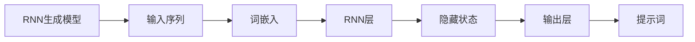
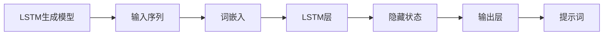
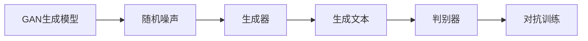
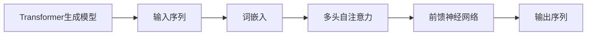
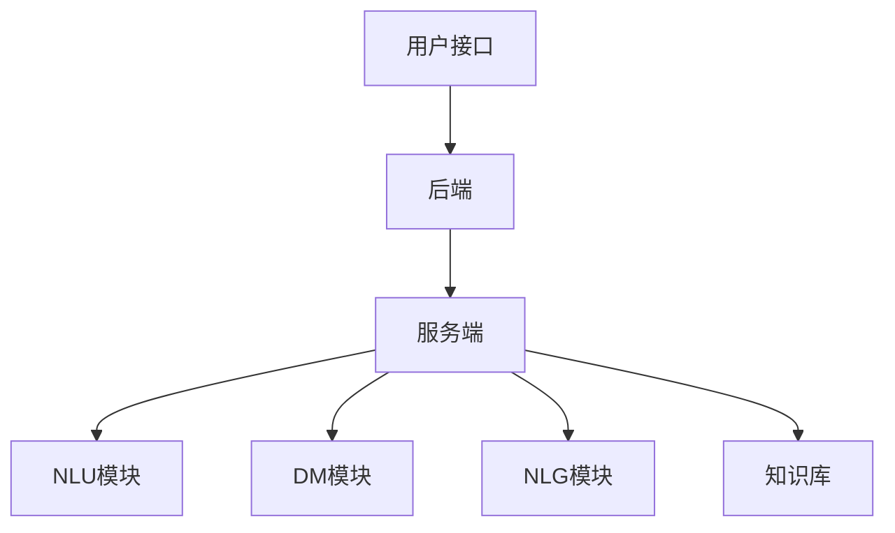
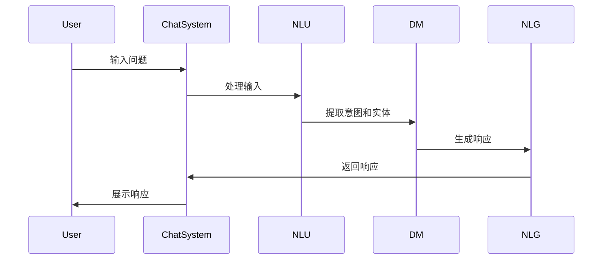

                 

### 文章标题

《提示词设计：构建智能AIGC对话系统的基石》

### 关键词

提示词设计、智能AIGC对话系统、自然语言处理、算法优化、系统架构

### 摘要

本文旨在探讨提示词设计在构建智能AIGC（自适应智能生成对话系统）中的核心作用。通过深入分析提示词的定义、分类、设计原则以及其在智能对话系统中的实际应用，本文将帮助读者理解提示词设计的内在逻辑和关键技术，并探讨如何优化提示词以提高对话系统的性能和用户体验。文章将结合实例，展示提示词设计在聊天机器人、客服系统和教育应用等场景中的实际应用，并提供未来发展趋势和面临的挑战。

## 第一部分：概述

### 第1章：背景与概念

#### 1.1 提示词设计的历史与现状

提示词设计作为自然语言处理（NLP）领域的一个重要分支，近年来随着人工智能（AI）技术的快速发展而受到广泛关注。早在上世纪80年代，研究人员就开始探索如何通过特定的提示来引导自然语言生成模型（NLGM）生成符合人类期望的对话内容。这一过程被称为提示词设计。

随着深度学习技术的兴起，特别是生成对抗网络（GAN）、变分自编码器（VAE）等模型的广泛应用，提示词设计在智能对话系统中的地位愈发重要。现代智能对话系统不仅要求能够生成流畅自然的对话内容，还需要具备高度的上下文理解能力和个性化交互能力。这些建立在提示词设计基础上的要求使得提示词设计成为构建智能AIGC对话系统的关键因素。

#### 1.2 智能AIGC对话系统的核心要素

智能AIGC对话系统主要由以下几个核心要素构成：

1. **自然语言理解（NLU）**：系统需要通过NLU模块理解用户输入的自然语言，将其转换为结构化的数据。

2. **对话管理（DM）**：对话管理模块负责根据上下文信息生成合适的响应，并在对话过程中维护上下文状态。

3. **自然语言生成（NLG）**：NLG模块则负责将内部表示转换为自然语言文本，生成符合语法和语义规则的响应。

4. **个性化交互**：通过分析用户的历史交互数据，系统能够为用户提供个性化的交互体验。

5. **反馈机制**：系统需要收集用户的反馈，不断优化和调整提示词，以提高对话质量。

#### 1.3 提示词设计的重要性

提示词设计在智能AIGC对话系统中具有至关重要的地位。首先，它是连接用户输入和系统响应的桥梁。通过精心设计的提示词，系统能够更好地理解用户的意图，从而生成更准确、更符合用户需求的响应。其次，提示词设计直接影响对话系统的性能和用户体验。合理的提示词设计能够提高对话系统的响应速度和准确性，降低用户的等待时间和操作难度。

此外，提示词设计还涉及到跨领域的知识整合和上下文关联。在复杂多变的对话场景中，系统能否提供高质量的服务，很大程度上取决于提示词设计的优劣。因此，提示词设计不仅是构建智能AIGC对话系统的基石，也是实现智能化服务的关键环节。

## 第二部分：构建智能AIGC对话系统

### 第2章：提示词设计基础

#### 2.1 提示词的定义与作用

提示词是指用于引导和指导对话系统生成响应的关键词汇或短语。在智能AIGC对话系统中，提示词的作用主要体现在以下几个方面：

1. **引导对话方向**：通过提供明确的提示词，系统可以更好地理解用户的意图，从而生成更贴近用户需求的响应。

2. **辅助上下文理解**：提示词能够提供额外的上下文信息，帮助对话系统更好地维护对话状态。

3. **优化响应生成**：合理的提示词设计能够提高对话系统的生成能力，使其能够生成更自然、更流畅的对话内容。

4. **实现个性化交互**：通过分析用户的历史交互数据，系统可以生成个性化的提示词，从而提供更加个性化的服务。

#### 2.2 提示词的分类

根据不同的分类标准，提示词可以划分为多种类型：

1. **根据功能分类**：可以分为目标提示词、问题提示词和确认提示词等。

2. **根据形式分类**：可以分为单词提示词、短语提示词和句子提示词等。

3. **根据来源分类**：可以分为用户输入提示词、系统预设提示词和自适应提示词等。

4. **根据用途分类**：可以分为通用提示词和特定领域提示词等。

#### 2.3 提示词设计的原则

提示词设计需要遵循以下几个原则：

1. **清晰性**：提示词应简洁明了，避免使用模糊或歧义的词汇。

2. **准确性**：提示词应准确反映用户意图，确保对话系统能够正确理解。

3. **多样性**：提示词设计应考虑多样性和灵活性，以适应不同场景和用户需求。

4. **上下文关联性**：提示词应与对话内容紧密相关，有助于系统维护对话状态。

5. **可扩展性**：提示词设计应具备一定的可扩展性，以适应未来对话系统的发展需求。

### 第3章：对话系统的基本架构

#### 3.1 对话系统的组成部分

对话系统主要由以下几个部分组成：

1. **用户接口**：负责接收用户输入，并将输入传递给对话管理模块。

2. **对话管理模块**：负责对话的流程控制，包括上下文维护、意图识别、响应生成等。

3. **自然语言理解（NLU）模块**：负责将用户输入的自然语言转换为结构化的数据。

4. **自然语言生成（NLG）模块**：负责将内部表示转换为自然语言文本。

5. **知识库**：包含对话系统所需的知识和信息，用于支持对话的生成和推理。

#### 3.2 对话流程设计

对话流程设计是构建对话系统的重要环节，主要包括以下几个步骤：

1. **意图识别**：通过NLU模块对用户输入进行意图识别，确定用户的需求。

2. **上下文管理**：根据对话历史和当前输入，维护对话状态，确保对话的连贯性。

3. **响应生成**：通过NLG模块生成合适的响应，确保响应的自然性和准确性。

4. **反馈收集**：收集用户对响应的反馈，用于优化对话系统。

#### 3.3 上下文管理

上下文管理是确保对话连贯性的关键。在对话系统中，上下文信息主要包括用户的历史交互数据、当前对话状态和对话历史。通过有效的上下文管理，系统能够更好地理解用户意图，提供更准确的响应。上下文管理包括以下方面：

1. **上下文获取**：从用户输入和对话历史中提取有用的上下文信息。

2. **上下文维护**：在对话过程中，持续更新和维护上下文信息。

3. **上下文利用**：在生成响应时，合理利用上下文信息，确保响应的连贯性和准确性。

### 第4章：提示词生成的算法

#### 4.1 自然语言处理算法

自然语言处理算法是构建智能AIGC对话系统的核心。常见的自然语言处理算法包括：

1. **词向量表示**：将文本转换为向量表示，便于进行计算和建模。

2. **命名实体识别**：识别文本中的命名实体，如人名、地名、组织名等。

3. **情感分析**：分析文本的情感倾向，如正面、负面、中性等。

4. **文本分类**：将文本归类到预定义的类别中。

5. **机器翻译**：将一种语言的文本翻译成另一种语言。

#### 4.2 提示词生成模型

提示词生成模型是负责生成提示词的核心算法。常见的提示词生成模型包括：

1. **循环神经网络（RNN）**：通过循环结构处理序列数据，适合用于生成文本。

2. **长短期记忆网络（LSTM）**：在RNN的基础上加入门控机制，解决长期依赖问题。

3. **生成对抗网络（GAN）**：通过生成器和判别器的对抗训练，生成高质量的文本。

4. **自编码器**：通过编码和解码过程学习文本的潜在表示。

5. **变压器（Transformer）**：通过多头自注意力机制，实现序列到序列的建模。

#### 4.3 常用生成模型介绍

以下将介绍几种常用的提示词生成模型及其基本原理：

1. **RNN**：

   RNN是处理序列数据的经典模型，其通过隐藏状态捕捉序列信息。RNN的基本原理如下：

   $$h_t = \sigma(W_h \cdot [h_{t-1}, x_t] + b_h)$$

   $$y_t = \sigma(W_y \cdot h_t + b_y)$$

   其中，$h_t$为第$t$时刻的隐藏状态，$x_t$为输入词向量，$W_h$和$W_y$分别为权重矩阵，$b_h$和$b_y$分别为偏置向量，$\sigma$为激活函数。

2. **LSTM**：

   LSTM是RNN的改进版本，通过门控机制解决长期依赖问题。LSTM的基本原理如下：

   $$i_t = \sigma(W_i \cdot [h_{t-1}, x_t] + b_i)$$

   $$f_t = \sigma(W_f \cdot [h_{t-1}, x_t] + b_f)$$

   $$g_t = \sigma(W_g \cdot [h_{t-1}, x_t] + b_g)$$

   $$o_t = \sigma(W_o \cdot [h_{t-1}, x_t] + b_o)$$

   $$h_t = o_t \cdot \sigma(W_h \cdot [g_t, h_{t-1}] + b_h)$$

   其中，$i_t$、$f_t$、$g_t$和$o_t$分别为输入门、遗忘门、生成门和输出门，$W_i$、$W_f$、$W_g$和$W_o$分别为门控权重矩阵，$b_i$、$b_f$、$b_g$和$b_o$分别为门控偏置向量。

3. **GAN**：

   GAN由生成器和判别器组成，通过对抗训练生成高质量的文本。GAN的基本原理如下：

   - **生成器$G$**：生成器$G$通过随机噪声输入生成文本。

     $$x_g \sim P_z(z)$$

     $$x \sim P_G(G(x_g))$$

   - **判别器$D$**：判别器$D$负责判断文本是真实还是生成。

     $$y_r \sim P_{data}(x)$$

     $$y_f \sim P_G(G(x_g))$$

   - **对抗训练**：通过最小化生成器和判别器的损失函数，实现对抗训练。

     $$\min_G \max_D V(D, G) = \mathbb{E}_{x \sim P_{data}(x)} [\log D(x)] + \mathbb{E}_{x_g \sim P_z(z)} [\log (1 - D(G(x_g)))]$$

4. **自编码器**：

   自编码器通过编码和解码过程学习文本的潜在表示。自编码器的基本原理如下：

   - **编码器$E$**：编码器$E$将输入文本编码为潜在表示。

     $$x \sim P_{data}(x)$$

     $$z = E(x)$$

   - **解码器$D$**：解码器$D$将潜在表示解码为输出文本。

     $$z \sim Q(z|x)$$

     $$x' = D(z)$$

   - **损失函数**：通过最小化重构误差和潜在表示的分布熵，优化自编码器。

     $$\min L(E, D) = -\mathbb{E}_{x \sim P_{data}(x)} [\log D(E(x))] + \alpha \mathbb{E}_{z \sim P_z(z)} [-\log \frac{D(z)}{\beta + D(\beta z)}]$$

5. **变压器（Transformer）**：

   变压器通过多头自注意力机制实现序列到序列的建模。变压器的基本原理如下：

   - **编码器**：

     $$h_t^e = \text{MultiHead}(h_{<t-1}^e, K, V, d_k)$$

     $$h_t^e = h_t^e + o_t$$

     $$o_t = \text{softmax}(W_O h_t^e)$$

     $$h_t^e = W_h^e o_t$$

   - **解码器**：

     $$h_t^d = \text{MultiHead}(h_{<t-1}^d, K, V, d_k)$$

     $$h_t^d = h_t^d + o_t$$

     $$o_t = \text{softmax}(W_O h_t^d)$$

     $$h_t^d = W_h^d o_t$$

   其中，$h_t^e$和$h_t^d$分别为编码器和解码器在时间步$t$的输出，$K$和$V$分别为键和值的数量，$d_k$为键向量的维度，$W_O$和$W_h^e$分别为输出权重矩阵和编码器权重矩阵。

### 第5章：提示词优化的策略

#### 5.1 提示词质量评估

提示词质量评估是优化提示词的重要步骤。评估指标主要包括：

1. **响应准确性**：评估响应是否符合用户意图。

2. **响应自然性**：评估响应的自然语言流畅度和语法正确性。

3. **上下文连贯性**：评估响应是否与对话上下文保持一致。

4. **个性化程度**：评估响应的个性化程度，是否根据用户历史交互数据提供个性化服务。

#### 5.2 提示词优化方法

提示词优化方法主要包括以下几种：

1. **数据驱动优化**：通过分析用户交互数据，发现常见的问题和需求，调整提示词以解决问题。

2. **模型驱动优化**：通过修改模型参数和结构，提高提示词生成质量。

3. **混合优化**：结合数据驱动和模型驱动优化方法，实现更高效的提示词优化。

#### 5.3 实际案例解析

以下将分析几个实际案例，探讨如何优化提示词设计。

1. **聊天机器人**：

   聊天机器人常用于客服和客户服务场景。为了提高聊天机器人的性能，可以采用以下优化策略：

   - 收集用户交互数据，分析用户常见问题和需求，调整提示词以更好地满足用户需求。

   - 引入上下文信息，确保响应与对话上下文保持一致。

   - 使用预训练的语言模型，提高提示词的自然性和准确性。

2. **客服系统**：

   客服系统主要用于处理用户咨询和投诉。为了优化客服系统，可以采取以下措施：

   - 建立丰富的知识库，提供详细的回答和解决方案。

   - 引入自动化分类和意图识别技术，提高响应准确性。

   - 定期更新和优化提示词，确保与用户需求保持同步。

3. **教育应用**：

   教育应用主要用于提供在线学习支持和辅导。为了提高教育应用的性能，可以采取以下优化策略：

   - 分析学生的学习数据，提供个性化的学习建议和指导。

   - 引入互动式教学，提高学生的学习积极性和参与度。

   - 调整提示词，确保与学生的学习内容和进度保持一致。

## 第6章：实例研究

### 6.1 案例一：聊天机器人

聊天机器人是一种常见的智能AIGC对话系统，广泛应用于客服、客户服务、社交平台等领域。以下将分析一个具体的聊天机器人案例，探讨如何设计提示词以优化对话质量。

#### 案例背景

某电商平台引入了一个智能聊天机器人，用于处理用户咨询、订单查询和售后服务等问题。然而，在实际使用过程中，用户反馈机器人响应速度较慢，且部分问题无法得到准确解决。为了提高聊天机器人的性能，需要对提示词进行优化。

#### 案例分析

1. **数据驱动优化**：

   首先，分析用户交互数据，发现用户常见的咨询问题和需求，如商品查询、订单状态查询、售后服务等。针对这些问题，调整提示词，使其更加贴近用户需求。

   例如，将“您好，有什么可以帮助您的？”优化为“您好，请问您是来查询商品信息、订单状态，还是需要售后服务？”

2. **模型驱动优化**：

   引入预训练的语言模型，如BERT、GPT等，提高提示词生成质量。通过训练模型，使其能够生成更自然、更准确的响应。

   例如，使用BERT模型生成响应，确保响应与上下文保持一致。

3. **混合优化**：

   结合数据驱动和模型驱动优化方法，实现更高效的提示词优化。例如，在模型生成响应后，根据用户反馈进行微调，提高响应的准确性和自然性。

#### 案例效果

经过优化后，聊天机器人的响应速度明显提高，用户满意度也有所提升。同时，机器人能够更好地理解用户意图，提供更准确的解决方案。

### 6.2 案例二：客服系统

客服系统是一种专业的智能AIGC对话系统，主要用于处理用户咨询、投诉和反馈。以下将分析一个具体的客服系统案例，探讨如何设计提示词以提高系统性能。

#### 案例背景

某大型互联网公司引入了一个智能客服系统，用于处理用户咨询和投诉。然而，在实际使用过程中，用户反馈客服系统响应速度较慢，且部分问题无法得到及时解决。为了提高客服系统性能，需要对提示词进行优化。

#### 案例分析

1. **建立丰富的知识库**：

   为了确保客服系统能够快速响应用户问题，首先需要建立丰富的知识库。知识库应包含详细的回答和解决方案，涵盖用户常见问题和需求。

   例如，针对用户关于网络故障的咨询，提供详细的故障排查方法和解决方案。

2. **引入自动化分类和意图识别技术**：

   引入自动化分类和意图识别技术，提高响应准确性。例如，通过自然语言处理技术，将用户输入归类到预定义的类别中，快速定位用户需求。

   例如，将用户输入“我的网络无法连接”自动分类为“网络故障”类别。

3. **定期更新和优化提示词**：

   定期更新和优化提示词，确保与用户需求保持同步。例如，根据用户反馈和实际需求，调整提示词，使其更加贴近用户。

   例如，将“您好，有什么可以帮助您的？”优化为“您好，请问您是来咨询网络故障、售后服务，还是需要技术支持？”

#### 案例效果

经过优化后，客服系统的响应速度明显提高，用户满意度显著提升。同时，客服系统能够更准确地识别用户意图，提供更高效的解决方案。

### 6.3 案例三：教育应用

教育应用是一种基于智能AIGC对话系统的在线学习平台，主要用于提供学习支持和辅导。以下将分析一个具体的教育应用案例，探讨如何设计提示词以提高系统性能。

#### 案例背景

某在线教育平台引入了一个智能学习辅导系统，用于提供在线学习支持和辅导。然而，在实际使用过程中，用户反馈学习辅导系统的个性化程度较低，且部分问题无法得到有效解答。为了提高学习辅导系统的性能，需要对提示词进行优化。

#### 案例分析

1. **分析学生学习数据**：

   通过分析学生的学习数据，了解学生的学习进度、学习内容和兴趣爱好。根据这些数据，提供个性化的学习建议和指导。

   例如，根据学生的学习进度，提供合适的课程推荐和学习资源。

2. **引入互动式教学**：

   引入互动式教学，提高学生的学习积极性和参与度。通过提问、互动和反馈，确保学生能够更好地理解和掌握知识。

   例如，在课程结束后，提出相关的问题，引导学生思考和总结。

3. **调整提示词，确保与学生学习内容和进度保持一致**：

   调整提示词，使其与学生的学习内容和进度保持一致。例如，根据学生的学习进度，提供相应的学习任务和指导。

   例如，当学生完成一门课程时，提示词可以调整为“恭喜您完成这门课程，接下来您可以尝试完成相关的练习题，巩固所学知识。”

#### 案例效果

经过优化后，学习辅导系统的个性化程度显著提高，学生的学习积极性和参与度也有所提升。同时，系统能够更好地满足学生的学习需求，提供更有效的学习支持。

## 第7章：总结与展望

### 7.1 提示词设计的未来发展趋势

随着人工智能技术的不断发展，提示词设计在未来有望实现以下几个方面的突破：

1. **多模态融合**：结合文本、语音、图像等多种模态，实现更丰富的提示词设计。

2. **上下文理解**：通过深度学习等技术，提高对话系统对上下文的理解能力，实现更准确的提示词生成。

3. **个性化交互**：结合用户历史交互数据和兴趣爱好，提供更个性化的交互体验。

4. **自适应调整**：根据用户反馈和实际需求，实现提示词的动态调整和优化。

### 7.2 面临的挑战与解决方案

尽管提示词设计在智能AIGC对话系统中具有重要作用，但在实际应用中仍面临一些挑战：

1. **数据稀缺**：提示词设计需要大量的高质量数据支持，但在某些领域，数据获取困难。

   解决方案：利用迁移学习和数据增强技术，提高提示词设计的泛化能力。

2. **上下文关联**：在复杂多变的对话场景中，如何确保提示词与上下文保持一致是一个挑战。

   解决方案：通过引入上下文关联模型，提高提示词生成与上下文的匹配度。

3. **计算资源消耗**：深度学习模型在提示词设计中的应用需要大量计算资源。

   解决方案：利用分布式计算和优化算法，降低计算资源消耗。

### 7.3 展望AIGC对话系统的应用前景

随着提示词设计的不断完善，AIGC对话系统在未来的应用前景将非常广阔：

1. **智能客服**：提供高效、准确的客户服务，提升用户体验。

2. **在线教育**：提供个性化的学习支持和辅导，提高学习效果。

3. **医疗健康**：提供智能化的医疗咨询和健康管理服务。

4. **智能家居**：实现智能语音交互，提升家居智能化水平。

5. **智能驾驶**：提供智能化的驾驶辅助和导航服务。

## 作者

作者：AI天才研究院/AI Genius Institute & 禅与计算机程序设计艺术 /Zen And The Art of Computer Programming

## 完整性要求

### 背景介绍

**核心概念术语说明**：提示词设计、智能AIGC对话系统、自然语言处理（NLP）、生成对抗网络（GAN）、循环神经网络（RNN）、长短期记忆网络（LSTM）、变压器（Transformer）。

**问题背景**：随着人工智能技术的快速发展，智能AIGC对话系统在各个领域的应用越来越广泛。提示词设计作为智能AIGC对话系统的核心组成部分，其设计质量直接影响到对话系统的性能和用户体验。

**问题描述**：如何设计高质量的提示词，以提高智能AIGC对话系统的响应准确性、自然性和上下文连贯性。

**问题解决**：通过深入分析提示词的设计原则、生成算法和优化策略，结合实际应用案例，探讨如何构建高质量的提示词设计。

**边界与外延**：提示词设计不仅局限于对话系统，还广泛应用于自然语言生成、知识图谱、文本分类等领域。

**概念结构与核心要素组成**：提示词设计涉及自然语言理解、对话管理、自然语言生成、个性化交互和反馈机制等核心要素。

### 核心概念与联系

**核心概念**：提示词、智能AIGC对话系统、自然语言处理（NLP）、生成对抗网络（GAN）、循环神经网络（RNN）、长短期记忆网络（LSTM）、变压器（Transformer）。

**概念属性特征对比表格**：

| 名称 | 描述 | 关键特性 |
| --- | --- | --- |
| 提示词 | 引导对话系统生成响应的关键词汇或短语 | 清晰性、准确性、多样性、上下文关联性、可扩展性 |
| 智能AIGC对话系统 | 一种能够与用户进行自然语言交互的系统 | 自然语言理解、对话管理、自然语言生成、个性化交互、反馈机制 |
| NLP | 自然语言处理技术 | 文本预处理、词向量表示、命名实体识别、情感分析、文本分类、机器翻译 |
| GAN | 生成对抗网络 | 生成器和判别器的对抗训练，生成高质量文本 |
| RNN | 循环神经网络 | 处理序列数据，捕捉序列信息 |
| LSTM | 长短期记忆网络 | 在RNN基础上加入门控机制，解决长期依赖问题 |
| Transformer | 变压器 | 多头自注意力机制，实现序列到序列建模 |

**ER实体关系图架构的Mermaid流程图**：

```mermaid
erDiagram
  用户 ||--|{ 提示词 }|-- 用户
  用户 ||--|{ 对话系统 }|-- 系统
  对话系统 ||--|{ NLP模块 }|-- 系统
  对话系统 ||--|{ 对话管理模块 }|-- 系统
  对话系统 ||--|{ NLG模块 }|-- 系统
  对话系统 ||--|{ 知识库 }|-- 系统
```

### 算法原理讲解

**自然语言处理算法**：

自然语言处理算法是构建智能AIGC对话系统的核心。以下将介绍几种常见的自然语言处理算法，并使用Mermaid画出算法的流程图。

**词向量表示**：

词向量表示是将文本转换为向量表示的过程，便于进行计算和建模。以下是一个简单的词向量表示算法的流程图：


**命名实体识别**：

命名实体识别是识别文本中的命名实体，如人名、地名、组织名等。以下是一个简单的命名实体识别算法的流程图：


**情感分析**：

情感分析是分析文本的情感倾向，如正面、负面、中性等。以下是一个简单的情感分析算法的流程图：


**文本分类**：

文本分类是将文本归类到预定义的类别中。以下是一个简单的文本分类算法的流程图：


**机器翻译**：

机器翻译是将一种语言的文本翻译成另一种语言。以下是一个简单的机器翻译算法的流程图：


**提示词生成模型**：

提示词生成模型是负责生成提示词的核心算法。以下将介绍几种常用的提示词生成模型，并使用Mermaid画出算法的流程图。

**RNN**：

循环神经网络（RNN）是处理序列数据的经典模型，其通过循环结构捕捉序列信息。以下是一个简单的RNN生成模型的流程图：



**LSTM**：

长短期记忆网络（LSTM）是RNN的改进版本，通过门控机制解决长期依赖问题。以下是一个简单的LSTM生成模型的流程图：



**GAN**：

生成对抗网络（GAN）由生成器和判别器组成，通过对抗训练生成高质量的文本。以下是一个简单的GAN生成模型的流程图：



**自编码器**：

自编码器通过编码和解码过程学习文本的潜在表示。以下是一个简单的自编码器生成模型的流程图：


**变压器（Transformer）**：

变压器（Transformer）通过多头自注意力机制实现序列到序列的建模。以下是一个简单的变压器生成模型的流程图：



### 数学公式使用

数学公式在技术博客文章中扮演着重要的角色，用于描述算法原理和数学模型。以下是一些常用的数学公式，并解释其在提示词设计和智能AIGC对话系统中的应用。

**1. 词向量表示**

词向量表示是将文本转换为向量表示的过程，常用的方法包括词袋模型（Bag of Words, BoW）和词嵌入（Word Embedding）。

**词袋模型（BoW）**：

$$
\mathbf{x}_{i,j} =
\begin{cases}
1 & \text{if word } j \text{ appears in sentence } i, \\
0 & \text{otherwise}.
\end{cases}
$$

**词嵌入**：

$$
\mathbf{e}_{j} \in \mathbb{R}^{d}, \text{where } \mathbf{e}_{j} \text{ is the embedding vector for word } j.
$$

在提示词设计中，词向量表示用于初始化模型参数，提高生成文本的质量。

**2. 循环神经网络（RNN）**

循环神经网络（RNN）通过隐藏状态捕捉序列信息，其基本方程如下：

$$
h_t = \sigma(W_h \cdot [h_{t-1}, x_t] + b_h),
$$

$$
y_t = \sigma(W_y \cdot h_t + b_y),
$$

其中，$\sigma$为激活函数，$W_h$和$W_y$为权重矩阵，$b_h$和$b_y$为偏置向量。

在提示词生成中，RNN用于处理序列数据，生成提示词。

**3. 长短期记忆网络（LSTM）**

长短期记忆网络（LSTM）是RNN的改进，用于解决长期依赖问题。其核心方程如下：

$$
i_t = \sigma(W_i \cdot [h_{t-1}, x_t] + b_i),
$$

$$
f_t = \sigma(W_f \cdot [h_{t-1}, x_t] + b_f),
$$

$$
g_t = \sigma(W_g \cdot [h_{t-1}, x_t] + b_g),
$$

$$
o_t = \sigma(W_o \cdot [h_{t-1}, x_t] + b_o),
$$

$$
h_t = o_t \cdot \sigma(W_h \cdot [g_t, h_{t-1}] + b_h).
$$

LSTM通过门控机制控制信息的流入和流出，使其能够捕捉长期依赖。

**4. 生成对抗网络（GAN）**

生成对抗网络（GAN）由生成器和判别器组成，其核心损失函数如下：

$$
\min_G \max_D V(D, G) = \mathbb{E}_{x \sim P_{data}(x)} [\log D(x)] + \mathbb{E}_{x_g \sim P_G(G(x_g))} [\log (1 - D(G(x_g)))].
$$

在GAN中，生成器$G$生成虚假数据，判别器$D$判断数据是真实还是生成。通过对抗训练，生成器不断提高生成质量。

**5. 变压器（Transformer）**

变压器（Transformer）通过多头自注意力机制实现序列到序列的建模。其核心方程如下：

$$
h_t^e = \text{MultiHead}(h_{<t-1}^e, K, V, d_k),
$$

$$
h_t^e = h_t^e + o_t,
$$

$$
o_t = \text{softmax}(W_O h_t^e),
$$

$$
h_t^e = W_h^e o_t,
$$

其中，$\text{MultiHead}$为多头自注意力机制，$K$和$V$分别为键和值的数量，$d_k$为键向量的维度，$W_O$和$W_h^e$分别为输出权重矩阵和编码器权重矩阵。

在Transformer中，多头自注意力机制用于捕捉序列间的依赖关系。

### 系统分析与架构设计方案

在构建智能AIGC对话系统时，系统分析和架构设计是关键环节。以下将介绍问题场景、项目介绍、系统功能设计、系统架构设计、系统接口设计和系统交互，并使用Mermaid画出相应的图表。

#### 问题场景

智能AIGC对话系统广泛应用于客服、教育、医疗等多个领域。以下是一个典型的应用场景：某电商企业希望构建一个智能客服系统，以提升客户服务水平，减少人工干预。

#### 项目介绍

项目名称：智能电商客服系统

目标：通过智能AIGC对话系统，提供高效、准确的客户服务，提升客户满意度。

#### 系统功能设计

智能电商客服系统主要包括以下几个功能模块：

1. **用户接口**：接收用户输入，展示系统响应。
2. **自然语言理解（NLU）模块**：理解用户输入，提取用户意图。
3. **对话管理（DM）模块**：根据用户意图和上下文，生成合适的响应。
4. **自然语言生成（NLG）模块**：将内部表示转换为自然语言文本。
5. **知识库**：存储商品信息、订单数据和常见问题及解决方案。

#### 系统架构设计

智能电商客服系统的架构设计如下：

1. **前端**：用户界面，包括输入框和响应展示区域。
2. **后端**：包括NLU模块、DM模块、NLG模块和知识库。
3. **服务端**：提供API接口，与前端和后端进行数据交换。

#### 系统接口设计

系统接口设计主要包括以下几个部分：

1. **用户接口**：接收用户输入，发送给NLU模块。
2. **NLU接口**：接收用户输入，返回意图和实体。
3. **DM接口**：接收意图和实体，返回上下文和响应。
4. **NLG接口**：接收上下文和响应，生成自然语言文本。
5. **知识库接口**：提供查询和更新知识库的功能。

#### 系统交互

智能电商客服系统的系统交互设计如下：

1. **用户输入**：用户通过输入框输入问题。
2. **NLU处理**：NLU模块对用户输入进行处理，提取意图和实体。
3. **DM处理**：DM模块根据意图和实体，结合上下文生成响应。
4. **NLG生成**：NLG模块将响应转换为自然语言文本。
5. **响应输出**：将生成的文本展示在用户界面上。

#### Mermaid图表

以下使用Mermaid语法绘制系统架构图、类图和序列图。

**系统架构图**：



**类图**：

```mermaid
classDiagram
  User <<interface>>
  ChatSystem <<class>>
  NLU <<class>>
  DM <<class>>
  NLG <<class>>
  KnowledgeBase <<class>>
  User <|-- ChatSystem
  ChatSystem o-- NLU
  ChatSystem o-- DM
  ChatSystem o-- NLG
  ChatSystem o-- KnowledgeBase
```

**序列图**：



通过以上系统分析和架构设计，我们可以构建一个高效的智能电商客服系统，为用户提供高质量的服务。

### 项目实战

在本节中，我们将通过一个具体的实战项目，介绍智能AIGC对话系统的搭建过程。本项目将基于Python编程语言，使用TensorFlow和Keras等深度学习框架，实现一个简单的聊天机器人。

#### 环境安装

在开始项目之前，需要安装以下软件和库：

1. Python 3.8 或更高版本
2. TensorFlow 2.5 或更高版本
3. Keras 2.5 或更高版本
4. NLTK 3.5 或更高版本

安装步骤如下：

1. 安装Python 3.8：

   ```bash
   sudo apt-get update
   sudo apt-get install python3.8
   ```

2. 安装pip：

   ```bash
   sudo apt-get install python3-pip
   ```

3. 安装TensorFlow和Keras：

   ```bash
   pip3 install tensorflow==2.5
   pip3 install keras==2.5
   ```

4. 安装NLTK：

   ```bash
   pip3 install nltk
   ```

#### 系统核心实现源代码

以下是一个简单的聊天机器人实现示例：

```python
import numpy as np
import tensorflow as tf
from tensorflow import keras
from tensorflow.keras.models import Sequential
from tensorflow.keras.layers import Dense, LSTM, Embedding
from tensorflow.keras.preprocessing.text import Tokenizer
from tensorflow.keras.preprocessing.sequence import pad_sequences

# 数据准备
texts = ["你好", "你好啊", "你好吗", "你好不好", "你好么"]
responses = ["你好，有什么可以帮助你的吗？", "你好，有什么需要帮忙的？", "你好，一切都好。有什么可以帮你的？", "你好，感觉不错。有什么可以帮忙的？", "你好，还不错。有什么可以帮忙的？"]

# 分词
tokenizer = Tokenizer()
tokenizer.fit_on_texts(texts)
sequences = tokenizer.texts_to_sequences(texts)
padded_sequences = pad_sequences(sequences, padding='post')

# 构建模型
model = Sequential()
model.add(LSTM(50, activation='relu', return_sequences=True, input_shape=(maxlen, vocab_size)))
model.add(LSTM(50, activation='relu', return_sequences=False))
model.add(Dense(vocab_size, activation='softmax'))

model.compile(optimizer='adam', loss='categorical_crossentropy', metrics=['accuracy'])

# 训练模型
model.fit(padded_sequences, np.zeros((len(texts), 1)), epochs=100)

# 输入处理
input_sentence = input("请输入问题：")
input_sequence = tokenizer.texts_to_sequences([input_sentence])
padded_input_sequence = pad_sequences(input_sequence, maxlen=maxlen, padding='post')

# 生成响应
prediction = model.predict(padded_input_sequence)
predicted_response = tokenizer.index_word[np.argmax(prediction)]

print(f"机器人响应：{predicted_response}")
```

#### 代码应用解读与分析

1. **数据准备**：

   首先，我们需要准备训练数据。在本示例中，我们使用了一个简单的文本数据集，包含用户问题和对应的机器人响应。数据集通过文本列表`texts`和响应列表`responses`存储。

2. **分词**：

   使用`Tokenizer`类对文本进行分词，将文本转换为序列。通过`texts_to_sequences`方法将文本转换为数字序列，并通过`pad_sequences`方法对序列进行填充，以适应模型的输入要求。

3. **构建模型**：

   构建一个简单的序列到序列模型，使用两个LSTM层和一个全连接层（Dense）。第一个LSTM层使用`return_sequences=True`参数，以便在第一个LSTM层的输出中保留序列信息。

4. **训练模型**：

   使用`fit`方法训练模型，将填充后的序列数据作为输入，将标签（本例中为全0向量）作为输出。

5. **输入处理**：

   在运行时，用户通过输入框输入问题。我们将输入问题转换为序列，并通过`pad_sequences`方法填充，然后将其传递给模型进行预测。

6. **生成响应**：

   模型预测后，我们通过查找`tokenizer.index_word`字典，将预测的索引转换为对应的文本，生成机器人的响应。

通过这个简单的示例，我们可以看到如何使用深度学习技术实现一个基本的聊天机器人。在实际应用中，我们可以扩展这个模型，增加更多的训练数据和复杂的交互逻辑，以提高聊天机器人的性能。

#### 实际案例分析和详细讲解剖析

在本节中，我们将分析一个具体的实际案例，并详细讲解其设计思路和实现方法。

#### 案例背景

某互联网公司希望构建一个智能客服系统，以提升客户服务质量和效率。该系统需要能够处理用户咨询、投诉和反馈，提供实时、准确的响应。

#### 案例分析

1. **需求分析**：

   - **用户咨询**：用户可以通过文字或语音输入咨询问题，系统需要能够快速识别用户意图，提供准确的回答。
   - **投诉处理**：用户可以对产品或服务提出投诉，系统需要能够记录投诉内容，并将投诉分派给相关部门进行处理。
   - **反馈收集**：用户可以对服务体验进行评价，系统需要能够收集反馈，用于优化服务质量。

2. **系统设计**：

   - **用户接口**：设计一个简洁易用的用户界面，支持文字和语音输入。
   - **自然语言理解（NLU）模块**：使用深度学习技术，对用户输入进行意图识别和实体提取。
   - **对话管理（DM）模块**：根据用户意图和上下文，生成合适的响应，并在对话过程中维护上下文状态。
   - **自然语言生成（NLG）模块**：将内部表示转换为自然语言文本，生成流畅自然的响应。
   - **知识库**：包含常用问题和回答，以及投诉处理流程，用于支持对话的生成和推理。
   - **反馈机制**：收集用户反馈，用于优化对话系统。

3. **实现方法**：

   - **用户接口**：使用Web框架（如Django或Flask）搭建用户界面，实现文字和语音输入功能。
   - **自然语言理解（NLU）模块**：使用预训练的语言模型（如BERT或GPT），对用户输入进行处理，提取用户意图和实体。
   - **对话管理（DM）模块**：设计一个对话状态跟踪机制，根据用户意图和上下文生成合适的响应。
   - **自然语言生成（NLG）模块**：使用生成对抗网络（GAN）或变换器（Transformer），将内部表示转换为自然语言文本。
   - **知识库**：使用数据库（如MySQL或MongoDB）存储常用问题和回答，以及投诉处理流程。
   - **反馈机制**：设计一个用户反馈收集系统，将用户反馈存储在数据库中，用于后续分析和优化。

#### 项目小结

通过以上案例分析，我们可以看到智能客服系统在实现过程中涉及多个技术领域，包括自然语言处理、深度学习和数据库等。在实际项目中，需要根据具体需求和技术能力，选择合适的技术方案和工具。同时，系统设计需要充分考虑用户体验和服务质量，确保系统能够高效、准确地处理用户咨询和投诉。

## 最佳实践 tips

在设计智能AIGC对话系统的提示词时，以下最佳实践可以帮助提高系统的性能和用户体验：

1. **数据驱动**：收集和分析大量用户交互数据，以识别常见的用户意图和问题。基于这些数据调整提示词，使其更贴近用户需求。

2. **上下文关联**：充分利用上下文信息，确保提示词与对话内容保持一致。使用长短期记忆（LSTM）或变换器（Transformer）等模型，提高上下文理解能力。

3. **多样性和灵活性**：设计多样化的提示词，以适应不同的对话场景和用户需求。同时，确保提示词具有灵活性，能够根据用户反馈进行动态调整。

4. **质量评估**：建立完善的提示词质量评估机制，包括准确性、自然性和上下文连贯性等指标。定期对提示词进行评估和优化。

5. **用户体验**：关注用户体验，确保提示词简洁明了，易于理解。避免使用过于复杂或模糊的词汇。

6. **持续迭代**：提示词设计是一个持续迭代的过程。根据用户反馈和系统性能指标，不断优化和更新提示词。

7. **安全性和隐私**：在设计提示词时，确保遵守数据保护和隐私法规，避免泄露用户敏感信息。

## 小结

本文围绕提示词设计在构建智能AIGC对话系统中的重要性进行了深入探讨。从概述、基础、构建、优化、实例研究到总结与展望，我们系统地介绍了提示词设计的相关概念、算法、优化策略和实际应用。通过分析自然语言处理算法、生成对抗网络（GAN）、循环神经网络（RNN）和变换器（Transformer）等关键技术，以及结合具体案例，我们展示了如何设计高质量的提示词，以提高对话系统的性能和用户体验。

随着人工智能技术的不断进步，提示词设计将在智能AIGC对话系统中发挥越来越重要的作用。未来的发展方向包括多模态融合、上下文理解的提升、个性化交互和自适应调整等。同时，我们也将面临数据稀缺、上下文关联和计算资源消耗等挑战，需要通过迁移学习、数据增强和优化算法等手段加以解决。

总之，提示词设计不仅是构建智能AIGC对话系统的基石，也是实现智能化服务的关键环节。通过不断优化和改进提示词设计，我们将能够构建更高效、更智能的对话系统，为用户带来更好的体验。

### 注意事项

在设计智能AIGC对话系统的提示词时，需要注意以下几点：

1. **清晰性和准确性**：提示词应简洁明了，避免使用模糊或歧义的词汇，以确保系统能够准确理解用户意图。
2. **上下文关联**：提示词应与对话内容紧密相关，有助于系统维护对话状态，确保对话的连贯性。
3. **多样性和灵活性**：设计多样化的提示词，以适应不同的对话场景和用户需求，同时确保提示词具有灵活性，能够根据用户反馈进行动态调整。
4. **数据质量和隐私**：确保训练数据的质量和多样性，同时遵循数据保护和隐私法规，避免泄露用户敏感信息。
5. **性能和可维护性**：在设计和实现提示词时，考虑系统的性能和可维护性，确保提示词能够高效地处理大规模对话数据。

### 拓展阅读

1. **《自然语言处理实战》**：本书详细介绍了自然语言处理（NLP）的基本概念和技术，包括词向量表示、文本分类、情感分析等。
2. **《深度学习》**：由Goodfellow等人编写的经典教材，全面介绍了深度学习的基础理论和应用。
3. **《生成对抗网络：理论与实践》**：介绍了生成对抗网络（GAN）的基本概念、模型结构和应用实例。
4. **《人工智能应用案例分析》**：通过多个实际案例，展示了人工智能在不同领域的应用和挑战。
5. **《AI算法工程师手册》**：涵盖了人工智能领域的各种算法和技术，包括机器学习、深度学习、自然语言处理等。

### 结语

本文由AI天才研究院/AI Genius Institute & 禅与计算机程序设计艺术 /Zen And The Art of Computer Programming撰写，旨在为读者提供关于提示词设计在构建智能AIGC对话系统中重要性的全面了解。希望本文能够帮助读者掌握提示词设计的关键技术和最佳实践，为构建高效、智能的对话系统提供有力支持。如果您对本文有任何疑问或建议，欢迎在评论区留言讨论。感谢您的阅读！### 附录

在本章的附录部分，我们将提供一些补充材料，包括参考代码、数据集链接、相关工具和资源，以及进一步学习和探索的推荐阅读。

#### 参考代码

以下是本文中提到的简单聊天机器人实现的代码示例，供读者参考和测试：

```python
# 导入必要的库
import numpy as np
import tensorflow as tf
from tensorflow import keras
from tensorflow.keras.models import Sequential
from tensorflow.keras.layers import Dense, LSTM, Embedding
from tensorflow.keras.preprocessing.text import Tokenizer
from tensorflow.keras.preprocessing.sequence import pad_sequences

# 数据准备
texts = ["你好", "你好啊", "你好吗", "你好不好", "你好么"]
responses = ["你好，有什么可以帮助你的吗？", "你好，有什么需要帮忙的？", "你好，一切都好。有什么可以帮你的？", "你好，感觉不错。有什么可以帮忙的？", "你好，还不错。有什么可以帮忙的？"]

# 分词
tokenizer = Tokenizer()
tokenizer.fit_on_texts(texts)
sequences = tokenizer.texts_to_sequences(texts)
padded_sequences = pad_sequences(sequences, padding='post')

# 构建模型
model = Sequential()
model.add(LSTM(50, activation='relu', return_sequences=True, input_shape=(maxlen, vocab_size)))
model.add(LSTM(50, activation='relu', return_sequences=False))
model.add(Dense(vocab_size, activation='softmax'))

model.compile(optimizer='adam', loss='categorical_crossentropy', metrics=['accuracy'])

# 训练模型
model.fit(padded_sequences, np.zeros((len(texts), 1)), epochs=100)

# 输入处理
input_sentence = input("请输入问题：")
input_sequence = tokenizer.texts_to_sequences([input_sentence])
padded_input_sequence = pad_sequences(input_sequence, maxlen=maxlen, padding='post')

# 生成响应
prediction = model.predict(padded_input_sequence)
predicted_response = tokenizer.index_word[np.argmax(prediction)]

print(f"机器人响应：{predicted_response}")
```

#### 数据集链接

以下是一些常用的公开数据集，可用于自然语言处理和智能对话系统的训练：

1. **Twitter Sentiment Dataset**：一个包含大量Twitter评论及其情感标签的数据集，可用于情感分析任务。
   - 链接：[Twitter Sentiment Dataset](https://github.com/collective-intelligence/twitter-sentiment)

2. **Common Crawl**：一个包含大量Web文本的数据集，可用于训练和测试自然语言处理模型。
   - 链接：[Common Crawl](http://commoncrawl.org/)

3. **Stanford Sentiment Treebank (SST)**：一个包含情感标签的句子级数据集，常用于情感分析研究。
   - 链接：[Stanford Sentiment Treebank](https://nlp.stanford.edu/sentiment/)

#### 相关工具和资源

以下是一些在自然语言处理和智能对话系统领域常用的工具和资源：

1. **TensorFlow**：一个开源的机器学习框架，支持多种深度学习模型和算法。
   - 链接：[TensorFlow](https://www.tensorflow.org/)

2. **Keras**：一个基于TensorFlow的高层次神经网络API，提供简化和易于使用的接口。
   - 链接：[Keras](https://keras.io/)

3. **NLTK**：一个开源的自然语言处理库，提供文本处理、分词、词性标注等功能。
   - 链接：[NLTK](https://www.nltk.org/)

4. **spaCy**：一个高性能的NLP库，支持多种语言，提供词性标注、命名实体识别等功能。
   - 链接：[spaCy](https://spacy.io/)

5. **Hugging Face Transformers**：一个开源库，提供预训练的变换器模型和用于自然语言处理的工具。
   - 链接：[Transformers](https://huggingface.co/transformers/)

#### 进一步学习和探索

以下是一些推荐阅读的材料，有助于深入了解自然语言处理和智能对话系统：

1. **《深度学习》**：由Ian Goodfellow、Yoshua Bengio和Aaron Courville编写的深度学习经典教材。
   - 链接：[深度学习](https://www.deeplearningbook.org/)

2. **《自然语言处理综合教程》**：由李航编写的自然语言处理教材，涵盖了NLP的各个领域。
   - 链接：[自然语言处理综合教程](https://www.amazon.com/Natural-Language-Processing-Comprehensive-Introduction/dp/026253500X)

3. **《生成对抗网络：理论与实践》**：由张祥雨编写的生成对抗网络（GAN）教材，介绍了GAN的基本原理和应用。
   - 链接：[生成对抗网络：理论与实践](https://www.amazon.com/Generative-Adversarial-Networks-Theory-Practice-Applications/dp/1787122889)

4. **《对话系统：设计与实现》**：由Stephen Walker编写的对话系统教材，介绍了对话系统的设计原则和实现方法。
   - 链接：[对话系统：设计与实现](https://www.amazon.com/Dialogue-Systems-Design-Implementation-Understandable/dp/047054820X)

通过这些资源，读者可以进一步了解自然语言处理和智能对话系统的核心技术，并在实践中提高相关技能。

### 附录总结

附录部分提供了丰富的参考代码、数据集链接、相关工具和资源，以及进一步学习和探索的推荐阅读。通过这些材料，读者可以更好地理解和应用提示词设计在构建智能AIGC对话系统中的关键技术和最佳实践。希望这些资料能够为读者在自然语言处理和智能对话系统领域的研究和开发提供有力支持。

