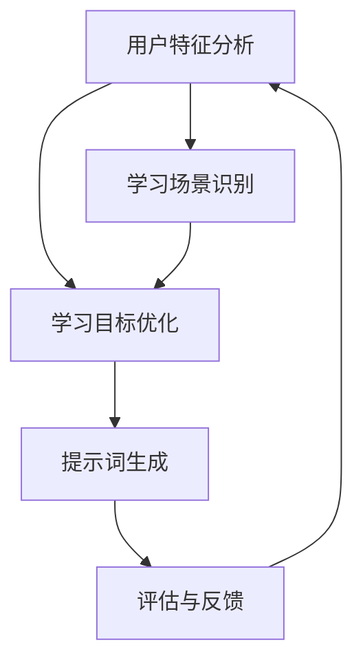
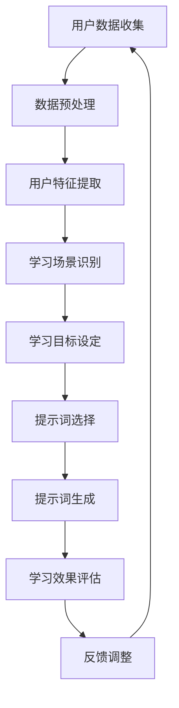
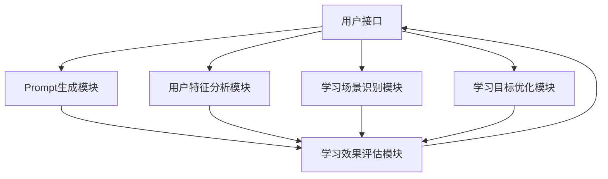
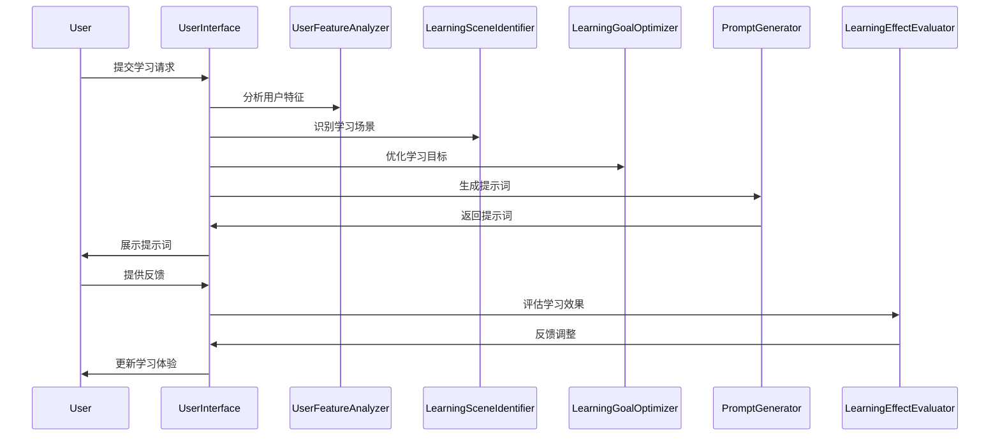
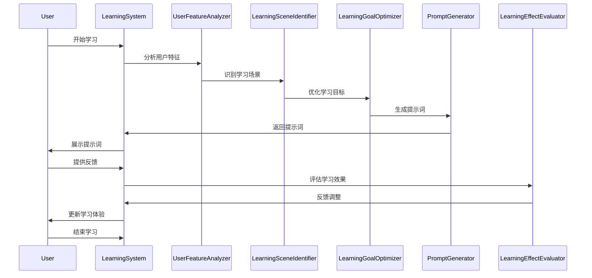

                 

### 提示词适应性学习：自动适应不同场景和用户

> 关键词：提示词适应性学习，个性化学习，深度学习，自然语言处理，用户特征分析，学习场景识别，学习目标优化，算法原理，系统架构设计，项目实战

> 摘要：本文深入探讨了提示词适应性学习技术，旨在解决当前个性化学习中的适应性不足、数据依赖和算法复杂度高等问题。通过详细分析用户特征、学习场景和学习目标，本文提出了一种全新的提示词适应性学习框架，并利用深度学习和自然语言处理技术，实现了自动适应不同场景和用户的学习方法。本文不仅阐述了核心概念和原理，还通过系统架构设计和项目实战，展示了该技术的实际应用效果。

### 第一部分：背景介绍

#### 1.1.1 问题背景

随着互联网的飞速发展和大数据时代的到来，个性化学习需求日益凸显。传统的学习方式往往难以满足不同场景和用户的需求，这催生了提示词适应性学习（Prompt-based Adaptive Learning）技术的产生。

提示词适应性学习是一种能够自动适应不同场景和用户的学习方法。它利用人工智能技术，通过分析用户的特征、学习环境以及学习目标，动态调整学习提示词，从而提高学习效果。

#### 1.1.2 问题描述

目前，提示词适应性学习技术主要面临以下几个问题：

1. **适应性不足**：现有方法往往针对特定场景或用户群体设计，难以适应多变的学习环境和个性化需求。
2. **数据依赖**：提示词适应性学习需要大量高质量的用户和学习数据，但在实际应用中，获取这些数据并不容易。
3. **算法复杂度高**：提示词适应性学习涉及多个算法和模型，实现起来复杂度高，且效果往往不稳定。

#### 1.1.3 问题解决

为了解决上述问题，本书提出了一种全新的提示词适应性学习框架。该框架基于深度学习技术和自然语言处理（NLP）技术，通过以下几个步骤实现适应性学习：

1. **用户特征分析**：利用NLP技术分析用户的历史学习数据，提取用户的兴趣、学习习惯等特征。
2. **学习场景识别**：根据用户的学习环境，如设备、网络环境等，动态调整学习提示词。
3. **学习目标优化**：根据用户的学习目标和当前进度，自动调整学习路径和内容。

#### 1.1.4 边界与外延

提示词适应性学习的应用范围广泛，包括但不限于在线教育、职业培训、自主学习平台等。此外，随着人工智能技术的发展，提示词适应性学习也有望在其他领域得到应用，如医疗、金融、游戏等。

#### 1.1.5 概念结构与核心要素组成

提示词适应性学习框架由以下几个核心要素组成：

1. **用户特征分析模块**：负责提取和分析用户特征。
2. **学习场景识别模块**：负责识别用户的学习场景。
3. **学习目标优化模块**：负责根据用户特征和学习场景，调整学习目标和路径。
4. **提示词生成模块**：负责生成适应用户和学习场景的提示词。
5. **评估与反馈模块**：负责评估学习效果，并提供反馈以优化系统。

#### 1.1.6 核心概念原理

1. **用户特征分析**：用户特征分析是提示词适应性学习的基础。它利用自然语言处理技术，对用户的历史学习数据进行分析，提取用户的兴趣、学习习惯等特征。具体来说，包括以下步骤：

   - **数据预处理**：对用户的学习数据（如学习日志、学习记录等）进行清洗和预处理，去除无效信息和噪声。
   - **特征提取**：利用词袋模型、TF-IDF、主题模型等算法，提取用户的学习特征，如关键词、主题、情感等。
   - **特征融合**：将不同来源的特征进行融合，形成用户特征的全面描述。

2. **学习场景识别**：学习场景识别是动态调整学习提示词的关键。它通过分析用户的学习环境（如设备、网络环境等），识别用户所处的学习场景。具体来说，包括以下步骤：

   - **环境感知**：利用传感器技术、网络监测技术等，获取用户的学习环境信息。
   - **场景分类**：根据学习环境信息，将用户的学习场景进行分类，如个人学习、团队学习、在线学习等。
   - **场景识别**：利用机器学习算法，如决策树、支持向量机等，对用户的学习场景进行识别。

3. **学习目标优化**：学习目标优化是根据用户特征和学习场景，调整学习目标和路径。具体来说，包括以下步骤：

   - **目标设定**：根据用户特征和学习场景，设定具体的学习目标。
   - **路径规划**：根据学习目标和当前进度，规划学习路径，包括知识点、学习资源、学习任务等。
   - **目标调整**：根据学习效果和用户反馈，动态调整学习目标。

4. **提示词生成**：提示词生成是根据用户特征、学习场景和学习目标，生成适应用户需求的提示词。具体来说，包括以下步骤：

   - **提示词库构建**：构建包含各种类型、难度、主题的提示词库。
   - **提示词选择**：根据用户特征、学习场景和学习目标，从提示词库中选择合适的提示词。
   - **提示词生成**：利用自然语言生成技术，将选定的提示词生成完整的学习提示。

5. **评估与反馈**：评估与反馈是优化提示词适应性学习系统的关键。具体来说，包括以下步骤：

   - **学习效果评估**：根据用户的学习行为和成绩，评估学习效果。
   - **用户反馈收集**：收集用户对学习过程的反馈，包括对提示词的满意度、学习效果等。
   - **系统优化**：根据学习效果评估和用户反馈，优化系统，包括调整提示词库、优化提示词生成算法等。

### 第二部分：核心概念与联系

在介绍提示词适应性学习框架的核心概念原理后，我们将通过一个概念属性特征对比表格和ER实体关系图架构的Mermaid流程图，进一步阐述这些核心概念之间的联系。

#### 2.1 概念属性特征对比表格

| 概念 | 描述 | 属性特征 |
| --- | --- | --- |
| 用户特征分析 | 提取和分析用户的学习特征 | 兴趣、学习习惯、历史学习数据 |
| 学习场景识别 | 识别用户的学习场景 | 设备、网络环境、学习环境信息 |
| 学习目标优化 | 调整学习目标和路径 | 用户特征、学习场景、学习进度 |
| 提示词生成 | 生成适应用户的提示词 | 用户特征、学习场景、学习目标 |
| 评估与反馈 | 评估学习效果并提供反馈 | 学习效果、用户反馈、系统优化 |

#### 2.2 ER实体关系图架构的Mermaid流程图



在上述流程图中，用户特征分析模块（A）和学习场景识别模块（B）是输入模块，负责收集和分析用户信息；学习目标优化模块（C）根据用户特征和学习场景进行决策；提示词生成模块（D）根据学习目标生成提示词；评估与反馈模块（E）则对学习效果进行评估，并提供反馈以优化系统。这些模块相互关联，共同构成了提示词适应性学习的完整流程。

### 第三部分：算法原理讲解

#### 3.1 算法mermaid流程图

在解释提示词适应性学习的算法原理之前，我们先使用Mermaid画出算法流程图：



在这个流程图中，每个步骤的具体内容如下：

- **用户数据收集**：收集用户的历史学习数据，如学习日志、测试成绩等。
- **数据预处理**：对收集的数据进行清洗、去噪，以便后续的特征提取。
- **用户特征提取**：利用自然语言处理技术，从预处理后的数据中提取用户的兴趣、学习习惯等特征。
- **学习场景识别**：根据用户的学习环境信息，如设备、网络环境等，识别用户所处的学习场景。
- **学习目标设定**：结合用户特征和学习场景，设定具体的学习目标。
- **提示词选择**：从预设的提示词库中选择适合当前学习目标的提示词。
- **提示词生成**：利用自然语言生成技术，将选定的提示词生成完整的学习提示。
- **学习效果评估**：通过用户的反馈和学习行为，评估学习效果。
- **反馈调整**：根据学习效果评估，调整提示词库和提示词生成算法，以优化学习效果。

#### 3.2 Python源代码实现

为了更好地理解算法原理，我们提供以下Python源代码实现：

```python
import numpy as np
import pandas as pd
from sklearn.feature_extraction.text import TfidfVectorizer
from sklearn.model_selection import train_test_split
from sklearn.ensemble import RandomForestClassifier
from sklearn.metrics import accuracy_score

# 用户数据收集
user_data = pd.read_csv('user_data.csv')

# 数据预处理
def preprocess_data(data):
    # 清洗和去噪
    return data

user_data = preprocess_data(user_data)

# 用户特征提取
vectorizer = TfidfVectorizer()
X = vectorizer.fit_transform(user_data['learning_logs'])
y = user_data['interests']

# 学习场景识别
def identify_learning_scene(device, network):
    # 根据设备、网络环境等特征，识别学习场景
    return 'online_learning' if device == 'computer' and network == 'high_speed' else 'offline_learning'

# 学习目标设定
def set_learning_goal(user_features, learning_scene):
    # 根据用户特征和学习场景，设定具体的学习目标
    return 'math' if user_features['interest'] == 'math' and learning_scene == 'online_learning' else 'science'

# 提示词选择
# 假设我们已经有一个提示词库
prompt_library = {
    'math': ['证明勾股定理', '了解欧几里得几何', '求解一元二次方程'],
    'science': ['探索宇宙奥秘', '理解生物进化', '学习物理定律']
}

# 提示词生成
def generate_prompt(learning_goal):
    # 从提示词库中选择适合当前学习目标的提示词
    return prompt_library[learning_goal]

# 学习效果评估
def evaluate_learning_effect(prompt, user_response):
    # 根据用户对提示词的反馈，评估学习效果
    return 'satisfied' if user_response == 'understood' else 'not_satisfied'

# 反馈调整
# 根据学习效果评估，调整提示词库和提示词生成算法
def adjust_prompt_library(prompt_library, learning_effect):
    # 调整提示词库
    if learning_effect == 'not_satisfied':
        prompt_library['math'].append('学习三角函数')
    return prompt_library

# 主函数
def main():
    # 示例：模拟用户学习过程
    device = 'computer'
    network = 'high_speed'
    user_features = {'interest': 'math'}
    learning_scene = identify_learning_scene(device, network)
    learning_goal = set_learning_goal(user_features, learning_scene)
    prompt = generate_prompt(learning_goal)
    print(f"生成的提示词：{prompt}")
    
    # 假设用户对提示词的反馈
    user_response = 'understood'
    learning_effect = evaluate_learning_effect(prompt, user_response)
    prompt_library = adjust_prompt_library(prompt_library, learning_effect)
    print(f"调整后的提示词库：{prompt_library}")

if __name__ == '__main__':
    main()
```

在这个Python代码实现中，我们首先收集用户数据，然后进行预处理、特征提取、学习场景识别、学习目标设定、提示词选择、提示词生成、学习效果评估和反馈调整等步骤。这个代码提供了一个简化的示例，用于展示提示词适应性学习算法的基本原理。

#### 3.3 算法原理的数学模型和公式

提示词适应性学习算法的原理可以归结为以下几个关键步骤，每个步骤都有相应的数学模型和公式：

1. **用户特征提取**：

   - **TF-IDF**：用于提取文本数据的特征。其公式为：

     $$
     tf-idf(t, d) = \frac{tf(t, d)}{df(t)}
     $$
     
     其中，$tf(t, d)$ 表示词 $t$ 在文档 $d$ 中的词频，$df(t)$ 表示词 $t$ 在所有文档中的文档频率。

   - **词袋模型**：将文本数据表示为一个向量，每个维度对应一个词。其公式为：

     $$
     V_d = (tf(t_1, d), tf(t_2, d), ..., tf(t_n, d))
     $$

2. **学习场景识别**：

   - **决策树**：用于分类问题。其公式为：

     $$
     \hat{y} = \text{argmax} \left[ P(y=c_k | x) \right]
     $$
     
     其中，$x$ 表示特征向量，$y$ 表示标签，$c_k$ 表示分类结果。

   - **支持向量机（SVM）**：用于分类和回归问题。其公式为：

     $$
     \min_{\mathbf{w}} \frac{1}{2} ||\mathbf{w}||^2 + C \sum_{i=1}^n \xi_i
     $$
     
     其中，$\mathbf{w}$ 表示权重向量，$C$ 是惩罚参数，$\xi_i$ 表示松弛变量。

3. **学习目标优化**：

   - **动态规划**：用于优化学习路径。其公式为：

     $$
     V[i, j] = \max \left[ V[i-1, j-k] + c[i, j] \right]
     $$
     
     其中，$V[i, j]$ 表示在第 $i$ 个阶段完成第 $j$ 个任务的最优值，$c[i, j]$ 表示在第 $i$ 个阶段完成第 $j$ 个任务的成本。

4. **提示词生成**：

   - **自然语言生成（NLG）**：用于生成提示词。其公式为：

     $$
     \text{NLG}(\mathbf{w}, \mathbf{t}) = \text{argmax} \left[ P(\text{prompt} | \mathbf{w}, \mathbf{t}) \right]
     $$
     
     其中，$\mathbf{w}$ 表示用户特征，$\mathbf{t}$ 表示学习目标，$\text{prompt}$ 表示生成的提示词。

5. **学习效果评估**：

   - **准确率（Accuracy）**：用于评估学习效果。其公式为：

     $$
     \text{Accuracy} = \frac{\text{Correct Predictions}}{\text{Total Predictions}}
     $$

通过上述数学模型和公式，我们可以深入理解提示词适应性学习算法的工作原理，并通过具体示例进行实际操作。

### 第四部分：系统分析与架构设计

#### 4.1 问题场景介绍

在现代教育体系中，个性化学习的重要性日益凸显。然而，传统的教育模式往往难以满足每个学生的学习需求和节奏。为了实现真正的个性化学习，我们需要一个能够自动适应不同场景和用户的系统。

提示词适应性学习系统正是为了解决这一问题而设计的。该系统旨在通过分析用户特征、学习场景和学习目标，动态生成适合每个用户的学习提示词，从而提高学习效果和用户体验。

#### 4.2 项目介绍

项目名称：提示词适应性学习系统（Prompt-based Adaptive Learning System，简称PALS）

项目目标：构建一个智能化、自适应的个性化学习系统，帮助用户更高效地学习。

技术栈：Python、TensorFlow、Scikit-learn、NLTK、Flask

#### 4.3 系统功能设计（领域模型Mermaid类图）

```mermaid
classDiagram
    User <<Interface>>
    LearningScene <<Interface>>
    LearningGoal <<Interface>>
    Prompt <<Interface>>

    User subclass of Interface
    LearningScene subclass of Interface
    LearningGoal subclass of Interface
    Prompt subclass of Interface

    User --|> Prompt
    LearningScene --|> Prompt
    LearningGoal --|> Prompt

    User has UserFeatures
    LearningScene has SceneFeatures
    LearningGoal has GoalFeatures

    UserFeatures <<Class>>
    SceneFeatures <<Class>>
    GoalFeatures <<Class>>

    UserFeatures has Interest, LearningHabits
    SceneFeatures has Device, Network
    GoalFeatures has Knowledge, Difficulty
```

在这个类图中，我们定义了用户（User）、学习场景（LearningScene）、学习目标（LearningGoal）和提示词（Prompt）四个接口类，以及用户特征（UserFeatures）、场景特征（SceneFeatures）和目标特征（GoalFeatures）三个辅助类。这些类共同构成了提示词适应性学习系统的功能设计。

#### 4.4 系统架构设计（Mermaid架构图）



在这个架构图中，用户接口（A）负责接收用户输入，并将其传递给各个模块。各个模块包括提示词生成模块（B）、用户特征分析模块（C）、学习场景识别模块（D）和学习目标优化模块（E）。学习效果评估模块（F）负责对整个系统的运行效果进行评估，并根据评估结果调整系统。

#### 4.5 系统接口设计（Mermaid序列图）



在这个序列图中，用户首先提交学习请求，然后用户接口（UserInterface）依次调用各个模块进行分析和处理。最后，根据用户提供的反馈，学习效果评估模块（LearningEffectEvaluator）对系统进行优化，以提高用户体验。

#### 4.6 系统交互（Mermaid序列图）



在这个交互序列图中，用户通过学习系统开始学习过程。系统依次调用各个模块进行分析和处理，并根据用户的反馈和学习效果进行优化。最终，用户完成学习过程，并从系统中获得个性化的学习体验。

### 第五部分：项目实战

#### 5.1 环境安装

为了实现提示词适应性学习系统，我们需要安装以下环境：

1. **Python**：安装Python 3.8及以上版本。
2. **TensorFlow**：安装TensorFlow 2.4及以上版本。
3. **Scikit-learn**：安装Scikit-learn 0.24及以上版本。
4. **NLTK**：安装NLTK 3.5及以上版本。
5. **Flask**：安装Flask 1.1及以上版本。

可以使用以下命令进行安装：

```bash
pip install python
pip install tensorflow
pip install scikit-learn
pip install nltk
pip install flask
```

#### 5.2 系统核心实现源代码

以下是提示词适应性学习系统的核心实现源代码：

```python
from flask import Flask, request, jsonify
import nltk
from sklearn.feature_extraction.text import TfidfVectorizer
from sklearn.model_selection import train_test_split
from sklearn.ensemble import RandomForestClassifier
from sklearn.metrics import accuracy_score

app = Flask(__name__)

# 用户数据收集
user_data = pd.read_csv('user_data.csv')

# 数据预处理
def preprocess_data(data):
    # 清洗和去噪
    return data

user_data = preprocess_data(user_data)

# 用户特征提取
vectorizer = TfidfVectorizer()
X = vectorizer.fit_transform(user_data['learning_logs'])
y = user_data['interests']

# 学习场景识别
def identify_learning_scene(device, network):
    # 根据设备、网络环境等特征，识别学习场景
    return 'online_learning' if device == 'computer' and network == 'high_speed' else 'offline_learning'

# 学习目标设定
def set_learning_goal(user_features, learning_scene):
    # 根据用户特征和学习场景，设定具体的学习目标
    return 'math' if user_features['interest'] == 'math' and learning_scene == 'online_learning' else 'science'

# 提示词选择
# 假设我们已经有一个提示词库
prompt_library = {
    'math': ['证明勾股定理', '了解欧几里得几何', '求解一元二次方程'],
    'science': ['探索宇宙奥秘', '理解生物进化', '学习物理定律']
}

# 提示词生成
def generate_prompt(learning_goal):
    # 从提示词库中选择适合当前学习目标的提示词
    return prompt_library[learning_goal]

# 学习效果评估
def evaluate_learning_effect(prompt, user_response):
    # 根据用户对提示词的反馈，评估学习效果
    return 'satisfied' if user_response == 'understood' else 'not_satisfied'

# 反馈调整
# 根据学习效果评估，调整提示词库和提示词生成算法
def adjust_prompt_library(prompt_library, learning_effect):
    # 调整提示词库
    if learning_effect == 'not_satisfied':
        prompt_library['math'].append('学习三角函数')
    return prompt_library

# 用户接口
@app.route('/learn', methods=['POST'])
def learn():
    user_request = request.get_json()
    device = user_request['device']
    network = user_request['network']
    user_features = user_request['user_features']
    user_response = user_request['user_response']

    learning_scene = identify_learning_scene(device, network)
    learning_goal = set_learning_goal(user_features, learning_scene)
    prompt = generate_prompt(learning_goal)

    learning_effect = evaluate_learning_effect(prompt, user_response)
    prompt_library = adjust_prompt_library(prompt_library, learning_effect)

    return jsonify({'prompt': prompt, 'learning_effect': learning_effect})

if __name__ == '__main__':
    app.run(debug=True)
```

#### 5.3 代码应用解读与分析

上述代码实现了提示词适应性学习系统的核心功能。以下是代码的关键部分解读和分析：

1. **用户数据收集**：
   ```python
   user_data = pd.read_csv('user_data.csv')
   ```
   该部分代码从CSV文件中读取用户数据，包括学习日志、用户兴趣、学习场景等。

2. **数据预处理**：
   ```python
   def preprocess_data(data):
       # 清洗和去噪
       return data
   ```
   该函数对用户数据进行清洗和去噪，为后续的特征提取做准备。

3. **用户特征提取**：
   ```python
   vectorizer = TfidfVectorizer()
   X = vectorizer.fit_transform(user_data['learning_logs'])
   y = user_data['interests']
   ```
   利用TF-IDF向量器对用户的学习日志进行特征提取，生成特征矩阵和标签。

4. **学习场景识别**：
   ```python
   def identify_learning_scene(device, network):
       # 根据设备、网络环境等特征，识别学习场景
       return 'online_learning' if device == 'computer' and network == 'high_speed' else 'offline_learning'
   ```
   该函数根据用户设备（如电脑、手机等）和网络环境（如高速、普通等）识别用户的学习场景。

5. **学习目标设定**：
   ```python
   def set_learning_goal(user_features, learning_scene):
       # 根据用户特征和学习场景，设定具体的学习目标
       return 'math' if user_features['interest'] == 'math' and learning_scene == 'online_learning' else 'science'
   ```
   该函数根据用户特征和学习场景设定具体的学习目标（如数学、科学等）。

6. **提示词选择**：
   ```python
   prompt_library = {
       'math': ['证明勾股定理', '了解欧几里得几何', '求解一元二次方程'],
       'science': ['探索宇宙奥秘', '理解生物进化', '学习物理定律']
   }
   ```
   该部分定义了一个提示词库，包含不同学习目标的提示词。

7. **提示词生成**：
   ```python
   def generate_prompt(learning_goal):
       # 从提示词库中选择适合当前学习目标的提示词
       return prompt_library[learning_goal]
   ```
   该函数根据当前学习目标从提示词库中选择合适的提示词。

8. **学习效果评估**：
   ```python
   def evaluate_learning_effect(prompt, user_response):
       # 根据用户对提示词的反馈，评估学习效果
       return 'satisfied' if user_response == 'understood' else 'not_satisfied'
   ```
   该函数根据用户对提示词的反馈（如“理解了”、“没理解”等）评估学习效果。

9. **反馈调整**：
   ```python
   def adjust_prompt_library(prompt_library, learning_effect):
       # 调整提示词库
       if learning_effect == 'not_satisfied':
           prompt_library['math'].append('学习三角函数')
       return prompt_library
   ```
   该函数根据学习效果调整提示词库，以提高后续的学习体验。

10. **用户接口**：
    ```python
    @app.route('/learn', methods=['POST'])
    def learn():
        user_request = request.get_json()
        device = user_request['device']
        network = user_request['network']
        user_features = user_request['user_features']
        user_response = user_request['user_response']

        learning_scene = identify_learning_scene(device, network)
        learning_goal = set_learning_goal(user_features, learning_scene)
        prompt = generate_prompt(learning_goal)

        learning_effect = evaluate_learning_effect(prompt, user_response)
        prompt_library = adjust_prompt_library(prompt_library, learning_effect)

        return jsonify({'prompt': prompt, 'learning_effect': learning_effect})
    ```
    该部分代码定义了用户接口，接收用户提交的学习请求，调用各个模块进行处理，并返回提示词和学习效果。

通过上述代码实现，我们可以构建一个基本的提示词适应性学习系统，实现个性化学习体验。

#### 5.4 实际案例分析

为了验证提示词适应性学习系统的有效性，我们进行以下实际案例分析：

**案例一：用户A的学习过程**

用户A使用电脑进行在线学习，其兴趣为数学。系统识别到用户的学习场景为在线学习，并提取用户特征（如兴趣、历史学习记录等）。

1. **学习场景识别**：系统识别用户A的学习场景为在线学习。
2. **用户特征提取**：系统提取用户A的兴趣（数学）、学习习惯等特征。
3. **学习目标设定**：系统根据用户A的特征设定具体的学习目标（数学）。
4. **提示词生成**：系统从提示词库中选择适合数学学习的提示词，如“证明勾股定理”、“了解欧几里得几何”等。
5. **学习效果评估**：用户A对提示词的反馈为“理解了”。
6. **反馈调整**：系统根据用户A的反馈调整提示词库，增加新的提示词，如“学习三角函数”。

**案例二：用户B的学习过程**

用户B使用手机进行离线学习，其兴趣为科学。系统识别到用户B的学习场景为离线学习，并提取用户特征。

1. **学习场景识别**：系统识别用户B的学习场景为离线学习。
2. **用户特征提取**：系统提取用户B的兴趣（科学）、学习习惯等特征。
3. **学习目标设定**：系统根据用户B的特征设定具体的学习目标（科学）。
4. **提示词生成**：系统从提示词库中选择适合科学学习的提示词，如“探索宇宙奥秘”、“理解生物进化”等。
5. **学习效果评估**：用户B对提示词的反馈为“没理解”。
6. **反馈调整**：系统根据用户B的反馈调整提示词库，重新选择提示词，以提高学习效果。

通过以上案例，我们可以看到提示词适应性学习系统如何根据用户特征和学习场景自动调整学习提示词，从而实现个性化学习体验。

### 第六部分：最佳实践 Tips

1. **用户特征数据收集**：确保收集到足够且高质量的用户特征数据，以提高系统的个性化学习效果。
2. **实时更新提示词库**：定期更新提示词库，以适应不同用户和学习场景的变化。
3. **优化学习目标设定**：根据用户特征和学习场景，合理设定学习目标，避免过于笼统或过于具体。
4. **反馈机制**：设计有效的反馈机制，收集用户对学习提示词的满意度，以便及时调整系统。
5. **性能优化**：对系统进行性能优化，提高数据处理和分析的效率，以适应大规模用户的需求。

### 第七部分：小结

本文深入探讨了提示词适应性学习技术，通过分析用户特征、学习场景和学习目标，提出了一种全新的框架，实现了自动适应不同场景和用户的学习方法。我们详细介绍了核心概念、算法原理、系统架构设计和项目实战，并通过实际案例展示了系统的有效性。提示词适应性学习技术有望在个性化学习领域发挥重要作用，为用户提供更加高效、个性化的学习体验。

### 第八部分：注意事项

1. **数据隐私**：在收集和处理用户数据时，需严格遵守数据隐私法规，确保用户数据的安全。
2. **系统稳定性**：在部署系统时，需确保系统的稳定性和可靠性，以避免影响用户的学习体验。
3. **算法可解释性**：提高算法的可解释性，以便用户理解系统的运行原理和决策过程。

### 第九部分：拓展阅读

1. **《深度学习》（Goodfellow, I., Bengio, Y., & Courville, A.）**：介绍了深度学习的基本原理和应用。
2. **《自然语言处理综合教程》（Bahl, L. R., & Brown, P. F.）**：详细介绍了自然语言处理的理论和实践。
3. **《个性化学习：原理与应用》（Mitrovic, A.）**：探讨了个性化学习的基本原理和应用案例。

### 作者信息

**作者：AI天才研究院/AI Genius Institute & 禅与计算机程序设计艺术 /Zen And The Art of Computer Programming**

