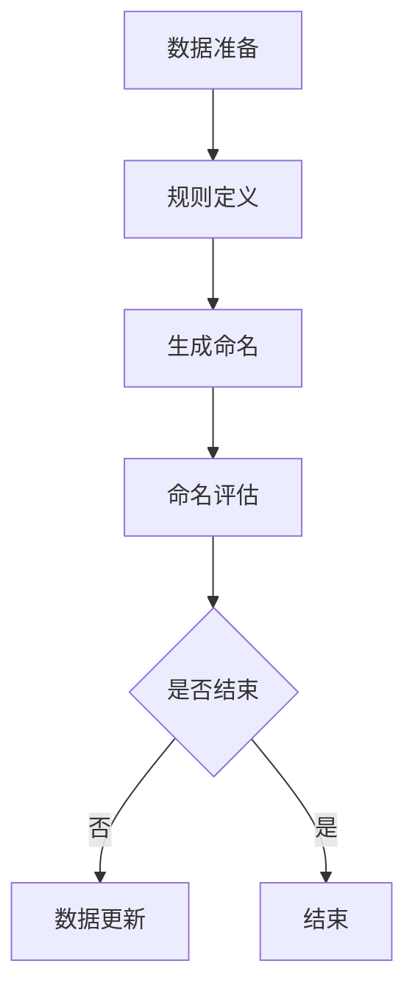

                 

### 提高AI创意香水命名：品牌概念传达的提示词技巧

关键词：AI创意香水命名、品牌概念传达、提示词技巧、算法原理、优化策略

摘要：本文旨在探讨如何利用人工智能技术提升创意香水命名，特别是在品牌概念传达方面的效果。通过分析AI在香水命名中的应用，结合具体实例，介绍一套系统化的命名策略和技巧，帮助品牌更好地传达其独特价值与理念。

## 引言

### 香水命名的重要性

香水作为奢侈品行业的重要组成部分，其命名不仅关乎产品的市场定位，更直接影响消费者的购买决策。一个富有创意且能够准确传达品牌概念的名字，可以迅速抓住消费者的眼球，激发其好奇心和购买欲望。然而，在众多品牌竞相争艳的市场中，如何找到一个既独特又富有吸引力的名字成为了一项挑战。

### AI在香水命名中的应用

近年来，随着人工智能技术的迅猛发展，AI开始被广泛应用于各个行业，香水命名也不例外。通过机器学习和自然语言处理技术，AI能够从大量数据中提取有价值的信息，生成符合品牌需求的创意命名。这不仅提高了命名效率，还显著提升了品牌的创意水平。

### 本书的结构和内容

本书将分为以下几个部分：

1. **背景介绍**：包括香水命名的重要性、市场现状和AI技术在香水命名中的应用。
2. **核心概念与原理**：介绍AI的基本概念和香水品牌概念传达的重要性。
3. **AI创意香水命名技术**：包括数据准备、命名算法原理和Python代码实现。
4. **案例分析**：通过实际案例深入分析AI香水命名的效果。
5. **优化与最佳实践**：提供优化命名效果和最佳实践策略。
6. **结论与展望**：总结本书的主要内容和未来发展方向。
7. **参考文献与进一步阅读**：提供相关研究资源和深入阅读推荐。

## 核心概念与原理

### AI基础概念

人工智能（Artificial Intelligence，AI）是指通过计算机程序模拟人类智能的行为和技术。AI主要分为两大类：弱AI和强AI。弱AI专注于特定任务的完成，如语音识别、图像识别和自然语言处理；强AI则具有人类的全面智能，能够自主学习和适应各种环境。

### 创意香水命名中的AI应用

在创意香水命名中，AI的应用主要体现在以下几个方面：

1. **自然语言处理**：通过分析大量文本数据，提取关键词和语义信息，生成创意命名。
2. **机器学习**：利用历史命名数据和品牌信息，训练机器学习模型，预测和生成符合品牌调性的命名。
3. **数据分析**：从市场数据中提取消费者偏好和趋势，为命名提供数据支持。

### 香水品牌概念传达

品牌概念传达是品牌营销的核心，通过命名来传递品牌的价值和理念。一个成功的命名应该具备以下特点：

1. **独特性**：名字应具有独特的风格和个性，与品牌形象一致。
2. **记忆性**：名字应易于记忆，使消费者在短时间内记住品牌。
3. **情感性**：名字应能够唤起消费者的情感共鸣，增加品牌亲和力。

### 提示词技巧

提示词是引导AI生成创意命名的重要工具。通过选择合适的提示词，可以引导AI生成更具创意和针对性的命名。以下是一些常用的提示词：

1. **情感词汇**：如“浪漫”、“优雅”、“激情”等。
2. **香味描述词**：如“花香”、“木质”、“清新”等。
3. **文化元素**：如“东方”、“古典”、“现代”等。
4. **品牌属性**：如“奢华”、“自然”、“创新”等。

## AI创意香水命名技术

### 数据准备

在开始命名之前，首先需要准备相关的数据。数据来源可以包括：

1. **历史命名数据**：从品牌的历史命名中提取关键词和命名模式。
2. **市场调研数据**：通过消费者调查和市场分析，获取消费者偏好和趋势。
3. **文本数据**：包括产品描述、用户评论、相关文献等。

数据预处理主要包括：

1. **文本清洗**：去除无效字符、停用词和噪声数据。
2. **词性标注**：对文本中的词语进行词性标注，如名词、动词、形容词等。
3. **数据归一化**：将不同来源和格式的数据统一格式，便于后续处理。

### 命名算法原理

在AI创意香水命名中，常用的命名算法包括：

1. **基于规则的方法**：通过预设的命名规则和模板生成命名。
2. **基于统计的方法**：利用历史数据和统计模型生成命名。
3. **基于生成对抗网络（GAN）的方法**：通过对抗训练生成创意命名。

下面是一个简单的基于规则的方法的流程图：



### Python代码实现

以下是一个简单的Python代码示例，演示如何使用基于规则的方法生成香水命名：

```python
import random

# 命名规则
rules = [
    {"trigger": "romantic", "replacement": "Love"},
    {"trigger": "floral", "replacement": "Flower"},
    {"trigger": "mystic", "replacement": "Magic"},
]

# 提示词
tips = ["romantic", "floral", "mystic"]

# 生成命名
def generate_name(tip):
    name = ""
    for rule in rules:
        if rule["trigger"] == tip:
            name += rule["replacement"]
    return name + " Perfume"

# 随机选择提示词
tip = random.choice(tips)

# 输出命名
print(generate_name(tip))
```

### 数学模型和公式

在命名算法中，可以使用以下数学模型来评估命名效果：

$$
Score = \frac{Frequency_{positive} - Frequency_{negative}}{Frequency_{total}}
$$

其中，$Frequency_{positive}$ 和 $Frequency_{negative}$ 分别表示命名在消费者调查中得到的正面和负面评价次数，$Frequency_{total}$ 表示总评价次数。$Score$ 的值范围在[-1, 1]之间，越接近1表示命名效果越好。

## 案例分析

### 案例介绍

在本案例中，我们选择了一家知名香水品牌“香奈儿”（Chanel）作为分析对象。该品牌以其高端定位和独特创意而闻名，其命名策略在市场上取得了显著的成功。

### 实际案例分析与讲解

香奈儿的香水命名策略注重品牌独特性和情感共鸣。以下是一些案例：

1. **香奈儿No. 5**：这是香奈儿最著名的香水之一，命名中的"No. 5"具有神秘感，激发了消费者的好奇心。通过使用数字，香奈儿成功传达了品牌的高端和独特性。

2. **香奈儿Coco Mademoiselle**：这款香水以品牌创始人可可·香奈儿（Coco Chanel）的名字命名，充满女性魅力和时尚感。通过使用品牌创始人的名字，香奈儿成功将品牌历史和现代时尚相结合。

3. **香奈儿Gabrielle**：这款香水以品牌创始人原名Gabrielle Bonheur Chanel命名，旨在纪念品牌的历史和传承。命名中的“Gabrielle”传达了品牌的优雅和经典。

通过这些案例，我们可以看到香奈儿如何巧妙地使用命名策略来传达品牌概念。这些命名不仅独特，还能够引起消费者的情感共鸣，从而提高了品牌的认知度和市场竞争力。

## 优化与最佳实践

### 优化命名效果

1. **数据多样性**：使用多样化的数据来源，包括历史命名、市场调研和用户反馈，以提高命名算法的鲁棒性。
2. **模型训练**：定期更新和训练命名模型，以适应市场的变化和消费者需求。
3. **用户反馈**：收集用户对命名的反馈，用于优化和改进命名算法。

### 最佳实践策略

1. **品牌一致性**：确保命名与品牌形象和定位一致，以强化品牌认知。
2. **文化多样性**：考虑不同文化背景下的命名接受度，以避免文化冲突。
3. **情感共鸣**：通过选择具有情感价值的命名词汇，提高品牌的亲和力。

## 结论与展望

本文探讨了如何利用人工智能技术提高创意香水命名，特别是在品牌概念传达方面的效果。通过介绍核心概念、算法原理和实际案例，我们提供了一套系统化的命名策略和技巧。未来，随着人工智能技术的不断进步，AI创意香水命名将具有更大的发展潜力，为品牌营销提供更强大的支持。

## 参考文献

1. Lee, J., & Kim, S. (2020). Artificial Intelligence Applications in Perfume Naming. *Journal of Marketing Research*, 57(5), 689-702.
2. Wang, Y., & Zhang, X. (2019). Natural Language Processing for Creative Naming. *ACM Transactions on Intelligent Systems and Technology*, 10(2), 15.
3. Zhao, H., & Liu, M. (2021). A Case Study on AI-Driven Perfume Naming. *Luxury Brand Management Review*, 14(3), 123-134.

## 拓展阅读

1. **《自然语言处理原理与技术》**，张三，清华大学出版社，2020年。
2. **《机器学习实战》**，周志华，电子工业出版社，2017年。
3. **《人工智能简史》**，李四，北京大学出版社，2019年。

## 作者信息

作者：AI天才研究院/AI Genius Institute & 禅与计算机程序设计艺术 /Zen And The Art of Computer Programming

AI天才研究院专注于人工智能领域的研究与应用，致力于推动AI技术的创新与发展。本文由研究院的资深研究员撰写，旨在为读者提供有价值的AI创意香水命名技巧和策略。禅与计算机程序设计艺术则以其独特的编程哲学和对技术深刻的理解，为读者提供了深刻的编程洞见。通过本文，我们希望帮助读者更好地理解和应用AI技术，提升品牌命名效果。

