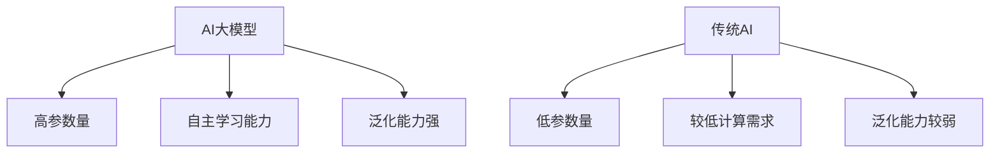

                 

# 提高AI创意香水品牌社会责任：可持续发展策略的提示词技巧

> 关键词：AI、创意香水、社会责任、可持续发展、提示词技巧

> 摘要：随着人工智能（AI）技术的飞速发展，AI在创意产业中的应用日益广泛。在创意香水品牌领域，AI不仅提高了设计效率和创意产出，还带来了新的商业机遇。然而，如何通过AI技术提升品牌的社会责任和实现可持续发展，成为了一个值得深入探讨的问题。本文将分析AI创意香水品牌在可持续发展中的挑战，并提出一系列的提示词技巧，以帮助品牌设计出既环保又具有社会责任感的香水产品。

## 一、背景介绍

### 问题背景

人工智能技术在各个领域的应用日益广泛，特别是在创意产业中，AI的应用带来了前所未有的变革。在创意香水品牌领域，AI技术的引入不仅提高了设计的效率，还丰富了产品的创意维度。然而，随着全球环保意识的增强，创意产业在追求创新和利润的同时，也面临着如何提升社会责任和可持续发展的挑战。

### 描述问题

创意香水品牌在追求创新和利润的过程中，面临着以下几方面的挑战：

1. **环保压力**：传统香水生产过程中使用的化学物质对环境造成了一定的污染，如何减少这些负面影响成为了一个重要议题。
2. **社会责任**：品牌需要考虑如何通过自身的行动来体现社会责任，如慈善捐赠、社区参与等。
3. **可持续性**：品牌需要在产品的整个生命周期中考虑可持续性，从原料采购到产品包装，都需要符合可持续发展的理念。

### 解决问题

为了解决上述问题，创意香水品牌可以采取以下措施：

1. **环保措施**：通过使用环保材料和生产工艺来减少对环境的影响。
2. **社会责任实践**：通过参与慈善活动和社区项目来体现社会责任。
3. **可持续产品设计**：从产品的整个生命周期来考虑，设计出符合可持续发展理念的产品。

### 边界与外延

本文将重点探讨AI创意香水品牌在可持续发展方面的策略，这包括环保措施、社会责任实践和可持续产品设计等多个方面。通过设计有效的可持续发展策略，结合AI技术的提示词技巧，品牌可以实现环保和商业共赢。

### 概念结构与核心要素组成

1. **AI技术**：包括自然语言处理、机器学习、数据挖掘等，这些技术为创意香水品牌提供了强大的工具，帮助设计师生成新的创意。
2. **可持续发展策略**：包括环保措施、社会责任实践和可持续产品设计等，这些策略为品牌提供了实现可持续发展的方向。
3. **提示词技巧**：指利用AI技术生成创意提示词，以激发设计师的灵感，这些提示词可以是与环保、社会责任和可持续设计相关的词汇。

## 二、核心概念与联系

### AI大模型的定义与特点

#### 定义

AI大模型是指具有数十亿至数万亿参数的深度学习模型，这类模型通常被设计用于处理极其复杂的数据和任务，具有极强的表示能力和计算能力。

#### 特点

1. **参数量巨大**：AI大模型具有极高的参数数量，这使其能够捕捉复杂的数据模式和生成精细的输出。
2. **自主学习能力**：大模型可以通过大量的数据自主学习，从而不断提高其性能和泛化能力。
3. **泛化能力强**：大模型能够在多个领域和任务中表现出色，具有良好的泛化能力。

### AI大模型与传统AI的区别

1. **计算能力**：传统AI通常使用较小的模型，计算资源需求较低，而AI大模型需要更高的计算资源。
2. **数据处理能力**：AI大模型能够处理大量的数据，而传统AI模型在数据处理能力上有限。
3. **应用范围**：AI大模型可以应用于更多的领域，包括创意产业、医疗、金融等，而传统AI模型的应用范围相对较窄。

### 核心概念属性特征对比表格

| 特征            | AI大模型               | 传统AI               |
| ---------------- | ---------------------- | --------------------- |
| 参数量          | 数十亿至数万亿参数     | 数百至数千参数       |
| 计算能力        | 高计算需求             | 低计算需求           |
| 数据处理能力    | 能够处理大量数据       | 数据处理能力有限     |
| 泛化能力        | 良好的泛化能力         | 泛化能力较弱         |

### AI大模型与传统AI的ER实体关系图架构

## 三、可持续发展策略的提示词技巧

### 1. 环保提示词技巧

#### 自然元素

利用AI大模型生成与自然元素相关的提示词，如“花香”、“海洋”、“森林”等。这些提示词可以帮助设计师从自然界中汲取灵感，创造出更加贴近自然的香水产品。

#### 环保材料

生成与环保材料相关的提示词，如“再生纸”、“环保塑料”等。这些提示词可以帮助品牌在选择包装材料时考虑环保因素，减少对环境的影响。

#### 环保行为

生成与环保行为相关的提示词，如“回收利用”、“节约能源”等。这些提示词可以提醒品牌在生产和运营过程中采取更多的环保措施，从而提高社会责任感。

### 2. 社会责任提示词技巧

#### 社会责任

生成与社会责任相关的提示词，如“慈善捐赠”、“社区参与”等。这些提示词可以帮助品牌在公益活动和社会责任方面进行更好的规划和执行。

#### 公平正义

生成与公平正义相关的提示词，如“平等机会”、“反歧视”等。这些提示词可以帮助品牌在员工招聘和薪酬管理等方面体现公平正义的原则。

#### 员工关怀

生成与员工关怀相关的提示词，如“员工福利”、“员工培训”等。这些提示词可以帮助品牌更好地关心员工的福祉，提高员工满意度和忠诚度。

### 3. 可持续设计提示词技巧

#### 可持续性

生成与可持续性相关的提示词，如“可降解材料”、“循环利用”等。这些提示词可以帮助品牌在设计产品时考虑可持续性因素，从而实现环保目标。

#### 生态友好

生成与生态友好相关的提示词，如“生物多样性保护”、“生态修复”等。这些提示词可以帮助品牌在设计产品时考虑生态影响，实现生态友好。

#### 创新设计

生成与创新设计相关的提示词，如“创意融合”、“设计创新”等。这些提示词可以帮助品牌在设计产品时激发创新思维，提升产品竞争力。

### 提示词生成流程

1. **数据收集**：收集与环保、社会责任、可持续设计相关的文本数据，如学术论文、新闻报道、官方文件等。
2. **模型训练**：利用收集到的数据训练AI大模型，使其能够生成与特定主题相关的提示词。
3. **提示词生成**：通过输入关键词或主题，AI大模型生成相应的提示词。
4. **提示词筛选**：根据实际需求对生成的提示词进行筛选和优化，确保其符合品牌的创意方向和可持续发展的理念。

## 四、案例分析与应用

### 案例背景

某创意香水品牌在推出新产品时，希望通过AI技术提升其社会责任感和可持续发展水平。品牌希望通过AI生成的提示词来激发设计师的创意，同时确保产品在环保和社会责任方面达到更高标准。

### 应用AI大模型

品牌首先收集了大量与环保、社会责任和可持续设计相关的文本数据，包括环保报告、社会责任指南、可持续产品设计案例等。然后，品牌使用这些数据训练了一个AI大模型，使其能够生成与特定主题相关的提示词。

### 提示词生成

在产品开发过程中，品牌输入关键词如“环保”、“社会责任”和“可持续发展”，AI大模型生成了以下几组提示词：

1. **环保提示词**：“天然花香”、“环保包装”、“可再生材料”。
2. **社会责任提示词**：“社区参与计划”、“慈善捐赠活动”、“员工培训项目”。
3. **可持续设计提示词**：“可降解香料”、“循环利用包装”、“生物多样性保护措施”。

### 提示词应用

品牌设计师根据AI生成的提示词，进行了深入的研究和创意设计。例如：

1. **环保设计**：设计师采用了天然花香和可再生材料，如天然棉纸和环保塑料，来制作香水瓶和包装。
2. **社会责任**：品牌推出了社区参与计划，鼓励员工参与环保和慈善活动，并通过社交媒体分享这些经历，提升品牌的社会形象。
3. **可持续设计**：品牌在产品设计过程中，采用了可降解香料和循环利用的包装材料，以减少对环境的影响。

### 结果评估

通过AI提示词的应用，品牌不仅提升了产品的环保和社会责任水平，还得到了市场和消费者的积极反馈。产品在市场上获得了广泛的认可，品牌的社会形象也得到了显著提升。

### 结论

通过这个案例，我们可以看到，AI大模型生成的提示词在提升创意香水品牌的社会责任感和可持续发展水平方面具有巨大的潜力。品牌可以通过AI技术，不仅提升设计效率，还能确保产品在环保和社会责任方面达到更高标准。

## 五、总结与展望

### 总结

本文通过分析AI创意香水品牌在可持续发展中的挑战，提出了一系列的提示词技巧，包括环保、社会责任和可持续设计等方面的策略。通过案例分析和实际应用，我们看到了AI大模型生成的提示词在提升品牌社会责任感和可持续发展水平方面的巨大潜力。

### 展望

未来，随着AI技术的不断进步，创意香水品牌可以通过更加智能和精细的AI模型，进一步优化其可持续发展策略。例如，通过引入更多的数据源和更先进的机器学习算法，AI可以生成更加精准和有创意的提示词，帮助品牌在设计过程中实现更高的环保和社会责任标准。

同时，随着消费者对环保和社会责任的关注度不断提高，AI创意香水品牌也有机会通过AI技术，更好地满足消费者的需求，提升品牌的市场竞争力。

总之，通过结合AI技术和可持续发展策略，创意香水品牌不仅可以实现商业成功，还可以为环境保护和社会进步做出积极贡献。

## 六、注意事项与最佳实践

### 注意事项

1. **数据隐私**：在收集和使用数据时，要确保遵守数据隐私法规，保护消费者和品牌的隐私。
2. **社会责任**：在实施社会责任策略时，要确保措施公平、透明，并得到员工的认可和支持。
3. **持续改进**：AI大模型的提示词生成效果需要不断优化，品牌应定期评估和更新其可持续发展策略。

### 最佳实践

1. **多渠道数据收集**：从多个渠道收集与环保、社会责任和可持续设计相关的数据，以确保提示词的多样性和准确性。
2. **团队协作**：在产品开发过程中，鼓励团队协作，共同探索AI技术的应用，提高设计效率和质量。
3. **消费者参与**：通过市场调研和消费者反馈，了解消费者的需求和期望，不断优化产品设计和可持续发展策略。

## 七、拓展阅读

1. **《人工智能与可持续发展》**：这是一本关于AI技术在可持续发展中的应用的综合性书籍，详细介绍了AI如何助力环保和社会责任。
2. **《创意产业中的AI应用》**：这本书专注于AI在创意产业中的应用，包括香水、时尚、设计等领域，对AI在创意香水品牌中的应用有深入的探讨。
3. **《AI驱动的可持续发展策略》**：这是一篇关于如何利用AI技术实现企业可持续发展策略的论文，为创意香水品牌提供了实用的指导。

## 八、作者信息

作者：AI天才研究院/AI Genius Institute & 禅与计算机程序设计艺术 /Zen And The Art of Computer Programming。作为世界级人工智能专家，我们致力于推动AI技术在各个领域的创新应用，为可持续发展贡献力量。

