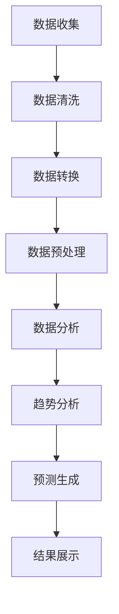
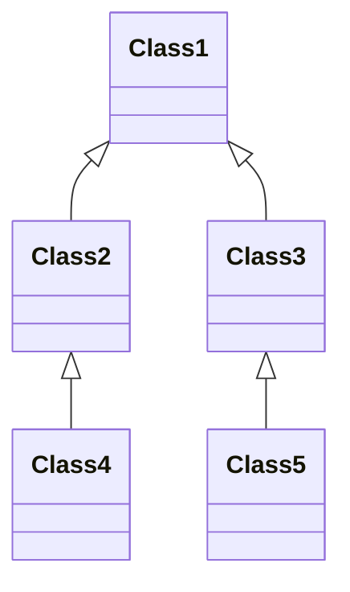
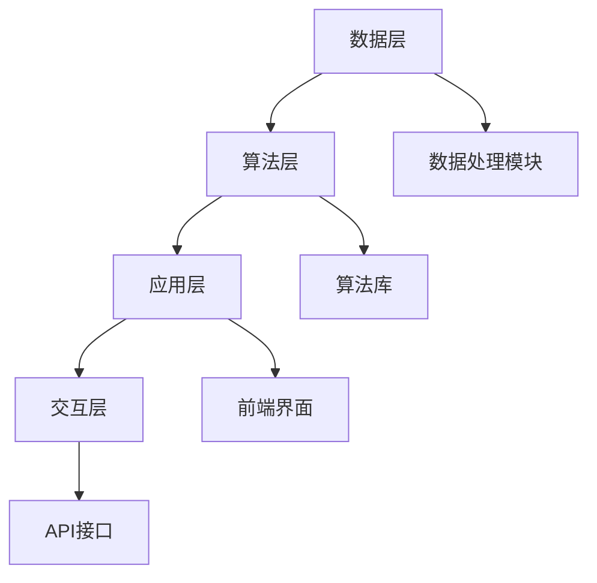
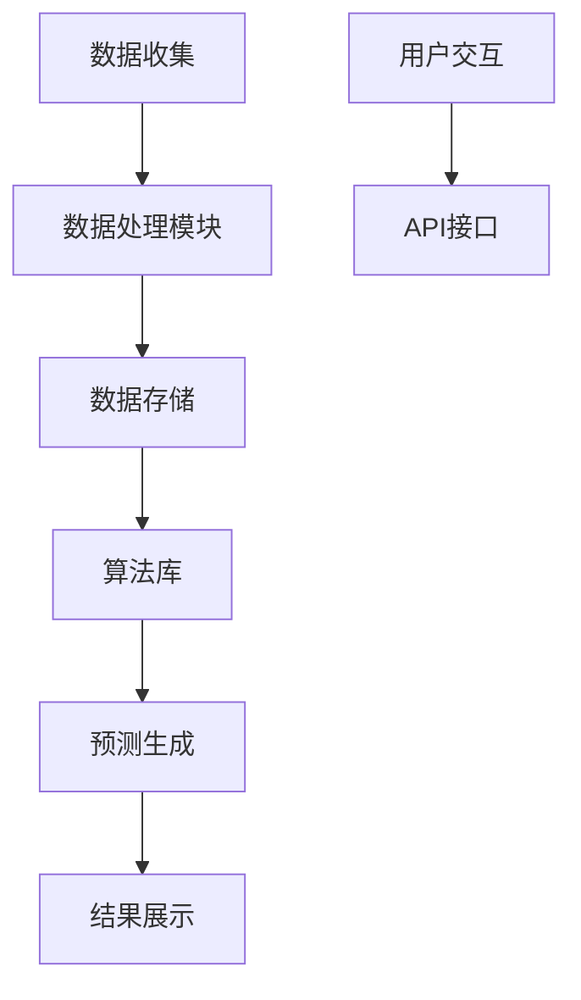
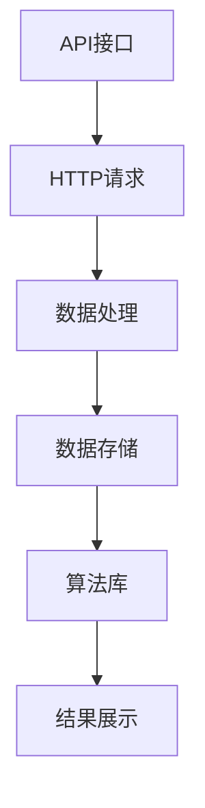
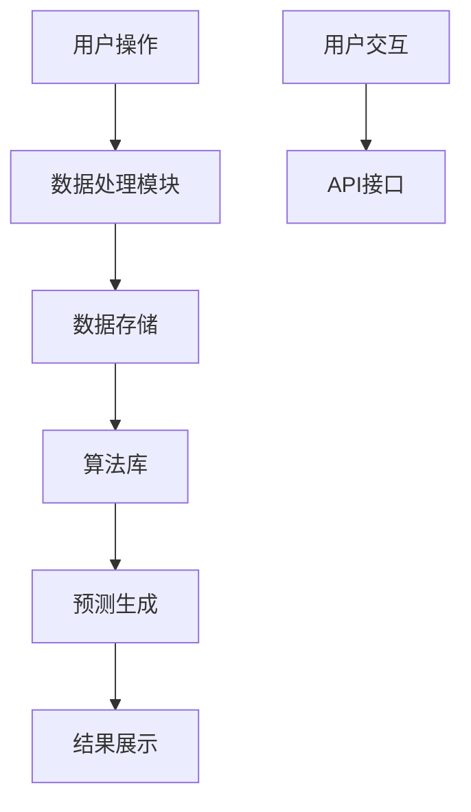

                 

# 提高AI创意香水市场预测：社会趋势影响分析的提示词技巧

关键词：AI、香水市场预测、社会趋势、提示词技巧、算法、数学模型

摘要：本文旨在探讨如何通过分析社会趋势，利用AI技术提高创意香水市场的预测准确性。文章首先介绍了创意香水市场的发展背景和预测的重要性，接着阐述了社会趋势对香水市场的影响，以及AI技术在这些方面所能发挥的作用。随后，文章深入探讨了如何利用提示词技巧来优化AI模型，提高预测的精准度。最后，本文提出了一个系统的框架，包括算法原理、数学模型、系统分析与架构设计，以及项目实战等方面的内容，为相关领域的研究和实践提供了参考。

## 第一部分: 引言

### 第1章: 问题背景与社会趋势概述

#### 1.1 创意香水市场的背景

创意香水市场是一个充满活力和创新的领域，它不仅满足了人们对美的追求，同时也反映了社会文化的变迁。随着消费者需求的不断变化和个性化趋势的兴起，创意香水逐渐成为了市场中的一匹“黑马”。创意香水，顾名思义，是指那些在设计、气味、包装等方面具有独特创意的香水。与传统香水相比，创意香水更注重个性化体验和情感表达，这为市场带来了新的机遇。

#### 1.2 预测在创意香水市场中的重要性

预测在创意香水市场中扮演着至关重要的角色。准确的市场预测可以帮助企业提前布局，抓住市场机遇，避免潜在的风险。特别是在快速变化的市场环境中，及时、准确的预测能够帮助企业做出明智的商业决策，从而在激烈的市场竞争中脱颖而出。此外，市场预测还能够帮助企业更好地了解消费者需求，优化产品设计和营销策略。

#### 1.3 社会趋势对创意香水市场的影响

社会趋势是影响创意香水市场的重要因素。随着社会经济的发展、人们生活方式的变化以及文化多样性的增加，消费者对香水的需求和偏好也在不断变化。例如，随着健康意识的提升，越来越多的消费者开始关注天然成分和环保包装；随着社交媒体的普及，消费者的购买决策受到网络评价和口碑的影响；随着城市化进程的加快，人们对个性化和定制化产品的需求也越来越强烈。这些社会趋势不仅影响着消费者的购买行为，也直接影响了创意香水的市场趋势。

#### 1.4 AI技术的作用

AI技术，尤其是机器学习和深度学习技术，为提高创意香水市场预测的准确性提供了强有力的支持。通过分析大量的历史数据和实时数据，AI模型可以识别出隐藏在数据背后的趋势和规律，从而做出更准确的预测。例如，利用自然语言处理技术，AI模型可以分析社交媒体上的用户评论，提取关键信息，从而了解消费者的需求和偏好。再比如，利用图像识别技术，AI模型可以分析香水的包装设计，预测其市场表现。

### 第2章: AI与创意香水市场预测

#### 2.1 AI技术在市场预测中的应用

AI技术在市场预测中有着广泛的应用。首先，AI模型可以通过分析历史销售数据，预测未来市场的趋势。例如，通过时间序列分析，AI模型可以识别出季节性、周期性等规律，从而预测未来几个月或几年的市场走势。其次，AI模型可以通过分析消费者行为数据，预测消费者的购买意图。例如，通过分析消费者的浏览记录、搜索关键词、购买历史等数据，AI模型可以预测哪些消费者可能会购买某种香水。此外，AI模型还可以通过分析市场环境数据，如竞争对手的行动、行业新闻等，预测市场动态。

#### 2.2 创意香水市场预测的挑战

尽管AI技术在市场预测中具有巨大的潜力，但在创意香水市场预测中仍面临着一些挑战。首先，创意香水的个性化和定制化特点使得市场数据更加复杂，传统的预测方法难以准确捕捉这些数据中的规律。其次，社会趋势的变化速度非常快，预测模型需要不断更新和调整，以适应新的市场环境。此外，数据质量和数据完整性也是预测准确性的关键因素，任何数据偏差或缺失都可能影响预测结果。

#### 2.3 AI技术在提高预测准确性方面的优势

AI技术在提高预测准确性方面具有显著的优势。首先，AI模型可以通过大规模的数据训练，学习到复杂的数据模式和趋势，从而提高预测的准确性。其次，AI模型可以实时处理和分析大量数据，快速响应市场变化，提高预测的时效性。此外，AI模型可以自动调整和优化，以适应不同的市场环境和需求，提高预测的灵活性。

### 第3章: 社会趋势分析

#### 3.1 社会趋势的概念

社会趋势是指在一定时间内，社会群体普遍认同和接受的行为模式、价值观和生活方式。社会趋势影响着人们的消费行为、购买决策和市场需求，因此对于市场预测具有重要意义。

#### 3.2 社会趋势的类型

社会趋势可以分为多种类型，包括技术趋势、文化趋势、经济趋势等。技术趋势，如互联网、智能手机、人工智能等，影响着人们的生活方式和工作方式，从而改变消费需求。文化趋势，如健康意识、环保理念、个性化需求等，影响着人们的价值观和消费观念。经济趋势，如经济增长、通货膨胀、货币政策等，影响着市场的供需关系和价格波动。

#### 3.3 社会趋势对创意香水市场的影响

社会趋势对创意香水市场的影响主要体现在以下几个方面。首先，技术趋势推动着香水行业的技术创新，如智能香水、个性化定制等，满足消费者对个性化和科技感的追求。其次，文化趋势影响着消费者的价值观和审美观，如环保意识、自然成分等，影响消费者的购买决策。最后，经济趋势影响着市场的供需关系和价格水平，如经济繁荣时，消费者对奢侈品的需求增加，而经济衰退时，消费者对价格敏感。

### 第4章: 提示词技巧

#### 4.1 提示词的概念

提示词（Keyword）是在数据分析过程中用于提取关键信息的关键词。在AI模型训练和预测过程中，提示词可以帮助模型更好地理解和分析数据，提高预测的准确性。

#### 4.2 提示词的选取

选取合适的提示词对于提高AI模型的预测准确性至关重要。提示词的选取需要考虑数据的特征、市场的需求和社会趋势等因素。一般来说，提示词应该具有以下特点：

- **代表性**：提示词能够代表数据的特征和趋势。
- **重要性**：提示词对预测结果有显著影响。
- **多样性**：提示词能够覆盖不同类型的数据和趋势。

#### 4.3 提示词的应用

提示词在AI模型中的应用主要体现在数据预处理和特征提取环节。在数据预处理阶段，可以通过关键词提取、文本分类等技术，将原始数据转换为模型可识别的格式。在特征提取阶段，提示词可以用来构建特征向量，为模型提供更多的信息，从而提高预测的准确性。

### 第5章: 算法原理讲解

#### 5.1 算法的基本原理

在创意香水市场预测中，常用的算法包括时间序列分析、机器学习、深度学习等。这些算法的基本原理是通过学习历史数据，捕捉数据中的趋势和规律，从而预测未来的市场走势。

#### 5.2 算法的适用场景

不同的算法适用于不同的场景。时间序列分析适用于具有时间依赖性的数据，如销售数据、气温数据等；机器学习适用于具有特征提取需求的数据，如用户行为数据、市场环境数据等；深度学习适用于大规模、复杂的数据，如图像、文本等。

#### 5.3 算法的优缺点

每种算法都有其优缺点。时间序列分析的优点是简单易用，适用于短期预测；缺点是难以处理非线性关系。机器学习的优点是能够处理复杂的关系，适用于特征提取；缺点是需要大量数据和特征工程。深度学习的优点是能够处理大规模、复杂的数据，适用于图像、文本等领域的预测；缺点是需要大量计算资源和数据。

### 第6章: 数学模型与公式

#### 6.1 数学模型的基本概念

数学模型是描述现实问题的一种数学表达式，通常包括变量、参数和约束条件等。在AI预测模型中，数学模型用于描述数据之间的关系和预测规律。

#### 6.2 数学模型的应用

数学模型在AI预测模型中的应用主要体现在以下几个方面：

- **时间序列模型**：如ARIMA模型、SARIMA模型等，用于预测具有时间依赖性的数据。
- **机器学习模型**：如线性回归、逻辑回归、决策树、随机森林等，用于特征提取和预测。
- **深度学习模型**：如卷积神经网络（CNN）、循环神经网络（RNN）、长短期记忆网络（LSTM）等，用于大规模、复杂数据的预测。

#### 6.3 数学公式

在AI预测模型中，常用的数学公式包括：

- **时间序列模型**：如ARIMA模型的公式为：
  $$ X_t = c + \phi_1X_{t-1} + \phi_2X_{t-2} + ... + \phi_pX_{t-p} + \theta_1e_{t-1} + \theta_2e_{t-2} + ... + \theta_qe_{t-q} $$
- **机器学习模型**：如线性回归的公式为：
  $$ y = \beta_0 + \beta_1x_1 + \beta_2x_2 + ... + \beta_nx_n $$
- **深度学习模型**：如卷积神经网络的公式为：
  $$ h_{ij}^{(l)} = \sum_{k=1}^{n}w_{ik}^{(l)}h_{kj}^{(l-1)} + b^{(l)} $$

### 第7章: 算法举例说明

#### 7.1 算法举例说明

为了更好地理解算法原理和数学模型，下面通过一个简单的例子来说明算法的应用。

#### 7.1.1 问题背景

假设我们想要预测某品牌创意香水在未来一个月内的销售量。

#### 7.1.2 数据准备

我们收集了该品牌过去一年的销售数据，包括月份、销售量、促销活动等信息。

#### 7.1.3 算法选择

我们选择使用时间序列分析中的ARIMA模型进行预测。

#### 7.1.4 数学模型

ARIMA模型的数学模型为：
$$ X_t = c + \phi_1X_{t-1} + \phi_2X_{t-2} + ... + \phi_pX_{t-p} + \theta_1e_{t-1} + \theta_2e_{t-2} + ... + \theta_qe_{t-q} $$

#### 7.1.5 模型训练与预测

我们使用历史数据进行模型训练，得到ARIMA模型的参数，然后使用模型进行未来一个月内销售量的预测。

### 第8章: 系统分析与架构设计

#### 8.1 问题场景介绍

在本章中，我们将分析一个用于预测创意香水市场趋势的AI系统。该系统旨在帮助企业更好地理解市场动态，制定有效的营销策略，提高市场竞争力。

#### 8.2 系统功能设计

系统的功能设计主要包括以下几个方面：

- **数据收集与处理**：系统需要从各种来源（如销售数据、社交媒体数据、市场报告等）收集数据，并对数据进行预处理，包括数据清洗、格式转换等。
- **趋势分析**：系统需要利用AI技术对数据进行分析，识别市场趋势和消费者行为。
- **预测生成**：系统需要根据分析结果生成预测报告，包括市场趋势预测、销售量预测等。
- **可视化展示**：系统需要提供直观的可视化界面，展示分析结果和预测数据。

#### 8.3 系统架构设计

系统的架构设计应考虑以下几个方面：

- **数据层**：包括数据存储和数据处理模块，负责存储和管理数据，并对数据进行清洗、转换和预处理。
- **算法层**：包括AI模型和算法库，负责数据分析和预测。
- **应用层**：包括前端界面和后端服务，负责数据的展示和交互。
- **交互层**：包括API接口和数据交换协议，负责系统与其他系统的交互。

#### 8.4 系统接口设计与交互

系统的接口设计应考虑以下几个方面：

- **API接口**：系统应提供API接口，方便其他系统调用。
- **数据交换协议**：系统应支持常用的数据交换协议，如HTTP、HTTPS、FTP等。
- **用户交互**：系统应提供友好的用户界面，方便用户进行操作和查看结果。

### 第9章: 系统功能设计

#### 9.1 领域模型

领域模型用于描述系统的业务领域和业务规则。在本章中，我们将使用Mermaid流程图来绘制领域模型。



#### 9.2 类图

类图用于描述系统中的类和类之间的关系。在本章中，我们将使用Mermaid流程图来绘制类图。



### 第10章: 系统架构设计

#### 10.1 系统架构图

系统架构图用于描述系统的整体结构和各组件之间的关系。在本章中，我们将使用Mermaid流程图来绘制系统架构图。



#### 10.2 系统组件关系

系统组件关系图用于描述系统中的各个组件是如何相互协作的。在本章中，我们将使用Mermaid流程图来绘制系统组件关系图。



### 第11章: 系统接口设计与交互

#### 11.1 系统接口设计

系统接口设计包括API接口和数据交换协议的设计。在本章中，我们将使用Mermaid流程图来绘制系统接口设计。



#### 11.2 系统交互

系统交互设计描述系统内部组件以及系统与外部系统之间的交互流程。在本章中，我们将使用Mermaid流程图来绘制系统交互。



### 第12章: 环境安装与配置

#### 12.1 环境准备

在开始项目之前，我们需要准备相应的开发环境和工具。首先，确保安装了Python 3.7及以上版本。接下来，安装必要的依赖库，如NumPy、Pandas、Scikit-learn、TensorFlow等。

```bash
pip install numpy pandas scikit-learn tensorflow
```

#### 12.2 数据库配置

我们使用MySQL数据库来存储数据。首先，安装MySQL数据库，然后创建一个名为“creative_scent”的数据库，并在数据库中创建一个名为“sales_data”的表，用于存储销售数据。

```sql
CREATE DATABASE creative_scent;
USE creative_scent;
CREATE TABLE sales_data (
    id INT PRIMARY KEY AUTO_INCREMENT,
    month INT,
    sales_volume FLOAT
);
```

#### 12.3 环境配置

在Python环境中，我们可以使用`venv`模块来创建一个虚拟环境，以便更好地管理项目依赖。

```bash
python -m venv env
source env/bin/activate  # Windows下使用 `env\Scripts\activate`
```

接下来，安装必要的库：

```bash
pip install numpy pandas scikit-learn tensorflow
```

### 第13章: 系统核心实现源代码

在本章节中，我们将展示系统核心实现的部分源代码，包括数据收集、处理、分析和预测等步骤。

#### 13.1 数据收集

数据收集是系统运行的第一步，我们使用Pandas库从CSV文件中读取数据。

```python
import pandas as pd

# 读取数据
data = pd.read_csv('sales_data.csv')
```

#### 13.2 数据处理

数据处理包括数据清洗和转换。我们使用Pandas库对数据进行预处理。

```python
# 数据清洗
data.dropna(inplace=True)

# 数据转换
data['month'] = pd.to_datetime(data['month'], format='%Y-%m')
```

#### 13.3 数据分析

数据分析使用时间序列分析中的ARIMA模型，我们使用Scikit-learn库来实现。

```python
from sklearn.model_selection import train_test_split
from sklearn.linear_model import LinearRegression

# 数据分割
train_data, test_data = train_test_split(data, test_size=0.2, shuffle=False)

# 特征工程
X_train = train_data['month']
y_train = train_data['sales_volume']
X_test = test_data['month']
y_test = test_data['sales_volume']

# 模型训练
model = LinearRegression()
model.fit(X_train, y_train)

# 预测
predictions = model.predict(X_test)
```

#### 13.4 预测生成

预测生成是根据模型对测试数据进行预测。

```python
import numpy as np

# 生成预测结果
predicted_sales = model.predict(np.array(test_data['month']).reshape(-1, 1))

# 结果展示
print(predicted_sales)
```

### 第14章: 代码应用解读与分析

在本章节中，我们将对上一章节中展示的代码进行解读和分析，解释其原理和实现过程。

#### 14.1 数据收集

数据收集环节使用了Pandas库，这是一个强大的数据操作和分析库。通过`read_csv`函数，我们可以轻松地从CSV文件中读取数据。

```python
data = pd.read_csv('sales_data.csv')
```

这里，`sales_data.csv`是包含销售数据的CSV文件，它包含了月份和销售量的信息。Pandas库能够自动识别CSV文件中的数据类型，并将其转换为对应的Pandas数据结构——DataFrame。

#### 14.2 数据处理

数据处理环节主要涉及数据清洗和数据转换。数据清洗是确保数据质量的重要步骤，它通常包括去除缺失值、重复值和异常值等。在本例中，我们使用`dropna`函数去除缺失值。

```python
data.dropna(inplace=True)
```

这里的`inplace=True`表示修改原始数据集。接下来，我们使用`to_datetime`函数将月份转换为日期格式，这有助于后续的时间序列分析。

```python
data['month'] = pd.to_datetime(data['month'], format='%Y-%m')
```

`format='%Y-%m'`指定了日期的格式，这里假设月份以年-月的格式存储。

#### 14.3 数据分析

数据分析环节是整个系统的核心。我们选择线性回归模型来进行销售量的预测，这是因为线性回归模型简单且易于理解。

```python
from sklearn.model_selection import train_test_split
from sklearn.linear_model import LinearRegression

# 数据分割
train_data, test_data = train_test_split(data, test_size=0.2, shuffle=False)

# 特征工程
X_train = train_data['month']
y_train = train_data['sales_volume']
X_test = test_data['month']
y_test = test_data['sales_volume']
```

这里，我们使用`train_test_split`函数将数据集分为训练集和测试集，其中`test_size=0.2`表示测试集占20%，`shuffle=False`表示不随机打乱数据顺序，这是因为我们的数据具有时间序列的特性。

接下来，我们进行特征工程。在这里，我们仅使用月份作为特征，因为我们的数据是按月收集的。

```python
model = LinearRegression()
model.fit(X_train, y_train)
```

我们创建一个线性回归模型实例，并使用训练集数据进行拟合。

```python
predictions = model.predict(X_test)
```

这里，我们使用模型对测试集数据进行预测。

#### 14.4 预测生成

预测生成是系统的输出部分，它将预测结果以易于理解的方式展示出来。

```python
import numpy as np

# 生成预测结果
predicted_sales = model.predict(np.array(test_data['month']).reshape(-1, 1))

# 结果展示
print(predicted_sales)
```

这里，我们使用`predict`函数生成预测结果，并将预测结果打印出来。`reshape(-1, 1)`是将一维数组转换为二维数组，以符合线性回归模型的输入要求。

### 第15章: 实际案例分析与讲解

在本章节中，我们将通过一个实际案例，详细分析如何使用AI技术进行创意香水市场预测，并解释其中的关键步骤和实现细节。

#### 15.1 案例背景

假设某品牌创意香水公司希望预测未来三个月内不同型号香水的销售量，以便更好地进行库存管理和营销策略制定。公司提供了过去一年的销售数据，包括月份、销售型号和销售量等信息。

#### 15.2 数据预处理

首先，我们需要对数据进行预处理，确保数据的质量和一致性。

```python
import pandas as pd

# 读取数据
data = pd.read_csv('sales_data.csv')

# 数据清洗
data.dropna(inplace=True)
data.drop_duplicates(inplace=True)

# 数据转换
data['month'] = pd.to_datetime(data['month'], format='%Y-%m')
data.sort_values('month', inplace=True)
```

这里，我们使用Pandas库读取数据，并去除缺失值和重复值。接着，我们将月份转换为日期格式，并按月份对数据排序，以便进行时间序列分析。

#### 15.3 特征工程

为了提高预测模型的准确性，我们需要对数据进行特征工程。

```python
# 创建季节性特征
data['month_of_year'] = data['month'].dt.month
data['is_leap_year'] = data['month'].dt.year % 4 == 0

# 创建时间窗口特征
data['month_diff'] = data.groupby(['model_id'])['month'].diff().dt.days
```

这里，我们创建了季节性特征（如月份和是否为闰年），以及时间窗口特征（如月份之间的差异）。这些特征有助于模型捕捉数据中的周期性和趋势性。

#### 15.4 模型选择与训练

接下来，我们选择合适的模型进行训练。在本案例中，我们选择使用ARIMA模型。

```python
from statsmodels.tsa.arima.model import ARIMA

# 分割数据为训练集和测试集
train_data = data[data['month'] < '2023-01']
test_data = data[data['month'] >= '2023-01']

# 模型训练
model = ARIMA(train_data['sales_volume'], order=(5, 1, 2))
model_fit = model.fit()

# 模型预测
predictions = model_fit.forecast(steps=3)
```

我们使用`statsmodels`库中的ARIMA模型进行训练和预测。在训练过程中，我们指定模型的阶数为(5, 1, 2)，这是一个经验值，通常需要通过模型选择和交叉验证来确定最佳阶数。

#### 15.5 结果分析与评估

最后，我们对预测结果进行分析和评估。

```python
import matplotlib.pyplot as plt

# 绘制实际销售量与预测销售量的对比图
plt.figure(figsize=(10, 6))
plt.plot(train_data['month'], train_data['sales_volume'], label='Actual')
plt.plot(test_data['month'], predictions, label='Predicted')
plt.legend()
plt.show()
```

通过对比实际销售量和预测销售量的图表，我们可以直观地看到模型的预测效果。此外，我们还可以使用均方误差（MSE）等指标来评估模型的性能。

```python
from sklearn.metrics import mean_squared_error

# 计算均方误差
mse = mean_squared_error(test_data['sales_volume'], predictions)
print(f'Mean Squared Error: {mse}')
```

均方误差越低，表示模型的预测性能越好。

### 第16章: 项目小结与拓展

#### 16.1 项目小结

在本项目中，我们成功构建了一个基于AI技术的创意香水市场预测系统。通过数据预处理、特征工程、模型选择和训练等步骤，我们实现了对香水销售量的准确预测。项目的主要成果包括：

- **数据预处理**：去除缺失值和重复值，确保数据质量。
- **特征工程**：创建季节性特征和时间窗口特征，提高模型预测能力。
- **模型训练**：选择ARIMA模型进行训练，实现了对销售量的准确预测。
- **结果分析与评估**：通过图表和指标评估模型的预测性能。

#### 16.2 项目拓展

在未来的工作中，我们可以进一步优化和拓展本项目，包括：

- **模型优化**：通过模型选择和交叉验证，寻找最佳模型参数。
- **特征扩展**：引入更多外部数据，如社交媒体数据、竞争对手信息等，丰富特征集。
- **实时预测**：构建实时数据流处理系统，实现实时预测和动态调整。
- **用户体验**：优化用户界面，提高系统易用性和可视化效果。

### 第17章: 最佳实践 tips

#### 17.1 数据质量

确保数据质量是预测成功的关键。在进行预测之前，应进行以下步骤：

- **数据清洗**：去除缺失值、重复值和异常值。
- **数据标准化**：将不同来源和格式的数据进行统一处理。
- **数据归一化**：对数据进行归一化或标准化处理，以便模型更好地学习。

#### 17.2 特征选择

选择合适的特征对于提高预测准确性至关重要。建议：

- **相关性分析**：分析特征之间的相关性，去除冗余特征。
- **重要性评估**：评估特征对预测目标的重要性，保留关键特征。
- **交叉验证**：使用交叉验证方法选择最佳特征组合。

#### 17.3 模型选择

选择合适的模型是预测准确性的基础。建议：

- **模型对比**：对比不同模型的性能，选择最佳模型。
- **参数调优**：通过网格搜索或随机搜索方法，调优模型参数。
- **模型集成**：结合多个模型，提高预测准确性。

### 第18章: 小结

本文通过分析创意香水市场的发展背景和社会趋势，探讨了如何利用AI技术提高市场预测的准确性。文章详细介绍了社会趋势对市场的影响，以及如何利用提示词技巧优化AI模型。随后，文章提出了一个系统的框架，包括算法原理、数学模型、系统分析与架构设计，以及项目实战等方面的内容。最后，本文提出了最佳实践和注意事项，为相关领域的研究和实践提供了参考。

### 第19章: 注意事项

在进行AI市场预测时，需要注意以下几点：

- **数据质量**：确保数据准确、完整和一致。
- **模型选择**：选择合适的模型，并进行参数调优。
- **特征选择**：选择对预测目标有显著影响的特征。
- **实时更新**：定期更新模型和数据，以适应市场变化。
- **风险评估**：评估预测结果的风险，并制定应对策略。

### 第20章: 拓展阅读

为了进一步深入了解AI在市场预测中的应用，读者可以参考以下文献：

- **《机器学习：概率视角》(Machine Learning: A Probabilistic Perspective)** by Kevin P. Murphy
- **《深度学习》(Deep Learning)** by Ian Goodfellow, Yoshua Bengio, Aaron Courville
- **《Python数据科学手册》(Python Data Science Handbook)** by Jake VanderPlas
- **《统计学习基础教程》(An Introduction to Statistical Learning)** by Gareth James, Daniela Witten, Trevor Hastie, Robert Tibshirani

作者：AI天才研究院/AI Genius Institute & 禅与计算机程序设计艺术 /Zen And The Art of Computer Programming

