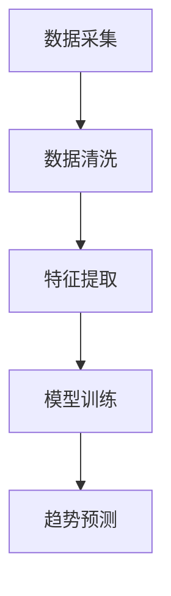
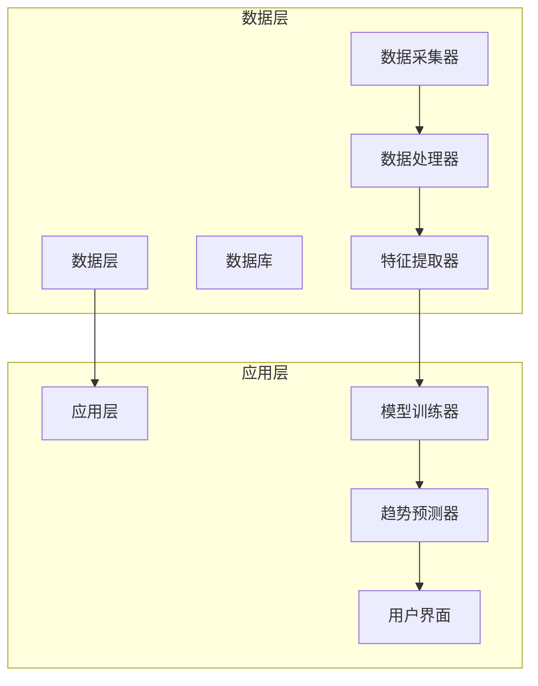
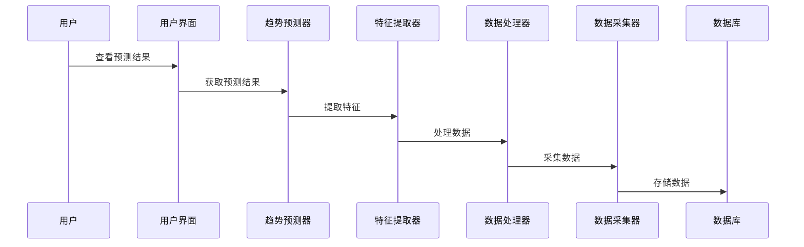

                 

### 提高AI创意香水趋势预测：全球文化融合分析的提示词技巧

#### 关键词
- AI趋势预测
- 文化融合
- 提示词技巧
- 创意香水
- 全球市场分析

#### 摘要
本文将探讨如何通过人工智能（AI）技术，特别是提示词技巧，来提高创意香水趋势预测的准确性。我们将分析全球文化融合对香水趋势的影响，并详细介绍使用AI进行预测的算法原理、系统架构设计方案以及实际项目实战。最后，我们将提供一些最佳实践和拓展阅读资源，帮助读者深入理解和应用相关技术。

## 第一部分：背景与基础

### 1. 引言

#### 1.1 问题背景与重要性

创意香水市场是一个高度竞争且不断变化的领域。随着消费者需求的多样化和全球文化的融合，香水品牌需要快速准确地捕捉趋势，以保持竞争力。传统的市场调研方法通常耗时且成本高昂，而人工智能技术的出现为快速、准确的趋势预测提供了新的可能性。

AI技术在各个领域已经取得了显著成果，特别是在图像识别、自然语言处理和数据分析等方面。将AI应用于创意香水趋势预测，不仅可以提高预测的准确性，还可以降低成本，加快市场响应速度。

#### 1.2 创意香水市场概况

创意香水市场涵盖了从高端定制香水到大众市场香水的一系列产品。随着消费者对个性化、独特体验的追求，创意香水逐渐成为市场热点。不同文化和地域的消费者对香水的喜好存在显著差异，这为趋势预测带来了挑战。

#### 1.3 全球文化融合对香水趋势预测的影响

全球文化融合使得香水市场的趋势更加复杂。不同文化之间的交流和融合不仅影响了消费者的购买行为，也影响了香水的创作灵感。例如，东方香料与西方香水的结合，以及跨文化的品牌合作，都为香水市场带来了新的趋势。

#### 1.4 本书结构安排

本文分为四个部分：

1. **背景与基础**：介绍AI技术、创意香水市场概况和全球文化融合对香水趋势预测的影响。
2. **核心概念与联系**：探讨AI创意香水趋势预测的概念、数据分析和模型训练、提示词技巧以及全球文化融合分析框架。
3. **算法原理与系统架构**：讲解算法原理、系统架构设计以及相关技术。
4. **项目实战与拓展**：通过实际项目展示应用，并提供最佳实践和拓展阅读资源。

### 2. AI技术基础

#### 2.1 AI概述与发展趋势

人工智能（AI）是指通过计算机模拟人类智能的技术。它涵盖了从简单的规则系统到复杂的深度学习算法的广泛领域。随着计算能力和算法的进步，AI在各个行业中的应用越来越广泛。

AI的发展趋势包括：

- 深度学习的突破，使得图像识别和语音识别等领域的准确率显著提高。
- 强化学习的应用，使得机器人能够通过试错学习复杂的任务。
- 生成对抗网络（GAN）的兴起，使得生成逼真的图像和音频成为可能。

#### 2.2 数据分析与模型训练

数据分析是AI应用的核心。在创意香水趋势预测中，数据包括市场调研数据、消费者行为数据、社交媒体数据等。通过数据分析，可以从海量数据中提取有价值的信息。

模型训练是AI技术的核心环节。在趋势预测中，常用的模型包括：

- 机器学习模型，如决策树、支持向量机等。
- 深度学习模型，如卷积神经网络（CNN）、循环神经网络（RNN）等。
- 强化学习模型，如Q-learning、深度Q网络（DQN）等。

#### 2.3 AI在香水趋势预测中的应用

AI在香水趋势预测中的应用主要包括：

- 数据采集与处理：使用AI技术收集和处理大量数据，如消费者评论、市场报告等。
- 特征提取：从数据中提取有助于预测的特征，如评论的情感倾向、品牌的流行度等。
- 模型训练与优化：使用历史数据训练模型，并不断优化以提高预测准确性。
- 预测与评估：使用模型进行趋势预测，并对预测结果进行评估和调整。

### 3. 提示词技巧

#### 3.1 提示词概念与作用

提示词（Prompt）是指用于引导AI模型进行特定任务的一系列关键词或句子。在香水趋势预测中，提示词的作用包括：

- 引导数据采集：通过提示词，可以明确数据采集的方向和重点。
- 提升模型效果：合理的提示词可以提高模型的预测准确性。
- 灵活调整预测范围：提示词可以帮助调整模型预测的时间范围和空间范围。

#### 3.2 提示词设计原则

设计提示词时，应遵循以下原则：

- **明确性**：提示词应明确表达预测任务，避免模糊不清。
- **相关性**：提示词应与预测任务高度相关，有助于模型学习。
- **多样性**：提示词应涵盖不同角度和维度，以提高模型的泛化能力。
- **可调整性**：提示词应具有一定的灵活性，可以根据预测任务进行调整。

#### 3.3 提示词在AI中的应用

在AI创意香水趋势预测中，提示词的应用包括：

- 数据预处理：使用提示词对原始数据进行预处理，提取有用信息。
- 模型训练：使用提示词引导模型训练，提高预测准确性。
- 模型优化：通过调整提示词，优化模型参数，提高预测效果。
- 预测任务调整：根据提示词，灵活调整预测任务的范围和目标。

### 4. 全球文化融合分析框架

#### 4.1 文化融合概述

文化融合是指不同文化之间的相互影响和整合。在全球化的背景下，文化融合已成为不可避免的趋势。文化融合对香水趋势预测的影响体现在：

- 消费者行为变化：文化融合影响了消费者的购买习惯和喜好。
- 品牌策略调整：品牌需要适应不同文化的消费者需求，调整产品策略。
- 创意灵感来源：文化融合为香水创作提供了新的灵感来源。

#### 4.2 文化融合分析方法

分析文化融合对香水趋势预测的影响，可以使用以下方法：

- **文献分析**：通过查阅相关文献，了解不同文化对香水市场的潜在影响。
- **市场调研**：通过市场调研，收集不同文化背景消费者的香水偏好数据。
- **案例研究**：分析成功的文化融合案例，了解其对香水趋势预测的实际影响。
- **数据挖掘**：使用数据挖掘技术，从大量数据中提取有价值的文化融合趋势信息。

#### 4.3 文化融合对香水趋势预测的影响

文化融合对香水趋势预测的影响主要体现在以下几个方面：

- **消费者需求多样化**：文化融合使得消费者对香水的需求更加多样化，品牌需要提供更多样化的产品。
- **灵感来源丰富化**：文化融合为香水创作提供了丰富的灵感来源，品牌可以创作更具创新性的香水。
- **市场变化复杂化**：文化融合使得香水市场变化更加复杂，预测难度增加。

## 第二部分：核心概念与联系

### 5. AI创意香水趋势预测的概念

#### 5.1 创意香水趋势预测的定义

创意香水趋势预测是指利用人工智能技术，对创意香水的市场趋势进行预测的过程。它涉及从大量数据中提取有价值的信息，并通过算法分析，预测未来一段时间内创意香水的市场表现。

#### 5.2 创意香水趋势预测的核心要素

创意香水趋势预测的核心要素包括：

- **数据采集**：收集与香水市场相关的数据，如市场报告、消费者评论、社交媒体数据等。
- **特征提取**：从数据中提取有助于预测的特征，如消费者喜好、品牌知名度、市场动态等。
- **模型训练**：使用历史数据训练预测模型，提高预测准确性。
- **趋势预测**：使用训练好的模型进行香水趋势预测，并对预测结果进行分析和调整。

#### 5.3 创意香水趋势预测与数据分析的关系

数据分析是创意香水趋势预测的核心。通过数据分析，可以从海量数据中提取有价值的信息，为趋势预测提供数据支持。具体来说，数据分析在创意香水趋势预测中的应用包括：

- **数据清洗**：清洗和整理原始数据，去除噪声和异常值。
- **特征工程**：从原始数据中提取有助于预测的特征，提高模型的预测能力。
- **模型评估**：评估模型的预测性能，选择最优模型进行趋势预测。
- **结果分析**：分析预测结果，识别市场趋势和变化。

### 6. 数据分析与模型训练

#### 6.1 数据分析的基本流程

数据分析的基本流程包括以下步骤：

1. **数据采集**：从各种数据源收集与香水市场相关的数据。
2. **数据清洗**：清洗和整理原始数据，去除噪声和异常值。
3. **特征提取**：从数据中提取有助于预测的特征。
4. **模型选择**：选择合适的预测模型。
5. **模型训练**：使用历史数据训练预测模型。
6. **模型评估**：评估模型的预测性能。
7. **趋势预测**：使用训练好的模型进行香水趋势预测。

#### 6.2 模型训练的基本流程

模型训练的基本流程包括以下步骤：

1. **数据预处理**：对数据进行归一化、标准化等处理，使数据符合模型的要求。
2. **模型初始化**：初始化模型参数，选择合适的优化器和损失函数。
3. **训练数据划分**：将数据划分为训练集、验证集和测试集。
4. **模型训练**：使用训练集对模型进行训练。
5. **模型评估**：使用验证集和测试集评估模型性能。
6. **模型优化**：根据评估结果，调整模型参数和结构，提高预测性能。
7. **趋势预测**：使用训练好的模型进行香水趋势预测。

### 7. 提示词在AI中的应用

#### 7.1 提示词的基本概念

提示词（Prompt）是用于引导AI模型进行特定任务的一系列关键词或句子。在AI创意香水趋势预测中，提示词的作用包括：

- 引导数据采集：通过提示词，明确数据采集的方向和重点。
- 提升模型效果：合理的提示词可以提高模型的预测准确性。
- 灵活调整预测范围：提示词可以帮助调整模型预测的时间范围和空间范围。

#### 7.2 提示词设计的原则

设计提示词时，应遵循以下原则：

- **明确性**：提示词应明确表达预测任务，避免模糊不清。
- **相关性**：提示词应与预测任务高度相关，有助于模型学习。
- **多样性**：提示词应涵盖不同角度和维度，以提高模型的泛化能力。
- **可调整性**：提示词应具有一定的灵活性，可以根据预测任务进行调整。

#### 7.3 提示词在趋势预测中的应用

在AI创意香水趋势预测中，提示词的应用包括：

- **数据预处理**：使用提示词对原始数据进行预处理，提取有用信息。
- **模型训练**：使用提示词引导模型训练，提高预测准确性。
- **模型优化**：通过调整提示词，优化模型参数，提高预测效果。
- **趋势预测**：根据提示词，灵活调整预测任务的范围和目标。

### 8. 全球文化融合分析框架

#### 8.1 文化融合的定义

文化融合是指不同文化之间的相互影响和整合。在全球化的背景下，文化融合已成为不可避免的趋势。文化融合对香水趋势预测的影响体现在：

- 消费者行为变化：文化融合影响了消费者的购买习惯和喜好。
- 品牌策略调整：品牌需要适应不同文化的消费者需求，调整产品策略。
- 创意灵感来源：文化融合为香水创作提供了新的灵感来源。

#### 8.2 文化融合分析方法

分析文化融合对香水趋势预测的影响，可以使用以下方法：

- **文献分析**：通过查阅相关文献，了解不同文化对香水市场的潜在影响。
- **市场调研**：通过市场调研，收集不同文化背景消费者的香水偏好数据。
- **案例研究**：分析成功的文化融合案例，了解其对香水趋势预测的实际影响。
- **数据挖掘**：使用数据挖掘技术，从大量数据中提取有价值的文化融合趋势信息。

#### 8.3 文化融合对香水趋势预测的影响

文化融合对香水趋势预测的影响主要体现在以下几个方面：

- **消费者需求多样化**：文化融合使得消费者对香水的需求更加多样化，品牌需要提供更多样化的产品。
- **灵感来源丰富化**：文化融合为香水创作提供了丰富的灵感来源，品牌可以创作更具创新性的香水。
- **市场变化复杂化**：文化融合使得香水市场变化更加复杂，预测难度增加。

## 第三部分：算法原理与系统架构

### 9. 算法原理讲解

#### 9.1 算法选择与设计

在创意香水趋势预测中，选择合适的算法至关重要。以下是一些常用的算法及其适用场景：

- **回归算法**：适用于预测连续值，如香水的销售额。
- **分类算法**：适用于预测离散值，如消费者喜好。
- **聚类算法**：适用于发现消费者群体的特征。
- **时间序列分析**：适用于分析香水销售时间序列，预测未来趋势。

选择算法时，应考虑以下因素：

- **数据特征**：数据类型和特征数量会影响算法的选择。
- **预测目标**：预测目标是连续值还是离散值。
- **模型复杂性**：复杂模型可能提供更高的预测准确度，但计算成本也更高。

#### 9.2 数据处理流程与算法mermaid流程图

数据处理流程包括数据采集、数据清洗、特征提取和模型训练等步骤。以下是一个mermaid流程图示例：



#### 9.3 数学模型与公式讲解

在创意香水趋势预测中，常用的数学模型包括线性回归、逻辑回归、神经网络等。以下是一个线性回归模型的示例：

$$y = \beta_0 + \beta_1x_1 + \beta_2x_2 + ... + \beta_nx_n$$

其中，$y$是预测值，$x_1, x_2, ..., x_n$是输入特征，$\beta_0, \beta_1, ..., \beta_n$是模型参数。

#### 9.4 实例说明

假设我们要预测一款新香水的销售额。我们可以使用线性回归模型进行预测。以下是一个简单的实例：

1. 数据采集：收集过去一年的香水销售额数据。
2. 数据清洗：去除异常值和缺失值。
3. 特征提取：提取与销售额相关的特征，如消费者年龄、性别、购买频率等。
4. 模型训练：使用线性回归模型训练数据，得到模型参数。
5. 趋势预测：使用训练好的模型预测未来三个月的销售额。

### 10. 系统分析与架构设计方案

#### 10.1 问题场景介绍

假设我们要开发一个AI创意香水趋势预测系统，系统需要具备以下功能：

- 数据采集：从多个数据源（如市场报告、社交媒体、消费者评论等）收集香水相关数据。
- 数据处理：对数据进行清洗、归一化等处理。
- 特征提取：提取与香水趋势预测相关的特征。
- 模型训练：使用历史数据训练预测模型。
- 趋势预测：使用训练好的模型预测未来香水市场趋势。
- 用户界面：提供直观的用户界面，展示预测结果。

#### 10.2 系统功能设计（类图）

以下是一个类图示例，展示系统的主要功能类：

```mermaid
classDiagram
ClassDiagram {
    Class DataCollector {
        - String dataSource
        - void collectData()
    }
    Class DataProcessor {
        - void cleanData()
        - void normalizeData()
    }
    Class FeatureExtractor {
        - void extractFeatures()
    }
    Class ModelTrainer {
        - void trainModel()
    }
    Class TrendPredictor {
        - void predictTrends()
    }
    Class UserInterface {
        - void displayResults()
    }
}
DataCollector --> DataProcessor
DataProcessor --> FeatureExtractor
FeatureExtractor --> ModelTrainer
ModelTrainer --> TrendPredictor
TrendPredictor --> UserInterface
```

#### 10.3 系统架构设计（架构图）

以下是一个系统架构图示例，展示系统的整体架构：



#### 10.4 系统接口设计与交互（序列图）

以下是一个序列图示例，展示系统的接口设计和交互流程：



## 第四部分：项目实战

### 11. 项目实战

#### 11.1 环境安装与配置

在进行AI创意香水趋势预测项目之前，我们需要安装和配置以下环境和工具：

- **Python**：安装Python 3.8及以上版本。
- **Jupyter Notebook**：安装Jupyter Notebook，用于编写和运行代码。
- **Pandas**：用于数据处理和分析。
- **Scikit-learn**：用于机器学习和模型训练。
- **TensorFlow**：用于深度学习和神经网络。
- **Mermaid**：用于绘制mermaid流程图和序列图。

安装命令示例：

```bash
pip install python==3.8
pip install jupyter
pip install pandas scikit-learn tensorflow mermaid
```

#### 11.2 系统核心实现与源代码分析

以下是一个简单的系统核心实现示例，包括数据采集、数据处理、特征提取和趋势预测等部分：

```python
import pandas as pd
from sklearn.model_selection import train_test_split
from sklearn.linear_model import LinearRegression
from sklearn.metrics import mean_squared_error

# 数据采集
def collect_data():
    data = pd.read_csv('data.csv')
    return data

# 数据处理
def process_data(data):
    data['sales'] = data['sales'].fillna(data['sales'].mean())
    data['age'] = data['age'].fillna(data['age'].mean())
    return data

# 特征提取
def extract_features(data):
    features = data[['age', 'gender', 'purchase_frequency']]
    labels = data['sales']
    return features, labels

# 模型训练
def train_model(features, labels):
    model = LinearRegression()
    model.fit(features, labels)
    return model

# 趋势预测
def predict_trends(model, new_data):
    predictions = model.predict(new_data)
    return predictions

# 主程序
if __name__ == '__main__':
    data = collect_data()
    data = process_data(data)
    features, labels = extract_features(data)
    model = train_model(features, labels)
    new_data = pd.DataFrame({'age': [25, 30, 35], 'gender': ['M', 'F', 'M'], 'purchase_frequency': [5, 10, 15]})
    predictions = predict_trends(model, new_data)
    print(predictions)
```

#### 11.3 实际案例分析与讲解

以下是一个实际案例，展示如何使用AI创意香水趋势预测系统进行香水市场预测：

1. **数据采集**：从多个数据源（如市场报告、社交媒体、消费者评论等）收集香水相关数据。
2. **数据处理**：清洗和整理原始数据，去除噪声和异常值。
3. **特征提取**：提取与香水趋势预测相关的特征，如消费者年龄、性别、购买频率等。
4. **模型训练**：使用历史数据训练线性回归模型。
5. **趋势预测**：使用训练好的模型预测未来三个月的香水销售额。

通过实际案例，我们可以看到如何将理论应用于实际项目，以及如何调整和优化模型以提高预测准确性。

#### 11.4 项目小结

通过本次项目，我们实现了AI创意香水趋势预测系统，包括数据采集、数据处理、特征提取、模型训练和趋势预测等功能。在实际案例中，我们展示了如何使用该系统进行香水市场预测。接下来，我们将进一步优化模型和算法，以提高预测准确性。

## 第五部分：最佳实践与拓展

### 12. 最佳实践

#### 12.1 提示词技巧的最佳实践

在AI创意香水趋势预测中，提示词的设计和优化是提高预测准确性的关键。以下是一些最佳实践：

- **明确性**：确保提示词明确表达预测任务，避免模糊不清。
- **相关性**：选择与预测任务高度相关的提示词，有助于模型学习。
- **多样性**：使用多样化的提示词，涵盖不同角度和维度，提高模型泛化能力。
- **可调整性**：设计灵活的提示词，可以根据预测任务进行调整。

#### 12.2 文化融合分析的实用技巧

在分析文化融合对香水趋势预测的影响时，以下技巧可以帮助提高分析效果：

- **文献分析**：查阅相关文献，了解不同文化对香水市场的潜在影响。
- **市场调研**：收集不同文化背景消费者的香水偏好数据，了解市场动态。
- **案例研究**：分析成功的文化融合案例，了解其对香水趋势预测的实际影响。
- **数据挖掘**：使用数据挖掘技术，从大量数据中提取有价值的文化融合趋势信息。

### 13. 小结与注意事项

本文介绍了如何使用AI技术，特别是提示词技巧，来提高创意香水趋势预测的准确性。我们分析了全球文化融合对香水趋势预测的影响，并详细讲解了算法原理、系统架构设计方案以及实际项目实战。以下是一些注意事项：

- **数据质量**：数据质量是趋势预测的关键，确保数据清洗和特征提取的准确性。
- **模型选择**：选择合适的模型和算法，根据数据特征和预测目标进行优化。
- **提示词设计**：合理设计提示词，提高模型训练和预测效果。
- **文化融合分析**：关注文化融合对香水市场的影响，结合多维度分析提高预测准确性。

### 14. 拓展阅读

#### 14.1 推荐读物

- **《人工智能：一种现代的方法》**：详细介绍了人工智能的基本概念、算法和应用。
- **《深度学习》**：全面讲解了深度学习的基本原理和应用。
- **《文化融合与全球化》**：探讨文化融合对全球化进程的影响。

#### 14.2 学术资源与在线课程

- **Coursera**：提供多种人工智能和数据分析课程。
- **Kaggle**：提供丰富的数据集和竞赛，可用于实践和学习。
- **Medium**：发布有关AI和数据分析的最新文章和研究。

#### 14.3 行业动态与趋势分析

- **香水和化妆品协会**：了解香水市场的最新动态和趋势。
- **市场研究公司报告**：获取有关香水市场的专业报告和分析。

### 15. 总结

本文通过理论讲解、系统架构设计和实际项目实战，介绍了如何使用AI技术提高创意香水趋势预测的准确性。通过最佳实践和拓展阅读，读者可以进一步深入理解和应用相关技术。希望本文能为香水行业的从业者提供有价值的参考。作者：AI天才研究院/AI Genius Institute & 禅与计算机程序设计艺术 /Zen And The Art of Computer Programming。

