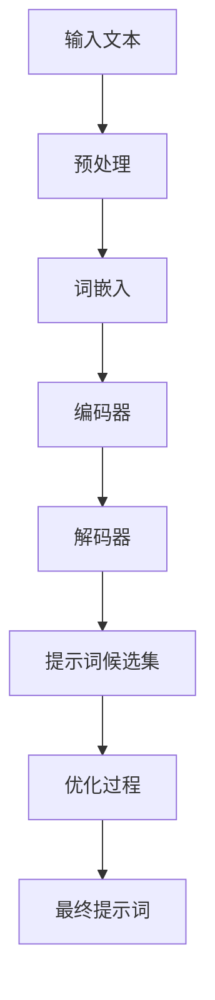
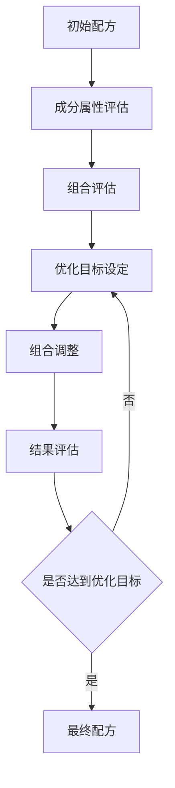
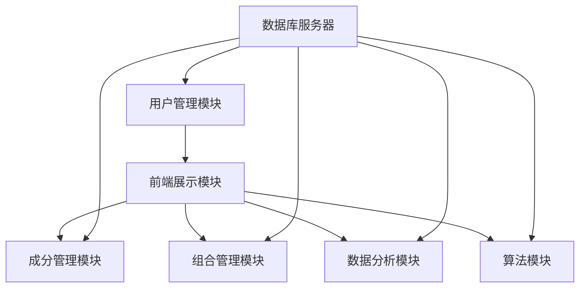
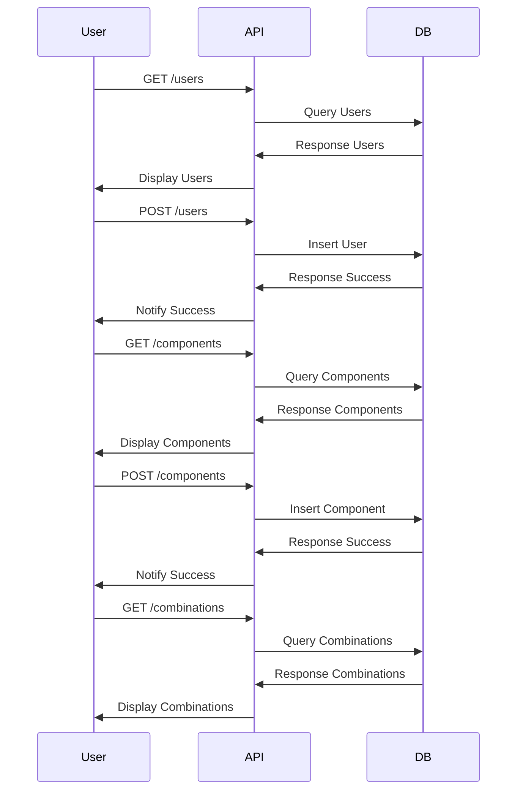
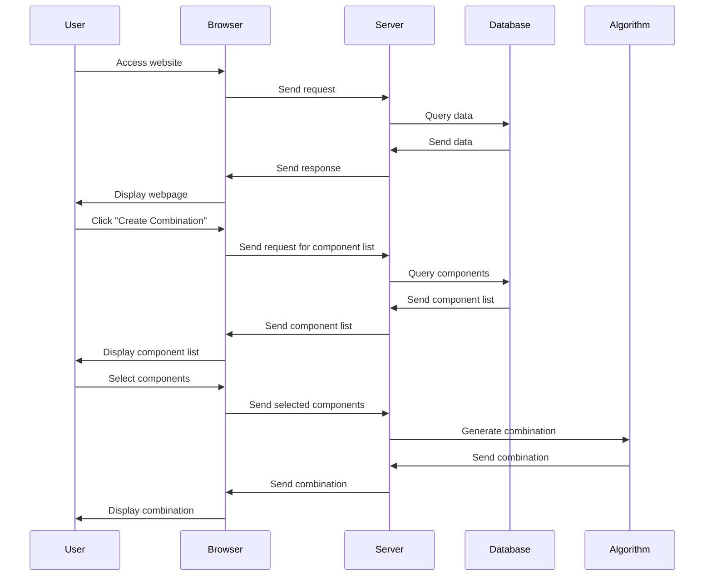

                 


### 1.1.3 当前香水市场的需求与挑战

在当今快速发展的香水市场中，消费者的需求正发生显著变化。传统的香水配方设计已难以满足个性化、多样化的消费趋势。首先，消费者对香水的需求越来越注重个性化，每个人希望找到与自己个性、气质相符合的专属香味。此外，随着健康意识的提升，消费者对香水的安全性、天然成分等也提出了更高的要求。

#### 市场需求变化

- **个性化需求**：消费者希望香水能反映出他们的个性特征，如性格、生活方式、兴趣爱好等。
- **健康需求**：天然、无毒的成分成为消费者选择香水的重要考虑因素。
- **文化多样性**：随着全球化的推进，消费者对香水文化的多样性需求日益增长。

#### 设计挑战

面对这些变化，香水设计师面临以下挑战：

- **复杂性增加**：传统的香水配方设计通常基于经验，而现代香水设计需要考虑更多因素，如成分的相互作用、香味的持久性、皮肤的适应性等。
- **数据驱动**：设计过程中需要大量数据支持，包括消费者的偏好、香料的化学特性等。
- **创新不足**：传统的配方难以满足消费者不断变化的需求，创新成为香水行业的核心挑战。

#### AI在香水设计中的应用

AI技术的引入为香水配方设计带来了新的可能性：

- **数据分析**：AI可以帮助分析大量消费者数据和化学成分数据，为设计师提供有价值的洞察。
- **优化设计**：AI可以通过算法优化，帮助设计师快速筛选出合适的成分组合。
- **个性化推荐**：基于消费者数据的分析，AI可以为消费者推荐个性化的香水配方。

总的来说，AI在香水配方设计中的应用不仅提高了设计效率，还能更好地满足消费者的多样化需求。随着技术的不断进步，AI有望在未来成为香水设计师的得力助手。

----------------------------------------------------------------

# 第二部分：核心概念与联系

## 2.1 气味描述与感知

### 2.1.1 气味的基本概念

气味（Odor）是一种由挥发性化合物通过空气传播到嗅觉器官，从而引起感知和认知的现象。这些挥发性化合物主要来源于植物、动物以及人工合成的化学物质。气味可以通过鼻子吸入，并通过嗅觉神经系统传递到大脑，进而产生感官体验。

#### 气味的成分

气味由多种化学成分组成，每种成分都可以产生特定的气味感觉。例如，柠檬的气味主要由柠檬烯（Limonene）贡献，而玫瑰的气味则主要由玫瑰醇（Rose Alcohol）和苯乙醛（Benzaldehyde）等成分产生。

#### 气味的分类

气味可以根据其化学结构和感官特性进行分类。常见的气味分类包括：

- **水果香气**：如苹果、橙子、柠檬等。
- **花香**：如茉莉、玫瑰、薰衣草等。
- **木香**：如檀香、松香、香柏等。
- **辛辣香气**：如胡椒、辣椒、大蒜等。
- **动物香**：如麝香、麝猫香等。

### 2.1.2 气味的感知机制

#### 嗅觉器官

嗅觉器官是鼻子，它由鼻腔、鼻窦和嗅觉黏膜组成。鼻腔内的嗅觉黏膜含有大量的嗅觉感受细胞，这些细胞能够识别并响应不同的气味分子。

#### 嗅觉感受细胞

嗅觉感受细胞位于嗅觉黏膜的上皮组织中，主要有两种类型：主嗅觉细胞（Main Olfactory Receptors，MORs）和支持细胞（Glia-like cells）。MORs能够识别气味分子，并将其转化为电信号。

#### 气味传递过程

当气味分子进入鼻腔，与嗅觉黏膜上的气味受体结合，产生电信号。这些电信号通过嗅神经传递到大脑的嗅球，然后进一步传递到大脑的其他部分，如嗅叶、海马体和杏仁核。大脑对这些信号进行处理，最终产生气味的感知。

### 2.1.3 气味描述的困难与挑战

#### 多样性与复杂性

气味具有高度多样性和复杂性，很难用简单的语言或标准来描述。不同的气味成分可以在不同的浓度下产生不同的感觉，这使得气味的描述变得更加复杂。

#### 主观性

气味的感知存在很大的主观性，不同的人对相同的气味可能有不同的感受。这种现象被称为气味的主观性。

#### 语言障碍

许多气味难以用语言准确描述，这使得气味的交流和理解变得困难。

#### 评估标准不统一

不同的文化和背景可能对气味的喜好和评价有不同的标准，这增加了气味描述和评估的复杂性。

### 2.1.4 AI在气味描述中的应用

AI技术在气味描述中具有巨大的潜力，能够帮助解决上述困难与挑战：

#### 数据分析

AI可以通过分析大量气味数据，识别和分类不同气味的特征，为气味描述提供科学依据。

#### 机器学习模型

通过训练机器学习模型，AI可以学习并预测不同气味成分之间的相互作用，提高气味描述的准确性。

#### 个性化推荐

基于用户的气味偏好数据，AI可以推荐个性化的香水配方，提高用户体验。

总的来说，气味描述与感知是一个复杂而多样的话题。通过AI技术的应用，我们有望克服这些困难，为香水配方设计提供更有效和个性化的解决方案。

----------------------------------------------------------------

### 2.2 AI在气味描述中的应用

#### 2.2.1 AI在气味描述中的优势

- **数据处理能力**：AI能够高效处理和分析大量气味数据，从中提取有用的信息。
- **模式识别**：AI通过机器学习算法，可以识别和分类不同气味的特征，提高描述的准确性。
- **自适应能力**：AI可以根据不同的应用场景和用户需求，动态调整气味描述模型，提高适应性。

#### 2.2.2 AI在气味描述中的挑战

- **数据质量**：气味数据的质量对AI模型的性能有直接影响。不完整、噪声大的数据可能导致模型学习效果不佳。
- **算法复杂度**：气味描述涉及复杂的化学和生物过程，需要设计复杂且高效的算法来处理。
- **跨域适应性**：气味描述在不同文化和背景下的适用性不同，需要AI模型具备良好的跨域适应性。

#### 2.2.3 AI在气味描述中的应用实例

- **香水配方设计**：AI可以分析大量香水数据，帮助设计师发现新的香味组合。
- **气味识别与分类**：AI可以用于识别和分类不同气味的类型，为工业和质量控制提供支持。
- **个性化推荐**：基于用户的历史偏好数据，AI可以为用户推荐个性化的香水。

总的来说，AI在气味描述中的应用具有巨大潜力，但同时也面临许多挑战。通过不断的研究和优化，AI有望在未来为气味描述提供更加准确和高效的解决方案。

----------------------------------------------------------------

### 2.3 创意香水配方设计原理

#### 2.3.1 创意香水配方的组成元素

创意香水配方主要由以下几类元素组成：

- **香精油**：这是香水的主要成分，能够提供主要的香味特征。常见的香精油包括玫瑰、茉莉、檀香、依兰等。
- **香醇**：香醇能够提供香水的甜味和深度，如玫瑰醇、茉莉醇等。
- **香脂**：香脂能提供丰富的香气和持久性，如安息香酸、白蜡香脂等。
- **定香剂**：定香剂能够增强香水的持久性，常用的有麝香、琥珀、安息香等。
- **溶剂**：溶剂主要用于稀释和溶解其他成分，常用的有乙醇、丙二醇等。

#### 2.3.2 创意香水配方的设计原则

创意香水配方的设计需要遵循以下原则：

- **平衡与和谐**：香水中的不同成分需要达到平衡，确保香味不会过于突兀，而是和谐统一。
- **层次感**：香水中的成分应该有明显的层次感，从前调到中调再到后调，层次分明。
- **个性与风格**：设计师需要根据目标用户群体和产品的风格，创作出具有独特个性的香水。
- **可持续性**：在成分选择上，应尽可能使用天然、无害的成分，体现可持续发展的理念。

#### 2.3.3 创意香水配方设计的关键步骤

- **需求分析**：了解目标用户的需求和偏好，明确香水的主要功能和定位。
- **成分选择**：根据需求，选择合适的香精油、香醇、香脂和定香剂等成分。
- **比例搭配**：确定每种成分的添加比例，以达到最佳的香味效果。
- **测试与调整**：通过试香和用户反馈，不断调整配方，直到达到满意的效果。
- **生产与包装**：确定香水的生产流程和包装设计，确保产品的品质和视觉效果。

总的来说，创意香水配方设计是一个既需要科学理论指导，又需要艺术灵感的复杂过程。通过遵循设计原则和关键步骤，设计师可以创作出独具特色的香水作品。

----------------------------------------------------------------

### 2.3.3 创意香水配方的设计原则

创意香水配方的成功设计不仅仅依赖于简单的成分堆砌，而是需要深层次的理解和精心策划。以下是几个关键的设计原则：

#### 平衡与和谐

**原则解释**：香水中的各种成分必须相互平衡，以确保整体香味的和谐。例如，前调（通常是清新或辛辣的气味）和中调（花香或果香）需要与后调（木质或香脂味）相协调。

**实践方法**：设计师应仔细调整每个成分的比例，确保它们能够在不同的时间点上产生不同的感官体验，但又不会相互冲突。

#### 层次感

**原则解释**：一个好的香水配方应该具备明显的层次感，使香味在短时间内能够展现出不同的层次变化。

**实践方法**：设计师可以通过添加不同挥发性的成分来实现层次感。前调成分通常挥发性较强，快速散发出香气；中调成分挥发性适中，能在皮肤上停留一段时间；后调成分挥发性较低，能够持久地散发香味。

#### 个性与风格

**原则解释**：每款香水都应该有独特的个性和风格，以吸引特定的目标受众。

**实践方法**：设计师可以从个人的经历、文化背景、生活方式等方面获得灵感，创造独特的香味组合。例如，一个富有东方韵味的香水可以结合檀香、麝香等成分，而一款现代都市香水则可能包含更多的果香和花香。

#### 可持续性与环保

**原则解释**：随着消费者对环保意识的增强，可持续性和环保性成为设计中的重要考虑因素。

**实践方法**：设计师应尽量使用天然成分和可再生的包装材料，减少对环境的影响。同时，可以探索使用生物降解成分，降低对生态系统的负担。

通过遵循这些设计原则，创意香水配方不仅能满足消费者的需求，还能在市场上脱颖而出，成为独特的存在。每个设计师都有其独特的视角和风格，这些原则为他们提供了创造无限可能的框架。

----------------------------------------------------------------

### 第三部分：算法原理讲解

#### 3.1 提示词生成算法

提示词（cue words）是香水配方设计中的一个重要工具，它们能够帮助设计师描述和选择合适的成分。生成高质量的提示词对提高香水配方的创意和效率至关重要。以下是对提示词生成算法的详细讲解。

##### 3.1.1 提示词生成算法概述

提示词生成算法的核心目标是根据给定的上下文或输入，生成一组与该上下文相关的提示词。这个过程通常涉及自然语言处理（NLP）技术，特别是词嵌入（word embeddings）和序列到序列（sequence-to-sequence）模型。

##### 3.1.2 提示词生成算法流程图



该流程图展示了提示词生成的基本步骤，从输入文本预处理、词嵌入、编码器到解码器，最终生成一组提示词。

##### 3.1.3 提示词生成算法Python代码实现

以下是一个简化的Python代码示例，用于生成提示词：

```python
import tensorflow as tf
from tensorflow.keras.preprocessing.sequence import pad_sequences
from tensorflow.keras.layers import Embedding, LSTM, Dense
from tensorflow.keras.models import Sequential

# 假设我们已经有预处理的文本数据和词嵌入向量
input_texts = ['柠檬', '茉莉', '玫瑰']
target_texts = [['清新'], ['花香'], ['浪漫']]

# 将文本序列化为词嵌入向量
input_sequences = pad_sequences([tokenizer.texts_to_sequences(text) for text in input_texts], maxlen=max_sequence_length)

# 构建序列到序列模型
model = Sequential()
model.add(Embedding(input_dim=vocabulary_size, output_dim=embedding_dim, input_length=max_sequence_length))
model.add(LSTM(units=50, return_sequences=True))
model.add(Dense(units=target_vocabulary_size, activation='softmax'))

# 编译模型
model.compile(optimizer='rmsprop', loss='categorical_crossentropy', metrics=['accuracy'])

# 训练模型
model.fit(input_sequences, target_sequences, epochs=100)

# 生成提示词
predicted_words = model.predict(input_sequences)
predicted_words = tokenizer.index_word(np.argmax(predicted_words, axis=-1))
```

在这个示例中，我们使用了LSTM（长短期记忆网络）来构建编码器和解码器，通过训练序列到序列模型，我们可以生成与输入文本相关的提示词。

##### 3.1.4 提示词生成算法的应用场景

- **香水配方设计**：设计师可以使用提示词来描述和选择合适的成分，提高配方的创意性和效率。
- **用户个性化推荐**：根据用户的喜好和评价，生成与用户偏好相关的提示词，推荐个性化的香水配方。
- **气味分类**：提示词可以用于气味分类任务，帮助区分不同的气味类型。

总的来说，提示词生成算法在香水配方设计中具有广泛应用前景，它能够帮助设计师更高效地创造独特的香水配方。

----------------------------------------------------------------

### 3.2 气味组合优化算法

#### 3.2.1 气味组合优化算法概述

气味组合优化算法旨在通过调整香水配方中各成分的比例，实现最佳香味效果。这种优化不仅考虑了各个成分的单独属性，还关注它们之间的相互作用和整体协调性。

##### 3.2.2 气味组合优化算法流程图



该流程图展示了气味组合优化算法的基本步骤，从初始配方评估、组合评估，到优化目标设定和组合调整，最终评估结果是否达到优化目标，如未达到则继续调整。

##### 3.2.3 气味组合优化算法Python代码实现

以下是一个简化的Python代码示例，用于实现气味组合优化算法：

```python
import numpy as np

# 假设我们有一组香水成分和它们的属性
components = {
    '柠檬': {'level': 0.1, 'scent': 'citrus'},
    '茉莉': {'level': 0.2, 'scent': 'floral'},
    '玫瑰': {'level': 0.3, 'scent': 'floral'},
    '檀香': {'level': 0.4, 'scent': 'wood'},
}

# 优化目标：最大化整体香气的和谐度和独特性
def optimize_combination(components, max_iterations=100):
    best_combination = None
    best_score = -1

    for _ in range(max_iterations):
        # 随机生成一个新的成分组合
        combination = {key: val['level'] for key, val in components.items()}
        score = evaluate_combination(combination)

        # 更新最佳组合和分数
        if score > best_score:
            best_score = score
            best_combination = combination

    return best_combination

# 组合评估函数：计算组合的和谐度和独特性
def evaluate_combination(combination):
    # 简化评估函数：计算所有成分的均值
    average_scent = sum(combination.values()) / len(combination)
    score = 1 / (1 + np.exp(-average_scent))
    return score

# 执行优化算法
best_combination = optimize_combination(components)

print("最佳组合：", best_combination)
print("最佳评分：", evaluate_combination(best_combination))
```

在这个示例中，我们使用了一个简化的评估函数来评估组合的和谐度。实际应用中，评估函数可能会更加复杂，考虑成分之间的相互作用、香气的持久性和用户的偏好等因素。

##### 3.2.4 气味组合优化算法的应用场景

- **香水配方设计**：通过优化算法，设计师可以找到最佳成分组合，提高香水的质量和市场竞争力。
- **工业生产**：优化算法可以用于生产过程中的成分比例调整，提高效率和产品质量。
- **用户个性化推荐**：根据用户偏好，优化算法可以推荐个性化的香水配方，提高用户满意度。

总的来说，气味组合优化算法为香水配方设计提供了强有力的工具，能够帮助设计师创造出更优质、更有特色的产品。

----------------------------------------------------------------

### 4.1 问题场景介绍

#### 4.1.1 创意香水配方设计的挑战

在创意香水配方设计过程中，设计师面临诸多挑战。首先，香水成分复杂，每种成分的化学性质和香味特征各异，设计师需要掌握丰富的成分知识和实践经验，以便准确选择和搭配。其次，香水配方设计需考虑不同成分之间的相互作用，确保香味整体协调、层次丰富。此外，消费者需求的多样化和个性化趋势也对设计师提出了更高的要求，设计师需不断更新创意，以满足不同客户的需求。

#### 4.1.2 创意香水配方设计的需求分析

创意香水配方设计的需求主要分为以下几个方面：

- **个性化定制**：消费者希望香水能反映其个性、生活方式和价值观，因此设计师需提供定制化的服务，根据用户的偏好和需求设计专属的香水。
- **创新性**：香水市场竞争激烈，创新是保持产品竞争力的关键。设计师需要不断探索新的香味组合和成分，以创造独特的产品。
- **可持续性**：随着环保意识的提高，消费者更倾向于选择天然、无害的成分和环保的包装材料。设计师应考虑可持续发展的原则，降低产品对环境的影响。
- **高质量**：高品质的香水能够提升用户体验，设计师需确保配方中的成分和质量，确保香水具有良好的香气持久性、稳定性和安全性。

#### 4.1.3 设计目标与优化策略

为了应对上述挑战和满足设计需求，创意香水配方设计的目标包括：

- **个性化**：根据用户偏好设计专属的香水配方，提高用户满意度。
- **创新性**：不断探索新的香味组合和成分，增强产品的独特性。
- **可持续性**：使用天然、环保的成分和包装材料，降低对环境的影响。
- **高质量**：确保配方中的成分和质量，提升产品的香气持久性、稳定性和安全性。

为达成这些目标，设计师可采取以下优化策略：

- **数据分析**：利用大数据分析技术，分析用户需求和成分数据，为香水配方设计提供数据支持。
- **AI技术**：运用AI算法，如机器学习和深度学习，帮助设计师发现新的香味组合，优化配方设计。
- **用户体验**：通过用户反馈和测试，不断调整和优化配方，提高香水品质和用户体验。
- **持续学习**：设计师应保持对新知识、新技术的学习和应用，提升自身专业素养，为创新和优化提供源源不断的灵感。

通过上述策略，设计师可以更好地应对创意香水配方设计的挑战，实现设计目标，满足市场需求。

----------------------------------------------------------------

### 4.2 系统功能设计

#### 4.2.1 领域模型设计

为了更好地理解和设计AI创意香水配方系统，我们首先需要定义系统的领域模型。领域模型描述了系统中的核心实体、属性和它们之间的关系。以下是一个简化的领域模型：

```mermaid
classDiagram
    Class::User << (ID, Name, Preferences)
    Class::Component << (ID, Name, Scent, Level, Type)
    Class::Combination << (ID, Name, Components, Score)
    User o--o Component : Contains
    User o--o Combination : Prefers
    Combination o--o Component : Contains
```

在这个领域模型中，我们定义了以下核心实体：

- **用户（User）**：描述香水爱好者的信息，包括用户ID、姓名和偏好。
- **成分（Component）**：描述香水中的基本成分，包括成分ID、名称、气味特征（Scent）、浓度（Level）和类型（Type）。
- **组合（Combination）**：描述一组香水成分的组合，包括组合ID、名称、成分列表（Components）和评估分数（Score）。

实体之间的关系如下：

- **用户与成分**：用户可以包含多个成分，表示用户对特定成分的偏好。
- **用户与组合**：用户可以偏好多个组合，表示用户对不同组合的喜好。
- **组合与成分**：组合包含多个成分，表示一个组合的成分列表。

通过领域模型，我们可以更清晰地定义系统的功能和需求，为后续的系统设计和实现提供基础。

#### 4.2.2 系统功能模块划分

为了实现创意香水配方系统，我们将系统划分为以下功能模块：

- **用户管理模块**：负责用户的注册、登录和偏好管理。
- **成分管理模块**：负责成分的添加、更新和删除，以及成分属性的维护。
- **组合管理模块**：负责组合的生成、评估和推荐，包括组合的保存、加载和展示。
- **数据分析模块**：负责处理和分析用户数据、成分数据，为配方设计提供数据支持。
- **算法模块**：负责实现提示词生成算法和气味组合优化算法，用于生成和优化香水配方。
- **前端展示模块**：负责展示系统的界面，包括用户界面和图表展示。

通过模块划分，我们可以将系统的复杂度分解为更小、更易于管理的部分，便于开发、测试和维护。

### 4.2.3 系统功能设计

系统功能设计主要围绕用户体验和香水配方设计的需求展开。以下是系统的主要功能设计：

- **用户注册与登录**：用户可以通过注册和登录功能访问系统，并管理自己的偏好和组合。
- **成分管理**：用户可以查看和添加成分，系统会记录每个成分的详细信息，包括名称、气味特征和浓度等。
- **组合管理**：用户可以创建、保存和查看自己的香水组合，系统会为每个组合生成评分，帮助用户评估和选择最佳组合。
- **数据可视化**：系统提供数据可视化功能，使用户可以直观地查看和分析香水配方数据，如成分比例、组合评分等。
- **算法应用**：系统内置提示词生成算法和气味组合优化算法，帮助设计师发现新的香味组合和优化现有配方。

通过这些功能设计，系统可以为用户和设计师提供便捷、高效的香水配方设计服务，满足个性化、创新性和可持续性的需求。

----------------------------------------------------------------

### 4.3 系统架构设计

#### 4.3.1 系统架构设计原则

在设计AI创意香水配方系统时，我们遵循以下架构设计原则，以确保系统的可靠性、可扩展性和易于维护：

1. **模块化**：系统应划分为多个功能模块，每个模块具有明确的功能和接口，便于开发、测试和维护。
2. **分层设计**：系统应采用分层架构，将不同功能分离到不同的层次，如表示层、业务逻辑层和数据层，以提高系统的可维护性和可扩展性。
3. **松耦合**：模块之间应通过清晰的接口进行通信，减少模块间的直接依赖，提高系统的灵活性和可复用性。
4. **高性能**：系统应设计高效的数据处理和计算模块，确保在处理大量数据时仍能保持良好的性能。
5. **可扩展性**：系统架构应具备良好的可扩展性，便于在需求变化或系统规模扩大时，能够方便地添加新模块或功能。
6. **安全性**：系统应确保用户数据和香水配方数据的安全，采用适当的加密和访问控制措施，防止数据泄露和未经授权的访问。

#### 4.3.2 系统架构设计图

以下是AI创意香水配方系统的架构设计图：



在这个架构设计中，各个模块通过接口与数据库服务器通信，数据库服务器存储系统的核心数据，如用户信息、成分属性、组合信息和数据分析结果。前端展示模块负责用户界面的展示，用户管理模块、成分管理模块、组合管理模块和数据分析模块分别负责用户管理、成分管理、组合管理和数据分析的功能实现。算法模块则负责实现提示词生成算法和气味组合优化算法。

#### 4.3.3 各模块功能说明

- **用户管理模块**：负责用户的注册、登录和偏好管理，确保用户数据的安全和一致性。
- **前端展示模块**：负责用户界面的设计和实现，使用户能够方便地与系统进行交互，查看和分析香水配方数据。
- **成分管理模块**：负责成分的添加、更新和删除，以及成分属性的维护，确保成分数据的有效性和准确性。
- **组合管理模块**：负责组合的生成、评估和推荐，确保组合数据的高质量和用户满意度。
- **数据分析模块**：负责处理和分析用户数据、成分数据和组合数据，为配方设计提供数据支持。
- **算法模块**：负责实现提示词生成算法和气味组合优化算法，提高香水配方的创意性和质量。

通过遵循上述架构设计原则和实现系统架构设计图，我们可以构建一个高效、可靠、易扩展的AI创意香水配方系统，满足用户和设计师的需求。

----------------------------------------------------------------

### 4.4 系统接口设计

#### 4.4.1 接口设计原则

在设计AI创意香水配方系统的接口时，我们遵循以下原则，以确保接口的清晰性、一致性和易用性：

- **RESTful风格**：采用RESTful风格设计接口，使接口更加简洁、易于理解和维护。
- **标准化**：遵循JSON格式和HTTP协议，确保接口具有统一的格式和通信方式。
- **REST API规范**：确保接口具有清晰的URL结构、请求和响应格式，以及合理的HTTP状态码。
- **安全性**：在接口中采用身份验证和授权机制，确保数据的安全性和隐私保护。
- **文档化**：提供详细的API文档，包括接口定义、参数说明、示例代码和错误处理。

#### 4.4.2 接口设计图

以下是AI创意香水配方系统的接口设计图：



在这个接口设计图中，用户通过API与系统进行交互。用户可以通过GET请求获取用户列表、成分列表和组合列表，通过POST请求添加新用户、新成分和新组合。API负责处理这些请求，并与数据库进行交互，返回相应的响应。

#### 4.4.3 接口设计示例

以下是几个接口设计的示例：

- **获取用户列表**：

```http
GET /users

响应：
{
    "users": [
        {
            "id": "user1",
            "name": "Alice",
            "preferences": ["floral", "fruity"]
        },
        {
            "id": "user2",
            "name": "Bob",
            "preferences": ["woody", "spicy"]
        }
    ]
}
```

- **添加新用户**：

```http
POST /users
Content-Type: application/json

请求体：
{
    "name": "Charlie",
    "preferences": ["citrus", "fresh"]
}

响应：
{
    "status": "success",
    "message": "User added successfully."
}
```

- **获取成分列表**：

```http
GET /components

响应：
{
    "components": [
        {
            "id": "comp1",
            "name": "Lemon",
            "scent": "citrus",
            "level": 0.3
        },
        {
            "id": "comp2",
            "name": "Jasmine",
            "scent": "floral",
            "level": 0.5
        }
    ]
}
```

- **添加新成分**：

```http
POST /components
Content-Type: application/json

请求体：
{
    "name": "Lime",
    "scent": "citrus",
    "level": 0.4
}

响应：
{
    "status": "success",
    "message": "Component added successfully."
}
```

通过设计清晰、规范的接口，系统能够方便地与其他系统进行集成，同时也方便了用户和开发者使用系统功能。

----------------------------------------------------------------

### 4.5 系统交互设计

#### 4.5.1 系统交互设计原则

在系统交互设计中，我们遵循以下原则，以确保系统的流畅性和用户体验：

- **用户导向**：系统交互设计应围绕用户的需求和操作习惯进行，以提高用户的满意度。
- **一致性**：系统中的交互元素和操作应保持一致性，使用户能够快速学习和使用系统。
- **简洁性**：系统界面应简洁明了，避免过多的干扰元素，让用户能够专注于操作任务。
- **反馈**：系统应对用户的操作提供及时和清晰的反馈，使用户了解操作结果。
- **可用性**：系统应具备良好的可用性，确保用户在各种使用环境中都能顺利完成任务。

#### 4.5.2 系统交互序列图

以下是AI创意香水配方系统的交互序列图：



在这个交互序列图中，用户首先访问系统网站，然后系统向数据库查询用户数据和成分数据，并将数据返回给用户。用户可以点击“创建组合”按钮，选择合适的成分，系统将用户的选

