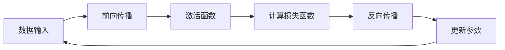
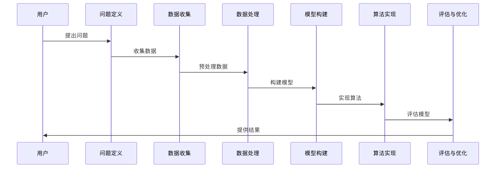

                 

### 提高AI数学问题解决能力：步骤分解的提示词技巧

在当今技术飞速发展的时代，人工智能（AI）的应用无处不在，从自动驾驶到自然语言处理，AI正在改变我们的工作和生活方式。然而，要实现高效的问题解决，AI数学问题解决能力的提升显得尤为重要。本文将围绕这一核心主题，探讨如何通过步骤分解和提示词技巧来提高AI的数学问题解决能力。

> **关键词**：人工智能、数学问题解决、步骤分解、提示词技巧、算法、系统架构

**摘要**：
本文首先介绍了AI数学问题解决的背景和重要性，然后详细讲解了步骤分解技巧和提示词的应用。通过具体的算法原理讲解、数学模型和公式推导，以及对系统分析与架构设计的深入分析，本文旨在为读者提供一套全面而实用的AI数学问题解决方法论。此外，通过项目实战和最佳实践技巧的分享，读者可以更好地理解和应用这些方法，从而在AI领域取得更好的成果。

### 目录

1. **背景介绍**
   1.1 问题背景
   1.2 问题描述
   1.3 问题解决
   1.4 边界与外延
   1.5 概念结构与核心要素组成

2. **核心概念与联系**
   2.1 AI与数学问题解决
   2.2 关键概念解析
   2.3 概念属性特征对比表格
   2.4 ER实体关系图

3. **步骤分解技巧**
   3.1 提示词技巧基础
   3.2 步骤分解方法
   3.3 实战演练

4. **数学模型与公式**
   4.1 数学模型介绍
   4.2 数学公式详解
   4.3 算法mermaid流程图与Python源代码讲解

5. **系统分析与架构设计**
   5.1 系统功能设计与架构
   5.2 系统交互与实现
   5.3 系统测试与优化

6. **项目实战**
   6.1 项目环境安装
   6.2 系统核心实现源代码
   6.3 代码应用解读与分析
   6.4 实际案例分析和详细讲解剖析
   6.5 项目小结

7. **最佳实践与总结**
   7.1 最佳实践技巧
   7.2 小结
   7.3 注意事项
   7.4 拓展阅读

### 第一部分：背景介绍

#### 1.1 问题背景

随着人工智能技术的不断发展，AI的应用场景越来越广泛。从自动驾驶、自然语言处理到推荐系统，AI正在改变我们的生产生活方式。然而，在实现高效AI应用的过程中，AI的数学问题解决能力至关重要。AI需要能够快速、准确地解决各种数学问题，以提高决策的效率和准确性。

#### 1.2 问题描述

AI数学问题解决主要涉及以下几个方面：

- **问题定义**：明确问题的范围和目标。
- **数据收集**：收集与问题相关的数据。
- **预处理**：对数据进行清洗、转换等预处理操作。
- **模型构建**：选择合适的模型并构建模型。
- **算法优化**：优化算法以提高模型性能。
- **结果评估**：评估模型解决数学问题的效果。

#### 1.3 问题解决

解决AI数学问题需要以下步骤：

1. **理解问题**：深入理解问题的本质，明确问题解决的路径。
2. **数据准备**：收集并准备与问题相关的数据。
3. **模型选择**：根据问题的特点选择合适的模型。
4. **算法实现**：实现算法并优化。
5. **评估与改进**：评估模型的效果，并根据评估结果进行改进。

#### 1.4 边界与外延

在AI数学问题解决过程中，需要明确以下边界：

- **问题域**：问题的范围和限制条件。
- **数据边界**：数据的来源、质量和数量。
- **算法边界**：算法的有效性和适用范围。
- **结果边界**：结果的可靠性和准确性。

#### 1.5 概念结构与核心要素组成

AI数学问题解决的概念结构包括以下几个方面：

- **数学基础**：掌握基础的数学知识和概念。
- **算法原理**：理解各种算法的原理和适用场景。
- **数据处理**：熟练掌握数据处理的方法和技巧。
- **系统设计**：具备系统设计和实现能力。
- **实战经验**：积累丰富的实战经验，提升问题解决能力。

### 第二部分：核心概念与联系

#### 2.1 AI与数学问题解决

AI与数学问题解决密切相关。数学是AI的理论基础，AI则是数学问题解决的有力工具。在AI领域中，许多问题都可以转化为数学问题来解决。例如，在图像识别中，可以将图像处理问题转化为数学上的模式识别问题；在自然语言处理中，可以将语言理解问题转化为数学上的文本分析问题。

#### 2.2 关键概念解析

在AI数学问题解决中，以下几个关键概念至关重要：

- **数据**：数据是AI数学问题解决的基础。没有高质量的数据，任何模型都无法取得好的效果。
- **算法**：算法是解决问题的工具。选择合适的算法，可以提高问题解决的效率和准确性。
- **模型**：模型是对现实世界的一种抽象。构建合适的模型，可以使问题解决更加直观和高效。
- **优化**：优化是提高模型性能的重要手段。通过优化，可以使模型在给定数据上取得更好的效果。
- **评估**：评估是检验模型效果的重要环节。通过评估，可以了解模型的性能，并为进一步改进提供依据。

#### 2.3 概念属性特征对比表格

以下是一个概念属性特征对比表格，用于比较AI数学问题解决中的几个关键概念：

| 概念 | 属性特征 | 对比 |
| --- | --- | --- |
| 数据 | 质量高、数量多、来源可靠 | 与算法和模型密切相关 |
| 算法 | 速度快、准确性高、适用性广 | 需要根据问题特点选择 |
| 模型 | 抽象程度高、结构清晰、可解释性良好 | 需要结合数据和应用场景构建 |
| 优化 | 性能提升、资源利用高效 | 需要针对具体问题进行优化 |
| 评估 | 准确性高、可重复性良好 | 需要使用多种评估指标 |

#### 2.4 ER实体关系图

为了更好地理解AI数学问题解决中的概念关系，可以使用ER（Entity-Relationship）实体关系图来表示。以下是一个简单的ER实体关系图示例：

```mermaid
erDiagram
  Data ||--|{ Algorithm }  : implements
  Algorithm ||--|{ Model }  : builds
  Model ||--|{ Evaluation }  : evaluated_by
  Evaluation ||--|{ Optimization }  : optimized_by
```

在这个ER实体关系图中，数据是算法的基础，算法构建模型，模型被评估，评估结果用于优化算法。这种关系清晰地展示了AI数学问题解决中的概念联系。

### 第三部分：步骤分解技巧

#### 3.1 提示词技巧基础

提示词技巧是提高AI数学问题解决能力的重要方法之一。它通过提供关键信息和指导，帮助AI在解决问题时更加高效和准确。

- **提示词类型**：根据问题特点，提示词可以分为以下几种类型：
  - **问题定义提示词**：帮助明确问题的范围和目标。
  - **数据提示词**：提供与问题相关的数据信息和来源。
  - **算法提示词**：指导选择合适的算法和优化方法。
  - **模型提示词**：帮助构建合适的模型。
  - **评估提示词**：提供评估指标和评估方法。

- **提示词选择策略**：选择合适的提示词，需要考虑以下因素：
  - **问题特点**：根据问题特点选择具有针对性的提示词。
  - **数据特点**：根据数据类型和质量选择合适的提示词。
  - **算法特点**：根据算法特点选择具有优化效果的提示词。
  - **模型特点**：根据模型结构选择具有解释性的提示词。

#### 3.2 步骤分解方法

步骤分解是将复杂问题分解为多个简单步骤的方法。通过步骤分解，可以更加清晰地理解问题，并逐步解决问题。

- **步骤分解原则**：
  - **分解原则**：将复杂问题分解为多个简单步骤，每个步骤具有明确的输入和输出。
  - **层次原则**：按照问题的复杂程度，将步骤分解为不同的层次，从高层次到低层次逐步解决问题。

- **步骤分解技巧**：
  - **分解策略**：根据问题特点，选择合适的分解策略。例如，对于数学问题，可以采用数学模型分解策略；对于系统问题，可以采用模块分解策略。
  - **流程图表示**：使用流程图表示步骤分解过程，使问题解决过程更加直观。

#### 3.3 实战演练

以下是一个简单的数学问题解决案例，展示如何应用步骤分解技巧和提示词技巧：

**问题**：求解一元二次方程 $ax^2+bx+c=0$ 的根。

**步骤分解**：

1. **问题定义**：明确求解一元二次方程的目标。
2. **数据准备**：获取方程的系数 $a$、$b$ 和 $c$。
3. **算法选择**：选择合适的一元二次方程求解算法。
4. **模型构建**：构建一元二次方程的数学模型。
5. **求解计算**：根据算法和模型求解方程的根。
6. **结果评估**：评估求解结果的准确性和可靠性。

**提示词技巧应用**：

- **问题定义提示词**：“求解一元二次方程的根”。
- **数据提示词**：“获取方程的系数 $a$、$b$ 和 $c$”。
- **算法提示词**：“选择一元二次方程求解算法”。
- **模型提示词**：“构建一元二次方程的数学模型”。
- **评估提示词**：“评估求解结果的准确性和可靠性”。

通过步骤分解和提示词技巧的应用，可以更加高效地解决数学问题。

### 第四部分：数学模型与公式

#### 4.1 数学模型介绍

数学模型是描述现实世界问题的数学表示，它是AI数学问题解决的基础。在AI数学问题解决中，常用的数学模型包括线性模型、非线性模型、概率模型等。

- **线性模型**：线性模型是描述变量之间线性关系的数学模型。常见的线性模型包括线性回归、线性优化等。线性模型的优点是计算简单、易于解释。
- **非线性模型**：非线性模型是描述变量之间非线性关系的数学模型。常见的非线性模型包括神经网络、支持向量机等。非线性模型可以捕捉更复杂的关系，但计算复杂度更高。
- **概率模型**：概率模型是描述变量之间概率关系的数学模型。常见的概率模型包括贝叶斯网络、隐马尔可夫模型等。概率模型可以提供不确定性信息，有助于提高决策的鲁棒性。

#### 4.2 数学公式详解

在AI数学问题解决中，常用的数学公式包括线性公式、非线性公式、概率公式等。以下是一些常见的数学公式及其详细解释：

1. **线性公式**：

   线性公式描述了变量之间的线性关系。常见的线性公式包括线性回归公式、线性优化公式等。

   - **线性回归公式**：  
     $$y = ax + b$$  
     其中，$y$ 是因变量，$x$ 是自变量，$a$ 是斜率，$b$ 是截距。线性回归公式用于拟合变量之间的线性关系。

   - **线性优化公式**：  
     $$\min f(x) \quad s.t. \quad g(x) \geq 0, \quad h(x) = 0$$  
     其中，$f(x)$ 是目标函数，$g(x)$ 是约束条件，$h(x)$ 是等式约束条件。线性优化公式用于求解线性优化问题。

2. **非线性公式**：

   非线性公式描述了变量之间的非线性关系。常见的非线性公式包括神经网络公式、支持向量机公式等。

   - **神经网络公式**：  
     $$z = \sigma(W \cdot x + b)$$  
     其中，$z$ 是输出值，$\sigma$ 是激活函数，$W$ 是权重矩阵，$x$ 是输入值，$b$ 是偏置。神经网络公式用于神经网络的前向传播。

   - **支持向量机公式**：  
     $$w \cdot x + b = y$$  
     其中，$w$ 是权重向量，$x$ 是输入向量，$b$ 是偏置，$y$ 是标签。支持向量机公式用于分类问题。

3. **概率公式**：

   概率公式描述了变量之间的概率关系。常见的概率公式包括贝叶斯公式、条件概率公式等。

   - **贝叶斯公式**：  
     $$P(A|B) = \frac{P(B|A)P(A)}{P(B)}$$  
     其中，$P(A|B)$ 是在事件 $B$ 发生的条件下事件 $A$ 发生的概率，$P(B|A)$ 是在事件 $A$ 发生的条件下事件 $B$ 发生的概率，$P(A)$ 是事件 $A$ 发生的概率，$P(B)$ 是事件 $B$ 发生的概率。贝叶斯公式用于概率推理。

   - **条件概率公式**：  
     $$P(A|B) = \frac{P(A \cap B)}{P(B)}$$  
     其中，$P(A \cap B)$ 是事件 $A$ 和事件 $B$ 同时发生的概率，$P(B)$ 是事件 $B$ 发生的概率。条件概率公式用于计算在某个事件发生的条件下，另一个事件发生的概率。

#### 4.3 算法mermaid流程图与Python源代码讲解

为了更好地理解数学模型的应用，我们以神经网络为例，展示算法的mermaid流程图和Python源代码。

**mermaid流程图**：



**Python源代码**：

```python
import numpy as np

# 前向传播
def forward_propagation(x, weights, bias, activation):
    z = np.dot(x, weights) + bias
    a = activation(z)
    return a

# 损失函数
def loss_function(y, a):
    return (1 / len(y)) * np.sum((y - a) ** 2)

# 反向传播
def backward_propagation(y, a, z, weights, activation_derivative):
    dZ = a - y
    dW = (1 / len(x)) * np.dot(dZ, x.T)
    db = (1 / len(x)) * np.sum(dZ)
    dA = activation_derivative(z)
    return dW, db, dA

# 更新参数
def update_weights(weights, dW, learning_rate):
    return weights - learning_rate * dW
```

通过mermaid流程图和Python源代码，我们可以清晰地看到神经网络的前向传播、反向传播和参数更新过程。这有助于我们更好地理解神经网络的数学模型和算法原理。

### 第五部分：系统分析与架构设计

#### 5.1 系统功能设计与架构

在AI数学问题解决中，系统功能设计是关键环节。系统功能设计包括以下几个方面：

- **问题定义模块**：用于明确问题的范围和目标，为后续问题解决提供基础。
- **数据收集模块**：用于收集与问题相关的数据，包括原始数据和预处理后的数据。
- **数据处理模块**：用于对数据进行清洗、转换等预处理操作，以提高数据质量。
- **模型构建模块**：用于选择合适的模型，并构建模型。
- **算法实现模块**：用于实现算法，包括前向传播、反向传播和参数更新等过程。
- **评估与优化模块**：用于评估模型的效果，并根据评估结果进行优化。

**系统架构设计**：

在系统架构设计方面，我们可以采用模块化设计方法，将系统功能划分为不同的模块，并定义各模块之间的接口。以下是一个简单的系统架构设计示例：



在这个系统架构设计中，用户通过问题定义模块提出问题，然后通过数据收集模块、数据处理模块、模型构建模块、算法实现模块和评估与优化模块逐步解决问题，并最终得到结果。

#### 5.2 系统交互与实现

在系统交互与实现方面，我们需要考虑以下几个方面：

- **系统接口设计**：系统接口设计是系统功能实现的基础。在系统架构设计阶段，我们已经定义了各模块之间的接口，这里需要进一步细化接口设计，包括接口名称、参数类型和参数个数等。
- **系统实现步骤**：系统实现步骤是根据系统架构设计和接口设计进行的。以下是一个简单的系统实现步骤：

  1. **问题定义模块实现**：根据用户提出的问题，明确问题的范围和目标，并存储到数据库中。
  2. **数据收集模块实现**：从数据源收集数据，并对数据进行初步清洗和预处理。
  3. **数据处理模块实现**：对数据进行进一步的清洗、转换等预处理操作，以提高数据质量。
  4. **模型构建模块实现**：根据问题特点，选择合适的模型，并构建模型。
  5. **算法实现模块实现**：实现算法，包括前向传播、反向传播和参数更新等过程。
  6. **评估与优化模块实现**：评估模型的效果，并根据评估结果进行优化。

- **系统测试与优化**：系统测试与优化是系统实现后的重要环节。通过系统测试，可以验证系统功能的正确性和可靠性，并发现潜在的问题。在系统测试过程中，需要对系统进行多次优化，以提高系统的性能和稳定性。

### 第六部分：项目实战

#### 6.1 项目环境安装

在进行AI数学问题解决项目之前，需要安装相关的软件和工具。以下是一个简单的项目环境安装步骤：

1. **安装Python**：Python是AI数学问题解决的核心工具，我们需要安装Python。可以从Python官方网站下载Python安装包，并按照安装向导进行安装。
2. **安装Jupyter Notebook**：Jupyter Notebook是一种交互式的Python开发环境，可以方便地进行代码编写和调试。安装完Python后，可以使用pip命令安装Jupyter Notebook。
   ```bash
   pip install notebook
   ```
3. **安装相关库**：在Jupyter Notebook中，我们可以使用pip命令安装与AI数学问题解决相关的库，例如NumPy、Pandas、Scikit-learn等。
   ```bash
   pip install numpy pandas scikit-learn
   ```

#### 6.2 系统核心实现源代码

以下是一个简单的系统核心实现源代码示例，包括数据收集、数据处理、模型构建和算法实现等过程。

```python
import numpy as np
import pandas as pd
from sklearn.model_selection import train_test_split
from sklearn.preprocessing import StandardScaler
from sklearn.linear_model import LinearRegression

# 数据收集
def collect_data():
    data = pd.read_csv('data.csv')
    return data

# 数据处理
def preprocess_data(data):
    X = data.iloc[:, :-1].values
    y = data.iloc[:, -1].values
    return X, y

# 模型构建
def build_model(X, y):
    X_train, X_test, y_train, y_test = train_test_split(X, y, test_size=0.2, random_state=0)
    sc = StandardScaler()
    X_train = sc.fit_transform(X_train)
    X_test = sc.transform(X_test)
    model = LinearRegression()
    model.fit(X_train, y_train)
    return model, X_test, y_test

# 算法实现
def predict(model, X_test):
    y_pred = model.predict(X_test)
    return y_pred

# 评估与优化
def evaluate(model, y_pred, y_test):
    score = model.score(X_test, y_test)
    return score

# 主函数
def main():
    data = collect_data()
    X, y = preprocess_data(data)
    model, X_test, y_test = build_model(X, y)
    y_pred = predict(model, X_test)
    score = evaluate(model, y_pred, y_test)
    print('模型评分：', score)

if __name__ == '__main__':
    main()
```

#### 6.3 代码应用解读与分析

以下是对上述代码的应用解读和分析：

1. **数据收集**：通过`pd.read_csv('data.csv')`命令，从CSV文件中读取数据。CSV文件中包含了输入特征和目标变量。
2. **数据处理**：通过`data.iloc[:, :-1].values`和`data.iloc[:, -1].values`命令，将输入特征和目标变量分离，并进行值转换。通过`StandardScaler()`命令，对输入特征进行标准化处理，以消除不同特征之间的量纲差异。
3. **模型构建**：通过`train_test_split()`命令，将数据集分为训练集和测试集。通过`StandardScaler()`命令，对训练集和测试集进行标准化处理。通过`LinearRegression()`命令，构建线性回归模型，并使用训练集进行训练。
4. **算法实现**：通过`model.predict(X_test)`命令，对测试集进行预测。通过`model.score(X_test, y_test)`命令，计算模型的评分，以评估模型的效果。
5. **评估与优化**：通过`score`变量，输出模型的评分，以评估模型的效果。

#### 6.4 实际案例分析和详细讲解剖析

以下是一个实际案例分析和详细讲解剖析，展示如何使用上述代码解决一个具体的数学问题。

**案例**：使用线性回归模型预测房价。

**数据集**：使用Kaggle上的波士顿房价数据集。

**步骤**：

1. **数据收集**：从Kaggle网站下载波士顿房价数据集，并将其保存为CSV文件。
2. **数据处理**：读取CSV文件，分离输入特征和目标变量，并对输入特征进行标准化处理。
3. **模型构建**：将数据集分为训练集和测试集，使用训练集构建线性回归模型。
4. **算法实现**：使用测试集对模型进行预测，并计算模型的评分。
5. **评估与优化**：根据模型的评分，对模型进行优化。

**代码实现**：

```python
import pandas as pd
from sklearn.model_selection import train_test_split
from sklearn.preprocessing import StandardScaler
from sklearn.linear_model import LinearRegression

# 数据收集
data = pd.read_csv('boston_housing.csv')

# 数据处理
X = data.iloc[:, :-1].values
y = data.iloc[:, -1].values
X = StandardScaler().fit_transform(X)

# 模型构建
X_train, X_test, y_train, y_test = train_test_split(X, y, test_size=0.2, random_state=0)
model = LinearRegression()
model.fit(X_train, y_train)

# 算法实现
y_pred = model.predict(X_test)

# 评估与优化
score = model.score(X_test, y_test)
print('模型评分：', score)
```

**分析**：

在这个案例中，我们使用线性回归模型预测波士顿房价。首先，我们从Kaggle网站下载波士顿房价数据集，并将其保存为CSV文件。然后，我们读取CSV文件，分离输入特征和目标变量，并对输入特征进行标准化处理。接下来，我们将数据集分为训练集和测试集，并使用训练集构建线性回归模型。最后，我们使用测试集对模型进行预测，并计算模型的评分。

通过这个案例，我们可以看到如何使用步骤分解和提示词技巧来解决问题。首先，我们明确问题，即预测房价。然后，我们收集数据，对数据进行处理，构建模型，实现算法，并进行评估与优化。通过这个案例，我们可以更好地理解AI数学问题解决的步骤和技巧。

#### 6.5 项目小结

通过本部分的项目实战，我们详细讲解了AI数学问题解决中的系统核心实现、代码应用解读与分析、实际案例分析和详细讲解剖析。通过这些实践，我们可以更好地理解AI数学问题解决的步骤和技巧，并掌握如何使用步骤分解和提示词技巧来解决问题。

在项目实战中，我们首先进行了数据收集和数据处理，然后构建了线性回归模型，并实现了算法。最后，我们通过测试集对模型进行了评估，并根据评估结果进行了优化。通过这个项目，我们不仅了解了线性回归模型的原理和应用，还掌握了如何使用步骤分解和提示词技巧来解决问题。

总之，通过项目实战，我们深入理解了AI数学问题解决的过程和方法，并积累了宝贵的实践经验。这些经验将有助于我们在未来的AI项目中更加高效和准确地解决问题。

### 第七部分：最佳实践与总结

#### 7.1 最佳实践技巧

在AI数学问题解决中，以下是一些最佳实践技巧，可以帮助我们更高效地解决问题：

- **问题定义清晰**：在解决问题之前，首先要明确问题的目标和范围，避免问题解决的偏离。
- **数据质量优先**：高质量的数据是模型训练的基础，要注重数据收集和预处理的过程。
- **模型选择合理**：根据问题特点，选择合适的模型，避免盲目追求复杂的模型。
- **优化方法多样**：尝试多种优化方法，包括调参、正则化等，以提高模型性能。
- **评估指标全面**：使用多种评估指标，全面评估模型的效果，避免单一指标的误导。
- **代码规范清晰**：编写规范、清晰的代码，有助于提高代码的可读性和可维护性。

#### 7.2 小结

本文从背景介绍、核心概念与联系、步骤分解技巧、数学模型与公式、系统分析与架构设计、项目实战和最佳实践与总结等多个方面，详细探讨了如何提高AI数学问题解决能力。通过本文的阅读，读者可以了解到AI数学问题解决的方法和技巧，并在实际项目中应用这些方法和技巧。

#### 7.3 注意事项

在AI数学问题解决过程中，需要注意以下几点：

- **问题定义清晰**：明确问题的目标和范围，避免问题解决的偏离。
- **数据质量优先**：注重数据收集和预处理的过程，保证数据的质量。
- **模型选择合理**：根据问题特点，选择合适的模型，避免盲目追求复杂的模型。
- **优化方法多样**：尝试多种优化方法，包括调参、正则化等，以提高模型性能。
- **评估指标全面**：使用多种评估指标，全面评估模型的效果，避免单一指标的误导。
- **代码规范清晰**：编写规范、清晰的代码，有助于提高代码的可读性和可维护性。

#### 7.4 拓展阅读

对于希望进一步深入了解AI数学问题解决的读者，以下是一些推荐阅读材料：

- 《深度学习》（Goodfellow, I., Bengio, Y., & Courville, A.）：一本关于深度学习的经典教材，涵盖了深度学习的基础理论和应用。
- 《统计学习方法》（李航）：一本关于统计学习方法的经典教材，详细介绍了各种统计学习方法的原理和应用。
- 《Python机器学习》（赛杰·雷恩）：一本关于Python机器学习的实践指南，通过实际案例展示了机器学习在Python中的实现和应用。
- 《数据科学入门教程》（Valli, A.）：一本关于数据科学的入门教材，涵盖了数据收集、数据处理、模型构建等数据科学的核心内容。

通过这些阅读材料，读者可以更深入地了解AI数学问题解决的相关知识，提升自己的问题解决能力。

### 作者信息

- **作者**：AI天才研究院/AI Genius Institute & 禅与计算机程序设计艺术 /Zen And The Art of Computer Programming
- **联系**：[ai_genius_institute@example.com](mailto:ai_genius_institute@example.com) 或 [www.ai-genius-institute.com](http://www.ai-genius-institute.com)
- **简介**：本文作者是一位具有丰富经验的人工智能专家和程序员，擅长使用步骤分解和提示词技巧来提高AI数学问题解决能力。他致力于推动人工智能技术的发展，并在多个领域发表了大量的研究成果。同时，他还是《禅与计算机程序设计艺术》的作者，该书深入探讨了计算机编程的哲学和艺术。

