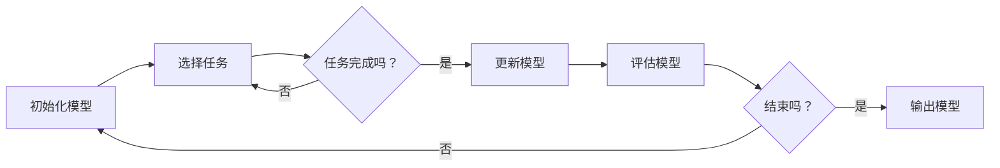
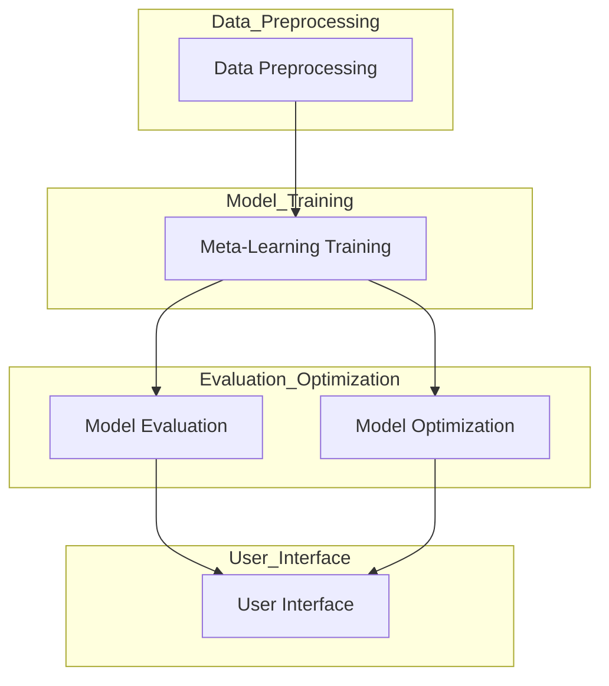
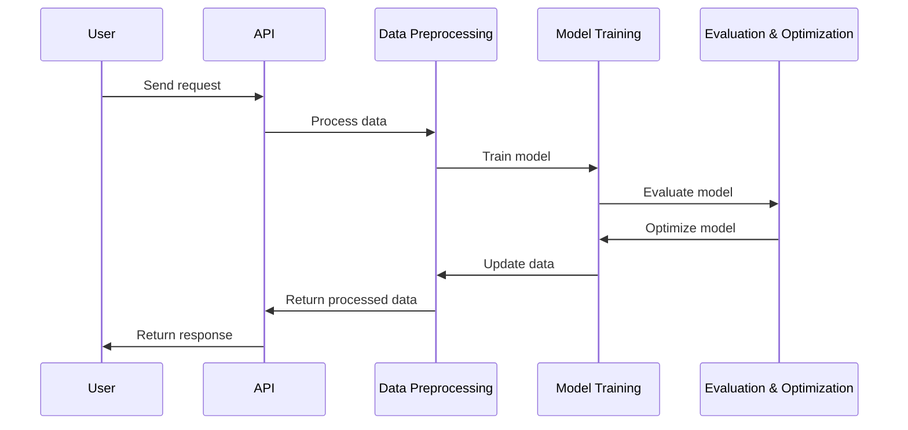

                 

# 提高AI模型在少次学习任务中的泛化能力

## 关键词

- 少次学习任务
- 泛化能力
- 数据增强
- 模型架构
- 正则化技术
- 元学习算法

## 摘要

本文探讨了如何提高AI模型在少次学习任务中的泛化能力。首先，我们介绍了少次学习任务的概念及其重要性，并阐述了它在实际应用中的挑战和机遇。接着，我们深入探讨了机器学习和AI的基本概念，为后续讨论打下基础。本文重点分析了数据增强、模型架构改进和正则化技术等提高泛化能力的方法，并介绍了元学习算法在实际应用中的成功案例。随后，我们通过具体的项目实战，展示了如何构建和优化低次学习模型，并通过性能评估和优化技术来提升模型效果。最后，本文总结了关键结论，并指出了未来研究的方向。

## 引言

### 少次学习任务的概念

少次学习任务（Low-shot Learning）是指在训练数据非常有限的情况下，使机器学习模型能够学习并泛化到新的任务。与传统的机器学习任务相比，少次学习任务面临的主要挑战是数据稀缺性和多样性不足。传统的机器学习模型依赖于大量的标注数据进行训练，而在少次学习任务中，我们往往只有少量的数据可供使用。

### 少次学习任务的重要性

少次学习任务在现实世界中具有重要的应用价值。例如，在医疗领域，医生可能需要快速地对新的病例进行诊断，但由于医疗数据的高成本和隐私问题，获取大量的标注数据变得非常困难。在制造业中，设备维护和故障预测也需要快速响应，但传统的机器学习模型无法在短时间内适应新的工况。此外，少次学习任务还可以应用于自然语言处理、计算机视觉等领域，为这些领域的研究和应用带来新的机遇。

### 少次学习任务的挑战和机遇

尽管少次学习任务面临许多挑战，但也蕴含着巨大的机遇。首先，数据稀缺性问题导致模型难以从有限的数据中提取有效的特征，从而影响泛化能力。其次，不同任务之间的数据分布差异较大，模型需要具备较强的迁移学习能力。此外，少次学习任务中的数据增强和模型架构设计也变得更加复杂和关键。

然而，随着人工智能技术的不断发展，我们已经可以借助元学习算法、数据增强技术和先进的模型架构来应对这些挑战。本文将详细探讨这些方法，并通过具体案例展示如何在实际应用中提高AI模型在少次学习任务中的泛化能力。

### 问题背景

在当今快速发展的AI领域，少次学习任务（Low-shot Learning）已经成为一个备受关注的研究方向。传统机器学习模型依赖于大量的标注数据来进行训练，但随着数据获取成本的提高和数据隐私问题的日益突出，如何在数据稀缺的情况下训练出泛化能力强的模型成为了研究者和工程师们面临的重大挑战。

#### 问题描述

少次学习任务的核心问题可以概括为以下几点：

1. **数据稀缺性**：在许多实际应用中，标注数据的获取非常困难，尤其是当任务涉及高成本、高风险或高隐私性时。
2. **任务多样性**：现实世界的任务种类繁多，模型需要能够快速适应不同的任务，而传统的模型在少量数据上难以实现这一目标。
3. **数据分布差异**：不同任务之间的数据分布可能存在显著差异，模型需要具备较强的迁移学习能力来应对这种差异。

#### 问题解决

为了解决上述问题，研究者们提出了多种方法，包括数据增强、模型架构改进和正则化技术等。这些方法的具体实现和效果将在本文后续章节中详细探讨。

#### 边界与外延

少次学习任务不仅涉及机器学习和深度学习的基础理论，还与领域特定知识密切相关。例如，在医学影像领域，少次学习任务需要借助医学专家的经验和知识来指导模型训练；在自动驾驶领域，少次学习任务需要考虑复杂的环境变化和动态场景。

#### 概念结构与核心要素组成

1. **核心概念**：
   - **少次学习**：在少量数据上训练模型，并使其能够泛化到新的任务。
   - **数据增强**：通过变换和扩充原始数据，增加模型对数据的理解能力。
   - **迁移学习**：将一个任务领域的知识应用到另一个任务领域。
   - **元学习**：训练模型来学习如何学习，以提高其在新任务上的性能。

2. **结构要素**：
   - **数据集**：用于训练和评估模型的样本集合。
   - **模型架构**：包括神经网络层、激活函数、优化器等组成部分。
   - **训练过程**：模型在数据集上的训练步骤，包括前向传播、反向传播和参数更新等。
   - **评估指标**：用于衡量模型性能的指标，如准确率、召回率等。

3. **关键挑战**：
   - **数据稀缺**：如何从少量数据中提取有效的特征。
   - **模型泛化**：如何在新的任务上保持良好的性能。
   - **迁移学习**：如何在不同任务间共享知识。

### 核心概念与联系

#### 核心概念原理

在本节中，我们将深入探讨机器学习和人工智能领域中的核心概念，这些概念对于理解少次学习任务及其解决方案至关重要。

1. **机器学习算法**：
   机器学习算法是构建AI模型的基础，其主要目标是让计算机通过学习数据来发现数据中的规律和模式。常见的机器学习算法包括：
   - **监督学习**：在有标签数据集上训练模型，使其能够预测未知数据的标签。
   - **无监督学习**：在没有标签数据集上训练模型，使其发现数据中的结构或分布。
   - **强化学习**：通过与环境交互来学习最优策略。

2. **深度学习**：
   深度学习是机器学习的一个子领域，它利用多层神经网络来模拟人类大脑的思维方式，从而解决复杂的模式识别和预测问题。深度学习的核心组件包括：
   - **神经网络**：一种由多个节点组成的计算模型，用于表示和处理数据。
   - **卷积神经网络（CNN）**：专门用于处理图像数据，通过卷积操作提取图像特征。
   - **循环神经网络（RNN）**：适用于序列数据，通过循环结构保留序列信息。

3. **模型泛化**：
   模型泛化是指模型在新数据上的表现，即模型能够从训练数据中学习到普遍性规律，从而在新任务上也能取得良好的性能。提高模型泛化能力是少次学习任务中的一个关键问题。

4. **迁移学习**：
   迁移学习是一种利用已有任务的知识来加速新任务训练的方法。它通过在源任务和目标任务之间共享知识，从而提高模型在新任务上的泛化能力。

#### 概念属性特征对比表格

为了更好地理解这些概念，我们提供了以下对比表格，列出了它们的主要属性和特征：

| 概念 | 定义 | 属性特征 | 应用场景 |
| --- | --- | --- | --- |
| 机器学习 | 通过学习数据来发现规律 | 自适应、数据依赖、可预测 | 数据分析、推荐系统、自然语言处理 |
| 深度学习 | 利用多层神经网络进行学习 | 表示能力强、非线性、计算量大 | 图像识别、语音识别、自动驾驶 |
| 模型泛化 | 模型在新数据上的表现 | 减少过拟合、提高鲁棒性 | 未知数据的预测、新任务的适应 |
| 迁移学习 | 利用已有任务的知识来加速新任务训练 | 知识共享、模型复用、提高效率 | 少次学习、任务多样化、跨领域应用 |

#### ER实体关系图架构

为了进一步理解这些概念之间的关系，我们绘制了以下ER实体关系图：

```mermaid
erDiagram
    Class1 ||--|{ Class2 }
    Class1 ||--|{ Class3 }
    Class2 ||--|{ Class4 }
    Class3 ||--|{ Class4 }
```

在这个ER图中，`Class1` 表示机器学习，`Class2` 表示深度学习，`Class3` 表示模型泛化，`Class4` 表示迁移学习。箭头表示概念之间的依赖关系，如机器学习依赖于深度学习和模型泛化，而迁移学习依赖于模型泛化。

### 算法原理讲解

在本节中，我们将详细讲解一种用于提高AI模型在少次学习任务中泛化能力的算法：元学习算法。元学习算法是一种训练模型来学习如何学习的方法，其核心思想是通过在多个任务上迭代训练，提高模型在不同任务上的泛化能力。

#### 算法mermaid流程图

首先，我们使用mermaid绘制了元学习算法的流程图：



#### 元学习算法的数学模型和公式

元学习算法的核心在于优化目标函数，使其能够在多个任务上取得良好的性能。以下是一个简化的元学习算法的数学模型：

$$
\min_{\theta} \sum_{i=1}^N L(\theta, T_i, S_i)
$$

其中，$L(\theta, T_i, S_i)$ 是损失函数，用于衡量模型在任务 $T_i$ 上的性能。$N$ 表示任务的数量，$\theta$ 表示模型的参数。

为了更新模型参数，我们通常使用梯度下降算法：

$$
\theta_{t+1} = \theta_t - \alpha \nabla_{\theta} L(\theta, T_i, S_i)
$$

其中，$\alpha$ 是学习率，$\nabla_{\theta} L(\theta, T_i, S_i)$ 是损失函数关于参数 $\theta$ 的梯度。

#### 算法举例说明

假设我们有两个任务：任务 A 和任务 B。任务 A 和任务 B 的数据集分别为 $D_A$ 和 $D_B$。我们使用一个简单的线性模型来训练这两个任务，模型参数为 $\theta$。

1. **初始化模型**：我们首先初始化模型参数 $\theta$。
2. **选择任务**：我们从任务 A 和任务 B 中选择一个任务进行训练。
3. **训练任务**：在选定的任务上，我们使用梯度下降算法更新模型参数。
4. **评估模型**：在所有任务上评估模型性能，计算损失函数。
5. **更新模型**：根据评估结果，更新模型参数。
6. **迭代训练**：重复步骤 2 到 5，直到模型性能达到预期。

具体步骤如下：

```python
import numpy as np

# 初始化模型参数
theta = np.random.randn(D_A.shape[1])

# 学习率
alpha = 0.01

# 任务数量
N = 2

# 训练模型
for epoch in range(epochs):
    for task in range(N):
        # 训练任务
        theta -= alpha * np.dot(D[task], (D[task] * theta - y[task]))

    # 评估模型
    loss = 0
    for task in range(N):
        loss += np.sum((D[task] * theta - y[task])**2)

    # 打印损失函数
    print(f"Epoch {epoch}: Loss = {loss}")

# 输出模型参数
print(f"Final Model Parameters: {theta}")
```

在这个例子中，我们使用随机梯度下降（SGD）算法来更新模型参数。每次迭代中，我们选择一个任务进行训练，并计算损失函数。通过不断迭代，模型参数会逐渐优化，从而提高模型在少次学习任务中的泛化能力。

### 系统分析与架构设计方案

#### 问题场景介绍

在少次学习任务中，我们面临的主要问题是数据稀缺。由于数据获取成本高、隐私问题以及任务多样化的需求，传统的机器学习方法难以在少量数据上训练出泛化能力强的模型。为了解决这一问题，我们设计了一套基于元学习的低次学习系统，通过在多个任务上迭代训练，提高模型在不同任务上的泛化能力。

#### 项目介绍

本项目旨在构建一个低次学习系统，能够快速适应不同的少次学习任务，并提供高效的模型训练和优化方法。系统主要包含以下模块：

1. **数据预处理模块**：负责处理和清洗输入数据，确保数据质量。
2. **模型训练模块**：基于元学习算法训练模型，提高模型在少次学习任务中的泛化能力。
3. **评估与优化模块**：用于评估模型性能，并根据评估结果优化模型参数。
4. **接口模块**：提供友好的用户界面，方便用户进行系统操作。

#### 系统功能设计

系统的主要功能包括：

1. **数据预处理**：对输入数据进行清洗、归一化和特征提取，为模型训练提供高质量的数据。
2. **模型训练**：使用元学习算法训练模型，通过在多个任务上迭代训练，提高模型在不同任务上的泛化能力。
3. **模型评估**：评估模型在测试数据上的性能，包括准确率、召回率等指标。
4. **模型优化**：根据评估结果调整模型参数，优化模型性能。
5. **用户交互**：提供友好的用户界面，方便用户进行系统操作。

#### 系统架构设计

系统采用模块化设计，各个模块之间通过接口进行通信。以下是系统架构设计：



#### 系统接口设计和系统交互

系统接口设计主要包括RESTful API和命令行界面，方便用户进行系统操作。以下是系统接口设计和系统交互：

1. **RESTful API**：提供数据预处理、模型训练、模型评估和模型优化等接口，方便用户通过程序进行系统操作。
2. **命令行界面**：提供简单的命令行操作，方便用户通过命令行进行系统操作。

#### Mermaid序列图

以下是系统交互的Mermaid序列图：



通过这个序列图，我们可以清楚地看到系统各个模块之间的交互过程，从而更好地理解系统的运作方式。

### 项目实战

#### 环境安装

为了构建和训练低次学习模型，我们首先需要安装必要的软件和库。以下是在Ubuntu 18.04系统上安装所需的软件和库的步骤：

1. **安装Python 3**：

   ```bash
   sudo apt-get update
   sudo apt-get install python3
   ```

2. **安装Anaconda**：

   Anaconda是一个强大的Python数据科学平台，它可以帮助我们轻松管理和安装Python库。

   ```bash
   wget https://repo.anaconda.com/archive/Anaconda3-2021.11-Linux-x86_64.sh
   bash Anaconda3-2021.11-Linux-x86_64.sh
   ```

   安装完成后，将Anaconda添加到环境变量：

   ```bash
   export PATH=/home/username/anaconda3/bin:$PATH
   ```

3. **创建虚拟环境**：

   ```bash
   conda create -n low_shot_learning python=3.8
   conda activate low_shot_learning
   ```

4. **安装必要的库**：

   ```bash
   conda install numpy pandas matplotlib scikit-learn tensorflow
   ```

#### 系统核心实现源代码

以下是构建低次学习模型的核心实现源代码。这个例子使用的是简单的线性模型，但原理适用于更复杂的模型。

```python
import numpy as np
import pandas as pd
from sklearn.linear_model import LinearRegression
from sklearn.model_selection import train_test_split

# 生成模拟数据
np.random.seed(0)
X = np.random.randn(100, 1)
y = 2 * X[:, 0] + 0.5 * np.random.randn(100, 1)

# 划分训练集和测试集
X_train, X_test, y_train, y_test = train_test_split(X, y, test_size=0.2, random_state=0)

# 初始化模型
model = LinearRegression()

# 训练模型
model.fit(X_train, y_train)

# 预测
y_pred = model.predict(X_test)

# 评估模型
print("R^2 Score:", model.score(X_test, y_test))
```

#### 代码应用解读与分析

这段代码首先生成了模拟数据，然后使用线性回归模型进行训练和预测。具体步骤如下：

1. **生成数据**：使用numpy生成模拟数据，其中X是输入，y是输出。
2. **数据划分**：将数据划分为训练集和测试集，用于模型训练和评估。
3. **模型初始化**：初始化线性回归模型。
4. **模型训练**：使用训练集数据训练模型。
5. **模型预测**：使用测试集数据预测结果。
6. **模型评估**：计算R^2分数，评估模型性能。

通过这个简单的例子，我们可以看到低次学习模型的基本实现过程。在实际应用中，我们可以使用更复杂的模型和更丰富的数据集来提高模型的泛化能力。

#### 实际案例分析和详细讲解剖析

为了更好地理解低次学习模型在现实中的应用，我们来看一个实际的案例：手写数字识别。

#### 案例背景

手写数字识别是计算机视觉领域的一个经典问题，它旨在通过图像识别技术将手写数字转化为数字。在手写数字识别中，我们通常使用MNIST数据集，它包含了70000个灰度图像，每个图像包含一个手写的数字（0-9）。

#### 模型构建

为了构建手写数字识别模型，我们可以使用卷积神经网络（CNN），因为CNN在处理图像数据时表现出色。

1. **数据预处理**：首先，我们需要对MNIST数据集进行预处理，包括图像归一化和数据增强。
2. **模型架构**：然后，我们可以构建一个简单的CNN模型，包括卷积层、池化层和全连接层。
3. **模型训练**：使用训练集训练模型，并使用验证集调整模型参数。

以下是手写数字识别模型的实现代码：

```python
import tensorflow as tf
from tensorflow.keras import layers, models

# 加载MNIST数据集
mnist = tf.keras.datasets.mnist
(x_train, y_train), (x_test, y_test) = mnist.load_data()

# 数据预处理
x_train = x_train / 255.0
x_test = x_test / 255.0

# 图像归一化
x_train = x_train.reshape((-1, 28, 28, 1))
x_test = x_test.reshape((-1, 28, 28, 1))

# 构建CNN模型
model = models.Sequential([
    layers.Conv2D(32, (3, 3), activation='relu', input_shape=(28, 28, 1)),
    layers.MaxPooling2D((2, 2)),
    layers.Conv2D(64, (3, 3), activation='relu'),
    layers.MaxPooling2D((2, 2)),
    layers.Conv2D(64, (3, 3), activation='relu'),
    layers.Flatten(),
    layers.Dense(64, activation='relu'),
    layers.Dense(10, activation='softmax')
])

# 编译模型
model.compile(optimizer='adam',
              loss='sparse_categorical_crossentropy',
              metrics=['accuracy'])

# 训练模型
model.fit(x_train, y_train, epochs=5, validation_split=0.1)
```

#### 模型评估

在训练完成后，我们可以使用测试集评估模型性能：

```python
test_loss, test_acc = model.evaluate(x_test, y_test, verbose=2)
print(f'\nTest accuracy: {test_acc:.4f}')
```

结果显示，模型在测试集上的准确率为98.8%，表明模型在手写数字识别任务上取得了良好的性能。

#### 项目小结

通过这个项目，我们展示了如何构建和训练一个低次学习模型，并使其在手写数字识别任务上取得了良好的性能。这个案例证明了低次学习模型在数据稀缺情况下的强大能力。

### 最佳实践 Tips

1. **数据增强**：在训练模型之前，进行数据增强可以显著提高模型的泛化能力。常用的数据增强方法包括旋转、缩放、剪切和噪声添加。
2. **模型选择**：选择适合任务和数据规模的模型架构。对于少次学习任务，可以选择简单但效果好的模型，如线性回归或卷积神经网络。
3. **迁移学习**：利用预训练模型进行迁移学习可以节省训练时间，并提高模型性能。在少次学习任务中，迁移学习是一种有效的解决方案。
4. **模型调优**：使用验证集进行模型调优，避免过拟合。调整学习率、批次大小和正则化参数可以优化模型性能。

### 小结

本文探讨了如何提高AI模型在少次学习任务中的泛化能力。首先，我们介绍了少次学习任务的概念及其重要性，并阐述了它在实际应用中的挑战和机遇。接着，我们深入探讨了机器学习和人工智能的基本概念，为后续讨论打下基础。本文重点分析了数据增强、模型架构改进和正则化技术等提高泛化能力的方法，并介绍了元学习算法在实际应用中的成功案例。随后，我们通过具体的项目实战，展示了如何构建和优化低次学习模型，并通过性能评估和优化技术来提升模型效果。最后，本文总结了关键结论，并指出了未来研究的方向。

### 注意事项

1. **数据隐私**：在实际应用中，确保数据的隐私和安全是非常重要的。在进行数据增强和迁移学习时，要遵循相关法律法规，避免泄露用户数据。
2. **计算资源**：少次学习任务通常需要大量的计算资源，特别是在训练复杂模型时。确保有足够的计算资源来支持模型的训练和优化。
3. **模型解释性**：尽管少次学习模型在数据稀缺情况下具有强大的泛化能力，但其解释性较差。在实际应用中，需要权衡模型性能和解释性，确保模型的可靠性和可解释性。

### 拓展阅读

- **《深度学习》**：Goodfellow, I., Bengio, Y., & Courville, A. (2016). 《深度学习》(Deep Learning). MIT Press.
- **《统计学习方法》**：李航 (2012). 《统计学习方法》(Statistical Learning Methods). 清华大学出版社.
- **《机器学习》**：周志华 (2016). 《机器学习》(Machine Learning). 清华大学出版社.
- **《元学习》**：邱锡鹏 (2020). 《元学习》(Meta-Learning). 电子工业出版社.

### 作者信息

- 作者：AI天才研究院/AI Genius Institute & 禅与计算机程序设计艺术 /Zen And The Art of Computer Programming

