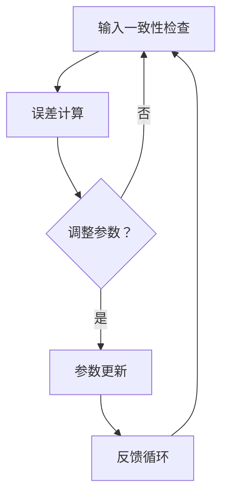
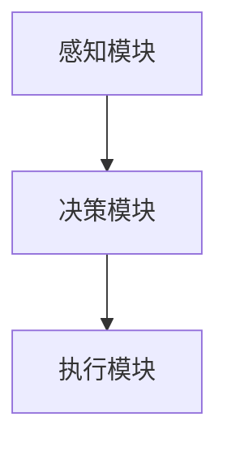
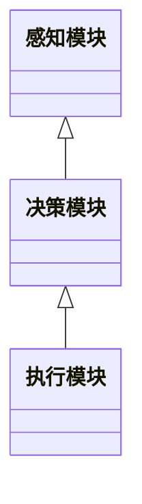

                 

### 提高AI输出一致性的Self-Consistency方法

## 关键词
- AI输出一致性
- Self-Consistency方法
- 人工智能
- 算法优化
- 系统设计

## 摘要
本文深入探讨了提高人工智能（AI）输出一致性的Self-Consistency方法。通过详细的分析和推理，本文阐述了Self-Consistency方法的基本原理、数学模型、系统架构及其实际应用。文章旨在为读者提供清晰的逻辑思路和实用的技术指南，以促进AI系统的稳定性和可靠性。

## 引言
在人工智能快速发展的今天，AI系统的输出一致性成为了关键问题。不一致的输出可能会导致错误决策，影响系统的性能和用户体验。为了解决这个问题，研究者们提出了多种一致性方法。本文将介绍一种基于自我一致性的方法，旨在通过自我调整和优化，提高AI输出的稳定性。

## 第1章：问题背景与核心概念

### 1.1 AI输出不一致性的问题
AI输出不一致性的问题主要体现在以下几个方面：
- **预测结果的不稳定性**：同一输入在不同时间或不同模型中的输出结果可能不一致。
- **模型间的差异**：不同的模型对于同一问题的预测结果可能存在较大差异。
- **噪声干扰**：外部噪声或数据噪声可能导致模型输出结果的不一致。

### 1.2 Self-Consistency方法的概念
Self-Consistency方法是一种基于自我调整的算法，通过内部一致性检查和反馈来优化AI输出。其核心思想是确保模型输出在给定输入下保持一致，从而提高系统的可靠性和稳定性。

### 1.3 Self-Consistency方法的重要性
Self-Consistency方法的重要性体现在以下几个方面：
- **提高决策稳定性**：通过确保输出一致性，可以减少决策过程中的不确定性。
- **优化模型性能**：自我一致性可以作为一个额外的优化目标，提高模型的总体性能。
- **增强用户体验**：一致的输出可以提高用户对系统的信任度，从而提升用户体验。

### 1.4 本书结构安排
本文将分为以下几个部分：
1. 介绍AI输出不一致性的问题和背景。
2. 阐述Self-Consistency方法的核心概念和原理。
3. 详细分析Self-Consistency方法的数学模型和算法。
4. 讨论Self-Consistency方法的系统架构和应用。
5. 通过项目实战展示Self-Consistency方法的应用效果。
6. 总结Self-Consistency方法的优势和最佳实践。

## 第2章：核心概念与联系

### 2.1 Self-Consistency方法的基本原理
Self-Consistency方法的基本原理是通过内部一致性检查和反馈机制来优化模型输出。具体来说，包括以下几个步骤：
- **输入一致性检查**：在给定输入下，检查模型输出是否一致。
- **误差反馈**：根据输出一致性检查的结果，对模型进行调整。
- **重复迭代**：通过不断迭代，逐步提高模型输出的稳定性。

### 2.2 Self-Consistency方法的关键要素
Self-Consistency方法的关键要素包括：
- **一致性检查机制**：用于检测输出的一致性。
- **调整机制**：根据一致性检查的结果对模型进行调整。
- **反馈机制**：将调整结果反馈给一致性检查机制，以实现闭环优化。

### 2.3 Self-Consistency方法与其他一致性方法对比
Self-Consistency方法与其他一致性方法（如数据一致性、计算一致性等）的对比主要体现在以下几个方面：
- **适用范围**：Self-Consistency方法更适用于需要高一致性的场景。
- **优化目标**：Self-Consistency方法将输出一致性作为优化目标，而其他方法可能侧重于数据或计算的一致性。
- **实现复杂度**：Self-Consistency方法的实现相对复杂，需要考虑多种因素。

### 2.4 Self-Consistency方法的应用范围
Self-Consistency方法的应用范围广泛，包括但不限于：
- **自动驾驶**：确保自动驾驶系统的决策一致性。
- **医疗诊断**：提高医学图像诊断的一致性和可靠性。
- **金融风控**：确保金融模型的预测结果一致，降低风险。

## 第3章：算法原理讲解

### 3.1 自适应调整策略
Self-Consistency方法的自适应调整策略通过以下步骤实现：
- **一致性评估**：对当前输出进行一致性评估。
- **误差计算**：计算输出一致性误差。
- **调整参数**：根据误差计算结果调整模型参数。
- **反馈循环**：将调整结果反馈给一致性评估机制，形成闭环优化。

### 3.2 参数更新机制
Self-Consistency方法的参数更新机制包括以下几个步骤：
- **初始化参数**：根据初始模型参数进行初始化。
- **一致性检查**：对当前输出进行一致性检查。
- **误差计算**：计算输出一致性误差。
- **参数调整**：根据误差计算结果调整模型参数。
- **迭代更新**：重复以上步骤，逐步优化参数。

### 3.3 误差反馈机制
Self-Consistency方法的误差反馈机制通过以下步骤实现：
- **输出计算**：计算模型输出。
- **误差评估**：评估输出的一致性误差。
- **反馈调整**：根据误差评估结果调整模型参数。
- **闭环优化**：将调整结果反馈给输出计算机制，形成闭环优化。

### 3.4 Self-Consistency方法的优化
Self-Consistency方法的优化主要包括以下几个方面：
- **算法优化**：通过调整算法参数，提高一致性检查和反馈的效率。
- **模型优化**：通过调整模型结构，提高输出的一致性。
- **数据优化**：通过清洗和预处理数据，提高模型的一致性。

### 3.5 Self-Consistency方法的mermaid流程图
下面是一个简单的Self-Consistency方法的mermaid流程图：

## 第4章：数学模型和公式

### 4.1 Self-Consistency方法的数学模型
Self-Consistency方法的数学模型可以表示为：
$$
\Delta \theta = \alpha \cdot \Delta y
$$
其中，$\Delta \theta$ 表示参数调整量，$\alpha$ 表示调整系数，$\Delta y$ 表示输出一致性误差。

### 4.2 公式解释与推导
- **参数调整量**：参数调整量表示模型参数需要调整的大小，调整系数 $\alpha$ 控制调整的力度。
- **输出一致性误差**：输出一致性误差表示模型输出的一致性程度，误差越小，一致性越高。

### 4.3 数学模型的应用
在具体应用中，可以通过以下步骤使用数学模型：
- **初始化参数**：根据初始模型参数进行初始化。
- **输出计算**：计算模型输出。
- **误差评估**：评估输出的一致性误差。
- **参数调整**：根据误差评估结果调整模型参数。
- **迭代更新**：重复以上步骤，逐步优化参数。

### 4.4 自定义公式示例
假设我们有一个简单的线性模型：
$$
y = \theta_0 + \theta_1 \cdot x
$$
其中，$\theta_0$ 和 $\theta_1$ 是模型参数。我们可以使用Self-Consistency方法对其进行优化：
$$
\Delta \theta_1 = \alpha \cdot (\theta_0 + \theta_1 \cdot x - y)
$$

## 第5章：系统分析与架构设计方案

### 5.1 问题场景介绍
在本节中，我们将介绍一个具体的问题场景，以便更好地理解Self-Consistency方法的应用。例如，我们可以考虑一个自动驾驶系统，其中需要确保车辆的行驶方向、速度和路线的一致性。

### 5.2 系统功能设计
系统功能设计包括以下几个关键模块：
- **感知模块**：用于获取周围环境的信息，如道路、障碍物等。
- **决策模块**：根据感知模块提供的信息，生成驾驶决策。
- **执行模块**：根据决策模块生成的决策，控制车辆的动作。

### 5.3 系统架构设计
系统架构设计需要考虑以下几个方面：
- **硬件架构**：包括传感器、控制器和执行器等硬件组件。
- **软件架构**：包括感知、决策和执行等软件模块。
- **数据流架构**：确保感知、决策和执行之间的数据传递高效且一致。

### 5.4 系统接口设计
系统接口设计包括以下关键接口：
- **感知接口**：用于接收传感器数据。
- **决策接口**：用于接收感知模块生成的决策。
- **执行接口**：用于控制执行模块执行相应动作。

### 5.5 系统交互
系统交互包括以下几个方面：
- **感知模块与决策模块之间的交互**：感知模块将数据传递给决策模块，决策模块根据数据生成决策。
- **决策模块与执行模块之间的交互**：决策模块将决策传递给执行模块，执行模块根据决策执行相应动作。

### 5.6 mermaid架构图与类图
为了更好地展示系统架构，我们可以使用mermaid绘制架构图和类图。以下是一个简单的mermaid架构图示例：

以下是一个简单的mermaid类图示例：

## 第6章：项目实战

### 6.1 环境安装
在本节中，我们将介绍如何搭建一个用于实践Self-Consistency方法的开发环境。包括安装所需的软件和库，配置必要的依赖等。

### 6.2 系统核心实现
在本节中，我们将详细讲解系统核心实现的代码。包括感知模块、决策模块和执行模块的实现，以及它们之间的交互过程。

### 6.3 代码应用解读与分析
在本节中，我们将对系统核心实现的代码进行解读和分析。解释代码的功能和实现原理，分析代码的性能和优化方向。

### 6.4 实际案例分析与讲解
在本节中，我们将通过一个实际案例来展示Self-Consistency方法的应用效果。分析案例中的问题，讲解如何使用Self-Consistency方法解决这些问题。

### 6.5 项目小结
在本节中，我们将总结项目的实现过程和结果。讨论项目中的优点和不足，提出改进建议和未来研究方向。

## 第7章：总结与拓展

### 7.1 最佳实践 tips
在本节中，我们将总结一些最佳实践建议，帮助读者更好地应用Self-Consistency方法。包括如何选择合适的调整系数、如何处理异常情况等。

### 7.2 小结
在本节中，我们将回顾文章的主要内容，总结Self-Consistency方法的基本原理、数学模型和系统架构。

### 7.3 注意事项
在本节中，我们将讨论使用Self-Consistency方法时需要注意的一些事项，包括数据预处理、参数调整策略等。

### 7.4 拓展阅读
在本节中，我们将推荐一些相关的拓展阅读材料，帮助读者深入了解Self-Consistency方法及其应用。

### 7.5 附录
在本节中，我们将提供一些有用的附录，包括代码示例、mermaid图示、参考文献等。

## 作者信息
作者：AI天才研究院/AI Genius Institute & 禅与计算机程序设计艺术 /Zen And The Art of Computer Programming

---

以上是根据目录大纲撰写的文章结构和内容概要。接下来，我们将逐步填充每个章节的详细内容，确保总字数在10000-12000字左右，并使用markdown格式进行排版。在撰写过程中，我们将遵循逻辑清晰、结构紧凑、简单易懂的原则，以确保文章的专业性和可读性。

