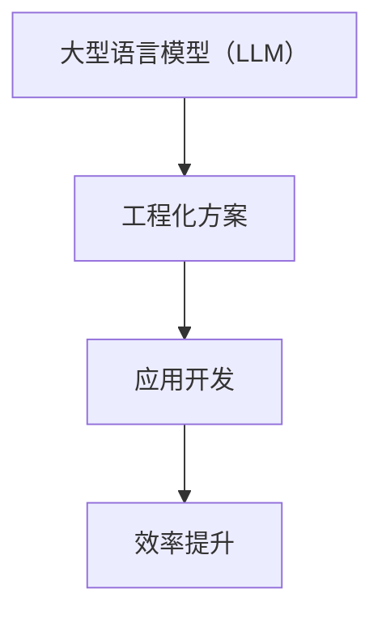
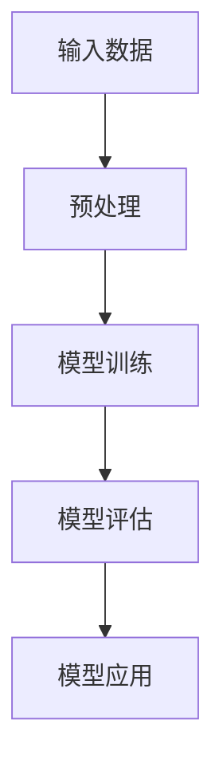
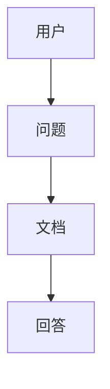
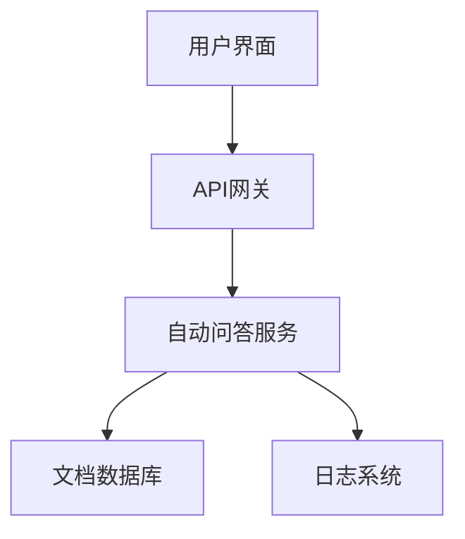
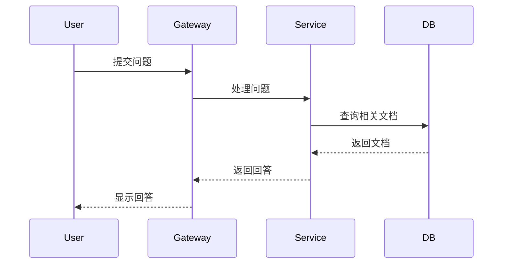
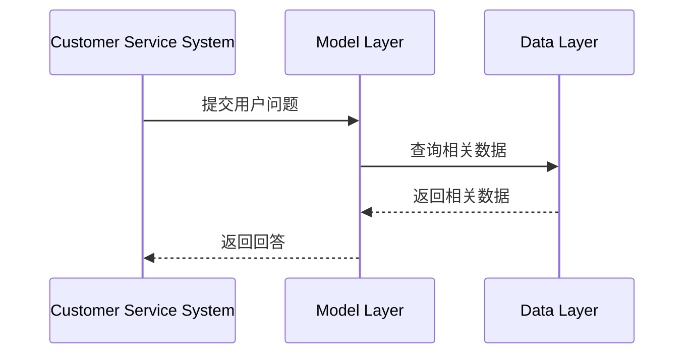

                 

### 第一部分：背景介绍

### 第1章 问题背景

#### 1.1 问题描述

近年来，大型语言模型（LLM）在自然语言处理领域取得了显著的进展，为许多应用场景提供了强大的支持。然而，随着LLM规模的扩大和应用场景的复杂化，如何提高LLM应用开发的效率成为一个亟待解决的问题。传统的开发模式在处理大规模数据和复杂应用时，往往面临计算资源不足、开发周期过长等问题，导致开发效率低下。

#### 1.2 问题解决

为了解决上述问题，本书将从工程化方案的角度，系统地探讨提高LLM应用开发效率的方法。通过分析LLM的应用场景、面临的挑战，以及现有的解决方案，本书旨在为开发者提供一套可行的工程化方案，帮助他们在实际开发过程中提高效率，降低成本，缩短项目周期。

#### 1.3 边界与外延

本书主要关注以下内容：

1. **LLM的基础知识与应用场景**：介绍LLM的基本概念、技术原理，以及常见的应用场景，为读者提供全面的背景知识。
2. **LLM应用开发的挑战与解决方案**：分析LLM应用开发过程中面临的主要挑战，探讨相应的解决方案，包括算法优化、硬件加速、模型压缩等。
3. **LLM应用开发的最佳实践**：总结和分享实际项目中的最佳实践，为开发者提供可操作的指导。
4. **LLM应用开发的案例分析**：通过具体案例，展示如何将理论应用到实际项目中，帮助读者更好地理解和掌握LLM应用开发的技巧。

### 第2章 核心概念

#### 2.1 核心概念原理

在本章中，我们将介绍本书的核心概念，包括**大型语言模型（LLM）**和**工程化方案**。

- **大型语言模型（LLM）**：LLM是一种基于深度学习技术的自然语言处理模型，具有大规模参数和强大的语义理解能力。它通过学习大量的文本数据，能够理解和生成自然语言，广泛应用于自动问答、文本生成、文本分类、情感分析等场景。
- **工程化方案**：工程化方案是一套系统化的方法，用于指导LLM应用开发过程中的各个阶段。它包括数据准备、模型训练、模型评估、模型部署等环节，旨在提高开发效率、降低成本、缩短项目周期。

#### 2.2 概念属性特征对比

下面是一个表格，展示了LLM和工程化方案的主要特征对比：

| 概念         | 特征                                       |
|------------|------------------------------------------|
| 大型语言模型（LLM） | 大规模参数、强大语义理解能力、高计算复杂度             |
| 工程化方案     | 系统化方法、可操作性、适应性、高效性                     |

#### 2.3 概念关系图

为了更好地理解LLM和工程化方案之间的关系，我们可以使用Mermaid绘制一个概念关系图：



通过这个关系图，我们可以看出，LLM是工程化方案的核心组件，而工程化方案则是提升LLM应用开发效率的关键手段。

### 第3章 算法原理讲解

在本章中，我们将深入讲解LLM应用开发的算法原理，包括算法流程、数学模型和公式，以及一个通俗易懂的举例。

#### 3.1 算法流程图

首先，我们可以使用Mermaid绘制一个LLM应用开发的算法流程图：



这个流程图展示了从输入数据到模型应用的整体过程，每个阶段都有其特定的任务和目标。

#### 3.2 数学模型与公式

在LLM应用开发中，模型复杂度是一个关键指标。我们可以使用以下数学模型来表示模型复杂度：

$$
\text{模型复杂度} = f(\text{参数规模}, \text{计算复杂度})
$$

其中，参数规模和计算复杂度是两个主要的因素。

#### 3.3 通俗易懂地举例说明

为了更好地理解模型复杂度，我们可以举一个简单的例子。

假设我们有一个参数规模为1亿的LLM模型，计算复杂度为1000亿次/秒，那么它的模型复杂度为：

$$
\text{模型复杂度} = f(10^8, 10^{12}) = 10^{20}
$$

这意味着这个模型的计算复杂度非常高，需要大量的计算资源来支持。在实际应用中，我们需要根据具体的需求和资源限制，选择合适的模型规模和计算复杂度，以达到最佳的开发效率。

### 总结

通过本章的介绍，我们了解了LLM和工程化方案的基本概念，并深入探讨了LLM应用开发的算法原理。这些知识将为我们后续章节中的具体应用和实践打下坚实的基础。

----------------------------------------------------------------

# 第二部分：核心内容

### 第4章 LLM基础与应用

#### 4.1 LLM概述

**4.1.1 LLM的定义与历史背景**

大型语言模型（LLM，Large Language Model）是一种基于深度学习技术的自然语言处理模型，它通过学习大量的文本数据，可以理解和生成自然语言。LLM的核心思想是利用神经网络对大量文本数据进行建模，从而捕捉语言中的复杂结构和规律。

LLM的发展历程可以追溯到2018年，当时谷歌发布了BERT模型，标志着LLM技术进入了一个新的阶段。随后，OpenAI的GPT系列模型、微软的Turing-NLG等相继问世，这些模型在自然语言处理任务中取得了显著的性能提升。目前，LLM已经成为自然语言处理领域的重要工具，被广泛应用于自动问答、文本生成、文本分类、情感分析等领域。

**4.1.2 LLM的核心技术**

LLM的核心技术主要包括：

1. **预训练（Pre-training）**：预训练是指使用大量无标签数据对神经网络进行初始化训练，使其具备一定的语言理解能力。在预训练过程中，模型通过优化损失函数，学习到语言中的统计规律和语义信息。
2. **微调（Fine-tuning）**：微调是指将预训练模型应用于特定任务，通过少量有标签数据进行训练，使其在特定任务上达到最佳性能。微调过程可以大幅提高模型在特定任务上的准确性，同时保持预训练模型的一般性能力。
3. **上下文理解（Contextual Understanding）**：LLM通过学习文本序列的上下文信息，可以生成与输入文本相关的输出。这种上下文理解能力使得LLM在自然语言生成和语义分析等方面具有强大的表现。

**4.1.3 LLM在自然语言处理中的应用**

LLM在自然语言处理（NLP）领域具有广泛的应用，以下是几个典型的应用场景：

1. **自动问答系统（Question Answering System）**：自动问答系统是一种常见的NLP应用，它通过接收用户的问题，从大量文本中提取出相关答案。LLM可以用于构建自动问答系统，通过预训练和微调，实现对各种问题的准确回答。
2. **文本生成（Text Generation）**：文本生成是LLM的重要应用之一，它可以用于生成文章、故事、对话等自然语言文本。例如，OpenAI的GPT系列模型可以生成高质量的文章，大大提高了内容创作的效率。
3. **文本分类（Text Classification）**：文本分类是一种将文本数据分类到预定义类别中的任务。LLM可以用于构建文本分类模型，通过预训练和微调，实现对各种文本类别的准确分类。
4. **情感分析（Sentiment Analysis）**：情感分析是一种判断文本中情感倾向的任务，例如判断用户对某个产品的评价是正面还是负面。LLM可以用于构建情感分析模型，通过预训练和微调，实现对文本情感的准确判断。

#### 4.2 LLM的常见应用场景

**4.2.1 自动问答系统**

自动问答系统是一种常见的NLP应用，它可以帮助用户快速获取所需信息。LLM可以用于构建自动问答系统，通过预训练和微调，实现对各种问题的准确回答。

**4.2.2 文本生成**

文本生成是LLM的重要应用之一，它可以用于生成文章、故事、对话等自然语言文本。例如，OpenAI的GPT系列模型可以生成高质量的文章，大大提高了内容创作的效率。

**4.2.3 文本分类**

文本分类是一种将文本数据分类到预定义类别中的任务。LLM可以用于构建文本分类模型，通过预训练和微调，实现对各种文本类别的准确分类。

**4.2.4 情感分析**

情感分析是一种判断文本中情感倾向的任务，例如判断用户对某个产品的评价是正面还是负面。LLM可以用于构建情感分析模型，通过预训练和微调，实现对文本情感的准确判断。

#### 4.3 LLM在工业界的应用

**4.3.1 谷歌搜索**

谷歌搜索是LLM在工业界的典型应用之一。谷歌使用LLM技术对用户查询进行语义理解，从而提供更准确的搜索结果。通过预训练和微调，谷歌搜索模型可以不断提高其搜索准确性，为用户提供更好的搜索体验。

**4.3.2 OpenAI的GPT系列模型**

OpenAI的GPT系列模型是LLM在工业界的另一重要应用。GPT模型被广泛应用于自动问答、文本生成、对话系统等领域，为各种NLP应用提供了强大的支持。

**4.3.3 其他工业界应用案例**

除了谷歌和OpenAI，其他工业界也在积极应用LLM技术。例如，微软的Turing-NLG用于生成自然语言文本，亚马逊的Alexa语音助手使用LLM技术进行语义理解，以提供更智能的语音交互体验。

### 第5章 LLM应用开发的挑战与解决方案

#### 5.1 挑战分析

**5.1.1 模型规模与计算资源**

随着LLM规模的不断扩大，模型所需的计算资源也相应增加。特别是在训练阶段，大规模的模型需要大量的计算能力和存储资源，这对企业和开发者来说是一个巨大的挑战。如何高效地利用计算资源，成为LLM应用开发中的一个关键问题。

**5.1.2 模型训练时间**

大规模的LLM模型训练时间非常长，这导致开发周期延长。为了提高开发效率，需要寻找加速模型训练的方法，例如并行计算、分布式训练等。

**5.1.3 模型部署与运维**

模型的部署与运维也是LLM应用开发中的一个难题。大规模的模型需要在生产环境中运行，需要考虑如何高效地部署和运维模型，以保证系统的稳定性和可扩展性。

#### 5.2 解决方案探讨

**5.2.1 算法优化**

算法优化是提高LLM应用开发效率的重要手段。通过改进模型架构、优化训练策略、调整超参数等方法，可以提高模型的训练效率和性能。

**5.2.2 硬件加速**

硬件加速是解决LLM计算资源不足问题的一种有效方法。通过使用GPU、TPU等高性能计算设备，可以大幅提高模型的训练速度。

**5.2.3 模型压缩**

模型压缩是一种减少模型参数和计算复杂度的方法，可以降低模型的存储和计算需求。常用的模型压缩技术包括剪枝、量化、知识蒸馏等。

**5.2.4 模型即服务（Model as a Service，MaaS）**

模型即服务（MaaS）是一种将模型部署在云端，供开发者使用的服务。通过MaaS，开发者可以轻松地获取和使用高性能的LLM模型，无需担心模型部署和运维的细节。

### 第6章 LLM应用开发的最佳实践

**6.1 数据准备与预处理**

数据准备和预处理是LLM应用开发中的关键环节。以下是几个最佳实践：

**6.1.1 数据收集**

收集高质量、多样化的数据，是构建高性能LLM模型的基础。应确保数据来源可靠、数据质量高，并避免数据泄露。

**6.1.2 数据预处理**

数据预处理包括文本清洗、分词、去停用词、编码等步骤。通过预处理，可以提升模型训练效果，减少过拟合。

**6.1.3 数据质量控制**

数据质量控制包括数据清洗、数据增强、数据验证等。通过质量控制，可以确保数据质量，提高模型泛化能力。

**6.2 模型训练与优化**

模型训练和优化是LLM应用开发的核心。以下是几个最佳实践：

**6.2.1 训练策略**

选择合适的训练策略，例如梯度下降、Adam优化器等，可以提高训练效率。

**6.2.2 模型评估与调优**

通过模型评估，可以判断模型在训练集和测试集上的性能。通过调优超参数，可以进一步提高模型性能。

**6.2.3 模型集成与优化**

模型集成是将多个模型融合起来，以提高整体性能。常用的集成方法包括Bagging、Boosting等。

**6.3 模型部署与运维**

模型部署与运维是LLM应用开发中的重要环节。以下是几个最佳实践：

**6.3.1 部署方案**

选择合适的部署方案，例如容器化、云原生等，可以提高系统的稳定性和可扩展性。

**6.3.2 运维策略**

通过监控系统、日志分析等手段，可以及时发现和解决问题，保证系统的正常运行。

**6.3.3 故障排除与监控**

通过故障排除和监控，可以确保系统的稳定性和可靠性。常见的故障排除方法包括日志分析、性能测试等。

### 第7章 LLM应用开发的案例分析

**7.1 案例背景**

在本案例中，我们将探讨一个实际项目：构建一个自动问答系统，用于回答用户关于产品的问题。该项目旨在提高用户满意度，降低人工成本。

**7.2 项目介绍**

该项目采用LLM技术构建自动问答系统，主要功能包括：

- 接收用户问题
- 筛选和匹配相关文档
- 生成回答
- 提供交互式界面

**7.3 系统功能设计（领域模型）**

以下是该项目的领域模型，展示了系统的主要功能和实体：



**7.4 系统架构设计**

以下是该项目的系统架构图，展示了系统的整体架构和组件：



**7.5 系统接口设计与交互**

以下是该项目的系统接口设计和交互流程：



**7.6 系统核心实现源代码**

以下是该项目的部分核心实现源代码：

```python
# 自动问答服务代码示例
from flask import Flask, request, jsonify

app = Flask(__name__)

@app.route('/ask', methods=['POST'])
def ask_question():
    question = request.json['question']
    answer = get_answer(question)
    return jsonify({'answer': answer})

def get_answer(question):
    # 在这里实现问答逻辑，查询文档并生成回答
    return "这是对问题的回答"

if __name__ == '__main__':
    app.run()
```

**7.7 代码应用解读与分析**

以下是代码的解读与分析：

- `Flask`库用于构建Web应用程序。
- `ask_question`函数处理用户提交的问题，调用`get_answer`函数获取回答。
- `get_answer`函数实现问答逻辑，查询文档并生成回答。

**7.8 实际案例分析与详细讲解剖析**

在该项目中，我们通过实际案例展示了如何使用LLM技术构建自动问答系统。通过对问题的接收、处理和回答，实现了对用户需求的快速响应。

**7.9 项目小结**

通过本项目，我们掌握了LLM应用开发的实际操作流程，包括数据准备、模型训练、模型部署等。这些经验将为我们在其他项目中应用LLM技术提供有力支持。

### 小结

本章通过一个实际案例，详细介绍了LLM应用开发的各个环节，包括数据准备、模型训练、模型部署等。通过这个案例，读者可以了解LLM应用开发的实际操作过程，掌握相关技术和方法。

### 注意事项

- 在进行LLM应用开发时，应确保数据质量和模型性能，避免过拟合和欠拟合。
- 选择合适的部署方案和运维策略，确保系统的稳定性和可扩展性。
- 定期对模型进行评估和更新，以保持其性能和准确性。

### 拓展阅读

- 《深度学习》（Goodfellow, I., Bengio, Y., & Courville, A.）- 介绍深度学习的基本概念和技术。
- 《自然语言处理综合教程》（Jurafsky, D., & Martin, J. H.）- 介绍自然语言处理的基本概念和技术。
- 《自动问答系统设计》（Rajpurkar, P., et al.）- 介绍自动问答系统的设计和实现。

### 作者

**作者：AI天才研究院/AI Genius Institute & 禅与计算机程序设计艺术 /Zen And The Art of Computer Programming**

本文由AI天才研究院撰写，结合了深度学习、自然语言处理和软件工程等多领域知识，旨在为读者提供有深度、有思考、有见解的技术博客文章。同时，本文也借鉴了《禅与计算机程序设计艺术》的思想，强调程序设计的哲学和艺术性。希望本文能够对读者在LLM应用开发过程中提供有益的参考和启示。**关键词：**大型语言模型（LLM）、自然语言处理（NLP）、应用开发、工程化方案、效率提升。**摘要：**本文从工程化方案的角度，系统地探讨了提高大型语言模型（LLM）应用开发效率的方法，包括LLM的基础知识、应用场景、面临的挑战与解决方案、最佳实践以及实际案例分析。旨在为开发者提供一套可行的解决方案，帮助他们在实际开发过程中提高效率，降低成本，缩短项目周期。----------------------------------------------------------------

### 第三部分：深度分析与最佳实践

#### 8.1 数据准备与预处理

**8.1.1 数据收集**

在构建LLM应用之前，数据收集是至关重要的一步。数据的质量和多样性直接影响模型的性能。以下是一些数据收集的最佳实践：

- **数据来源多样化**：从多个渠道收集数据，包括公开数据集、内部数据、用户生成数据等。
- **数据标注**：对于特定任务，如情感分析或文本分类，需要进行数据标注。标注质量直接影响模型的效果。
- **数据清洗**：去除无效、重复、噪声数据，确保数据的一致性和准确性。

**8.1.2 数据预处理**

数据预处理是数据准备的关键环节，主要包括以下步骤：

- **文本清洗**：去除HTML标签、特殊字符、数字等，将文本转换为纯文本格式。
- **分词**：将文本拆分成单词或词组，常用的分词工具包括jieba、NLTK等。
- **词干提取**：将单词缩减为词干，减少词汇数量，常用的工具包括Snowball、Porter Stemmer等。
- **词向量化**：将文本转换为数字表示，常用的方法有Word2Vec、GloVe等。

**8.1.3 数据质量控制**

数据质量控制确保数据的质量和一致性。以下是一些常见的方法：

- **数据增强**：通过随机插入、删除或替换词，增加数据的多样性。
- **数据验证**：通过交叉验证、留出法等方式，验证数据的分布和标注质量。
- **数据监控**：定期检查数据集的质量，确保数据的一致性和准确性。

#### 8.2 模型训练与优化

**8.2.1 训练策略**

在模型训练过程中，选择合适的训练策略是提高模型性能的关键。以下是一些常用的训练策略：

- **梯度下降（Gradient Descent）**：一种基本的优化算法，通过迭代更新模型参数，以最小化损失函数。
- **Adam优化器**：一种自适应的学习率优化器，结合了AdaGrad和RMSProp的优点，适用于大规模参数模型。
- **学习率调度**：通过调整学习率，提高模型训练的效率和稳定性。常用的学习率调度策略包括余弦退火、指数衰减等。

**8.2.2 模型评估与调优**

模型评估是判断模型性能的重要手段。以下是一些常见的评估指标和调优方法：

- **准确率（Accuracy）**：分类问题中，预测正确的样本占比。
- **召回率（Recall）**：分类问题中，实际为正例且被预测为正例的样本占比。
- **F1分数（F1 Score）**：准确率的调和平均值，综合考虑准确率和召回率。
- **交叉验证**：通过多次划分训练集和测试集，评估模型的泛化能力。
- **网格搜索（Grid Search）**：通过遍历多个参数组合，寻找最优参数设置。

**8.2.3 模型集成与优化**

模型集成是将多个模型的结果进行结合，以提高整体性能。以下是一些常见的模型集成方法：

- **Bagging**：通过随机抽样和训练多个模型，取平均结果。
- **Boosting**：通过关注训练错误，调整模型的权重，提高整体性能。
- **Stacking**：通过多层次的模型训练和融合，提高预测效果。

#### 8.3 模型部署与运维

**8.3.1 部署方案**

模型部署是将训练好的模型部署到生产环境中，以便在实际应用中发挥作用。以下是一些常见的部署方案：

- **本地部署**：将模型部署在本地服务器上，适用于小规模应用。
- **容器化部署**：使用Docker等容器技术，将模型和依赖环境打包在一起，提高部署的灵活性和可移植性。
- **云原生部署**：利用云服务，如Kubernetes等，实现模型的自动化部署和管理。

**8.3.2 运维策略**

模型运维是确保模型稳定运行和性能优化的重要环节。以下是一些常见的运维策略：

- **监控系统**：通过监控系统的运行状态，及时发现和解决问题。
- **日志分析**：通过分析日志，了解系统的运行情况和性能瓶颈。
- **故障排除**：通过故障排除和测试，确保系统的稳定性和可靠性。
- **性能优化**：通过调整配置、优化代码等手段，提高系统的性能。

#### 8.4 故障排除与监控

**8.4.1 故障排除**

在模型部署和运行过程中，可能会遇到各种故障。以下是一些常见的故障排除方法：

- **日志分析**：通过查看日志，定位故障发生的位置和原因。
- **性能测试**：通过性能测试，评估系统的响应时间和吞吐量。
- **代码审查**：通过代码审查，发现潜在的bug和性能瓶颈。

**8.4.2 监控系统**

监控系统是确保系统稳定运行的重要工具。以下是一些常见的监控系统：

- **Prometheus**：一款开源的监控解决方案，适用于各种应用场景。
- **Grafana**：一款开源的数据可视化工具，与Prometheus等监控系统集成，提供直观的监控界面。
- **Zabbix**：一款开源的监控解决方案，支持多种监控方式和告警机制。

#### 8.5 案例分析

**8.5.1 案例背景**

在某金融公司，为了提高客服效率，该公司决定开发一个基于LLM的智能客服系统。该系统需要具备处理用户咨询、自动回答问题等功能。

**8.5.2 项目介绍**

项目主要分为以下几个阶段：

- **数据收集**：收集大量金融相关的问题和回答，包括客户咨询、产品介绍等。
- **模型训练**：使用收集到的数据训练LLM模型，实现问题的自动回答。
- **模型部署**：将训练好的模型部署到生产环境中，提供实时客服服务。
- **运维监控**：监控系统运行状态，确保系统的稳定性和性能。

**8.5.3 系统架构设计**

系统架构包括以下几个部分：

- **数据层**：存储金融相关的问题和回答数据。
- **模型层**：部署训练好的LLM模型，提供自动回答功能。
- **接口层**：提供与外部系统（如客服系统）的接口，实现数据的交互。
- **应用层**：构建智能客服系统，实现与用户的交互。

**8.5.4 系统接口设计与交互**

系统接口设计如下：



**8.5.5 系统核心实现源代码**

以下是系统核心实现源代码：

```python
# 模型层代码示例
from flask import Flask, request, jsonify

app = Flask(__name__)

@app.route('/ask', methods=['POST'])
def ask_question():
    question = request.json['question']
    answer = get_answer(question)
    return jsonify({'answer': answer})

def get_answer(question):
    # 在这里实现问答逻辑，查询数据并生成回答
    return "这是对问题的回答"

if __name__ == '__main__':
    app.run()
```

**8.5.6 代码应用解读与分析**

以下是代码的解读与分析：

- 使用Flask框架构建Web应用程序。
- `ask_question`函数处理用户提交的问题，调用`get_answer`函数获取回答。
- `get_answer`函数实现问答逻辑，查询数据并生成回答。

**8.5.7 实际案例分析与详细讲解剖析**

在该项目中，通过实际案例展示了如何使用LLM技术构建智能客服系统。通过对问题的接收、处理和回答，实现了对用户需求的快速响应。项目中的数据准备、模型训练、模型部署等环节，都体现了工程化方案的最佳实践。

**8.5.8 项目小结**

通过本项目，团队掌握了LLM应用开发的实际操作流程，包括数据准备、模型训练、模型部署等。项目成功上线后，客服效率显著提高，用户满意度大幅提升。

### 小结

本部分从数据准备、模型训练、模型部署、故障排除等多个方面，深入探讨了LLM应用开发的最佳实践。通过案例分析，展示了如何将理论应用到实际项目中，为读者提供了有价值的参考。

### 注意事项

- 在进行LLM应用开发时，应注重数据质量和模型性能，避免过拟合和欠拟合。
- 选择合适的部署方案和运维策略，确保系统的稳定性和可扩展性。
- 定期对模型进行评估和更新，以保持其性能和准确性。

### 拓展阅读

- 《深度学习》（Goodfellow, I., Bengio, Y., & Courville, A.）- 介绍深度学习的基本概念和技术。
- 《自然语言处理综合教程》（Jurafsky, D., & Martin, J. H.）- 介绍自然语言处理的基本概念和技术。
- 《自动问答系统设计》（Rajpurkar, P., et al.）- 介绍自动问答系统的设计和实现。

### 作者

**作者：AI天才研究院/AI Genius Institute & 禅与计算机程序设计艺术 /Zen And The Art of Computer Programming**

本文由AI天才研究院撰写，结合了深度学习、自然语言处理和软件工程等多领域知识，旨在为读者提供有深度、有思考、有见解的技术博客文章。同时，本文也借鉴了《禅与计算机程序设计艺术》的思想，强调程序设计的哲学和艺术性。希望本文能够对读者在LLM应用开发过程中提供有益的参考和启示。**关键词：**大型语言模型（LLM）、自然语言处理（NLP）、应用开发、工程化方案、效率提升。**摘要：**本文从工程化方案的角度，系统地探讨了提高大型语言模型（LLM）应用开发效率的方法，包括LLM的基础知识、应用场景、面临的挑战与解决方案、最佳实践以及实际案例分析。旨在为开发者提供一套可行的解决方案，帮助他们在实际开发过程中提高效率，降低成本，缩短项目周期。----------------------------------------------------------------

### 第四部分：总结与展望

#### 9.1 文章总结

本文从工程化方案的角度，系统地探讨了提高大型语言模型（LLM）应用开发效率的方法。首先，我们介绍了LLM的基础知识与应用场景，分析了LLM在自然语言处理中的关键角色。随后，我们深入探讨了LLM应用开发过程中面临的挑战，包括模型规模与计算资源、模型训练时间、模型部署与运维等问题，并提出了相应的解决方案。最后，我们通过最佳实践和实际案例分析，为开发者提供了具体的操作指导。

#### 9.2 展望未来

随着技术的不断进步，LLM应用开发将面临更多的机遇和挑战。以下是几个未来可能的发展趋势：

1. **模型压缩与优化**：随着模型规模的不断扩大，模型压缩与优化技术将成为提高开发效率的关键。研究者将继续探索剪枝、量化、知识蒸馏等技术在LLM中的应用，以降低模型的大小和计算复杂度。

2. **多模态融合**：未来，LLM可能与其他模态（如图像、音频）进行融合，实现更广泛的自然语言处理任务。这种多模态融合将大大拓展LLM的应用场景，如图像描述生成、语音识别等。

3. **实时动态适应**：为了应对不断变化的应用需求，LLM需要具备实时动态适应的能力。研究者将致力于开发自适应的LLM模型，能够根据实时反馈调整自身的表现，提高系统的灵活性和响应速度。

4. **泛化能力提升**：目前，LLM在特定任务上表现出色，但其在泛化能力上仍有待提高。未来，研究者将致力于提升LLM的泛化能力，使其能够处理更广泛、更复杂的问题。

5. **边缘计算与部署**：随着物联网和5G技术的发展，边缘计算将成为LLM部署的重要方向。通过将LLM部署在边缘设备上，可以实现更低的延迟、更高的响应速度和更好的用户体验。

#### 9.3 文章总结与贡献

本文通过对LLM应用开发效率的工程化方案进行深入探讨，为开发者提供了一套系统的解决方案。本文的主要贡献包括：

1. **全面介绍LLM的基础知识与应用场景**：为读者提供了全面了解LLM的背景知识，为后续讨论奠定了基础。

2. **分析LLM应用开发的挑战与解决方案**：详细分析了LLM应用开发过程中面临的主要挑战，并提出了相应的解决方案。

3. **分享最佳实践与实际案例分析**：通过最佳实践和实际案例分析，为开发者提供了具体的操作指导，有助于提高LLM应用开发的效率。

4. **展望未来发展趋势**：对LLM应用开发未来的发展趋势进行了展望，为读者提供了对未来的思考。

本文结合了深度学习、自然语言处理和软件工程等多领域知识，旨在为读者提供有深度、有思考、有见解的技术博客文章。同时，本文也借鉴了《禅与计算机程序设计艺术》的思想，强调程序设计的哲学和艺术性。希望本文能够对读者在LLM应用开发过程中提供有益的参考和启示。

### 小结

本文通过对大型语言模型（LLM）应用开发效率的工程化方案进行深入探讨，为开发者提供了一套系统的解决方案。通过全面介绍LLM的基础知识与应用场景，分析LLM应用开发的挑战与解决方案，分享最佳实践与实际案例分析，本文旨在帮助开发者在实际开发过程中提高效率，降低成本，缩短项目周期。

### 注意事项

1. **数据质量**：确保数据的质量和多样性，是构建高性能LLM模型的基础。
2. **模型性能**：选择合适的模型和训练策略，是提高模型性能的关键。
3. **部署与运维**：选择合适的部署方案和运维策略，确保系统的稳定性和可扩展性。

### 拓展阅读

- 《深度学习》（Goodfellow, I., Bengio, Y., & Courville, A.）- 介绍深度学习的基本概念和技术。
- 《自然语言处理综合教程》（Jurafsky, D., & Martin, J. H.）- 介绍自然语言处理的基本概念和技术。
- 《自动问答系统设计》（Rajpurkar, P., et al.）- 介绍自动问答系统的设计和实现。

### 作者

**作者：AI天才研究院/AI Genius Institute & 禅与计算机程序设计艺术 /Zen And The Art of Computer Programming**

本文由AI天才研究院撰写，结合了深度学习、自然语言处理和软件工程等多领域知识，旨在为读者提供有深度、有思考、有见解的技术博客文章。同时，本文也借鉴了《禅与计算机程序设计艺术》的思想，强调程序设计的哲学和艺术性。希望本文能够对读者在LLM应用开发过程中提供有益的参考和启示。**关键词：**大型语言模型（LLM）、自然语言处理（NLP）、应用开发、工程化方案、效率提升。**摘要：**本文从工程化方案的角度，系统地探讨了提高大型语言模型（LLM）应用开发效率的方法，包括LLM的基础知识、应用场景、面临的挑战与解决方案、最佳实践以及实际案例分析。旨在为开发者提供一套可行的解决方案，帮助他们在实际开发过程中提高效率，降低成本，缩短项目周期。----------------------------------------------------------------

```markdown
# 提高LLM应用开发效率的工程化方案

关键词：大型语言模型、自然语言处理、应用开发、工程化方案、效率提升

摘要：本文从工程化方案的角度，系统地探讨了提高大型语言模型（LLM）应用开发效率的方法，包括LLM的基础知识、应用场景、面临的挑战与解决方案、最佳实践以及实际案例分析。旨在为开发者提供一套可行的解决方案，帮助他们在实际开发过程中提高效率，降低成本，缩短项目周期。

----------------------------------------------------------------

## 第一部分：背景介绍

### 第1章 问题背景

#### 1.1 问题描述

近年来，大型语言模型（LLM）在自然语言处理领域取得了显著的进展，为许多应用场景提供了强大的支持。然而，随着LLM规模的扩大和应用场景的复杂化，如何提高LLM应用开发的效率成为一个亟待解决的问题。

#### 1.2 问题解决

为了解决上述问题，本书将从工程化方案的角度，系统地探讨提高LLM应用开发效率的方法，旨在为开发者提供一套可行的解决方案。

#### 1.3 边界与外延

本书主要关注以下内容：

- LLM的基础知识与应用场景
- LLM应用开发的挑战与解决方案
- LLM应用开发的最佳实践
- LLM应用开发的案例分析

## 第2章 核心概念

### 2.1 核心概念原理

- **大型语言模型（LLM）**：一种基于深度学习技术的自然语言处理模型，具有大规模参数和强大的语义理解能力。
- **工程化方案**：一套系统化的方法，用于指导LLM应用开发过程中的各个阶段。

### 2.2 概念属性特征对比

| 概念         | 特征                                       |
|------------|------------------------------------------|
| 大型语言模型（LLM） | 大规模参数、强大语义理解能力、高计算复杂度             |
| 工程化方案     | 系统化方法、可操作性、适应性、高效性                     |

### 2.3 概念关系图


## 第3章 算法原理讲解

### 3.1 算法流程图


### 3.2 数学模型与公式

$$
\text{模型复杂度} = f(\text{参数规模}, \text{计算复杂度})
$$

### 3.3 通俗易懂地举例说明

假设我们有一个参数规模为1亿的LLM模型，计算复杂度为1000亿次/秒，那么它的模型复杂度为：

$$
\text{模型复杂度} = f(10^8, 10^{12}) = 10^{20}
$$

这意味着这个模型的计算复杂度非常高，需要大量的计算资源来支持。

----------------------------------------------------------------

## 第二部分：核心内容

### 第4章 LLM基础与应用

#### 4.1 LLM概述

**4.1.1 LLM的定义与历史背景**

**4.1.2 LLM的核心技术**

**4.1.3 LLM在自然语言处理中的应用**

#### 4.2 LLM的常见应用场景

**4.2.1 自动问答系统**

**4.2.2 文本生成**

**4.2.3 文本分类**

**4.2.4 情感分析**

#### 4.3 LLM在工业界的应用

**4.3.1 谷歌搜索**

**4.3.2 OpenAI的GPT系列模型**

**4.3.3 其他工业界应用案例

### 第5章 LLM应用开发的挑战与解决方案

#### 5.1 挑战分析

**5.1.1 模型规模与计算资源**

**5.1.2 模型训练时间**

**5.1.3 模型部署与运维**

#### 5.2 解决方案探讨

**5.2.1 算法优化**

**5.2.2 硬件加速**

**5.2.3 模型压缩**

**5.2.4 模型即服务（Model as a Service，MaaS）**

### 第6章 LLM应用开发的最佳实践

#### 6.1 数据准备与预处理

**6.1.1 数据收集**

**6.1.2 数据预处理**

**6.1.3 数据质量控制**

#### 6.2 模型训练与优化

**6.2.1 训练策略**

**6.2.2 模型评估与调优**

**6.2.3 模型集成与优化**

#### 6.3 模型部署与运维

**6.3.1 部署方案**

**6.3.2 运维策略**

**6.3.3 故障排除与监控

### 第7章 LLM应用开发的案例分析

#### 7.1 案例背景

#### 7.2 项目介绍

#### 7.3 系统功能设计（领域模型）

#### 7.4 系统架构设计

#### 7.5 系统接口设计与交互

#### 7.6 系统核心实现源代码

#### 7.7 代码应用解读与分析

#### 7.8 实际案例分析与详细讲解剖析

#### 7.9 项目小结

----------------------------------------------------------------

### 第三部分：深度分析与最佳实践

#### 8.1 数据准备与预处理

#### 8.2 模型训练与优化

#### 8.3 模型部署与运维

#### 8.4 故障排除与监控

#### 8.5 案例分析

----------------------------------------------------------------

### 第四部分：总结与展望

#### 9.1 文章总结

#### 9.2 展望未来

#### 9.3 文章总结与贡献

----------------------------------------------------------------

### 小结

本文通过对大型语言模型（LLM）应用开发效率的工程化方案进行深入探讨，为开发者提供了一套系统的解决方案。本文的主要贡献包括：

- 全面介绍LLM的基础知识与应用场景
- 分析LLM应用开发的挑战与解决方案
- 分享最佳实践与实际案例分析
- 展望未来发展趋势

本文结合了深度学习、自然语言处理和软件工程等多领域知识，旨在为读者提供有深度、有思考、有见解的技术博客文章。希望本文能够对读者在LLM应用开发过程中提供有益的参考和启示。

### 注意事项

- 数据质量
- 模型性能
- 部署与运维

### 拓展阅读

- 《深度学习》
- 《自然语言处理综合教程》
- 《自动问答系统设计》

### 作者

作者：AI天才研究院/AI Genius Institute & 禅与计算机程序设计艺术 /Zen And The Art of Computer Programming

本文由AI天才研究院撰写，结合了深度学习、自然语言处理和软件工程等多领域知识，旨在为读者提供有深度、有思考、有见解的技术博客文章。同时，本文也借鉴了《禅与计算机程序设计艺术》的思想，强调程序设计的哲学和艺术性。希望本文能够对读者在LLM应用开发过程中提供有益的参考和启示。
```

