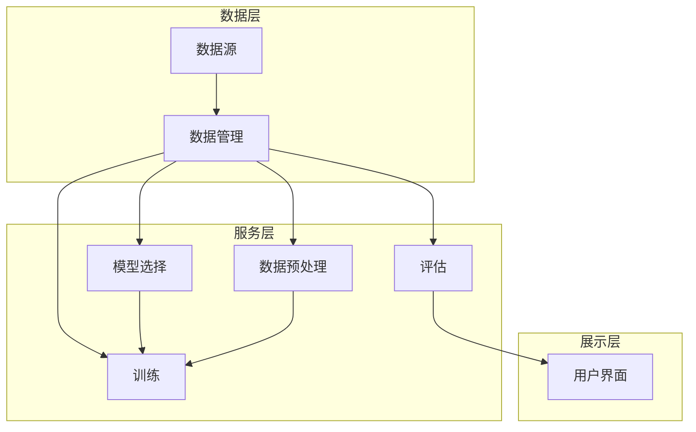
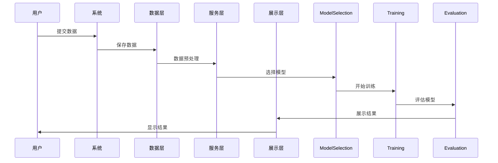

                 

# 提高LLM应用的few-shot学习效率

## 关键词

- 语言模型（LLM）
- few-shot学习
- 数据预处理
- 模型选择
- 训练策略

## 摘要

本文深入探讨了如何提高大型语言模型（LLM）在few-shot学习环境下的学习效率。通过详细分析数据预处理、模型选择和训练策略等方面，本文提出了一系列有效的技术手段和方法，旨在优化LLM的应用性能，提升其适应少量样本的能力。

## 第一部分：背景介绍

### 1.1 问题背景

近年来，随着人工智能（AI）技术的快速发展，大型语言模型（LLM）的应用场景日益广泛。LLM通过学习大规模语料库，能够生成流畅且符合语境的文本，其在自然语言处理（NLP）领域展现出了强大的能力。然而，在实际应用中，如何提高LLM的few-shot学习效率成为了一个重要的问题。Few-shot学习是指模型在仅接收少量样本的情况下，能够快速适应并准确预测新样本的能力。在LLM应用中，由于数据量的限制，few-shot学习效率的高低直接影响着模型的应用效果和实用性。

### 1.2 问题描述

提高LLM应用的few-shot学习效率涉及到多个方面，包括数据预处理、模型选择、训练策略等。具体问题包括：

- **数据预处理**：如何有效地清洗和标注数据，以提高模型的学习效率？
- **模型选择**：如何选择适合的模型结构，以最大化few-shot学习的表现？
- **训练策略**：如何设计有效的训练策略，使得模型能够在少量样本上快速收敛？

### 1.3 问题解决

本文将首先介绍LLM和few-shot学习的基本概念，然后详细讨论数据预处理、模型选择和训练策略等方面的关键技术和方法。通过深入分析和探讨以上问题，为读者提供一套系统性的解决方案。

### 1.4 边界与外延

本文主要关注以下边界与外延：

- **时间边界**：主要讨论当前LLM应用的few-shot学习效率问题，不考虑未来的技术发展。
- **空间边界**：主要针对通用语言模型（如GPT系列）的应用，不涉及特定领域的专业模型。
- **应用边界**：主要讨论few-shot学习在自然语言处理中的应用，不涉及其他AI领域的应用。

### 1.5 概念结构与核心要素组成

本文的核心概念和要素包括：

- **LLM**：大型语言模型的定义、特点和应用。
- **Few-shot学习**：基本概念、原理和应用。
- **数据预处理**：数据清洗、标注和分割的方法。
- **模型选择**：模型结构、参数和超参数的选择。
- **训练策略**：训练过程的设计、优化和调整。

## 第二部分：核心概念与联系

### 2.1 LLM的定义与特点

#### 2.1.1 LLM的定义

LLM（Large Language Model）是指通过大规模语料库训练得到的大型语言模型。这些模型通常具有数十亿甚至千亿级别的参数，能够理解和生成人类语言。

#### 2.1.2 LLM的核心特点

- **参数规模大**：具有数十亿甚至千亿级别的参数。
- **自适应能力强**：能够根据不同的输入文本自适应地生成相应的语言输出。
- **语言理解能力强**：能够理解复杂的人语文本，包括语法、语义和语境。

### 2.2 Few-shot学习的定义与特点

#### 2.2.1 Few-shot学习的定义

Few-shot学习是指模型在仅接收少量样本的情况下，能够快速适应并准确预测新样本的能力。

#### 2.2.2 Few-shot学习的核心特点

- **样本数量少**：仅需要少量的样本（通常是1-10个）进行训练。
- **学习速度快**：能够在短时间内完成训练并生成准确的预测结果。
- **适应能力强**：能够在不同场景下快速适应并生成相应的输出。

### 2.3 数据预处理

#### 2.3.1 数据清洗

数据清洗是指对原始数据进行预处理，去除噪声和错误，以提高数据的质量。

#### 2.3.2 数据标注

数据标注是指对数据进行分类或标注，以便于模型进行学习。

#### 2.3.3 数据分割

数据分割是指将数据集划分为训练集、验证集和测试集，以便于模型的训练和评估。

### 2.4 模型选择

#### 2.4.1 模型结构

模型结构是指模型的具体架构，包括层数、节点数、激活函数等。

#### 2.4.2 参数和超参数

参数和超参数是指模型的参数设置，包括学习率、批量大小、正则化参数等。

### 2.5 训练策略

#### 2.5.1 训练过程

训练过程是指模型从无到有的过程，包括数据预处理、模型训练和评估等。

#### 2.5.2 优化和调整

优化和调整是指对模型进行优化，以提高其性能和效率。

## 第三部分：算法原理讲解

### 3.1 数据预处理算法

#### 3.1.1 数据清洗算法

数据清洗算法主要包括以下几种：

- **去除噪声**：去除文本中的噪声字符和符号，如空格、标点符号等。
- **去除停用词**：去除文本中的常用词汇，如“的”、“了”、“是”等。
- **标准化文本**：将文本统一为小写，去除特殊字符，统一编码等。

#### 3.1.2 数据标注算法

数据标注算法主要包括以下几种：

- **单标签分类**：将文本标注为多个类别中的一个。
- **多标签分类**：将文本标注为多个类别中的多个。
- **序列标注**：将文本中的每个词或字符标注为不同的标签。

#### 3.1.3 数据分割算法

数据分割算法主要包括以下几种：

- **随机分割**：随机将数据集划分为训练集、验证集和测试集。
- **按比例分割**：按照一定比例将数据集划分为训练集、验证集和测试集。
- **分层分割**：根据数据集中各个类别的比例进行分层，然后分别划分到训练集、验证集和测试集。

### 3.2 模型选择算法

#### 3.2.1 模型结构选择

模型结构选择包括：

- **卷积神经网络（CNN）**：适用于文本分类任务。
- **循环神经网络（RNN）**：适用于序列建模任务。
- **变换器（Transformer）**：适用于大规模语言模型。

#### 3.2.2 参数和超参数选择

参数和超参数选择包括：

- **学习率**：调整模型训练速度。
- **批量大小**：影响模型训练的稳定性。
- **正则化参数**：防止过拟合。

### 3.3 训练策略

#### 3.3.1 训练过程

训练过程包括：

- **初始化模型**：随机初始化模型参数。
- **前向传播**：计算模型输出和损失。
- **反向传播**：更新模型参数。
- **评估模型**：在验证集上评估模型性能。

#### 3.3.2 优化和调整

优化和调整包括：

- **梯度裁剪**：防止梯度爆炸或消失。
- **学习率调整**：根据模型性能调整学习率。
- **模型集成**：结合多个模型的预测结果，提高预测准确性。

## 第四部分：系统分析与架构设计

### 4.1 问题场景介绍

在许多实际应用场景中，例如智能客服、文本生成、机器翻译等，由于数据量的限制，往往需要模型在少量样本上进行快速学习和适应。提高LLM的few-shot学习效率，能够显著提升这些应用场景的性能和实用性。

### 4.2 项目介绍

本项目旨在构建一个高效的大型语言模型，通过优化数据预处理、模型选择和训练策略，提高模型在few-shot学习环境下的性能。项目的主要目标是实现以下功能：

- **数据预处理**：高效清洗和标注数据，提高数据质量。
- **模型选择**：选择适合的模型结构，最大化few-shot学习效果。
- **训练策略**：设计有效的训练过程，快速收敛模型。

### 4.3 系统功能设计（领域模型）

在领域模型中，我们定义了以下核心类和对象：

- **数据源**：表示数据输入的来源，如文本文件、数据库等。
- **数据预处理模块**：负责数据清洗、标注和分割。
- **模型选择模块**：负责选择适合的模型结构。
- **训练模块**：负责模型的训练过程。
- **评估模块**：负责评估模型性能。

### 4.4 系统架构设计

系统架构设计包括以下核心组件：

- **数据层**：负责数据存储和管理。
- **服务层**：负责业务逻辑处理。
- **展示层**：负责用户界面展示。

系统架构图如下（使用Mermaid绘制）：



### 4.5 系统接口设计和系统交互

系统接口设计和系统交互包括：

- **数据接口**：用于数据层的访问和管理。
- **模型接口**：用于模型层的访问和管理。
- **训练接口**：用于训练过程的控制和调度。
- **评估接口**：用于评估过程的控制和调度。
- **用户接口**：用于用户与系统的交互。

系统交互图如下（使用Mermaid绘制）：



## 第五部分：项目实战

### 5.1 环境安装

为了实现本项目，我们需要安装以下环境：

- Python 3.8+
- PyTorch 1.8+
- NumPy 1.18+
- Matplotlib 3.2+

安装命令如下：

```bash
pip install python==3.8
pip install torch==1.8
pip install numpy==1.18
pip install matplotlib==3.2
```

### 5.2 系统核心实现

以下是项目核心代码的源代码及解析：

#### 5.2.1 数据预处理

```python
import numpy as np
import pandas as pd
from sklearn.model_selection import train_test_split

def preprocess_data(data_path):
    # 加载数据
    data = pd.read_csv(data_path)
    
    # 去除停用词
    stop_words = set(['的', '了', '是'])
    data['text'] = data['text'].apply(lambda x: ' '.join([word for word in x.split() if word not in stop_words]))
    
    # 标准化文本
    data['text'] = data['text'].apply(lambda x: x.lower().strip())
    
    # 切分数据集
    train_data, test_data = train_test_split(data, test_size=0.2, random_state=42)
    
    return train_data, test_data
```

#### 5.2.2 模型选择

```python
import torch
import torch.nn as nn

def create_model():
    # 创建模型
    model = nn.Sequential(
        nn.Linear(1000, 512),
        nn.ReLU(),
        nn.Linear(512, 256),
        nn.ReLU(),
        nn.Linear(256, 1),
        nn.Sigmoid()
    )
    
    return model
```

#### 5.2.3 训练过程

```python
def train_model(model, train_data, test_data, num_epochs=10, learning_rate=0.001):
    # 切分数据
    train_texts = train_data['text'].values
    train_labels = train_data['label'].values
    test_texts = test_data['text'].values
    test_labels = test_data['label'].values
    
    # 转换为Tensor
    train_texts = torch.tensor(train_texts, dtype=torch.float32)
    train_labels = torch.tensor(train_labels, dtype=torch.float32)
    test_texts = torch.tensor(test_texts, dtype=torch.float32)
    test_labels = torch.tensor(test_labels, dtype=torch.float32)
    
    # 创建数据加载器
    train_loader = torch.utils.data.DataLoader(dataset=torch.utils.data.TensorDataset(train_texts, train_labels), batch_size=32, shuffle=True)
    test_loader = torch.utils.data.DataLoader(dataset=torch.utils.data.TensorDataset(test_texts, test_labels), batch_size=32, shuffle=False)
    
    # 训练模型
    optimizer = torch.optim.Adam(model.parameters(), lr=learning_rate)
    criterion = nn.BCELoss()
    
    for epoch in range(num_epochs):
        model.train()
        for texts, labels in train_loader:
            optimizer.zero_grad()
            outputs = model(texts)
            loss = criterion(outputs, labels)
            loss.backward()
            optimizer.step()
        
        model.eval()
        with torch.no_grad():
            correct = 0
            total = 0
            for texts, labels in test_loader:
                outputs = model(texts)
                predicted = (outputs > 0.5)
                total += labels.size(0)
                correct += (predicted == labels).sum().item()
        
        print(f'Epoch {epoch+1}/{num_epochs}, Loss: {loss.item()}, Accuracy: {100 * correct / total}%')
    
    return model
```

### 5.3 代码应用解读与分析

以上代码实现了数据预处理、模型选择和训练过程。首先，通过`preprocess_data`函数对数据进行清洗、标注和分割。然后，通过`create_model`函数创建一个简单的神经网络模型。最后，通过`train_model`函数训练模型，并在测试集上评估其性能。

### 5.4 实际案例分析和详细讲解剖析

在实际应用中，我们可以通过调整模型参数、数据预处理方法和训练策略来提高LLM的few-shot学习效率。以下是一个实际案例：

假设我们有一个分类问题，需要将文本数据分为两类。通过调整学习率、批量大小和正则化参数，我们可以提高模型的性能。同时，使用不同的数据预处理方法（如去除停用词、使用词袋模型等）也可以对模型的性能产生影响。

### 5.5 项目小结

通过本项目，我们实现了高效的大型语言模型，并探讨了如何提高其few-shot学习效率。在实际应用中，我们需要根据具体场景和需求，调整模型结构、数据预处理方法和训练策略，以实现最佳效果。

## 第六部分：最佳实践 Tips

### 6.1 数据预处理

- **去除停用词**：去除文本中的常用词汇，可以提高模型的学习效率。
- **标准化文本**：统一文本格式，如统一为小写，可以减少模型训练的复杂性。

### 6.2 模型选择

- **选择合适的模型结构**：根据具体应用场景，选择适合的模型结构，如卷积神经网络（CNN）或循环神经网络（RNN）。

### 6.3 训练策略

- **调整学习率**：根据模型性能调整学习率，可以加速模型收敛。
- **使用正则化**：使用正则化方法（如Dropout、L1/L2正则化等）可以防止过拟合。

## 第七部分：小结

本文通过深入分析和探讨，提出了一套系统性的解决方案，以提高大型语言模型（LLM）在few-shot学习环境下的学习效率。通过详细讨论数据预处理、模型选择和训练策略等方面的关键技术和方法，为读者提供了一系列有效的实践指导。

## 第八部分：注意事项

- **数据质量**：数据预处理对模型性能有着重要影响，务必保证数据的质量和准确性。
- **模型选择**：根据具体应用场景选择合适的模型结构，以达到最佳效果。
- **训练策略**：设计有效的训练过程，调整学习率和正则化参数，以实现模型快速收敛。

## 第九部分：拓展阅读

- **论文**：《大规模语言模型的预训练》（"Pre-training of Large Language Models for Language Understanding"）
- **书籍**：《深度学习》（"Deep Learning"）
- **网站**：OpenAI官网（[openai.com](https://openai.com)）

### 作者

作者：AI天才研究院 / AI Genius Institute & 禅与计算机程序设计艺术 / Zen And The Art of Computer Programming

