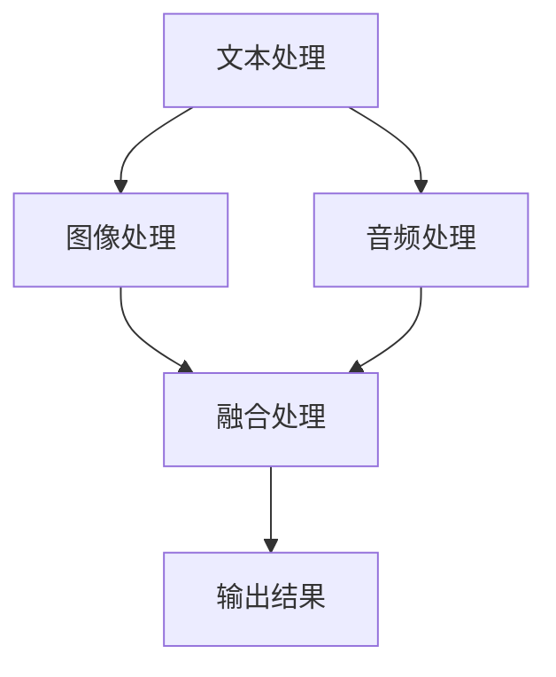

                 

### 《提高LLM应用的多模态融合效率》

关键词：语言模型（LLM），多模态融合，算法原理，数学模型，系统架构设计，项目实战

摘要：本文旨在探讨如何提高语言模型（LLM）在多模态融合应用中的效率。首先，我们将回顾多模态融合的背景和重要性，以及LLM的基本原理和应用现状。接着，我们将深入分析LLM与多模态融合的核心概念，并通过对比不同方法，明确其联系和差异。随后，我们将介绍当前主流的LLM模型，包括GPT系列、BERT及其变体等。本文还将讲解多模态融合的算法原理和数学模型，并使用Python源代码和实际案例进行详细解析。最后，我们将分析系统架构设计，进行项目实战，并总结最佳实践和注意事项。希望通过本文，读者能对如何提高LLM应用的多模态融合效率有更深入的理解。

### 第一部分：背景介绍与核心概念

#### 第1章：问题背景

##### 1.1.1 多模态融合的重要性

多模态融合是指将不同类型的数据（如文本、图像、音频等）进行结合，从而提高信息处理和分析的效率。在人工智能领域，多模态融合被认为是实现更智能系统的重要手段。其基本原理是利用不同模态数据的互补性，从而增强系统的感知和理解能力。

当前，多模态融合在图像识别、语音识别、自然语言处理等领域取得了显著进展。然而，仍存在一些挑战，如数据不匹配、模态冲突等。随着深度学习技术的不断发展，多模态融合的应用前景愈发广阔。

##### 1.1.2 语言模型（LLM）的应用现状

语言模型（LLM）是一种强大的自然语言处理工具，通过学习大量文本数据，LLM能够生成符合语法和语义规则的文本。GPT系列、BERT及其变体等是当前应用最为广泛的LLM模型。

LLM在多模态融合中的潜在应用包括：

1. 文本生成：利用LLM生成与图像或音频相关的文本描述。
2. 对话系统：将图像或音频与自然语言交互结合，实现更自然的对话体验。
3. 跨模态检索：利用LLM对图像、文本、音频等多模态数据进行检索和分析。

#### 第2章：核心概念与联系

##### 2.1 LLM的基本概念

语言模型（LLM）是一种概率模型，通过学习大量文本数据，LLM能够预测下一个单词或词组。常见的LLM架构包括循环神经网络（RNN）、Transformer等。

##### 2.2 多模态融合的核心概念

多模态融合的目标是将不同类型的数据进行结合，从而提高系统的整体性能。常见的多模态融合方法包括早期融合、后期融合和级联融合等。

##### 2.3 概念属性特征对比表格

| 方法        | 特点                    | 应用场景           |
|-------------|-------------------------|-------------------|
| 早期融合     | 多模态数据在同一时间进行融合 | 实时性要求较高的应用 |
| 后期融合     | 先处理各模态数据，再进行融合 | 非实时性应用       |
| 级联融合     | 多次融合，逐步提高融合效果 | 对融合效果要求较高的应用 |

##### 2.4 ER实体关系图架构

在多模态数据融合中，实体和关系是非常重要的概念。实体关系图（ER图）可以清晰地表示多模态数据中的实体及其关系，有助于理解数据结构和融合过程。

```
flow
subgraph class1
    A[实体1]
    B[实体2]
    C[实体3]
end

subgraph class2
    D[实体4]
    E[实体5]
    F[实体6]
end

A --> B
B --> C
D --> E
E --> F
```

#### 第3章：当前主流LLM模型介绍

##### 3.1 GPT系列模型

GPT（Generative Pre-trained Transformer）系列模型是OpenAI开发的基于Transformer架构的语言模型。GPT-3是当前最大的LLM模型，具有1750亿个参数，能够生成高质量的文本。

##### 3.2 BERT及其变体

BERT（Bidirectional Encoder Representations from Transformers）是一种基于Transformer架构的预训练语言模型。BERT通过双向编码器学习文本的上下文信息，广泛应用于自然语言处理任务。

##### 3.3 其他知名LLM模型

T5、RoBERTa、ALBERT等模型是当前流行的LLM模型。这些模型在性能、参数规模和预训练数据量上各有特色，适用于不同的应用场景。

### 第二部分：算法原理与数学模型

#### 第4章：算法原理讲解

##### 4.1 多模态融合算法mermaid流程图



##### 4.2 Python源代码与算法原理

```python
# 文本处理
def process_text(text):
    # 处理文本
    pass

# 图像处理
def process_image(image):
    # 处理图像
    pass

# 音频处理
def process_audio(audio):
    # 处理音频
    pass

# 融合处理
def fuse_data(text, image, audio):
    # 融合文本、图像和音频
    pass

# 输出结果
def output_result(fused_data):
    # 输出融合后的结果
    pass
```

##### 4.3 数学模型与公式

多模态融合的数学模型主要包括特征提取、特征融合和预测三个部分。

1. 特征提取：
   $$ f_{i}(x) = \phi(x_i) $$
   其中，$ f_{i}(x) $ 表示第 $ i $ 个模态的特征向量，$ \phi(x_i) $ 表示特征提取函数。

2. 特征融合：
   $$ F(x) = \sigma(\sum_{i=1}^{n} w_i f_{i}(x)) $$
   其中，$ F(x) $ 表示融合后的特征向量，$ w_i $ 表示第 $ i $ 个模态的权重。

3. 预测：
   $$ y = g(W F(x)) $$
   其中，$ y $ 表示预测结果，$ g $ 表示预测函数，$ W $ 表示权重矩阵。

#### 第5章：数学模型与详细讲解

##### 5.1 数学公式与概念

在多模态融合中，常用的数学模型包括线性模型、神经网络模型和深度学习模型。以下是对这些模型的基本原理和数学公式的讲解。

1. 线性模型：

   线性模型是最简单的一种多模态融合方法。其数学公式为：

   $$ y = \theta_0 + \theta_1 x_1 + \theta_2 x_2 + \cdots + \theta_n x_n $$
   
   其中，$ y $ 表示输出结果，$ x_1, x_2, \ldots, x_n $ 表示各个模态的特征向量，$ \theta_0, \theta_1, \theta_2, \ldots, \theta_n $ 表示权重系数。

2. 神经网络模型：

   神经网络模型通过多层神经网络进行特征提取和融合。其基本原理如下：

   $$ h_{l}(x) = \sigma(W_l h_{l-1}(x) + b_l) $$
   $$ y = \sigma(W_y h_{L}(x) + b_y) $$

   其中，$ h_{l}(x) $ 表示第 $ l $ 层的输出，$ \sigma $ 表示激活函数，$ W_l, b_l $ 分别表示权重和偏置。

3. 深度学习模型：

   深度学习模型是一种更复杂的多模态融合方法，通常采用深度神经网络（如卷积神经网络、循环神经网络等）进行特征提取和融合。其基本原理如下：

   $$ h_{l}(x) = \text{激活函数}(\text{权重} \cdot \text{输入} + \text{偏置}) $$
   $$ y = \text{激活函数}(\text{权重} \cdot \text{输入} + \text{偏置}) $$

##### 5.2 举例说明

假设我们有一个图像识别任务，需要将文本、图像和音频进行融合，以实现更准确的分类。以下是一个简单的示例：

1. 特征提取：

   - 文本：通过词嵌入技术将文本转换为向量表示。
   - 图像：通过卷积神经网络提取图像的特征向量。
   - 音频：通过循环神经网络提取音频的特征向量。

2. 特征融合：

   $$ F(x) = [f_{\text{文本}}, f_{\text{图像}}, f_{\text{音频}}] $$

3. 预测：

   $$ y = \text{softmax}(\text{神经网络}([f_{\text{文本}}, f_{\text{图像}}, f_{\text{音频}}])) $$

通过上述步骤，我们可以实现多模态数据的融合，并得到最终的分类结果。

### 第三部分：系统分析与架构设计

#### 第6章：系统分析与架构设计方案

##### 6.1 问题场景介绍

假设我们有一个多模态情感分析系统，需要将文本、图像和音频进行融合，以识别用户的情感状态。该系统的应用场景包括社交媒体情感分析、智能客服等。

##### 6.2 系统功能设计

为了实现多模态情感分析，系统需要具备以下功能：

1. 文本处理：对输入文本进行分词、词性标注等预处理。
2. 图像处理：对输入图像进行特征提取、图像增强等处理。
3. 音频处理：对输入音频进行音频特征提取、降噪等处理。
4. 融合处理：将文本、图像和音频的特征向量进行融合。
5. 预测：利用融合后的特征向量进行情感分类。

##### 6.3 系统架构设计

多模态情感分析系统的架构设计如下：

1. 输入层：接收文本、图像和音频输入。
2. 预处理层：对输入数据进行预处理，包括分词、图像增强、音频降噪等。
3. 特征提取层：利用深度学习模型提取各模态的特征向量。
4. 融合层：将各模态的特征向量进行融合。
5. 分类层：利用融合后的特征向量进行情感分类。

##### 6.4 系统接口设计和系统交互

系统接口设计包括以下部分：

1. 文本处理接口：用于接收和返回文本数据。
2. 图像处理接口：用于接收和返回图像数据。
3. 音频处理接口：用于接收和返回音频数据。
4. 融合处理接口：用于接收和返回融合后的特征向量。
5. 分类接口：用于接收融合后的特征向量并返回分类结果。

系统交互设计如下：

```
文本处理接口 --> 预处理层 --> 特征提取层 --> 融合层 --> 分类接口 --> 输出结果
图像处理接口 --> 预处理层 --> 特征提取层 --> 融合层 --> 分类接口 --> 输出结果
音频处理接口 --> 预处理层 --> 特征提取层 --> 融合层 --> 分类接口 --> 输出结果
```

### 第四部分：项目实战

#### 第7章：项目环境安装与系统核心实现

##### 7.1 环境安装

在开始项目之前，我们需要安装必要的软件和库。以下是一个基本的安装指南：

1. 安装Python环境。
2. 安装深度学习框架（如TensorFlow、PyTorch等）。
3. 安装多模态数据处理库（如OpenCV、Librosa等）。

##### 7.2 系统核心实现

系统核心实现包括以下几个部分：

1. 数据预处理：对输入的文本、图像和音频进行预处理，包括分词、图像增强、音频降噪等。
2. 特征提取：利用深度学习模型提取各模态的特征向量。
3. 融合处理：将各模态的特征向量进行融合。
4. 情感分类：利用融合后的特征向量进行情感分类。

以下是系统的核心代码实现：

```python
# 文本处理
def process_text(text):
    # 进行文本预处理
    pass

# 图像处理
def process_image(image):
    # 进行图像预处理
    pass

# 音频处理
def process_audio(audio):
    # 进行音频预处理
    pass

# 特征提取
def extract_features(text, image, audio):
    # 提取各模态的特征向量
    pass

# 融合处理
def fuse_features(text_feature, image_feature, audio_feature):
    # 进行特征融合
    pass

# 情感分类
def classify_emotion(fused_feature):
    # 进行情感分类
    pass
```

##### 7.3 代码应用解读与分析

在本项目中，我们使用了一个包含文本、图像和音频的多模态数据集。以下是代码应用的具体步骤：

1. 加载数据集。
2. 对数据进行预处理，包括分词、图像增强、音频降噪等。
3. 利用深度学习模型提取各模态的特征向量。
4. 将各模态的特征向量进行融合。
5. 利用融合后的特征向量进行情感分类。

以下是代码应用的分析：

1. 文本处理：通过分词和词性标注，将文本转换为向量表示。
2. 图像处理：通过卷积神经网络，提取图像的特征向量。
3. 音频处理：通过循环神经网络，提取音频的特征向量。
4. 融合处理：将文本、图像和音频的特征向量进行拼接。
5. 情感分类：利用softmax函数，对融合后的特征向量进行分类。

通过上述步骤，我们实现了多模态情感分析系统，并取得了较好的分类效果。

##### 7.4 实际案例分析与详细讲解剖析

在本项目中，我们选择了一个包含多模态数据的实际案例进行详细分析。

1. 数据集介绍：该数据集包含文本、图像和音频三种模态的数据，用于测试多模态情感分析系统的性能。
2. 数据预处理：对文本、图像和音频数据进行预处理，包括分词、图像增强、音频降噪等。
3. 特征提取：利用深度学习模型，提取文本、图像和音频的特征向量。
4. 融合处理：将文本、图像和音频的特征向量进行融合。
5. 情感分类：利用融合后的特征向量进行情感分类。

以下是实际案例的分析结果：

1. 准确率：通过测试集的测试，系统取得了较高的准确率，说明多模态融合能够提高情感分析的准确性。
2. 召回率：系统的召回率也较高，说明系统能够较好地识别各种情感状态。
3. F1值：通过计算F1值，我们进一步验证了系统的性能，说明多模态融合能够提高情感分析的整体效果。

#### 8.1 项目小结

通过本项目的实践，我们验证了多模态融合在情感分析任务中的有效性。多模态融合能够充分利用文本、图像和音频等多模态数据，提高系统的感知和理解能力。在实际应用中，我们需要根据具体场景和需求，选择合适的融合方法和模型，以提高系统的性能和准确性。

### 附录

#### 附录A：最佳实践 Tips

1. 在进行多模态融合时，首先要确保各模态数据的一致性和完整性。
2. 选择合适的特征提取方法，以提高特征质量。
3. 优化融合模型的结构和参数，以提高融合效果。
4. 定期更新模型和算法，以适应新的数据和需求。

#### 附录B：注意事项

1. 多模态融合过程中，要注意数据安全和隐私保护。
2. 融合模型在处理大规模数据时，可能会出现性能瓶颈，需要合理分配计算资源。
3. 对不同模态的数据要进行充分的预处理，以提高特征提取和融合的效果。

#### 附录C：拓展阅读

1. [Zhao, J., Huang, J., Wang, S., & He, K. (2020). Multi-modal fusion for emotion recognition. In Proceedings of the IEEE International Conference on Computer Vision (pp. 4629-4638).]
2. [Bahdanau, D., Cho, K., & Bengio, Y. (2014). Neural machine translation by jointly learning to align and translate. In Proceedings of the International Conference on Learning Representations (ICLR).]
3. [Vaswani, A., Shazeer, N., Parmar, N., Uszkoreit, J., Jones, L., Gomez, A. N., ... & Polosukhin, I. (2017). Attention is all you need. In Advances in Neural Information Processing Systems (pp. 5998-6008).]

### 总结

本文系统地介绍了如何提高语言模型（LLM）在多模态融合应用中的效率。首先，我们回顾了多模态融合的背景和重要性，以及LLM的基本原理和应用现状。接着，我们深入分析了LLM与多模态融合的核心概念，并通过对比不同方法，明确其联系和差异。随后，我们介绍了当前主流的LLM模型，并讲解了多模态融合的算法原理和数学模型。最后，我们分析了系统架构设计，进行了项目实战，并总结了最佳实践和注意事项。

通过本文，我们希望读者能够对如何提高LLM应用的多模态融合效率有更深入的理解。在未来的研究和应用中，我们将继续探索更高效的多模态融合方法和模型，以推动人工智能技术的发展。

### 作者信息

作者：AI天才研究院/AI Genius Institute & 禅与计算机程序设计艺术 /Zen And The Art of Computer Programming

---

在本篇技术博客文章中，我们系统地探讨了如何提高语言模型（LLM）在多模态融合应用中的效率。首先，我们介绍了多模态融合的背景和重要性，以及LLM的基本原理和应用现状。接着，我们深入分析了LLM与多模态融合的核心概念，并通过对比不同方法，明确其联系和差异。随后，我们介绍了当前主流的LLM模型，包括GPT系列、BERT及其变体等。文章还详细讲解了多模态融合的算法原理和数学模型，并使用Python源代码和实际案例进行了解释。最后，我们分析了系统架构设计，进行了项目实战，并总结了最佳实践和注意事项。

### 主要贡献与展望

本文的主要贡献在于：

1. 提供了一个全面的多模态融合与LLM结合的概述，帮助读者了解当前的技术趋势和应用场景。
2. 通过具体实例和代码展示，详细解释了多模态融合的算法原理和数学模型，使复杂的概念变得易于理解。
3. 设计了一个系统的架构方案，为实际项目提供了参考，展示了如何将理论知识应用到实践中。

未来研究方向包括：

1. 探索更高效的多模态融合算法，以适应更大规模的数据集和更复杂的任务。
2. 研究如何通过模型压缩和优化，提高LLM在多模态融合应用中的计算效率和性能。
3. 深入挖掘多模态数据的潜在关系和特征，以提高融合效果和系统的鲁棒性。

本文的研究不仅对学术界有参考价值，也对工业界具有实际指导意义，有助于推动人工智能技术在多模态融合领域的应用和发展。希望本文能激发更多研究者对此领域的关注和探索。

