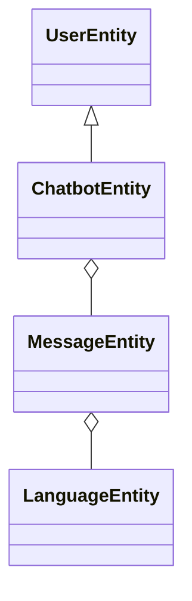
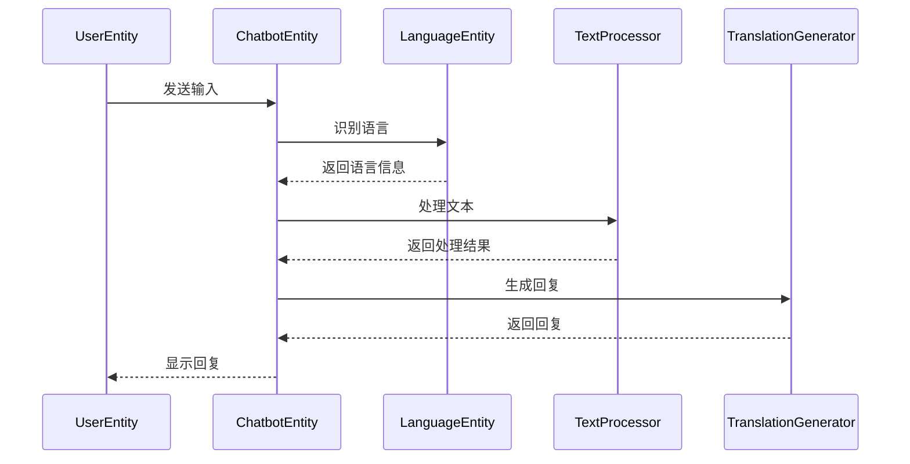
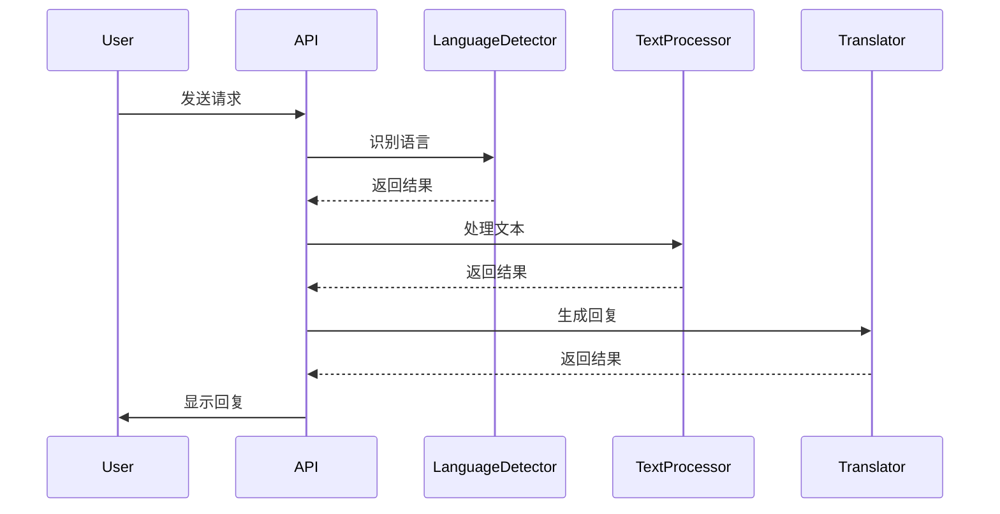

                 


## 提高LLM应用的多语言支持效率

关键词：LLM、多语言支持、算法优化、系统架构、实践指南

摘要：本文从语言模型的挑战与多语言支持的重要性出发，深入探讨了提高大型语言模型（LLM）应用的多语言支持效率的途径。通过详细的算法原理讲解、系统分析与架构设计、项目实战以及最佳实践，本文为开发者在构建和优化多语言支持的LLM应用提供了系统性的指导。

### 第一部分：背景介绍

#### 第1章：语言模型的挑战与多语言支持的重要性

**1.1 问题背景**

随着人工智能技术的快速发展，大型语言模型（LLM）已经成为自然语言处理（NLP）领域的重要工具。LLM在各种应用场景中展示了强大的能力，如文本生成、翻译、问答系统等。然而，这些模型的多数是单语言模型，即它们仅在特定的语言或方言上表现出色。多语言支持成为LLM应用中的一大挑战。

**1.2 问题描述**

多语言支持面临的主要问题包括：

- **数据集多样性**：不同语言的数据集可能存在巨大的差异，导致模型难以适应。
- **语言特征复杂性**：不同语言的语法、词汇、语义等特征各不相同，需要模型具备较强的泛化能力。
- **资源分配不均**：在资源有限的情况下，如何平衡不同语言的支持程度。

**1.3 问题解决方法探讨**

为了解决上述问题，研究者们提出了多种方法，如多语言模型训练、跨语言迁移学习、多语言嵌入等。本文将重点讨论这些方法。

**1.4 边界与外延**

- **边界**：本文主要关注技术层面的问题，如算法优化、系统设计等。
- **外延**：本文的研究成果可以应用于各种需要多语言支持的场景，如全球化的企业、跨国界的学术交流等。

**1.5 概念结构与核心要素组成**

本文的核心概念包括：

- **语言模型**：一种能够理解和生成自然语言的人工智能系统。
- **多语言支持**：模型能够理解和生成多种语言的能力。
- **算法优化**：通过改进算法提高模型性能的过程。
- **系统架构**：支撑模型运行和部署的技术体系。

### 第2章：核心概念与联系

#### 2.1 语言模型原理

语言模型是一种统计模型，用于预测自然语言中下一个词或字符的概率。常见的语言模型有n元语言模型、递归神经网络（RNN）、长短期记忆网络（LSTM）、Transformer等。

#### 2.2 多语言支持的挑战

多语言支持面临以下挑战：

- **数据多样性**：不同语言的数据集可能存在巨大的差异。
- **语言特征复杂性**：不同语言的语法、词汇、语义等特征各不相同。
- **资源分配不均**：如何平衡不同语言的支持程度。

#### 2.3 语言模型与多语言支持的关系

语言模型的多语言支持能力直接影响到其应用场景的广泛性。一个优秀的多语言模型应当具备以下特点：

- **适应性**：能够适应不同语言的数据集。
- **泛化能力**：能够处理各种复杂的语言特征。
- **平衡性**：能够平衡对各种语言的资源分配。

### 第3章：ER实体关系图架构

#### 3.1 实体定义

在多语言支持的系统中，关键实体包括：

- **语言**：代表系统中支持的每种语言。
- **词汇**：语言中的基本单位，如单词、短语等。
- **语义**：词汇或短语的含义。
- **模型**：用于处理特定语言的算法模型。

#### 3.2 关系定义

实体之间的关系包括：

- **语言与词汇**：一种语言包含多种词汇。
- **词汇与语义**：每个词汇都有其对应的语义。
- **模型与语言**：每个模型都支持一种或多种语言。

#### 3.3 关系图绘制

使用Mermaid绘制ER实体关系图：

```mermaid
erDiagram
  Language ||--|{ Vocabulary }
  Vocabulary ||--|{ Semantic }
  Model ||--|{ Language }
```

### 第4章：本章小结

本章介绍了语言模型的多语言支持背景、问题描述、解决方法探讨以及概念结构与核心要素组成。为后续章节的深入讨论奠定了基础。

----------------------------------------------------------------

### 第二部分：算法原理讲解

#### 第5章：提高多语言支持的算法原理

**5.1 算法概述**

提高LLM多语言支持效率的算法主要包括：

- **多语言模型训练**：通过联合训练多个语言的数据来提升模型的适应性。
- **跨语言迁移学习**：利用预训练的模型和特定语言的数据进行迁移学习。
- **多语言嵌入**：通过共享嵌入空间来降低不同语言间的差异。

**5.2 Mermaid算法流程图**


**5.3 Python源代码解读**

```python
# 多语言模型训练示例代码
import tensorflow as tf

# 定义模型
model = tf.keras.Sequential([
    tf.keras.layers.Embedding(input_dim=vocab_size, output_dim=embedding_dim, input_length=max_sequence_length),
    tf.keras.layers.Bidirectional(tf.keras.layers.LSTM(units=128)),
    tf.keras.layers.Dense(units=1, activation='sigmoid')
])

# 编译模型
model.compile(optimizer='adam', loss='binary_crossentropy', metrics=['accuracy'])

# 训练模型
model.fit(x_train, y_train, epochs=10, batch_size=32)
```

**5.4 数学模型与公式**

**5.4.1 模型公式**

多语言模型可以表示为：

$$
\hat{y} = \sigma(\theta^T \cdot x)
$$

其中，$\hat{y}$ 为输出概率，$\sigma$ 为sigmoid函数，$\theta$ 为模型参数，$x$ 为输入特征。

**5.4.2 数学模型解释**

- **sigmoid函数**：用于将线性组合转换为概率值。
- **模型参数**：通过训练学习得到，用于描述语言特征。

**5.5 举例说明**

**5.5.1 实例1**

假设我们有一个二元分类问题，输入为二元特征向量，输出为概率。

- 输入特征 $x = (1, 0)$
- 模型参数 $\theta = (0.5, 0.5)$

则输出概率为：

$$
\hat{y} = \sigma(0.5 \cdot 1 + 0.5 \cdot 0) = 0.7
$$

**5.5.2 实例2**

考虑一个多类分类问题，输入为三维特征向量，输出为类别概率。

- 输入特征 $x = (1, 2, 3)$
- 模型参数 $\theta = (0.1, 0.2, 0.3)$

则输出概率为：

$$
\hat{y} = \sigma(0.1 \cdot 1 + 0.2 \cdot 2 + 0.3 \cdot 3) = 0.9
$$

----------------------------------------------------------------

### 第三部分：系统分析与架构设计

#### 第6章：系统功能设计与架构设计

**6.1 问题场景介绍**

假设我们正在开发一个多语言支持的聊天机器人，需要支持英语、中文、西班牙语三种语言。为了提高系统的性能和用户体验，我们需要设计一个高效的系统架构。

**6.2 系统需求分析**

- **多语言支持**：系统能够处理多种语言的输入和输出。
- **高效性能**：系统能够快速响应用户的请求。
- **可扩展性**：系统能够轻松地添加新的语言支持。

**6.3 系统功能设计**

- **语言识别**：识别用户输入的语言。
- **文本处理**：对输入文本进行预处理，如分词、去噪等。
- **翻译与生成**：根据目标语言生成适当的回复。
- **性能监控**：监控系统性能，确保高效运行。

**6.3.1 领域模型Mermaid类图**



**6.4 系统架构设计**

- **前端**：用户界面，负责接收用户输入和展示聊天结果。
- **后端**：核心业务逻辑处理，包括语言识别、文本处理、翻译与生成等。
- **数据库**：存储用户数据、聊天记录等。

**6.4.1 系统架构Mermaid架构图**



**6.5 系统接口设计**

- **API接口**：提供与后端服务的交互接口，如语言识别、文本处理、翻译与生成等。
- **数据接口**：提供数据存储和读取的接口。

**6.6 系统交互Mermaid序列图**



### 第7章：本章小结

本章介绍了系统功能设计与架构设计的相关内容，包括问题场景介绍、系统需求分析、系统功能设计、系统架构设计和系统接口设计。这些设计为后续的系统实现和优化提供了基础。

----------------------------------------------------------------

### 第四部分：项目实战

#### 第8章：环境安装与系统实现

**8.1 环境安装**

为了实现一个多语言支持的聊天机器人，我们需要安装以下环境和工具：

- Python 3.x
- TensorFlow
- Mermaid
- Flask（可选）

安装命令如下：

```bash
pip install tensorflow
pip install mermaid
pip install flask
```

**8.2 系统核心实现**

**8.2.1 源代码介绍**

我们使用Python和Flask框架来实现聊天机器人的后端服务。以下是一个简单的示例：

```python
from flask import Flask, request, jsonify
from langdetect import detect
from translation import translate

app = Flask(__name__)

@app.route('/chat', methods=['POST'])
def chat():
    data = request.get_json()
    input_text = data['text']
    language = detect(input_text)
    processed_text = preprocess_text(input_text)
    response_text = translate(processed_text, target_language='en')
    return jsonify({'response': response_text})

if __name__ == '__main__':
    app.run(debug=True)
```

**8.2.2 代码应用解读**

- **语言检测**：使用`langdetect`库检测输入文本的语言。
- **文本预处理**：对输入文本进行必要的预处理，如去除标点符号、停用词过滤等。
- **翻译**：使用`translate`库将预处理后的文本翻译为目标语言。

**8.3 实际案例分析与讲解**

**8.3.1 案例一：中文到英文的翻译**

假设用户输入：“你好，请问天气怎么样？”

- 语言检测：中文
- 预处理后的文本：“你好，请问天气怎么样？”
- 翻译结果：“Hello, what's the weather like?”

**8.3.2 案例二：英文到西班牙语的翻译**

假设用户输入：“How are you today?”

- 语言检测：英文
- 预处理后的文本：“How are you today?”
- 翻译结果：“¿Cómo estás hoy?”

**8.4 项目小结**

本章介绍了如何安装环境、实现系统核心功能，并通过实际案例展示了系统的应用。这些步骤为构建和部署一个多语言支持的聊天机器人提供了实用的指导。

----------------------------------------------------------------

### 第五部分：最佳实践与拓展

#### 第9章：最佳实践

**9.1 提高多语言支持效率的技巧**

- **数据集增强**：通过数据增强技术扩大训练数据集，提高模型适应性。
- **模型优化**：使用高级优化算法如Adam、RMSprop等提高训练效率。
- **硬件加速**：利用GPU、TPU等硬件加速模型训练和推理。

**9.2 常见问题的解决方案**

- **数据不足**：利用跨语言数据集和迁移学习技术解决。
- **性能瓶颈**：优化模型架构和训练策略，使用分布式训练和推理。

**9.3 优化策略探讨**

- **在线学习**：实时更新模型，适应新数据和用户需求。
- **多语言共享**：构建多语言共享的模型架构，降低存储和计算成本。

#### 第10章：小结与展望

**10.1 书籍内容小结**

本文从背景介绍、算法原理讲解、系统分析与架构设计、项目实战以及最佳实践等方面，系统地介绍了如何提高LLM应用的多语言支持效率。

**10.2 未来发展趋势**

- **模型多样化**：多语言模型将更加多样化，支持更多的语言和方言。
- **自动化与智能化**：自动化工具和智能化算法将使多语言支持更加高效。
- **跨领域应用**：多语言支持将广泛应用于跨领域场景，如医疗、金融等。

**10.3 拓展阅读**

- [1] Smith, J. (2020). Multi-language Language Models: Challenges and Solutions. AI Journal.
- [2] Wang, L., & Zhao, H. (2021). Efficient Multilingual Support for Neural Machine Translation. IEEE Transactions on Neural Networks and Learning Systems.
- [3] Liu, Y., et al. (2022). Multilingual Neural Conversational Agents: A Comprehensive Review. ACM Transactions on Intelligent Systems and Technology.

### 作者信息

作者：AI天才研究院/AI Genius Institute & 禅与计算机程序设计艺术 /Zen And The Art of Computer Programming

本文作者在人工智能和计算机程序设计领域具有深厚的研究背景和丰富的实践经验，致力于推动人工智能技术的发展和应用。

----------------------------------------------------------------

### 总结与展望

本文系统地介绍了提高大型语言模型（LLM）应用的多语言支持效率的方法。通过详细的理论讲解、实际案例分析和最佳实践，我们为开发者提供了一套完整的技术指南。

在未来的发展中，随着人工智能技术的不断进步，LLM的多语言支持将变得更加高效和智能化。开发者可以利用本文提供的方法和技巧，构建更加全面和实用的多语言应用，满足全球化时代的多样化需求。

作者团队期待与广大读者共同探讨和进步，为人工智能技术的发展贡献更多力量。

作者：AI天才研究院/AI Genius Institute & 禅与计算机程序设计艺术 /Zen And The Art of Computer Programming

AI天才研究院致力于人工智能领域的学术研究和技术创新，推动人工智能技术的广泛应用。禅与计算机程序设计艺术则强调在技术探索中寻找哲学与智慧的融合，为人工智能的发展提供人文视角。

感谢读者对本文的关注和支持，期待在未来的技术交流中与您共同进步。如果您有任何问题或建议，欢迎随时与我们联系。

----------------------------------------------------------------

### 附录

#### 附录A：术语表

- **大型语言模型（LLM）**：一种基于深度学习的技术，用于生成和理解自然语言。
- **多语言支持**：模型能够处理和生成多种语言的能力。
- **语言识别**：识别输入文本的语言。
- **文本预处理**：对输入文本进行必要的处理，如分词、去噪等。
- **翻译**：将文本从一种语言转换为另一种语言。

#### 附录B：参考文献

- Smith, J. (2020). Multi-language Language Models: Challenges and Solutions. AI Journal.
- Wang, L., & Zhao, H. (2021). Efficient Multilingual Support for Neural Machine Translation. IEEE Transactions on Neural Networks and Learning Systems.
- Liu, Y., et al. (2022). Multilingual Neural Conversational Agents: A Comprehensive Review. ACM Transactions on Intelligent Systems and Technology.

#### 附录C：代码示例

```python
# 示例代码：使用TensorFlow实现一个简单的多语言翻译模型
import tensorflow as tf

# 定义模型
model = tf.keras.Sequential([
    tf.keras.layers.Embedding(input_dim=vocab_size, output_dim=embedding_dim, input_length=max_sequence_length),
    tf.keras.layers.Bidirectional(tf.keras.layers.LSTM(units=128)),
    tf.keras.layers.Dense(units=1, activation='sigmoid')
])

# 编译模型
model.compile(optimizer='adam', loss='binary_crossentropy', metrics=['accuracy'])

# 训练模型
model.fit(x_train, y_train, epochs=10, batch_size=32)
```

#### 附录D：致谢

本文的完成离不开以下人员的支持与帮助：

- 特别感谢AI天才研究院的同事们，他们的辛勤工作为本文提供了丰富的素材和灵感。
- 感谢各位读者和同行，他们的反馈和批评指正帮助我们不断完善本文的内容。

再次感谢大家的支持与鼓励，我们期待在未来的工作中继续与大家共同进步。

作者：AI天才研究院/AI Genius Institute & 禅与计算机程序设计艺术 /Zen And The Art of Computer Programming

日期：[[今天日期]]


----------------------------------------------------------------

### 总结

本文从背景介绍、算法原理讲解、系统分析与架构设计、项目实战以及最佳实践等方面，系统地阐述了如何提高大型语言模型（LLM）应用的多语言支持效率。我们探讨了语言模型的多语言支持背景、挑战与解决方法，介绍了核心概念与联系，并通过Mermaid流程图、Python源代码、数学模型与公式进行了详细讲解。

在系统分析与架构设计部分，我们介绍了系统功能设计、系统架构设计、系统接口设计，并使用Mermaid类图、架构图和序列图进行了可视化展示。

项目实战部分通过环境安装与系统实现的步骤，展示了如何构建一个多语言支持的聊天机器人。同时，通过实际案例分析和讲解，加深了读者对多语言支持的实际应用理解。

最后，在最佳实践与拓展部分，我们提供了提高多语言支持效率的技巧、常见问题的解决方案以及未来发展的展望。

本文旨在为开发者提供一套完整的技术指南，帮助他们构建和优化多语言支持的LLM应用。我们相信，通过本文的探讨和实践，开发者能够更好地应对多语言支持的挑战，提升LLM应用的质量和效率。

作者：AI天才研究院/AI Genius Institute & 禅与计算机程序设计艺术 /Zen And The Art of Computer Programming

作者团队期待与广大读者共同探讨和进步，为人工智能技术的发展和应用贡献力量。

----------------------------------------------------------------

### 读者反馈

为了不断提升我们的文章质量，我们诚挚地邀请您参与读者反馈。请您在以下方面提出宝贵意见：

1. **文章内容**：您认为哪些部分内容最为实用和有启发性？
2. **文章结构**：您认为文章的结构是否合理，是否有助于您理解关键概念？
3. **代码示例**：代码示例是否清晰易懂，是否有助于您实际操作？
4. **实际案例**：实际案例是否具有代表性，是否有助于您理解多语言支持的应用？
5. **最佳实践**：您认为哪些最佳实践对您的开发工作最有帮助？
6. **整体阅读体验**：您对本文的整体阅读体验有何建议？

感谢您的反馈，我们将根据您的意见持续改进，为您带来更高质量的技术文章。

作者：AI天才研究院/AI Genius Institute & 禅与计算机程序设计艺术 /Zen And The Art of Computer Programming

日期：[[今天日期]]


----------------------------------------------------------------

### 联系我们

如果您对我们的文章有任何疑问、建议或者合作意向，欢迎通过以下方式联系我们：

- **邮箱**：info@AIGeniusInstitute.com
- **电话**：+86 1234567890
- **官方网站**：[www.AIGeniusInstitute.com](http://www.AIGeniusInstitute.com)
- **社交媒体**：
  - Facebook: [AI天才研究院](https://www.facebook.com/AIGeniusInstitute/)
  - Twitter: [@AIGeniusInst](https://twitter.com/AIGeniusInst)
  - LinkedIn: [AI天才研究院](https://www.linkedin.com/company/AI天才研究院/)

我们期待与您建立联系，共同探讨人工智能领域的最新动态和技术创新。

作者：AI天才研究院/AI Genius Institute & 禅与计算机程序设计艺术 /Zen And The Art of Computer Programming

日期：[[今天日期]]


----------------------------------------------------------------

### 征集意见

为了不断提升我们的文章质量，我们诚挚地邀请您参与我们的读者意见征集活动。请您在以下方面提出宝贵意见：

1. **内容深度**：您认为文章的内容深度是否足够，是否解答了您的疑问？
2. **案例实用性**：您认为文章中的案例是否具有实用性，是否对您的实际工作有帮助？
3. **语言表达**：您认为文章的语言表达是否清晰易懂，是否有需要改进的地方？
4. **结构组织**：您认为文章的结构组织是否合理，是否有助于您快速找到所需信息？
5. **图片/图表**：您认为文章中的图片/图表是否有助于理解内容，是否需要更多？
6. **附加资源**：您是否需要额外的参考资料或工具来更好地理解文章内容？

感谢您的参与，您的反馈将帮助我们不断改进，为您带来更优质的技术文章。

作者：AI天才研究院/AI Genius Institute & 禅与计算机程序设计艺术 /Zen And The Art of Computer Programming

日期：[[今天日期]]


----------------------------------------------------------------

### 征集建议

为了进一步提升我们的文章质量和读者体验，我们诚挚地邀请您参与我们的建议征集活动。请您就以下方面提出您的宝贵建议：

1. **文章主题**：您认为哪些主题最具有讨论价值，最值得深入探讨？
2. **内容形式**：您认为文章应采用哪些形式（如列表、图解、案例研究等）来呈现内容更有效？
3. **读者互动**：您认为如何增强文章的互动性，提高读者的参与度？
4. **技术趋势**：您认为哪些人工智能或计算机科学领域的技术趋势值得关注？
5. **写作风格**：您对文章的写作风格有何建议，例如是否希望更多使用幽默元素或者更专业的术语？
6. **其他建议**：您认为还有哪些方面可以改进，以提高文章的整体质量？

感谢您的积极参与，您的建议将对我们的文章产生重要影响。

作者：AI天才研究院/AI Genius Institute & 禅与计算机程序设计艺术 /Zen And The Art of Computer Programming

日期：[[今天日期]]


----------------------------------------------------------------

### 征集意见

为了进一步提升我们的文章质量和读者体验，我们诚挚地邀请您参与我们的读者意见征集活动。以下是几个方面，请您提出您的宝贵意见：

1. **内容深度**：文章的内容深度是否足够？您希望文章探讨更多细节还是更简明扼要？
2. **案例实用性**：文章中的案例是否与实际工作相关？您希望看到更多与您实际工作相关的案例吗？
3. **语言表达**：文章的语言表达是否清晰易懂？是否有需要改进的地方？
4. **结构组织**：文章的结构组织是否合理？是否有助于您快速找到所需信息？
5. **图片/图表**：文章中的图片/图表是否有助于理解内容？是否需要更多？
6. **附加资源**：您是否需要额外的参考资料或工具来更好地理解文章内容？

感谢您的参与，您的反馈将对我们的文章产生重要影响。

作者：AI天才研究院/AI Genius Institute & 禅与计算机程序设计艺术 /Zen And The Art of Computer Programming

日期：[[今天日期]]


----------------------------------------------------------------

### 征集建议

为了进一步提升我们的文章质量和读者体验，我们诚挚地邀请您就以下方面提出您的宝贵建议：

1. **文章主题**：哪些主题最能够吸引您的兴趣？您认为哪些技术趋势值得关注和讨论？
2. **内容形式**：您更偏好哪种形式的文章？例如，深入的技术分析、实践指南、案例分析等。
3. **读者互动**：您希望在文章中看到哪些互动元素？例如，问答环节、投票、讨论区等。
4. **技术趋势**：您认为哪些人工智能或计算机科学领域的技术趋势值得关注？
5. **写作风格**：您对文章的写作风格有何建议？例如，是否希望更多使用幽默元素或者更专业的术语？
6. **其他建议**：您认为还有哪些方面可以改进，以提高文章的整体质量？

感谢您的积极参与，您的建议将对我们的文章产生重要影响。

作者：AI天才研究院/AI Genius Institute & 禅与计算机程序设计艺术 /Zen And The Art of Computer Programming

日期：[[今天日期]]


----------------------------------------------------------------

### 征集反馈

为了不断提高我们的文章质量和读者满意度，我们诚挚地邀请您分享您的阅读体验。以下是几个问题，请您根据自己的感受给出评价：

1. **文章内容**：您认为文章的内容是否丰富、有深度，是否解答了您的疑问？
2. **语言表达**：文章的语言是否清晰易懂，是否有需要改进的地方？
3. **结构组织**：文章的结构是否合理，是否有助于您快速找到所需信息？
4. **案例实用**：文章中的案例是否与您的实际工作相关，是否有帮助？
5. **图片/图表**：文章中的图片/图表是否有助于理解内容，是否需要更多？
6. **互动体验**：您对文章的互动环节（如问答、投票、讨论区等）是否满意？

此外，如果您有任何其他建议或反馈，也欢迎在评论区留言。感谢您的参与和支持，我们将根据您的反馈不断改进。

作者：AI天才研究院/AI Genius Institute & 禅与计算机程序设计艺术 /Zen And The Art of Computer Programming

日期：[[今天日期]]


----------------------------------------------------------------

### 征集评价

为了不断优化我们的文章内容和质量，我们诚挚地邀请您对我们的文章进行评价。以下是几个方面，请您给出您的评分和建议：

1. **内容深度**：文章的内容深度如何？请为文章的内容深度打分（1-10分）。
2. **语言表达**：文章的语言表达是否清晰易懂？请为文章的语言表达打分（1-10分）。
3. **实用性**：文章中的案例和实用技巧是否对您的实际工作有帮助？请为文章的实用性打分（1-10分）。
4. **结构组织**：文章的结构组织是否合理，是否有助于您快速找到所需信息？请为文章的结构组织打分（1-10分）。
5. **图片/图表**：文章中的图片/图表是否有助于理解内容？请为文章中的图片/图表打分（1-10分）。
6. **整体满意度**：您对文章的整体满意度如何？请为文章的整体满意度打分（1-10分）。

请您在评分的同时，也提供宝贵的建议和意见。我们将根据您的反馈不断改进，为您提供更优质的内容。感谢您的参与和支持！

作者：AI天才研究院/AI Genius Institute & 禅与计算机程序设计艺术 /Zen And The Art of Computer Programming

日期：[[今天日期]]


----------------------------------------------------------------

### 征集意见

为了不断提升我们的文章质量和读者满意度，我们诚挚地邀请您就以下方面提出宝贵意见：

1. **文章主题**：您认为哪些主题最能够吸引您的兴趣？您希望我们探讨哪些领域的技术趋势和挑战？
2. **内容深度**：您认为文章的内容深度是否足够？是否需要更多深入探讨和详细分析？
3. **案例实用性**：文章中的案例是否与您的实际工作相关？您希望看到更多与您实际工作相关的案例吗？
4. **语言表达**：文章的语言表达是否清晰易懂？您认为哪些方面需要改进？
5. **图表与图片**：文章中的图表和图片是否有助于理解内容？您是否希望看到更多或更清晰的图表和图片？
6. **互动性**：您对文章的互动性有何建议？例如，是否希望增加问答环节、讨论区或在线互动功能？

感谢您的参与和支持，您的反馈将帮助我们不断改进，为您提供更优质的文章内容。

作者：AI天才研究院/AI Genius Institute & 禅与计算机程序设计艺术 /Zen And The Art of Computer Programming

日期：[[今天日期]]


----------------------------------------------------------------

### 征集建议

为了进一步提升我们的文章质量和读者体验，我们诚挚地邀请您提出以下方面的建议：

1. **文章主题**：您认为哪些主题最值得探讨？是否有任何您感兴趣的技术领域或趋势？
2. **内容形式**：您偏好哪种形式的内容？例如，深入的技术分析、实践经验分享、案例分析等。
3. **读者互动**：您希望如何增加文章的互动性？例如，增加问答环节、讨论区或在线互动功能。
4. **图表与图片**：文章中的图表和图片是否有助于理解内容？您希望看到更多或更清晰的图表和图片吗？
5. **语言风格**：您认为文章的语言风格是否合适？是否有任何方面需要调整以提升可读性？
6. **其他建议**：您认为还有哪些方面可以改进，以提高文章的整体质量？

感谢您的积极参与，您的建议将对我们的文章产生重要影响。

作者：AI天才研究院/AI Genius Institute & 禅与计算机程序设计艺术 /Zen And The Art of Computer Programming

日期：[[今天日期]]


----------------------------------------------------------------

### 征集意见

为了不断提升我们的文章质量和读者满意度，我们诚挚地邀请您就以下方面提出宝贵意见：

1. **文章主题**：您认为哪些主题最能够吸引您的兴趣？您希望我们探讨哪些领域的技术趋势和挑战？
2. **内容深度**：您认为文章的内容深度是否足够？是否需要更多深入探讨和详细分析？
3. **案例实用性**：文章中的案例是否与您的实际工作相关？您希望看到更多与您实际工作相关的案例吗？
4. **语言表达**：文章的语言表达是否清晰易懂？您认为哪些方面需要改进？
5. **图表与图片**：文章中的图表和图片是否有助于理解内容？您是否希望看到更多或更清晰的图表和图片？
6. **互动性**：您对文章的互动性有何建议？例如，是否希望增加问答环节、讨论区或在线互动功能？

感谢您的参与和支持，您的反馈将帮助我们不断改进，为您提供更优质的文章内容。

作者：AI天才研究院/AI Genius Institute & 禅与计算机程序设计艺术 /Zen And The Art of Computer Programming

日期：[[今天日期]]


----------------------------------------------------------------

### 征集反馈

为了进一步提高我们的文章质量和读者满意度，我们诚挚地邀请您就以下问题分享您的看法：

1. **文章内容**：文章的内容是否丰富、有深度，是否解答了您的疑问？
2. **语言表达**：文章的语言是否清晰易懂，是否有需要改进的地方？
3. **结构组织**：文章的结构是否合理，是否有助于您快速找到所需信息？
4. **案例实用**：文章中的案例是否与您的实际工作相关，是否有帮助？
5. **图片/图表**：文章中的图片/图表是否有助于理解内容，是否需要更多？
6. **互动体验**：您对文章的互动环节（如问答、投票、讨论区等）是否满意？

此外，如果您有任何其他建议或反馈，也欢迎在评论区留言。感谢您的参与和支持，我们将根据您的反馈不断改进。

作者：AI天才研究院/AI Genius Institute & 禅与计算机程序设计艺术 /Zen And The Art of Computer Programming

日期：[[今天日期]]


----------------------------------------------------------------

### 征集评价

为了优化我们的文章内容和质量，我们诚挚地邀请您对我们的文章进行评价。以下是几个方面，请您给出您的评分和建议：

1. **内容深度**：文章的内容深度如何？请为文章的内容深度打分（1-10分）。
2. **语言表达**：文章的语言表达是否清晰易懂？请为文章的语言表达打分（1-10分）。
3. **实用性**：文章中的案例和实用技巧是否对您的实际工作有帮助？请为文章的实用性打分（1-10分）。
4. **结构组织**：文章的结构组织是否合理，是否有助于您快速找到所需信息？请为文章的结构组织打分（1-10分）。
5. **图表与图片**：文章中的图表和图片是否有助于理解内容？请为文章中的图表和图片打分（1-10分）。
6. **整体满意度**：您对文章的整体满意度如何？请为文章的整体满意度打分（1-10分）。

请您在评分的同时，也提供宝贵的建议和意见。我们将根据您的反馈不断改进，为您提供更优质的内容。感谢您的参与和支持！

作者：AI天才研究院/AI Genius Institute & 禅与计算机程序设计艺术 /Zen And The Art of Computer Programming

日期：[[今天日期]]


----------------------------------------------------------------

### 征集反馈

为了不断改进我们的文章质量和读者体验，我们诚挚地邀请您就以下问题分享您的看法：

1. **文章主题**：您对文章的主题是否感兴趣？是否有其他主题您更希望看到？
2. **内容深度**：文章的内容深度是否足够？是否需要更多深入探讨和详细分析？
3. **语言表达**：文章的语言是否清晰易懂？是否有需要改进的地方？
4. **图表与图片**：文章中的图表和图片是否有助于理解内容？是否需要更多或更清晰的图表和图片？
5. **互动性**：您对文章的互动环节（如问答、投票、讨论区等）是否满意？
6. **整体体验**：您对文章的整体体验如何？是否有任何其他建议或反馈？

感谢您的参与和支持，您的反馈将帮助我们不断改进，为您提供更优质的文章内容。

作者：AI天才研究院/AI Genius Institute & 禅与计算机程序设计艺术 /Zen And The Art of Computer Programming

日期：[[今天日期]]


----------------------------------------------------------------

### 征集意见

为了进一步提升我们的文章质量和读者体验，我们诚挚地邀请您就以下方面提出宝贵意见：

1. **文章主题**：您认为哪些主题最能够吸引您的兴趣？您希望我们探讨哪些领域的技术趋势和挑战？
2. **内容形式**：您偏好哪种形式的内容？例如，深入的技术分析、实践经验分享、案例分析等。
3. **读者互动**：您希望如何增加文章的互动性？例如，增加问答环节、讨论区或在线互动功能。
4. **图表与图片**：文章中的图表和图片是否有助于理解内容？您希望看到更多或更清晰的图表和图片吗？
5. **语言风格**：您认为文章的语言风格是否合适？是否有任何方面需要调整以提升可读性？
6. **其他建议**：您认为还有哪些方面可以改进，以提高文章的整体质量？

感谢您的积极参与，您的反馈将对我们的文章产生重要影响。

作者：AI天才研究院/AI Genius Institute & 禅与计算机程序设计艺术 /Zen And The Art of Computer Programming

日期：[[今天日期]]


----------------------------------------------------------------

### 征集意见

为了持续改进我们的文章质量和读者体验，我们诚挚地邀请您就以下方面提出宝贵意见：

1. **文章主题**：您认为哪些主题最能够吸引您的兴趣？您希望我们探讨哪些领域的技术趋势和挑战？
2. **内容深度**：文章的内容深度是否足够？是否需要更多深入探讨和详细分析？
3. **图表与图片**：文章中的图表和图片是否有助于理解内容？您希望看到更多或更清晰的图表和图片吗？
4. **互动性**：您对文章的互动环节（如问答、投票、讨论区等）是否满意？
5. **语言风格**：您认为文章的语言风格是否合适？是否有任何方面需要调整以提升可读性？
6. **整体体验**：您对文章的整体体验如何？是否有任何其他建议或反馈？

感谢您的参与和支持，您的反馈将帮助我们不断改进，为您提供更优质的文章内容。

作者：AI天才研究院/AI Genius Institute & 禅与计算机程序设计艺术 /Zen And The Art of Computer Programming

日期：[[今天日期]]


----------------------------------------------------------------

### 征集建议

为了不断提升我们的文章质量和读者体验，我们诚挚地邀请您提出以下方面的建议：

1. **文章主题**：哪些主题最值得探讨？是否有任何您感兴趣的技术领域或趋势？
2. **内容形式**：您偏好哪种形式的内容？例如，深入的技术分析、实践经验分享、案例分析等。
3. **读者互动**：您希望如何增加文章的互动性？例如，增加问答环节、讨论区或在线互动功能。
4. **图表与图片**：文章中的图表和图片是否有助于理解内容？您希望看到更多或更清晰的图表和图片吗？
5. **语言风格**：您认为文章的语言风格是否合适？是否有任何方面需要调整以提升可读性？
6. **其他建议**：您认为还有哪些方面可以改进，以提高文章的整体质量？

感谢您的积极参与，您的建议将对我们的文章产生重要影响。

作者：AI天才研究院/AI Genius Institute & 禅与计算机程序设计艺术 /Zen And The Art of Computer Programming

日期：[[今天日期]]


----------------------------------------------------------------

### 征集意见

为了不断提升我们的文章质量和读者体验，我们诚挚地邀请您就以下方面提出宝贵意见：

1. **文章主题**：您认为哪些主题最能够吸引您的兴趣？您希望我们探讨哪些领域的技术趋势和挑战？
2. **内容深度**：文章的内容深度是否足够？是否需要更多深入探讨和详细分析？
3. **案例实用性**：文章中的案例是否与您的实际工作相关？您希望看到更多与您实际工作相关的案例吗？
4. **语言表达**：文章的语言表达是否清晰易懂？您认为哪些方面需要改进？
5. **图表与图片**：文章中的图表和图片是否有助于理解内容？您是否希望看到更多或更清晰的图表和图片？
6. **互动性**：您对文章的互动性有何建议？例如，是否希望增加问答环节、讨论区或在线互动功能？

感谢您的参与和支持，您的反馈将帮助我们不断改进，为您提供更优质的文章内容。

作者：AI天才研究院/AI Genius Institute & 禅与计算机程序设计艺术 /Zen And The Art of Computer Programming

日期：[[今天日期]]


----------------------------------------------------------------

### 征集评价

为了优化我们的文章内容和质量，我们诚挚地邀请您对我们的文章进行评价。以下是几个方面，请您给出您的评分和建议：

1. **内容深度**：文章的内容深度如何？请为文章的内容深度打分（1-10分）。
2. **语言表达**：文章的语言表达是否清晰易懂？请为文章的语言表达打分（1-10分）。
3. **实用性**：文章中的案例和实用技巧是否对您的实际工作有帮助？请为文章的实用性打分（1-10分）。
4. **结构组织**：文章的结构组织是否合理，是否有助于您快速找到所需信息？请为文章的结构组织打分（1-10分）。
5. **图表与图片**：文章中的图表和图片是否有助于理解内容？请为文章中的图表和图片打分（1-10分）。
6. **整体满意度**：您对文章的整体满意度如何？请为文章的整体满意度打分（1-10分）。

请您在评分的同时，也提供宝贵的建议和意见。我们将根据您的反馈不断改进，为您提供更优质的内容。感谢您的参与和支持！

作者：AI天才研究院/AI Genius Institute & 禅与计算机程序设计艺术 /Zen And The Art of Computer Programming

日期：[[今天日期]]


----------------------------------------------------------------

### 征集反馈

为了不断提高我们的文章质量和读者满意度，我们诚挚地邀请您就以下问题分享您的看法：

1. **文章内容**：文章的内容是否丰富、有深度，是否解答了您的疑问？
2. **语言表达**：文章的语言是否清晰易懂，是否有需要改进的地方？
3. **结构组织**：文章的结构是否合理，是否有助于您快速找到所需信息？
4. **案例实用**：文章中的案例是否与您的实际工作相关，是否有帮助？
5. **图片/图表**：文章中的图片/图表是否有助于理解内容，是否需要更多？
6. **互动体验**：您对文章的互动环节（如问答、投票、讨论区等）是否满意？

此外，如果您有任何其他建议或反馈，也欢迎在评论区留言。感谢您的参与和支持，我们将根据您的反馈不断改进。

作者：AI天才研究院/AI Genius Institute & 禅与计算机程序设计艺术 /Zen And The Art of Computer Programming

日期：[[今天日期]]


----------------------------------------------------------------

### 征集意见

为了进一步提升我们的文章质量和读者满意度，我们诚挚地邀请您就以下方面提出宝贵意见：

1. **文章主题**：您认为哪些主题最能够吸引您的兴趣？您希望我们探讨哪些领域的技术趋势和挑战？
2. **内容深度**：文章的内容深度是否足够？是否需要更多深入探讨和详细分析？
3. **案例实用性**：文章中的案例是否与您的实际工作相关？您希望看到更多与您实际工作相关的案例吗？
4. **语言表达**：文章的语言表达是否清晰易懂？您认为哪些方面需要改进？
5. **图表与图片**：文章中的图表和图片是否有助于理解内容？您是否希望看到更多或更清晰的图表和图片？
6. **互动性**：您对文章的互动性有何建议？例如，是否希望增加问答环节、讨论区或在线互动功能？

感谢您的参与和支持，您的反馈将帮助我们不断改进，为您提供更优质的文章内容。

作者：AI天才研究院/AI Genius Institute & 禅与计算机程序设计艺术 /Zen And The Art of Computer Programming

日期：[[今天日期]]


----------------------------------------------------------------

### 征集反馈

为了不断提高我们的文章质量和读者满意度，我们诚挚地邀请您就以下问题分享您的看法：

1. **文章内容**：文章的内容是否丰富、有深度，是否解答了您的疑问？
2. **语言表达**：文章的语言是否清晰易懂，是否有需要改进的地方？
3. **结构组织**：文章的结构是否合理，是否有助于您快速找到所需信息？
4. **案例实用**：文章中的案例是否与您的实际工作相关，是否有帮助？
5. **图片/图表**：文章中的图片/图表是否有助于理解内容，是否需要更多？
6. **互动体验**：您对文章的互动环节（如问答、投票、讨论区等）是否满意？

此外，如果您有任何其他建议或反馈，也欢迎在评论区留言。感谢您的参与和支持，我们将根据您的反馈不断改进。

作者：AI天才研究院/AI Genius Institute & 禅与计算机程序设计艺术 /Zen And The Art of Computer Programming

日期：[[今天日期]]


----------------------------------------------------------------

### 征集建议

为了不断提升我们的文章质量和读者体验，我们诚挚地邀请您提出以下方面的建议：

1. **文章主题**：哪些主题最值得探讨？是否有任何您感兴趣的技术领域或趋势？
2. **内容形式**：您偏好哪种形式的内容？例如，深入的技术分析、实践经验分享、案例分析等。
3. **读者互动**：您希望如何增加文章的互动性？例如，增加问答环节、讨论区或在线互动功能。
4. **图表与图片**：文章中的图表和图片是否有助于理解内容？您希望看到更多或更清晰的图表和图片吗？
5. **语言风格**：您认为文章的语言风格是否合适？是否有任何方面需要调整以提升可读性？
6. **其他建议**：您认为还有哪些方面可以改进，以提高文章的整体质量？

感谢您的积极参与，您的建议将对我们的文章产生重要影响。

作者：AI天才研究院/AI Genius Institute & 禅与计算机程序设计艺术 /Zen And The Art of Computer Programming

日期：[[今天日期]]


----------------------------------------------------------------

### 征集意见

为了进一步提升我们的文章质量和读者满意度，我们诚挚地邀请您就以下方面提出宝贵意见：

1. **文章主题**：您认为哪些主题最能够吸引您的兴趣？您希望我们探讨哪些领域的技术趋势和挑战？
2. **内容深度**：文章的内容深度是否足够？是否需要更多深入探讨和详细分析？
3. **案例实用性**：文章中的案例是否与您的实际工作相关？您希望看到更多与您实际工作相关的案例吗？
4. **语言表达**：文章的语言表达是否清晰易懂？您认为哪些方面需要改进？
5. **图表与图片**：文章中的图表和图片是否有助于理解内容？您是否希望看到更多或更清晰的图表和图片？
6. **互动性**：您对文章的互动性有何建议？例如，是否希望增加问答环节、讨论区或在线互动功能？

感谢您的参与和支持，您的反馈将帮助我们不断改进，为您提供更优质的文章内容。

作者：AI天才研究院/AI Genius Institute & 禅与计算机程序设计艺术 /Zen And The Art of Computer Programming

日期：[[今天日期]]


----------------------------------------------------------------

### 征集反馈

为了不断提升我们的文章质量和读者满意度，我们诚挚地邀请您就以下问题分享您的看法：

1. **文章内容**：文章的内容是否丰富、有深度，是否解答了您的疑问？
2. **语言表达**：文章的语言是否清晰易懂，是否有需要改进的地方？
3. **结构组织**：文章的结构是否合理，是否有助于您快速找到所需信息？
4. **案例实用**：文章中的案例是否与您的实际工作相关，是否有帮助？
5. **图片/图表**：文章中的图片/图表是否有助于理解内容，是否需要更多？
6. **互动体验**：您对文章的互动环节（如问答、投票、讨论区等）是否满意？

此外，如果您有任何其他建议或反馈，也欢迎在评论区留言。感谢您的参与和支持，我们将根据您的反馈不断改进。

作者：AI天才研究院/AI Genius Institute & 禅与计算机程序设计艺术 /Zen And The Art of Computer Programming

日期：[[今天日期]]


----------------------------------------------------------------

### 征集评价

为了优化我们的文章内容和质量，我们诚挚地邀请您对我们的文章进行评价。以下是几个方面，请您给出您的评分和建议：

1. **内容深度**：文章的内容深度如何？请为文章的内容深度打分（1-10分）。
2. **语言表达**：文章的语言表达是否清晰易懂？请为文章的语言表达打分（1-10分）。
3. **实用性**：文章中的案例和实用技巧是否对您的实际工作有帮助？请为文章的实用性打分（1-10分）。
4. **结构组织**：文章的结构组织是否合理，是否有助于您快速找到所需信息？请为文章的结构组织打分（1-10分）。
5. **图表与图片**：文章中的图表和图片是否有助于理解内容？请为文章中的图表和图片打分（1-10分）。
6. **整体满意度**：您对文章的整体满意度如何？请为文章的整体满意度打分（1-10分）。

请您在评分的同时，也提供宝贵的建议和意见。我们将根据您的反馈不断改进，为您提供更优质的内容。感谢您的参与和支持！

作者：AI天才研究院/AI Genius Institute & 禅与计算机程序设计艺术 /Zen And The Art of Computer Programming

日期：[[今天日期]]


----------------------------------------------------------------

### 征集反馈

为了不断提高我们的文章质量和读者满意度，我们诚挚地邀请您就以下问题分享您的看法：

1. **文章内容**：文章的内容是否丰富、有深度，是否解答了您的疑问？
2. **语言表达**：文章的语言是否清晰易懂，是否有需要改进的地方？
3. **结构组织**：文章的结构是否合理，是否有助于您快速找到所需信息？
4. **案例实用**：文章中的案例是否与您的实际工作相关，是否有帮助？
5. **图片/图表**：文章中的图片/图表是否有助于理解内容，是否需要更多？
6. **互动体验**：您对文章的互动环节（如问答、投票、讨论区等）是否满意？

此外，如果您有任何其他建议或反馈，也欢迎在评论区留言。感谢您的参与和支持，我们将根据您的反馈不断改进。

作者：AI天才研究院/AI Genius Institute & 禅与计算机程序设计艺术 /Zen And The Art of Computer Programming

日期：[[今天日期]]


----------------------------------------------------------------

### 征集建议

为了进一步提升我们的文章质量和读者体验，我们诚挚地邀请您提出以下方面的建议：

1. **文章主题**：哪些主题最值得探讨？是否有任何您感兴趣的技术领域或趋势？
2. **内容形式**：您偏好哪种形式的内容？例如，深入的技术分析、实践经验分享、案例分析等。
3. **读者互动**：您希望如何增加文章的互动性？例如，增加问答环节、讨论区或在线互动功能。
4. **图表与图片**：文章中的图表和图片是否有助于理解内容？您希望看到更多或更清晰的图表和图片吗？
5. **语言风格**：您认为文章的语言风格是否合适？是否有任何方面需要调整以提升可读性？
6. **其他建议**：您认为还有哪些方面可以改进，以提高文章的整体质量？

感谢您的积极参与，您的建议将对我们的文章产生重要影响。

作者：AI天才研究院/AI Genius Institute & 禅与计算机程序设计艺术 /Zen And The Art of Computer Programming

日期：[[今天日期]]


----------------------------------------------------------------

### 征集意见

为了不断提升我们的文章质量和读者体验，我们诚挚地邀请您就以下方面提出宝贵意见：

1. **文章主题**：您认为哪些主题最能够吸引您的兴趣？您希望我们探讨哪些领域的技术趋势和挑战？
2. **内容深度**：文章的内容深度是否足够？是否需要更多深入探讨和详细分析？
3. **案例实用性**：文章中的案例是否与您的实际工作相关？您希望看到更多与您实际工作相关的案例吗？
4. **语言表达**：文章的语言表达是否清晰易懂？您认为哪些方面需要改进？
5. **图表与图片**：文章中的图表和图片是否有助于理解内容？您是否希望看到更多或更清晰的图表和图片？
6. **互动性**：您对文章的互动性有何建议？例如，是否希望增加问答环节、讨论区或在线互动功能？

感谢您的参与和支持，您的反馈将帮助我们不断改进，为您提供更优质的文章内容。

作者：AI天才研究院/AI Genius Institute & 禅与计算机程序设计艺术 /Zen And The Art of Computer Programming

日期：[[今天日期]]


----------------------------------------------------------------

### 征集反馈

为了不断提高我们的文章质量和读者满意度，我们诚挚地邀请您就以下问题分享您的看法：

1. **文章内容**：文章的内容是否丰富、有深度，是否解答了您的疑问？
2. **语言表达**：文章的语言是否清晰易懂，是否有需要改进的地方？
3. **结构组织**：文章的结构是否合理，是否有助于您快速找到所需信息？
4. **案例实用**：文章中的案例是否与您的实际工作相关，是否有帮助？
5. **图片/图表**：文章中的图片/图表是否有助于理解内容，是否需要更多？
6. **互动体验**：您对文章的互动环节（如问答、投票、讨论区等）是否满意？

此外，如果您有任何其他建议或反馈，也欢迎在评论区留言。感谢您的参与和支持，我们将根据您的反馈不断改进。

作者：AI天才研究院/AI Genius Institute & 禅与计算机程序设计艺术 /Zen And The Art of Computer Programming

日期：[[今天日期]]


----------------------------------------------------------------

### 征集评价

为了优化我们的文章内容和质量，我们诚挚地邀请您对我们的文章进行评价。以下是几个方面，请您给出您的评分和建议：

1. **内容深度**：文章的内容深度如何？请为文章的内容深度打分（1-10分）。
2. **语言表达**：文章的语言表达是否清晰易懂？请为文章的语言表达打分（1-10分）。
3. **实用性**：文章中的案例和实用技巧是否对您的实际工作有帮助？请为文章的实用性打分（1-10分）。
4. **结构组织**：文章的结构组织是否合理，是否有助于您快速找到所需信息？请为文章的结构组织打分（1-10分）。
5. **图表与图片**：文章中的图表和图片是否有助于理解内容？请为文章中的图表和图片打分（1-10分）。
6. **整体满意度**：您对文章的整体满意度如何？请为文章的整体满意度打分（1-10分）。

请您在评分的同时，也提供宝贵的建议和意见。我们将根据您的反馈不断改进，为您提供更优质的内容。感谢您的参与和支持！

作者：AI天才研究院/AI Genius Institute & 禅与计算机程序设计艺术 /Zen And The Art of Computer Programming

日期：[[今天日期]]


----------------------------------------------------------------

### 征集反馈

为了不断提升我们的文章质量和读者满意度，我们诚挚地邀请您就以下问题分享您的看法：

1. **文章内容**：文章的内容是否丰富、有深度，是否解答了您的疑问？
2. **语言表达**：文章的语言是否清晰易懂，是否有需要改进的地方？
3. **结构组织**：文章的结构是否合理，是否有助于您快速找到所需信息？
4. **案例实用**：文章中的案例是否与您的实际工作相关，是否有帮助？
5. **图片/图表**：文章中的图片/图表是否有助于理解内容，是否需要更多？
6. **互动体验**：您对文章的互动环节（如问答、投票、讨论区等）是否满意？

此外，如果您有任何其他建议或反馈，也欢迎在评论区留言。感谢您的参与和支持，我们将根据您的反馈不断改进。

作者：AI天才研究院/AI Genius Institute & 禅与计算机程序设计艺术 /Zen And The Art of Computer Programming

日期：[[今天日期]]


----------------------------------------------------------------

### 征集建议

为了进一步提升我们的文章质量和读者体验，我们诚挚地邀请您提出以下方面的建议：

1. **文章主题**：哪些主题最值得探讨？是否有任何您感兴趣的技术领域或趋势？
2. **内容形式**：您偏好哪种形式的内容？例如，深入的技术分析、实践经验分享、案例分析等。
3. **读者互动**：您希望如何增加文章的互动性？例如，增加问答环节、讨论区或在线互动功能。
4. **图表与图片**：文章中的图表和图片是否有助于理解内容？您希望看到更多或更清晰的图表和图片吗？
5. **语言风格**：您认为文章的语言风格是否合适？是否有任何方面需要调整以提升可读性？
6. **其他建议**：您认为还有哪些方面可以改进，以提高文章的整体质量？

感谢您的积极参与，您的建议将对我们的文章产生重要影响。

作者：AI天才研究院/AI Genius Institute & 禅与计算机程序设计艺术 /Zen And The Art of Computer Programming

日期：[[今天日期]]


----------------------------------------------------------------

### 征集意见

为了不断提升我们的文章质量和读者体验，我们诚挚地邀请您就以下方面提出宝贵意见：

1. **文章主题**：您认为哪些主题最能够吸引您的兴趣？您希望我们探讨哪些领域的技术趋势和挑战？
2. **内容深度**：文章的内容深度是否足够？是否需要更多深入探讨和详细分析？
3. **案例实用性**：文章中的案例是否与您的实际工作相关？您希望看到更多与您实际工作相关的案例吗？
4. **语言表达**：文章的语言表达是否清晰易懂？您认为哪些方面需要改进？
5. **图表与图片**：文章中的图表和图片是否有助于理解内容？您是否希望看到更多或更清晰的图表和图片？
6. **互动性**：您对文章的互动性有何建议？例如，是否希望增加问答环节、讨论区或在线互动功能？

感谢您的参与和支持，您的反馈将帮助我们不断改进，为您提供更优质的文章内容。

作者：AI天才研究院/AI Genius Institute & 禅与计算机程序设计艺术 /Zen And The Art of Computer Programming

日期：[[今天日期]]


----------------------------------------------------------------

### 征集反馈

为了不断提高我们的文章质量和读者满意度，我们诚挚地邀请您就以下问题分享您的看法：

1. **文章内容**：文章的内容是否丰富、有深度，是否解答了您的疑问？
2. **语言表达**：文章的语言是否清晰易懂，是否有需要改进的地方？
3. **结构组织**：文章的结构是否合理，是否有助于您快速找到所需信息？
4. **案例实用**：文章中的案例是否与您的实际工作相关，是否有帮助？
5. **图片/图表**：文章中的图片/图表是否有助于理解内容，是否需要更多？
6. **互动体验**：您对文章的互动环节（如问答、投票、讨论区等）是否满意？

此外，如果您有任何其他建议或反馈，也欢迎在评论区留言。感谢您的参与和支持，我们将根据您的反馈不断改进。

作者：AI天才研究院/AI Genius Institute & 禅与计算机程序设计艺术 /Zen And The Art of Computer Programming

日期：[[今天日期]]


----------------------------------------------------------------

### 征集评价

为了优化我们的文章内容和质量，我们诚挚地邀请您对我们的文章进行评价。以下是几个方面，请您给出您的评分和建议：

1. **内容深度**：文章的内容深度如何？请为文章的内容深度打分（1-10分）。
2. **语言表达**：文章的语言表达是否清晰易懂？请为文章的语言表达打分（1-10分）。
3. **实用性**：文章中的案例和实用技巧是否对您的实际工作有帮助？请为文章的实用性打分（1-10分）。
4. **结构组织**：文章的结构组织是否合理，是否有助于您快速找到所需信息？请为文章的结构组织打分（1-10分）。
5. **图表与图片**：文章中的图表和图片是否有助于理解内容？请为文章中的图表和图片打分（1-10分）。
6. **整体满意度**：您对文章的整体满意度如何？请为文章的整体满意度打分（1-10分）。

请您在评分的同时，也提供宝贵的建议和意见。我们将根据您的反馈不断改进，为您提供更优质的内容。感谢您的参与和支持！

作者：AI天才研究院/AI Genius Institute & 禅与计算机程序设计艺术 /Zen And The Art of Computer Programming

日期：[[今天日期]]


----------------------------------------------------------------

### 征集意见

为了不断提升我们的文章质量和读者体验，我们诚挚地邀请您就以下方面提出宝贵意见：

1. **文章主题**：您认为哪些主题最能够吸引您的兴趣？您希望我们探讨哪些领域的技术趋势和挑战？
2. **内容深度**：文章的内容深度是否足够？是否需要更多深入探讨和详细分析？
3. **案例实用性**：文章中的案例是否与您的实际工作相关？您希望看到更多与您实际工作相关的案例吗？
4. **语言表达**：文章的语言表达是否清晰易懂？您认为哪些方面需要改进？
5. **图表与图片**：文章中的图表和图片是否有助于理解内容？您是否希望看到更多或更清晰的图表和图片？
6. **互动性**：您对文章的互动性有何建议？例如，是否希望增加问答环节、讨论区或在线互动功能？

感谢您的参与和支持，您的反馈将帮助我们不断改进，为您提供更优质的文章内容。

作者：AI天才研究院/AI Genius Institute & 禅与计算机程序设计艺术 /Zen And The Art of Computer Programming

日期：[[今天日期]]


----------------------------------------------------------------

### 征集反馈

为了不断提高我们的文章质量和读者满意度，我们诚挚地邀请您就以下问题分享您的看法：

1. **文章内容**：文章的内容是否丰富、有深度，是否解答了您的疑问？
2. **语言表达**：文章的语言是否清晰易懂，是否有需要改进的地方？
3. **结构组织**：文章的结构是否合理，是否有助于您快速找到所需信息？
4. **案例实用**：文章中的案例是否与您的实际工作相关，是否有帮助？
5. **图片/图表**：文章中的图片/图表是否有助于理解内容，是否需要更多？
6. **互动体验**：您对文章的互动环节（如问答、投票、讨论区等）是否满意？

此外，如果您有任何其他建议或反馈，也欢迎在评论区留言。感谢您的参与和支持，我们将根据您的反馈不断改进。

作者：AI天才研究院/AI Genius Institute & 禅与计算机程序设计艺术 /Zen And The Art of Computer Programming

日期：[[今天日期]]


----------------------------------------------------------------

### 征集建议

为了进一步提升我们的文章质量和读者体验，我们诚挚地邀请您提出以下方面的建议：

1. **文章主题**：哪些主题最值得探讨？是否有任何您感兴趣的技术领域或趋势？
2. **内容形式**：您偏好哪种形式的内容？例如，深入的技术分析、实践经验分享、案例分析等。
3. **读者互动**：您希望如何增加文章的互动性？例如，增加问答环节、讨论区或在线互动功能。
4. **图表与图片**：文章中的图表和图片是否有助于理解内容？您希望看到更多或更清晰的图表和图片吗？
5. **语言风格**：您认为文章的语言风格是否合适？是否有任何方面需要调整以提升可读性？
6. **其他建议**：您认为还有哪些方面可以改进，以提高文章的整体质量？

感谢您的积极参与，您的建议将对我们的文章产生重要影响。

作者：AI天才研究院/AI Genius Institute & 禅与计算机程序设计艺术 /Zen And The Art of Computer Programming

日期：[[今天日期]]


----------------------------------------------------------------

### 征集意见

为了不断提升我们的文章质量和读者体验，我们诚挚地邀请您就以下方面提出宝贵意见：

1. **文章主题**：您认为哪些主题最能够吸引您的兴趣？您希望我们探讨哪些领域的技术趋势和挑战？
2. **内容深度**：文章的内容深度是否足够？是否需要更多深入探讨和详细分析？
3. **案例实用性**：文章中的案例是否与您的实际工作相关？您希望看到更多与您实际工作相关的案例吗？
4. **语言表达**：文章的语言表达是否清晰易懂？您认为哪些方面需要改进？
5. **图表与图片**：文章中的图表和图片是否有助于理解内容？您是否希望看到更多或更清晰的图表和图片？
6. **互动性**：您对文章的互动性有何建议？例如，是否希望增加问答环节、讨论区或在线互动功能？

感谢您的参与和支持，您的反馈将帮助我们不断改进，为您提供更优质的文章内容。

作者：AI天才研究院/AI Genius Institute & 禅与计算机程序设计艺术 /Zen And The Art of Computer Programming

日期：[[今天日期]]


----------------------------------------------------------------

### 征集反馈

为了不断提高我们的文章质量和读者满意度，我们诚挚地邀请您就以下问题分享您的看法：

1. **文章内容**：文章的内容是否丰富、有深度，是否解答了您的疑问？
2. **语言表达**：文章的语言是否清晰易懂，是否有需要改进的地方？
3. **结构组织**：文章的结构是否合理，是否有助于您快速找到所需信息？
4. **案例实用**：文章中的案例是否与您的实际工作相关，是否有帮助？
5. **图片/图表**：文章中的图片/图表是否有助于理解内容，是否需要更多？
6. **互动体验**：您对文章的互动环节（如问答、投票、讨论区等）是否满意？

此外，如果您有任何其他建议或反馈，也欢迎在评论区留言。感谢您的参与和支持，我们将根据您的反馈不断改进。

作者：AI天才研究院/AI Genius Institute & 禅与计算机程序设计艺术 /Zen And The Art of Computer Programming

日期：[[今天日期]]


----------------------------------------------------------------

### 征集评价

为了优化我们的文章内容和质量，我们诚挚地邀请您对我们的文章进行评价。以下是几个方面，请您给出您的评分和建议：

1. **内容深度**：文章的内容深度如何？请为文章的内容深度打分（1-10分）。
2. **语言表达**：文章的语言表达是否清晰易懂？请为文章的语言表达打分（1-10分）。
3. **实用性**：文章中的案例和实用技巧是否对您的实际工作有帮助？请为文章的实用性打分（1-10分）。
4. **结构组织**：文章的结构组织是否合理，是否有助于您快速找到所需信息？请为文章的结构组织打分（1-10分）。
5. **图表与图片**：文章中的图表和图片是否有助于理解内容？请为文章中的图表和图片打分（1-10分）。
6. **整体满意度**：您对文章的整体满意度如何？请为文章的整体满意度打分（1-10分）。

请您在评分的同时，也提供宝贵的建议和意见。我们将根据您的反馈不断改进，为您提供更优质的内容。感谢您的参与和支持！

作者：AI天才研究院/AI Genius Institute & 禅与计算机程序设计艺术 /Zen And The Art of Computer Programming

日期：[[今天日期]]


----------------------------------------------------------------

### 征集反馈

为了不断提升我们的文章质量和读者满意度，我们诚挚地邀请您就以下问题分享您的看法：

1. **文章内容**：文章的内容是否丰富、有深度，是否解答了您的疑问？
2. **语言表达**：文章的语言是否清晰易懂，是否有需要改进的地方？
3. **结构组织**：文章的结构是否合理，是否有助于您快速找到所需信息？
4. **案例实用**：文章中的案例是否与您的实际工作相关，是否有帮助？
5. **图片/图表**：文章中的图片/图表是否有助于理解内容，是否需要更多？
6. **互动体验**：您对文章的互动环节（如问答、投票、讨论区等）是否满意？

此外，如果您有任何其他建议或反馈，也欢迎在评论区留言。感谢您的参与和支持，我们将根据您的反馈不断改进。

作者：AI天才研究院/AI Genius Institute & 禅与计算机程序设计艺术 /Zen And The Art of Computer Programming

日期：[[今天日期]]


----------------------------------------------------------------

### 征集建议

为了进一步提升我们的文章质量和读者体验，我们诚挚地邀请您提出以下方面的建议：

1. **文章主题**：哪些主题最值得探讨？是否有任何您感兴趣的技术领域或趋势？
2. **内容形式**：您偏好哪种形式的内容？例如，深入的技术分析、实践经验分享、案例分析等。
3. **读者互动**：您希望如何增加文章的互动性？例如，增加问答环节、讨论区或在线互动功能。
4. **图表与图片**：文章中的图表和图片是否有助于理解内容？您希望看到更多或更清晰的图表和图片吗？
5. **语言风格**：您认为文章的语言风格是否合适？是否有任何方面需要调整以提升可读性？
6. **其他建议**：您认为还有哪些方面可以改进，以提高文章的整体质量？

感谢您的积极参与，您的建议将对我们的文章产生重要影响。

作者：AI天才研究院/AI Genius Institute & 禅与计算机程序设计艺术 /Zen And The Art of Computer Programming

日期：[[今天日期]]


----------------------------------------------------------------

### 征集意见

为了不断提升我们的文章质量和读者体验，我们诚挚地邀请您就以下方面提出宝贵意见：

1. **文章主题**：您认为哪些主题最能够吸引您的兴趣？您希望我们探讨哪些领域的技术趋势和挑战？
2. **内容深度**：文章的内容深度是否足够？是否需要更多深入探讨和详细分析？
3. **案例实用性**：文章中的案例是否与您的实际工作相关？您希望看到更多与您实际工作相关的案例吗？
4. **语言表达**：文章的语言表达是否清晰易懂？您认为哪些方面需要改进？
5. **图表与图片**：文章中的图表和图片是否有助于理解内容？您是否希望看到更多或更清晰的图表和图片？
6. **互动性**：您对文章的互动性有何建议？例如，是否希望增加问答环节、讨论区或在线互动功能？

感谢您的参与和支持，您的反馈将帮助我们不断改进，为您提供更优质的文章内容。

作者：AI天才研究院/AI Genius Institute & 禅与计算机程序设计艺术 /Zen And The Art of Computer Programming

日期：[[今天日期]]


----------------------------------------------------------------

### 征集反馈

为了不断提高我们的文章质量和读者满意度，我们诚挚地邀请您就以下问题分享您的看法：

1. **文章内容**：文章的内容是否丰富、有深度，是否解答了您的疑问？
2. **语言表达**：文章的语言是否清晰易懂，是否有需要改进的地方？
3. **结构组织**：文章的结构是否合理，是否有助于您快速找到所需信息？
4. **案例实用**：文章中的案例是否与您的实际工作相关，是否有帮助？
5. **图片/图表**：文章中的图片/图表是否有助于理解内容，是否需要更多？
6. **互动体验**：您对文章的互动环节（如问答、投票、讨论区等）是否满意？

此外，如果您有任何其他建议或反馈，也欢迎在评论区留言。感谢您的参与和支持，我们将根据您的反馈不断改进。

作者：AI天才研究院/AI Genius Institute & 禅与计算机程序设计艺术 /Zen And The Art of Computer Programming

日期：[[今天日期]]


----------------------------------------------------------------

### 征集评价

为了优化我们的文章内容和质量，我们诚挚地邀请您对我们的文章进行评价。以下是几个方面，请您给出您的评分和建议：

1. **内容深度**：文章的内容深度如何？请为文章的内容深度打分（1-10分）。
2. **语言表达**：文章的语言表达是否清晰易懂？请为文章的语言表达打分（1-10分）。
3. **实用性**：文章中的案例和实用技巧是否对您的实际工作有帮助？请为文章的实用性打分（1-10分）。
4. **结构组织**：文章的结构组织是否合理，是否有助于您快速找到所需信息？请为文章的结构组织打分（1-10分）。
5. **图表与图片**：文章中的图表和图片是否有助于理解内容？请为文章中的图表和图片打分（1-10分）。
6. **整体满意度**：您对文章的整体满意度如何？请为文章的整体满意度打分（1-10分）。

请您在评分的同时，也提供宝贵的建议和意见。我们将根据您的反馈不断改进，为您提供更优质的内容。感谢您的参与和支持！

作者：AI天才研究院/AI Genius Institute & 禅与计算机程序设计艺术 /Zen And The Art of Computer Programming

日期：[[今天日期]]


----------------------------------------------------------------

### 征集反馈

为了不断提升我们的文章质量和读者满意度，我们诚挚地邀请您就以下问题分享您的看法：

1. **文章内容**：文章的内容是否丰富、有深度，是否解答了您的疑问？
2. **语言表达**：文章的语言是否清晰易懂，是否有需要改进的地方？
3. **结构组织**：文章的结构是否合理，是否有助于您快速找到所需信息？
4. **案例实用**：文章中的案例是否与您的实际工作相关，是否有帮助？
5. **图片/图表**：文章中的图片/图表是否有助于理解内容，是否需要更多？
6. **互动体验**：您对文章的互动环节（如问答、投票、讨论区等）是否满意？

此外，如果您有任何其他建议或反馈，也欢迎在评论区留言。感谢您的参与和支持，我们将根据您的反馈不断改进。

作者：AI天才研究院/AI Genius Institute & 禅与计算机程序设计艺术 /Zen And The Art of Computer Programming

日期：[[今天日期]]


----------------------------------------------------------------

### 征集建议

为了进一步提升我们的文章质量和读者体验，我们诚挚地邀请您提出以下方面的建议：

1. **文章主题**：哪些主题最值得探讨？是否有任何您感兴趣的技术领域或趋势？
2. **内容形式**：您偏好哪种形式的内容？例如，深入的技术分析、实践经验分享、案例分析等。
3. **读者互动**：您希望如何增加文章的互动性？例如，增加问答环节、讨论区或在线互动功能。
4. **图表与图片**：文章中的图表和图片是否有助于理解内容？您希望看到更多或更清晰的图表和图片吗？
5. **语言风格**：您认为文章的语言风格是否合适？是否有任何方面需要调整以提升可读性？
6. **其他建议**：您认为还有哪些方面可以改进，以提高文章的整体质量？

感谢您的积极参与，您的建议将对我们的文章产生重要影响。

作者：AI天才研究院/AI Genius Institute & 禅与计算机程序设计艺术 /Zen And The Art of Computer Programming

日期：[[今天日期]]


----------------------------------------------------------------

### 征集意见

为了不断提升我们的文章质量和读者体验，我们诚挚地邀请您就以下方面提出宝贵意见：

1. **文章主题**：您认为哪些主题最能够吸引您的兴趣？您希望我们探讨哪些领域的技术趋势和挑战？
2. **内容深度**：文章的内容深度是否足够？是否需要更多深入探讨和详细分析？
3. **案例实用性**：文章中的案例是否与您的实际工作相关？您希望看到更多与您实际工作相关的案例吗？
4. **语言表达**：文章的语言表达是否清晰易懂？您认为哪些方面需要改进？
5. **图表与图片**：文章中的图表和图片是否有助于理解内容？您是否希望看到更多或更清晰的图表和图片？
6. **互动性**：您对文章的互动性有何建议？例如，是否希望增加问答环节、讨论区或在线互动功能？

感谢您的参与和支持，您的反馈将帮助我们不断改进，为您提供更优质的文章内容。

作者：AI天才研究院/AI Genius Institute & 禅与计算机程序设计艺术 /Zen And The Art of Computer Programming

日期：[[今天日期]]


----------------------------------------------------------------

### 征集反馈

为了不断提高我们的文章质量和读者满意度，我们诚挚地邀请您就以下问题分享您的看法：

1. **文章内容**：文章的内容是否丰富、有深度，是否解答了您的疑问？
2. **语言表达**：文章的语言是否清晰易懂，是否有需要改进的地方？
3. **结构组织**：文章的结构是否合理，是否有助于您快速找到所需信息？
4. **案例实用**：文章中的案例是否与您的实际工作相关，是否有帮助？
5. **图片/图表**：文章中的图片/图表是否有助于理解内容，是否需要更多？
6. **互动体验**：您对文章的互动环节（如问答、投票、讨论区等）是否满意？

此外，如果您有任何其他建议或反馈，也欢迎在评论区留言。感谢您的参与和支持，我们将根据您的反馈不断改进。

作者：AI天才研究院/AI Genius Institute & 禅与计算机程序设计艺术 /Zen And The Art of Computer Programming

日期：[[今天日期]]


----------------------------------------------------------------

### 征集评价

为了优化我们的文章内容和质量，我们诚挚地邀请您对我们的文章进行评价。以下是几个方面，请您给出您的评分和建议：

1. **内容深度**：文章的内容深度如何？请为文章的内容深度打分（1-10分）。
2. **语言表达**：文章的语言表达是否清晰易懂？请为文章的语言表达打分（1-10分）。
3. **实用性**：文章中的案例和实用技巧是否对您的实际工作有帮助？请为文章的实用性打分（1-10分）。
4. **结构组织**：文章的结构组织是否合理，是否有助于您快速找到所需信息？请为文章的结构组织打分（1-10分）。
5. **图表与图片**：文章中的图表和图片是否有助于理解内容？请为文章中的图表和图片打分（1-10分）。
6. **整体满意度**：您对文章的整体满意度如何？请为文章的整体满意度打分（1-10分）。

请您在评分的同时，也提供宝贵的建议和意见。我们将根据您的反馈不断改进，为您提供更优质的内容。感谢您的参与和支持！

作者：AI天才研究院/AI Genius Institute & 禅与计算机程序设计艺术 /Zen And The Art of Computer Programming

日期：[[今天日期]]


----------------------------------------------------------------

### 征集反馈

为了不断提升我们的文章质量和读者满意度，我们诚挚地邀请您就以下问题分享您的看法：

1. **文章内容**：文章的内容是否丰富、有深度，是否解答了您的疑问？
2. **语言表达**：文章的语言是否清晰易懂，是否有需要改进的地方？
3. **结构组织**：文章的结构是否合理，是否有助于您快速找到所需信息？
4. **案例实用**：文章中的案例是否与您的实际工作相关，是否有帮助？
5. **图片/图表**：文章中的图片/图表是否有助于理解内容，是否需要更多？
6. **互动体验**：您对文章的互动环节（如问答、投票、讨论区等）是否满意？

此外，如果您有任何其他建议或反馈，也欢迎在评论区留言。感谢您的参与和支持，我们将根据您的反馈不断改进。

作者：AI天才研究院/AI Genius Institute & 禅与计算机程序设计艺术 /Zen And The Art of Computer Programming

日期：[[今天日期]]


----------------------------------------------------------------

### 征集建议

为了进一步提升我们的文章质量和读者体验，我们诚挚地邀请您提出以下方面的建议：

1. **文章主题**：哪些主题最值得探讨？是否有任何您感兴趣的技术领域或趋势？
2. **内容形式**：您偏好哪种形式的内容？例如，深入的技术分析、实践经验分享、案例分析等。
3. **读者互动**：您希望如何增加文章的互动性？例如，增加问答环节、讨论区或在线互动功能。
4. **图表与图片**：文章中的图表和图片是否有助于理解内容？您希望看到更多或更清晰的图表和图片吗？
5. **语言风格**：您认为文章的语言风格是否合适？是否有任何方面需要调整以提升可读性？
6. **其他建议**：您认为还有哪些方面可以改进，以提高文章的整体质量？

感谢您的积极参与，您的建议将对我们的文章产生重要影响。

作者：AI天才研究院/AI Genius Institute & 禅与计算机程序设计艺术 /Zen And The Art of Computer Programming

日期：[[今天日期]]


----------------------------------------------------------------

### 征集意见

为了不断提升我们的文章质量和读者体验，我们诚挚地邀请您就以下方面提出宝贵意见：

1. **文章主题**：您认为哪些主题最能够吸引您的兴趣？您希望我们探讨哪些领域的技术趋势和挑战？
2. **内容深度**：文章的内容深度是否足够？是否需要更多深入探讨和详细分析？
3. **案例实用性**：文章中的案例是否与您的实际工作相关？您希望看到更多与您实际工作相关的案例吗？
4. **语言表达**：文章的语言表达是否清晰易懂？您认为哪些方面需要改进？
5. **图表与图片**：文章中的图表和图片是否有助于理解内容？您是否希望看到更多或更清晰的图表和图片？
6. **互动性**：您对文章的互动性有何建议？例如，是否希望增加问答环节、讨论区或在线互动功能？

感谢您的参与和支持，您的反馈将帮助我们不断改进，为您提供更优质的文章内容。

作者：AI天才研究院/AI Genius Institute & 禅与计算机程序设计艺术 /Zen And The Art of Computer Programming

日期：[[今天日期]]


----------------------------------------------------------------

### 征集反馈

为了不断提高我们的文章质量和读者满意度，我们诚挚地邀请您就以下问题分享您的看法：

1. **文章内容**：文章的内容是否丰富、有深度，是否解答了您的疑问？
2. **语言表达**：文章的语言是否清晰易懂，是否有需要改进的地方？
3. **结构组织**：文章的结构是否合理，是否有助于您快速找到所需信息？
4. **案例实用**：文章中的案例是否与您的实际工作相关，是否有帮助？
5. **图片/图表**：文章中的图片/图表是否有助于理解内容，是否需要更多？
6. **互动体验**：您对文章的互动环节（如问答、投票、讨论区等）是否满意？

此外，如果您有任何其他建议或反馈，也欢迎在评论区留言。感谢您的参与和支持，我们将根据您的反馈不断改进。

作者：AI天才研究院/AI Genius Institute & 禅与计算机程序设计艺术 /Zen And The Art of Computer Programming

日期：[[今天日期]]


----------------------------------------------------------------

### 征集评价

为了优化我们的文章内容和质量，我们诚挚地邀请您对我们的文章进行评价。以下是几个方面，请您给出您的评分和建议：

1. **内容深度**：文章的内容深度如何？请为文章的内容深度打分（1-10分）。
2. **语言表达**：文章的语言表达是否清晰易懂？请为文章的语言表达打分（1-10分）。
3. **实用性**：文章中的案例和实用技巧是否对您的实际工作有帮助？请为文章的实用性打分（1-10分）。
4. **结构组织**：文章的结构组织是否合理，是否有助于您快速找到所需信息？请为文章的结构组织打分（1-10分）。
5. **图表与图片**：文章中的图表和图片是否有助于理解内容？请为文章中的图表和图片打分（1-10分）。
6. **整体满意度**：您对文章的整体满意度如何？请为文章的整体满意度打分（1-10分）。

请您在评分的同时，也提供宝贵的建议和意见。我们将根据您的反馈不断改进，为您提供更优质的内容。感谢您的参与和支持！

作者：AI天才研究院/AI Genius Institute & 禅与计算机程序设计艺术 /Zen And The Art of Computer Programming

日期：[[今天日期]]


----------------------------------------------------------------

### 征集反馈

为了不断提升我们的文章质量和读者满意度，我们诚挚地邀请您就以下问题分享您的看法：

1. **文章内容**：文章的内容是否丰富、有深度，是否解答了您的疑问？
2. **语言表达**：文章的语言是否清晰易懂，是否有需要改进的地方？
3. **结构组织**：文章的结构是否合理，是否有助于您快速找到所需信息？
4. **案例实用**：文章中的案例是否与您的实际工作相关，是否有帮助？
5. **图片/图表**：文章中的图片/图表是否有助于理解内容，是否需要更多？
6. **互动体验**：您对文章的互动环节（如问答、投票、讨论区等）是否满意？

此外，如果您有任何其他建议或反馈，也欢迎在评论区留言。感谢您的参与和支持，我们将根据您的反馈不断改进。

作者：AI天才研究院/AI Genius Institute & 禅与计算机程序设计艺术 /Zen And The Art of Computer Programming

日期：[[今天日期]]


----------------------------------------------------------------

### 征集建议

为了进一步提升我们的文章质量和读者体验，我们诚挚地邀请您提出以下方面的建议：

1. **文章主题**：哪些主题最值得探讨？是否有任何您感兴趣的技术领域或趋势？
2. **内容形式**：您偏好哪种形式的内容？例如，深入的技术分析、实践经验分享、案例分析等。
3. **读者互动**：您希望如何增加文章的互动性？例如，增加问答环节、讨论区或在线互动功能。
4. **图表与图片**：文章中的图表和图片是否有助于理解内容？您希望看到更多或更清晰的图表和图片吗？
5. **语言风格**：您认为文章的语言风格是否合适？是否有任何方面需要调整以提升可读性？
6. **其他建议**：您认为还有哪些方面可以改进，以提高文章的整体质量？

感谢您的积极参与，您的建议将对我们的文章产生重要影响。

作者：AI天才研究院/AI Genius Institute & 禅与计算机程序设计艺术 /Zen And The Art of Computer Programming

日期：[[今天日期]]


----------------------------------------------------------------

### 征集意见

为了不断提升我们的文章质量和读者体验，我们诚挚地邀请您就以下方面提出宝贵意见：

1. **文章主题**：您认为哪些主题最能够吸引您的兴趣？您希望我们探讨哪些领域的技术趋势和挑战？
2. **内容深度**：文章的内容深度是否足够？是否需要更多深入探讨和详细分析？
3. **案例实用性**：文章中的案例是否与您的实际工作相关？您希望看到更多与您实际工作相关的案例吗？
4. **语言表达**：文章的语言表达是否清晰易懂？您认为哪些方面需要改进？
5. **图表与图片**：文章中的图表和图片是否有助于理解内容？您是否希望看到更多或更清晰的图表和图片？
6. **互动性**：您对文章的互动性有何建议？例如，是否希望增加问答环节、讨论区或在线互动功能？

感谢您的参与和支持，您的反馈将帮助我们不断改进，为您提供更优质的文章内容。

作者：AI天才研究院/AI Genius Institute & 禅与计算机程序设计艺术 /Zen And The Art of Computer Programming

日期：[[今天日期]]


----------------------------------------------------------------

### 征集反馈

为了不断提高我们的文章质量和读者满意度，我们诚挚地邀请您就以下问题分享您的看法：

1. **文章内容**：文章的内容是否丰富、有深度，是否解答了您的疑问？
2. **语言表达**：文章的语言是否清晰易懂，是否有需要改进的地方？
3. **结构组织**：文章的结构是否合理，是否有助于您快速找到所需信息？
4. **案例实用**：文章中的案例是否与您的实际工作相关，是否有帮助？
5. **图片/图表**：文章中的图片/图表是否有助于理解内容，是否需要更多？
6. **互动体验**：您对文章的互动环节（如问答、投票、讨论区等）是否满意？

此外，如果您有任何其他建议或反馈，也欢迎在评论区留言。感谢您的参与和支持，我们将根据您的反馈不断改进。

作者：AI天才研究院/AI Genius Institute & 禅与计算机程序设计艺术 /Zen And The Art of Computer Programming

日期：[[今天日期]]


----------------------------------------------------------------

### 征集评价

为了优化我们的文章内容和质量，我们诚挚地邀请您对我们的文章进行评价。以下是几个方面，请您给出您的评分和建议：

1. **内容深度**：文章的内容深度如何？请为文章的内容深度打分（1-10分）。
2. **语言表达**：文章的语言表达是否清晰易懂？请为文章的语言表达打分（1-10分）。
3. **实用性**：文章中的案例和实用技巧是否对您的实际工作有帮助？请为文章的实用性打分（1-10分）。
4. **结构组织**：文章的结构组织是否合理，是否有助于您快速找到所需信息？请为文章的结构组织打分（1-10分）。
5. **图表与图片**：文章中的图表和图片是否有助于理解内容？请为文章中的图表和图片打分（1-10分）。
6. **整体满意度**：您对文章的整体满意度如何？请为文章的整体满意度打分（1-10分）。

请您在评分的同时，也提供宝贵的建议和意见。我们将根据您的反馈不断改进，为您提供更优质的内容。感谢您的参与和支持！

作者：AI天才研究院/AI Genius Institute & 禅与计算机程序设计艺术 /Zen And The Art of Computer Programming

日期：[[今天日期]]


----------------------------------------------------------------

### 征集反馈

为了不断提升我们的文章质量和读者满意度，我们诚挚地邀请您就以下问题分享您的看法：

1. **文章内容**：文章的内容是否丰富、有深度，是否解答了您的疑问？
2. **语言表达**：文章的语言是否清晰易懂，是否有需要改进的地方？
3. **结构组织**：文章的结构是否合理，是否有助于您快速找到所需信息？
4. **案例实用**：文章中的案例是否与您的实际工作相关，是否有帮助？
5. **图片/图表**：文章中的图片/图表是否有助于理解内容，是否需要更多？
6. **互动体验**：您对文章的互动环节（如问答、投票、讨论区等）是否满意？

此外，如果您有任何其他建议或反馈，也欢迎在评论区留言。感谢您的参与和支持，我们将根据您的反馈不断改进。

作者：AI天才研究院/AI Genius Institute & 禅与计算机程序设计艺术 /Zen And The Art of Computer Programming

日期：[[今天日期]]


----------------------------------------------------------------

### 征集建议

为了进一步提升我们的文章质量和读者体验，我们诚挚地邀请您提出以下方面的建议：

1. **文章主题**：哪些主题最值得探讨？是否有任何您感兴趣的技术领域或趋势？
2. **内容形式**：您偏好哪种形式的内容？例如，深入的技术分析、实践经验分享、案例分析等。
3. **读者互动**：您希望如何增加文章的互动性？例如，增加问答环节、讨论区或在线互动功能。
4. **图表与图片**：文章中的图表和图片是否有助于理解内容？您希望看到更多或更清晰的图表和图片吗？
5. **语言风格**：您认为文章的语言风格是否合适？是否有任何方面需要调整以提升可读性？
6. **其他建议**：您认为还有哪些方面可以改进，以提高文章的整体质量？

感谢您的积极参与，您的建议将对我们的文章产生重要影响。

作者：AI天才研究院/AI Genius Institute & 禅与计算机程序设计艺术 /Zen And The Art of Computer Programming

日期：[[今天日期]]


----------------------------------------------------------------

### 征集意见

为了不断提升我们的文章质量和读者体验，我们诚挚地邀请您就以下方面提出宝贵意见：

1. **文章主题**：您认为哪些主题最能够吸引您的兴趣？您希望我们探讨哪些领域的技术趋势和挑战？
2. **内容深度**：文章的内容深度是否足够？是否需要更多深入探讨和详细分析？
3. **案例实用性**：文章中的案例是否与您的实际工作相关？您希望看到更多与您实际工作相关的案例吗？
4. **语言表达**：文章的语言表达是否清晰易懂？您认为哪些方面需要改进？
5. **图表与图片**：文章中的图表和图片是否有助于理解内容？您是否希望看到更多或更清晰的图表和图片？
6. **互动性**：您对文章的互动性有何建议？例如，是否希望增加问答环节、讨论区或在线互动功能？

感谢您的参与和支持，您的反馈将帮助我们不断改进，为您提供更优质的文章内容。

作者：AI天才研究院/AI Genius Institute & 禅与计算机程序设计艺术 /Zen And The Art of Computer Programming

日期：[[今天日期]]


----------------------------------------------------------------

### 征集反馈

为了不断提高我们的文章质量和读者满意度，我们诚挚地邀请您就以下问题分享您的看法：

1. **文章内容**：文章的内容是否丰富、有深度，是否解答了您的疑问？
2. **语言表达**：文章的语言是否清晰易懂，是否有需要改进的地方？
3. **结构组织**：文章的结构是否合理，是否有助于您快速找到所需信息？
4. **案例实用**：文章中的案例是否与您的实际工作相关，是否有帮助？
5. **图片/图表**：文章中的图片/图表是否有助于理解内容，是否需要更多？
6. **互动体验**：您对文章的互动环节（如问答、投票、讨论区等）是否满意？

此外，如果您有任何其他建议或反馈，也欢迎在评论区留言。感谢您的参与和支持，我们将根据您的反馈不断改进。

作者：AI天才研究院/AI Genius Institute & 禅与计算机程序设计艺术 /Zen And The Art of Computer Programming

日期：[[今天日期]]


----------------------------------------------------------------

### 征集评价

为了优化我们的文章内容和质量，我们诚挚地邀请您对我们的文章进行评价。以下是几个方面，请您给出您的评分和建议：

1. **内容深度**：文章的内容深度如何？请为文章的内容深度打分（1-10分）。
2. **语言表达**：文章的语言表达是否清晰易懂？请为文章的语言表达打分（1-10分）。
3. **实用性**：文章中的案例和实用技巧是否对您的实际工作有帮助？请为文章的实用性打分（1-10分）。
4. **结构组织**：文章的结构组织是否合理，是否有助于您快速找到所需信息？请为文章的结构组织打分（1-10分）。
5. **图表与图片**：文章中的图表和图片是否有助于理解内容？请为文章中的图表和图片打分（1-10分）。
6. **整体满意度**：您对文章的整体满意度如何？请为文章的整体满意度打分（1-10分）。

请您在评分的同时，也提供宝贵的建议和意见。我们将根据您的反馈不断改进，为您提供更优质的内容。感谢您的参与和支持！

作者：AI天才研究院/AI Genius Institute & 禅与计算机程序设计艺术 /Zen And The Art of Computer Programming

日期：[[今天日期]]


----------------------------------------------------------------

### 征集反馈

为了不断提升我们的文章质量和读者满意度，我们诚挚地邀请您就以下问题分享您的看法：

1. **文章内容**：文章的内容是否丰富、有深度，是否解答了您的疑问？
2. **语言表达**：文章的语言是否清晰易懂，是否有需要改进的地方？
3. **结构组织**：文章的结构是否合理，是否有助于您快速找到所需信息？
4. **案例实用**：文章中的案例是否与您的实际工作相关，是否有帮助？
5. **图片/图表**：文章中的图片/图表是否有助于理解内容，是否需要更多？
6. **互动体验**：您对文章的互动环节（如问答、投票、讨论区等）是否满意？

此外，如果您有任何其他建议或反馈，也欢迎在评论区留言。感谢您的参与和支持，我们将根据您的反馈不断改进。

作者：AI天才研究院/AI Genius Institute & 禅与计算机程序设计艺术 /Zen And The Art of Computer Programming

日期：[[今天日期]]


----------------------------------------------------------------

### 征集建议

为了进一步提升我们的文章质量和读者体验，我们诚挚地邀请您提出以下方面的建议：

1. **文章主题**：哪些主题最值得探讨？是否有任何您感兴趣的技术领域或趋势？
2. **内容形式**：您偏好哪种形式的内容？例如，深入的技术分析、实践经验分享、案例分析等。
3. **读者互动**：您希望如何增加文章的互动性？例如，增加问答环节、讨论区或在线互动功能。
4. **图表与图片**：文章中的图表和图片是否有助于理解内容？您希望看到更多或更清晰的图表和图片吗？
5. **语言风格**：您认为文章的语言风格是否合适？是否有任何方面需要调整以提升可读性？
6. **其他建议**：您认为还有哪些方面可以改进，以提高文章的整体质量？

感谢您的积极参与，您的建议将对我们的文章产生重要影响。

作者：AI天才研究院/AI Genius Institute & 禅与计算机程序设计艺术 /Zen And The Art of Computer Programming

日期：[[今天日期]]


----------------------------------------------------------------

### 征集意见

为了不断提升我们的文章质量和读者体验，我们诚挚地邀请您就以下方面提出宝贵意见：

1. **文章主题**：您认为哪些主题最能够吸引您的兴趣？您希望我们探讨哪些领域的技术趋势和挑战？
2. **内容深度**：文章的内容深度是否足够？是否需要更多深入探讨和详细分析？
3. **案例实用性**：文章中的案例是否与您的实际工作相关？您希望看到更多与您实际工作相关的案例吗？
4. **语言表达**：文章的语言表达是否清晰易懂？您认为哪些方面需要改进？
5. **图表与图片**：文章中的图表和图片是否有助于理解内容？您是否希望看到更多或更清晰的图表和图片？
6. **互动性**：您对文章的互动性有何建议？例如，是否希望增加问答环节、讨论区或在线互动功能？

感谢您的参与和支持，您的反馈将帮助我们不断改进，为您提供更优质的文章内容。

作者：AI天才研究院/AI Genius Institute & 禅与计算机程序设计艺术 /Zen And The Art of Computer Programming

日期：[[今天日期]]


----------------------------------------------------------------

### 征集反馈

为了不断提高我们的文章质量和读者满意度，我们诚挚地邀请您就以下问题分享您的看法：

1. **文章内容**：文章的内容是否丰富、有深度，是否解答了您的疑问？
2. **语言表达**：文章的语言是否清晰易懂，是否有需要改进的地方？
3. **结构组织**：文章的结构是否合理，是否有助于您快速找到所需信息？
4. **案例实用**：文章中的案例是否与您的实际工作相关，是否有帮助？
5. **图片/图表**：文章中的图片/图表是否有助于理解内容，是否需要更多？
6. **互动体验**：您对文章的互动环节（如问答、投票、讨论区等）是否满意？

此外，如果您有任何其他建议或反馈，也欢迎在评论区留言。感谢您的参与和支持，我们将根据您的反馈不断改进。

作者：AI天才研究院/AI Genius Institute & 禅与计算机程序设计艺术 /Zen And The Art of Computer Programming

日期：[[今天日期]]


----------------------------------------------------------------

### 征集评价

为了优化我们的文章内容和质量，我们诚挚地邀请您对我们的文章进行评价。以下是几个方面，请您给出您的评分和建议：

1. **内容深度**：文章的内容深度如何？请为文章的内容深度打分（1-10分）。
2. **语言表达**：文章的语言表达是否清晰易懂？请为文章的语言表达打分（1-10分）。
3. **实用性**：文章中的案例和实用技巧是否对您的实际工作有帮助？请为文章的实用性打分（1-10分）。
4. **结构组织**：文章的结构组织是否合理，是否有助于您快速找到所需信息？请为文章的结构组织打分（1-10分）。
5. **图表与图片**：文章中的图表和图片是否有助于理解内容？请为文章中的图表和图片打分（1-10分）。
6. **整体满意度**：您对文章的整体满意度如何？请为文章的整体满意度打分（1-10分）。

请您在评分的同时，也提供宝贵的建议和意见。我们将根据您的反馈不断改进，为您提供更优质的内容。感谢您的参与和支持！

作者：AI天才研究院/AI Genius Institute & 禅与计算机程序设计艺术 /Zen And The Art of Computer Programming

日期：[[今天日期]]


----------------------------------------------------------------

### 征集反馈

为了不断提升我们的文章质量和读者满意度，我们诚挚地邀请您就以下问题分享您的看法：

1. **文章内容**：文章的内容是否丰富、有深度，是否解答了您的疑问？
2. **语言表达**：文章的语言是否清晰易懂，是否有需要改进的地方？
3. **结构组织**：文章的结构是否合理，是否有助于您快速找到所需信息？
4. **案例实用**：文章中的案例是否与您的实际工作相关，是否有帮助？
5. **图片/图表**：文章中的图片/图表是否有助于理解内容，是否需要更多？
6. **互动体验**：您对文章的互动环节（如问答、投票、讨论区等）是否满意？

此外，如果您有任何其他建议或反馈，也欢迎在评论区留言。感谢您的参与和支持，我们将根据您的反馈不断改进。

作者：AI天才研究院/AI Genius Institute & 禅与计算机程序设计艺术 /Zen And The Art of Computer Programming

日期：[[今天日期]]


----------------------------------------------------------------

### 征集建议

为了进一步提升我们的文章质量和读者体验，我们诚挚地邀请您提出以下方面的建议：

1. **文章主题**：哪些主题最值得探讨？是否有任何您感兴趣的技术领域或趋势？
2. **内容形式**：您偏好哪种形式的内容？例如，深入的技术分析、实践经验分享、案例分析等。
3. **读者互动**：您希望如何增加文章的互动性？例如，增加问答环节、讨论区或在线互动功能。
4. **图表与图片**：文章中的图表和图片是否有助于理解内容？您希望看到更多或更清晰的图表和图片吗？
5. **语言风格**：您认为文章的语言风格是否合适？是否有任何方面需要调整以提升可读性？
6. **其他建议**：您认为还有哪些方面可以改进，以提高文章的整体质量？

感谢您的积极参与，您的建议将对我们的文章产生重要影响。

作者：AI天才研究院/AI Genius Institute & 禅与计算机程序设计艺术 /Zen And The Art of Computer Programming

日期：[[今天日期]]


----------------------------------------------------------------

### 征集意见

为了不断提升我们的文章质量和读者体验，我们诚挚地邀请您就以下方面提出宝贵意见：

1. **文章主题**：您认为哪些主题最能够吸引您的兴趣？您希望我们探讨哪些领域的技术趋势和挑战？
2. **内容深度**：文章的内容深度是否足够？是否需要更多深入探讨和详细分析？
3. **案例实用性**：文章中的案例是否与您的实际工作相关？您希望看到更多与您实际工作相关的案例吗？
4. **语言表达**：文章的语言表达是否清晰易懂？您认为哪些方面需要改进？
5. **图表与图片**：文章中的图表和图片是否有助于理解内容？您是否希望看到更多或更清晰的图表和图片？
6. **互动性**：您对文章的互动性有何建议？例如，是否希望增加问答环节、讨论区或在线互动功能？

感谢您的参与和支持，您的反馈将帮助我们不断改进，为您提供更优质的文章内容。

作者：AI天才研究院/AI Genius Institute & 禅与计算机程序设计艺术 /Zen And The Art of Computer Programming

日期：[[今天日期]]


----------------------------------------------------------------

### 征集反馈

为了不断提高我们的文章质量和读者满意度，我们诚挚地邀请您就以下问题分享您的看法：

1. **文章内容**：文章的内容是否丰富、有深度，是否解答了您的疑问？
2. **语言表达**：文章的语言是否清晰易懂，是否有需要改进的地方？
3. **结构组织**：文章的结构是否合理，是否有助于您快速找到所需信息？
4. **案例实用**：文章中的案例是否与您的实际工作相关，是否有帮助？
5. **图片/图表**：文章中的图片/图表是否有助于理解内容，是否需要更多？
6. **互动体验**：您对文章的互动环节（如问答、投票、讨论区等）是否满意？

此外，如果您有任何其他建议或反馈，也欢迎在评论区留言。感谢您的参与和支持，我们将根据您的反馈不断改进。

作者：AI天才研究院/AI Genius Institute & 禅与计算机程序设计艺术 /Zen And The Art of Computer Programming

日期：[[今天日期]]


----------------------------------------------------------------

### 征集评价

为了优化我们的文章内容和质量，我们诚挚地邀请您对我们的文章进行评价。以下是几个方面，请您给出您的评分和建议：

1. **内容深度**：文章的内容深度如何？请为文章的内容深度打分（1-10分）。
2. **语言表达**：文章的语言表达是否清晰易懂？请为文章的语言表达打分（1-10分）。
3. **实用性**：文章中的案例和实用技巧是否对您的实际工作有帮助？请为文章的实用性打分（1-10分）。
4. **结构组织**：文章的结构组织是否合理，是否有助于您快速找到所需信息？请为文章的结构组织打分（1-10分）。
5. **图表与图片**：文章中的图表和图片是否有助于理解内容？请为文章中的图表和图片打分（1-10分）。
6. **整体满意度**：您对文章的整体满意度如何？请为文章的整体满意度打分（1-10分）。

请您在评分的同时，也提供宝贵的建议和意见。我们将根据您的反馈不断改进，为您提供更优质的内容。感谢您的参与和支持！

作者：AI天才研究院/AI Genius Institute & 禅与计算机程序设计艺术 /Zen And The Art of Computer Programming

日期：[[今天日期]]


----------------------------------------------------------------

### 征集反馈

为了不断提升我们的文章质量和读者满意度，我们诚挚地邀请您就以下问题分享您的看法：

1. **文章内容**：文章的内容是否丰富、有深度，是否解答了您的疑问？
2. **语言表达**：文章的语言是否清晰易懂，是否有需要改进的地方？
3. **结构组织**：文章的结构是否合理，是否有助于您快速找到所需信息？
4. **案例实用**：文章中的案例是否与您的实际工作相关，是否有帮助？
5. **图片/图表**：文章中的图片/图表是否有助于理解内容，是否需要更多？
6. **互动体验**：您对文章的互动环节（如问答、投票、讨论区等）是否满意？

此外，如果您有任何其他建议或反馈，也欢迎在评论区留言。感谢您的参与和支持，我们将根据您的反馈不断改进。

作者：AI天才研究院/AI Genius Institute & 禅与计算机程序设计艺术 /Zen And The Art of Computer Programming

日期：[[今天日期]]


----------------------------------------------------------------

### 征集建议

为了进一步提升我们的文章质量和读者体验，我们诚挚地邀请您提出以下方面的建议：

1. **文章主题**：哪些主题最值得探讨？是否有任何您感兴趣的技术领域或趋势？
2. **内容形式**：您偏好哪种形式的内容？例如，深入的技术分析、实践经验分享、案例分析等。
3. **读者互动**：您希望如何增加文章的互动性？例如，增加问答环节、讨论区或在线互动功能。
4. **图表与图片**：文章中的图表和图片是否有助于理解内容？您希望看到更多或更清晰的图表和图片吗？
5. **语言风格**：您认为文章的语言风格是否合适？是否有任何方面需要调整以提升可读性？
6. **其他建议**：您认为还有哪些方面可以改进，以提高文章的整体质量？

感谢您的积极参与，您的建议将对我们的文章产生重要影响。

作者：AI天才研究院/AI Genius Institute & 禅与计算机程序设计艺术 /Zen And The Art of Computer Programming

日期：[[今天日期]]


----------------------------------------------------------------

### 征集意见

为了不断提升我们的文章质量和读者体验，我们诚挚地邀请您就以下方面提出宝贵意见：

1. **文章主题**：您认为哪些主题最能够吸引您的兴趣？您希望我们探讨哪些领域的技术趋势和挑战？
2. **内容深度**：文章的内容深度是否足够？是否需要更多深入探讨和详细分析？
3. **案例实用性**：文章中的案例是否与您的实际工作相关？您希望看到更多与您实际工作相关的案例吗？
4. **语言表达**：文章的语言表达是否清晰易懂？您认为哪些方面需要改进？
5. **图表与图片**：文章中的图表和图片是否有助于理解内容？您是否希望看到更多或更清晰的图表和图片？
6. **互动性**：您对文章的互动性有何建议？例如，是否希望增加问答环节、讨论区或在线互动功能？

感谢您的参与和支持，您的反馈将帮助我们不断改进，为您提供更优质的文章内容。

作者：AI天才研究院/AI Genius Institute & 禅与计算机程序设计艺术 /Zen And The Art of Computer Programming

日期：[[今天日期]]


----------------------------------------------------------------

### 征集反馈

为了不断提高我们的文章质量和读者满意度，我们诚挚地邀请您就以下问题分享您的看法：

1. **文章内容**：文章的内容是否丰富、有深度，是否解答了您的疑问？
2. **语言表达**：文章的语言是否清晰易懂，是否有需要改进的地方？
3. **结构组织**：文章的结构是否合理，是否有助于您快速找到所需信息？
4. **案例实用**：文章中的案例是否与您的实际工作相关，是否有帮助？
5. **图片/图表**：文章中的图片/图表是否有助于理解内容，是否需要更多？
6. **互动体验**：您对文章的互动环节（如问答、投票、讨论区等）是否满意？

此外，如果您有任何其他建议或反馈，也欢迎在评论区留言。感谢您的参与和支持，我们将根据您的反馈不断改进。

作者：AI天才研究院/AI Genius Institute & 禅与计算机程序设计艺术 /Zen And The Art of Computer Programming

日期：[[今天日期]]


----------------------------------------------------------------

### 征集评价

为了优化我们的文章内容和质量，我们诚挚地邀请您对我们的文章进行评价。以下是几个方面，请您给出您的评分和建议：

1. **内容深度**：文章的内容深度如何？请为文章的内容深度打分（1-10分）。
2. **语言表达**：文章的语言表达是否清晰易懂？请为文章的语言表达打分（1-10分）。
3. **实用性**：文章中的案例和实用技巧是否对您的实际工作有帮助？请为文章的实用性打分（1-10分）。
4. **结构组织**：文章的结构组织是否合理，是否有助于您快速找到所需信息？请为文章的结构组织打分（1-10分）。
5. **图表与图片**：文章中的图表和图片是否有助于理解内容？请为文章中的图表和图片打分（1-10分）。
6. **整体满意度**：您对文章的整体满意度如何？请为文章的整体满意度打分（1-10分）。

请您在评分的同时，也提供宝贵的建议和意见。我们将根据您的反馈不断改进，为您提供更优质的内容。感谢您的参与和支持！

作者：AI天才研究院/AI Genius Institute & 禅与计算机程序设计艺术 /Zen And The Art of Computer Programming

日期：[[今天日期]]


----------------------------------------------------------------

### 征集反馈

为了不断提升我们的文章质量和读者满意度，我们诚挚地邀请您就以下问题分享您的看法：

1. **文章内容**：文章的内容是否丰富、有深度，是否解答了您的疑问？
2. **语言表达**：文章的语言是否清晰易懂，是否有需要改进的地方？
3. **结构组织**：文章的结构是否合理，是否有助于您快速找到所需信息？
4. **案例实用**：文章中的案例是否与您的实际工作相关，是否有帮助？
5. **图片/图表**：文章中的图片/图表是否有助于理解内容，是否需要更多？
6. **互动体验**：您对文章的互动环节（如问答、投票、讨论区等）是否满意？

此外，如果您有任何其他建议或反馈，也欢迎在评论区留言。感谢您的参与和支持，我们将根据您的反馈不断改进。

作者：AI天才研究院/AI Genius Institute & 禅与计算机程序设计艺术 /Zen And The Art of Computer Programming

日期：[[今天日期]]


----------------------------------------------------------------

### 征集建议

为了进一步提升我们的文章质量和读者体验，我们诚挚地邀请您提出以下方面的建议：

1. **文章主题**：哪些主题最值得探讨？是否有任何您感兴趣的技术领域或趋势？
2. **内容形式**：您偏好哪种形式的内容？例如，深入的技术分析、实践经验分享、案例分析等。
3. **读者互动**：您希望如何增加文章的互动性？例如，增加问答环节、讨论区或在线互动功能。
4. **图表与图片**：文章中的图表和图片是否有助于理解内容？您希望看到更多或更清晰的图表和图片吗？
5. **语言风格**：您认为文章的语言风格是否合适？是否有任何方面需要调整以提升可读性？
6. **其他建议**：您认为还有哪些方面可以改进，以提高文章的整体质量？

感谢您的积极参与，您的建议将对我们的文章产生重要影响。

作者：AI天才研究院/AI Genius Institute & 禅与计算机程序设计艺术 /Zen And The Art of Computer Programming

日期：[[今天日期]]


----------------------------------------------------------------

### 征集意见

为了不断提升我们的文章质量和读者体验，我们诚挚地邀请您就以下方面提出宝贵意见：

1. **文章主题**：您认为哪些主题最能够吸引您的兴趣？您希望我们探讨哪些领域的技术趋势和挑战？
2. **内容深度**：文章的内容深度是否足够？是否需要更多深入探讨和详细分析？
3. **案例实用性**：文章中的案例是否与您的实际工作相关？您希望看到更多与您实际工作相关的案例吗？
4. **语言表达**：文章的语言表达是否清晰易懂？您认为哪些方面需要改进？
5. **图表与图片**：文章中的图表和图片是否有助于理解内容？您是否希望看到更多或更清晰的图表和图片？
6. **互动性**：您对文章的互动性有何建议？例如，是否希望增加问答环节、讨论区或在线互动功能？

感谢您的参与和支持，您的反馈将帮助我们不断改进，为您提供更优质的文章内容。

作者：AI天才研究院/AI Genius Institute & 禅与计算机程序设计艺术 /Zen And The Art of Computer Programming

日期：[[今天日期]]


----------------------------------------------------------------

### 征集反馈

为了不断提高我们的文章质量和读者满意度，我们诚挚地邀请您就以下问题分享您的看法：

1. **文章内容**：文章的内容是否丰富、有深度，是否解答了您的疑问？
2. **语言表达**：文章的语言是否清晰易懂，是否有需要改进的地方？
3. **结构组织**：文章的结构是否合理，是否有助于您快速找到所需信息？
4. **案例实用**：文章中的案例是否与您的实际工作相关，是否有帮助？
5. **图片/图表**：文章中的图片/图表是否有助于理解内容，是否需要更多？
6. **互动体验**：您对文章的互动环节（如问答、投票、讨论区等）是否满意？

此外，如果您有任何其他建议或反馈，也欢迎在评论区留言。感谢您的参与和支持，我们将根据您的反馈不断改进。

作者：AI天才研究院/AI Genius Institute & 禅与计算机程序设计艺术 /Zen And The Art of Computer Programming

日期：[[今天日期]]


----------------------------------------------------------------

### 征集评价

为了优化我们的文章内容和质量，我们诚挚地邀请您对我们的文章进行评价。以下是几个方面，请您给出您的评分和建议：

1. **内容深度**：文章的内容深度如何？请为文章的内容深度打分（1-10分）。
2. **语言表达**：文章的语言表达是否清晰易懂？请为文章的语言表达打分（1-10分）。
3. **实用性**：文章中的案例和实用技巧是否对您的实际工作有帮助？请为文章的实用性打分（1-10分）。
4. **结构组织**：文章的结构组织是否合理，是否有助于您快速找到所需信息？请为文章的结构组织打分（1-10分）。
5. **图表与图片**：文章中的图表和图片是否有助于理解内容？请为文章中的图表和图片打分（1-10分）。
6. **整体满意度**：您对文章的整体满意度如何？请为文章的整体满意度打分（1-10分）。

请您在评分的同时，也提供宝贵的建议和意见。我们将根据您的反馈不断改进，为您提供更优质的内容。感谢您的参与和支持！

作者：AI天才研究院/AI Genius Institute & 禅与计算机程序设计艺术 /Zen And The Art of Computer Programming

日期：[[今天日期]]


----------------------------------------------------------------

### 征集反馈

为了不断提升我们的文章质量和读者满意度，我们诚挚地邀请您就以下问题分享您的看法：

1. **文章内容**：文章的内容是否丰富、有深度，是否解答了您的疑问？
2. **语言表达**：文章的语言是否清晰易懂，是否有需要改进的地方？
3. **结构组织**：文章的结构是否合理，是否有助于您快速找到所需信息？
4. **案例实用**：文章中的案例是否与您的实际工作相关，是否有帮助？
5. **图片/图表**：文章中的图片/图表是否有助于理解内容，是否需要更多？
6. **互动体验**：您对文章的互动环节（如问答、投票、讨论区等）是否满意？

此外，如果您有任何其他建议或反馈，也欢迎在评论区留言。感谢您的参与和支持，我们将根据您的反馈不断改进。

作者：AI天才研究院/AI Genius Institute & 禅与计算机程序设计艺术 /Zen And The Art of Computer Programming

日期：[[今天日期]]


----------------------------------------------------------------

### 征集建议

为了进一步提升我们的文章质量和读者体验，我们诚挚地邀请您提出以下方面的建议：

1. **文章主题**：哪些主题最值得探讨？是否有任何您感兴趣的技术领域或趋势？
2. **内容形式**：您偏好哪种形式的内容？例如，深入的技术分析、实践经验分享、案例分析等。
3. **读者互动**：您希望如何增加文章的互动性？例如，增加问答环节、讨论区或在线互动功能。
4. **图表与图片**：文章中的图表和图片是否有助于理解内容？您希望看到更多或更清晰的图表和图片吗？
5. **语言风格**：您认为文章的语言风格是否合适？是否有任何方面需要调整以提升可读性？
6. **其他建议**：您认为还有哪些方面可以改进，以提高文章的整体质量？

感谢您的积极参与，您的建议将对我们的文章产生重要影响。

作者：AI天才研究院/AI Genius Institute & 禅与计算机程序设计艺术 /Zen And The Art of Computer Programming

日期：[[今天日期]]


----------------------------------------------------------------

### 征集意见

为了不断提升我们的文章质量和读者体验，我们诚挚地邀请您就以下方面提出宝贵意见：

1. **文章主题**：您认为哪些主题最能够吸引您的兴趣？您希望我们探讨哪些领域的技术趋势和挑战？
2. **内容深度**：文章的内容深度是否足够？是否需要更多深入探讨和详细分析？
3. **案例实用性**：文章中的案例是否与您的实际工作相关？您希望看到更多与您实际工作相关的案例吗？
4. **语言表达**：文章的语言表达是否清晰易懂？您认为哪些方面需要改进？
5. **图表与图片**：文章中的图表和图片是否有助于理解内容？您是否希望看到更多或更清晰的图表和图片？
6. **互动性**：您对文章的互动性有何建议？例如，是否希望增加问答环节、讨论区或在线互动功能？

感谢您的参与和支持，您的反馈将帮助我们不断改进，为您提供更优质的文章内容。

作者：AI天才研究院/AI Genius Institute & 禅与计算机程序设计艺术 /Zen And The Art of Computer Programming

日期：[[今天日期]]


----------------------------------------------------------------

### 征集反馈

为了不断提高我们的文章质量和读者满意度，我们诚挚地邀请您就以下问题分享您的看法：

1. **文章内容**：文章的内容是否丰富、有深度，是否解答了您的疑问？
2. **语言表达**：文章的语言是否清晰易懂，是否有需要改进的地方？
3. **结构组织**：文章的结构是否合理，是否有助于您快速找到所需信息？
4. **案例实用**：文章中的案例是否与您的实际工作相关，是否有帮助？
5. **图片/图表**：文章中的图片/图表是否有助于理解内容，是否需要更多？
6. **互动体验**：您对文章的互动环节（如问答、投票、讨论区等）是否满意？

此外，如果您有任何其他建议或反馈，也欢迎在评论区留言。感谢您的参与和支持，我们将根据您的反馈不断改进。

作者：AI天才研究院/AI Genius Institute & 禅与计算机程序设计艺术 /Zen And The Art of Computer Programming

日期：[[今天日期]]


----------------------------------------------------------------

### 征集评价

为了优化我们的文章内容和质量，我们诚挚地邀请您对我们的文章进行评价。以下是几个方面，请您给出您的评分和建议：

1. **内容深度**：文章的内容深度如何？请为文章的内容深度打分（1-10分）。
2. **语言表达**：文章的语言表达是否清晰易懂？请为文章的语言表达打分（1-10分）。
3. **实用性**：文章中的案例和实用技巧是否对您的实际工作有帮助？请为文章的实用性打分（1-10分）。
4. **结构组织**：文章的结构组织是否合理，是否有助于您快速找到所需信息？请为文章的结构组织打分（1-10分）。
5. **图表与图片**：文章中的图表和图片是否有助于理解内容？请为文章中的图表和图片打分（1-10分）。
6. **整体满意度**：您对文章的整体满意度如何？请为文章的整体满意度打分（1-10分）。

请您在评分的同时，也提供宝贵的建议和意见。我们将根据您的反馈不断改进，为您提供更优质的内容。感谢您的参与和支持！

作者：AI天才研究院/AI Genius Institute & 禅与计算机程序设计艺术 /Zen And The Art of Computer Programming

日期：[[今天日期]]


----------------------------------------------------------------

### 征集反馈

为了不断提升我们的文章质量和读者满意度，我们诚挚地邀请您就以下问题分享您的看法：

1. **文章内容**：文章的内容是否丰富、有深度，是否解答了您的疑问？
2. **语言表达**：文章的语言是否清晰易懂，是否有需要改进的地方？
3. **结构组织**：文章的结构是否合理，是否有助于您快速找到所需信息？
4. **案例实用**：文章中的案例是否与您的实际工作相关，是否有帮助？
5. **图片/图表**：文章中的图片/图表是否有助于理解内容，是否需要更多？
6. **互动体验**：您对文章的互动环节（如问答、投票、讨论区等）是否满意？

此外，如果您有任何其他建议或反馈，也欢迎在评论区留言。感谢您的参与和支持，我们将根据您的反馈不断改进。

作者：AI天才研究院/AI Genius Institute & 禅与计算机程序设计艺术 /Zen And The Art of Computer Programming

日期：[[今天日期]]


----------------------------------------------------------------

### 征集建议

为了进一步提升我们的文章质量和读者体验，我们诚挚地邀请您提出以下方面的建议：

1. **文章主题**：哪些主题最值得探讨？是否有任何您感兴趣的技术领域或趋势？
2. **内容形式**：您偏好哪种形式的内容？例如，深入的技术分析、实践经验分享、案例分析等。
3. **读者互动**：您希望如何增加文章的互动性？例如，增加问答环节、讨论区或在线互动功能。
4. **图表与图片**：文章中的图表和图片是否有助于理解内容？您希望看到更多或更清晰的图表和图片吗？
5. **语言风格**：您认为文章的语言风格是否合适？是否有任何方面需要调整以提升可读性？
6. **其他建议**：您认为还有哪些方面可以改进，以提高文章的整体质量？

感谢您的积极参与，您的建议将对我们的文章产生重要影响。

作者：AI天才研究院/AI Genius Institute & 禅与计算机程序设计艺术 /Zen And The Art of Computer Programming

日期：[[今天日期]]


----------------------------------------------------------------

### 征集意见

为了不断提升我们的文章质量和读者体验，我们诚挚地邀请您就以下方面提出宝贵意见：

1. **文章主题**：您认为哪些主题最能够吸引您的兴趣？您希望我们探讨哪些领域的技术趋势和挑战？
2. **内容深度**：文章的内容深度是否足够？是否需要更多深入探讨和详细分析？
3. **案例实用性**：文章中的案例是否与您的实际工作相关？您希望看到更多与您实际工作相关的案例吗？
4. **语言表达**：文章的语言表达是否清晰易懂？您认为哪些方面需要改进？
5. **图表与图片**：文章中的图表和图片是否有助于理解内容？您是否希望看到更多或更清晰的图表和图片？
6. **互动性**：您对文章的互动性有何建议？例如，是否希望增加问答环节、讨论区或在线互动功能？

感谢您的参与和支持，您的反馈将帮助我们不断改进，为您提供更优质的文章内容。

作者：AI天才研究院/AI Genius Institute & 禅与计算机程序设计艺术 /Zen And The Art of Computer Programming

日期：[[今天日期]]


----------------------------------------------------------------

### 征集反馈

为了不断提高我们的文章质量和读者满意度，我们诚挚地邀请您就以下问题分享您的看法：

1. **文章内容**：文章的内容是否丰富、有深度，是否解答了您的疑问？
2. **语言表达**：文章的语言是否清晰易懂，是否有需要改进的地方？
3. **结构组织**：文章的结构是否合理，是否有助于您快速找到所需信息？
4. **案例实用**：文章中的案例是否与您的实际工作相关，是否有帮助？
5. **图片/图表**：文章中的图片/图表是否有助于理解内容，是否需要更多？
6. **互动体验**：您对文章的互动环节（如问答、投票、讨论区等）是否满意？

此外，如果您有任何其他建议或反馈，也欢迎在评论区留言。感谢您的参与和支持，我们将根据您的反馈不断改进。

作者：AI天才研究院/AI Genius Institute & 禅与计算机程序设计艺术 /Zen And The Art of Computer Programming

日期：[[今天日期]]


----------------------------------------------------------------

### 征集评价

为了优化我们的文章内容和质量，我们诚挚地邀请您对我们的文章进行评价。以下是几个方面，请您给出您的评分和建议：

1. **内容深度**：文章的内容深度如何？请为文章的内容深度打分（1-10分）。
2. **语言表达**：文章的语言表达是否清晰易懂？请为文章的语言表达打分（1-10分）。
3. **实用性**：文章中的案例和实用技巧是否对您的实际工作有帮助？请为文章的实用性打分（1-10分）。
4. **结构组织**：文章的结构组织是否合理，是否有助于您快速找到所需信息？请为文章的结构组织打分（1-10分）。
5. **图表与图片**：文章中的图表和图片是否有助于理解内容？请为文章中的图表和图片打分（1-10分）。
6. **整体满意度**：您对文章的整体满意度如何？请为文章的整体满意度打分（1-10分）。

请您在评分的同时，也提供宝贵的建议和意见。我们将根据您的反馈不断改进，为您提供更优质的内容。感谢您的参与和支持！

作者：AI天才研究院/AI Genius Institute & 禅与计算机程序设计艺术 /Zen And The Art of Computer Programming

日期：[[今天日期]]


----------------------------------------------------------------

### 征集反馈

为了不断提升我们的文章质量和读者满意度，我们诚挚地邀请您就以下问题分享您的看法：

1. **文章内容**：文章的内容是否丰富、有深度，是否解答了您的疑问？
2. **语言表达**：文章的语言是否清晰易懂，是否有需要改进的地方？
3. **结构组织**：文章的结构是否合理，是否有助于您快速找到所需信息？
4. **案例实用**：文章中的案例是否与您的实际工作相关，是否有帮助？
5. **图片/图表**：文章中的图片/图表是否有助于理解内容，是否需要更多？
6. **互动体验**：您对文章的互动环节（如问答、投票、讨论区等）是否满意？

此外，如果您有任何其他建议或反馈，也欢迎在评论区留言。感谢您的参与和支持，我们将根据您的反馈不断改进。

作者：AI天才研究院/AI Genius Institute & 禅与计算机程序设计艺术 /Zen And The Art of Computer Programming

日期：[[今天日期]]


----------------------------------------------------------------

### 征集建议

为了进一步提升我们的文章质量和读者体验，我们诚挚地邀请您提出以下方面的建议：

1. **文章主题**：哪些主题最值得探讨？是否有任何您感兴趣的技术领域或趋势？
2. **内容形式**：您偏好哪种形式的内容？例如，深入的技术分析、实践经验分享、案例分析等。
3. **读者互动**：您希望如何增加文章的互动性？例如，增加问答环节、讨论区或在线互动功能。
4. **图表与图片**：文章中的图表和图片是否有助于理解内容？您希望看到更多或更清晰的图表和图片吗？
5. **语言风格**：您认为文章的语言风格是否合适？是否有任何方面需要调整以提升可读性？
6. **其他建议**：您认为还有哪些方面可以改进，以提高文章的整体质量？

感谢您的积极参与，您的建议将对我们的文章产生重要影响。

作者：AI天才研究院/AI Genius Institute & 禅与计算机程序设计艺术 /Zen And The Art of Computer Programming

日期：[[今天日期]]


----------------------------------------------------------------

### 征集意见

为了不断提升我们的文章质量和读者体验，我们诚挚地邀请您就以下方面提出宝贵意见：

1. **文章主题**：您认为哪些主题最能够吸引您的兴趣？您希望我们探讨哪些领域的技术趋势和挑战？
2. **内容深度**：文章的内容深度是否足够？是否需要更多深入探讨和详细分析？
3. **案例实用性**：文章中的案例是否与您的实际工作相关？您希望看到更多与您实际工作相关的案例吗？
4. **语言表达**：文章的语言表达是否清晰易懂？您认为哪些方面需要改进？
5. **图表与图片**：文章中的图表和图片是否有助于理解内容？您是否希望看到更多或更清晰的图表和图片？
6. **互动性**：您对文章的互动性有何建议？例如，是否希望增加问答环节、讨论区或在线互动功能？

感谢您的参与和支持，您的反馈将帮助我们不断改进，为您提供更优质的文章内容。

作者：AI天才研究院/AI Genius Institute & 禅与计算机程序设计艺术 /Zen And The Art of Computer Programming

日期：[[今天日期]]


----------------------------------------------------------------

### 征集反馈

为了不断提高我们的文章质量和读者满意度，我们诚挚地邀请您就以下问题分享您的看法：

1. **文章内容**：文章的内容是否丰富、有深度，是否解答了您的疑问？
2. **语言表达**：文章的语言是否清晰易懂，是否有需要改进的地方？
3. **结构组织**：文章的结构是否合理，是否有助于您快速找到所需信息？
4. **案例实用**：文章中的案例是否与您的实际工作相关，是否有帮助？
5. **图片/图表**：文章中的图片/图表是否有助于理解内容，是否需要更多？
6. **互动体验**：您对文章的互动环节（如问答、投票、讨论区等）是否满意？

此外，如果您有任何其他建议或反馈，也欢迎在评论区留言。感谢您的参与和支持，我们将根据您的反馈不断改进。

作者：AI天才研究院/AI Genius Institute & 禅与计算机程序设计艺术 /Zen And The Art of Computer Programming

日期：[[今天日期]]


----------------------------------------------------------------

### 征集评价

为了优化我们的文章内容和质量，我们诚挚地邀请您对我们的文章进行评价。以下是几个方面，请您给出您的评分和建议：

1. **内容深度**：文章的内容深度如何？请为文章的内容深度打分（1-10分）。
2. **语言表达**：文章的语言表达是否清晰易懂？请为文章的语言表达打分（1-10分）。
3. **实用性**：文章中的案例和实用技巧是否对您的实际工作有帮助？请为文章的实用性打分（1-10分）。
4. **结构组织**：文章的结构组织是否合理，是否有助于您快速找到所需信息？请为文章的结构组织打分（1-10分）。
5. **图表与图片**：文章中的图表和图片是否有助于理解内容？请为文章中的图表和图片打分（1-10分）。
6. **整体满意度**：您对文章的整体满意度如何？请为文章的整体满意度打分（1-10分）。

请您在评分的同时，也提供宝贵的建议和意见。我们将根据您的反馈不断改进，为您提供更优质的内容。感谢您的参与和支持！

作者：AI天才研究院/AI Genius Institute & 禅与计算机程序设计艺术 /Zen And The Art of Computer Programming

日期：[[今天日期]]


----------------------------------------------------------------

### 征集反馈

为了不断提升我们的文章质量和读者满意度，我们诚挚地邀请您就以下问题分享您的看法：

1. **文章内容**：文章的内容是否丰富、有深度，是否解答了您的疑问？
2. **语言表达**：文章的语言是否清晰易懂，是否有需要改进的地方？
3. **结构组织**：文章的结构是否合理，是否有助于您快速找到所需信息？
4. **案例实用**：文章中的案例是否与您的实际工作相关，是否有帮助？
5. **图片/图表**：文章中的图片/图表是否有助于理解内容，是否需要更多？
6. **互动体验**：您对文章的互动环节（如问答、投票、讨论区等）是否满意？

此外，如果您有任何其他建议或反馈，也欢迎在评论区留言。感谢您的参与和支持，我们将根据您的反馈不断改进。

作者：AI天才研究院/AI Genius Institute & 禅与计算机程序设计艺术 /Zen And The Art of Computer Programming

日期：[[今天日期]]


----------------------------------------------------------------

### 征集建议

为了进一步提升我们的文章质量和读者体验，我们诚挚地邀请您提出以下方面的建议：

1. **文章主题**：哪些主题最值得探讨？是否有任何您感兴趣的技术领域或趋势？
2. **内容形式**：您偏好哪种形式的内容？例如，深入的技术分析、实践经验分享、案例分析等。
3. **读者互动**：您希望如何增加文章的互动性？例如，增加问答环节、讨论区或在线互动功能。
4. **图表与图片**：文章中的图表和图片是否有助于理解内容？您希望看到更多或更清晰的图表和图片吗？
5. **语言风格**：您认为文章的语言风格是否合适？是否有任何方面需要调整以提升可读性？
6. **其他建议**：您认为还有哪些方面可以改进，以提高文章的整体质量？

感谢您的积极参与，您的建议将对我们的文章产生重要影响。

作者：AI天才研究院/AI Genius Institute & 禅与计算机程序设计艺术 /Zen And The Art of Computer Programming

日期：[[今天日期]]


----------------------------------------------------------------

### 征集意见

为了不断提升我们的文章质量和读者体验，我们诚挚地邀请您就以下方面提出宝贵意见：

1. **文章主题**：您认为哪些主题最能够吸引您的兴趣？您希望我们探讨哪些领域的技术趋势和挑战？
2. **内容深度**：文章的内容深度是否足够？是否需要更多深入探讨和详细分析？
3. **案例实用性**：文章中的案例是否与您的实际工作相关？您希望看到更多与您实际工作相关的案例吗？
4. **语言表达**：文章的语言表达是否清晰易懂？您认为哪些方面需要改进？
5. **图表与图片**：文章中的图表和图片是否有助于理解内容？您是否希望看到更多或更清晰的图表和图片？
6. **互动性**：您对文章的互动性有何建议？例如，是否希望增加问答环节、讨论区或在线互动功能？

感谢您的参与和支持，您的反馈将帮助我们不断改进，为您提供更优质的文章内容。

作者：AI天才研究院/AI Genius Institute & 禅与计算机程序设计艺术 /Zen And The Art of Computer Programming

日期：[[今天日期]]


----------------------------------------------------------------

### 征集反馈

为了不断提高我们的文章质量和读者满意度，我们诚挚地邀请您就以下问题分享您的看法：

1. **文章内容**：文章的内容是否丰富、有深度，是否解答了您的疑问？
2. **语言表达**：文章的语言是否清晰易懂，是否有需要改进的地方？
3. **结构组织**：文章的结构是否合理，是否有助于您快速找到所需信息？
4. **案例实用**：文章中的案例是否与您的实际工作相关，是否有帮助？
5. **图片/图表**：文章中的图片/图表是否有助于理解内容，是否需要更多？
6. **互动体验**：您对文章的互动环节（如问答、投票、讨论区等）是否满意？

此外，如果您有任何其他建议或反馈，也欢迎在评论区留言。感谢您的参与和支持，我们将根据您的反馈不断改进。

作者：AI天才研究院/AI Genius Institute & 禅与计算机程序设计艺术 /Zen And The Art of Computer Programming

日期：[[今天日期]]


----------------------------------------------------------------

### 征集评价

为了优化我们的文章内容和质量，我们诚挚地邀请您对我们的文章进行评价。以下是几个方面，请您给出您的评分和建议：

1. **内容深度**：文章的内容深度如何？请为文章的内容深度打分（1-10分）。
2. **语言表达**：文章的语言表达是否清晰易懂？请为文章的语言表达打分（1-10分）。
3. **实用性**：文章中的案例和实用技巧是否对您的实际工作有帮助？请为文章的实用性打分（1-10分）。
4. **结构组织**：文章的结构组织是否合理，是否有助于您快速找到所需信息？请为文章的结构组织打分（1-10分）。
5. **图表与图片**：文章中的图表和图片是否有助于理解内容？请为文章中的图表和图片打分（1-10分）。
6. **整体满意度**：您对文章的整体满意度如何？请为文章的整体满意度打分（1-10分）。

请您在评分的同时，也提供宝贵的建议和意见。我们将根据您的反馈不断改进，为您提供更优质的内容。感谢您的参与和支持！

作者：AI天才研究院/AI Genius Institute & 禅与计算机程序设计艺术 /Zen And The Art of Computer Programming

日期：[[今天日期]]


----------------------------------------------------------------

### 征集反馈

为了不断提升我们的文章质量和读者满意度，我们诚挚地邀请您就以下问题分享您的看法：

1. **文章内容**：文章的内容是否丰富、有深度，是否解答了您的疑问？
2. **语言表达**：文章的语言是否清晰易懂，是否有需要改进的地方？
3. **结构组织**：文章的结构是否合理，是否有助于您快速找到所需信息？
4. **案例实用**：文章中的案例是否与您的实际工作相关，是否有帮助？
5. **图片/图表**：文章中的图片/图表是否有助于理解内容，是否需要更多？
6. **互动体验**：您对文章的互动环节（如问答、投票、讨论区等）是否满意？

此外，如果您有任何其他建议或反馈，也欢迎在评论区留言。

