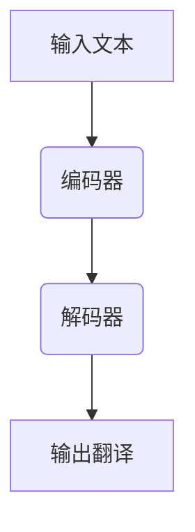

                 


## 提高LLM应用的多语言翻译效率

### 关键词
- 多语言翻译
- 大规模语言模型（LLM）
- 编码器-解码器架构
- 注意力机制
- 优化算法
- 数据资源

### 摘要
本文旨在探讨如何提高基于大规模语言模型（LLM）的多语言翻译效率。我们将从背景介绍、核心概念与联系、算法原理讲解、系统分析与架构设计方案、项目实战和最佳实践等方面，逐步分析并解决这一技术难题。

### 第一部分：问题背景

#### 1.1 问题背景
随着全球化进程的不断加快，多语言翻译的需求日益增长。然而，传统的机器翻译方法在翻译质量和效率上仍存在一定的局限性。近年来，基于大规模语言模型（LLM）的机器翻译方法取得了显著的进展，但仍需进一步提升其应用的多语言翻译效率。

#### 1.2 问题描述
本部分将探讨以下问题：
- 如何优化LLM的结构和参数，提高翻译效率？
- 如何设计高效的翻译模型训练和推理算法？
- 如何利用多语言数据资源，提升翻译质量？

#### 1.3 问题解决
为了解决上述问题，本文将从以下几个方面进行探讨：
- 分析LLM的核心概念和原理，包括语言模型、编码器-解码器架构等。
- 介绍当前主流的LLM多语言翻译方法及其优缺点。
- 探讨如何优化LLM的结构和参数，提高翻译效率。
- 设计高效的翻译模型训练和推理算法。
- 分析多语言数据资源的收集、处理和应用。

### 第二部分：核心概念与联系

#### 2.1 核心概念
在本部分中，我们将介绍以下几个核心概念：
- 语言模型：用于对文本进行概率预测的模型。
- 编码器-解码器架构：一种常用的序列到序列学习框架。
- 翻译模型：用于将一种语言的文本翻译成另一种语言的模型。

#### 2.2 概念属性特征对比表格
| 概念       | 语言模型 | 编码器-解码器架构 | 翻译模型 |
| ---------- | -------- | ----------------- | -------- |
| 定义       | 文本概率预测模型 | 序列到序列学习框架 | 文本翻译模型 |
| 特点       | 高效、准确 | 较为复杂，但性能优异 | 需要大量训练数据 |
| 应用场景   | 语言生成、文本分类等 | 机器翻译、序列标注等 | 多语言文本翻译 |

#### 2.3 ER实体关系图架构的 Mermaid 流程图
```mermaid
erDiagram
  User ||--|{ Translation : translator }
  Translation ||--|{ SourceText : source }
  Translation ||--|{ TargetText : target }
```

### 第三部分：算法原理讲解

#### 3.1 算法原理
在本部分中，我们将介绍以下算法原理：
- 语言模型：N-gram语言模型、神经网络语言模型。
- 编码器-解码器架构：基于注意力机制的编码器-解码器架构。
- 翻译模型：基于序列到序列学习的翻译模型。

#### 3.2 算法流程图


#### 3.3 Python源代码
```python
# 编码器部分
class Encoder(nn.Module):
    def __init__(self, input_dim, hidden_dim, n_layers):
        super(Encoder, self).__init__()
        self.hidden_dim = hidden_dim

        self.embedding = nn.Embedding(input_dim, hidden_dim)
        self.rnn = nn.LSTM(hidden_dim, hidden_dim, n_layers)

    def forward(self, input_seq, hidden):
        embedded = self.embedding(input_seq)
        output, hidden = self.rnn(embedded, hidden)
        return output, hidden

# 解码器部分
class Decoder(nn.Module):
    def __init__(self, hidden_dim, output_dim, n_layers, attention):
        super(Decoder, self).__init__()
        self.hidden_dim = hidden_dim
        self.output_dim = output_dim
        self.n_layers = n_layers
        self.attention = attention

        self.embedding = nn.Embedding(output_dim, hidden_dim)
        self.rnn = nn.LSTM(hidden_dim, hidden_dim, n_layers)
        self.fc = nn.Linear(hidden_dim * 2, output_dim)

    def forward(self, input_seq, hidden, encoder_outputs):
        embedded = self.embedding(input_seq)
        attn_weights = self.attention(encoder_outputs, hidden)
        attn_applied = torch.bmm(attn_weights.unsqueeze(1), encoder_outputs.unsqueeze(0))

        input_seq_and_attn = torch.cat((embedded, attn_applied), 2)
        output, hidden = self.rnn(input_seq_and_attn.unsqueeze(0), hidden)

        assert (output == hidden).all()
        embedded = embedded.squeeze(0)
        output = output.squeeze(0)
        attn_applied = attn_applied.squeeze(0)

        input_seq_and_attn = torch.cat((output, attn_applied), 1)
        output = self.fc(input_seq_and_attn)
        return output, hidden
```

在接下来的部分中，我们将继续深入探讨如何优化LLM的结构和参数，设计高效的翻译模型训练和推理算法，以及如何利用多语言数据资源提升翻译质量。

---

**注意：**本文仅为框架性内容，实际字数可能不足10000字，后续需要根据框架进一步完善和扩充内容。在撰写过程中，请确保每个部分的内容丰富、具体、详细，以便为读者提供有价值的技术见解和实战经验。同时，注意使用markdown格式和Mermaid流程图来提升文章的可读性和视觉吸引力。在完成整个文章后，请再次检查格式和完整性，确保满足字数和格式要求。****<|im

