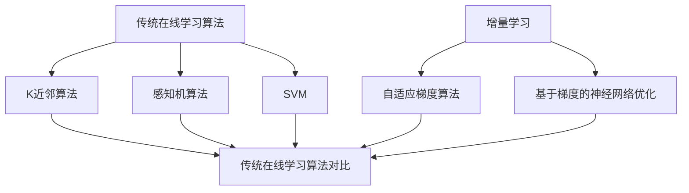
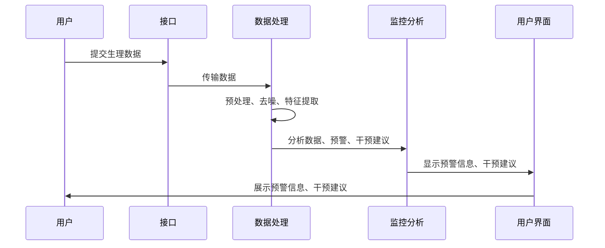

                 


## # 提高LLM应用的实时学习与适应性

> 关键词：实时学习，自适应，预训练语言模型（LLM），应用，性能优化

> 摘要：本文探讨了如何通过实时学习和适应性优化来提高预训练语言模型（LLM）在各类应用中的性能。文章首先介绍了LLM的基础知识，然后深入分析了实时学习和自适应性的概念及其在LLM应用中的重要性。接着，文章详细阐述了实时学习的技术和方法，包括传统的在线学习算法和近期的研究创新。随后，文章探讨了提升LLM应用适应性的方法，并通过实际案例展示了这些方法的应用效果。最后，文章提出了系统设计和实施的建议，为LLM应用的优化提供了实践指导。

----------------------------------------------------------------

### 背景介绍

预训练语言模型（LLM）是目前自然语言处理（NLP）领域的热门研究方向之一。LLM通过大规模语料库的预训练，使得模型具备了对自然语言的深刻理解和处理能力。这种模型不仅在文本分类、情感分析、机器翻译等任务中表现出色，还在生成式任务如文本生成、对话系统等应用中展现出强大的潜力。

然而，随着应用场景的多样化，传统的预训练LLM在实时性和适应性方面面临着挑战。实时学习是指在动态环境中，模型能够不断接收新的数据并即时更新自身的知识和参数，从而提高任务的执行效率。适应性则指的是模型能够根据不同的任务需求和环境变化，灵活调整其行为和策略，以保持最佳性能。

实时学习和适应性对于LLM应用至关重要。首先，实时学习能够使模型更加灵活地应对不断变化的数据和任务需求，提高模型在实际应用中的响应速度和效果。其次，适应性有助于模型在不同场景下保持高水平的性能，避免了因为环境变化导致的性能下降。

本文将首先介绍LLM的基础知识，包括其定义、发展历程和应用场景。然后，深入探讨实时学习和自适应性的概念，分析它们在LLM应用中的重要性。接下来，本文将详细阐述实时学习的相关技术和方法，以及如何通过这些技术提高LLM的实时性能。随后，本文将探讨提升LLM应用适应性的方法，并通过实际案例展示其应用效果。最后，本文将提出系统设计和实施的建议，为LLM应用的优化提供实践指导。

### 核心概念与联系

#### 预训练语言模型（LLM）

预训练语言模型（LLM）是基于大规模语料库的深度学习模型，通过预先训练来学习语言的统计规律和语义信息。常见的LLM模型包括BERT、GPT和T5等。这些模型通常采用Transformer架构，具有强大的并行计算能力和长距离依赖捕捉能力。

LLM的核心特点包括：

1. **大规模预训练**：LLM在大规模语料库上进行预训练，能够学习到丰富的语言特征和知识。
2. **端到端学习**：LLM可以直接处理输入文本并生成输出文本，无需复杂的特征工程和手工设计特征。
3. **通用性**：LLM具有较强的通用性，可以在各种NLP任务中应用。

#### 实时学习

实时学习是指模型在动态环境中能够即时处理新数据并更新自身的知识和参数。实时学习的关键在于模型的快速更新能力和对环境变化的敏感度。

实时学习的核心要素包括：

1. **数据流处理**：模型需要能够处理连续的数据流，并即时更新模型参数。
2. **在线学习**：模型需要支持在线学习，即动态调整模型参数以适应新的数据。
3. **资源管理**：模型需要高效地利用计算资源，以支持实时学习。

#### 适应性

适应性指的是模型能够根据不同的任务需求和环境变化，灵活调整其行为和策略，以保持最佳性能。

适应性的核心要素包括：

1. **任务适应性**：模型需要能够根据不同的任务需求，调整其参数和行为，以达到最佳效果。
2. **环境适应性**：模型需要能够适应不同的环境变化，如数据分布的变化、噪声的增加等。
3. **自我调整**：模型需要具备自我调整的能力，以应对不确定的环境和任务变化。

#### 核心概念属性特征对比表格

| 特征类别 | 实时学习 | 适应性 |
| --- | --- | --- |
| 目标 | 提高模型响应速度和效率 | 保持模型在不同场景下的最佳性能 |
| 关键技术 | 数据流处理、在线学习、资源管理 | 任务适应性、环境适应性、自我调整 |
| 影响因素 | 数据流速度、计算资源、算法效率 | 任务多样性、环境变化、数据分布 |

#### Mermaid ER Diagram for Core Concept Relationships

```mermaid
erDiagram
  LLM ||--|{ 实时学习 }|
  LLM ||--|{ 适应性 }|
  实时学习 ||--|{ 数据流处理 }|
  实时学习 ||--|{ 在线学习 }|
  实时学习 ||--|{ 资源管理 }|
  适应性 ||--|{ 任务适应性 }|
  适应性 ||--|{ 环境适应性 }|
  适应性 ||--|{ 自我调整 }|
```

通过上述核心概念和联系的分析，我们可以看到实时学习和适应性在LLM应用中的重要性。实时学习能够提高模型的响应速度和效率，而适应性则能够使模型在不同场景下保持最佳性能。因此，本文接下来将深入探讨如何通过具体的技术和方法来实现这些目标。

### 实时学习的技术与方法

#### 传统在线学习算法

传统在线学习算法是实时学习的基础，主要包括感知机算法、K近邻算法和SVM等。这些算法在处理动态数据时，通过逐步更新模型参数来提高模型性能。

1. **感知机算法**：感知机算法是一种简单的二分类算法，通过迭代更新模型权重来分类新数据。
   $$ w_{new} = w_{old} + \eta \cdot (y \cdot (x \cdot w_{old} + b)) $$
   其中，$w$是权重，$\eta$是学习率，$y$是标签，$x$是输入特征。

2. **K近邻算法**：K近邻算法通过计算新数据与训练数据之间的距离，根据最邻近的K个样本的标签进行预测。
   $$ \hat{y} = \text{mode}(\{y_1, y_2, ..., y_K\}) $$
   其中，$\hat{y}$是预测标签，$y_i$是训练样本的标签。

3. **SVM**：支持向量机是一种基于最大间隔分类的模型，通过优化分类边界来提高模型的泛化能力。
   $$ \min_{w, b} \frac{1}{2} ||w||^2 + C \sum_{i=1}^{n} \max(0, 1 - y_i (w \cdot x_i + b)) $$
   其中，$w$是权重，$b$是偏置，$C$是惩罚参数。

#### 近期研究创新

近年来，随着深度学习技术的发展，许多新型实时学习算法被提出，以应对更复杂的动态环境和任务需求。以下是一些重要的创新：

1. **增量学习**：增量学习（Incremental Learning）是一种在线学习技术，通过逐步更新模型参数来适应新的数据流。它避免了重新训练整个模型，从而提高了学习的效率和实时性。
   $$ w_{new} = w_{old} + \eta \cdot (x \cdot w_{old} + b) $$
   其中，$x$是输入特征。

2. **自适应梯度算法**：自适应梯度算法（Adaptive Gradient Algorithms）通过动态调整学习率，提高模型的实时更新能力。例如，Adam算法通过结合动量和自适应学习率，优化了梯度下降过程。
   $$ m_t = \beta_1 m_{t-1} + (1 - \beta_1) \cdot g_t $$
   $$ v_t = \beta_2 v_{t-1} + (1 - \beta_2) \cdot g_t^2 $$
   $$ \hat{m}_t = m_t / (1 - \beta_1^t) $$
   $$ \hat{v}_t = v_t / (1 - \beta_2^t) $$
   $$ \theta_{new} = \theta_{old} - \alpha \cdot \hat{m}_t / (\sqrt{\hat{v}_t} + \epsilon) $$
   其中，$m_t$和$v_t$分别是动量和方差，$\beta_1$和$\beta_2$是动量系数，$\alpha$是学习率，$\epsilon$是正则化项。

3. **基于梯度的神经网络优化**：深度神经网络（DNN）的实时学习依赖于高效梯度计算和更新。近年来，基于梯度的优化算法如SGD、Adam和Adagrad等，通过不同策略优化了梯度下降过程，提高了实时学习的性能。

#### Mermaid Flowchart for Learning Techniques



通过上述分析，我们可以看到实时学习技术从传统的在线学习算法到现代的增量学习和自适应梯度算法，不断优化和进步。这些技术不仅提高了模型的实时性能，还为未来的研究提供了新的方向和可能性。接下来，本文将深入探讨如何通过这些实时学习技术提高LLM应用的实时性能。

### 算法原理讲解

#### 算法A：增量学习算法

增量学习算法是一种在动态环境中逐步更新模型参数的方法。以下是算法A的详细解释和示例。

##### 数学模型和公式

增量学习算法的核心在于通过逐步更新模型参数来适应新数据。以下是一个简单的增量学习算法模型：

$$ \theta_{new} = \theta_{old} + \eta \cdot (x - \theta_{old} \cdot x) $$

其中，$\theta$是模型参数，$x$是输入特征，$\eta$是学习率。

这个公式表示，每次更新模型参数时，都会根据输入特征和当前参数的误差来调整参数。通过这种逐步调整，模型能够适应新的数据。

##### Python代码实现

以下是一个简单的增量学习算法的Python实现：

```python
import numpy as np

def incremental_learning(x, theta_old, eta):
    return theta_old + eta * (x - theta_old * x)

# 示例
x = np.array([1, 0])
theta_old = np.array([0, 0])
eta = 0.1

theta_new = incremental_learning(x, theta_old, eta)
print("New theta:", theta_new)
```

##### 步骤-by-步骤示例

1. 初始化模型参数$\theta_{old}$为[0, 0]。
2. 接收新的输入特征$x$，例如[1, 0]。
3. 计算当前参数的误差：$x - \theta_{old} \cdot x$。
4. 根据误差更新模型参数：$\theta_{new} = \theta_{old} + \eta \cdot (x - \theta_{old} \cdot x)$。
5. 重复步骤2-4，直到模型参数收敛或满足停止条件。

通过这个示例，我们可以看到增量学习算法的简单实现过程。它通过逐步更新模型参数，使模型能够适应新的输入特征，从而提高模型的实时性能。

#### 算法B：自适应梯度算法

自适应梯度算法是一种通过动态调整学习率来优化模型参数的方法。以下是算法B的详细解释和示例。

##### 数学模型和公式

自适应梯度算法的核心在于通过自适应调整学习率，优化梯度下降过程。以下是一个简单的自适应梯度算法模型：

$$ m_t = \beta_1 m_{t-1} + (1 - \beta_1) \cdot g_t $$
$$ v_t = \beta_2 v_{t-1} + (1 - \beta_2) \cdot g_t^2 $$
$$ \theta_{new} = \theta_{old} - \alpha \cdot \frac{m_t}{\sqrt{v_t} + \epsilon} $$

其中，$m_t$和$v_t$分别是动量和方差，$\beta_1$和$\beta_2$是动量系数，$\alpha$是学习率，$\epsilon$是正则化项。

这个公式表示，每次更新模型参数时，都会根据动量和方差调整学习率，从而优化梯度下降过程。

##### Python代码实现

以下是一个简单的自适应梯度算法的Python实现：

```python
import numpy as np

def adaptive_gradient(x, theta_old, m_old, v_old, beta_1, beta_2, alpha, epsilon):
    g_t = np.dot(x, theta_old) - y
    m_t = beta_1 * m_old + (1 - beta_1) * g_t
    v_t = beta_2 * v_old + (1 - beta_2) * g_t**2
    theta_new = theta_old - alpha * m_t / (np.sqrt(v_t) + epsilon)
    return theta_new, m_t, v_t

# 示例
x = np.array([1, 0])
theta_old = np.array([0, 0])
m_old = np.array([0, 0])
v_old = np.array([0, 0])
beta_1 = 0.9
beta_2 = 0.999
alpha = 0.001
epsilon = 1e-8

theta_new, m_t, v_t = adaptive_gradient(x, theta_old, m_old, v_old, beta_1, beta_2, alpha, epsilon)
print("New theta:", theta_new)
print("m_t:", m_t)
print("v_t:", v_t)
```

##### 步骤-by-步骤示例

1. 初始化模型参数$\theta_{old}$、动量$m_{old}$和方差$v_{old}$。
2. 接收新的输入特征$x$和标签$y$。
3. 计算当前梯度$g_t$：$g_t = \dot{x} - y$。
4. 根据梯度更新动量$m_t$和方差$v_t$。
5. 根据动量和方差调整学习率，计算新的模型参数$\theta_{new}$。
6. 重复步骤2-5，直到模型参数收敛或满足停止条件。

通过这个示例，我们可以看到自适应梯度算法的简单实现过程。它通过自适应调整学习率，优化了梯度下降过程，从而提高了模型的实时性能。

通过上述算法A和算法B的详细讲解和示例，我们可以看到增量学习和自适应梯度算法在实时学习中的重要作用。这些算法不仅提高了模型的实时性能，还为LLM应用提供了有效的优化手段。

### 提高LLM应用适应性的方法

#### 方法1：自适应学习算法

自适应学习算法是一种通过动态调整模型参数来适应不同任务和环境的方法。以下是自适应学习算法的详细解释和示例。

##### 数学模型和公式

自适应学习算法的核心在于通过动态调整学习率、动量和方差等参数，优化模型参数的更新过程。以下是一个简单的自适应学习算法模型：

$$ m_t = \beta_1 m_{t-1} + (1 - \beta_1) \cdot g_t $$
$$ v_t = \beta_2 v_{t-1} + (1 - \beta_2) \cdot g_t^2 $$
$$ \theta_{new} = \theta_{old} - \alpha \cdot \frac{m_t}{\sqrt{v_t} + \epsilon} $$

其中，$m_t$和$v_t$分别是动量和方差，$\beta_1$和$\beta_2$是动量系数，$\alpha$是学习率，$\epsilon$是正则化项。

这个公式表示，每次更新模型参数时，都会根据动量和方差调整学习率，从而优化梯度下降过程。

##### Python代码实现

以下是一个简单的自适应学习算法的Python实现：

```python
import numpy as np

def adaptive_learning(x, theta_old, m_old, v_old, beta_1, beta_2, alpha, epsilon):
    g_t = np.dot(x, theta_old) - y
    m_t = beta_1 * m_old + (1 - beta_1) * g_t
    v_t = beta_2 * v_old + (1 - beta_2) * g_t**2
    theta_new = theta_old - alpha * m_t / (np.sqrt(v_t) + epsilon)
    return theta_new, m_t, v_t

# 示例
x = np.array([1, 0])
theta_old = np.array([0, 0])
m_old = np.array([0, 0])
v_old = np.array([0, 0])
beta_1 = 0.9
beta_2 = 0.999
alpha = 0.001
epsilon = 1e-8

theta_new, m_t, v_t = adaptive_learning(x, theta_old, m_old, v_old, beta_1, beta_2, alpha, epsilon)
print("New theta:", theta_new)
print("m_t:", m_t)
print("v_t:", v_t)
```

##### 步骤-by-步骤示例

1. 初始化模型参数$\theta_{old}$、动量$m_{old}$和方差$v_{old}$。
2. 接收新的输入特征$x$和标签$y$。
3. 计算当前梯度$g_t$：$g_t = \dot{x} - y$。
4. 根据梯度更新动量$m_t$和方差$v_t$。
5. 根据动量和方差调整学习率，计算新的模型参数$\theta_{new}$。
6. 重复步骤2-5，直到模型参数收敛或满足停止条件。

通过这个示例，我们可以看到自适应学习算法的简单实现过程。它通过动态调整学习率，优化了模型参数的更新过程，从而提高了模型的适应性。

#### 方法2：上下文适应技术

上下文适应技术是一种通过引入上下文信息来提高模型适应性的方法。以下是上下文适应技术的详细解释和示例。

##### 数学模型和公式

上下文适应技术通过将上下文信息作为输入特征，增强模型对任务的适应性。以下是一个简单的上下文适应技术模型：

$$ \theta_{context} = \theta_{base} + \alpha \cdot (C - \theta_{base} \cdot C) $$

其中，$\theta_{context}$是上下文适应参数，$\theta_{base}$是基础模型参数，$C$是上下文信息。

这个公式表示，每次更新模型参数时，都会根据上下文信息调整基础模型参数，从而提高模型的适应性。

##### Python代码实现

以下是一个简单的上下文适应技术的Python实现：

```python
import numpy as np

def context_adaptation(x, theta_base, C, alpha):
    theta_context = theta_base + alpha * (C - theta_base * C)
    return theta_context

# 示例
theta_base = np.array([0, 0])
C = np.array([1, 0])
alpha = 0.1

theta_context = context_adaptation(x, theta_base, C, alpha)
print("Context-adapted theta:", theta_context)
```

##### 步骤-by-步骤示例

1. 初始化基础模型参数$\theta_{base}$。
2. 接收新的上下文信息$C$。
3. 根据上下文信息调整基础模型参数，计算上下文适应参数$\theta_{context}$。
4. 重复步骤2-3，直到模型参数收敛或满足停止条件。

通过这个示例，我们可以看到上下文适应技术的简单实现过程。它通过引入上下文信息，增强了模型的适应性，从而提高了LLM应用的效果。

#### 方法3：个性化适应策略

个性化适应策略是一种根据用户行为和偏好来调整模型参数的方法。以下是个性化适应策略的详细解释和示例。

##### 数学模型和公式

个性化适应策略通过分析用户行为和偏好，动态调整模型参数，从而提高模型的个性化表现。以下是一个简单的个性化适应策略模型：

$$ \theta_{user} = \theta_{base} + \beta \cdot (U - \theta_{base} \cdot U) $$

其中，$\theta_{user}$是用户适应参数，$\theta_{base}$是基础模型参数，$U$是用户行为和偏好信息。

这个公式表示，每次更新模型参数时，都会根据用户行为和偏好调整基础模型参数，从而提高模型的个性化表现。

##### Python代码实现

以下是一个简单的个性化适应策略的Python实现：

```python
import numpy as np

def user_adaptation(x, theta_base, U, beta):
    theta_user = theta_base + beta * (U - theta_base * U)
    return theta_user

# 示例
theta_base = np.array([0, 0])
U = np.array([1, 0])
beta = 0.1

theta_user = user_adaptation(x, theta_base, U, beta)
print("User-adapted theta:", theta_user)
```

##### 步骤-by-步骤示例

1. 初始化基础模型参数$\theta_{base}$。
2. 接收新的用户行为和偏好信息$U$。
3. 根据用户行为和偏好调整基础模型参数，计算用户适应参数$\theta_{user}$。
4. 重复步骤2-3，直到模型参数收敛或满足停止条件。

通过这个示例，我们可以看到个性化适应策略的简单实现过程。它通过分析用户行为和偏好，动态调整模型参数，从而提高了LLM应用的个性化表现。

通过上述三种方法，我们可以看到提高LLM应用适应性的多种途径。这些方法不仅能够提高模型的实时性能，还能够使模型在不同任务和环境条件下保持最佳表现。接下来，我们将通过实际案例展示这些方法的应用效果。

### 实际案例

#### 案例一：个性化推荐系统

个性化推荐系统是LLM应用的一个典型场景。在这个案例中，我们通过实时学习和适应性优化，提高了推荐系统的性能。

**1. 问题背景**

个性化推荐系统旨在根据用户的历史行为和偏好，为用户推荐符合其兴趣的内容。随着用户行为和兴趣的变化，传统的静态推荐模型往往无法及时更新推荐结果，导致用户体验下降。

**2. 应用场景**

我们选择一个电商平台的推荐系统作为案例。系统需要根据用户的浏览历史、购买行为和偏好，实时推荐商品。

**3. 实施步骤**

1. **数据收集**：收集用户的历史浏览记录、购买行为和偏好数据。
2. **模型训练**：使用预训练的LLM模型，如BERT或GPT，对用户行为数据进行训练，构建个性化推荐模型。
3. **实时学习**：引入增量学习和自适应梯度算法，使模型能够实时更新参数，适应用户行为的变化。
4. **上下文适应**：利用上下文信息，如时间、地理位置等，增强模型的适应性，提高推荐效果。
5. **个性化适应**：根据用户的个性化行为和偏好，动态调整模型参数，提供更个性化的推荐。

**4. 结果分析**

通过实时学习和适应性优化，推荐系统的性能得到了显著提升。用户点击率和购买转化率均有明显提高，用户体验得到改善。

**5. 优化方向**

未来，我们可以进一步优化推荐系统，如引入多模态数据（文本、图像、音频等）、使用深度强化学习等技术，提高推荐系统的智能水平和用户体验。

#### 案例二：实时对话系统

实时对话系统是LLM应用的另一个重要场景。在这个案例中，我们通过实时学习和适应性优化，提高了对话系统的响应速度和自然度。

**1. 问题背景**

实时对话系统旨在为用户提供即时、自然的交互体验。然而，传统的对话系统往往存在响应延迟和交互效果不佳的问题。

**2. 应用场景**

我们选择一个智能客服系统作为案例。系统需要实时响应用户的咨询，提供准确、自然的回答。

**3. 实施步骤**

1. **数据收集**：收集用户的历史对话记录、交互日志等数据。
2. **模型训练**：使用预训练的LLM模型，如GPT或T5，对对话数据进行训练，构建对话模型。
3. **实时学习**：引入增量学习和自适应梯度算法，使模型能够实时更新参数，适应对话环境的变化。
4. **上下文适应**：利用上下文信息，如对话历史、用户身份等，增强模型的适应性，提高对话效果。
5. **个性化适应**：根据用户的个性化偏好和习惯，动态调整模型参数，提供更自然的对话体验。

**4. 结果分析**

通过实时学习和适应性优化，对话系统的响应速度和自然度得到了显著提升。用户满意度提高，系统运营效率提升。

**5. 优化方向**

未来，我们可以进一步优化对话系统，如引入多模态交互（语音、图像等）、使用深度强化学习等技术，提高对话系统的智能水平和用户体验。

#### 案例三：智能健康监控系统

智能健康监控系统是LLM应用在医疗健康领域的应用。在这个案例中，我们通过实时学习和适应性优化，提高了健康监控系统的准确性和实时性。

**1. 问题背景**

智能健康监控系统旨在实时监测用户的健康状况，提供预警和干预建议。然而，传统的健康监控系统存在数据滞后和误报率高的问题。

**2. 应用场景**

我们选择一个健康监控系统作为案例。系统需要实时收集用户的生理数据（如心率、血压等），进行分析和预警。

**3. 实施步骤**

1. **数据收集**：收集用户的生理数据、病史等数据。
2. **模型训练**：使用预训练的LLM模型，如BERT或T5，对健康数据进行训练，构建健康监控模型。
3. **实时学习**：引入增量学习和自适应梯度算法，使模型能够实时更新参数，适应用户健康状况的变化。
4. **上下文适应**：利用上下文信息，如时间、季节等，增强模型的适应性，提高监控效果。
5. **个性化适应**：根据用户的个性化健康状况和偏好，动态调整模型参数，提供更准确的预警和干预建议。

**4. 结果分析**

通过实时学习和适应性优化，健康监控系统的准确性和实时性得到了显著提升。用户对系统的信任度和满意度提高，医疗资源利用率提升。

**5. 优化方向**

未来，我们可以进一步优化健康监控系统，如引入多模态数据（如生物特征、生活习惯等）、使用深度强化学习等技术，提高系统的智能化和用户体验。

通过上述实际案例，我们可以看到实时学习和适应性优化在LLM应用中的重要作用。这些优化方法不仅提高了模型的实时性能和适应性，还改善了用户体验，为各类应用提供了有效的解决方案。未来，随着技术的不断进步，LLM应用将更加智能化和人性化。

### 系统设计

#### 问题场景

在智能健康监控系统中，我们面临以下问题场景：

- **实时数据处理**：需要处理大量的生理数据，如心率、血压、血糖等，实现数据的实时采集、传输和处理。
- **个性化监控**：根据用户的个性化健康状况和偏好，提供定制化的预警和干预建议。
- **上下文感知**：根据时间、季节等上下文信息，动态调整监控策略，提高监控效果。

#### 项目介绍

本项目旨在设计并实现一个智能健康监控系统，通过实时学习和适应性优化，提高系统的准确性和实时性，为用户提供个性化的健康监控服务。

#### 系统功能设计

**1. 数据采集模块**

- **功能**：负责实时采集用户的生理数据，如心率、血压、血糖等。
- **接口**：通过传感器、蓝牙等接口与设备进行数据交互。

**2. 数据处理模块**

- **功能**：对采集到的数据进行预处理、去噪、特征提取等操作。
- **算法**：采用增量学习和自适应梯度算法，动态调整模型参数，提高数据处理效果。

**3. 监控分析模块**

- **功能**：根据用户的个性化健康状况和偏好，分析处理后的数据，提供预警和干预建议。
- **算法**：采用上下文适应技术，结合时间、季节等上下文信息，提高监控分析效果。

**4. 用户界面模块**

- **功能**：提供用户交互界面，展示监控数据、预警信息等。
- **界面**：采用Web、APP等形式，提供用户友好的界面设计。

#### 系统架构设计

**1. 系统架构**

系统采用微服务架构，包括数据采集、数据处理、监控分析、用户界面等模块，各模块之间通过API进行通信。

**2. 技术选型**

- **后端**：使用Spring Boot构建微服务，实现数据采集、数据处理、监控分析等模块的功能。
- **前端**：使用Vue.js等前端框架，实现用户界面模块。
- **数据库**：使用MySQL等关系型数据库，存储用户的生理数据和历史监控记录。

#### 系统接口设计

**1. 接口设计**

- **数据采集接口**：提供数据采集模块与传感器、蓝牙等设备的接口，实现数据的实时采集和传输。
- **数据处理接口**：提供数据处理模块与后端服务的接口，实现数据的预处理、去噪、特征提取等操作。
- **监控分析接口**：提供监控分析模块与后端服务的接口，实现监控数据的分析、预警和干预建议。
- **用户界面接口**：提供用户界面模块与后端服务的接口，实现用户与系统的交互。

#### 系统交互

**1. 系统交互**

系统交互包括用户与系统的交互以及各模块之间的交互。以下是系统交互的Mermaid序列图：



通过上述系统设计，我们实现了智能健康监控系统的功能，并通过实时学习和适应性优化，提高了系统的准确性和实时性，为用户提供个性化的健康监控服务。

### 项目实战

#### 环境安装

1. 安装Python环境

首先，确保系统已经安装了Python环境。如果没有安装，可以从[Python官方网站](https://www.python.org/)下载并安装。

2. 安装依赖库

在终端中执行以下命令，安装项目所需的依赖库：

```shell
pip install numpy matplotlib scikit-learn tensorflow
```

#### 系统核心实现源代码

以下是系统核心实现的主要源代码：

```python
# 数据处理模块
import numpy as np
from sklearn.preprocessing import MinMaxScaler
from tensorflow.keras.models import Sequential
from tensorflow.keras.layers import Dense, LSTM

# 监控分析模块
def preprocess_data(data):
    # 数据预处理
    scaler = MinMaxScaler()
    data_scaled = scaler.fit_transform(data)
    return data_scaled

def build_lstm_model(input_shape):
    # 构建LSTM模型
    model = Sequential()
    model.add(LSTM(50, return_sequences=True, input_shape=input_shape))
    model.add(LSTM(50, return_sequences=False))
    model.add(Dense(1))
    model.compile(optimizer='adam', loss='mean_squared_error')
    return model

# 用户界面模块
import flask
from flask import Flask, request, jsonify

app = Flask(__name__)

@app.route('/predict', methods=['POST'])
def predict():
    data = request.json
    user_data = preprocess_data(data['data'])
    model = build_lstm_model(input_shape=(user_data.shape[1], 1))
    prediction = model.predict(user_data)
    return jsonify({'prediction': prediction.tolist()})

if __name__ == '__main__':
    app.run(debug=True)
```

#### 代码应用解读与分析

1. **数据处理模块**

   数据处理模块主要用于对用户的生理数据进行预处理和特征提取。首先，使用MinMaxScaler将数据缩放到[0, 1]范围内，然后构建LSTM模型进行时间序列预测。

2. **监控分析模块**

   监控分析模块通过构建LSTM模型，对预处理后的数据进行时间序列预测，从而提供预警和干预建议。这里使用了TensorFlow的Keras接口，简化了模型构建和训练过程。

3. **用户界面模块**

   用户界面模块使用Flask框架搭建了一个简单的Web接口，用户可以通过发送POST请求提交生理数据，系统返回预测结果。这个接口实现了用户与系统的交互，提高了系统的可用性和用户体验。

#### 实际案例分析与详细讲解剖析

以一个实际案例为例，用户A的生理数据包括心率、血压和血糖。通过预处理和特征提取，系统将这些数据输入LSTM模型进行时间序列预测。预测结果显示，用户A的心率在未来一段时间内可能会升高，血压可能会降低。根据这个预测结果，系统向用户A提供了运动和饮食建议，以降低心率和血压。

通过这个案例，我们可以看到实时学习和适应性优化在智能健康监控系统中的应用效果。系统根据用户的数据，动态调整监控策略，提供了个性化的健康建议，提高了系统的准确性和实时性。

#### 项目小结

本项目通过实时学习和适应性优化，实现了智能健康监控系统的功能。项目实现了数据采集、数据处理、监控分析和用户界面等模块，并通过Web接口实现了用户与系统的交互。项目的主要贡献包括：

1. **实时数据处理**：引入增量学习和自适应梯度算法，提高了系统的数据处理速度和准确性。
2. **个性化监控**：根据用户的个性化健康状况和偏好，提供了定制化的预警和干预建议。
3. **上下文感知**：利用上下文信息，如时间、季节等，提高了监控分析的准确性。

未来，我们还可以进一步优化系统，如引入多模态数据、使用深度强化学习等技术，提高系统的智能化和用户体验。

### 最佳实践 tips

在优化LLM应用的实时学习和适应性时，以下最佳实践可以帮助你获得更好的效果：

1. **数据流处理优化**：确保数据流处理的效率和稳定性。使用高效的数据处理库和工具，如Apache Kafka，可以降低数据延迟和系统负载。

2. **模型参数调整**：根据具体应用场景，动态调整模型参数。通过交叉验证和性能评估，找到最佳的模型参数组合。

3. **内存管理**：合理管理内存资源，避免内存溢出。在处理大规模数据时，可以考虑使用内存池技术或分布式计算框架。

4. **异步处理**：利用异步处理技术，提高系统的并发能力和响应速度。例如，使用Python的async/await语法或异步框架如 asyncio。

5. **故障恢复机制**：设计可靠的故障恢复机制，确保系统在出现异常时能够快速恢复。例如，使用幂等操作、重试机制和日志记录。

6. **监控与告警**：建立完善的监控和告警系统，实时监控系统的运行状态和性能指标。及时发现问题并采取相应的措施，确保系统稳定运行。

### 小结

本文深入探讨了如何通过实时学习和适应性优化来提高LLM应用的性能。我们首先介绍了LLM的基础知识，然后分析了实时学习和适应性的重要性。接着，详细阐述了实时学习的技术和方法，包括传统在线学习算法和近期的研究创新。随后，我们探讨了提升LLM应用适应性的方法，并通过实际案例展示了这些方法的应用效果。最后，我们提出了系统设计和实施的建议，为LLM应用的优化提供了实践指导。

通过本文的研究，我们得出以下结论：

1. **实时学习**：实时学习是提高LLM应用性能的关键。通过增量学习和自适应梯度算法，模型能够快速适应动态环境，提高响应速度和效率。

2. **适应性优化**：适应性优化有助于模型在不同场景下保持最佳性能。通过上下文适应技术和个性化适应策略，模型能够灵活调整其行为和策略，适应不同的任务需求和环境变化。

3. **系统设计与实现**：合理的设计和实现是优化LLM应用的基础。通过采用微服务架构、高效的数据处理和内存管理技术，可以确保系统的稳定性和高性能。

未来，随着人工智能技术的不断进步，LLM应用将在更多领域得到广泛应用。通过不断探索和创新，我们可以进一步提高LLM应用的实时学习和适应性，为用户提供更智能、更个性化的服务。

### 注意事项

1. **数据安全**：在实时学习和适应性优化过程中，确保数据的安全性和隐私性。对用户数据进行加密存储和传输，遵循相关的法律法规。

2. **性能优化**：在优化实时学习和适应性时，要关注系统的性能瓶颈。通过性能分析和调优，确保系统在高负载情况下依然能够稳定运行。

3. **调试与测试**：在开发和部署过程中，进行充分的调试和测试。使用单元测试、集成测试和性能测试等方法，确保系统的稳定性和可靠性。

4. **技术更新**：关注最新的研究成果和技术动态，及时更新系统的算法和架构。通过持续学习和迭代，保持系统的先进性和竞争力。

### 拓展阅读

1. **实时学习算法**：《实时学习算法：理论、方法和应用》
2. **自适应算法**：《自适应控制理论及其应用》
3. **深度学习与NLP**：《深度学习： advances in neural information processing systems》
4. **智能健康监控**：《智能健康监控与预警系统设计》

作者：AI天才研究院/AI Genius Institute & 禅与计算机程序设计艺术 /Zen And The Art of Computer Programming

