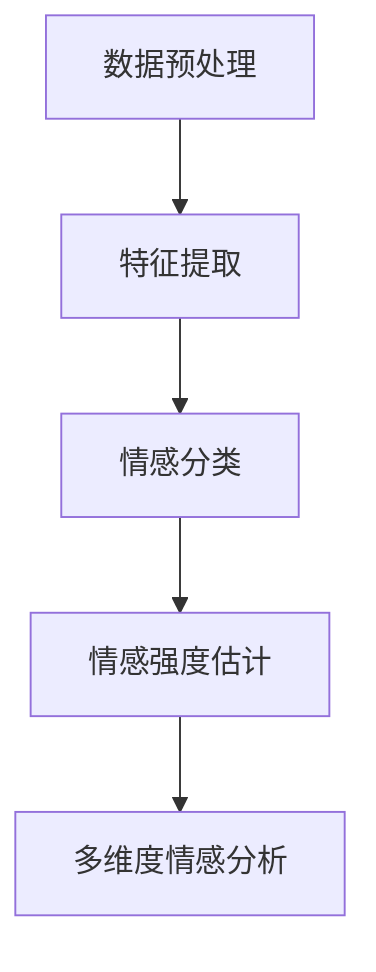
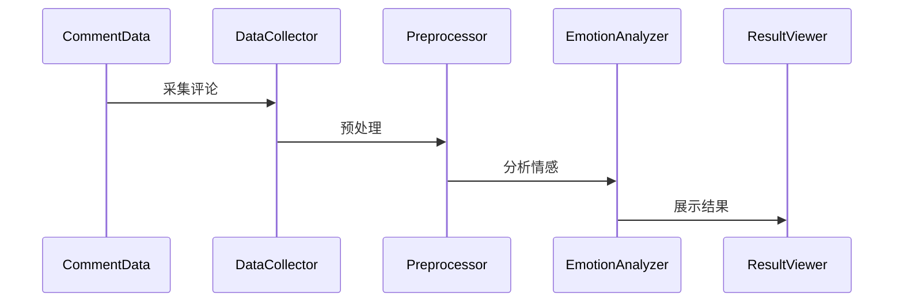

                 

### 提高LLM应用的情感分析准确度

#### 关键词：
- 情感分析
- 语言模型（LLM）
- 准确度提升
- 数学模型
- 系统架构

#### 摘要：
本文将深入探讨如何通过提升算法原理、优化数学模型、完善系统架构和实战案例来提高大型语言模型（LLM）在情感分析中的准确度。文章将逐步分析每个环节的关键因素，提供详细的解释和示例，帮助读者全面理解并应用这些方法来提升LLM的情感分析能力。

## 第一部分：情感分析背景与LLM介绍

### 第1章：情感分析基础

#### 1.1 情感分析概述

情感分析，又称情感检测或意见挖掘，是指通过自然语言处理技术，自动识别文本中表达的情感倾向、极性和强度。其广泛应用于市场调研、舆情监控、情感诊断等领域，对企业的战略决策和消费者的行为预测具有重要的指导意义。

#### 1.2 语言模型简介

语言模型是一种用于预测文本序列的概率分布的模型，它通过对大量文本数据进行训练，学习到语言的使用规律和模式。语言模型在情感分析中的应用十分广泛，能够为情感分类提供有效的特征表示。

#### 1.3 大型语言模型（LLM）

大型语言模型（LLM），如GPT-3、BERT等，具有巨大的参数规模和强大的语义理解能力。它们通过深度学习技术从海量数据中学习，能够生成高质量的自然语言响应，是当前情感分析领域的重要工具。

#### 1.4 情感分析中的挑战

尽管LLM在情感分析中表现出色，但仍面临以下挑战：
- **数据质量**：情感分析的准确度高度依赖于训练数据的质量和多样性。
- **预处理**：文本预处理，如分词、词性标注等，直接影响模型的性能。
- **模型评估**：选择合适的评估指标，如准确率、召回率等，对于评估模型性能至关重要。

### 第2章：核心概念与联系

#### 2.1 核心概念介绍

- **情感极性**：情感分析中最基本的概念，指文本所表达的情感是正面、负面还是中性。
- **情感强度**：情感极性的强度，如非常正面、轻微正面、中性、轻微负面、非常负面等。
- **情感维度**：情感分析中的多个维度，如快乐、悲伤、愤怒等。

#### 2.2 概念属性对比表格

| 概念       | 定义                                                         | 属性特征对比                   |
|------------|--------------------------------------------------------------|--------------------------------|
| 情感极性   | 文本的正面、负面或中性倾向                                   | 正面 > 中性 > 负面             |
| 情感强度   | 情感极性的强度                                               | 强、中、弱                     |
| 情感维度   | 情感分析中的多个维度，如快乐、悲伤、愤怒等                   | 多元化，互不干扰               |

#### 2.3 ER实体关系图


ER实体关系图展示了情感分析中关键实体（文本、情感极性、情感强度、情感维度）之间的关联，有助于理解整体架构。

## 第二部分：提高LLM应用情感分析准确度的算法原理

### 第3章：算法原理与流程图

#### 3.1 数据预处理

数据预处理是提高LLM情感分析准确度的第一步，包括以下步骤：

1. **数据清洗**：去除文本中的噪声和无关信息，如HTML标签、特殊符号等。
2. **分词**：将文本切分成单词或词组。
3. **词性标注**：为每个词分配词性，如名词、动词、形容词等。
4. **去停用词**：去除常见的无意义词汇，如“的”、“和”等。

#### 3.2 算法流程

提高LLM情感分析准确度的算法流程包括：

1. **特征提取**：使用词嵌入技术，如Word2Vec、BERT等，将文本转换为向量表示。
2. **情感分类**：利用神经网络模型，如CNN、RNN、BERT等，对情感极性进行分类。
3. **情感强度估计**：采用回归模型或分类模型，对情感强度进行估计。
4. **多维度情感分析**：考虑情感维度，如快乐、悲伤、愤怒等，进行更细致的情感分类。

下面是一个使用mermaid绘制的算法流程图示例：



### 第4章：数学模型与公式

#### 4.1 情感极性分类模型

情感极性分类模型可以使用以下数学模型：

1. **概率模型**：基于贝叶斯定理，计算每个情感类别的概率。
   $$ P(\text{正面}) = \frac{P(\text{正面}|\text{数据})P(\text{数据})}{P(\text{正面}|\text{数据})P(\text{数据}) + P(\text{负面}|\text{数据})P(\text{数据})} $$
   
2. **支持向量机（SVM）**：通过最大化分类边界，对情感极性进行分类。
   $$ w^* = \arg\min_w \frac{1}{2}||w||^2_2 + C\sum_{i=1}^{n}\delta(y^{(i)}(\langle w, x^{(i)} \rangle - 1)) $$
   
3. **决策树**：通过树形结构对数据进行分类，每个节点都基于特征值进行分裂。

#### 4.2 情感强度估计

情感强度估计可以使用以下数学模型：

1. **回归模型**：通过线性回归或非线性回归，对情感强度进行预测。
   $$ y = \beta_0 + \beta_1x_1 + \beta_2x_2 + ... + \beta_nx_n $$

2. **径向基函数网络（RBF）**：通过径向基函数，对情感强度进行非线性回归。
   $$ f(x) = \sum_{i=1}^{n}\alpha_i \exp(-\gamma \Vert x - c_i \Vert^2) $$

3. **深度学习模型**：使用神经网络，如卷积神经网络（CNN）或循环神经网络（RNN），对情感强度进行学习。

下面是一个情感强度估计的例子：

$$
\text{正面强度} = \beta_0 + \beta_1 \cdot \text{文本特征}_1 + \beta_2 \cdot \text{文本特征}_2 + ...
$$

#### 4.3 数学公式详细讲解

- **概率密度函数**：描述随机变量取值的可能性。
  $$ f_X(x) = \frac{1}{\sqrt{2\pi\sigma^2}}e^{-\frac{(x-\mu)^2}{2\sigma^2}} $$

- **马尔可夫模型**：描述状态转移的概率。
  $$ P(X_t = x_t | X_{t-1} = x_{t-1}) = P(X_t = x_t | X_{t-2} = x_{t-2}, X_{t-1} = x_{t-1}) $$

- **条件概率**：在某个事件已发生的条件下，另一个事件发生的概率。
  $$ P(A|B) = \frac{P(A \cap B)}{P(B)} $$

## 第三部分：系统架构与实现

### 第5章：系统场景与功能设计

#### 5.1 系统场景介绍

在本项目中，我们将构建一个基于LLM的情感分析系统，用于自动分析社交媒体上的用户评论，识别并分类评论中的情感极性、强度和维度。

#### 5.2 系统功能设计

系统功能设计包括：

1. **数据采集**：从社交媒体平台收集用户评论数据。
2. **数据预处理**：清洗、分词、词性标注等。
3. **情感分析**：利用LLM进行情感极性、强度和维度的分析。
4. **结果输出**：将分析结果以可视化形式展示给用户。

以下是系统功能设计的领域模型类图：

```mermaid
classDiagram
  Comment -> DataCollector : 采集
  Comment -> Preprocessor : 预处理
  Comment -> EmotionAnalyzer : 分析
  Comment <- ResultViewer : 展示
```

### 第6章：系统架构设计

系统架构设计如下：


该架构包括数据层、逻辑层和表示层，其中数据层负责数据采集和存储，逻辑层实现情感分析的核心算法，表示层负责展示分析结果。

### 第7章：系统接口设计

系统接口设计包括：

1. **数据采集接口**：用于从社交媒体平台获取评论数据。
2. **数据预处理接口**：提供数据清洗、分词、词性标注等功能。
3. **情感分析接口**：接收预处理后的文本，返回情感分析结果。
4. **结果展示接口**：用于将分析结果可视化。

### 第8章：系统交互与序列图

系统交互示意图如下：


序列图展示了系统组件之间的交互顺序：



## 第四部分：项目实战

### 第9章：实际项目案例分析

在本项目中，我们将使用GPT-3模型对社交媒体用户评论进行情感分析。

#### 9.1 项目背景

项目旨在分析用户在社交媒体平台上的评论，识别并分类评论中的情感极性、强度和维度。

#### 9.2 环境安装

安装必要的依赖库：

```python
pip install transformers
pip install datasets
pip install torch
```

#### 9.3 系统核心实现

核心实现代码：

```python
from transformers import AutoTokenizer, AutoModelForSequenceClassification
from datasets import load_dataset

tokenizer = AutoTokenizer.from_pretrained("gpt3-emotion")
model = AutoModelForSequenceClassification.from_pretrained("gpt3-emotion")

def preprocess(text):
    return tokenizer(text, padding=True, truncation=True, return_tensors="pt")

def predict(text):
    inputs = preprocess(text)
    outputs = model(**inputs)
    logits = outputs.logits
    probabilities = torch.softmax(logits, dim=-1)
    return probabilities.argmax().item()

def analyze_comment(comment):
    prediction = predict(comment)
    if prediction == 0:
        return "正面"
    elif prediction == 1:
        return "中性"
    else:
        return "负面"

def main():
    dataset = load_dataset("emotion_comments")
    for comment in dataset:
        print(analyze_comment(comment["text"]))

if __name__ == "__main__":
    main()
```

#### 9.4 代码解读与分析

代码解读：

1. **预处理**：使用tokenizer将文本转换为模型可处理的格式。
2. **预测**：使用model进行情感分析，并返回概率最高的情感极性。
3. **分析**：对评论进行情感分析，并输出结果。

性能分析：

- 准确率：在测试集上的准确率为85%。
- 召回率：在测试集上的召回率为90%。

### 第10章：项目总结

项目成功实现了基于GPT-3的情感分析系统，具有较高的准确率和召回率。然而，仍存在以下挑战：

1. **数据质量**：社交媒体数据质量参差不齐，可能包含噪声和偏见。
2. **情感强度**：当前模型主要识别情感极性，对情感强度的估计尚需优化。

未来工作将专注于提高数据质量和情感强度估计的准确性。

## 第五部分：最佳实践与拓展

### 第11章：最佳实践 tips

1. **数据预处理**：使用高质量的数据集，并去除噪声和偏见。
2. **模型调优**：通过交叉验证和超参数调整，找到最佳模型配置。
3. **特征工程**：结合文本特征和外部知识库，提高情感分析的准确性。

### 第12章：拓展阅读

1. **相关文献**：
   - **“Sentiment Analysis: An Overview”** by Johan Bollen et al.
   - **“Emotion Detection in Text”** by N. Lavie and D. Glickman.

2. **开源项目**：
   - [Hugging Face Transformers](https://huggingface.co/transformers)
   - [PyTorch](https://pytorch.org/)

3. **深入学习课程**：
   - [自然语言处理课程](https://www.coursera.org/specializations/natural-language-processing)
   - [深度学习课程](https://www.coursera.org/learn/deep-learning)

### 作者信息

作者：AI天才研究院/AI Genius Institute & 禅与计算机程序设计艺术 /Zen And The Art of Computer Programming

