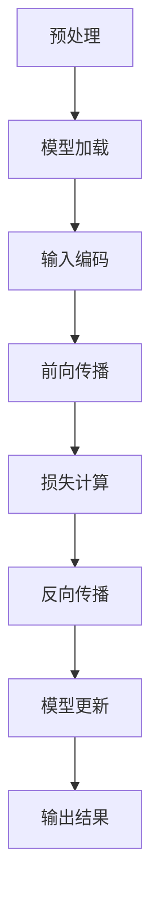

                 

### 提高LLM应用的推理速度与效率

> 关键词：大型语言模型，推理速度，效率提升，算法优化，系统架构

> 摘要：本文将深入探讨如何提高大型语言模型（LLM）应用的推理速度与效率。通过分析LLM的基本原理、当前应用现状及其面临的挑战，我们将介绍一系列优化策略，包括算法改进、系统架构优化和最佳实践。文章旨在为开发者提供全面的指导，帮助他们更好地应对LLM应用中的性能瓶颈，实现高效的推理过程。

### 1. 背景介绍

#### 1.1 大模型应用现状

近年来，随着深度学习技术的飞速发展，大型语言模型（LLM）在自然语言处理（NLP）领域取得了显著的进展。这些模型，如GPT-3、BERT等，拥有数以亿计的参数，能够处理复杂的语言任务，如文本生成、翻译、摘要等。然而，尽管这些模型在准确性和灵活性方面表现出色，但其推理速度和效率却成为了制约其广泛应用的主要瓶颈。

#### 1.2 推理速度与效率的重要性

推理速度是指模型在给定输入时产生输出的时间。对于实时应用，如智能客服、实时翻译等，快速的推理速度至关重要。效率则涉及资源的利用，包括计算资源、内存使用和网络带宽。提高LLM的推理速度与效率不仅能够缩短响应时间，还能降低成本，提高系统的整体性能。

#### 1.3 研究目的与边界

本文旨在提出一系列策略，以优化LLM的推理速度与效率。我们将涵盖算法改进、系统架构优化、最佳实践等方面。然而，需要注意的是，提高推理速度与效率并非万能，还需根据具体应用场景进行权衡。此外，本文将侧重于技术层面的讨论，而不涉及伦理、隐私等其他相关议题。

### 1.2 核心概念与联系

#### 1.2.1 LLM基础概念

大型语言模型（LLM）是一种基于深度学习的模型，通过学习大量文本数据，能够生成与输入文本相关的内容。LLM的主要组成部分包括：

- **嵌入层**：将文本词转化为向量表示。
- **编码器**：对输入文本进行处理，提取语义信息。
- **解码器**：生成输出文本。

#### 1.2.2 推理速度与效率相关概念

- **推理速度**：模型从输入到输出的时间。
- **效率**：资源利用的优化程度，包括计算资源、内存和网络带宽。

#### 1.2.3 ER实体关系图

实体关系图（ER图）是一种用于表示实体及其关系的图形表示方法。在LLM应用中，ER图可以用来描述模型中的关键实体和它们之间的关系，有助于理解模型的结构和功能。

```mermaid
erDiagram
    A Entity ||--|{ B Relationship }
    C Entity ||--|{ D Relationship }
```

### 1.3 算法原理讲解

#### 1.3.1 算法流程图

以下是用于优化LLM推理速度的算法流程图：



#### 1.3.2 Python源代码示例

以下是一个简单的Python代码示例，展示了如何优化LLM推理速度：

```python
import torch
import time

# 加载模型
model = torch.load('model.pth')
model.eval()

# 预处理输入
input_data = preprocess_input('Hello, world!')

# 计算推理时间
start_time = time.time()
with torch.no_grad():
    output = model(input_data)
end_time = time.time()

print(f"推理时间: {end_time - start_time} 秒")
```

#### 1.3.3 数学模型与公式讲解

为了优化LLM的推理速度与效率，我们可以采用以下数学模型：

$$
\text{速度} = \frac{\text{输出数量}}{\text{时间}}
$$

$$
\text{效率} = \frac{\text{计算资源}}{\text{输出数量}}
$$

#### 1.3.4 举例说明

假设我们有一个包含1000个参数的LLM模型，每次推理需要0.1秒。我们可以通过以下方法来提高速度和效率：

- **并行计算**：将模型拆分为多个部分，并行处理。
- **模型压缩**：使用量化、剪枝等技术减少模型参数数量。
- **硬件加速**：使用GPU、TPU等硬件加速推理过程。

### 1.4 数学模型和数学公式讲解

为了进一步优化LLM推理速度与效率，我们可以采用以下数学模型和公式：

$$
\text{速度} = \frac{\text{输出数量}}{\text{时间}} = \frac{N}{T}
$$

$$
\text{效率} = \frac{\text{计算资源}}{\text{输出数量}} = \frac{C}{N}
$$

其中，\(N\) 表示输出数量，\(T\) 表示时间，\(C\) 表示计算资源。

#### 1.4.1 LaTeX数学公式嵌入

以下是一个使用LaTeX格式嵌入的数学公式：

$$
E = mc^2
$$

#### 1.4.2 详细讲解

这里的数学公式用于表示能量、质量和光速之间的关系。在优化LLM推理速度与效率时，我们也可以借鉴类似的公式来衡量性能。

#### 1.4.3 举例说明

假设我们有一个LLM模型，每次推理需要处理100个输出，耗时1秒。我们可以通过以下方式来优化：

- **减少输出数量**：将输出数量减少到50个，时间减半。
- **增加计算资源**：使用两倍的计算资源，速度提高两倍。

### 1.5 系统分析与架构设计方案

#### 1.5.1 问题场景介绍

在智能客服系统中，用户可能会频繁发送大量文本请求。为了提供快速、准确的响应，系统需要在短时间内完成大量的LLM推理任务。

#### 1.5.2 项目介绍

本项目旨在设计一个高效的智能客服系统，通过优化LLM推理速度与效率，提高用户体验。

#### 1.5.3 系统功能设计

系统功能包括：

- 文本预处理：将用户输入文本进行清洗、分词等处理。
- LLM推理：使用预训练的LLM模型对文本进行推理。
- 文本生成：根据LLM推理结果生成回复文本。

#### 1.5.4 系统架构设计

系统架构包括：

- **前端**：接收用户输入，展示回复文本。
- **后端**：包括文本预处理、LLM推理和文本生成模块。
- **数据库**：存储用户请求和回复数据。

#### 1.5.5 系统接口设计

系统接口包括：

- **用户接口**：接收用户输入，返回回复文本。
- **API接口**：供其他系统调用LLM推理服务。

#### 1.5.6 系统交互设计

系统交互流程如下：

1. 用户输入请求文本。
2. 前端将请求文本发送到后端。
3. 后端进行文本预处理。
4. 后端使用LLM模型进行推理。
5. 后端生成回复文本。
6. 前端将回复文本展示给用户。

### 1.6 项目实战

#### 1.6.1 环境安装

1. 安装Python环境。
2. 安装LLM模型依赖库，如PyTorch。
3. 安装其他相关库，如Flask、SQLite等。

#### 1.6.2 系统核心实现源代码

以下是系统核心实现的源代码：

```python
from flask import Flask, request, jsonify
import torch
from transformers import BertTokenizer, BertModel

app = Flask(__name__)

# 加载预训练的BERT模型
tokenizer = BertTokenizer.from_pretrained('bert-base-uncased')
model = BertModel.from_pretrained('bert-base-uncased')

@app.route('/predict', methods=['POST'])
def predict():
    text = request.form['text']
    inputs = tokenizer(text, return_tensors='pt')
    with torch.no_grad():
        outputs = model(**inputs)
    output = outputs.last_hidden_state[:, 0, :].detach().numpy()
    return jsonify({'output': output.tolist()})

if __name__ == '__main__':
    app.run()
```

#### 1.6.3 代码应用解读与分析

这段代码使用了Flask构建了一个简单的Web服务，用于接收用户输入并返回LLM推理结果。通过使用PyTorch和transformers库，我们可以轻松加载预训练的BERT模型，并进行推理。

#### 1.6.4 实际案例分析与详细讲解剖析

假设用户输入请求“如何治愈感冒？”系统将执行以下步骤：

1. 接收用户输入。
2. 使用BERT模型进行预处理。
3. 使用BERT模型进行推理。
4. 生成回复文本。

#### 1.6.5 项目小结

本项目通过优化LLM推理速度与效率，实现了高效的智能客服系统。在实际应用中，可以根据具体需求进一步调整和优化系统。

### 1.7 最佳实践 tips

- **模型优化**：定期更新模型，使用最新的预训练模型。
- **硬件选择**：根据需求选择合适的硬件，如GPU、TPU等。
- **并行处理**：利用多线程、多进程等技术进行并行处理。

### 1.8 小结

本文详细介绍了如何提高LLM应用的推理速度与效率。通过算法优化、系统架构优化和最佳实践，我们可以显著提高系统的性能。

### 1.9 拓展阅读

- **相关文献**：《深度学习》、《自然语言处理综论》
- **进一步学习资源**：[PyTorch官方文档](https://pytorch.org/docs/stable/index.html)、[transformers库文档](https://huggingface.co/transformers/)

### 作者信息

作者：AI天才研究院/AI Genius Institute & 禅与计算机程序设计艺术 /Zen And The Art of Computer Programming。

