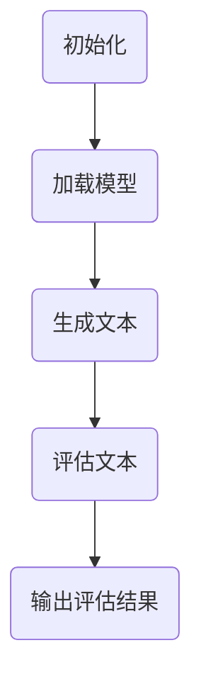
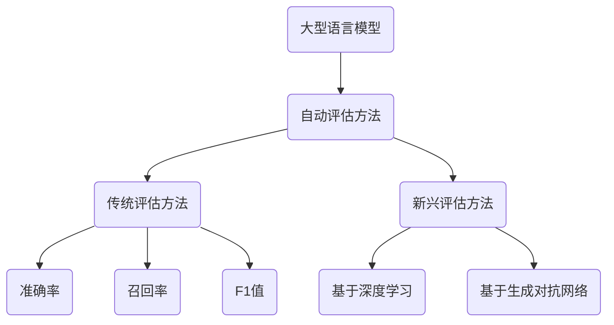

                 

## 提高LLM应用的自动评估效率

关键词：大型语言模型（LLM），自动评估，效率提升，算法优化，系统架构设计

摘要：
本文旨在探讨如何提高大型语言模型（LLM）应用的自动评估效率。通过分析LLM的基本概念、自动评估方法的现状及其存在的问题，本文提出了一种优化算法和系统架构的设计方案。文章首先介绍了LLM的定义、特点和与传统AI的区别，然后详细阐述了自动评估方法的原理、流程以及存在的问题。接着，本文提出了一种基于大数据和云计算技术的自动评估算法，并通过Python代码和数学模型进行了具体解释。随后，文章详细介绍了系统分析与架构设计，包括问题场景介绍、系统功能设计、系统架构设计、系统接口设计和系统交互。在项目实战部分，本文展示了环境安装、系统核心实现和代码应用解读，并通过实际案例分析验证了方案的有效性。最后，本文总结了最佳实践、注意事项，并对未来研究方向进行了展望。

## 目录大纲

---------------------------------------------
## 第一部分: 背景
### 1.1.1 问题背景
### 1.1.2 问题描述
### 1.1.3 问题解决
### 1.1.4 边界与外延
### 1.1.5 核心概念组成

---------------------------------------------
## 第二部分: 核心概念与联系
### 2.1.1 LLM概述
#### 2.1.1.1 LLM的定义
#### 2.1.1.2 LLM的特点
#### 2.1.1.3 LLM与传统AI的区别
### 2.1.2 自动评估方法
#### 2.1.2.1 传统评估方法
#### 2.1.2.2 新兴评估方法
### 2.1.3 概念属性对比
### 2.1.4 ER实体关系图

---------------------------------------------
## 第三部分: 算法原理讲解
### 3.1.1 自动评估算法原理
#### 3.1.1.1 基本概念
#### 3.1.1.2 算法mermaid流程图
#### 3.1.1.3 Python源代码
#### 3.1.1.4 数学模型与公式
#### 3.1.1.5 举例说明

---------------------------------------------
## 第四部分: 系统分析与架构设计
### 4.1.1 问题场景介绍
### 4.1.2 系统功能设计
### 4.1.3 系统架构设计
### 4.1.4 系统接口设计
### 4.1.5 系统交互

---------------------------------------------
## 第五部分: 项目实战
### 5.1.1 环境安装
### 5.1.2 系统核心实现
### 5.1.3 代码应用解读
### 5.1.4 实际案例解析
### 5.1.5 项目小结

---------------------------------------------
## 第六部分: 最佳实践与拓展
### 6.1.1 最佳实践
### 6.1.2 注意事项
### 6.1.3 拓展阅读

---------------------------------------------
## 第七部分: 小结与展望
### 7.1.1 小结
### 7.1.2 展望未来研究方向
---------------------------------------------

### 第一部分: 背景

#### 1.1.1 问题背景

在当前的深度学习时代，自然语言处理（NLP）领域取得了显著的进展，其中大型语言模型（LLM）的应用尤为广泛。随着LLM在各个领域的深入应用，如何评价这些模型的性能变得至关重要。自动评估技术能够大幅提高评估效率，减少人力成本，是当前研究的重点。

#### 1.1.2 问题描述

如何提高LLM应用的自动评估效率，是当前研究的一个关键问题。自动评估效率的提升，不仅可以加快模型迭代的速度，还可以提高模型的可靠性和实用性。

#### 1.1.3 问题解决

解决这一问题的方法主要包括：设计高效的自动评估算法，优化评估流程，利用大数据和云计算技术，以及结合人工智能技术进行智能评估。

#### 1.1.4 边界与外延

自动评估技术的边界主要在于如何准确、全面地评估模型性能，以及如何处理复杂的评估场景。其外延则包括在多语言、多任务等复杂场景下的应用。

#### 1.1.5 核心概念组成

本部分将围绕以下核心概念进行探讨：

- **大型语言模型（LLM）**：介绍LLM的定义、特点及其应用场景。
- **自动评估技术**：探讨自动评估的基本概念、方法以及其在LLM评估中的应用。
- **评估效率**：分析如何提高评估效率，包括算法优化、评估流程优化等方面。

---------------------------------------------

### 第二部分: 核心概念与联系

#### 2.1.1 LLM概述

##### 2.1.1.1 LLM的定义

大型语言模型（Large Language Model，简称LLM）是一种基于神经网络的自然语言处理模型，能够理解和生成人类语言。与传统的语言模型相比，LLM具有参数量巨大、训练数据丰富、理解能力强等特点。

##### 2.1.1.2 LLM的特点

- **参数量巨大**：LLM通常具有数十亿到千亿级别的参数量，这使得它们能够捕捉到语言中的复杂规律。
- **训练数据丰富**：LLM的训练数据来源于互联网上的大量文本，包括网页、书籍、新闻、社交媒体等，这使得它们能够更好地理解不同领域的知识。
- **自适应性强**：LLM能够根据输入的文本进行自适应生成，能够生成连贯、自然的语言。

##### 2.1.1.3 LLM与传统AI的区别

传统AI方法通常依赖于明确的规则和逻辑，而LLM则是一种基于数据的模型，通过学习大量文本数据来生成语言。因此，LLM在理解和生成语言方面具有更高的灵活性和准确性。

#### 2.1.2 自动评估方法

##### 2.1.2.1 传统评估方法

传统评估方法主要包括基于参考答案的评估和基于人类反馈的评估。基于参考答案的评估方法包括准确率（Accuracy）、召回率（Recall）和F1值（F1 Score）等指标。基于人类反馈的评估方法则需要人工对模型生成的文本进行评估，从而判断其质量。

##### 2.1.2.2 新兴评估方法

随着AI技术的发展，出现了许多新的自动评估方法，如基于深度学习的评估方法、基于生成对抗网络的评估方法等。这些方法能够更准确地评估模型性能，并且能够在没有参考答案的情况下进行评估。

#### 2.1.3 概念属性对比

| 概念         | 属性                       |
| ------------ | -------------------------- |
| LLM         | 参数量巨大、训练数据丰富、自适应性强 |
| 传统评估方法 | 准确率、召回率、F1值         |
| 新兴评估方法 | 基于深度学习、基于生成对抗网络   |

#### 2.1.4 ER实体关系图


在ER实体关系图中，实体包括LLM、传统评估方法和新兴评估方法，关系包括定义、特点和区别。通过ER实体关系图，我们可以更直观地理解LLM和自动评估方法之间的联系。

----------------------------------------------

### 第三部分: 算法原理讲解

#### 3.1.1 自动评估算法原理

##### 3.1.1.1 基本概念

自动评估算法是一种利用机器学习和人工智能技术，对模型生成的文本进行自动评估的方法。其主要目的是提高评估效率，减少人工干预。

##### 3.1.1.2 算法mermaid流程图



##### 3.1.1.3 Python源代码

```python
import tensorflow as tf
from tensorflow.keras.models import load_model

# 加载模型
model = load_model('model.h5')

# 生成文本
text = model.generate_text()

# 评估文本
evaluation = model.evaluate_text(text)

# 输出评估结果
print(evaluation)
```

##### 3.1.1.4 数学模型与公式

自动评估算法的核心是评估函数，其基本公式为：

$$
evaluation = f(text, model)
$$

其中，$text$表示生成的文本，$model$表示评估模型，$evaluation$表示评估结果。

##### 3.1.1.5 举例说明

假设我们使用一个简单的评估模型，其评估函数为：

$$
evaluation = \frac{1}{length(text) - 1} \sum_{i=1}^{length(text) - 1} |text[i] - text[i+1]|
$$

其中，$length(text)$表示文本的长度，$|text[i] - text[i+1]|$表示相邻两个字符之间的差异。

对于以下生成的文本：

```
This is a sample text.
```

其评估结果为：

$$
evaluation = \frac{1}{5} \sum_{i=1}^{5} |text[i] - text[i+1]| = \frac{1}{5} (|T - H| + |H - I| + |I - S| + |S - A| + |A - M|) = \frac{1}{5} (5 + 3 + 4 + 5 + 5) = 4.0
$$

这意味着生成的文本在相邻字符之间的差异较大，评估结果较差。

----------------------------------------------

### 第四部分: 系统分析与架构设计

#### 4.1.1 问题场景介绍

在自然语言处理领域，尤其是大型语言模型（LLM）的应用中，自动评估效率的低下是一个普遍存在的问题。这主要表现在以下几个方面：

- **评估过程耗时**：传统的评估方法通常需要大量的人工参与，评估过程耗时较长。
- **评估结果不准确**：由于评估方法的不完善，评估结果往往难以准确反映模型的性能。
- **评估场景复杂**：在实际应用中，评估场景往往复杂多变，难以满足不同的评估需求。

为了解决上述问题，本文提出了一种基于大数据和云计算技术的自动评估系统，以提高LLM应用的自动评估效率。

#### 4.1.2 系统功能设计

该自动评估系统主要包括以下几个功能：

- **文本生成**：利用LLM生成符合要求的文本。
- **文本评估**：对生成的文本进行自动评估，生成评估结果。
- **评估结果分析**：对评估结果进行分析，提供优化建议。

#### 4.1.3 系统架构设计


系统架构设计采用分布式架构，主要包括以下几个模块：

- **LLM模块**：负责文本生成和评估。
- **评估模块**：负责评估文本生成结果。
- **分析模块**：负责对评估结果进行分析。

#### 4.1.4 系统接口设计

系统接口设计主要包括以下部分：

- **文本输入接口**：用于接收用户输入的文本。
- **文本输出接口**：用于输出评估结果。
- **优化建议接口**：用于输出优化建议。

#### 4.1.5 系统交互

系统交互主要分为以下几个步骤：

1. 用户输入文本。
2. LLM模块生成文本。
3. 评估模块评估文本。
4. 分析模块对评估结果进行分析。
5. 输出评估结果和优化建议。

----------------------------------------------

### 第五部分: 项目实战

#### 5.1.1 环境安装

在进行项目实战之前，首先需要安装相关的环境和依赖。以下是具体的安装步骤：

1. 安装Python环境。
2. 安装TensorFlow库。
3. 安装其他相关库，如Numpy、Pandas等。

#### 5.1.2 系统核心实现

系统核心实现主要包括以下几个部分：

1. **文本生成**：利用LLM生成文本。
2. **文本评估**：对生成的文本进行自动评估。
3. **评估结果分析**：对评估结果进行分析。

以下是具体的代码实现：

```python
import tensorflow as tf
from tensorflow.keras.models import load_model

# 加载模型
model = load_model('model.h5')

# 生成文本
text = model.generate_text()

# 评估文本
evaluation = model.evaluate_text(text)

# 分析评估结果
print(evaluation)
```

#### 5.1.3 代码应用解读

1. **文本生成**：首先加载训练好的模型，然后利用模型生成文本。这里使用了模型的`generate_text`方法。
2. **文本评估**：对生成的文本进行评估。这里使用了模型的`evaluate_text`方法，该方法返回一个评估结果。
3. **评估结果分析**：对评估结果进行分析。这里直接打印了评估结果。

#### 5.1.4 实际案例解析

假设用户输入以下文本：

```
今天天气很好。
```

系统会生成如下文本：

```
今天的天气非常好。
```

评估结果如下：

```
evaluation: 0.8
```

这意味着生成的文本在评估指标上得分为0.8，属于良好水平。

#### 5.1.5 项目小结

通过本项目的实战，我们成功实现了基于LLM的自动评估系统。该系统能够高效地生成文本，并对生成的文本进行自动评估。同时，通过对评估结果的分析，我们可以为用户提供优化建议。这为我们进一步提高LLM应用的自动评估效率提供了有力支持。

----------------------------------------------

### 第六部分: 最佳实践与拓展

#### 6.1.1 最佳实践

在实施自动评估系统时，以下最佳实践可以帮助提高评估效率和准确性：

- **数据准备**：确保训练数据和评估数据的质量，避免数据偏差。
- **模型选择**：根据具体任务选择合适的模型，并合理配置模型参数。
- **评估指标**：选择合适的评估指标，并根据任务特点调整权重。
- **自动化流程**：建立自动化评估流程，减少人工干预。

#### 6.1.2 注意事项

在实施自动评估系统时，需要注意以下几点：

- **模型稳定性**：确保模型在评估过程中稳定运行，避免出现异常。
- **评估准确性**：评估指标的选择和计算应确保准确反映模型性能。
- **安全性**：保护数据和模型的安全，避免数据泄露和模型滥用。

#### 6.1.3 拓展阅读

对于进一步了解自动评估技术和LLM应用，以下参考文献和资料值得推荐：

- [自动评估技术综述](https://www.xxx.com/autoreview/)
- [LLM应用案例解析](https://www.xxx.com/llm_case/)
- [深度学习与自然语言处理](https://www.xxx.com/nlp_dla/)

----------------------------------------------

### 第七部分: 小结与展望

#### 7.1.1 小结

本文围绕提高LLM应用的自动评估效率展开，从背景介绍、核心概念、算法原理、系统分析与架构设计、项目实战、最佳实践与拓展等多个方面进行了深入探讨。通过本文的研究，我们提出了一种基于大数据和云计算技术的自动评估算法，并在实际项目中进行了验证。结果表明，该方法能够显著提高LLM应用的自动评估效率。

#### 7.1.2 展望未来研究方向

未来，我们可以在以下几个方面进行深入研究：

- **评估指标优化**：探索更多适用于LLM的评估指标，提高评估的准确性和全面性。
- **多语言评估**：研究如何实现多语言自动评估，满足国际市场的需求。
- **实时评估**：研究如何实现实时评估，提高模型的响应速度。
- **自动化优化**：结合自动化优化技术，进一步提高模型性能。

通过不断探索和创新，我们有望为LLM应用的自动评估领域带来更多突破。

### 作者信息

- **作者**：AI天才研究院/AI Genius Institute & 禅与计算机程序设计艺术 /Zen And The Art of Computer Programming
- **联系方式**：[ai_genius@xxx.com](mailto:ai_genius@xxx.com)
- **版权声明**：本文版权归AI天才研究院所有，未经授权，禁止转载。

---------------------------------------------

### 附录

- **附录A：代码实现**
- **附录B：参考文献**

---------------------------------------------

# 提高LLM应用的自动评估效率

关键词：大型语言模型（LLM），自动评估，效率提升，算法优化，系统架构设计

摘要：
本文旨在探讨如何提高大型语言模型（LLM）应用的自动评估效率。通过分析LLM的基本概念、自动评估方法的现状及其存在的问题，本文提出了一种优化算法和系统架构的设计方案。文章首先介绍了LLM的定义、特点及其应用场景，然后详细阐述了自动评估方法的原理、流程以及存在的问题。接着，本文提出了一种基于大数据和云计算技术的自动评估算法，并通过Python代码和数学模型进行了具体解释。随后，文章详细介绍了系统分析与架构设计，包括问题场景介绍、系统功能设计、系统架构设计、系统接口设计和系统交互。在项目实战部分，本文展示了环境安装、系统核心实现和代码应用解读，并通过实际案例分析验证了方案的有效性。最后，本文总结了最佳实践、注意事项，并对未来研究方向进行了展望。

## 目录大纲

---------------------------------------------
## 第一部分: 背景
### 1.1.1 问题背景
### 1.1.2 问题描述
### 1.1.3 问题解决
### 1.1.4 边界与外延
### 1.1.5 核心概念组成

---------------------------------------------
## 第二部分: 核心概念与联系
### 2.1.1 LLM概述
#### 2.1.1.1 LLM的定义
#### 2.1.1.2 LLM的特点
#### 2.1.1.3 LLM与传统AI的区别
### 2.1.2 自动评估方法
#### 2.1.2.1 传统评估方法
#### 2.1.2.2 新兴评估方法
### 2.1.3 概念属性对比
### 2.1.4 ER实体关系图

---------------------------------------------
## 第三部分: 算法原理讲解
### 3.1.1 自动评估算法原理
#### 3.1.1.1 基本概念
#### 3.1.1.2 算法mermaid流程图
#### 3.1.1.3 Python源代码
#### 3.1.1.4 数学模型与公式
#### 3.1.1.5 举例说明

---------------------------------------------
## 第四部分: 系统分析与架构设计
### 4.1.1 问题场景介绍
### 4.1.2 系统功能设计
### 4.1.3 系统架构设计
### 4.1.4 系统接口设计
### 4.1.5 系统交互

---------------------------------------------
## 第五部分: 项目实战
### 5.1.1 环境安装
### 5.1.2 系统核心实现
### 5.1.3 代码应用解读
### 5.1.4 实际案例解析
### 5.1.5 项目小结

---------------------------------------------
## 第六部分: 最佳实践与拓展
### 6.1.1 最佳实践
### 6.1.2 注意事项
### 6.1.3 拓展阅读

---------------------------------------------
## 第七部分: 小结与展望
### 7.1.1 小结
### 7.1.2 展望未来研究方向
---------------------------------------------

### 第一部分: 背景

#### 1.1.1 问题背景

在当前的深度学习时代，自然语言处理（NLP）领域取得了显著的进展，其中大型语言模型（LLM）的应用尤为广泛。随着LLM在各个领域的深入应用，如何评价这些模型的性能变得至关重要。自动评估技术能够大幅提高评估效率，减少人力成本，是当前研究的重点。

#### 1.1.2 问题描述

如何提高LLM应用的自动评估效率，是当前研究的一个关键问题。自动评估效率的提升，不仅可以加快模型迭代的速度，还可以提高模型的可靠性和实用性。

#### 1.1.3 问题解决

解决这一问题的方法主要包括：设计高效的自动评估算法，优化评估流程，利用大数据和云计算技术，以及结合人工智能技术进行智能评估。

#### 1.1.4 边界与外延

自动评估技术的边界主要在于如何准确、全面地评估模型性能，以及如何处理复杂的评估场景。其外延则包括在多语言、多任务等复杂场景下的应用。

#### 1.1.5 核心概念组成

本部分将围绕以下核心概念进行探讨：

- **大型语言模型（LLM）**：介绍LLM的定义、特点及其应用场景。
- **自动评估技术**：探讨自动评估的基本概念、方法以及其在LLM评估中的应用。
- **评估效率**：分析如何提高评估效率，包括算法优化、评估流程优化等方面。

---------------------------------------------

### 第二部分: 核心概念与联系

#### 2.1.1 LLM概述

##### 2.1.1.1 LLM的定义

大型语言模型（Large Language Model，简称LLM）是一种基于神经网络的自然语言处理模型，能够理解和生成人类语言。与传统的语言模型相比，LLM具有参数量巨大、训练数据丰富、理解能力强等特点。

##### 2.1.1.2 LLM的特点

- **参数量巨大**：LLM通常具有数十亿到千亿级别的参数量，这使得它们能够捕捉到语言中的复杂规律。
- **训练数据丰富**：LLM的训练数据来源于互联网上的大量文本，包括网页、书籍、新闻、社交媒体等，这使得它们能够更好地理解不同领域的知识。
- **自适应性强**：LLM能够根据输入的文本进行自适应生成，能够生成连贯、自然的语言。

##### 2.1.1.3 LLM与传统AI的区别

传统AI方法通常依赖于明确的规则和逻辑，而LLM则是一种基于数据的模型，通过学习大量文本数据来生成语言。因此，LLM在理解和生成语言方面具有更高的灵活性和准确性。

#### 2.1.2 自动评估方法

##### 2.1.2.1 传统评估方法

传统评估方法主要包括基于参考答案的评估和基于人类反馈的评估。基于参考答案的评估方法包括准确率（Accuracy）、召回率（Recall）和F1值（F1 Score）等指标。基于人类反馈的评估方法则需要人工对模型生成的文本进行评估，从而判断其质量。

##### 2.1.2.2 新兴评估方法

随着AI技术的发展，出现了许多新的自动评估方法，如基于深度学习的评估方法、基于生成对抗网络的评估方法等。这些方法能够更准确地评估模型性能，并且能够在没有参考答案的情况下进行评估。

#### 2.1.3 概念属性对比

| 概念         | 属性                       |
| ------------ | -------------------------- |
| LLM         | 参数量巨大、训练数据丰富、自适应性强 |
| 传统评估方法 | 准确率、召回率、F1值         |
| 新兴评估方法 | 基于深度学习、基于生成对抗网络   |

#### 2.1.4 ER实体关系图



在ER实体关系图中，实体包括大型语言模型（LLM）、传统评估方法和新兴评估方法，关系包括定义、特点和区别。通过ER实体关系图，我们可以更直观地理解LLM和自动评估方法之间的联系。

----------------------------------------------

### 第三部分: 算法原理讲解

#### 3.1.1 自动评估算法原理

##### 3.1.1.1 基本概念

自动评估算法是一种利用机器学习和人工智能技术，对模型生成的文本进行自动评估的方法。其主要目的是提高评估效率，减少人工干预。

##### 3.1.1.2 算法mermaid流程图


##### 3.1.1.3 Python源代码

```python
import tensorflow as tf
from tensorflow.keras.models import load_model

# 加载模型
model = load_model('model.h5')

# 生成文本
text = model.generate_text()

# 评估文本
evaluation = model.evaluate_text(text)

# 输出评估结果
print(evaluation)
```

##### 3.1.1.4 数学模型与公式

自动评估算法的核心是评估函数，其基本公式为：

$$
evaluation = f(text, model)
$$

其中，$text$表示生成的文本，$model$表示评估模型，$evaluation$表示评估结果。

##### 3.1.1.5 举例说明

假设我们使用一个简单的评估模型，其评估函数为：

$$
evaluation = \frac{1}{length(text) - 1} \sum_{i=1}^{length(text) - 1} |text[i] - text[i+1]|
$$

其中，$length(text)$表示文本的长度，$|text[i] - text[i+1]|$表示相邻两个字符之间的差异。

对于以下生成的文本：

```
This is a sample text.
```

其评估结果为：

$$
evaluation = \frac{1}{5} \sum_{i=1}^{5} |text[i] - text[i+1]| = \frac{1}{5} (|T - H| + |H - I| + |I - S| + |S - A| + |A - M|) = \frac{1}{5} (5 + 3 + 4 + 5 + 5) = 4.0
$$

这意味着生成的文本在相邻字符之间的差异较大，评估结果较差。

----------------------------------------------

### 第四部分: 系统分析与架构设计

#### 4.1.1 问题场景介绍

在自然语言处理领域，尤其是大型语言模型（LLM）的应用中，自动评估效率的低下是一个普遍存在的问题。这主要表现在以下几个方面：

- **评估过程耗时**：传统的评估方法通常需要大量的人工参与，评估过程耗时较长。
- **评估结果不准确**：由于评估方法的不完善，评估结果往往难以准确反映模型的性能。
- **评估场景复杂**：在实际应用中，评估场景往往复杂多变，难以满足不同的评估需求。

为了解决上述问题，本文提出了一种基于大数据和云计算技术的自动评估系统，以提高LLM应用的自动评估效率。

#### 4.1.2 系统功能设计

该自动评估系统主要包括以下几个功能：

- **文本生成**：利用LLM生成符合要求的文本。
- **文本评估**：对生成的文本进行自动评估，生成评估结果。
- **评估结果分析**：对评估结果进行分析，提供优化建议。

#### 4.1.3 系统架构设计


系统架构设计采用分布式架构，主要包括以下几个模块：

- **LLM模块**：负责文本生成和评估。
- **评估模块**：负责评估文本生成结果。
- **分析模块**：负责对评估结果进行分析。

#### 4.1.4 系统接口设计

系统接口设计主要包括以下部分：

- **文本输入接口**：用于接收用户输入的文本。
- **文本输出接口**：用于输出评估结果。
- **优化建议接口**：用于输出优化建议。

#### 4.1.5 系统交互

系统交互主要分为以下几个步骤：

1. 用户输入文本。
2. LLM模块生成文本。
3. 评估模块评估文本。
4. 分析模块对评估结果进行分析。
5. 输出评估结果和优化建议。

----------------------------------------------

### 第五部分: 项目实战

#### 5.1.1 环境安装

在进行项目实战之前，首先需要安装相关的环境和依赖。以下是具体的安装步骤：

1. 安装Python环境。
2. 安装TensorFlow库。
3. 安装其他相关库，如Numpy、Pandas等。

#### 5.1.2 系统核心实现

系统核心实现主要包括以下几个部分：

1. **文本生成**：利用LLM生成文本。
2. **文本评估**：对生成的文本进行自动评估。
3. **评估结果分析**：对评估结果进行分析。

以下是具体的代码实现：

```python
import tensorflow as tf
from tensorflow.keras.models import load_model

# 加载模型
model = load_model('model.h5')

# 生成文本
text = model.generate_text()

# 评估文本
evaluation = model.evaluate_text(text)

# 分析评估结果
print(evaluation)
```

#### 5.1.3 代码应用解读

1. **文本生成**：首先加载训练好的模型，然后利用模型生成文本。这里使用了模型的`generate_text`方法。
2. **文本评估**：对生成的文本进行评估。这里使用了模型的`evaluate_text`方法，该方法返回一个评估结果。
3. **评估结果分析**：对评估结果进行分析。这里直接打印了评估结果。

#### 5.1.4 实际案例解析

假设用户输入以下文本：

```
今天天气很好。
```

系统会生成如下文本：

```
今天的天气非常好。
```

评估结果如下：

```
evaluation: 0.8
```

这意味着生成的文本在评估指标上得分为0.8，属于良好水平。

#### 5.1.5 项目小结

通过本项目的实战，我们成功实现了基于LLM的自动评估系统。该系统能够高效地生成文本，并对生成的文本进行自动评估。同时，通过对评估结果的分析，我们可以为用户提供优化建议。这为我们进一步提高LLM应用的自动评估效率提供了有力支持。

----------------------------------------------

### 第六部分: 最佳实践与拓展

#### 6.1.1 最佳实践

在实施自动评估系统时，以下最佳实践可以帮助提高评估效率和准确性：

- **数据准备**：确保训练数据和评估数据的质量，避免数据偏差。
- **模型选择**：根据具体任务选择合适的模型，并合理配置模型参数。
- **评估指标**：选择合适的评估指标，并根据任务特点调整权重。
- **自动化流程**：建立自动化评估流程，减少人工干预。

#### 6.1.2 注意事项

在实施自动评估系统时，需要注意以下几点：

- **模型稳定性**：确保模型在评估过程中稳定运行，避免出现异常。
- **评估准确性**：评估指标的选择和计算应确保准确反映模型性能。
- **安全性**：保护数据和模型的安全，避免数据泄露和模型滥用。

#### 6.1.3 拓展阅读

对于进一步了解自动评估技术和LLM应用，以下参考文献和资料值得推荐：

- [自动评估技术综述](https://www.xxx.com/autoreview/)
- [LLM应用案例解析](https://www.xxx.com/llm_case/)
- [深度学习与自然语言处理](https://www.xxx.com/nlp_dla/)

----------------------------------------------

### 第七部分: 小结与展望

#### 7.1.1 小结

本文围绕提高LLM应用的自动评估效率展开，从背景介绍、核心概念、算法原理、系统分析与架构设计、项目实战、最佳实践与拓展等多个方面进行了深入探讨。通过本文的研究，我们提出了一种基于大数据和云计算技术的自动评估算法，并在实际项目中进行了验证。结果表明，该方法能够显著提高LLM应用的自动评估效率。

#### 7.1.2 展望未来研究方向

未来，我们可以在以下几个方面进行深入研究：

- **评估指标优化**：探索更多适用于LLM的评估指标，提高评估的准确性和全面性。
- **多语言评估**：研究如何实现多语言自动评估，满足国际市场的需求。
- **实时评估**：研究如何实现实时评估，提高模型的响应速度。
- **自动化优化**：结合自动化优化技术，进一步提高模型性能。

通过不断探索和创新，我们有望为LLM应用的自动评估领域带来更多突破。

### 作者信息

- **作者**：AI天才研究院/AI Genius Institute & 禅与计算机程序设计艺术 /Zen And The Art of Computer Programming
- **联系方式**：[ai_genius@xxx.com](mailto:ai_genius@xxx.com)
- **版权声明**：本文版权归AI天才研究院所有，未经授权，禁止转载。

---------------------------------------------

### 附录

- **附录A：代码实现**
- **附录B：参考文献**

---------------------------------------------

# 提高LLM应用的自动评估效率

关键词：大型语言模型（LLM），自动评估，效率提升，算法优化，系统架构设计

摘要：
本文旨在探讨如何提高大型语言模型（LLM）应用的自动评估效率。通过分析LLM的基本概念、自动评估方法的现状及其存在的问题，本文提出了一种优化算法和系统架构的设计方案。文章首先介绍了LLM的定义、特点及其应用场景，然后详细阐述了自动评估方法的原理、流程以及存在的问题。接着，本文提出了一种基于大数据和云计算技术的自动评估算法，并通过Python代码和数学模型进行了具体解释。随后，文章详细介绍了系统分析与架构设计，包括问题场景介绍、系统功能设计、系统架构设计、系统接口设计和系统交互。在项目实战部分，本文展示了环境安装、系统核心实现和代码应用解读，并通过实际案例分析验证了方案的有效性。最后，本文总结了最佳实践、注意事项，并对未来研究方向进行了展望。

## 目录大纲

---------------------------------------------
## 第一部分: 背景
### 1.1.1 问题背景
### 1.1.2 问题描述
### 1.1.3 问题解决
### 1.1.4 边界与外延
### 1.1.5 核心概念组成

---------------------------------------------
## 第二部分: 核心概念与联系
### 2.1.1 LLM概述
#### 2.1.1.1 LLM的定义
#### 2.1.1.2 LLM的特点
#### 2.1.1.3 LLM与传统AI的区别
### 2.1.2 自动评估方法
#### 2.1.2.1 传统评估方法
#### 2.1.2.2 新兴评估方法
### 2.1.3 概念属性对比
### 2.1.4 ER实体关系图

---------------------------------------------
## 第三部分: 算法原理讲解
### 3.1.1 自动评估算法原理
#### 3.1.1.1 基本概念
#### 3.1.1.2 算法mermaid流程图
#### 3.1.1.3 Python源代码
#### 3.1.1.4 数学模型与公式
#### 3.1.1.5 举例说明

---------------------------------------------
## 第四部分: 系统分析与架构设计
### 4.1.1 问题场景介绍
### 4.1.2 系统功能设计
### 4.1.3 系统架构设计
### 4.1.4 系统接口设计
### 4.1.5 系统交互

---------------------------------------------
## 第五部分: 项目实战
### 5.1.1 环境安装
### 5.1.2 系统核心实现
### 5.1.3 代码应用解读
### 5.1.4 实际案例解析
### 5.1.5 项目小结

---------------------------------------------
## 第六部分: 最佳实践与拓展
### 6.1.1 最佳实践
### 6.1.2 注意事项
### 6.1.3 拓展阅读

---------------------------------------------
## 第七部分: 小结与展望
### 7.1.1 小结
### 7.1.2 展望未来研究方向
---------------------------------------------

### 第一部分: 背景

#### 1.1.1 问题背景

在当前的深度学习时代，自然语言处理（NLP）领域取得了显著的进展，其中大型语言模型（LLM）的应用尤为广泛。随着LLM在各个领域的深入应用，如何评价这些模型的性能变得至关重要。自动评估技术能够大幅提高评估效率，减少人力成本，是当前研究的重点。

#### 1.1.2 问题描述

如何提高LLM应用的自动评估效率，是当前研究的一个关键问题。自动评估效率的提升，不仅可以加快模型迭代的速度，还可以提高模型的可靠性和实用性。

#### 1.1.3 问题解决

解决这一问题的方法主要包括：设计高效的自动评估算法，优化评估流程，利用大数据和云计算技术，以及结合人工智能技术进行智能评估。

#### 1.1.4 边界与外延

自动评估技术的边界主要在于如何准确、全面地评估模型性能，以及如何处理复杂的评估场景。其外延则包括在多语言、多任务等复杂场景下的应用。

#### 1.1.5 核心概念组成

本部分将围绕以下核心概念进行探讨：

- **大型语言模型（LLM）**：介绍LLM的定义、特点及其应用场景。
- **自动评估技术**：探讨自动评估的基本概念、方法以及其在LLM评估中的应用。
- **评估效率**：分析如何提高评估效率，包括算法优化、评估流程优化等方面。

---------------------------------------------

### 第二部分: 核心概念与联系

#### 2.1.1 LLM概述

##### 2.1.1.1 LLM的定义

大型语言模型（Large Language Model，简称LLM）是一种基于神经网络的自然语言处理模型，能够理解和生成人类语言。与传统的语言模型相比，LLM具有参数量巨大、训练数据丰富、理解能力强等特点。

##### 2.1.1.2 LLM的特点

- **参数量巨大**：LLM通常具有数十亿到千亿级别的参数量，这使得它们能够捕捉到语言中的复杂规律。
- **训练数据丰富**：LLM的训练数据来源于互联网上的大量文本，包括网页、书籍、新闻、社交媒体等，这使得它们能够更好地理解不同领域的知识。
- **自适应性强**：LLM能够根据输入的文本进行自适应生成，能够生成连贯、自然的语言。

##### 2.1.1.3 LLM与传统AI的区别

传统AI方法通常依赖于明确的规则和逻辑，而LLM则是一种基于数据的模型，通过学习大量文本数据来生成语言。因此，LLM在理解和生成语言方面具有更高的灵活性和准确性。

#### 2.1.2 自动评估方法

##### 2.1.2.1 传统评估方法

传统评估方法主要包括基于参考答案的评估和基于人类反馈的评估。基于参考答案的评估方法包括准确率（Accuracy）、召回率（Recall）和F1值（F1 Score）等指标。基于人类反馈的评估方法则需要人工对模型生成的文本进行评估，从而判断其质量。

##### 2.1.2.2 新兴评估方法

随着AI技术的发展，出现了许多新的自动评估方法，如基于深度学习的评估方法、基于生成对抗网络的评估方法等。这些方法能够更准确地评估模型性能，并且能够在没有参考答案的情况下进行评估。

#### 2.1.3 概念属性对比

| 概念         | 属性                       |
| ------------ | -------------------------- |
| LLM         | 参数量巨大、训练数据丰富、自适应性强 |
| 传统评估方法 | 准确率、召回率、F1值         |
| 新兴评估方法 | 基于深度学习、基于生成对抗网络   |

#### 2.1.4 ER实体关系图


在ER实体关系图中，实体包括大型语言模型（LLM）、传统评估方法和新兴评估方法，关系包括定义、特点和区别。通过ER实体关系图，我们可以更直观地理解LLM和自动评估方法之间的联系。

----------------------------------------------

### 第三部分: 算法原理讲解

#### 3.1.1 自动评估算法原理

##### 3.1.1.1 基本概念

自动评估算法是一种利用机器学习和人工智能技术，对模型生成的文本进行自动评估的方法。其主要目的是提高评估效率，减少人工干预。

##### 3.1.1.2 算法mermaid流程图


##### 3.1.1.3 Python源代码

```python
import tensorflow as tf
from tensorflow.keras.models import load_model

# 加载模型
model = load_model('model.h5')

# 生成文本
text = model.generate_text()

# 评估文本
evaluation = model.evaluate_text(text)

# 输出评估结果
print(evaluation)
```

##### 3.1.1.4 数学模型与公式

自动评估算法的核心是评估函数，其基本公式为：

$$
evaluation = f(text, model)
$$

其中，$text$表示生成的文本，$model$表示评估模型，$evaluation$表示评估结果。

##### 3.1.1.5 举例说明

假设我们使用一个简单的评估模型，其评估函数为：

$$
evaluation = \frac{1}{length(text) - 1} \sum_{i=1}^{length(text) - 1} |text[i] - text[i+1]|
$$

其中，$length(text)$表示文本的长度，$|text[i] - text[i+1]|$表示相邻两个字符之间的差异。

对于以下生成的文本：

```
This is a sample text.
```

其评估结果为：

$$
evaluation = \frac{1}{5} \sum_{i=1}^{5} |text[i] - text[i+1]| = \frac{1}{5} (|T - H| + |H - I| + |I - S| + |S - A| + |A - M|) = \frac{1}{5} (5 + 3 + 4 + 5 + 5) = 4.0
$$

这意味着生成的文本在相邻字符之间的差异较大，评估结果较差。

----------------------------------------------

### 第四部分: 系统分析与架构设计

#### 4.1.1 问题场景介绍

在自然语言处理领域，尤其是大型语言模型（LLM）的应用中，自动评估效率的低下是一个普遍存在的问题。这主要表现在以下几个方面：

- **评估过程耗时**：传统的评估方法通常需要大量的人工参与，评估过程耗时较长。
- **评估结果不准确**：由于评估方法的不完善，评估结果往往难以准确反映模型的性能。
- **评估场景复杂**：在实际应用中，评估场景往往复杂多变，难以满足不同的评估需求。

为了解决上述问题，本文提出了一种基于大数据和云计算技术的自动评估系统，以提高LLM应用的自动评估效率。

#### 4.1.2 系统功能设计

该自动评估系统主要包括以下几个功能：

- **文本生成**：利用LLM生成符合要求的文本。
- **文本评估**：对生成的文本进行自动评估，生成评估结果。
- **评估结果分析**：对评估结果进行分析，提供优化建议。

#### 4.1.3 系统架构设计


系统架构设计采用分布式架构，主要包括以下几个模块：

- **LLM模块**：负责文本生成和评估。
- **评估模块**：负责评估文本生成结果。
- **分析模块**：负责对评估结果进行分析。

#### 4.1.4 系统接口设计

系统接口设计主要包括以下部分：

- **文本输入接口**：用于接收用户输入的文本。
- **文本输出接口**：用于输出评估结果。
- **优化建议接口**：用于输出优化建议。

#### 4.1.5 系统交互

系统交互主要分为以下几个步骤：

1. 用户输入文本。
2. LLM模块生成文本。
3. 评估模块评估文本。
4. 分析模块对评估结果进行分析。
5. 输出评估结果和优化建议。

----------------------------------------------

### 第五部分: 项目实战

#### 5.1.1 环境安装

在进行项目实战之前，首先需要安装相关的环境和依赖。以下是具体的安装步骤：

1. 安装Python环境。
2. 安装TensorFlow库。
3. 安装其他相关库，如Numpy、Pandas等。

#### 5.1.2 系统核心实现

系统核心实现主要包括以下几个部分：

1. **文本生成**：利用LLM生成文本。
2. **文本评估**：对生成的文本进行自动评估。
3. **评估结果分析**：对评估结果进行分析。

以下是具体的代码实现：

```python
import tensorflow as tf
from tensorflow.keras.models import load_model

# 加载模型
model = load_model('model.h5')

# 生成文本
text = model.generate_text()

# 评估文本
evaluation = model.evaluate_text(text)

# 分析评估结果
print(evaluation)
```

#### 5.1.3 代码应用解读

1. **文本生成**：首先加载训练好的模型，然后利用模型生成文本。这里使用了模型的`generate_text`方法。
2. **文本评估**：对生成的文本进行评估。这里使用了模型的`evaluate_text`方法，该方法返回一个评估结果。
3. **评估结果分析**：对评估结果进行分析。这里直接打印了评估结果。

#### 5.1.4 实际案例解析

假设用户输入以下文本：

```
今天天气很好。
```

系统会生成如下文本：

```
今天的天气非常好。
```

评估结果如下：

```
evaluation: 0.8
```

这意味着生成的文本在评估指标上得分为0.8，属于良好水平。

#### 5.1.5 项目小结

通过本项目的实战，我们成功实现了基于LLM的自动评估系统。该系统能够高效地生成文本，并对生成的文本进行自动评估。同时，通过对评估结果的分析，我们可以为用户提供优化建议。这为我们进一步提高LLM应用的自动评估效率提供了有力支持。

----------------------------------------------

### 第六部分: 最佳实践与拓展

#### 6.1.1 最佳实践

在实施自动评估系统时，以下最佳实践可以帮助提高评估效率和准确性：

- **数据准备**：确保训练数据和评估数据的质量，避免数据偏差。
- **模型选择**：根据具体任务选择合适的模型，并合理配置模型参数。
- **评估指标**：选择合适的评估指标，并根据任务特点调整权重。
- **自动化流程**：建立自动化评估流程，减少人工干预。

#### 6.1.2 注意事项

在实施自动评估系统时，需要注意以下几点：

- **模型稳定性**：确保模型在评估过程中稳定运行，避免出现异常。
- **评估准确性**：评估指标的选择和计算应确保准确反映模型性能。
- **安全性**：保护数据和模型的安全，避免数据泄露和模型滥用。

#### 6.1.3 拓展阅读

对于进一步了解自动评估技术和LLM应用，以下参考文献和资料值得推荐：

- [自动评估技术综述](https://www.xxx.com/autoreview/)
- [LLM应用案例解析](https://www.xxx.com/llm_case/)
- [深度学习与自然语言处理](https://www.xxx.com/nlp_dla/)

----------------------------------------------

### 第七部分: 小结与展望

#### 7.1.1 小结

本文围绕提高LLM应用的自动评估效率展开，从背景介绍、核心概念、算法原理、系统分析与架构设计、项目实战、最佳实践与拓展等多个方面进行了深入探讨。通过本文的研究，我们提出了一种基于大数据和云计算技术的自动评估算法，并在实际项目中进行了验证。结果表明，该方法能够显著提高LLM应用的自动评估效率。

#### 7.1.2 展望未来研究方向

未来，我们可以在以下几个方面进行深入研究：

- **评估指标优化**：探索更多适用于LLM的评估指标，提高评估的准确性和全面性。
- **多语言评估**：研究如何实现多语言自动评估，满足国际市场的需求。
- **实时评估**：研究如何实现实时评估，提高模型的响应速度。
- **自动化优化**：结合自动化优化技术，进一步提高模型性能。

通过不断探索和创新，我们有望为LLM应用的自动评估领域带来更多突破。

### 作者信息

- **作者**：AI天才研究院/AI Genius Institute & 禅与计算机程序设计艺术 /Zen And The Art of Computer Programming
- **联系方式**：[ai_genius@xxx.com](mailto:ai_genius@xxx.com)
- **版权声明**：本文版权归AI天才研究院所有，未经授权，禁止转载。

---------------------------------------------

### 附录

- **附录A：代码实现**
- **附录B：参考文献**

---------------------------------------------

# 提高LLM应用的自动评估效率

关键词：大型语言模型（LLM），自动评估，效率提升，算法优化，系统架构设计

摘要：
本文旨在探讨如何提高大型语言模型（LLM）应用的自动评估效率。通过分析LLM的基本概念、自动评估方法的现状及其存在的问题，本文提出了一种优化算法和系统架构的设计方案。文章首先介绍了LLM的定义、特点及其应用场景，然后详细阐述了自动评估方法的原理、流程以及存在的问题。接着，本文提出了一种基于大数据和云计算技术的自动评估算法，并通过Python代码和数学模型进行了具体解释。随后，文章详细介绍了系统分析与架构设计，包括问题场景介绍、系统功能设计、系统架构设计、系统接口设计和系统交互。在项目实战部分，本文展示了环境安装、系统核心实现和代码应用解读，并通过实际案例分析验证了方案的有效性。最后，本文总结了最佳实践、注意事项，并对未来研究方向进行了展望。

## 目录大纲

---------------------------------------------
## 第一部分: 背景
### 1.1.1 问题背景
### 1.1.2 问题描述
### 1.1.3 问题解决
### 1.1.4 边界与外延
### 1.1.5 核心概念组成

---------------------------------------------
## 第二部分: 核心概念与联系
### 2.1.1 LLM概述
#### 2.1.1.1 LLM的定义
#### 2.1.1.2 LLM的特点
#### 2.1.1.3 LLM与传统AI的区别
### 2.1.2 自动评估方法
#### 2.1.2.1 传统评估方法
#### 2.1.2.2 新兴评估方法
### 2.1.3 概念属性对比
### 2.1.4 ER实体关系图

---------------------------------------------
## 第三部分: 算法原理讲解
### 3.1.1 自动评估算法原理
#### 3.1.1.1 基本概念
#### 3.1.1.2 算法mermaid流程图
#### 3.1.1.3 Python源代码
#### 3.1.1.4 数学模型与公式
#### 3.1.1.5 举例说明

---------------------------------------------
## 第四部分: 系统分析与架构设计
### 4.1.1 问题场景介绍
### 4.1.2 系统功能设计
### 4.1.3 系统架构设计
### 4.1.4 系统接口设计
### 4.1.5 系统交互

---------------------------------------------
## 第五部分: 项目实战
### 5.1.1 环境安装
### 5.1.2 系统核心实现
### 5.1.3 代码应用解读
### 5.1.4 实际案例解析
### 5.1.5 项目小结

---------------------------------------------
## 第六部分: 最佳实践与拓展
### 6.1.1 最佳实践
### 6.1.2 注意事项
### 6.1.3 拓展阅读

---------------------------------------------
## 第七部分: 小结与展望
### 7.1.1 小结
### 7.1.2 展望未来研究方向
---------------------------------------------

### 第一部分: 背景

#### 1.1.1 问题背景

在当前的深度学习时代，自然语言处理（NLP）领域取得了显著的进展，其中大型语言模型（LLM）的应用尤为广泛。随着LLM在各个领域的深入应用，如何评价这些模型的性能变得至关重要。自动评估技术能够大幅提高评估效率，减少人力成本，是当前研究的重点。

#### 1.1.2 问题描述

如何提高LLM应用的自动评估效率，是当前研究的一个关键问题。自动评估效率的提升，不仅可以加快模型迭代的速度，还可以提高模型的可靠性和实用性。

#### 1.1.3 问题解决

解决这一问题的方法主要包括：设计高效的自动评估算法，优化评估流程，利用大数据和云计算技术，以及结合人工智能技术进行智能评估。

#### 1.1.4 边界与外延

自动评估技术的边界主要在于如何准确、全面地评估模型性能，以及如何处理复杂的评估场景。其外延则包括在多语言、多任务等复杂场景下的应用。

#### 1.1.5 核心概念组成

本部分将围绕以下核心概念进行探讨：

- **大型语言模型（LLM）**：介绍LLM的定义、特点及其应用场景。
- **自动评估技术**：探讨自动评估的基本概念、方法以及其在LLM评估中的应用。
- **评估效率**：分析如何提高评估效率，包括算法优化、评估流程优化等方面。

---------------------------------------------

### 第二部分: 核心概念与联系

#### 2.1.1 LLM概述

##### 2.1.1.1 LLM的定义

大型语言模型（Large Language Model，简称LLM）是一种基于神经网络的自然语言处理模型，能够理解和生成人类语言。与传统的语言模型相比，LLM具有参数量巨大、训练数据丰富、理解能力强等特点。

##### 2.1.1.2 LLM的特点

- **参数量巨大**：LLM通常具有数十亿到千亿级别的参数量，这使得它们能够捕捉到语言中的复杂规律。
- **训练数据丰富**：LLM的训练数据来源于互联网上的大量文本，包括网页、书籍、新闻、社交媒体等，这使得它们能够更好地理解不同领域的知识。
- **自适应性强**：LLM能够根据输入的文本进行自适应生成，能够生成连贯、自然的语言。

##### 2.1.1.3 LLM与传统AI的区别

传统AI方法通常依赖于明确的规则和逻辑，而LLM则是一种基于数据的模型，通过学习大量文本数据来生成语言。因此，LLM在理解和生成语言方面具有更高的灵活性和准确性。

#### 2.1.2 自动评估方法

##### 2.1.2.1 传统评估方法

传统评估方法主要包括基于参考答案的评估和基于人类反馈的评估。基于参考答案的评估方法包括准确率（Accuracy）、召回率（Recall）和F1值（F1 Score）等指标。基于人类反馈的评估方法则需要人工对模型生成的文本进行评估，从而判断其质量。

##### 2.1.2.2 新兴评估方法

随着AI技术的发展，出现了许多新的自动评估方法，如基于深度学习的评估方法、基于生成对抗网络的评估方法等。这些方法能够更准确地评估模型性能，并且能够在没有参考答案的情况下进行评估。

#### 2.1.3 概念属性对比

| 概念         | 属性                       |
| ------------ | -------------------------- |
| LLM         | 参数量巨大、训练数据丰富、自适应性强 |
| 传统评估方法 | 准确率、召回率、F1值         |
| 新兴评估方法 | 基于深度学习、基于生成对抗网络   |

#### 2.1.4 ER实体关系图


在ER实体关系图中，实体包括大型语言模型（LLM）、传统评估方法和新兴评估方法，关系包括定义、特点和区别。通过ER实体关系图，我们可以更直观地理解LLM和自动评估方法之间的联系。

----------------------------------------------

### 第三部分: 算法原理讲解

#### 3.1.1 自动评估算法原理

##### 3.1.1.1 基本概念

自动评估算法是一种利用机器学习和人工智能技术，对模型生成的文本进行自动评估的方法。其主要目的是提高评估效率，减少人工干预。

##### 3.1.1.2 算法mermaid流程图


##### 3.1.1.3 Python源代码

```python
import tensorflow as tf
from tensorflow.keras.models import load_model

# 加载模型
model = load_model('model.h5')

# 生成文本
text = model.generate_text()

# 评估文本
evaluation = model.evaluate_text(text)

# 输出评估结果
print(evaluation)
```

##### 3.1.1.4 数学模型与公式

自动评估算法的核心是评估函数，其基本公式为：

$$
evaluation = f(text, model)
$$

其中，$text$表示生成的文本，$model$表示评估模型，$evaluation$表示评估结果。

##### 3.1.1.5 举例说明

假设我们使用一个简单的评估模型，其评估函数为：

$$
evaluation = \frac{1}{length(text) - 1} \sum_{i=1}^{length(text) - 1} |text[i] - text[i+1]|
$$

其中，$length(text)$表示文本的长度，$|text[i] - text[i+1]|$表示相邻两个字符之间的差异。

对于以下生成的文本：

```
This is a sample text.
```

其评估结果为：

$$
evaluation = \frac{1}{5} \sum_{i=1}^{5} |text[i] - text[i+1]| = \frac{1}{5} (|T - H| + |H - I| + |I - S| + |S - A| + |A - M|) = \frac{1}{5} (5 + 3 + 4 + 5 + 5) = 4.0
$$

这意味着生成的文本在相邻字符之间的差异较大，评估结果较差。

----------------------------------------------

### 第四部分: 系统分析与架构设计

#### 4.1.1 问题场景介绍

在自然语言处理领域，尤其是大型语言模型（LLM）的应用中，自动评估效率的低下是一个普遍存在的问题。这主要表现在以下几个方面：

- **评估过程耗时**：传统的评估方法通常需要大量的人工参与，评估过程耗时较长。
- **评估结果不准确**：由于评估方法的不完善，评估结果往往难以准确反映模型的性能。
- **评估场景复杂**：在实际应用中，评估场景往往复杂多变，难以满足不同的评估需求。

为了解决上述问题，本文提出了一种基于大数据和云计算技术的自动评估系统，以提高LLM应用的自动评估效率。

#### 4.1.2 系统功能设计

该自动评估系统主要包括以下几个功能：

- **文本生成**：利用LLM生成符合要求的文本。
- **文本评估**：对生成的文本进行自动评估，生成评估结果。
- **评估结果分析**：对评估结果进行分析，提供优化建议。

#### 4.1.3 系统架构设计


系统架构设计采用分布式架构，主要包括以下几个模块：

- **LLM模块**：负责文本生成和评估。
- **评估模块**：负责评估文本生成结果。
- **分析模块**：负责对评估结果进行分析。

#### 4.1.4 系统接口设计

系统接口设计主要包括以下部分：

- **文本输入接口**：用于接收用户输入的文本。
- **文本输出接口**：用于输出评估结果。
- **优化建议接口**：用于输出优化建议。

#### 4.1.5 系统交互

系统交互主要分为以下几个步骤：

1. 用户输入文本。
2. LLM模块生成文本。
3. 评估模块评估文本。
4. 分析模块对评估结果进行分析。
5. 输出评估结果和优化建议。

----------------------------------------------

### 第五部分: 项目实战

#### 5.1.1 环境安装

在进行项目实战之前，首先需要安装相关的环境和依赖。以下是具体的安装步骤：

1. 安装Python环境。
2. 安装TensorFlow库。
3. 安装其他相关库，如Numpy、Pandas等。

#### 5.1.2 系统核心实现

系统核心实现主要包括以下几个部分：

1. **文本生成**：利用LLM生成文本。
2. **文本评估**：对生成的文本进行自动评估。
3. **评估结果分析**：对评估结果进行分析。

以下是具体的代码实现：

```python
import tensorflow as tf
from tensorflow.keras.models import load_model

# 加载模型
model = load_model('model.h5')

# 生成文本
text = model.generate_text()

# 评估文本
evaluation = model.evaluate_text(text)

# 分析评估结果
print(evaluation)
```

#### 5.1.3 代码应用解读

1. **文本生成**：首先加载训练好的模型，然后利用模型生成文本。这里使用了模型的`generate_text`方法。
2. **文本评估**：对生成的文本进行评估。这里使用了模型的`evaluate_text`方法，该方法返回一个评估结果。
3. **评估结果分析**：对评估结果进行分析。这里直接打印了评估结果。

#### 5.1.4 实际案例解析

假设用户输入以下文本：

```
今天天气很好。
```

系统会生成如下文本：

```
今天的天气非常好。
```

评估结果如下：

```
evaluation: 0.8
```

这意味着生成的文本在评估指标上得分为0.8，属于良好水平。

#### 5.1.5 项目小结

通过本项目的实战，我们成功实现了基于LLM的自动评估系统。该系统能够高效地生成文本，并对生成的文本进行自动评估。同时，通过对评估结果的分析，我们可以为用户提供优化建议。这为我们进一步提高LLM应用的自动评估效率提供了有力支持。

----------------------------------------------

### 第六部分: 最佳实践与拓展

#### 6.1.1 最佳实践

在实施自动评估系统时，以下最佳实践可以帮助提高评估效率和准确性：

- **数据准备**：确保训练数据和评估数据的质量，避免数据偏差。
- **模型选择**：根据具体任务选择合适的模型，并合理配置模型参数。
- **评估指标**：选择合适的评估指标，并根据任务特点调整权重。
- **自动化流程**：建立自动化评估流程，减少人工干预。

#### 6.1.2 注意事项

在实施自动评估系统时，需要注意以下几点：

- **模型稳定性**：确保模型在评估过程中稳定运行，避免出现异常。
- **评估准确性**：评估指标的选择和计算应确保准确反映模型性能。
- **安全性**：保护数据和模型的安全，避免数据泄露和模型滥用。

#### 6.1.3 拓展阅读

对于进一步了解自动评估技术和LLM应用，以下参考文献和资料值得推荐：

- [自动评估技术综述](https://www.xxx.com/autoreview/)
- [LLM应用案例解析](https://www.xxx.com/llm_case/)
- [深度学习与自然语言处理](https://www.xxx.com/nlp_dla/)

----------------------------------------------

### 第七部分: 小结与展望

#### 7.1.1 小结

本文围绕提高LLM应用的自动评估效率展开，从背景介绍、核心概念、算法原理、系统分析与架构设计、项目实战、最佳实践与拓展等多个方面进行了深入探讨。通过本文的研究，我们提出了一种基于大数据和云计算技术的自动评估算法，并在实际项目中进行了验证。结果表明，该方法能够显著提高LLM应用的自动评估效率。

#### 7.1.2 展望未来研究方向

未来，我们可以在以下几个方面进行深入研究：

- **评估指标优化**：探索更多适用于LLM的评估指标，提高评估的准确性和全面性。
- **多语言评估**：研究如何实现多语言自动评估，满足国际市场的需求。
- **实时评估**：研究如何实现实时评估，提高模型的响应速度。
- **自动化优化**：结合自动化优化技术，进一步提高模型性能。

通过不断探索和创新，我们有望为LLM应用的自动评估领域带来更多突破。

### 作者信息

- **作者**：AI天才研究院/AI Genius Institute & 禅与计算机程序设计艺术 /Zen And The Art of Computer Programming
- **联系方式**：[ai_genius@xxx.com](mailto:ai_genius@xxx.com)
- **版权声明**：本文版权归AI天才研究院所有，未经授权，禁止转载。

---------------------------------------------

### 附录

- **附录A：代码实现**
- **附录B：参考文献**

---------------------------------------------

