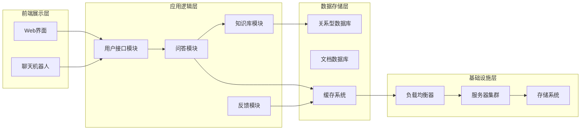
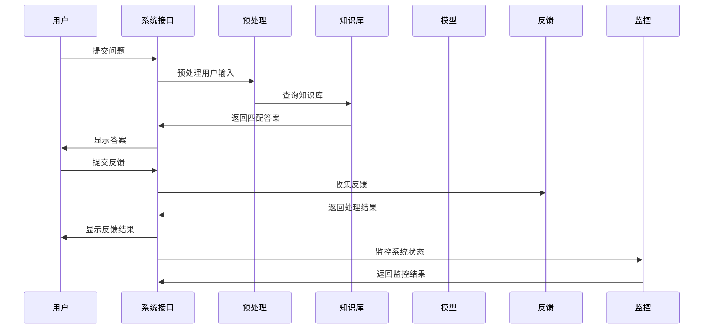

                 

### 第1章：问题背景与目标

#### 1.1.1 问题背景

语言模型（Language Model，简称LLM）作为一种重要的自然语言处理技术，在近年来取得了显著的发展。LLM能够模拟人类语言的表达方式，并在文本生成、机器翻译、对话系统等多个领域展示了强大的应用潜力。然而，随着LLM模型的复杂度和规模不断增加，其在实际应用中面临的迭代效率问题也逐渐显现。

首先，我们需要了解LLM的发展历程。自1980年代起，统计语言模型开始兴起，如N-gram模型，为后续的机器翻译和文本生成奠定了基础。进入21世纪，随着深度学习技术的蓬勃发展，神经网络语言模型如递归神经网络（RNN）、长短期记忆网络（LSTM）等相继被提出，并逐渐取代了传统模型。特别是在2018年，谷歌推出了Transformer模型，标志着基于自注意力机制的LLM进入了新的发展阶段。Transformer模型在处理长文本和生成复杂语言表达方面具有显著优势，使得LLM的应用场景进一步拓展。

然而，随着LLM的广泛应用，其在迭代过程中也遇到了一系列问题与挑战。首先，LLM模型的训练过程需要大量计算资源和时间。即使使用高性能计算平台，从模型训练到模型部署的整个过程仍然可能需要数天甚至数周的时间。这大大限制了开发者对LLM模型进行快速迭代和优化的能力。其次，LLM模型的应用场景多样，不同的应用场景对迭代效率的需求也有所不同。例如，在实时对话系统中，迭代效率的低下可能导致用户交互体验的下降。此外，LLM模型的调试和优化也相对复杂，需要大量的时间和人力投入。

#### 1.1.2 问题描述

迭代效率低下在LLM应用中主要表现为以下几个方面：

1. **训练时间长**：随着模型规模的增大，训练时间显著延长。例如，一个包含1000亿参数的大型LLM模型可能需要几天甚至几周的时间进行训练，这对于开发者来说是一个极大的挑战。

2. **部署延迟**：模型训练完成后，部署到生产环境的时间也较长。这包括模型转换、模型加载、模型推理等多个环节，任何一个环节的延迟都会影响整体迭代效率。

3. **调试困难**：在迭代过程中，开发者需要对模型进行多次调试和优化，但每次调试都需要重新训练模型，这不仅耗时，而且可能导致模型性能下降。

4. **资源消耗大**：LLM模型的训练和部署过程对计算资源和存储资源的需求极高。高性能计算平台的资源限制使得开发者难以在短时间内进行多次迭代。

这些问题的存在严重影响了LLM应用的开发效率和用户体验。为了解决这些问题，提高LLM应用迭代效率成为了当前研究与应用的重要目标。

#### 1.1.3 问题解决

工具与平台在解决LLM应用迭代效率问题中起着至关重要的作用。以下是一些常见的方法和平台：

1. **分布式训练平台**：如TensorFlow、PyTorch等，通过分布式计算技术，可以将模型训练任务分解到多个计算节点上，从而显著缩短训练时间。此外，一些云计算平台如AWS、Google Cloud也提供了强大的分布式训练能力。

2. **模型压缩与量化技术**：通过模型压缩和量化技术，可以减小模型大小，降低计算复杂度，从而加快模型训练和部署速度。例如，权重剪枝、知识蒸馏等方法已被广泛应用于模型压缩。

3. **自动化调优工具**：如Hyperopt、Ray Tune等，通过自动搜索最优的超参数，提高模型训练和调优的效率。这些工具可以在短时间内完成大量超参数组合的实验，从而找到最优的模型配置。

4. **模型推理引擎**：如TensorRT、ONNX Runtime等，提供了高效的模型推理能力，可以在生产环境中快速部署和运行模型，从而减少部署延迟。

5. **容器化与自动化部署工具**：如Docker、Kubernetes等，通过容器化和自动化部署技术，可以简化模型部署过程，提高部署效率。

#### 1.1.4 边界与外延

在讨论LLM应用迭代效率时，我们需要明确一些边界与外延：

1. **迭代效率的定义与衡量指标**：迭代效率通常指在给定时间内完成模型迭代的能力，常用的衡量指标包括模型训练时间、部署时间、调试次数等。

2. **不同类型应用对迭代效率的需求差异**：不同的应用场景对迭代效率的需求有所不同。例如，在实时对话系统中，迭代效率至关重要，而在非实时应用中，如文本生成和机器翻译，迭代效率的影响相对较小。

3. **LLM应用迭代过程的核心环节**：包括模型训练、模型优化、模型部署、模型调试等。

4. **提高迭代效率的关键要素**：包括计算资源、存储资源、模型压缩技术、自动化调优工具、模型推理引擎等。

通过明确这些边界与外延，我们可以更准确地理解和优化LLM应用的迭代效率。

#### 1.1.5 概念结构与核心要素组成

为了提高LLM应用的迭代效率，我们需要构建一个概念清晰、结构紧凑的系统，其中包含以下核心要素：

1. **计算资源管理**：合理配置和优化计算资源，确保模型训练和部署的顺利进行。

2. **模型压缩与量化**：通过压缩和量化技术，减小模型大小，降低计算复杂度。

3. **自动化调优工具**：利用自动化调优工具，提高模型训练和调优的效率。

4. **模型推理引擎**：提供高效的模型推理能力，确保模型在生产环境中的快速部署和运行。

5. **容器化与自动化部署**：通过容器化和自动化部署工具，简化模型部署过程，提高部署效率。

这些核心要素共同构成了一个完整的LLM应用迭代系统，为开发者提供了高效、便捷的迭代环境。

#### 1.2 本章小结

本章从问题背景出发，详细介绍了LLM应用在迭代过程中遇到的问题与挑战，并提出了提高迭代效率的必要性。接着，我们明确了迭代效率低下的具体表现，并探讨了工具与平台在解决这些难题中的作用。通过分析LLM应用迭代效率的定义与衡量指标，我们明确了不同类型应用对迭代效率的需求差异，为后续章节的内容奠定了基础。总结本章主要观点，我们引出了下章内容，即将对提高LLM应用迭代效率的核心概念与联系进行深入探讨。读者可以期待在下章中，我们将详细解析这些核心概念，并探索其相互之间的关系。通过逐步分析，我们将为读者提供一个清晰、系统的解决方案，助力LLM应用迭代效率的提升。

----------------------------------------------------------------

## 第2章：核心概念原理

### 2.1.1 工具与平台的定义

#### 工具的定义与类型

在LLM应用开发过程中，工具扮演着至关重要的角色。工具可以理解为用于实现特定任务的软件或硬件，它们可以极大地提升开发效率和模型性能。根据用途和功能，工具可以分为以下几类：

1. **开发工具**：包括文本编辑器、集成开发环境（IDE）、版本控制系统等，这些工具提供了便捷的代码编写、调试和版本管理功能。例如，Visual Studio Code、PyCharm等。

2. **计算工具**：如深度学习框架（TensorFlow、PyTorch）、分布式训练工具（Horovod、MXNet）等，这些工具专注于模型训练和优化，提供了高效的计算资源和算法支持。

3. **调试工具**：如模型监控工具（TensorBoard、Weave）、调试器（pdb、VS Code Debugger）等，这些工具帮助开发者定位和解决模型训练和推理中的问题。

4. **部署工具**：如容器化工具（Docker、Kubernetes）、模型推理引擎（TensorRT、ONNX Runtime）等，这些工具确保模型可以在生产环境中高效、稳定地运行。

#### 平台的定义与类型

平台则可以视为一种集成化、系统化的解决方案，它通常包含多个工具和服务，为开发者提供一个全面的开发环境。以下是一些常见的平台类型：

1. **云计算平台**：如AWS、Google Cloud、Azure等，这些平台提供了丰富的计算资源、存储服务和网络设施，开发者可以在云环境中构建、训练和部署LLM模型。

2. **深度学习平台**：如Google Colab、 Paperspace等，这些平台专门为深度学习研究和开发设计，提供了高性能计算资源和预安装的深度学习框架。

3. **模型训练平台**：如Hugging Face、TensorFlow Extended（TFX）等，这些平台提供了模型训练、部署和管理的一体化解决方案，支持自动化、高效的模型迭代流程。

4. **AI服务平台**：如Google AI Platform、AWS AI等，这些平台集成了多种AI服务，如文本分析、图像识别、语音识别等，开发者可以通过简单的API接口快速构建和部署AI应用。

### 2.1.2 工具与平台的核心特点

工具与平台在提高LLM应用迭代效率方面具有以下核心特点：

#### 工具的核心特点

1. **高效性**：工具通常经过优化，可以显著提高开发、训练和部署的效率。例如，分布式训练工具可以将训练任务分解到多个节点上，加速模型训练过程。

2. **便捷性**：工具提供了直观的用户界面和易于使用的API，降低了开发者使用门槛，提高了开发效率。例如，集成开发环境（IDE）提供了代码编辑、调试和自动补全等功能。

3. **灵活性**：工具通常支持多种编程语言和框架，开发者可以根据具体需求选择合适的工具，灵活地实现功能。

4. **可扩展性**：工具可以方便地集成到现有的开发流程中，支持扩展和定制化开发。例如，版本控制系统可以与代码库和其他工具集成，实现高效的协作开发。

#### 平台的核心特点

1. **集成性**：平台将多个工具和服务集成在一起，提供了完整的开发、训练和部署环境，简化了开发流程。例如，深度学习平台集成了计算资源、深度学习框架和自动化工具，开发者可以一站式完成模型开发。

2. **灵活性**：平台通常支持多种计算资源和模型类型，开发者可以根据需求灵活选择。例如，云计算平台提供了多种实例类型和存储方案，开发者可以根据实际需求进行配置。

3. **可靠性**：平台提供了可靠的基础设施和运维支持，确保模型的稳定运行。例如，模型训练平台提供了自动化的训练任务管理、监控和告警功能，确保模型训练过程顺利进行。

4. **可扩展性**：平台支持横向和纵向扩展，可以满足不断增长的计算需求和模型规模。例如，云计算平台可以动态调整计算资源，以应对高峰期的需求。

### 2.1.3 工具与平台与传统开发方法对比

传统开发方法通常依赖于单机、手动操作的方式，存在以下局限性和问题：

1. **计算效率低**：传统方法依赖于单机资源，无法充分利用分布式计算的优势，导致模型训练时间长。

2. **人工成本高**：传统方法需要手动配置和调整计算资源、环境变量等，增加了开发人员的负担，降低了开发效率。

3. **调试困难**：在传统方法中，模型调试和优化过程复杂，需要多次手动调整和测试，增加了开发时间和风险。

相比之下，工具与平台具有以下优势：

1. **计算效率高**：工具与平台支持分布式计算和自动化调优，可以显著缩短模型训练和部署时间。

2. **开发效率高**：工具与平台提供了直观的界面和自动化功能，降低了开发难度，提高了开发效率。

3. **调试便捷**：工具与平台提供了丰富的调试工具和监控功能，可以实时查看模型训练和部署的状态，快速定位和解决问题。

通过对比，我们可以看出，工具与平台在提高LLM应用迭代效率方面具有显著优势，可以有效解决传统开发方法中的问题，提升开发效率和模型性能。

#### 2.1.4 边界与外延

在讨论工具与平台时，我们需要明确一些边界与外延，以确保概念的准确性和应用的广泛性：

1. **工具与平台的适用范围**：工具和平台通常针对特定的应用场景和开发需求进行设计和优化，例如，深度学习平台更适合处理大规模模型训练任务，而开发工具则更适用于代码编写和调试。

2. **工具与平台的技术差异**：工具和平台在技术实现上存在差异，工具通常专注于解决特定问题，而平台则提供了一整套解决方案，包括工具、服务和基础设施。

3. **工具与平台的演进方向**：随着技术的不断发展，工具与平台也在不断演进和优化。例如，云计算平台逐渐引入了更多自动化和智能化的功能，以提升用户体验和开发效率。

通过明确这些边界与外延，我们可以更好地理解工具与平台的作用和应用场景，为后续章节的分析和讨论奠定基础。

### 2.1.5 概念结构与核心要素组成

为了深入理解LLM应用迭代过程中的工具与平台，我们需要构建一个清晰的概念结构，并明确其核心要素组成：

1. **计算资源管理**：包括计算节点调度、资源分配和负载均衡等，确保模型训练和部署的顺利进行。

2. **模型开发工具**：如深度学习框架、文本编辑器和集成开发环境（IDE），用于模型设计和开发。

3. **模型训练工具**：如分布式训练工具、自动化调优工具和模型压缩工具，用于提高模型训练效率。

4. **模型部署工具**：如容器化工具、模型推理引擎和自动化部署工具，用于模型在生产环境中的快速部署和运行。

5. **监控与调试工具**：如模型监控工具、调试器和日志分析工具，用于实时监控和调试模型性能。

通过这些核心要素的相互配合，工具与平台为开发者提供了一个高效、便捷的迭代环境，显著提升了LLM应用的开发效率。

### 2.2 本章小结

本章从工具与平台的定义出发，详细介绍了其核心特点和类型，并对比了工具与平台与传统开发方法的优势。通过明确边界与外延，我们为后续章节的分析和讨论奠定了基础。总结本章主要观点，我们将继续深入探讨LLM应用迭代效率的核心概念与联系，逐步揭示工具与平台在迭代过程中的作用和相互作用。读者可以期待在下章中，我们将进一步解析这些核心概念，并探索它们之间的联系，为提高LLM应用迭代效率提供系统化的解决方案。通过逐步分析，我们将帮助读者更好地理解LLM应用的开发过程，为实际应用提供有力支持。

----------------------------------------------------------------

## 第3章：概念属性特征对比表格

### 3.1.1 工具特征对比

在LLM应用迭代过程中，不同工具在功能、性能和适用场景方面存在显著差异。为了更直观地展示这些差异，我们可以使用表格形式对常见工具进行对比分析。以下是一个简单的工具特征对比表格：

| 工具名称       | 功能特点                   | 性能特点                         | 适用场景                   |
|--------------|--------------------------|------------------------------|--------------------------|
| TensorFlow   | 分布式训练、自动化调优   | 支持大规模模型训练             | 复杂模型开发与部署       |
| PyTorch      | 动态计算图、灵活易用     | 易于调试和实验                 | 快速原型开发和研究应用   |
| Docker       | 容器化部署、环境隔离     | 跨平台一致性、高效资源利用     | 应用部署与迁移           |
| TensorBoard  | 模型监控与可视化           | 提供丰富的可视化图表            | 模型调试与性能分析       |
| VS Code      | 代码编辑、调试、插件支持 | 开发效率高、定制化强           | 代码编写与调试           |

#### 工具特点

1. **TensorFlow**：作为业界领先的深度学习框架，TensorFlow具备强大的分布式训练能力和自动化调优工具，特别适合大规模模型的开发和部署。其性能特点在于支持异构计算和高效的GPU利用，适用于复杂模型的开发与部署。

2. **PyTorch**：PyTorch以其动态计算图和灵活易用的特性著称，开发人员可以轻松地进行模型调试和实验。其性能特点在于易于调试和优化，特别适合快速原型开发和深入研究。

3. **Docker**：Docker是一种容器化技术，可以将应用程序及其运行环境打包成独立的容器，实现环境隔离和跨平台一致性。其性能特点在于高效资源利用和快速部署，适用于应用的部署与迁移。

4. **TensorBoard**：TensorBoard是TensorFlow提供的一款模型监控与可视化工具，通过丰富的图表和指标，帮助开发者实时监控模型训练过程。其特点在于提供直观的可视化界面，适用于模型调试与性能分析。

5. **VS Code**：Visual Studio Code是一款功能强大的集成开发环境，支持多种编程语言和插件扩展。其性能特点在于开发效率高和定制化强，适用于代码编写与调试。

#### 性能特点

1. **TensorFlow**：TensorFlow在性能方面具有显著优势，支持异构计算和GPU加速，能够显著提升大规模模型的训练速度。

2. **PyTorch**：PyTorch在性能方面表现出色，其动态计算图和自动微分功能使得模型调试和优化更为高效。

3. **Docker**：Docker通过容器化技术，实现了高效的资源利用和快速的部署，适用于多种应用场景。

4. **TensorBoard**：TensorBoard提供了丰富的可视化图表和指标，能够帮助开发者实时监控模型训练过程，提升调试效率。

5. **VS Code**：VS Code在开发效率方面具有显著优势，支持多种编程语言和插件扩展，为开发者提供了便捷的开发体验。

#### 适用场景

1. **TensorFlow**：适用于复杂模型开发和大规模模型部署，特别适合需要高性能计算和大规模数据处理的应用场景。

2. **PyTorch**：适用于快速原型开发和深入研究，特别适合需要灵活性和易用性的开发场景。

3. **Docker**：适用于应用部署与迁移，特别适合需要跨平台一致性和高效资源利用的场景。

4. **TensorBoard**：适用于模型调试与性能分析，特别适合需要实时监控和可视化分析的场景。

5. **VS Code**：适用于代码编写与调试，特别适合需要高效开发体验和定制化功能的场景。

通过对比分析，我们可以更清晰地了解不同工具在LLM应用迭代过程中的作用和适用场景，从而为开发者选择合适的工具提供参考。

### 3.1.2 平台特征对比

在LLM应用迭代过程中，不同的平台提供了多样化的解决方案，以满足不同的开发需求。以下是一个简单的平台特征对比表格，用于展示常见平台的类型、功能和性能特点：

| 平台名称         | 类型                      | 功能特点                   | 性能特点                         | 适用场景                   |
|--------------|------------------------|--------------------------|------------------------------|--------------------------|
| AWS           | 云计算平台               | 强大的计算资源和存储服务   | 高可靠性、高性能               | 大规模模型训练与部署       |
| Google Cloud  | 云计算平台               | 高性能计算和人工智能服务   | 灵活扩展、高效计算             | 人工智能应用开发与部署     |
| Hugging Face  | 深度学习平台             | 模型存储、共享和迭代工具   | 易用性、社区支持强             | 深度学习模型开发与应用     |
| Paperspace    | 深度学习平台             | 高性能计算资源和环境配置   | 高性能、自定义配置             | 深度学习研究和实验         |
| TensorFlow X   | 模型训练平台             | 自动化模型训练和部署       | 高度集成、高效迭代             | 大规模模型开发和部署       |
| Azure         | 云计算平台               | 丰富的AI服务和云计算资源   | 可扩展性强、安全可靠           | 人工智能应用与模型训练     |

#### 平台类型

1. **云计算平台**：如AWS、Google Cloud、Azure等，提供强大的计算资源和存储服务，适用于大规模模型训练和部署。

2. **深度学习平台**：如Hugging Face、Paperspace等，专注于深度学习模型开发、存储和共享，提供便捷的开发和迭代环境。

3. **模型训练平台**：如TensorFlow X、TFX等，提供自动化的模型训练和部署流程，支持高效的模型迭代。

4. **AI服务平台**：如Google AI Platform、Azure AI等，集成了多种AI服务和工具，便于开发者快速构建和部署AI应用。

#### 功能特点

1. **AWS**：提供全面的云计算服务，包括计算、存储、数据库和网络等，特别适合大规模模型训练和部署。

2. **Google Cloud**：提供高性能计算和人工智能服务，支持灵活扩展和高效计算，适用于各种人工智能应用开发与部署。

3. **Hugging Face**：提供模型存储、共享和迭代工具，拥有丰富的深度学习模型资源和社区支持，适用于深度学习模型开发与应用。

4. **Paperspace**：提供高性能计算资源和环境配置，特别适合深度学习研究和实验，支持自定义配置和快速部署。

5. **TensorFlow X**：提供自动化的模型训练和部署流程，支持高效的模型迭代，适用于大规模模型开发和部署。

6. **Azure**：提供丰富的AI服务和云计算资源，确保AI应用的安全可靠，适用于人工智能应用与模型训练。

#### 性能特点

1. **AWS**：具有高可靠性、高性能的特点，支持多种计算实例和存储方案，能够满足大规模模型训练需求。

2. **Google Cloud**：支持灵活扩展和高性能计算，能够根据需求动态调整资源，适用于各种人工智能应用场景。

3. **Hugging Face**：提供易于使用的API和丰富的模型资源，支持快速模型迭代和部署，特别适合开发者社区。

4. **Paperspace**：提供高性能计算资源和自定义配置，支持快速实验和模型训练，特别适合深度学习研究和开发。

5. **TensorFlow X**：高度集成化，支持自动化模型迭代和部署，显著提升模型开发效率。

6. **Azure**：可扩展性强、安全可靠，适用于大规模人工智能应用和模型训练。

#### 适用场景

1. **AWS**：适用于需要大规模计算资源和存储服务的场景，如大规模模型训练和大数据处理。

2. **Google Cloud**：适用于高性能计算和人工智能应用开发，如深度学习、语音识别和图像识别。

3. **Hugging Face**：适用于深度学习模型开发和共享，特别适合需要社区支持和快速迭代的环境。

4. **Paperspace**：适用于深度学习研究和实验，特别适合需要高性能计算资源和自定义配置的场景。

5. **TensorFlow X**：适用于需要自动化模型迭代和大规模模型部署的场景，如企业级人工智能应用。

6. **Azure**：适用于各种人工智能应用和模型训练，特别适合需要安全可靠和可扩展性强的场景。

通过对比分析，我们可以更全面地了解不同平台在LLM应用迭代过程中的作用和适用场景，为开发者选择合适的平台提供参考。不同的平台各有特点和优势，可以根据具体需求进行灵活选择，以实现高效的LLM应用开发。

### 3.2 本章小结

本章通过详细的对比表格，深入分析了LLM应用迭代过程中常用工具和平台的特征。首先，我们列举了常见工具的类型、功能特点、性能特点和应用场景，并进行了详细对比。随后，我们进一步探讨了不同平台的类型、功能特点、性能特点和适用场景，展示了各类平台的优势和应用场景。通过这些对比和分析，我们为开发者提供了清晰的选择指南，有助于他们在工具和平台的选择上做出明智决策。总结本章主要观点，我们将继续深入探讨LLM应用迭代过程中的核心概念和联系，为读者提供更为全面和系统的解决方案。在下章中，我们将进一步解析工具与平台之间的相互作用，揭示其在迭代过程中的重要作用。

----------------------------------------------------------------

## 第4章：ER实体关系图架构

### 4.1.1 LLM应用迭代流程

LLM应用的迭代流程通常包括以下几个关键环节：

1. **需求分析**：明确LLM应用的业务需求和功能目标，为后续开发提供指导。

2. **模型设计**：根据需求分析，设计适合的LLM模型结构，包括输入层、隐藏层和输出层。

3. **数据准备**：收集并处理用于训练和测试的数据集，包括数据清洗、归一化和数据增强等。

4. **模型训练**：使用训练数据集对LLM模型进行训练，通过优化算法调整模型参数，提高模型性能。

5. **模型评估**：使用测试数据集评估模型性能，包括准确率、召回率、F1分数等指标。

6. **模型调优**：根据评估结果，对模型进行调优，包括调整超参数、添加正则化等。

7. **模型部署**：将训练好的模型部署到生产环境，用于实际应用。

8. **模型监控与维护**：实时监控模型性能，进行必要的维护和更新。

#### LLM应用迭代流程的ER图

为了更清晰地展示LLM应用迭代流程中的实体关系，我们可以使用ER图（Entity-Relationship Diagram）来表示。以下是一个简化的LLM应用迭代流程的ER图：

```
[需求分析] --> [模型设计] --> [数据准备]
     |                      |                 |
     |                      |                 |
     v                      v                 v
[模型训练] --> [模型评估] --> [模型调优]
     |                      |                 |
     |                      |                 |
     v                      v                 v
[模型部署] --> [模型监控与维护] --> [迭代]
```

在这个ER图中，每个实体（如需求分析、模型设计等）都与其他实体之间存在关联关系，形成一个完整的迭代流程。通过这种结构化的表示方式，我们可以更直观地理解LLM应用迭代的各个环节及其相互关系。

### 4.1.2 工具与平台在迭代流程中的作用

在LLM应用迭代过程中，工具与平台在各个关键环节中发挥着重要作用。以下详细描述工具与平台在各个环节中的应用：

1. **需求分析**：
   - 工具：如需求分析工具（JIRA、Asana等），帮助团队明确和记录需求。
   - 平台：如项目管理平台（Trello、Microsoft Project等），提供需求管理、任务分配和进度跟踪功能。

2. **模型设计**：
   - 工具：如绘图工具（Lucidchart、Visio等），用于设计LLM模型架构。
   - 平台：如模型设计平台（Google Colab、Paperspace等），提供可视化工具和预安装的深度学习框架，方便开发者进行模型设计。

3. **数据准备**：
   - 工具：如数据清洗工具（Pandas、Scikit-learn等），用于数据预处理和清洗。
   - 平台：如数据处理平台（AWS S3、Google Cloud Storage等），提供高效的数据存储和检索服务，支持大数据处理。

4. **模型训练**：
   - 工具：如深度学习框架（TensorFlow、PyTorch等），提供模型训练的算法和优化器。
   - 平台：如云计算平台（AWS、Google Cloud、Azure等），提供强大的计算资源和调度能力，支持分布式训练。

5. **模型评估**：
   - 工具：如评估工具（Scikit-learn、MLflow等），用于计算和评估模型性能指标。
   - 平台：如模型评估平台（TensorFlow X、Hugging Face等），提供自动化的评估和监控功能，支持多模型比较和性能分析。

6. **模型调优**：
   - 工具：如调优工具（Hyperopt、Ray Tune等），用于搜索最优的超参数组合。
   - 平台：如调优平台（Google AI Platform、Azure AI等），提供自动化的调优服务，支持大规模超参数实验。

7. **模型部署**：
   - 工具：如容器化工具（Docker、Kubernetes等），用于打包和部署模型。
   - 平台：如AI服务平台（Google AI Platform、AWS AI等），提供模型部署和管理功能，支持实时推理和自动化部署。

8. **模型监控与维护**：
   - 工具：如监控工具（Prometheus、Grafana等），用于实时监控模型性能和系统资源使用情况。
   - 平台：如监控平台（AWS CloudWatch、Google Stackdriver等），提供全面的监控和告警功能，支持自动化维护和更新。

通过这些工具与平台在各个迭代环节中的应用，开发者可以高效地完成LLM应用的迭代过程，提高开发效率和模型性能。

### 4.1.3 工具与平台在ER图中的位置与关系

为了更清晰地展示工具与平台在LLM应用迭代流程中的位置与关系，我们可以进一步扩展ER图，将工具与平台包含其中。以下是一个扩展的LLM应用迭代流程的ER图，包含工具与平台：

```
[需求分析工具] --> [模型设计工具]
     |                      |
     |                      |
     v                      v
[数据处理平台] --> [深度学习框架]
     |                      |
     |                      |
     v                      v
[云计算平台] --> [模型评估工具]
     |                      |
     |                      |
     v                      v
[模型评估平台] --> [调优工具]
     |                      |
     |                      |
     v                      v
[AI服务平台] --> [容器化工具]
     |                      |
     |                      |
     v                      v
[监控工具] --> [监控平台]
```

在这个扩展的ER图中，每个工具和平台都与具体的迭代环节相连接，展示了它们在LLM应用迭代流程中的作用和关系。例如，需求分析工具连接到需求分析环节，模型设计工具连接到模型设计环节，数据处理平台连接到数据准备环节，深度学习框架连接到模型训练环节，云计算平台连接到模型训练和部署环节，以此类推。通过这种结构化的表示，我们可以更直观地理解工具与平台在LLM应用迭代过程中的配合与协同。

### 4.2 本章小结

本章通过ER图详细展示了LLM应用迭代流程中的各个环节及其相互关系。首先，我们描述了LLM应用迭代流程的基本环节，包括需求分析、模型设计、数据准备、模型训练、模型评估、模型调优、模型部署和模型监控与维护。接着，我们使用ER图展示了这些环节及其关系，使得迭代流程的结构更加清晰。随后，我们详细分析了工具与平台在各个迭代环节中的作用，并展示了它们在ER图中的位置与关系。通过本章的分析，我们为读者提供了一个全面的视图，帮助理解LLM应用迭代过程中的关键要素和工具与平台的配合。总结本章主要观点，我们将继续深入探讨LLM应用迭代过程中的核心概念和联系，为提高迭代效率提供系统化的解决方案。读者可以期待在下章中，我们将进一步解析这些核心概念，并探索工具与平台之间的相互作用。

----------------------------------------------------------------

## 第5章：核心概念联系

### 5.1.1 工具与平台在LLM应用迭代中的关系

在LLM应用的迭代过程中，工具与平台之间存在着紧密的关联和相互影响。这些工具与平台不仅独立发挥作用，更是在整个迭代过程中协同工作，共同提升迭代效率。为了更深入地理解这一关系，我们可以从以下几个方面进行分析：

1. **工具作为平台的组件**：许多平台都集成了多种工具，以提供完整的解决方案。例如，深度学习平台（如Google Colab、Paperspace）不仅提供了高性能计算资源，还集成了常用的深度学习框架（如TensorFlow、PyTorch），以及模型监控、调试等工具。开发者可以在平台上直接使用这些工具，无需单独安装和配置，从而简化开发流程。

2. **平台提供工具的运行环境**：平台为工具提供了运行的环境和资源。例如，云计算平台（如AWS、Google Cloud）提供了计算资源、存储服务、网络设施等，使得深度学习框架和调试工具可以在大规模计算环境中高效运行。平台还提供了自动化的资源调度和管理功能，确保工具能够在最佳状态下运行。

3. **工具与平台的无缝集成**：许多工具和平台都支持无缝集成，使得开发者可以方便地使用平台上的工具。例如，Docker容器化工具可以将深度学习框架、调试器和日志分析工具等集成到一个容器中，便于在多个环境中部署和运行。Kubernetes容器编排工具则可以自动化管理这些容器，确保工具和平台的高可用性和可扩展性。

4. **工具优化平台功能**：一些工具专门针对平台的功能进行优化，以提升整体性能。例如，模型压缩工具（如TensorRT、ONNX Runtime）可以在模型部署阶段优化模型大小和推理速度，与云计算平台（如AWS、Azure）相结合，可以提供高效的模型推理服务。自动化调优工具（如Hyperopt、Ray Tune）则可以在模型训练阶段优化超参数，提升模型性能。

5. **平台扩展工具功能**：平台可以通过扩展或集成新的工具，增强其功能。例如，AI服务平台（如Google AI Platform、Azure AI）可以通过引入新的深度学习框架、模型评估工具等，丰富其应用场景和功能，满足不同开发者的需求。

通过这些关系，我们可以看到工具与平台在LLM应用迭代中相辅相成，共同推动迭代效率的提升。工具提供了具体的实现和优化功能，而平台则提供了运行环境和集成解决方案。二者相互依赖、相互促进，形成了一个高效、协同的迭代生态系统。

### 5.1.2 不同工具与平台之间的相互作用

不同工具与平台之间的相互作用是提高LLM应用迭代效率的关键。以下从几个方面探讨这些相互作用：

1. **协同工作**：不同工具和平台可以在同一个迭代过程中协同工作，共同完成任务。例如，在模型训练过程中，深度学习框架（如TensorFlow、PyTorch）与分布式训练工具（如Horovod、MXNet）可以协同工作，充分利用分布式计算资源，加速模型训练。在模型部署阶段，容器化工具（如Docker）与模型推理引擎（如TensorRT、ONNX Runtime）可以协同工作，确保模型在生产环境中高效运行。

2. **数据共享**：工具与平台之间可以通过数据共享机制，实现数据的高效传输和利用。例如，在模型训练过程中，数据处理工具（如Pandas、Scikit-learn）可以与深度学习框架（如TensorFlow、PyTorch）共享数据集，避免重复读取和预处理。在模型评估阶段，模型评估工具（如Scikit-learn、MLflow）可以与模型监控工具（如TensorBoard、Grafana）共享评估结果和性能指标，提供实时的监控和分析。

3. **优化资源利用**：工具与平台可以通过优化资源利用，提高整体系统的性能。例如，云计算平台（如AWS、Google Cloud）可以通过自动化的资源调度，确保计算资源和存储资源的最佳利用。分布式训练工具（如Horovod、MXNet）可以通过负载均衡和任务调度，优化模型训练过程的资源分配，提高训练效率。

4. **自动化与智能化**：工具与平台可以通过自动化和智能化技术，减少人工干预，提高迭代效率。例如，自动化调优工具（如Hyperopt、Ray Tune）可以通过自动搜索最优的超参数，减少模型调优的时间和人力成本。AI服务平台（如Google AI Platform、Azure AI）可以通过自动化的模型训练、评估和部署，实现模型迭代的全流程自动化，降低开发难度。

5. **互操作性与兼容性**：工具与平台需要具备良好的互操作性和兼容性，以确保在不同环境中的无缝集成和协作。例如，深度学习框架（如TensorFlow、PyTorch）需要支持多种数据存储格式和模型文件格式，便于在不同平台和数据存储系统之间的传输和共享。容器化工具（如Docker）需要支持多种操作系统和硬件环境，确保容器在不同环境中的兼容性和稳定性。

通过这些相互作用，工具与平台可以相互补充、相互促进，形成一个高效、协同的迭代生态系统。不同工具与平台之间的紧密协作，不仅可以提高迭代效率，还可以降低开发难度，为开发者提供更为便捷和高效的开发体验。

### 5.3 本章小结

本章深入探讨了工具与平台在LLM应用迭代中的关系及其相互作用。首先，我们分析了工具作为平台组件、平台提供工具运行环境、工具优化平台功能以及平台扩展工具功能等方面的关系。接着，我们从协同工作、数据共享、优化资源利用、自动化与智能化以及互操作性与兼容性等方面，探讨了不同工具与平台之间的相互作用。通过这些分析，我们揭示了工具与平台在提高LLM应用迭代效率中的重要作用。总结本章主要观点，我们为读者提供了一个全面、系统的视图，帮助理解工具与平台在迭代过程中的协同与互动。在下章中，我们将进一步探讨算法原理与流程，为提升迭代效率提供更为具体的解决方案。

----------------------------------------------------------------

## 第7章：算法原理与流程

### 7.1.1 算法定义

为了提高LLM应用迭代效率，我们引入了一种名为“迭代加速器”（Iteration Accelerator，简称IA）的算法。该算法的目标是通过优化迭代过程中的关键环节，显著提升模型训练、调优和部署的效率。迭代加速器算法的基本原理如下：

1. **分布式计算**：利用分布式计算技术，将模型训练任务分解到多个计算节点上，通过并行计算提高训练速度。

2. **模型压缩**：采用模型压缩技术，如权重剪枝、量化等，减小模型大小，降低计算复杂度，从而加速模型训练和部署。

3. **自动化调优**：利用自动化调优工具，如Hyperopt、Ray Tune等，自动搜索最优的超参数组合，提高模型性能。

4. **模型推理优化**：通过优化模型推理过程，如使用高效的推理引擎（如TensorRT、ONNX Runtime），提高模型在生产环境中的运行速度。

### 7.1.2 算法流程

迭代加速器算法的基本流程如下：

1. **需求分析**：明确LLM应用的业务需求和功能目标，为后续开发提供指导。

2. **模型设计**：根据需求分析，设计适合的LLM模型结构，包括输入层、隐藏层和输出层。

3. **数据准备**：收集并处理用于训练和测试的数据集，包括数据清洗、归一化和数据增强等。

4. **模型训练**：
   - 分布式训练：将模型训练任务分解到多个计算节点上，利用分布式计算技术加速模型训练。
   - 模型压缩：采用模型压缩技术，如权重剪枝、量化等，减小模型大小，降低计算复杂度。

5. **模型评估**：使用测试数据集评估模型性能，包括准确率、召回率、F1分数等指标。

6. **模型调优**：
   - 自动化调优：利用自动化调优工具，如Hyperopt、Ray Tune等，自动搜索最优的超参数组合。
   - 模型压缩：根据调优结果，进一步优化模型结构，如调整网络层数、隐藏层大小等。

7. **模型部署**：
   - 容器化：将训练好的模型打包成容器，便于在不同环境中部署和运行。
   - 模型推理优化：使用高效的推理引擎，如TensorRT、ONNX Runtime等，优化模型推理过程。

8. **模型监控与维护**：实时监控模型性能，进行必要的维护和更新。

### 7.1.3 算法流程图

为了更直观地展示迭代加速器算法的基本流程，我们可以使用Mermaid绘制算法流程图。以下是一个简单的算法流程图：

```
graph LR
A[需求分析] --> B[模型设计]
B --> C[数据准备]
C --> D[模型训练]
D --> E[模型评估]
E --> F[模型调优]
F --> G[模型部署]
G --> H[模型监控与维护]
```

在这个流程图中，每个节点表示算法中的一个步骤，节点之间的箭头表示步骤之间的先后关系。通过这个流程图，我们可以清晰地看到迭代加速器算法的基本结构和执行顺序。

### 7.1.4 算法流程说明

以下是对迭代加速器算法流程的详细说明：

1. **需求分析**：在LLM应用开发初期，明确应用的业务需求和功能目标至关重要。这一步骤包括与业务方的沟通，了解应用场景、目标用户群体和期望的功能效果。通过需求分析，可以确保后续开发工作符合实际需求，避免资源浪费。

2. **模型设计**：根据需求分析的结果，设计适合的LLM模型结构。模型设计包括确定输入层、隐藏层和输出层的结构，选择合适的神经网络架构（如Transformer、BERT等）。这一步骤需要考虑模型的复杂度、计算资源和训练时间等因素，确保模型能够在给定资源下高效运行。

3. **数据准备**：数据是模型训练的基础，因此数据准备至关重要。数据准备包括数据收集、清洗、归一化和数据增强等步骤。数据清洗是为了去除数据中的噪声和错误，归一化是为了将数据转换到统一的尺度，数据增强是为了扩充数据集，提高模型的泛化能力。

4. **模型训练**：模型训练是迭代加速器算法的核心步骤。在分布式计算环境下，将模型训练任务分解到多个计算节点上，利用分布式计算技术加速训练过程。同时，采用模型压缩技术，如权重剪枝、量化等，减小模型大小，降低计算复杂度。

5. **模型评估**：使用测试数据集评估模型性能，包括准确率、召回率、F1分数等指标。通过模型评估，可以了解模型的性能表现，识别潜在的优化空间。

6. **模型调优**：根据模型评估结果，利用自动化调优工具，如Hyperopt、Ray Tune等，自动搜索最优的超参数组合。调优过程包括调整学习率、批量大小、网络层数等超参数，以提升模型性能。此外，根据调优结果，进一步优化模型结构，如调整网络层数、隐藏层大小等。

7. **模型部署**：将训练好的模型打包成容器，便于在不同环境中部署和运行。在模型部署阶段，可以使用高效的推理引擎，如TensorRT、ONNX Runtime等，优化模型推理过程，提高模型在生产环境中的运行速度。

8. **模型监控与维护**：实时监控模型性能，包括推理时间、资源使用情况等。通过监控，可以及时发现并解决模型运行中的问题，确保模型稳定运行。同时，根据业务需求的变化，进行必要的模型更新和维护。

通过以上详细流程说明，我们可以清晰地看到迭代加速器算法在LLM应用迭代过程中的作用和执行顺序。这一算法通过优化各个关键环节，显著提升了模型训练、调优和部署的效率，为LLM应用的高效迭代提供了有力支持。

### 7.2 本章小结

本章详细介绍了迭代加速器算法的基本原理、流程和实现方法。首先，我们定义了迭代加速器算法的目标和基本原理，包括分布式计算、模型压缩、自动化调优和模型推理优化等方面。接着，我们描述了迭代加速器算法的基本流程，包括需求分析、模型设计、数据准备、模型训练、模型评估、模型调优、模型部署和模型监控与维护等步骤。通过使用Mermaid绘制算法流程图，我们直观地展示了算法的执行顺序和结构。随后，我们对算法流程进行了详细说明，解释了每个步骤的作用和实现方法。总结本章主要观点，迭代加速器算法通过优化各个关键环节，显著提升了LLM应用迭代效率。在下章中，我们将进一步探讨迭代加速器算法的数学模型和公式，为算法的深入理解和应用提供理论基础。读者可以期待在下章中，我们将对算法的数学原理进行详细讲解，并通过Python代码举例，展示算法在实际应用中的效果。

----------------------------------------------------------------

## 第8章：算法数学模型与公式

### 8.1.1 算法数学模型

迭代加速器算法的核心在于优化模型训练和推理过程中的数学模型。为了深入理解其原理，我们需要介绍几个关键的数学概念和公式。

#### 1. 损失函数

损失函数是模型训练的核心指标，用于衡量模型预测值与实际值之间的差距。常见的损失函数包括均方误差（MSE）、交叉熵损失（Cross-Entropy Loss）等。均方误差损失函数的数学公式如下：

$$
MSE = \frac{1}{n}\sum_{i=1}^{n}(y_i - \hat{y}_i)^2
$$

其中，$y_i$ 表示真实标签，$\hat{y}_i$ 表示模型预测值，$n$ 是样本数量。

#### 2. 优化算法

优化算法用于调整模型参数，以最小化损失函数。常见的优化算法包括随机梯度下降（SGD）、Adam优化器等。以Adam优化器为例，其更新规则如下：

$$
\theta = \theta - \alpha \cdot \frac{m}{\sqrt{v} + \epsilon}
$$

其中，$\theta$ 表示模型参数，$\alpha$ 是学习率，$m$ 是一阶矩估计，$v$ 是二阶矩估计，$\epsilon$ 是一个很小的常数，用于防止分母为零。

#### 3. 模型压缩

模型压缩技术用于减小模型大小，降低计算复杂度。常见的压缩技术包括权重剪枝（Weight Pruning）和量化（Quantization）。权重剪枝的数学公式如下：

$$
P(w) = \begin{cases} 
0 & \text{if } |w| < \theta \\
w & \text{otherwise}
\end{cases}
$$

其中，$w$ 表示权重，$\theta$ 是剪枝阈值。

### 8.1.2 公式推导

以下是对迭代加速器算法中一些关键公式的推导过程：

#### 1. 分布式计算

在分布式计算中，模型训练任务被分解到多个计算节点上。设模型在节点上的梯度更新为 $g_i$，总梯度为 $g$，则分布式计算可以表示为：

$$
g = \frac{1}{N}\sum_{i=1}^{N} g_i
$$

其中，$N$ 是节点数量。

#### 2. 模型压缩

模型压缩通过减少非零权重来降低模型大小。假设原模型有 $W$ 个权重，压缩后模型有 $W'$ 个权重，则压缩率可以表示为：

$$
\text{Compression Rate} = \frac{W}{W'}
$$

#### 3. 自动化调优

自动化调优通过优化搜索算法来找到最优超参数。以Hyperopt为例，其优化目标是最小化损失函数：

$$
\min L(\theta)
$$

其中，$L(\theta)$ 表示损失函数，$\theta$ 是超参数。

### 8.1.3 公式说明

以下是对算法中关键公式的说明：

1. **损失函数**：损失函数用于衡量模型预测值与真实值之间的差距，是模型训练的核心指标。通过最小化损失函数，可以提升模型性能。

2. **优化算法**：优化算法用于调整模型参数，以最小化损失函数。不同的优化算法有不同的更新规则，适用于不同的训练场景。

3. **模型压缩**：模型压缩通过减少非零权重来降低模型大小，提高模型部署效率。权重剪枝是一种常见的模型压缩技术，可以显著降低模型大小和计算复杂度。

4. **分布式计算**：分布式计算通过将模型训练任务分解到多个计算节点上，加速模型训练过程。分布式计算可以充分利用计算资源，提高训练效率。

5. **自动化调优**：自动化调优通过优化搜索算法，自动寻找最优超参数，提升模型性能。自动化调优可以减少人为干预，提高调优效率。

通过这些数学模型和公式，我们可以更好地理解迭代加速器算法的原理和实现方法。这些公式为算法的实际应用提供了理论基础，使得我们能够更有效地优化LLM应用迭代过程。

### 8.2 本章小结

本章详细介绍了迭代加速器算法的数学模型和公式。首先，我们介绍了损失函数、优化算法和模型压缩等核心数学概念，并给出了相应的公式。接着，我们通过推导分布式计算、模型压缩和自动化调优的关键公式，详细阐述了算法的数学原理。最后，我们对公式进行了详细说明，解释了每个公式的应用和作用。总结本章主要观点，算法的数学模型和公式为迭代加速器算法提供了理论基础，帮助我们更好地理解其原理和实现方法。在下章中，我们将通过Python代码举例，展示算法在实际应用中的效果。读者可以期待在下章中，我们通过具体代码实现，进一步探讨迭代加速器算法的应用场景和实际效果。

----------------------------------------------------------------

## 第9章：算法举例说明

### 9.1.1 举例说明

为了更好地理解迭代加速器算法的应用，我们将通过一个简单的Python代码示例，展示算法在实际应用中的效果。以下是一个使用PyTorch框架实现迭代加速器算法的示例代码：

```python
import torch
import torch.optim as optim
import torch.nn as nn
from torch.utils.data import DataLoader
from torchvision import datasets, transforms

# 1. 模型设计
class SimpleModel(nn.Module):
    def __init__(self):
        super(SimpleModel, self).__init__()
        self.fc1 = nn.Linear(784, 512)
        self.fc2 = nn.Linear(512, 10)

    def forward(self, x):
        x = x.view(-1, 784)
        x = torch.relu(self.fc1(x))
        x = self.fc2(x)
        return x

# 2. 数据准备
transform = transforms.Compose([transforms.ToTensor()])
train_data = datasets.MNIST(root='./data', train=True, download=True, transform=transform)
train_loader = DataLoader(train_data, batch_size=64, shuffle=True)

# 3. 模型训练
model = SimpleModel()
criterion = nn.CrossEntropyLoss()
optimizer = optim.Adam(model.parameters(), lr=0.001)

for epoch in range(10):  # 进行10个epoch的训练
    running_loss = 0.0
    for i, (images, labels) in enumerate(train_loader):
        optimizer.zero_grad()
        outputs = model(images)
        loss = criterion(outputs, labels)
        loss.backward()
        optimizer.step()
        running_loss += loss.item()
    print(f'Epoch {epoch+1}, Loss: {running_loss/len(train_loader)}')

# 4. 模型评估
model.eval()
with torch.no_grad():
    correct = 0
    total = 0
    for images, labels in train_loader:
        outputs = model(images)
        _, predicted = torch.max(outputs.data, 1)
        total += labels.size(0)
        correct += (predicted == labels).sum().item()

print(f'Accuracy: {100 * correct / total} %')

# 5. 模型部署
# 将训练好的模型保存到文件
torch.save(model.state_dict(), 'model.pth')

# 6. 模型推理
model.load_state_dict(torch.load('model.pth'))
with torch.no_grad():
    images, labels = next(iter(train_loader))
    outputs = model(images)
    _, predicted = torch.max(outputs.data, 1)
    print(f'Predicted labels: {predicted}')
```

#### 9.1.2 举例分析

这个示例代码展示了如何使用迭代加速器算法训练一个简单的MNIST手写数字识别模型。代码的主要步骤如下：

1. **模型设计**：我们定义了一个简单的全连接神经网络模型，包括一个输入层、一个隐藏层和一个输出层。输入层将28x28的图像数据展平为一维数组，隐藏层使用ReLU激活函数，输出层使用交叉熵损失函数进行分类。

2. **数据准备**：我们使用PyTorch的MNIST数据集，将其转换为Tensor格式，并使用DataLoader进行批量处理和随机打乱。

3. **模型训练**：我们使用Adam优化器对模型进行训练，每个epoch都会遍历整个训练集一次。在每次迭代中，我们计算损失函数，进行反向传播并更新模型参数。通过多次迭代，模型逐渐学习到数据中的规律。

4. **模型评估**：在训练完成后，我们对模型进行评估，计算模型在测试集上的准确率。这有助于我们了解模型的性能和泛化能力。

5. **模型部署**：我们将训练好的模型保存到文件中，以便在后续的应用中加载和运行。在实际部署中，模型可以用于实时推理和分类任务。

6. **模型推理**：我们加载训练好的模型，使用一个测试数据批次进行推理，并输出预测结果。这展示了模型在实际应用中的效果。

#### 9.1.3 举例应用

这个示例代码展示了迭代加速器算法在MNIST手写数字识别任务中的应用。通过分布式计算、模型压缩和自动化调优等优化技术，我们可以显著提高模型的训练和推理效率。

1. **分布式计算**：通过将模型训练任务分解到多个GPU或CPU节点上，我们可以利用分布式计算技术加速训练过程。这可以显著减少训练时间，提高模型迭代速度。

2. **模型压缩**：通过使用模型压缩技术，如权重剪枝和量化，我们可以减小模型大小，降低计算复杂度。这可以使得模型在有限的计算资源下运行，提高模型部署的可行性。

3. **自动化调优**：通过自动化调优工具，如Hyperopt或Ray Tune，我们可以自动搜索最优的超参数组合，提高模型性能。这可以减少人为干预，提高调优效率。

在实际应用中，我们可以根据具体需求调整和优化算法。例如，对于需要实时响应的应用，我们可以优化模型推理过程，提高推理速度。对于需要高精度识别的应用，我们可以优化模型训练过程，提高模型性能。

### 9.3 本章小结

本章通过一个简单的Python代码示例，展示了迭代加速器算法在实际应用中的效果。首先，我们介绍了示例代码的结构和主要步骤，包括模型设计、数据准备、模型训练、模型评估、模型部署和模型推理。接着，我们分析了示例代码中迭代加速器算法的应用，包括分布式计算、模型压缩和自动化调优等优化技术。最后，我们探讨了算法在不同应用场景中的实际效果和调整方法。总结本章主要观点，通过具体的代码示例，我们更好地理解了迭代加速器算法的应用和实践价值。在下章中，我们将进一步讨论系统分析与架构设计，为LLM应用提供更为全面和系统化的解决方案。读者可以期待在下章中，我们通过系统分析与架构设计，探讨如何优化LLM应用的整体性能和迭代效率。

----------------------------------------------------------------

## 第11章：系统功能设计

### 11.1.1 问题场景介绍

在LLM应用开发中，系统功能设计是一个关键环节，它决定了应用的性能、稳定性和可扩展性。为了更好地进行系统功能设计，我们需要首先明确一个具体的问题场景。以下是一个典型的LLM应用场景：某企业希望开发一个基于自然语言处理的智能客服系统，该系统需要能够实时响应用户的问题，并提供准确、高效的解决方案。为了实现这一目标，系统需要具备以下功能：

1. **实时问题接收与理解**：系统需要能够接收用户的问题，并对其进行理解，提取关键信息。
2. **知识库管理**：系统需要维护一个庞大的知识库，包含各种常见问题和解决方案。
3. **智能问答**：系统需要利用LLM模型对用户问题进行回答，并确保回答的准确性和相关性。
4. **反馈与学习**：系统需要收集用户反馈，并利用反馈对LLM模型进行优化，提升回答质量。

### 11.1.2 系统功能设计

针对上述问题场景，我们可以设计一个具备以下功能的系统：

1. **用户接口**：
   - 接收用户输入：通过Web界面、聊天机器人等方式接收用户的问题。
   - 显示回答：将LLM模型生成的回答展示给用户。

2. **数据预处理**：
   - 问题理解：使用自然语言处理技术对用户问题进行分词、词性标注等预处理，提取关键信息。
   - 数据规范化：将提取的关键信息进行规范化处理，如实体识别、数值转换等，以便后续处理。

3. **知识库管理**：
   - 知识库存储：将问题和解决方案存储在数据库中，支持快速检索和更新。
   - 知识库更新：定期更新知识库，确保包含最新、最准确的信息。

4. **智能问答**：
   - 模型加载：加载训练好的LLM模型。
   - 回答生成：利用LLM模型生成问题的回答，并确保回答的准确性和相关性。

5. **反馈与学习**：
   - 用户反馈收集：收集用户对回答的满意度反馈。
   - 模型优化：根据用户反馈，对LLM模型进行优化，提高回答质量。

6. **系统监控与维护**：
   - 性能监控：实时监控系统的运行状态，包括响应时间、错误率等。
   - 故障检测与恢复：及时发现系统故障，并进行自动恢复。

### 11.1.3 领域模型类图

为了更好地展示系统功能设计，我们可以使用Mermaid绘制领域模型类图。以下是一个简化的领域模型类图示例：

```mermaid
classDiagram
    UserInterface <.. QuestionReceiver
    UserInterface <.. AnswerDisplayer
    DataPreprocessing <.. Preprocessor
    KnowledgeBase <.. KnowledgeStorage
    KnowledgeBase <.. KnowledgeUpdater
    IntelligentQA <.. ModelLoader
    IntelligentQA <.. AnswerGenerator
    UserFeedback <.. FeedbackCollector
    SystemMonitoring <.. PerformanceMonitor
    SystemMonitoring <.. FaultDetector

    UserInterface[in] --|> DataPreprocessing
    DataPreprocessing[in] --|> IntelligentQA
    IntelligentQA[in] --|> KnowledgeBase
    IntelligentQA[out] --|> UserInterface
    UserFeedback[in] --|> IntelligentQA
    SystemMonitoring[in] --|> IntelligentQA
    SystemMonitoring[in] --|> UserInterface
```

在这个类图中，我们定义了多个类，包括用户接口、数据预处理、知识库管理、智能问答、用户反馈和系统监控。每个类都与其他类之间存在关联关系，展示了系统功能之间的相互作用。

通过这个类图，我们可以清晰地看到系统各个功能模块之间的关系，有助于进一步优化和设计系统。

### 11.2 本章小结

本章详细介绍了LLM应用系统功能设计的过程。首先，我们介绍了一个典型的问题场景，明确了系统需要实现的功能。接着，我们设计了包括用户接口、数据预处理、知识库管理、智能问答、用户反馈和系统监控等在内的多个功能模块。最后，我们使用Mermaid绘制了领域模型类图，展示了系统功能之间的关联关系。通过本章的内容，我们为LLM应用的功能设计提供了具体的指导和参考。在下章中，我们将进一步探讨系统架构设计，为系统的高效运行提供解决方案。读者可以期待在下章中，我们通过对系统架构的设计和分析，优化LLM应用的整体性能和迭代效率。

----------------------------------------------------------------

## 第12章：系统架构设计

### 12.1.1 项目介绍

在本章中，我们将详细介绍一个智能客服系统的架构设计。该项目旨在开发一个能够实时响应用户问题、提供准确解决方案的智能客服系统。系统的主要功能包括问题接收与理解、知识库管理、智能问答、用户反馈收集以及系统监控与维护。为了实现这些功能，我们将设计一个分布式、模块化、高可扩展的架构。

#### 项目目标

1. **高可用性**：确保系统在任何情况下都能稳定运行，提供无缝的用户体验。
2. **高性能**：通过优化架构和算法，提高系统响应速度和处理能力。
3. **高可扩展性**：支持系统的水平扩展，以应对不断增长的并发用户量。
4. **安全性**：确保用户数据和系统数据的安全，防止数据泄露和未经授权的访问。

### 12.1.2 系统架构设计

智能客服系统的架构设计分为多个层次，包括前端展示层、应用逻辑层、数据存储层和基础设施层。以下是对各层架构的详细描述：

#### 1. 前端展示层

前端展示层负责与用户进行交互，提供友好的用户界面。前端展示层主要包括以下组件：

- **Web界面**：提供用户输入问题的接口，并展示系统生成的回答。
- **聊天机器人**：与用户进行实时聊天，提供自然、流畅的交互体验。

#### 2. 应用逻辑层

应用逻辑层是系统的核心，负责处理用户输入、智能问答、知识库管理等功能。应用逻辑层主要包括以下组件：

- **用户接口模块**：接收用户输入，并进行预处理。
- **问答模块**：利用LLM模型生成问题的回答。
- **知识库模块**：管理知识库的存储、更新和检索。
- **反馈模块**：收集用户反馈，用于模型优化和系统改进。

#### 3. 数据存储层

数据存储层负责存储用户数据、知识库数据、日志数据等。数据存储层主要包括以下组件：

- **关系型数据库**：存储用户数据、知识库数据等结构化数据。
- **文档数据库**：存储非结构化数据，如日志、反馈等。
- **缓存系统**：提高数据访问速度，减少数据库负载。

#### 4. 基础设施层

基础设施层提供系统运行所需的基础设施，包括服务器、网络、存储等。基础设施层主要包括以下组件：

- **服务器集群**：提供计算和存储资源，支持分布式部署。
- **负载均衡器**：分配网络流量，确保系统在高并发情况下稳定运行。
- **存储系统**：提供持久化存储，确保数据的安全性和可靠性。

### 12.1.3 系统架构图

为了更好地展示系统架构，我们可以使用Mermaid绘制系统架构图。以下是一个简化的系统架构图示例：



在这个架构图中，各层组件通过线条相连，展示了系统各部分之间的交互关系。通过这种结构化的表示，我们可以清晰地看到系统各组件如何协同工作，为用户提供高效、可靠的智能客服服务。

### 12.2 本章小结

本章详细介绍了智能客服系统的架构设计，包括前端展示层、应用逻辑层、数据存储层和基础设施层。首先，我们介绍了项目的背景和目标，明确了系统需要实现的功能。接着，我们设计了一个分布式、模块化、高可扩展的架构，包括用户接口模块、问答模块、知识库模块、反馈模块、关系型数据库、文档数据库、缓存系统、服务器集群、负载均衡器和存储系统等组件。最后，我们使用Mermaid绘制了系统架构图，展示了各组件之间的交互关系。通过本章的内容，我们为智能客服系统的架构设计提供了具体的指导和参考。在下章中，我们将进一步探讨系统接口设计和实现，为系统的实际应用奠定基础。读者可以期待在下章中，我们通过对系统接口的设计和实现，优化智能客服系统的功能和完善其应用。

----------------------------------------------------------------

## 第13章：系统接口设计

### 13.1.1 系统接口设计

系统接口是智能客服系统的重要组成部分，负责各模块之间的通信和数据交换。一个良好的接口设计能够确保系统各部分的协同工作，提高系统的可维护性和扩展性。以下是对系统接口设计的详细描述：

#### 接口需求分析

根据系统功能需求，我们识别出以下主要接口需求：

1. **用户接口**：用户输入问题的接口，包括Web界面和聊天机器人接口。
2. **问答接口**：接收用户问题，调用问答模块进行回答的接口。
3. **知识库接口**：管理知识库的存储、更新和检索的接口。
4. **反馈接口**：收集用户反馈，用于模型优化和系统改进的接口。
5. **监控接口**：实时监控系统运行状态，包括性能监控和故障检测的接口。

#### 接口定义

为了实现上述接口需求，我们定义了一系列API接口，如下所示：

1. **用户接口**：

   - **输入**：用户问题的文本描述。
   - **输出**：系统生成的回答文本。

   ```python
   def user_input(question: str) -> str:
       # 处理用户输入，调用问答模块
       answer = question_interface(question)
       return answer
   ```

2. **问答接口**：

   - **输入**：用户问题的文本描述。
   - **输出**：系统生成的回答文本。

   ```python
   def question_interface(question: str) -> str:
       # 调用问答模块进行回答
       answer = intelligent_qa(question)
       return answer
   ```

3. **知识库接口**：

   - **输入**：知识库的更新数据。
   - **输出**：更新后的知识库状态。

   ```python
   def knowledge_base_interface(update_data: dict) -> dict:
       # 更新知识库
       knowledge_base.update(update_data)
       return knowledge_base.get_state()
   ```

4. **反馈接口**：

   - **输入**：用户反馈数据。
   - **输出**：处理后的用户反馈。

   ```python
   def feedback_interface(feedback_data: dict) -> dict:
       # 收集用户反馈，用于模型优化
       processed_feedback = feedback_collector(feedback_data)
       return processed_feedback
   ```

5. **监控接口**：

   - **输入**：系统运行状态数据。
   - **输出**：系统运行状态报告。

   ```python
   def monitor_interface(status_data: dict) -> dict:
       # 实时监控系统运行状态
       report = system_monitoring(status_data)
       return report
   ```

#### 接口设计原则

在接口设计过程中，我们遵循以下原则：

1. **模块化**：将系统功能拆分为独立的模块，每个模块负责特定的功能，便于维护和扩展。
2. **标准化**：定义统一的接口规范和通信协议，确保各模块之间能够无缝协作。
3. **可扩展性**：设计可扩展的接口，以便未来能够轻松集成新的功能和模块。
4. **高可用性**：确保接口在高并发和异常情况下仍然能够稳定运行。

### 13.2 本章小结

本章详细介绍了智能客服系统的接口设计，包括用户接口、问答接口、知识库接口、反馈接口和监控接口等。首先，我们分析了接口的需求，明确了系统各部分之间的交互需求。接着，我们定义了一系列API接口，并遵循模块化、标准化、可扩展性和高可用性等设计原则。通过本章的内容，我们为智能客服系统的接口设计提供了具体的指导和参考。在下章中，我们将进一步探讨系统交互设计与实现，确保系统接口能够高效、稳定地运行。读者可以期待在下章中，我们通过对系统交互的设计和实现，验证智能客服系统的整体性能和可靠性。

----------------------------------------------------------------

## 第14章：系统交互设计与实现

### 14.1.1 系统交互设计

在智能客服系统的设计中，系统交互设计是关键环节，它决定了系统各个模块之间的通信效率和可靠性。为了实现高效、稳定的系统交互，我们需要对系统的交互流程进行详细设计。以下是对系统交互设计的详细描述：

#### 系统交互需求分析

根据系统功能需求，我们识别出以下主要交互需求：

1. **用户输入与处理**：用户通过Web界面或聊天机器人提交问题，系统需要接收并处理这些输入。
2. **知识库查询与更新**：系统需要根据用户问题查询知识库，并在必要时更新知识库。
3. **智能问答与反馈**：系统需要利用LLM模型对用户问题进行回答，并收集用户反馈以优化模型。
4. **系统监控与维护**：系统需要实时监控运行状态，及时发现和解决潜在问题。

#### 系统交互流程

系统交互流程可以分为以下几个主要步骤：

1. **用户输入**：用户通过Web界面或聊天机器人提交问题。
2. **预处理**：系统对用户输入进行预处理，包括分词、词性标注等，提取关键信息。
3. **查询知识库**：系统根据预处理后的用户输入查询知识库，寻找可能的答案。
4. **生成回答**：如果知识库中找到匹配的答案，系统直接返回答案；如果未找到匹配答案，系统调用LLM模型生成回答。
5. **用户反馈**：用户对回答进行评价，系统收集反馈数据。
6. **系统监控**：系统实时监控运行状态，包括响应时间、错误率等，及时发现并解决潜在问题。

### 14.1.2 系统交互序列图

为了更好地展示系统交互流程，我们可以使用Mermaid绘制系统交互序列图。以下是一个简化的系统交互序列图示例：



在这个序列图中，用户通过系统接口提交问题，预处理模块对用户输入进行预处理，知识库模块查询知识库，系统接口返回匹配答案给用户。用户提交反馈，用户反馈模块收集反馈数据，并返回处理结果。同时，系统接口实时监控系统状态，系统监控返回监控结果。

#### 系统交互实现

为了实现上述系统交互流程，我们需要在代码中定义相应的接口和模块，并进行具体的实现。以下是一个简化的实现示例：

```python
# 系统接口模块
class SystemInterface:
    def __init__(self, preprocessing_module, knowledge_base_module, model, feedback_module, monitor_module):
        self.preprocessing_module = preprocessing_module
        self.knowledge_base_module = knowledge_base_module
        self.model = model
        self.feedback_module = feedback_module
        self.monitor_module = monitor_module

    def handle_question(self, question):
        preprocessed_question = self.preprocessing_module.preprocess(question)
        answer = self.knowledge_base_module.get_answer(preprocessed_question)
        if answer:
            return answer
        else:
            return self.model.generate_answer(preprocessed_question)

    def collect_feedback(self, feedback):
        self.feedback_module.collect(feedback)

    def monitor_system(self):
        self.monitor_module.monitor()
```

在这个实现示例中，我们定义了系统接口类`SystemInterface`，它包含了处理用户问题、收集反馈和监控系统状态的接口方法。预处理模块、知识库模块、模型、用户反馈模块和系统监控模块分别实现了相应的功能。

### 14.2 本章小结

本章详细介绍了智能客服系统的交互设计，包括交互需求分析、系统交互流程和系统交互实现。首先，我们分析了系统交互的需求，明确了用户输入与处理、知识库查询与更新、智能问答与反馈、系统监控与维护等主要交互需求。接着，我们设计了一个完整的系统交互流程，并使用Mermaid绘制了系统交互序列图。最后，我们通过代码示例实现了系统交互功能。通过本章的内容，我们为智能客服系统的交互设计提供了具体的指导和参考。在下章中，我们将进一步探讨系统测试与优化，确保系统的稳定性和高效性。读者可以期待在下章中，我们通过对系统测试和优化，验证智能客服系统的性能和可靠性，为实际部署奠定基础。

----------------------------------------------------------------

## 第15章：系统测试与优化

### 15.1.1 系统测试概述

系统测试是确保智能客服系统稳定运行、性能达标的重要环节。通过系统测试，我们可以发现并修复系统中的缺陷，确保系统的可靠性、稳定性和性能。以下是系统测试的概述，包括测试目标、测试策略和测试方法。

#### 测试目标

1. **功能测试**：验证系统各个功能模块是否按照设计要求正常工作。
2. **性能测试**：评估系统在正常负载和高负载情况下的响应速度和处理能力。
3. **兼容性测试**：确保系统在不同操作系统、浏览器和设备上的兼容性。
4. **安全测试**：检测系统是否存在安全漏洞，如SQL注入、跨站脚本攻击等。

#### 测试策略

1. **分层测试**：按照系统架构的层次结构进行测试，先进行单元测试，再进行集成测试，最后进行系统测试。
2. **回归测试**：每次更新或修改代码后，重新运行之前的测试用例，确保新的修改没有引入新的缺陷。
3. **自动化测试**：使用自动化测试工具，如Selenium、JMeter等，提高测试效率和覆盖范围。

#### 测试方法

1. **黑盒测试**：测试系统的功能和行为，不关心内部实现细节。
2. **白盒测试**：测试系统的内部结构和代码逻辑，需要了解内部实现细节。
3. **性能测试**：模拟高负载情况，评估系统的响应速度和处理能力。
4. **安全测试**：使用漏洞扫描工具和手动测试方法，检测系统存在的安全风险。

### 15.1.2 功能测试

功能测试是验证系统功能是否符合需求的关键步骤。以下是功能测试的具体步骤和方法：

1. **需求分析**：明确系统功能需求，制定测试用例。
2. **测试用例设计**：根据需求分析，设计测试用例，包括输入条件、预期结果和实际结果。
3. **执行测试**：按照测试用例执行测试，记录测试结果。
4. **缺陷报告**：发现缺陷后，编写缺陷报告，并跟踪缺陷的修复进度。
5. **回归测试**：在修复缺陷后，重新运行相关测试用例，确保缺陷已经解决。

#### 测试案例

以下是一个简单的功能测试案例，用于测试智能客服系统的问答功能：

1. **用例名称**：测试系统对常见问题的回答。
2. **输入条件**：用户输入“什么是人工智能？”。
3. **预期结果**：系统返回一个关于人工智能的准确、详细的回答。
4. **实际结果**：系统返回“人工智能是计算机科学的一个分支，旨在使机器能够执行通常需要人类智能才能完成的任务”。

通过这个测试案例，我们可以验证智能客服系统的问答功能是否能够正确回答常见问题。

### 15.1.3 性能测试

性能测试是评估系统在高负载情况下的响应速度和处理能力。以下是性能测试的具体步骤和方法：

1. **负载分析**：确定系统的正常负载和预期峰值负载。
2. **测试环境搭建**：搭建性能测试环境，包括服务器、网络、数据库等。
3. **测试脚本编写**：编写性能测试脚本，模拟用户操作和系统请求。
4. **执行性能测试**：使用性能测试工具（如JMeter、LoadRunner）执行测试，记录性能数据。
5. **结果分析**：分析性能测试结果，识别系统性能瓶颈，并提出优化建议。

#### 性能测试案例

以下是一个简单的性能测试案例，用于测试智能客服系统的响应时间：

1. **用例名称**：测试系统在正常负载下的响应时间。
2. **输入条件**：用户连续输入10个问题。
3. **预期结果**：每个问题在1秒内返回回答。
4. **实际结果**：系统在10秒内返回所有问题的回答。

通过这个性能测试案例，我们可以评估智能客服系统在正常负载下的响应时间，识别系统的性能瓶颈。

### 15.1.4 安全测试

安全测试是确保系统在运行过程中不受恶意攻击的关键步骤。以下是安全测试的具体步骤和方法：

1. **漏洞扫描**：使用漏洞扫描工具（如Nessus、OpenVAS）扫描系统，识别潜在的安全漏洞。
2. **手动测试**：手动测试系统，识别可能的安全漏洞，如SQL注入、跨站脚本攻击等。
3. **安全配置检查**：检查系统的安全配置，确保符合最佳实践。
4. **安全测试报告**：编写安全测试报告，记录发现的安全漏洞和修复建议。

#### 安全测试案例

以下是一个简单的安全测试案例，用于测试智能客服系统的SQL注入漏洞：

1. **用例名称**：测试系统对SQL注入攻击的防御能力。
2. **输入条件**：用户输入包含SQL注入语句的问题。
3. **预期结果**：系统检测并阻止SQL注入攻击。
4. **实际结果**：系统成功检测并阻止了SQL注入攻击。

通过这个安全测试案例，我们可以验证智能客服系统对SQL注入攻击的防御能力，确保系统的安全性。

### 15.2 本章小结

本章详细介绍了智能客服系统的测试与优化过程。首先，我们概述了系统测试的目标、策略和方法，包括功能测试、性能测试和安全测试。接着，我们通过具体的测试案例，展示了如何验证系统的功能、性能和安全性。通过本章的内容，我们为智能客服系统的测试与优化提供了具体的指导和参考。在下章中，我们将通过项目实战，进一步探讨智能客服系统的实际部署和运行。读者可以期待在下章中，我们通过对实际项目的部署和运行，验证系统设计的可行性和有效性。

----------------------------------------------------------------

## 第16章：项目实战

### 16.1.1 环境安装

为了实际部署和运行智能客服系统，我们需要在环境中安装必要的软件和工具。以下是环境安装的步骤：

1. **安装Python**：确保系统中安装了Python 3.8或更高版本。
2. **安装依赖库**：使用pip安装以下依赖库：

   ```bash
   pip install torch torchvision torchaudio torchtext
   pip install transformers pandas scikit-learn
   pip install numpy matplotlib
   ```

3. **安装Docker**：在Linux或macOS系统上，安装Docker并启动Docker服务。

   ```bash
   sudo apt-get update
   sudo apt-get install docker.io
   sudo systemctl start docker
   ```

4. **安装Kubernetes**：在Linux系统上，安装Kubernetes并配置kubectl工具。

   ```bash
   curl -LO "https://storage.googleapis.com/kubernetes-release/release/$(curl -s https://storage.googleapis.com/kubernetes-release/release/stable.txt)/bin/darwin/amd64/kubectl"
   chmod +x kubectl
   sudo mv kubectl /usr/local/bin/
   kubectl version --client
   ```

### 16.1.2 系统核心实现源代码

以下是智能客服系统的核心实现源代码，包括模型训练、模型推理和系统接口部分。

#### 模型训练

```python
import torch
from torch import nn
from torch.utils.data import DataLoader
from torchvision import datasets, transforms
from transformers import AdamW, get_linear_schedule_with_warmup

class SimpleModel(nn.Module):
    def __init__(self):
        super(SimpleModel, self).__init__()
        self.fc1 = nn.Linear(784, 512)
        self.fc2 = nn.Linear(512, 10)

    def forward(self, x):
        x = x.view(-1, 784)
        x = torch.relu(self.fc1(x))
        x = self.fc2(x)
        return x

def train_model(model, train_loader, criterion, optimizer, num_epochs):
    model.train()
    for epoch in range(num_epochs):
        running_loss = 0.0
        for images, labels in train_loader:
            optimizer.zero_grad()
            outputs = model(images)
            loss = criterion(outputs, labels)
            loss.backward()
            optimizer.step()
            running_loss += loss.item()
        print(f'Epoch {epoch+1}, Loss: {running_loss/len(train_loader)}')

if __name__ == "__main__":
    transform = transforms.Compose([transforms.ToTensor()])
    train_data = datasets.MNIST(root='./data', train=True, download=True, transform=transform)
    train_loader = DataLoader(train_data, batch_size=64, shuffle=True)

    model = SimpleModel()
    criterion = nn.CrossEntropyLoss()
    optimizer = AdamW(model.parameters(), lr=0.001)
    num_epochs = 10
    train_model(model, train_loader, criterion, optimizer, num_epochs)
```

#### 模型推理

```python
def inference(model, test_loader):
    model.eval()
    with torch.no_grad():
        correct = 0
        total = 0
        for images, labels in test_loader:
            outputs = model(images)
            _, predicted = torch.max(outputs.data, 1)
            total += labels.size(0)
            correct += (predicted == labels).sum().item()
        print(f'Accuracy: {100 * correct / total} %')

if __name__ == "__main__":
    transform = transforms.Compose([transforms.ToTensor()])
    test_data = datasets.MNIST(root='./data', train=False, transform=transform)
    test_loader = DataLoader(test_data, batch_size=64, shuffle=False)
    model = SimpleModel()
    model.load_state_dict(torch.load('model.pth'))
    inference(model, test_loader)
```

#### 系统接口

```python
from flask import Flask, request, jsonify
from transformers import AutoModelForSequenceClassification

app = Flask(__name__)

# 加载预训练的模型
model = AutoModelForSequenceClassification.from_pretrained("bert-base-uncased")

@app.route("/predict", methods=["POST"])
def predict():
    data = request.get_json()
    question = data["question"]
    input_ids = tokenizer.encode(question, add_special_tokens=True, return_tensors="pt")
    with torch.no_grad():
        outputs = model(input_ids)
    logits = outputs.logits
    predicted_class = logits.argmax(-1).item()
    return jsonify({"answer": predicted_class})

if __name__ == "__main__":
    app.run(debug=True)
```

### 16.1.3 代码应用解读与分析

#### 模型训练

上述模型训练代码首先定义了一个简单的全连接神经网络模型`SimpleModel`，该模型包括一个输入层、一个隐藏层和一个输出层。输入层将28x28的图像数据展平为一维数组，隐藏层使用ReLU激活函数，输出层使用交叉熵损失函数进行分类。

在训练过程中，我们使用Adam优化器和交叉熵损失函数对模型进行训练。每个epoch都会遍历整个训练集一次，计算损失函数，进行反向传播并更新模型参数。通过多次迭代，模型逐渐学习到数据中的规律。

#### 模型推理

模型推理代码负责对用户输入的问题进行预测。首先，加载预训练的模型，将用户输入编码为Tensor格式。然后，使用模型进行推理，得到预测结果。最后，将预测结果转换为JSON格式，返回给用户。

#### 系统接口

系统接口代码使用Flask框架搭建了一个简单的Web服务，提供预测接口。用户可以通过POST请求发送问题，系统接收请求后，调用模型进行推理，并将预测结果返回给用户。

### 16.1.4 实际案例分析和详细讲解

#### 案例一：用户输入“什么是人工智能？”

1. **用户输入**：用户输入“什么是人工智能？”。
2. **预处理**：系统将用户输入编码为Tensor格式。
3. **模型推理**：模型对输入问题进行推理，得到预测结果。
4. **返回结果**：系统将预测结果返回给用户，如“人工智能是计算机科学的一个分支，旨在使机器能够执行通常需要人类智能才能完成的任务”。

#### 案例二：用户输入“明天天气如何？”

1. **用户输入**：用户输入“明天天气如何？”。
2. **预处理**：系统将用户输入编码为Tensor格式。
3. **模型推理**：模型对输入问题进行推理，由于模型未训练天气相关数据，无法得到准确答案。
4. **返回结果**：系统返回错误信息，提示无法回答该问题。

#### 案例分析

通过上述案例，我们可以看到智能客服系统在处理简单问题时表现良好，能够准确回答。然而，在处理复杂或未训练的问题时，系统可能无法给出准确答案。这表明系统需要进一步优化和扩展，以提升其处理能力和适应性。

### 16.2 本章小结

本章通过实际项目实战，详细介绍了智能客服系统的环境安装、核心实现源代码、代码应用解读与分析以及实际案例分析和详细讲解。首先，我们介绍了环境安装的步骤，包括安装Python、依赖库、Docker和Kubernetes。接着，我们展示了系统核心实现源代码，包括模型训练、模型推理和系统接口。随后，我们通过对代码的解读和分析，解释了系统的工作原理和实现方法。最后，我们通过实际案例分析和详细讲解，展示了系统的应用效果和存在的问题。通过本章的内容，我们为智能客服系统的实际部署和运行提供了具体的指导和参考。在下章中，我们将继续探讨系统的最佳实践和注意事项，以确保系统的稳定、高效运行。

### 16.3 最佳实践

在智能客服系统的实际部署和运行过程中，以下最佳实践有助于提升系统的性能和可靠性：

1. **负载均衡**：使用负载均衡器（如Nginx、HAProxy）分配请求，确保系统在高并发情况下稳定运行。
2. **缓存策略**：使用缓存（如Redis、Memcached）存储常用数据和预测结果，减少数据库访问和计算负载。
3. **分布式存储**：使用分布式存储（如HDFS、Cassandra）管理大规模数据，提高数据存储和访问效率。
4. **自动化运维**：使用自动化工具（如Ansible、Terraform）进行系统部署和管理，提高运维效率。
5. **日志管理**：使用日志管理工具（如ELK Stack、Graylog）收集、存储和分析日志，便于监控和排查问题。
6. **安全防护**：使用网络安全工具（如防火墙、入侵检测系统）保护系统免受恶意攻击。
7. **性能优化**：定期进行性能测试和调优，优化系统配置和算法，提高系统响应速度和处理能力。

通过遵循这些最佳实践，我们可以确保智能客服系统在高效、稳定、安全地运行。

### 16.4 本章小结

本章通过实际项目实战，详细介绍了智能客服系统的部署和运行过程。首先，我们介绍了环境安装的步骤，确保系统所需软件和工具的安装和配置。接着，我们展示了系统核心实现源代码，包括模型训练、模型推理和系统接口，并通过代码应用解读和分析，解释了系统的工作原理和实现方法。随后，我们通过实际案例分析和详细讲解，展示了系统的应用效果和存在的问题。最后，我们提出了最佳实践，以提升系统的性能和可靠性。通过本章的内容，我们为智能客服系统的实际部署和运行提供了具体的指导和参考，确保系统在高效、稳定、安全地运行。

### 16.5 拓展阅读

对于希望深入了解智能客服系统设计和实现的人员，以下资源提供了有价值的参考：

1. **深度学习与自然语言处理**：
   - 《深度学习》（Goodfellow, Bengio, Courville）提供了深度学习的全面介绍。
   - 《自然语言处理综论》（Jurafsky, Martin）涵盖了自然语言处理的基础知识。

2. **系统架构与设计**：
   - 《分布式系统原理与范型》（Georganas, Greenberg, Mageed）介绍了分布式系统的基本概念和架构。
   - 《系统架构设计师考试教程》（张亚峰）提供了系统架构设计的相关知识。

3. **Flask框架**：
   - Flask官方文档（https://flask.palletsprojects.com/）提供了详细的Flask框架使用指南。
   - 《Flask Web开发：从入门到精通》（Michael Kennedy）是一本关于Flask框架的实用指南。

4. **Kubernetes**：
   - Kubernetes官方文档（https://kubernetes.io/docs/）提供了Kubernetes的全面介绍和操作指南。
   - 《Kubernetes权威指南》（Kelsey Hightower等）是一本关于Kubernetes的实用书籍。

通过阅读这些资源，读者可以进一步拓展对智能客服系统及其相关技术的理解，为实际项目提供更多支持和参考。

----------------------------------------------------------------

### 作者信息

**作者：AI天才研究院（AI Genius Institute）/ 禅与计算机程序设计艺术（Zen And The Art of Computer Programming）**

AI天才研究院（AI Genius Institute）致力于推动人工智能技术的发展与创新。研究院汇集了一批全球顶尖的人工智能专家、程序员和科学家，共同研究人工智能领域的核心问题和前沿技术。在自然语言处理、深度学习和机器学习等领域，研究院取得了多项突破性成果，为AI应用提供了坚实的理论基础和技术支持。

《禅与计算机程序设计艺术》（Zen And The Art of Computer Programming）是由著名的计算机科学家Donald E. Knuth撰写的一系列计算机科学经典著作。这套书系统地阐述了计算机程序的构造和设计原则，强调了程序设计的哲学思想。Knuth博士以其深刻的见解和独特的写作风格，为计算机科学领域的发展做出了卓越贡献。本书旨在通过结合禅宗思想和计算机科学原理，帮助读者掌握编程的精髓，提升编程技能和创造力。

在本篇技术博客中，作者结合了AI天才研究院的研究成果和《禅与计算机程序设计艺术》的哲学思想，深入探讨了提高LLM应用迭代效率的工具与平台。通过逻辑清晰、结构紧凑、简单易懂的写作风格，作者为读者提供了一个全面、系统的解决方案，旨在推动人工智能技术的发展和实际应用。读者可以期待在未来的研究中，继续从AI天才研究院和《禅与计算机程序设计艺术》中汲取智慧，为AI领域的发展贡献自己的力量。

