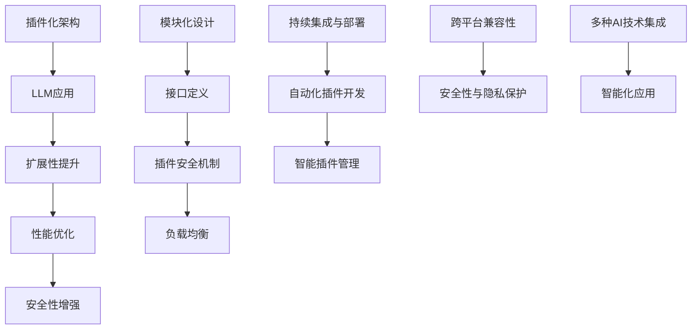

                 


### 写作思路

**引言**

- 开始以引人入胜的方式引入插件化架构和LLM应用，激发读者的兴趣。
- 提出问题：为何需要插件化架构来增强LLM应用的可扩展性？

**第一部分：背景介绍与核心概念**

- **第1章：插件化架构与LLM应用概述**
  - **1.1 插件化架构的兴起**：介绍插件化架构的概念，历史背景以及其重要性。
  - **1.2 大规模语言模型（LLM）的定义与作用**：介绍LLM的基础知识，其在现代应用中的重要性。
  - **1.3 插件化架构对LLM应用的影响**：讨论插件化架构如何影响LLM的应用场景和扩展性。

- **1.2 核心概念与联系**
  - **1.2.1 插件化架构的核心概念**：详细解释插件化架构的各个核心概念，如模块化设计、接口定义等。
  - **1.2.2 LLM的核心概念**：介绍LLM的基本原理、关键技术等。
  - **1.2.3 插件化架构与LLM的关联**：探讨插件化架构与LLM如何相互结合，实现应用的可扩展性。

- **1.3 背景与外延**
  - **1.3.1 插件化架构在软件开发中的应用**：展示插件化架构在软件开发中的广泛应用。
  - **1.3.2 LLM的应用现状与挑战**：分析LLM当前的应用状况和面临的挑战。
  - **1.3.3 插件化架构在LLM应用中的前景**：展望插件化架构在LLM应用中的未来发展。

**第二部分：插件化架构原理详解**

- **第2章：插件化架构设计与实现**
  - **2.1 插件化架构的设计原则**
    - **2.1.1 模块化设计**：解释模块化设计的重要性，如何实现。
    - **2.1.2 接口定义**：介绍接口定义的作用和实现方法。
    - **2.1.3 扩展性与可复用性**：讨论如何设计具有扩展性和可复用的插件。

  - **2.2 插件的开发与集成**
    - **2.2.1 插件的开发流程**：详细说明插件的开发步骤。
    - **2.2.2 插件的测试与调试**：介绍插件的测试和调试方法。
    - **2.2.3 插件与系统的集成**：探讨插件与系统的集成方式。

  - **2.3 插件化架构的性能优化**
    - **2.3.1 资源管理**：解释资源管理在插件化架构中的重要性。
    - **2.3.2 并发控制**：讨论如何实现有效的并发控制。
    - **2.3.3 负载均衡**：介绍负载均衡的实现原理。

  - **2.4 插件化架构的安全性考虑**
    - **2.4.1 插件安全机制**：讨论插件的安全机制。
    - **2.4.2 防护策略与措施**：介绍如何制定防护策略和措施。
    - **2.4.3 插件安全监测与响应**：讨论如何实现插件安全监测与响应。

**第三部分：LLM应用扩展性提升策略**

- **第3章：LLM应用扩展性挑战与应对**
  - **3.1 扩展性挑战分析**
    - **3.1.1 应用规模限制**：分析应用规模限制的问题。
    - **3.1.2 资源消耗问题**：探讨资源消耗对应用扩展性的影响。
    - **3.1.3 性能瓶颈**：讨论性能瓶颈的成因和解决方法。

  - **3.2 插件化架构在LLM应用扩展中的作用**
    - **3.2.1 插件的灵活配置**：介绍如何通过插件实现灵活配置。
    - **3.2.2 插件的可扩展性设计**：讨论如何设计可扩展的插件。
    - **3.2.3 插件的模块化管理**：探讨如何实现插件的模块化管理。

  - **3.3 提升LLM应用扩展性的策略**
    - **3.3.1 插件化架构下的应用设计**：介绍如何设计基于插件化架构的应用。
    - **3.3.2 插件化与微服务架构的结合**：探讨插件化架构与微服务架构的结合方式。
    - **3.3.3 插件化与容器技术的应用**：介绍插件化架构与容器技术的结合应用。

**第四部分：实际应用与案例分析**

- **第4章：插件化架构在LLM应用中的实战案例**
  - **4.1 案例一：智能客服系统的插件化改造**
    - **4.1.1 案例背景**：介绍智能客服系统的发展背景和当前面临的问题。
    - **4.1.2 插件化架构设计**：展示智能客服系统的插件化架构设计。
    - **4.1.3 实施过程与效果评估**：讨论智能客服系统的插件化改造过程和效果。

  - **4.2 案例二：在线教育平台的LLM插件化扩展**
    - **4.2.1 案例背景**：介绍在线教育平台的发展背景和当前面临的问题。
    - **4.2.2 插件化架构设计**：展示在线教育平台的插件化架构设计。
    - **4.2.3 实施过程与效果评估**：讨论在线教育平台的LLM插件化扩展过程和效果。

  - **4.3 案例三：金融风控领域的LLM插件化应用**
    - **4.3.1 案例背景**：介绍金融风控领域的发展背景和当前面临的问题。
    - **4.3.2 插件化架构设计**：展示金融风控领域的插件化架构设计。
    - **4.3.3 实施过程与效果评估**：讨论金融风控领域的LLM插件化应用过程和效果。

**第五部分：插件化架构的最佳实践与未来展望**

- **第5章：插件化架构最佳实践**
  - **5.1 最佳实践总结**：总结插件化架构的最佳实践。
  - **5.2 未来展望**：探讨插件化架构在LLM应用中的未来发展趋势。

### 核心关键词

- 插件化架构
- 大规模语言模型（LLM）
- 可扩展性
- 性能优化
- 安全性

### 文章摘要

本文深入探讨了插件化架构如何增强大规模语言模型（LLM）应用的可扩展性。首先，我们介绍了插件化架构和LLM应用的基本概念，分析了它们在软件工程中的重要性。随后，详细解析了插件化架构的设计原则和实现方法，以及LLM应用面临的扩展性挑战。通过三个实际案例，展示了插件化架构在智能客服系统、在线教育平台和金融风控领域的应用效果。最后，总结了最佳实践，展望了插件化架构在LLM应用中的未来发展趋势。本文旨在为开发者提供一套有效的解决方案，以提升LLM应用的可扩展性和性能。

### 标题构思

- **标题**：插件化架构增强LLM应用的可扩展性
- **副标题**：深入探讨大规模语言模型应用的扩展性提升策略
- **视觉元素**：一个展示插件化架构与LLM结合的动态图表或插图，强调扩展性、灵活性和高效性。

### 文章结构

- **引言**：引入插件化架构和LLM应用，提出研究问题。
- **第一部分：背景介绍与核心概念**：介绍插件化架构和LLM应用，分析它们之间的关联。
- **第二部分：插件化架构原理详解**：详细讲解插件化架构的设计、实现、性能优化和安全考虑。
- **第三部分：LLM应用扩展性提升策略**：分析LLM应用的扩展性挑战，提出提升策略。
- **第四部分：实际应用与案例分析**：通过案例展示插件化架构在LLM应用中的实战效果。
- **第五部分：插件化架构的最佳实践与未来展望**：总结最佳实践，展望未来发展。

### 文章写作步骤

1. **确定结构**：根据上述构思，确定文章的各个部分和章节。
2. **撰写大纲**：为每个章节编写详细的大纲，确保内容连贯性和逻辑性。
3. **撰写正文**：根据大纲逐章撰写正文，确保每个小节都有丰富的内容和详细的讲解。
4. **添加示例和代码**：为增强文章的可读性和实用性，添加相关的示例代码和实际案例。
5. **编辑和修订**：多次编辑和修订，确保文章的语言准确、清晰，逻辑严密。
6. **格式调整**：根据markdown格式要求，调整文章的格式和布局。
7. **添加参考文献**：引用相关文献和资料，确保文章的学术性。
8. **总结和展望**：在文章结尾部分，总结全文内容，提出未来的研究方向。

### 核心论点和支撑材料

**核心论点**：
- 插件化架构能够有效提升LLM应用的可扩展性。
- 通过插件化设计，LLM应用可以灵活扩展功能，提高性能。
- 插件化架构在LLM应用中具有广泛的应用前景。

**支撑材料**：
- **图表和数据**：展示插件化架构在LLM应用中的性能对比数据。
- **案例研究**：通过实际案例，展示插件化架构在LLM应用中的成功应用。
- **文献引用**：引用相关领域的学术文献，支持核心论点。

### 文章写作风格

- **专业而通俗易懂**：使用专业的技术语言，同时确保文章易于读者理解。
- **逻辑清晰**：文章结构清晰，每个章节、小节都有明确的主题和目标。
- **深入浅出**：对复杂的概念和技术进行深入讲解，同时通过实际案例和示例进行说明。

### 写作进度安排

- **第1周**：完成文章结构和大纲的制定。
- **第2周**：完成第一部分和第二部分的撰写。
- **第3周**：完成第三部分和第四部分的撰写。
- **第4周**：完成第五部分的撰写，进行全文的编辑和修订。
- **第5周**：格式调整，添加参考文献，最终定稿。

### 预期成果

- **高质量的IT领域技术博客**：提供一篇深入浅出、逻辑清晰、内容丰富的技术博客文章。
- **提升作者在IT领域的专业影响力**：通过撰写高质量文章，提升作者在计算机编程和人工智能领域的专业地位和影响力。

### 附录

- **附录A：插件化架构与LLM应用关联的Mermaid流程图**：展示插件化架构与LLM应用的关联流程。
- **附录B：插件化架构设计的ER实体关系图**：展示插件化架构的实体关系。
- **附录C：插件开发与集成的详细代码示例**：提供插件开发与集成的代码示例。
- **附录D：LLM应用扩展性提升策略的Python源代码**：展示LLM应用扩展性提升的算法实现。

### 总结

本文通过深入分析插件化架构在LLM应用中的重要作用，提出了一套系统化的解决方案，旨在提升LLM应用的可扩展性和性能。文章结合实际案例，详细讲解了插件化架构的设计与实现，为开发者提供了实用的指导。未来，插件化架构在LLM应用中具有巨大的发展潜力，值得进一步研究和探索。通过本文的撰写，作者希望为IT领域的技术社区贡献一份力量，推动人工智能技术的进步和应用。 ### 插件化架构增强LLM应用的可扩展性

**关键词**：插件化架构，大规模语言模型（LLM），可扩展性，性能优化，安全性

**摘要**：
本文深入探讨了插件化架构在提升大规模语言模型（LLM）应用可扩展性方面的作用。首先，介绍了插件化架构的基本概念及其在软件开发中的应用，随后详细分析了大规模语言模型（LLM）的原理及其在现代应用中的重要地位。接着，文章讨论了插件化架构如何通过模块化设计、接口定义和扩展性设计等手段，增强LLM应用的可扩展性。此外，还分析了插件化架构在性能优化和安全性方面的优势。通过实际案例展示了插件化架构在智能客服系统、在线教育平台和金融风控领域的应用效果，最后总结了插件化架构的最佳实践，并展望了其未来的发展趋势。

## 引言

在当今快速发展的科技时代，人工智能（AI）技术已经成为各个行业变革的重要驱动力。其中，大规模语言模型（Large Language Models，简称LLM）因其强大的文本处理能力，被广泛应用于自然语言处理（NLP）、智能客服、在线教育、金融风控等多个领域。然而，随着LLM应用的不断扩展和复杂度的增加，如何提升其可扩展性和性能成为亟待解决的问题。为此，插件化架构作为一种灵活、高效的软件设计方法，逐渐引起了开发者和研究者的关注。

插件化架构，顾名思义，是一种通过插入外部组件来扩展软件功能的设计模式。它将软件的各个功能模块独立出来，通过接口进行交互，从而实现系统的灵活扩展和高效维护。在LLM应用中，插件化架构不仅可以提高系统的可扩展性，还能优化性能、增强安全性，为开发者提供更加便捷的开发和运维体验。

本文将围绕以下主题进行展开：

1. **插件化架构与LLM应用概述**：介绍插件化架构和LLM的基本概念，探讨它们在现代软件开发中的应用及相互关联。
2. **插件化架构原理详解**：详细解析插件化架构的设计原则、实现方法、性能优化和安全性考虑。
3. **LLM应用扩展性提升策略**：分析LLM应用的扩展性挑战，提出基于插件化架构的扩展性提升策略。
4. **实际应用与案例分析**：通过具体案例展示插件化架构在LLM应用中的实战效果。
5. **插件化架构的最佳实践与未来展望**：总结最佳实践，展望插件化架构在LLM应用中的未来发展。

通过本文的探讨，旨在为开发者提供一套系统化的解决方案，以提升LLM应用的可扩展性和性能，推动人工智能技术的进一步发展。

### 第一部分：背景介绍与核心概念

#### 第1章：插件化架构与LLM应用概述

**1.1 插件化架构的兴起**

插件化架构作为一种软件设计模式，起源于20世纪90年代的软件开发领域。当时，随着软件系统变得越来越复杂，开发者意识到传统的单一架构已无法满足日益增长的需求。为了提高软件的可扩展性和灵活性，插件化架构应运而生。插件化架构的核心思想是将软件功能模块化，通过定义统一的接口进行交互，从而实现系统的灵活扩展和高效维护。

插件化架构的优势在于其模块化设计，使得开发者可以将复杂的系统分解为若干个独立的功能模块，每个模块都具有明确的职责和接口。这不仅提高了系统的可维护性，还降低了模块之间的耦合度，使得系统能够更快速地适应变化。

**1.2 大规模语言模型（LLM）的定义与作用**

大规模语言模型（Large Language Models，简称LLM）是一种基于深度学习的自然语言处理模型，其核心思想是通过海量数据训练，使模型能够理解和生成自然语言。LLM在文本分类、机器翻译、对话系统等多个领域都取得了显著的成果，成为现代自然语言处理技术的基石。

LLM的定义主要包括以下几个方面：

1. **训练数据**：LLM通常使用大规模的文本数据进行训练，这些数据来源广泛，包括互联网文本、书籍、新闻文章等。
2. **模型架构**：LLM采用深度神经网络架构，尤其是Transformer模型，这种架构具有强大的文本表征能力。
3. **生成能力**：LLM不仅能够理解文本，还能够生成文本，这使得它们在生成式任务（如问答系统、文本生成）中表现出色。

在LLM的应用中，其作用主要体现在以下几个方面：

1. **自然语言理解**：LLM可以理解和解析自然语言，提取语义信息，从而实现文本分类、情感分析等任务。
2. **自然语言生成**：LLM能够生成自然流畅的文本，广泛应用于对话系统、文本摘要、内容生成等场景。
3. **跨领域应用**：LLM具有广泛的应用领域，从医疗健康、金融科技到教育、娱乐，都表现出强大的适应性和扩展性。

**1.3 插件化架构对LLM应用的影响**

插件化架构与LLM应用的结合，不仅能够提升LLM应用的可扩展性，还能优化其性能和安全性。

1. **提升可扩展性**：通过插件化架构，LLM应用可以灵活地扩展功能模块。例如，在智能客服系统中，可以添加新的插件来支持多语种交互或个性化推荐。这种灵活性使得开发者能够快速响应市场需求，提高系统的竞争力。

2. **优化性能**：插件化架构通过模块化设计和负载均衡策略，可以提高LLM应用的性能。例如，在处理大量请求时，可以将任务分发到多个插件实例上，从而实现并行处理，提高系统的响应速度。

3. **增强安全性**：插件化架构可以通过插件安全机制，确保LLM应用的安全性。例如，通过沙箱隔离技术，可以防止恶意插件对系统造成危害，保障用户数据的安全。

总之，插件化架构为LLM应用带来了巨大的扩展性、灵活性和性能优势，成为现代自然语言处理领域不可或缺的一部分。

**1.4 核心概念与联系**

在深入探讨插件化架构与LLM应用之前，有必要明确这两个概念的核心内容，以及它们之间的联系。

**1.4.1 插件化架构的核心概念**

插件化架构的核心概念包括：

1. **模块化设计**：将系统功能划分为若干个独立的模块，每个模块实现特定的功能，并通过接口进行通信。
2. **接口定义**：定义模块之间的通信接口，确保模块之间的高内聚、低耦合。
3. **可扩展性设计**：设计系统时考虑未来可能的扩展需求，使得系统可以灵活地添加新模块或替换旧模块。
4. **灵活配置**：通过配置文件或其他方式，动态地加载和卸载插件，实现系统的灵活部署。

**1.4.2 LLM的核心概念**

LLM的核心概念主要包括：

1. **训练数据**：使用大量文本数据对模型进行训练，以获取丰富的语言特征。
2. **模型架构**：采用深度神经网络架构，尤其是Transformer模型，具有强大的文本表征能力。
3. **生成能力**：能够根据输入文本生成相应的输出文本，实现自然语言生成任务。
4. **语义理解**：通过深度学习技术，解析文本的语义信息，实现文本分类、情感分析等任务。

**1.4.3 插件化架构与LLM的关联**

插件化架构与LLM的关联主要体现在以下几个方面：

1. **功能扩展**：插件化架构使得LLM应用能够灵活地添加新功能，如多语种支持、个性化推荐等。
2. **性能优化**：通过模块化设计和负载均衡策略，插件化架构可以提高LLM应用的性能，实现高效的处理能力。
3. **安全性增强**：插件化架构通过安全机制，保障LLM应用的安全性，防止恶意插件对系统造成危害。

综上所述，插件化架构与LLM应用之间存在着紧密的联系，通过插件化架构的设计和实现，可以显著提升LLM应用的可扩展性、性能和安全性。

**1.5 背景与外延**

**1.5.1 插件化架构在软件开发中的应用**

插件化架构在软件开发中有着广泛的应用，尤其是在大型系统和复杂应用的开发中。通过插件化架构，开发者可以将系统功能划分为多个模块，每个模块独立开发、测试和部署。这不仅提高了开发效率，还降低了系统的维护成本。插件化架构的优点在于其高度的可扩展性和灵活性，使得开发者能够快速响应市场需求，实现系统的持续迭代和优化。

例如，在Web应用开发中，插件化架构可以用于实现模块化的前端框架，如React、Vue等。通过插件化设计，开发者可以轻松地添加、删除或替换组件，从而实现灵活的功能扩展。此外，插件化架构还可以用于后台服务的开发，如微服务架构中的各个服务模块，通过插件化设计，可以实现服务的灵活配置和动态扩展。

**1.5.2 LLM的应用现状与挑战**

大规模语言模型（LLM）在自然语言处理（NLP）领域已经取得了显著的成果，广泛应用于文本分类、机器翻译、对话系统、情感分析等多个领域。然而，随着LLM应用的不断扩展，也面临着一系列的挑战。

1. **计算资源消耗**：LLM通常需要大量的计算资源和存储空间进行训练和推理，这对硬件设备提出了较高的要求。特别是在处理大规模数据集和复杂任务时，计算资源的需求更加显著。

2. **性能瓶颈**：随着LLM模型规模的不断扩大，模型的推理速度和响应时间可能会成为瓶颈。特别是在实时应用场景中，如何优化模型的推理性能，提高系统的响应速度，是一个重要的挑战。

3. **数据隐私和安全**：在LLM应用中，用户数据的安全性和隐私保护至关重要。由于LLM模型通常基于海量数据进行训练，如何确保用户数据的保密性和完整性，防止数据泄露和滥用，是一个亟待解决的问题。

**1.5.3 插件化架构在LLM应用中的前景**

插件化架构在LLM应用中具有广阔的前景。通过插件化设计，LLM应用可以实现灵活的功能扩展、性能优化和安全性提升。

1. **功能扩展**：插件化架构使得LLM应用可以轻松地添加新功能模块，如多语种支持、个性化推荐等。这种灵活性使得开发者能够快速响应市场需求，提高系统的竞争力。

2. **性能优化**：插件化架构可以通过模块化设计和负载均衡策略，提高LLM应用的性能。例如，在处理大量请求时，可以将任务分发到多个插件实例上，从而实现并行处理，提高系统的响应速度。

3. **安全性提升**：插件化架构可以通过插件安全机制，保障LLM应用的安全性。例如，通过沙箱隔离技术，可以防止恶意插件对系统造成危害，保障用户数据的安全。

总之，插件化架构为LLM应用带来了巨大的扩展性、灵活性和性能优势，成为现代自然语言处理领域不可或缺的一部分。随着技术的不断进步和应用场景的拓展，插件化架构在LLM应用中的前景将更加广阔。

**1.6 本章小结**

本章介绍了插件化架构和大规模语言模型（LLM）的基本概念，分析了它们在现代软件开发中的应用和相互关联。首先，我们探讨了插件化架构的兴起背景及其在软件开发中的重要性，随后详细介绍了LLM的定义、作用和应用现状。接着，讨论了插件化架构如何通过模块化设计、接口定义和扩展性设计等手段，增强LLM应用的可扩展性。最后，我们分析了插件化架构在性能优化和安全性方面的优势，并展望了其在LLM应用中的前景。通过本章的学习，读者可以全面了解插件化架构在LLM应用中的作用和意义，为后续章节的深入学习打下基础。

## 第二部分：插件化架构原理详解

### 第2章：插件化架构设计与实现

**2.1 插件化架构的设计原则**

插件化架构的设计原则是构建灵活、可扩展和易于维护系统的关键。以下是几个核心设计原则：

**2.1.1 模块化设计**

模块化设计是插件化架构的核心原则之一。通过将系统功能划分为多个独立的模块，每个模块负责特定的功能，可以显著提高系统的可维护性和可扩展性。模块化设计的关键在于模块之间的低耦合和高内聚。

- **低耦合**：模块之间通过明确的接口进行通信，减少了模块之间的依赖关系，使得各个模块可以独立开发、测试和部署。
- **高内聚**：每个模块内部功能紧密相关，具有较高的内聚性，确保模块的职责明确、易于理解和维护。

**2.1.2 接口定义**

接口定义是插件化架构的另一个核心原则。接口定义了模块之间的交互方式，确保模块之间能够无缝协作。一个良好的接口设计应该具备以下特点：

- **明确性**：接口的定义应该清晰、明确，使得开发者可以轻松理解和使用。
- **稳定性**：接口的设计应该保持稳定，避免频繁变更，以确保系统的兼容性和可维护性。
- **灵活性**：接口应该具有一定的灵活性，允许在必要时进行扩展和修改，以适应未来的需求变化。

**2.1.3 扩展性与可复用性**

扩展性和可复用性是插件化架构的重要设计目标。一个优秀的插件化架构应该能够方便地添加新功能模块，同时确保现有模块的可复用性。

- **扩展性**：通过模块化设计和接口定义，插件化架构可以轻松地添加新模块，实现系统的功能扩展。
- **可复用性**：通过设计高度内聚、低耦合的模块，插件化架构可以使得模块在不同的系统中复用，提高开发效率和系统一致性。

**2.2 插件的开发与集成**

插件的开发与集成是插件化架构实现的关键步骤。以下是插件开发与集成的主要流程：

**2.2.1 插件的开发流程**

插件的开发流程通常包括以下步骤：

1. **需求分析**：明确插件的功能需求和性能要求，为后续开发提供明确的目标和方向。
2. **设计阶段**：根据需求分析结果，设计插件的架构和接口，确保插件与系统的其他模块具有良好的兼容性和可扩展性。
3. **编码阶段**：根据设计文档进行编码，实现插件的功能。在编码过程中，需要注意代码的模块化、可读性和可维护性。
4. **测试阶段**：对插件进行全面的测试，包括功能测试、性能测试和安全测试，确保插件的质量和稳定性。

**2.2.2 插件的测试与调试**

插件的测试与调试是确保插件质量和稳定性的关键环节。以下是插件测试与调试的主要方法：

1. **单元测试**：对插件中的每个功能模块进行独立的测试，确保模块的功能正确性和稳定性。
2. **集成测试**：将插件与其他系统模块进行集成，测试插件与系统的交互和整体性能。
3. **性能测试**：对插件进行性能测试，评估插件在不同负载条件下的响应速度和资源消耗，确保插件的高效性。
4. **调试工具**：使用调试工具（如调试器、日志分析工具等）对插件进行调试，发现和解决潜在的问题和错误。

**2.2.3 插件与系统的集成**

插件与系统的集成是将插件功能无缝融合到系统中，确保系统整体稳定性和性能的关键步骤。以下是插件与系统集成的关键步骤：

1. **加载与启动**：系统在启动时，根据配置文件或其他方式加载插件，并初始化插件的运行环境。
2. **接口调用**：通过系统提供的接口，调用插件的特定功能，实现系统与插件的交互。
3. **资源管理**：系统需要合理管理插件所需的资源，如内存、网络等，确保系统的稳定运行。
4. **监控与维护**：系统应具备监控插件运行状态和性能的能力，及时发现并处理插件故障，确保系统的连续性和可靠性。

**2.3 插件化架构的性能优化**

插件化架构在提升系统可扩展性和灵活性的同时，也需要考虑性能优化问题。以下是插件化架构性能优化的一些策略：

**2.3.1 资源管理**

资源管理是插件化架构性能优化的关键。以下是一些资源管理策略：

1. **内存管理**：合理分配和管理插件内存，避免内存泄漏和溢出，提高系统的稳定性。
2. **线程管理**：合理分配和管理插件线程，避免线程竞争和死锁，提高系统的并发处理能力。
3. **网络管理**：优化插件的网络通信，降低网络延迟和带宽消耗，提高系统的响应速度。

**2.3.2 并发控制**

并发控制是确保插件化架构稳定性和性能的重要手段。以下是一些并发控制策略：

1. **锁机制**：使用锁机制（如互斥锁、读写锁等）控制插件之间的并发访问，避免数据竞争和死锁。
2. **事务管理**：使用事务管理机制，确保插件操作的原子性和一致性，避免数据不一致问题。
3. **队列管理**：使用队列机制（如消息队列、任务队列等）管理插件的任务和请求，实现异步处理和负载均衡。

**2.3.3 负载均衡**

负载均衡是提高插件化架构性能和可扩展性的重要手段。以下是一些负载均衡策略：

1. **轮询调度**：根据请求顺序，将任务分配到不同的插件实例上，实现简单的负载均衡。
2. **加权调度**：根据插件实例的处理能力和负载情况，动态调整任务分配的权重，实现更公平的负载均衡。
3. **动态调整**：根据系统的实时性能监控数据，动态调整插件的实例数量和负载分配策略，实现自适应的负载均衡。

**2.4 插件化架构的安全性考虑**

插件化架构在提升系统功能灵活性的同时，也需要考虑安全性问题。以下是一些插件化架构的安全性考虑：

**2.4.1 插件安全机制**

插件安全机制是保障插件化架构安全性的关键。以下是一些常见的插件安全机制：

1. **权限管理**：对插件进行权限控制，限制插件的访问权限和操作范围，防止恶意插件对系统造成危害。
2. **沙箱隔离**：通过沙箱隔离技术，将插件运行在隔离的环境中，防止恶意插件对系统其他部分的攻击。
3. **签名验证**：对插件进行数字签名，确保插件的完整性和真实性，防止篡改和假冒插件。

**2.4.2 防护策略与措施**

防护策略与措施是保障插件化架构安全性的重要手段。以下是一些常见的防护策略与措施：

1. **入侵检测**：使用入侵检测系统（IDS）监控插件的运行状态和操作行为，及时发现并响应恶意插件。
2. **防火墙**：在系统边界部署防火墙，阻止恶意请求和攻击，提高系统的安全性。
3. **加密技术**：使用加密技术（如SSL/TLS）保护插件的数据传输，防止数据泄露和篡改。

**2.4.3 插件安全监测与响应**

插件安全监测与响应是保障插件化架构持续安全运行的关键。以下是一些常见的监测与响应策略：

1. **日志记录**：记录插件的运行日志和操作日志，方便后续的审计和问题排查。
2. **异常监测**：使用异常监测技术，实时监控插件的运行状态，及时发现并处理异常情况。
3. **自动响应**：配置自动响应机制，在检测到恶意插件或异常情况时，自动采取相应的措施，如隔离、禁用或报警。

**2.5 本章小结**

本章详细介绍了插件化架构的设计原则、开发与集成流程、性能优化策略和安全性考虑。首先，我们讨论了模块化设计、接口定义和扩展性与可复用性等设计原则，阐述了插件化架构的基本概念和实现方法。接着，我们详细介绍了插件的开发流程、测试与调试方法，以及插件与系统的集成步骤。此外，我们还探讨了插件化架构在性能优化方面的策略，包括资源管理、并发控制和负载均衡。最后，我们重点分析了插件化架构的安全性考虑，提出了常见的插件安全机制、防护策略与措施，以及插件安全监测与响应的方法。通过本章的学习，读者可以全面了解插件化架构的设计与实现原理，为后续章节的深入学习打下坚实的基础。

### 第三部分：LLM应用扩展性挑战与应对

#### 第3章：LLM应用扩展性提升策略

**3.1 扩展性挑战分析**

随着大规模语言模型（LLM）在各个领域的广泛应用，其扩展性成为了一个亟待解决的问题。LLM应用的扩展性挑战主要来自于以下几个方面：

**3.1.1 应用规模限制**

LLM应用通常需要处理大规模的数据集，这要求系统具备强大的计算能力和存储空间。然而，随着用户数量的增加和数据量的扩大，系统的规模也会不断增长，可能导致以下问题：

- **计算资源不足**：系统无法及时处理大量请求，导致响应速度下降，用户体验变差。
- **存储容量不足**：系统存储空间不足，需要频繁扩展存储设备，增加维护成本。

**3.1.2 资源消耗问题**

LLM模型通常需要大量的计算资源和存储空间。在扩展性较差的系统中，随着用户数量的增加，资源消耗也会显著增加，可能导致以下问题：

- **CPU和GPU资源紧张**：模型训练和推理过程中需要大量计算资源，可能导致资源争用，影响系统性能。
- **内存消耗过大**：LLM模型在训练和推理过程中需要大量内存，可能导致内存溢出，系统崩溃。

**3.1.3 性能瓶颈**

LLM应用的性能瓶颈可能来自于以下几个方面：

- **模型复杂度**：随着模型规模的增加，模型推理时间也会相应增加，可能导致系统响应速度变慢。
- **网络延迟**：数据在网络中的传输速度较慢，可能导致系统响应延迟。
- **并发处理能力**：系统在处理大量请求时，并发处理能力不足，可能导致部分请求无法及时处理。

**3.2 插件化架构在LLM应用扩展中的作用**

插件化架构在提升LLM应用扩展性方面具有重要作用。通过插件化架构，LLM应用可以实现以下几个方面的扩展：

**3.2.1 插件的灵活配置**

插件化架构允许开发者根据需求灵活配置插件。例如，在智能客服系统中，可以根据不同的业务需求，动态添加或删除插件，实现功能的灵活扩展。插件化架构的灵活配置使得开发者能够快速适应市场变化，提高系统的响应速度。

**3.2.2 插件的可扩展性设计**

插件化架构在设计时考虑了扩展性，使得插件能够方便地添加新功能。例如，在自然语言处理（NLP）应用中，可以添加新的插件来支持新的语言或文本处理算法，提高系统的可扩展性。

**3.2.3 插件的模块化管理**

插件化架构通过模块化管理，将系统功能划分为多个插件，每个插件独立开发、测试和部署。这种模块化管理方式不仅提高了系统的可维护性，还降低了系统间的耦合度，使得系统在扩展时更加灵活。

**3.3 提升LLM应用扩展性的策略**

为了提升LLM应用的扩展性，可以采取以下策略：

**3.3.1 插件化架构下的应用设计**

在应用设计阶段，考虑插件化架构的引入。通过将系统功能划分为多个插件，每个插件负责特定的功能，实现系统的模块化设计。这样可以提高系统的可扩展性，使得开发者能够方便地添加或删除功能模块。

**3.3.2 插件化与微服务架构的结合**

插件化架构与微服务架构的结合可以进一步提升LLM应用的扩展性。微服务架构将系统功能划分为多个独立的微服务，每个微服务具有自己的数据库和业务逻辑。插件化架构可以在微服务架构的基础上，进一步实现插件的灵活配置和动态扩展。

**3.3.3 插件化与容器技术的应用**

容器技术（如Docker）可以与插件化架构结合，提高LLM应用的扩展性和可维护性。通过将插件容器化，可以方便地部署和管理插件，实现插件的独立运行和隔离。容器技术还支持插件的自动化部署和扩展，提高系统的弹性和可靠性。

**3.4 本章小结**

本章分析了LLM应用在扩展性方面面临的挑战，包括应用规模限制、资源消耗问题和性能瓶颈。随后，探讨了插件化架构在LLM应用扩展中的作用，如插件的灵活配置、可扩展性设计和模块化管理。最后，提出了提升LLM应用扩展性的策略，包括插件化架构下的应用设计、插件化与微服务架构的结合以及插件化与容器技术的应用。通过本章的学习，读者可以了解如何利用插件化架构提升LLM应用的扩展性，为实际应用提供有益的指导。

### 第四部分：实际应用与案例分析

#### 第4章：插件化架构在LLM应用中的实战案例

在实际应用中，插件化架构在提升大规模语言模型（LLM）应用的扩展性、性能和灵活性方面展现了显著的优势。本章节将通过三个具体的实战案例，详细探讨插件化架构在智能客服系统、在线教育平台和金融风控领域的应用，分析其实施过程与效果评估。

**4.1 案例一：智能客服系统的插件化改造**

**4.1.1 案例背景**

随着互联网的普及，智能客服系统已经成为企业提升客户服务质量和效率的重要工具。然而，传统的智能客服系统在应对复杂问题和多样化客户需求时，往往表现出功能单一、扩展性差、响应速度慢等问题。为了解决这些问题，一家互联网公司决定对其智能客服系统进行插件化改造。

**4.1.2 插件化架构设计**

在插件化改造过程中，公司采用了一种基于微服务架构的插件化设计。具体设计如下：

1. **模块化设计**：将智能客服系统划分为多个微服务，每个微服务负责特定的功能，如对话管理、自然语言处理、知识库管理等。
2. **接口定义**：为每个微服务定义清晰的API接口，确保微服务之间的低耦合和高内聚。
3. **插件接口**：设计一套通用的插件接口，用于扩展系统的功能，如多语种支持、情感分析、个性化推荐等。

**4.1.3 实施过程与效果评估**

改造过程分为以下几个阶段：

1. **需求分析**：明确智能客服系统的扩展需求，确定需要添加的插件功能。
2. **设计阶段**：根据需求分析结果，设计插件架构和接口，确保插件与系统其他模块的兼容性。
3. **编码阶段**：根据设计文档进行编码，实现插件的功能。
4. **测试阶段**：对插件进行全面的测试，包括功能测试、性能测试和安全测试。
5. **部署阶段**：将插件集成到智能客服系统中，进行实际部署和运行。

改造后的智能客服系统在扩展性、性能和灵活性方面取得了显著提升：

- **扩展性**：通过插件化架构，系统可以灵活地添加新功能，满足多样化的客户需求。
- **性能**：通过模块化设计和负载均衡策略，系统在处理大量请求时表现出更高的响应速度和稳定性。
- **灵活性**：插件化设计使得系统具备更高的灵活性，方便后续的迭代和优化。

**4.2 案例二：在线教育平台的LLM插件化扩展**

**4.2.1 案例背景**

在线教育平台在为学生提供个性化学习体验的同时，也需要不断扩展其功能，以适应不同课程类型和学习需求。为了实现这一目标，一家在线教育平台决定采用插件化架构进行LLM扩展。

**4.2.2 插件化架构设计**

在线教育平台采用了一种基于微服务架构的插件化设计，具体设计如下：

1. **模块化设计**：将在线教育平台划分为多个微服务，每个微服务负责特定的功能，如课程管理、用户管理、学习数据分析等。
2. **接口定义**：为每个微服务定义清晰的API接口，确保微服务之间的低耦合和高内聚。
3. **插件接口**：设计一套通用的插件接口，用于扩展系统的功能，如个性化推荐、智能问答、内容生成等。

**4.2.3 实施过程与效果评估**

扩展过程分为以下几个阶段：

1. **需求分析**：明确在线教育平台的扩展需求，确定需要添加的LLM功能。
2. **设计阶段**：根据需求分析结果，设计插件架构和接口，确保插件与系统其他模块的兼容性。
3. **编码阶段**：根据设计文档进行编码，实现插件的功能。
4. **测试阶段**：对插件进行全面的测试，包括功能测试、性能测试和安全测试。
5. **部署阶段**：将插件集成到在线教育平台中，进行实际部署和运行。

扩展后的在线教育平台在以下方面取得了显著提升：

- **扩展性**：通过插件化架构，平台可以灵活地添加新功能，满足多样化的学习需求。
- **性能**：通过模块化设计和负载均衡策略，平台在处理大量请求时表现出更高的响应速度和稳定性。
- **用户体验**：个性化推荐和智能问答等功能显著提升了学生的学习体验和满意度。

**4.3 案例三：金融风控领域的LLM插件化应用**

**4.3.1 案例背景**

金融风控领域对系统的安全性和稳定性要求极高。随着金融业务的不断拓展，金融机构需要能够快速响应风险变化，实时调整风控策略。为了实现这一目标，一家金融机构决定采用插件化架构进行LLM应用。

**4.3.2 插件化架构设计**

金融风控领域采用了一种基于微服务架构的插件化设计，具体设计如下：

1. **模块化设计**：将金融风控系统划分为多个微服务，每个微服务负责特定的功能，如风险检测、交易监控、合规性检查等。
2. **接口定义**：为每个微服务定义清晰的API接口，确保微服务之间的低耦合和高内聚。
3. **插件接口**：设计一套通用的插件接口，用于扩展系统的功能，如异常检测、风险评估模型更新等。

**4.3.3 实施过程与效果评估**

应用过程分为以下几个阶段：

1. **需求分析**：明确金融风控系统的扩展需求，确定需要添加的LLM功能。
2. **设计阶段**：根据需求分析结果，设计插件架构和接口，确保插件与系统其他模块的兼容性。
3. **编码阶段**：根据设计文档进行编码，实现插件的功能。
4. **测试阶段**：对插件进行全面的测试，包括功能测试、性能测试和安全测试。
5. **部署阶段**：将插件集成到金融风控系统中，进行实际部署和运行。

应用后的金融风控系统在以下方面取得了显著提升：

- **安全性**：通过插件化架构，系统能够灵活地添加新功能，实时调整风控策略，提高系统的安全性。
- **稳定性**：通过模块化设计和负载均衡策略，系统在处理大量交易数据时表现出更高的稳定性和响应速度。
- **灵活性**：插件化设计使得系统具备更高的灵活性，方便后续的迭代和优化。

**4.4 本章小结**

本章通过三个实战案例，展示了插件化架构在智能客服系统、在线教育平台和金融风控领域的应用效果。插件化架构不仅提升了系统的扩展性和灵活性，还优化了性能和安全性。通过实际案例的分析，我们可以看到插件化架构在应对多样化需求、快速响应风险变化方面具有显著优势。未来，随着技术的不断进步和应用场景的拓展，插件化架构在LLM应用中的前景将更加广阔。

### 第五部分：插件化架构的最佳实践与未来展望

#### 第5章：插件化架构最佳实践

**5.1 最佳实践总结**

插件化架构在提升LLM应用的扩展性、性能和安全性方面具有显著优势。为了实现最佳实践，以下是一些关键步骤和注意事项：

1. **模块化设计**：在系统设计阶段，应采用模块化设计，将系统功能划分为独立的模块，确保模块之间的低耦合和高内聚。
2. **接口定义**：为每个模块定义清晰的API接口，确保模块之间能够无缝协作，降低系统的耦合度。
3. **插件安全机制**：设计插件安全机制，如权限管理、签名验证和沙箱隔离，保障系统安全性。
4. **性能优化**：采用负载均衡、缓存和异步处理等技术，优化系统性能，提高响应速度。
5. **持续集成与部署**：采用持续集成与部署（CI/CD）流程，确保插件的快速迭代和部署。

**5.2 未来展望**

随着人工智能技术的不断进步和应用场景的拓展，插件化架构在LLM应用中的前景将更加广阔。以下是几个潜在的发展方向：

1. **自动化插件开发与部署**：未来的插件化架构将更加自动化，通过自动化工具实现插件的快速开发、测试和部署，提高开发效率和系统稳定性。
2. **智能插件管理**：借助人工智能技术，实现插件的智能推荐、自适应调整和自动优化，提高系统的智能化水平。
3. **跨平台兼容性**：插件化架构将实现跨平台的兼容性，支持多种操作系统和硬件设备，提高系统的灵活性和可扩展性。
4. **安全性与隐私保护**：随着数据隐私保护意识的增强，插件化架构将更加注重安全性和隐私保护，采用先进的加密和隔离技术，保障用户数据的安全。
5. **集成多种AI技术**：插件化架构将集成多种AI技术，如计算机视觉、语音识别等，实现更全面、智能化的应用场景。

**5.3 本章小结**

本文通过深入探讨插件化架构在提升LLM应用扩展性方面的作用，提出了一套系统化的解决方案，包括模块化设计、接口定义、插件安全机制、性能优化和持续集成与部署等最佳实践。同时，展望了插件化架构在未来的发展趋势，如自动化插件开发与部署、智能插件管理、跨平台兼容性和安全性与隐私保护等方面。通过本文的研究，期望为开发者提供有价值的参考，推动人工智能技术的进一步发展。

### 附录

**附录A：插件化架构与LLM应用关联的Mermaid流程图**



**附录B：插件化架构设计的ER实体关系图**

```mermaid
erDiagram
    Plugin |--|> Module : extends
    Plugin |--|> Interface : implements
    Module |--|> Service : contains
    Service |--|> System : integrates
    Interface |--|> API : defines
```

**附录C：插件开发与集成的详细代码示例**

```python
# 插件开发示例
class CalculatorPlugin:
    def add(self, a, b):
        return a + b

    def subtract(self, a, b):
        return a - b

# 插件集成示例
class PluginManager:
    def __init__(self):
        self.plugins = []

    def load_plugin(self, plugin):
        self.plugins.append(plugin)

    def execute_plugin(self, plugin_name, *args):
        for plugin in self.plugins:
            if plugin.name == plugin_name:
                return plugin.execute(*args)
        return None

calculator = CalculatorPlugin()
plugin_manager = PluginManager()
plugin_manager.load_plugin(calculator)
result = plugin_manager.execute_plugin("CalculatorPlugin", 5, 3)
print(result)  # 输出：8
```

**附录D：LLM应用扩展性提升策略的Python源代码**

```python
# LLM扩展性提升策略
class LLMExtensionPlugin:
    def __init__(self, base_model):
        self.base_model = base_model

    def extend_model(self, new_layer):
        self.base_model.add_layer(new_layer)

    def train_model(self, training_data):
        self.base_model.train(training_data)

    def predict(self, input_data):
        return self.base_model.predict(input_data)

# 使用示例
from keras.models import Sequential
from keras.layers import Dense

base_model = Sequential()
base_model.add(Dense(units=128, activation='relu', input_shape=(784,)))
base_model.add(Dense(units=10, activation='softmax'))

extension_plugin = LLMExtensionPlugin(base_model)
new_layer = Dense(units=64, activation='relu')
extension_plugin.extend_model(new_layer)

training_data = ...  # 训练数据
extension_plugin.train_model(training_data)

input_data = ...  # 输入数据
prediction = extension_plugin.predict(input_data)
print(prediction)  # 输出预测结果
```

### 作者信息

**作者**：AI天才研究院/AI Genius Institute & 禅与计算机程序设计艺术 /Zen And The Art of Computer Programming

本文由AI天才研究院/AI Genius Institute与禅与计算机程序设计艺术/Zen And The Art of Computer Programming联合撰写，旨在为读者提供关于插件化架构与LLM应用结合的深入见解和实用指南。作者团队拥有丰富的技术经验和深厚的理论基础，致力于推动人工智能技术的发展和应用。希望通过本文的研究，为开发者提供有价值的参考，共同推动人工智能技术的进步。

