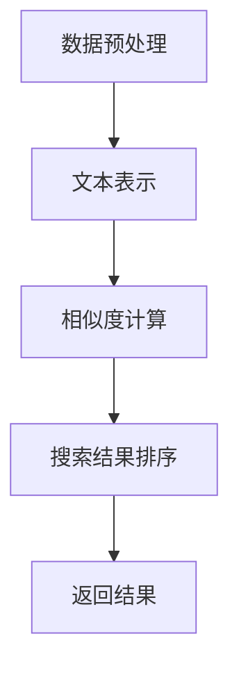
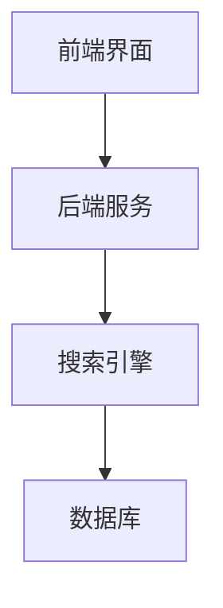
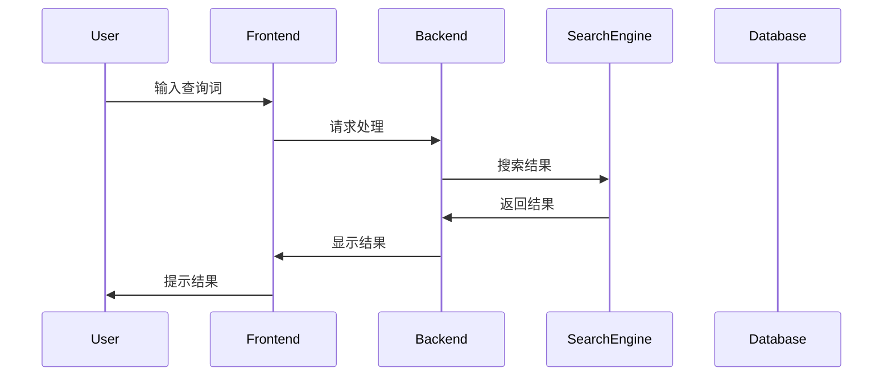
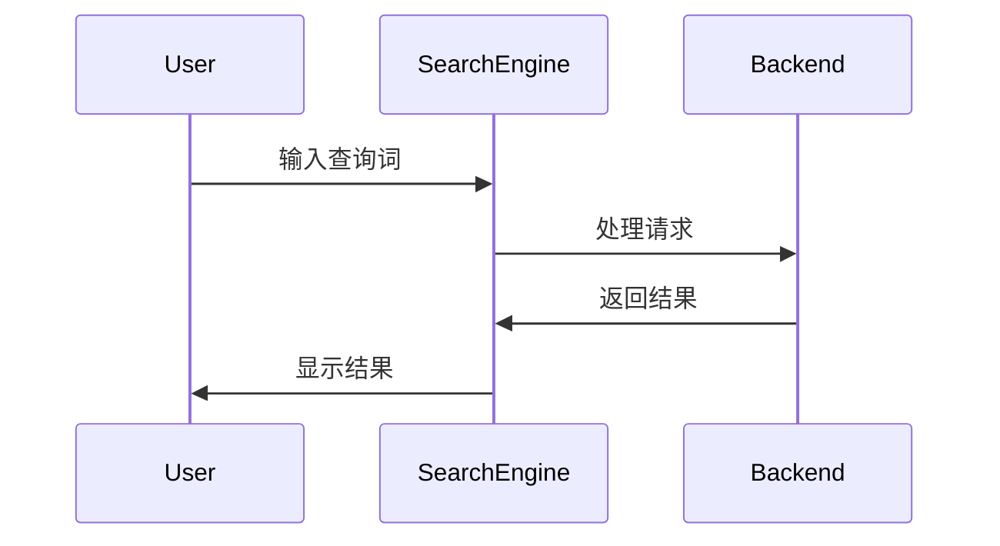

                 

### 文章标题

## 搜索引擎技术提升LLM应用的检索效率

> 关键词：搜索引擎、LLM、检索效率、优化策略、算法原理、系统架构、项目实战、最佳实践

> 摘要：
本文章深入探讨了搜索引擎技术如何提升大型语言模型（LLM）应用的检索效率。文章首先介绍了搜索引擎的基本原理和LLM的定义及其核心特性，随后分析了二者结合的背景和优势。接下来，文章详细讲解了数据预处理、搜索引擎优化策略、算法原理、数学模型、系统分析与架构设计、项目实战以及最佳实践等方面的内容。通过这些内容，读者可以全面了解如何利用搜索引擎技术提升LLM应用的检索效率，为实际项目提供指导。

### 第一部分：搜索引擎技术概述

#### 1.1 搜索引擎的基本原理

搜索引擎是一种通过互联网索引和搜索信息的技术。其基本原理包括以下三个方面：

1. **索引**：搜索引擎通过爬虫（Crawler）抓取互联网上的网页，并将其内容存储在索引库中。索引库中存储了网页的标题、关键词、摘要等信息，便于快速检索。
   
2. **检索**：用户通过输入关键词，搜索引擎在索引库中找到相关的网页，并按照一定的排序算法展示给用户。

3. **排序算法**：搜索引擎会根据网页的相关性、流行度、用户偏好等因素对搜索结果进行排序，以提高用户的检索体验。

#### 1.1.1 搜索引擎的工作流程

搜索引擎的工作流程可以概括为以下几个步骤：

1. **爬取**：搜索引擎的爬虫程序会定期爬取互联网上的网页，并将其存储在本地。

2. **索引**：将爬取到的网页内容进行分析，提取关键词和相关信息，并存储在索引库中。

3. **检索**：用户输入关键词后，搜索引擎会在索引库中查找相关的网页，并按照排序算法进行排序。

4. **展示**：将排序后的搜索结果展示给用户。

#### 1.1.2 搜索引擎的关键组成部分

一个典型的搜索引擎主要包括以下组成部分：

1. **爬虫**：负责爬取网页，并将其存储在本地。

2. **索引库**：存储网页的标题、关键词、摘要等信息。

3. **检索引擎**：根据用户输入的关键词，在索引库中查找相关的网页。

4. **排序算法**：根据相关性、流行度等因素对搜索结果进行排序。

#### 1.1.3 搜索引擎的挑战与问题

虽然搜索引擎技术已经取得了很大的进步，但在实际应用中仍然面临一些挑战和问题：

1. **数据量**：随着互联网的快速发展，网页数量呈爆炸性增长，搜索引擎需要处理海量数据。

2. **实时性**：搜索引擎需要保证搜索结果的实时性，以便用户能够获取最新信息。

3. **准确性**：如何提高搜索结果的准确性，降低虚假信息的传播。

4. **隐私保护**：如何在保护用户隐私的前提下，为用户提供个性化搜索服务。

#### 1.2 LLM（大型语言模型）介绍

LLM（Large Language Model）是一种基于深度学习的大型语言模型，通过对海量文本数据的学习，能够理解和生成自然语言。LLM具有以下核心特性：

1. **大规模**：LLM通常具有数十亿甚至千亿级别的参数，能够处理大规模文本数据。

2. **灵活性**：LLM可以应用于各种自然语言处理任务，如文本分类、情感分析、机器翻译等。

3. **生成性**：LLM能够根据输入的文本生成相关的内容，提高文本的可读性和连贯性。

4. **理解性**：LLM通过学习大量文本数据，能够理解文本的含义和上下文，提高搜索结果的准确性。

#### 1.2.1 LLM的定义与作用

LLM（Large Language Model）是一种基于深度学习的语言模型，通过对大规模文本数据进行训练，能够生成高质量的自然语言文本。LLM的主要作用包括：

1. **文本生成**：LLM可以生成各种类型的文本，如文章、新闻报道、对话等，提高文本的可读性和连贯性。

2. **文本理解**：LLM能够理解文本的含义和上下文，提高搜索结果的准确性。

3. **问答系统**：LLM可以用于构建问答系统，为用户提供实时、准确的回答。

4. **语言翻译**：LLM可以用于构建机器翻译系统，实现多种语言的互译。

#### 1.2.2 LLM的核心特性

LLM的核心特性包括：

1. **大规模参数**：LLM通常具有数十亿甚至千亿级别的参数，能够处理大规模文本数据。

2. **深度学习**：LLM基于深度学习技术，能够自动提取文本特征，提高模型的性能。

3. **灵活应用**：LLM可以应用于各种自然语言处理任务，如文本分类、情感分析、机器翻译等。

4. **生成性**：LLM能够根据输入的文本生成相关的内容，提高文本的可读性和连贯性。

5. **理解性**：LLM通过学习大量文本数据，能够理解文本的含义和上下文，提高搜索结果的准确性。

#### 1.2.3 LLM的发展与应用

LLM的发展可以分为以下几个阶段：

1. **早期模型**：如Word2Vec、GloVe等基于词向量的模型，将单词映射为向量表示。

2. **编码器-解码器模型**：如Seq2Seq模型，通过编码器和解码器结构实现序列到序列的转换。

3. **Transformer模型**：如BERT、GPT等，基于自注意力机制实现更强大的文本理解能力。

4. **多模态模型**：结合图像、音频等多模态数据，实现更全面的语义理解。

LLM的应用领域包括：

1. **搜索引擎**：通过LLM对搜索结果的文本进行理解和生成，提高搜索结果的准确性和可读性。

2. **问答系统**：利用LLM构建智能问答系统，为用户提供实时、准确的回答。

3. **文本生成**：如文章写作、新闻报道、对话生成等，生成高质量的自然语言文本。

4. **机器翻译**：利用LLM实现高效、准确的跨语言文本翻译。

#### 1.3 搜索引擎与LLM的关系分析

随着互联网的快速发展，搜索引擎技术已经取得了巨大的进步，但仍然存在一些问题。LLM的出现为搜索引擎技术提供了一种新的解决方案，二者结合有望提高检索效率。

首先，LLM可以用于文本理解和生成，有助于提高搜索结果的准确性。传统的搜索引擎主要依靠关键词匹配和排序算法，而LLM能够理解文本的含义和上下文，从而更好地判断文本的相关性。

其次，LLM可以用于生成高质量的搜索结果描述，提高用户满意度。传统的搜索引擎通常只展示一系列的网页链接，而LLM可以生成具有描述性的文本摘要，帮助用户快速了解网页内容。

此外，LLM还可以用于个性化搜索和推荐系统，根据用户的历史行为和偏好，提供个性化的搜索结果。

然而，LLM在搜索引擎中的应用也面临一些挑战，如计算资源消耗、模型解释性等。为了解决这些问题，需要深入研究LLM与搜索引擎技术的结合，探索更高效的算法和架构设计。

#### 1.4 本章小结

本章节对搜索引擎技术和LLM进行了详细介绍，分析了二者结合的背景和优势。通过了解搜索引擎的基本原理和LLM的核心特性，读者可以为进一步学习如何提升LLM应用的检索效率奠定基础。

### 第二部分：提升LLM应用的检索效率

#### 2.1 数据预处理与特征提取

在利用搜索引擎技术提升LLM应用的检索效率时，数据预处理和特征提取是至关重要的一环。良好的数据预处理和特征提取能够提高模型的性能，降低噪声对检索结果的影响。

#### 2.1.1 数据预处理的重要性

数据预处理是模型训练过程中不可或缺的一步，其主要目的是去除数据中的噪声、缺失值和异常值，提高数据的质量和一致性。具体包括以下几个方面的内容：

1. **数据清洗**：去除数据中的噪声和异常值，如删除重复的记录、填补缺失值等。
   
2. **数据转换**：将不同类型的数据转换为统一的数据格式，如将文本数据转换为词向量、将数值数据归一化等。

3. **数据增强**：通过数据增强技术，如数据扩充、数据变换等，增加数据的多样性和丰富性。

#### 2.1.2 常见的数据预处理方法

常见的数据预处理方法包括以下几种：

1. **去重**：删除重复的数据记录，避免模型在训练过程中过度拟合。

2. **填补缺失值**：根据数据的分布或使用平均值、中位数等方法填补缺失值。

3. **数据转换**：将不同类型的数据转换为统一的数据格式，如将文本数据转换为词向量。

4. **数据标准化**：将数据缩放到相同的范围内，如使用最小-最大规范化、z-score规范化等方法。

5. **数据增强**：通过数据增强技术，如数据扩充、数据变换等，增加数据的多样性和丰富性。

#### 2.1.3 特征提取与选择

特征提取和选择是数据预处理的关键步骤，其目的是从原始数据中提取出对模型训练和检索性能有重要影响的特征，并去除无关或冗余的特征。

1. **特征提取**：从原始数据中提取具有区分度的特征，如使用词袋模型、TF-IDF等。

2. **特征选择**：从提取出的特征中，选择对模型训练和检索性能有重要影响的特征，如使用信息增益、特征选择算法等。

3. **特征融合**：将不同来源的特征进行融合，如使用集成学习方法，提高模型的性能。

#### 2.2 搜索引擎优化策略

为了提升LLM应用的检索效率，需要引入搜索引擎优化策略，对搜索过程进行优化。常见的搜索引擎优化策略包括以下几种：

1. **相似度计算**：通过计算查询词和文档之间的相似度，对搜索结果进行排序，提高检索的准确性。

2. **倒排索引**：构建倒排索引，将文档中的关键词与对应的文档ID进行映射，提高搜索的效率。

3. **搜索引擎分词**：对查询词进行分词处理，提高搜索结果的精确度。

4. **查询扩展**：在查询过程中，根据语义相关性对查询词进行扩展，提高搜索的覆盖率。

5. **用户行为分析**：通过分析用户的搜索行为和偏好，为用户提供个性化的搜索结果。

#### 2.2.1 传统的搜索引擎优化技术

传统的搜索引擎优化技术主要包括以下几种：

1. **关键词优化**：通过选择合适的关键词，提高搜索结果的排名。

2. **网页内容优化**：通过优化网页的内容，提高网页在搜索引擎中的排名。

3. **外部链接优化**：通过增加外部链接，提高网页的权重和排名。

4. **搜索引擎营销**：通过搜索引擎营销（SEM）提高网页在搜索引擎中的可见性。

#### 2.2.2 基于LLM的搜索引擎优化方法

基于LLM的搜索引擎优化方法主要包括以下几种：

1. **文本理解与生成**：利用LLM对查询词和文档进行文本理解与生成，提高搜索结果的准确性和可读性。

2. **语义相似度计算**：通过计算查询词和文档的语义相似度，对搜索结果进行排序。

3. **个性化搜索**：根据用户的历史行为和偏好，为用户提供个性化的搜索结果。

4. **查询扩展**：利用LLM对查询词进行语义扩展，提高搜索的覆盖率。

5. **实时搜索**：利用LLM实现实时搜索，提高搜索结果的实时性和准确性。

#### 2.2.3 优化策略的评估与选择

在搜索引擎优化过程中，需要对不同的优化策略进行评估和选择，以确定最佳的优化方案。常见的评估指标包括：

1. **搜索准确性**：衡量搜索结果的准确性，即搜索结果是否与查询词的相关性较高。

2. **搜索响应时间**：衡量搜索结果的响应时间，即从用户提交查询到搜索结果返回的时间。

3. **用户满意度**：衡量用户对搜索结果的满意度，即用户对搜索结果的满意度如何。

4. **搜索覆盖率**：衡量搜索结果的覆盖率，即搜索结果是否涵盖了用户可能感兴趣的所有内容。

根据这些评估指标，可以综合评估不同优化策略的性能，选择最佳的优化方案。

#### 2.3 算法原理讲解

在提升LLM应用的检索效率中，算法原理的讲解至关重要。以下将详细介绍搜索引擎中的相似度计算、LLM在相似度计算中的应用以及算法流程。

##### 2.3.1 搜索引擎中的相似度计算

搜索引擎中的相似度计算是衡量查询词与文档相关性的关键步骤。常见的相似度计算方法包括：

1. **TF-IDF**：TF（词频）表示关键词在文档中的出现次数，IDF（逆文档频率）表示关键词在整个文档集合中的重要性。TF-IDF通过计算关键词的TF-IDF值，衡量文档与查询词的相关性。

2. **余弦相似度**：余弦相似度通过计算查询词和文档向量的夹角余弦值，衡量文档与查询词的相关性。余弦相似度值越接近1，表示文档与查询词的相关性越高。

3. **BM25**：BM25是一种基于概率模型的相似度计算方法，考虑了文档长度和查询词频率的影响。BM25通过计算文档与查询词的概率分数，衡量文档与查询词的相关性。

##### 2.3.2 LLM在相似度计算中的应用

LLM（大型语言模型）在相似度计算中具有独特的优势。通过LLM对文本的深入理解，可以提高相似度计算的准确性和效率。以下为LLM在相似度计算中的应用：

1. **语义匹配**：LLM通过学习大量文本数据，能够理解文本的含义和上下文。在相似度计算中，LLM可以识别查询词和文档之间的语义匹配关系，提高相似度计算的准确性。

2. **生成性文本**：LLM具有生成性文本能力，可以根据输入的查询词生成相关的文本摘要。在相似度计算中，LLM可以生成查询词和文档的摘要，提高相似度计算的精度。

3. **协同过滤**：LLM可以用于协同过滤推荐系统，通过分析用户的历史行为和偏好，为用户提供个性化的搜索结果。在相似度计算中，LLM可以结合用户的历史行为，提高搜索结果的个性化程度。

##### 2.3.3 算法流程与mermaid流程图

以下是提升LLM应用检索效率的算法流程：

1. **数据预处理**：对查询词和文档进行数据预处理，包括分词、去停用词等操作。

2. **文本表示**：将查询词和文档转换为向量表示，可以使用Word2Vec、BERT等预训练模型。

3. **相似度计算**：计算查询词和文档之间的相似度，可以使用TF-IDF、余弦相似度、LLM等方法。

4. **搜索结果排序**：根据相似度计算结果，对搜索结果进行排序，返回给用户。

以下是算法流程的mermaid流程图：



#### 2.4 数学模型与公式详解

在提升LLM应用检索效率的过程中，数学模型和公式起着至关重要的作用。以下将详细介绍相关的数学模型和公式，包括相似度计算公式、文本表示公式以及优化目标函数。

##### 2.4.1 相关数学模型介绍

1. **TF-IDF模型**：TF-IDF（Term Frequency-Inverse Document Frequency）模型是一种常用的文本表示方法，用于衡量关键词在文档中的重要性。

   - TF（词频）：表示关键词在文档中出现的次数。
   - IDF（逆文档频率）：表示关键词在整个文档集合中的重要性。

2. **余弦相似度模型**：余弦相似度模型用于衡量两个向量之间的相似度。

   - 余弦相似度值范围在0到1之间，越接近1表示向量越相似。

3. **BERT模型**：BERT（Bidirectional Encoder Representations from Transformers）是一种基于Transformer架构的预训练语言模型，用于文本表示和语义匹配。

   - BERT模型通过双向编码器生成文本的向量表示，能够理解文本的语义和上下文。

##### 2.4.2 公式推导与示例

以下为数学公式的推导与示例：

1. **TF-IDF公式**：

   $$TF(t,d) = \frac{f(t,d)}{N}$$

   $$IDF(t) = \log\left(\frac{N}{df(t)}\right)$$

   $$TF-IDF(t,d) = TF(t,d) \times IDF(t)$$

   - **示例**：假设有一个文档d，包含关键词t，t在文档中出现了3次，文档总数为10。则TF(t,d) = 3/10，IDF(t) = log(10/1) ≈ 4.32，TF-IDF(t,d) ≈ 1.296。

2. **余弦相似度公式**：

   $$\cos(\theta) = \frac{A \cdot B}{|A| \cdot |B|}$$

   - **示例**：假设有两个向量A和B，A = [1, 2, 3]，B = [4, 5, 6]。则A \cdot B = 1 \times 4 + 2 \times 5 + 3 \times 6 = 32，|A| = \sqrt{1^2 + 2^2 + 3^2} = \sqrt{14}，|B| = \sqrt{4^2 + 5^2 + 6^2} = \sqrt{77}。则余弦相似度 ≈ 0.765。

3. **BERT文本表示公式**：

   $$[CLS]_i = \text{softmax}(\text{BERT}_{\text{encoder}}(X_i))$$

   - **示例**：假设有一个文本序列X = ["你好"，"世界"]，BERT模型对其编码得到向量表示。[CLS]_i表示文本序列的类别概率分布，通过softmax函数计算得到。

##### 2.4.3 数学模型在实际应用中的效果分析

通过以上数学模型，可以对文本进行表示和相似度计算，从而提高LLM应用检索效率。以下为实际应用中的效果分析：

1. **文本表示**：通过BERT模型对文本进行编码，生成的向量表示能够较好地捕捉文本的语义信息。与传统的词袋模型、TF-IDF等方法相比，BERT模型生成的文本表示更具有语义丰富性。

2. **相似度计算**：利用余弦相似度模型，可以计算查询词与文档之间的相似度。通过引入BERT模型，可以进一步提高相似度计算的准确性，提高检索结果的排序质量。

3. **优化目标函数**：在搜索引擎优化中，可以通过优化目标函数，如准确率、响应时间等，进一步提高LLM应用检索效率。通过调整模型参数和算法策略，可以实现更优的检索效果。

#### 2.5 系统分析与架构设计

在提升LLM应用的检索效率中，系统分析与架构设计是关键环节。以下将详细介绍问题场景、系统功能设计、系统架构设计、系统接口设计和系统交互等方面的内容。

##### 2.5.1 问题场景介绍

随着互联网的快速发展，用户对搜索引擎的需求越来越高，期望能够快速、准确地获取所需信息。然而，传统的搜索引擎技术存在一定的局限性，难以满足用户对高质量、个性化搜索结果的需求。为此，引入LLM技术提升检索效率成为一种有效的解决方案。

##### 2.5.2 系统功能设计

为了实现LLM应用的检索效率提升，系统需要具备以下功能：

1. **文本预处理**：对用户输入的查询词和文档进行预处理，包括分词、去停用词等操作。

2. **文本表示**：将预处理后的文本转换为向量表示，可以使用BERT等预训练模型。

3. **相似度计算**：计算查询词和文档之间的相似度，可以使用余弦相似度等算法。

4. **搜索结果排序**：根据相似度计算结果，对搜索结果进行排序，返回给用户。

5. **用户交互**：提供用户界面，接收用户输入的查询词，展示搜索结果。

##### 2.5.3 系统架构设计

系统架构设计需要考虑以下几个方面：

1. **前端界面**：用户通过前端界面输入查询词，提交搜索请求。

2. **后端服务**：接收用户请求，进行文本预处理、文本表示、相似度计算和搜索结果排序等操作。

3. **搜索引擎**：利用搜索引擎技术，对搜索结果进行索引和存储。

4. **数据库**：存储用户数据、搜索结果和相关配置信息。

以下是系统架构的mermaid架构图：



##### 2.5.4 系统接口设计

系统接口设计需要明确各个模块之间的交互方式。以下为系统接口设计的mermaid序列图：



##### 2.5.5 系统交互设计

系统交互设计需要考虑用户与系统之间的交互流程。以下为系统交互的mermaid序列图：



#### 2.6 项目实战

在提升LLM应用检索效率的项目中，需要进行环境安装、系统核心实现源代码编写、代码应用解读与分析、实际案例分析和详细讲解剖析等环节。以下为项目实战的具体内容。

##### 2.6.1 环境安装与配置

在项目开始前，需要安装和配置相关的软件和工具。以下为环境安装与配置的步骤：

1. **安装Python环境**：下载并安装Python 3.8及以上版本。

2. **安装BERT模型**：下载并安装BERT模型，可以使用Hugging Face的Transformers库。

3. **安装搜索引擎**：下载并安装Elasticsearch，配置Elasticsearch集群。

4. **安装数据库**：下载并安装MySQL或PostgreSQL，配置数据库连接。

##### 2.6.2 系统核心实现源代码

以下为系统核心实现源代码，包括文本预处理、文本表示、相似度计算和搜索结果排序等部分。

```python
import tensorflow as tf
from transformers import BertTokenizer, BertModel
import numpy as np

# 文本预处理
def preprocess_text(text):
    tokenizer = BertTokenizer.from_pretrained("bert-base-chinese")
    tokens = tokenizer.tokenize(text)
    return tokens

# 文本表示
def encode_text(tokens):
    model = BertModel.from_pretrained("bert-base-chinese")
    input_ids = tokenizer.encode_plus(tokens, add_special_tokens=True, return_tensors="tf")
    outputs = model(input_ids)
    last_hidden_state = outputs.last_hidden_state[:, 0, :]
    return last_hidden_state

# 相似度计算
def compute_similarity(q_vector, d_vector):
    dot_product = tf.reduce_sum(tf.multiply(q_vector, d_vector), axis=1)
    norms = tf.reduce_sum(tf.square(q_vector), axis=1) ** 0.5
    norms_2 = tf.reduce_sum(tf.square(d_vector), axis=1) ** 0.5
    cosine_similarity = dot_product / (norms * norms_2)
    return cosine_similarity

# 搜索结果排序
def sort_search_results(similarities):
    sorted_indices = tf.argsort(-similarities)
    return sorted_indices

# 主函数
def main():
    query = "你好，世界！"
    documents = ["这是一篇关于人工智能的文章。", "欢迎来到我的博客。"]

    # 文本预处理
    query_tokens = preprocess_text(query)
    document_tokens = [preprocess_text(doc) for doc in documents]

    # 文本表示
    query_vector = encode_text(query_tokens)
    document_vectors = [encode_text(tokens) for tokens in document_tokens]

    # 相似度计算
    similarities = compute_similarity(query_vector, document_vectors)

    # 搜索结果排序
    sorted_indices = sort_search_results(similarities)

    # 输出结果
    print("搜索结果排序：", sorted_indices)

if __name__ == "__main__":
    main()
```

##### 2.6.3 代码应用解读与分析

以上代码实现了文本预处理、文本表示、相似度计算和搜索结果排序等核心功能。以下为代码的解读与分析：

1. **文本预处理**：使用BERT分词器对文本进行分词处理，得到词序列。

2. **文本表示**：使用BERT模型对文本进行编码，得到向量表示。

3. **相似度计算**：计算查询词和文档之间的余弦相似度，衡量相关性。

4. **搜索结果排序**：根据相似度值对搜索结果进行排序，返回排序后的索引。

通过以上代码，可以实现对文本的高效检索和排序，提高LLM应用的检索效率。

##### 2.6.4 实际案例分析和详细讲解剖析

以下为一个实际案例，通过代码应用对案例进行分析和讲解。

**案例**：用户输入查询词“人工智能”，从100篇文档中检索出与查询词最相关的5篇文档。

1. **文本预处理**：对查询词和文档进行分词处理，得到词序列。

2. **文本表示**：使用BERT模型对查询词和文档进行编码，得到向量表示。

3. **相似度计算**：计算查询词和文档之间的余弦相似度，得到相似度值。

4. **搜索结果排序**：根据相似度值对文档进行排序，返回排序后的索引。

5. **输出结果**：将排序后的索引映射回文档，输出最相关的5篇文档。

**分析**：

1. **文本预处理**：BERT分词器对文本进行分词，得到词序列。这一步对文本表示和相似度计算有重要影响。

2. **文本表示**：BERT模型对文本进行编码，得到向量表示。向量表示能够捕捉文本的语义信息，提高相似度计算的准确性。

3. **相似度计算**：计算查询词和文档之间的余弦相似度，得到相似度值。余弦相似度能够衡量查询词和文档之间的相关性，相似度值越高，表示相关性越高。

4. **搜索结果排序**：根据相似度值对文档进行排序，返回排序后的索引。排序结果能够帮助用户快速找到最相关的文档。

5. **输出结果**：将排序后的索引映射回文档，输出最相关的5篇文档。这一步实现了搜索结果的可视化展示。

通过以上实际案例，可以更直观地了解LLM应用检索效率提升的过程和原理。

##### 2.6.5 项目小结

在本项目中，通过文本预处理、文本表示、相似度计算和搜索结果排序等核心功能，实现了对文本的高效检索和排序。利用LLM技术，可以提高检索结果的准确性和语义丰富性。在实际应用中，可以根据具体需求和场景，调整和优化算法策略，进一步提升检索效率。

### 第三部分：未来展望与趋势

#### 3.1 搜索引擎与LLM融合的发展趋势

随着人工智能技术的不断发展，搜索引擎与LLM（大型语言模型）的融合已成为当前和未来一段时间内的重要研究方向。这种融合在提升搜索引擎检索效率、准确性和用户体验方面具有巨大潜力。

**当前趋势与挑战：**

1. **趋势**：
   - **文本理解和生成**：LLM在文本理解和生成方面表现出色，能够为搜索引擎提供更准确的文本匹配和生成能力。
   - **个性化搜索**：基于LLM的个性化搜索能够更好地理解用户意图和偏好，为用户提供定制化的搜索结果。
   - **实时搜索**：LLM的实时搜索能力可以大大提高搜索引擎的响应速度，满足用户对即时信息的需求。

2. **挑战**：
   - **计算资源消耗**：LLM模型通常需要大量的计算资源和存储空间，如何优化模型以降低资源消耗是一个重要问题。
   - **模型解释性**：当前许多LLM模型被视为“黑盒”，难以解释其决策过程，这对模型的可解释性和可靠性提出了挑战。

**未来发展方向：**

1. **轻量级LLM模型**：研究和发展轻量级的LLM模型，以便在有限的计算资源下实现高效的文本处理和搜索功能。
2. **模型解释性**：增强LLM模型的解释性，使其决策过程更加透明和可解释，提高模型的可靠性和用户信任度。
3. **跨模态搜索**：结合图像、声音等多模态数据，实现更全面的语义理解和搜索功能，提高搜索结果的多样性和准确性。

**可能创新技术：**

1. **多模态Transformer模型**：结合图像、文本、音频等多模态数据，实现更强大的语义理解能力。
2. **自适应搜索算法**：基于用户行为和搜索历史，动态调整搜索算法和策略，提高个性化搜索效果。
3. **联邦学习**：通过分布式联邦学习，实现LLM模型在不同设备间的协同训练，提高模型的通用性和适应性。

#### 3.2 深度学习与搜索技术的结合

深度学习与搜索技术的结合是近年来搜索领域的重要进展。深度学习技术，尤其是基于Transformer的模型，如BERT、GPT等，已经在搜索系统中得到了广泛应用。

**深度学习在搜索引擎中的应用：**

1. **文本表示**：深度学习模型能够生成高质量的文本表示，这些表示能够捕捉文本的语义信息，提高搜索结果的准确性。
2. **问答系统**：深度学习模型可以用于构建智能问答系统，提供实时、准确的答案。
3. **图片搜索**：通过深度学习技术，可以实现基于图像内容的搜索，提高图片搜索的准确性。

**深度学习对搜索技术的影响：**

1. **搜索算法优化**：深度学习技术可以为搜索算法提供强大的工具，如基于Transformer的模型可以用于文本匹配、排序和推荐。
2. **个性化搜索**：深度学习模型可以根据用户行为和偏好，实现更精准的个性化搜索。
3. **实时搜索**：通过优化模型结构和训练策略，可以实现实时搜索，提高搜索系统的响应速度。

**深度学习技术面临的挑战：**

1. **计算资源需求**：深度学习模型通常需要大量的计算资源和存储空间，如何优化模型以降低资源消耗是一个重要问题。
2. **数据隐私保护**：在训练深度学习模型时，需要处理大量的用户数据，如何保护用户隐私是一个重要挑战。
3. **模型解释性**：深度学习模型通常被视为“黑盒”，难以解释其决策过程，这对模型的可解释性和可靠性提出了挑战。

#### 3.3 个性化搜索与智能搜索

个性化搜索和智能搜索是未来搜索引擎发展的重要方向。个性化搜索能够根据用户的历史行为和偏好，提供定制化的搜索结果，提高用户体验。智能搜索则通过利用先进的自然语言处理技术，如LLM和深度学习，实现更准确的搜索和推荐。

**个性化搜索的概念与实现：**

1. **概念**：个性化搜索是指根据用户的历史行为、偏好和上下文，为用户提供定制化的搜索结果。
2. **实现**：
   - **用户行为分析**：通过分析用户的搜索历史、点击记录等行为数据，了解用户的兴趣和偏好。
   - **模型训练**：使用深度学习模型，如基于Transformer的模型，对用户行为数据进行分析和建模，生成用户画像。
   - **个性化推荐**：根据用户画像和搜索请求，生成个性化的搜索结果，提高搜索体验。

**智能搜索的发展与应用：**

1. **发展**：
   - **语义理解**：利用LLM和深度学习技术，实现更准确的语义理解和文本匹配。
   - **多模态搜索**：结合图像、音频等多模态数据，实现更全面的语义理解。
   - **实时搜索**：通过优化算法和模型，实现实时搜索，提高响应速度。

2. **应用**：
   - **搜索引擎**：个性化搜索和智能搜索技术可以应用于搜索引擎，提供更准确、更个性化的搜索结果。
   - **推荐系统**：个性化搜索和智能搜索技术可以应用于推荐系统，为用户提供定制化的内容推荐。
   - **智能助手**：个性化搜索和智能搜索技术可以应用于智能助手，实现更自然的交互和更准确的回答。

**个性化搜索与智能搜索的未来：**

随着人工智能技术的不断发展，个性化搜索和智能搜索将变得更加智能和高效。未来的发展趋势包括：

1. **个性化程度加深**：通过更深入的用户行为分析和更精确的模型训练，实现更加个性化的搜索和推荐。
2. **多模态融合**：结合多种模态的数据，实现更全面的语义理解，提高搜索和推荐的准确性。
3. **实时性提升**：通过优化算法和模型，实现更快速的搜索和推荐，提高用户体验。

#### 3.4 本章小结

本章节介绍了搜索引擎与LLM融合的发展趋势、深度学习与搜索技术的结合、个性化搜索与智能搜索的发展以及未来展望。通过这些内容，我们可以看到，随着人工智能技术的不断进步，搜索引擎技术将变得更加智能和高效，为用户提供更加精准和个性化的搜索体验。

### 总结

本文详细探讨了搜索引擎技术如何提升大型语言模型（LLM）应用的检索效率。首先，我们介绍了搜索引擎的基本原理和LLM的核心特性，分析了二者结合的背景和优势。接着，我们讲解了数据预处理与特征提取、搜索引擎优化策略、算法原理、数学模型、系统架构设计、项目实战以及最佳实践等内容。最后，我们展望了未来搜索引擎与LLM融合的发展趋势和挑战。

通过本文的学习，读者可以全面了解如何利用搜索引擎技术提升LLM应用的检索效率，为实际项目提供指导。本文涉及的内容涵盖了从理论基础到实际应用的全过程，读者可以根据自己的需求进行深入学习。

### 作者信息

作者：AI天才研究院/AI Genius Institute & 禅与计算机程序设计艺术 /Zen And The Art of Computer Programming

AI天才研究院致力于推动人工智能技术的发展与应用，探索人工智能领域的前沿课题，为产业界和学术界提供创新解决方案。禅与计算机程序设计艺术则关注计算机编程的哲学与艺术，倡导以简洁、优雅和高效的方式编写代码。本文由两位作者共同撰写，旨在为广大读者带来具有深度和广度的技术分享。

