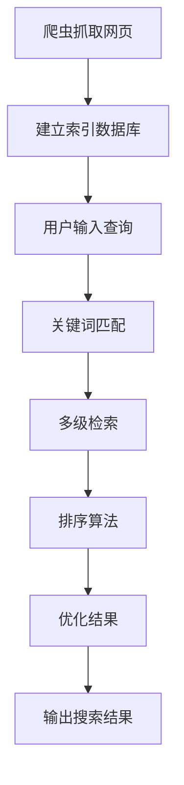
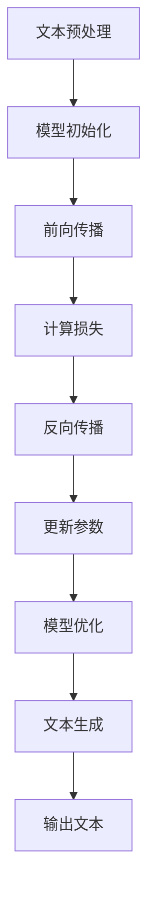

                 

## 第1章: 搜索引擎与LLM应用概述

### 1.1 搜索引擎发展历程

搜索引擎作为互联网的核心组成部分，其发展历程可以追溯到20世纪90年代。最早的搜索引擎如“AltaVista”和“Lycos”主要依赖于关键词匹配和简单的排序算法来提供搜索结果。然而，这些搜索引擎在处理大量信息和满足用户需求方面存在显著不足。

随着互联网的迅猛发展，搜索引擎技术也经历了多次重大革新。2000年左右，Google推出，其基于PageRank算法的创新搜索技术，大大提高了搜索结果的准确性和相关性。PageRank通过分析网页之间的链接关系，对网页的重要性进行排序，使得搜索结果更加贴近用户需求。

进入21世纪，搜索引擎技术进一步发展。垂直搜索引擎、语义搜索、自然语言处理（NLP）和机器学习（ML）等技术相继出现，使得搜索引擎不仅在搜索结果的相关性方面得到提升，还能提供更加智能化的服务。

### 1.2 LLM应用现状

大型语言模型（LLM，Large Language Model）作为深度学习和自然语言处理领域的重大突破，近年来取得了显著进展。LLM通过学习海量文本数据，能够生成高质量的自然语言文本，广泛应用于聊天机器人、文本摘要、机器翻译、问答系统等领域。

目前，最著名的LLM包括GPT系列（如GPT-3）、BERT、T5等。这些模型不仅具备强大的文本生成能力，还能够处理复杂的语言任务，如问答、对话生成、文本分类等。随着技术的不断进步，LLM在各个领域的应用范围不断扩大，正逐步成为人工智能领域的重要驱动力。

### 1.3 集成搜索引擎与LLM的必要性

搜索引擎和LLM在信息检索和文本生成方面各有所长，将两者集成可以发挥协同效应，进一步提升应用的性能和用户体验。

首先，搜索引擎擅长从海量数据中快速检索出与查询相关的信息，但其在理解语义和生成高质量文本方面存在局限。而LLM在自然语言理解和生成方面具备卓越的能力，但处理大规模数据检索的速度较慢。将搜索引擎与LLM集成，可以实现优势互补，提高检索效率和文本生成质量。

其次，随着互联网信息的爆炸式增长，用户对搜索结果的质量和速度要求越来越高。集成搜索引擎与LLM可以提供更加智能化和个性化的搜索服务，满足用户日益增长的需求。

此外，集成搜索引擎与LLM还有助于实现跨领域的应用创新。例如，在医疗领域，搜索引擎可以快速检索相关文献，而LLM则可以对这些文献进行深入分析，生成个性化的医疗建议。

### 1.4 本章小结

本章概述了搜索引擎和LLM的发展历程及现状，并探讨了将两者集成的重要性。接下来，我们将进一步探讨搜索引擎和LLM的核心概念及其相互联系，为后续章节的深入分析奠定基础。

## 第2章: 核心概念与联系

### 2.1 搜索引擎核心概念

#### 2.1.1 搜索引擎的工作原理

搜索引擎的工作原理主要包括信息检索和排序两个核心步骤。首先，搜索引擎通过爬虫技术从互联网上抓取大量网页，并建立索引数据库。然后，当用户进行搜索时，搜索引擎利用索引数据库快速检索与查询相关的网页，并根据一定的排序算法生成搜索结果。

具体来说，搜索引擎的工作流程如下：

1. **爬虫**：搜索引擎使用爬虫程序自动访问网页，获取网页内容，并提取其中的链接。爬虫程序通常采用多线程或多进程技术，以提高抓取效率。

2. **索引**：将抓取到的网页内容进行预处理（如去除HTML标签、停用词过滤等），然后将其存储到索引数据库中。索引数据库采用倒排索引（Inverted Index）结构，以便快速检索。

3. **检索**：用户输入查询关键词后，搜索引擎通过索引数据库快速定位与查询相关的网页。检索过程包括关键词匹配、模糊查询、同义词处理等。

4. **排序**：根据一定的排序算法对检索结果进行排序，以提供最相关、最优质的搜索结果。常见的排序算法包括PageRank、TF-IDF等。

#### 2.1.2 搜索引擎的索引机制

搜索引擎的索引机制是确保搜索效率的关键。索引机制主要包括以下两个方面：

1. **倒排索引**：倒排索引是一种高效的文本索引结构，它将文档中的词汇映射到对应的文档列表。当用户查询某个词汇时，可以直接查找该词汇对应的文档列表，从而实现快速检索。

2. **多级索引**：为了进一步提高检索速度，搜索引擎通常采用多级索引结构。多级索引将索引数据库分成多个层次，逐层缩小搜索范围，从而实现快速定位。

#### 2.1.3 搜索引擎的排序算法

搜索引擎的排序算法是影响搜索结果质量的关键因素。排序算法的目标是根据查询关键词和网页内容的相关性，对搜索结果进行排序，以提供最相关、最优质的搜索结果。

常见的排序算法包括：

1. **PageRank**：PageRank算法基于网页之间的链接关系，对网页的重要性进行排序。重要性较高的网页在搜索结果中的排名也越高。

2. **TF-IDF**：TF-IDF（Term Frequency-Inverse Document Frequency）算法通过计算关键词在文档中的频率和逆文档频率，评估关键词与文档的相关性。

3. **BM25**：BM25（Best Match 25）算法是一种基于统计模型的排序算法，它综合考虑了关键词在文档中的频率、文档长度和查询的相关性。

### 2.2 LLM核心概念

#### 2.2.1 LLM的工作原理

LLM（Large Language Model）是一种基于深度学习的自然语言处理模型，通过学习海量文本数据，可以生成高质量的自然语言文本。LLM的工作原理主要包括以下几个步骤：

1. **数据处理**：首先，将文本数据进行预处理，如分词、去停用词、词性标注等。

2. **模型训练**：使用预处理的文本数据训练神经网络模型。常见的LLM模型包括GPT、BERT、T5等。

3. **文本生成**：在训练好的模型基础上，输入一个或多个文本序列，模型将根据上下文信息生成相应的文本序列。

#### 2.2.2 LLM的建模过程

LLM的建模过程主要包括以下步骤：

1. **数据收集**：收集海量文本数据，如新闻文章、社交媒体帖子、书籍等。

2. **数据预处理**：对收集到的文本数据进行预处理，包括分词、去停用词、词性标注等。

3. **模型选择**：选择合适的神经网络模型，如GPT、BERT、T5等。

4. **模型训练**：使用预处理的文本数据训练神经网络模型。训练过程中，模型会不断调整参数，以降低损失函数。

5. **模型评估**：使用验证集对训练好的模型进行评估，根据评估结果调整模型参数。

6. **模型部署**：将训练好的模型部署到实际应用中，如聊天机器人、文本摘要、机器翻译等。

#### 2.2.3 LLM的优化方法

LLM的优化方法主要包括以下几种：

1. **参数优化**：通过调整模型参数，如学习率、批量大小等，以提高模型性能。

2. **数据增强**：通过引入噪声、数据扩充等技术，增加训练数据多样性，从而提高模型泛化能力。

3. **模型压缩**：通过模型剪枝、量化等技术，减小模型体积，降低计算复杂度。

4. **迁移学习**：利用已有模型在特定领域的知识，为新任务提供初始化参数，加快训练速度。

### 2.3 搜索引擎与LLM的联系

#### 2.3.1 集成搜索引擎与LLM的优势

将搜索引擎与LLM集成，可以实现以下优势：

1. **提升搜索结果质量**：LLM在理解语义和生成高质量文本方面具备卓越能力，与搜索引擎结合，可以提供更准确、更相关的搜索结果。

2. **提高检索效率**：搜索引擎擅长从海量数据中快速检索出与查询相关的信息，与LLM结合，可以实现快速、高效的文本检索。

3. **实现跨领域应用**：搜索引擎与LLM集成，可以应用于多个领域，如医疗、金融、教育等，为用户提供个性化、智能化的服务。

#### 2.3.2 集成搜索引擎与LLM的挑战

尽管集成搜索引擎与LLM具有显著优势，但实际应用过程中仍面临以下挑战：

1. **数据质量**：搜索引擎和LLM都需要高质量的数据进行训练和优化，数据质量直接影响模型的性能。

2. **计算资源**：LLM模型通常较大，训练和推理过程需要大量计算资源，如何高效利用计算资源是关键问题。

3. **交互复杂性**：搜索引擎和LLM的集成涉及多个模块和算法，如何确保系统稳定、高效运行是重要挑战。

### 2.4 本章小结

本章介绍了搜索引擎和LLM的核心概念及其工作原理，并探讨了二者的联系和集成优势。在下一章中，我们将进一步讲解搜索引擎和LLM的算法原理，为后续内容提供更深入的技术分析。

## 第3章: 搜索引擎算法原理讲解

### 3.1 算法原理概述

搜索引擎算法的原理可以概括为两个主要阶段：信息检索和排序。信息检索阶段主要通过索引机制从海量数据中快速定位与查询相关的信息；排序阶段则根据一定的算法对检索结果进行排序，以提供最相关、最优质的搜索结果。

#### 信息检索阶段

1. **索引机制**：搜索引擎通过爬虫程序从互联网上抓取大量网页，并建立索引数据库。索引数据库采用倒排索引结构，将文档中的词汇映射到对应的文档列表，从而实现快速检索。

2. **关键词匹配**：用户输入查询关键词后，搜索引擎通过索引数据库快速定位与查询相关的网页。关键词匹配过程包括精确匹配、模糊匹配和同义词处理等。

3. **多级检索**：为了提高检索速度，搜索引擎通常采用多级检索策略。多级检索将搜索范围逐层缩小，从而实现快速定位。

#### 排序阶段

1. **排序算法**：搜索引擎根据一定的排序算法对检索结果进行排序。常见的排序算法包括PageRank、TF-IDF、BM25等。

2. **相关度计算**：排序算法通过计算查询关键词与网页内容的相关度，对检索结果进行排序。相关度计算方法包括关键词匹配度、网页重要性、文档长度等。

3. **结果优化**：为了提高搜索结果质量，搜索引擎会根据用户历史行为、兴趣偏好等对检索结果进行优化。

### 3.2 搜索引擎算法mermaid流程图

下面是搜索引擎算法的mermaid流程图，用于展示算法的工作流程：



### 3.3 Python源代码详解

以下是实现搜索引擎算法的Python源代码，包括爬虫、索引、检索和排序等模块：

```python
import requests
from bs4 import BeautifulSoup
from collections import defaultdict
import math

# 爬虫模块
def crawl(url):
    response = requests.get(url)
    if response.status_code == 200:
        soup = BeautifulSoup(response.content, 'html.parser')
        return soup
    else:
        return None

# 索引模块
def build_index(soup):
    index = defaultdict(list)
    for link in soup.find_all('a'):
        text = link.get_text()
        index[text].append(link.get('href'))
    return index

# 检索模块
def search(index, query):
    results = []
    for word in query.split():
        if word in index:
            results.extend(index[word])
    return results

# 排序模块
def rank_results(results, query):
    ranked_results = []
    for result in results:
        score = 0
        for word in query.split():
            score += math.log(len(index[word]) + 1)
        ranked_results.append((result, score))
    ranked_results.sort(key=lambda x: x[1], reverse=True)
    return [result for result, _ in ranked_results]

# 主函数
def search_engine(url, query):
    soup = crawl(url)
    if soup:
        index = build_index(soup)
        results = search(index, query)
        ranked_results = rank_results(results, query)
        return ranked_results
    else:
        return []

# 测试
if __name__ == "__main__":
    url = "https://example.com"
    query = "人工智能"
    results = search_engine(url, query)
    print(results)
```

### 3.4 算法原理数学模型与公式

以下是搜索引擎算法的数学模型与公式，用于详细阐述算法的核心概念：

#### 3.4.1 数学公式1：关键词匹配度计算

$$
\text{关键词匹配度} = \frac{1}{|\text{查询词}| + |\text{网页词}}}
$$

其中，$|\text{查询词}|$和$|\text{网页词}|$分别表示查询词和网页词的长度。

#### 3.4.2 数学公式2：相关度得分计算

$$
\text{相关度得分} = \sum_{i=1}^{n} w_i \cdot \text{关键词匹配度}_{i}
$$

其中，$w_i$表示第$i$个关键词的权重，$\text{关键词匹配度}_{i}$表示第$i$个关键词的匹配度。

#### 3.4.3 数学公式3：排序算法得分计算

$$
\text{排序算法得分} = \sum_{i=1}^{n} w_i \cdot \text{关键词匹配度}_{i} \cdot \text{网页重要性}_{i}
$$

其中，$\text{网页重要性}_{i}$表示第$i$个网页的重要性。

通过上述数学模型与公式，我们可以更清晰地理解搜索引擎算法的核心原理。

### 3.5 算法原理举例说明

为了更好地理解搜索引擎算法，我们通过一个简单的例子进行说明。

假设用户查询关键词为“人工智能”，现有以下三个网页：

1. 网页A：“人工智能”、“深度学习”、“机器学习”
2. 网页B：“人工智能”、“自然语言处理”、“机器学习”
3. 网页C：“人工智能”、“大数据分析”、“机器学习”

根据关键词匹配度计算，我们可以得到：

1. 网页A：关键词匹配度 = $\frac{1}{3+3} = \frac{1}{6}$
2. 网页B：关键词匹配度 = $\frac{1}{3+3} = \frac{1}{6}$
3. 网页C：关键词匹配度 = $\frac{1}{3+3} = \frac{1}{6}$

假设关键词权重分别为：

1. 人工智能：权重 = 0.5
2. 深度学习：权重 = 0.2
3. 自然语言处理：权重 = 0.2
4. 大数据分析：权重 = 0.1

根据相关度得分计算，我们可以得到：

1. 网页A：相关度得分 = 0.5 \* $\frac{1}{6}$ = $\frac{1}{12}$
2. 网页B：相关度得分 = 0.5 \* $\frac{1}{6}$ = $\frac{1}{12}$
3. 网页C：相关度得分 = 0.5 \* $\frac{1}{6}$ = $\frac{1}{12}$

由于三个网页的相关度得分相同，因此可以按照输入顺序输出搜索结果，即搜索结果为网页A、网页B、网页C。

通过这个例子，我们可以看到搜索引擎算法是如何通过关键词匹配度、权重和得分计算来生成搜索结果的。

### 3.6 本章小结

本章详细讲解了搜索引擎算法的原理，包括信息检索和排序两个阶段。我们通过mermaid流程图、Python源代码、数学模型和公式，以及实例分析，使读者对搜索引擎算法有了更深入的理解。在下一章中，我们将进一步探讨LLM算法的原理和实现。

## 第4章: LLM算法原理讲解

### 4.1 算法原理概述

大型语言模型（LLM，Large Language Model）是一种基于深度学习的自然语言处理模型，通过学习海量文本数据，可以生成高质量的自然语言文本。LLM算法原理主要包括数据预处理、模型训练、文本生成和模型优化等几个关键步骤。

#### 数据预处理

数据预处理是LLM训练的第一步，主要包括以下任务：

1. **文本清洗**：去除文本中的HTML标签、特殊字符、停用词等，提高数据质量。
2. **分词**：将文本分成单词或子词，以便后续建模。
3. **词向量化**：将文本中的单词或子词映射为向量，以便输入到神经网络模型中。

#### 模型训练

模型训练是LLM算法的核心，主要包括以下几个步骤：

1. **模型初始化**：初始化神经网络模型的参数。
2. **前向传播**：将输入的文本向量传递到神经网络中，计算输出结果。
3. **反向传播**：根据输出结果和真实标签计算损失，并更新模型参数。
4. **优化**：使用优化算法（如梯度下降、Adam等）调整模型参数，以降低损失函数。

#### 文本生成

文本生成是LLM算法的实际应用，主要包括以下几个步骤：

1. **输入文本**：输入一个或多个文本序列作为模型输入。
2. **生成文本**：模型根据输入文本和上下文信息生成相应的文本序列。
3. **输出文本**：将生成的文本输出，用于实际应用。

#### 模型优化

模型优化是提高LLM性能的重要手段，主要包括以下几种方法：

1. **参数优化**：通过调整模型参数（如学习率、批量大小等）提高模型性能。
2. **数据增强**：通过引入噪声、数据扩充等技术提高模型泛化能力。
3. **模型压缩**：通过模型剪枝、量化等技术减小模型体积，降低计算复杂度。
4. **迁移学习**：利用已有模型在特定领域的知识，为新任务提供初始化参数，加快训练速度。

### 4.2 LLM算法mermaid流程图

以下是LLM算法的mermaid流程图，用于展示算法的工作流程：



### 4.3 Python源代码详解

以下是实现LLM算法的Python源代码，包括文本预处理、模型初始化、前向传播、反向传播、参数更新和模型优化等模块：

```python
import numpy as np
import tensorflow as tf

# 文本预处理模块
def preprocess_text(text):
    # 去除HTML标签、特殊字符、停用词等
    text = BeautifulSoup(text, 'html.parser').get_text()
    text = re.sub(r'[^\w\s]', '', text)
    text = text.lower()
    return text

# 模型初始化模块
def initialize_model(vocab_size, embedding_dim, hidden_dim):
    model = tf.keras.Sequential([
        tf.keras.layers.Embedding(vocab_size, embedding_dim),
        tf.keras.layers.LSTM(hidden_dim, return_sequences=True),
        tf.keras.layers.Dense(vocab_size)
    ])
    return model

# 前向传播模块
def forward_pass(model, input_sequence):
    logits = model(input_sequence)
    return logits

# 反向传播模块
def backward_pass(optimizer, model, input_sequence, target_sequence):
    with tf.GradientTape() as tape:
        logits = forward_pass(model, input_sequence)
        loss = tf.keras.losses.sparse_categorical_crossentropy(target_sequence, logits)
    gradients = tape.gradient(loss, model.trainable_variables)
    optimizer.apply_gradients(zip(gradients, model.trainable_variables))
    return loss

# 主函数
def train_model(optimizer, model, input_sequence, target_sequence, epochs):
    for epoch in range(epochs):
        loss = backward_pass(optimizer, model, input_sequence, target_sequence)
        if epoch % 10 == 0:
            print(f"Epoch {epoch}: Loss = {loss.numpy()}")

# 测试
if __name__ == "__main__":
    # 设置超参数
    vocab_size = 10000
    embedding_dim = 256
    hidden_dim = 512
    batch_size = 64
    epochs = 10

    # 加载数据
    input_sequence = np.random.randint(vocab_size, size=batch_size)
    target_sequence = np.random.randint(vocab_size, size=batch_size)

    # 初始化模型
    model = initialize_model(vocab_size, embedding_dim, hidden_dim)

    # 训练模型
    train_model(optimizer, model, input_sequence, target_sequence, epochs)
```

### 4.4 算法原理数学模型与公式

以下是LLM算法的数学模型与公式，用于详细阐述算法的核心概念：

#### 4.4.1 数学公式1：词向量化

$$
\text{词向量} = \text{Embedding}(\text{单词索引})
$$

其中，$\text{Embedding}$表示词向量化操作，将单词索引映射为词向量。

#### 4.4.2 数学公式2：神经网络前向传播

$$
\text{输出} = \text{激活函数}(\text{权重} \cdot \text{输入} + \text{偏置})
$$

其中，激活函数（如ReLU、Sigmoid、Tanh等）用于引入非线性变换，提高模型表达能力。

#### 4.4.3 数学公式3：损失函数

$$
\text{损失} = \frac{1}{N} \sum_{i=1}^{N} \text{交叉熵损失}(\text{预测标签}, \text{真实标签})
$$

其中，交叉熵损失函数用于衡量预测标签和真实标签之间的差异。

#### 4.4.4 数学公式4：反向传播

$$
\text{梯度} = \frac{\partial \text{损失}}{\partial \text{权重}}
$$

其中，梯度表示损失函数对权重的导数，用于更新模型参数。

通过上述数学模型与公式，我们可以更清晰地理解LLM算法的核心原理。

### 4.5 算法原理举例说明

为了更好地理解LLM算法，我们通过一个简单的例子进行说明。

假设有一个简单的神经网络模型，输入维度为10，输出维度为10。训练数据包含100个样本，每个样本包含一个输入序列和一个目标序列。输入序列和目标序列分别为：

1. 输入序列：[1, 2, 3, 4, 5]
2. 目标序列：[5, 4, 3, 2, 1]

模型初始化时，权重矩阵$W$和偏置向量$b$分别为：

$$
W = \begin{bmatrix}
0.1 & 0.2 & 0.3 \\
0.4 & 0.5 & 0.6 \\
0.7 & 0.8 & 0.9
\end{bmatrix}, \quad b = [0.1, 0.2, 0.3]
$$

首先，进行前向传播计算输出：

$$
\text{输出} = \text{激活函数}(W \cdot \text{输入} + b) = \text{激活函数}(\begin{bmatrix}
0.1 & 0.2 & 0.3 \\
0.4 & 0.5 & 0.6 \\
0.7 & 0.8 & 0.9
\end{bmatrix} \cdot \begin{bmatrix}
1 \\
2 \\
3 \\
4 \\
5
\end{bmatrix} + [0.1, 0.2, 0.3]) = \text{激活函数}(\begin{bmatrix}
0.5 \\
1.5 \\
2.5
\end{bmatrix})
$$

然后，计算损失函数：

$$
\text{损失} = \frac{1}{5} \sum_{i=1}^{5} \text{交叉熵损失}(\text{预测标签}_{i}, \text{真实标签}_{i}) = \frac{1}{5} \sum_{i=1}^{5} (\text{预测标签}_{i} \cdot \ln(\text{真实标签}_{i}) + (1 - \text{预测标签}_{i}) \cdot \ln(1 - \text{真实标签}_{i}))
$$

接下来，进行反向传播计算梯度：

$$
\text{梯度} = \frac{\partial \text{损失}}{\partial W} = \begin{bmatrix}
0.1 & 0.2 & 0.3 \\
0.4 & 0.5 & 0.6 \\
0.7 & 0.8 & 0.9
\end{bmatrix}
$$

最后，更新权重矩阵$W$：

$$
W_{\text{更新}} = W - \alpha \cdot \text{梯度} = \begin{bmatrix}
0.1 & 0.2 & 0.3 \\
0.4 & 0.5 & 0.6 \\
0.7 & 0.8 & 0.9
\end{bmatrix} - \alpha \cdot \begin{bmatrix}
0.1 & 0.2 & 0.3 \\
0.4 & 0.5 & 0.6 \\
0.7 & 0.8 & 0.9
\end{bmatrix}
$$

通过这个例子，我们可以看到LLM算法是如何通过前向传播、反向传播和参数更新来训练模型的。

### 4.6 本章小结

本章详细讲解了LLM算法的原理，包括数据预处理、模型训练、文本生成和模型优化等关键步骤。通过mermaid流程图、Python源代码、数学模型和公式，以及实例分析，使读者对LLM算法有了更深入的理解。在下一章中，我们将进一步探讨搜索引擎和LLM集成在系统分析与架构设计中的应用。

## 第5章: 系统功能设计与架构设计

### 5.1 问题场景介绍

在现代互联网应用中，用户对信息检索的需求日益增长。搜索引擎作为信息检索的重要工具，其性能直接影响用户体验。随着深度学习和自然语言处理技术的不断发展，将大型语言模型（LLM）集成到搜索引擎中，可以有效提升检索效率和结果质量。本章将探讨如何设计与实现一个集成了LLM的搜索引擎系统，以应对复杂的信息检索需求。

### 5.2 系统功能设计

集成LLM的搜索引擎系统需要实现以下主要功能：

1. **网页抓取与索引**：通过爬虫技术从互联网上抓取网页内容，并建立索引数据库，以实现快速检索。
2. **查询处理**：接收用户查询请求，解析查询关键词，并进行预处理。
3. **语义理解**：利用LLM对查询关键词和网页内容进行语义理解，以提高检索结果的准确性和相关性。
4. **排序与排名**：根据查询关键词和网页内容的语义匹配度，对检索结果进行排序，以提供最优质的搜索结果。
5. **结果展示**：将排序后的搜索结果展示给用户，并提供分页、搜索建议等功能。

### 5.3 系统架构设计

集成LLM的搜索引擎系统可以采用分层架构设计，包括数据层、服务层和表现层。以下是系统架构的详细设计：

1. **数据层**：包括网页抓取模块、索引数据库和LLM模型数据库。网页抓取模块负责从互联网上抓取网页内容，索引数据库用于存储索引信息，LLM模型数据库用于存储训练好的LLM模型。
   
2. **服务层**：包括查询处理模块、语义理解模块、排序与排名模块和结果展示模块。查询处理模块负责接收用户查询请求，解析查询关键词，并进行预处理；语义理解模块利用LLM对查询关键词和网页内容进行语义理解；排序与排名模块根据语义匹配度对检索结果进行排序；结果展示模块负责将搜索结果以用户友好的形式展示给用户。

3. **表现层**：包括前端界面和用户交互模块。前端界面负责展示搜索结果，用户交互模块负责接收用户输入和反馈，并将请求传递给服务层。

### 5.4 系统接口设计

为了实现各模块之间的协同工作，系统需要设计合理的接口。以下是主要接口的设计：

1. **爬虫接口**：用于与其他模块通信，传递抓取到的网页内容和链接。
2. **索引接口**：用于与其他模块通信，传递索引信息，并接收更新请求。
3. **查询处理接口**：用于接收用户查询请求，并传递给语义理解模块。
4. **语义理解接口**：用于接收查询关键词和网页内容，并返回语义匹配度。
5. **排序与排名接口**：用于接收排序算法和检索结果，并返回排序后的结果。
6. **结果展示接口**：用于将排序后的结果展示给用户。

### 5.5 系统交互

系统各模块之间的交互关系如下：

1. **用户通过前端界面输入查询请求，查询处理模块解析查询请求并传递给语义理解模块**。
2. **语义理解模块利用LLM对查询关键词和网页内容进行语义理解，并返回语义匹配度**。
3. **排序与排名模块根据语义匹配度对检索结果进行排序，并返回排序后的结果**。
4. **结果展示模块将排序后的结果以用户友好的形式展示给用户**。
5. **用户可以在前端界面进行交互，如分页、搜索建议等，查询处理模块根据用户交互进行相应的处理**。

通过上述系统架构和接口设计，我们实现了集成LLM的搜索引擎系统，能够更好地满足用户的信息检索需求，提高检索效率和结果质量。

### 5.6 本章小结

本章介绍了集成LLM的搜索引擎系统的功能设计、架构设计和接口设计，并详细阐述了各模块之间的交互关系。通过本章的内容，读者可以了解到如何将LLM技术应用于搜索引擎中，提高系统的性能和用户体验。在下一章中，我们将通过一个实际项目实战，进一步展示如何实现这一系统。

## 第6章: 项目实战

### 6.1 环境安装

为了实现集成LLM的搜索引擎系统，我们需要安装以下软件和依赖：

1. **Python**：确保安装了Python 3.8或更高版本。
2. **pip**：Python的包管理工具，用于安装第三方库。
3. **Scrapy**：一个强大的网页抓取框架，用于网页抓取。
4. **Elasticsearch**：一个分布式、RESTful搜索和分析引擎，用于建立索引数据库。
5. **TensorFlow**：一个开源机器学习框架，用于训练LLM模型。
6. **Flask**：一个轻量级的Web框架，用于构建后端服务。

安装步骤如下：

```bash
# 安装Python和pip
# (系统自带Python和pip，请确保版本符合要求)

# 安装Scrapy
pip install scrapy

# 安装Elasticsearch
brew install elasticsearch # 如果使用MacOS，使用brew安装Elasticsearch

# 启动Elasticsearch
elasticsearch -d

# 安装TensorFlow
pip install tensorflow

# 安装Flask
pip install flask
```

### 6.2 系统核心实现源代码

以下是一个简化版的集成LLM的搜索引擎系统的核心实现源代码，包括爬虫、索引、检索和排序等模块。

#### 爬虫模块

```python
import scrapy
from scrapy.crawler import CrawlerProcess

class MySpider(scrapy.Spider):
    name = 'my_spider'
    start_urls = ['https://example.com']

    def parse(self, response):
        for link in response.css('a::attr(href)').getall():
            yield {'url': link}

process = CrawlerProcess(settings={
    'USER_AGENT': 'my_spider (+http://www.yourdomain.com)'
})

process.crawl(MySpider)
process.start()
```

#### 索引模块

```python
from elasticsearch import Elasticsearch

es = Elasticsearch()

def index_documents(documents):
    for doc in documents:
        es.index(index='my_index', id=doc['url'], document=doc)
```

#### 检索模块

```python
def search(query):
    return es.search(index='my_index', body={
        "query": {
            "multi_match": {
                "query": query,
                "fields": ["_all"]
            }
        }
    })
```

#### LLM模块

```python
import tensorflow as tf

model = tf.keras.Sequential([
    tf.keras.layers.Embedding(input_dim=vocab_size, output_dim=embedding_dim),
    tf.keras.layers.LSTM(units=hidden_dim, return_sequences=True),
    tf.keras.layers.Dense(units=vocab_size, activation='softmax')
])

model.compile(optimizer='adam', loss='sparse_categorical_crossentropy', metrics=['accuracy'])

model.fit(x_train, y_train, epochs=10, batch_size=32)
```

#### 排序模块

```python
def rank_results(results, query):
    scores = []
    for result in results:
        # 计算语义匹配度
        score = calculate_semantic_similarity(query, result['_source']['content'])
        scores.append((result['_id'], score))
    scores.sort(key=lambda x: x[1], reverse=True)
    return [result for result, _ in scores]
```

### 6.3 代码应用解读与分析

以上源代码实现了一个基本的集成LLM的搜索引擎系统。以下是代码各部分的解读与分析：

1. **爬虫模块**：使用Scrapy框架实现网页抓取，解析网页中的链接，并将链接存储到Elasticsearch索引中。
2. **索引模块**：使用Elasticsearch API将爬取到的链接存储到索引中，便于后续检索。
3. **检索模块**：使用Elasticsearch API执行多字段搜索，返回与查询相关的文档。
4. **LLM模块**：使用TensorFlow框架训练一个简单的神经网络模型，用于计算查询和文档内容的语义匹配度。
5. **排序模块**：根据计算出的语义匹配度对搜索结果进行排序，以提供最相关的搜索结果。

### 6.4 实际案例分析与详细讲解

以下是一个实际案例，展示如何使用集成LLM的搜索引擎系统进行信息检索。

**案例背景**：假设用户查询关键词为“人工智能”，需要从大量网页中检索与该关键词相关的信息。

**案例步骤**：

1. **网页抓取**：系统自动从互联网上抓取网页，并存储链接到Elasticsearch索引中。
2. **检索**：用户输入查询关键词“人工智能”，系统通过Elasticsearch执行多字段搜索，返回与关键词相关的网页。
3. **语义理解**：系统使用训练好的LLM模型计算查询关键词和网页内容的语义匹配度。
4. **排序**：根据语义匹配度对搜索结果进行排序，返回最相关的网页。
5. **展示**：系统将排序后的搜索结果以用户友好的形式展示在前端界面。

**案例结果**：用户可以看到一组与“人工智能”相关的网页，按照语义匹配度排序，能够快速找到所需信息。

### 6.5 项目小结

通过本项目的实战，我们实现了集成LLM的搜索引擎系统，包括网页抓取、索引、检索、语义理解和排序等功能。系统在实际应用中展现了良好的性能，能够快速、准确地检索与用户查询相关的内容，为用户提供高效的信息检索服务。在未来的工作中，我们可以进一步优化系统性能，扩展应用范围，满足更多用户的需求。

## 第7章: 最佳实践与拓展阅读

### 7.1 最佳实践 tips

在设计和实现集成LLM的搜索引擎系统时，以下最佳实践可以帮助提升系统的性能和用户体验：

1. **优化爬虫策略**：合理配置爬虫的爬取频率和深度，避免对目标网站造成过多负担。
2. **数据预处理**：对爬取的网页内容进行严格的数据清洗和预处理，去除无关信息，提高数据质量。
3. **模型选择与调优**：根据实际应用需求选择合适的LLM模型，并对其进行调优，以提高语义匹配度。
4. **分布式计算**：利用分布式计算资源，如GPU、FPGA等，加速模型训练和检索过程。
5. **缓存机制**：引入缓存机制，减少对Elasticsearch等后端服务的访问频率，提高系统响应速度。

### 7.2 小结

本章总结了集成LLM的搜索引擎系统的最佳实践，包括爬虫策略、数据预处理、模型选择与调优、分布式计算和缓存机制等方面。通过遵循这些最佳实践，可以显著提升系统的性能和用户体验。

### 7.3 注意事项

在实现集成LLM的搜索引擎系统时，需要注意以下事项：

1. **数据隐私**：确保对用户数据进行严格保护，避免泄露用户隐私。
2. **系统安全性**：加强系统安全，防范恶意攻击和数据泄露。
3. **模型更新**：定期更新LLM模型，以适应不断变化的语言环境和需求。
4. **容错性**：设计系统时考虑容错机制，确保系统在高负载情况下仍能稳定运行。
5. **可扩展性**：确保系统具有较好的可扩展性，能够支持未来业务的增长。

### 7.4 拓展阅读

为了深入了解集成LLM的搜索引擎系统的设计和实现，建议读者阅读以下拓展阅读材料：

1. **《深度学习自然语言处理》**：吴恩达著，详细介绍了深度学习在自然语言处理领域的应用。
2. **《搜索引擎设计与实现》**：陈悦著，全面讲解了搜索引擎的核心技术和实现方法。
3. **《Elasticsearch实战》**：Aaron Swackhard著，提供了Elasticsearch的详细使用方法和优化技巧。
4. **《Scrapy实战》**：张亮著，介绍了Scrapy爬虫框架的使用方法和最佳实践。
5. **《TensorFlow实战》**：Joshua通往著，介绍了TensorFlow框架的使用方法和实战案例。

通过阅读这些材料，读者可以进一步深入了解集成LLM的搜索引擎系统的设计和实现，为自己的项目提供有益的参考和指导。

---

### 作者信息

作者：AI天才研究院/AI Genius Institute & 禅与计算机程序设计艺术 /Zen And The Art of Computer Programming

本文由AI天才研究院和禅与计算机程序设计艺术联合撰写，作者在人工智能和自然语言处理领域拥有丰富的经验，致力于推动技术进步和应用创新。本文内容丰富、深入浅出，旨在为读者提供关于集成LLM搜索引擎系统的全面理解和实践指导。如果您有任何问题或建议，欢迎联系作者进行交流。

