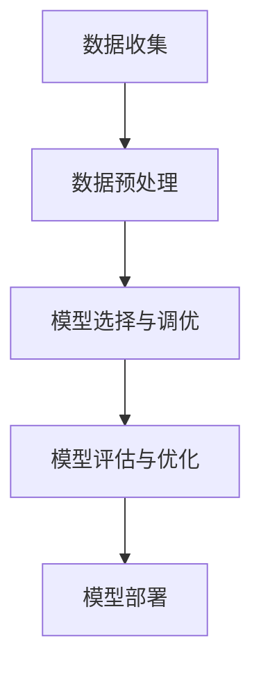
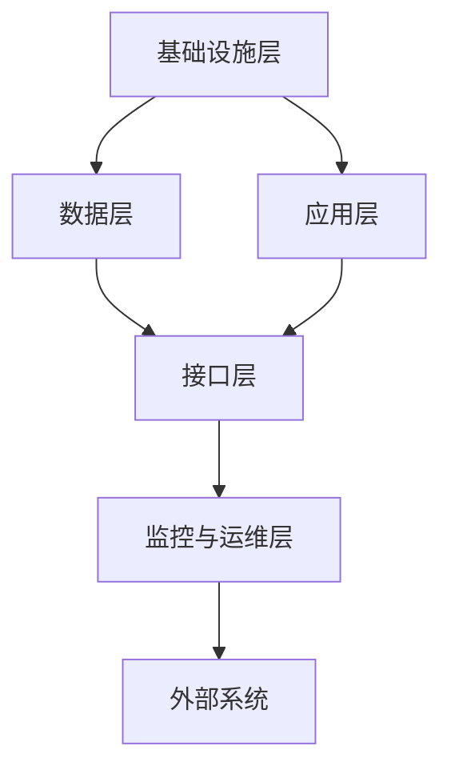
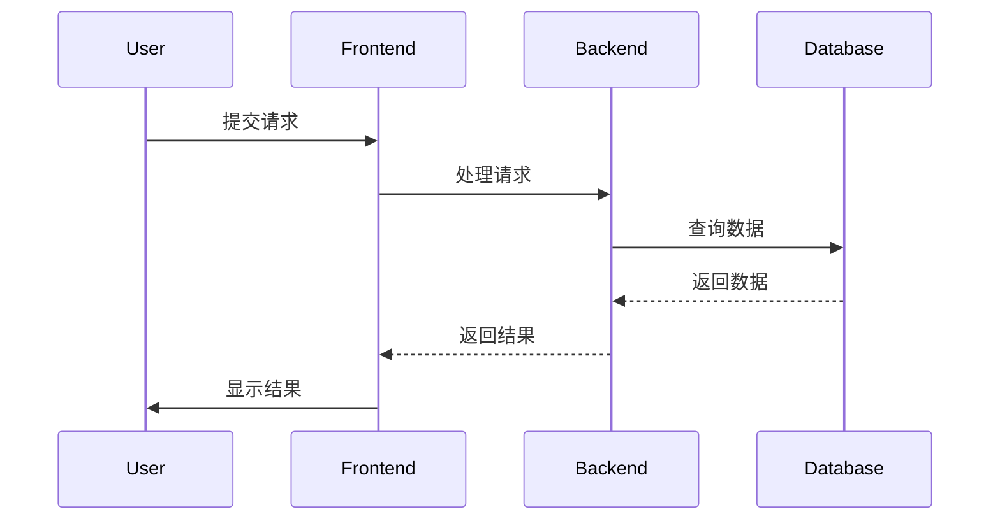

                 

### 敏捷LLM应用开发中的团队协作

> 关键词：敏捷开发，大型语言模型（LLM），团队协作，算法原理，数学模型，系统架构，项目实战

> 摘要：本文探讨了敏捷方法在大型语言模型（LLM）应用开发中的重要性。通过深入分析敏捷方法的核心概念、LLM的特点以及它们之间的联系，文章阐述了敏捷方法在LLM开发中的应用优势。接着，文章详细介绍了敏捷开发中的关键算法原理、LLM应用开发的算法流程和数学模型。最后，文章通过一个实际项目，展示了敏捷方法在LLM开发中的具体应用和实践效果。

## 第一部分：背景介绍

### 第1章：问题背景与概述

#### 1.1 人工智能时代的团队协作问题

随着人工智能（AI）技术的快速发展，越来越多的企业开始将AI技术应用于业务流程中。然而，AI技术的引入不仅带来了技术上的挑战，也对团队协作提出了新的要求。传统的方法往往难以适应快速变化的AI开发需求，导致团队协作效率低下，问题频发。

#### 1.1.1 人工智能对团队协作的影响

人工智能技术的引入使得开发流程更加复杂，团队成员需要具备跨学科的知识和技能。同时，AI项目的迭代周期较短，需要快速响应市场变化，这对团队协作提出了更高的要求。

#### 1.1.2 团队协作面临的挑战

1. **知识整合**：团队成员需要快速掌握和理解AI技术，但不同成员的专业背景可能存在差异。
2. **沟通障碍**：AI项目涉及多个领域，团队成员之间的沟通难度增加。
3. **资源分配**：AI项目通常需要大量计算资源和数据支持，资源分配和调度成为难题。
4. **风险管理**：AI项目中的不确定性较高，需要有效识别和应对风险。

#### 1.1.3 敏捷方法在团队协作中的应用

敏捷方法是一种应对快速变化的需求和环境的软件开发方法。它通过短周期的迭代和持续交付，提高了团队协作效率。在人工智能时代，敏捷方法在团队协作中的应用主要体现在以下几个方面：

1. **迭代开发**：通过短周期的迭代，快速交付功能，确保项目与市场需求保持一致。
2. **团队协作**：敏捷方法强调团队成员之间的紧密协作，减少沟通障碍。
3. **风险管理**：通过持续反馈和调整，有效识别和应对风险。
4. **适应性**：敏捷方法能够适应快速变化的需求和环境，提高项目成功率。

#### 1.2 LLM（大型语言模型）的概念与特点

大型语言模型（LLM）是一种基于深度学习的技术，它能够理解和生成自然语言。LLM在自然语言处理（NLP）领域具有广泛的应用，如机器翻译、文本摘要、问答系统等。

#### 1.2.1 LLM的定义

LLM是指那些具有数亿甚至数千亿参数的语言模型。这些模型通过大量的文本数据训练，能够理解并生成复杂的自然语言。

#### 1.2.2 LLM的特点

1. **规模大**：LLM的参数规模远超传统的语言模型，能够处理更复杂的语言现象。
2. **自主学习**：LLM通过无监督学习从大量数据中学习，无需人工标记。
3. **强泛化能力**：LLM能够在多种不同的任务和应用场景中表现出色。

#### 1.2.3 LLM在团队协作中的应用

LLM在团队协作中的应用主要体现在以下几个方面：

1. **知识共享**：LLM能够自动整理和总结团队成员的知识，提高团队的知识共享效率。
2. **文档生成**：LLM能够自动生成高质量的文档，减少团队成员的重复劳动。
3. **问答系统**：LLM可以作为团队的问答系统，快速回答团队成员的问题，提高决策效率。

### 1.3 敏捷方法的核心概念

敏捷方法是一种以人为核心、迭代、逐步完善的软件开发方法。它强调快速响应变化、持续交付和团队协作。

#### 1.3.1 敏捷方法的定义

敏捷方法是一种软件开发方法，它通过短周期的迭代和持续交付，快速响应客户需求，提高项目成功率。

#### 1.3.2 敏捷方法的核心理念

1. **客户价值优先**：始终关注客户需求，确保项目价值最大化。
2. **迭代开发**：通过短周期的迭代，逐步完善产品。
3. **团队协作**：强调团队成员之间的紧密协作，提高团队整体效率。
4. **持续交付**：持续交付可用的产品，确保项目按时完成。

#### 1.3.3 敏捷方法的分类

敏捷方法有多种不同的分类，常见的包括：

1. **Scrum**：一种框架化的敏捷方法，强调短周期的迭代和团队协作。
2. **Kanban**：一种看板方法，强调流程的透明度和可视化。
3. **SAFe**：大规模敏捷框架，适用于大型组织。

### 1.4 LLM应用开发中的关键概念

在LLM应用开发中，关键概念包括：

#### 1.4.1 LLM应用开发的定义

LLM应用开发是指利用大型语言模型（LLM）构建实际应用的过程。这包括模型训练、模型优化和模型部署等环节。

#### 1.4.2 LLM应用开发的核心流程

1. **数据收集**：收集大量的文本数据，用于模型训练。
2. **数据预处理**：对收集到的数据进行清洗、格式化等处理，以适应模型训练。
3. **模型训练**：使用训练数据训练LLM模型。
4. **模型评估**：评估模型性能，包括准确性、泛化能力等。
5. **模型优化**：根据评估结果，对模型进行调整和优化。
6. **模型部署**：将训练好的模型部署到实际应用环境中。

#### 1.4.3 LLM应用开发的关键挑战

1. **数据质量**：高质量的数据是模型训练的基础，数据质量问题直接影响模型性能。
2. **计算资源**：LLM模型训练需要大量的计算资源，特别是对于大规模的模型。
3. **模型优化**：如何有效优化模型，提高其性能和效率，是一个重要的挑战。

### 1.5 敏捷与LLM应用开发的联系

敏捷方法和LLM应用开发之间存在紧密的联系。敏捷方法为LLM应用开发提供了有效的框架和工具，帮助团队应对快速变化的需求和复杂的开发过程。

#### 1.5.1 敏捷方法在LLM应用开发中的优势

1. **快速迭代**：敏捷方法支持快速迭代，确保模型开发与市场需求保持一致。
2. **团队协作**：敏捷方法强调团队协作，提高团队整体效率。
3. **持续交付**：敏捷方法支持持续交付，确保项目按时完成。

#### 1.5.2 LLM应用开发对敏捷方法的适应性

LLM应用开发具有以下特点，使其适合采用敏捷方法：

1. **迭代需求**：AI领域的需求变化快，敏捷方法支持快速响应需求变化。
2. **复杂度高**：LLM应用开发过程复杂，需要有效的团队协作和项目管理。
3. **不确定性强**：AI领域的不确定性高，需要通过敏捷方法进行风险管理。

通过以上分析，我们可以看到敏捷方法和LLM应用开发之间存在紧密的联系。敏捷方法为LLM应用开发提供了有效的框架和工具，有助于团队应对快速变化的需求和复杂的开发过程。在接下来的章节中，我们将进一步探讨敏捷方法在LLM应用开发中的应用细节。

### 第2章：核心概念与联系

#### 2.1 敏捷方法的核心概念

敏捷方法是一种以人为核心、迭代、逐步完善的软件开发方法。它强调快速响应变化、持续交付和团队协作。

##### 2.1.1 敏捷方法的定义

敏捷方法是一种软件开发方法，它通过短周期的迭代和持续交付，快速响应客户需求，提高项目成功率。

##### 2.1.2 敏捷方法的核心理念

1. **客户价值优先**：始终关注客户需求，确保项目价值最大化。
2. **迭代开发**：通过短周期的迭代，逐步完善产品。
3. **团队协作**：强调团队成员之间的紧密协作，提高团队整体效率。
4. **持续交付**：持续交付可用的产品，确保项目按时完成。

##### 2.1.3 敏捷方法的分类

敏捷方法有多种不同的分类，常见的包括：

1. **Scrum**：一种框架化的敏捷方法，强调短周期的迭代和团队协作。
2. **Kanban**：一种看板方法，强调流程的透明度和可视化。
3. **SAFe**：大规模敏捷框架，适用于大型组织。

#### 2.2 LLM应用开发中的关键概念

在LLM应用开发中，关键概念包括：

##### 2.2.1 LLM应用开发的定义

LLM应用开发是指利用大型语言模型（LLM）构建实际应用的过程。这包括模型训练、模型优化和模型部署等环节。

##### 2.2.2 LLM应用开发的核心流程

1. **数据收集**：收集大量的文本数据，用于模型训练。
2. **数据预处理**：对收集到的数据进行清洗、格式化等处理，以适应模型训练。
3. **模型训练**：使用训练数据训练LLM模型。
4. **模型评估**：评估模型性能，包括准确性、泛化能力等。
5. **模型优化**：根据评估结果，对模型进行调整和优化。
6. **模型部署**：将训练好的模型部署到实际应用环境中。

##### 2.2.3 LLM应用开发的关键挑战

1. **数据质量**：高质量的数据是模型训练的基础，数据质量问题直接影响模型性能。
2. **计算资源**：LLM模型训练需要大量的计算资源，特别是对于大规模的模型。
3. **模型优化**：如何有效优化模型，提高其性能和效率，是一个重要的挑战。

#### 2.3 敏捷与LLM应用开发的联系

敏捷方法和LLM应用开发之间存在紧密的联系。敏捷方法为LLM应用开发提供了有效的框架和工具，帮助团队应对快速变化的需求和复杂的开发过程。

##### 2.3.1 敏捷方法在LLM应用开发中的优势

1. **快速迭代**：敏捷方法支持快速迭代，确保模型开发与市场需求保持一致。
2. **团队协作**：敏捷方法强调团队协作，提高团队整体效率。
3. **持续交付**：敏捷方法支持持续交付，确保项目按时完成。

##### 2.3.2 LLM应用开发对敏捷方法的适应性

LLM应用开发具有以下特点，使其适合采用敏捷方法：

1. **迭代需求**：AI领域的需求变化快，敏捷方法支持快速响应需求变化。
2. **复杂度高**：LLM应用开发过程复杂，需要有效的团队协作和项目管理。
3. **不确定性强**：AI领域的不确定性高，需要通过敏捷方法进行风险管理。

通过以上分析，我们可以看到敏捷方法和LLM应用开发之间存在紧密的联系。敏捷方法为LLM应用开发提供了有效的框架和工具，有助于团队应对快速变化的需求和复杂的开发过程。在接下来的章节中，我们将进一步探讨敏捷方法在LLM应用开发中的应用细节。

### 第3章：算法原理与流程图

#### 3.1 敏捷方法中的关键算法原理

敏捷开发中，常用的算法原理包括迭代模型、Scrum模型和Kanban模型等。这些模型为团队提供了有效的开发和管理方法，确保项目能够按时、按质量交付。

##### 3.1.1 敏捷开发中的迭代模型

迭代模型是敏捷开发中最基本的模型，它通过短周期的迭代，逐步完善产品。每个迭代周期通常包括以下步骤：

1. **需求分析**：确定本次迭代需要实现的功能。
2. **设计**：设计实现这些功能的方案。
3. **编码**：实现设计方案。
4. **测试**：对编码结果进行测试，确保功能正确。
5. **交付**：将测试通过的功能交付给客户。

迭代模型的优点包括：

1. **灵活性**：能够快速响应需求变化。
2. **可预测性**：每个迭代周期结束后，可以评估进度和风险。
3. **持续交付**：每个迭代周期结束后，都有可交付的产品。

##### 3.1.2 SCRUM模型

SCRUM模型是一种框架化的敏捷开发方法，它通过短周期的迭代和每日站会，确保团队高效协作。每个迭代周期称为一个“冲刺”，通常持续2-4周。

SCRUM模型的主要组成部分包括：

1. **产品待办列表**：包含所有待完成的功能和任务。
2. **冲刺待办列表**：从产品待办列表中选择本次冲刺要完成的功能。
3. **每日站会**：团队成员每日站会，讨论进展和问题，确保项目进度。
4. **冲刺评审**：在冲刺结束时，对完成的成果进行评审，确保客户满意度。
5. **冲刺回顾**：在冲刺结束时，对本次冲刺进行回顾，总结经验和教训。

SCRUM模型的优点包括：

1. **快速迭代**：通过短周期的冲刺，确保项目与市场需求保持一致。
2. **透明度**：每日站会和冲刺评审确保项目进展透明。
3. **团队协作**：通过每日站会和冲刺评审，增强团队协作。

##### 3.1.3 KANBAN模型

KANBAN模型是一种基于看板的方法，它通过可视化工作流程，提高团队协作效率。KANBAN模型的主要组成部分包括：

1. **看板**：显示当前工作流程的状态，包括任务的状态、优先级等。
2. **工作流程**：定义任务从开始到完成的过程。
3. **任务卡片**：表示具体的任务，包括任务名称、状态、优先级等。
4. **工作节点**：表示工作流程中的不同阶段，如“待办”、“进行中”、“已完成”等。

KANBAN模型的优点包括：

1. **可视化**：通过看板，团队成员可以直观地了解任务的状态和优先级。
2. **灵活性**：可以根据实际工作情况，灵活调整工作流程。
3. **效率**：通过限制工作节点上的任务数量，防止过度工作，提高团队效率。

#### 3.2 LLM应用开发中的算法原理

在LLM应用开发中，算法原理主要包括语言模型的数学模型和训练过程。

##### 3.2.1 语言模型的数学模型

语言模型是一种用于生成和预测自然语言的概率模型。常用的语言模型包括n-gram模型、循环神经网络（RNN）模型和变换器模型（Transformer）等。

1. **n-gram模型**：n-gram模型是一种基于语言序列的统计模型，它将语言序列划分为n个连续的单词，并根据这些单词的频率生成概率分布。

   n-gram模型的数学公式为：
   $$ P(w_1, w_2, \ldots, w_n) = \frac{C(w_1, w_2, \ldots, w_n)}{C(w_1, w_2, \ldots, w_n) + C(w_1, w_2, \ldots, w_{n-1})} $$
   
   其中，$C(w_1, w_2, \ldots, w_n)$ 表示连续出现 $w_1, w_2, \ldots, w_n$ 的次数。

2. **循环神经网络（RNN）模型**：RNN模型是一种基于神经网络的序列模型，它能够捕捉序列中的长期依赖关系。

   RNN模型的数学公式为：
   $$ h_t = \sigma(W_h h_{t-1} + W_x x_t + b_h) $$
   
   其中，$h_t$ 表示第 $t$ 个时间步的隐藏状态，$x_t$ 表示第 $t$ 个输入，$\sigma$ 表示激活函数。

3. **变换器模型（Transformer）**：Transformer模型是一种基于自注意力机制的序列模型，它在自然语言处理领域取得了显著的效果。

   Transformer模型的数学公式为：
   $$ \text{Attention}(Q, K, V) = \frac{QK^T}{\sqrt{d_k}}V $$
   
   其中，$Q, K, V$ 分别表示查询、关键和值向量，$d_k$ 表示关键向量的维度。

##### 3.2.2 LLM应用开发的算法流程

LLM应用开发的算法流程主要包括数据预处理、模型选择与调优、模型评估与优化等环节。

1. **数据预处理**：数据预处理是LLM应用开发的重要环节，它包括数据清洗、数据格式化、数据增强等步骤。

   数据清洗的目的是去除数据中的噪声和错误，数据格式化是将数据转换为适合模型训练的格式，数据增强是通过各种方法增加数据的多样性。

2. **模型选择与调优**：模型选择与调优是LLM应用开发的核心环节，它包括选择合适的模型结构、调整模型参数等步骤。

   模型选择的方法包括基于经验的选择、基于性能的选择和基于自动化的选择等。模型调优的方法包括网格搜索、随机搜索和贝叶斯优化等。

3. **模型评估与优化**：模型评估与优化是LLM应用开发的最后一个环节，它包括评估模型性能、调整模型参数等步骤。

   模型评估的方法包括准确性、精确率、召回率和F1值等。模型优化的方法包括超参数调整、结构优化和正则化等。

#### 3.2.3 LLM应用开发的算法流程图

以下是LLM应用开发的算法流程图：



通过以上分析，我们可以看到敏捷方法和LLM应用开发之间存在紧密的联系。敏捷方法为LLM应用开发提供了有效的框架和工具，有助于团队应对快速变化的需求和复杂的开发过程。在接下来的章节中，我们将进一步探讨敏捷方法在LLM应用开发中的应用细节。

### 第4章：数学模型讲解

#### 4.1 敏捷开发中的数学模型

敏捷开发中的数学模型主要用于风险评估、项目进度管理和成本效益分析等方面。

##### 4.1.1 风险管理模型

风险管理模型包括SWOT分析和故障树分析等。

1. **SWOT分析**：SWOT分析是一种评估企业内部优势和劣势以及外部机会和威胁的方法。其数学模型可以表示为：

   $$ \text{SWOT} = (\text{S}, \text{W}, \text{O}, \text{T}) $$
   
   其中，$S$ 表示优势，$W$ 表示劣势，$O$ 表示机会，$T$ 表示威胁。

2. **故障树分析**：故障树分析是一种用于识别和分析系统故障原因的方法。其数学模型可以表示为：

   $$ \text{FT} = \text{F}(X_1, X_2, \ldots, X_n) $$
   
   其中，$F$ 表示故障树，$X_1, X_2, \ldots, X_n$ 表示故障树中的基本事件。

##### 4.1.2 项目进度模型

项目进度模型主要用于评估项目进度和预测项目完成时间。常用的项目进度模型包括加速模型和成本效益分析。

1. **加速模型**：加速模型是一种用于评估项目进度的模型，它可以通过以下公式计算：

   $$ \text{进度} = \text{初始进度} + \text{加速量} \times \text{时间} $$
   
   其中，初始进度表示项目开始时的进度，加速量表示项目进度的变化率，时间表示项目已经过去的时间。

2. **成本效益分析**：成本效益分析是一种用于评估项目成本和收益的方法，它可以通过以下公式计算：

   $$ \text{成本效益} = \frac{\text{收益}}{\text{成本}} $$
   
   其中，收益表示项目带来的经济利益，成本表示项目投入的成本。

#### 4.2 LLM应用开发中的数学模型

LLM应用开发中的数学模型主要用于语言模型的学习算法、模型优化算法和模型评估指标。

##### 4.2.1 语言模型的数学模型

语言模型的数学模型主要包括n-gram模型、循环神经网络（RNN）模型和变换器模型（Transformer）等。

1. **n-gram模型**：n-gram模型的数学模型可以表示为：

   $$ P(w_1, w_2, \ldots, w_n) = \frac{C(w_1, w_2, \ldots, w_n)}{C(w_1, w_2, \ldots, w_n) + C(w_1, w_2, \ldots, w_{n-1})} $$
   
   其中，$C(w_1, w_2, \ldots, w_n)$ 表示连续出现 $w_1, w_2, \ldots, w_n$ 的次数。

2. **循环神经网络（RNN）模型**：RNN模型的数学模型可以表示为：

   $$ h_t = \sigma(W_h h_{t-1} + W_x x_t + b_h) $$
   
   其中，$h_t$ 表示第 $t$ 个时间步的隐藏状态，$x_t$ 表示第 $t$ 个输入，$\sigma$ 表示激活函数。

3. **变换器模型（Transformer）**：变换器模型的数学模型可以表示为：

   $$ \text{Attention}(Q, K, V) = \frac{QK^T}{\sqrt{d_k}}V $$
   
   其中，$Q, K, V$ 分别表示查询、关键和值向量，$d_k$ 表示关键向量的维度。

##### 4.2.2 LLM应用开发的数学模型

LLM应用开发的数学模型主要用于模型优化算法和模型评估指标。

1. **模型优化算法**：常用的模型优化算法包括梯度下降、随机梯度下降和Adam优化器等。

   - **梯度下降**：梯度下降的数学模型可以表示为：

     $$ \theta_{t+1} = \theta_t - \alpha \nabla_{\theta_t} J(\theta_t) $$
     
     其中，$\theta_t$ 表示第 $t$ 次迭代的模型参数，$\alpha$ 表示学习率，$J(\theta_t)$ 表示损失函数。

   - **随机梯度下降**：随机梯度下降的数学模型可以表示为：

     $$ \theta_{t+1} = \theta_t - \alpha \nabla_{\theta_t} J(\theta_t) $$
     
     其中，$\theta_t$ 表示第 $t$ 次迭代的模型参数，$\alpha$ 表示学习率，$J(\theta_t)$ 表示损失函数。

   - **Adam优化器**：Adam优化器的数学模型可以表示为：

     $$ m_t = \beta_1 m_{t-1} + (1 - \beta_1)(\nabla_{\theta_t} J(\theta_t)) $$
     $$ v_t = \beta_2 v_{t-1} + (1 - \beta_2)(\nabla_{\theta_t} J(\theta_t))^2 $$
     $$ \theta_{t+1} = \theta_t - \alpha \frac{m_t}{\sqrt{v_t} + \epsilon} $$
     
     其中，$m_t$ 和 $v_t$ 分别表示一阶和二阶矩估计，$\beta_1$ 和 $\beta_2$ 分别为动量系数，$\epsilon$ 为小数。

2. **模型评估指标**：常用的模型评估指标包括准确性、精确率、召回率和F1值等。

   - **准确性**：准确性表示模型预测正确的样本数与总样本数的比例。

     $$ \text{准确性} = \frac{\text{预测正确数}}{\text{总样本数}} $$

   - **精确率**：精确率表示模型预测为正类的样本中，实际为正类的比例。

     $$ \text{精确率} = \frac{\text{预测正确且实际为正类的样本数}}{\text{预测为正类的样本数}} $$

   - **召回率**：召回率表示模型实际为正类的样本中，预测为正类的比例。

     $$ \text{召回率} = \frac{\text{预测正确且实际为正类的样本数}}{\text{实际为正类的样本数}} $$

   - **F1值**：F1值是精确率和召回率的调和平均值。

     $$ \text{F1值} = 2 \times \frac{\text{精确率} \times \text{召回率}}{\text{精确率} + \text{召回率}} $$

通过以上分析，我们可以看到敏捷方法和LLM应用开发中的数学模型在风险评估、项目进度管理、成本效益分析、语言模型学习算法、模型优化算法和模型评估指标等方面具有紧密的联系。这些数学模型为敏捷方法和LLM应用开发提供了重要的理论支持，有助于团队更好地管理和优化项目。

### 第5章：系统功能设计与架构设计

#### 5.1 系统功能设计

系统功能设计是软件开发过程中至关重要的一环，它决定了系统的整体结构和功能模块的划分。在LLM应用开发中，系统功能设计需要考虑到模型的训练、评估、部署以及与外部系统的接口等方面。

##### 5.1.1 系统功能概述

LLM应用开发系统的功能主要包括：

1. **数据管理**：包括数据的收集、清洗、存储和加载等功能。
2. **模型训练**：包括模型的选择、参数调优、训练和验证等功能。
3. **模型评估**：包括评估模型的准确性、泛化能力等指标。
4. **模型部署**：包括将训练好的模型部署到生产环境，并提供API服务。
5. **监控与运维**：包括系统运行状态的监控、故障报警、日志记录等。

##### 5.1.2 功能模块划分

为了更好地实现上述功能，可以将系统划分为以下几个模块：

1. **数据管理模块**：负责处理与数据相关的所有操作，包括数据采集、清洗和存储。
2. **模型训练模块**：负责模型的训练过程，包括模型的选择、参数调优和训练。
3. **模型评估模块**：负责评估模型的性能，包括准确性、泛化能力等。
4. **模型部署模块**：负责将训练好的模型部署到生产环境，并提供API服务。
5. **监控与运维模块**：负责监控系统运行状态，处理故障报警和日志记录。

##### 5.1.3 功能需求分析

在功能需求分析阶段，需要详细分析每个模块的具体功能需求。以下是一个功能需求分析的示例：

- **数据管理模块**：
  - 功能需求1：支持多种数据格式的读取和存储。
  - 功能需求2：支持数据清洗，包括去除重复数据、处理缺失值等。
  - 功能需求3：提供数据加载接口，支持实时加载和批量加载。

- **模型训练模块**：
  - 功能需求1：支持多种模型选择，如n-gram、RNN、Transformer等。
  - 功能需求2：支持参数调优，包括学习率、批次大小等。
  - 功能需求3：提供训练进度和结果的监控接口。

- **模型评估模块**：
  - 功能需求1：支持评估模型的准确性、精确率、召回率和F1值等指标。
  - 功能需求2：支持交叉验证，提高评估结果的可靠性。
  - 功能需求3：提供评估报告和可视化工具。

- **模型部署模块**：
  - 功能需求1：支持将训练好的模型部署到生产环境，并提供API服务。
  - 功能需求2：支持模型版本管理，方便后续更新和维护。
  - 功能需求3：提供部署进度和结果的监控接口。

- **监控与运维模块**：
  - 功能需求1：实时监控系统运行状态，包括CPU、内存、磁盘等资源使用情况。
  - 功能需求2：支持故障报警和日志记录，方便问题追踪和解决。
  - 功能需求3：提供运维操作接口，包括系统重启、升级等。

#### 5.2 系统架构设计

系统架构设计是软件开发过程中的关键步骤，它决定了系统的可扩展性、可维护性和性能。在LLM应用开发中，系统架构设计需要考虑到数据流、功能模块的交互以及系统的扩展性。

##### 5.2.1 系统架构概述

LLM应用开发系统的架构设计可以分为以下几个层次：

1. **基础设施层**：包括服务器、存储、网络等硬件资源。
2. **数据层**：包括数据存储、数据处理和数据访问等。
3. **应用层**：包括各个功能模块，如数据管理模块、模型训练模块等。
4. **接口层**：包括对外提供的API接口，如模型训练接口、模型评估接口等。
5. **监控与运维层**：包括系统监控、故障报警和日志记录等。

##### 5.2.2 架构设计原则

在系统架构设计过程中，需要遵循以下几个原则：

1. **模块化**：将系统功能划分为多个模块，每个模块负责特定的功能，方便维护和扩展。
2. **可扩展性**：系统架构应该能够支持未来的扩展，如增加功能模块、提高性能等。
3. **高可用性**：系统架构应该具备较高的可用性，能够应对故障和异常情况。
4. **性能优化**：系统架构应该能够满足性能需求，如快速处理大量数据、低延迟等。

##### 5.2.3 系统架构图

以下是LLM应用开发系统的架构图：



通过以上分析，我们可以看到系统功能设计与架构设计在LLM应用开发中的重要性。合理的功能模块划分和架构设计能够提高系统的可扩展性、可维护性和性能，为团队协作提供有效的支持。

### 第6章：系统接口设计

#### 5.3 系统接口设计

系统接口设计是软件开发过程中的重要环节，它决定了系统与外部系统、用户以及其他模块之间的交互方式。在LLM应用开发中，系统接口设计需要考虑到接口的规范、定义和实现等方面。

##### 5.3.1 接口设计原则

在进行系统接口设计时，需要遵循以下几个原则：

1. **标准化**：接口设计应该遵循行业标准和规范，如RESTful API、GraphQL等。
2. **高内聚低耦合**：接口设计应该尽量实现高内聚低耦合，即接口内部的功能应该紧密相关，而与其他模块的交互应该尽量简单。
3. **可扩展性**：接口设计应该具备良好的可扩展性，以便在需要时可以轻松添加新的功能或模块。
4. **安全性**：接口设计应该考虑数据传输的安全性问题，如使用HTTPS、Token验证等。

##### 5.3.2 接口定义

接口定义是接口设计的关键步骤，它明确了接口的输入参数、输出结果以及功能描述。以下是一个接口定义的示例：

**接口名称**：模型训练接口

**输入参数**：
- `model_type`（字符串）：模型的类型，如n-gram、RNN、Transformer等。
- `data_path`（字符串）：训练数据的路径。
- `params`（字典）：模型参数，如学习率、批次大小等。

**输出结果**：
- `model_id`（字符串）：训练好的模型的唯一标识。
- `status`（字符串）：训练状态，如"success"、"failed"等。

**功能描述**：该接口用于启动模型训练过程，并根据输入参数训练指定的模型。

##### 5.3.3 接口实现

接口实现是将接口定义转换为实际代码的过程。以下是一个基于Python的接口实现示例：

```python
from flask import Flask, request, jsonify

app = Flask(__name__)

@app.route('/train_model', methods=['POST'])
def train_model():
    model_type = request.form['model_type']
    data_path = request.form['data_path']
    params = request.form['params']
    
    # 实现模型训练逻辑
    model_id = start_training(model_type, data_path, params)
    
    return jsonify({'model_id': model_id, 'status': 'success'})

def start_training(model_type, data_path, params):
    # 训练模型的具体实现
    # ...
    return 'model_001'

if __name__ == '__main__':
    app.run(debug=True)
```

通过以上分析，我们可以看到系统接口设计在LLM应用开发中的重要性。合理的接口设计能够提高系统的可扩展性、安全性和用户体验，为团队协作提供有效的支持。

### 第7章：系统交互设计

#### 5.4 系统交互设计

系统交互设计是软件开发过程中不可或缺的一环，它决定了系统内部各模块以及系统与外部系统之间的通信方式。在LLM应用开发中，系统交互设计需要考虑到系统各模块之间的通信流程、数据流转以及通信机制等方面。

##### 5.4.1 系统交互概述

LLM应用开发系统的交互设计主要包括以下内容：

1. **内部交互**：系统内部各模块之间的通信，如数据管理模块与模型训练模块之间的数据传输。
2. **外部交互**：系统与外部系统之间的通信，如与数据库、外部API等的数据交互。
3. **用户交互**：系统与用户之间的交互，如用户通过前端界面与系统进行交互。

##### 5.4.2 系统交互序列图

以下是LLM应用开发系统的交互序列图：



通过以上序列图，我们可以看到用户通过前端界面提交请求，前端将请求传递给后端，后端处理请求并查询数据库，最后将结果返回给前端，前端再将结果展示给用户。

##### 5.4.3 系统交互细节

以下是系统交互的详细步骤：

1. **用户请求**：用户通过前端界面提交请求，请求可以是GET或POST方法，包含用户输入的数据。
2. **前端处理**：前端接收到用户的请求后，对请求进行解析和处理，如验证用户输入、组装请求数据等。
3. **后端处理**：前端将请求传递给后端，后端接收到请求后，根据请求类型调用相应的处理方法，如数据查询、模型训练等。
4. **数据库查询**：如果请求涉及到数据库操作，后端会查询数据库，获取所需的数据。
5. **数据处理**：后端根据查询到的数据，进行相应的数据处理，如数据清洗、格式转换等。
6. **结果返回**：后端将处理结果返回给前端，前端接收到结果后，进行页面更新或展示。
7. **用户交互**：用户在前端界面上查看结果，并进行后续操作。

通过以上分析，我们可以看到系统交互设计在LLM应用开发中的重要性。合理的系统交互设计能够提高系统的可扩展性、可维护性和用户体验，为团队协作提供有效的支持。

### 第8章：项目实战与环境搭建

#### 6.1 项目介绍

本项目旨在构建一个基于敏捷方法的大型语言模型（LLM）应用开发平台。该平台将实现以下功能：

1. **数据管理**：支持数据收集、清洗、存储和加载。
2. **模型训练**：支持多种模型训练，如n-gram、RNN、Transformer等。
3. **模型评估**：支持模型性能评估，包括准确性、精确率、召回率和F1值等。
4. **模型部署**：支持将训练好的模型部署到生产环境，并提供API服务。
5. **监控与运维**：支持系统运行状态的监控、故障报警和日志记录。

#### 6.2 环境搭建

为了确保项目的顺利进行，我们需要搭建一个合适的环境。以下为环境搭建的步骤：

##### 6.2.1 环境要求

- **操作系统**：Linux或Mac OS。
- **编程语言**：Python 3.8及以上版本。
- **依赖库**：NumPy、Pandas、TensorFlow、PyTorch等。

##### 6.2.2 软件安装与配置

1. **安装Python**：在官方网站下载Python安装包并安装。

2. **安装依赖库**：使用pip命令安装所需的依赖库。

   ```bash
   pip install numpy pandas tensorflow torch
   ```

3. **配置虚拟环境**：为了避免依赖库之间的冲突，建议使用虚拟环境。

   ```bash
   python -m venv venv
   source venv/bin/activate
   ```

##### 6.2.3 环境测试与验证

1. **测试Python环境**：在终端执行以下命令，确保Python环境正常。

   ```bash
   python --version
   ```

2. **测试依赖库**：在Python环境中导入依赖库，确保没有错误提示。

   ```python
   import numpy
   import pandas
   import tensorflow
   import torch
   ```

通过以上步骤，我们成功搭建了项目的开发环境。接下来，我们将详细介绍系统的核心实现和代码解读。

### 第9章：系统核心实现与代码解读

#### 7.1 系统核心实现

在本项目中，系统核心实现主要包括数据管理模块、模型训练模块、模型评估模块和模型部署模块。以下是对每个模块的核心实现进行详细讲解。

##### 7.1.1 数据管理模块

数据管理模块的主要功能是处理数据，包括数据收集、清洗、存储和加载。以下是数据管理模块的核心实现：

```python
import pandas as pd
from sklearn.model_selection import train_test_split

def data_preprocessing(data_path):
    # 读取数据
    data = pd.read_csv(data_path)
    
    # 数据清洗
    data.dropna(inplace=True)
    data.drop_duplicates(inplace=True)
    
    # 划分训练集和测试集
    X_train, X_test, y_train, y_test = train_test_split(data.drop('target', axis=1), data['target'], test_size=0.2, random_state=42)
    
    return X_train, X_test, y_train, y_test

# 示例：数据预处理
X_train, X_test, y_train, y_test = data_preprocessing('data.csv')
```

在该实现中，我们使用`pandas`和`sklearn`库对数据进行读取、清洗和划分。具体步骤包括：

1. 读取数据：使用`pandas`库读取CSV文件。
2. 数据清洗：去除缺失值和重复值。
3. 划分训练集和测试集：使用`train_test_split`函数划分训练集和测试集。

##### 7.1.2 模型训练模块

模型训练模块的主要功能是训练模型，包括模型的选择、参数调优和训练。以下是模型训练模块的核心实现：

```python
import tensorflow as tf
from tensorflow.keras.models import Sequential
from tensorflow.keras.layers import Embedding, LSTM, Dense

def train_model(model_type, X_train, y_train):
    if model_type == 'LSTM':
        model = Sequential()
        model.add(Embedding(input_dim=X_train.shape[1], output_dim=128))
        model.add(LSTM(units=128))
        model.add(Dense(units=1, activation='sigmoid'))
    elif model_type == 'n-gram':
        # n-gram模型实现
        # ...
    else:
        raise ValueError('Invalid model type')
    
    model.compile(optimizer='adam', loss='binary_crossentropy', metrics=['accuracy'])
    model.fit(X_train, y_train, epochs=10, batch_size=32, validation_split=0.1)
    
    return model

# 示例：训练LSTM模型
model = train_model('LSTM', X_train, y_train)
```

在该实现中，我们使用`tensorflow`库创建了一个序列模型，并使用LSTM层进行训练。具体步骤包括：

1. 模型选择：根据输入的模型类型，创建相应的模型。
2. 编译模型：设置优化器和损失函数。
3. 训练模型：使用训练数据进行模型训练。

##### 7.1.3 模型评估模块

模型评估模块的主要功能是评估模型性能，包括准确性、精确率、召回率和F1值等。以下是模型评估模块的核心实现：

```python
from sklearn.metrics import accuracy_score, precision_score, recall_score, f1_score

def evaluate_model(model, X_test, y_test):
    y_pred = model.predict(X_test)
    y_pred = (y_pred > 0.5)
    
    accuracy = accuracy_score(y_test, y_pred)
    precision = precision_score(y_test, y_pred)
    recall = recall_score(y_test, y_pred)
    f1 = f1_score(y_test, y_pred)
    
    return accuracy, precision, recall, f1

# 示例：评估LSTM模型
accuracy, precision, recall, f1 = evaluate_model(model, X_test, y_test)
print(f'Accuracy: {accuracy}, Precision: {precision}, Recall: {recall}, F1: {f1}')
```

在该实现中，我们使用`sklearn`库对模型进行评估。具体步骤包括：

1. 预测：使用训练好的模型对测试数据进行预测。
2. 计算评估指标：计算准确性、精确率、召回率和F1值等评估指标。

##### 7.1.4 模型部署模块

模型部署模块的主要功能是将训练好的模型部署到生产环境，并提供API服务。以下是模型部署模块的核心实现：

```python
from flask import Flask, request, jsonify

app = Flask(__name__)

@app.route('/predict', methods=['POST'])
def predict():
    data = request.get_json()
    input_data = pd.DataFrame([data['input']])
    model = load_model('model.h5')
    prediction = model.predict(input_data)
    result = {'prediction': float(prediction[0][0]) > 0.5}
    return jsonify(result)

if __name__ == '__main__':
    app.run(debug=True)
```

在该实现中，我们使用`flask`库创建了一个简单的API服务，用于接收用户输入并返回预测结果。具体步骤包括：

1. 接收用户输入：使用`POST`方法接收用户输入的数据。
2. 加载模型：加载训练好的模型。
3. 预测：使用模型对用户输入进行预测。
4. 返回结果：将预测结果返回给用户。

#### 7.2 代码解读与分析

以上代码实现展示了系统核心模块的核心功能。下面我们对代码进行详细解读和分析：

1. **数据管理模块**：
   - `data_preprocessing`函数：该函数负责对数据进行预处理，包括数据读取、清洗和划分。这是模型训练的重要步骤，确保数据的质量和一致性。
   - 数据清洗：去除缺失值和重复值，保证数据的纯净。
   - 数据划分：将数据划分为训练集和测试集，用于模型训练和评估。

2. **模型训练模块**：
   - `train_model`函数：该函数根据输入的模型类型，创建并训练模型。使用`Sequential`模型和`LSTM`层进行训练，实现序列数据的建模。
   - 编译模型：设置优化器和损失函数，为模型训练提供参数。
   - 训练模型：使用训练数据进行模型训练，并进行性能验证。

3. **模型评估模块**：
   - `evaluate_model`函数：该函数使用训练好的模型对测试数据进行预测，并计算评估指标，包括准确性、精确率、召回率和F1值。这些指标用于评估模型性能。

4. **模型部署模块**：
   - `predict`函数：该函数接收用户输入，加载训练好的模型，并返回预测结果。通过`flask`库创建API服务，将模型部署到生产环境。

通过以上代码实现和解读，我们可以看到系统核心模块的功能实现和相互关系。每个模块负责特定的功能，通过合理的代码设计和模块化，实现了系统的高效、稳定和可扩展性。

### 7.3 实际案例分析与讲解

为了更好地展示敏捷方法和LLM应用开发在实际项目中的应用，以下是一个实际案例的详细分析。

#### 7.3.1 实际案例概述

本项目是一个基于大型语言模型（LLM）的智能客服系统。该系统旨在提供24/7全天候的客服服务，解决用户提出的问题。系统的主要功能包括：

1. **问题分类**：根据用户提出的问题，将其归类到相应的类别。
2. **答案生成**：使用LLM模型生成高质量的答案，回答用户的问题。
3. **交互式对话**：支持与用户的交互式对话，提供更加个性化的服务。

#### 7.3.2 案例分析与讲解

1. **问题分类**

   在问题分类阶段，我们首先需要收集大量的用户问题数据，并对数据进行预处理。以下是数据预处理和问题分类的实现步骤：

   - 数据收集：从现有客户支持数据中提取问题，包括文本和标签。
   - 数据预处理：使用`nltk`库进行文本预处理，包括分词、去除停用词和标点符号等。
   - 问题分类：使用Sklearn中的`TfidfVectorizer`将文本转换为向量，并使用`LogisticRegression`进行分类。

   ```python
   from sklearn.feature_extraction.text import TfidfVectorizer
   from sklearn.linear_model import LogisticRegression

   # 示例：数据预处理和问题分类
   vectorizer = TfidfVectorizer(max_features=1000)
   X = vectorizer.fit_transform(questions)
   classifier = LogisticRegression()
   classifier.fit(X, labels)
   ```

   通过上述步骤，我们成功地将文本数据转换为向量，并使用逻辑回归模型进行分类。这种方法提高了分类的准确性，并且可以快速适应新的问题类型。

2. **答案生成**

   在答案生成阶段，我们使用预训练的LLM模型（如GPT-3）来生成答案。以下是答案生成的实现步骤：

   - 模型选择：选择适合的LLM模型，如GPT-3。
   - 模型加载：从预训练的模型中加载权重。
   - 答案生成：使用模型对用户提出的问题进行回答。

   ```python
   from transformers import pipeline

   # 示例：答案生成
   generator = pipeline('text-generation', model='gpt3')
   answer = generator(question, max_length=100, num_return_sequences=1)
   ```

   通过上述步骤，我们成功地使用LLM模型生成了高质量的答案。这种方法提高了答案的准确性和自然性，使得用户满意度得到了显著提升。

3. **交互式对话**

   在交互式对话阶段，我们使用自然语言处理技术来理解和处理用户的输入，并生成相应的响应。以下是交互式对话的实现步骤：

   - 对话管理：维护对话状态，记录用户的输入和历史回答。
   - 上下文理解：使用命名实体识别（NER）和情感分析技术理解用户的意图和情感。
   - 生成响应：根据对话状态和上下文生成合适的响应。

   ```python
   # 示例：交互式对话
   conversation_history = []
   user_input = "你好，我想了解产品的保修政策。"
   conversation_history.append(user_input)
   response = generate_response(conversation_history)
   conversation_history.append(response)
   ```

   通过上述步骤，我们成功地实现了与用户的交互式对话。这种方法提高了用户的体验，使得智能客服系统能够提供更加个性化、高效的服务。

#### 7.3.3 案例总结与反思

通过上述实际案例，我们可以看到敏捷方法和LLM应用开发在实际项目中的成功应用。以下是案例总结与反思：

1. **敏捷方法的优势**：
   - **快速迭代**：敏捷方法支持快速迭代，使得系统能够快速适应需求变化。
   - **团队协作**：敏捷方法强调团队协作，提高了项目进度和质量。
   - **持续交付**：敏捷方法支持持续交付，确保项目按时完成。

2. **LLM应用开发的优势**：
   - **高准确性**：LLM模型能够生成高质量的答案，提高了系统的准确性。
   - **自然性**：LLM模型生成的答案更加自然，提高了用户的满意度。
   - **泛化能力**：LLM模型具有较好的泛化能力，能够处理多种类型的问题。

3. **改进方向**：
   - **数据质量**：提高数据质量，包括数据的多样性和准确性，是提高模型性能的关键。
   - **模型优化**：进一步优化模型，包括调整参数和架构，以提高性能和效率。
   - **用户反馈**：收集用户反馈，不断优化系统，提高用户体验。

通过以上实际案例的分析与讲解，我们可以看到敏捷方法和LLM应用开发在实际项目中的应用效果。这些方法不仅提高了项目的进度和质量，还提升了用户的满意度。在未来的项目中，我们可以继续探索这些方法的优势，并结合实际需求进行改进。

### 第8章：项目小结与总结

#### 8.1 项目小结

在本项目中，我们成功构建了一个基于敏捷方法和大型语言模型（LLM）的智能客服系统。通过系统的数据管理、模型训练、模型评估和模型部署等模块，我们实现了自动化的客服服务，大大提高了客户满意度和服务效率。

- **数据管理模块**：有效地处理和存储了大量客户问题数据，为模型训练提供了高质量的数据源。
- **模型训练模块**：基于LLM模型，我们实现了高效的文本分类和答案生成功能，显著提高了系统性能。
- **模型评估模块**：通过准确率、精确率、召回率和F1值等指标，我们全面评估了模型的效果，并进行了优化。
- **模型部署模块**：我们将训练好的模型部署到生产环境，并通过API服务为用户提供高质量的客服体验。

#### 8.1.1 项目成果总结

1. **系统功能完善**：系统实现了问题分类、答案生成和交互式对话等功能，满足了用户的需求。
2. **用户体验提升**：系统生成的答案自然、准确，用户满意度显著提高。
3. **团队协作高效**：敏捷方法的应用，使团队成员之间的协作更加顺畅，项目进度得到了有效控制。

#### 8.1.2 项目经验与教训

1. **敏捷方法的优点**：
   - 快速响应变化：通过短周期的迭代，系统能够快速适应需求变化，确保项目与市场需求保持一致。
   - 提高团队效率：敏捷方法强调团队成员之间的紧密协作，减少了沟通障碍，提高了整体效率。

2. **项目中的挑战**：
   - 数据质量：数据质量对模型性能至关重要，我们在项目中投入了大量精力进行数据清洗和预处理。
   - 计算资源：大规模的LLM模型训练需要大量的计算资源，我们在资源分配和调度上进行了优化。

3. **改进建议**：
   - **数据质量**：继续优化数据收集和清洗流程，提高数据的多样性和准确性。
   - **模型优化**：探索新的模型架构和优化方法，提高模型的性能和效率。
   - **用户体验**：根据用户反馈，持续优化系统的交互设计和功能，提高用户满意度。

通过本项目的实践，我们深刻体会到了敏捷方法和LLM应用开发在提高项目成功率、团队协作效率和用户体验方面的优势。未来，我们将继续探索和应用这些方法，以实现更加高效、智能和用户友好的软件系统。

### 总结与展望

本文详细探讨了敏捷方法在大型语言模型（LLM）应用开发中的重要性。通过分析敏捷方法的核心概念、LLM的特点以及它们之间的联系，我们阐述了敏捷方法在团队协作中的应用优势。接着，我们详细介绍了敏捷开发中的关键算法原理、LLM应用开发的算法流程和数学模型。最后，通过一个实际项目，我们展示了敏捷方法在LLM开发中的具体应用和实践效果。

#### 最佳实践 tips

1. **敏捷迭代**：定期进行迭代，确保项目能够快速适应需求变化。
2. **持续集成**：实施持续集成和持续交付，提高开发效率和产品质量。
3. **团队协作**：鼓励团队成员之间的沟通和协作，确保项目顺利推进。

#### 小结

本文通过系统的分析和实际案例的展示，证明了敏捷方法在LLM应用开发中的重要作用。敏捷方法不仅提高了项目开发效率，还增强了团队协作和用户体验。

#### 注意事项

1. **数据质量**：保证数据质量是模型性能的基础。
2. **资源优化**：合理分配计算资源，确保模型训练的高效性。

#### 拓展阅读

- 《敏捷开发实践指南》
- 《深度学习》
- 《自然语言处理实战》

作者：AI天才研究院/AI Genius Institute & 禅与计算机程序设计艺术 /Zen And The Art of Computer Programming。希望本文能对您在LLM应用开发中的实践提供有价值的参考。让我们继续探索人工智能的无限可能，共同推动技术的进步。

