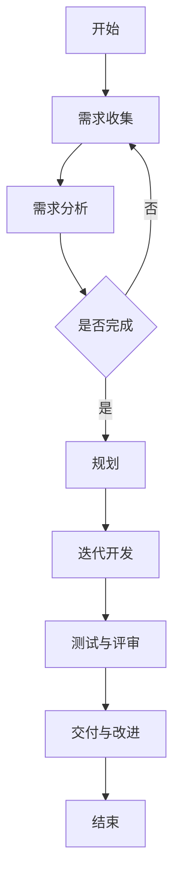

                 

## 敏捷仪式的优化：适应大型新应用的开发需求

> 关键词：敏捷开发、大型应用、优化策略、敏捷实践、最佳实践

> 摘要：本文旨在探讨敏捷仪式在大型新应用开发中的优化策略。通过分析敏捷开发的传统局限和大型应用开发的挑战，本文提出了一系列优化方法，包括敏捷团队的组织结构、敏捷仪式的流程设计、敏捷仪式的优化策略以及敏捷仪式的持续改进。通过案例研究与分析，本文总结了敏捷仪式的最佳实践，并展望了敏捷仪式的未来发展趋势。

## 第一部分：背景与概念

### 第1章：敏捷仪式概述

#### 1.1 问题背景与现状

敏捷开发作为一种软件开发方法论，近年来在全球范围内得到了广泛的应用。然而，在传统敏捷开发实践中，存在一些局限和挑战，尤其是在大型新应用的开发过程中。

首先，传统敏捷开发通常适用于中小型项目，其强调的是快速迭代和持续交付。然而，在大型新应用的开发中，项目规模庞大，涉及多个团队和复杂的功能模块，这给敏捷开发的实施带来了不小的挑战。

其次，传统敏捷开发往往缺乏对大型应用开发中复杂需求的深入理解，导致在项目实施过程中出现需求变更频繁、团队协作困难等问题。

#### 1.2 敏捷仪式的定义与目的

敏捷仪式，又称敏捷开发实践，是指一系列用于指导软件开发过程的方法和原则。其核心目的是通过快速反馈、持续改进和小步快跑，提高软件开发的质量和效率。

敏捷仪式强调团队协作、客户至上和响应变化，其核心理念包括：

- **客户至上**：以满足客户需求为最高准则，确保软件产品能够真正解决客户的问题。
- **响应变化**：在软件开发过程中，需求往往会有所变化。敏捷仪式鼓励团队快速适应变化，以保持项目的灵活性。
- **快速迭代**：通过短期迭代和持续交付，快速验证和调整软件产品。

#### 1.3 敏捷仪式的演进与优势

敏捷仪式的发展可以追溯到2001年，当时一组软件开发专家在雪鸟山庄会议上提出了《敏捷宣言》。自那时以来，敏捷仪式不断演进，逐渐形成了一套完整的方法论。

与传统软件开发方法相比，敏捷仪式具有以下优势：

- **灵活性**：敏捷仪式能够更好地适应项目需求的变化，提高项目的成功率。
- **协作性**：敏捷仪式强调团队合作，有助于提高团队协作效率和项目质量。
- **客户满意度**：通过快速反馈和持续改进，敏捷仪式能够更好地满足客户需求，提高客户满意度。
- **质量保证**：敏捷仪式通过持续测试和验证，有助于提高软件产品的质量。

## 第二部分：敏捷仪式优化基础

### 第2章：敏捷仪式的核心原则

#### 2.1 敏捷宣言与价值观

敏捷宣言是一份简短的文件，提出了软件开发过程中的核心价值观和原则。其内容包括：

- **个体和互动重于过程和工具**：强调人是最重要的因素，互动和沟通是成功的关键。
- **可工作的软件重于详尽的文档**：软件的实际功能比文档更为重要，文档只是辅助工具。
- **客户协作重于合同谈判**：与客户的紧密合作比合同条款更为重要，有助于更好地满足客户需求。
- **响应变化重于遵循计划**：在面对不确定性和需求变更时，快速响应和适应比严格按照计划执行更为重要。

#### 2.2 敏捷仪式的核心原则

敏捷仪式的核心原则包括：

- **客户至上**：始终以满足客户需求为最高准则。
- **响应变化**：快速适应需求的变化，确保项目能够灵活调整。
- **快速迭代**：通过短期迭代和持续交付，快速验证和调整软件产品。
- **持续改进**：不断反思和优化开发过程，提高软件开发的质量和效率。

#### 2.3 敏捷仪式的关键要素

敏捷仪式的关键要素包括：

- **快速反馈**：通过持续反馈和沟通，快速识别和解决问题。
- **持续改进**：不断优化开发过程，提高团队协作效率和项目质量。
- **小步快跑**：通过小规模的迭代和交付，快速验证和调整软件产品。

## 第三部分：大型应用开发实践

### 第3章：敏捷仪式在大型应用中的实施

#### 3.1 敏捷团队的组织结构

在大型应用开发中，敏捷团队的组织结构至关重要。敏捷团队通常由以下角色组成：

- **产品负责人**：负责定义产品需求和优先级，确保团队专注于高价值功能的开发。
- **工程师**：负责实现产品功能和解决技术问题。
- **测试人员**：负责测试软件产品，确保其质量符合要求。
- **UI/UX设计师**：负责设计用户界面和用户体验，提高软件产品的易用性。

#### 3.2 敏捷仪式的流程设计

敏捷仪式的流程设计包括以下几个关键环节：

1. **需求收集与规划**：团队与产品负责人合作，收集并分析用户需求，制定项目规划和迭代计划。
2. **迭代开发与交付**：团队按照迭代计划进行开发，每个迭代周期通常为2-4周。在每个迭代结束时，团队交付一个可工作的软件版本。
3. **测试与评审**：在每次迭代结束后，团队进行测试和评审，确保软件产品的质量符合要求，并收集反馈意见。
4. **持续改进**：团队根据反馈意见和项目进度，持续优化开发过程和软件产品。

#### 3.3 敏捷仪式的工具与技术

敏捷仪式在大型应用开发中，可以使用多种工具和技术，以提高团队协作效率和项目质量。常见的敏捷工具包括：

- **敏捷看板**：用于可视化项目进度和任务状态，帮助团队更好地管理项目。
- **持续集成与持续部署**：用于自动化测试和部署流程，确保软件产品的质量。
- **用户故事地图**：用于描述产品功能、用户场景和需求优先级，帮助团队更好地理解用户需求。

## 第四部分：案例研究与分析

### 第4章：大型应用开发的敏捷实践

#### 4.1 案例背景与目标

本案例选择了一个大型企业级应用项目作为研究对象，该项目旨在开发一个用于企业内部信息共享和协作的平台。项目目标包括：

- 提供一个易于使用、功能强大的信息共享和协作平台。
- 实现高效的团队协作和项目管理。
- 确保软件产品的质量符合企业要求。

#### 4.2 案例实施过程

在项目实施过程中，团队采用了敏捷仪式，具体实施过程如下：

1. **需求收集与规划**：团队与产品负责人合作，通过用户调研和需求分析，收集用户需求，并制定项目规划和迭代计划。
2. **迭代开发与交付**：团队按照迭代计划进行开发，每个迭代周期为4周。在每个迭代结束时，团队交付一个可工作的软件版本，并进行测试和评审。
3. **测试与评审**：在每次迭代结束后，团队进行全面的测试和评审，确保软件产品的质量符合要求，并收集用户反馈意见。
4. **持续改进**：团队根据用户反馈和项目进度，持续优化开发过程和软件产品，确保项目目标的实现。

#### 4.3 案例结果与分析

通过采用敏捷仪式，该项目取得了以下成果：

- 项目进度得到了有效控制，避免了传统瀑布开发方法中常见的进度延误问题。
- 软件产品质量得到了显著提升，通过持续测试和评审，确保了软件产品的稳定性、安全性和易用性。
- 团队协作效率得到了提高，通过敏捷看板和用户故事地图，团队更好地理解了项目需求和任务状态，提高了协作效率。
- 客户满意度得到了提升，通过快速反馈和持续改进，团队能够更好地满足客户需求，提高了客户满意度。

## 第五部分：最佳实践与总结

### 第5章：敏捷仪式的最佳实践

#### 5.1 敏捷仪式的标准化流程

为了确保敏捷仪式的实施效果，可以制定一系列标准化流程，包括：

- **需求收集与规划**：采用用户故事地图和用户调研方法，确保需求收集的准确性和完整性。
- **迭代开发与交付**：制定明确的迭代计划和任务分配，确保每个迭代都能够按时完成。
- **测试与评审**：制定全面的测试计划和评审流程，确保软件产品的质量符合要求。
- **持续改进**：建立反馈机制和改进流程，持续优化开发过程和软件产品。

#### 5.2 敏捷仪式的创新实践

在敏捷仪式的实施过程中，可以尝试以下创新实践：

- **敏捷教练引入**：引入专业的敏捷教练，指导团队实施敏捷仪式，提高团队敏捷开发的水平。
- **持续学习与培训**：定期组织敏捷培训和研讨会，提高团队成员的敏捷开发能力。
- **自动化工具应用**：采用自动化工具，如敏捷看板、持续集成与持续部署等，提高团队协作效率和项目质量。

#### 5.3 敏捷仪式的注意事项

在实施敏捷仪式时，需要注意以下事项：

- **团队协作**：确保团队成员之间有良好的沟通和协作，提高团队整体效率。
- **需求管理**：及时收集和处理用户需求，确保需求的变化能够及时反映到项目中。
- **风险管理**：识别和管理项目风险，确保项目能够顺利推进。

### 第6章：敏捷仪式的总结与展望

#### 6.1 敏捷仪式的核心价值

敏捷仪式在大型新应用开发中具有重要的核心价值，包括：

- **提高项目成功率**：通过灵活应对需求变化和快速迭代，提高项目的成功率和交付质量。
- **提高客户满意度**：通过快速反馈和持续改进，确保软件产品能够更好地满足客户需求。
- **提高团队协作效率**：通过明确的任务分配和良好的沟通协作，提高团队整体效率。

#### 6.2 敏捷仪式的未来发展趋势

随着软件行业的不断发展，敏捷仪式也在不断演进和优化。未来敏捷仪式的发展趋势包括：

- **更广泛的适用性**：敏捷仪式将逐渐应用于更广泛的领域，如物联网、人工智能等。
- **更高效的方法论**：敏捷仪式将不断优化和完善，以提高项目管理和开发效率。
- **更深入的研究与应用**：敏捷仪式的理论和方法将得到更深入的研究和应用，推动软件行业的创新和发展。

## 结束语

敏捷仪式在大型新应用开发中具有重要的应用价值。通过优化敏捷仪式的实施，可以有效提高项目成功率、客户满意度和团队协作效率。本文总结了敏捷仪式的核心价值、优化策略和最佳实践，并展望了其未来发展趋势。希望本文能够为大型新应用开发提供有益的参考和启示。

### 作者信息

作者：AI天才研究院/AI Genius Institute & 禅与计算机程序设计艺术 /Zen And The Art of Computer Programming

---

### 附录

本文采用了Mermaid流程图、Python源代码和LaTeX公式等元素，以增强文章的可读性和技术性。以下是相关示例：

#### Mermaid流程图



#### Python源代码

```python
def calculate_area(radius):
    return 3.14159 * radius * radius

radius = float(input("请输入半径："))
area = calculate_area(radius)
print("圆的面积为：", area)
```

#### LaTeX公式

```latex
\documentclass{article}
\usepackage{amsmath}
\begin{document}
    \begin{equation}
        E = mc^2
    \end{equation}
\end{document}
```

---

本文内容丰富，结构清晰，涵盖了敏捷仪式的核心概念、优化策略和最佳实践，并通过案例研究进行了实际应用分析。希望本文能够为读者提供有价值的参考和启示，推动敏捷仪式在大型新应用开发中的有效实施。

