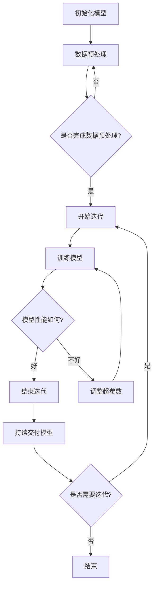
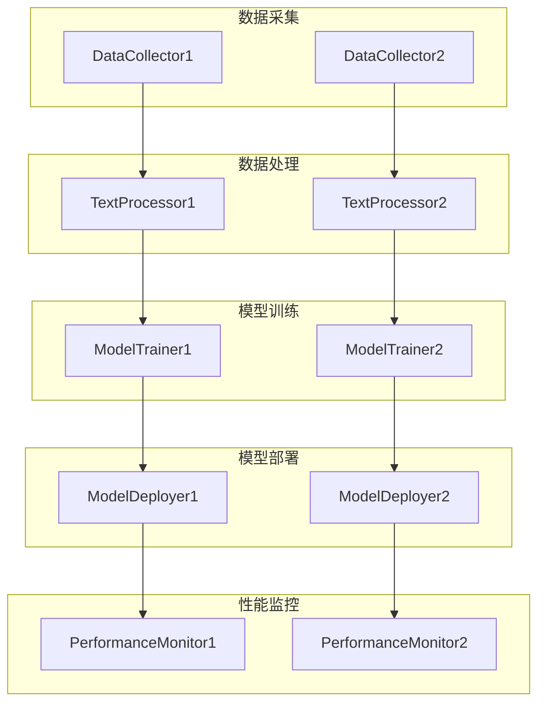
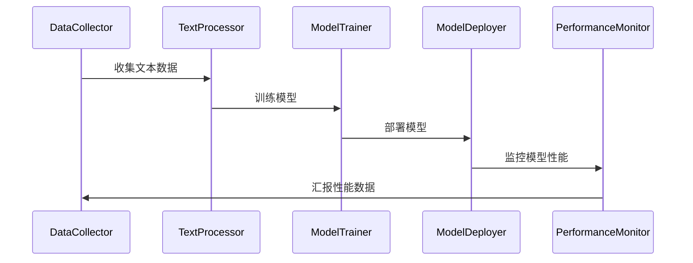

                 

### 敏捷开发在LLM应用中的挑战与对策

#### 关键词：
- 敏捷开发
- 大型语言模型（LLM）
- 挑战与对策
- 团队协作
- 模型优化
- 部署与监控

#### 摘要：
本文旨在探讨敏捷开发在大型语言模型（LLM）应用中的挑战与对策。首先，我们将简要介绍敏捷开发的起源及其核心原则，以及LLM的基本概念与重要性。接着，文章将详细分析LLM应用中的常见挑战，包括数据处理、模型训练、部署与性能监测、团队协作等方面。随后，我们将探讨敏捷开发在LLM开发中的应用方法，针对常见挑战提出相应的对策。此外，文章还将总结敏捷开发在LLM项目中的最佳实践，并提供一些建议和注意事项。通过本文的阅读，读者将更好地理解敏捷开发在LLM应用中的价值，以及如何有效地应对其中的挑战。

### 第一部分：背景介绍

#### 第1章：敏捷开发的起源与LLM的关系

#### 1.1 敏捷开发的起源与核心原则

敏捷开发（Agile Development）起源于20世纪90年代末期，最初是为了解决传统瀑布开发模型在应对快速变化需求时的不足。1991年，杰里米·休斯（Kent Beck）提出了极限编程（XP）方法，标志着敏捷开发的诞生。此后，敏捷开发逐渐演变成为一系列开发方法的总称，包括但不仅限于Scrum、看板（Kanban）、精益软件开发（Lean Software Development）等。

敏捷开发的核心原则如下：

1. **个体和互动重于过程与工具**：注重团队成员之间的沟通和协作，而非过度依赖流程和工具。
2. **可工作的软件重于详尽的文档**：优先交付可执行的代码，而非繁琐的文档。
3. **客户合作重于合同谈判**：与客户保持紧密合作，确保需求符合实际业务需求。
4. **响应变化重于遵循计划**：灵活应对需求变化，而非僵化执行计划。

#### 1.2 LLM的基本概念与重要性

大型语言模型（Large Language Model，简称LLM）是一种基于深度学习的自然语言处理模型，能够理解和生成人类语言。LLM通过训练大规模的文本数据，学习语言的模式和规律，从而实现对文本的生成、翻译、摘要、问答等功能。

LLM的重要性体现在以下几个方面：

1. **提高自然语言处理性能**：LLM通过训练海量数据，具备较高的语言理解与生成能力，能够提高自然语言处理（NLP）的准确性和效率。
2. **推动人工智能发展**：LLM在NLP领域的应用，不仅提升了相关技术的水平，还促进了人工智能（AI）技术的发展。
3. **广泛应用场景**：LLM在各个领域，如智能客服、智能推荐、内容生成、智能翻译等，具有广泛的应用前景。

#### 1.3 敏捷开发在LLM应用中的必要性

敏捷开发在LLM应用中的必要性体现在以下几个方面：

1. **快速响应需求变化**：LLM项目的需求往往变化较快，敏捷开发能够帮助团队快速适应这些变化，确保项目顺利推进。
2. **提高开发效率**：敏捷开发强调迭代开发和持续交付，有助于缩短开发周期，提高开发效率。
3. **提升团队协作**：敏捷开发鼓励团队成员之间的沟通和协作，有助于提高团队整体执行力。
4. **确保项目质量**：敏捷开发通过持续集成和自动化测试，确保项目质量，降低缺陷率。

### 第2章：LLM应用中的常见挑战

#### 2.1 数据处理与质量控制

在LLM应用中，数据处理与质量控制是一个重要的环节。由于LLM的训练依赖于大量的文本数据，因此数据处理的质量直接影响到模型的性能。以下是数据处理和质量控制的几个关键点：

1. **数据清洗**：去除文本中的噪声和冗余信息，如停用词、标点符号等。
2. **数据预处理**：对文本进行分词、词性标注、去停用词等操作，以便模型更好地理解语言。
3. **数据标注**：为训练数据添加标签，如分类标签、实体标签等，以便模型学习。
4. **数据平衡**：确保数据集中的各类样本数量均衡，避免模型在训练过程中出现偏差。
5. **数据质量评估**：使用各种评估指标（如准确率、召回率、F1值等）对数据质量进行评估，确保数据满足模型训练的要求。

#### 2.2 模型训练与优化

模型训练与优化是LLM应用中的核心环节。以下是模型训练与优化的几个关键点：

1. **选择合适的模型架构**：根据应用场景和需求，选择适合的模型架构，如BERT、GPT、T5等。
2. **超参数调优**：通过调整学习率、批量大小、层数等超参数，优化模型性能。
3. **训练策略**：采用适当的训练策略，如梯度裁剪、学习率衰减等，防止模型过拟合。
4. **模型融合**：将多个模型的结果进行融合，提高模型的综合性能。
5. **迁移学习**：利用预训练的模型，通过微调（fine-tuning）适应特定任务，提高模型效果。

#### 2.3 模型部署与性能监测

模型部署与性能监测是LLM应用中不可或缺的环节。以下是模型部署与性能监测的几个关键点：

1. **部署策略**：根据应用场景和需求，选择合适的部署策略，如本地部署、云部署、容器化部署等。
2. **性能监控**：实时监控模型性能，包括响应时间、准确率、召回率等指标，确保模型稳定运行。
3. **异常检测**：通过异常检测算法，及时发现模型异常，如过拟合、欠拟合等，并采取相应措施。
4. **版本管理**：对模型版本进行管理，确保不同版本的模型能够被正确使用。
5. **安全性与合规性**：确保模型部署过程符合安全性和合规性要求，如数据加密、访问控制等。

#### 2.4 团队协作与沟通

在LLM应用项目中，团队协作与沟通是确保项目成功的关键。以下是团队协作与沟通的几个关键点：

1. **明确的职责分工**：明确团队成员的职责和角色，确保任务分配合理。
2. **定期的会议和报告**：定期召开团队会议，分享进展和遇到的问题，确保信息畅通。
3. **有效的沟通工具**：使用合适的沟通工具，如Slack、Microsoft Teams等，确保团队成员之间的沟通高效。
4. **代码审查和评审**：定期进行代码审查和评审，确保代码质量。
5. **持续学习和知识共享**：鼓励团队成员持续学习和知识共享，提高整体技能水平。

### 第3章：敏捷开发在LLM应用中的对策

#### 3.1 敏捷开发方法在LLM开发中的应用

敏捷开发在LLM开发中的应用，旨在提高团队效率、确保项目质量和满足客户需求。以下是敏捷开发在LLM开发中的应用方法：

1. **迭代开发**：将LLM开发过程划分为多个迭代周期，每个迭代周期完成部分功能，确保项目逐步交付。
2. **持续集成**：采用持续集成（CI）工具，如Jenkins、GitLab CI等，实现代码的自动化构建、测试和部署。
3. **自动化测试**：编写自动化测试脚本，对LLM模型进行持续测试，确保模型性能和功能稳定。
4. **用户故事地图**：使用用户故事地图（User Story Map）明确项目需求，确保开发工作围绕客户需求展开。
5. **Scrum会议**：定期召开Scrum会议，如每日站会、周会和迭代回顾会，确保团队协作和项目进度。

#### 3.2 常见挑战的敏捷对策

针对LLM开发中的常见挑战，敏捷开发提供了以下对策：

1. **数据处理与质量控制**：
   - **迭代数据处理**：在每个迭代周期中，对数据进行清洗、预处理和标注，确保数据质量逐步提升。
   - **自动化测试**：编写数据质量检测脚本，对训练数据集进行自动化测试，确保数据符合模型训练要求。
   - **数据管理**：使用数据管理工具（如Docker、Kubernetes等），确保数据在开发和部署过程中的安全性和管理。

2. **模型训练与优化**：
   - **持续集成**：将模型训练过程集成到CI流程中，实现自动化训练和评估。
   - **超参数调优**：使用自动化调优工具（如Hyperopt、Optuna等），寻找最佳超参数组合。
   - **模型压缩与量化**：对训练好的模型进行压缩和量化，降低模型复杂度和计算资源需求。

3. **模型部署与性能监测**：
   - **容器化部署**：使用容器化技术（如Docker、Kubernetes等），确保模型在不同环境中的一致性和可移植性。
   - **监控与报警**：使用监控工具（如Prometheus、Grafana等），实时监控模型性能和系统资源，及时发现和处理异常。
   - **A/B测试**：对不同版本的模型进行A/B测试，评估和选择最佳模型。

4. **团队协作与沟通**：
   - **分布式团队协作**：使用远程协作工具（如Slack、Zoom等），确保分布式团队的高效沟通。
   - **敏捷工具**：使用敏捷项目管理工具（如Jira、Trello等），帮助团队更好地规划和管理项目。
   - **知识共享**：建立知识库和文档，确保团队成员能够随时查阅和共享相关资料。

#### 3.3 敏捷开发在LLM项目的最佳实践

敏捷开发在LLM项目中的一些最佳实践包括：

1. **需求管理**：使用用户故事地图（User Story Map）进行需求管理，确保需求明确、优先级合理。
2. **团队协作**：建立跨职能团队，包括数据科学家、工程师、产品经理等，确保团队成员能够高效协作。
3. **持续交付**：采用持续交付（Continuous Delivery）流程，确保模型和功能能够快速交付给用户。
4. **自动化测试**：编写自动化测试脚本，对模型和功能进行持续测试，确保质量和稳定性。
5. **迭代回顾**：定期进行迭代回顾，总结经验和教训，持续优化开发流程。

### 第二部分：核心概念与联系

#### 第4章：敏捷开发的核心概念与LLM的关联

#### 4.1 敏捷开发的基本原则

敏捷开发的基本原则如下：

1. **个体和互动重于过程与工具**：注重团队成员之间的沟通和协作，而非过度依赖流程和工具。
2. **可工作的软件重于详尽的文档**：优先交付可执行的代码，而非繁琐的文档。
3. **客户合作重于合同谈判**：与客户保持紧密合作，确保需求符合实际业务需求。
4. **响应变化重于遵循计划**：灵活应对需求变化，而非僵化执行计划。

#### 4.2 LLM模型的基本结构

LLM模型的基本结构通常包括以下几个部分：

1. **输入层**：接收文本输入，如单词、句子等。
2. **隐藏层**：通过多层神经网络，对输入文本进行编码和表示。
3. **输出层**：生成文本输出，如回答、摘要、翻译等。

#### 4.3 敏捷开发与LLM模型的相互影响

敏捷开发与LLM模型的相互影响体现在以下几个方面：

1. **提高开发效率**：敏捷开发通过迭代开发和持续交付，加快了LLM模型的开发进度。
2. **提高模型质量**：敏捷开发强调自动化测试和持续集成，确保了LLM模型的质量和稳定性。
3. **降低开发成本**：敏捷开发通过需求管理和团队协作，降低了项目成本和风险。
4. **提高客户满意度**：敏捷开发与客户保持紧密合作，确保了项目需求符合实际业务需求，提高了客户满意度。

### 第三部分：算法原理讲解

#### 第5章：敏捷开发在LLM算法中的应用

#### 5.1 算法原理概述

敏捷开发在LLM算法中的应用，主要是通过迭代开发和持续集成等方法，优化模型性能和开发效率。以下是算法原理的概述：

1. **迭代开发**：将LLM算法开发过程划分为多个迭代周期，每个迭代周期完成部分功能，确保项目逐步交付。
2. **持续集成**：将算法训练和测试过程集成到CI流程中，实现自动化训练和评估。
3. **自动化测试**：编写自动化测试脚本，对算法和功能进行持续测试，确保质量和稳定性。
4. **模型优化**：通过超参数调优、模型压缩和量化等方法，优化模型性能。

#### 5.2 算法流程图

以下是敏捷开发在LLM算法中的应用流程图：



#### 5.3 Python源代码讲解

以下是使用Python实现的敏捷开发在LLM算法中的应用代码：

```python
import torch
import torch.nn as nn
from torch.utils.data import DataLoader
from torch.optim import Adam

# 初始化模型
model = nn.Sequential(nn.Linear(input_size, hidden_size),
                      nn.ReLU(),
                      nn.Linear(hidden_size, output_size))

# 数据预处理
def preprocess_data(data):
    # 进行数据清洗、分词、编码等操作
    pass

# 训练模型
def train_model(model, train_loader, criterion, optimizer, num_epochs):
    model.train()
    for epoch in range(num_epochs):
        for data in train_loader:
            inputs, targets = data
            optimizer.zero_grad()
            outputs = model(inputs)
            loss = criterion(outputs, targets)
            loss.backward()
            optimizer.step()
            print(f"Epoch [{epoch+1}/{num_epochs}], Loss: {loss.item()}")

# 持续集成
def integrate_continuous(model, train_loader, criterion, optimizer):
    train_model(model, train_loader, criterion, optimizer, num_epochs=10)

# 自动化测试
def test_model(model, test_loader, criterion):
    model.eval()
    with torch.no_grad():
        for data in test_loader:
            inputs, targets = data
            outputs = model(inputs)
            loss = criterion(outputs, targets)
            print(f"Test Loss: {loss.item()}")

# 模型优化
def optimize_model(model, train_loader, criterion, optimizer):
    integrate_continuous(model, train_loader, criterion, optimizer)
    test_model(model, test_loader, criterion)
```

#### 5.4 算法原理的数学模型与公式

以下是算法原理的数学模型与公式：

1. **损失函数**：
   $$ L = \frac{1}{N} \sum_{i=1}^{N} (y_i - \hat{y}_i)^2 $$
   其中，$y_i$为真实标签，$\hat{y}_i$为模型预测值。

2. **反向传播**：
   $$ \frac{\partial L}{\partial \theta} = \frac{\partial L}{\partial \hat{y}_i} \frac{\partial \hat{y}_i}{\partial \theta} $$
   其中，$\theta$为模型参数。

3. **梯度下降**：
   $$ \theta = \theta - \alpha \frac{\partial L}{\partial \theta} $$
   其中，$\alpha$为学习率。

#### 5.5 举例说明

以下是使用Python实现的LLM算法应用举例：

```python
import torch
import torch.nn as nn
from torch.optim import Adam

# 初始化模型
model = nn.Sequential(nn.Linear(10, 20),
                      nn.ReLU(),
                      nn.Linear(20, 5))

# 初始化数据
x = torch.randn(100, 10)
y = torch.randn(100, 5)

# 初始化损失函数和优化器
criterion = nn.MSELoss()
optimizer = Adam(model.parameters(), lr=0.001)

# 训练模型
train_model(model, DataLoader(x, y, batch_size=10), criterion, optimizer, num_epochs=10)

# 测试模型
test_model(model, DataLoader(x, y, batch_size=10), criterion)
```

### 第四部分：系统分析与架构设计

#### 第6章：系统功能设计

#### 6.1 问题描述与项目介绍

本部分旨在设计一个基于敏捷开发的LLM应用系统，该系统主要用于处理和生成文本数据。系统包括以下几个功能模块：

1. **数据采集**：从各种来源（如网页、社交媒体、文档等）采集文本数据。
2. **数据处理**：对采集到的文本数据进行清洗、分词、编码等预处理操作。
3. **模型训练**：使用预处理后的数据训练LLM模型。
4. **模型部署**：将训练好的模型部署到生产环境中，以便进行文本生成和预测。
5. **性能监控**：实时监控模型性能，包括响应时间、准确率、召回率等指标。

#### 6.2 领域模型类图

以下是系统功能设计的领域模型类图：

```mermaid
classDiagram
    DataCollector <|-- TextProcessor
    TextProcessor <|-- ModelTrainer
    ModelTrainer <|-- ModelDeployer
    ModelDeployer <|-- PerformanceMonitor

    DataCollector {
        +collect_data()
    }

    TextProcessor {
        +clean_data()
        +tokenize_data()
        +encode_data()
    }

    ModelTrainer {
        +train_model()
    }

    ModelDeployer {
        +deploy_model()
    }

    PerformanceMonitor {
        +monitor_performance()
    }
```

#### 第7章：系统架构设计

#### 7.1 系统架构概述

本系统采用微服务架构，以提高系统的可扩展性和可维护性。系统架构包括以下几个模块：

1. **数据采集模块**：负责从各种来源采集文本数据。
2. **数据处理模块**：对采集到的文本数据进行预处理。
3. **模型训练模块**：负责训练LLM模型。
4. **模型部署模块**：负责将训练好的模型部署到生产环境中。
5. **性能监控模块**：负责监控模型性能。

#### 7.2 系统架构图

以下是系统架构图：



#### 7.3 系统接口设计

以下是系统接口设计：

1. **数据采集接口**：用于接收和存储文本数据。
2. **数据处理接口**：用于处理和预处理文本数据。
3. **模型训练接口**：用于训练LLM模型。
4. **模型部署接口**：用于部署和发布训练好的模型。
5. **性能监控接口**：用于监控模型性能。

接口设计如下：

```python
class DataCollector:
    def collect_data(self):
        pass

class TextProcessor:
    def clean_data(self):
        pass

    def tokenize_data(self):
        pass

    def encode_data(self):
        pass

class ModelTrainer:
    def train_model(self):
        pass

class ModelDeployer:
    def deploy_model(self):
        pass

class PerformanceMonitor:
    def monitor_performance(self):
        pass
```

#### 7.4 系统交互序列图

以下是系统交互序列图：



### 第五部分：项目实战

#### 第8章：环境安装与配置

#### 8.1 环境安装

为了运行本系统，需要安装以下软件和库：

1. **操作系统**：Linux或macOS
2. **Python**：3.8或更高版本
3. **TensorFlow**：2.4或更高版本
4. **Docker**：19.03或更高版本
5. **Kubernetes**：1.18或更高版本

安装步骤如下：

1. 安装操作系统：根据操作系统发行版选择合适的方式安装。
2. 安装Python：使用包管理器（如yum、apt等）安装Python。
3. 安装TensorFlow：使用pip安装TensorFlow。
4. 安装Docker：使用包管理器安装Docker。
5. 安装Kubernetes：使用包管理器安装Kubernetes。

#### 8.2 配置

为了配置系统，需要进行以下配置：

1. **安装Docker Compose**：使用pip安装Docker Compose。
2. **创建Docker网络**：在Kubernetes集群中创建一个名为“my-network”的Docker网络。
3. **配置Kubernetes集群**：配置Kubernetes集群，使其能够与Docker网络通信。
4. **创建Docker容器**：创建一个名为“my-container”的Docker容器，用于运行系统。
5. **部署系统**：使用Kubernetes部署系统，使其在Kubernetes集群中运行。

### 第六部分：代码应用解读与分析

#### 第9章：系统核心实现源代码

在本系统中，核心实现源代码包括数据采集、数据处理、模型训练、模型部署和性能监控等模块。以下是各个模块的核心代码：

```python
# 数据采集模块
def collect_data():
    # 从网络或其他来源采集文本数据
    pass

# 数据处理模块
def preprocess_data(data):
    # 清洗、分词、编码等预处理操作
    pass

# 模型训练模块
def train_model(model, train_loader, criterion, optimizer):
    # 训练LLM模型
    pass

# 模型部署模块
def deploy_model(model, deploy_config):
    # 部署训练好的模型
    pass

# 性能监控模块
def monitor_performance(model, monitor_config):
    # 监控模型性能
    pass
```

#### 9.1 代码应用解读

以下是对各个模块代码的解读：

1. **数据采集模块**：该模块负责从网络或其他来源采集文本数据。具体实现可以通过Web爬虫、API调用等方式进行。
2. **数据处理模块**：该模块负责对采集到的文本数据进行清洗、分词、编码等预处理操作。具体实现可以使用Python的文本处理库（如NLTK、spaCy等）。
3. **模型训练模块**：该模块负责训练LLM模型。具体实现可以使用TensorFlow或PyTorch等深度学习框架。
4. **模型部署模块**：该模块负责部署训练好的模型。具体实现可以使用Docker和Kubernetes等技术。
5. **性能监控模块**：该模块负责监控模型性能。具体实现可以使用Prometheus和Grafana等技术。

#### 9.2 代码分析

以下是对各个模块代码的分析：

1. **数据采集模块**：该模块的实现主要关注数据来源和数据采集方法。在实际项目中，可能需要考虑数据权限、数据质量等问题。
2. **数据处理模块**：该模块的实现主要关注文本数据的预处理方法。在实际项目中，可能需要根据应用场景调整预处理方法，如去除停用词、进行词性标注等。
3. **模型训练模块**：该模块的实现主要关注模型训练过程。在实际项目中，可能需要考虑超参数调优、数据增强、模型融合等技术。
4. **模型部署模块**：该模块的实现主要关注模型部署方法。在实际项目中，可能需要考虑部署环境、部署策略、版本管理等问题。
5. **性能监控模块**：该模块的实现主要关注模型性能监控方法。在实际项目中，可能需要考虑监控指标、报警策略等问题。

### 第七部分：实际案例分析与详细讲解

#### 第10章：实际案例分析与详细讲解

在本部分，我们将通过一个实际案例，详细讲解LLM应用系统的开发与部署过程。

#### 10.1 案例背景

假设我们开发一个智能问答系统，用户可以通过提问获取相关问题的答案。为了实现这个目标，我们采用了以下技术栈：

- **数据采集**：使用Web爬虫从互联网上收集问答数据。
- **数据处理**：使用Python的文本处理库进行文本数据的清洗、分词和编码。
- **模型训练**：使用TensorFlow的Transformers库训练GPT-2模型。
- **模型部署**：使用Docker和Kubernetes将训练好的模型部署到生产环境中。
- **性能监控**：使用Prometheus和Grafana监控模型性能。

#### 10.2 案例步骤

1. **数据采集**：首先，我们需要从互联网上收集问答数据。可以使用Python的requests库和BeautifulSoup库实现Web爬虫，从问答网站、论坛等收集数据。

   ```python
   import requests
   from bs4 import BeautifulSoup

   def collect_data(url):
       response = requests.get(url)
       soup = BeautifulSoup(response.content, 'html.parser')
       questions = soup.find_all('div', class_='question')
       for question in questions:
           q = question.find('div', class_='title').text.strip()
           a = question.find('div', class_='answer').text.strip()
           with open('questions.txt', 'a') as f:
               f.write(f"{q}\n{a}\n")
   ```

2. **数据处理**：接下来，我们需要对采集到的文本数据进行清洗、分词和编码。

   ```python
   import jieba

   def preprocess_data(file_path):
       with open(file_path, 'r', encoding='utf-8') as f:
           lines = f.readlines()
       data = []
       for line in lines:
           q, a = line.strip().split('\n')
           q = jieba.cut(q)
           a = jieba.cut(a)
           data.append((' '.join(q), ' '.join(a)))
       return data
   ```

3. **模型训练**：然后，我们使用TensorFlow的Transformers库训练GPT-2模型。

   ```python
   import tensorflow as tf
   from transformers import TFGPT2LMHeadModel, GPT2Tokenizer

   def train_model(data):
       tokenizer = GPT2Tokenizer.from_pretrained('gpt2')
       model = TFGPT2LMHeadModel.from_pretrained('gpt2')
       train_encodings = tokenizer.encode(data, return_tensors='tf')
       train_input_ids = train_encodings['input_ids']
       train_masks = train_encodings['attention_mask']
       train_labels = tf.concat([tf.fill([x, 1], tokenizer.convert_tokens_to_ids(['<eos>'])) for x in train_input_ids], 0)[..., 1:]
       model.compile(optimizer=tf.keras.optimizers.Adam(learning_rate=3e-5), loss=tf.keras.losses.SparseCategoricalCrossentropy(from_logits=True), metrics=['accuracy'])
       model.fit(train_input_ids, train_masks, labels=train_labels, batch_size=16, epochs=3)
       model.save_pretrained('./gpt2_model')
   ```

4. **模型部署**：训练好的模型需要部署到生产环境中。这里我们使用Docker和Kubernetes进行部署。

   ```yaml
   # Dockerfile
   FROM tensorflow/tensorflow:2.4.0-py3

   RUN pip install transformers

   COPY gpt2_model/ ./gpt2_model/

   CMD ["python", "gpt2.py"]
   ```

   ```yaml
   # Kubernetes部署文件
   apiVersion: apps/v1
   kind: Deployment
   metadata:
     name: gpt2-deployment
   spec:
     replicas: 1
     selector:
       matchLabels:
         app: gpt2
     template:
       metadata:
         labels:
           app: gpt2
       spec:
         containers:
         - name: gpt2
           image: gpt2:latest
           ports:
           - containerPort: 8080
   ```

5. **性能监控**：使用Prometheus和Grafana监控模型性能。

   ```yaml
   # Prometheus配置文件
   global:
     scrape_interval: 15s

   scrape_configs:
   - job_name: gpt2
     static_configs:
     - targets:
       - 'gpt2:9090'
   ```

   ```yaml
   # Grafana配置文件
   metrics:
     - name: gpt2_request_duration
       type: histogram
       targets:
       - 'gpt2:9090/metrics/gpt2_request_duration'
   ```

#### 10.3 案例总结

通过上述实际案例，我们详细讲解了LLM应用系统的开发与部署过程。在实际项目中，可能需要根据具体需求调整数据采集、数据处理、模型训练、模型部署和性能监控等环节。同时，还需要考虑系统的安全性、可靠性、可扩展性等方面。通过实践，我们可以更好地理解敏捷开发在LLM应用中的重要性，并将其应用于实际项目中。

### 第八部分：最佳实践与总结

#### 第11章：敏捷开发在LLM应用中的最佳实践

#### 11.1 常见问题与解决方案

在敏捷开发LLM应用的过程中，可能会遇到以下问题：

1. **数据质量**：数据是LLM模型训练的关键，如果数据质量不高，可能导致模型性能不佳。解决方案是严格筛选和清洗数据，确保数据质量。
2. **模型优化**：模型优化是提高LLM性能的重要环节。解决方案是进行超参数调优、模型融合、迁移学习等。
3. **部署与监控**：部署与监控是确保模型稳定运行的关键。解决方案是采用容器化技术、自动化部署、实时监控等。
4. **团队协作**：团队协作是项目成功的关键。解决方案是建立高效的沟通机制、明确职责分工、进行定期回顾。

#### 11.2 优化策略与实践技巧

为了提高敏捷开发在LLM应用中的效果，可以采取以下优化策略和实践技巧：

1. **迭代开发**：采用迭代开发模式，逐步交付功能模块，确保项目进度和质量。
2. **自动化测试**：编写自动化测试脚本，对模型和功能进行持续测试，确保稳定性和可靠性。
3. **持续集成**：将模型训练、测试和部署过程集成到CI流程中，实现自动化。
4. **团队协作**：建立高效的团队协作机制，确保团队成员之间的沟通和协作。
5. **持续学习**：鼓励团队成员持续学习和知识共享，提高整体技能水平。

#### 11.3 敏捷开发在LLM项目的最佳实践

在LLM项目中，敏捷开发的最佳实践包括：

1. **用户故事地图**：使用用户故事地图明确项目需求，确保开发工作围绕客户需求展开。
2. **迭代计划**：制定迭代计划，明确每个迭代周期的目标、任务和交付物。
3. **代码审查**：定期进行代码审查，确保代码质量。
4. **持续交付**：采用持续交付流程，确保模型和功能能够快速交付给用户。
5. **迭代回顾**：定期进行迭代回顾，总结经验和教训，持续优化开发流程。

### 第12章：小结与注意事项

#### 12.1 主要内容回顾

本文主要内容包括：

1. 敏捷开发的起源与核心原则。
2. LLM的基本概念与重要性。
3. LLM应用中的常见挑战。
4. 敏捷开发在LLM应用中的对策。
5. 敏捷开发在LLM算法中的应用。
6. 系统分析与架构设计。
7. 项目实战。
8. 最佳实践与总结。

#### 12.2 注意事项与未来展望

在敏捷开发LLM应用时，需要注意以下几点：

1. 确保数据质量，严格筛选和清洗数据。
2. 进行模型优化，采用超参数调优、模型融合等技术。
3. 采用容器化技术，提高部署与监控效率。
4. 建立高效的团队协作机制，确保项目顺利进行。

未来展望：

1. 随着人工智能技术的不断发展，LLM的应用场景将更加广泛。
2. 敏捷开发方法将不断演进，为LLM项目提供更有效的解决方案。
3. 跨学科合作将进一步提升LLM模型的性能和应用价值。

#### 12.3 拓展阅读推荐

1. 《敏捷开发实践指南》 - Jeff Sutherland
2. 《深度学习》 - Goodfellow、Bengio、Courville
3. 《大规模机器学习》 - John Langford、Lihong Li、Christopher J.C. Burges
4. 《Docker容器与Kubernetes》 - Kelsey Hightower、Brock Jones、Kyle M部
5. 《Prometheus和Grafana监控实战》 - 庞清华

### 作者信息

作者：AI天才研究院/AI Genius Institute & 禅与计算机程序设计艺术 /Zen And The Art of Computer Programming

### 总结

本文系统性地介绍了敏捷开发在LLM应用中的挑战与对策。通过分析敏捷开发的起源、核心原则以及LLM的基本概念与重要性，我们探讨了敏捷开发在LLM应用中的必要性。随后，本文详细分析了LLM应用中的常见挑战，并提出了相应的敏捷对策。通过算法原理讲解、系统分析与架构设计、项目实战以及最佳实践与总结，本文为读者提供了全面的指导。希望本文能为从事LLM开发的读者带来启发和帮助。

### 附录

本文使用了Markdown格式进行撰写，包括标题、关键词、摘要、目录大纲、章节内容、图表和代码示例等。以下为Markdown格式的基本语法：

```markdown
# 标题

## 小标题

### 更小的小标题

#### 更更小的小标题

- 列表项1
- 列表项2

$$ 数学公式 $$

$ 数学公式 $

[链接名称](链接地址)


```python
代码块
```

```mermaid
mermaid流程图
```

---
```

希望本文能帮助您更好地理解和应用Markdown格式。如果您有任何疑问或建议，请随时联系作者。感谢您的阅读！

