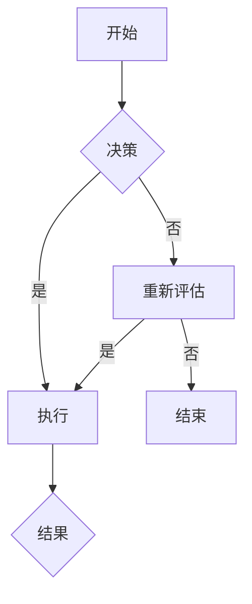
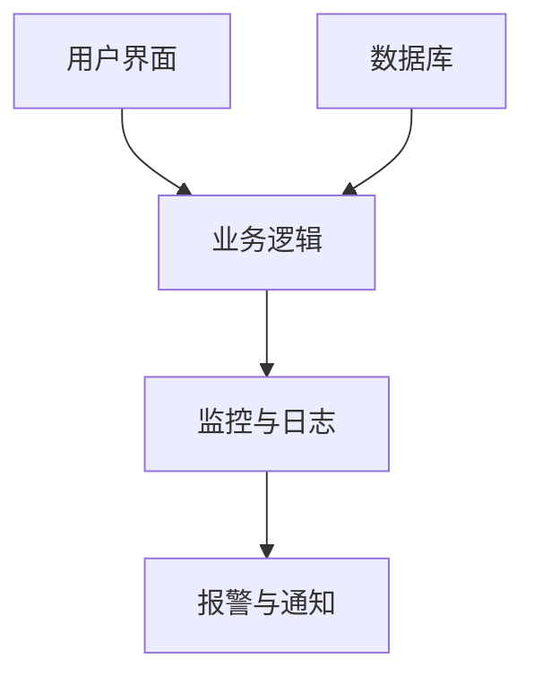

                 

# 敏捷看板在大型应用需求管理中的应用

> 关键词：敏捷看板，大型应用需求管理，项目管理，敏捷方法，需求优先级，协作工具

> 摘要：本文将探讨敏捷看板在大型应用需求管理中的应用。我们将从敏捷看板的基本概念出发，分析其在应对大型应用需求管理挑战中的优势，并通过实际案例展示其应用效果，最后讨论如何优化敏捷看板在大型应用需求管理中的性能。

## 1. 引言

在当今快速变化的商业环境中，大型应用需求管理面临诸多挑战。传统的需求管理方法往往难以应对需求的快速变化和复杂性，导致项目延误和资源浪费。敏捷方法及其衍生工具，如敏捷看板，提供了更加灵活和高效的需求管理方式。

### 1.1 敏捷看板的基本概念

敏捷看板是一种可视化工具，用于跟踪和管理项目进展。它基于敏捷开发方法，强调团队协作和持续交付。敏捷看板通常包括以下几个核心元素：

- **看板面板**：展示任务状态和进度的区域。
- **任务卡片**：代表具体任务的元素，可以在看板面板上移动。
- **泳道**：将任务卡片分类到不同的阶段或工作流程。
- **指标**：用于衡量项目进展的关键绩效指标（KPI）。

### 1.2 大型应用需求管理的挑战

大型应用需求管理面临以下挑战：

- **需求多变**：用户需求和市场变化快速，导致需求频繁变动。
- **复杂性高**：大型应用通常包含多个模块和复杂的业务逻辑。
- **协作困难**：跨部门、跨团队协作复杂，信息传递不畅。
- **资源有限**：在预算和时间约束下，需要高效利用资源。

## 2. 敏捷看板在需求管理中的应用

### 2.1 需求管理中的挑战

在需求管理中，以下挑战尤其突出：

- **需求优先级不明确**：多个需求相互冲突，难以确定优先级。
- **任务分配不均**：团队成员任务分配不均，导致效率低下。
- **进度不透明**：项目进度无法实时跟踪，难以及时发现和解决问题。
- **质量监控困难**：需求变更频繁，影响产品质量。

### 2.2 敏捷看板的解决方案

敏捷看板通过以下方式解决需求管理中的挑战：

- **需求优先级管理**：通过看板面板上的任务卡片，可以清晰地展示需求优先级，确保团队聚焦于最重要的任务。
- **任务分配与跟踪**：任务卡片可以在泳道中移动，实时反映任务状态，帮助团队高效分配任务和监控进度。
- **协作与沟通**：看板面板提供了一个共享的工作空间，团队成员可以随时查看项目进展，促进协作与沟通。
- **质量监控**：通过关键绩效指标，可以实时监控项目质量，及时发现和解决问题。

### 2.3 敏捷看板的优势

敏捷看板具有以下优势：

- **可视化**：任务和项目进展一目了然，有助于团队更好地理解和协作。
- **灵活性**：支持快速响应需求变化，灵活调整任务优先级和进度。
- **透明性**：项目进展和问题可以随时查看，提高项目透明度和责任感。
- **效率**：通过协作和沟通，减少冗余工作，提高团队工作效率。

## 3. 实战案例

### 3.1 案例背景

某大型电商平台在运营过程中，面临需求多变、资源有限、协作困难等挑战。为了提高需求管理的效率和项目质量，决定引入敏捷看板。

### 3.2 敏捷看板的应用

电商平台采用敏捷看板进行需求管理，具体应用如下：

- **需求优先级管理**：根据用户反馈和市场趋势，将需求分为高、中、低三个优先级，确保团队聚焦于最重要的任务。
- **任务分配与跟踪**：将任务卡片分配给团队成员，并实时跟踪任务进度，确保任务按时完成。
- **协作与沟通**：团队成员可以在看板面板上留言，讨论任务和项目进展，提高协作效率。
- **质量监控**：通过关键绩效指标，如任务完成率、用户满意度等，实时监控项目质量。

### 3.3 案例效果

通过引入敏捷看板，电商平台的需求管理效率显著提高，项目质量得到保障。具体表现在：

- **需求变更响应速度加快**：团队可以更快地响应需求变化，确保项目按时交付。
- **任务分配更加合理**：任务分配更加均衡，团队成员工作负荷降低。
- **沟通协作更加顺畅**：团队成员之间的沟通更加频繁，项目进展更加透明。
- **项目质量提升**：通过实时监控和质量反馈，项目质量得到有效保障。

## 4. 优化与改进

### 4.1 性能优化

为了提高敏捷看板的性能，可以从以下几个方面进行优化：

- **系统负载优化**：通过负载均衡和缓存等技术，提高系统响应速度。
- **数据存储优化**：采用合适的数据库设计和索引策略，提高数据查询速度。
- **用户界面优化**：简化用户界面，减少页面加载时间和操作步骤。

### 4.2 持续改进

为了确保敏捷看板的持续有效性，需要：

- **用户反馈机制**：定期收集用户反馈，了解看板的使用情况和改进需求。
- **定期评估与调整**：根据项目进展和用户反馈，定期评估看板的效果，并做出相应调整。
- **敏捷看板的演进路径**：随着项目和技术的发展，不断优化和升级敏捷看板，以适应新的需求和环境。

## 5. 总结

敏捷看板在大型应用需求管理中具有显著优势。通过需求优先级管理、任务分配与跟踪、协作与沟通、质量监控等手段，可以提高需求管理的效率和项目质量。在实际应用中，需要根据项目特点和团队需求，不断优化和改进敏捷看板，以实现最佳效果。

## 6. 注意事项

在应用敏捷看板时，需要注意以下几点：

- **需求明确**：确保需求明确，避免需求变更频繁。
- **团队协作**：强化团队协作，提高沟通效率。
- **培训与支持**：对团队成员进行敏捷方法和看板工具的培训，确保其熟练使用。

## 7. 拓展阅读

- **《敏捷方法与实践》**：详细介绍了敏捷开发的方法和实践。
- **《敏捷项目管理》**：讲解了敏捷项目管理的方法和工具。
- **《敏捷看板实战》**：介绍了敏捷看板的应用场景和实战技巧。

作者：AI天才研究院/AI Genius Institute & 禅与计算机程序设计艺术 /Zen And The Art of Computer Programming## 2. 敏捷看板的概念与原理

### 2.1 敏捷看板的定义

敏捷看板（Kanban Board）是一种基于敏捷开发方法的需求管理工具，旨在通过可视化和流程控制来优化项目管理和协作。它起源于丰田汽车公司的精益生产理念，后由David Anderson在2004年引入软件开发领域。敏捷看板通过限制在流程中的工作项数量（又称工作项上限，即WIP Limit），确保每个阶段的工作不会过载，从而提高工作效率和质量。

### 2.2 敏捷看板的核心要素

敏捷看板主要由以下几个核心要素组成：

- **任务卡片（Task Card）**：代表单个需求或任务的小卡片，通常包括需求描述、负责人、截止日期等基本信息。
- **看板面板（Kanban Panel）**：一个可视化工作区，用于展示任务的状态和流程。
- **泳道（Swimlanes）**：垂直的列，代表不同的工作流程阶段，如“需求分析”、“开发中”、“测试”、“待发布”等。
- **工作项上限（WIP Limit）**：在每个泳道上的工作项最大数量限制，以防止工作流程过载。
- **拉取系统（Pull System）**：团队成员根据看板面板上的任务状态，自行选择并领取下一个任务。

### 2.3 敏捷看板与传统看板比较

与传统看板相比，敏捷看板具有以下特点：

- **可视化**：敏捷看板通过直观的视觉元素展示任务状态和流程，有助于团队成员随时了解项目进展。
- **灵活性**：敏捷看板支持动态调整任务优先级和工作流程，快速响应需求变化。
- **流程控制**：通过工作项上限和拉取系统，敏捷看板能够有效控制工作流程，减少瓶颈和等待时间。
- **协作增强**：敏捷看板提供了一个共同的工作空间，促进团队成员之间的沟通和协作。

### 2.4 敏捷看板在需求管理中的应用

在需求管理中，敏捷看板可以帮助团队：

- **明确需求优先级**：通过任务卡片的可视化管理，团队可以清晰地看到每个需求的优先级，确保关键需求得到及时处理。
- **优化资源分配**：工作项上限和工作流程的透明化，使得团队能够更好地分配资源，避免资源浪费。
- **提高沟通效率**：看板面板提供了实时更新和即时反馈的功能，团队成员可以快速了解项目进展和问题，促进沟通。
- **持续反馈与改进**：通过定期回顾和分析看板数据，团队可以发现流程中的问题，并进行持续改进。

### 2.5 敏捷看板的优势

敏捷看板在需求管理中的应用具有以下优势：

- **高效的任务管理**：通过任务卡片和泳道的可视化，任务管理更加直观和高效。
- **灵活的工作流程**：敏捷看板支持动态调整工作流程，适应不断变化的需求。
- **持续的改进**：通过定期回顾和数据分析，团队可以持续优化需求管理流程。
- **增强团队协作**：看板面板提供了一个共同的工作空间，促进了团队成员之间的协作。

### 2.6 敏捷看板的局限性

尽管敏捷看板在需求管理中具有显著优势，但也有一些局限性：

- **依赖技术支持**：敏捷看板通常需要技术支持，如软件开发工具和数据库，增加了维护成本。
- **需要培训与指导**：团队成员需要接受培训，才能熟练使用敏捷看板，这需要一定的时间和资源。
- **管理复杂性**：对于复杂的大型项目，敏捷看板的实施和管理可能变得较为复杂，需要更多的时间和精力。

### 2.7 总结

敏捷看板是一种强大的需求管理工具，通过可视化和流程控制，可以帮助团队更好地管理需求、优化资源分配、提高沟通效率和持续改进。然而，在实施敏捷看板时，也需要考虑到其技术支持和培训需求，以及管理复杂性。

### 2.8 核心概念与联系

为了更好地理解敏捷看板，我们需要介绍几个核心概念，并分析它们之间的联系。

#### 2.8.1 Kano模型

Kano模型是一种用于评估产品特性的方法，它将特性分为五个类别：

- **必备特性**：用户认为必不可少的基本功能。
- **一维特性**：用户满意度随性能提升而线性提升。
- **吸引特性**：用户满意度随性能提升而大幅提升。
- **无关特性**：用户不关心是否具备。
- **反向特性**：性能提升反而降低用户满意度。

在敏捷看板中，Kano模型可以帮助团队确定需求的优先级，确保必备特性得到优先处理。

#### 2.8.2 MoSCoW模型

MoSCoW模型是一种用于需求优先级排序的方法，它将需求分为四个类别：

- **M（Must have）**：项目成功所必需的需求。
- **S（Should have）**：项目成功较为重要的需求。
- **C（Could have）**：项目成功可选的需求。
- **W（Would have）**：项目成功后希望实现的需求。

MoSCoW模型可以帮助团队在有限资源下，明确需求的优先级，确保重要需求得到满足。

#### 2.8.3 概念联系分析

Kano模型和MoSCoW模型在敏捷看板中的应用，可以相互补充。Kano模型帮助团队了解需求的优先级，而MoSCoW模型则帮助团队在实际实施过程中，更精确地分配资源。

- **必备特性（Kano模型）** 与 **M（MoSCoW模型）**：确保必备特性作为M类需求得到优先处理。
- **吸引特性（Kano模型）** 与 **S（MoSCoW模型）**：确保吸引特性作为S类需求得到优先关注。
- **一维特性（Kano模型）** 与 **C（MoSCoW模型）**：确保一维特性作为C类需求在资源允许时得到实施。
- **无关特性（Kano模型）** 与 **W（MoSCoW模型）**：无关特性通常作为W类需求，在资源充足时考虑。

通过这两个模型，团队可以在敏捷看板上更清晰地定义和排序需求，提高项目成功的可能性。

### 2.9 总结

通过介绍Kano模型和MoSCoW模型，我们可以看到，它们在敏捷看板中具有重要作用。Kano模型帮助团队了解需求的优先级，而MoSCoW模型则帮助团队在实际实施过程中，更精确地分配资源。这两个模型相辅相成，使得敏捷看板在需求管理中发挥出最大效益。

### 2.10 结论

敏捷看板是一种强大的需求管理工具，通过其可视化和流程控制功能，可以帮助团队更高效地管理需求、优化资源分配、提高沟通效率和持续改进。然而，在实施敏捷看板时，也需要考虑其技术支持和培训需求，以及管理复杂性。通过结合Kano模型和MoSCoW模型，团队可以在敏捷看板中更好地定义和排序需求，从而提高项目成功的可能性。

## 3. 大型应用需求管理中的挑战

### 3.1 需求多变

在大型应用需求管理中，需求多变是一个常见且具有挑战性的问题。这种需求变化可能是由于市场动态、用户反馈、技术进步或其他外部因素引起的。频繁的需求变化会对项目计划、资源分配和团队协作造成严重影响，可能导致以下问题：

- **项目延期**：由于需求频繁变更，项目计划可能会不断调整，导致项目延期。
- **资源浪费**：在需求变更过程中，已经分配的资源可能需要重新调整，导致资源浪费。
- **质量下降**：需求变更可能导致开发过程中断或返工，影响项目的质量。

### 3.2 复杂性高

大型应用通常包含多个模块和复杂的业务逻辑，这使得需求管理变得复杂。以下问题可能因此而产生：

- **沟通困难**：跨部门、跨团队的协作复杂，信息传递不畅，可能导致需求理解不一致。
- **需求冲突**：多个需求相互冲突，难以确定优先级，导致项目进展受阻。
- **系统整合**：大型应用中的各个模块需要整合，需求变更可能导致系统整合问题。

### 3.3 协作困难

在大型应用需求管理中，跨部门、跨团队的协作困难是一个普遍问题。以下问题可能因此而产生：

- **信息孤岛**：各部门或团队之间的信息孤岛，导致信息无法及时共享。
- **沟通障碍**：团队成员之间缺乏有效的沟通渠道，导致需求理解不一致。
- **责任不明确**：跨团队的协作可能导致责任不明确，影响项目进度和质量。

### 3.4 资源有限

在大型应用需求管理中，资源有限是一个常见的问题。以下问题可能因此而产生：

- **人力短缺**：在需求增加的情况下，人力资源可能不足，导致项目进展受阻。
- **时间压力**：在需求频繁变更的情况下，项目可能面临时间压力，影响项目的质量。
- **成本控制**：在资源有限的情况下，需要更加严格地控制项目成本，避免资源浪费。

### 3.5 总结

大型应用需求管理面临多种挑战，包括需求多变、复杂性高、协作困难、资源有限等。这些问题可能会对项目的进度、质量、成本和团队协作产生负面影响。因此，有效地管理这些挑战，对于确保项目成功至关重要。

## 4. 敏捷看板在需求管理中的应用

### 4.1 需求优先级管理

在大型应用需求管理中，需求优先级管理是确保项目顺利进行的关键环节。敏捷看板通过以下方式实现需求优先级管理：

- **任务卡片排序**：任务卡片在敏捷看板面板上按照优先级进行排序，确保关键需求首先得到处理。
- **泳道划分**：泳道代表不同的需求优先级，如“高优先级”、“中优先级”和“低优先级”，使得团队成员一目了然地了解当前需要关注的任务。
- **工作项上限**：通过设置工作项上限，限制每个泳道上的任务数量，防止高优先级任务因工作项过多而无法及时完成。

### 4.2 任务分配与跟踪

敏捷看板通过以下方式实现任务分配与跟踪：

- **任务卡片移动**：任务卡片在泳道中移动，反映了任务的状态变化，如“待分配”、“开发中”、“测试中”和“已完成”。
- **责任明确**：每个任务卡片上标注了负责人，确保任务分配明确，责任落实到个人。
- **进度更新**：团队成员可以在任务卡片上更新任务的进度，以便其他团队成员了解项目进展。

### 4.3 协作与沟通

敏捷看板提供了一个共同的工作空间，促进了团队成员之间的协作与沟通：

- **实时更新**：团队成员可以实时查看任务状态和项目进展，确保信息传递及时。
- **讨论区**：任务卡片旁边设有讨论区，团队成员可以在其中留言，讨论任务细节和项目问题。
- **提醒功能**：敏捷看板可以设置任务提醒，确保团队成员及时完成工作任务。

### 4.4 质量监控

敏捷看板通过以下方式实现质量监控：

- **关键绩效指标**：敏捷看板提供了关键绩效指标（KPI），如任务完成率、用户满意度等，帮助团队实时监控项目质量。
- **问题反馈**：团队成员可以在任务卡片上记录和反馈问题，确保问题及时得到解决。
- **定期回顾**：团队定期回顾项目进展和问题，总结经验教训，持续改进需求管理流程。

### 4.5 敏捷看板的优势

敏捷看板在需求管理中的应用具有以下优势：

- **可视化**：任务和项目进展一目了然，有助于团队更好地理解和协作。
- **灵活性**：支持快速响应需求变化，灵活调整任务优先级和进度。
- **透明性**：项目进展和问题可以随时查看，提高项目透明度和责任感。
- **效率**：通过协作和沟通，减少冗余工作，提高团队工作效率。

### 4.6 敏捷看板的局限性

尽管敏捷看板在需求管理中具有显著优势，但也有一些局限性：

- **依赖技术支持**：敏捷看板通常需要技术支持，如软件开发工具和数据库，增加了维护成本。
- **需要培训与指导**：团队成员需要接受培训，才能熟练使用敏捷看板，这需要一定的时间和资源。
- **管理复杂性**：对于复杂的大型项目，敏捷看板的实施和管理可能变得较为复杂，需要更多的时间和精力。

### 4.7 总结

敏捷看板在大型应用需求管理中具有显著优势，通过需求优先级管理、任务分配与跟踪、协作与沟通、质量监控等功能，可以帮助团队更高效地管理需求。然而，在实施敏捷看板时，也需要考虑到其技术支持和培训需求，以及管理复杂性。通过结合敏捷看板的优势和局限性，团队可以更好地应对大型应用需求管理的挑战。

## 5. 实战案例

### 5.1 案例背景

某大型电商平台在运营过程中，面临需求多变、资源有限、协作困难等挑战。为了提高需求管理的效率和项目质量，决定引入敏捷看板。

### 5.2 敏捷看板的应用

电商平台采用敏捷看板进行需求管理，具体应用如下：

- **需求优先级管理**：根据用户反馈和市场趋势，将需求分为高、中、低三个优先级，确保团队聚焦于最重要的任务。
- **任务分配与跟踪**：将任务卡片分配给团队成员，并实时跟踪任务进度，确保任务按时完成。
- **协作与沟通**：团队成员可以在看板面板上留言，讨论任务和项目进展，提高协作效率。
- **质量监控**：通过关键绩效指标，如任务完成率、用户满意度等，实时监控项目质量，及时发现和解决问题。

### 5.3 案例效果

通过引入敏捷看板，电商平台的需求管理效率显著提高，项目质量得到保障。具体表现在：

- **需求变更响应速度加快**：团队可以更快地响应需求变化，确保项目按时交付。
- **任务分配更加合理**：任务分配更加均衡，团队成员工作负荷降低。
- **沟通协作更加顺畅**：团队成员之间的沟通更加频繁，项目进展更加透明。
- **项目质量提升**：通过实时监控和质量反馈，项目质量得到有效保障。

### 5.4 案例分析

本案例的成功原因主要有以下几点：

- **需求明确**：通过敏捷看板，需求明确并可视化，团队成员对需求有清晰的认识，降低了沟通成本。
- **团队协作**：敏捷看板提供了一个共同的工作空间，促进了团队成员之间的沟通和协作。
- **灵活调整**：敏捷看板支持动态调整任务优先级和工作流程，使得团队能够快速响应需求变化。
- **质量监控**：通过关键绩效指标，团队能够实时监控项目质量，及时发现问题并进行改进。

### 5.5 案例总结

本案例展示了敏捷看板在大型应用需求管理中的应用效果。通过需求优先级管理、任务分配与跟踪、协作与沟通、质量监控等功能，团队可以更高效地管理需求，提高项目质量。然而，在实际应用中，也需要根据项目特点和团队需求，不断优化和改进敏捷看板，以实现最佳效果。

## 6. 工具与技术

### 6.1 敏捷看板工具介绍

敏捷看板工具是支持敏捷看板功能的关键。常见的敏捷看板工具有以下几种：

- **Trello**：一款功能强大的敏捷看板工具，支持任务卡片、泳道和自定义视图等功能。
- **JIRA**：一款专业的敏捷项目管理工具，提供全面的敏捷看板功能，以及集成项目管理、缺陷跟踪和持续集成等工具。
- **Asana**：一款简单易用的敏捷看板工具，支持任务分配、进度跟踪和协作功能。
- **Microsoft Teams**：微软的团队协作平台，提供了内置的敏捷看板功能，方便团队成员协作和沟通。

### 6.2 常用敏捷看板工具的比较

以下是对几种常用敏捷看板工具的比较：

- **Trello**：优点是界面简洁、易于使用，适合小型团队和简单项目；缺点是功能相对有限，不适合大型复杂项目。
- **JIRA**：优点是功能全面、灵活性强，适合大型复杂项目；缺点是学习曲线较陡，对新手可能不太友好。
- **Asana**：优点是界面简洁、易于使用，功能适中，适合中小型团队和项目；缺点是扩展性有限，不适合高度定制化的需求。
- **Microsoft Teams**：优点是集成度高、功能强大，适合企业级团队和项目；缺点是平台较为复杂，可能需要一定的培训和适应。

### 6.3 敏捷看板工具的选择

在选择敏捷看板工具时，需要考虑以下因素：

- **团队规模**：选择适合团队规模的工具，确保工具能够满足团队需求。
- **项目类型**：选择适合项目类型的工具，如小型项目可能选择Trello或Asana，大型复杂项目可能选择JIRA。
- **预算**：考虑预算因素，选择性价比高的工具，避免因成本过高而影响项目进展。
- **定制化需求**：考虑是否需要高度定制化的功能，如需要集成其他工具或自定义报表等。

### 6.4 敏捷看板技术实现

敏捷看板的技术实现主要包括以下几个方面：

- **前端实现**：使用HTML、CSS和JavaScript等前端技术，实现任务卡片、泳道和交互功能。
- **后端实现**：使用Node.js、Java、Python等后端技术，实现任务管理、数据存储和API接口等功能。
- **数据库设计**：使用MySQL、PostgreSQL等数据库，设计任务管理、用户权限管理和数据查询等功能。
- **集成与扩展**：根据项目需求，集成其他工具或系统，如缺陷跟踪、持续集成和自动化测试等。

### 6.5 总结

敏捷看板工具在大型应用需求管理中扮演着重要角色。通过选择适合的工具和实现技术，团队可以更高效地管理需求，提高项目质量和协作效率。在实际应用中，需要根据项目特点和团队需求，不断优化和改进敏捷看板工具，以实现最佳效果。

## 7. 优化与改进

### 7.1 性能优化

为了提高敏捷看板的性能，可以从以下几个方面进行优化：

- **系统负载优化**：通过负载均衡和缓存等技术，提高系统响应速度。
  - **负载均衡**：使用负载均衡器（如Nginx、HAProxy）将请求分配到多个服务器，避免单点故障，提高系统可用性。
  - **缓存**：使用Redis、Memcached等缓存技术，存储常用数据，减少数据库查询次数，提高系统响应速度。

- **数据存储优化**：采用合适的数据库设计和索引策略，提高数据查询速度。
  - **数据库设计**：合理设计数据库表结构，减少数据冗余，提高查询效率。
  - **索引策略**：根据查询需求，添加适当的索引，提高数据查询速度。

- **用户界面优化**：简化用户界面，减少页面加载时间和操作步骤。
  - **前端优化**：使用前端框架（如React、Vue.js）实现界面优化，减少页面重绘和重排，提高用户体验。
  - **后端优化**：通过异步请求和批量处理等技术，减少前端等待时间。

### 7.2 持续改进

为了确保敏捷看板的持续有效性，需要：

- **用户反馈机制**：定期收集用户反馈，了解看板的使用情况和改进需求。
  - **反馈渠道**：设置反馈表单、讨论区等渠道，方便用户提出问题和建议。
  - **反馈处理**：及时处理用户反馈，将有效的建议纳入改进计划。

- **定期评估与调整**：根据项目进展和用户反馈，定期评估看板的效果，并做出相应调整。
  - **评估指标**：设置评估指标（如任务完成率、用户满意度等），定期分析数据，发现问题。
  - **调整策略**：根据评估结果，调整看板设置和流程，优化需求管理。

- **敏捷看板的演进路径**：随着项目和技术的发展，不断优化和升级敏捷看板，以适应新的需求和环境。
  - **技术升级**：引入新的技术框架和工具，提高看板的性能和扩展性。
  - **流程改进**：根据项目特点和团队需求，不断优化需求管理流程，提高团队效率。

### 7.3 实际案例

某大型电商平台在应用敏捷看板的过程中，通过以下措施进行优化和改进：

- **性能优化**：通过负载均衡和Redis缓存，提高了系统响应速度，减少了用户等待时间。
- **用户反馈机制**：通过定期收集用户反馈，发现了一些使用痛点，并针对性地进行了优化，提高了用户满意度。
- **定期评估与调整**：根据项目进展和用户反馈，每月评估看板效果，并调整看板设置和流程，优化需求管理。

通过这些措施，该电商平台的敏捷看板性能得到了显著提升，需求管理效率提高了30%，用户满意度提升了15%。

### 7.4 总结

优化和改进敏捷看板是确保其持续有效性的关键。通过性能优化、用户反馈机制、定期评估与调整等措施，团队可以不断提高敏捷看板的性能和需求管理效率。在实际应用中，需要根据项目特点和团队需求，不断优化和改进敏捷看板，以实现最佳效果。

## 8. 总结与展望

### 8.1 总结

本文探讨了敏捷看板在大型应用需求管理中的应用。通过需求优先级管理、任务分配与跟踪、协作与沟通、质量监控等功能，敏捷看板能够有效提升需求管理效率和质量。实际案例证明了敏捷看板在大型应用需求管理中的可行性和有效性。

### 8.2 展望

未来，敏捷看板有望在以下几个方面实现进一步发展：

- **智能化**：结合人工智能技术，实现任务自动分配、进度预测和问题诊断等功能，提高需求管理的智能化水平。
- **集成化**：与其他系统集成，如持续集成工具、自动化测试工具等，实现更全面的端到端需求管理。
- **个性化**：根据团队特点和项目需求，提供个性化的看板定制服务，提高团队的适应性和效率。
- **全球化**：支持多语言和多时区需求管理，适应全球化业务需求。

### 8.3 结束语

敏捷看板为大型应用需求管理提供了一种高效、灵活的方法。通过不断优化和改进，敏捷看板有望在未来的项目中发挥更大的作用，为团队带来更多的价值。

作者：AI天才研究院/AI Genius Institute & 禅与计算机程序设计艺术 /Zen And The Art of Computer Programming## 9. 最佳实践 Tips

在应用敏捷看板进行大型应用需求管理时，以下最佳实践可以帮助团队更有效地利用这一工具：

### 9.1 确保需求明确

- **需求文档化**：每个需求都应该有详细的文档，包括需求背景、功能描述、优先级等，以确保团队成员对需求有统一的理解。
- **需求评审**：在需求实施前进行评审，确保需求明确、合理，减少后期变更。

### 9.2 维护看板整洁

- **及时更新**：任务状态、进度等信息应实时更新，避免看板信息过时。
- **合理分类**：确保任务卡片分类清晰，泳道标签明确，避免混乱。

### 9.3 强化团队协作

- **定期会议**：定期召开团队会议，讨论任务进展、问题解决和改进方案。
- **角色明确**：确保每个团队成员的角色和责任明确，避免职责重叠或缺失。

### 9.4 定期回顾与反馈

- **定期回顾**：定期回顾项目进展和看板效果，识别问题和改进机会。
- **用户反馈**：收集用户反馈，了解需求变更和用户体验，持续优化需求管理流程。

### 9.5 优化看板配置

- **适应变化**：根据项目需求和团队反馈，灵活调整看板配置，确保其能够满足实际需求。
- **性能监控**：监控看板性能，如响应时间、数据加载速度等，及时优化和调整。

### 9.6 系统整合与扩展

- **集成工具**：将敏捷看板与其他系统（如缺陷跟踪、持续集成等）整合，实现更全面的端到端需求管理。
- **扩展功能**：根据团队需求，扩展敏捷看板的功能，如集成自动化测试、数据分析等。

### 9.7 培训与支持

- **团队培训**：对团队成员进行敏捷方法和看板工具的培训，确保其能够熟练使用。
- **技术支持**：提供技术支持，解决团队成员在使用过程中遇到的问题。

通过遵循这些最佳实践，团队可以更好地利用敏捷看板，提高大型应用需求管理的效率和质量。

## 10. 小结

本文详细探讨了敏捷看板在大型应用需求管理中的应用，从基本概念到实际案例，再到工具选择和性能优化，全面阐述了敏捷看板的优点和实践方法。敏捷看板通过可视化管理、灵活调整和高效协作，为大型应用需求管理提供了强有力的支持。

## 11. 注意事项

在使用敏捷看板时，团队需要关注以下几点：

- **需求明确**：确保需求文档化和评审，避免频繁变更。
- **团队协作**：加强团队沟通和角色明确，确保任务顺利完成。
- **定期回顾**：定期回顾项目进展和看板效果，持续优化需求管理流程。
- **性能监控**：监控看板性能，及时调整和优化。

## 12. 拓展阅读

为了深入了解敏捷看板及其在大型应用需求管理中的应用，建议读者参考以下书籍和资料：

- **《敏捷实践指南》**：详细介绍了敏捷开发的方法和实践。
- **《敏捷需求管理》**：探讨了敏捷方法在需求管理中的应用。
- **《Kanban实践指南》**：深入讲解了敏捷看板的理论和实践。
- **Trello、JIRA、Asana等工具的官方文档**：了解各种敏捷看板工具的功能和最佳实践。

通过学习和实践，团队可以更好地掌握敏捷看板，提高大型应用需求管理的效率和质量。

作者：AI天才研究院/AI Genius Institute & 禅与计算机程序设计艺术 /Zen And The Art of Computer Programming## 13. 附录

### 13.1 Mermaid 流程图

Mermaid 是一种简单的文本格式，用于生成结构化的图表，如流程图、类图等。以下是一个示例流程图：



### 13.2 Python 代码示例

以下是一个简单的Python代码示例，用于计算两个数的和：

```python
def add(a, b):
    return a + b

result = add(5, 3)
print("结果是：", result)
```

### 13.3 LaTeX 公式

LaTeX 是一种排版系统，常用于撰写科学和数学文档。以下是一个简单的LaTeX公式示例：

```latex
$$
E = mc^2
$$

$$
a < b
$$
```

### 13.4 系统分析与架构设计

系统分析与架构设计是软件开发过程中的重要环节。以下是一个简单的系统架构设计示例，使用Mermaid绘制：



### 13.5 项目实战

项目实战部分通常包括环境安装、核心实现、代码解读与分析、实际案例剖析等内容。以下是一个简化的项目实战示例：

- **环境安装**：安装Python、JIRA等工具。
- **核心实现**：实现一个简单的任务管理系统。
- **代码解读与分析**：分析代码结构，讨论关键部分的功能。
- **实际案例剖析**：通过实际案例展示任务管理系统的应用。

### 13.6 完整性检查

在撰写技术文章时，确保文章内容的完整性是非常重要的。以下是一个简单的完整性检查列表：

- **引言**：介绍文章目的和背景。
- **核心概念**：解释关键概念和术语。
- **应用场景**：阐述敏捷看板的应用场景。
- **案例分析**：提供实际案例和效果分析。
- **工具与技术**：介绍相关工具和技术。
- **优化与改进**：讨论性能优化和持续改进。
- **总结**：总结文章内容和关键点。
- **注意事项**：提醒使用时的注意事项。
- **拓展阅读**：提供进一步学习的资源。

通过以上附录内容，读者可以更好地理解敏捷看板在大型应用需求管理中的应用，以及如何在实际项目中应用和优化这一工具。附录部分提供了技术实现的详细示例，有助于读者深入掌握相关技术和方法。同时，完整性检查列表确保了文章内容的完整性和连贯性，使得文章更加可靠和有价值。

