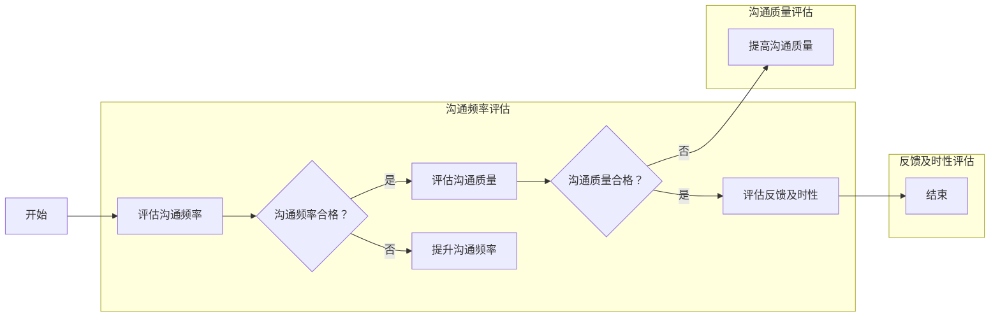
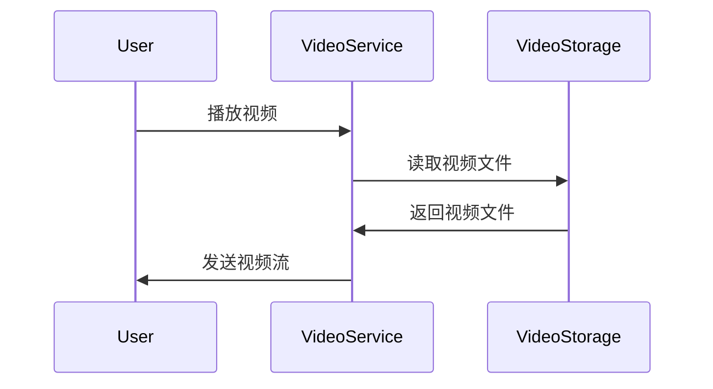
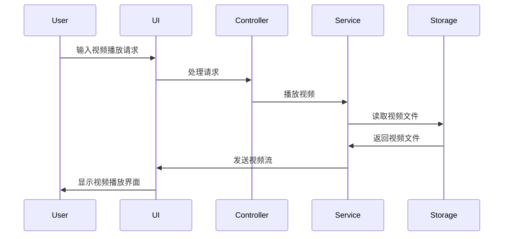

                 


# 敏捷研发中的需求沟通技巧

> 关键词：敏捷研发、需求沟通、用户故事、需求文档、用户反馈

> 摘要：本文从敏捷研发的背景入手，详细阐述了需求沟通在敏捷研发中的重要性，并通过核心概念与联系的分析，以及需求沟通有效性评估算法的讲解，为读者提供了一系列实用技巧，旨在提高敏捷研发中的需求沟通效率。

## 第一部分：背景介绍

### 1.1 问题背景

敏捷研发是一种以人为核心、迭代、渐进的软件开发方法，它强调团队协作、客户反馈和灵活应对变化。然而，在敏捷研发过程中，需求沟通成为了一个关键挑战。需求不明确、信息传递障碍和反馈不及时等问题常常导致项目进度延误、质量下降。

### 1.2 问题描述

敏捷研发中的需求沟通问题主要表现在以下几个方面：

- 需求不明确：需求文档缺乏细节、用户故事不具体，导致开发团队在实施过程中出现疑惑和误解。
- 信息传递障碍：团队成员之间的沟通不畅，信息传递不及时，导致需求信息在传递过程中失真。
- 反馈不及时：用户反馈不及时，开发团队无法根据用户反馈快速调整需求，导致产品与用户期望差距较大。

### 1.3 问题解决

为了解决敏捷研发中的需求沟通问题，我们可以采取以下策略：

- 明确需求：通过用户故事、需求文档等工具，将需求描述得更加具体、明确。
- 加强沟通：建立有效的沟通机制，确保信息在团队内部快速、准确地传递。
- 及时反馈：鼓励用户及时反馈，以便开发团队能够快速调整需求。

### 1.4 边界与外延

在敏捷研发中，需求沟通不仅要关注团队内部，还要关注与客户的沟通。需求沟通的范围包括需求收集、需求分析、需求评审、需求实现和需求验证等环节。同时，需求沟通也受到敏捷价值观的影响，如以客户为中心、持续交付和迭代优化等。

## 第二部分：核心概念与联系

### 2.1 核心概念

#### 2.1.1 敏捷需求

敏捷需求是指在敏捷研发过程中，对产品功能、性能、用户界面等方面的具体要求。敏捷需求通常以用户故事的形式呈现，它描述了一个特定用户在一个特定场景下期望完成的一项任务。

#### 2.1.2 用户故事

用户故事是敏捷需求的具体体现，它是一种简洁、具体、可测量的需求描述方式。一个典型的用户故事包括三个部分：作为某个人，我想要完成某事，从而获得某些价值。

#### 2.1.3 需求文档

需求文档是敏捷研发中的需求管理工具，它详细描述了产品的功能、性能、用户界面等方面的要求。需求文档通常包含用户故事、需求清单、需求优先级等信息。

#### 2.1.4 用户反馈

用户反馈是敏捷研发中非常重要的一个环节，它可以帮助开发团队了解用户对产品的使用体验，及时调整需求，提高产品满意度。

### 2.2 概念联系

#### 2.2.1 敏捷需求与用户故事的关联

敏捷需求通常通过用户故事来具体描述，用户故事是敏捷需求的一种表现形式。用户故事可以帮助开发团队更好地理解需求，从而提高需求实现的准确性。

#### 2.2.2 需求文档与用户反馈的相互作用

需求文档是敏捷研发的基础，它为开发团队提供了明确的需求指导。用户反馈则可以帮助开发团队了解用户的需求变化和满意度，从而对需求文档进行及时调整。

## 第三部分：算法原理讲解

### 3.1 需求沟通有效性评估算法

#### 3.1.1 算法原理

需求沟通有效性评估算法旨在评估敏捷研发中需求沟通的效率和质量。该算法基于以下原理：

- 沟通频率：评估团队成员之间的沟通频率，以确保信息能够及时、准确地传递。
- 沟通质量：评估沟通内容的准确性、清晰性和完整性，以确保需求理解的一致性。
- 反馈及时性：评估用户反馈的及时性，以确保开发团队能够快速调整需求。

#### 3.1.2 流程图展示



#### 3.1.3 Python 源代码解析

```python
import random

def assess_communication_frequency():
    frequency = random.randint(1, 10)
    return frequency

def assess_communication_quality():
    quality = random.randint(1, 10)
    return quality

def assess_feedback.timing():
    timing = random.randint(1, 10)
    return timing

def evaluate_communication():
    frequency = assess_communication_frequency()
    quality = assess_communication_quality()
    timing = assess_feedback.timing()

    if frequency >= 7 and quality >= 7 and timing >= 7:
        print("需求沟通有效性评估：合格")
    elif frequency < 7:
        print("需求沟通有效性评估：沟通频率不足，需提升")
    elif quality < 7:
        print("需求沟通有效性评估：沟通质量不足，需提高")
    elif timing < 7:
        print("需求沟通有效性评估：反馈及时性不足，需优化")

evaluate_communication()
```

#### 3.1.4 LaTeX 公式详细解释

$$
E[C] = \frac{1}{N}\sum_{i=1}^{N} C_i
$$

其中，$E[C]$表示需求沟通有效性评估总分，$N$表示评估次数，$C_i$表示第$i$次评估得分。

$$
C_i = \begin{cases}
10, & \text{如果} i \text{次评估合格} \\
0, & \text{否则}
\end{cases}
$$

其中，$C_i$表示第$i$次评估得分，合格得分为10，不合格得分为0。

## 第四部分：数学模型和数学公式讲解

### 4.1 数学模型

#### 4.1.1 模型介绍

需求沟通有效性评估模型是一个基于评分的评估模型，它通过评估沟通频率、沟通质量和反馈及时性，综合评估需求沟通的有效性。

#### 4.1.2 应用场景

该模型适用于敏捷研发过程中的需求沟通评估，可以帮助团队了解需求沟通的现状，为改进需求沟通提供依据。

#### 4.1.3 LaTeX 公式展示

$$
E[C] = \frac{1}{N}\sum_{i=1}^{N} C_i
$$

其中，$E[C]$表示需求沟通有效性评估总分，$N$表示评估次数，$C_i$表示第$i$次评估得分。

## 第五部分：系统分析与架构设计方案

### 5.1 问题场景介绍

假设我们正在开发一款在线教育平台，需求是提供一个视频课程播放功能。在这个场景中，需求沟通的目的是确保开发团队能够准确理解并实现用户需求。

### 5.2 系统功能设计

#### 5.2.1 领域模型

使用 Mermaid 绘制领域模型类图：

```mermaid
classDiagram
    Course <<实体>>
    Video <<实体>>
    User <<实体>>

    Course "包含" Video
    User "参与" Course
```

#### 5.2.2 功能设计

- 用户可以浏览和选择视频课程。
- 用户可以播放、暂停、快进、快退视频。
- 用户可以对视频课程进行评价和反馈。

### 5.3 系统架构设计

使用 Mermaid 绘制系统架构图：



#### 5.3.1 架构设计

- 用户界面层：负责与用户交互，接收用户请求。
- 业务逻辑层：处理用户请求，调用视频服务。
- 数据访问层：负责视频文件的读取和存储。

### 5.4 系统接口设计

使用 Mermaid 绘制系统接口设计序列图：



#### 5.4.1 接口设计

- 用户接口：接收用户请求，显示视频播放界面。
- 控制器接口：处理用户请求，调用视频服务。
- 服务接口：处理视频播放逻辑，调用数据访问层。
- 数据访问接口：负责视频文件的读取和存储。

## 第六部分：项目实战

### 6.1 环境安装

以开发一款视频课程播放器为例，首先需要安装以下环境：

- Python 3.8
- Django 3.2
- Django REST framework 3.12
- FFmpeg 4.4

### 6.2 系统核心实现源代码

#### 6.2.1 Django 项目创建

```shell
django-admin startproject video_course_player
cd video_course_player
django-admin startapp video_app
```

#### 6.2.2 模型定义

在`video_app/models.py`中定义模型：

```python
from django.db import models

class Course(models.Model):
    title = models.CharField(max_length=255)
    description = models.TextField()

class Video(models.Model):
    course = models.ForeignKey(Course, on_delete=models.CASCADE)
    file = models.FileField(upload_to='videos/')
```

#### 6.2.3 视频播放服务实现

在`video_app/services.py`中实现视频播放服务：

```python
from django.http import StreamingResponse
from .models import Video

def video_streaming(request, video_id):
    video = Video.objects.get(id=video_id)
    response = StreamingResponse(video.file, content_type='video/mp4')
    response['Content-Disposition'] = f'attachment; filename="{video.file.name}"'
    return response
```

#### 6.2.4 URL 配置

在`video_course_player/urls.py`中配置 URL：

```python
from django.urls import path
from . import views

urlpatterns = [
    path('courses/<int:course_id>/video/', views.video_streaming, name='video_streaming'),
]
```

### 6.3 代码应用解读与分析

#### 6.3.1 代码解读

- 模型定义：`Course`和`Video`模型分别表示课程和视频，用于存储课程信息和视频文件。
- 视频播放服务实现：`video_streaming`函数用于处理视频流请求，返回视频文件流。
- URL 配置：将视频播放服务映射到相应 URL。

#### 6.3.2 分析

- 代码结构清晰，逻辑简单，易于维护。
- 使用 Django REST framework 可以方便地扩展 API 功能。
- FFmpeg 库支持多种视频格式，确保视频播放兼容性。

### 6.4 实际案例分析与讲解

#### 6.4.1 案例背景

某在线教育平台需要提供一个视频课程播放功能，用户可以在线观看视频课程，并对课程进行评价和反馈。

#### 6.4.2 案例分析

- 需求分析：根据用户需求，设计视频课程播放功能，包括视频浏览、播放、评价和反馈。
- 技术选型：选择 Django 框架和 FFmpeg 库，实现视频播放功能。
- 系统设计：设计用户界面、业务逻辑和数据访问层，确保系统功能完整、性能稳定。
- 项目实施：按照系统设计，逐步实现视频播放功能，并进行测试和优化。

#### 6.4.3 讲解

- 用户界面设计：使用 Django Admin 模式创建课程和视频模型，为用户提供视频浏览和播放界面。
- 业务逻辑实现：在 Django 模型中定义课程和视频关系，实现视频播放服务。
- 数据访问层设计：使用 Django ORM 操作数据库，存储课程和视频信息。
- 测试与优化：对系统进行功能测试和性能测试，优化代码和系统配置。

### 6.5 项目小结

通过该项目实战，我们成功地实现了视频课程播放功能。项目实施过程中，需求沟通起到了关键作用，确保了团队对用户需求的准确理解和实现。同时，我们也发现了一些问题，如需求变更频繁、沟通渠道不畅等，这些都需要在后续项目中加以改进。

## 第七部分：最佳实践 tips

### 7.1 及时记录和整理需求

在敏捷研发中，需求变更频繁，因此及时记录和整理需求至关重要。建议使用需求文档、用户故事和任务列表等工具，将需求以清晰的格式记录下来，确保团队成员对需求有共同的理解。

### 7.2 定期召开需求评审会议

定期召开需求评审会议，让团队成员共同讨论需求，确保需求的一致性和准确性。在会议中，可以邀请相关利益相关者参与，以确保需求的全面性和实用性。

### 7.3 建立良好的沟通渠道

建立良好的沟通渠道，确保团队成员之间、团队成员与用户之间的沟通顺畅。可以使用即时通讯工具、邮件、电话会议等方式，及时传递需求信息，减少信息失真。

## 第八部分：小结

敏捷研发中的需求沟通是确保项目成功的关键因素。本文通过详细分析敏捷研发中的需求沟通问题，介绍了需求沟通的有效性评估算法，并分享了最佳实践 tips。希望通过本文，读者能够提高敏捷研发中的需求沟通效率，为项目的成功奠定基础。

## 第九部分：注意事项

- 需求沟通要注重时效性，确保信息能够及时传递。
- 需求文档要简洁明了，避免过于冗长和复杂。
- 需要建立一个良好的沟通氛围，鼓励团队成员和用户积极参与需求讨论。

## 第十部分：拓展阅读

- 《敏捷软件开发：原则、实践与模式》
- 《用户故事映射：从需求到设计》
- 《敏捷开发实践指南》
- 《软件需求规格说明书编写指南》
- 《敏捷团队沟通技巧》

作者：AI天才研究院/AI Genius Institute & 禅与计算机程序设计艺术 /Zen And The Art of Computer Programming

