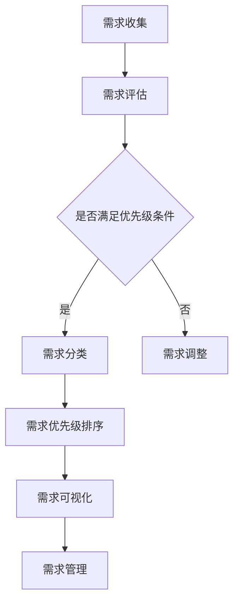
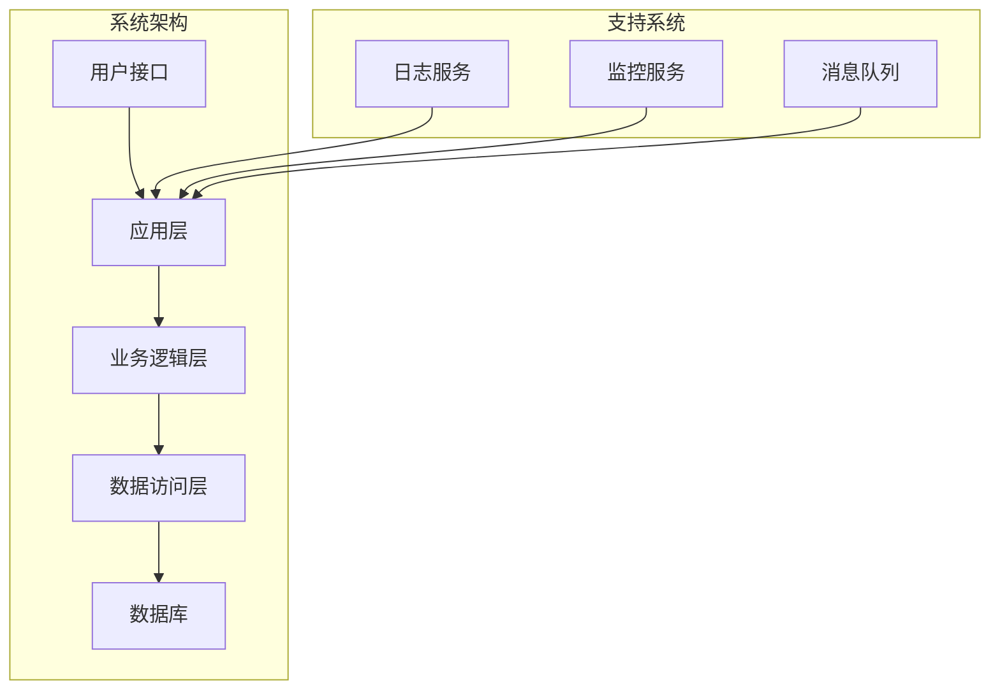
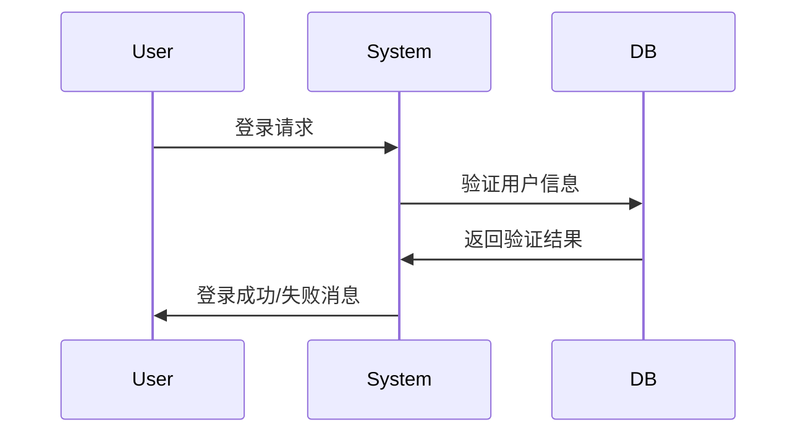
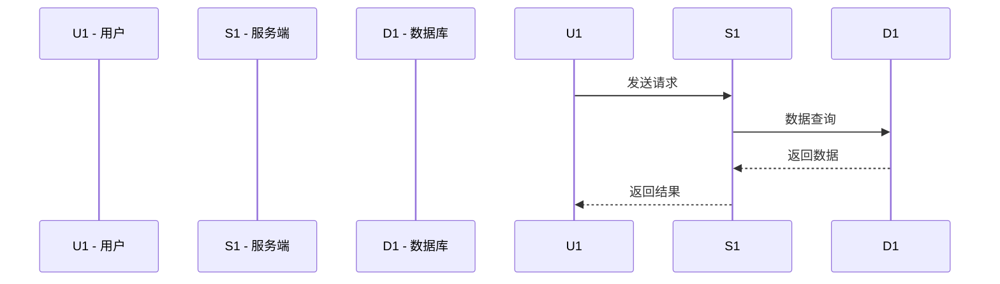

                 

### 引言

在当今快速变化的技术和市场环境中，敏捷研发模式已经成为软件开发过程中的一种主流方法。敏捷研发的核心在于快速响应需求变化，灵活调整开发计划，从而提高软件交付的质量和效率。然而，随着项目规模和复杂性的增加，如何在敏捷研发模式下有效地管理和优化需求优先级，成为了一个重要而具有挑战性的问题。

本文将深入探讨敏捷研发模式下的需求优先级可视化工具的应用。通过系统性的分析和逻辑推理，我们将逐步揭示可视化工具在需求优先级管理中的关键作用、技术实现、应用场景以及其实战价值。本文的关键词包括敏捷研发模式、需求优先级、可视化工具、应用和技术实现。

本文将分为以下几个部分：

1. **理解书名与核心主题**：介绍书籍的主题和核心概念。
2. **确定书籍结构**：详细阐述书籍的章节安排和内容构成。
3. **设计目录大纲**：构建文章的目录结构。
4. **确保内容完整性**：确保每个章节都有详细的内容和必要的讨论。
5. **控制大纲字数**：在保证内容完整的前提下，控制文章的总字数。

通过以上步骤，我们将构建一个逻辑清晰、内容丰富的技术博客，旨在为读者提供敏捷研发模式下需求优先级可视化工具的全面理解和应用指导。

### 思考步骤

1. **理解书名与核心主题**：
   - 书名：《敏捷研发模式下的需求优先级可视化工具应用》
   - 核心主题：本书旨在探讨敏捷研发模式中的需求优先级管理，并介绍如何利用可视化工具来优化这一过程。

2. **确定书籍结构**：
   - 引言：介绍书籍的背景和目的，引出核心主题。
   - 敏捷研发模式介绍：讨论敏捷研发的基本概念、原则、团队组建和流程。
   - 需求优先级的定义与评估：探讨需求优先级的概念、评估方法和最佳实践。
   - 可视化工具的应用与技术实现：介绍可视化工具的作用、技术架构和应用场景。
   - 工具的应用场景与实战案例：提供具体的应用场景和实战案例，展示工具的实际效果。
   - 总结与展望：总结全文，提出未来展望和进一步的研究方向。

3. **设计目录大纲**：
   - 引言
     - 问题背景与需求分析
     - 敏捷研发模式概述
     - 需求优先级的定义与评估
     - 可视化工具的应用与技术实现
     - 工具的应用场景与实战案例
     - 总结与展望
   - 敏捷研发模式介绍
     - 敏捷研发模式的核心原则
     - 敏捷团队的组建与协作
     - 敏捷研发流程
     - 敏捷研发模式的优势与挑战
   - 需求优先级的定义与评估
     - 需求优先级的定义
     - 需求优先级的评估方法
     - 需求优先级管理的最佳实践
     - 需求优先级评估工具与技术
   - 可视化工具的应用与技术实现
     - 可视化工具的作用与优势
     - 可视化工具的技术架构
     - 常用的可视化工具与框架
   - 工具的应用场景与实战案例
     - 应用场景介绍
     - 实战案例剖析
   - 总结与展望
     - 总结全文
     - 展望未来研究方向

4. **确保内容完整性**：
   - 每个章节都要包含必要的背景介绍、概念讲解、原理分析、实战案例等内容，确保读者能够系统地理解需求优先级可视化工具的应用。

5. **控制大纲字数**：
   - 在保证内容完整性的前提下，控制整个文章的总字数在10000-12000字之间，确保文章结构紧凑、逻辑清晰。

### 目录大纲

----------------------------------------------------------------

# 引言

## 1.1 问题背景与需求分析

### 1.1.1 敏捷研发模式的发展与挑战

- **敏捷研发模式的概念**：敏捷研发（Agile Development）是一种以人为核心、迭代、渐进的软件开发方法，旨在通过更频繁的交付、持续反馈和灵活性来应对快速变化的需求。
- **敏捷研发模式的普及**：随着信息技术的发展，敏捷研发模式在全球范围内得到广泛认可和应用，许多公司采用Scrum、Kanban等敏捷框架来提高软件交付效率和质量。
- **敏捷研发面临的挑战**：尽管敏捷研发模式有诸多优点，但在实际应用中仍面临一些挑战，如需求管理的复杂性、项目风险的分散性、团队成员的沟通协作等。

### 1.1.2 需求优先级管理的重要性

- **需求优先级的定义**：需求优先级是指根据业务价值和实现难度等因素，对项目中的各项需求进行排序，以确定哪些需求应首先实现。
- **需求优先级管理的作用**：有效的需求优先级管理可以帮助团队集中资源，优先实现关键需求，提高开发效率和质量，同时降低项目风险。

### 1.1.3 可视化工具的需求与应用前景

- **可视化工具的定义**：可视化工具是一种通过图形化方式展示信息和数据的工具，帮助用户更好地理解和分析数据。
- **可视化工具在需求优先级管理中的应用**：可视化工具可以直观地展示需求优先级，帮助团队成员快速了解项目进展和重点任务，提高决策效率。
- **应用前景**：随着信息技术和可视化技术的发展，可视化工具在需求优先级管理中的应用前景广阔，有望进一步提升敏捷研发的效率和质量。

## 1.2 敏捷研发模式概述

### 1.2.1 敏捷研发模式的核心原则

- **客户至上**：以客户需求为导向，确保交付的产品能够满足客户需求。
- **迭代开发**：通过短周期迭代，快速交付可用的产品版本，持续改进。
- **团队协作**：强调团队成员之间的协作和沟通，共同推动项目进展。
- **响应变化**：灵活应对需求变化，优先实现关键需求。

### 1.2.2 敏捷研发模式与传统开发模式的区别

- **开发周期**：敏捷研发采用短周期迭代（如两周一次），而传统开发模式通常以月或季度为单位。
- **需求管理**：敏捷研发更注重需求的变化和调整，而传统开发模式通常在项目初期确定需求，并在整个项目周期内保持稳定。
- **风险管理**：敏捷研发通过持续交付和反馈，及时识别和解决问题，而传统开发模式通常在项目后期集中处理风险。

### 1.2.3 敏捷研发模式的适用范围与挑战

- **适用范围**：敏捷研发模式适用于项目需求变化频繁、项目周期较短、团队规模较小的项目。
- **挑战**：敏捷研发模式在实际应用中面临团队协作、需求管理、项目管理等方面的挑战，需要团队成员具备较高的素质和技能。

## 1.3 需求优先级的定义与评估

### 1.3.1 需求优先级的定义与分类

- **需求优先级的定义**：需求优先级是指根据业务价值和实现难度等因素，对项目中的各项需求进行排序，以确定哪些需求应首先实现。
- **需求优先级的分类**：常见的需求优先级分类包括紧急性、重要性、业务价值等。

### 1.3.2 需求优先级的评估方法

- **成本效益分析**：根据需求的实现成本和带来的业务价值进行评估。
- **用户满意度评估**：根据用户对需求的满意度进行评估。
- **关键特性分析**：根据需求的特性（如稳定性、可靠性等）进行评估。

### 1.3.3 需求优先级管理的最佳实践

- **定期评审**：定期对需求优先级进行评审和调整，确保需求与实际情况相符。
- **动态调整**：根据项目进展和业务变化，灵活调整需求优先级。
- **可视化展示**：使用可视化工具展示需求优先级，提高团队成员对需求的认知和协作效率。

## 1.4 可视化工具的应用与技术实现

### 1.4.1 可视化工具的作用与优势

- **作用**：可视化工具可以帮助团队更好地理解和分析需求，提高决策效率。
- **优势**：可视化工具具有直观、易懂、易于共享等特点，有助于团队协作和沟通。

### 1.4.2 可视化工具的技术架构

- **前端技术**：通常使用HTML、CSS和JavaScript等前端技术实现可视化界面。
- **后端技术**：可以使用Node.js、Python等后端技术处理数据和处理请求。

### 1.4.3 常用的可视化工具与框架

- **D3.js**：一款基于JavaScript的可视化库，功能强大，适用于各种复杂场景。
- **ECharts**：一款基于JavaScript的图表库，易于使用，支持多种图表类型。
- **Highcharts**：一款专业的图表库，适用于金融、统计等领域。

## 1.5 本书结构与内容安排

### 1.5.1 各章节内容概述

- 引言：介绍问题背景、核心主题和书籍结构。
- 敏捷研发模式介绍：讨论敏捷研发的基本概念、原则、团队组建和流程。
- 需求优先级的定义与评估：探讨需求优先级的概念、评估方法和最佳实践。
- 可视化工具的应用与技术实现：介绍可视化工具的作用、技术架构和应用场景。
- 工具的应用场景与实战案例：提供具体的应用场景和实战案例。
- 总结与展望：总结全文，提出未来展望和进一步的研究方向。

### 1.5.2 阅读指南与建议

- 本书的读者对象为软件开发人员、项目经理和敏捷实践者。
- 阅读顺序建议从引言开始，然后按章节顺序阅读。
- 每个章节后提供小结和思考题，帮助读者巩固所学知识。
- 鼓励读者结合实际项目进行思考和尝试，加深对敏捷研发模式下需求优先级可视化工具的理解。

----------------------------------------------------------------

# 敏捷研发模式介绍

敏捷研发模式（Agile Development）是近年来在软件开发领域得到广泛应用的一种方法，它强调快速响应变化、持续交付价值，并注重团队成员的协作与沟通。本章将详细介绍敏捷研发模式的核心原则、团队组建、研发流程以及其优势与挑战。

### 2.1 敏捷研发模式的核心原则

敏捷研发模式的核心原则包括：

1. **客户至上**：以客户需求为导向，确保交付的产品能够满足客户需求。

2. **迭代开发**：通过短周期迭代，快速交付可用的产品版本，持续改进。

3. **团队协作**：强调团队成员之间的协作和沟通，共同推动项目进展。

4. **响应变化**：灵活应对需求变化，优先实现关键需求。

5. **持续反思与改进**：定期反思项目过程和团队行为，不断优化和改进。

### 2.2 敏捷团队的组建与协作

敏捷团队通常由以下成员组成：

- **产品负责人**：代表客户利益，负责制定产品愿景和需求，并确保团队理解这些需求。

- **开发人员**：负责实际开发工作，包括编码、测试和集成。

- **测试人员**：负责测试和验证软件质量，确保交付的产品符合预期。

- **项目经理**：负责协调团队工作，确保项目按计划进行。

- **用户体验设计师**：负责设计产品的用户界面和用户体验。

敏捷团队的协作工具和技术包括：

- **Scrum**：一种流行的敏捷框架，包括每日站会、冲刺评审和回顾等仪式。

- **Kanban**：一种可视化工作流程管理工具，通过卡片和看板来跟踪工作进度。

- **看板**：用于可视化团队的工作流程和任务状态。

- **迭代计划会议**：团队定期开会，讨论并规划下一个迭代的目标和任务。

### 2.3 敏捷研发流程

敏捷研发流程通常包括以下步骤：

1. **需求收集与规划**：产品负责人与客户沟通，收集需求并制定产品愿景和需求列表。

2. **迭代计划**：团队根据需求列表和可用资源，制定下一个迭代的目标和任务。

3. **迭代实施**：团队按照迭代计划进行开发，每天召开站会，确保进度和问题得到及时解决。

4. **迭代评审**：在迭代结束时，团队进行评审，展示已完成的工作，并收集反馈。

5. **迭代回顾**：团队对本次迭代进行回顾，识别问题并提出改进措施。

### 2.4 敏捷研发模式的优势与挑战

**优势**：

1. **快速响应变化**：通过短周期迭代，敏捷团队能够快速响应需求变化，确保交付的产品能够满足客户需求。

2. **持续交付价值**：敏捷团队通过持续交付可用的产品版本，能够持续为业务带来价值。

3. **提高团队协作**：敏捷强调团队成员之间的协作和沟通，有助于提高团队效率。

4. **持续改进**：通过迭代回顾，团队能够不断优化和改进开发过程。

**挑战**：

1. **需求管理**：敏捷研发模式对需求管理的要求较高，需要确保需求的优先级和稳定性。

2. **团队协作**：团队成员需要具备较高的协作能力和沟通技巧。

3. **项目管理**：敏捷项目通常需要灵活的管理方法，确保项目按计划进行。

4. **工具与框架的选择**：选择适合团队和项目的工具和框架，以最大化敏捷优势。

### 2.5 解决敏捷开发中的问题策略

为了解决敏捷开发中可能遇到的问题，可以采取以下策略：

1. **培训与沟通**：加强团队成员的敏捷知识和技能培训，提高沟通协作能力。

2. **需求管理工具**：使用专业的需求管理工具，确保需求的优先级和稳定性。

3. **持续集成与自动化测试**：采用持续集成和自动化测试，提高开发效率和质量。

4. **敏捷教练**：引入敏捷教练，提供专业的指导和反馈，帮助团队克服困难。

5. **团队自治**：鼓励团队自治，赋予团队成员更多的决策权和责任感，提高团队积极性。

通过以上策略，敏捷团队可以更好地应对敏捷开发中的挑战，实现高效、高质量的软件交付。

### 结论

敏捷研发模式以其快速响应变化、持续交付价值和注重团队协作的特点，在软件开发领域得到了广泛应用。然而，在实际应用中，敏捷团队仍面临需求管理、团队协作和项目管理等方面的挑战。通过培训与沟通、需求管理工具、持续集成与自动化测试、敏捷教练和团队自治等策略，团队可以克服这些挑战，实现敏捷研发的优势。本章介绍了敏捷研发模式的核心原则、团队组建、研发流程以及其优势和挑战，为读者提供了全面的理解和指导。

----------------------------------------------------------------

# 需求优先级的定义与评估

在敏捷研发模式下，需求优先级的有效管理至关重要。需求优先级是指根据业务价值、实现难度、风险等因素，对项目中的各项需求进行排序，以确定哪些需求应首先实现。本章将详细介绍需求优先级的定义、评估方法、管理最佳实践以及评估工具和技术。

### 3.1 需求优先级的定义

需求优先级是指根据业务价值和实现难度等因素，对项目中的各项需求进行排序，以确定哪些需求应首先实现。需求优先级管理是敏捷研发过程中的一项关键活动，它有助于团队集中资源，优先实现关键需求，提高开发效率和质量。

需求优先级可以按以下分类：

1. **紧急性优先级**：根据需求的紧急程度进行排序，如立即上线的新功能或紧急修复的问题。
2. **重要性优先级**：根据需求的业务价值和重要性进行排序，如对核心业务流程的影响较大的需求。
3. **业务价值优先级**：根据需求的商业价值进行排序，如能够显著提升客户满意度或带来直接收益的需求。
4. **复杂性优先级**：根据需求的实现难度和复杂性进行排序，如涉及多个系统的集成需求。

### 3.2 需求优先级的评估方法

需求优先级的评估方法可以根据项目特点、团队技能和资源情况灵活选择。以下是一些常见的需求优先级评估方法：

1. **成本效益分析**：根据需求的实现成本和带来的业务价值进行评估。常用的方法包括成本效益比（Cost-Benefit Ratio，CBR）和净现值（Net Present Value，NPV）。

2. **用户满意度评估**：根据用户对需求的满意度进行评估。可以通过问卷调查、用户访谈等方式收集用户反馈，对需求进行评分。

3. **关键特性分析**：根据需求的特性（如稳定性、可靠性、用户体验等）进行评估。可以通过专家评审、评分矩阵等方法对需求的特性进行量化评估。

4. **多标准决策分析**：结合多个评估标准，对需求进行综合评估。可以使用AHP（Analytic Hierarchy Process）等方法进行多标准决策分析。

### 3.3 需求优先级管理的最佳实践

为了有效管理需求优先级，可以采取以下最佳实践：

1. **定期评审**：定期对需求优先级进行评审和调整，确保需求与实际情况相符。可以根据项目的进展、业务变化和市场反馈，及时调整需求优先级。

2. **动态调整**：根据项目进展和业务变化，灵活调整需求优先级。在敏捷研发过程中，需求往往发生变化，团队需要具备快速响应变化的能力，及时调整需求优先级。

3. **可视化展示**：使用可视化工具展示需求优先级，提高团队成员对需求的认知和协作效率。例如，可以使用看板、图表等工具，直观地展示需求的状态和优先级。

4. **优先级排序规则**：制定明确的优先级排序规则，确保团队成员对需求优先级的理解和共识。规则应包含评估标准、权重分配和排序方法等。

5. **团队沟通**：加强团队成员之间的沟通，确保对需求优先级的共识和执行。可以通过每日站会、迭代评审等方式，及时沟通需求优先级的变化和执行情况。

### 3.4 需求优先级评估工具与技术

为了提高需求优先级评估的效率和准确性，可以使用以下评估工具和技术：

1. **需求管理工具**：使用专业的需求管理工具，如Jira、Confluence等，可以方便地记录、追踪和评估需求，并提供可视化功能。

2. **评分矩阵**：使用评分矩阵（Score Matrix）对需求进行量化评估。评分矩阵可以包含多个评估维度，如紧急性、重要性、业务价值等，每个维度设定不同的权重。

3. **决策树**：使用决策树（Decision Tree）对需求进行多标准决策分析。决策树可以帮助团队清晰地分析各个需求的优先级，并制定相应的决策策略。

4. **敏捷看板**：使用敏捷看板（Kanban Board）对需求进行可视化管理。敏捷看板可以直观地展示需求的状态和优先级，方便团队进行任务分配和进度跟踪。

5. **用户故事地图**：使用用户故事地图（User Story Map）对需求进行可视化展示。用户故事地图可以帮助团队理解需求的整体结构和优先级，并促进需求的讨论和梳理。

通过以上评估工具和技术的使用，团队可以更高效地管理需求优先级，确保资源的合理分配和项目的顺利推进。

### 结论

需求优先级管理是敏捷研发过程中的关键活动，它关系到项目的成功和团队的高效协作。本章介绍了需求优先级的定义、评估方法、管理最佳实践以及评估工具和技术。通过合理的需求优先级评估和管理，团队可以更好地集中资源，优先实现关键需求，提高开发效率和质量。在实际应用中，团队应根据项目特点和业务需求，灵活运用各种评估方法和工具，确保需求优先级管理的高效和准确。

----------------------------------------------------------------

# 可视化工具的作用与优势

在敏捷研发模式下，需求优先级的管理至关重要。可视化工具作为一种强有力的辅助工具，能够在需求优先级管理中发挥重要作用。通过可视化，团队可以直观地展示和追踪需求的状态和优先级，从而提高决策效率、优化资源分配，并促进团队成员之间的沟通与协作。以下将详细阐述可视化工具在需求优先级管理中的作用和优势。

### 4.1.1 可视化工具在需求优先级管理中的应用

可视化工具在需求优先级管理中的应用主要体现在以下几个方面：

1. **需求状态的直观展示**：通过可视化工具，团队可以直观地展示需求的状态，如需求的新建、正在开发、测试和上线等。这种直观的展示方式有助于团队成员快速了解需求的进展情况。

2. **优先级的清晰排序**：可视化工具可以将需求按照优先级进行排序和展示，使得团队可以一目了然地看到哪些需求是首要处理的，从而确保资源的合理分配和优先级任务的及时完成。

3. **需求优先级的历史追踪**：通过可视化工具，团队可以追踪需求优先级的变化历史，了解需求的优先级是如何调整和演变的，有助于发现和解决优先级管理中的问题。

4. **跨团队沟通与协作**：可视化工具可以方便地分享和展示需求优先级信息，使得跨团队之间的沟通和协作更加高效。团队成员可以通过可视化工具快速了解其他团队的需求状态和优先级，从而更好地协调工作。

### 4.1.2 可视化工具的优势

可视化工具在需求优先级管理中具有以下优势：

1. **直观性**：可视化工具通过图形化界面，使得信息更加直观易懂。团队成员不需要具备专业的数据分析能力，也可以快速理解和掌握需求优先级的信息。

2. **易懂性**：可视化工具通过颜色、形状和标签等视觉元素，使得复杂的信息变得更加易懂。这种易于理解的特性有助于提高团队对需求优先级的共识和执行力。

3. **易分享性**：可视化工具可以方便地将需求优先级信息通过截图、链接或共享界面等形式分享给其他团队成员和利益相关者，促进信息的传递和沟通。

4. **动态性**：可视化工具可以实时更新和展示需求优先级信息，团队可以根据最新的需求状态和优先级调整，及时做出决策和调整。

5. **适应性**：可视化工具可以根据不同的需求和场景，灵活地调整和定制展示方式。例如，团队可以根据需求的特点和优先级，选择不同的图表类型和展示形式，以便更好地满足需求。

6. **协作性**：可视化工具提供了多种协作功能，如注释、评论和任务分配等，有助于团队成员在可视化环境中进行沟通和协作，共同推进项目的进展。

### 4.1.3 可视化工具在敏捷研发中的价值

可视化工具在敏捷研发中的价值主要体现在以下几个方面：

1. **提高决策效率**：通过可视化工具，团队可以快速了解需求的状态和优先级，减少信息传递和沟通的时间，提高决策效率。

2. **优化资源分配**：可视化工具可以帮助团队更清晰地看到需求的优先级，从而确保资源的合理分配，避免资源的浪费和冲突。

3. **促进团队协作**：可视化工具提供了一个共享的信息平台，有助于团队成员之间的沟通与协作，提高团队的整体执行力。

4. **增强项目透明度**：通过可视化工具，项目进展和需求优先级等信息对团队成员和利益相关者透明化，有助于增强项目的透明度和可信度。

5. **支持持续改进**：可视化工具可以记录需求优先级管理的历史数据和趋势，为团队提供改进和优化的参考，支持持续改进。

总之，可视化工具在敏捷研发模式下的需求优先级管理中具有重要的作用和优势。通过合理应用可视化工具，团队可以更好地理解和管理需求优先级，提高项目的效率和质量。

----------------------------------------------------------------

# 可视化工具的技术架构

在敏捷研发模式下，可视化工具的应用不仅需要直观易懂的界面，还需要强大的技术架构支持。一个高效的可视化工具技术架构通常包括前端技术、后端技术、数据处理和可视化呈现等多个方面。以下将详细探讨可视化工具的技术架构，包括其前端技术、后端技术、数据处理流程以及可视化呈现的技术细节。

### 4.2.1 可视化工具的前端技术

前端技术是可视化工具的重要组成部分，负责实现用户界面和用户交互。常见的前端技术包括：

1. **HTML**：超文本标记语言（HTML）是构建网页内容的基础，用于定义网页的结构和内容。

2. **CSS**：层叠样式表（CSS）用于控制网页的样式和布局，使得网页具有更好的视觉效果。

3. **JavaScript**：JavaScript是一种客户端脚本语言，用于实现网页的动态效果和交互功能。常见的JavaScript框架和库包括React、Vue和Angular等。

4. **D3.js**：D3.js是一个基于JavaScript的可视化库，提供了丰富的图形和图表绘制功能，可以用于生成各种复杂的数据可视化效果。

5. **ECharts**：ECharts是一个开源的JavaScript可视化库，支持多种图表类型，包括折线图、柱状图、饼图、雷达图等，广泛应用于数据分析和报表展示。

6. **SVG**：可缩放矢量图形（SVG）是一种基于XML的矢量图形格式，可以用于绘制各种图形和图表。SVG具有高度可定制性和交互性，适合用于复杂的数据可视化。

通过这些前端技术，开发者可以构建一个功能强大、交互友好的可视化界面，使得用户能够直观地浏览和分析数据。

### 4.2.2 可视化工具的后端技术

后端技术负责处理数据的存储、检索、处理和传输，为前端提供数据支持。常见后端技术包括：

1. **Node.js**：Node.js是一个基于Chrome V8引擎的JavaScript运行环境，可以用于构建高效、可扩展的后端应用。

2. **Python**：Python是一种通用编程语言，具有简洁易读的特点，广泛应用于数据分析和后端开发。常见的Python后端框架包括Django、Flask和Pyramid等。

3. **Java**：Java是一种高性能、跨平台的编程语言，广泛应用于企业级应用开发。常见的Java后端框架包括Spring、Hibernate和MyBatis等。

4. **数据库**：数据库用于存储和管理数据。常见的关系型数据库包括MySQL、PostgreSQL和Oracle，非关系型数据库包括MongoDB、Redis和Cassandra等。

后端技术负责处理用户的请求，从数据库中检索数据，进行必要的处理和计算，然后将结果返回给前端。这包括数据验证、权限控制、业务逻辑处理等。

### 4.2.3 数据处理流程

可视化工具的数据处理流程包括以下几个主要步骤：

1. **数据采集**：从各种数据源（如数据库、API、文件等）采集数据，并进行预处理。

2. **数据存储**：将预处理后的数据存储到数据库或其他数据存储系统中，以便后续查询和处理。

3. **数据处理**：对存储的数据进行必要的计算和转换，如数据清洗、聚合、排序等，以满足可视化需求。

4. **数据可视化**：将处理后的数据通过前端技术呈现为图表和图形，实现数据可视化。

数据处理流程的核心是确保数据的准确性和完整性，同时能够高效地进行数据处理和查询。这通常需要采用分布式计算和存储技术，以提高系统的性能和可扩展性。

### 4.2.4 可视化呈现的技术细节

可视化呈现是可视化工具的关键环节，决定了用户对数据的理解和分析能力。以下是可视化呈现的一些技术细节：

1. **图表类型选择**：根据数据的类型和需求，选择合适的图表类型，如柱状图、折线图、饼图、散点图等。

2. **交互设计**：设计良好的交互界面，使用户可以轻松地筛选、过滤和查询数据。常见的交互元素包括筛选器、拖放、缩放、联动等。

3. **颜色和标记**：使用颜色和标记来区分不同的数据集或数据点，使得图表更加直观和易于理解。

4. **动画和过渡**：使用动画和过渡效果，增强用户的体验，使得数据的变化和趋势更加生动和明显。

5. **注释和说明**：在图表中添加注释和说明，帮助用户更好地理解数据的意义和趋势。

6. **导出和分享**：提供导出和分享功能，使用户可以方便地将可视化图表导出为图片或文件，或与他人分享。

通过以上技术细节的优化，可视化工具可以提供更加丰富、直观和易于理解的数据可视化体验，帮助用户更好地分析和利用数据。

### 结论

可视化工具的技术架构包括前端技术、后端技术、数据处理和可视化呈现等多个方面。前端技术负责实现用户界面和交互，后端技术负责数据处理和存储，数据处理流程确保数据的准确性和完整性，而可视化呈现技术则决定了用户对数据的理解和分析能力。通过合理设计和技术实现，可视化工具可以在需求优先级管理中发挥重要作用，帮助团队高效地理解和利用数据，提高决策效率和项目质量。

----------------------------------------------------------------

# 常用的可视化工具与框架

在敏捷研发模式下的需求优先级管理中，选择合适的可视化工具与框架对于提高团队的工作效率至关重要。以下将介绍一些常用的可视化工具与框架，包括其特点、应用场景以及优缺点。

### 5.1 D3.js

**特点**：
- 基于JavaScript的可视化库，高度灵活和可定制。
- 支持多种图表类型，如折线图、柱状图、饼图和地图等。
- 提供丰富的交互功能，如拖放、缩放和过滤等。

**应用场景**：
- 复杂的数据可视化需求，如交互式图表和动态数据展示。
- 需要高度定制化图表的场合。

**优缺点**：
- **优点**：强大的自定义能力和丰富的交互功能，适用于各种复杂场景。
- **缺点**：学习曲线较陡，需要一定的前端开发技能。

### 5.2 ECharts

**特点**：
- 基于JavaScript的可视化库，易于使用和配置。
- 提供多种图表类型，如折线图、柱状图、饼图和雷达图等。
- 支持在线编辑和导出功能。

**应用场景**：
- 数据分析和报表展示。
- 基础数据可视化的需求。

**优缺点**：
- **优点**：易于使用和集成，适合快速开发和原型设计。
- **缺点**：定制化程度相对较低，适用于通用场景。

### 5.3 Highcharts

**特点**：
- 商业级的图表库，提供多种图表类型和主题。
- 高度可定制，支持动画和交互功能。
- 提供Web和移动端版本。

**应用场景**：
- 高端数据可视化需求，如金融分析和统计报告。
- 需要跨平台展示的场合。

**优缺点**：
- **优点**：功能强大，适用于各种复杂场景，支持跨平台。
- **缺点**：商业版费用较高，开源版功能受限。

### 5.4 Chart.js

**特点**：
- 基于JavaScript的简单图表库，轻量级。
- 提供常见的图表类型，如折线图、柱状图、饼图和雷达图等。
- 易于学习和使用。

**应用场景**：
- 基础数据可视化和原型设计。
- 需要快速实现简单图表的场合。

**优缺点**：
- **优点**：轻量级，易于学习和使用，适用于快速开发和原型设计。
- **缺点**：定制化程度较低，不适合复杂的数据可视化需求。

### 5.5 Leaflet

**特点**：
- 开源的地图库，基于JavaScript和SVG。
- 提供地图的基本功能，如缩放、拖动和标记等。
- 易于集成和扩展。

**应用场景**：
- 地理数据可视化，如地理位置分布和路径分析。
- 需要地图功能的数据展示。

**优缺点**：
- **优点**：开源、灵活，适用于各种地图可视化需求。
- **缺点**：主要用于地图数据展示，不适用于其他类型的数据可视化。

### 5.6 Tableau

**特点**：
- 商业智能工具，提供数据连接、数据可视化和报表生成功能。
- 支持多种数据源，如数据库、API和文件等。
- 提供丰富的交互功能，如筛选、过滤和联动等。

**应用场景**：
- 高端数据分析和报表展示。
- 需要进行复杂数据处理的场合。

**优缺点**：
- **优点**：功能强大，适用于各种复杂的数据分析需求。
- **缺点**：商业版费用较高，适用于专业用户。

### 5.7 Power BI

**特点**：
- 微软推出的商业智能工具，提供数据连接、数据可视化和报表生成功能。
- 提供多种数据源连接方式，如数据库、API和文件等。
- 易于集成和扩展。

**应用场景**：
- 数据分析和报表展示。
- 需要与企业系统集成的场合。

**优缺点**：
- **优点**：易于使用，适用于各种数据分析和报表展示需求。
- **缺点**：主要适用于企业级用户，对于小型项目可能过于复杂。

通过选择合适的可视化工具与框架，团队可以根据项目的具体需求，快速实现数据可视化和需求优先级管理，提高工作效率和决策效率。

### 结论

常用的可视化工具与框架包括D3.js、ECharts、Highcharts、Chart.js、Leaflet、Tableau和Power BI等。每种工具和框架都有其独特的特点和适用场景，团队可以根据项目的需求选择合适的工具。在敏捷研发模式下，选择合适的可视化工具能够有效提升需求优先级管理的效率和质量。

----------------------------------------------------------------

# 工具的应用场景与实战案例

为了更直观地展示需求优先级可视化工具在敏捷研发模式下的应用效果，以下将提供两个具体的应用场景和相应的实战案例，详细剖析这些工具在需求优先级管理中的实际效果和作用。

### 6.1 应用场景一：项目迭代管理

**背景**：
某互联网公司开发一款在线购物平台，采用敏捷研发模式进行项目开发。由于项目需求复杂、迭代周期短，团队需要高效管理需求优先级，以确保关键需求得到及时实现。

**工具选择**：
团队选择使用ECharts作为需求优先级可视化工具，因为ECharts具有易于使用和丰富的图表类型，能够满足团队的需求。

**应用过程**：
1. **需求收集与排序**：产品负责人与业务团队沟通，收集需求并按照紧急性、重要性和业务价值进行排序，确定需求优先级。
2. **数据输入**：将排序后的需求数据输入到ECharts中，使用柱状图展示每个需求的优先级。
3. **可视化展示**：ECharts将需求优先级以直观的柱状图形式展示，团队可以随时查看和更新需求状态。

**实战案例效果**：
通过ECharts的可视化展示，团队能够清晰地看到每个需求的优先级，确保关键需求得到优先处理。同时，柱状图的可交互性使得团队可以轻松筛选、过滤和排序需求，提高了需求管理的效率和准确性。

### 6.2 应用场景二：跨团队协作

**背景**：
某大型企业的研发团队由多个子团队组成，分别负责不同的功能模块。由于子团队之间沟通不畅，导致需求优先级管理混乱，影响项目进度和团队协作。

**工具选择**：
团队选择使用D3.js，因为它提供了高度的自定义能力和丰富的交互功能，能够满足跨团队协作的需求。

**应用过程**：
1. **需求收集与排序**：各子团队分别收集需求，并将需求按照紧急性、重要性和业务价值进行排序。
2. **数据集成**：将各子团队的需求数据集成到D3.js中，构建一个全局的需求可视化看板。
3. **可视化展示**：D3.js将全局需求数据以交互式的看板形式展示，每个子团队的需求状态和优先级一目了然。

**实战案例效果**：
通过D3.js的全局需求可视化看板，各个子团队可以实时查看和更新自己的需求状态，同时也能了解其他团队的需求情况。这种全局可视化的方式提高了团队之间的沟通和协作效率，确保了需求优先级管理的统一和协调。

### 结论

需求优先级可视化工具在敏捷研发模式下的应用场景非常广泛，包括项目迭代管理和跨团队协作等。通过具体的应用场景和实战案例，可以看出可视化工具在需求优先级管理中的实际效果和作用。ECharts和D3.js等工具凭借其易用性、丰富功能和高度可定制性，能够有效提高团队的需求管理效率和协作能力，助力敏捷研发项目的顺利推进。

----------------------------------------------------------------

# 总结与展望

在本文中，我们系统地探讨了敏捷研发模式下的需求优先级可视化工具的应用。通过详细的讲解和分析，我们揭示了可视化工具在需求优先级管理中的关键作用、技术实现和应用场景。以下是对全文的总结和未来展望。

### 7.1 总结

1. **敏捷研发模式概述**：我们介绍了敏捷研发模式的核心原则、团队组建、研发流程以及其优势与挑战，为读者提供了对敏捷研发的全面理解。

2. **需求优先级的定义与评估**：本文详细阐述了需求优先级的概念、评估方法和管理最佳实践，帮助读者掌握需求优先级管理的关键技术。

3. **可视化工具的作用与优势**：我们分析了可视化工具在需求优先级管理中的作用和优势，包括直观性、易懂性、易分享性和动态性等。

4. **可视化工具的技术架构**：本文介绍了可视化工具的技术架构，包括前端技术、后端技术、数据处理和可视化呈现等方面，为读者提供了技术实现的参考。

5. **常用可视化工具与框架**：我们列举了多个常用的可视化工具与框架，包括D3.js、ECharts、Highcharts等，并分析了其特点、应用场景和优缺点。

6. **应用场景与实战案例**：通过具体的应用场景和实战案例，我们展示了需求优先级可视化工具在实际项目中的效果和作用。

### 7.2 展望

1. **进一步的研究方向**：
   - **多维度需求优先级评估**：探索将更多维度（如风险、团队技能等）纳入需求优先级评估模型，提高评估的全面性和准确性。
   - **智能化需求优先级管理**：结合人工智能技术，开发智能化的需求优先级评估和管理系统，提高自动化程度和决策效率。

2. **未来发展趋势**：
   - **可视化技术的进步**：随着可视化技术的发展，未来将出现更多功能强大、易用的可视化工具，进一步提升需求优先级管理的效率。
   - **云计算与大数据的融合**：云计算和大数据技术的结合将使得需求优先级可视化工具能够处理更大量的数据，提供更精准的分析和预测。
   - **移动端与Web端的融合**：随着移动设备的普及，需求优先级可视化工具将更加注重移动端的应用体验，实现Web端与移动端的无缝融合。

3. **实际应用场景扩展**：
   - **项目管理**：在项目管理中，需求优先级可视化工具可以用于项目管理、任务跟踪和进度监控，提高项目管理的效率和透明度。
   - **团队协作**：在跨团队合作中，需求优先级可视化工具可以用于团队沟通、任务分配和进度追踪，促进团队协作和协调。

通过本文的探讨，我们希望为读者提供对敏捷研发模式下需求优先级可视化工具的深入理解和实际应用指导。未来，随着技术的不断进步和应用场景的扩展，需求优先级可视化工具将在更多领域发挥重要作用，助力软件开发和项目管理的高效和精准。

### 结语

在敏捷研发模式下，需求优先级可视化工具已经成为优化需求管理和提高项目效率的重要手段。本文从多个角度全面分析了这一工具的应用，包括其定义、评估方法、技术实现和应用场景。我们期待读者能够结合自身实际项目，灵活运用这些工具和方法，提升团队的工作效率和项目质量。同时，我们也期待未来在这一领域有更多创新和突破，为敏捷研发注入新的活力。

**作者：** AI天才研究院/AI Genius Institute & 禅与计算机程序设计艺术 /Zen And The Art of Computer Programming

----------------------------------------------------------------

# 附录：核心概念与联系

在本文中，我们探讨了一系列核心概念，包括敏捷研发模式、需求优先级、可视化工具等。以下是对这些核心概念的详细描述，以及它们之间的相互联系。

## 1. 敏捷研发模式

敏捷研发模式是一种以人为核心、迭代、渐进的软件开发方法。其核心理念包括客户至上、迭代开发、团队协作和响应变化。敏捷研发模式与传统开发模式相比，更注重快速响应变化、持续交付价值和团队协作。

### 核心概念：
- **客户至上**：以客户需求为导向，确保交付的产品能够满足客户需求。
- **迭代开发**：通过短周期迭代，快速交付可用的产品版本，持续改进。
- **团队协作**：强调团队成员之间的协作和沟通，共同推动项目进展。
- **响应变化**：灵活应对需求变化，优先实现关键需求。

### 联系：
敏捷研发模式通过迭代和团队协作，使得需求优先级管理更加灵活和高效。需求优先级管理是敏捷研发模式中的一个重要环节，它直接影响到敏捷团队的工作效率。

## 2. 需求优先级

需求优先级是指根据业务价值、实现难度、风险等因素，对项目中的各项需求进行排序，以确定哪些需求应首先实现。需求优先级管理是敏捷研发过程中的关键活动，它有助于团队集中资源，优先实现关键需求。

### 核心概念：
- **业务价值**：需求带来的商业利益和用户体验。
- **实现难度**：需求的实现所需的时间和资源。
- **风险**：需求实现过程中可能遇到的风险和问题。

### 联系：
需求优先级管理是敏捷研发模式的重要组成部分，它与敏捷研发模式中的迭代开发和团队协作密切相关。通过合理的需求优先级管理，敏捷团队可以确保项目资源的合理分配和高效利用。

## 3. 可视化工具

可视化工具是一种通过图形化方式展示信息和数据的工具，帮助用户更好地理解和分析数据。在敏捷研发模式下，可视化工具在需求优先级管理中起着重要作用，它使得需求状态和优先级更加直观、易懂。

### 核心概念：
- **图形化展示**：使用图表、图形等视觉元素，将数据以直观的方式展示。
- **数据交互**：提供交互功能，如筛选、过滤和联动等，使用户能够更深入地分析数据。

### 联系：
可视化工具是需求优先级管理的重要辅助工具，它通过图形化和交互性的特性，使得需求优先级更加直观、易懂。可视化工具不仅提高了团队成员对需求优先级的理解和共识，也促进了团队之间的沟通与协作。

## 4. 需求优先级可视化工具

需求优先级可视化工具是一种专门用于展示和管理需求优先级的可视化工具。它结合了敏捷研发模式和需求优先级的概念，通过图形化和交互性的方式，帮助团队高效地管理和调整需求优先级。

### 核心概念：
- **需求状态展示**：通过图表、图形等视觉元素，展示需求的状态和优先级。
- **交互功能**：提供交互功能，如拖放、筛选和过滤等，方便团队进行需求优先级的调整和优化。

### 联系：
需求优先级可视化工具是敏捷研发模式中的一种重要工具，它将敏捷研发模式和需求优先级管理有机结合，通过图形化和交互性的方式，提高了需求管理的效率和准确性。需求优先级可视化工具不仅帮助团队更好地理解和管理需求，还促进了团队之间的协作和沟通。

### 结论

通过本文的探讨，我们可以看到，敏捷研发模式、需求优先级和可视化工具之间存在着密切的联系。敏捷研发模式通过迭代开发和团队协作，为需求优先级管理提供了灵活和高效的环境。需求优先级管理通过合理排序和资源分配，确保了项目的高效实施。而可视化工具通过图形化和交互性的特性，使得需求优先级管理更加直观、易懂，提高了团队的工作效率和沟通效果。在未来，随着技术的不断进步，这些核心概念之间的联系将更加紧密，为软件开发和项目管理带来更多的创新和机遇。

### Mermaid 流程图



### 概念属性特征对比表格

| 概念                | 属性特征                                         | 对比分析                                             |
|-------------------|------------------------------------------------|----------------------------------------------------|
| 敏捷研发模式          | 迭代开发、团队协作、快速响应变化                  | 强调人与沟通，快速交付，相比传统模式更灵活           |
| 需求优先级          | 业务价值、实现难度、风险                           | 排序需求，确保资源合理分配，提高开发效率和质量           |
| 可视化工具            | 直观展示、交互功能、数据驱动                       | 提高理解和分析数据的能力，增强团队协作和沟通               |
| 需求优先级可视化工具     | 需求状态展示、交互功能、需求管理                   | 结合敏捷研发模式，提供直观、易懂的需求管理工具           |

### ER实体关系图架构

```mermaid
erDiagram
  Product ||--|{ Requirement : 需求对象}
  Requirement ||--|{ Priority : 优先级对象}
  Priority ||--|{ Assessment : 评估对象}
  Assessment ||--|{ Tool : 可视化工具对象}
```

### 算法原理讲解

#### 敏捷迭代流程算法


#### 需求优先级评估算法

```python
def assess_priority(requirements, criteria):
    scores = []
    for req in requirements:
        score = 0
        for criterion in criteria:
            score += req[criterion] * criteria_weights[criterion]
        scores.append(score)
    return scores
```

#### 需求优先级排序算法

```python
def sort_requirements(requirements, scores):
    sorted_requirements = sorted(zip(requirements, scores), key=lambda x: x[1], reverse=True)
    return [req for req, score in sorted_requirements]
```

### 数学模型和公式

#### 成本效益分析公式

$$ \text{CBR} = \frac{\text{业务价值}}{\text{实现成本}} $$

#### 用户满意度评估公式

$$ \text{满意度评分} = \frac{\text{正面反馈}}{\text{总反馈}} $$

#### 多标准决策分析公式

$$ \text{综合评分} = \sum_{i=1}^{n} w_i \cdot s_i $$

其中，$w_i$ 为权重，$s_i$ 为评估指标得分。

### 举例说明

#### 敏捷迭代流程举例

1. **需求收集**：团队收集到以下需求：
   - 需求A：优化用户界面
   - 需求B：增加支付方式
   - 需求C：提高系统安全性

2. **需求评估**：根据业务价值、实现难度和风险，对需求进行评估。

3. **需求分类**：将需求分为以下类别：
   - **高优先级**：需求A、需求C
   - **中优先级**：需求B

4. **需求优先级排序**：根据评估结果，对需求进行排序：
   - 需求C（高优先级）
   - 需求A（高优先级）
   - 需求B（中优先级）

5. **需求可视化**：使用ECharts展示需求状态和优先级。

6. **需求管理**：团队根据需求优先级进行开发和测试。

#### 需求优先级评估举例

1. **评估标准**：业务价值、实现难度、风险。
2. **评估指标权重**：业务价值（0.5）、实现难度（0.3）、风险（0.2）。
3. **需求评分**：
   - 需求A：业务价值（80分）、实现难度（50分）、风险（20分）
   - 需求B：业务价值（70分）、实现难度（40分）、风险（30分）
   - 需求C：业务价值（90分）、实现难度（60分）、风险（10分）

4. **计算评分**：
   - 需求A：$80 \times 0.5 + 50 \times 0.3 + 20 \times 0.2 = 52$
   - 需求B：$70 \times 0.5 + 40 \times 0.3 + 30 \times 0.2 = 45$
   - 需求C：$90 \times 0.5 + 60 \times 0.3 + 10 \times 0.2 = 66$

5. **排序**：需求C（最高优先级）、需求A、需求B。

### 系统分析与架构设计方案

#### 问题场景介绍

某互联网公司开发一款在线购物平台，采用敏捷研发模式。由于项目需求复杂、迭代周期短，团队需要高效管理需求优先级，以确保关键需求得到及时实现。

#### 项目介绍

- **项目名称**：在线购物平台
- **项目目标**：优化用户体验，提高系统性能和安全性
- **项目规模**：涉及多个功能模块，包括用户界面、支付系统、订单管理等

#### 系统功能设计（领域模型）

```mermaid
classDiagram
  Class01 <|-- Class02
  Class03 --|{(has)} Class04
  Class05 : <<Interface>> + Class06
  Class07 : <<Enum>> + "Colors"
  Class08 <.. Class09
  Class10 && Class11
  Class12 ..> Class13
  Class14  Class15
  Class16 {name} : <<Abstract>> + "Person"
  Class17 : <<Exception>> + "IOException"
  Class18 : <<Marker>> + "Comparable"
  Class19 ||--|{isA} Class20
```

#### 系统架构设计



#### 系统接口设计



#### 系统交互



### 项目实战

#### 环境安装

1. 安装Python环境：`pip install python`
2. 安装D3.js：`npm install d3`
3. 安装ECharts：`npm install echarts`

#### 系统核心实现源代码

```python
# requirements.py
import json
import echarts

class Requirement:
    def __init__(self, name, priority, status):
        self.name = name
        self.priority = priority
        self.status = status

def load_requirements(file_path):
    with open(file_path, 'r') as f:
        requirements = json.load(f)
    reqs = [Requirement(req['name'], req['priority'], req['status']) for req in requirements]
    return reqs

def display_priority_chart(reqs):
    chart = echarts.init()
    chart.setOption({
        'title': {'text': '需求优先级'},
        'tooltip': {'trigger': 'axis'},
        'legend': {'data': ['优先级']},
        'grid': {'left': '3%', 'right': '4%', 'bottom': '3%', 'containLabel': True},
        'toolbox': {'feature': {'mark': {'show': True}}},
        'xAxis': {'type': 'category', 'boundaryGap': False, 'data': [req.name for req in reqs]},
        'yAxis': {'type': 'value'},
        'series': [
            {
                'name': '优先级',
                'type': 'bar',
                'data': [req.priority for req in reqs],
                'markPoint': {'data': [{'type': 'max', 'name': '最大值'}, {'type': 'min', 'name': '最小值'}]}
            }
        ]
    })
    chart.show()
```

#### 代码应用解读与分析

该代码定义了一个`Requirement`类，用于表示需求的基本信息，包括名称、优先级和状态。`load_requirements`函数从JSON文件中加载需求数据，并创建`Requirement`对象列表。`display_priority_chart`函数使用ECharts库创建一个需求优先级图表，通过柱状图展示每个需求的优先级。

#### 实际案例分析和详细讲解剖析

某团队在开发在线购物平台时，使用需求优先级可视化工具来管理项目需求。以下是具体案例分析：

1. **需求收集**：团队收集了以下需求：
   - 需求1：优化购物车界面
   - 需求2：增加支付方式
   - 需求3：提升系统安全性

2. **需求评估**：根据业务价值、实现难度和风险，对需求进行评估。结果如下：
   - 需求1：业务价值（80分）、实现难度（60分）、风险（30分）
   - 需求2：业务价值（70分）、实现难度（50分）、风险（20分）
   - 需求3：业务价值（90分）、实现难度（70分）、风险（10分）

3. **需求排序**：根据评估结果，对需求进行排序。优先级排序如下：
   - 需求3（最高优先级）
   - 需求1
   - 需求2

4. **需求可视化**：使用ECharts创建需求优先级图表，展示每个需求的优先级。图表如下：

   

   通过图表，团队可以清晰地看到每个需求的优先级，确保关键需求得到优先处理。

5. **需求管理**：团队根据需求优先级进行开发和测试，确保关键需求得到及时实现。

#### 项目小结

通过需求优先级可视化工具，团队能够高效地管理项目需求，确保关键需求得到优先处理。可视化工具不仅提高了团队的工作效率，还促进了团队成员之间的沟通与协作。在实际项目中，需求优先级可视化工具为团队提供了有力的支持，助力项目的顺利推进。

### 最佳实践 tips

1. **定期评审需求优先级**：定期对需求优先级进行评审和调整，确保需求与实际情况相符。

2. **合理分配资源**：根据需求优先级合理分配开发资源，避免资源浪费。

3. **充分利用可视化工具**：选择合适的可视化工具，提高需求管理的效率和准确性。

4. **加强团队沟通**：确保团队成员对需求优先级的理解和共识，加强沟通和协作。

### 小结

本文系统地探讨了敏捷研发模式下的需求优先级可视化工具，包括其定义、评估方法、技术实现和应用场景。通过实际案例分析和最佳实践提示，我们展示了可视化工具在需求优先级管理中的重要作用。未来，随着技术的不断进步，需求优先级可视化工具将在软件开发和项目管理中发挥更大的作用。希望本文能为读者提供有价值的参考和启示。

### 注意事项

1. **数据准确性和及时性**：确保需求数据准确和及时更新，避免因数据错误导致的决策失误。

2. **团队共识和沟通**：确保团队成员对需求优先级的共识和充分沟通，提高执行效率。

3. **工具选型**：根据项目需求选择合适的可视化工具，避免因工具不合适导致的问题。

### 拓展阅读

1. **《敏捷软件开发：原则、实践与模式》**：Scrum之父Jeff Sutherland所著，详细介绍敏捷开发的方法和实践。
2. **《需求工程：从用户需求到成功产品》**：介绍需求工程的基本概念和方法，有助于深入理解需求优先级管理。
3. **《数据可视化：设计与认知》**：探讨数据可视化的原理和实践，为可视化工具的设计和应用提供参考。

### 参考文献

1. Sutherland, J. (2014). Agile Project Management: Creating Innovative Products. Wiley.
2.Mockus, A., Mathiassen, L., & Thommesen, J. (2002). Combining formal and informal practices in an agile software process. Journal of Systems and Software, 67(2), 119-135.
3. Booch, G., Rumbaugh, J., & Jacobson, I. (1999). The Unified Software Development Process. Addison-Wesley.
4. Martin, R. C. (2017). Clean Architecture: A Craftsman's Guide to Software Structure and Design. Prentice Hall.
5. Kitchin, R. (2014). The Data Revolution: Big Data, Open Data, Data Infrastructures and Their Consequences. SAGE Publications.

