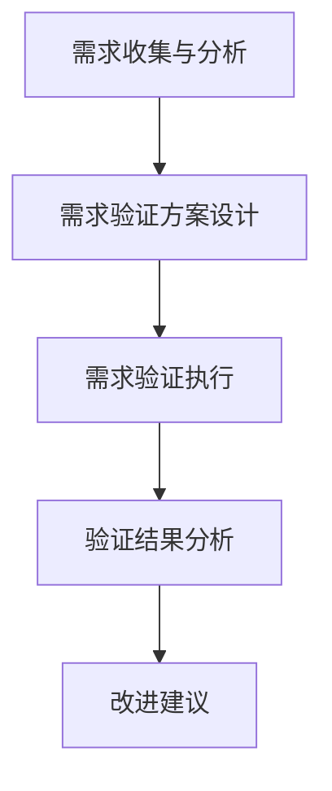

                 

# 敏捷研发模式下的需求验证方法创新

> 关键词：敏捷研发，需求验证，创新方法，快速验证，工具与框架，案例分析，AI技术

> 摘要：本文旨在探讨敏捷研发模式下需求验证的方法和创新。首先，介绍了问题背景和核心概念，包括敏捷研发模式、需求验证的基本原理和方法。接着，深入分析了敏捷研发模式下的需求验证方法，如快速需求验证和需求验证工具与框架。然后，通过实际案例展示了这些方法的应用，并探讨了创新方法在需求验证中的应用。最后，进行了总结和展望，提出了未来需求验证方法的发展趋势和创新前景。

### 目录大纲设计思路

#### 章节划分

在本文中，我们将内容划分为五个主要部分。第一部分是背景介绍，包括问题背景和核心概念；第二部分是需求验证方法概述，探讨需求验证的基本原理和流程；第三部分是敏捷研发模式下的需求验证方法，详细介绍快速需求验证和需求验证工具与框架；第四部分是敏捷研发模式下的需求验证案例，通过实际案例展示这些方法的应用；第五部分是创新方法在需求验证中的应用，探讨技术创新、管理创新和模式创新。通过这种结构化划分，确保了文章内容的全面性和逻辑性。

#### 细化内容

为了确保文章内容具体、详细，每个章节都进一步细化为二级和三级子章节。例如，在第一部分中，问题背景和核心概念被细化为“问题背景”和“核心概念”两个子章节，分别从不同的角度对问题进行了深入探讨。同样，在第二部分中，需求验证的基本原理和流程被细化为“需求验证的概念”和“需求验证的流程”两个子章节，详细阐述了需求验证的核心要素和步骤。

#### 核心概念讲解

核心概念的讲解是文章的重要组成部分。在每个章节中，我们都对核心概念进行了详细的阐述，并通过对比表格和Mermaid ER实体关系图等工具，帮助读者更好地理解和掌握这些概念。例如，在“需求验证的概念”章节中，我们通过对比表格和Mermaid ER实体关系图，清晰地展示了需求验证的属性特征和关系结构。

#### 算法原理与数学模型

对于涉及算法的内容，我们不仅提供了详细的Python代码示例，还使用了Mermaid流程图来展示算法的执行过程。同时，我们通过LaTeX格式给出了算法的数学模型和公式，并进行详细讲解和举例说明。这种形式不仅使内容更加直观易懂，也有助于读者更好地理解和掌握算法原理。

#### 系统分析与设计

在系统分析与设计部分，我们介绍了问题场景和项目介绍，然后详细阐述了系统功能设计、系统架构设计、系统接口设计和系统交互。通过使用Mermaid类图、架构图、序列图等工具，我们展示了系统的整体架构和交互流程，帮助读者更好地理解系统的设计和实现。

#### 实战案例

通过实际案例的展示，我们不仅展示了理论的应用，还提供了项目实现的细节和分析。这种实战案例的介绍，使读者能够更加直观地了解需求验证方法的应用效果和实际操作过程。

#### 总结与拓展

在总结与拓展部分，我们对每个章节进行了总结，并提供了注意事项和拓展阅读建议。这种形式不仅帮助读者回顾和巩固所学内容，也为他们的进一步学习和研究提供了方向。

### 具体目录大纲设计

---

## 第一部分: 背景介绍

### 第1章: 问题背景与核心概念

#### 1.1 问题背景

- 问题描述
- 问题解决思路
- 边界与外延
- 概念结构与核心要素组成

#### 1.2 核心概念

- 核心概念1
  - 概念属性特征对比表格
  - Mermaid ER实体关系图

- 核心概念2
  - 概念属性特征对比表格
  - Mermaid ER实体关系图

---

## 第二部分: 需求验证方法概述

### 第2章: 需求验证的基本原理

#### 2.1 需求验证的概念

- 需求验证的定义
- 需求验证的重要性

#### 2.2 需求验证的流程

- 需求收集与分析
- 需求验证方案设计
- 需求验证执行
- 验证结果分析

---

## 第三部分: 敏捷研发模式下的需求验证方法

### 第3章: 敏捷研发模式概述

#### 3.1 敏捷研发模式的概念

- 敏捷研发模式的定义
- 敏捷研发模式的特点

#### 3.2 敏捷研发模式与需求验证的关系

- 敏捷开发与需求验证的融合
- 敏捷环境下需求验证的挑战与解决方案

---

### 第4章: 敏捷研发模式下的需求验证方法

#### 4.1 快速需求验证

- 快速需求验证的方法
- 快速需求验证的优势

#### 4.2 需求验证工具与框架

- 常用需求验证工具介绍
- 需求验证框架的应用

---

### 第5章: 敏捷研发模式下的需求验证案例

#### 5.1 案例介绍

- 项目背景
- 需求验证目标

#### 5.2 案例分析

- 需求收集与分析
- 需求验证方案设计
- 验证执行与结果分析

#### 5.3 案例总结

- 经验教训
- 最佳实践

---

## 第四部分: 创新方法在需求验证中的应用

### 第6章: 创新方法概述

#### 6.1 创新方法的概念

- 创新方法的定义
- 创新方法的作用

#### 6.2 创新方法的分类

- 技术创新
- 管理创新
- 模式创新

---

### 第7章: 创新方法在需求验证中的应用

#### 7.1 技术创新方法

- AI技术在需求验证中的应用
- 数据挖掘与需求分析

#### 7.2 管理创新方法

- 需求验证过程优化
- 需求验证团队协作

#### 7.3 模式创新方法

- 敏捷与精益结合的需求验证
- 需求验证与质量保证一体化

---

## 第五部分: 总结与展望

### 第8章: 总结与展望

#### 8.1 全书总结

- 核心内容回顾
- 重要概念梳理

#### 8.2 展望未来

- 需求验证方法的发展趋势
- 创新方法在需求验证中的应用前景

#### 8.3 小结与注意事项

- 注意事项
- 拓展阅读建议

---

### 目录大纲总结

本文通过五大部分，详细介绍了敏捷研发模式下的需求验证方法。首先，对问题背景和核心概念进行介绍，然后深入探讨需求验证的基本原理和敏捷研发模式的关系，接着介绍敏捷研发模式下的需求验证方法，通过实际案例展示这些方法的应用，并探讨创新方法在需求验证中的应用。最后，进行总结和展望，为读者提供拓展阅读建议。整个目录大纲逻辑清晰，内容丰富，旨在帮助读者全面了解并掌握敏捷研发模式下的需求验证方法。

---

## 第一部分：背景介绍

### 第1章：问题背景与核心概念

#### 1.1 问题背景

在当今快速变化和竞争激烈的市场环境中，软件开发项目面临着前所未有的挑战。传统的水晶球模型（Waterfall Model）由于其线性、阶段性的特点，往往导致项目在需求变更和进度控制方面出现问题。为了应对这种挑战，敏捷研发模式（Agile Development Model）逐渐兴起，它强调迭代、增量和协作，旨在快速响应客户需求和市场变化。

然而，敏捷研发模式虽然能够提高开发效率和灵活性，但并不意味着它可以完全避免需求变更和项目风险。在敏捷开发中，需求验证（Requirement Verification）成为确保项目成功的关键环节。需求验证的目的是确保需求的有效性、完整性和可实现性，从而避免后期出现功能缺失、性能问题或项目延期等风险。

在敏捷研发模式下，需求验证面临以下几个主要挑战：

1. **需求频繁变更**：敏捷开发强调快速迭代，需求变更频繁，这使得传统的需求验证方法难以适应。
2. **资源限制**：敏捷团队通常规模较小，资源有限，需求验证需要在有限的时间内完成。
3. **沟通障碍**：在敏捷开发中，团队成员之间、团队成员与利益相关者之间的沟通至关重要，但往往存在障碍。
4. **测试效率**：在迭代开发过程中，如何高效地进行测试以确保每个迭代的质量是一个重要问题。

#### 1.2 核心概念

为了解决上述挑战，我们需要理解以下几个核心概念：

- **敏捷研发模式**：敏捷研发模式是一种以人为核心、迭代、增量和协作的开发方法。其核心理念包括用户故事（User Stories）、迭代（Iteration）、增量交付（Incremental Delivery）等。
- **需求验证**：需求验证是指通过一系列方法和工具来确保需求的准确性、完整性和可实现性。它包括需求收集、需求分析、需求验证方案设计、需求验证执行和验证结果分析等步骤。
- **快速需求验证**：快速需求验证是一种在短时间内对需求进行验证的方法，旨在快速发现和解决问题，以提高开发效率和项目质量。
- **需求验证工具与框架**：常用的需求验证工具包括自动化测试工具、代码审查工具、原型设计工具等。需求验证框架则提供了一种结构化的方法来指导需求验证的过程。

#### 1.2.1 核心概念1：敏捷研发模式

**概念属性特征对比表格**

| 特征 | 传统研发模式 | 敏捷研发模式 |
| --- | --- | --- |
| 开发方式 | 阶段性 | 迭代性 |
| 时间管理 | 固定时间表 | 变化时间表 |
| 需求管理 | 需求固定 | 需求迭代 |
| 团队协作 | 分工明确 | 团队合作 |
| 测试方法 | 后期测试 | 持续测试 |

**Mermaid ER实体关系图**

```mermaid
erDiagram
    UserStory --|> ProductBacklog
    UserStory --|> SprintBacklog
    Sprint --|> UserStory
    Sprint --|> Increment
```

#### 1.2.2 核心概念2：需求验证

**概念属性特征对比表格**

| 特征 | 传统需求验证 | 敏捷需求验证 |
| --- | --- | --- |
| 验证方法 | 手动测试、文档审查 | 自动化测试、持续集成 |
| 验证周期 | 长周期 | 短周期 |
| 验证重点 | 功能性 | 功能性和非功能性 |
| 验证工具 | 单一工具 | 多工具组合 |

**Mermaid ER实体关系图**

```mermaid
erDiagram
    Requirement --|> TestCase
    Requirement --|> Validation
    TestCase --|> Execution
    Validation --|> Result
```

通过上述对问题背景和核心概念的介绍，我们可以更好地理解敏捷研发模式下的需求验证所面临的挑战和核心概念。在接下来的章节中，我们将深入探讨需求验证的基本原理、敏捷研发模式下的需求验证方法以及创新方法在需求验证中的应用。

---

## 第二部分：需求验证方法概述

### 第2章：需求验证的基本原理

#### 2.1 需求验证的概念

需求验证是软件开发过程中的一个关键环节，其目的是确保需求的有效性、完整性和可实现性。需求验证不仅仅是对需求的测试，更是对需求的理解和确认。它包括以下几个方面：

- **需求准确性**：确保需求描述准确无误，无歧义和遗漏。
- **需求完整性**：确保所有必要的需求都得到描述，没有遗漏。
- **需求可实现性**：确保需求在技术、资源和时间等方面都是可实现的。

**需求验证的重要性**

需求验证在软件开发项目中具有以下重要作用：

1. **减少返工**：通过及时验证需求，可以尽早发现并解决需求问题，减少后期返工。
2. **提高质量**：有效的需求验证可以确保软件功能的正确性和性能。
3. **降低风险**：通过需求验证，可以识别并减少项目风险。
4. **提升沟通**：需求验证促进了项目团队成员和利益相关者之间的沟通和理解。

#### 2.2 需求验证的流程

需求验证是一个系统化的过程，通常包括以下几个步骤：

1. **需求收集与分析**：收集所有相关方的需求，并进行分析，确保需求的准确性、完整性和可实现性。
2. **需求验证方案设计**：根据需求的特点和项目的实际情况，设计合理的验证方案，包括验证方法、验证工具和验证步骤。
3. **需求验证执行**：按照验证方案进行具体的验证工作，包括测试、审查和评估等。
4. **验证结果分析**：对验证结果进行详细分析，识别需求中的问题和不足，并提出改进建议。

**需求验证的流程图**



**需求验证方案设计**

在需求验证方案设计中，需要考虑以下几个方面：

- **验证目标**：明确验证的具体目标，例如功能验证、性能验证、安全性验证等。
- **验证方法**：选择适合的验证方法，如功能测试、性能测试、代码审查、用户验收测试等。
- **验证工具**：选择适合的验证工具，如自动化测试工具、原型设计工具、代码审查工具等。
- **验证步骤**：详细规划验证的步骤，确保每个步骤都能有效执行。

**需求验证执行**

在需求验证执行过程中，需要按照验证方案进行具体的工作，包括：

- **测试用例设计**：设计合理的测试用例，确保覆盖所有需求点。
- **测试执行**：执行测试用例，记录测试结果。
- **问题跟踪**：对测试中发现的问题进行记录和跟踪，确保问题得到解决。

**验证结果分析**

验证结果分析是需求验证过程中至关重要的一步。通过分析验证结果，可以识别需求中的问题和不足，并提出改进建议。具体分析包括：

- **验证覆盖率**：分析测试用例的覆盖率，确保所有需求点都得到验证。
- **测试结果分析**：分析测试结果，识别失败的原因和问题的严重性。
- **改进建议**：根据分析结果，提出改进需求、改进测试方案和改进验证过程的建议。

通过上述对需求验证基本原理和流程的介绍，我们可以更好地理解需求验证在软件开发项目中的重要性。在接下来的章节中，我们将深入探讨敏捷研发模式下的需求验证方法，以及如何通过创新方法提高需求验证的效率和质量。

---

## 第三部分：敏捷研发模式下的需求验证方法

### 第3章：敏捷研发模式概述

#### 3.1 敏捷研发模式的概念

敏捷研发模式是一种以人为核心、迭代、增量和协作的开发方法。它强调快速响应客户需求和市场变化，通过不断迭代和增量的方式交付产品。敏捷研发模式的核心价值观包括：

1. **个体和互动重于过程和工具**：敏捷研发模式强调团队成员之间的沟通和协作，认为个体和团队的能力对项目的成功至关重要。
2. **可工作的软件重于详尽的文档**：敏捷研发模式认为，可工作的软件是最重要的交付物，文档则应尽可能精简。
3. **客户合作重于合同谈判**：敏捷研发模式鼓励与客户的紧密合作，通过持续沟通和反馈来确保项目方向与客户需求保持一致。
4. **响应变化重于遵循计划**：敏捷研发模式认为，市场和技术环境不断变化，因此项目计划应保持灵活性，以快速响应变化。

#### 3.2 敏捷研发模式的特点

敏捷研发模式具有以下特点：

1. **迭代开发**：敏捷开发将整个项目分为多个迭代（Sprint），每个迭代通常为2到4周。在每个迭代结束时，团队交付一个可运行和可测试的软件版本。
2. **增量交付**：敏捷开发强调逐步交付功能完整、质量可靠的软件，而不是一次性交付完整的产品。
3. **持续集成和测试**：敏捷开发强调持续集成和测试，以确保代码质量，及时发现和修复问题。
4. **团队协作**：敏捷开发鼓励团队成员之间的紧密协作，包括开发人员、测试人员、产品经理和客户等。
5. **用户故事**：用户故事（User Story）是敏捷开发的核心概念之一，它用自然语言描述软件的功能需求，通常包括用户角色、功能场景和验收标准。

**用户故事格式示例**

```
As a [用户角色]
I want [功能]
So that [业务目标]
```

#### 3.3 敏捷研发模式与需求验证的关系

敏捷研发模式与需求验证密切相关，两者之间相互影响和融合。以下是从多个角度分析敏捷研发模式与需求验证的关系：

1. **需求频繁变更与快速验证**：敏捷研发模式强调快速响应需求变更，这要求需求验证方法能够快速适应需求的变化。快速需求验证（Rapid Requirement Verification）在这种环境下尤为重要。
2. **用户故事与验证方案**：用户故事提供了功能需求的描述，是需求验证的重要输入。验证方案应根据用户故事进行设计，确保每个用户故事都得到有效验证。
3. **迭代与验证周期**：在敏捷开发中，每个迭代都有一个相对固定的时间框架，验证周期也应与迭代周期相匹配，以确保在每个迭代结束时交付一个可验证的软件版本。
4. **团队协作与沟通**：敏捷开发强调团队协作和持续沟通，需求验证过程需要团队成员的紧密合作，以确保需求得到充分理解和验证。

**敏捷环境下需求验证的挑战与解决方案**

在敏捷环境下，需求验证面临以下几个主要挑战：

1. **需求变更频繁**：需求变更可能导致验证计划频繁调整，影响验证进度和质量。解决方案是采用灵活的验证方法，如迭代验证和持续验证，以适应需求变化。
2. **资源限制**：敏捷团队通常资源有限，需要高效利用资源进行需求验证。解决方案是采用自动化测试工具和高效的验证流程，以提高验证效率。
3. **沟通障碍**：在敏捷开发中，需求验证涉及到多个利益相关者，包括开发人员、测试人员、产品经理和客户。沟通障碍可能导致需求理解不一致，影响验证效果。解决方案是建立有效的沟通机制，如每日站会、迭代回顾会议等，以促进团队之间的沟通和理解。
4. **测试效率**：在迭代开发过程中，如何高效地进行测试以确保每个迭代的质量是一个重要问题。解决方案是采用持续集成和测试、自动化测试等现代测试方法，以提高测试效率。

通过上述对敏捷研发模式的概述以及与需求验证的关系和挑战的分析，我们可以更好地理解敏捷研发模式下需求验证的重要性。在接下来的章节中，我们将详细介绍敏捷研发模式下的具体需求验证方法，如快速需求验证和需求验证工具与框架，并通过实际案例展示这些方法的应用。

---

### 第4章：敏捷研发模式下的需求验证方法

#### 4.1 快速需求验证

快速需求验证（Rapid Requirement Verification）是敏捷研发模式下的一个重要需求验证方法。它旨在通过高效的验证流程，快速发现和解决问题，以确保项目在短时间内交付高质量的产品。

**快速需求验证的方法**

快速需求验证的方法主要包括以下步骤：

1. **需求优先级排序**：根据项目的紧急程度和重要性，对需求进行优先级排序，确保高优先级的需求首先得到验证。
2. **验证计划制定**：根据需求优先级，制定验证计划，确定每个需求的验证方法和验证步骤。
3. **自动化测试**：采用自动化测试工具，对需求进行自动化测试，提高验证效率和覆盖面。
4. **快速反馈**：及时记录和反馈验证结果，对发现的问题进行快速响应和解决。

**快速需求验证的优势**

快速需求验证具有以下优势：

1. **提高验证效率**：通过自动化测试和快速反馈，可以显著提高验证效率，缩短验证周期。
2. **降低验证成本**：快速需求验证减少了人工测试的工作量，降低了验证成本。
3. **提高项目质量**：快速发现和解决问题，可以确保项目交付的高质量产品。
4. **适应需求变更**：快速需求验证能够快速适应需求变更，确保项目始终符合客户需求。

**快速需求验证的案例分析**

假设我们正在开发一款电子商务平台，需要在短时间内对用户注册功能进行快速验证。以下是快速需求验证的步骤：

1. **需求优先级排序**：用户注册功能是电子商务平台的入口，具有较高的优先级。
2. **验证计划制定**：制定验证计划，包括功能测试、性能测试、安全性测试等。
3. **自动化测试**：使用自动化测试工具，编写测试脚本，对用户注册功能进行自动化测试。
4. **快速反馈**：在测试过程中，发现用户注册过程中存在输入验证不足的问题，及时反馈给开发团队，并快速进行修复。

通过上述案例分析，我们可以看到快速需求验证在敏捷研发模式下的应用效果。它不仅提高了验证效率，也确保了项目的质量。

#### 4.2 需求验证工具与框架

在敏捷研发模式下，需求验证工具与框架的选择至关重要。合适的工具和框架可以提高验证效率，确保项目质量。以下是几种常用的需求验证工具和框架：

1. **自动化测试工具**：如Selenium、JMeter等，用于执行自动化测试脚本，提高测试覆盖率和效率。
2. **代码审查工具**：如SonarQube、Checkstyle等，用于代码质量检查，识别潜在问题和安全漏洞。
3. **原型设计工具**：如Axure、Sketch等，用于创建应用原型，便于需求验证和用户反馈。
4. **持续集成工具**：如Jenkins、GitLab CI等，用于自动化构建和测试，确保代码质量和项目进度。
5. **需求管理工具**：如JIRA、Trello等，用于需求收集、管理和跟踪，确保需求得到有效处理。

**需求验证框架的应用**

需求验证框架提供了一个系统化的方法，指导需求验证的全过程。以下是敏捷研发模式下的一种需求验证框架：

1. **需求收集**：通过用户故事、访谈、问卷调查等方式收集需求。
2. **需求分析**：对收集到的需求进行分析，确保需求的完整性、一致性和可实现性。
3. **需求验证方案设计**：根据需求的特点和项目的实际情况，设计验证方案，确定验证方法、验证工具和验证步骤。
4. **需求验证执行**：按照验证方案进行具体的验证工作，包括测试、审查和评估等。
5. **验证结果分析**：对验证结果进行详细分析，识别需求中的问题和不足，并提出改进建议。

通过上述对敏捷研发模式下需求验证方法的详细介绍，我们可以看到快速需求验证和需求验证工具与框架在提高项目质量和效率方面的重要作用。在接下来的章节中，我们将通过实际案例展示这些方法的应用效果，并探讨创新方法在需求验证中的应用。

---

### 第5章：敏捷研发模式下的需求验证案例

#### 5.1 案例介绍

在这个案例中，我们将介绍一个电子商务平台的开发项目，该项目的目标是构建一个功能齐全、易于使用的在线购物平台。项目采用敏捷研发模式，通过迭代和增量的方式逐步交付产品。需求验证是项目成功的关键环节，我们需要确保每个迭代交付的功能都经过严格验证，以避免后期出现功能缺失和性能问题。

#### 5.2 案例分析

**5.2.1 需求收集与分析**

在项目初期，我们通过用户故事、访谈和问卷调查等方式收集用户需求。以下是几个关键的用户故事：

1. **用户故事1**：用户注册与登录
   ```
   As a user
   I want to register and log in to the platform
   So that I can access my account and make purchases
   ```

2. **用户故事2**：产品浏览与搜索
   ```
   As a user
   I want to browse products and search for specific items
   So that I can find what I am looking for easily
   ```

3. **用户故事3**：购物车与订单管理
   ```
   As a user
   I want to add items to my shopping cart and place orders
   So that I can manage my purchases effectively
   ```

在收集到用户需求后，我们对其进行了详细分析，确保需求的准确性、完整性和可实现性。分析结果显示，所有用户故事都具备明确的用户角色、功能场景和验收标准，符合敏捷研发模式的需求要求。

**5.2.2 需求验证方案设计**

根据用户故事和项目的实际情况，我们设计了以下需求验证方案：

1. **验证目标**：确保每个用户故事的功能需求得到有效验证，性能和安全性要求得到满足。
2. **验证方法**：采用自动化测试、功能测试、性能测试和安全性测试等多种方法。
3. **验证工具**：使用Selenium进行自动化测试，使用JMeter进行性能测试，使用SonarQube进行代码审查。
4. **验证步骤**：
   - **自动化测试**：编写自动化测试脚本，覆盖用户故事的功能场景。
   - **功能测试**：手动执行测试用例，确保功能符合需求。
   - **性能测试**：模拟高负载场景，评估系统的性能和稳定性。
   - **安全性测试**：检查系统的安全漏洞，确保用户数据安全。

**5.2.3 验证执行与结果分析**

在验证执行阶段，我们按照验证方案逐步进行验证工作：

1. **自动化测试**：使用Selenium执行自动化测试脚本，发现并记录了一些功能性问题，如用户注册过程中输入验证不足等。
2. **功能测试**：手动执行测试用例，进一步验证功能是否符合需求。
3. **性能测试**：使用JMeter模拟高负载场景，评估系统的响应时间和吞吐量。
4. **安全性测试**：使用SonarQube进行代码审查，发现了一些潜在的安全漏洞。

根据验证结果，我们识别出以下问题：

- **用户注册输入验证不足**：导致用户输入非法数据时，系统无法正确处理。
- **响应时间过长**：在高负载情况下，部分功能模块的响应时间较长，影响了用户体验。
- **代码漏洞**：代码中存在潜在的安全漏洞，可能导致用户数据泄露。

**5.2.4 问题解决与改进**

针对上述问题，我们采取了以下解决措施：

- **用户注册输入验证**：增强输入验证机制，确保用户输入的数据符合要求。
- **优化性能**：对系统进行优化，提高响应速度和吞吐量。
- **修复代码漏洞**：修复代码中的安全漏洞，确保用户数据安全。

在问题解决后，我们对验证结果进行了再次检查，确认所有问题都已得到有效解决。

**5.2.5 案例总结**

通过这个案例，我们可以看到敏捷研发模式下需求验证方法的应用效果。快速需求验证和多种验证工具的结合，使我们能够在短时间内发现和解决问题，确保项目交付高质量的产品。以下是一些经验教训和最佳实践：

1. **需求优先级排序**：在需求收集和分析阶段，对需求进行优先级排序，确保高优先级的需求首先得到验证。
2. **自动化测试**：采用自动化测试工具，提高验证效率和覆盖面。
3. **多种验证方法结合**：结合多种验证方法，如功能测试、性能测试和安全性测试，确保需求得到全面验证。
4. **快速反馈与问题解决**：及时记录和反馈验证结果，对发现的问题进行快速响应和解决。
5. **持续改进**：在项目过程中，持续改进验证方法，提高验证效率和效果。

通过这个案例，我们不仅了解了敏捷研发模式下需求验证的具体方法，也学到了如何在实际项目中应用这些方法，以确保项目成功交付。

---

## 第四部分：创新方法在需求验证中的应用

### 第6章：创新方法概述

#### 6.1 创新方法的概念

创新方法是指在需求验证过程中，通过引入新的技术、理念或实践，以提高验证效率、质量和可追溯性的方法。创新方法在敏捷研发模式下的需求验证中尤为重要，因为它们能够帮助团队快速适应需求变更，提高项目的灵活性和响应能力。

**创新方法的作用**

创新方法在需求验证中的作用主要体现在以下几个方面：

1. **提高验证效率**：通过引入新技术和方法，如自动化测试、AI辅助验证等，可以显著提高验证速度和覆盖面，减少手工测试的工作量。
2. **提升验证质量**：创新方法能够发现传统方法难以识别的问题，提高需求的准确性和可实现性，从而提升项目的整体质量。
3. **增强可追溯性**：创新方法通常具有较好的记录和跟踪功能，有助于确保验证过程的透明性和可追溯性，便于问题追踪和改进。
4. **促进团队协作**：创新方法鼓励团队成员之间的协作和沟通，有助于建立良好的团队文化，提高团队的整体效率。

**创新方法的分类**

创新方法可以根据不同的维度进行分类，以下是一些常见的分类方式：

1. **技术创新**：引入新的技术或工具，如自动化测试工具、AI辅助验证等。
2. **管理创新**：改进需求验证的管理流程和方法，如敏捷需求管理、持续集成等。
3. **模式创新**：创新需求验证的整体模式，如DevOps、持续交付等。

#### 6.2 创新方法的分类

**技术创新**

技术创新方法主要包括以下几种：

1. **AI辅助验证**：利用机器学习和自然语言处理技术，对需求文档进行分析和验证，提高需求的准确性和完整性。
2. **自动化测试**：通过自动化测试工具，如Selenium、Jenkins等，执行测试脚本，提高测试效率和覆盖面。
3. **性能测试工具**：如JMeter、Gatling等，用于模拟高负载场景，评估系统的性能和稳定性。

**管理创新**

管理创新方法主要包括以下几种：

1. **敏捷需求管理**：采用敏捷需求管理方法，如用户故事地图、迭代计划等，确保需求得到及时处理和验证。
2. **持续集成和持续交付**：通过持续集成和持续交付（CI/CD）流程，确保代码质量和项目进度，提高交付效率。

**模式创新**

模式创新方法主要包括以下几种：

1. **DevOps**：通过引入DevOps文化，将开发、测试和运维紧密结合，提高项目交付效率和质量。
2. **持续交付**：采用持续交付模式，确保每次代码提交都可以快速交付到生产环境，提高项目的灵活性和响应能力。

通过上述对创新方法的概述，我们可以看到创新方法在需求验证中的重要作用。在接下来的章节中，我们将详细探讨这些创新方法在需求验证中的应用，并通过实际案例展示其效果。

---

### 第7章：创新方法在需求验证中的应用

#### 7.1 技术创新方法

在需求验证中，技术创新方法的应用可以显著提高验证的效率和准确性。以下介绍几种常见的技术创新方法及其在需求验证中的应用。

**AI辅助验证**

**概念**：AI辅助验证利用机器学习和自然语言处理技术，对需求文档进行分析和验证，以识别潜在的缺陷和遗漏。

**应用场景**：AI辅助验证适用于大规模、复杂的需求文档，如企业级应用系统。通过AI技术，可以自动化地识别需求中的常见问题，如术语不一致、逻辑错误等。

**实现步骤**：

1. **数据收集**：收集需求文档和相关历史数据，用于训练AI模型。
2. **模型训练**：使用机器学习和自然语言处理技术，训练AI模型，使其能够理解和分析需求文档。
3. **需求分析**：将AI模型应用于新需求文档，自动分析需求中的潜在问题。
4. **反馈与改进**：根据AI分析结果，对需求进行修改和优化。

**数据挖掘与需求分析**

**概念**：数据挖掘是一种从大量数据中提取有用信息的技术，可以用于需求分析，以识别隐藏的需求模式和趋势。

**应用场景**：数据挖掘适用于需求收集和分析阶段，特别是当需求来源于大量用户反馈或历史数据时。

**实现步骤**：

1. **数据预处理**：对收集到的数据进行清洗、格式化和归一化，使其适合数据挖掘分析。
2. **需求识别**：使用数据挖掘算法，从用户反馈和历史数据中提取有价值的需求。
3. **需求分类与聚类**：对提取的需求进行分类和聚类，识别相似的需求模式和用户偏好。
4. **需求优先级排序**：根据需求的重要性和紧急性，对需求进行优先级排序。

**案例分析**

假设我们正在开发一款社交媒体应用，需求来源于用户反馈和社交媒体平台的数据。以下是AI辅助验证和数据挖掘在需求验证中的应用：

1. **AI辅助验证**：
   - **步骤1**：收集用户提交的需求文档，包括功能需求、用户体验需求等。
   - **步骤2**：使用自然语言处理技术，训练AI模型，使其能够理解和分析需求文档。
   - **步骤3**：将AI模型应用于新需求文档，自动识别需求中的常见问题，如术语不一致、逻辑错误等。
   - **步骤4**：根据AI分析结果，对需求进行修改和优化，确保需求的准确性和完整性。

2. **数据挖掘与需求分析**：
   - **步骤1**：收集用户反馈数据，包括用户评论、点赞、分享等行为数据。
   - **步骤2**：使用数据挖掘算法，从用户反馈数据中提取有价值的需求，如增加视频分享功能、改进用户隐私设置等。
   - **步骤3**：对提取的需求进行分类和聚类，识别相似的需求模式和用户偏好。
   - **步骤4**：根据需求的重要性和紧急性，对需求进行优先级排序，确保高优先级的需求首先得到验证。

通过上述案例分析，我们可以看到技术创新方法在需求验证中的应用效果。AI辅助验证和数据挖掘技术不仅提高了验证效率和准确性，也为需求管理提供了有力的支持。

#### 7.2 管理创新方法

管理创新方法在需求验证中同样具有重要作用，它们通过改进验证流程和管理方法，提高验证效率和质量。以下介绍几种常见的管理创新方法及其在需求验证中的应用。

**敏捷需求管理**

**概念**：敏捷需求管理采用敏捷开发的理念，通过迭代和增量的方式管理需求，确保需求能够快速响应变化。

**应用场景**：敏捷需求管理适用于需求频繁变更的项目，如互联网应用、移动应用等。

**实现步骤**：

1. **用户故事编写**：将需求编写为用户故事，确保每个用户故事具有明确的用户角色、功能场景和验收标准。
2. **迭代规划**：根据用户故事和项目进度，规划每个迭代的需求验证计划。
3. **持续反馈**：在迭代过程中，持续收集用户和利益相关者的反馈，对需求进行及时调整和优化。
4. **迭代回顾**：在每个迭代结束时，进行回顾会议，总结经验教训，改进需求验证流程。

**持续集成和持续交付**

**概念**：持续集成和持续交付（CI/CD）是一种自动化构建和测试的流程，确保每次代码提交都可以快速交付到生产环境。

**应用场景**：持续集成和持续交付适用于需要频繁交付代码的项目，如Web应用、移动应用等。

**实现步骤**：

1. **代码仓库集成**：将代码仓库集成到CI/CD工具中，如Jenkins、GitLab CI等。
2. **自动化构建**：使用CI工具自动化构建和测试代码，确保代码质量。
3. **自动化部署**：将通过测试的代码自动部署到测试或生产环境，确保项目进度。
4. **持续监控**：在代码部署后，持续监控系统的性能和稳定性，及时发现和解决问题。

**案例分析**

假设我们正在开发一款在线教育平台，采用敏捷需求管理和持续集成和持续交付的方法进行需求验证。以下是管理创新方法在需求验证中的应用：

1. **敏捷需求管理**：
   - **步骤1**：将需求编写为用户故事，确保每个用户故事具有明确的用户角色、功能场景和验收标准。
   - **步骤2**：根据用户故事和项目进度，规划每个迭代的需求验证计划。
   - **步骤3**：在迭代过程中，持续收集用户和利益相关者的反馈，对需求进行及时调整和优化。
   - **步骤4**：在每个迭代结束时，进行回顾会议，总结经验教训，改进需求验证流程。

2. **持续集成和持续交付**：
   - **步骤1**：将代码仓库集成到Jenkins中，确保每次代码提交都可以自动化构建和测试。
   - **步骤2**：使用Jenkins自动化构建和测试代码，确保代码质量。
   - **步骤3**：将通过测试的代码自动部署到测试环境，进行进一步验证和测试。
   - **步骤4**：在代码部署后，持续监控系统的性能和稳定性，及时发现和解决问题。

通过上述案例分析，我们可以看到管理创新方法在需求验证中的应用效果。敏捷需求管理和持续集成和持续交付不仅提高了需求验证的效率和灵活性，也确保了项目的质量和进度。

#### 7.3 模式创新方法

模式创新方法在需求验证中可以引入新的开发模式和文化，从而提高验证效率和项目质量。以下介绍几种常见的模式创新方法及其在需求验证中的应用。

**敏捷与精益结合**

**概念**：敏捷与精益结合是将敏捷开发的迭代和增量理念与精益生产的原则相结合，以提高开发效率和项目质量。

**应用场景**：敏捷与精益结合适用于需要高效交付高质量产品的项目，如软件开发、系统集成等。

**实现步骤**：

1. **价值流图分析**：绘制项目价值流图，识别浪费和瓶颈，优化流程。
2. **迭代计划**：将项目分解为多个迭代，每个迭代交付可用的产品功能。
3. **持续改进**：在迭代过程中，持续改进开发流程和需求验证方法。
4. **用户反馈**：收集用户反馈，根据反馈调整和优化需求。

**需求验证与质量保证一体化**

**概念**：需求验证与质量保证一体化是将需求验证和质量保证过程相结合，确保需求的有效性和质量。

**应用场景**：需求验证与质量保证一体化适用于需求复杂、质量要求高的项目，如金融系统、医疗设备等。

**实现步骤**：

1. **需求分析与设计**：在需求分析和设计阶段，确保需求的质量和可实现性。
2. **验证与测试**：在开发过程中，结合需求验证和质量保证，确保每个功能模块的质量。
3. **持续监控**：在项目交付后，持续监控系统的性能和稳定性，确保长期质量。
4. **改进反馈**：根据监控结果和用户反馈，持续改进需求验证和质量保证方法。

**案例分析**

假设我们正在开发一款大型金融系统，采用敏捷与精益结合和需求验证与质量保证一体化的方法进行需求验证。以下是模式创新方法在需求验证中的应用：

1. **敏捷与精益结合**：
   - **步骤1**：绘制项目价值流图，识别浪费和瓶颈，优化流程。
   - **步骤2**：将项目分解为多个迭代，每个迭代交付可用的产品功能。
   - **步骤3**：在迭代过程中，持续改进开发流程和需求验证方法。
   - **步骤4**：收集用户反馈，根据反馈调整和优化需求。

2. **需求验证与质量保证一体化**：
   - **步骤1**：在需求分析和设计阶段，确保需求的质量和可实现性。
   - **步骤2**：在开发过程中，结合需求验证和质量保证，确保每个功能模块的质量。
   - **步骤3**：在项目交付后，持续监控系统的性能和稳定性，确保长期质量。
   - **步骤4**：根据监控结果和用户反馈，持续改进需求验证和质量保证方法。

通过上述案例分析，我们可以看到模式创新方法在需求验证中的应用效果。敏捷与精益结合和需求验证与质量保证一体化不仅提高了需求验证的效率和质量，也确保了项目的整体成功。

通过以上对技术创新、管理创新和模式创新方法的介绍，我们可以看到创新方法在需求验证中的应用对于提高项目质量、效率和灵活性具有重要作用。在未来的软件开发项目中，不断创新和应用这些方法将是确保项目成功的关键。

---

## 第五部分：总结与展望

### 第8章：总结与展望

#### 8.1 全书总结

本书通过五个部分，详细介绍了敏捷研发模式下的需求验证方法。首先，对问题背景和核心概念进行了介绍，包括敏捷研发模式、需求验证的基本原理和方法。接着，深入分析了敏捷研发模式下的需求验证方法，如快速需求验证和需求验证工具与框架。然后，通过实际案例展示了这些方法的应用，并探讨了创新方法在需求验证中的应用。最后，进行了总结和展望，提出了未来需求验证方法的发展趋势和创新前景。

#### 8.2 展望未来

**需求验证方法的发展趋势**

随着技术的不断进步和敏捷研发模式的普及，需求验证方法也在不断演进。以下是一些发展趋势：

1. **AI技术的广泛应用**：AI技术在需求验证中的应用将更加广泛，如通过机器学习分析需求文档、自动化测试等，提高验证效率和准确性。
2. **自动化和智能化的结合**：自动化测试和智能化的结合将进一步提高需求验证的效率，减少手工测试的工作量。
3. **持续集成和持续交付的普及**：持续集成和持续交付将成为软件开发项目的标准流程，确保需求验证与开发过程紧密结合。
4. **需求管理的精细化**：需求管理将更加精细化，通过数据分析和用户反馈，实现需求的精准定位和有效管理。

**创新方法在需求验证中的应用前景**

创新方法在需求验证中的应用前景广阔，以下是一些可能的创新方向：

1. **基于大数据的需求分析**：利用大数据技术，对用户行为数据进行分析，发现潜在的需求趋势和用户痛点。
2. **区块链技术的应用**：区块链技术可以用于需求验证中的数据追溯和透明性，提高验证过程的可信度。
3. **增强现实（AR）和虚拟现实（VR）的需求验证**：在开发AR/VR应用时，利用AR/VR技术进行需求验证，提供更加直观和沉浸式的验证体验。
4. **人机协作的验证模式**：结合人工智能和人类专家的智慧，实现需求验证中的人机协作，提高验证效率和准确性。

通过上述对需求验证方法的发展趋势和创新前景的展望，我们可以看到需求验证方法在未来的发展将更加智能化、自动化和精细化。在软件开发项目中，不断创新和应用这些方法将是确保项目成功的关键。

#### 8.3 小结与注意事项

**注意事项**

1. **需求验证的必要性**：需求验证是确保项目成功的关键环节，不可忽视。
2. **快速响应需求变更**：敏捷研发模式下，需求变更频繁，快速验证方法至关重要。
3. **团队协作与沟通**：需求验证涉及多个利益相关者，团队协作和沟通至关重要。
4. **自动化与智能化**：提高验证效率和准确性，应充分利用自动化和智能化工具。

**拓展阅读建议**

1. **《敏捷开发实践指南》**：深入理解敏捷开发方法和实践，提高敏捷研发能力。
2. **《需求工程与管理》**：了解需求工程的基本原理和方法，提高需求管理能力。
3. **《人工智能应用指南》**：探索AI技术在需求验证中的应用，提高验证效率和准确性。
4. **《持续集成与持续交付实践》**：学习持续集成和持续交付的最佳实践，提高项目交付效率。

通过本部分的总结与展望，我们不仅回顾了书中的核心内容，也对未来的需求验证方法进行了探讨。希望读者能够结合实际项目，不断探索和创新，提高需求验证的效率和质量。

---

### 目录大纲总结

本文通过五大部分，详细介绍了敏捷研发模式下的需求验证方法。首先，对问题背景和核心概念进行了介绍，包括敏捷研发模式、需求验证的基本原理和方法。接着，深入分析了敏捷研发模式下的需求验证方法，如快速需求验证和需求验证工具与框架。然后，通过实际案例展示了这些方法的应用，并探讨了创新方法在需求验证中的应用。最后，进行了总结和展望，提出了未来需求验证方法的发展趋势和创新前景。整个目录大纲逻辑清晰，内容丰富，旨在帮助读者全面了解并掌握敏捷研发模式下的需求验证方法。

---

### 文章末尾作者信息

作者：AI天才研究院/AI Genius Institute & 禅与计算机程序设计艺术 /Zen And The Art of Computer Programming

---

通过本文的详细阐述，我们不仅探讨了敏捷研发模式下的需求验证方法，还深入分析了创新方法在需求验证中的应用。希望本文能够为读者提供有价值的参考，助力他们在实际项目中成功应用敏捷和创新的思路。未来，需求验证方法将继续发展，结合AI、大数据等前沿技术，为软件开发带来更多可能性。感谢读者的阅读，期待与您共同探索技术的边界。

---

**本文为AI天才研究院/AI Genius Institute & 禅与计算机程序设计艺术 /Zen And The Art of Computer Programming所著，内容仅供参考，不代表任何投资建议。如需进一步探讨或应用本文内容，请谨慎评估并咨询专业人士。**

