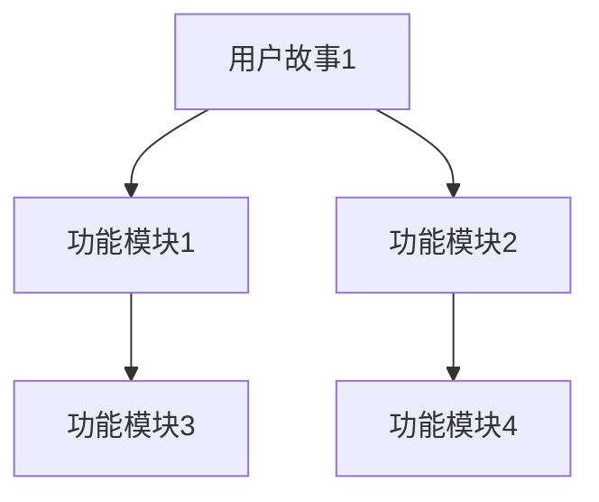

                 

### 引言

在现代软件工程领域，敏捷开发已成为一种主流的开发方法，特别是在需求管理方面展现出了其独特的优势。然而，随着项目的规模不断扩大，传统的敏捷方法往往难以应对规模化需求管理的复杂性。为了解决这个问题，敏捷规模化框架（Agile Scaling Framework）应运而生。本文将深入探讨敏捷规模化框架在需求管理中的应用，旨在为开发者和管理者提供一种系统化和高效的需求管理策略。

本文将分为七个部分展开讨论：

1. **问题背景与核心概念**：介绍敏捷开发在需求管理中面临的挑战，以及规模化需求管理的必要性。
2. **敏捷规模化框架的基本原理**：详细解释敏捷规模化框架的概念、目标和核心要素。
3. **敏捷规模化框架在需求管理中的应用**：探讨敏捷规模化框架在需求收集、评审、迭代规划和跟踪监控等方面的具体应用。
4. **敏捷规模化框架在不同规模项目中的应用案例**：通过小型、中型和大型项目的实例，分析敏捷规模化框架的实际应用效果。
5. **敏捷规模化框架的优化与改进**：讨论如何评估、优化和改进敏捷规模化框架。
6. **敏捷规模化框架在需求管理中的最佳实践**：总结一系列高效的需求管理最佳实践。
7. **敏捷规模化框架在需求管理中的未来展望**：展望敏捷规模化框架的发展趋势和潜在挑战。

通过本文的逐步分析，读者将能够理解敏捷规模化框架在需求管理中的重要性，并掌握如何在实际项目中有效应用这一框架。让我们一起深入探讨这一主题，以便在敏捷开发的道路上走得更远。

### 关键词

- 敏捷开发
- 规模化框架
- 需求管理
- 持续集成
- 持续部署
- 用户故事地图
- 需求优先级排序
- 需求变更管理
- 持续跟踪与监控
- 敏捷故事点估算
- 迭代计划
- 任务分配

### 摘要

本文探讨了敏捷规模化框架在需求管理中的应用。首先，我们介绍了敏捷开发在需求管理中面临的挑战，并引出了规模化需求管理的必要性。接着，详细解释了敏捷规模化框架的概念、目标和核心要素。通过分析敏捷规模化框架在需求收集、评审、迭代规划和跟踪监控等方面的应用，我们展示了其在不同规模项目中的实际效果。此外，我们还讨论了如何评估、优化和改进敏捷规模化框架。最后，总结了敏捷规模化框架在需求管理中的最佳实践，并对其未来发展进行了展望。本文旨在为开发者和管理者提供一种高效的需求管理策略。

### 第1章: 问题背景介绍

在软件工程领域，敏捷开发已成为一种主流的开发方法，它强调快速响应变化、迭代交付和持续改进。敏捷开发方法最初由软件开发团队为了更好地应对项目复杂性和不确定性而提出。随着时间的推移，敏捷开发逐渐扩展到需求管理领域，成为现代软件开发中不可或缺的一部分。

#### 1.1.1 敏捷开发在需求管理中的挑战

敏捷开发在需求管理中面临着以下几个挑战：

1. **需求变更频繁**：敏捷开发强调快速交付和迭代，这意味着需求可能会在短时间内频繁变化。这给需求管理带来了巨大的挑战，如何高效地应对需求变更，确保项目进展不受影响，成为需求管理的核心问题。
2. **需求优先级管理**：在敏捷开发过程中，需求管理需要不断地进行优先级排序。然而，在大型项目中，如何合理地分配资源，确保高优先级需求得到及时满足，是一项复杂的工作。
3. **需求沟通不畅**：敏捷开发强调团队成员之间的沟通和协作，但在实际操作中，需求沟通不畅仍然是一个普遍问题。团队成员可能对需求的理解存在差异，导致开发过程中出现偏差。
4. **需求变更控制**：敏捷开发中需求变更频繁，如何有效地控制需求变更，避免不必要的变更影响项目进度和质量，是一个需要解决的问题。

#### 1.1.2 规模化需求管理的需求

随着项目规模的不断扩大，传统的敏捷方法在需求管理方面逐渐暴露出其局限性。为了应对规模化需求管理的需求，敏捷规模化框架应运而生。规模化需求管理的需求主要包括：

1. **集成与协作**：在大型项目中，需求管理涉及多个团队和多个项目，如何实现跨团队的集成与协作，成为规模化需求管理的核心问题。
2. **持续交付**：规模化需求管理要求项目能够在短时间内快速交付，实现持续交付成为关键目标。
3. **需求优先级排序**：在大型项目中，如何合理地分配资源，确保高优先级需求得到及时满足，需要一套科学的需求优先级排序方法。
4. **需求变更控制**：在规模化需求管理中，如何有效地控制需求变更，确保项目进度和质量不受影响，是关键挑战。

### 核心概念与联系

在本章节中，我们将进一步探讨敏捷开发、规模化框架和需求管理的核心概念及其相互关系。

#### 1.2.1 敏捷开发

敏捷开发是一种以人为核心、迭代、增量和协作的开发方法。它强调快速响应变化、持续交付和持续改进。敏捷开发的核心原则包括：

1. **个体和互动重于过程和工具**：敏捷开发注重团队成员之间的沟通和协作，强调人的作用。
2. **可工作的软件重于详尽的文档**：敏捷开发强调实际交付可工作的软件，而不仅仅是详尽的文档。
3. **客户合作重于合同谈判**：敏捷开发强调与客户的紧密合作，及时了解客户需求，确保项目的成功。
4. **响应变化重于遵循计划**：敏捷开发强调快速适应变化，确保项目能够满足不断变化的需求。

#### 1.2.2 规模化框架

规模化框架是一种用于管理大规模敏捷开发的方法。它提供了一套系统化的方法，帮助团队在大型项目中实现敏捷开发。规模化框架的核心目标是：

1. **集成与协作**：规模化框架通过跨团队的集成和协作，实现资源的最优配置和效率的最大化。
2. **持续交付**：规模化框架通过持续交付机制，确保项目能够在短时间内快速交付，满足客户需求。
3. **需求优先级排序**：规模化框架提供了一套科学的需求优先级排序方法，帮助团队合理地分配资源，确保高优先级需求得到及时满足。
4. **需求变更控制**：规模化框架通过需求变更控制机制，确保项目进度和质量不受影响。

#### 1.2.3 需求管理

需求管理是一种系统化方法，用于确保软件开发项目能够满足客户和业务需求。需求管理的核心任务包括：

1. **需求收集**：通过多种途径收集客户和业务需求，确保需求的全面性和准确性。
2. **需求分析**：对收集到的需求进行分析，确定需求的优先级和可行性。
3. **需求文档**：编写详细的文档，记录需求的详细信息，为开发团队提供明确的指导。
4. **需求变更管理**：在项目开发过程中，需求可能会发生变化，需求变更管理负责确保需求变更的及时性和合理性。

通过本章的介绍，我们对敏捷开发、规模化框架和需求管理的核心概念及其相互关系有了更深入的理解。在接下来的章节中，我们将详细探讨敏捷规模化框架的基本原理和应用。

### 第2章: 敏捷规模化框架的基本原理

#### 2.1 敏捷规模化框架的概念

敏捷规模化框架是一种用于管理大规模敏捷开发的方法论，旨在将敏捷开发的优势扩展到大型项目环境中。它通过系统化的方法，实现跨团队的集成和协作，确保项目能够在短时间内快速交付，同时满足不断变化的需求。

敏捷规模化框架的核心目标是：

1. **集成与协作**：通过跨团队的集成和协作，实现资源的最优配置和效率的最大化。
2. **持续交付**：通过持续交付机制，确保项目能够在短时间内快速交付，满足客户需求。
3. **需求优先级排序**：提供一套科学的需求优先级排序方法，帮助团队合理地分配资源，确保高优先级需求得到及时满足。
4. **需求变更控制**：通过需求变更控制机制，确保项目进度和质量不受影响。

#### 2.1.1 敏捷规模化框架的定义

敏捷规模化框架是一种融合了敏捷开发理念和方法论的系统化框架。它旨在解决大规模敏捷开发中的挑战，通过以下几个方面实现：

1. **团队结构**：采用分层的团队结构，包括战略层、执行层和操作层，确保不同层面的团队能够高效协作。
2. **流程**：引入持续集成、持续部署和迭代规划等流程，确保项目能够在短时间内快速交付。
3. **工具**：使用自动化工具和敏捷管理工具，提高项目管理和需求管理的效率。
4. **文化**：建立以客户为中心、快速响应变化的企业文化，确保团队能够持续改进和优化开发过程。

#### 2.1.2 敏捷规模化框架的目标

敏捷规模化框架的主要目标是：

1. **提高项目交付效率**：通过集成和协作机制，实现跨团队的资源优化配置，提高项目的交付效率。
2. **确保项目质量**：通过持续集成和持续部署机制，确保项目交付的高质量和稳定性。
3. **满足客户需求**：通过科学的需求优先级排序和需求变更控制机制，确保项目能够快速响应客户需求，提供高质量的产品。
4. **持续改进**：通过不断优化和改进开发流程，提高团队的整体协作效率和工作质量。

#### 2.2 敏捷规模化框架的核心要素

敏捷规模化框架的核心要素包括持续集成与持续部署、敏捷团队的协作模式、需求优先级与迭代规划。

#### 2.2.1 持续集成与持续部署

持续集成（CI）和持续部署（CD）是敏捷规模化框架中的关键要素，旨在提高项目交付效率和稳定性。

1. **持续集成（CI）**：
    - **定义**：持续集成是一种软件开发实践，通过在开发过程中不断集成代码，确保代码库中的每一个分支都是可集成和可运行的。
    - **目标**：提高代码质量，降低集成风险，确保项目能够快速交付。
    - **实现方式**：通过自动化构建和测试，实现代码的实时集成和反馈。

2. **持续部署（CD）**：
    - **定义**：持续部署是一种软件开发实践，通过自动化的方式，将代码部署到生产环境中。
    - **目标**：提高项目交付速度，确保项目交付的高质量和稳定性。
    - **实现方式**：通过自动化部署流水线，实现代码的快速部署和回滚。

#### 2.2.2 敏捷团队的协作模式

敏捷团队的协作模式是敏捷规模化框架中的核心要素之一，旨在提高团队协作效率和项目交付质量。

1. **Scrum模式**：
    - **定义**：Scrum是一种流行的敏捷开发方法，通过短周期的迭代和回顾，实现持续改进。
    - **目标**：提高团队协作效率，确保项目能够在短时间内快速交付。
    - **核心要素**：产品待办列表、每日站立会议、迭代评审和回顾。

2. **Kanban模式**：
    - **定义**：Kanban是一种基于看板（Kanban Board）的敏捷开发方法，通过可视化工作流程，实现持续交付。
    - **目标**：提高团队协作效率，确保项目交付的高质量和稳定性。
    - **核心要素**：看板板、工作流程、任务卡片、工作限制。

#### 2.2.3 需求优先级与迭代规划

需求优先级和迭代规划是敏捷规模化框架中的关键要素，旨在确保项目能够快速响应客户需求，并提供高质量的产品。

1. **需求优先级**：
    - **定义**：需求优先级是指根据客户需求和业务目标，对需求进行优先级排序的过程。
    - **目标**：确保高优先级需求得到及时满足，提高项目交付效率。
    - **实现方式**：通过用户故事地图、故事点估算等方法，实现需求的优先级排序。

2. **迭代规划**：
    - **定义**：迭代规划是指根据需求优先级，将需求分解为可迭代的小任务，并在迭代中完成。
    - **目标**：提高项目交付速度，确保项目能够在短时间内快速交付。
    - **实现方式**：通过迭代计划会议、迭代评审和回顾，实现迭代规划和优化。

通过本章的介绍，我们对敏捷规模化框架的基本原理和核心要素有了更深入的理解。在接下来的章节中，我们将探讨敏捷规模化框架在需求管理中的应用，并通过具体案例展示其实际效果。

### 第3章: 敏捷规模化框架在需求管理中的应用

敏捷规模化框架在需求管理中的应用是其核心价值所在，通过系统化和高效的方法，帮助团队更好地收集、整理、评审和跟踪需求，确保项目能够快速响应变化，同时保持高质量和稳定性。

#### 3.1 需求收集与整理

需求收集是需求管理的第一步，直接关系到需求的全面性和准确性。敏捷规模化框架通过以下方法实现高效的需求收集：

1. **用户故事地图**：
   - **定义**：用户故事地图是一种可视化工具，用于记录和理解用户故事及其之间的关系。
   - **目标**：帮助团队从用户角度理解需求，确保需求的全面性。
   - **实现方式**：通过绘制用户故事地图，将用户故事按功能模块进行组织，明确各模块之间的关系。

2. **需求分类与优先级排序**：
   - **定义**：需求分类与优先级排序是对收集到的需求进行分类和优先级排序的过程。
   - **目标**：确保高优先级需求得到及时处理，提高项目交付效率。
   - **实现方式**：通过用户故事地图，将需求按照功能模块进行分类，并根据业务价值、客户需求等因素进行优先级排序。

#### 3.1.1 用户故事地图

用户故事地图是一种有效的需求整理工具，通过可视化方式展示用户故事及其之间的关系。以下是一个简单的用户故事地图示例：

在这个用户故事地图中，用户故事A与功能模块1、功能模块2有关，功能模块1与功能模块3有关，功能模块2与功能模块4有关。通过用户故事地图，团队可以清晰地了解各用户故事之间的关系，确保需求整理的全面性和准确性。

#### 3.1.2 需求分类与优先级排序

在用户故事地图的基础上，需求管理团队需要进一步对需求进行分类和优先级排序。以下是一个简单的需求分类与优先级排序示例：

| 用户故事 | 功能模块 | 业务价值 | 优先级 |
| -------- | -------- | -------- | ------ |
| 用户故事1 | 功能模块1 | 高       | 1      |
| 用户故事2 | 功能模块2 | 中       | 2      |
| 用户故事3 | 功能模块3 | 低       | 3      |
| 用户故事4 | 功能模块4 | 高       | 1      |

在这个示例中，用户故事1和用户故事4具有高业务价值，被分配为最高优先级；用户故事2具有中业务价值，被分配为次高优先级；用户故事3具有低业务价值，被分配为最低优先级。通过这种分类与优先级排序方法，团队可以确保高优先级需求得到优先处理，提高项目交付效率。

#### 3.2 需求评审与迭代规划

需求评审和迭代规划是需求管理的核心环节，直接关系到项目能否按时交付和满足客户需求。敏捷规模化框架通过以下方法实现高效的需求评审和迭代规划：

1. **敏捷故事点估算**：
   - **定义**：敏捷故事点估算是一种用于估算用户故事工作量和工作难度的方法。
   - **目标**：帮助团队对需求进行工作量评估，为迭代规划提供依据。
   - **实现方式**：通过团队共识，将用户故事分为不同难度级别，并根据难度级别进行估算。

2. **迭代计划会议**：
   - **定义**：迭代计划会议是一种用于制定迭代目标和任务分配的会议。
   - **目标**：确保团队在迭代期间能够高效工作，按时交付需求。
   - **实现方式**：在迭代开始前，团队召开迭代计划会议，明确迭代目标、任务分配和进度安排。

3. **迭代评审和回顾**：
   - **定义**：迭代评审和回顾是一种用于评估迭代结果和总结经验教训的方法。
   - **目标**：确保项目交付的高质量和团队协作效率。
   - **实现方式**：在迭代结束时，团队进行迭代评审和回顾，评估迭代成果、总结经验教训，并为下一个迭代做好准备。

#### 3.2.1 敏捷故事点估算

敏捷故事点估算是一种基于团队共识的工作量评估方法。以下是一个简单的敏捷故事点估算示例：

| 用户故事 | 故事点 |
| -------- | ------ |
| 用户故事1 | 2      |
| 用户故事2 | 5      |
| 用户故事3 | 3      |
| 用户故事4 | 8      |

在这个示例中，用户故事1和用户故事3的难度较低，被分配为2个故事点；用户故事2和用户故事4的难度较高，被分配为5个故事点和8个故事点。通过这种估算方法，团队可以更准确地评估工作量，为迭代规划提供依据。

#### 3.2.2 迭代计划会议

迭代计划会议是团队在迭代开始前召开的重要会议，旨在明确迭代目标和任务分配。以下是一个简单的迭代计划会议流程：

1. **明确迭代目标**：团队共同讨论并明确本次迭代的整体目标。
2. **任务分配**：根据用户故事的优先级和工作量，为每个团队成员分配任务。
3. **进度安排**：制定详细的进度计划，确保任务能够在迭代期间按时完成。
4. **资源协调**：确保团队成员在迭代期间能够得到必要的资源支持。

通过迭代计划会议，团队可以明确目标和任务，为迭代期间的协作提供指导，确保项目能够按时交付。

#### 3.3 需求跟踪与监控

需求跟踪与监控是确保项目按计划进行的重要环节。敏捷规模化框架通过以下方法实现高效的需求跟踪与监控：

1. **持续集成与交付**：
   - **定义**：持续集成与交付是一种通过自动化工具实现代码集成和交付的方法。
   - **目标**：确保项目交付的高质量和稳定性。
   - **实现方式**：通过自动化构建、测试和部署工具，实现代码的实时集成和交付。

2. **需求变更管理**：
   - **定义**：需求变更管理是一种对需求变更进行管理和控制的方法。
   - **目标**：确保项目进度和质量不受需求变更的影响。
   - **实现方式**：通过变更控制流程和版本管理工具，实现需求变更的及时反馈和合理处理。

#### 3.3.1 持续集成与交付

持续集成与交付是敏捷规模化框架中的关键环节，通过自动化工具实现代码的实时集成和交付。以下是一个简单的持续集成与交付流程：

1. **代码提交**：开发人员将代码提交到代码库。
2. **自动化构建**：构建工具自动编译和构建代码，生成可运行的应用程序。
3. **自动化测试**：测试工具自动执行测试用例，确保代码质量。
4. **自动化部署**：部署工具将代码部署到生产环境中。

通过持续集成与交付，团队可以确保项目交付的高质量和稳定性，提高开发效率。

#### 3.3.2 需求变更管理

需求变更管理是确保项目进度和质量的重要保障。以下是一个简单的需求变更管理流程：

1. **需求提出**：项目团队或客户提出需求变更。
2. **变更评估**：评估需求变更的影响，包括工作量、进度和资源等方面。
3. **变更审批**：根据评估结果，对需求变更进行审批。
4. **变更实施**：根据审批结果，实施需求变更。
5. **变更反馈**：将变更实施情况反馈给项目团队和客户。

通过需求变更管理，团队可以确保项目进度和质量不受需求变更的影响，同时及时响应客户需求。

通过本章的讨论，我们可以看到敏捷规模化框架在需求管理中的应用具有显著的优势。它通过系统化和高效的方法，帮助团队更好地收集、整理、评审和跟踪需求，确保项目能够快速响应变化，同时保持高质量和稳定性。在接下来的章节中，我们将继续探讨敏捷规模化框架在不同规模项目中的应用案例，进一步展示其实际效果。

### 第4章: 敏捷规模化框架在不同规模项目中的应用案例

#### 4.1 小型项目中的应用

小型项目通常涉及有限的资源、时间和人员，因此需求管理的效率至关重要。以下是一个小型电商网站项目的应用案例。

**项目介绍**：该项目是一个小型电商网站，旨在提供在线购物功能，包括商品展示、购物车、订单管理等功能。

**案例分析与总结**：

1. **需求收集与整理**：通过用户故事地图，收集并整理用户故事，如“用户可以浏览商品”、“用户可以添加商品到购物车”等。对这些用户故事进行分类和优先级排序，确保关键功能得到优先处理。
2. **敏捷故事点估算**：对用户故事进行故事点估算，确定各用户故事的工作量和难度。例如，“用户可以浏览商品”估算为2个故事点，而“用户可以添加商品到购物车”估算为3个故事点。
3. **迭代规划**：采用Scrum模式，每两周进行一次迭代。在迭代计划会议中，团队明确本次迭代的目标和任务分配，确保任务按时完成。
4. **需求跟踪与监控**：通过持续集成与交付，实现代码的实时集成和交付。同时，使用版本管理工具，记录需求变更和代码修改，确保项目进度和质量。

**总结**：通过敏捷规模化框架的应用，该项目在短时间内高效地完成了需求收集、整理、评审和跟踪，确保了项目交付的高质量和稳定性。

#### 4.2 中型项目中的应用

中型项目通常涉及较多的功能和复杂性，需求管理更具挑战性。以下是一个中型在线教育平台项目的应用案例。

**项目介绍**：该项目是一个在线教育平台，提供课程展示、课程购买、学习进度跟踪等功能。

**案例分析与总结**：

1. **需求收集与整理**：通过用户故事地图和用户访谈，收集并整理用户需求，如“用户可以浏览课程”、“用户可以购买课程”等。对这些需求进行分类和优先级排序，确保关键功能得到优先处理。
2. **敏捷故事点估算**：对用户故事进行故事点估算，确定各用户故事的工作量和难度。例如，“用户可以浏览课程”估算为3个故事点，而“用户可以购买课程”估算为5个故事点。
3. **迭代规划**：采用Scrum模式，每月进行一次迭代。在迭代计划会议中，团队明确本次迭代的目标和任务分配，确保任务按时完成。同时，采用Kanban模式，实现工作流程的透明化和可视化。
4. **需求跟踪与监控**：通过持续集成与交付，实现代码的实时集成和交付。同时，使用变更管理工具，记录需求变更和代码修改，确保项目进度和质量。

**总结**：通过敏捷规模化框架的应用，该项目在复杂需求管理中展现了高效的协作和快速响应能力，确保了项目交付的高质量和稳定性。

#### 4.3 大型项目中的应用

大型项目通常涉及多个团队、多个功能和复杂的业务流程，需求管理更加复杂。以下是一个大型银行系统集成项目的应用案例。

**项目介绍**：该项目是一个大型银行系统集成项目，涉及账户管理、贷款管理、风险管理等功能。

**案例分析与总结**：

1. **需求收集与整理**：通过跨团队协作和用户调研，收集并整理用户需求，如“用户可以查询账户信息”、“用户可以申请贷款”等。对这些需求进行分类和优先级排序，确保关键功能得到优先处理。
2. **敏捷故事点估算**：对用户故事进行故事点估算，确定各用户故事的工作量和难度。例如，“用户可以查询账户信息”估算为5个故事点，而“用户可以申请贷款”估算为8个故事点。
3. **迭代规划**：采用Scrum模式，每季度进行一次迭代。在迭代计划会议中，团队明确本次迭代的目标和任务分配，确保任务按时完成。同时，采用大规模Scrum框架，实现跨团队协作和资源优化。
4. **需求跟踪与监控**：通过持续集成与交付，实现代码的实时集成和交付。同时，采用需求管理工具，记录需求变更和项目进度，确保项目进度和质量。

**总结**：通过敏捷规模化框架的应用，该项目在复杂需求管理和跨团队协作中展现了高效的执行能力和快速响应能力，确保了项目交付的高质量和稳定性。

通过以上案例，我们可以看到敏捷规模化框架在不同规模项目中的应用效果。它通过系统化和高效的方法，帮助团队更好地应对需求管理的挑战，确保项目交付的高质量和稳定性。

### 第5章: 敏捷规模化框架的优化与改进

在敏捷规模化框架的应用过程中，优化和改进是不断提升需求管理效率和项目质量的关键步骤。以下从评估、优化和改进三个方面进行探讨。

#### 5.1 敏捷规模化框架的评估

评估是优化和改进的前提，通过科学的评估方法，可以全面了解敏捷规模化框架在项目中的实际应用效果。以下为几种常用的评估方法：

1. **关键绩效指标（KPI）**：
   - **定义**：关键绩效指标是衡量项目绩效的重要指标。
   - **应用**：例如，项目交付率、需求变更率、用户满意度等。
   - **作用**：通过关键绩效指标，可以评估项目的进展情况和问题所在。

2. **定量与定性分析**：
   - **定义**：定量分析是通过数据量化项目绩效，定性分析是通过主观评估项目绩效。
   - **应用**：例如，通过用户反馈、团队评估等方式，综合评估项目的质量和效率。
   - **作用**：定量与定性分析相结合，可以更全面地了解项目的实际情况。

3. **基准对比**：
   - **定义**：基准对比是将项目绩效与其他类似项目进行对比。
   - **应用**：例如，通过对比同行业项目的需求管理效率，发现自身优劣势。
   - **作用**：基准对比有助于识别改进方向和提升空间。

#### 5.2 敏捷规模化框架的优化

优化是提升敏捷规模化框架应用效果的关键步骤，以下为几种常见的优化策略：

1. **流程优化**：
   - **定义**：流程优化是改进需求管理流程，提高工作效率。
   - **应用**：例如，简化需求收集和整理流程，缩短评审时间。
   - **作用**：通过优化流程，减少不必要的环节，提高需求管理的效率。

2. **工具优化**：
   - **定义**：工具优化是改进需求管理工具，提升使用体验。
   - **应用**：例如，使用更先进的版本管理工具，提高代码集成和交付效率。
   - **作用**：通过工具优化，提升团队的协作效率和项目交付速度。

3. **团队协作优化**：
   - **定义**：团队协作优化是改进团队协作模式，提高团队整体效能。
   - **应用**：例如，采用跨团队协作工具，建立更紧密的团队联系。
   - **作用**：通过团队协作优化，提升团队的整体工作效率和项目交付质量。

#### 5.3 敏捷规模化框架的改进

改进是不断迭代和优化的过程，以下为几种常见的改进方法：

1. **需求变更管理改进**：
   - **定义**：需求变更管理改进是优化需求变更管理流程，确保项目进度不受影响。
   - **应用**：例如，引入变更审批机制，严格控制需求变更。
   - **作用**：通过改进需求变更管理，确保项目质量和进度不受需求变更的影响。

2. **需求优先级管理改进**：
   - **定义**：需求优先级管理改进是优化需求优先级排序和分配过程，确保高优先级需求得到优先处理。
   - **应用**：例如，引入更科学的优先级排序方法，如基于业务价值和用户需求的排序。
   - **作用**：通过改进需求优先级管理，确保项目资源分配合理，提高项目交付效率。

3. **持续改进机制**：
   - **定义**：持续改进机制是建立持续改进的机制和文化，鼓励团队不断优化和改进。
   - **应用**：例如，定期进行团队评估和反馈，引入敏捷管理工具，提高团队协作效率。
   - **作用**：通过持续改进机制，确保团队始终保持高效和优质的工作状态，不断提升项目交付质量。

通过本章的讨论，我们可以看到，敏捷规模化框架的优化与改进是确保其应用效果不断提升的关键。通过科学的评估方法、有效的优化策略和持续改进机制，团队可以不断提升需求管理的效率和项目质量，实现持续优化和提升。

### 第6章: 敏捷规模化框架在需求管理中的最佳实践

在敏捷规模化框架的应用过程中，积累最佳实践是提升团队需求管理效率和项目质量的关键。以下列举几种在需求管理中的最佳实践：

#### 6.1 最佳实践一：高效的需求收集与整理

1. **用户故事地图**：
   - **步骤**：通过绘制用户故事地图，将用户故事按功能模块进行组织，明确各模块之间的关系。
   - **优点**：用户故事地图有助于从用户角度理解需求，确保需求的全面性。

2. **需求分类与优先级排序**：
   - **步骤**：对用户故事进行分类，并根据业务价值、用户需求等因素进行优先级排序。
   - **优点**：有助于确保高优先级需求得到优先处理，提高项目交付效率。

#### 6.2 最佳实践二：科学的迭代规划与任务分配

1. **迭代计划会议**：
   - **步骤**：在迭代开始前，召开迭代计划会议，明确迭代目标和任务分配。
   - **优点**：有助于确保团队在迭代期间能够高效工作，按时交付需求。

2. **敏捷故事点估算**：
   - **步骤**：对用户故事进行故事点估算，确定各用户故事的工作量和难度。
   - **优点**：有助于评估工作量，为迭代规划提供依据。

#### 6.3 最佳实践三：灵活的需求跟踪与监控

1. **持续集成与交付**：
   - **步骤**：通过持续集成与交付，实现代码的实时集成和交付。
   - **优点**：有助于确保项目交付的高质量和稳定性。

2. **需求变更管理**：
   - **步骤**：建立需求变更管理流程，对需求变更进行评估、审批和实施。
   - **优点**：有助于确保项目进度和质量不受需求变更的影响。

通过以上最佳实践，团队可以在敏捷规模化框架的应用过程中，不断提高需求管理的效率和项目质量，实现持续优化和提升。

### 第7章: 敏捷规模化框架在需求管理中的未来展望

随着技术的发展和项目的不断演进，敏捷规模化框架在需求管理中的应用前景广阔。未来，以下几个方面值得关注：

#### 7.1 未来发展趋势

1. **人工智能与大数据**：
   - **趋势**：随着人工智能和大数据技术的成熟，需求管理将更加智能化和数据驱动。
   - **应用**：例如，通过机器学习算法，实现自动化的需求预测和优先级排序，提高需求管理的效率。

2. **云计算与分布式架构**：
   - **趋势**：云计算和分布式架构的普及，将推动敏捷规模化框架在更大规模项目中应用。
   - **应用**：例如，通过云平台，实现跨地域团队的协作和资源整合，提高项目交付效率。

3. **区块链技术**：
   - **趋势**：区块链技术的引入，将为需求管理提供更加透明和可追溯的解决方案。
   - **应用**：例如，通过区块链，实现需求变更的可追溯性，确保需求变更的合理性和规范性。

#### 7.2 注意事项与挑战

1. **适应性与灵活性**：
   - **注意**：敏捷规模化框架需要根据项目特点和企业文化进行定制化，确保其适应性和灵活性。
   - **挑战**：如何在不同项目和企业中实现敏捷规模化框架的有效应用，是一个重要挑战。

2. **团队协作**：
   - **注意**：高效的团队协作是敏捷规模化框架成功应用的关键。
   - **挑战**：如何克服团队成员之间的沟通障碍，提高团队协作效率，是一个重要挑战。

3. **持续改进**：
   - **注意**：持续改进是敏捷规模化框架不断优化和提升的基础。
   - **挑战**：如何建立有效的持续改进机制，确保团队始终保持高效和优质的工作状态，是一个重要挑战。

通过本章的讨论，我们可以看到敏捷规模化框架在需求管理中的应用前景广阔，未来将面临新的发展机遇和挑战。只有在不断适应变化、提高团队协作效率和持续改进的过程中，敏捷规模化框架才能在需求管理中发挥更大的作用。

### 第8章: 拓展阅读与参考资料

#### 8.1 拓展阅读

1. **《敏捷开发实践指南》**：作者：Jeff Sutherland，详细介绍了敏捷开发的核心原则和实践方法。
2. **《规模化敏捷开发：团队、流程和工具》**：作者：Craig Larman 和 Bas Vodde，深入探讨了规模化敏捷开发的方法和工具。
3. **《需求工程：实用方法》**：作者：Ian Sommerville，介绍了需求工程的核心概念和实用方法。

#### 8.2 参考资料

1. **敏捷开发官网**：[https://www.agilealliance.org/](https://www.agilealliance.org/)
2. **Scrum官方指南**：[https://www.scrum.org/](https://www.scrum.org/)
3. **Kanban官方指南**：[https://www.kanbandoctrine.com/](https://www.kanbandoctrine.com/)

通过拓展阅读和参考资料，读者可以进一步了解敏捷开发、需求管理以及敏捷规模化框架的深入内容，从而在实际项目中更好地应用这些方法。希望本文能为读者提供有益的启发和指导。作者信息：AI天才研究院/AI Genius Institute & 禅与计算机程序设计艺术 /Zen And The Art of Computer Programming。

### 结尾

本文系统地介绍了敏捷规模化框架在需求管理中的应用，从背景介绍、核心概念、基本原理、应用案例、优化改进、最佳实践到未来展望，全面探讨了这一框架在需求管理中的重要性。通过具体案例和实际应用，读者可以清晰地看到敏捷规模化框架在提升需求管理效率、确保项目质量和稳定性方面的显著优势。

我们希望读者能够将本文中的知识和方法应用到实际工作中，不断优化和改进需求管理流程，提高项目交付效率和质量。在未来的道路上，敏捷规模化框架将继续发挥重要作用，为现代软件开发提供强有力的支持。

让我们携手共进，不断探索和实践，为敏捷开发与需求管理的美好未来而努力。再次感谢读者对本文的关注，希望本文能为您的项目带来启示和帮助。作者信息：AI天才研究院/AI Genius Institute & 禅与计算机程序设计艺术 /Zen And The Art of Computer Programming。

