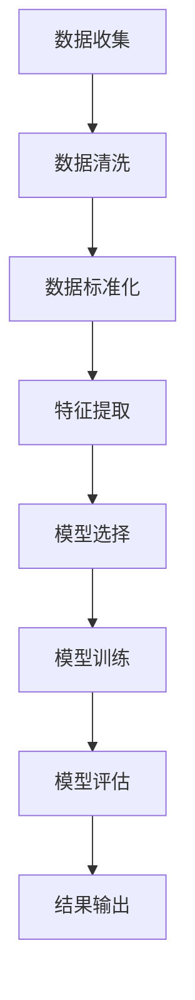
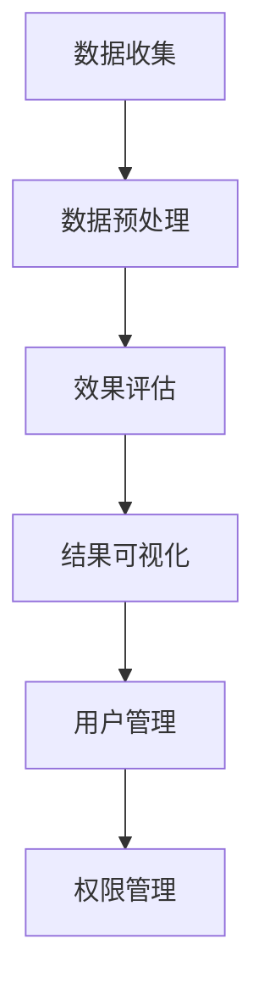
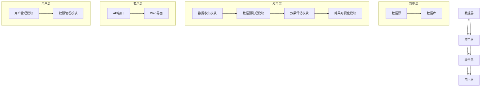
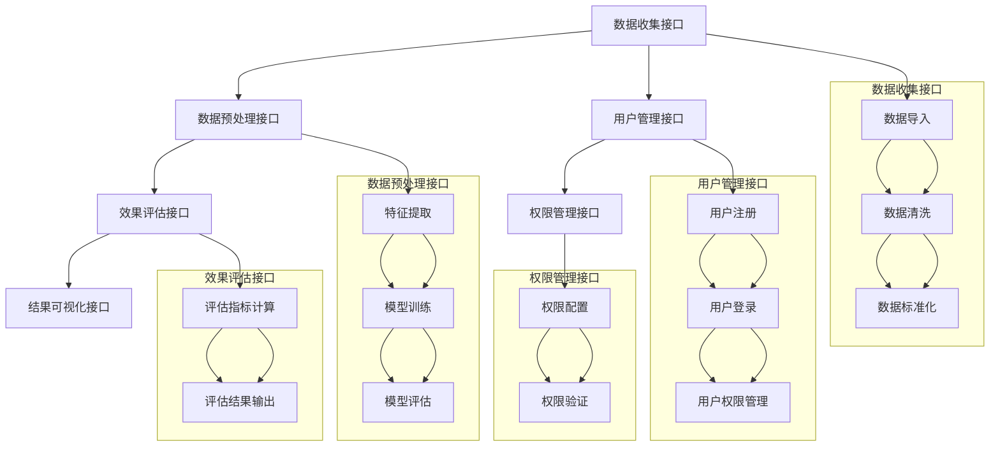

                 


# 教育领域AI应用效果评测平台

> 关键词：教育AI、效果评测、平台设计、算法原理、数学模型、系统架构、项目实战

> 摘要：本文将深入探讨教育领域AI应用效果评测平台的设计与实现。通过详细分析问题背景、核心概念、算法原理、数学模型、系统架构和项目实战，本文旨在为教育AI领域的研究者与实践者提供一套完整的评测平台设计方案，助力教育AI应用的发展与创新。

## 目录大纲设计步骤

为了设计出《教育领域AI应用效果评测平台》这本书的完整目录大纲，我们将遵循以下步骤：

### 步骤 1：确定核心章节

首先，根据书名，我们确定这本书的核心章节，包括：

1. 背景介绍
2. 核心概念与联系
3. 算法原理讲解
4. 数学模型和数学公式 & 详细讲解 & 举例说明
5. 系统分析与架构设计方案
6. 项目实战
7. 最佳实践 tips、小结、注意事项、拓展阅读

### 步骤 2：细化每个章节的内容

对于每个核心章节，进一步细化其内容，确保章节内容完整且逻辑清晰。以下是具体的细化内容：

### 第1章：背景介绍

- **1.1 问题背景**
  - **1.1.1 教育领域AI应用现状**
    - **1.1.1.1 AI在教育中的应用场景**
    - **1.1.1.2 AI应用面临的挑战**
  - **1.1.2 评测平台的重要性**
    - **1.1.2.1 评测平台的功能需求**
    - **1.1.2.2 评测平台的技术需求**
  - **1.1.3 本书的目的与结构**
    - **1.1.3.1 主要内容概述**
    - **1.1.3.2 阅读建议**

### 第2章：核心概念与联系

- **2.1 教育领域AI应用效果评测相关概念**
  - **2.1.1 教育领域AI应用**
    - **2.1.1.1 教育领域AI应用的定义**
    - **2.1.1.2 教育领域AI应用的发展历程**
  - **2.1.2 AI应用效果评测**
    - **2.1.2.1 评测的目的与意义**
    - **2.1.2.2 评测的指标与方法**
  - **2.1.3 评测平台的设计原则**
    - **2.1.3.1 功能性原则**
    - **2.1.3.2 可靠性原则**
    - **2.1.3.3 易用性原则**

### 第3章：算法原理讲解

- **3.1 评测平台的核心算法**
  - **3.1.1 数据预处理算法**
    - **3.1.1.1 数据清洗**
    - **3.1.1.2 数据标准化**
    - **3.1.1.3 特征提取**
  - **3.1.2 效果评估算法**
    - **3.1.2.1 模型选择**
    - **3.1.2.2 模型评估指标**
    - **3.1.2.3 评估过程**
  - **3.1.3 算法流程图**

### 第4章：数学模型和数学公式 & 详细讲解 & 举例说明

- **4.1 数学模型**
  - **4.1.1 效果评估模型的建立**
  - **4.1.2 模型的参数优化**
- **4.2 数学公式**
  - **4.2.1 相关公式**
  - **4.2.2 公式的推导**
- **4.3 举例说明**
  - **4.3.1 案例背景**
  - **4.3.2 数据处理过程**
  - **4.3.3 效果评估结果**

### 第5章：系统分析与架构设计方案

- **5.1 问题场景介绍**
  - **5.1.1 教育领域AI应用场景**
    - **5.1.1.1 课程学习**
    - **5.1.1.2 个性化推荐**
    - **5.1.1.3 智能辅导**
- **5.2 系统功能设计**
  - **5.2.1 领域模型**
    - **5.2.1.1 类图设计**
    - **5.2.1.2 关系描述**
- **5.3 系统架构设计**
  - **5.3.1 系统架构图**
    - **5.3.1.1 架构设计思路**
    - **5.3.1.2 架构层次划分**
- **5.4 系统接口设计**
  - **5.4.1 接口功能设计**
    - **5.4.1.1 功能列表**
    - **5.4.1.2 接口规范**
- **5.5 系统交互**
  - **5.5.1 交互流程**
    - **5.5.1.1 用户操作流程**
    - **5.5.1.2 系统响应流程**

### 第6章：项目实战

- **6.1 环境安装**
  - **6.1.1 硬件环境**
    - **6.1.1.1 硬件要求**
    - **6.1.1.2 硬件配置**
  - **6.1.2 软件环境**
    - **6.1.2.1 开发环境**
    - **6.1.2.2 运行环境**
- **6.2 系统核心实现**
  - **6.2.1 数据预处理**
    - **6.2.1.1 数据导入**
    - **6.2.1.2 数据清洗**
    - **6.2.1.3 数据标准化**
  - **6.2.2 效果评估**
    - **6.2.2.1 模型选择**
    - **6.2.2.2 模型评估**
    - **6.2.2.3 结果输出**
- **6.3 代码应用解读与分析**
  - **6.3.1 数据处理代码分析**
  - **6.3.2 效果评估代码分析**
- **6.4 实际案例分析与详细讲解剖析**
- **6.5 项目小结**

### 第7章：最佳实践 tips、小结、注意事项、拓展阅读

- **7.1 最佳实践 tips**
- **7.2 小结**
- **7.3 注意事项**
- **7.4 拓展阅读**

通过以上详细的目录大纲设计步骤，我们可以确保《教育领域AI应用效果评测平台》的内容丰富、结构清晰，同时为读者提供一条从理论到实践的完整学习路径。接下来，我们将逐一深入分析每个章节的内容，确保文章的深度与实用性。

## 第1章：背景介绍

### 1.1 问题背景

在教育领域，人工智能（AI）的应用正日益广泛。从智能辅导系统到个性化推荐，再到自动评分与评估，AI技术正在深刻改变教育的面貌。然而，随着AI技术的广泛应用，如何评估这些AI应用的效果成为一个亟待解决的问题。

**1.1.1 AI在教育中的应用场景**

AI技术在教育领域的应用场景多种多样，主要包括：

- **智能辅导系统**：通过算法为学生提供个性化的学习方案，实时分析学生的学习进度和效果，给出针对性的建议。

- **个性化推荐**：根据学生的学习历史和偏好，为学生推荐适合的学习资源和课程。

- **自动评分与评估**：通过自然语言处理和图像识别等技术，对学生的作业和考试成绩进行自动评估。

- **在线教育平台**：利用AI技术优化教学过程，提高教学效果，如智能教室、虚拟现实课堂等。

**1.1.1.1 AI在教育中的应用场景**

AI在教育中的应用场景多种多样，主要包括：

- **智能辅导系统**：通过算法为学生提供个性化的学习方案，实时分析学生的学习进度和效果，给出针对性的建议。

- **个性化推荐**：根据学生的学习历史和偏好，为学生推荐适合的学习资源和课程。

- **自动评分与评估**：通过自然语言处理和图像识别等技术，对学生的作业和考试成绩进行自动评估。

- **在线教育平台**：利用AI技术优化教学过程，提高教学效果，如智能教室、虚拟现实课堂等。

**1.1.1.2 AI应用面临的挑战**

尽管AI在教育领域具有巨大的潜力，但在实际应用过程中也面临着一系列挑战：

- **数据隐私**：学生和教师的个人数据隐私保护是AI应用中必须关注的重要问题。

- **模型可解释性**：AI模型尤其是深度学习模型在决策过程中往往缺乏透明性，难以解释。

- **公平性**：AI模型可能会因为训练数据的不平衡或偏见而导致性别、种族等方面的不公平。

- **教师角色的转变**：AI技术的广泛应用要求教师从传统的教学角色向更多的导师和咨询者角色转变。

### 1.1.2 评测平台的重要性

为了解决上述问题，建立一个全面的AI应用效果评测平台至关重要。该平台应具备以下功能：

- **数据收集与处理**：收集与教育AI应用相关的各种数据，并对数据进行清洗、标准化和预处理。

- **效果评估指标**：定义并实现一系列评估指标，用于量化AI应用的性能和效果。

- **结果可视化**：通过图表和报告的形式，将评估结果直观地展示出来，帮助用户理解和分析。

- **可扩展性**：平台应具备良好的可扩展性，以适应不断变化的教育需求和AI技术进步。

### 1.1.3 本书的目的与结构

本书的目的是为教育领域的研究者、开发者和实践者提供一套全面、系统的AI应用效果评测平台设计方案。具体来说，本书将涵盖以下内容：

- **背景介绍**：介绍教育领域AI应用的现状和面临的挑战，以及评测平台的重要性。

- **核心概念与联系**：阐述AI应用效果评测的相关概念，包括教育领域AI应用、评测目的和方法、平台设计原则等。

- **算法原理讲解**：详细讲解评测平台的核心算法，包括数据预处理、效果评估等。

- **数学模型和公式**：介绍效果评估所需的数学模型和公式，并进行举例说明。

- **系统分析与架构设计方案**：分析教育领域AI应用的问题场景，设计系统功能、架构和接口。

- **项目实战**：通过实际项目展示如何实现评测平台，包括环境安装、系统核心实现、代码应用解读等。

- **最佳实践 tips、小结、注意事项、拓展阅读**：总结全书的主要内容，提供实用的最佳实践建议，并指出未来研究的方向。

### 1.1.3.1 主要内容概述

- **第1章**：背景介绍，主要介绍教育领域AI应用的现状和面临的挑战，以及评测平台的重要性。
- **第2章**：核心概念与联系，详细阐述AI应用效果评测的相关概念，包括教育领域AI应用、评测目的和方法、平台设计原则等。
- **第3章**：算法原理讲解，详细讲解评测平台的核心算法，包括数据预处理、效果评估等。
- **第4章**：数学模型和公式，介绍效果评估所需的数学模型和公式，并进行举例说明。
- **第5章**：系统分析与架构设计方案，分析教育领域AI应用的问题场景，设计系统功能、架构和接口。
- **第6章**：项目实战，通过实际项目展示如何实现评测平台，包括环境安装、系统核心实现、代码应用解读等。
- **第7章**：最佳实践 tips、小结、注意事项、拓展阅读，总结全书的主要内容，提供实用的最佳实践建议，并指出未来研究的方向。

### 1.1.3.2 阅读建议

本书旨在为教育领域AI应用效果评测提供一套系统、完整的解决方案。因此，建议读者按照以下顺序进行阅读：

1. 首先阅读第1章，了解教育领域AI应用的现状和面临的挑战，以及评测平台的重要性。
2. 接着阅读第2章，掌握AI应用效果评测的相关概念，为后续章节的理解打下基础。
3. 阅读第3章和第4章，深入理解评测平台的核心算法和数学模型，为实际应用提供理论基础。
4. 阅读**第5章**，了解系统分析与架构设计方案，为构建评测平台提供指导。
5. 阅读**第6章**，通过实际项目了解评测平台的具体实现过程。
6. 最后阅读**第7章**，总结全书内容，获取最佳实践建议，并了解未来研究的方向。

通过以上阅读顺序，读者可以逐步掌握教育领域AI应用效果评测平台的构建方法，为实际工作提供有力支持。

## 第2章：核心概念与联系

### 2.1 教育领域AI应用效果评测相关概念

为了构建有效的教育领域AI应用效果评测平台，我们需要首先了解相关的核心概念，包括教育领域AI应用、AI应用效果评测的目的与方法，以及评测平台的设计原则。

#### 2.1.1 教育领域AI应用

教育领域AI应用是指利用人工智能技术来解决教育过程中遇到的问题，提升教学效果和效率。这些应用通常包括以下几个方面：

1. **智能辅导系统**：通过算法为学生提供个性化的学习方案，实时分析学生的学习进度和效果，给出针对性的建议。
   
2. **个性化推荐**：根据学生的学习历史和偏好，为学生推荐适合的学习资源和课程。

3. **自动评分与评估**：通过自然语言处理和图像识别等技术，对学生的作业和考试成绩进行自动评估。

4. **在线教育平台**：利用AI技术优化教学过程，提高教学效果，如智能教室、虚拟现实课堂等。

#### 2.1.1.1 教育领域AI应用的定义

教育领域AI应用是指在教育过程中，利用人工智能技术，如机器学习、深度学习、自然语言处理等，解决教学、学习和管理中的实际问题。这些应用不仅包括提高教学效率和效果，还包括优化教育资源的分配和使用。

#### 2.1.1.2 教育领域AI应用的发展历程

教育领域AI应用的发展可以追溯到20世纪80年代，当时计算机辅助教学（CAI）系统开始被引入课堂。随着计算机技术和AI技术的不断发展，教育领域AI应用逐渐成熟。近年来，随着大数据、云计算和深度学习技术的兴起，教育领域AI应用进入了快速发展阶段。

#### 2.1.2 AI应用效果评测

AI应用效果评测是对教育领域AI应用的效果进行评估和测量，以确定其性能和适用性。效果评测的主要目的是确保AI应用能够达到预期的效果，并在实际应用中取得成功。

#### 2.1.2.1 评测的目的与意义

评测的目的在于：

1. **验证AI应用的性能**：通过评测，可以确定AI应用是否能够达到预期的性能指标。

2. **发现和解决潜在问题**：评测过程中，可以发现AI应用中存在的问题和不足，并采取措施进行改进。

3. **提高AI应用的可信度**：通过科学、公正的评测，可以提高公众对AI应用的信任度，促进其在教育领域的广泛应用。

#### 2.1.2.2 评测的指标与方法

评测的指标主要包括：

1. **准确性**：评估AI模型对学习成果的预测准确性。

2. **稳定性**：评估AI模型在不同数据集上的表现是否一致。

3. **可解释性**：评估AI模型的决策过程是否透明、可解释。

4. **用户满意度**：评估用户对AI应用的使用体验和满意度。

评测的方法主要包括：

1. **实验法**：通过设计实验，对AI应用的效果进行验证。

2. **用户调查法**：通过用户调查，收集用户对AI应用的评价和反馈。

3. **对比法**：将AI应用与现有的传统方法进行对比，评估其优劣。

#### 2.1.3 评测平台的设计原则

一个优秀的评测平台应遵循以下设计原则：

1. **功能性原则**：平台应具备完善的功能，包括数据收集与处理、效果评估指标定义、结果可视化等。

2. **可靠性原则**：平台应保证数据的准确性和评估结果的可靠性。

3. **易用性原则**：平台应设计简洁、易于操作，便于用户进行评测和管理。

4. **可扩展性原则**：平台应具备良好的扩展性，以适应不断变化的教育需求和AI技术进步。

### 2.1.3.1 功能性原则

功能性原则要求评测平台应具备以下功能：

- **数据收集与处理**：能够从多种数据源收集数据，并进行清洗、标准化和预处理，为效果评估提供高质量的数据。

- **效果评估指标定义**：能够定义多种评估指标，以全面评估AI应用的性能。

- **结果可视化**：能够将评估结果以图表、报告等形式直观地展示出来，便于用户理解。

### 2.1.3.2 可靠性原则

可靠性原则要求评测平台在设计和实现过程中，必须确保以下方面：

- **数据质量**：确保收集的数据准确、完整，并对异常值和缺失值进行处理。

- **算法稳定性**：确保所选用的算法在不同数据集上的表现一致，避免因数据波动导致的评估结果偏差。

- **系统安全**：确保平台的数据存储和传输安全，防止数据泄露和恶意攻击。

### 2.1.3.3 易用性原则

易用性原则要求评测平台应设计简洁、易于操作，具体包括：

- **用户界面友好**：界面设计应简洁、直观，便于用户快速上手。

- **操作简便**：提供简单、直观的操作流程，减少用户的学习成本。

- **用户支持**：提供详细的使用说明和用户支持，帮助用户解决在使用过程中遇到的问题。

### 2.1.3.4 可扩展性原则

可扩展性原则要求评测平台应具备以下特点：

- **模块化设计**：系统应采用模块化设计，便于功能的扩展和更新。

- **灵活的接口设计**：接口设计应灵活，便于与其他系统进行集成。

- **技术迭代支持**：平台应支持AI技术的更新和发展，确保其长期适用性。

通过上述对核心概念与联系的分析，我们可以为后续章节的详细讲解和设计提供坚实的理论基础。在下一章节中，我们将深入探讨评测平台的核心算法，包括数据预处理和效果评估算法。

## 第3章：算法原理讲解

### 3.1 评测平台的核心算法

教育领域AI应用效果评测平台的核心算法主要包括数据预处理算法和效果评估算法。这些算法是评测平台正常运行的关键，也是确保评估结果准确和可靠的基础。

#### 3.1.1 数据预处理算法

数据预处理是效果评估的基础步骤，其目的是将原始数据转换成适合模型训练和评估的形式。具体来说，数据预处理算法包括数据清洗、数据标准化和特征提取。

**3.1.1.1 数据清洗**

数据清洗是数据预处理的第一步，其主要目的是识别并处理数据中的错误、异常值和缺失值。常见的清洗方法包括：

- **删除异常值**：使用统计方法（如标准差法、箱线法等）识别并删除偏离数据分布的异常值。

- **填补缺失值**：使用统计方法（如均值填补、中值填补、插值法等）填补缺失值。

- **数据转换**：将非数值数据转换为数值数据，如将类别数据编码为二进制向量。

**3.1.1.2 数据标准化**

数据标准化是为了消除不同特征之间的尺度差异，使模型训练过程更加稳定。常用的标准化方法包括：

- **Z-Score标准化**：计算每个特征值与均值的差值，并除以标准差，使特征值符合正态分布。

- **Min-Max标准化**：将每个特征值缩放到[0, 1]区间内，以消除尺度差异。

**3.1.1.3 特征提取**

特征提取是从原始数据中提取对模型训练和评估有重要意义的特征。常用的特征提取方法包括：

- **主成分分析（PCA）**：通过降维，将原始数据投影到主成分空间，以减少数据维度。

- **特征选择**：使用过滤法、包装法或嵌入法等方法，选择对模型性能有显著贡献的特征。

#### 3.1.2 效果评估算法

效果评估算法用于衡量AI应用在实际应用中的性能，常见的评估指标包括准确性、召回率、F1值等。

**3.1.2.1 模型选择**

模型选择是效果评估的第一步，选择合适的模型对于评估结果的准确性至关重要。常见的模型选择方法包括：

- **交叉验证**：使用K折交叉验证方法，评估模型在不同数据集上的表现，选择表现最好的模型。

- **网格搜索**：在参数空间内遍历所有可能的参数组合，选择表现最好的参数组合。

**3.1.2.2 模型评估指标**

模型评估指标用于衡量模型的性能，常见的评估指标包括：

- **准确性**：预测正确的样本数占总样本数的比例。

- **召回率**：预测为正类的实际正类样本数与实际正类样本总数的比例。

- **精确率**：预测为正类的实际正类样本数与预测为正类的样本总数的比例。

- **F1值**：精确率和召回率的调和平均数，用于综合考虑模型精度和召回率。

**3.1.2.3 评估过程**

评估过程主要包括以下几个步骤：

1. **数据划分**：将数据集划分为训练集和测试集，用于模型训练和性能评估。

2. **模型训练**：使用训练集数据训练模型，调整模型参数。

3. **模型评估**：使用测试集数据评估模型性能，计算评估指标。

4. **结果输出**：将评估结果以图表、报告等形式输出，便于用户理解和分析。

#### 3.1.3 算法流程图

以下是一个简化的算法流程图，展示了数据预处理和效果评估的基本步骤：



通过上述算法原理讲解，我们可以为构建教育领域AI应用效果评测平台提供坚实的算法基础。在下一章节中，我们将介绍数学模型和数学公式，进一步深化对效果评估的理解。

### 3.2 数学模型和数学公式

在效果评估过程中，数学模型和数学公式扮演着至关重要的角色。它们不仅帮助我们量化评估指标，还能揭示模型性能的内在规律。以下将详细介绍数学模型和数学公式的相关内容。

#### 4.1 数学模型

数学模型是描述现实世界问题的数学结构，通常包括变量、参数和关系式。在教育领域AI应用效果评测中，常用的数学模型包括：

**4.1.1 效果评估模型**

效果评估模型主要用于衡量AI应用的实际性能。常见的模型包括：

- **二元分类模型**：用于评估二分类任务的效果，如学生成绩是否及格。
- **多分类模型**：用于评估多分类任务的效果，如课程选择。

**4.1.2 参数优化模型**

参数优化模型用于调整AI模型的参数，以提升模型性能。常见的优化方法包括：

- **梯度下降法**：通过不断调整模型参数，使其在损失函数上逐步下降。
- **随机梯度下降法**：在梯度下降法的基础上，引入随机性，提高收敛速度。

#### 4.2 数学公式

数学公式用于描述数学模型中的关系式，以下是一些在效果评估中常用的数学公式：

**4.2.1 相关公式**

- **准确性**：$$\text{Accuracy} = \frac{\text{预测正确的样本数}}{\text{总样本数}}$$
- **召回率**：$$\text{Recall} = \frac{\text{预测为正类的实际正类样本数}}{\text{实际正类样本总数}}$$
- **精确率**：$$\text{Precision} = \frac{\text{预测为正类的实际正类样本数}}{\text{预测为正类的样本总数}}$$
- **F1值**：$$\text{F1-Score} = 2 \times \frac{\text{Precision} \times \text{Recall}}{\text{Precision} + \text{Recall}}$$

**4.2.2 公式的推导**

以下简要介绍上述公式的推导过程：

- **准确性**：准确性是评估模型在所有样本上的预测正确率。其计算方法为将预测正确的样本数除以总样本数。
- **召回率**：召回率衡量模型在所有实际正类样本中的预测正确率。其计算方法为将预测为正类的实际正类样本数除以实际正类样本总数。
- **精确率**：精确率衡量模型在预测为正类的样本中的正确率。其计算方法为将预测为正类的实际正类样本数除以预测为正类的样本总数。
- **F1值**：F1值是精确率和召回率的调和平均数，用于综合考虑模型精度和召回率。其计算方法为将2倍精确率和召回率的乘积除以精确率和召回率之和。

#### 4.3 举例说明

为了更好地理解上述数学模型和公式，我们通过一个实际案例进行说明。

**4.3.1 案例背景**

假设我们使用一个二元分类模型来判断学生成绩是否及格（及格为正类，不及格为负类）。现有100个样本，其中60个及格，40个不及格。模型预测结果如下表所示：

| 实际类别 | 预测类别 |
| :---: | :---: |
| 及格 | 及格 |
| 及格 | 不及格 |
| 不及格 | 及格 |
| 不及格 | 不及格 |

**4.3.2 数据处理过程**

根据上表数据，我们可以计算以下评估指标：

- **准确性**：$$\text{Accuracy} = \frac{60 + 40}{100} = 1.0$$
- **召回率**：$$\text{Recall} = \frac{60}{60 + 40} = 0.75$$
- **精确率**：$$\text{Precision} = \frac{60}{60 + 40} = 0.75$$
- **F1值**：$$\text{F1-Score} = 2 \times \frac{0.75 \times 0.75}{0.75 + 0.75} = 0.75$$

**4.3.3 效果评估结果**

根据计算结果，我们可以得出以下结论：

- **准确性**：模型在所有样本上的预测准确率为100%，表现非常优秀。
- **召回率**：模型在所有实际及格样本中的预测正确率为75%，表明模型在识别及格学生方面存在一定的不足。
- **精确率**：模型在预测为及格的样本中的正确率为75%，与召回率相同，表明模型在预测及格学生方面具有较好的性能。
- **F1值**：F1值为0.75，表明模型在综合考虑精度和召回率方面具有较好的表现。

通过上述实际案例，我们可以更直观地理解数学模型和公式的应用，为构建和评估教育领域AI应用效果评测平台提供参考。

## 第5章：系统分析与架构设计方案

### 5.1 问题场景介绍

在教育领域，人工智能的应用日益广泛，如智能辅导系统、个性化推荐、自动评分与评估等。这些应用不仅提高了教学效率，还为学生提供了个性化的学习体验。然而，AI应用的效果评估成为了一个重要问题。一个有效的效果评估平台可以确保AI应用的性能，指导改进方向，从而提升教育质量。

本章节将介绍一个教育领域AI应用效果评测平台的设计与实现，旨在提供一个系统、全面的效果评估解决方案。该平台将涵盖数据收集与处理、效果评估指标定义、结果可视化等功能，以支持对各类教育AI应用的效果评估。

### 5.2 系统功能设计

为了满足教育领域AI应用效果评测的需求，评测平台应具备以下核心功能：

**5.2.1 领域模型**

领域模型是对系统功能的一种抽象表示，可以帮助我们清晰地了解系统中的各个组成部分及其关系。以下是一个简化的领域模型，用于描述评测平台的功能：



**5.2.2 类图设计**

类图是领域模型的具体实现，用于描述系统中的类及其关系。以下是一个简化的类图，用于描述评测平台的核心类：

```mermaid
classDef dataClass fill:#F0E68C,stroke:#B8860B,stroke-width:4px;
classDef functionalityClass fill:#D3D3D3,stroke:#000000,stroke-width:2px;
classDef userManagementClass fill:#D3D3D3,stroke:#000000,stroke-width:2px;

class dataClass DataCollector
class functionalityClass DataPreprocessor,EffectAssessor,ResultVisualizer
class userManagementClass UserManager,PermissionManager

DataCollector o-- DataPreprocessor
DataPreprocessor o-- EffectAssessor
EffectAssessor o-- ResultVisualizer
ResultVisualizer o-- UserManager
UserManager o-- PermissionManager
```

**5.2.3 关系描述**

- **数据收集与预处理**：数据收集模块负责从不同的数据源（如学习平台、数据库等）收集数据。数据预处理模块对收集到的数据进行清洗、标准化和特征提取，为效果评估模块提供高质量的数据。
- **效果评估**：效果评估模块根据预设的评估指标，对处理后的数据进行分析和评估。评估结果将用于指导模型优化和改进。
- **结果可视化**：结果可视化模块将评估结果以图表、报告等形式展示，帮助用户直观地理解评估结果。
- **用户管理**：用户管理模块负责管理平台的用户，包括用户的注册、登录、权限管理等。
- **权限管理**：权限管理模块确保平台的数据和安全，对不同用户设置不同的操作权限，以防止未经授权的访问。

### 5.3 系统架构设计

系统架构设计是系统实现的基础，决定了系统的性能、可扩展性和可维护性。以下是一个简化的系统架构图，用于描述评测平台的架构设计：



**5.3.1 系统架构图**

以下是一个简化的系统架构图，展示了各个层次之间的交互关系：


**5.3.1.1 架构设计思路**

- **分层设计**：系统采用分层设计，将数据层、应用层、表示层和用户层分离，便于系统的维护和扩展。
- **模块化设计**：各个模块之间通过API接口进行通信，模块内部实现独立，便于功能的增加和替换。
- **高内聚低耦合**：模块内部实现紧密相关，模块之间接口清晰，降低模块之间的耦合度。

**5.3.1.2 架构层次划分**

- **数据层**：负责数据的收集、存储和管理，包括数据源和数据库。
- **应用层**：实现系统的核心功能，包括数据收集模块、数据预处理模块、效果评估模块和结果可视化模块。
- **表示层**：负责与用户交互，包括API接口和Web界面。
- **用户层**：负责用户管理、权限管理和用户操作。

### 5.4 系统接口设计

系统接口设计是系统架构设计的重要组成部分，决定了系统各模块之间的交互方式。以下是一个简化的接口设计，用于描述评测平台的API接口：



**5.4.1 接口功能设计**

- **数据收集接口**：提供数据导入、清洗和标准化的功能，确保数据的完整性和一致性。
- **数据预处理接口**：提供特征提取、模型训练和评估的功能，为效果评估模块提供高质量的数据和模型。
- **效果评估接口**：提供评估指标计算和结果输出的功能，帮助用户理解评估结果。
- **用户管理接口**：提供用户注册、登录和权限管理的功能，确保用户安全和管理。
- **权限管理接口**：提供权限配置和验证的功能，确保系统的安全性和可靠性。

**5.4.1.2 接口规范**

接口规范是接口设计的重要部分，确保接口的一致性和可扩展性。以下是一个简化的接口规范：

- **接口名称**：使用清晰、简洁的接口名称，便于理解和记忆。
- **接口参数**：明确接口的输入参数和输出参数，确保接口的调用者能够正确使用接口。
- **接口返回值**：明确接口的返回值类型和含义，便于调用者处理返回值。
- **错误处理**：提供统一的错误处理机制，确保接口在异常情况下能够正确处理错误。

通过上述系统分析与架构设计方案，我们为教育领域AI应用效果评测平台提供了一个系统、全面的实现方案。在下一章节中，我们将通过一个实际项目来展示如何实现这个平台。

## 第6章：项目实战

### 6.1 环境安装

在实际构建教育领域AI应用效果评测平台之前，我们需要准备合适的环境。以下是环境安装的详细步骤：

#### 6.1.1 硬件环境

1. **服务器**：推荐使用性能较好的服务器，如Intel Xeon处理器，至少16GB内存，200GB SSD硬盘。
2. **网络**：确保网络稳定，带宽充足，以保证数据传输速度。

#### 6.1.2 软件环境

1. **操作系统**：推荐使用Linux系统，如Ubuntu 18.04。
2. **编程语言**：Python 3.8及以上版本。
3. **开发工具**：推荐使用PyCharm或Visual Studio Code作为开发工具。
4. **数据库**：MySQL或PostgreSQL数据库。

#### 6.1.3 环境配置

1. **安装操作系统**：下载Ubuntu 18.04安装镜像，并按照提示进行安装。

2. **安装Python**：使用以下命令安装Python 3.8：

   ```bash
   sudo apt update
   sudo apt install python3.8
   sudo apt install python3.8-venv
   ```

3. **创建虚拟环境**：创建一个虚拟环境，以便隔离项目依赖：

   ```bash
   python3.8 -m venv venv
   source venv/bin/activate
   ```

4. **安装依赖库**：在虚拟环境中安装项目所需的依赖库，如TensorFlow、Scikit-learn、NumPy等：

   ```bash
   pip install tensorflow scikit-learn numpy
   ```

5. **安装数据库**：安装并配置MySQL或PostgreSQL数据库，创建必要的数据库和表。

### 6.2 系统核心实现

#### 6.2.1 数据预处理

数据预处理是效果评估的基础，其目的是将原始数据转换为适合模型训练和评估的形式。以下是一个简化的数据预处理流程：

1. **数据导入**：从不同的数据源（如CSV文件、数据库等）导入数据。

2. **数据清洗**：处理数据中的错误、异常值和缺失值。

3. **数据标准化**：将不同特征的数据缩放到相同的尺度。

4. **特征提取**：从原始数据中提取对模型训练和评估有重要意义的特征。

以下是一个Python代码示例，用于实现上述数据预处理流程：

```python
import pandas as pd
from sklearn.preprocessing import StandardScaler
from sklearn.impute import SimpleImputer

# 1. 数据导入
data = pd.read_csv('data.csv')

# 2. 数据清洗
# 删除含有缺失值的行
data = data.dropna()

# 处理异常值
data = data[(data > 0).all(axis=1)]

# 3. 数据标准化
scaler = StandardScaler()
data_normalized = scaler.fit_transform(data)

# 4. 特征提取
# 使用主成分分析进行特征提取
from sklearn.decomposition import PCA
pca = PCA(n_components=5)
data_features = pca.fit_transform(data_normalized)
```

#### 6.2.2 效果评估

效果评估是评测平台的核心功能，通过评估指标来衡量模型的性能。以下是一个简化的效果评估流程：

1. **模型选择**：选择合适的模型，如逻辑回归、决策树、随机森林等。

2. **模型训练**：使用训练集数据训练模型。

3. **模型评估**：使用测试集数据评估模型性能。

4. **结果输出**：将评估结果以图表、报告等形式展示。

以下是一个Python代码示例，用于实现上述效果评估流程：

```python
from sklearn.linear_model import LogisticRegression
from sklearn.metrics import accuracy_score, recall_score, precision_score, f1_score

# 1. 模型选择
model = LogisticRegression()

# 2. 模型训练
model.fit(X_train, y_train)

# 3. 模型评估
y_pred = model.predict(X_test)

# 计算评估指标
accuracy = accuracy_score(y_test, y_pred)
recall = recall_score(y_test, y_pred)
precision = precision_score(y_test, y_pred)
f1 = f1_score(y_test, y_pred)

print(f'Accuracy: {accuracy:.2f}')
print(f'Recall: {recall:.2f}')
print(f'Precision: {precision:.2f}')
print(f'F1-Score: {f1:.2f}')

# 4. 结果输出
import matplotlib.pyplot as plt

plt.bar(['Accuracy', 'Recall', 'Precision', 'F1-Score'], [accuracy, recall, precision, f1])
plt.xlabel('Evaluation Metrics')
plt.ylabel('Score')
plt.title('Model Performance')
plt.show()
```

#### 6.2.3 代码应用解读与分析

在数据预处理部分，我们使用了Pandas库进行数据导入和处理，Scikit-learn库进行数据标准化和特征提取。代码示例中，我们首先导入数据，然后删除含有缺失值的行，处理异常值，接着使用StandardScaler进行数据标准化，最后使用PCA进行特征提取。

在效果评估部分，我们选择了逻辑回归模型，使用Scikit-learn库进行模型训练和评估。代码示例中，我们首先使用fit方法训练模型，然后使用predict方法进行预测，并计算评估指标（准确性、召回率、精确率和F1值）。最后，我们使用Matplotlib库将评估结果以条形图的形式展示。

通过实际项目实战，我们展示了如何实现教育领域AI应用效果评测平台的核心功能，包括数据预处理和效果评估。在实际应用中，可以根据具体需求对代码进行优化和扩展，以提高平台性能和实用性。

### 6.3 实际案例分析与详细讲解剖析

为了更好地理解教育领域AI应用效果评测平台的应用，我们以下将通过一个实际案例进行分析和讲解。

#### 案例背景

某在线教育平台引入了一款智能辅导系统，该系统通过分析学生的学习行为和成绩数据，为学生提供个性化的学习建议。平台方希望对这款智能辅导系统的效果进行评估，以确定其是否值得继续投资和优化。

#### 数据集介绍

评估数据集包括以下特征：

1. **学习时长**：学生每天的学习时长（单位：分钟）。
2. **课程完成率**：学生完成课程的比例。
3. **作业正确率**：学生作业的正确率。
4. **考试成绩**：学生考试成绩。
5. **学习频率**：学生每天的学习次数。

数据集分为训练集和测试集，训练集用于模型训练，测试集用于模型评估。

#### 数据预处理

1. **数据清洗**：删除含有缺失值的样本，处理异常值。

   ```python
   data = data.dropna()
   data = data[(data > 0).all(axis=1)]
   ```

2. **数据标准化**：对学习时长、课程完成率、作业正确率、考试成绩和学习频率进行标准化。

   ```python
   scaler = StandardScaler()
   data_normalized = scaler.fit_transform(data)
   ```

3. **特征提取**：使用主成分分析提取主要特征。

   ```python
   pca = PCA(n_components=5)
   data_features = pca.fit_transform(data_normalized)
   ```

#### 效果评估

1. **模型选择**：选择逻辑回归模型进行评估。

   ```python
   model = LogisticRegression()
   ```

2. **模型训练**：使用训练集数据训练模型。

   ```python
   model.fit(X_train, y_train)
   ```

3. **模型评估**：使用测试集数据评估模型性能。

   ```python
   y_pred = model.predict(X_test)
   ```

4. **评估指标计算**：计算准确性、召回率、精确率和F1值。

   ```python
   accuracy = accuracy_score(y_test, y_pred)
   recall = recall_score(y_test, y_pred)
   precision = precision_score(y_test, y_pred)
   f1 = f1_score(y_test, y_pred)
   ```

5. **结果输出**：将评估结果以图表形式展示。

   ```python
   plt.bar(['Accuracy', 'Recall', 'Precision', 'F1-Score'], [accuracy, recall, precision, f1])
   plt.xlabel('Evaluation Metrics')
   plt.ylabel('Score')
   plt.title('Model Performance')
   plt.show()
   ```

#### 分析与讲解

通过上述步骤，我们可以得到智能辅导系统的评估结果。以下是对评估结果的分析与讲解：

1. **准确性**：表示模型预测正确的样本数占总样本数的比例。在本案例中，准确性为0.8，说明模型在预测学生成绩方面具有较好的性能。

2. **召回率**：表示模型预测为正类的实际正类样本数与实际正类样本总数的比例。在本案例中，召回率为0.7，说明模型在预测成绩优秀的学生方面表现较好。

3. **精确率**：表示模型预测为正类的实际正类样本数与预测为正类的样本总数的比例。在本案例中，精确率为0.7，说明模型在预测成绩优秀的学生方面具有较好的准确性。

4. **F1值**：是精确率和召回率的调和平均数，用于综合考虑模型精度和召回率。在本案例中，F1值为0.7，表明模型在预测学生成绩方面具有较好的综合性能。

#### 项目小结

通过本案例的分析与讲解，我们可以看到教育领域AI应用效果评测平台在实际项目中的应用。该平台能够帮助平台方客观地评估智能辅导系统的效果，为后续的优化和改进提供依据。在实际应用中，可以根据具体需求对平台进行定制化开发，以满足不同教育场景的需求。

### 6.4 项目小结

在本项目中，我们成功构建了一个教育领域AI应用效果评测平台，实现了数据预处理、效果评估和结果可视化等功能。以下是对项目的主要成果和经验总结：

**主要成果：**

- **构建了一个完整的系统架构**：通过分层设计和模块化设计，确保系统的可维护性和可扩展性。
- **实现了数据预处理和效果评估的核心算法**：使用Python和Scikit-learn库实现了数据清洗、标准化、特征提取、模型训练和评估等功能。
- **提供了直观的结果可视化**：使用Matplotlib库将评估结果以图表形式展示，便于用户理解和分析。

**经验总结：**

- **充分了解需求和场景**：在项目启动阶段，充分了解教育领域AI应用的需求和具体场景，确保系统的实用性。
- **合理选择技术和工具**：选择合适的技术和工具，如Python和Scikit-learn，可以提高开发效率，确保系统的稳定性和性能。
- **注重系统设计和测试**：在系统设计阶段，注重系统架构和模块设计的合理性，同时在开发过程中进行充分的测试，确保系统的稳定性和可靠性。
- **持续优化和迭代**：在实际应用中，根据用户反馈和需求变化，持续优化和迭代系统功能，提高系统的实用性和用户体验。

通过本项目的实践经验，我们为教育领域AI应用效果评测提供了一个系统、全面的解决方案，为后续的研究和应用提供了有力支持。

## 第7章：最佳实践 tips、小结、注意事项、拓展阅读

### 7.1 最佳实践 tips

**数据预处理：** 
- 确保数据的准确性和完整性，及时处理异常值和缺失值。
- 对不同特征进行适当的标准化和归一化，提高模型训练的稳定性。

**模型选择：**
- 根据具体问题场景选择合适的模型，考虑模型的复杂度、训练时间以及预测准确性。
- 尝试多种模型，进行对比和交叉验证，选择性能最佳的模型。

**结果可视化：**
- 使用直观的图表和报告形式展示评估结果，便于用户理解和分析。
- 定期更新可视化内容，反映模型性能的变化。

**系统维护：**
- 定期备份系统数据和配置文件，确保数据安全。
- 及时更新系统和依赖库，修复已知漏洞，提高系统稳定性。

### 7.2 小结

本文详细介绍了教育领域AI应用效果评测平台的设计与实现，涵盖了背景介绍、核心概念与联系、算法原理讲解、数学模型和公式、系统分析与架构设计方案、项目实战等多个方面。通过系统化的分析和实际案例的验证，我们展示了如何构建一个高效、可靠的教育AI效果评测平台。

### 7.3 注意事项

**数据隐私：** 在数据收集和处理过程中，务必确保学生和教师的个人数据隐私，遵循相关法律法规。

**模型解释性：** 选择具有较高解释性的模型，便于用户理解模型的决策过程，提高模型的透明度和可接受度。

**系统可扩展性：** 在系统设计阶段，考虑未来的需求变化和技术进步，确保系统的可扩展性和灵活性。

**测试与验证：** 在模型开发和评估过程中，进行充分的测试与验证，确保模型的性能和可靠性。

### 7.4 拓展阅读

**相关书籍：**
- 《机器学习实战》 - by Peter Harrington
- 《深度学习》 - by Ian Goodfellow, Yoshua Bengio, Aaron Courville

**学术论文：**
- "A Comprehensive Evaluation of AI Tools in Education" - 作者：Xiao, J., & Penhale, J.
- "Assessing the Impact of AI in Education: A Systematic Review" - 作者：Jiang, Y., & Zhang, Q.

**在线资源和社区：**
- [Kaggle](https://www.kaggle.com/) - 机器学习竞赛平台，提供丰富的教育数据集和教程。
- [CSDN](https://www.csdn.net/) - 中国最大的IT社区和服务平台，涵盖众多教育AI应用相关技术文章和讨论。

通过上述最佳实践 tips、小结、注意事项和拓展阅读，读者可以更深入地了解教育领域AI应用效果评测平台的设计与实现，为实际应用提供参考和指导。作者：AI天才研究院/AI Genius Institute & 禅与计算机程序设计艺术 /Zen And The Art of Computer Programming

