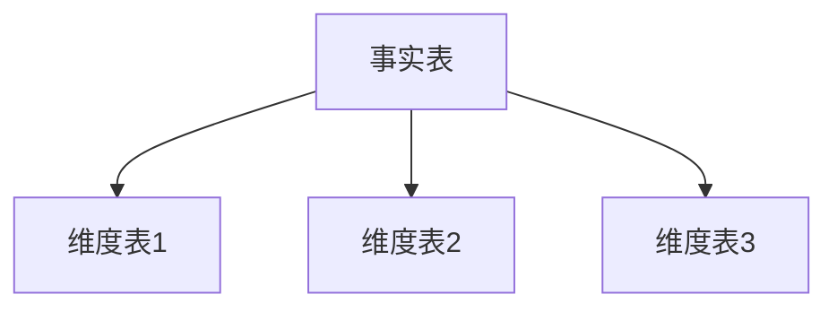
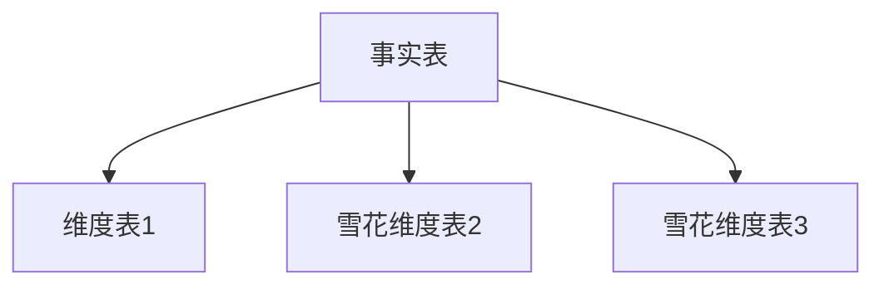
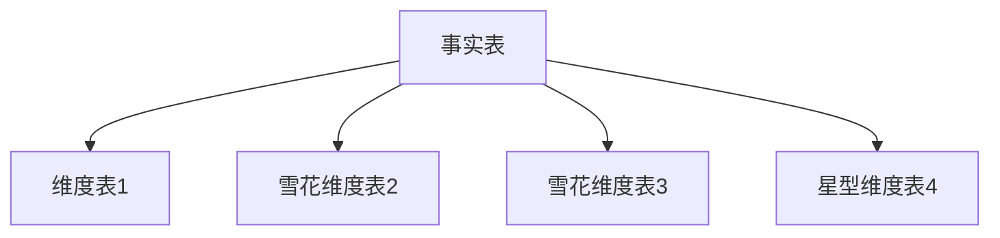

                 

### 数据仓库：支持LLM应用的商业智能分析

**关键词：** 数据仓库、商业智能分析、大型语言模型（LLM）、ETL、数据建模

**摘要：** 本文将深入探讨数据仓库在商业智能分析中的应用，特别是其在支持大型语言模型（LLM）方面的重要性。我们将从基础概念开始，逐步深入到数据仓库的架构、数据建模、数据存储管理、商业智能工具、数据分析技术，以及LLM在实际业务中的应用。本文旨在为读者提供清晰、系统化的理解，帮助他们在现代商业环境中充分利用数据仓库和LLM的潜力。

### 引言

在当今数字化时代，数据已经成为企业最具价值的资产之一。为了从这些海量数据中提取有价值的洞察，企业需要依赖高效的数据仓库和商业智能分析工具。数据仓库作为一种专门用于存储、管理和分析大量数据的系统，已经成为了现代企业数据管理的重要组成部分。

然而，随着人工智能和自然语言处理技术的迅速发展，大型语言模型（LLM）在商业智能分析中的应用越来越广泛。LLM能够通过处理和理解自然语言，帮助企业进行文本挖掘、情感分析、客户服务自动化等任务，从而提升业务效率和决策质量。

本文将围绕以下主题进行讨论：

1. **数据仓库的基本概念和架构**：介绍数据仓库的定义、功能以及其核心架构。
2. **数据建模**：探讨数据建模的重要性以及不同的数据建模技术。
3. **数据存储和管理**：分析数据存储系统的类型、数据管理策略和工具。
4. **商业智能工具**：介绍各种商业智能工具以及它们在数据仓库中的角色。
5. **数据分析技术**：介绍数据分析技术及其在数据仓库中的应用。
6. **LLM应用与商业洞察**：讨论LLM在商业中的应用及其对决策的影响。

通过本文的阅读，读者将能够全面了解数据仓库在商业智能分析中的作用，并了解如何利用LLM技术提升数据分析的效率和效果。

### 数据仓库的基本概念和架构

数据仓库是一种专门用于存储、管理和分析大量数据的系统。它不同于传统的数据库系统，因为其设计目的是为了支持复杂的分析和决策支持任务，而不仅仅是日常的操作性事务处理。数据仓库通过集成来自多个源的数据，为企业提供了一个统一的视角，以便更好地理解和利用其数据资产。

#### 数据仓库的定义

数据仓库的定义可以归结为以下几点：

1. **数据的集成**：数据仓库通过ETL（提取、转换、加载）过程，从不同的数据源（如企业数据库、外部数据源等）中提取数据，并进行清洗、转换和整合，最终加载到数据仓库中。
2. **数据的存储**：数据仓库使用高效的存储系统来存储大量数据，并采用优化的查询机制以提高数据检索的速度。
3. **数据的分析**：数据仓库提供了丰富的数据分析和报表工具，帮助企业从数据中提取洞察和做出决策。

#### 数据仓库的功能

数据仓库的主要功能包括：

1. **数据存储和管理**：数据仓库能够存储大量的结构化和非结构化数据，并提供高效的数据管理功能，如数据备份、恢复、安全性和访问控制等。
2. **数据集成**：数据仓库通过ETL过程将来自不同源的数据进行整合，从而实现数据的统一和一致。
3. **数据分析和报表**：数据仓库提供了强大的数据分析和报表功能，支持复杂的查询和报表生成，帮助企业从数据中提取有价值的信息。
4. **数据挖掘和预测分析**：数据仓库支持数据挖掘和预测分析技术，帮助企业在数据中发现潜在的模式和趋势，从而做出更加精准的预测和决策。

#### 数据仓库的架构

数据仓库的架构通常包括以下几个关键组件：

1. **数据源**：数据源是数据仓库的数据来源，可以是企业内部的各种数据库、外部数据提供商等。
2. **ETL工具**：ETL工具用于从数据源中提取数据，进行数据清洗、转换和加载到数据仓库中。常见的ETL工具有Informatica、Talend等。
3. **数据仓库**：数据仓库是存储和管理数据的中心，通常采用多维数据模型，以便高效地进行数据查询和分析。
4. **OLAP服务器**：OLAP（在线分析处理）服务器用于提供高级的数据分析和报表功能，支持复杂的查询和数据分析任务。
5. **前端工具**：前端工具用于数据的查询、报表生成和可视化，常见的工具包括Tableau、Power BI等。

#### ETL过程

ETL过程是数据仓库的重要组成部分，其核心步骤包括：

1. **提取（Extract）**：从不同的数据源中提取数据，可以是结构化数据（如关系型数据库）或非结构化数据（如文本文件、图像等）。
2. **转换（Transform）**：对提取的数据进行清洗、转换和整合，例如数据格式转换、缺失值处理、异常值处理等。
3. **加载（Load）**：将转换后的数据加载到数据仓库中，通常是按照预定义的数据模型进行加载。

#### 数据建模

数据建模是数据仓库设计的关键步骤，其目的是定义数据仓库中的数据结构和关系，以便高效地进行数据查询和分析。常见的数据建模技术包括：

1. **星型模式（Star Schema）**：星型模式是一种简单而常用的数据建模技术，其核心是一个事实表和多个维度表的组合。事实表通常包含业务交易数据，维度表则包含描述数据的各种属性。
2. **雪花模式（Snowflake Schema）**：雪花模式是星型模式的一种扩展，通过进一步规范化维度表，以减少数据的冗余和提高查询效率。
3. **雪花-星型混合模式**：结合雪花模式和星型模式的优点，适用于更复杂的业务场景。

#### 数据仓库的应用

数据仓库在企业中的应用非常广泛，以下是一些典型的应用场景：

1. **客户关系管理（CRM）**：通过数据仓库，企业可以整合来自不同渠道的客户数据，进行客户细分、客户行为分析等，以提升客户满意度和忠诚度。
2. **供应链管理**：数据仓库可以帮助企业实时监控供应链的各个环节，优化库存管理、降低成本、提高供应链效率。
3. **财务分析**：数据仓库可以整合财务数据，支持复杂的财务报表生成和财务分析，帮助企业做出更加准确的财务预测和决策。
4. **市场营销**：数据仓库可以用于市场数据分析、营销效果评估等，帮助企业制定更加有效的营销策略。
5. **人力资源**：数据仓库可以整合员工数据，支持员工绩效评估、招聘分析等，帮助企业优化人力资源管理。

### 数据建模

在数据仓库的设计过程中，数据建模是至关重要的环节。数据建模的目的是定义数据仓库中的数据结构和关系，以确保数据的一致性、完整性和高效性。本文将介绍数据建模的重要性、不同的数据建模技术以及它们的应用。

#### 数据建模的重要性

数据建模的重要性体现在以下几个方面：

1. **数据一致性**：通过数据建模，可以确保数据在存储和查询过程中的一致性，避免数据冗余和冲突。
2. **数据完整性**：数据建模有助于确保数据的完整性，包括数据的准确性、完整性和一致性。
3. **查询效率**：合理的数据建模可以提高数据查询的效率，减少查询时间和计算资源的使用。
4. **数据分析能力**：良好的数据建模能够支持复杂的数据分析和报表生成，为企业的决策提供有力的支持。
5. **数据可扩展性**：通过数据建模，可以方便地扩展数据模型，以适应业务需求和数据增长。

#### 数据建模技术

数据建模技术主要包括星型模式、雪花模式以及它们的变种。以下是这些技术的详细介绍：

##### 星型模式

星型模式是一种常用的数据建模技术，其核心是一个事实表和多个维度表的组合。事实表通常包含业务交易数据，维度表则包含描述数据的各种属性。

**特点：**
- **简单性**：星型模式结构简单，易于理解和实现。
- **高效性**：在查询和报表生成过程中，星型模式能够提供高效的性能。

**应用场景：**
- **销售数据分析**：通过事实表中的销售数据和维度表中的产品、时间、区域等信息，可以快速生成销售报表。
- **客户关系管理**：整合客户数据和业务交易数据，进行客户行为分析。

**图示：**

##### 雪花模式

雪花模式是星型模式的一种扩展，通过进一步规范化维度表，以减少数据的冗余和提高查询效率。

**特点：**
- **规范化**：雪花模式对维度表进行进一步的规范化，减少数据冗余。
- **查询优化**：雪花模式能够提高查询效率，特别是在处理复杂查询时。

**应用场景：**
- **产品数据管理**：通过细化产品维度表，可以更好地管理产品信息和库存数据。
- **客户数据管理**：细化客户维度表，以便更准确地分析客户行为和需求。

**图示：**

##### 雪花-星型混合模式

雪花-星型混合模式结合了雪花模式和星型模式的优点，适用于更复杂的业务场景。

**特点：**
- **灵活性**：雪花-星型混合模式提供了更高的灵活性，可以根据业务需求灵活调整数据模型。

**应用场景：**
- **复杂的业务流程**：在涉及多个业务流程和复杂关系的数据场景中，雪花-星型混合模式能够更好地支持数据建模。

**图示：**

#### 数据建模在实际业务中的应用

以下是数据建模在实际业务中的一些具体应用场景：

1. **电子商务**：在电子商务平台中，数据建模可以支持用户行为分析、推荐系统、销售报表等。
2. **银行金融**：银行金融领域的数据建模可以支持客户管理、风险管理、财务报表等。
3. **零售行业**：零售行业的数据建模可以支持库存管理、销售分析、客户关系管理等。
4. **医疗健康**：医疗健康领域的数据建模可以支持患者管理、医疗数据分析、健康监测等。
5. **物流运输**：物流运输领域的数据建模可以支持运输管理、库存跟踪、配送优化等。

#### 数据建模的挑战与解决方案

在数据建模过程中，可能会遇到以下挑战：

1. **数据质量**：数据质量问题是数据建模中常见的挑战。解决方案包括数据清洗、数据验证和建立数据质量监控机制。
2. **数据一致性**：确保数据在不同数据源之间的一致性是数据建模的重要任务。解决方案包括建立数据集成和同步机制。
3. **数据扩展性**：随着业务的发展，数据模型需要具备良好的扩展性。解决方案包括采用灵活的数据建模技术，如雪花-星型混合模式。

### 数据存储和管理

数据存储和管理是数据仓库系统设计中的核心环节。一个高效、可靠的数据存储和管理系统能够确保数据的安全、完整性和可访问性，同时满足大规模数据处理的性能需求。本文将介绍数据存储系统的类型、数据管理策略和工具，以及针对大型语言模型（LLM）应用的挑战和解决方案。

#### 数据存储系统的类型

数据仓库系统通常采用多种数据存储系统，以适应不同的数据规模和查询需求。以下是几种常见的数据存储系统类型：

1. **关系型数据库（RDBMS）**：关系型数据库如MySQL、Oracle等，提供了强大的数据管理功能，支持复杂的关系查询和事务处理。它们通常用于存储结构化数据，如客户信息、销售数据等。
   
2. **列式存储系统**：列式存储系统如Apache HBase、Google Bigtable等，专为大规模数据存储和高速读/写操作设计。它们将数据按列存储，适合于数据分析场景，能够高效处理大量的读取操作。

3. **分布式文件系统**：分布式文件系统如Hadoop HDFS、Apache Cassandra等，能够处理海量非结构化数据，并具备高可用性和高扩展性。这些系统通常用于存储日志数据、社交媒体数据等。

4. **内存数据库**：内存数据库如MemSQL、Redis等，将数据存储在内存中，提供极快的读写性能。它们适合于需要低延迟和高吞吐量的实时数据处理场景。

#### 数据管理策略和工具

有效的数据管理策略和工具对于确保数据仓库的性能和可靠性至关重要。以下是一些关键的数据管理策略和工具：

1. **数据分区**：数据分区是将大量数据划分为多个较小的部分，以提高查询性能和数据的可管理性。分区可以根据时间、地理位置、业务类别等维度进行。

2. **数据压缩**：数据压缩通过减少数据存储空间和提高I/O性能，能够显著降低存储成本和提升查询效率。常用的数据压缩算法包括LZ4、Snappy、Gzip等。

3. **数据加密**：数据加密是保护数据隐私和安全的关键技术。通过使用加密算法，如AES（高级加密标准），可以确保数据在存储和传输过程中的安全性。

4. **数据备份与恢复**：数据备份和恢复策略能够确保在数据丢失或系统故障时能够快速恢复数据。常见的备份策略包括全备份、增量备份和差异备份。

5. **监控与优化**：使用监控工具，如Apache Spark、Apache Flink等，可以实时跟踪数据仓库的性能指标，并自动调整配置以优化性能。此外，定期进行性能调优和优化也是确保数据仓库高效运行的重要措施。

#### 针对LLM应用的挑战和解决方案

大型语言模型（LLM）在数据处理和存储方面具有特定的挑战。以下是一些关键挑战和相应的解决方案：

1. **大规模数据处理**：LLM通常需要处理和存储大量的文本数据，这要求数据存储系统具备高吞吐量和低延迟。解决方案包括使用分布式文件系统和内存数据库，以及优化数据加载和查询过程。

2. **高效数据检索**：LLM应用通常需要进行复杂的文本检索和分析，这要求数据存储系统能够快速响应查询。解决方案包括使用索引技术和查询优化算法，如B树索引、倒排索引等。

3. **数据一致性和可靠性**：在LLM应用中，数据的一致性和可靠性至关重要，因为错误的预测或分析可能导致严重的商业后果。解决方案包括使用分布式系统中的数据复制和冗余机制，以及建立数据验证和监控机制。

4. **数据隐私和安全**：由于LLM应用通常涉及敏感数据，确保数据隐私和安全是关键。解决方案包括使用加密技术和访问控制策略，以及定期进行安全审计和漏洞扫描。

总之，数据存储和管理是数据仓库系统设计中的关键环节，对于支持LLM应用的商业智能分析至关重要。通过采用合适的数据存储系统、管理策略和工具，可以确保数据仓库的高效、可靠和安全性。

### 商业智能工具

商业智能（Business Intelligence, BI）工具是数据仓库的重要组成部分，它们能够帮助企业从大量数据中提取有价值的信息，支持决策制定和业务优化。本文将介绍几种常见的商业智能工具，分析它们在数据仓库中的角色和作用，并提供一些成功的实施案例。

#### 商业智能工具的介绍

商业智能工具通常包括数据集成、数据存储、数据分析和数据可视化等功能。以下是一些常用的商业智能工具：

1. **Tableau**：Tableau 是一款强大的数据可视化工具，能够快速生成各种图表和报表，帮助企业直观地理解和分析数据。它支持多种数据源，包括关系型数据库、大数据平台和云存储。

2. **Power BI**：Power BI 是微软推出的商业智能工具，提供丰富的数据可视化功能，支持自定义报表和仪表板。它易于使用，且能够与微软的其他产品（如Excel、Azure）无缝集成。

3. **QlikView**：QlikView 是一款灵活的商务智能平台，提供强大的数据关联和分析功能，允许用户自由探索数据。它基于内存计算，能够快速响应复杂查询。

4. **Looker**：Looker 是一款基于云的 BI 工具，提供数据探索、可视化和分析功能。它使用基于 SQL 的查询语言，支持自定义仪表板和报告。

5. **Oracle BI**：Oracle BI 是 Oracle 公司推出的商业智能解决方案，包括数据集成、数据分析、报表生成和仪表板功能。它支持大规模数据集，并提供强大的数据管理和安全性。

#### BI 工具在数据仓库中的角色和作用

商业智能工具在数据仓库中扮演着多种角色，具体包括：

1. **数据集成**：商业智能工具能够集成来自不同数据源的数据，包括内部数据库、外部数据提供商和云存储。这些工具通常提供ETL（提取、转换、加载）功能，确保数据的统一和一致性。

2. **数据分析和报表**：商业智能工具提供强大的数据分析功能，支持复杂的数据查询、统计分析和预测建模。这些工具还能够生成各种类型的报表和图表，帮助用户理解数据背后的含义。

3. **数据可视化**：商业智能工具能够将数据转化为直观的图表和报表，使用户能够轻松地发现数据中的趋势和异常。这些可视化工具通常支持交互式探索，允许用户自定义视图和过滤器。

4. **决策支持**：商业智能工具为管理层提供实时、准确的数据支持，帮助他们做出基于数据的决策。这些工具还能够自动化报告生成和分发，提高决策效率。

#### 成功的BI工具实施案例

以下是一些成功的商业智能工具实施案例：

1. **案例一：一家大型零售企业使用了 Tableau，通过实时数据可视化，实现了销售数据的快速分析和决策支持。企业通过Tableau建立了多个数据仪表板，覆盖销售趋势、库存状况和客户反馈等方面。这些仪表板帮助管理层实时监控业务运营，并快速响应市场变化。**

2. **案例二：一家金融公司采用了 Power BI，将来自多个业务系统的数据集成到一个统一的数据仓库中。通过Power BI，公司能够生成详细的财务报表和风险分析报告，支持风险管理和决策制定。此外，Power BI的集成能力使得公司能够轻松地扩展数据源和功能。**

3. **案例三：一家制造企业引入了 QlikView，实现了跨部门的数据共享和分析。QlikView的灵活性使得企业能够自定义报表和仪表板，满足不同部门的需求。通过QlikView，企业能够更好地管理库存、优化生产计划和提升运营效率。**

4. **案例四：一家医疗健康企业采用了 Looker，通过数据分析和可视化，实现了患者管理和健康监测。Looker的SQL-based查询语言使得企业能够快速构建复杂的分析模型，为医疗决策提供数据支持。此外，Looker的云原生特性使得企业能够灵活扩展数据仓库和BI能力。**

5. **案例五：一家电信公司使用了 Oracle BI，实现了全面的客户关系管理和业务分析。Oracle BI提供了强大的数据管理和分析功能，使得公司能够深入了解客户行为、优化营销策略和提升客户满意度。此外，Oracle BI的安全性和可靠性也得到了电信行业的认可。**

通过这些案例，我们可以看到商业智能工具在数据仓库中的重要作用。它们不仅帮助企业在海量数据中提取有价值的信息，还支持了企业的决策制定和业务优化。随着技术的不断进步，商业智能工具将在数据仓库中的应用越来越广泛，为企业带来更多的价值。

### 数据分析技术

在数据仓库和商业智能系统中，数据分析技术扮演着至关重要的角色。它们帮助我们从海量数据中提取有价值的信息，揭示潜在的趋势和模式，从而为企业的战略决策提供数据支持。本文将详细介绍数据分析技术的不同类型，包括统计分析和预测建模，并探讨它们在数据仓库中的应用。

#### 统计分析

统计分析是数据分析的基础，通过数学和统计学方法对数据进行描述和分析，以揭示数据的基本特征和规律。以下是几种常见的统计分析方法：

1. **描述性统计分析**：描述性统计分析用于总结数据的基本特征，如均值、中位数、标准差等。这些统计量能够帮助我们理解数据的集中趋势和离散程度。

   - **均值**：一组数据的平均值，用于衡量数据的中心位置。
   - **中位数**：将数据按大小排序后，位于中间位置的数值，用于衡量数据的中心位置。
   - **标准差**：衡量数据分布的离散程度，值越大，数据的波动性越大。

2. **分布分析**：分布分析用于研究数据在不同区间上的分布情况，常用的分布分析包括正态分布、二项分布和泊松分布等。

   - **正态分布**：正态分布是最常见的数据分布形式，数据呈钟形曲线分布，大部分数据集中在均值附近。
   - **二项分布**：二项分布用于描述具有两个可能结果的重复实验，如硬币抛掷。
   - **泊松分布**：泊松分布用于描述在一定时间内发生特定事件的概率分布。

3. **假设检验**：假设检验是用于验证数据中是否存在显著差异或关系的统计方法。常见的假设检验包括t检验、方差分析（ANOVA）、卡方检验等。

   - **t检验**：用于比较两组数据的均值是否有显著差异。
   - **方差分析（ANOVA）**：用于比较多个样本均值之间的差异。
   - **卡方检验**：用于检验分类变量之间的独立性。

4. **相关分析**：相关分析用于研究两个或多个变量之间的相关性，包括皮尔逊相关系数、斯皮尔曼相关系数等。

   - **皮尔逊相关系数**：衡量两个连续变量之间的线性关系。
   - **斯皮尔曼相关系数**：适用于非参数数据，衡量两个变量之间的等级相关性。

5. **回归分析**：回归分析是用于研究变量之间依赖关系的统计分析方法，包括线性回归、多项式回归等。

   - **线性回归**：用于建立自变量和因变量之间的线性关系模型。
   - **多项式回归**：用于建立自变量和因变量之间的非线性关系模型。

#### 预测建模

预测建模是数据分析的高级阶段，通过建立数学模型，预测未来可能发生的事件或趋势。以下是几种常见的预测建模方法：

1. **时间序列分析**：时间序列分析用于研究时间数据，预测未来的趋势。常用的时间序列分析方法包括ARIMA模型、季节性模型等。

   - **ARIMA模型**：自回归积分滑动平均模型，适用于非季节性时间序列数据。
   - **季节性模型**：用于处理含有季节性周期的数据。

2. **回归模型**：回归模型是预测建模的基础，通过建立自变量和因变量之间的依赖关系，预测未来的因变量值。

   - **线性回归模型**：适用于线性关系预测。
   - **多项式回归模型**：适用于非线性关系预测。

3. **分类模型**：分类模型用于预测离散标签，常见的方法包括逻辑回归、决策树、随机森林、支持向量机等。

   - **逻辑回归**：用于二分类问题，通过计算概率预测标签。
   - **决策树**：通过树形结构进行分类，直观易懂。
   - **随机森林**：基于决策树的集成模型，提高预测准确性。
   - **支持向量机（SVM）**：通过寻找最优分类边界进行预测。

4. **聚类模型**：聚类模型用于将数据划分为不同的组别，以便更好地理解数据结构。常见的方法包括K-means、层次聚类等。

   - **K-means**：基于距离最近原则进行聚类。
   - **层次聚类**：基于层次结构进行聚类。

#### 数据分析技术在数据仓库中的应用

数据分析技术在数据仓库中的应用非常广泛，以下是一些具体的例子：

1. **销售预测**：通过时间序列分析和回归模型，企业可以预测未来的销售趋势，制定库存管理策略和营销计划。

2. **客户行为分析**：通过分类模型和聚类模型，企业可以分析客户的行为特征，进行客户细分和市场定位，提升客户满意度和忠诚度。

3. **财务预测**：通过统计分析方法，企业可以对财务数据进行分析，预测未来的财务状况，制定预算和财务规划。

4. **供应链优化**：通过数据分析和优化算法，企业可以优化供应链流程，降低成本，提高物流效率。

5. **风险管理**：通过假设检验和回归分析，企业可以评估风险因素，制定风险管理策略，降低潜在风险。

6. **市场研究**：通过数据分析，企业可以了解市场需求，预测产品趋势，制定市场推广策略。

总之，数据分析技术是数据仓库和商业智能系统的核心组成部分，通过有效的数据分析，企业可以从中提取有价值的信息，支持决策制定和业务优化。随着大数据和人工智能技术的不断发展，数据分析技术将在数据仓库中的应用越来越广泛，为企业带来更多的价值。

### LLM应用与商业洞察

随着人工智能技术的不断进步，大型语言模型（LLM）在商业智能分析中的应用越来越广泛。LLM不仅能够处理和生成自然语言文本，还能通过深度学习算法从海量数据中提取有价值的信息，从而为企业的决策提供强有力的支持。本文将深入探讨LLM在商业中的应用，分析其对决策制定和战略规划的影响，并提供最佳实践和实际案例。

#### LLM在商业中的应用

1. **文本挖掘与情感分析**：
   - **文本挖掘**：LLM能够自动从大量的文本数据中提取关键信息，如客户反馈、社交媒体评论等，帮助企业了解市场趋势和消费者需求。
   - **情感分析**：LLM可以分析文本的情感倾向，判断消费者对产品或服务的情感反应，帮助企业制定更有效的营销策略。

2. **客户服务自动化**：
   - LLM能够构建聊天机器人，自动回答客户常见问题，提供个性化服务，提高客户满意度，降低运营成本。

3. **智能推荐系统**：
   - LLM可以分析用户历史行为和偏好，提供个性化的产品推荐，增加销售机会。

4. **自然语言处理**：
   - LLM能够处理和理解自然语言，用于生成报告、编写文档、翻译文本等，提高工作效率。

5. **语音助手**：
   - LLM可以构建语音助手，如智能音箱中的虚拟助手，帮助用户完成各种任务，提供便捷的服务。

#### LLM对决策制定的影响

1. **数据驱动的决策**：
   - LLM通过分析大量数据，提供深入的洞察和预测，帮助企业基于数据做出更加精准的决策。

2. **增强决策的透明性**：
   - LLM能够解释其决策过程，提高决策的透明性，有助于管理层理解和信任AI系统。

3. **降低决策风险**：
   - LLM通过风险评估和分析，帮助企业识别潜在的风险和机会，降低决策失误的风险。

4. **提高决策效率**：
   - LLM能够快速处理和分析大量数据，提供即时的决策支持，提高决策效率。

#### LLM在战略规划中的应用

1. **市场趋势预测**：
   - LLM可以分析市场数据，预测未来市场趋势，帮助企业制定长期战略规划。

2. **竞争分析**：
   - LLM可以分析竞争对手的市场行为、策略和财务状况，提供有针对性的竞争策略。

3. **客户洞察**：
   - LLM可以分析客户数据，了解客户需求和行为模式，帮助企业制定更有效的客户关系管理策略。

4. **产品创新**：
   - LLM可以分析市场数据，提供有关新产品和服务的见解，帮助企业进行产品创新。

#### 最佳实践

1. **数据准备**：
   - 在应用LLM之前，确保数据的质量和完整性，进行适当的数据清洗和预处理。

2. **模型选择**：
   - 根据业务需求选择合适的LLM模型，如GPT、BERT等，并不断优化模型性能。

3. **模型解释性**：
   - 重视模型的解释性，确保管理层能够理解和信任AI系统的决策过程。

4. **数据隐私和安全**：
   - 在应用LLM时，重视数据隐私和安全，采取适当的数据保护措施。

#### 实际案例

1. **案例一：金融机构的客户服务自动化**：
   - 一家大型金融机构采用了基于LLM的聊天机器人，自动回答客户常见问题，如账户余额查询、转账操作等。该系统不仅提高了客户满意度，还显著降低了运营成本。

2. **案例二：电子商务平台的个性化推荐**：
   - 一家电子商务平台利用LLM分析用户的历史购买数据和行为偏好，提供个性化的产品推荐。这一策略大大提高了销售额和用户忠诚度。

3. **案例三：医疗健康领域的文本挖掘**：
   - 一家医疗机构利用LLM分析大量医疗文献，提取有价值的信息，用于疾病诊断和治疗方案推荐。这一技术提高了医疗服务的质量和效率。

4. **案例四：制造业的供应链优化**：
   - 一家制造企业采用LLM分析市场数据和供应商信息，优化供应链流程，降低成本，提高生产效率。

总之，LLM在商业中的应用正在不断扩展，其强大的数据处理和分析能力为企业的决策制定和战略规划提供了强有力的支持。随着技术的进一步发展，LLM将在商业智能分析中发挥更加重要的作用。

### 总结与展望

本文详细探讨了数据仓库在商业智能分析中的应用，特别是其在支持大型语言模型（LLM）方面的重要性。我们从数据仓库的基本概念和架构、数据建模、数据存储和管理、商业智能工具、数据分析技术，到LLM在商业中的应用，进行了全面的阐述。以下是本文的核心内容总结和未来展望：

1. **数据仓库的基本概念和架构**：数据仓库是一种专门用于存储、管理和分析大量数据的系统，通过集成来自多个源的数据，为企业提供了一个统一的视角，支持复杂的分析和决策支持任务。

2. **数据建模**：数据建模是数据仓库设计的关键步骤，通过定义数据结构和关系，确保数据的一致性、完整性和高效性。常用的数据建模技术包括星型模式、雪花模式和雪花-星型混合模式。

3. **数据存储和管理**：数据仓库系统通常采用多种数据存储系统，如关系型数据库、列式存储系统、分布式文件系统和内存数据库，以适应不同的数据规模和查询需求。有效的数据管理策略和工具对于确保数据仓库的性能和可靠性至关重要。

4. **商业智能工具**：商业智能工具如Tableau、Power BI、QlikView等，能够帮助企业从海量数据中提取有价值的信息，支持决策制定和业务优化。这些工具在数据集成、数据分析、报表生成和可视化等方面发挥着重要作用。

5. **数据分析技术**：统计分析、预测建模和时间序列分析等技术，是数据仓库中提取有价值信息的重要手段。它们能够帮助企业了解数据的特征、揭示潜在的趋势和模式，为决策提供数据支持。

6. **LLM在商业中的应用**：LLM在文本挖掘、客户服务自动化、智能推荐系统、自然语言处理和语音助手等方面具有广泛的应用。其强大的数据处理和分析能力，为企业的决策制定和战略规划提供了强有力的支持。

**未来展望**：

1. **数据仓库与人工智能的融合**：随着人工智能技术的不断发展，数据仓库将更加紧密地与人工智能技术融合，提供更加智能的数据分析和决策支持。

2. **实时数据分析**：随着数据量的不断增加和业务需求的提高，实时数据分析将成为数据仓库的重要发展方向，为企业提供即时、精准的数据洞察。

3. **数据隐私和安全**：数据隐私和安全将成为数据仓库和商业智能分析的重要议题，特别是在处理敏感数据时，需要采取更加严格的数据保护措施。

4. **云数据仓库**：随着云计算技术的成熟，云数据仓库将成为企业数据管理的主流方向，提供更高的灵活性和可扩展性。

5. **自动化和智能化**：自动化和智能化将在数据仓库和商业智能分析中发挥更大作用，通过机器学习和人工智能技术，实现数据处理的自动化和智能化。

总之，数据仓库在商业智能分析中的应用具有广泛的前景和潜力。随着技术的不断进步，数据仓库将不断创新，为企业的数字化转型和决策支持提供更强大的支持。

### 最佳实践 Tips

在设计和实施数据仓库和商业智能分析系统时，以下是一些最佳实践，可以帮助企业最大化其数据仓库的潜力和效率：

1. **确保数据质量**：数据质量是数据仓库成功的关键。在数据集成过程中，进行数据清洗、验证和标准化，确保数据的准确性、完整性和一致性。

2. **优化数据模型**：合理的数据模型设计可以提高查询效率和数据分析的灵活性。定期评估和优化数据模型，以满足不断变化的需求。

3. **利用云计算**：云计算提供了弹性、可扩展和成本效益高的解决方案。将数据仓库部署在云平台上，可以更好地应对数据增长和业务需求的波动。

4. **监控性能**：定期监控数据仓库的性能，包括查询响应时间、系统资源使用等。使用性能监控工具进行自动报警和优化调整。

5. **数据安全与合规**：确保数据仓库的安全性，遵守相关的数据保护法规和标准，如GDPR和HIPAA等。采取加密、访问控制和审计策略，保护数据免受未经授权的访问。

6. **用户培训与支持**：为用户提供充分的培训和支持，确保他们能够充分利用商业智能工具和数据仓库。定期举办研讨会和培训课程，提高用户的数据分析技能。

7. **迭代开发与反馈**：采用敏捷开发方法，快速迭代和改进数据仓库和BI系统。收集用户反馈，持续优化系统功能和用户体验。

8. **数据治理**：建立有效的数据治理框架，确保数据管理和使用的一致性和规范性。数据治理包括数据策略、数据标准、数据流程和合规性管理等。

通过遵循这些最佳实践，企业可以确保其数据仓库和商业智能分析系统能够高效、可靠地支持业务决策和战略规划。

### 注意事项

在设计和实施数据仓库和商业智能分析系统时，需要注意以下几个方面的问题，以确保项目的成功和系统的稳定性：

1. **数据隐私**：在处理和存储数据时，必须严格遵守数据隐私法规，如GDPR和HIPAA等。确保对敏感数据进行加密和访问控制，防止数据泄露。

2. **数据一致性**：确保数据在不同系统、应用和数据库之间的一致性，避免数据冗余和冲突。采用数据同步和集成策略，确保数据的一致性和完整性。

3. **数据质量**：数据质量是数据仓库和商业智能分析成功的关键。确保在数据集成和加载过程中，对数据进行清洗、验证和标准化，提高数据准确性。

4. **系统性能**：确保数据仓库和BI系统能够高效地处理大规模数据，优化查询性能和响应时间。定期进行性能监控和调优，以满足不断增长的业务需求。

5. **数据安全**：保护数据免受未经授权的访问和攻击。采用安全策略，如防火墙、入侵检测系统和加密技术，确保数据安全。

6. **用户培训**：为用户提供充分的培训和支持，确保他们能够充分利用商业智能工具和数据仓库。提供用户手册、在线帮助和定期培训。

7. **合规性**：确保数据仓库和BI系统的设计和实施符合相关法律法规和行业标准，如数据保护法规、数据治理标准和信息安全要求。

8. **监控和维护**：建立有效的监控系统，实时监控数据仓库和BI系统的运行状态和性能。定期进行系统维护和更新，确保系统的稳定性和可靠性。

### 拓展阅读

为了深入了解数据仓库和商业智能分析领域，以下是几本推荐的专业书籍：

1. **《数据仓库：从入门到精通》（Data Warehouse: From Beginner to Expert）**：这是一本全面介绍数据仓库概念、设计、实施和优化的书籍，适合初学者和专业人士。

2. **《商业智能实战：使用SQL和Excel进行数据分析和报表生成》（Business Intelligence for Dummies）**：这本书以通俗易懂的方式介绍了商业智能的基本概念、工具和技术，适合对商业智能感兴趣的读者。

3. **《大数据技术与实战：从入门到精通》（Big Data Technologies and Practices: From Beginner to Expert）**：这本书详细介绍了大数据处理、存储和分析技术，包括Hadoop、Spark等流行工具，适合想要了解大数据技术的读者。

4. **《机器学习实战：从入门到精通》（Machine Learning in Action）**：这本书通过实际案例和代码示例，介绍了机器学习的基础知识和应用，适合对机器学习感兴趣的读者。

5. **《深度学习：原理与应用》（Deep Learning: Principles and Applications）**：这本书深入讲解了深度学习的基本原理、算法和应用，适合对深度学习感兴趣的读者。

通过阅读这些书籍，读者可以进一步深入理解数据仓库、商业智能分析和人工智能领域的核心概念和技术，为实际应用提供有力的支持。

