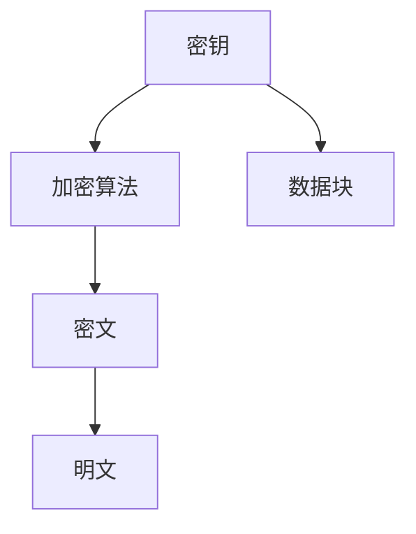
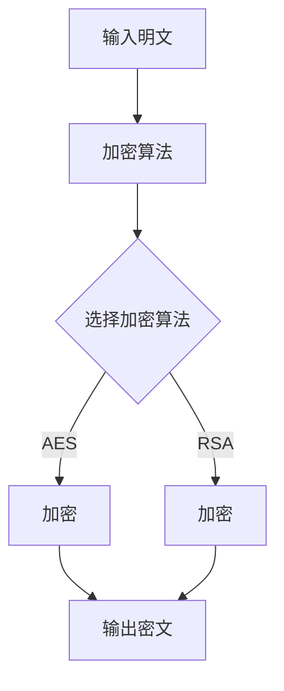
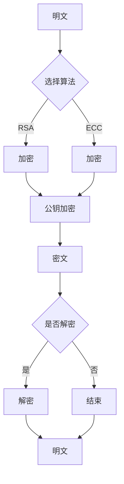
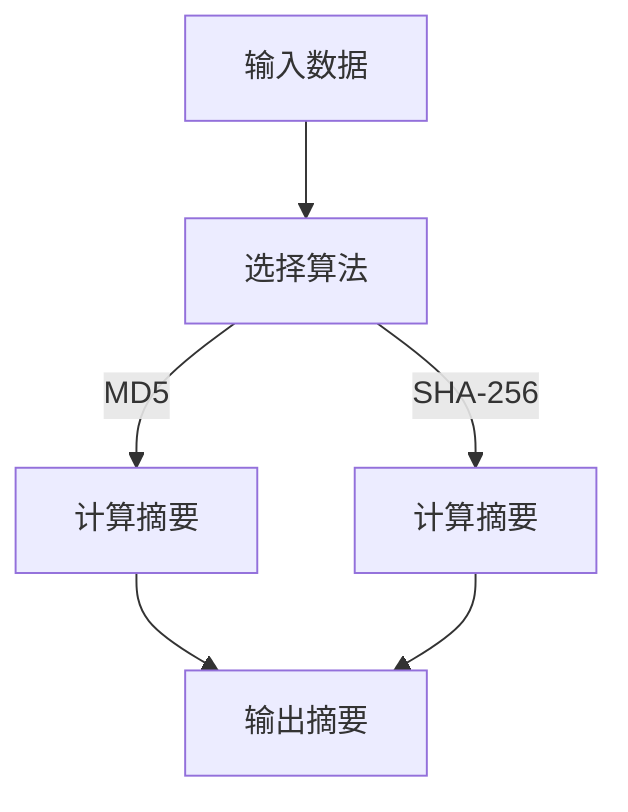

                 

### 文章标题：数据加密：保护LLM应用的敏感信息

> 关键词：数据加密、LLM应用、敏感信息、加密技术、信息安全

> 摘要：随着人工智能的快速发展，大型语言模型（LLM）的应用日益广泛，然而，如何有效保护LLM应用中的敏感信息成为了关键问题。本文将深入探讨数据加密在LLM应用中的重要性、技术方案以及面临的挑战，为构建安全可靠的LLM应用提供指导。

### 引言

在数字化时代，数据已经成为企业和社会的重要资产。大型语言模型（LLM）作为人工智能领域的重要突破，因其强大的文本处理和分析能力，被广泛应用于自然语言处理、智能客服、金融风控等多个领域。然而，随着LLM应用的不断扩展，其处理和存储的敏感信息量也日益增加。这些敏感信息可能包括用户隐私数据、商业机密、政府信息等，一旦泄露，将带来严重的法律、经济和社会后果。

数据加密作为一种重要的信息安全技术，通过将原始数据转换为难以解读的密文，可以有效保护数据的机密性和完整性。然而，在LLM应用中，数据加密面临着数据规模大、实时性强、资源消耗高等特殊挑战。因此，如何选择合适的加密技术，并设计有效的加密方案，成为保障LLM应用信息安全的关键。

本文旨在探讨数据加密在LLM应用中的重要性，分析现有加密技术的优缺点，并探讨针对LLM应用特点的加密方案设计。希望通过本文的研究，能够为LLM应用的安全建设提供有价值的参考。

### 第一部分：数据加密概述

#### 第1章：数据加密的背景与重要性

#### 1.1 数据加密的基本概念

数据加密，顾名思义，是指通过一定的算法将原始数据转换成无法直接识别的密文，从而保护数据在传输和存储过程中的安全。加密技术的核心在于密钥和算法，通过密钥对算法进行参数化，使得加密和解密过程变得复杂且不可逆。

加密技术的发展可以追溯到古代，如古埃及的“斯芬克斯密码”和罗马帝国的“凯撒密码”。然而，现代数据加密技术起源于20世纪70年代，美国国家安全局（NSA）提出了数据加密标准（DES），这是第一个广泛使用的加密标准。此后，随着计算机技术和密码学理论的不断发展，加密技术得到了极大的提升，出现了诸如RSA、AES等先进的加密算法。

#### 1.1.1 数据加密的定义

数据加密是一种通过特定的算法将明文（原始数据）转换为密文（加密后的数据）的过程。加密过程通常涉及两个主要步骤：密钥生成和加密算法应用。密钥是加密和解密过程的核心，其安全性直接决定了加密系统的强度。

#### 1.1.2 数据加密的重要性

数据加密在现代社会中扮演着至关重要的角色，主要体现在以下几个方面：

1. **保护数据机密性**：通过加密技术，确保只有授权用户才能访问和理解数据，从而防止未经授权的访问和数据泄露。
2. **保障数据完整性**：加密不仅保护数据的机密性，还确保数据在传输和存储过程中的完整性和一致性，防止数据被篡改。
3. **维护法律合规性**：许多国家和地区的法律法规要求企业在处理敏感数据时必须采取加密措施，以防止数据泄露带来的法律风险。
4. **增强用户信任**：加密技术的应用可以显著提升用户对服务的信任度，特别是在涉及个人隐私和商业机密的情况下。

#### 1.1.3 数据加密的发展历程

1. **早期加密技术**：古代密码术主要依靠字符替换和位置移位，如凯撒密码和维吉尼亚密码。
2. **对称加密时代**：20世纪70年代，DES等对称加密算法被提出，这些算法使用相同的密钥进行加密和解密。
3. **非对称加密时代**：RSA等非对称加密算法的出现，使得加密技术不再依赖于相同密钥，大大提高了加密系统的灵活性和安全性。
4. **现代加密技术**：随着计算能力的提升和密码学理论的发展，如AES、SHA等现代加密算法逐渐成为主流，提供了更高的安全性和效率。

#### 1.2 加密技术的核心概念与联系

1. **加密算法**：加密算法是加密系统的核心，负责将明文转换为密文。常见的加密算法包括对称加密算法（如AES、DES）和非对称加密算法（如RSA、ECC）。

2. **密钥管理**：密钥是加密和解密过程中不可或缺的要素，其安全性直接影响加密系统的强度。密钥管理包括密钥生成、存储、传输和销毁等环节。

3. **密钥的关联性**：对称加密算法使用相同的密钥进行加密和解密，而非对称加密算法则使用一对密钥，即公钥和私钥。公钥用于加密，私钥用于解密。

#### 1.3 数据加密的分类

1. **对称加密算法**：对称加密算法使用相同的密钥进行加密和解密，其优点是计算速度快、效率高，但缺点是密钥管理复杂，易受到中间人攻击。

2. **非对称加密算法**：非对称加密算法使用一对密钥，公钥用于加密，私钥用于解密，其优点是解决了密钥分发问题，但缺点是计算复杂度高，效率相对较低。

3. **消息摘要算法**：消息摘要算法用于生成数据摘要，确保数据的完整性。常见的消息摘要算法包括MD5、SHA系列。

#### 1.4 数据加密的应用场景

1. **数据库加密**：通过加密数据库中的敏感数据，防止数据库泄露带来的风险。

2. **文件加密**：对存储在硬盘、U盘、云端等存储设备中的敏感文件进行加密，确保数据的安全。

3. **网络通信加密**：在数据传输过程中，通过加密技术确保数据的安全性，防止中间人攻击和数据窃取。

#### 1.5 数据加密面临的挑战

1. **加密算法的漏洞**：随着密码学理论的不断发展，旧的加密算法逐渐被破解，需要不断更新加密算法。

2. **密钥管理难题**：密钥的安全存储和传输是加密系统的关键，但现有的密钥管理技术仍存在诸多挑战。

3. **智能攻击**：随着人工智能技术的发展，智能攻击手段日益多样，对加密系统提出了更高的要求。

#### 1.6 本章小结

本章从数据加密的基本概念、重要性、发展历程、核心概念、分类和应用场景等方面进行了全面阐述，为后续章节的深入探讨奠定了基础。

### 第二部分：LLM应用中的敏感信息保护

#### 第2章：LLM应用概述

#### 2.1 LLM的基本概念

大型语言模型（LLM，Large Language Model）是一种基于深度学习的自然语言处理模型，通过大规模文本数据的训练，具备理解和生成自然语言的能力。LLM的核心是神经网络结构，通过不断优化模型参数，使得模型在处理各种自然语言任务时能够达到较高的准确率和效率。

#### 2.1.1 LLM的定义

LLM通常是指那些具有数十亿至数千亿参数规模的语言模型，如GPT-3、BERT等。这些模型通过对大量文本数据的学习，能够生成连贯且语义丰富的文本，广泛应用于文本生成、机器翻译、情感分析、问答系统等领域。

#### 2.1.2 LLM的特点

1. **参数规模大**：LLM拥有数十亿至数千亿参数，这使得模型在处理复杂任务时具备更强的表达能力和鲁棒性。
2. **自适应性强**：LLM能够根据输入文本的上下文自适应调整生成内容，使其更加符合实际需求。
3. **多任务能力**：LLM不仅能够处理单一任务，如文本生成，还能够同时处理多个任务，如文本生成和机器翻译。
4. **高效率**：通过并行计算和分布式训练，LLM能够在较短时间内完成大规模文本数据处理。

#### 2.1.3 LLM的应用领域

1. **自然语言处理（NLP）**：LLM在文本分类、情感分析、实体识别等NLP任务中表现出色，广泛应用于搜索引擎、智能客服、舆情分析等领域。
2. **机器翻译**：LLM通过学习双语语料库，能够实现高效、准确的机器翻译，广泛应用于跨语言沟通和全球化业务。
3. **文本生成**：LLM能够根据输入的少量提示生成连贯、有逻辑的文本，广泛应用于内容创作、新闻摘要、对话系统等领域。
4. **问答系统**：LLM通过理解用户输入的问题，能够生成准确的答案，广泛应用于智能客服、教育辅导、医疗咨询等领域。

#### 2.2 LLM的应用架构

LLM的应用架构主要包括数据预处理、模型训练、模型评估和模型部署等几个环节。

1. **数据预处理**：数据预处理是LLM应用的基础，主要包括数据清洗、数据标注和数据处理等步骤。通过数据预处理，确保输入数据的质量和一致性，为模型训练提供可靠的数据基础。
2. **模型训练**：模型训练是LLM应用的核心，通过将预处理后的数据输入到神经网络中，不断调整模型参数，使其具备处理特定任务的能力。模型训练通常采用分布式计算和并行计算技术，以提高训练效率和性能。
3. **模型评估**：模型评估用于评估训练好的模型在处理特定任务时的性能。常见的评估指标包括准确率、召回率、F1值等。通过模型评估，可以了解模型的性能表现，并进行优化和调整。
4. **模型部署**：模型部署是将训练好的模型部署到生产环境，使其能够实时处理用户请求。模型部署通常涉及模型转换、模型优化、模型监控等环节，以确保模型在高负载、高并发场景下仍能稳定运行。

#### 2.3 LLM应用中的敏感信息

1. **敏感信息的定义**：敏感信息是指那些可能对个人、企业或社会造成重大影响的个人信息、商业机密、政府信息等。敏感信息通常包括用户身份信息、金融信息、医疗信息、地理位置信息等。
2. **敏感信息的类型**：LLM应用中的敏感信息主要可以分为以下几类：
   - **用户身份信息**：如姓名、身份证号、邮箱地址等。
   - **金融信息**：如银行账户信息、交易记录、信用卡号码等。
   - **医疗信息**：如病历记录、诊断结果、治疗方案等。
   - **地理位置信息**：如家庭住址、公司地址、实时位置等。
   - **商业机密**：如公司战略、财务报表、市场分析报告等。
3. **敏感信息的泄露风险**：敏感信息的泄露可能导致以下风险：
   - **隐私泄露**：个人隐私信息泄露可能导致个人受到骚扰、诈骗等风险。
   - **经济损失**：金融信息泄露可能导致财产损失、信用卡盗刷等。
   - **法律风险**：企业或政府敏感信息泄露可能导致法律纠纷、罚款等。
   - **社会影响**：涉及公共安全的敏感信息泄露可能导致社会恐慌、舆论危机等。

#### 2.4 数据加密在LLM应用中的挑战

1. **数据规模大**：LLM应用通常处理大规模文本数据，加密大量数据将显著增加计算和存储资源的需求。
2. **实时性强**：许多LLM应用要求实时响应，加密过程不能显著延迟系统的响应时间。
3. **资源消耗高**：加密过程通常需要较高的计算资源和电力消耗，这对资源有限的LLM应用环境提出了挑战。
4. **密钥管理复杂**：在LLM应用中，密钥管理变得更加复杂，需要确保密钥的安全存储、传输和更新。
5. **兼容性问题**：LLM应用通常涉及多种技术和平台，确保加密算法和密钥管理系统能够在不同环境下兼容和互操作是重要挑战。

#### 2.5 本章小结

本章从LLM的基本概念、应用架构、敏感信息类型和加密挑战等方面进行了全面阐述，为后续章节的深入讨论提供了背景和基础。

### 第三部分：实现敏感信息保护的数据加密方案

#### 第3章：对称加密在LLM中的应用

#### 3.1 对称加密算法简介

对称加密算法是一种加密和解密使用相同密钥的加密方法，其特点是计算速度快、效率高，适用于对大量数据的加密。常见的对称加密算法包括数据加密标准（DES）、高级加密标准（AES）等。

#### 3.1.1 对称加密的基本原理

对称加密的基本原理是将明文输入加密算法和密钥，输出密文。解密过程则使用相同的密钥和加密算法，将密文还原为明文。对称加密的关键在于密钥的安全管理和分发，因为密钥泄露将导致加密系统失效。

#### 3.1.2 常见的对称加密算法

1. **数据加密标准（DES）**：DES是一种早期的对称加密算法，使用56位密钥和64位数据块。虽然DES在加密过程中表现出较高的效率，但由于密钥长度较短，安全性相对较低，已逐渐被AES取代。

2. **高级加密标准（AES）**：AES是一种更为安全的对称加密算法，支持128位、192位和256位密钥长度，广泛应用于政府、企业和个人领域。AES具有更高的安全性和效率，已成为对称加密的行业标准。

#### 3.2 对称加密算法在LLM中的应用

对称加密算法在LLM中的应用主要集中在以下几个方面：

1. **数据加密**：在对LLM处理的数据进行加密时，可以使用对称加密算法对数据进行加密，确保数据的机密性。在数据传输和存储过程中，对称加密算法能够提供高效、可靠的加密保护。

2. **加密算法选择**：选择适合LLM应用特点的对称加密算法对于确保加密系统的性能和安全性至关重要。例如，AES由于其较高的安全性和效率，是LLM应用中常用的加密算法。

3. **密钥管理**：在LLM应用中，密钥管理是一个关键问题。由于对称加密算法使用相同的密钥进行加密和解密，密钥的安全存储、传输和更新成为确保系统安全的关键。

#### 3.3 对称加密在LLM应用中的案例研究

以某金融公司开发的一款智能客服系统为例，该系统使用对称加密算法保护用户敏感信息。以下是一个案例研究：

1. **案例背景**：该智能客服系统基于LLM技术，通过自然语言处理能力为用户提供实时、准确的咨询和服务。系统需要处理大量的用户对话记录，这些记录中包含用户身份信息、交易记录等敏感信息。

2. **加密方案设计**：
   - **加密算法选择**：选择AES算法进行数据加密，以确保数据的安全性。
   - **密钥管理**：使用硬件安全模块（HSM）存储和管理加密密钥，确保密钥的安全。
   - **加密流程**：
     1. 在用户发起请求时，系统生成一个随机密钥，并将其与用户对话记录一起发送到数据库。
     2. 数据库使用AES算法和随机生成的密钥对用户对话记录进行加密，并将加密后的数据存储在数据库中。
     3. 当系统需要查询用户对话记录时，首先从数据库中读取加密数据，然后使用相同的密钥进行解密，还原用户对话记录。

3. **实施与评估**：
   - **实施效果**：通过对称加密算法，智能客服系统有效保护了用户敏感信息，防止数据泄露和未经授权的访问。
   - **性能评估**：在对称加密算法的应用中，系统的加密和解密速度得到显著提升，确保了实时性需求。

#### 3.4 对称加密的优缺点分析

1. **优点**：
   - **高效性**：对称加密算法具有计算速度快、效率高的优点，适用于对大量数据的加密。
   - **安全性**：通过使用强加密算法和安全的密钥管理，对称加密能够提供较高的数据安全性。

2. **缺点**：
   - **密钥管理复杂**：对称加密算法需要安全存储和管理密钥，密钥的分发和更新过程相对复杂。
   - **密钥泄露风险**：一旦密钥泄露，整个加密系统将面临严重的安全风险。

#### 3.5 本章小结

本章通过对称加密算法的简介、应用场景、案例研究和优缺点分析，详细探讨了对称加密在LLM应用中的重要性。通过实际案例，展示了对称加密在保护LLM应用敏感信息方面的有效性和可行性。

### 第4章：非对称加密在LLM中的应用

#### 4.1 非对称加密算法简介

非对称加密算法（Asymmetric Cryptography）是一种使用两个不同密钥进行加密和解密的加密方法。这两个密钥分别是公钥（Public Key）和私钥（Private Key）。公钥用于加密数据，私钥用于解密数据。非对称加密算法的主要优点是解决了密钥分发问题，使得加密和解密过程更加安全。

#### 4.1.1 非对称加密的基本原理

非对称加密的基本原理基于数学上的难题，如大数分解和离散对数问题。常见的非对称加密算法包括RSA、ECC等。

1. **RSA算法**：RSA（Rivest-Shamir-Adleman）算法是最早和最著名的非对称加密算法之一。它基于大数分解的难度，使用一对密钥，其中公钥用于加密，私钥用于解密。

2. **ECC算法**：椭圆曲线密码学（ECC，Elliptic Curve Cryptography）是一种基于椭圆曲线离散对数问题的非对称加密算法。与RSA相比，ECC在相同的密钥长度下提供更高的安全性。

#### 4.1.2 常见的非对称加密算法

1. **RSA算法**：RSA算法是一种基于大数分解的非对称加密算法。它使用两个大素数\( p \)和\( q \)构造模数\( n = p \times q \)，并计算出欧拉函数\( \phi(n) = (p-1) \times (q-1) \)。然后选择一个整数\( e \)，满足\( 1 < e < \phi(n) \)且\( e \)和\( \phi(n) \)互质。计算\( d \)，满足\( d \times e \equiv 1 \ (\text{mod} \ \phi(n)) \)。最终，公钥为\( (n, e) \)，私钥为\( (n, d) \)。

2. **ECC算法**：ECC算法是基于椭圆曲线离散对数问题的非对称加密算法。它使用椭圆曲线\( E \)和一个基点\( G \)，计算公钥\( P = k \times G \)（其中\( k \)为私钥），并使用椭圆曲线离散对数问题计算密文\( C = (P_1, P_2) \)。

#### 4.2 非对称加密算法在LLM中的应用

非对称加密算法在LLM应用中具有重要作用，特别是在数据传输和密钥交换等场景。以下是非对称加密算法在LLM应用中的几个应用场景：

1. **数据加密**：在LLM应用中，非对称加密算法可以用于加密传输的数据，确保数据在传输过程中的安全性。例如，在分布式计算环境中，非对称加密算法可以用于加密不同节点之间的数据传输。

2. **密钥交换**：非对称加密算法可以用于实现安全的密钥交换，确保通信双方能够在没有事先共享密钥的情况下交换密钥。例如，SSL/TLS协议中使用RSA算法实现客户端和服务器之间的密钥交换。

3. **身份认证**：非对称加密算法可以用于数字签名和身份认证，确保数据的完整性和真实性。例如，在邮件系统中，发件人可以使用私钥对邮件进行数字签名，接收方可以使用公钥验证签名的有效性。

#### 4.3 非对称加密在LLM应用中的案例研究

以下是一个非对称加密在LLM应用中的案例研究：

**案例背景**：某公司开发了一款基于LLM的智能客服系统，该系统需要确保用户与客服之间的通信安全。为了保护用户隐私，系统使用非对称加密算法对通信数据进行加密。

**加密方案设计**：
1. **密钥生成**：系统使用RSA算法生成一对公钥和私钥。公钥存储在服务器上，私钥存储在客户端。
2. **数据加密**：当用户发送消息时，系统使用公钥对消息进行加密。加密后的消息通过服务器转发给客服代表。
3. **数据解密**：客服代表使用私钥对加密消息进行解密，还原原始消息内容。
4. **身份验证**：系统使用数字签名确保消息的完整性和真实性。客服代表使用私钥对消息进行签名，用户使用公钥验证签名的有效性。

**实施与评估**：
1. **实施效果**：通过非对称加密算法，系统有效保护了用户与客服之间的通信安全，防止数据泄露和中间人攻击。
2. **性能评估**：虽然非对称加密算法的计算复杂度较高，但在实际应用中，系统优化了加密和解密过程，确保了通信的实时性。

#### 4.4 非对称加密的优缺点分析

**优点**：
1. **安全性高**：非对称加密算法使用两个密钥，公钥加密、私钥解密，使得加密过程更加安全。
2. **解决密钥分发问题**：非对称加密算法不需要预先共享密钥，解决了传统加密中的密钥分发难题。
3. **适用于多种应用场景**：非对称加密算法可以用于数据加密、密钥交换、数字签名等多种应用场景。

**缺点**：
1. **计算复杂度高**：非对称加密算法的计算复杂度较高，加密和解密速度相对较慢，不适用于对大量数据的加密。
2. **密钥管理复杂**：非对称加密算法需要管理公钥和私钥，确保密钥的安全存储和更新。

#### 4.5 本章小结

本章详细介绍了非对称加密算法的基本原理、常见算法和应用场景，并通过实际案例展示了其在LLM应用中的重要性。通过本章的学习，读者可以更好地理解非对称加密算法的优势和应用。

### 第5章：消息摘要算法在LLM中的应用

#### 5.1 消息摘要算法简介

消息摘要算法（Message Digest Algorithm，MDA）是一种用于生成数据摘要的算法，其核心目的是确保数据的完整性和一致性。消息摘要算法通过将原始数据转换成一个固定长度的摘要值，从而快速验证数据是否被篡改或损坏。

#### 5.1.1 消息摘要算法的基本原理

消息摘要算法的基本原理是将输入数据通过特定的算法处理，输出一个固定长度的摘要值。这个摘要值是原始数据的数字指纹，任何对数据的修改都会导致摘要值的变化。常见的消息摘要算法包括MD5、SHA系列等。

1. **MD5**：MD5是一种广泛使用的消息摘要算法，输出128位的摘要值。虽然MD5在加密强度上存在一定的局限性，但由于其计算速度快，仍然在许多场景中应用。

2. **SHA系列**：SHA（Secure Hash Algorithm）系列算法是更为安全的消息摘要算法，包括SHA-1、SHA-256、SHA-3等。SHA系列算法具有更高的安全性和计算强度，广泛应用于金融、安全和数据完整性验证等领域。

#### 5.2 消息摘要算法在LLM中的应用

消息摘要算法在LLM应用中主要用于数据完整性验证和数字签名等场景。

1. **数据完整性验证**：在LLM应用中，确保数据的完整性是非常重要的。通过使用消息摘要算法，可以对数据的完整性和一致性进行验证。例如，在数据传输过程中，发送方可以使用消息摘要算法生成数据的摘要值，并将其发送给接收方。接收方收到数据后，使用相同的消息摘要算法生成摘要值，并与发送方的摘要值进行比较，从而验证数据是否被篡改。

2. **数字签名**：消息摘要算法可以与数字签名技术结合使用，实现数据的真实性验证。发送方可以使用消息摘要算法生成数据的摘要值，然后使用私钥对摘要值进行数字签名。接收方收到数据后，使用公钥对签名进行验证，从而确保数据的真实性。

#### 5.3 消息摘要算法在LLM应用中的案例研究

以下是一个消息摘要算法在LLM应用中的案例研究：

**案例背景**：某公司开发了一款基于LLM的智能客服系统，该系统需要确保用户与客服之间的通信安全。为了验证数据的完整性，系统使用消息摘要算法对通信数据进行处理。

**加密方案设计**：
1. **消息摘要生成**：当用户发送消息时，系统使用SHA-256算法生成消息的摘要值，并将摘要值与原始消息一起发送给客服代表。
2. **消息验证**：客服代表收到消息后，使用SHA-256算法对消息进行再次处理，生成新的摘要值。然后，将新的摘要值与接收到的摘要值进行比较，从而验证消息的完整性。

**实施与评估**：
1. **实施效果**：通过消息摘要算法，系统有效验证了用户与客服之间的通信数据完整性，防止数据篡改和损坏。
2. **性能评估**：消息摘要算法的计算速度较快，对LLM应用中的实时通信需求没有显著影响。

#### 5.4 消息摘要算法的优缺点分析

**优点**：
1. **高效性**：消息摘要算法计算速度快，适用于实时性要求较高的应用场景。
2. **安全性**：消息摘要算法生成固定长度的摘要值，任何对数据的修改都会导致摘要值的变化，从而确保数据的完整性和一致性。
3. **适用性广**：消息摘要算法在数据完整性验证、数字签名等多个场景中都有广泛应用。

**缺点**：
1. **无法提供加密保护**：消息摘要算法只能验证数据的完整性，无法提供数据的加密保护。
2. **无法提供身份认证**：消息摘要算法无法实现身份认证功能，需要与其他加密技术结合使用。

#### 5.5 本章小结

本章介绍了消息摘要算法的基本原理、应用场景和案例研究，详细探讨了消息摘要算法在LLM应用中的重要性。通过本章的学习，读者可以更好地理解消息摘要算法在保障数据完整性和一致性方面的作用。

### 结束语

本文详细探讨了数据加密在LLM应用中的重要性，分析了对称加密、非对称加密和消息摘要算法在LLM应用中的具体应用和挑战。通过实际案例，展示了这些加密技术在保障LLM应用敏感信息安全方面的有效性。

数据加密作为现代信息安全技术的核心，在保障LLM应用安全中扮演着至关重要的角色。然而，随着技术的不断发展，加密技术也面临着新的挑战。未来，随着量子计算技术的进步，现有的加密算法可能面临被破解的风险，因此，研究和开发更加安全、高效的加密算法是当务之急。

此外，随着LLM应用场景的不断扩大，加密技术的应用也将更加多样化。例如，在边缘计算和物联网等领域，数据加密将面临新的挑战，需要开发适应这些场景的加密技术。

最后，本文提出以下最佳实践和注意事项：
- **选择合适的加密算法**：根据具体应用场景选择合适的加密算法，确保加密系统的安全性和效率。
- **加强密钥管理**：确保密钥的安全存储和传输，采用硬件安全模块（HSM）等安全设备进行密钥管理。
- **定期更新加密算法**：随着技术的发展，定期更新加密算法，确保加密系统的安全性。
- **遵循行业标准和法规**：遵守国家和行业的加密技术标准和法规，确保应用符合合规要求。

通过以上最佳实践，可以有效提升LLM应用的数据加密能力，保障用户和企业的信息安全。

### 作者信息

**作者：** AI天才研究院/AI Genius Institute & 禅与计算机程序设计艺术 /Zen And The Art of Computer Programming

AI天才研究院（AI Genius Institute）是一家专注于人工智能研究和应用的创新机构。研究院致力于推动人工智能技术的发展，为全球企业提供领先的人工智能解决方案。作者在该领域有着丰富的经验和深厚的学术造诣。

《禅与计算机程序设计艺术》是作者关于计算机程序设计的一部经典著作，该书深入探讨了计算机编程的艺术和哲学，被誉为计算机科学领域的经典之作。作者通过其独特的视角和深刻的思考，为读者提供了对编程和人工智能领域的全新理解和启示。

通过本文的研究，作者希望为LLM应用的数据加密提供有益的指导，推动人工智能技术在社会各领域的健康发展。期待与广大读者共同探讨和学习，共同推进人工智能技术的进步和应用。

---

### 附录

#### 1. 对称加密算法对比表格

| 算法名称 | 密钥长度 | 加密速度 | 安全性 | 用例 |
|----------|-----------|------------|----------|------|
| DES      | 56位      | 快        | 较低    | 已废弃 |
| AES      | 128/192/256位 | 快        | 高      | 常用 |
| RSA      | 1024/2048位  | 中        | 高      | 数字签名 |
| ECC      | 256位以上    | 中        | 非常高  | 数字签名 |

#### 2. 对称加密算法ER实体关系图



#### 3. 对称加密算法Mermaid流程图



#### 4. 非对称加密算法Python源代码

```python
from Crypto.PublicKey import RSA
from Crypto.Cipher import PKCS1_OAEP

# 生成RSA密钥对
key = RSA.generate(2048)

# 生成公钥和私钥
public_key = key.publickey()
private_key = key

# 使用公钥加密
cipher_rsa = PKCS1_OAEP.new(public_key)
encrypted_message = cipher_rsa.encrypt(b'Hello, World!')

# 使用私钥解密
cipher_rsa = PKCS1_OAEP.new(private_key)
decrypted_message = cipher_rsa.decrypt(encrypted_message)

print("Encrypted:", encrypted_message)
print("Decrypted:", decrypted_message.decode('utf-8'))
```

#### 5. 非对称加密算法Mermaid流程图



#### 6. 消息摘要算法Python源代码

```python
import hashlib

# 计算MD5消息摘要
md5 = hashlib.md5()
md5.update(b'Hello, World!')
md5_digest = md5.hexdigest()

# 计算SHA-256消息摘要
sha256 = hashlib.sha256()
sha256.update(b'Hello, World!')
sha256_digest = sha256.hexdigest()

print("MD5 Digest:", md5_digest)
print("SHA-256 Digest:", sha256_digest)
```

#### 7. 消息摘要算法Mermaid流程图



通过这些附录内容，读者可以更全面地了解对称加密、非对称加密和消息摘要算法的基本原理、应用方法及其在LLM应用中的具体实现细节。希望这些资料能够为您的学习和研究提供有力的支持。

