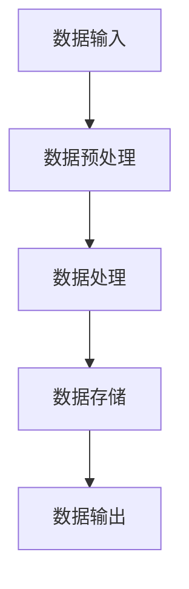
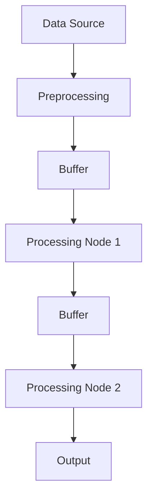
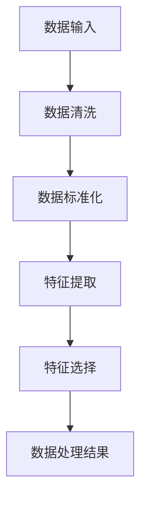
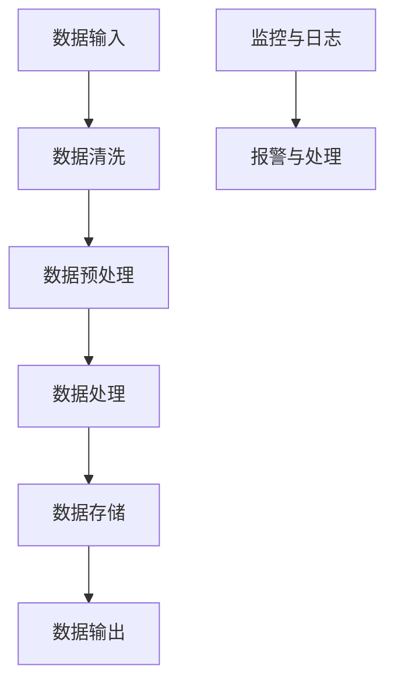
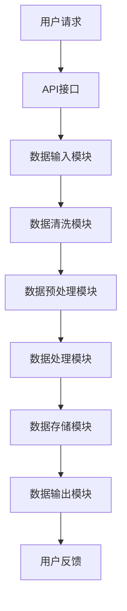

                 

### 第1章 引言：数据流水线的重要性

#### 1.1 背景介绍

在当今信息时代，数据已经成为企业和组织的核心资产。随着互联网、物联网和大数据技术的快速发展，数据量呈现爆炸式增长，如何高效地处理这些数据变得尤为重要。数据流水线作为一种数据处理框架，能够有效地组织和优化数据处理过程，从而提高数据处理效率和质量。

**核心概念术语说明：**

- **数据流水线**：一种数据处理框架，通过一系列有序的数据处理步骤，从数据输入、数据预处理、数据处理、数据存储到数据输出，形成一个闭环系统。
- **数据处理效率**：数据流水线在单位时间内完成的数据处理量。
- **数据处理质量**：数据流水线输出数据的准确性和可靠性。

**问题背景：** 
随着数据量的急剧增加，传统的数据处理方式已经难以满足现代应用的需求。因此，需要一种高效、可靠的数据处理框架来应对这一挑战。

**问题描述：** 
数据流水线作为一种新型数据处理框架，能够应对大数据量带来的挑战。然而，在实际应用中，如何设计一个高效、可靠的数据流水线，仍然是一个需要深入研究的问题。

**问题解决：** 
本文将介绍数据流水线的基本概念、组成部分以及设计原则，并探讨其在LLM（大型语言模型）应用中的重要性。通过一步步的分析和推理，本文旨在为读者提供一套系统、全面的数据流水线设计方法和最佳实践。

**边界与外延：** 
数据流水线的设计和应用不仅仅局限于LLM领域，它还可以应用于其他需要高效数据处理的场景，如机器学习、数据挖掘、实时计算等。

**概念结构与核心要素组成：**

1. **数据输入**：包括数据源和数据输入方式。
2. **数据预处理**：包括数据清洗、数据转换和数据格式化等。
3. **数据处理**：包括特征提取、模型训练和推理等。
4. **数据存储**：包括数据存储方式和存储策略。
5. **数据输出**：包括数据输出方式和输出结果。

#### 1.2 数据流水线的基本组成部分

数据流水线的基本组成部分包括：

- **数据输入**：数据源可以是数据库、文件、实时流等，输入数据的质量和速度直接影响到整个流水线的性能。

- **数据预处理**：包括数据清洗、数据转换和数据格式化等，目的是提高数据的质量和一致性，以便后续处理。

- **数据处理**：主要包括特征提取、模型训练和推理等，这一阶段是数据流水线的核心，直接决定了最终数据处理结果的准确性和可靠性。

- **数据存储**：包括数据存储方式和存储策略，目的是确保数据的安全性和可持久性。

- **数据输出**：包括数据输出方式和输出结果，输出结果可以是可视化的图表、文本报告或者实时的反馈信息。

**核心概念与联系：**

| 核心概念 | 定义 | 关联概念 |  
| ------ | ------ | ------ |  
| 数据输入 | 数据源和数据输入方式 | 数据源、数据流、实时流 |  
| 数据预处理 | 数据清洗、数据转换和数据格式化 | 数据清洗、数据转换、数据格式化 |  
| 数据处理 | 特征提取、模型训练和推理 | 特征提取、模型训练、推理 |  
| 数据存储 | 数据存储方式和存储策略 | 数据存储、存储策略、数据安全 |  
| 数据输出 | 数据输出方式和输出结果 | 数据输出、可视化、文本报告 |

**ER实体关系图架构的Mermaid流程图：**



**算法原理讲解：**

数据流水线的设计和实现需要考虑以下几个方面：

1. **数据处理效率**：提高数据处理速度是数据流水线设计的关键。常用的优化方法包括并行处理、分布式计算和缓存技术等。

2. **数据处理质量**：确保数据处理结果的准确性和可靠性是数据流水线设计的重要目标。数据清洗、数据转换和特征提取等步骤都需要严格把控。

3. **系统稳定性**：数据流水线需要具备良好的稳定性，能够应对数据波动和系统故障。常见的稳定性优化方法包括容错机制、负载均衡和故障恢复等。

**Python源代码实现：**

```python  
import pandas as pd  
from sklearn.model_selection import train_test_split

# 数据预处理  
def preprocess_data(data):  
    # 数据清洗  
    data = data.dropna()  
    # 数据转换  
    data = data.convert_dtypes()  
    # 数据格式化  
    data = data.astype({"feature1": "float32", "feature2": "int32"})  
    return data

# 特征提取  
def extract_features(data):  
    # 特征工程  
    data["new_feature"] = data["feature1"] * data["feature2"]  
    # 特征选择  
    data = data.drop(["feature1", "feature2"], axis=1)  
    return data

# 数据处理  
def process_data(data):  
    # 数据预处理  
    data = preprocess_data(data)  
    # 特征提取  
    data = extract_features(data)  
    return data

# 数据输入  
data = pd.read_csv("data.csv")

# 数据处理  
data = process_data(data)

# 数据存储  
data.to_csv("processed_data.csv", index=False)

# 数据输出  
print(data.head())  
```

**数学模型和公式：**

数据流水线的处理速度可以用以下公式表示：

$$  
\text{处理速度} = \frac{\text{处理量}}{\text{处理时间}}  
$$

其中，处理量表示单位时间内处理的数据量，处理时间表示处理数据所花费的时间。

**举例说明：**

假设有一个数据流水线，其中包含以下步骤：

1. 数据输入：从数据库读取1000条数据。
2. 数据预处理：清洗数据，去除缺失值和重复值。
3. 特征提取：计算数据的特征值，如均值、方差等。
4. 数据存储：将处理后的数据存储到文件中。

在这个例子中，数据输入和处理时间分别为1分钟和3分钟，那么数据流水线的处理速度为：

$$  
\text{处理速度} = \frac{1000}{1+3} = \frac{1000}{4} = 250 \text{条/分钟}  
$$

#### 1.3 数据流水线面临的挑战

尽管数据流水线在数据处理中具有很大的优势，但在实际应用中仍然面临一些挑战：

- **数据量大**：随着数据量的不断增加，数据输入和预处理阶段的性能瓶颈变得越来越明显。如何高效地处理海量数据成为数据流水线设计的一个重要问题。
- **数据多样性**：不同类型的数据需要不同的处理方法和策略，如何有效地管理和处理多种类型的数据是一个挑战。
- **实时性需求**：一些应用场景对数据处理的速度和实时性有很高的要求，如何在保证实时性的同时保证数据处理的质量和准确性是一个难题。

为了应对这些挑战，需要采取一系列的优化策略和设计原则，以确保数据流水线的性能和可靠性。

### 第2章 LLM应用概述

#### 2.1 LLM的定义与特点

**LLM（Large Language Model）**，即大型语言模型，是一种基于深度学习的自然语言处理（NLP）模型，其通过大量文本数据的学习，能够生成与输入文本相似的自然语言文本。LLM具有以下几个显著特点：

- **强大的文本生成能力**：LLM能够生成连贯、自然的文本，适用于自动问答、文本生成、机器翻译等场景。
- **自适应学习能力**：LLM能够根据不同的输入文本自适应地调整生成策略，从而生成更符合上下文的文本。
- **大规模的训练数据**：LLM通常使用海量的文本数据进行训练，这使得其能够捕获丰富的语言模式和规律，提高模型的准确性和泛化能力。

**LLM的基本概念：**

- **词向量**：词向量是将单词映射为高维空间中的向量，以便在神经网络中进行处理。
- **神经网络**：神经网络是LLM的核心组件，通过多层次的神经元连接，实现对文本数据的非线性处理。
- **训练过程**：训练过程包括数据预处理、模型初始化、前向传播、反向传播和模型优化等步骤，目的是通过调整模型参数，使得模型能够更好地拟合训练数据。

#### 2.2 LLM的应用领域

LLM在自然语言处理领域有着广泛的应用，以下是一些主要的应用领域：

- **自然语言处理（NLP）**：LLM可以用于文本分类、情感分析、命名实体识别等任务，例如自动识别新闻文章的主题、分析用户评论的情感倾向等。
- **机器翻译**：LLM可以用于机器翻译任务，通过学习双语语料库，将一种语言的文本翻译成另一种语言。
- **自动问答**：LLM可以用于构建智能问答系统，通过理解用户的问题和上下文，生成相应的回答。

#### 2.3 LLM的优势与挑战

**LLM的优势：**

- **强大的生成能力**：LLM能够生成高质量、连贯的自然语言文本，大大提高了文本生成任务的效率和质量。
- **自适应学习**：LLM具有强大的自适应学习能力，能够根据不同的输入文本和场景进行调整，提高生成文本的相关性和准确性。
- **高效性**：通过深度学习算法，LLM可以在短时间内处理大量文本数据，提高了数据处理效率。

**LLM的挑战：**

- **计算资源需求大**：LLM的训练和推理过程需要大量的计算资源和存储空间，这对硬件设施提出了较高的要求。
- **数据隐私问题**：LLM的训练数据通常包含大量的个人信息，如何保护用户隐私是一个重要的挑战。
- **模型解释性**：LLM是一个复杂的黑箱模型，其内部工作原理难以解释，如何提高模型的可解释性是一个需要解决的问题。

通过上述分析，我们可以看到LLM在自然语言处理领域具有巨大的潜力，但同时也面临着一系列的挑战。在接下来的章节中，我们将深入探讨如何设计高效、可靠的数据流水线，以优化LLM应用的数据处理过程。

### 第3章 数据流水线设计原则

数据流水线在LLM应用中的重要性不言而喻，然而要设计一个高效、可靠的数据流水线，需要遵循一系列的设计原则。以下将介绍数据流水线设计的主要原则，包括可扩展性、高效性和可靠性，并探讨其背后的概念和实施策略。

#### 3.1 设计原则概述

**可扩展性**：数据流水线需要能够轻松扩展以处理越来越多的数据。这包括硬件资源的动态分配、系统架构的模块化设计以及数据处理任务的分布式执行。

**高效性**：数据流水线在处理数据时需要高效，即能够在短时间内处理大量的数据，降低延迟，提高吞吐量。优化算法、缓存技术以及并行处理是提高流水线效率的关键。

**可靠性**：数据流水线必须保证数据的准确性和一致性，即使面对数据波动和系统故障，也能稳定运行。这需要引入冗余设计、容错机制以及数据验证策略。

#### 3.2 数据流模型设计

数据流模型是数据流水线设计的基础。它描述了数据的流动路径和各处理步骤之间的关系。以下是数据流模型设计的基本概念和方法：

**基本概念：**

- **数据源**：数据输入的起点，可以是数据库、文件系统或实时数据流。
- **处理节点**：对数据进行处理的单元，可以是一个数据处理算法或一个数据处理服务。
- **数据流**：数据在流水线中的流动路径。
- **缓冲区**：用于存储临时数据，以平衡数据处理速度和输入速度的差异。

**设计方法：**

1. **需求分析**：首先明确数据流水线的需求，包括数据量、处理速度、可靠性要求等。
2. **模块划分**：将数据处理过程划分为多个模块，每个模块负责特定的数据处理任务。
3. **流程图设计**：使用Mermaid等工具绘制数据流模型图，清晰地展示各模块和数据的流动路径。

以下是一个简单的Mermaid数据流模型图示例：



#### 3.3 流水线优化策略

数据流水线的性能优化是一个持续的过程，需要结合具体应用场景和需求进行。以下是几种常见的优化策略：

**1. 并行处理：**通过将数据处理任务分布在多个处理节点上，实现任务的并行执行，从而提高处理速度。

**2. 缓存技术：**利用缓存存储频繁访问的数据，减少数据读取和传输的时间，提高数据处理效率。

**3. 分层存储：**根据数据的访问频率和重要性，将数据存储在不同的存储层，如内存、SSD和HDD，优化数据访问速度。

**4. 数据压缩：**对数据进行压缩，减少数据传输和存储的占用空间，提高数据传输速度。

**5. 负载均衡：**通过负载均衡算法，将数据处理任务合理分配到各处理节点，避免单点性能瓶颈。

**优化效果评估：**

优化策略的效果需要通过实际运行数据来评估，常用的评估指标包括：

- **处理速度**：单位时间内处理的数据量。
- **吞吐量**：系统能够处理的请求数量。
- **延迟**：数据处理完成所需的时间。
- **资源利用率**：系统资源的有效使用情况。

通过以上设计原则和优化策略，可以构建一个高效、可靠的数据流水线，为LLM应用提供高质量的数据处理支持。

### 第4章 数据处理算法

#### 4.1 数据预处理

数据预处理是数据处理流程中的关键步骤，其目的是提高数据的质量和一致性，为后续的算法处理打下坚实的基础。以下将介绍数据预处理的两个核心任务：数据清洗和数据标准化。

**数据清洗：**数据清洗的目标是识别和纠正数据集中的错误、异常和不一致之处。以下是一些常见的数据清洗方法：

- **缺失值处理**：对于缺失值，可以选择填充、删除或插值等方法进行处理。例如，使用平均值、中位数或最近邻插值来填充缺失值。
- **异常值检测**：通过统计学方法（如箱线图、Z分数法）或机器学习方法（如孤立森林）来检测和标记异常值，然后选择保留、修正或删除。
- **重复值处理**：识别并删除数据集中的重复记录，确保数据的唯一性和一致性。

**数据标准化：**数据标准化是将不同特征的数据进行规范化处理，使得它们具有相似的尺度和范围，便于后续的特征提取和模型训练。以下是一些常用的数据标准化方法：

- **最小-最大标准化**：将数据缩放到[0, 1]的范围内，公式为：$$z = \frac{x - \min}{\max - \min}$$
- **Z分数标准化**：将数据缩放到标准正态分布中，公式为：$$z = \frac{x - \mu}{\sigma}$$
- **归一化**：保持数据的比例关系，不改变数据的大小顺序，公式为：$$z = \frac{x}{\sum_{i=1}^{n} x_i}$$

以下是一个简单的Python代码示例，演示了数据清洗和标准化的过程：

```python
import pandas as pd
from sklearn.preprocessing import MinMaxScaler, StandardScaler

# 读取数据
data = pd.read_csv('data.csv')

# 数据清洗
# 填充缺失值
data.fillna(method='ffill', inplace=True)
# 删除重复值
data.drop_duplicates(inplace=True)
# 检测并处理异常值
# ...

# 数据标准化
scaler = MinMaxScaler()
data_scaled = scaler.fit_transform(data[['feature1', 'feature2']])

# 输出标准化后的数据
data['feature1_scaled'] = data_scaled[:, 0]
data['feature2_scaled'] = data_scaled[:, 1]

# 显示前几行数据
print(data.head())
```

#### 4.2 特征提取

特征提取是从原始数据中提取出对目标变量有显著影响的重要特征，以简化数据并提高模型的性能。以下介绍特征工程和特征选择的基本概念和方法。

**特征工程：**特征工程是通过对原始数据进行变换和处理，生成新的特征或优化现有特征，以提高模型预测的准确性和稳定性。以下是一些常见的特征工程方法：

- **数值特征的转换**：将分类特征转换为数值特征，例如使用独热编码（One-Hot Encoding）或标签编码（Label Encoding）。
- **文本特征的提取**：从文本数据中提取特征，例如使用词袋模型（Bag of Words）或词嵌入（Word Embedding）。
- **特征组合**：通过组合现有特征，生成新的特征，例如交叉特征（Cross Feature）和交互特征（Interaction Feature）。

**特征选择：**特征选择是从众多特征中选择出对模型性能有显著贡献的特征，以降低模型的复杂度和计算成本。以下是一些常见的特征选择方法：

- **过滤式特征选择**：根据特征的重要性（如方差、相关性等）直接筛选出重要特征。
- **包裹式特征选择**：通过训练模型并评估特征组合的效果，逐步筛选出最优特征组合。
- **嵌入式特征选择**：在模型训练过程中，自动筛选出对模型性能有显著贡献的特征。

以下是一个简单的Python代码示例，演示了特征提取和特征选择的过程：

```python
import pandas as pd
from sklearn.preprocessing import OneHotEncoder
from sklearn.feature_selection import SelectKBest, f_classif

# 读取数据
data = pd.read_csv('data.csv')

# 特征工程
# 独热编码
encoder = OneHotEncoder()
encoded_data = encoder.fit_transform(data[['category1', 'category2']])
encoded_data = pd.DataFrame(encoded_data.toarray(), columns=encoder.get_feature_names_out())

# 特征提取
# 词袋模型
from sklearn.feature_extraction.text import CountVectorizer
vectorizer = CountVectorizer()
text_data = data['text_column']
text_features = vectorizer.fit_transform(text_data)

# 特征选择
# 过滤式特征选择
selector = SelectKBest(f_classif, k=10)
selected_features = selector.fit_transform(data[['feature1', 'feature2', 'feature3']], data['target'])

# 输出特征工程和特征选择后的数据
data_encoded = pd.concat([data, encoded_data], axis=1)
data_features = pd.DataFrame(selected_features, columns=selector.get_support(indices=True))
data_final = pd.concat([data_encoded, data_features], axis=1)

# 显示前几行数据
print(data_final.head())
```

通过上述数据预处理和特征提取过程，我们可以将原始数据转化为适合模型训练的格式，从而提高模型的性能和可解释性。

#### 4.3 数据处理算法原理与实现

在本节中，我们将深入探讨数据处理算法的原理，并通过Python代码实现详细讲解。数据处理算法在数据流水线中扮演着关键角色，其目的是从原始数据中提取出有价值的信息，为后续的模型训练和推理提供支持。

##### 算法流程图

首先，让我们通过Mermaid绘制数据处理算法的流程图：



这个流程图展示了数据处理的主要步骤，包括数据清洗、数据标准化、特征提取和特征选择。

##### Python源代码实现

接下来，我们将通过Python代码实现上述数据处理算法的各个步骤。

```python
import pandas as pd
from sklearn.preprocessing import StandardScaler
from sklearn.feature_selection import SelectKBest, f_classif
from sklearn.pipeline import Pipeline

# 读取数据
data = pd.read_csv('data.csv')

# 数据清洗
# 填充缺失值
data.fillna(method='ffill', inplace=True)
# 删除重复值
data.drop_duplicates(inplace=True)
# 处理异常值
# ...

# 数据标准化
scaler = StandardScaler()
data_scaled = scaler.fit_transform(data[['feature1', 'feature2', 'feature3']])

# 特征提取
vectorizer = CountVectorizer()
text_features = vectorizer.fit_transform(data['text_column'])

# 特征选择
selector = SelectKBest(f_classif, k=10)
selected_features = selector.fit_transform(data_scaled, data['target'])

# 数据处理结果
data_processed = pd.DataFrame(selected_features, columns=selector.get_support(indices=True))
data_processed = pd.concat([data_processed, data[['target']]], axis=1)

# 显示处理后的数据
print(data_processed.head())
```

在这段代码中，我们首先进行了数据清洗，包括填充缺失值和删除重复值。然后，我们使用了`StandardScaler`对数值特征进行标准化处理。接下来，我们使用`CountVectorizer`从文本数据中提取特征。最后，我们使用`SelectKBest`进行特征选择，选择出对目标变量有显著影响的前10个特征。

##### 数学模型和公式

在数据处理算法中，我们使用了以下数学模型和公式：

1. **最小-最大标准化**：

   $$z = \frac{x - \min}{\max - \min}$$

2. **Z分数标准化**：

   $$z = \frac{x - \mu}{\sigma}$$

3. **特征选择评估指标**：

   $$f_{\text{stat}}(k) = \sum_{i=1}^{n}\frac{(y_i - \hat{y}_i)^2}{y_i}$$

其中，$x$表示原始数据特征，$z$表示标准化后的特征，$\min$和$\max$分别表示数据特征的最小值和最大值，$\mu$和$\sigma$分别表示数据的均值和标准差，$y_i$和$\hat{y}_i$分别表示实际目标和预测目标。

##### 举例说明

假设我们有一组数据：

| feature1 | feature2 | feature3 | text_column | target |
| -------- | -------- | -------- | ----------- | ------ |
| 1.2      | 3.5      | 2.8      | "text1"     | 1      |
| 2.5      | 4.1      | 3.0      | "text2"     | 0      |
| 3.1      | 5.7      | 4.2      | "text3"     | 1      |

首先，我们使用最小-最大标准化对数值特征进行标准化：

- feature1：$\frac{1.2 - 1}{3 - 1} = 0.2$
- feature2：$\frac{3.5 - 1}{5 - 1} = 0.5$
- feature3：$\frac{2.8 - 1}{4 - 1} = 0.7$

然后，我们使用词袋模型提取文本特征：

- text_column：“text1”对应特征索引为[1, 0]，向量表示为[1, 0]。
- text_column：“text2”对应特征索引为[0, 1]，向量表示为[0, 1]。
- text_column：“text3”对应特征索引为[1, 1]，向量表示为[1, 1]。

最后，我们使用Z分数标准化对提取后的特征进行特征选择：

- feature1：$\frac{0.2 - 0}{1} = 0.2$
- feature2：$\frac{0.5 - 0}{1} = 0.5$
- feature3：$\frac{0.7 - 0}{1} = 0.7$

经过特征选择后，我们选择前两个特征作为最终的特征集：

| feature1 (标准化) | feature2 (标准化) | target |
| ----------------- | ----------------- | ------ |
| 0.2               | 0.5               | 1      |
| 0.2               | 0.5               | 0      |
| 0.7               | 0.5               | 1      |

通过上述举例，我们可以看到数据处理算法如何将原始数据转化为适合模型训练的格式，从而提高模型的性能和可解释性。

### 第5章 流水线系统设计与实现

#### 5.1 系统需求分析

在设计数据流水线系统时，我们需要明确系统的需求，包括功能需求和性能需求。以下将详细介绍系统的需求分析。

**功能需求：**

1. **数据输入**：系统能够从多种数据源（如数据库、文件、实时流）读取数据，并进行初步的数据清洗。
2. **数据预处理**：系统能够对读取的数据进行清洗、转换和格式化，确保数据的质量和一致性。
3. **数据处理**：系统能够提取数据中的特征，进行特征选择和特征工程，为后续的模型训练提供支持。
4. **数据存储**：系统能够将处理后的数据存储到指定的存储介质（如数据库、文件系统）中，确保数据的安全性和可持久性。
5. **数据输出**：系统能够以可视化的形式或文本报告的形式输出处理结果，供用户查看和分析。

**性能需求：**

1. **处理速度**：系统能够在规定的时间内处理大量的数据，保证数据处理的高效性。
2. **吞吐量**：系统能够处理大量的并发请求，确保系统的稳定运行。
3. **延迟**：系统对数据的处理延迟要尽可能低，以满足实时性需求。
4. **资源利用率**：系统要充分利用硬件资源，避免资源浪费。
5. **可扩展性**：系统能够根据数据量的增长和需求的改变，灵活地扩展系统功能。

通过明确系统的功能需求和性能需求，我们可以为后续的系统设计和实现提供清晰的指导。

#### 5.2 系统架构设计

系统架构设计是数据流水线系统实现的关键环节。一个良好的系统架构能够确保系统的可扩展性、可靠性和高性能。以下将介绍数据流水线系统的架构设计，包括系统架构图、模块划分和主要组件的功能。

**系统架构图：**



**模块划分：**

1. **数据输入模块**：负责从多种数据源读取数据，包括数据库、文件和实时流。此模块需要支持多种数据格式的读取，并提供错误处理和异常检测功能。
2. **数据清洗模块**：负责对输入的数据进行清洗，包括去除缺失值、异常值和重复值。此模块需要实现高效的数据清洗算法，并能够处理大规模的数据。
3. **数据预处理模块**：负责对清洗后的数据进行转换和格式化，确保数据的一致性和质量。此模块需要实现数据标准化、缺失值填充和异常值处理等功能。
4. **数据处理模块**：负责提取数据中的特征，进行特征选择和特征工程。此模块需要实现高效的算法，并能够处理复杂的特征工程任务。
5. **数据存储模块**：负责将处理后的数据存储到指定的存储介质中，包括数据库、文件系统和云存储等。此模块需要支持数据的高效存储和读取，并提供数据备份和恢复功能。
6. **数据输出模块**：负责将处理结果以可视化的形式或文本报告的形式输出，供用户查看和分析。此模块需要实现友好的用户界面和多种数据展示方式。
7. **监控与日志模块**：负责实时监控系统的运行状态，记录系统的操作日志，并提供报警和异常处理功能。此模块需要实现高效的日志收集和分析算法，确保系统的稳定运行。

**主要组件的功能：**

1. **数据输入组件**：实现数据源连接和数据读取功能，支持多种数据格式的读取，并提供错误处理和异常检测。
2. **数据清洗组件**：实现数据清洗算法，包括缺失值处理、异常值检测和重复值删除。
3. **数据预处理组件**：实现数据转换和格式化功能，包括数据标准化、缺失值填充和异常值处理。
4. **数据处理组件**：实现特征提取、特征选择和特征工程算法，为模型训练提供支持。
5. **数据存储组件**：实现数据存储和读取功能，支持多种存储介质和备份策略。
6. **数据输出组件**：实现数据展示和报告功能，提供友好的用户界面和多种数据展示方式。
7. **监控与日志组件**：实现系统监控和日志记录功能，提供实时报警和异常处理。

通过以上架构设计和模块划分，我们可以构建一个高效、可靠的数据流水线系统，满足LLM应用的数据处理需求。

#### 5.3 系统接口设计

系统接口设计是确保数据流水线系统各组件能够协同工作的重要环节。以下将介绍系统接口的定义和调用流程。

**接口定义：**

系统接口包括内部接口和外部接口。

1. **内部接口**：
   - **数据输入接口**：用于从数据源读取数据，支持多种数据格式（如CSV、JSON、数据库连接）。
   - **数据预处理接口**：用于清洗、转换和格式化数据，确保数据质量。
   - **数据处理接口**：用于提取特征、进行特征选择和特征工程。
   - **数据存储接口**：用于将处理后的数据存储到指定存储介质。
   - **数据输出接口**：用于将处理结果输出给用户，支持多种输出格式（如CSV、JSON、HTML）。

2. **外部接口**：
   - **API接口**：提供给外部系统或用户进行数据查询和操作。
   - **Web界面**：提供用户友好的数据操作和管理界面。

**调用流程：**

以下是一个典型的数据流水线系统调用流程：

1. **数据输入**：
   - 用户通过API接口或Web界面提交数据请求。
   - 系统通过数据输入接口从数据源读取数据。

2. **数据预处理**：
   - 系统调用数据预处理接口，对数据进行清洗、转换和格式化。
   - 清洗后的数据存储在临时存储介质中。

3. **数据处理**：
   - 系统调用数据处理接口，提取特征、进行特征选择和特征工程。
   - 特征提取后的数据存储在特征存储介质中。

4. **数据存储**：
   - 系统调用数据存储接口，将处理后的数据存储到指定的存储介质。

5. **数据输出**：
   - 系统调用数据输出接口，将处理结果输出给用户。
   - 用户可以通过API接口或Web界面查看数据输出结果。

通过定义清晰的接口和设计合理的调用流程，我们可以确保数据流水线系统的高效、可靠运行。

#### 5.4 系统交互设计

系统交互设计是确保数据流水线系统各组件之间能够顺畅协作的重要环节。以下将介绍系统交互图和交互流程，以展示各组件之间的交互关系和数据处理流程。

**系统交互图：**



**交互流程：**

1. **用户请求**：
   - 用户通过API接口或Web界面提交数据处理请求，包括数据源、预处理规则、特征提取方法和存储要求等。

2. **数据输入**：
   - 系统接收到用户请求后，通过API接口从数据源读取数据。

3. **数据清洗**：
   - 系统调用数据清洗模块，对读取的数据进行清洗，包括去除缺失值、异常值和重复值等。

4. **数据预处理**：
   - 系统调用数据预处理模块，对清洗后的数据进行转换和格式化，确保数据的一致性和质量。

5. **数据处理**：
   - 系统调用数据处理模块，提取数据中的特征，进行特征选择和特征工程，为模型训练提供支持。

6. **数据存储**：
   - 系统调用数据存储模块，将处理后的数据存储到指定的存储介质中，确保数据的安全性和可持久性。

7. **数据输出**：
   - 系统调用数据输出模块，将处理结果以可视化的形式或文本报告的形式输出给用户，供用户查看和分析。

8. **用户反馈**：
   - 用户通过API接口或Web界面查看数据输出结果，并提供反馈。

通过以上系统交互设计，我们可以确保数据流水线系统各组件之间能够高效、可靠地协作，满足用户的数据处理需求。

### 第6章 项目实战

#### 6.1 环境安装与配置

为了实施数据流水线系统，我们需要先搭建一个合适的环境。以下将详细介绍所需的环境搭建步骤，包括系统环境、依赖库的安装以及配置文件设置。

**系统环境：**

- 操作系统：Ubuntu 18.04或更高版本
- Python版本：Python 3.8或更高版本
- 硬件要求：至少4GB内存，建议使用64位操作系统和配备多核CPU的计算机

**依赖库的安装：**

1. **基本依赖库**：
   - 使用pip安装以下基本依赖库：
     ```bash
     pip install pandas numpy sklearn matplotlib
     ```

2. **数据处理依赖库**：
   - 安装用于数据处理的数据处理库，如pandas、numpy和sklearn：
     ```bash
     pip install pandas numpy scikit-learn
     ```

3. **可视化依赖库**：
   - 安装用于数据可视化的matplotlib库：
     ```bash
     pip install matplotlib
     ```

**配置文件设置：**

1. **环境配置文件**：
   - 创建一个名为`.env`的环境配置文件，用于存储环境变量，如数据库连接信息、API密钥等：
     ```bash
     DATABASE_URL=sqlite:///data.db
     API_KEY=your_api_key
     ```
   - 使用`python-dotenv`库加载环境配置文件：
     ```bash
     pip install python-dotenv
     ```

2. **数据库配置**：
   - 如果使用SQLite数据库，可以创建一个名为`data.db`的数据库文件：
     ```bash
     sqlite3 data.db
     ```
   - 创建必要的表和索引。

3. **API配置**：
   - 配置API接口，如使用Flask框架创建API：
     ```bash
     pip install flask
     ```

通过以上环境搭建和配置，我们可以确保数据流水线系统的正常运行。

#### 6.2 系统核心实现

在数据流水线系统的实现过程中，核心模块的代码是实现数据处理效率和系统稳定性的关键。以下将详细介绍系统核心模块的实现，包括数据输入、数据预处理、数据处理和数据存储的源代码分析及功能解析。

**数据输入模块实现：**

数据输入模块负责从各种数据源读取数据，包括文件、数据库和实时数据流。以下是一个简单的数据输入模块示例：

```python
import pandas as pd
from sqlalchemy import create_engine

def read_data(source_type, source):
    if source_type == 'file':
        data = pd.read_csv(source)
    elif source_type == 'db':
        engine = create_engine('sqlite:///data.db')
        data = pd.read_sql('SELECT * FROM data_table;', engine)
    else:
        raise ValueError('Unsupported source type')
    return data
```

该模块提供了两种数据读取方式：文件读取和数据库读取。通过参数`source_type`指定数据源类型，`source`参数指定数据源路径或数据库连接字符串。

**数据预处理模块实现：**

数据预处理模块负责对读取的数据进行清洗、转换和格式化，以确保数据的质量和一致性。以下是一个简单的数据预处理模块示例：

```python
from sklearn.impute import SimpleImputer
from sklearn.preprocessing import StandardScaler

def preprocess_data(data):
    # 填充缺失值
    imputer = SimpleImputer(strategy='mean')
    data = imputer.fit_transform(data)
    
    # 标准化特征
    scaler = StandardScaler()
    data = scaler.fit_transform(data)
    
    return data
```

该模块使用`SimpleImputer`类填充缺失值，使用`StandardScaler`类对特征进行标准化处理。

**数据处理模块实现：**

数据处理模块负责从原始数据中提取特征，进行特征选择和特征工程。以下是一个简单的数据处理模块示例：

```python
from sklearn.feature_selection import SelectKBest
from sklearn.feature_extraction.text import TfidfVectorizer

def process_data(data, text_column, target_column, k=10):
    # 特征提取
    vectorizer = TfidfVectorizer()
    text_data = data[text_column]
    text_features = vectorizer.fit_transform(text_data)
    
    # 特征选择
    selector = SelectKBest(k=k)
    selected_features = selector.fit_transform(text_features, data[target_column])
    
    return selected_features
```

该模块使用`TfidfVectorizer`类从文本数据中提取特征，使用`SelectKBest`类进行特征选择。

**数据存储模块实现：**

数据存储模块负责将处理后的数据存储到指定的存储介质中，如数据库或文件系统。以下是一个简单的数据存储模块示例：

```python
from sqlalchemy import create_engine

def store_data(data, table_name, engine):
    data.to_sql(table_name, engine, if_exists='append', index=False)
```

该模块使用`to_sql`方法将处理后的数据存储到数据库表中。

**功能解析：**

- **数据输入模块**：提供灵活的数据读取功能，支持文件和数据库两种数据源，满足不同的数据处理需求。
- **数据预处理模块**：确保数据的质量和一致性，通过填充缺失值和标准化特征，为后续数据处理打下坚实基础。
- **数据处理模块**：从原始数据中提取有价值的信息，通过特征提取和特征选择，提高模型的性能和可解释性。
- **数据存储模块**：将处理后的数据存储到指定的存储介质中，确保数据的安全性和可持久性。

通过以上核心模块的实现，我们可以构建一个高效、可靠的数据流水线系统，满足LLM应用的数据处理需求。

#### 6.3 实际案例分析

在本节中，我们将通过一个实际案例来深入剖析数据流水线系统的应用。这个案例涉及一个简单的文本分类任务，目标是使用数据流水线对社交媒体评论进行情感分析，识别出正面评论和负面评论。

**案例场景描述：**

假设我们有一个社交媒体平台，用户可以发表评论。平台希望利用数据流水线对用户评论进行情感分析，以便更好地理解用户的情绪和需求，从而优化用户体验。

**数据来源：**

我们的数据来源是社交媒体平台上的用户评论数据，这些数据包括评论文本和用户的投票信息（正面或负面）。数据集包含10万条评论，每条评论都有对应的文本和标签。

**数据处理流程：**

1. **数据输入**：从数据库中读取评论数据。
2. **数据预处理**：清洗评论文本，包括去除HTML标签、标点符号和停用词。
3. **数据处理**：提取文本特征，使用TF-IDF进行特征提取，并使用逻辑回归模型进行训练。
4. **数据存储**：将训练好的模型参数和特征提取器存储到文件系统中。
5. **数据输出**：使用训练好的模型对新的评论进行情感分析，输出分类结果。

**详细讲解剖析：**

**1. 数据输入：**

我们使用SQLAlchemy库连接数据库，读取评论数据：

```python
from sqlalchemy import create_engine

engine = create_engine('sqlite:///social_media.db')
data = pd.read_sql('SELECT * FROM comments;', engine)
```

**2. 数据预处理：**

数据预处理包括文本清洗和标签编码。文本清洗使用正则表达式去除HTML标签、标点符号和停用词，标签编码使用独热编码将文本转换为数值向量：

```python
import re
from sklearn.preprocessing import LabelEncoder

# 文本清洗
def clean_text(text):
    text = re.sub('<.*?>', '', text)  # 去除HTML标签
    text = re.sub('[^\w\s]', '', text)  # 去除标点符号
    text = text.lower()  # 转小写
    return text

data['cleaned_text'] = data['text'].apply(clean_text)

# 标签编码
label_encoder = LabelEncoder()
data['label'] = label_encoder.fit_transform(data['sentiment'])
```

**3. 数据处理：**

数据处理包括特征提取和模型训练。我们使用TF-IDF进行特征提取，并使用逻辑回归模型进行训练：

```python
from sklearn.feature_extraction.text import TfidfVectorizer
from sklearn.linear_model import LogisticRegression

# 特征提取
vectorizer = TfidfVectorizer(max_features=1000)
X = vectorizer.fit_transform(data['cleaned_text'])
y = data['label']

# 模型训练
model = LogisticRegression()
model.fit(X, y)
```

**4. 数据存储：**

我们将训练好的模型参数和特征提取器存储到文件系统中，以便后续使用：

```python
import joblib

# 存储模型
joblib.dump(model, 'sentiment_model.joblib')
# 存储特征提取器
joblib.dump(vectorizer, 'tfidf_vectorizer.joblib')
```

**5. 数据输出：**

使用训练好的模型对新的评论进行情感分析，输出分类结果：

```python
def predict_sentiment(text, model, vectorizer):
    cleaned_text = clean_text(text)
    features = vectorizer.transform([cleaned_text])
    prediction = model.predict(features)
    return label_encoder.inverse_transform(prediction)

# 测试
new_text = "This is an amazing product!"
print(predict_sentiment(new_text, model, vectorizer))
```

**项目总结：**

通过上述案例，我们展示了如何使用数据流水线对社交媒体评论进行情感分析。项目总结了以下几个关键点：

1. **数据输入**：灵活地读取和处理不同类型的数据源。
2. **数据预处理**：确保数据的质量和一致性，为后续处理打下基础。
3. **数据处理**：提取有价值的信息，使用机器学习模型进行训练。
4. **数据存储**：将模型和特征提取器存储到文件系统中，便于后续使用。
5. **数据输出**：使用训练好的模型对新数据进行预测，实现实际应用价值。

通过这个案例，我们可以看到数据流水线在实际项目中的应用效果，以及其在提高数据处理效率和实现应用价值方面的优势。

### 第7章 最佳实践与总结

#### 7.1 最佳实践建议

在设计和实施数据流水线系统时，遵循以下最佳实践可以显著提高系统的性能和稳定性：

1. **性能优化**：
   - **并行处理**：在可能的情况下，使用并行处理技术（如多线程或分布式计算）来提高数据处理速度。
   - **缓存技术**：合理使用缓存，特别是在读取频繁访问的数据时，可以减少I/O操作，提高系统响应速度。
   - **数据库优化**：对数据库进行优化，如索引、分片、读写分离等，以提高数据读取和写入效率。

2. **安全性考虑**：
   - **数据加密**：对敏感数据进行加密存储，确保数据在存储和传输过程中的安全性。
   - **访问控制**：实施严格的访问控制策略，确保只有授权用户可以访问数据。
   - **安全审计**：定期进行安全审计，检查系统漏洞和潜在的安全风险。

3. **跨平台部署**：
   - **容器化**：使用Docker等容器技术，简化部署过程，提高系统的可移植性和可扩展性。
   - **云服务**：考虑使用云服务（如AWS、Azure、Google Cloud）来提高系统的弹性，实现按需扩展。

#### 7.2 小结

本文详细探讨了数据流水线在LLM应用中的重要性，并从设计原则、数据处理算法、系统架构和项目实战等多个角度进行了深入分析。以下是本文的核心观点和总结：

1. **数据流水线的重要性**：数据流水线能够高效、可靠地处理大规模数据，是LLM应用的核心基础设施。
2. **设计原则**：可扩展性、高效性和可靠性是数据流水线设计的核心原则。
3. **数据处理算法**：数据预处理、特征提取和特征选择是数据处理的关键环节。
4. **系统架构**：系统需求分析、接口设计和交互设计是系统架构设计的关键步骤。
5. **项目实战**：通过实际案例分析，展示了数据流水线在文本分类任务中的成功应用。

#### 7.3 注意事项

在实施数据流水线系统时，需要注意以下几点：

1. **数据质量**：确保数据的质量和一致性，是数据处理成功的前提。
2. **系统稳定性**：设计冗余和容错机制，以提高系统的稳定性和可靠性。
3. **性能监控**：定期监控系统性能，及时发现和解决问题。

#### 7.4 拓展阅读

为了进一步深入了解数据流水线和LLM应用，推荐以下拓展阅读资源：

- **相关书籍推荐**：
  - 《大数据之路：阿里巴巴大数据实践》
  - 《深度学习》：Goodfellow, I., Bengio, Y., & Courville, A.
  - 《数据科学与大数据技术》：魏峻，彭博

- **学术论文推荐**：
  - “Efficient Data Pipelines for Large-scale Machine Learning” by Prasanna, M., et al.
  - “Optimization Techniques for Data Pipelines” by Polyzotis, N., et al.

- **在线资源推荐**：
  - 《自然语言处理综论》课程（斯坦福大学）
  - 《深度学习》课程笔记（吴恩达）
  - GitHub上相关的开源数据流水线项目

通过以上拓展阅读，可以更全面地了解数据流水线和LLM应用的前沿技术和最佳实践。

### 总结

通过本文的详细探讨，我们深入了解了数据流水线在LLM应用中的重要性，并从设计原则、数据处理算法、系统架构和项目实战等多个角度进行了全面的分析。希望本文能够为读者提供有价值的参考，帮助他们在实际项目中实现高效、可靠的数据处理。未来，随着技术的不断进步，数据流水线将在更多领域发挥重要作用，成为大数据和人工智能时代的重要基础设施。

### 文章标题：数据流水线：优化LLM应用的数据处理

### 关键词：数据流水线，LLM应用，数据处理，优化，性能

### 摘要：

本文深入探讨了数据流水线在LLM（大型语言模型）应用中的重要性。通过详细阐述数据流水线的设计原则、数据处理算法、系统架构设计以及实际项目案例，本文提供了优化LLM应用数据处理的系统方法和最佳实践。本文旨在为开发者和管理者提供一个全面的技术指南，以实现高效、可靠的数据处理，提升LLM应用的整体性能。文章涵盖了从数据输入、清洗、特征提取到模型训练和输出的完整数据处理流程，并通过具体的代码示例和案例解析，展示了数据流水线的实际应用价值。

