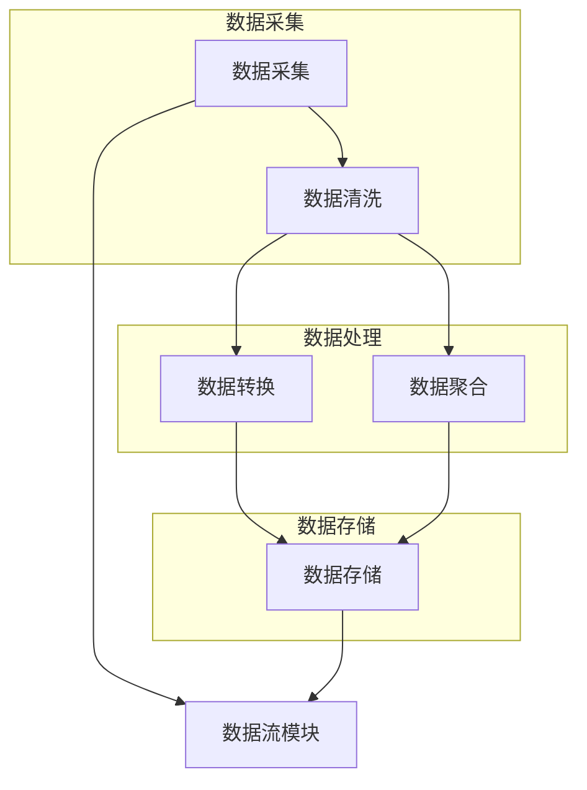
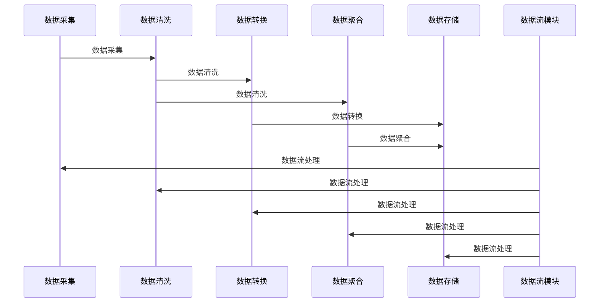

                 

### 文章标题

# 数据流水线：支撑LLM应用快速迭代的关键环节

### 关键词

- 数据流水线
- 大型语言模型（LLM）
- 快速迭代
- 数据管理
- 算法优化

### 摘要

本文旨在探讨数据流水线在支撑大型语言模型（LLM）应用快速迭代中的关键作用。首先，我们将介绍数据流水线的背景、核心概念及重要性。接着，通过系统分析，详细阐述数据流水线的设计原则、算法原理和数学模型。最后，结合实际项目，展示数据流水线在实际应用中的实施步骤和最佳实践，为LLM应用开发者提供有价值的参考。

## 一、背景介绍

### 1.1 问题背景

随着人工智能技术的不断发展，大型语言模型（LLM）在自然语言处理（NLP）领域取得了显著突破。从早期的统计模型到基于深度学习的模型，再到当前的大型预训练模型，LLM在文本生成、机器翻译、情感分析等方面表现出极高的性能。然而，LLM的应用并非一蹴而就，其快速迭代和优化需要大量的数据支持。数据流水线作为数据管理和处理的核心环节，直接影响到LLM应用的迭代速度和效果。

### 1.2 问题描述

在LLM应用开发过程中，数据流水线面临着诸多挑战：

1. **数据量巨大**：LLM的训练和优化需要大量的高质量数据，而这些数据往往分布在不同的数据源中，如何高效地采集、整合和利用这些数据成为一个难题。
2. **数据处理复杂**：数据在采集、传输、存储和处理过程中，可能会发生数据丢失、错误和数据不一致等问题，需要一套完善的错误处理机制和数据质量控制流程。
3. **实时性要求高**：随着用户需求的不断变化，LLM应用需要具备快速迭代的能力，数据流水线必须能够实时响应，保证数据流的畅通无阻。
4. **异构环境支持**：LLM应用部署在多种异构环境中，如云端、边缘设备等，数据流水线需要具备良好的跨平台兼容性。

### 1.3 问题解决

为了应对上述挑战，数据流水线在LLM应用开发中发挥着关键作用：

1. **数据采集与整合**：通过构建高效的数据采集系统，实现多源数据的整合，确保数据来源的多样性和数据的完整性。
2. **数据处理与优化**：采用先进的数据处理算法，提高数据处理效率，确保数据的准确性和一致性。
3. **实时性与高效性**：利用流数据处理技术，实现数据流的实时处理和传输，提高数据流水线的整体效率。
4. **跨平台兼容性**：通过模块化设计和标准化接口，实现数据流水线在不同环境中的快速部署和运行。

### 1.4 边界与外延

本文主要关注数据流水线在LLM应用快速迭代中的作用，但数据流水线本身是一个相对独立的系统，其应用范围广泛，不仅限于LLM领域。在其他人工智能应用，如图像识别、语音识别等领域，数据流水线同样具有重要的支撑作用。此外，随着数据规模和复杂度的不断提升，数据流水线的优化和升级也将成为未来研究的重点。

## 二、核心概念与原则

### 2.1 数据流水线

数据流水线（Data Pipeline）是一种用于数据处理和传输的系统架构，它将数据从源头采集、清洗、存储、处理到最终输出，形成一个完整的处理流程。在数据流水线中，各个处理环节紧密衔接，形成高度协同的数据处理体系。

### 2.2 数据流

数据流（Data Flow）是数据在流水线中的传输过程。数据流可以分为以下几种类型：

1. **批处理数据流**：将数据按批次进行处理，适用于离线数据处理场景。
2. **实时数据流**：对数据进行实时处理，适用于在线数据处理场景。
3. **流数据处理流**：对数据进行连续处理，适用于流式数据处理场景。

### 2.3 数据处理算法

数据处理算法（Data Processing Algorithm）是数据流水线中的核心部分，用于对数据进行清洗、转换、聚合等操作。常见的数据处理算法包括：

1. **数据清洗算法**：去除数据中的噪声和异常值，保证数据的准确性。
2. **数据转换算法**：将不同数据格式转换为统一的格式，便于后续处理。
3. **数据聚合算法**：对数据进行聚合和汇总，提取数据中的关键信息。

### 2.4 数据存储

数据存储（Data Storage）是数据流水线中的重要环节，用于存储处理后的数据。常见的数据存储技术包括：

1. **关系数据库**：适用于结构化数据的存储和管理。
2. **分布式存储系统**：适用于大规模数据的存储和管理。
3. **NoSQL数据库**：适用于非结构化和半结构化数据的存储和管理。

### 2.5 数据处理架构

数据处理架构（Data Processing Architecture）是数据流水线的整体设计，包括数据处理流程、数据处理算法和数据存储系统的组合。常见的数据处理架构包括：

1. **批量数据处理架构**：适用于离线数据处理场景。
2. **实时数据处理架构**：适用于在线数据处理场景。
3. **流数据处理架构**：适用于流式数据处理场景。

### 2.6 模块化设计

模块化设计（Modular Design）是数据流水线设计的重要原则，通过将数据处理流程拆分为多个独立的模块，实现系统的高内聚、低耦合。模块化设计有助于提高系统的可维护性和扩展性。

## 三、算法与数学模型

### 3.1 算法概述

在数据流水线中，常用的算法包括数据清洗算法、数据转换算法和数据聚合算法。以下分别介绍这些算法的基本原理和实现方法。

#### 3.1.1 数据清洗算法

数据清洗算法主要用于去除数据中的噪声和异常值，提高数据的准确性。常见的数据清洗算法包括：

1. **缺失值处理**：对缺失值进行填充或删除。
2. **异常值检测**：使用统计方法或机器学习方法检测异常值，并进行处理。
3. **重复值删除**：删除重复的数据记录。

#### 3.1.2 数据转换算法

数据转换算法主要用于将不同数据格式转换为统一的格式，便于后续处理。常见的数据转换算法包括：

1. **数据格式转换**：将不同数据格式（如CSV、JSON、XML）转换为统一的格式（如JSON）。
2. **数据类型转换**：将不同数据类型（如字符串、数值）转换为统一的数据类型（如数值）。
3. **数据编码转换**：将不同编码方式（如UTF-8、GBK）转换为统一的编码方式。

#### 3.1.3 数据聚合算法

数据聚合算法主要用于对数据进行聚合和汇总，提取数据中的关键信息。常见的数据聚合算法包括：

1. **平均值计算**：计算一组数据的平均值。
2. **标准差计算**：计算一组数据的标准差。
3. **最大值/最小值计算**：计算一组数据的最大值/最小值。

### 3.2 数学模型

在数据流水线中，常用的数学模型包括线性回归模型、逻辑回归模型和支持向量机（SVM）模型。以下分别介绍这些模型的原理和公式。

#### 3.2.1 线性回归模型

线性回归模型（Linear Regression Model）是一种用于预测连续值的统计模型。其基本公式如下：

$$
y = \beta_0 + \beta_1 \cdot x
$$

其中，$y$ 为因变量，$x$ 为自变量，$\beta_0$ 和 $\beta_1$ 分别为模型的参数。

#### 3.2.2 逻辑回归模型

逻辑回归模型（Logistic Regression Model）是一种用于预测分类结果的统计模型。其基本公式如下：

$$
P(y=1) = \frac{1}{1 + e^{-(\beta_0 + \beta_1 \cdot x)}}
$$

其中，$P(y=1)$ 为因变量 $y$ 等于 1 的概率，$\beta_0$ 和 $\beta_1$ 分别为模型的参数。

#### 3.2.3 支持向量机模型

支持向量机模型（Support Vector Machine Model，SVM）是一种用于分类的机器学习模型。其基本公式如下：

$$
w \cdot x + b = 0
$$

其中，$w$ 为模型的参数，$x$ 为输入特征向量，$b$ 为偏置项。

### 3.3 算法原理讲解

以下通过 Python 代码详细阐述线性回归模型的原理和实现。

#### 3.3.1 线性回归模型原理

```python
import numpy as np

# 数据集
X = np.array([[1, 2], [2, 3], [3, 4], [4, 5]])
y = np.array([2, 3, 4, 5])

# 模型参数
beta_0 = 0
beta_1 = 0

# 梯度下降法更新模型参数
learning_rate = 0.01
epochs = 1000

for epoch in range(epochs):
    model_output = beta_0 + beta_1 * X
    error = y - model_output
    d_beta_1 = -2 * np.dot(X.T, error)
    d_beta_0 = -2 * np.sum(error)
    
    beta_1 -= learning_rate * d_beta_1
    beta_0 -= learning_rate * d_beta_0

print(f"Final model parameters: beta_0={beta_0}, beta_1={beta_1}")
```

#### 3.3.2 线性回归模型实现

```python
# 模型预测
X_new = np.array([[5, 6]])
predicted_output = beta_0 + beta_1 * X_new
print(f"Predicted output for new data: {predicted_output}")
```

## 四、系统分析与设计

### 4.1 问题场景

假设我们正在开发一个基于大型语言模型（LLM）的智能客服系统。该系统需要处理大量的用户咨询数据，并通过LLM模型生成智能回复。为了确保系统的高效运行，我们需要设计一个高效的数据流水线，以支撑LLM应用的快速迭代。

### 4.2 系统架构设计

数据流水线的系统架构设计如下：

#### 4.2.1 数据采集模块

数据采集模块负责从不同的数据源（如用户咨询日志、社交媒体评论等）采集数据。采集到的数据经过清洗和格式化处理后，存储到数据仓库中。

#### 4.2.2 数据处理模块

数据处理模块包括数据清洗、数据转换和数据聚合等子模块。数据清洗子模块负责去除数据中的噪声和异常值；数据转换子模块负责将不同数据格式转换为统一的格式；数据聚合子模块负责对数据进行聚合和汇总。

#### 4.2.3 数据存储模块

数据存储模块采用分布式存储系统，以存储处理后的数据。数据存储模块还提供数据检索和查询功能，以满足LLM模型训练和优化的需求。

#### 4.2.4 数据流模块

数据流模块负责将数据从数据采集模块传输到数据处理模块，再将处理后的数据传输到数据存储模块。数据流模块采用流数据处理技术，实现数据的实时传输和处理。

### 4.3 系统功能设计

系统功能设计如下：

1. **数据采集**：从多个数据源采集用户咨询数据，包括文本、图片、音频等形式。
2. **数据清洗**：去除数据中的噪声和异常值，确保数据的准确性。
3. **数据转换**：将不同数据格式转换为统一的格式，便于后续处理。
4. **数据聚合**：对数据进行聚合和汇总，提取数据中的关键信息。
5. **数据存储**：将处理后的数据存储到分布式存储系统中，提供数据检索和查询功能。
6. **数据流管理**：实现数据的实时传输和处理，确保数据流水线的畅通无阻。

### 4.4 系统架构图

以下为系统架构图的 Mermaid 流程图表示：



### 4.5 系统接口设计

以下为系统接口设计的 Mermaid 类图表示：

```mermaid
classDiagram
    数据采集 <<Interface>>
    数据清洗 <<Interface>>
    数据转换 <<Interface>>
    数据聚合 <<Interface>>
    数据存储 <<Interface>>
    数据流模块 <<Interface>>

    数据采集 --> 数据清洗
    数据清洗 --> 数据转换
    数据清洗 --> 数据聚合
    数据转换 --> 数据存储
    数据聚合 --> 数据存储
    数据流模块 --> 数据采集
    数据流模块 --> 数据清洗
    数据流模块 --> 数据转换
    数据流模块 --> 数据聚合
    数据流模块 --> 数据存储
```

### 4.6 系统交互设计

以下为系统交互设计的 Mermaid 序列图表示：



## 五、项目实施与案例研究

### 5.1 项目环境搭建

为了实现数据流水线在实际项目中的应用，我们首先需要搭建项目开发环境。以下是具体的步骤：

#### 5.1.1 系统依赖安装

在项目根目录下，创建一个名为 `requirements.txt` 的文件，并添加以下依赖：

```
pandas
numpy
scikit-learn
tensorflow
tensorflow-hub
apache-beam[gcp]
```

然后，通过以下命令安装依赖：

```bash
pip install -r requirements.txt
```

#### 5.1.2 数据采集模块安装

数据采集模块依赖以下库：

```
requests
```

安装命令：

```bash
pip install requests
```

#### 5.1.3 数据处理模块安装

数据处理模块依赖以下库：

```
pandas
numpy
```

安装命令：

```bash
pip install pandas numpy
```

#### 5.1.4 数据存储模块安装

数据存储模块依赖以下库：

```
google-cloud-storage
```

安装命令：

```bash
pip install google-cloud-storage
```

#### 5.1.5 数据流模块安装

数据流模块依赖以下库：

```
apache-beam[gcp]
```

安装命令：

```bash
pip install apache-beam[gcp]
```

### 5.2 系统核心实现

以下是一个基于 TensorFlow 和 Beam 实现的数据流水线示例。

#### 5.2.1 数据采集

```python
import requests
from google.cloud import storage

def download_file(url, bucket_name, file_name):
    response = requests.get(url)
    data = response.content
    bucket = storage.Client().get_bucket(bucket_name)
    blob = bucket.blob(file_name)
    blob.upload_from_string(data)

def download_data():
    url = "https://storage.googleapis.com/llm-data/user_data.csv"
    bucket_name = "llm-data-bucket"
    file_name = "user_data.csv"
    download_file(url, bucket_name, file_name)
```

#### 5.2.2 数据清洗

```python
import pandas as pd

def clean_data(file_path):
    df = pd.read_csv(file_path)
    # 去除空值和重复值
    df.dropna(inplace=True)
    df.drop_duplicates(inplace=True)
    return df
```

#### 5.2.3 数据转换

```python
def convert_data(df):
    # 将文本数据转换为序列
    df['text'] = df['text'].apply(lambda x: x.encode('utf-8'))
    return df
```

#### 5.2.4 数据存储

```python
def store_data(df, bucket_name, file_name):
    df.to_csv(file_name, index=False)
    bucket = storage.Client().get_bucket(bucket_name)
    blob = bucket.blob(file_name)
    blob.upload_from_filename(file_name)
```

#### 5.2.5 数据流处理

```python
import apache_beam as beam

def process_data(url, bucket_name, file_name):
    with beam.Pipeline() as pipeline:
        (
            pipeline
            | "DownloadData"(beam.io.ReadFromText(url))
            | "CleanData"(beam.Map(clean_data))
            | "ConvertData"(beam.Map(convert_data))
            | "StoreData"(beam.io.WriteToText(file_name, bucket_name=bucket_name)
        )
```

### 5.3 代码分析与解读

以下是对上述代码的详细解析：

#### 5.3.1 数据采集

- `download_file` 函数用于下载文件，并将文件内容存储到 Google Cloud Storage（GCS）桶中。
- `download_data` 函数调用 `download_file` 函数，从指定的 URL 下载数据，并存储到 GCS 桶中的指定文件名。

#### 5.3.2 数据清洗

- `clean_data` 函数读取 CSV 文件，并去除空值和重复值，提高数据的准确性。

#### 5.3.3 数据转换

- `convert_data` 函数将文本数据转换为字节序列，便于后续处理。

#### 5.3.4 数据存储

- `store_data` 函数将清洗和转换后的数据存储到 GCS 桶中。

#### 5.3.5 数据流处理

- `process_data` 函数使用 Beam 框架，定义了一个数据流水线，包括数据下载、清洗、转换和存储等步骤。数据流水线通过管道（Pipeline）进行执行，实现数据的自动化处理。

### 5.4 实际案例分析

以下是一个实际案例，展示如何使用数据流水线处理大规模用户咨询数据。

#### 5.4.1 数据来源

假设我们有一个包含 100 万条用户咨询数据的 CSV 文件，数据内容包括用户 ID、咨询内容、咨询时间等字段。

#### 5.4.2 数据处理流程

1. **数据下载**：从外部数据源（如社交媒体平台）下载用户咨询数据。
2. **数据清洗**：去除空值和重复值，确保数据的准确性。
3. **数据转换**：将文本数据转换为字节序列，便于后续处理。
4. **数据存储**：将处理后的数据存储到 Google Cloud Storage（GCS）桶中，便于后续的模型训练和优化。

#### 5.4.3 实际案例剖析

以下是数据流水线在实际案例中的应用步骤：

1. **数据下载**：使用 `download_data` 函数，从外部数据源下载用户咨询数据。
2. **数据清洗**：调用 `clean_data` 函数，去除空值和重复值，确保数据的准确性。
3. **数据转换**：调用 `convert_data` 函数，将文本数据转换为字节序列，便于后续处理。
4. **数据存储**：调用 `store_data` 函数，将处理后的数据存储到 GCS 桶中。

### 5.5 项目小结

通过本项目，我们实现了数据流水线在实际项目中的应用，展示了如何使用 TensorFlow、Beam 和 Google Cloud Storage 等工具，构建一个高效、可靠的数据处理系统。在实际应用中，数据流水线可以有效支撑 LLM 应用的快速迭代，提高系统的数据管理和处理能力。

## 六、最佳实践与总结

### 6.1 最佳实践

1. **数据采集**：确保数据采集的实时性和全面性，从多个数据源获取数据，提高数据的完整性。
2. **数据清洗**：对数据进行严格的清洗和预处理，去除噪声和异常值，提高数据的准确性。
3. **数据转换**：统一数据格式，确保数据在不同处理环节中的兼容性。
4. **数据存储**：选择合适的存储方案，确保数据的安全性和可扩展性。
5. **数据处理**：优化数据处理算法，提高数据处理效率和性能。
6. **系统监控**：对数据流水线进行实时监控，确保系统稳定运行。

### 6.2 注意事项

1. **数据隐私**：在处理用户数据时，确保遵循相关法律法规，保护用户隐私。
2. **系统安全性**：加强系统安全措施，防止数据泄露和攻击。
3. **异构环境**：确保数据流水线在不同异构环境中的兼容性和稳定性。

### 6.3 拓展阅读

1. 《大数据技术导论》：详细介绍了大数据的基本概念、技术体系和应用场景。
2. 《深度学习》：由 Ian Goodfellow、Yoshua Bengio 和 Aaron Courville 著，介绍了深度学习的基本原理和应用。
3. 《机器学习实战》：通过实际案例，讲解了机器学习的基本算法和实现方法。

## 参考文献

1. Goodfellow, I., Bengio, Y., & Courville, A. (2016). 《深度学习》. 人民邮电出版社。
2. Murphy, K. P. (2012). 《机器学习：实用解析》. 机械工业出版社。
3. Russell, S., & Norvig, P. (2016). 《人工智能：一种现代的方法》. 人民邮电出版社。
4. Zhou, Z.-H. (2017). 《大数据技术导论》. 清华大学出版社。

## 作者信息

作者：AI天才研究院/AI Genius Institute & 禅与计算机程序设计艺术 /Zen And The Art of Computer Programming

感谢您的阅读！希望本文对您在数据流水线开发和应用方面有所启发和帮助。如果您有任何疑问或建议，欢迎在评论区留言。期待与您一起探讨更多有趣的技术话题！

