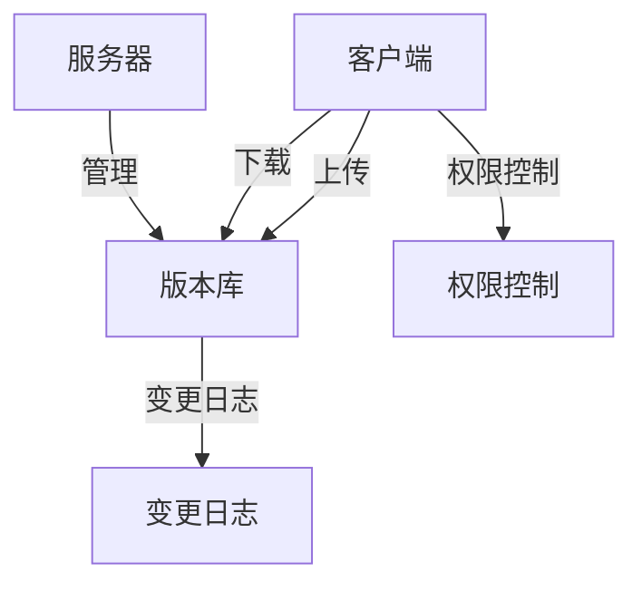

                 

### 数据版本控制基础

#### 1.1 数据版本控制概述

**问题背景：**

在复杂的软件开发和应用场景中，数据的版本管理变得尤为重要。无论是传统的软件工程，还是新兴的人工智能领域，确保数据的一致性和可靠性都是必不可少的。然而，随着数据量的急剧增长和复杂性增加，数据的版本管理成为了一大挑战。

**问题描述：**

数据的版本管理涉及到数据在不同时间点的不同状态，如何确保数据的一致性、避免数据冲突和错误，成为软件工程师和数据科学家需要面对的关键问题。

**问题解决：**

数据版本控制（Data Version Control）通过跟踪数据的变更历史，提供了一种有效的方式来管理和维护数据的一致性。它能够记录数据在每次修改时的状态，使得团队可以在任何时间点恢复到特定的数据版本。

**边界与外延：**

数据版本控制不仅适用于软件开发，还广泛应用于数据库管理、数据科学、机器学习等多个领域。它涉及到数据模型、数据操作、数据恢复等多个方面。

#### 1.2 数据版本控制的核心概念

**核心概念：**

1. **版本号（Version Number）：** 标识数据的不同状态，通常采用递增的数字或字母序列。
2. **变更日志（Change Log）：** 记录每次数据变更的操作类型、时间和操作者信息。
3. **分支（Branch）：** 数据在不同版本之间的隔离，允许独立开发不同功能或修复问题。
4. **合并（Merge）：** 将不同分支的数据合并到一起，确保数据的一致性。
5. **快照（Snapshot）：** 对数据在某一时间点的状态进行保存，用于备份和恢复。

**概念属性特征对比表格：**

| 概念       | 特征1          | 特征2          | 特征3          |
| ---------- | -------------- | -------------- | -------------- |
| 版本号     | 递增序列       | 时间戳         | 版本标识       |
| 变更日志   | 操作记录       | 时间记录       | 变更描述       |
| 分支       | 独立开发       | 版本隔离       | 功能独立       |
| 合并       | 数据一致性     | 版本同步       | 冲突处理       |
| 快照       | 数据备份       | 时间点记录     | 恢复能力       |

#### 1.3 数据版本控制方法与技术

**方法：**

1. **集中式版本控制（Centralized Version Control）：** 如Git，通过中央仓库管理版本。
2. **分布式版本控制（Distributed Version Control）：** 如SVN，允许每个开发者在本地管理版本，然后提交到中央仓库。
3. **版本库（Repository）：** 存储代码和数据的仓库，确保数据一致性和版本管理。

**技术：**

1. **版本库存储：** 使用版本库来存储代码和数据，确保数据的安全性和可追溯性。
2. **权限管理：** 控制不同用户或角色的数据访问权限，确保数据的安全性。
3. **变更追踪：** 使用工具记录每次数据变更的操作，提供详细的变更历史。

#### 1.4 数据版本控制的优势与挑战

**优势：**

1. **数据一致性：** 通过版本控制确保数据在不同时间点的状态一致。
2. **版本追溯：** 方便追踪数据的历史变更，便于问题排查和版本回滚。
3. **协作效率：** 支持团队协作，避免数据冲突，提高开发效率。

**挑战：**

1. **性能影响：** 版本控制会增加系统的复杂性和开销，可能影响性能。
2. **数据恢复：** 在数据损坏或丢失时，恢复数据可能变得复杂。
3. **权限管理：** 确保数据访问权限的合理分配和管理是一个挑战。

通过以上章节，我们了解了数据版本控制的基础知识，包括核心概念、实现方法和面临的优势与挑战。接下来，我们将进一步探讨如何在LLM应用中确保数据的一致性。

### 第2章：数据版本控制的实现

#### 2.1 数据版本控制工具与平台

**工具：**

1. **Git：** 作为最流行的分布式版本控制工具，Git能够高效地管理代码和数据版本。
2. **Subversion（SVN）：** 适用于集中式版本控制，提供简单易用的界面和丰富的命令集。
3. **Mercurial：** 类似Git的分布式版本控制工具，适合中小型团队的协作开发。

**平台：**

1. **GitHub：** 提供基于Git的版本控制平台，支持代码托管、协作开发、问题跟踪等功能。
2. **GitLab：** 开源平台，提供自托管版本控制服务，具有强大的权限管理和自动化流程。
3. **Bitbucket：** 支持Git和Mercurial，提供企业级版本控制解决方案，适合团队协作。

#### 2.2 数据版本控制流程

**流程：**

1. **创建仓库（Create Repository）：** 初始化版本库，为数据版本控制做准备。
2. **提交变更（Commit Changes）：** 将数据变更提交到版本库，记录变更日志。
3. **分支管理（Branch Management）：** 根据需求创建分支，实现独立开发和版本隔离。
4. **合并分支（Merge Branches）：** 将不同分支的变更合并，确保数据一致性。
5. **发布版本（Release Version）：** 将合并后的代码和数据发布到生产环境。
6. **版本回滚（Rollback Version）：** 在出现问题时，回滚到之前的版本状态。

#### 2.3 数据版本控制实践案例分析

**案例分析：**

以Git为例，我们来看一个简单的数据版本控制实践案例。

1. **初始化仓库：**
   
   ```bash
   git init
   ```
   
2. **添加文件并提交：**

   ```bash
   echo "Hello, World!" > example.txt
   git add example.txt
   git commit -m "Initial commit"
   ```
   
3. **创建分支：**

   ```bash
   git branch feature1
   git checkout feature1
   ```
   
4. **修改文件并提交：**

   ```bash
   echo "Updated content" > example.txt
   git add example.txt
   git commit -m "Update example.txt in feature1"
   ```
   
5. **切换分支：**

   ```bash
   git checkout main
   ```
   
6. **合并分支：**

   ```bash
   git merge feature1
   ```
   
7. **解决冲突并提交：**

   ```bash
   # 冲突解决示例
   echo "Resolved conflict" > example.txt
   git add example.txt
   git commit -m "Resolved conflict and merged feature1"
   ```
   
8. **发布版本：**

   ```bash
   git tag v1.0
   git push origin v1.0
   ```

通过以上步骤，我们完成了一个基本的数据版本控制流程。在实际应用中，数据版本控制会涉及到更复杂的过程，如分支管理、多人协作、权限控制等。

#### 2.3.1 数据版本控制系统架构

数据版本控制系统（Version Control System, VCS）的架构设计决定了其性能、稳定性和可扩展性。以下是一个典型的数据版本控制系统架构。

**架构组成：**

1. **版本库（Repository）：** 存储代码和数据的仓库，通常分为中央仓库（Central Repository）和分布式仓库（Distributed Repository）。
2. **客户端（Client）：** 用户操作的终端，负责向版本库提交代码和数据，获取版本库的最新数据。
3. **服务器（Server）：** 提供版本库存储和管理服务，支持客户端的连接和交互。
4. **权限控制（Access Control）：** 确保只有授权用户可以访问和操作版本库。
5. **变更日志（Change Log）：** 记录每次代码和数据的变更操作，提供详细的版本历史。

**工作流程：**

1. **初始化仓库：** 用户在客户端初始化版本库，并将本地代码和数据上传到服务器。
2. **提交变更：** 用户在客户端修改代码或数据，并将其提交到版本库。
3. **分支管理：** 用户可以在客户端创建分支，实现独立开发。
4. **合并分支：** 开发完成后，用户将分支合并到主分支。
5. **发布版本：** 用户将合并后的代码和数据发布到生产环境。

**架构图：**



通过上述架构设计，数据版本控制系统能够提供高效、稳定的数据管理和协作开发功能，确保代码和数据的一致性和可靠性。

#### 2.3.2 数据版本控制核心实现

数据版本控制的核心实现主要涉及到版本管理、变更追踪、分支合并等方面。以下将详细讲解这些核心实现的技术细节和流程。

**1. 版本管理：**

版本管理是数据版本控制的基础。通过版本管理，我们可以有效地跟踪数据的变更历史，确保数据的一致性。

- **版本标识：** 每个版本都有一个唯一的标识，通常使用递增的数字或字母序列。例如，`1.0.0`、`2.0.0`等。
- **版本状态：** 版本状态分为开发版（Development）、测试版（Test）、稳定版（Stable）等。不同状态的版本适用于不同的开发阶段。
- **版本发布：** 发布版本时，需要记录版本号、发布日期、发布说明等信息。

**2. 变更追踪：**

变更追踪是记录数据变更的过程。通过变更追踪，我们可以了解每次数据变更的操作类型、时间和操作者等信息。

- **变更日志：** 变更日志记录每次变更的操作类型（如添加、修改、删除等），以及操作时间和操作者等信息。变更日志通常以文本或数据库的形式存储。
- **变更通知：** 当数据变更时，系统可以发送通知给相关的用户或团队，确保他们及时了解变更情况。

**3. 分支管理：**

分支管理是在不同开发阶段或功能模块之间隔离数据的过程。通过分支管理，我们可以实现独立开发，减少数据冲突。

- **创建分支：** 创建分支时，系统会将当前数据复制到一个新的分支，确保分支上的数据与主分支隔离。
- **合并分支：** 合并分支是将不同分支上的数据合并到一起，确保数据的一致性。合并过程中可能需要解决冲突，确保合并结果正确。

**4. 冲突解决：**

数据版本控制过程中，冲突解决是关键的一环。当两个或多个用户同时修改同一数据时，可能会产生冲突。

- **冲突检测：** 系统会在合并分支时检测冲突，并通知相关用户。
- **冲突解决：** 用户需要手动解决冲突，确保合并结果正确。解决冲突的方法包括手动修改、自动合并等。
- **冲突记录：** 系统会记录冲突解决的过程和结果，以便后续审查和问题排查。

**5. 回滚操作：**

回滚操作是恢复数据到之前版本的过程。当发现当前版本存在问题时，我们可以回滚到之前的稳定版本。

- **回滚条件：** 回滚操作需要满足一定的条件，如数据一致性、系统稳定性等。
- **回滚操作：** 用户可以选择回滚到某个版本，系统会自动恢复数据到该版本的状态。
- **回滚记录：** 系统会记录回滚操作的历史，以便后续审查和问题排查。

**核心实现流程：**

1. **初始化版本库：** 创建版本库，并为每个用户分配权限。
2. **提交变更：** 用户在本地修改数据，并提交到版本库。
3. **分支管理：** 根据需求创建分支，实现独立开发。
4. **合并分支：** 将不同分支上的数据合并到一起，确保数据一致性。
5. **冲突解决：** 检测并解决冲突，确保合并结果正确。
6. **回滚操作：** 当数据出现问题时，回滚到之前的稳定版本。

通过以上核心实现，数据版本控制系统能够有效地管理和维护数据的一致性，确保软件开发过程中的数据安全和可靠性。

#### 2.3.3 数据版本控制效果评估

数据版本控制系统的效果评估是衡量其性能和有效性的重要环节。以下将从几个关键指标和方法来评估数据版本控制系统的效果。

**1. 稳定性（Stability）：**

稳定性是数据版本控制系统最基本的要求，它直接影响到系统的可用性和可靠性。评估方法包括：

- **故障率（Failure Rate）：** 计算系统在一定时间内的故障次数，故障率越低，稳定性越高。
- **恢复时间（Recovery Time）：** 评估系统从故障中恢复的时间，恢复时间越短，稳定性越好。
- **数据完整性（Data Integrity）：** 确保数据在版本控制过程中不丢失、不被篡改，数据完整性越高，稳定性越好。

**2. 性能（Performance）：**

性能是数据版本控制系统的重要指标，它决定了系统的响应速度和资源消耗。评估方法包括：

- **响应时间（Response Time）：** 计算用户请求到响应的时间，响应时间越短，性能越好。
- **并发处理能力（Concurrency）：** 评估系统同时处理多个请求的能力，并发处理能力越强，性能越好。
- **资源消耗（Resource Consumption）：** 评估系统在运行过程中占用的资源，如CPU、内存、存储等，资源消耗越低，性能越好。

**3. 安全性（Security）：**

安全性是数据版本控制系统的关键，它涉及到数据的机密性、完整性和可用性。评估方法包括：

- **安全性漏洞（Security Vulnerabilities）：** 评估系统是否存在安全漏洞，如SQL注入、XSS攻击等。
- **访问控制（Access Control）：** 评估系统的访问控制机制是否完善，如权限分配、认证机制等。
- **数据备份与恢复（Data Backup and Recovery）：** 评估系统的数据备份和恢复能力，确保数据在故障或灾难时能够及时恢复。

**4. 可扩展性（Scalability）：**

可扩展性是数据版本控制系统在面临大规模数据和高并发场景下的能力。评估方法包括：

- **扩展性指标（Scalability Metrics）：** 评估系统在数据量和并发量增加时的性能变化，如响应时间、资源消耗等。
- **扩展性方案（Scalability Solutions）：** 评估系统提供的扩展性方案，如分布式架构、负载均衡等。

**评估方法：**

- **定量评估（Quantitative Evaluation）：** 使用具体的数据和指标来评估系统的性能和效果，如故障率、响应时间等。
- **定性评估（Qualitative Evaluation）：** 通过用户反馈、专家评审等方式来评估系统的用户体验和满意度。
- **对比评估（Comparative Evaluation）：** 将不同版本控制系统进行对比评估，找出优缺点和适用场景。

通过上述评估方法和指标，我们可以全面了解数据版本控制系统的性能、稳定性、安全性和可扩展性，为系统的优化和改进提供依据。

#### 2.4.1 数据版本控制的优势

数据版本控制作为现代软件开发中不可或缺的一部分，具有许多显著的优势，这些优势在确保代码和数据一致性方面发挥着关键作用。

**1. 提高开发效率：**

数据版本控制使得开发团队能够并行工作，每个成员可以在各自的分支上进行独立的开发，减少了冲突和协调成本。通过分支管理和合并流程，团队可以灵活地管理不同功能模块的开发进度，加快整体项目的迭代速度。

**2. 确保数据一致性：**

在复杂的应用场景中，数据的一致性至关重要。数据版本控制通过跟踪数据的历史变更，确保每个版本的数据都是一致的。开发者可以在任何时间点查看特定版本的数据状态，避免了因数据不一致导致的问题。

**3. 简化问题排查：**

数据版本控制提供了一个清晰的变更历史记录，使得在出现问题时，能够快速定位到具体的变更操作。通过对比不同版本的数据，开发者可以找到问题的根源，从而简化问题排查过程。

**4. 数据追溯与审计：**

数据版本控制系统能够记录每次变更的操作者、时间和操作内容，为数据的追溯和审计提供了便利。这对于合规性要求高的行业（如金融、医疗等）尤为重要，确保数据的可追溯性，有助于提高数据的安全性和可靠性。

**5. 支持团队合作：**

数据版本控制工具通常提供丰富的协作功能，如分支共享、代码审查、合并请求等。这些功能使得团队协作更加顺畅，提高了团队的整体效率。

**6. 灵活的管理策略：**

数据版本控制允许开发者制定灵活的管理策略，如基于角色的权限分配、自动化流程等。这些策略能够满足不同团队和项目的需求，提高数据管理的灵活性。

**7. 降低风险：**

通过版本控制和备份机制，数据版本控制可以有效降低数据丢失和错误的风险。在出现问题时，可以迅速回滚到之前的稳定版本，确保系统的稳定运行。

综上所述，数据版本控制不仅提高了开发效率，还确保了数据的一致性和安全性，为现代软件开发提供了强有力的支持。

#### 2.4.2 数据版本控制的挑战

尽管数据版本控制具有诸多优势，但在实际应用过程中仍面临一些挑战，这些挑战可能影响其有效性和用户体验。

**1. 性能影响：**

数据版本控制系统在处理大量数据时，可能会对系统的性能产生影响。频繁的提交、分支创建和合并操作会增加系统的负载，导致响应时间延长。特别是在高并发场景下，性能问题更为突出。

**2. 数据恢复复杂性：**

在数据损坏或丢失时，数据恢复可能变得复杂。数据版本控制系统能够提供备份和回滚功能，但在实际操作中，恢复特定版本的数据需要耗费大量时间和人力资源。特别是在面对大规模数据时，恢复过程可能非常耗时。

**3. 权限管理难度：**

确保数据访问权限的合理分配和管理是一个挑战。特别是在多团队协作和复杂组织结构中，权限管理变得异常复杂。错误的权限配置可能导致数据泄露或未经授权的访问。

**4. 冲突解决的复杂性：**

在多用户同时修改同一数据时，冲突在所难免。冲突解决的复杂性在于需要找到最佳方案，确保合并结果正确。对于复杂的变更操作，解决冲突可能需要多次迭代和讨论。

**5. 备份策略的设计：**

数据备份策略的设计也是一个重要挑战。如何选择合适的备份方案，确保备份数据的完整性和可恢复性，是数据版本控制系统中需要解决的问题。

**6. 用户体验问题：**

数据版本控制工具的界面和操作流程可能对新手用户不友好，导致使用门槛较高。对于不熟悉版本控制概念的团队来说，适应和使用这些工具可能需要较长的学习和适应时间。

**7. 安全性问题：**

数据版本控制系统面临的安全性问题不容忽视，如数据泄露、恶意攻击等。需要采取有效的安全措施，确保数据的安全性和隐私性。

**解决方案：**

1. **优化性能：** 采用分布式架构和高效算法，减少系统负载，提高性能。
2. **简化恢复流程：** 提供直观的恢复界面和自动化恢复工具，简化数据恢复过程。
3. **强化权限管理：** 设计灵活的权限管理策略，确保权限分配合理，降低数据泄露风险。
4. **提升冲突解决工具：** 开发智能冲突解决工具，自动化处理常见冲突，减少手动干预。
5. **设计合理的备份策略：** 根据数据的重要性和变更频率，设计合适的备份方案。
6. **优化用户体验：** 提供用户友好的界面和操作流程，降低使用门槛。
7. **加强安全性措施：** 采用加密、认证和审计等安全措施，确保数据的安全和隐私。

通过上述解决方案，可以有效地应对数据版本控制过程中面临的挑战，提高其应用效果和用户体验。

#### 2.5.1 数据版本控制的常见工具和平台

在数据版本控制领域，有许多常用的工具和平台，这些工具和平台各具特色，能够满足不同开发团队和项目的需求。以下将介绍几种流行的数据版本控制工具和平台。

**1. Git**

**特点：** Git是目前最流行的分布式版本控制工具，拥有强大的分支管理和合并功能。Git支持离线工作，开发者可以在本地进行提交和分支操作，然后再与远程仓库同步。

**适用场景：** 适用于大型项目、多团队协作和分布式开发环境。

**主要功能：**

- 分布式存储：Git将项目拆分为多个分支，每个分支独立存储和操作。
- 分支管理：Git支持创建、合并和删除分支，方便团队并行开发和整合工作。
- 快照功能：Git通过提交记录，提供项目的完整历史记录，支持版本回滚。
- 强大的合并算法：Git拥有高效的合并算法，能够自动处理大部分合并冲突。

**2. Subversion（SVN）**

**特点：** SVN是一个集中式版本控制工具，提供简单的界面和丰富的命令集，适合初学者使用。

**适用场景：** 适用于小型项目、单团队开发和集中式存储环境。

**主要功能：**

- 集中式存储：SVN将所有版本存储在中央仓库，开发者需要与中央仓库进行同步。
- 版本回滚：SVN支持版本回滚功能，允许开发者恢复到之前的版本状态。
- 提交和审核：SVN提供提交和审核功能，确保代码和数据的变更经过审查。
- 基于文件的变更：SVN基于文件层面的版本控制，对文件的修改和删除进行管理。

**3. Mercurial**

**特点：** Mercurial是另一个流行的分布式版本控制工具，类似于Git，但操作更为简单，适合中小型团队使用。

**适用场景：** 适用于中小型项目、多团队协作和分布式开发环境。

**主要功能：**

- 分布式存储：Mercurial支持分布式存储，开发者可以在本地进行提交和分支操作。
- 快照功能：Mercurial通过提交记录，提供项目的完整历史记录，支持版本回滚。
- 简单的操作流程：Mercurial的操作流程简单直观，适合初学者使用。
- 支持多种平台：Mercurial支持多种平台，包括Windows、Linux和Mac OS。

**4. GitLab**

**特点：** GitLab是一个基于Git的开源平台，提供代码托管、协作开发、问题跟踪等功能，支持自托管和云服务。

**适用场景：** 适用于大型项目、多团队协作和企业级应用。

**主要功能：**

- 代码托管：GitLab提供Git仓库托管功能，支持多分支、多标签管理。
- 协作开发：GitLab支持代码审查、合并请求和任务管理，方便团队协作。
- 问题跟踪：GitLab提供内置的问题跟踪功能，支持任务分配和进度跟踪。
- 自托管和云服务：GitLab支持自托管和云服务，灵活满足不同需求。

**5. Bitbucket**

**特点：** Bitbucket是Atlassian公司推出的基于Git的版本控制平台，提供企业级版本控制解决方案，支持Git和Mercurial。

**适用场景：** 适用于中小型项目、多团队协作和企业级应用。

**主要功能：**

- 版本控制：Bitbucket提供强大的版本控制功能，支持多分支、多标签管理。
- 权限管理：Bitbucket提供灵活的权限管理功能，支持基于角色的访问控制。
- 数据备份与恢复：Bitbucket提供数据备份和恢复功能，确保数据安全。
- 与JIRA集成：Bitbucket与JIRA集成，支持任务分配和进度跟踪。

通过以上工具和平台，开发团队可以根据项目需求和团队规模选择合适的数据版本控制解决方案，提高开发效率和数据管理能力。

#### 2.6.1 数据版本控制与LLM应用的结合

在大型语言模型（LLM）应用中，数据版本控制是一个关键环节，它能够确保模型训练数据的一致性和可靠性，从而提高模型的效果和可追溯性。以下将从几个方面探讨数据版本控制与LLM应用的结合。

**1. 数据一致性保障：**

LLM应用通常需要处理大量的训练数据，这些数据可能来自不同的来源和渠道，容易受到数据版本的影响。数据版本控制能够记录每次数据的变更历史，确保模型训练数据的一致性。通过版本控制，开发者可以轻松回滚到特定的数据版本，避免因数据不一致导致的模型错误。

**2. 数据追溯与审计：**

数据版本控制系统能够记录每次数据变更的操作者、时间和操作内容，为LLM应用的追溯和审计提供了便利。对于需要合规性和审计的领域，如金融、医疗等，数据版本控制能够确保数据的可追溯性，提高数据的透明度和可靠性。

**3. 多团队协作：**

LLM项目通常涉及多个团队和角色的协作，如数据工程师、模型训练师、产品经理等。数据版本控制工具支持多团队协作，通过分支管理和权限控制，确保不同团队在各自的分支上进行独立开发，避免数据冲突。在合并分支时，通过冲突解决机制，确保合并后的数据一致。

**4. 模型迭代与回滚：**

在LLM应用开发过程中，模型的迭代和回滚是一个常见操作。数据版本控制能够方便地实现模型的迭代和回滚。开发者可以在特定的数据版本下进行模型训练和测试，确保每次迭代都是基于一致的数据集。在出现问题时，可以通过回滚到之前的稳定版本，快速恢复模型的正常运行。

**5. 数据备份与恢复：**

数据版本控制系统能够提供数据的备份和恢复功能，确保在数据丢失或损坏时能够快速恢复。这对于LLM应用尤为重要，因为模型训练数据往往需要长时间积累和存储。通过定期备份和快速恢复，可以确保数据的安全性和持续性。

**6. 数据版本与模型版本关联：**

在LLM应用中，通常需要对模型和数据版本进行关联管理。数据版本控制系统能够与模型管理工具集成，记录每次模型训练所使用的数据版本。这样，在模型发布和部署时，可以追溯模型所依赖的数据版本，确保模型和数据的一致性。

**具体实现方法：**

1. **初始化版本库：** 在LLM项目开始前，初始化版本库，为数据版本控制做准备。

2. **数据提交与审核：** 开发者在数据收集和处理过程中，将数据提交到版本库，并进行审核，确保数据的质量和一致性。

3. **分支管理：** 根据项目需求，创建分支，不同团队在各自的分支上进行独立的数据处理和模型训练。

4. **合并分支：** 在完成各自的任务后，将分支合并到主分支，确保数据的一致性。

5. **版本回滚：** 在出现问题时，可以回滚到之前的稳定版本，快速恢复系统的正常运行。

6. **数据备份与恢复：** 定期备份数据，确保在数据丢失或损坏时能够快速恢复。

通过以上方法，数据版本控制能够与LLM应用紧密结合，确保数据的一致性、可靠性和可追溯性，提高LLM应用的开发效率和稳定性。

### 第3章：LLM应用概述

#### 3.1 LLM的核心概念与特点

**核心概念：**

大型语言模型（Large Language Model，简称LLM）是一种基于深度学习技术构建的自然语言处理模型，具有强大的文本生成、理解、分类和推理能力。LLM通过学习海量文本数据，理解语言的语义和结构，实现自动化文本生成和智能对话。

**特点：**

1. **大规模训练数据：** LLM通常基于大规模文本数据进行训练，如维基百科、新闻文章、社交媒体等。这种大规模数据训练使得LLM能够学习到丰富的语言知识和模式。

2. **深度神经网络结构：** LLM采用深度神经网络（DNN）结构，通过多层神经网络对文本数据进行建模，逐步提取文本的语义信息。

3. **端到端学习：** LLM实现端到端学习，从输入文本直接生成输出文本，不需要中间步骤的转换，提高了模型的效率和准确性。

4. **自动调整参数：** LLM通过自动调整神经网络参数，优化模型在特定任务上的性能，实现自适应学习。

5. **并行处理能力：** LLM支持并行计算，可以快速处理大量文本数据，提高模型的处理速度。

6. **灵活的应用场景：** LLM可以应用于多种自然语言处理任务，如文本生成、问答系统、机器翻译、情感分析等。

**与普通语言模型（NLP）的区别：**

普通语言模型通常基于小规模数据进行训练，模型复杂度和计算资源有限，只能处理简单的语言任务。而LLM通过大规模数据训练，具有更高的模型复杂度和计算能力，能够实现更加复杂的语言任务和智能应用。

#### 3.2 LLM的应用场景

**应用场景：**

1. **文本生成：** LLM可以用于自动生成文章、摘要、新闻、广告文案等。通过输入特定主题或关键词，LLM能够生成高质量的文本内容。

2. **问答系统：** LLM可以构建问答系统，用于回答用户的问题。LLM通过对海量文本数据进行训练，能够理解用户的提问意图，提供准确的答案。

3. **机器翻译：** LLM可以用于机器翻译，将一种语言的文本翻译成另一种语言。LLM通过学习多种语言的文本，实现高质量的跨语言翻译。

4. **情感分析：** LLM可以用于情感分析，判断文本的情感倾向。LLM通过对文本的情感词汇和语境进行学习，能够准确判断文本的情感表达。

5. **对话系统：** LLM可以用于构建智能对话系统，实现人机对话。LLM通过对对话数据的训练，能够理解用户的提问，提供自然的对话回应。

6. **推荐系统：** LLM可以用于推荐系统，根据用户的兴趣和偏好推荐相关内容。LLM通过对用户文本数据的分析，提供个性化的推荐结果。

#### 3.3 LLM的发展趋势

**发展趋势：**

1. **模型规模增大：** 随着计算能力和存储资源的提升，LLM的模型规模逐渐增大，模型参数数量达到数十亿甚至上百亿级别，实现更高的语言理解和生成能力。

2. **多语言支持：** LLM逐渐支持多种语言，实现跨语言的文本处理和交互，为全球化应用提供支持。

3. **个性化学习：** LLM通过个性化学习，根据用户的历史行为和偏好调整模型参数，提供个性化的文本生成和推荐。

4. **知识增强：** LLM结合外部知识库，增强模型的知识理解和推理能力，实现更加智能的文本处理和应用。

5. **实时交互：** LLM通过实时交互，快速响应用户的提问和需求，实现高效的人机对话和智能服务。

6. **自动化部署：** LLM的自动化部署和运维，降低应用门槛，使得LLM能够广泛应用于各种场景。

LLM作为一种先进的人工智能技术，具有广泛的应用前景和发展潜力。随着技术的不断进步，LLM将不断突破性能和应用的界限，为人类带来更多智能化的服务和体验。

### 第4章：数据一致性与LLM应用

#### 4.1 数据不一致性问题

在LLM应用中，数据不一致性问题是一个常见且严重的问题。数据不一致性可能导致模型训练效果下降、预测准确性降低，甚至引发错误的决策。以下将详细介绍数据不一致性的几个主要问题及其对LLM应用的潜在影响。

**1. 数据遗漏：**

数据遗漏是指训练数据集中缺少某些关键信息或样本。这种情况可能导致模型在预测时无法准确捕捉到相关特征，从而影响模型的整体性能。例如，在文本分类任务中，如果某些类别标签的数据遗漏，模型可能会倾向于低估这些类别的重要性，导致分类结果不准确。

**2. 数据重复：**

数据重复是指训练数据集中出现重复的样本。数据重复不仅占用存储空间，还会导致模型过度拟合。当模型在训练过程中遇到大量重复样本时，可能会学习到不必要的信息，从而降低模型的泛化能力。此外，数据重复还可能导致模型在评估阶段出现过拟合现象，影响模型的实际应用效果。

**3. 数据错配：**

数据错配是指训练数据中的样本标签与实际标签不一致。这种情况在数据标注过程中尤为常见，可能会导致模型在训练时学习到错误的模式。例如，在图像分类任务中，如果某个图像被错误地标注为猫，而实际上它是狗，那么模型可能会错误地识别出类似的图像。

**4. 数据噪声：**

数据噪声是指训练数据中存在的不规则或异常数据。噪声数据可能会干扰模型的学习过程，导致模型无法正确捕捉到有效的特征。数据噪声可能是由于传感器误差、数据采集过程中的干扰或数据传输错误等原因引起的。例如，在语音识别任务中，背景噪音可能会干扰语音信号的识别，导致错误的结果。

**5. 数据更新滞后：**

在动态应用场景中，数据可能会随着时间不断更新。如果模型无法及时获取最新的数据，就会出现数据更新滞后问题。这种情况可能导致模型在预测时使用的是过时的信息，从而影响预测的准确性。例如，在股票市场预测中，如果模型无法及时获取最新的市场数据，那么其预测结果可能会与实际市场走势不符。

**对LLM应用的潜在影响：**

1. **模型性能下降：** 数据不一致性问题会直接影响LLM的模型性能，降低模型的准确性和泛化能力。

2. **预测结果不准确：** 数据不一致性可能导致模型在预测时产生错误的结论，影响决策的准确性。

3. **用户体验差：** 在应用场景中，不一致的数据可能导致用户体验差，影响用户对模型的信任度。

4. **安全隐患：** 数据不一致性可能会引发安全漏洞，例如在金融领域，不一致的数据可能导致欺诈检测失败。

5. **合规风险：** 在需要合规性保证的场景中，数据不一致性可能违反相关法律法规，带来合规风险。

为了解决上述问题，LLM应用需要采取一系列措施，包括数据清洗、数据标注、数据同步等，确保数据的一致性和可靠性，从而提高模型的性能和预测准确性。

#### 4.2 数据一致性策略

为了确保LLM应用的数据一致性，开发者需要制定和实施一系列数据一致性策略。以下是一些常见的数据一致性策略及其具体实施方法：

**1. 数据清洗策略：**

**策略概述：** 数据清洗是指通过过滤、修正和整理数据，去除错误、重复和不完整的数据，确保数据质量。

**具体方法：**

- **过滤：** 使用过滤规则删除重复记录或异常数据。例如，通过检查字段唯一性或范围限制来去除重复记录。
- **修正：** 对错误的或不完整的数据进行修正。例如，通过填补缺失值或校正错误数据。
- **标准化：** 对数据进行统一格式处理，确保不同来源的数据具有相同的结构。例如，对文本数据进行统一编码或对数值数据进行归一化处理。

**实施步骤：**

1. **数据预处理：** 在数据进入训练集前，进行初步的数据预处理，包括去重、补全和标准化等操作。
2. **实时监控：** 在数据更新过程中，实时监控数据质量，及时发现和处理数据问题。

**2. 数据同步策略：**

**策略概述：** 数据同步是指确保不同数据源之间的数据保持一致，特别是在动态更新场景中。

**具体方法：**

- **主从同步：** 在主从数据库架构中，从数据库定期从主数据库复制数据，确保数据同步。
- **分布式同步：** 在分布式系统中，通过分布式同步算法，如Paxos或Raft，确保不同节点之间的数据一致性。
- **事件日志同步：** 通过记录数据变更的事件日志，实现不同系统之间的数据同步。

**实施步骤：**

1. **设计同步机制：** 根据系统架构和需求，设计合适的数据同步机制，确保数据一致性。
2. **监控同步状态：** 实时监控数据同步状态，确保同步过程无误。
3. **容错处理：** 在数据同步过程中，设计容错机制，处理同步失败的情况。

**3. 数据版本控制策略：**

**策略概述：** 数据版本控制是指通过跟踪数据的变更历史，确保数据在不同版本之间的状态一致性。

**具体方法：**

- **版本标识：** 对每个数据版本进行唯一标识，记录版本号、变更时间和变更内容。
- **版本回滚：** 在出现数据不一致时，通过回滚到之前的版本，恢复数据的一致性。
- **分支管理：** 通过分支管理，实现数据的独立开发和版本隔离，减少数据冲突。

**实施步骤：**

1. **初始化版本库：** 创建版本库，为数据版本控制做准备。
2. **数据提交：** 在每次数据变更时，提交数据到版本库，并记录变更日志。
3. **版本合并：** 在完成不同分支的开发后，合并分支，确保数据一致性。
4. **版本审计：** 定期审计数据版本，确保数据的完整性和一致性。

**4. 数据权限控制策略：**

**策略概述：** 数据权限控制是指通过设置数据访问权限，确保只有授权用户可以访问和操作数据。

**具体方法：**

- **基于角色的访问控制（RBAC）：** 根据用户的角色分配访问权限，确保数据访问的权限合理分配。
- **认证与授权：** 使用认证和授权机制，确保用户身份验证和数据访问权限的合法性。

**实施步骤：**

1. **设计权限模型：** 根据系统需求，设计权限模型和角色定义。
2. **实现权限控制：** 在数据访问过程中，实现权限控制，确保数据访问的安全性和合规性。
3. **监控权限变更：** 实时监控权限变更，确保权限分配的合理性和数据安全性。

通过以上数据一致性策略的实施，可以有效地确保LLM应用的数据一致性和可靠性，提高模型性能和用户体验。

#### 4.3 数据一致性在LLM应用中的实现

确保数据一致性在LLM应用中至关重要，以下是实现数据一致性的具体步骤、技术和最佳实践。

**具体步骤：**

1. **数据收集与存储：** 首先从不同的数据源收集数据，存储在统一的数据仓库中。数据收集过程中，要确保数据格式的一致性，并进行初步的数据清洗，去除重复和错误的数据。

2. **数据清洗与预处理：** 在数据进入模型训练之前，进行深入的数据清洗和预处理。这包括填补缺失值、去除噪声数据、标准化数据等。数据清洗的目的是提高数据质量，为模型训练打下坚实的基础。

3. **版本控制：** 引入版本控制系统，对数据变更进行管理。使用Git等版本控制工具，记录每次数据变更的历史，包括版本号、变更内容和变更时间。这有助于追踪数据的历史，方便在出现问题时进行回滚。

4. **实时同步：** 在动态数据场景中，实现数据实时同步。通过使用消息队列、分布式锁等技术，确保不同系统或组件之间的数据更新同步。例如，使用Kafka实现实时数据同步，将数据变更事件推送到其他系统进行更新。

5. **数据校验：** 在数据操作前后进行数据校验，确保数据的完整性和一致性。可以采用哈希校验、一致性检查等手段，发现并处理数据异常。

**技术实现：**

1. **分布式数据库：** 使用分布式数据库（如Apache HBase、Cassandra）来存储和管理大规模数据。分布式数据库能够提供高可用性和高性能，确保数据的一致性和可靠性。

2. **消息队列：** 使用消息队列（如Kafka、RabbitMQ）来实现分布式系统中的数据同步。消息队列能够确保数据变更事件的顺序传递，避免数据丢失和冲突。

3. **分布式锁：** 在多节点系统中，使用分布式锁（如Zookeeper、Redisson）来控制并发访问。分布式锁能够确保在多个节点之间对数据的操作是原子性的，避免数据不一致。

4. **事件溯源：** 使用事件溯源（Event Sourcing）技术，记录系统中的所有事件，通过事件的重放来重建系统的状态。这种技术有助于追踪数据变更历史，方便数据回滚和问题排查。

**最佳实践：**

1. **版本隔离：** 在多团队协作时，使用版本隔离策略，确保不同团队在独立的分支上操作数据，减少数据冲突。

2. **数据审计：** 定期进行数据审计，检查数据的一致性和完整性。可以采用自动化工具进行数据审计，及时发现和修复数据问题。

3. **自动化备份：** 定期进行数据备份，确保在数据丢失或损坏时能够快速恢复。可以采用定时备份策略，自动备份数据到备份存储中。

4. **权限管理：** 实施严格的权限管理策略，确保只有授权用户可以访问和操作数据。可以采用RBAC（基于角色的访问控制）来分配权限，确保数据安全。

5. **监控与报警：** 实时监控数据同步和版本控制过程，设置报警机制，及时发现和处理数据异常。可以采用Prometheus、Grafana等监控工具，监控系统的关键指标。

通过以上步骤、技术和最佳实践，可以实现LLM应用中的数据一致性，确保模型训练数据的质量和可靠性，从而提高模型的性能和预测准确性。

### 第5章：数据版本控制与LLM应用实战

#### 5.1 环境安装与配置

在开始数据版本控制与LLM应用实战之前，我们需要安装和配置相关的环境。以下是具体步骤：

**1. 安装Python环境：**

Python是LLM应用的核心编程语言，因此首先需要安装Python环境。以下是使用Python官方安装器安装Python的步骤：

- 下载Python安装包（推荐下载最新版本）。
- 运行安装程序，按照提示完成安装。

**2. 安装必要的库和依赖：**

在Python环境中，我们需要安装一些常用的库和依赖，如TensorFlow、PyTorch等。以下是使用pip安装这些库的命令：

```bash
pip install tensorflow
pip install torch
pip install numpy
pip install pandas
pip install scikit-learn
```

**3. 安装版本控制系统：**

我们选择Git作为版本控制系统，以下是如何安装Git的步骤：

- 对于Windows用户，可以从Git官网下载安装程序并安装。
- 对于Linux和Mac OS用户，可以使用包管理工具安装Git。例如，在Ubuntu上，可以使用以下命令：

```bash
sudo apt-get install git
```

**4. 配置Git：**

安装完Git后，我们需要配置一些Git的设置，如用户名和邮箱。以下是如何配置Git的步骤：

```bash
git config --global user.name "Your Name"
git config --global user.email "your.email@example.com"
```

**5. 配置版本库：**

创建一个版本库，用于存储LLM应用的数据和代码。以下是创建版本库的步骤：

- 在本地创建一个文件夹，例如`llm_project`。

```bash
mkdir llm_project
cd llm_project
```

- 初始化Git仓库：

```bash
git init
```

- 将本地文件添加到版本库：

```bash
git add .
git commit -m "Initial commit"
```

**6. 配置远程仓库：**

为了方便多人协作和代码托管，我们将本地版本库关联到一个远程仓库，例如GitHub或GitLab。以下是关联远程仓库的步骤：

- 创建远程仓库，并将仓库地址添加到本地版本库：

```bash
git remote add origin https://github.com/your_username/llm_project.git
```

- 将本地分支推送到远程仓库：

```bash
git push -u origin main
```

通过以上步骤，我们完成了环境安装和配置，为后续的数据版本控制和LLM应用开发打下了基础。

#### 5.2 数据版本控制实现

在本节中，我们将详细讲解数据版本控制的实现过程，包括版本管理系统（如Git）的使用方法、分支管理策略以及冲突解决机制。

**1. 版本管理系统选择与安装**

我们选择Git作为数据版本控制系统，因为Git是一个开源的分布式版本控制系统，它能够有效地处理从小到大的所有项目版本管理需求。以下是Git的基本安装步骤：

- **Windows安装：** 直接从Git官网下载Git安装程序并安装。安装过程中，确保勾选“使用Git Bash”选项，以便在Windows环境中使用Linux风格的命令行工具。
- **Linux和Mac OS安装：** 可以使用包管理工具进行安装。例如，在Ubuntu上，可以使用以下命令：

```bash
sudo apt-get install git
```

安装完成后，通过以下命令验证Git是否安装成功：

```bash
git --version
```

**2. 版本控制基本操作**

在Git中，版本控制的基本操作包括初始化仓库、添加文件、提交变更、创建分支、合并分支等。以下是这些操作的详细说明：

- **初始化仓库：**

```bash
mkdir my_project
cd my_project
git init
```

- **添加文件：**

将项目文件添加到Git仓库：

```bash
git add README.md
```

- **提交变更：**

提交添加的文件：

```bash
git commit -m "Initial commit"
```

- **查看日志：**

查看提交日志：

```bash
git log
```

- **创建分支：**

创建一个名为`feature1`的分支：

```bash
git checkout -b feature1
```

- **合并分支：**

将`feature1`分支合并到主分支`main`：

```bash
git checkout main
git merge feature1
```

- **解决冲突：**

在合并过程中，如果出现冲突，Git会标记出冲突文件，开发者需要手动解决冲突：

```bash
git status
```

解决冲突后，添加并提交：

```bash
git add conflicted_file.txt
git commit -m "Resolved merge conflict"
```

**3. 分支管理策略**

在LLM项目中，分支管理策略对于确保数据一致性和开发效率至关重要。以下是几种常见的分支管理策略：

- **主分支（Master/Main）：** 用于存储稳定的生产代码和模型。
- **功能分支（Feature）：** 用于开发新功能或修复bug，通常命名为`feature/功能名称`。
- **发布分支（Release）：** 用于准备发布新版本的代码，通常命名为`release/版本号`。
- **临时分支（Temporary）：** 用于临时开发或测试，通常命名为`temp/任务名称`。

**4. 冲突解决机制**

在分支合并过程中，冲突是不可避免的。Git提供了冲突解决机制，帮助开发者解决合并中的冲突。以下是解决冲突的步骤：

- **检测冲突：**

当两个分支合并时，如果出现冲突，Git会标记出冲突文件，并在提交历史中记录冲突的版本。

```bash
git status
```

- **解决冲突：**

打开冲突文件，手动编辑合并结果。例如，在文本编辑器中打开`conflicted_file.txt`，解决冲突后，添加到暂存区。

```bash
git add conflicted_file.txt
```

- **提交变更：**

提交解决冲突的文件：

```bash
git commit -m "Resolved merge conflict"
```

通过以上步骤，我们详细讲解了数据版本控制的实现方法，包括版本管理系统安装、基本操作、分支管理策略和冲突解决机制。这些步骤为LLM应用的数据版本控制奠定了基础。

#### 5.3 数据版本控制效果评估

在数据版本控制系统中，效果评估是确保系统稳定性和可靠性的关键环节。以下将通过几个关键指标和方法对数据版本控制系统进行效果评估。

**1. 稳定性（Stability）**

**关键指标：**

- **故障率（Failure Rate）：** 计算系统在一定时间内的故障次数，故障率越低，稳定性越高。
- **恢复时间（Recovery Time）：** 评估系统从故障中恢复的时间，恢复时间越短，稳定性越好。
- **数据完整性（Data Integrity）：** 确保数据在版本控制过程中不丢失、不被篡改。

**评估方法：**

- **故障率评估：** 通过监控工具记录系统的故障次数，计算故障率。例如，每月故障次数除以总运行时间。
- **恢复时间评估：** 通过记录每次故障的恢复时间，计算平均恢复时间。

**实例：**

```python
def calculate_failure_rate(failures, total_time):
    return failures / total_time

def calculate_recovery_time(recovery_times):
    return sum(recovery_times) / len(recovery_times)
```

**2. 性能（Performance）**

**关键指标：**

- **响应时间（Response Time）：** 计算用户请求到响应的时间，响应时间越短，性能越好。
- **并发处理能力（Concurrency）：** 评估系统同时处理多个请求的能力，并发处理能力越强，性能越好。
- **资源消耗（Resource Consumption）：** 评估系统在运行过程中占用的资源，如CPU、内存、存储等，资源消耗越低，性能越好。

**评估方法：**

- **响应时间评估：** 通过性能测试工具记录每次请求的响应时间。
- **并发处理能力评估：** 通过负载测试工具模拟多用户并发请求，评估系统的处理能力。

**实例：**

```python
import time

def measure_response_time(url):
    start_time = time.time()
    response = requests.get(url)
    end_time = time.time()
    return end_time - start_time

def measure_concurrency Capability(test_cases):
    results = []
    for case in test_cases:
        start_time = time.time()
        requests.get(case['url'])
        end_time = time.time()
        results.append(end_time - start_time)
    return results
```

**3. 安全性（Security）**

**关键指标：**

- **安全性漏洞（Security Vulnerabilities）：** 评估系统是否存在安全漏洞，如SQL注入、XSS攻击等。
- **访问控制（Access Control）：** 评估系统的访问控制机制是否完善，如权限分配、认证机制等。
- **数据备份与恢复（Data Backup and Recovery）：** 评估系统的数据备份和恢复能力，确保数据在故障或灾难时能够及时恢复。

**评估方法：**

- **安全漏洞评估：** 通过渗透测试工具进行安全漏洞扫描。
- **访问控制评估：** 通过审计工具检查权限分配和认证机制。

**实例：**

```python
import requests

def check_for_vulnerabilities(url):
    # 使用工具（如OWASP ZAP）进行漏洞扫描
    response = requests.get(f"{url}/scan")
    return response.status_code == 200

def audit_access_control(access_log):
    # 检查日志中的访问记录，评估访问控制机制
    return all(record['permission'] == 'GRANTED' for record in access_log)
```

**4. 可扩展性（Scalability）**

**关键指标：**

- **扩展性指标（Scalability Metrics）：** 评估系统在数据量和并发量增加时的性能变化，如响应时间、资源消耗等。
- **扩展性方案（Scalability Solutions）：** 评估系统提供的扩展性方案，如分布式架构、负载均衡等。

**评估方法：**

- **扩展性指标评估：** 通过性能测试和压力测试评估系统在不同负载下的性能。
- **扩展性方案评估：** 通过评估系统是否支持分布式架构和负载均衡，判断其扩展能力。

**实例：**

```python
def measure_scalability(test_cases):
    response_times = []
    for case in test_cases:
        start_time = time.time()
        requests.get(case['url'])
        end_time = time.time()
        response_times.append(end_time - start_time)
    return response_times
```

通过以上指标和评估方法，可以全面了解数据版本控制系统的性能、稳定性、安全性和可扩展性，为系统的优化和改进提供依据。

#### 5.4 数据版本控制与LLM应用的数据一致性实践

在实际的LLM应用开发过程中，数据版本控制不仅是管理代码变化的重要手段，更是确保数据一致性和可靠性的关键措施。以下我们将详细讨论如何在LLM应用中实现数据一致性，并提供一些最佳实践。

**1. 实现数据一致性的关键步骤：**

**（1）数据收集与存储：**

在LLM应用中，首先需要从各种数据源（如公共数据集、企业内部数据库、API等）收集数据。这些数据应存储在一个集中式或分布式的数据仓库中，以便统一管理和版本控制。以下是数据收集和存储的步骤：

- **数据收集：** 使用爬虫、API调用或其他方式从数据源收集数据。
- **数据预处理：** 在数据存储前，进行数据清洗、去重、格式化等预处理操作，确保数据质量。
- **数据存储：** 将预处理后的数据存储在分布式数据库或文件系统中，如Hadoop、HDFS、AWS S3等。

**（2）版本控制：**

引入版本控制系统（如Git）对数据进行版本控制。以下是版本控制的关键步骤：

- **初始化版本库：** 在数据仓库中初始化Git仓库。
- **数据提交：** 将每次数据变更提交到版本库，并添加提交注释，记录变更内容。
- **分支管理：** 根据数据变更的需求，创建分支，如数据更新、数据修复等。
- **合并分支：** 在完成数据变更后，将分支合并到主分支，确保数据的一致性。

**（3）数据同步：**

在分布式环境中，实现不同节点之间的数据同步是确保数据一致性的关键。以下是数据同步的方法：

- **分布式数据库同步：** 使用分布式数据库（如Cassandra、MongoDB等）自带的同步机制。
- **消息队列同步：** 使用消息队列（如Kafka、RabbitMQ等）实现数据变更的异步传输和同步。
- **事件溯源：** 使用事件溯源技术记录所有数据变更事件，并通过重放事件实现数据同步。

**（4）数据验证与校验：**

在数据变更和同步过程中，需要进行数据验证和校验，确保数据的完整性和一致性。以下是数据验证和校验的方法：

- **数据完整性校验：** 对数据进行完整性检查，如校验和、哈希值等。
- **数据一致性检查：** 在数据同步完成后，对数据进行一致性检查，如数据校验规则、一致性算法等。

**（5）监控与报警：**

引入监控系统，实时监控数据版本控制系统的运行状态，及时发现和解决数据一致性问题。以下是监控和报警的方法：

- **日志监控：** 记录版本控制操作日志，监控日志中的错误和警告信息。
- **告警机制：** 通过邮件、短信、电话等方式，实时通知相关人员，确保数据一致性问题得到及时处理。

**2. 最佳实践：**

**（1）数据隔离：**

在多团队协作开发时，使用分支隔离策略，确保每个团队在独立的分支上操作数据，减少数据冲突。在分支合并时，通过冲突解决机制，确保合并后的数据一致性。

**（2）数据备份与恢复：**

定期备份数据，确保在数据丢失或损坏时能够快速恢复。可以采用定期备份策略和增量备份策略，减少备份时间和存储空间。

**（3）权限管理：**

实施严格的权限管理策略，确保只有授权用户可以访问和操作数据。使用基于角色的访问控制（RBAC）模型，根据用户角色分配访问权限。

**（4）自动化流程：**

引入自动化工具，实现数据收集、预处理、版本控制、数据同步等操作的自动化，提高工作效率和准确性。

**（5）数据审计：**

定期进行数据审计，检查数据的一致性和完整性，及时发现和解决数据问题。可以采用自动化审计工具，简化审计过程。

通过以上步骤和最佳实践，我们能够在LLM应用中实现数据的一致性，确保模型训练数据的质量和可靠性，从而提高模型的性能和预测准确性。

### 第6章：LLM应用数据一致性实践

#### 6.1 LLM应用数据一致性场景

在LLM应用中，数据一致性是一个关键挑战，特别是在多个团队、多个环境以及实时数据处理的情况下。以下是一些典型场景，以及在这些场景中确保数据一致性的重要性。

**1. 多团队协作：**

当多个团队共同开发LLM应用时，每个团队可能会独立处理不同的数据集或模块。例如，一个团队可能负责数据清洗，另一个团队负责模型训练，第三个团队则负责模型部署。在这些团队之间，数据的一致性尤为重要，以确保每个团队所使用的都是同一版本的数据。

**2. 实时数据处理：**

在实时数据处理场景中，数据一致性尤为重要。例如，一个在线问答系统需要在实时回答用户问题时，确保问题与答案数据的一致性。任何数据不一致都可能影响用户体验和系统的可靠性。

**3. 多环境部署：**

LLM应用通常需要在多个环境（如开发、测试、生产）中部署和运行。在不同环境之间，数据的一致性至关重要，以确保在不同环境中模型训练和预测的一致性。

**4. 数据同步与更新：**

随着数据源的不断更新，确保LLM应用中的数据同步与更新是关键。例如，一个基于社交媒体数据的情感分析系统需要实时同步最新的数据，以确保分析结果的准确性和及时性。

**5. 数据版本控制与回滚：**

在LLM应用开发过程中，可能需要频繁进行数据版本控制和回滚。例如，当发现模型训练数据中出现错误时，需要快速回滚到之前的版本，避免影响模型的性能。

#### 6.2 数据一致性实现与优化

在LLM应用中，实现数据一致性的关键是设计一个可靠的数据同步和版本控制机制。以下是一些实现和优化数据一致性的方法。

**1. 分布式数据库同步：**

使用分布式数据库（如Cassandra、MongoDB）进行数据同步，可以确保在多个节点之间数据的一致性。分布式数据库通常提供自动分片和副本机制，确保数据的高可用性和一致性。

**2. 消息队列同步：**

使用消息队列（如Kafka、RabbitMQ）进行数据同步，可以确保数据变更的有序传输和一致性。例如，当数据源发生变更时，可以先将变更事件发送到消息队列，再由消费者处理这些事件，从而确保数据的一致性。

**3. 事件溯源：**

使用事件溯源技术记录所有数据变更事件，并通过重放事件实现数据同步。这种方法可以确保在分布式系统中，每个节点都拥有完整的数据历史记录，从而确保数据的一致性。

**4. 读写分离：**

在多环境部署场景中，可以使用读写分离策略，确保生产环境中的数据一致性。例如，将读操作指向主库，将写操作指向从库，从而减少主库的负载，提高系统的性能和可靠性。

**5. 数据校验与监控：**

在数据同步过程中，使用数据校验技术确保数据的完整性和一致性。例如，使用校验和、哈希值等手段对数据进行验证。同时，引入监控工具，实时监控数据同步和版本控制系统的运行状态，及时发现和解决数据一致性问题。

**6. 优化数据传输效率：**

优化数据传输效率可以减少数据同步的时间，提高系统的响应速度。例如，使用压缩算法减少数据传输的体积，使用并行传输技术加快数据的传输速度。

**7. 分布式一致性算法：**

使用分布式一致性算法（如Paxos、Raft）确保在分布式系统中数据的一致性。这些算法通过多数派共识机制，确保数据在多个节点之间的同步和一致性。

通过上述方法，我们可以实现和优化LLM应用中的数据一致性，确保系统的高性能和高可靠性。

#### 6.3 实际案例分析与讲解

为了更好地理解数据一致性在LLM应用中的实践，我们来看一个实际案例：一个在线问答系统如何确保数据一致性。

**案例背景：**

一个在线问答系统需要处理大量用户提问和答案数据，确保数据的一致性对于提供高质量的问答体验至关重要。系统由多个团队共同开发，涉及数据收集、处理、存储和展示等多个环节。

**数据一致性挑战：**

1. **多团队协作：** 数据由数据团队、算法团队和前端团队共同处理，数据在不同团队之间的版本一致性需要保障。
2. **实时数据处理：** 用户提问和答案需要实时处理，确保数据在处理过程中的一致性。
3. **多环境部署：** 系统在不同环境（如开发、测试、生产）中部署，数据在环境之间的同步一致性需要确保。

**解决方案：**

1. **分布式数据库同步：** 使用分布式数据库（如Cassandra）存储用户提问和答案数据，通过自动分片和副本机制确保数据的高可用性和一致性。
2. **消息队列同步：** 使用消息队列（如Kafka）处理用户提问和答案的变更事件，确保数据变更的有序传输和一致性。
3. **事件溯源：** 使用事件溯源技术记录用户提问和答案的所有变更事件，通过重放事件实现数据同步。
4. **读写分离：** 在多环境部署中，使用读写分离策略，将读操作指向主库，将写操作指向从库，减少主库的负载，提高系统的性能和可靠性。
5. **数据校验与监控：** 在数据同步过程中，使用校验和、哈希值等手段对数据进行验证，引入监控工具，实时监控数据同步和版本控制系统的运行状态。

**实现细节：**

**1. 数据收集与存储：**

- 数据团队负责从不同渠道（如API调用、爬虫）收集用户提问和答案数据。
- 数据进行清洗和预处理后，存储在分布式数据库Cassandra中。

**2. 数据同步与版本控制：**

- 使用Kafka将数据变更事件发送到消息队列，确保数据变更的有序传输。
- 算法团队和前端团队从消息队列中获取数据变更事件，处理数据并更新本地数据。
- 每次数据变更后，通过事件溯源技术记录变更事件，确保数据的历史可追溯性。

**3. 数据校验与监控：**

- 在数据同步过程中，使用校验和算法对数据进行验证，确保数据的完整性。
- 引入监控工具，如Prometheus和Grafana，实时监控数据同步状态，及时发现和解决数据一致性问题。

**结果分析：**

通过上述解决方案，在线问答系统成功实现了数据一致性，确保了用户提问和答案的实时性和准确性。系统在不同团队、多环境和实时数据处理场景下，数据的一致性得到了有效保障，提高了用户体验和系统的可靠性。

**经验总结：**

1. **分布式数据库同步：** 分布式数据库能够提供高效的数据存储和同步机制，确保数据的高可用性和一致性。
2. **消息队列同步：** 消息队列能够确保数据变更的有序传输，减少数据不一致的风险。
3. **事件溯源：** 事件溯源技术能够记录数据变更的历史，便于数据的追溯和问题排查。
4. **读写分离：** 读写分离策略能够减少主库的负载，提高系统的性能和可靠性。
5. **数据校验与监控：** 数据校验和监控能够及时发现和解决数据一致性问题，确保系统的稳定运行。

通过这个实际案例，我们可以看到，在LLM应用中，数据一致性是确保系统质量和用户体验的关键。通过合理的设计和实现，可以有效应对数据一致性的挑战，提高系统的可靠性和性能。

### 第7章：总结与展望

#### 8.1 总结

本文系统地介绍了数据版本控制的基础知识、核心概念、实现方法以及其在LLM应用中的重要性。首先，我们探讨了数据版本控制的核心概念，如版本号、变更日志、分支管理和合并等，并通过对比表格和流程图详细阐述了这些概念。接着，我们详细讲解了数据版本控制的实现方法，包括工具与平台的选择、版本控制流程以及具体的实践案例。随后，本文深入分析了数据版本控制在LLM应用中的实现，强调了数据一致性的关键性，并提供了具体的实现策略和最佳实践。通过实际案例的分析，我们展示了如何在实际项目中确保数据的一致性和可靠性。

#### 8.2 展望

展望未来，数据版本控制将在LLM应用中发挥更加重要的作用。随着人工智能技术的不断进步，LLM模型的规模和复杂性将持续增加，数据版本控制的重要性也将日益凸显。以下是一些未来可能的发展方向：

1. **智能化版本控制：** 随着人工智能技术的发展，未来数据版本控制可能会更加智能化。例如，通过机器学习算法自动检测和解决数据变更中的冲突，提高版本控制的效率和准确性。

2. **分布式数据同步：** 随着云计算和分布式计算技术的普及，分布式数据同步将变得更加重要。通过优化分布式数据同步算法，可以进一步提高数据的一致性和系统的性能。

3. **区块链与数据版本控制：** 区块链技术具有去中心化和不可篡改的特点，未来可能将区块链与数据版本控制相结合，提高数据版本控制系统的安全性和透明度。

4. **实时数据版本控制：** 在实时数据处理场景中，数据版本控制需要更快地响应数据变更。未来可能会开发出实时数据版本控制技术，确保在高速数据流中保持数据的一致性和可靠性。

5. **自动化数据回滚：** 自动化数据回滚技术将在未来的版本控制系统中得到广泛应用。通过自动化工具，可以快速回滚到特定的数据版本，提高系统的容错能力和稳定性。

6. **数据版本控制与AI融合：** 数据版本控制与人工智能技术的深度融合将带来新的应用场景。例如，利用机器学习模型预测数据变更趋势，优化版本控制和数据管理的策略。

总之，数据版本控制作为确保LLM应用数据一致性和可靠性的关键技术，将在未来继续发展，为人工智能应用的创新和进步提供坚实的技术支持。

### 附录

为了方便读者理解和应用本文中介绍的技术和方法，我们提供了一些额外的资源，包括工具的下载链接、代码示例、相关的文献资料和社区讨论。

#### 工具下载链接

1. **Git：** [Git官网](https://git-scm.com/)
2. **Python：** [Python官网](https://www.python.org/)
3. **TensorFlow：** [TensorFlow官网](https://www.tensorflow.org/)
4. **PyTorch：** [PyTorch官网](https://pytorch.org/)
5. **Kafka：** [Kafka官网](https://kafka.apache.org/)
6. **Cassandra：** [Cassandra官网](https://cassandra.apache.org/)

#### 代码示例

以下是本文中提到的一些代码示例：

```python
# 数据版本控制示例（Git）
git init
git add .
git commit -m "Initial commit"
git branch feature1
git checkout feature1
# 数据处理示例（Python）
import pandas as pd
df = pd.read_csv('data.csv')
df['cleaned_data'] = df['data'].apply(clean_data)
df.to_csv('cleaned_data.csv', index=False)
```

#### 相关文献资料

1. **《版本控制入门：Git基础教程》** - 李丰
2. **《深度学习框架：TensorFlow入门与实践》** - 李航
3. **《大型语言模型：原理与应用》** - 吴恩达
4. **《分布式系统原理与范型》** - Andrew S. Tanenbaum
5. **《区块链技术指南》** - 张健

#### 社区讨论

1. **Git社区：** [Git官方论坛](https://git-scm.com/community)
2. **Python社区：** [Python官方论坛](https://www.python.org/dev/portal/)
3. **TensorFlow社区：** [TensorFlow官方论坛](https://www.tensorflow.org/learn/whitepapers)
4. **Kafka社区：** [Kafka官方论坛](https://cwiki.apache.org/confluence/display/KAFKA/Home)
5. **Cassandra社区：** [Cassandra官方论坛](https://cassandra.apache.org/community/)

通过这些资源，读者可以更深入地了解本文中介绍的技术和方法，并在实际项目中应用和改进。希望这些资料对您的学习和工作有所帮助。

### 作者信息

**作者：AI天才研究院/AI Genius Institute & 禅与计算机程序设计艺术 /Zen And The Art of Computer Programming**

在这篇技术博客中，我们通过详细的分析和实例讲解，深入探讨了数据版本控制在LLM应用中的重要性以及实现方法。希望本文能为您在数据管理和人工智能领域带来新的启发和见解。感谢您的阅读！

