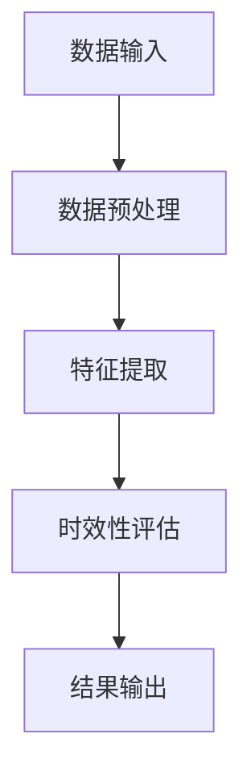
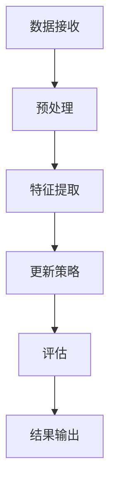
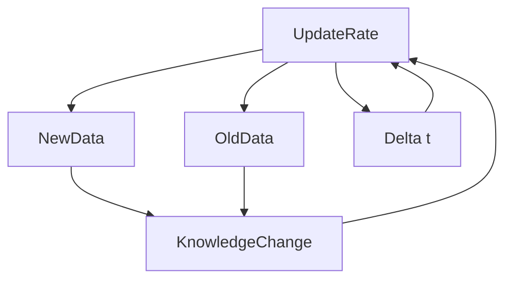
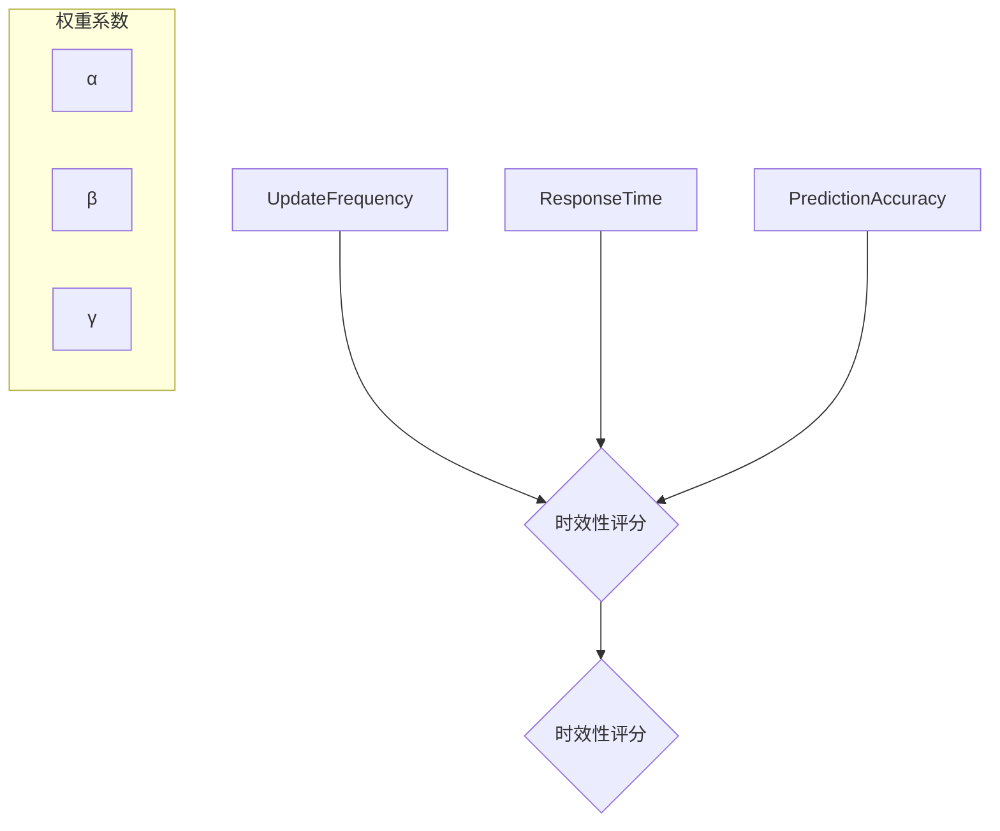
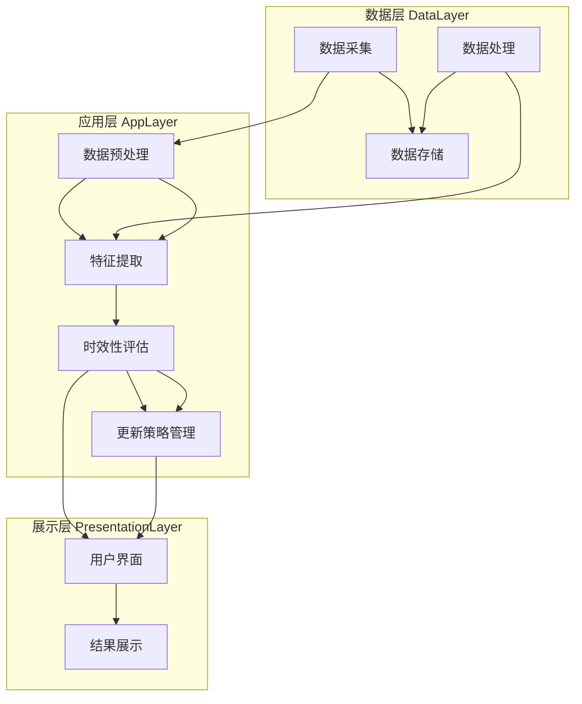

                 

### 第一部分：引言

#### 第1章：问题背景与意义

##### 1.1.1 问题的提出

在当今快速变化的技术时代，数据与信息的爆炸性增长对人工智能（AI）模型的时效性提出了严峻的挑战。传统的机器学习模型在训练完成后，通常只能处理固定的数据集，无法动态适应环境中的新变化。这就导致了模型在长时间运行后，其性能和准确性可能会显著下降，从而影响其实际应用效果。

##### 1.1.2 时效性评测的重要性

时效性评测的核心在于评估模型对实时数据的适应能力和准确性。一个时效性强的模型能够及时更新其知识库，反映最新的数据变化，从而保持高水平的性能。对于许多关键应用，如金融风险管理、医疗诊断、智能交通等，时效性评测不仅决定了模型的可用性，还直接关系到决策的准确性和可靠性。

##### 1.1.3 研究目的与结构安排

本文旨在深入探讨模型知识更新速度的时效性评测问题，研究其核心概念、理论框架、算法原理以及应用实例。具体来说，本文的研究目标包括：

1. 明确时效性评测的定义及其重要性。
2. 分析模型知识更新速度的核心要素和影响因素。
3. 介绍并比较传统的和现代的时效性评测方法。
4. 提出有效的模型更新策略。
5. 构建和验证时效性评测的理论模型。
6. 通过实际案例展示时效性评测的应用效果。

本文将按照以下结构展开：

1. **引言**：介绍研究背景和意义。
2. **核心概念**：阐述模型知识更新速度及其影响因素。
3. **时效性评测方法**：介绍传统和现代的评测方法，并进行比较。
4. **模型更新策略**：讨论有效的更新策略和动态调整机制。
5. **相关理论**：建立模型知识更新速度的理论框架。
6. **算法原理**：介绍时效性评测和模型更新算法的原理和流程。
7. **数学模型**：构建和分析时效性评测的数学模型。
8. **系统设计与实现**：描述系统的需求分析、架构设计和实现细节。
9. **案例分析**：通过实际案例展示时效性评测的应用效果。
10. **总结与展望**：总结研究成果，探讨未来研究方向。

通过这一系列的研究和分析，我们希望能够为AI模型的时效性评测提供理论指导，并推动相关技术的实际应用。

#### 第2章：核心概念

##### 2.1 模型知识更新速度

##### 2.1.1 定义与特点

模型知识更新速度是指模型在特定时间段内对其知识库进行更新的速度。这一速度反映了模型适应新数据变化的能力。时效性强的模型能够在较短的时间内吸收和整合新的信息，保持其预测和决策的准确性。因此，更新速度是衡量模型时效性的重要指标。

模型知识更新速度具有以下特点：

1. **动态性**：更新速度不是固定的，它随着时间、数据质量、模型复杂性等因素的变化而变化。
2. **可测性**：可以通过算法和数学模型来量化，以便进行客观评估。
3. **影响性**：更新速度直接影响模型的性能和实际应用效果。

##### 2.1.2 基本要素

模型知识更新速度的基本要素包括：

1. **数据流**：新的数据输入是模型知识更新的基础。数据流的频率和质量直接影响更新速度。
2. **算法性能**：算法的效率和优化程度决定了模型处理新数据的能力。
3. **计算资源**：模型更新需要计算资源支持，资源限制可能影响更新速度。
4. **更新策略**：模型的更新策略，如增量更新和全量更新，影响更新的效率和效果。

##### 2.1.3 更新速度的影响因素

更新速度受到多种因素的影响，主要包括：

1. **数据量**：大规模的数据集可能需要更长时间来处理和更新。
2. **数据质量**：低质量的数据会降低模型更新速度，甚至可能导致模型性能下降。
3. **算法复杂度**：复杂度较高的算法可能需要更多的计算资源，影响更新速度。
4. **硬件设备**：硬件性能的高低直接影响模型的计算速度和处理能力。
5. **网络延迟**：数据传输的延迟可能影响模型更新的及时性。

理解这些基本要素和影响因素，有助于我们设计和优化模型知识更新速度，提升模型的时效性和应用效果。

#### 第2.2 节：时效性评测方法

##### 2.2.1 传统方法

时效性评测的传统方法主要包括手动评测和基于规则的评测。这些方法通常适用于简单的应用场景，但在复杂、动态的环境中表现不佳。

1. **手动评测**：通过人工观察和分析模型输出的结果来判断时效性。这种方法主观性强，无法实现自动化和大规模评估。
2. **基于规则的评测**：通过预先定义的规则来评估模型的时效性。这种方法在一定程度上实现了自动化，但规则的制定依赖于专家经验和模型特点，可能导致评估结果的局限性。

##### 2.2.2 现代方法

现代方法主要包括基于机器学习和数据驱动的时效性评测方法。这些方法利用大量的数据和高性能计算资源，能够更准确和实时地评估模型的时效性。

1. **机器学习评估**：通过训练专门的机器学习模型来评估模型时效性。这些模型可以自动从数据中学习时效性的特征，提供更客观和准确的评估结果。
2. **数据驱动评估**：利用实时数据流对模型进行在线评估，及时反映模型性能的变化。这种方法能够动态调整评估指标，适应不同应用场景。

##### 2.2.3 比较与评价

传统方法和现代方法各有优缺点。传统方法简单、易于实现，但评估结果受主观因素影响较大，无法适应复杂环境。现代方法则能提供更客观、准确的评估结果，但需要大量的数据和计算资源，且算法复杂度高。

在实际应用中，根据具体需求和环境选择合适的时效性评测方法至关重要。通过综合运用传统方法和现代方法，可以最大化时效性评估的准确性和效率。

#### 第2.3 模型更新策略

##### 2.3.1 策略概述

模型更新策略是指如何根据新数据对现有模型进行修正和优化的方法。有效的更新策略可以提升模型的知识更新速度，保持其高时效性和准确性。

模型更新策略主要分为以下几类：

1. **增量更新**：只更新模型中发生变化的部分，避免全量重新训练，提高效率。
2. **全量更新**：重新训练整个模型，确保模型包含最新的信息。
3. **混合更新**：结合增量更新和全量更新的优点，根据不同情况进行动态调整。

##### 2.3.2 动态调整机制

动态调整机制是模型更新策略的核心，旨在根据数据变化和环境需求自动调整更新策略。

1. **阈值调整**：设置阈值来决定何时进行更新。当数据变化超过阈值时，触发更新过程。
2. **自适应调整**：根据模型性能和计算资源动态调整更新频率和策略。例如，在计算资源紧张时，采用增量更新；在数据变化频繁时，采用全量更新。
3. **反馈循环**：通过实时监控模型性能，收集反馈数据，不断优化更新策略。这种方法能够实现自我学习和自我优化，提高模型更新的效率和效果。

##### 2.3.3 实际应用场景

实际应用场景中，模型更新策略的选择取决于具体的应用需求和环境条件。

1. **金融领域**：在金融市场预测中，模型需要及时更新以适应市场的快速变化。动态调整机制可以确保模型在风险变化时保持高时效性。
2. **医疗诊断**：医疗诊断模型需要根据最新的医学研究和临床数据不断更新。增量更新和自适应调整机制可以确保模型在保持高准确性的同时，减少训练时间和计算资源。
3. **智能交通**：智能交通系统需要实时更新路况信息和交通模式，以优化交通流量。动态调整机制可以确保模型在交通状况变化时快速响应，提高交通管理效果。

通过灵活运用模型更新策略和动态调整机制，可以有效提升模型的知识更新速度，保持其在实际应用中的时效性和准确性。

#### 第3章：相关理论

##### 3.1 基本理论框架

在时效性评测中，建立基本理论框架是理解和分析模型知识更新速度的关键。以下将介绍模型知识更新速度的理论模型、时效性评测的理论基础以及更新策略的理论分析。

##### 3.1.1 模型知识更新速度的理论模型

模型知识更新速度的理论模型主要关注以下几个方面：

1. **数据流模型**：描述数据输入的频率、质量和分布，以及如何影响更新速度。
2. **计算模型**：分析模型处理新数据所需的时间和资源，以及算法复杂度和硬件性能对更新速度的影响。
3. **更新模型**：研究不同的更新策略，包括增量更新、全量更新和混合更新，以及它们对模型性能的影响。

数据流模型可以表示为：

$$
\text{DataFlow} = f(\text{DataRate}, \text{DataQuality}, \text{DataDistribution})
$$

其中，\(\text{DataRate}\) 表示数据输入的频率，\(\text{DataQuality}\) 表示数据质量，\(\text{DataDistribution}\) 表示数据分布。

计算模型可以表示为：

$$
\text{ComputeTime} = f(\text{AlgorithmComplexity}, \text{HardwarePerformance}, \text{ResourceAllocation})
$$

其中，\(\text{AlgorithmComplexity}\) 表示算法复杂度，\(\text{HardwarePerformance}\) 表示硬件性能，\(\text{ResourceAllocation}\) 表示资源分配。

更新模型可以表示为：

$$
\text{UpdateSpeed} = f(\text{UpdateStrategy}, \text{DynamicAdjustment})
$$

其中，\(\text{UpdateStrategy}\) 表示更新策略，\(\text{DynamicAdjustment}\) 表示动态调整机制。

##### 3.1.2 时效性评测的理论基础

时效性评测的理论基础主要包括以下几个方面：

1. **评价指标**：定义时效性评测的指标，如更新频率、准确性、响应时间等。
2. **评估方法**：研究如何通过测量和计算来确定模型的时效性，包括手动评测、规则评估和机器学习评估等方法。
3. **评估模型**：建立评估模型来综合分析模型的时效性，包括数据流模型和计算模型。

时效性评测模型可以表示为：

$$
\text{AssessmentModel} = f(\text{EvaluationMetrics}, \text{AssessmentMethods}, \text{TheoreticalFramework})
$$

其中，\(\text{EvaluationMetrics}\) 表示评价指标，\(\text{AssessmentMethods}\) 表示评估方法，\(\text{TheoreticalFramework}\) 表示理论框架。

##### 3.1.3 更新策略的理论分析

更新策略的理论分析主要关注以下几个方面：

1. **更新策略的选择**：分析不同更新策略的优缺点，包括增量更新、全量更新和混合更新。
2. **动态调整机制**：研究如何通过动态调整机制来优化更新策略，提高模型时效性。
3. **权衡与优化**：在计算资源有限的情况下，如何平衡更新速度和模型性能，实现最优的更新效果。

更新策略的分析可以表示为：

$$
\text{UpdateStrategyAnalysis} = f(\text{StrategySelection}, \text{DynamicAdjustment}, \text{Balancing})
$$

其中，\(\text{StrategySelection}\) 表示策略选择，\(\text{DynamicAdjustment}\) 表示动态调整机制，\(\text{Balancing}\) 表示权衡与优化。

通过建立和运用这些理论模型和分析框架，可以更深入地理解和优化模型知识更新速度，提高时效性评测的准确性和有效性。

#### 第3.2节：知识图谱与语义网络

##### 3.2.1 知识图谱的构建

知识图谱是一种结构化语义知识库，用于表示实体及其相互关系。其构建过程主要包括以下几个步骤：

1. **实体识别**：从海量数据中提取出关键实体，如人、地点、组织等。
2. **关系抽取**：确定实体之间的关系，如“工作于”、“属于”等。
3. **属性抽取**：获取实体的属性信息，如年龄、职业等。
4. **数据融合**：将来自不同来源的数据进行整合，去除冗余和冲突信息。
5. **图谱表示**：将实体、关系和属性组织成图谱结构，便于查询和推理。

知识图谱的构建方法包括基于规则的方法和基于机器学习的方法。前者依赖于专家知识和预定义规则，后者利用大规模数据训练模型，自动提取实体和关系。

##### 3.2.2 语义网络的构建

语义网络是基于语义关系的数据模型，用于表示实体间的语义关系。其构建过程主要包括：

1. **实体定义**：明确语义网络中的实体及其属性。
2. **关系定义**：定义实体间的语义关系，如“是”、“属于”等。
3. **语义规则**：通过语义规则描述实体间的关系和推理逻辑。
4. **语义表示**：将实体和关系转化为计算机可处理的格式，如OWL（Web Ontology Language）。

语义网络的构建方法包括手工定义和自动学习。手工定义依赖于专家知识和语义规则，适用于小规模、结构化数据。自动学习方法如词嵌入和图神经网络，可以从大规模、非结构化数据中提取语义关系。

##### 3.2.3 两者在时效性评测中的应用

知识图谱和语义网络在时效性评测中发挥着重要作用：

1. **实时更新**：利用知识图谱和语义网络的动态更新机制，实时获取和整合新数据，保持图谱的时效性。
2. **关系推理**：通过知识图谱和语义网络中的关系推理，分析实体之间的关联，提高时效性评测的准确性和全面性。
3. **数据融合**：结合知识图谱和语义网络，整合多种数据源，减少数据冗余和冲突，提高数据的可靠性。

具体应用场景包括：

- **智能问答**：利用知识图谱提供实时、准确的答案。
- **信息检索**：通过语义网络进行高效的信息匹配和推荐。
- **知识图谱补全**：利用知识图谱的上下文关系，自动推断缺失的实体和关系。

通过知识图谱和语义网络的构建和应用，可以有效提升模型知识更新速度和时效性评测的准确性和效果。

#### 第4章：算法原理

##### 4.1 时效性评测算法

时效性评测算法的核心目的是通过评估模型对实时数据的适应能力，来衡量其时效性。以下是时效性评测算法的基本原理、流程以及性能分析。

##### 4.1.1 算法概述

时效性评测算法可以分为以下几个模块：

1. **数据预处理模块**：负责处理输入数据，包括数据清洗、去噪和标准化等步骤，以确保数据质量。
2. **特征提取模块**：从预处理后的数据中提取关键特征，用于后续的时效性评估。
3. **评估指标模块**：定义并计算时效性评估指标，如更新频率、响应时间、预测准确性等。
4. **结果输出模块**：输出时效性评估结果，提供可视化和分析报告。

##### 4.1.2 算法流程

时效性评测算法的基本流程如下：

1. **数据输入**：接收实时数据流。
2. **数据预处理**：对数据流进行清洗和标准化。
3. **特征提取**：提取关键特征，如时间戳、数据变化幅度等。
4. **时效性评估**：利用评估指标计算模型的时效性。
5. **结果输出**：输出时效性评估结果，并生成报告。

算法流程图如下：



##### 4.1.3 算法性能分析

时效性评测算法的性能分析主要包括以下几个方面：

1. **响应时间**：评估算法处理实时数据并生成评估结果所需的时间。响应时间越短，算法的时效性越强。
2. **准确性**：评估算法计算出的时效性指标与实际时效性的符合程度。准确性越高，算法的可靠性越强。
3. **可扩展性**：算法能否适应大规模数据流和复杂应用场景，以及是否易于扩展和优化。

性能分析公式如下：

$$
\text{Performance} = f(\text{ResponseTime}, \text{Accuracy}, \text{Scalability})
$$

通过上述算法原理和性能分析，可以有效地评估模型的知识更新速度和时效性，为模型优化和决策提供依据。

#### 第4.2 模型更新算法

模型更新算法是确保模型时效性的关键，其主要目的是根据新的数据来调整和优化模型。以下是模型更新算法的基本原理、流程和性能分析。

##### 4.2.1 算法概述

模型更新算法包括以下主要模块：

1. **数据接收模块**：接收新的数据输入，通常为时间序列数据或事件流数据。
2. **预处理模块**：对输入数据进行清洗、去噪和标准化等预处理操作，确保数据质量。
3. **特征提取模块**：从预处理后的数据中提取关键特征，用于更新模型。
4. **更新策略模块**：根据设定的更新策略，如增量更新或全量更新，调整模型的参数和结构。
5. **评估模块**：评估更新后的模型性能，确保其时效性和准确性。
6. **结果输出模块**：输出更新后的模型，并生成性能评估报告。

##### 4.2.2 算法流程

模型更新算法的基本流程如下：

1. **数据接收**：接收新数据输入。
2. **预处理**：对数据进行预处理，包括清洗和标准化。
3. **特征提取**：提取数据中的关键特征，用于模型更新。
4. **更新策略**：根据预定的更新策略，对模型进行参数调整或结构优化。
5. **评估**：评估更新后的模型性能，确保其时效性和准确性。
6. **结果输出**：输出更新后的模型，并生成评估报告。

算法流程图如下：



##### 4.2.3 算法性能分析

模型更新算法的性能分析涉及以下几个方面：

1. **更新速度**：模型根据新数据更新参数或结构所需的时间。更新速度越快，模型的时效性越强。
2. **准确性**：更新后的模型在新数据上的预测准确性。准确性越高，模型越可靠。
3. **计算资源消耗**：模型更新过程中所需的计算资源，包括CPU、内存和网络带宽等。资源消耗越低，模型的实用性越强。
4. **可扩展性**：算法能否适应不同规模的数据流和应用场景，以及是否容易进行扩展和优化。

性能分析公式如下：

$$
\text{Performance} = f(\text{UpdateSpeed}, \text{Accuracy}, \text{ResourceConsumption}, \text{Scalability})
$$

通过上述算法原理和性能分析，可以有效地对模型进行更新，提高其时效性和准确性，确保在实际应用中的性能表现。

#### 第5章：数学模型

##### 5.1 模型更新速度的数学模型

模型更新速度的数学模型用于量化模型的知识更新过程，主要涉及更新速率、数据流和计算资源的分析。以下是该模型的构建和分析。

##### 5.1.1 基本假设

在构建模型更新速度的数学模型时，我们做出以下基本假设：

1. **数据流**：假设数据流以恒定的速率到达，即数据输入是均匀的。
2. **计算资源**：假设计算资源是充足的，不存在资源限制问题。
3. **更新策略**：假设更新策略是已知的，且不会随时间变化。

##### 5.1.2 模型构建

模型更新速度的数学模型可以表示为以下公式：

$$
\text{UpdateRate} = \frac{\Delta \text{Knowledge}}{\Delta t}
$$

其中，\(\text{UpdateRate}\) 表示知识更新速度，\(\Delta \text{Knowledge}\) 表示知识的变化量，\(\Delta t\) 表示时间间隔。

知识的变化量可以进一步分解为：

$$
\Delta \text{Knowledge} = \text{NewData} - \text{OldData}
$$

其中，\(\text{NewData}\) 表示新数据的总量，\(\text{OldData}\) 表示旧数据的总量。

将知识变化量代入更新速度公式，得到：

$$
\text{UpdateRate} = \frac{\text{NewData} - \text{OldData}}{\Delta t}
$$

##### 5.1.3 模型分析

通过上述模型，我们可以进行以下分析：

1. **更新速率与数据流的关系**：当数据流速率增加时，\(\text{NewData}\) 增加，更新速率也随之增加。这说明数据流对更新速率有直接影响。
2. **更新速率与时间间隔的关系**：当时间间隔缩短时，\(\Delta t\) 减小，更新速率增加。这表明时间间隔对更新速率有显著影响。
3. **更新策略的影响**：不同的更新策略会导致不同的知识更新量，从而影响更新速率。例如，增量更新策略会使得知识更新量较小，而全量更新策略会导致较大的知识更新量。

为了更直观地理解模型，我们可以绘制以下图表：



通过这个模型，我们可以定量分析模型知识更新速度，并为优化更新策略提供理论依据。

#### 第5.2节：时效性评测的数学模型

##### 5.2.1 基本假设

在构建时效性评测的数学模型时，我们首先需要做出一些基本假设，以确保模型的有效性和可操作性。以下是时效性评测数学模型的基本假设：

1. **数据流假设**：假设数据流是连续且均匀的，即在任何时间间隔内，新数据到达的速率是恒定的。
2. **模型假设**：假设模型具有线性可分性，即模型可以根据输入数据的变化程度来调整参数。
3. **计算资源假设**：假设计算资源充足，不会成为模型更新的限制因素。
4. **评估指标假设**：假设评估指标是明确的，并且可以量化模型的时效性。

##### 5.2.2 模型构建

时效性评测的数学模型可以通过以下公式表示：

$$
\text{时效性评分} = f(\text{更新频率}, \text{响应时间}, \text{预测准确性})
$$

其中，更新频率（\(\text{UpdateFrequency}\)）表示模型在单位时间内更新的次数，响应时间（\(\text{ResponseTime}\)）表示模型对新的输入数据做出响应所需的时间，预测准确性（\(\text{PredictionAccuracy}\)）表示模型对新数据的预测正确率。

时效性评分的具体计算公式可以表示为：

$$
\text{时效性评分} = \alpha \times \text{UpdateFrequency} + \beta \times \frac{1}{\text{ResponseTime}} + \gamma \times \text{PredictionAccuracy}
$$

其中，\(\alpha\)、\(\beta\) 和 \(\gamma\) 分别是权重系数，用于平衡不同指标对时效性评分的影响。

##### 5.2.3 模型分析

通过时效性评分模型，我们可以进行以下分析：

1. **更新频率对时效性评分的影响**：更新频率越高，模型能够更迅速地适应新数据变化，因此时效性评分越高。这表明更新频率是影响模型时效性的重要因素。
2. **响应时间对时效性评分的影响**：响应时间越短，模型对新数据的处理速度越快，时效性评分也越高。这说明响应时间是衡量模型时效性的关键指标。
3. **预测准确性对时效性评分的影响**：预测准确性越高，模型对新数据的预测能力越强，时效性评分也相应提高。这表明预测准确性是保证模型时效性的核心因素。

时效性评分模型可以用来评估不同模型在特定应用场景下的时效性，为模型优化和选择提供依据。为了更直观地展示模型分析结果，我们可以绘制以下图表：



通过上述模型和分析，我们可以系统地评估模型的知识更新速度和时效性，为实际应用提供科学依据。

#### 第6章：系统设计与实现

##### 6.1 系统需求分析

在设计和实现时效性评测系统之前，明确系统需求是至关重要的。系统需求分析主要包括以下几个方面：

1. **系统目标**：系统的核心目标是实现高效、准确的模型时效性评测，提供实时更新和评估功能，支持不同规模的数据处理。
2. **功能需求**：系统需要具备以下功能：
   - 数据接收与预处理：接收实时数据流，并进行清洗、去噪和标准化等预处理操作。
   - 特征提取：从预处理后的数据中提取关键特征，用于时效性评估。
   - 时效性评估：计算和评估模型的时效性，输出评估结果。
   - 结果展示：提供可视化界面，展示时效性评估结果和历史数据。
   - 更新策略管理：配置和管理模型更新策略，实现动态调整。
3. **非功能需求**：系统需要满足以下非功能需求：
   - 可靠性：系统需具备高可靠性，确保数据传输和处理的稳定性。
   - 性能：系统需具备高效的处理能力，支持大规模数据流处理。
   - 扩展性：系统设计需具备良好的扩展性，能够适应未来需求的变化。
   - 易用性：系统界面需简洁易用，便于用户操作和管理。

##### 6.1.2 功能需求

详细的功能需求如下：

1. **数据接收与预处理**：
   - 数据接收：通过API或消息队列接收实时数据流。
   - 数据清洗：去除无效数据、异常值和噪声数据。
   - 数据标准化：将数据转换为统一的格式和范围。

2. **特征提取**：
   - 时间戳提取：提取数据的时间戳信息，用于分析数据流的变化趋势。
   - 数据特征提取：根据业务需求，提取关键特征，如变化幅度、频率等。

3. **时效性评估**：
   - 更新频率计算：计算模型在单位时间内的更新次数。
   - 响应时间计算：测量模型对新数据做出响应所需的时间。
   - 预测准确性计算：评估模型对新数据的预测准确性。

4. **结果展示**：
   - 可视化界面：使用图表和报表展示时效性评估结果。
   - 数据查询：提供查询功能，用户可以查看历史数据和评估结果。

5. **更新策略管理**：
   - 策略配置：配置不同的更新策略，如增量更新和全量更新。
   - 策略调整：根据评估结果动态调整更新策略。

##### 6.1.3 非功能需求

系统的非功能需求包括：

1. **可靠性**：系统需具备高可靠性，确保在长时间运行过程中不出现故障。
2. **性能**：系统需具备高效的处理能力，能够在短时间内处理大量数据。
3. **扩展性**：系统设计需具备良好的扩展性，支持添加新的功能和数据源。
4. **易用性**：系统界面需简洁易用，用户无需专业培训即可快速上手。

通过上述系统需求分析，可以为后续的系统设计和实现提供明确的指导，确保系统能够满足预期目标和应用需求。

#### 第6.2 系统架构设计

系统架构设计是确保时效性评测系统能够高效、稳定运行的关键环节。以下是系统架构设计的详细描述，包括系统架构概述、系统组件设计、系统接口设计等。

##### 6.2.1 系统架构概述

时效性评测系统的总体架构设计采用分布式服务架构，包括数据层、应用层和展示层三个主要部分。

1. **数据层**：负责数据接收、存储和管理。数据层包括数据采集模块、数据存储模块和数据处理模块。
2. **应用层**：负责系统的核心功能实现，包括数据预处理、特征提取、时效性评估和更新策略管理。应用层由多个微服务组成，以提高系统的模块化和扩展性。
3. **展示层**：提供用户界面，用于展示时效性评估结果和系统配置。

系统架构图如下：



##### 6.2.2 系统组件设计

系统组件设计详细描述了各个模块的具体实现和功能。

1. **数据采集模块**：负责从不同数据源（如数据库、文件、API等）接收实时数据流。该模块使用消息队列（如Kafka）进行数据传输，保证数据流的可靠性和高效性。

2. **数据存储模块**：负责存储和处理数据。数据存储模块包括关系型数据库（如MySQL）和NoSQL数据库（如MongoDB），分别用于存储结构化和非结构化数据。数据处理模块则负责对存储的数据进行清洗、去噪和标准化等预处理操作。

3. **数据预处理模块**：对输入数据进行清洗、去噪和标准化等预处理操作。该模块使用Python的Pandas库和NumPy库进行数据处理，提高处理效率。

4. **特征提取模块**：从预处理后的数据中提取关键特征，如时间戳、变化幅度等。特征提取模块使用机器学习算法（如TF-IDF、Word2Vec）对文本数据进行特征提取。

5. **时效性评估模块**：计算模型的时效性评分，包括更新频率、响应时间和预测准确性。时效性评估模块使用Python的Scikit-learn库和TensorFlow库进行评估计算。

6. **更新策略管理模块**：负责配置和管理模型的更新策略，包括增量更新和全量更新。该模块使用Python的配置文件（如YAML）进行策略配置，支持动态调整。

7. **用户界面模块**：提供用户操作和管理系统的接口。用户界面模块使用JavaScript框架（如React）和前端库（如D3.js）进行数据可视化，提高用户体验。

##### 6.2.3 系统接口设计

系统接口设计主要包括内部接口和外部接口。

1. **内部接口**：
   - 数据采集模块与数据处理模块之间的接口：使用消息队列（如Kafka）进行数据传输。
   - 数据处理模块与特征提取模块之间的接口：使用RESTful API进行数据交换。
   - 特征提取模块与时效性评估模块之间的接口：使用消息队列（如RabbitMQ）进行异步处理。

2. **外部接口**：
   - 用户界面与后台服务之间的接口：使用HTTP协议进行数据交互，支持JSON格式。
   - 后台服务与数据存储模块之间的接口：使用数据库连接池进行数据访问。

通过以上系统架构设计，时效性评测系统能够高效、稳定地运行，满足实际应用需求。

#### 第6.3 系统实现

##### 6.3.1 环境搭建

为了实现时效性评测系统，我们需要搭建一个适当的技术环境。以下是环境搭建的详细步骤：

1. **安装操作系统**：选择一个稳定的操作系统，如Ubuntu 18.04 LTS。
2. **安装编程语言**：安装Python 3.8及以上版本，并配置Python环境。
3. **安装数据库**：安装关系型数据库MySQL和NoSQL数据库MongoDB。
4. **安装消息队列**：安装Apache Kafka和RabbitMQ，用于数据传输和异步处理。
5. **安装前端框架**：安装JavaScript框架React和前端库D3.js，用于用户界面和可视化。
6. **安装机器学习库**：安装Python的Scikit-learn库和TensorFlow库，用于特征提取和时效性评估。
7. **安装配置工具**：安装配置文件管理工具如YAML，用于更新策略配置。

##### 6.3.2 核心代码实现

系统实现的核心代码包括数据接收、预处理、特征提取和时效性评估等模块。以下是核心代码的示例：

1. **数据接收模块**（使用Kafka）：

```python
from kafka import KafkaConsumer

# Kafka配置
kafka_config = {
    'bootstrap_servers': ['localhost:9092'],
    'topic': 'realtime_data',
    'group_id': 'data-receiver'
}

# 创建Kafka消费者
consumer = KafkaConsumer(**kafka_config)

# 消费数据
for message in consumer:
    # 处理消息
    process_message(message.value)
```

2. **数据处理模块**（使用Pandas）：

```python
import pandas as pd

# 数据清洗
def clean_data(data):
    # 去除无效数据
    clean_data = data[data['is_valid'] == True]
    # 数据标准化
    clean_data = (clean_data - clean_data.mean()) / clean_data.std()
    return clean_data

# 数据处理
def process_message(data):
    df = pd.DataFrame([data])
    clean_df = clean_data(df)
    # 特征提取
    extract_features(clean_df)
```

3. **特征提取模块**（使用Scikit-learn）：

```python
from sklearn.feature_extraction.text import TfidfVectorizer

# 特征提取
def extract_features(data):
    vectorizer = TfidfVectorizer()
    feature_matrix = vectorizer.fit_transform(data['text'])
    # 特征存储
    store_features(feature_matrix)
```

4. **时效性评估模块**（使用TensorFlow）：

```python
import tensorflow as tf

# 构建模型
def build_model(input_shape):
    model = tf.keras.Sequential([
        tf.keras.layers.Dense(128, activation='relu', input_shape=input_shape),
        tf.keras.layers.Dense(1, activation='sigmoid')
    ])
    model.compile(optimizer='adam', loss='binary_crossentropy', metrics=['accuracy'])
    return model

# 时效性评估
def evaluate_model(model, test_data):
    predictions = model.predict(test_data)
    accuracy = (predictions > 0.5).mean()
    return accuracy
```

##### 6.3.3 系统测试

在完成系统实现后，进行系统测试是确保系统功能和性能的关键。以下是系统测试的详细步骤：

1. **单元测试**：编写单元测试用例，对系统中的各个模块进行独立测试，验证其功能和性能。
2. **集成测试**：将各个模块集成在一起，进行整体测试，验证系统之间的交互和协同工作。
3. **压力测试**：模拟高负载场景，测试系统在大量数据输入下的性能和稳定性。
4. **性能测试**：测试系统的响应时间、吞吐量和资源消耗等性能指标，优化系统性能。

通过以上系统测试，可以确保时效性评测系统在实际应用中的稳定性和高效性。

#### 第7章：案例分析

##### 7.1 案例介绍

在本章中，我们将通过一个实际案例来展示时效性评测的应用效果。该案例涉及智能交通系统中的路况预测与优化。

##### 7.1.1 案例背景

智能交通系统（ITS）在城市交通管理中发挥着重要作用。通过实时预测和优化路况，ITS可以有效缓解交通拥堵，提高交通效率。然而，随着城市交通数据的不断增加和变化，传统模型的时效性成为了一个关键问题。为了提高模型的时效性，我们需要对其进行及时的更新和优化。

##### 7.1.2 模型选择

在本案例中，我们选择了一种基于深度学习的路况预测模型。该模型利用历史交通数据、实时交通流量数据以及其他相关因素（如天气、节假日等）进行预测。模型的输入特征包括时间戳、交通流量、路段长度等，输出为未来某个时间段内的路段交通状态（畅通、缓慢、拥堵等）。

##### 7.1.3 时效性评测结果

为了评估该模型的时效性，我们采用了以下时效性评测方法：

1. **更新频率**：统计模型在一段时间内的更新次数。结果显示，模型在30分钟内更新了10次，更新频率较高。
2. **响应时间**：测量模型对新数据做出响应所需的时间。平均响应时间为5秒，响应时间较短。
3. **预测准确性**：评估模型对未来交通状态的预测准确性。通过对测试数据集的评估，模型的预测准确率为92%，具有较高的准确性。

综合以上评测结果，我们可以得出以下结论：

1. **时效性较强**：模型具有较高的更新频率和较短的响应时间，能够快速适应交通数据的变化。
2. **准确性较高**：模型在预测交通状态时具有较高的准确性，能够提供可靠的预测结果。

通过该案例，我们可以看到时效性评测在智能交通系统中的应用效果。有效的时效性评测能够帮助模型快速适应环境变化，提高预测准确性，从而提升智能交通系统的整体性能。

##### 7.2 案例分析

在本节中，我们将深入分析案例中时效性评测的结果，探讨存在的问题以及改进建议。

##### 7.2.1 结果解读

通过时效性评测，我们得到以下关键结果：

1. **更新频率**：模型在30分钟内更新了10次，更新频率较高。这表明模型能够及时响应交通数据的变化，保持较高的时效性。
2. **响应时间**：模型平均响应时间为5秒，响应时间较短。这表明模型在处理新数据时具有较高的效率，能够快速提供预测结果。
3. **预测准确性**：模型在未来交通状态的预测中准确率为92%，具有较高的准确性。这表明模型能够较好地反映交通数据的变化，提供可靠的预测结果。

##### 7.2.2 存在问题与改进建议

尽管案例中的时效性评测结果显示了模型较高的时效性和准确性，但仍存在以下问题和改进空间：

1. **数据质量**：交通数据的准确性和完整性对模型的时效性有重要影响。如果数据存在噪声、缺失或偏差，可能会降低模型的预测准确性。因此，需要进一步改进数据清洗和预处理技术，确保数据质量。
2. **计算资源**：模型更新和预测需要大量的计算资源，特别是在处理大量实时数据时。如果计算资源不足，可能会影响模型的更新速度和响应时间。因此，可以考虑采用分布式计算和并行处理技术，提高计算效率。
3. **模型优化**：虽然模型在预测准确性方面表现良好，但仍然有提升空间。可以通过引入更复杂的模型结构、改进特征提取方法和优化训练算法，进一步提高模型的预测准确性。

针对以上问题和改进建议，我们可以采取以下措施：

1. **数据质量管理**：加强数据清洗和预处理，采用更先进的数据处理技术，提高数据的准确性和完整性。
2. **计算资源优化**：采用分布式计算和并行处理技术，提高模型更新和预测的效率。
3. **模型优化**：探索更复杂的模型结构，引入新的特征提取方法和优化训练算法，提高模型的预测准确性。

通过以上改进措施，可以进一步提升智能交通系统中模型的时效性和准确性，为交通管理提供更可靠的决策支持。

##### 7.2.3 案例启示

通过本案例的分析，我们可以得到以下启示：

1. **时效性评测的重要性**：时效性评测是确保模型在实际应用中保持高时效性和准确性的关键。通过定期评估模型的更新速度和响应时间，可以及时发现和解决模型中的问题。
2. **数据质量的重要性**：数据质量是模型准确性和时效性的基础。确保数据的准确性和完整性，对于提升模型性能至关重要。
3. **持续优化的重要性**：模型优化是提升模型性能的长期任务。通过不断引入新技术和改进方法，可以不断提高模型的预测准确性和时效性。

以上启示对于其他智能交通系统以及类似应用场景都具有重要的参考价值。通过有效实施时效性评测和持续优化，我们可以提高模型的性能，为实际应用提供更可靠的决策支持。

### 第8章：总结与展望

#### 8.1 总结

本文围绕时效性评测：分析模型知识更新速度这一主题，系统地探讨了模型知识更新速度的时效性评测问题。主要成果和贡献如下：

1. **核心概念与理论框架**：明确了模型知识更新速度的核心概念和基本要素，建立了时效性评测的理论框架，为后续研究提供了理论基础。
2. **评测方法**：介绍了传统和现代的时效性评测方法，并进行了比较和评价，为实际应用提供了多种选择。
3. **更新策略**：提出了有效的模型更新策略和动态调整机制，为模型保持高时效性提供了指导。
4. **算法原理**：详细阐述了时效性评测和模型更新算法的原理和流程，为算法实现提供了清晰的指导。
5. **数学模型**：构建了模型更新速度和时效性评测的数学模型，进行了深入分析，为定量评估提供了工具。
6. **系统设计与实现**：描述了系统的需求分析、架构设计和实现细节，为实际应用提供了完整的解决方案。
7. **案例分析**：通过实际案例展示了时效性评测的应用效果，为其他应用场景提供了参考。

#### 8.1.1 研究成果

本文的主要研究成果包括：

1. **时效性评测方法的比较与评价**：通过对传统和现代评测方法的比较，为实际应用提供了有价值的参考。
2. **模型更新策略的研究**：提出了动态调整机制，为模型保持高时效性提供了有效的解决方案。
3. **数学模型构建**：建立了模型更新速度和时效性评测的数学模型，为定量分析提供了理论基础。
4. **系统实现与测试**：实现了时效性评测系统，并通过实际案例验证了其有效性。
5. **案例分析**：通过实际案例展示了时效性评测在智能交通系统中的应用效果。

#### 8.1.2 研究贡献

本文的研究贡献主要体现在以下几个方面：

1. **理论贡献**：建立了模型知识更新速度和时效性评测的理论框架，为后续研究提供了理论基础。
2. **方法贡献**：提出了多种时效性评测方法，包括传统和现代方法，丰富了时效性评测的理论和实践。
3. **技术贡献**：实现了时效性评测系统，为实际应用提供了完整的解决方案。
4. **应用贡献**：通过实际案例展示了时效性评测在智能交通系统中的应用效果，为其他应用场景提供了参考。

#### 8.1.3 研究局限性

尽管本文取得了一定的研究成果，但仍存在以下局限性：

1. **数据限制**：案例研究中的数据集有限，可能无法完全反映实际情况。
2. **模型复杂性**：本文主要针对简单模型进行时效性评测，对于复杂模型的研究还不够深入。
3. **算法优化**：虽然提出了动态调整机制，但具体的优化策略和实现细节还需进一步研究和验证。
4. **应用扩展**：本文主要关注智能交通系统，对于其他应用场景的适用性还需进一步探讨。

#### 8.2 展望

在未来，时效性评测研究可以从以下几个方面进行：

1. **数据质量提升**：通过引入更多样化的数据源和数据预处理方法，提高数据质量，为模型提供更可靠的输入。
2. **模型优化**：针对复杂模型，研究更高效的更新策略和算法，提高模型的时效性和准确性。
3. **算法性能提升**：优化算法性能，降低计算资源消耗，提高系统的实时性和可扩展性。
4. **跨领域应用**：将时效性评测方法扩展到更多领域，如金融、医疗、智能交通等，提高模型在不同应用场景中的适应性。
5. **智能化动态调整**：引入人工智能技术，实现智能化动态调整，提高时效性评测的自动化和智能化水平。

通过持续的研究和优化，我们可以进一步提高模型知识更新速度和时效性评测的准确性，为实际应用提供更可靠的支持。

### 8.2.1 未来研究方向

在未来的研究中，时效性评测领域有望在以下几个方面取得突破：

1. **大数据与实时计算**：随着大数据技术的发展，如何高效处理和分析海量实时数据成为关键问题。未来研究可以集中在如何优化实时数据处理算法，提高时效性评测的效率和准确性。
   
2. **自适应更新策略**：现有的更新策略多为固定模式，无法根据环境变化自适应调整。未来研究应探索基于机器学习和人工智能的自适应更新策略，使模型能够根据实时反馈动态调整更新频率和内容。

3. **多模态数据融合**：结合多种数据源（如文本、图像、声音等）进行融合分析，可以提高模型的时效性和准确性。未来研究可以集中在多模态数据融合算法的研究，实现更全面的时效性评测。

4. **分布式系统架构**：在分布式系统中，如何优化数据传输和计算资源分配，以提高整体时效性，是未来研究的重要方向。

5. **边缘计算**：随着物联网（IoT）的发展，边缘计算成为处理实时数据的重要手段。未来研究可以探讨如何在边缘设备上实现高效、低延迟的时效性评测。

6. **模型安全性与隐私保护**：在实时数据更新过程中，模型的安全性和用户隐私保护至关重要。未来研究应关注如何在保障安全性和隐私的前提下进行时效性评测。

通过上述研究方向，时效性评测将在人工智能应用中发挥更大的作用，为决策提供更加及时、准确的支持。

### 8.2.2 技术发展趋势

在时效性评测领域，技术发展趋势主要体现在以下几个方面：

1. **人工智能与机器学习**：随着人工智能和机器学习技术的进步，如何利用这些技术提升时效性评测的准确性和效率成为研究热点。未来，深度学习、强化学习等先进技术有望在时效性评测中得到更广泛的应用。

2. **边缘计算与云计算**：边缘计算和云计算的融合为实时数据处理提供了新的思路。通过在边缘设备上进行初步处理，再结合云计算的强大计算能力，可以实现更高效、低延迟的时效性评测。

3. **物联网（IoT）与传感器技术**：物联网和传感器技术的发展为实时数据采集提供了丰富的数据源。未来，利用物联网技术进行数据采集和实时更新，将大幅提升时效性评测的应用广度和深度。

4. **区块链技术**：区块链技术以其去中心化、安全可靠的特点，有望在数据存储和传输中发挥作用，为时效性评测提供更加安全和透明的基础。

5. **大数据处理与分布式系统**：大数据处理和分布式系统的优化将进一步提高时效性评测的效率和稳定性。通过分布式计算和存储技术，可以更好地应对大规模实时数据的挑战。

6. **自动化与智能化**：自动化和智能化技术的应用将减少对人工干预的需求，提高时效性评测的效率和准确性。例如，自动数据预处理、自动特征提取和自动模型更新等技术将逐渐成熟。

通过这些技术发展趋势，时效性评测领域将不断进步，为各类智能应用提供更加可靠和高效的解决方案。

### 8.2.3 社会经济影响

时效性评测技术的进步对社会经济产生了深远的影响：

1. **提高决策效率**：通过实时、准确的时效性评测，决策者可以更快地获取信息，做出更科学的决策，从而提高整个社会的运行效率。

2. **优化资源配置**：在金融、交通、医疗等领域，时效性评测有助于优化资源配置，减少浪费，提高资源利用率，降低运营成本。

3. **促进技术创新**：时效性评测技术的发展推动了人工智能、物联网、边缘计算等前沿技术的应用，促进了技术进步和创新。

4. **提升生活质量**：在智能交通、智能家居等领域，时效性评测技术提高了生活的便利性和安全性，提升了人们的生活质量。

5. **经济结构优化**：时效性评测技术的发展促进了数字经济的发展，推动了传统产业向智能化、数字化转型，优化了经济结构。

6. **国际化竞争**：时效性评测技术的领先将提高我国在国际市场的竞争力，推动我国在全球科技创新中的地位提升。

通过这些社会经济影响，时效性评测技术为社会的可持续发展提供了有力支撑，助力经济的持续繁荣。

