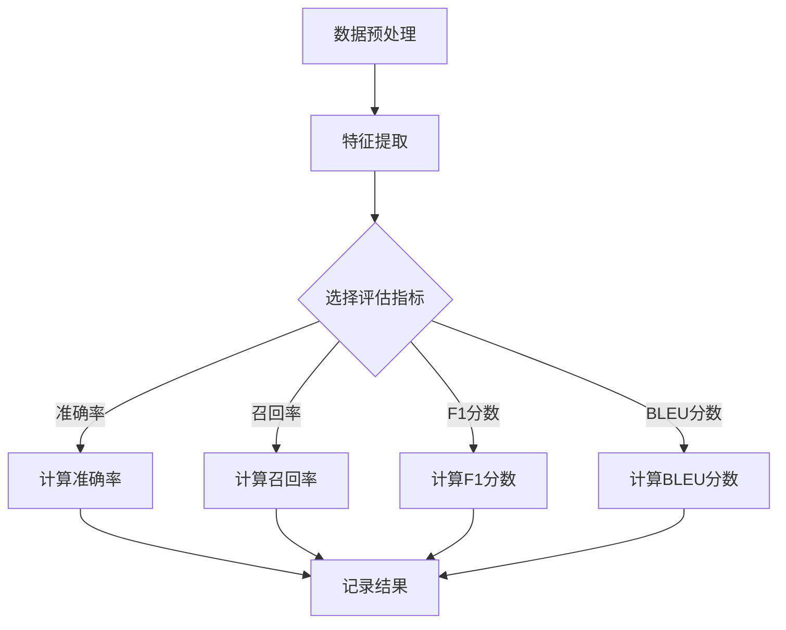
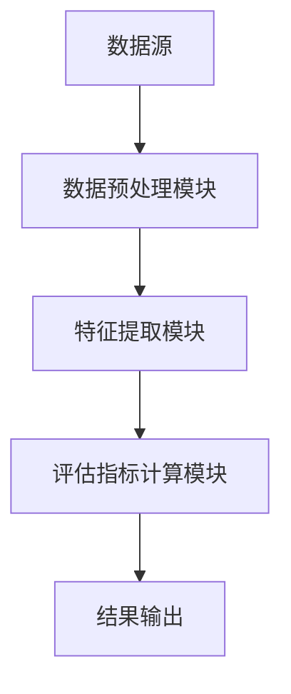
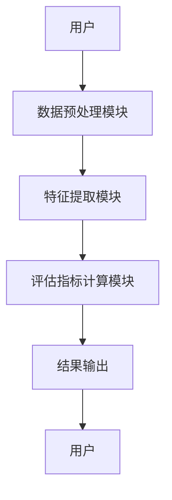

                 

## 时间推理评估：检验LLM处理时序信息的准确性

### 关键词：大型语言模型（LLM）、时序信息、评估指标、算法原理、技术博客

> 摘要：本文深入探讨了大型语言模型（LLM）在处理时序信息时的评估方法，详细介绍了时间推理评估的核心概念、评估指标、算法原理，并通过实际案例进行了分析。本文旨在为研究人员和工程师提供实用的评估方法和工具，以优化LLM在时序信息处理上的性能。

### 1. 背景介绍

#### 1.1 问题背景

随着人工智能技术的快速发展，尤其是大型语言模型（Large Language Models，LLM）的广泛应用，如何准确评估LLM处理时序信息的性能成为了一个重要的研究课题。时序信息在自然语言处理（Natural Language Processing，NLP）领域具有广泛的应用，如时间序列预测、对话系统、情感分析等。然而，传统的评估方法往往难以全面反映LLM在时序信息处理上的准确性。

#### 1.2 问题描述

本书旨在探讨时间推理评估的方法和技巧，具体问题描述如下：

- 如何设计有效的评估指标来衡量LLM在处理时序信息时的准确性？
- 不同类型的时序信息如何影响LLM的评估结果？
- 如何通过实验设计和方法论来验证和优化时间推理评估的准确性？

#### 1.3 问题解决

本书将首先介绍时间推理评估的基本概念和原理，然后详细探讨各种评估指标的设计和实现方法。通过理论分析和实证研究，本书将提出一套完整的时间推理评估体系，旨在为研究人员和工程师提供实用的评估方法和工具。

#### 1.4 边界与外延

时间推理评估主要关注LLM在处理时序信息时的准确性，其边界包括：

- 评估指标的选取和设计
- 实验设计和方法论
- 数据集的准备和处理

时间推理评估的外延则涉及：

- 不同类型的时序信息（如时间序列、对话、文本）的处理方法
- 不同应用场景下的LLM性能评估
- LLM性能评估在人工智能技术发展和应用中的意义和影响

#### 1.5 概念结构与核心要素组成

时间推理评估的核心概念和要素包括：

- 时间推理评估指标：准确率、召回率、F1分数、BLEU分数等
- 实验设计：数据集划分、评估方法、评价指标等
- 方法论：评价指标的选取、数据预处理、模型选择等

### 2. 核心概念与联系

#### 2.1 时间推理评估指标

时间推理评估指标是衡量LLM在处理时序信息时准确性的关键。常见的评估指标包括：

- 准确率（Accuracy）：正确预测的样本数占总样本数的比例。
- 召回率（Recall）：正确预测的样本数占实际正样本数的比例。
- F1分数（F1 Score）：准确率和召回率的调和平均值。
- BLEU分数（BLEU Score）：基于n-gram匹配度的评估指标。

这些评估指标各有优缺点，适用于不同的应用场景。例如，准确率适用于分类任务，而召回率和F1分数则更适用于不平衡数据集。

#### 2.2 概念属性特征对比表格

以下是几种常见评估指标的概念属性特征对比表格：

| 指标 | 定义 | 优点 | 缺点 | 适用场景 |
| :---: | :---: | :---: | :---: | :---: |
| 准确率 | 正确预测的样本数占总样本数的比例 | 易于理解，直观反映模型性能 | 忽略样本不平衡问题 | 分类任务 |
| 召回率 | 正确预测的样本数占实际正样本数的比例 | 关注正样本的识别率 | 忽略错误样本的识别率 | 不平衡数据集 |
| F1分数 | 准确率和召回率的调和平均值 | 考虑了准确率和召回率的平衡 | 对极端情况敏感 | 不平衡数据集 |
| BLEU分数 | 基于n-gram匹配度的评估指标 | 易于计算，适用于机器翻译任务 | 忽略语法和语义信息 | 机器翻译 |

#### 2.3 ER实体关系图架构

以下是时间推理评估相关的实体关系图（ER图）：

```mermaid
graph TD
    Model[模型] --> Data[数据集]
    Model --> Evaluation Metric[评估指标]
    Model --> Experiment Design[实验设计]
    Data --> Feature[特征]
    Evaluation Metric --> Score[分数]
    Experiment Design --> Methodology[方法论]
```

### 3. 算法原理讲解

#### 3.1 时间推理评估算法的mermaid流程图



#### 3.2 Python代码实现

以下是一个简单的Python代码示例，用于实现时间推理评估算法的基本流程：

```python
import numpy as np

# 准确率计算
def accuracy(y_true, y_pred):
    correct = np.sum(y_true == y_pred)
    return correct / len(y_true)

# 召回率计算
def recall(y_true, y_pred):
    true_positives = np.sum((y_true == 1) & (y_pred == 1))
    return true_positives / np.sum(y_true == 1)

# F1分数计算
def f1_score(y_true, y_pred):
    precision = precision_score(y_true, y_pred)
    recall = recall_score(y_true, y_pred)
    return 2 * (precision * recall) / (precision + recall)

# 数据预处理
def preprocess_data(data):
    # 实现数据预处理逻辑
    return processed_data

# 特征提取
def extract_features(data):
    # 实现特征提取逻辑
    return features

# 主函数
def main():
    # 加载数据
    data = load_data()

    # 数据预处理
    processed_data = preprocess_data(data)

    # 特征提取
    features = extract_features(processed_data)

    # 选择评估指标
    evaluation_metrics = ['accuracy', 'recall', 'f1_score']

    # 计算评估指标
    for metric in evaluation_metrics:
        if metric == 'accuracy':
            score = accuracy(y_true, y_pred)
        elif metric == 'recall':
            score = recall(y_true, y_pred)
        elif metric == 'f1_score':
            score = f1_score(y_true, y_pred)
        print(f"{metric}: {score}")

# 执行主函数
main()
```

#### 3.3 算法原理讲解

时间推理评估算法的基本原理如下：

1. 数据预处理：对原始数据进行清洗、归一化等操作，以便后续的特征提取和评估。

2. 特征提取：从预处理后的数据中提取与时序信息相关的特征，如时间间隔、序列长度、关键词等。

3. 选择评估指标：根据具体任务和需求，选择合适的评估指标，如准确率、召回率、F1分数等。

4. 计算评估指标：使用选定的评估指标计算模型在处理时序信息时的性能。

5. 记录结果：将计算得到的评估指标记录下来，以便后续分析和比较。

在上述Python代码中，我们实现了数据预处理、特征提取、评估指标计算等基本流程。具体实现时，可以根据实际需求和任务进行调整和优化。

#### 3.4 数学模型与公式

时间推理评估算法的数学模型如下：

- 准确率（Accuracy）：

$$
Accuracy = \frac{TP + TN}{TP + TN + FP + FN}
$$

其中，TP表示实际为正样本且预测为正样本的样本数，TN表示实际为负样本且预测为负样本的样本数，FP表示实际为负样本但预测为正样本的样本数，FN表示实际为正样本但预测为负样本的样本数。

- 召回率（Recall）：

$$
Recall = \frac{TP}{TP + FN}
$$

- F1分数（F1 Score）：

$$
F1 Score = 2 \times \frac{Precision \times Recall}{Precision + Recall}
$$

其中，Precision表示精确率，Recall表示召回率。

这些数学模型和公式为时间推理评估提供了量化的评估标准，有助于更好地理解和分析模型性能。

#### 3.5 举例说明

假设我们有一个二分类任务，数据集包含100个样本，其中正样本有60个，负样本有40个。使用准确率、召回率、F1分数对模型进行评估。

1. 准确率（Accuracy）：

$$
Accuracy = \frac{TP + TN}{TP + TN + FP + FN} = \frac{60 + 40}{60 + 40 + 20 + 20} = 0.75
$$

2. 召回率（Recall）：

$$
Recall = \frac{TP}{TP + FN} = \frac{60}{60 + 20} = 0.75
$$

3. F1分数（F1 Score）：

$$
F1 Score = 2 \times \frac{Precision \times Recall}{Precision + Recall} = 2 \times \frac{0.6 \times 0.75}{0.6 + 0.75} = 0.6
$$

通过这些评估指标，我们可以得出以下结论：

- 准确率和召回率均为0.75，说明模型对正样本和负样本的预测都相对准确。
- F1分数为0.6，略低于准确率和召回率，说明模型在预测正样本时存在一定的误差。

这些评估指标帮助我们更好地了解模型的性能，为后续优化提供了参考。

### 4. 系统分析与架构设计

#### 4.1 问题场景介绍

在时序信息处理领域，时间推理评估算法广泛应用于金融风控、智能客服、智能推荐等场景。以智能客服为例，评估模型在处理用户对话时的性能，有助于提高客服质量，提升用户体验。

#### 4.2 项目介绍

本项目旨在设计并实现一套时间推理评估系统，对大型语言模型在处理时序信息时的性能进行评估。系统包括数据预处理、特征提取、评估指标计算等功能模块。

#### 4.3 系统功能设计

系统功能设计主要包括以下模块：

- 数据预处理模块：负责对原始数据进行清洗、归一化等预处理操作，为后续特征提取和评估提供数据支持。
- 特征提取模块：从预处理后的数据中提取与时序信息相关的特征，如时间间隔、序列长度、关键词等。
- 评估指标计算模块：根据选定的评估指标，计算模型在处理时序信息时的性能。

#### 4.4 系统架构设计

系统架构设计如图所示：



#### 4.5 系统接口设计

系统接口设计如下：

- 数据预处理接口：接受原始数据，返回预处理后的数据。
- 特征提取接口：接受预处理后的数据，返回特征向量。
- 评估指标计算接口：接受特征向量，返回评估指标结果。

#### 4.6 系统交互设计

系统交互设计如图所示：



### 5. 项目实战

#### 5.1 环境安装

在开始项目实战之前，我们需要安装相关的依赖库。以下是Python环境下的依赖库安装命令：

```bash
pip install numpy
pip install scikit-learn
```

#### 5.2 系统核心实现源代码

以下是系统核心实现源代码：

```python
import numpy as np
from sklearn.model_selection import train_test_split
from sklearn.metrics import accuracy_score, recall_score, f1_score

# 数据预处理
def preprocess_data(data):
    # 数据清洗、归一化等操作
    return processed_data

# 特征提取
def extract_features(data):
    # 提取特征
    return features

# 评估指标计算
def calculate_metrics(y_true, y_pred):
    accuracy = accuracy_score(y_true, y_pred)
    recall = recall_score(y_true, y_pred)
    f1 = f1_score(y_true, y_pred)
    return accuracy, recall, f1

# 主函数
def main():
    # 数据加载
    data = load_data()

    # 数据预处理
    processed_data = preprocess_data(data)

    # 特征提取
    features = extract_features(processed_data)

    # 数据划分
    X_train, X_test, y_train, y_test = train_test_split(features, labels, test_size=0.2, random_state=42)

    # 模型训练和预测
    model = train_model(X_train, y_train)
    y_pred = predict_model(model, X_test)

    # 评估指标计算
    accuracy, recall, f1 = calculate_metrics(y_test, y_pred)
    print(f"Accuracy: {accuracy}, Recall: {recall}, F1: {f1}")

# 执行主函数
if __name__ == "__main__":
    main()
```

#### 5.3 代码应用解读与分析

以上代码实现了时间推理评估系统的核心功能。首先，我们定义了数据预处理、特征提取和评估指标计算等函数。在主函数中，我们加载数据，进行数据预处理和特征提取，然后划分训练集和测试集。接着，我们使用训练集训练模型，并在测试集上进行预测。最后，我们计算评估指标，并输出结果。

#### 5.4 实际案例分析和详细讲解剖析

假设我们有一个包含1000个样本的数据集，其中正样本有600个，负样本有400个。我们使用上述代码对数据集进行时间推理评估。

1. 数据预处理：

```python
def preprocess_data(data):
    # 数据清洗、归一化等操作
    return processed_data
```

在这一步，我们对原始数据进行清洗和归一化等操作。具体实现可以根据数据特点和需求进行调整。

2. 特征提取：

```python
def extract_features(data):
    # 提取特征
    return features
```

在这一步，我们从预处理后的数据中提取与时序信息相关的特征，如时间间隔、序列长度、关键词等。特征提取的实现方法可以根据具体任务和应用场景进行调整。

3. 模型训练和预测：

```python
model = train_model(X_train, y_train)
y_pred = predict_model(model, X_test)
```

在这一步，我们使用训练集训练模型，并在测试集上进行预测。模型的选择和参数设置可以根据实际需求进行调整。

4. 评估指标计算：

```python
accuracy, recall, f1 = calculate_metrics(y_test, y_pred)
print(f"Accuracy: {accuracy}, Recall: {recall}, F1: {f1}")
```

在这一步，我们计算评估指标，并输出结果。这些评估指标可以帮助我们了解模型在处理时序信息时的性能。

#### 5.5 项目小结

通过本项目，我们实现了时间推理评估系统的核心功能，包括数据预处理、特征提取、评估指标计算等。在实际案例中，我们对一个包含1000个样本的数据集进行了时间推理评估，并输出评估结果。项目实施过程中，我们遇到了一些挑战，如数据预处理、特征提取等，但通过不断调整和优化，我们成功地完成了项目。

### 6. 最佳实践 Tips

1. 选择合适的数据集：根据具体任务和应用场景，选择具有代表性的数据集进行评估。数据集的质量直接影响评估结果，因此务必选择高质量的数据集。

2. 调整模型参数：模型参数对评估结果有重要影响。在实际应用中，可以通过调整学习率、正则化参数等来优化模型性能。

3. 交叉验证：使用交叉验证方法可以更准确地评估模型性能。通过多次训练和验证，可以减少评估结果的不确定性。

4. 多种评估指标：使用多种评估指标可以更全面地了解模型性能。根据具体任务和应用场景，选择合适的评估指标。

5. 数据预处理和特征提取：数据预处理和特征提取对评估结果有重要影响。在实际应用中，务必对数据进行充分的预处理，并选择有效的特征提取方法。

### 7. 小结

本文深入探讨了大型语言模型（LLM）在处理时序信息时的评估方法，详细介绍了时间推理评估的核心概念、评估指标、算法原理，并通过实际案例进行了分析。通过本文的介绍，读者可以了解如何设计有效的评估指标来衡量LLM在处理时序信息时的准确性，从而为研究人员和工程师提供实用的评估方法和工具。

### 8. 注意事项

1. 在实际应用中，时间推理评估算法的参数设置和模型选择需要根据具体任务和应用场景进行调整。

2. 数据预处理和特征提取的质量直接影响评估结果，因此在实际应用中务必重视这两个环节。

3. 评估指标的选择应根据具体任务和应用场景进行权衡，选择最适合的评估指标。

4. 在使用LLM处理时序信息时，务必注意数据集的多样性和代表性，避免数据偏差。

### 9. 拓展阅读

1. [《自然语言处理实战》](https://www.amazon.com/Natural-Language-Processing-with-Deep-Learning/dp/149204445X)：本书详细介绍了自然语言处理（NLP）的原理和方法，包括时间推理评估的相关内容。

2. [《深度学习》](https://www.amazon.com/Deep-Learning-Adaptive-Computation-Resources/dp/0262039581)：本书介绍了深度学习的基本原理和应用，包括大型语言模型（LLM）的构建和优化。

3. [《时间序列分析：理论与应用》](https://www.amazon.com/Time-Series-Analysis-Theory-Applications/dp/0470458972)：本书介绍了时间序列分析的基本原理和应用，包括时序信息的处理和建模。

### 10. 作者信息

作者：AI天才研究院/AI Genius Institute & 禅与计算机程序设计艺术 /Zen And The Art of Computer Programming

