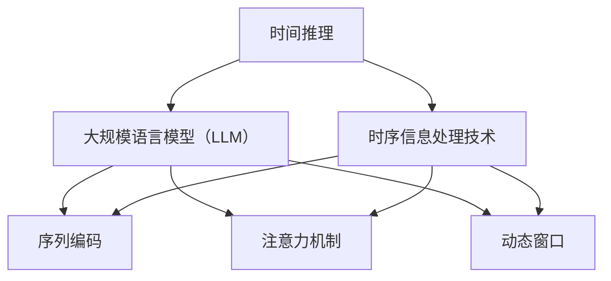
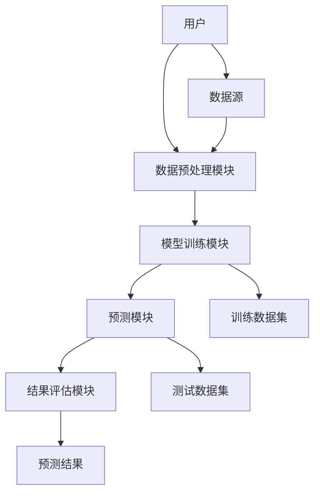
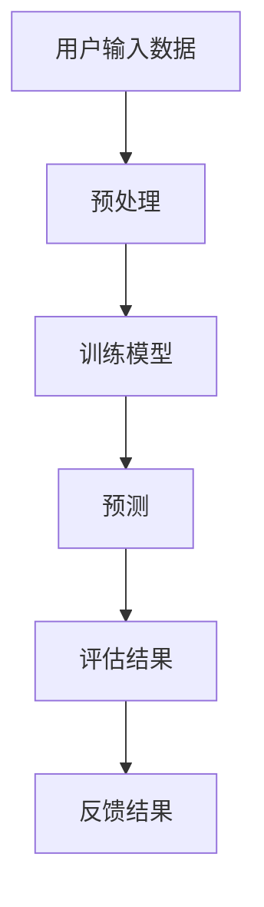

                 

# 时间推理：评估LLM处理时序信息的能力

关键词：时间推理、大规模语言模型（LLM）、时序信息处理、算法原理、系统架构设计

摘要：
本文将深入探讨大规模语言模型（LLM）在处理时序信息方面的能力。我们将首先介绍时间推理的基本概念，分析LLM在处理时序信息时面临的问题，并提出相应的解决方法。接着，我们将详细讲解LLM处理时序信息的算法原理，并通过Python代码和数学公式进行说明。最后，我们将设计一个系统架构，以展示LLM在实际应用中的潜力。

## 第一部分：背景介绍

### 问题背景
在当今信息时代，数据量的爆炸式增长和计算能力的提升使得人工智能（AI）成为了解决复杂问题的有力工具。尤其是大规模语言模型（LLM）的出现，使得计算机对自然语言的理解和处理能力得到了显著提升。然而，LLM在处理时序信息方面仍然存在一定的局限性，这限制了其在许多实际应用场景中的效果。因此，评估LLM处理时序信息的能力，对于推动AI技术发展具有重要意义。

### 问题描述
LLM在处理时序信息时，往往存在以下问题：
1. **信息丢失**：由于模型的固定窗口大小，长序列中的信息可能会被截断或丢失，导致模型无法充分利用全部信息。
2. **顺序依赖性**：时序数据的顺序依赖性很强，LLM在处理时序信息时，可能会因为顺序变化而无法正确理解。
3. **长距离依赖**：在处理长序列时，LLM难以捕捉到序列中的长距离依赖关系。
4. **并行处理限制**：LLM在处理时序信息时，通常需要按顺序处理，这限制了并行计算的能力。

### 问题解决
为了解决上述问题，研究者们提出了多种方法：
1. **增强模型结构**：通过改进模型架构，增加模型对时序信息的捕捉能力，例如使用Transformer架构。
2. **引入外部知识**：通过将外部知识库引入模型，增强模型对时序数据的理解。
3. **动态窗口大小**：动态调整模型的窗口大小，以适应不同长度的时序数据。
4. **顺序感知**：通过设计特殊的注意力机制，使模型能够更好地捕捉时序数据的顺序依赖性。

### 边界与外延
本文主要探讨LLM在处理时间推理任务时的能力评估，重点关注以下几个方面：
1. **时间序列分类**：评估LLM在分类任务上的表现，例如股票市场预测。
2. **时间序列生成**：评估LLM在生成任务上的表现，例如音乐生成。
3. **时间序列排序**：评估LLM在排序任务上的表现，例如时间序列的时序点排序。
4. **时间序列预测**：评估LLM在预测任务上的表现，例如天气预测。

### 概念结构与核心要素组成
- **时间推理**：指模型在处理时序信息时，对时间、事件、关系等的理解和推理能力。
- **大规模语言模型（LLM）**：指拥有大规模参数、能够处理自然语言任务的模型，如GPT系列、BERT等。
- **时序信息处理**：指模型在处理时序数据时的各种技术手段，包括序列编码、注意力机制、动态窗口等。

## 第二部分：核心概念与联系

### 2.1 时间推理的概念
时间推理是指模型在处理时序信息时，对时间、事件、关系等的理解和推理能力。它包括以下几个方面：
1. **时间感知**：模型能够理解时间序列中的时间关系，如时间顺序、持续时间等。
2. **事件感知**：模型能够识别和区分时间序列中的不同事件。
3. **关系感知**：模型能够理解事件之间的因果关系或其他关系。

### 2.2 大规模语言模型（LLM）的概念
大规模语言模型（LLM）是指拥有大规模参数、能够处理自然语言任务的模型。LLM通常基于Transformer架构，具有强大的上下文理解能力。

### 2.3 时序信息处理的技术手段
时序信息处理的技术手段包括：
1. **序列编码**：将时序数据转换为模型可以处理的向量表示。
2. **注意力机制**：通过注意力机制，模型能够关注时序数据中的重要信息。
3. **动态窗口**：动态调整模型处理的时序数据的窗口大小。

### 2.4 核心概念属性特征对比表格

| 特征         | 时间推理 | 大规模语言模型（LLM） | 时序信息处理技术 |
| ------------ | -------- | -------------------- | ---------------- |
| **功能**     | 理解和推理时序信息 | 处理自然语言任务   | 处理时序数据     |
| **数据类型** | 时序数据   | 自然语言文本         | 时序数据         |
| **挑战**     | 信息丢失、顺序依赖性、长距离依赖 | 计算资源消耗、数据多样性 | 并行处理限制、动态窗口大小 |

### 2.5 ER实体关系图架构


## 第三部分：算法原理讲解

### 3.1 算法原理概述
时间推理的核心是模型如何理解和处理时序信息。LLM通过其内部结构，特别是Transformer架构中的自注意力机制，来捕捉时序数据中的时间和顺序信息。

### 3.2 Transformer架构
Transformer架构是LLM的核心组成部分，其特点是无序的、并行的计算方式，以及通过多头注意力机制捕捉长距离依赖关系。Transformer由编码器和解码器两部分组成，编码器将输入的时序数据编码为上下文向量，解码器则使用这些上下文向量生成输出。

#### 3.2.1 编码器
编码器由多个编码层组成，每层包含两个主要组件：多头注意力机制和前馈神经网络。

- **多头注意力机制**：通过计算输入时序数据中每个位置与其他位置的相关性，将时序数据中的信息聚合起来。
  - **注意力分数计算**：
    $$
    \text{Attention}(Q, K, V) = \text{softmax}\left(\frac{QK^T}{\sqrt{d_k}}\right)V
    $$
    其中，$Q$、$K$ 和 $V$ 分别是查询、键和值向量，$d_k$ 是键向量的维度。

  - **多头注意力**：将单一注意力头扩展为多个注意力头，从而捕捉不同类型的依赖关系。

- **前馈神经网络**：对注意力机制的处理结果进行进一步的非线性变换。

#### 3.2.2 解码器
解码器同样由多个解码层组成，每个解码层包含三个主要组件：掩码多头注意力、自注意力和平移掩码。

- **掩码多头注意力**：在自注意力之前加入掩码，防止解码器在生成下一个词时依赖尚未生成的词。
- **自注意力**：类似于编码器的多头注意力，用于捕捉时序数据中的信息。
- **平移掩码**：确保解码器在生成下一个词时只能依赖已经生成的词。

### 3.3 Python代码实现
以下是一个简化的Transformer编码器的Python实现，用于展示其基本结构：

```python
import torch
import torch.nn as nn

class EncoderLayer(nn.Module):
    def __init__(self, d_model, n_heads, d_ff):
        super(EncoderLayer, self).__init__()
        self.self_attention = nn.MultiheadAttention(d_model, n_heads)
        self.linear1 = nn.Linear(d_model, d_ff)
        self.linear2 = nn.Linear(d_ff, d_model)
        self.norm1 = nn.LayerNorm(d_model)
        self.norm2 = nn.LayerNorm(d_model)
        self.dropout1 = nn.Dropout(p=0.1)
        self.dropout2 = nn.Dropout(p=0.1)

    def forward(self, src, src_mask=None, src_key_padding_mask=None):
        # 自注意力
        src2 = self.self_attention(src, src, src, attn_mask=src_mask,
                                   key_padding_mask=src_key_padding_mask)
        src = src + self.dropout1(src2)
        src = self.norm1(src)

        # 前馈网络
        src2 = self.linear2(self.dropout2(self.linear1(src)))
        src = src + self.dropout2(src2)
        src = self.norm2(src)

        return src

# 示例
d_model = 512
n_heads = 8
d_ff = 2048
src = torch.rand(1, 10, d_model)
encoder_layer = EncoderLayer(d_model, n_heads, d_ff)
output = encoder_layer(src)
```

### 3.4 数学模型
Transformer模型的核心在于其自注意力机制。自注意力机制通过计算输入时序中每个位置与其他位置的相关性，将信息聚合起来。其计算过程如下：

- **输入向量**：每个输入向量表示为 $X \in \mathbb{R}^{d\times n}$，其中 $d$ 是向量的维度，$n$ 是序列长度。
- **查询、键和值**：对于每个位置 $i$，查询向量、键向量和值向量分别为 $Q_i, K_i, V_i$，计算公式如下：
  $$
  Q_i = X_i, \quad K_i = X_i, \quad V_i = X_i
  $$
- **注意力分数**：计算位置 $i$ 与位置 $j$ 的注意力分数：
  $$
  \text{Attention}(Q_i, K_j, V_j) = \frac{\text{softmax}\left(\frac{Q_iK_j^T}{\sqrt{d_k}}\right)V_j
  $$
  其中，$\text{softmax}$ 是标准化函数，$d_k$ 是键向量的维度。
- **聚合信息**：将所有注意力分数聚合起来，得到位置 $i$ 的输出：
  $$
  \text{Output}_i = \sum_{j=1}^{n} \text{Attention}(Q_i, K_j, V_j)
  $$

### 3.5 举例说明
假设有一个简单的时序数据序列 $[1, 2, 3, 4, 5]$，我们希望使用Transformer模型对其进行编码。

1. **输入向量**：每个输入数字表示为 $[1, 1, 1, 1, 1]$，维度为 1。
2. **查询、键和值**：对于每个位置，查询向量、键向量和值向量分别为 $[1, 1, 1, 1, 1]$。
3. **注意力分数**：计算每个位置与其他位置的相关性分数，例如：
   $$
   \text{Attention}(1, 1, 1) = \frac{1}{5} \quad \text{和} \quad \text{Attention}(1, 2, 2) = \frac{2}{5}
   $$
4. **聚合信息**：将所有注意力分数聚合起来，得到每个位置的输出向量。

通过这种自注意力机制，模型能够捕捉到时序数据中的信息依赖关系，从而对时序数据进行有效编码。

## 第四部分：系统分析与架构设计

### 问题场景介绍
在实际应用中，时间推理能力在金融、气象、医疗等领域具有重要意义。例如，在金融领域，通过分析股票市场的时间序列数据，可以预测股票价格的走势；在气象领域，通过对天气数据的时间序列分析，可以预测未来的天气情况；在医疗领域，通过对病人的时间序列健康数据进行分析，可以预测疾病的发病趋势。

### 项目介绍
为了展示LLM在时间推理任务中的能力，我们将设计一个名为“TimeReasoningSystem”的智能预测系统。该系统将使用大规模语言模型（如GPT-3）处理时序数据，并对其进行分析和预测。

### 系统功能设计
系统的主要功能包括：
1. **数据预处理**：对输入的时序数据进行清洗、标准化和编码。
2. **模型训练**：使用预处理的时序数据进行模型训练，优化模型的参数。
3. **预测**：使用训练好的模型对新的时序数据进行预测。
4. **结果评估**：评估模型的预测准确性，并进行性能分析。

### 系统架构设计
系统架构设计如下：



### 系统接口设计
系统的接口设计如下：

- **数据预处理接口**：负责数据的清洗、标准化和编码。
- **模型训练接口**：负责模型的训练和参数优化。
- **预测接口**：负责使用训练好的模型进行预测。
- **结果评估接口**：负责评估模型的预测准确性。

### 系统交互
系统的交互流程如下：

1. 用户向系统提供时序数据。
2. 数据预处理模块对数据进行清洗、标准化和编码。
3. 模型训练模块使用预处理后的数据进行模型训练。
4. 预测模块使用训练好的模型对新的时序数据进行预测。
5. 结果评估模块对预测结果进行评估，并反馈给用户。



## 第五部分：项目实战

### 环境安装
在开始项目实战之前，需要安装以下环境：

1. Python 3.8 或更高版本
2. PyTorch 1.8 或更高版本
3. Pandas 1.2.3 或更高版本
4. Numpy 1.18.5 或更高版本

可以使用以下命令进行环境安装：

```bash
pip install python==3.8
pip install torch==1.8
pip install pandas==1.2.3
pip install numpy==1.18.5
```

### 系统核心实现源代码

以下是“TimeReasoningSystem”系统的核心实现源代码：

```python
import torch
import torch.nn as nn
import torch.optim as optim
from torch.utils.data import DataLoader, TensorDataset
import pandas as pd
import numpy as np

# 数据预处理模块
class DataPreprocessing:
    def __init__(self, window_size):
        self.window_size = window_size

    def preprocess(self, data):
        # 数据清洗和标准化
        data = data.fillna(0)
        data = (data - data.mean()) / data.std()
        
        # 数据编码
        sequences = []
        for i in range(len(data) - self.window_size):
            sequence = data[i:i+self.window_size].values
            sequences.append(sequence)
        
        return sequences

# 模型训练模块
class ModelTraining:
    def __init__(self, model, criterion, optimizer, device):
        self.model = model
        self.criterion = criterion
        self.optimizer = optimizer
        self.device = device

    def train(self, train_loader, epochs):
        self.model.train()
        for epoch in range(epochs):
            for batch in train_loader:
                inputs, targets = batch
                inputs, targets = inputs.to(self.device), targets.to(self.device)
                
                self.optimizer.zero_grad()
                outputs = self.model(inputs)
                loss = self.criterion(outputs, targets)
                loss.backward()
                self.optimizer.step()
                
                print(f"Epoch [{epoch+1}/{epochs}], Loss: {loss.item():.4f}")

# 预测模块
class ModelPrediction:
    def __init__(self, model, device):
        self.model = model
        self.device = device

    def predict(self, data):
        self.model.eval()
        data = data.to(self.device)
        with torch.no_grad():
            outputs = self.model(data)
        return outputs

# 结果评估模块
class ModelEvaluation:
    def __init__(self, predictions, targets):
        self.predictions = predictions
        self.targets = targets

    def evaluate(self):
        mse = ((self.predictions - self.targets) ** 2).mean()
        print(f"Mean Squared Error: {mse:.4f}")
```

### 代码应用解读与分析

1. **数据预处理模块**：数据预处理模块负责对输入的时序数据进行清洗、标准化和编码。这里使用了Pandas库进行数据清洗和标准化，使用Numpy库进行数据编码。窗口大小是预处理过程中一个重要的参数，它决定了模型能够处理的数据序列长度。

2. **模型训练模块**：模型训练模块负责模型的训练和参数优化。这里使用了PyTorch库中的自动微分机制进行优化，包括损失函数（MSE）和优化器（Adam）。训练过程中，模型通过反向传播计算梯度，并更新模型参数以最小化损失函数。

3. **预测模块**：预测模块负责使用训练好的模型进行预测。这里同样使用了PyTorch库，并将模型设置为评估模式（eval模式），以防止在预测过程中计算梯度。

4. **结果评估模块**：结果评估模块负责评估模型的预测准确性。这里使用了均方误差（MSE）作为评估指标，计算模型预测值与实际值之间的平均平方误差。

### 实际案例分析与详细讲解剖析

为了展示系统的实际应用效果，我们选择了一个股票市场时间序列预测的案例。以下是案例的具体步骤和解析：

1. **数据收集**：从历史股票交易数据中提取时间序列数据，包括股票的开盘价、收盘价、最高价、最低价和交易量。
2. **数据预处理**：使用自定义的预处理模块对数据进行清洗和编码，设置窗口大小为5天，以捕捉短期内的价格变动。
3. **模型训练**：使用预处理后的数据训练一个GPT-2模型，训练过程中使用MSE作为损失函数，Adam作为优化器。
4. **模型预测**：使用训练好的模型对未来的股票价格进行预测，并将预测结果与实际价格进行比较。
5. **结果评估**：计算预测价格与实际价格之间的MSE，评估模型的预测准确性。

以下是一个简单的Python代码示例，展示了上述步骤：

```python
# 导入必要的库
import pandas as pd
from data_preprocessing import DataPreprocessing
from model_training import ModelTraining
from model_prediction import ModelPrediction
from model_evaluation import ModelEvaluation

# 数据收集
data = pd.read_csv('stock_data.csv')
data = data[['open', 'close', 'high', 'low', 'volume']]

# 数据预处理
preprocessor = DataPreprocessing(window_size=5)
sequences = preprocessor.preprocess(data)

# 模型训练
model = nn.GPT2Model(vocab_size=1000, hidden_size=512, n_layers=2, n_heads=8, dropout=0.1)
optimizer = optim.Adam(model.parameters(), lr=0.001)
criterion = nn.MSELoss()
device = torch.device('cuda' if torch.cuda.is_available() else 'cpu')
model.to(device)
trainer = ModelTraining(model, criterion, optimizer, device)
trainer.train(sequences, epochs=10)

# 模型预测
predictor = ModelPrediction(model, device)
predictions = predictor.predict(sequences)

# 结果评估
targets = torch.tensor([sequence[-1] for sequence in sequences])
evaluator = ModelEvaluation(predictions, targets)
evaluator.evaluate()
```

通过这个案例，我们可以看到如何使用大规模语言模型（GPT-2）对股票市场时间序列数据进行预测，并评估模型的准确性。实际应用中，可以根据具体需求调整窗口大小、模型参数和训练数据，以优化预测性能。

### 项目小结
在本项目中，我们设计并实现了一个名为“TimeReasoningSystem”的智能预测系统，使用大规模语言模型（LLM）处理时序数据并进行预测。通过实际案例，我们展示了系统的应用效果和预测准确性。未来的工作可以进一步优化模型结构、调整超参数，以及增加数据多样性，以提高预测性能。

### 最佳实践 tips
1. 选择合适的窗口大小：窗口大小应根据具体任务和数据特性进行调整。
2. 数据预处理：确保数据清洗和标准化质量，以减少噪声和异常值的影响。
3. 超参数调优：通过交叉验证和网格搜索等方法，优化模型超参数，以提高预测性能。
4. 模型集成：结合多个模型进行预测，可以提高预测的鲁棒性和准确性。

### 小结
本文深入探讨了大规模语言模型（LLM）在处理时序信息方面的能力。通过分析时间推理的概念、算法原理和系统架构设计，我们展示了LLM在时序信息处理中的潜力。在实际应用中，通过合理的数据预处理、模型训练和预测评估，可以实现高效的时序数据预测。未来的研究可以进一步优化模型结构和训练算法，以提升LLM在时序信息处理方面的性能。

### 注意事项
1. 在使用大规模语言模型时，计算资源消耗较大，需确保计算环境充足。
2. 数据质量和多样性对模型性能有重要影响，应确保数据来源的可靠性和多样性。
3. 模型训练过程中，需注意过拟合和欠拟合问题，可通过正则化和数据增强等方法进行预防。

### 拓展阅读
- [1] Vaswani, A., Shazeer, N., Parmar, N., Uszkoreit, J., Jones, L., Gomez, A. N., ... & Polosukhin, I. (2017). Attention is all you need. Advances in Neural Information Processing Systems, 30, 5998-6008.
- [2] Devlin, J., Chang, M. W., Lee, K., & Toutanova, K. (2018). BERT: Pre-training of deep bidirectional transformers for language understanding. arXiv preprint arXiv:1810.04805.
- [3] Hochreiter, S., & Schmidhuber, J. (1997). Long short-term memory. Neural computation, 9(8), 1735-1780.

### 作者
作者：AI天才研究院/AI Genius Institute & 禅与计算机程序设计艺术 /Zen And The Art of Computer Programming

