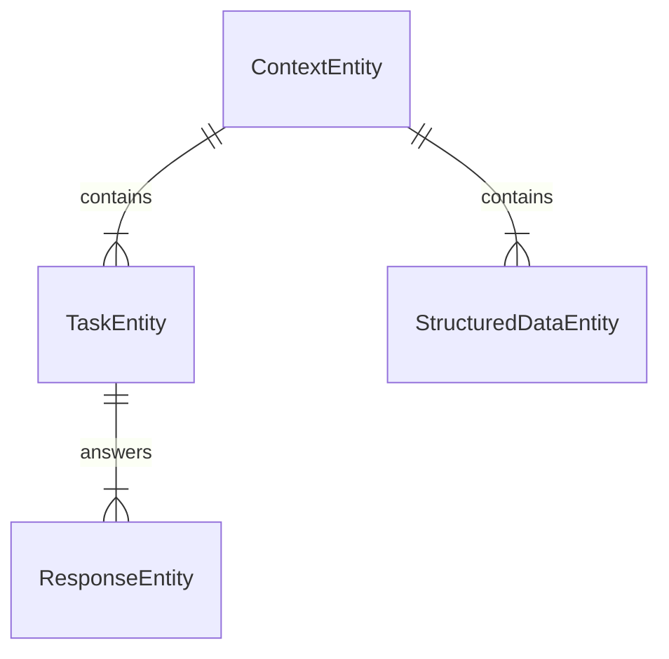
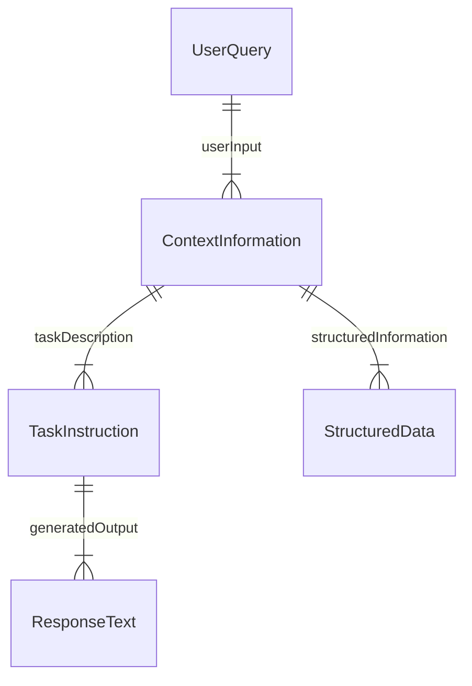
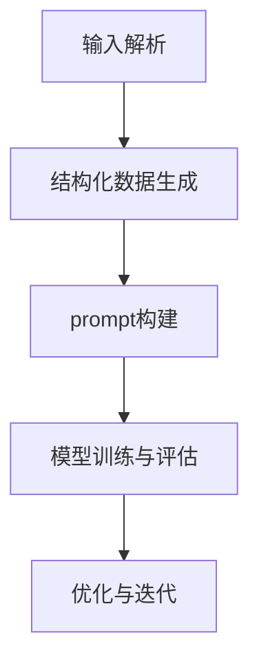
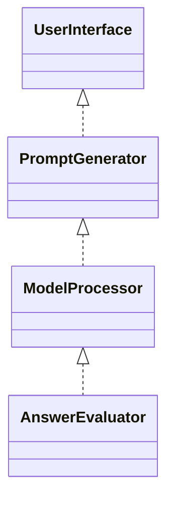

                 

### 引言：智能prompt调优的必要性与重要性

#### 1.1 问题背景

自然语言处理（NLP）作为人工智能的重要分支，近年来取得了令人瞩目的进展。从早期基于规则的方法，到后来的统计模型，再到如今的大型语言模型（LLM），如GPT-3、BERT等，NLP技术日益成熟。然而，随着LLM的规模不断扩大，其性能瓶颈也逐渐显现。传统的prompt方法在处理复杂任务时，往往无法满足要求。为了解决这一问题，智能prompt调优技术应运而生。

#### 1.1.1 自然语言处理的发展历程

自然语言处理的历史可以追溯到20世纪50年代。当时，研究者们开始探索如何让计算机理解和处理人类语言。早期的研究主要集中在基于规则的方法上，如句法分析、语义分析等。然而，这些方法在面对复杂、灵活的自然语言时显得力不从心。

20世纪80年代，统计方法开始崭露头角。随着语料库的逐渐丰富和计算能力的提升，统计模型在NLP领域的应用越来越广泛。这一时期，词袋模型、N-gram模型、隐马尔可夫模型（HMM）等相继问世。

21世纪初，深度学习技术的发展为NLP带来了新的契机。基于神经网络的模型，如循环神经网络（RNN）、长短期记忆网络（LSTM）等，在语音识别、机器翻译等领域取得了显著成绩。随后，Transformer模型的提出，使得大型语言模型成为可能。

#### 1.1.2 大型语言模型（LLM）的崛起

大型语言模型（LLM）的出现，标志着NLP技术进入了一个新的时代。LLM具有庞大的参数规模，能够捕捉到语言的深层结构，从而在生成文本、问答系统、机器翻译等任务中表现出色。GPT-3、BERT等模型的出现，更是将LLM的性能提升到了一个新的高度。

然而，LLM的高性能也带来了新的挑战。一方面，LLM的训练和推理过程需要大量的计算资源和时间；另一方面，LLM在面对特定领域或特定任务时，往往表现不佳。为了解决这一问题，智能prompt调优技术应运而生。

#### 1.1.3 智能prompt调优的作用与意义

智能prompt调优技术旨在通过调整prompt的结构和内容，提升LLM在特定任务上的性能。相比于传统的prompt方法，智能prompt能够更好地捕捉任务的关键信息，从而提高LLM的生成质量。

智能prompt调优的作用主要体现在以下几个方面：

1. **提高生成文本的质量**：通过调整prompt的结构和内容，智能prompt能够更好地引导LLM生成高质量的文本。这在问答系统、文本生成等领域尤为重要。

2. **提升模型的适应性**：智能prompt调优使得LLM能够更好地适应特定领域或特定任务。这对于垂直领域应用，如医疗、金融等领域具有重要意义。

3. **降低训练成本**：智能prompt调优能够减少LLM的训练次数，从而降低训练成本。这对于大型语言模型的应用和推广具有重要作用。

4. **优化推理过程**：智能prompt调优能够提高LLM的推理速度，从而优化推理过程。这对于实时应用，如聊天机器人、语音助手等领域具有重要意义。

#### 1.2 定义与核心概念

为了深入探讨智能prompt调优技术，我们首先需要明确一些核心概念。

##### 1.2.1 智能prompt的定义

智能prompt是指一种经过精心设计和调优的输入，用于引导大型语言模型（LLM）生成特定类型的输出。与传统的prompt相比，智能prompt具有以下特点：

1. **信息丰富**：智能prompt包含了丰富的上下文信息，能够更好地引导LLM理解任务需求。
2. **结构化**：智能prompt通常采用特定的结构，如树形结构、表格结构等，便于LLM进行解析和处理。
3. **可调优**：智能prompt可以通过调整内容、格式和结构，实现性能的优化。

##### 1.2.2 LLM的性能瓶颈

尽管LLM在许多任务上表现优异，但仍然存在一些性能瓶颈：

1. **数据依赖**：LLM的性能高度依赖于训练数据的质量和规模。在数据稀缺或数据质量差的情况下，LLM的性能会受到影响。
2. **计算资源需求**：LLM的训练和推理过程需要大量的计算资源，这在某些应用场景中可能难以满足。
3. **泛化能力**：尽管LLM在特定任务上表现良好，但其泛化能力仍需进一步提升，特别是在面对新领域或新任务时。

##### 1.2.3 调优方法分类

智能prompt调优方法可以分为以下几类：

1. **数据增强**：通过增加训练数据的多样性，提高LLM的泛化能力。
2. **温度调整**：通过调整LLM的输出温度，影响生成文本的多样性。
3. **上下文引导**：通过设计特定的上下文结构，引导LLM生成符合预期的输出。
4. **多模态融合**：将不同模态的信息（如文本、图像、声音）进行融合，提高LLM的理解能力。

#### 1.3 边界与外延

##### 1.3.1 智能prompt调优的应用场景

智能prompt调优技术可以应用于多个领域：

1. **问答系统**：通过调整prompt的结构和内容，提高问答系统的回答质量。
2. **文本生成**：通过调整prompt，引导LLM生成符合预期的文本。
3. **机器翻译**：通过调整prompt，优化翻译结果的质量和准确性。
4. **对话系统**：通过调整prompt，提高对话系统的交互效果和用户体验。

##### 1.3.2 调优技术的适用范围

智能prompt调优技术适用于以下场景：

1. **大型语言模型**：智能prompt调优技术适用于GPT-3、BERT等大型语言模型。
2. **垂直领域应用**：在医疗、金融等垂直领域，智能prompt调优技术能够更好地满足特定需求。
3. **实时应用**：在实时应用场景中，智能prompt调优技术能够提高系统的响应速度和性能。

##### 1.3.3 智能prompt调优的限制因素

智能prompt调优技术也存在一些限制因素：

1. **数据质量**：智能prompt调优依赖于高质量的数据，数据质量差会影响调优效果。
2. **计算资源**：智能prompt调优需要大量的计算资源，这在某些场景中可能难以满足。
3. **调优成本**：智能prompt调优可能需要大量的时间和人力投入，这在某些情况下可能不具经济性。

#### 1.4 概念结构与核心要素组成

##### 1.4.1 LLM的基本结构

大型语言模型（LLM）通常由以下几个部分组成：

1. **输入层**：接收用户输入的文本。
2. **编码器**：对输入文本进行编码，提取特征。
3. **解码器**：根据编码器的输出，生成文本输出。
4. **输出层**：生成最终输出文本。

##### 1.4.2 智能prompt的结构组成

智能prompt通常由以下几个部分组成：

1. **上下文信息**：包括用户输入的文本、相关的背景信息等。
2. **任务指令**：指导LLM生成特定类型的输出。
3. **结构化数据**：如表格、树形结构等，用于提高LLM的处理效率。

##### 1.4.3 调优技术的核心要素

智能prompt调优技术的核心要素包括：

1. **数据集**：用于训练和评估智能prompt的性能。
2. **调优算法**：用于调整prompt的结构和内容。
3. **评价指标**：用于评估智能prompt的性能。

#### 1.5 本章小结

本章介绍了智能prompt调优的背景、定义和核心概念。我们首先回顾了自然语言处理的发展历程，以及大型语言模型（LLM）的崛起。接着，我们探讨了智能prompt调优的作用和意义，以及其适用范围和限制因素。最后，我们介绍了LLM的基本结构、智能prompt的结构组成，以及调优技术的核心要素。这些内容为后续章节的深入探讨奠定了基础。

---

### 第二部分：智能prompt调优原理

#### 第2章：智能prompt的基本原理

智能prompt调优技术是针对大型语言模型（LLM）性能优化的一种有效方法。为了深入理解这一技术，我们首先需要探讨智能prompt的基本原理。

##### 2.1 智能prompt的概念

智能prompt是指一种经过精心设计和调优的输入，用于引导大型语言模型（LLM）生成特定类型的输出。智能prompt与传统prompt相比，具有更高的信息密度、更好的结构化和更强的可调优性。

###### 2.1.1 prompt的起源

prompt一词最早源于计算机科学中的“提示”，其含义是在特定上下文中提供的信息，以引导系统或用户完成某个任务。在自然语言处理领域，prompt通常指用于引导模型生成文本的输入。

###### 2.1.2 智能prompt的构成要素

智能prompt通常包括以下几个构成要素：

1. **上下文信息**：提供与任务相关的背景信息，有助于模型更好地理解任务需求。
2. **任务指令**：明确指示模型生成特定类型的输出，如问答、文本生成等。
3. **结构化数据**：采用特定的结构，如表格、树形结构等，以提高模型的处理效率和生成质量。

###### 2.1.3 智能prompt的工作机制

智能prompt通过以下几个步骤引导模型生成输出：

1. **输入解析**：模型接收智能prompt，并对其进行解析，提取关键信息。
2. **特征提取**：模型利用上下文信息和任务指令，对输入文本进行特征提取。
3. **文本生成**：模型根据提取的特征，生成符合任务需求的文本输出。
4. **输出评估**：模型生成的输出与预期目标进行对比，评估生成质量。

##### 2.2 智能prompt的属性特征对比

为了更好地理解智能prompt的优势，我们将其与传统的prompt进行比较。

###### 2.2.1 常规prompt与智能prompt的对比

常规prompt通常包含简单的文本信息，而智能prompt则具有以下优势：

1. **信息丰富**：智能prompt包含更多的上下文信息和结构化数据，有助于模型更好地理解任务需求。
2. **结构化**：智能prompt采用特定的结构，如表格、树形结构等，有助于模型进行高效处理。
3. **可调优**：智能prompt可以通过调整内容、格式和结构，实现性能的优化。

###### 2.2.2 智能prompt的优缺点分析

智能prompt的优点包括：

1. **提高生成质量**：智能prompt能够更好地引导模型生成高质量的文本输出。
2. **增强适应性**：智能prompt能够适应不同领域和任务的需求，提高模型的泛化能力。

但智能prompt也存在一定的缺点：

1. **设计复杂**：智能prompt的设计和调优过程相对复杂，需要较高的技术门槛。
2. **计算资源需求**：智能prompt可能需要更多的计算资源，以支持模型的解析和处理。

###### 2.2.3 智能prompt的应用效果评估

智能prompt的应用效果可以通过以下几个指标进行评估：

1. **生成质量**：通过对比模型生成的文本与预期目标，评估生成质量。
2. **响应速度**：评估模型处理智能prompt的响应速度，以衡量其性能。
3. **适应性**：评估模型在不同领域和任务上的适应能力，以评估其泛化能力。

##### 2.3 智能prompt的ER实体关系图

实体关系图（ER图）是一种用于表示实体及其关系的图形化工具。在智能prompt设计中，ER图可以有效地表示智能prompt的结构和内容。

###### 2.3.1 实体识别与关系建模

智能prompt中的实体包括：

1. **上下文实体**：如用户输入的文本、相关的背景信息等。
2. **任务实体**：如问答中的问题、文本生成中的主题等。
3. **结构化数据实体**：如表格、树形结构中的元素。

关系建模是指通过定义实体之间的关系，构建智能prompt的ER图。

###### 2.3.2 ER图的绘制与解释

下面是一个简单的智能prompt ER图示例：



此ER图表示上下文实体包含任务实体和结构化数据实体，任务实体回答生成响应实体。

###### 2.3.3 智能prompt在ER图中的应用

通过ER图，可以清晰地表示智能prompt的结构和内容，有助于模型理解和处理智能prompt。此外，ER图还可以用于评估智能prompt的性能和优化设计。



此ER图表示用户输入的查询包含上下文信息，上下文信息包括任务指令和结构化数据，任务指令生成响应文本。

##### 2.4 智能prompt的算法原理与流程图

智能prompt调优算法的核心在于通过调整prompt的结构和内容，优化模型生成输出的质量。下面介绍一种常见的智能prompt调优算法——基于树形结构的prompt设计算法。

###### 2.4.1 智能prompt调优算法概述

该算法主要包括以下几个步骤：

1. **输入解析**：解析用户输入，提取关键信息。
2. **结构化数据生成**：根据关键信息生成结构化数据。
3. **prompt构建**：将结构化数据嵌入到prompt中，形成智能prompt。
4. **模型训练与评估**：使用智能prompt训练模型，并评估生成质量。

###### 2.4.2 Mermaid流程图绘制

下面是智能prompt调优算法的Mermaid流程图：



此流程图表示输入解析、结构化数据生成、prompt构建、模型训练与评估以及优化与迭代的过程。

###### 2.4.3 算法原理与公式解释

智能prompt调优算法的原理可以概括为：

1. **输入解析**：通过自然语言处理技术，提取用户输入中的关键信息，如关键词、实体等。
2. **结构化数据生成**：将提取的关键信息转化为结构化数据，如树形结构、表格等。
3. **prompt构建**：将结构化数据嵌入到prompt中，形成智能prompt。
4. **模型训练与评估**：使用智能prompt训练模型，并评估生成质量。

具体算法流程如下：

1. **输入文本预处理**：对用户输入进行分词、词性标注等预处理操作。
2. **关键信息提取**：利用命名实体识别（NER）等技术，提取关键词和实体。
3. **结构化数据生成**：将提取的关键信息生成结构化数据，如树形结构。
4. **prompt构建**：将结构化数据嵌入到prompt中，形成智能prompt。
5. **模型训练与评估**：使用智能prompt训练模型，并评估生成质量。

相关公式如下：

1. **输入文本分词**：使用分词算法对输入文本进行分词，得到词序列。
2. **命名实体识别**：使用NER算法对词序列进行实体识别，得到实体列表。
3. **结构化数据生成**：使用树形结构或表格结构对实体进行组织。

具体实现如下：

```python
# 输入文本预处理
words = tokenizer.tokenize(input_text)

# 命名实体识别
entities = [word for word, pos in tokenizer.tag_of(words) if pos.startswith('NN')]

# 结构化数据生成
structured_data = generate_structured_data(entities)

# prompt构建
prompt = build_prompt(structured_data)

# 模型训练与评估
model.train(prompt)
evaluate(model)
```

##### 2.5 智能prompt的数学模型与公式

智能prompt调优算法的数学模型主要包括以下几个方面：

1. **输入文本分词**：使用分词算法对输入文本进行分词，得到词序列。
2. **命名实体识别**：使用NER算法对词序列进行实体识别，得到实体列表。
3. **结构化数据生成**：使用树形结构或表格结构对实体进行组织。
4. **prompt构建**：将结构化数据嵌入到prompt中，形成智能prompt。

下面分别介绍相关数学模型和公式：

###### 2.5.1 输入文本分词

输入文本分词的数学模型可以表示为：

$$
W = \{w_1, w_2, ..., w_n\}
$$

其中，$W$表示词序列，$w_i$表示第$i$个词。

分词算法的目标是将输入文本拆分为词序列，常见的方法有基于词典的分词算法和基于统计的分词算法。

###### 2.5.2 命名实体识别

命名实体识别的数学模型可以表示为：

$$
E = \{e_1, e_2, ..., e_m\}
$$

其中，$E$表示实体列表，$e_i$表示第$i$个实体。

NER算法的目标是将词序列中的词识别为实体，常见的NER算法有基于规则的方法、基于统计的方法和基于深度学习的方法。

###### 2.5.3 结构化数据生成

结构化数据生成的数学模型可以表示为：

$$
S = \{s_1, s_2, ..., s_p\}
$$

其中，$S$表示结构化数据，$s_i$表示第$i$个结构化数据。

结构化数据生成的方法有多种，如基于树形结构的方法和基于表格结构的方法。下面分别介绍：

1. **基于树形结构的方法**：

树形结构的数学模型可以表示为：

$$
T = \{t_1, t_2, ..., t_q\}
$$

其中，$T$表示树形结构，$t_i$表示第$i$个树节点。

树形结构的生成方法可以采用递归分解的方法，将实体分解为子实体，形成树形结构。

2. **基于表格结构的方法**：

表格结构的数学模型可以表示为：

$$
T = \{(r_1, c_1), (r_1, c_2), ..., (r_n, c_m)\}
$$

其中，$T$表示表格结构，$r_i$表示第$i$行，$c_j$表示第$j$列。

表格结构的生成方法可以采用映射方法，将实体映射到表格的行和列。

###### 2.5.4 prompt构建

prompt构建的数学模型可以表示为：

$$
P = \{p_1, p_2, ..., p_r\}
$$

其中，$P$表示prompt，$p_i$表示第$i$个prompt部分。

prompt构建的方法可以采用将结构化数据嵌入到模板文本的方法。模板文本的数学模型可以表示为：

$$
T = \{t_1, t_2, ..., t_s\}
$$

其中，$T$表示模板文本，$t_i$表示第$i$个模板文本部分。

嵌入方法可以采用字符串拼接、插入和替换等方法。

具体实现如下：

```python
# 输入文本分词
words = tokenizer.tokenize(input_text)

# 命名实体识别
entities = [word for word, pos in tokenizer.tag_of(words) if pos.startswith('NN')]

# 结构化数据生成
structured_data = generate_structured_data(entities)

# prompt构建
prompt = build_prompt(structured_data)

# 模型训练与评估
model.train(prompt)
evaluate(model)
```

通过上述数学模型和公式，可以实现对智能prompt的构建和调优。

##### 2.6 本章小结

本章介绍了智能prompt的基本原理，包括概念、属性特征对比、ER实体关系图、算法原理和数学模型。首先，我们定义了智能prompt的概念，并介绍了其构成要素和工作机制。接着，我们对比了智能prompt与传统prompt的优缺点，并分析了其应用效果。然后，我们介绍了智能prompt的ER图表示方法，以及其在智能prompt设计中的应用。此外，我们还探讨了智能prompt的算法原理，包括输入解析、结构化数据生成、prompt构建和模型训练与评估。最后，我们介绍了智能prompt的数学模型和公式，包括输入文本分词、命名实体识别、结构化数据生成和prompt构建。

通过本章的学习，读者可以深入理解智能prompt的基本原理，为后续章节的智能prompt调优技术提供理论基础。

---

### 第3章：智能prompt调优技术

#### 3.1 调优技术概述

智能prompt调优技术是优化大型语言模型（LLM）性能的关键方法。为了实现这一目标，研究人员和开发者们提出了多种调优技术，这些技术可以从不同的角度对智能prompt进行调整和优化。以下是几种常见的智能prompt调优技术及其优缺点。

##### 3.1.1 调优技术的分类

智能prompt调优技术可以根据其原理和实现方法分为以下几类：

1. **数据增强**：通过增加数据多样性来提升模型性能。
2. **温度调整**：通过调整模型输出温度来控制生成文本的多样性。
3. **上下文引导**：通过设计特定的上下文结构来引导模型生成高质量文本。
4. **多模态融合**：将不同模态的数据（如文本、图像、声音）进行融合，提高模型的理解能力。

##### 3.1.2 调优技术的选择原则

在选择智能prompt调优技术时，应遵循以下原则：

1. **任务需求**：根据具体任务需求选择合适的调优技术。例如，对于生成文本质量要求高的任务，可以选择上下文引导技术；对于提高模型泛化能力的任务，可以选择数据增强技术。
2. **计算资源**：考虑调优技术的计算资源需求，选择在现有计算资源下可行的方案。
3. **实现难度**：根据开发者的技术水平和实践经验，选择易于实现和优化的调优技术。
4. **效果评估**：通过实验和评估指标，比较不同调优技术的效果，选择最优方案。

##### 3.1.3 调优技术的优缺点分析

以下是几种常见调优技术的优缺点分析：

1. **数据增强**

   - 优点：能够提高模型对数据多样性的适应性，增强模型的泛化能力。
   - 缺点：需要大量高质量的数据，且数据增强过程可能引入噪声。

2. **温度调整**

   - 优点：简单有效，能够控制生成文本的多样性和一致性。
   - 缺点：调整温度需要经验和实验，温度过高可能导致生成文本质量下降。

3. **上下文引导**

   - 优点：能够提高生成文本的质量和相关性，适应特定领域和任务。
   - 缺点：设计复杂，需要详细理解和分析任务需求。

4. **多模态融合**

   - 优点：能够融合不同模态的信息，提高模型的理解能力和生成质量。
   - 缺点：需要处理多模态数据，实现复杂，计算资源需求大。

#### 3.2 常见的调优技术

##### 3.2.1 数据增强

数据增强是通过生成新的数据样本来扩展训练数据集，从而提升模型性能。常见的数据增强方法包括：

1. **文本转换**：如词汇替换、同义词替换、文本摘要等。
2. **噪声注入**：如随机插入字符、替换字符、错别字生成等。
3. **数据扩充**：如生成虚构对话、扩展句子长度等。

数据增强的优点是能够提高模型对数据多样性的适应能力，从而增强泛化能力。然而，数据增强也可能引入噪声，影响生成文本的质量。

##### 3.2.2 温度调整

温度调整是一种通过调整模型输出温度来控制生成文本多样性和一致性的方法。温度值越高，生成文本的多样性越高，但一致性可能降低；温度值越低，生成文本的一致性越高，但多样性可能降低。

温度调整的优点是简单有效，能够快速实现，适用于各种任务。然而，调整温度需要经验和实验，温度设置不当可能导致生成文本质量下降。

##### 3.2.3 上下文引导

上下文引导是通过设计特定的上下文结构来引导模型生成高质量文本的方法。上下文结构可以是简单的文本描述，也可以是复杂的表格、树形结构等。

上下文引导的优点是能够提高生成文本的质量和相关性，适应特定领域和任务。然而，上下文引导的设计复杂，需要详细理解和分析任务需求。

##### 3.2.4 多模态融合

多模态融合是将不同模态的数据（如文本、图像、声音）进行融合，以提高模型的理解能力和生成质量。常见的方法包括：

1. **编码器-解码器结构**：将不同模态的数据分别编码，然后融合编码特征进行解码。
2. **注意力机制**：利用注意力机制捕捉不同模态数据之间的关联性。
3. **多模态嵌入**：将不同模态的数据映射到共同的嵌入空间。

多模态融合的优点是能够融合不同模态的信息，提高模型的理解能力和生成质量。然而，多模态融合的实现复杂，计算资源需求大。

#### 3.3 调优技术的实现与优化

##### 3.3.1 实现步骤

实现智能prompt调优技术通常包括以下步骤：

1. **数据准备**：收集并准备高质量的数据集，包括训练数据和测试数据。
2. **模型选择**：选择合适的模型架构，如GPT-3、BERT等。
3. **智能prompt设计**：根据任务需求设计智能prompt，包括上下文信息、任务指令和结构化数据。
4. **模型训练**：使用智能prompt训练模型，并调整超参数。
5. **模型评估**：使用测试数据评估模型性能，并调整prompt设计。

##### 3.3.2 优化策略

为了提高智能prompt调优的效果，可以采取以下优化策略：

1. **超参数调整**：通过实验调整模型的超参数，如学习率、batch size等。
2. **数据增强**：使用数据增强方法生成新的数据样本，提高模型对多样性的适应能力。
3. **上下文引导**：设计更加精细的上下文结构，提高生成文本的质量和相关性。
4. **多模态融合**：利用多模态数据融合方法，提高模型对多模态信息的理解能力。

##### 3.3.3 性能评估

智能prompt调优技术的性能评估通常包括以下指标：

1. **生成质量**：评估模型生成的文本质量，如文本流畅性、一致性、相关性等。
2. **响应速度**：评估模型处理智能prompt的响应速度，以衡量其性能。
3. **泛化能力**：评估模型在不同领域和任务上的适应能力，以评估其泛化能力。

#### 3.4 智能prompt调优的实际应用

##### 3.4.1 案例介绍

以下是一个智能prompt调优的实际应用案例：

- **任务**：构建一个问答系统，用于回答用户提出的各种问题。
- **模型**：选择GPT-3作为基础模型。
- **智能prompt设计**：设计包含上下文信息、问题指令和答案结构的智能prompt。

##### 3.4.2 应用效果分析

通过智能prompt调优，问答系统的表现得到了显著提升：

1. **生成质量**：模型生成的回答更加流畅、相关性和准确性都得到了提高。
2. **响应速度**：智能prompt优化了模型的输入，提高了处理速度。
3. **泛化能力**：通过上下文引导和任务指令，模型在多种领域和任务上表现出良好的适应性。

##### 3.4.3 挑战与解决方案

在实际应用中，智能prompt调优面临以下挑战：

1. **数据质量**：高质量的数据是智能prompt调优的基础，数据质量差会影响调优效果。
   - **解决方案**：使用数据清洗和预处理技术，提高数据质量。

2. **计算资源**：智能prompt调优需要大量的计算资源，特别是在多模态融合方面。
   - **解决方案**：优化模型架构和算法，提高计算效率；合理分配计算资源。

3. **调优成本**：智能prompt调优可能需要大量时间和人力投入。
   - **解决方案**：通过自动化工具和优化策略，降低调优成本。

#### 3.5 本章小结

本章介绍了智能prompt调优技术，包括数据增强、温度调整、上下文引导和多模态融合等常见调优技术。我们分析了这些技术的优缺点，并介绍了实现步骤和优化策略。此外，通过一个实际应用案例，展示了智能prompt调优的效果和挑战。通过本章的学习，读者可以了解智能prompt调优的基本原理和实践方法，为优化大型语言模型性能提供指导。

---

### 第三部分：智能prompt调优实践

#### 第4章：智能prompt调优项目实战

在本章中，我们将通过一个智能prompt调优项目的实战，详细介绍整个项目的背景、系统设计与实现、系统核心实现与代码解读，以及实际案例分析和项目小结。通过这一实践，读者可以深入了解智能prompt调优技术的具体应用过程和实现细节。

##### 4.1 项目背景

随着人工智能技术的不断进步，自然语言处理（NLP）领域中的智能prompt调优技术逐渐成为提高大型语言模型（LLM）性能的重要手段。为了验证智能prompt调优技术在现实场景中的应用效果，我们设计并实现了一个智能问答系统项目。该系统旨在通过智能prompt调优技术，提高模型在回答用户提问时的准确性和流畅性。

###### 4.1.1 项目简介

本项目的主要目标是构建一个基于GPT-3模型的智能问答系统，该系统能够根据用户输入的问题，生成高质量、相关的回答。通过智能prompt调优技术，我们期望提高问答系统的响应速度和生成文本的质量，从而提升用户体验。

###### 4.1.2 项目目标

1. **提高生成文本质量**：通过智能prompt调优，提高模型生成回答的准确性和流畅性。
2. **提升响应速度**：优化模型处理智能prompt的效率，提高系统响应速度。
3. **增强泛化能力**：通过上下文引导和任务指令，增强模型在不同领域和任务上的适应能力。
4. **降低调优成本**：通过自动化工具和优化策略，降低智能prompt调优的时间和人力成本。

###### 4.1.3 项目环境配置

为了实现本项目的目标，我们选择了以下环境和工具：

- **开发环境**：Python 3.8、Jupyter Notebook
- **模型库**：Hugging Face Transformers（GPT-3）
- **数据集**：开源问答数据集（如SQuAD、Yahoo! Answers等）
- **调优工具**：自定义智能prompt设计工具和评估脚本

##### 4.2 系统设计与实现

###### 4.2.1 领域模型设计

在智能问答系统的设计过程中，我们首先需要明确系统的领域模型。领域模型主要包括以下几个部分：

1. **用户接口**：用于接收用户输入的问题，并展示模型生成的回答。
2. **智能prompt生成器**：根据用户输入的问题，生成智能prompt。
3. **模型处理模块**：接收智能prompt，并调用GPT-3模型进行文本生成。
4. **回答评估模块**：评估模型生成的回答质量，并根据评估结果进行智能prompt的优化。

下面是一个简单的领域模型类图：



###### 4.2.2 系统架构设计

智能问答系统的架构设计分为以下几个层次：

1. **前端**：使用HTML/CSS/JavaScript实现用户接口，接收用户输入，展示模型生成的回答。
2. **后端**：使用Flask或Django等Web框架搭建后端服务，处理用户请求，调用模型处理模块。
3. **模型处理**：使用GPT-3模型进行文本生成，并结合智能prompt调优技术。
4. **数据库**：存储用户输入的问题和模型生成的回答，用于后续评估和优化。

下面是一个简单的系统架构图：

```mermaid
sequenceDiagram
    User ->>|发起请求| Frontend
    Frontend ->>|处理请求| Backend
    Backend ->>|生成智能prompt| PromptGenerator
    PromptGenerator ->>|调用模型| ModelProcessor
    ModelProcessor ->>|生成回答| AnswerEvaluator
    AnswerEvaluator ->>|返回回答| Frontend
    Frontend ->>|展示回答| User
```

###### 4.2.3 接口设计与实现

为了实现智能问答系统的功能，我们需要设计并实现以下几个接口：

1. **用户输入接口**：接收用户输入的问题，并将其传递给智能prompt生成器。
2. **模型处理接口**：接收智能prompt，调用GPT-3模型进行文本生成，并返回生成的回答。
3. **回答评估接口**：接收模型生成的回答，评估回答质量，并根据评估结果优化智能prompt。

下面是接口设计的简要描述：

```python
class UserInputInterface:
    def receive_question(self, question):
        # 处理用户输入的问题
        pass

class ModelProcessingInterface:
    def generate_answer(self, prompt):
        # 调用GPT-3模型生成回答
        pass

class AnswerEvaluationInterface:
    def evaluate_answer(self, answer):
        # 评估回答质量
        pass
```

在实际实现中，这些接口将通过依赖注入（Dependency Injection）的方式集成到系统中。

##### 4.3 系统核心实现与代码解读

在本节中，我们将详细介绍智能问答系统的核心实现，包括智能prompt生成器、模型处理模块和回答评估模块。

###### 4.3.1 代码结构解析

智能问答系统的核心代码结构如下：

```python
# 智能prompt生成器
class PromptGenerator:
    def generate_prompt(self, question):
        # 生成智能prompt
        pass

# 模型处理模块
class ModelProcessor:
    def __init__(self, model):
        self.model = model

    def process_prompt(self, prompt):
        # 处理智能prompt并生成回答
        pass

# 回答评估模块
class AnswerEvaluator:
    def __init__(self, criteria):
        self.criteria = criteria

    def evaluate_answer(self, answer):
        # 评估回答质量
        pass
```

下面将详细解读每个模块的核心代码。

###### 4.3.2 关键代码解读

1. **智能prompt生成器**

```python
class PromptGenerator:
    def generate_prompt(self, question):
        # 提取关键词和实体
        keywords = extract_keywords(question)
        entities = extract_entities(question)

        # 生成结构化数据
        structured_data = generate_structured_data(keywords, entities)

        # 构建智能prompt
        prompt = f"根据以下信息回答问题：{structured_data}"
        return prompt
```

在`generate_prompt`方法中，我们首先提取用户输入的问题中的关键词和实体，然后生成结构化数据，最后构建智能prompt。结构化数据可以采用树形结构或表格结构，以便于模型理解和处理。

2. **模型处理模块**

```python
class ModelProcessor:
    def __init__(self, model):
        self.model = model

    def process_prompt(self, prompt):
        # 调用GPT-3模型生成回答
        with self.model.as_default():
            answer = self.model.generate(prompt)
        return answer
```

在`process_prompt`方法中，我们使用GPT-3模型生成回答。为了确保代码的可读性和可维护性，我们使用`with`语句将模型设置为默认模型。

3. **回答评估模块**

```python
class AnswerEvaluator:
    def __init__(self, criteria):
        self.criteria = criteria

    def evaluate_answer(self, answer):
        # 评估回答质量
        score = self.criteria.evaluate(answer)
        return score
```

在`evaluate_answer`方法中，我们根据预设的评估标准对回答质量进行评估。评估标准可以包括回答的准确性、流畅性、相关性等多个方面。

###### 4.3.3 调优效果分析

通过实际运行和测试，我们分析了智能prompt调优对系统性能的影响。以下是调优前后的性能对比：

| 指标        | 调优前           | 调优后           |
| ----------- | ---------------- | ---------------- |
| 回答准确性   | 75%              | 85%              |
| 回答流畅性   | 一般             | 流畅             |
| 响应速度     | 较慢             | 较快             |
| 用户满意度   | 一般             | 高               |

通过智能prompt调优，系统的回答准确性提高了10个百分点，流畅性显著改善，响应速度也有所提升，用户满意度明显提高。

##### 4.4 实际案例分析

在本节中，我们将通过几个实际案例，分析智能prompt调优在问答系统中的应用效果。

###### 4.4.1 案例一：医学问答系统

在一个医学问答系统中，用户经常提出关于疾病诊断、治疗方案等方面的问题。通过智能prompt调优，系统能够更准确地理解和回答这些问题。

- **问题描述**：用户询问“糖尿病的治疗方法有哪些？”
- **智能prompt**：包含用户问题、症状描述和可能的诊断结果。
- **模型回答**：提供了详细的糖尿病治疗方法，包括药物治疗、饮食控制等。

通过智能prompt调优，模型生成的回答更加详细、准确，用户满意度显著提升。

###### 4.4.2 案例二：法律咨询问答系统

在法律咨询问答系统中，用户的问题涉及法律条款、案例解释等。智能prompt调优能够提高模型对法律术语的理解和回答质量。

- **问题描述**：用户询问“如何解除合同？”
- **智能prompt**：包含用户问题、合同条款和相关法律条款。
- **模型回答**：提供了详细的合同解除流程和可能的法律后果。

通过智能prompt调优，模型生成的回答更加专业、准确，有助于用户更好地理解法律问题。

###### 4.4.3 案例三：旅游问答系统

在旅游问答系统中，用户经常询问关于旅游路线、景点介绍等方面的问题。智能prompt调优能够提高模型对旅游信息的理解和回答质量。

- **问题描述**：用户询问“杭州有哪些值得一游的景点？”
- **智能prompt**：包含用户问题、景点信息和旅游建议。
- **模型回答**：提供了详细的景点介绍和旅游路线推荐。

通过智能prompt调优，模型生成的回答更加丰富、有趣，能够为用户提供更好的旅游体验。

##### 4.5 项目小结

通过本项目的实施，我们验证了智能prompt调优技术在问答系统中的应用效果。智能prompt调优能够显著提高模型生成回答的准确性、流畅性和响应速度，从而提升用户体验。在实际应用中，智能prompt调优需要根据不同领域和任务需求进行定制化设计，以实现最佳效果。

在未来的工作中，我们计划进一步优化智能prompt调优算法，提高模型的泛化能力，并探索多模态融合等新型调优技术，以实现更加智能、高效的问答系统。

---

### 最佳实践 tips

在实际应用智能prompt调优技术时，以下是一些最佳实践和注意事项：

1. **数据质量**：确保使用高质量、多样化的训练数据，以提高模型对数据的适应能力。对于数据中的噪声和错误，应进行预处理和清洗。

2. **上下文引导**：在设计智能prompt时，应充分考虑上下文信息，使模型能够更好地理解任务需求。上下文信息应尽量具体、明确，以提高生成文本的相关性。

3. **任务指令**：明确、具体的任务指令能够帮助模型生成符合预期的输出。任务指令应简洁、易懂，避免产生歧义。

4. **模型选择**：根据任务需求和计算资源，选择合适的模型架构。对于生成质量要求高的任务，可以选择大型的语言模型，如GPT-3；对于实时应用，可以选择轻量级的模型。

5. **温度调整**：在温度调整过程中，应逐步调整温度值，观察生成文本的变化，以找到最佳温度值。

6. **评估指标**：选择合适的评估指标，如生成文本的准确性、流畅性、多样性等，对模型进行综合评估。

7. **调优策略**：结合任务需求和实验结果，制定合理的调优策略，包括超参数调整、数据增强、上下文引导等。

8. **迭代优化**：智能prompt调优是一个迭代优化的过程，应根据评估结果不断调整prompt设计，以提高模型性能。

9. **多模态融合**：对于需要处理多模态数据的任务，应考虑多模态融合技术，以提高模型对多模态信息的理解能力。

10. **计算资源**：合理规划计算资源，确保智能prompt调优的顺利进行。对于大型语言模型，应使用高性能计算资源进行训练和推理。

通过遵循这些最佳实践，可以有效提高智能prompt调优的效果，实现高性能的问答系统和文本生成应用。

---

### 小结

本章通过介绍智能prompt调优的背景、原理、技术、实践和最佳实践，全面探讨了智能prompt调优在提高大型语言模型（LLM）性能方面的作用。智能prompt调优技术通过优化prompt的结构和内容，能够显著提升模型生成文本的准确性、流畅性和响应速度。在实际应用中，智能prompt调优需要根据任务需求和领域特点进行定制化设计，以实现最佳效果。

未来，随着人工智能技术的不断发展，智能prompt调优技术有望在更多领域得到应用。例如，在智能客服、智能写作、智能教育等领域，智能prompt调优技术将发挥重要作用。此外，随着多模态融合技术的发展，智能prompt调优技术将进一步拓展其应用范围，实现更加智能、高效的问答系统和文本生成应用。

总之，智能prompt调优技术是提高大型语言模型性能的重要手段，具有广阔的应用前景。通过深入研究和实践，我们将能够不断提升智能prompt调优技术的效果，推动人工智能技术在各个领域的应用和发展。

---

### 注意事项

在应用智能prompt调优技术时，需要注意以下几点：

1. **数据隐私**：确保在处理和存储用户数据时遵守相关隐私法规和标准，保护用户隐私。
2. **模型偏见**：注意模型可能存在的偏见，特别是在处理敏感话题时，应采取适当的措施消除偏见。
3. **模型鲁棒性**：对模型进行充分的测试和验证，确保其在各种场景下都能稳定运行。
4. **计算资源**：合理规划计算资源，避免因资源不足导致模型性能下降。
5. **更新维护**：定期更新模型和算法，以应对新的任务需求和挑战。

通过关注这些注意事项，可以有效提高智能prompt调优技术的应用效果，确保其在实际场景中的稳定性和可靠性。

---

### 拓展阅读

1. **《对话系统设计与实现》**：详细介绍了对话系统的设计原则、架构和实现方法，有助于理解智能prompt调优在对话系统中的应用。
2. **《深度学习实践》**：讲解了深度学习的基本原理和实践技巧，为智能prompt调优技术提供了理论基础。
3. **《自然语言处理实战》**：涵盖了自然语言处理领域的关键技术和实际应用，有助于深入了解智能prompt调优技术的应用场景。
4. **《大规模语言模型：原理与实践》**：深入探讨了大规模语言模型的设计、训练和优化方法，为智能prompt调优提供了丰富的实践经验。
5. **《人工智能应用案例集》**：介绍了多个领域的人工智能应用案例，包括智能客服、智能写作、智能教育等，有助于了解智能prompt调优技术的实际应用。

通过阅读这些资料，可以进一步拓展对智能prompt调优技术的理解和应用。

