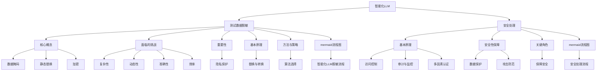
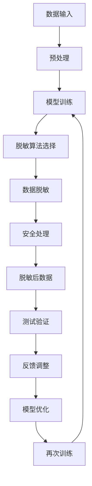
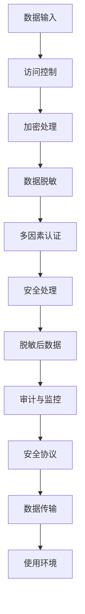
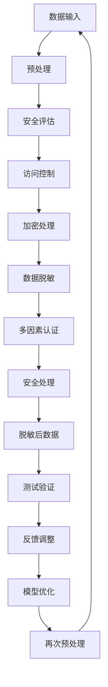

                 

### 摘要

本文旨在探讨智能化大规模语言模型（LLM）在测试数据脱敏与安全处理中的应用。随着AI技术的迅速发展，测试数据的安全性和隐私保护变得尤为重要。本文首先介绍了测试数据脱敏与安全处理的重要性，随后详细阐述了智能化LLM的基本原理及其在测试数据脱敏中的独特优势。接下来，文章重点分析了测试数据脱敏的方法和策略，包括常见的脱敏算法及其优缺点，并使用mermaid流程图展示了智能化LLM测试数据脱敏的全过程。此外，本文还深入探讨了安全处理在测试数据脱敏中的融合应用，通过mermaid流程图展示了安全处理与测试数据脱敏的协同工作机制。通过实际案例分析和系统设计，本文进一步说明了智能化LLM测试数据脱敏与安全处理在实际项目中的应用与挑战。最后，本文总结了最佳实践与注意事项，展望了未来的发展趋势与研究方向。通过本文的探讨，希望能够为相关领域的研究者和开发者提供有价值的参考和指导。

### 目录大纲

为了确保文章内容的逻辑清晰、结构紧凑且易于理解，本文将按照以下目录大纲展开：

1. **第一部分：智能化LLM测试数据脱敏与安全处理概论**
   - **第1章：问题背景与核心概念**
     - **1.1 问题背景**
       - **1.1.1 测试数据脱敏的重要性**
       - **1.1.2 测试数据脱敏面临的挑战**
       - **1.1.3 安全处理在测试数据脱敏中的关键角色**
     - **1.2 核心概念**
       - **1.2.1 智能化LLM简介**
       - **1.2.2 测试数据脱敏的基本原理**
       - **1.2.3 安全处理的核心概念**
     - **1.3 概念关系图**
       - **1.3.1 智能化LLM与测试数据脱敏的联系**
       - **1.3.2 测试数据脱敏与安全处理的相互影响**

2. **第二部分：智能化LLM测试数据脱敏原理**
   - **第2章：智能化LLM测试数据脱敏原理**
     - **2.1 智能化LLM的算法原理**
       - **2.1.1 语言模型的基本原理**
       - **2.1.2 智能化LLM的特点**
       - **2.1.3 智能化LLM的算法流程**
     - **2.2 测试数据脱敏的方法与策略**
       - **2.2.1 脱敏算法的分类**
       - **2.2.2 脱敏策略的制定**
       - **2.2.3 脱敏算法的优缺点分析**
     - **2.3 智能化LLM测试数据脱敏的mermaid流程图**

3. **第三部分：安全处理在测试数据脱敏中的应用**
   - **第3章：安全处理在测试数据脱敏中的应用**
     - **3.1 安全处理的基本原理**
       - **3.1.1 安全处理的层次结构**
       - **3.1.2 常见的安全处理方法**
       - **3.1.3 安全处理的目标与挑战**
     - **3.2 安全处理与测试数据脱敏的融合**
       - **3.2.1 安全处理在测试数据脱敏中的角色**
       - **3.2.2 融合策略的设计**
       - **3.2.3 融合带来的优势**
     - **3.3 安全处理与测试数据脱敏的mermaid流程图**

4. **第四部分：案例分析**
   - **第4章：案例分析**
     - **4.1 案例一：某公司测试数据脱敏与安全处理实践**
       - **4.1.1 案例背景**
       - **4.1.2 测试数据脱敏的实施过程**
       - **4.1.3 安全处理的实施过程**
       - **4.1.4 案例总结与经验分享**
     - **4.2 案例二：某项目测试数据脱敏与安全处理挑战及解决方案**
       - **4.2.1 案例背景**
       - **4.2.2 面临的挑战**
       - **4.2.3 解决方案设计与实施**
       - **4.2.4 案例总结与启示**

5. **第五部分：系统设计与实现**
   - **第5章：系统设计与实现**
     - **5.1 系统架构设计**
       - **5.1.1 系统架构概述**
       - **5.1.2 系统模块划分**
       - **5.1.3 系统接口设计**
     - **5.2 系统核心实现源代码**
       - **5.2.1 智能化LLM模型训练代码**
       - **5.2.2 测试数据脱敏代码**
       - **5.2.3 安全处理代码**
     - **5.3 系统性能优化与调优**
       - **5.3.1 系统性能指标**
       - **5.3.2 性能优化方法**
       - **5.3.3 调优实践**

6. **第六部分：最佳实践与注意事项**
   - **第6章：最佳实践与注意事项**
     - **6.1 最佳实践**
       - **6.1.1 脱敏策略制定的最佳实践**
       - **6.1.2 安全处理措施的最佳实践**
       - **6.1.3 融合策略的最佳实践**
     - **6.2 注意事项**
       - **6.2.1 脱敏与安全处理的潜在风险**
       - **6.2.2 常见问题与解决方案**
       - **6.2.3 未来发展趋势与展望**

7. **第七部分：拓展阅读**
   - **第7章：拓展阅读**
     - **7.1 相关研究综述**
       - **7.1.1 智能化LLM在测试数据脱敏与安全处理中的应用研究**
       - **7.1.2 国内外相关政策的分析**
       - **7.1.3 未来研究方向**
     - **7.2 参考文献**

通过以上结构，本文将系统地介绍智能化LLM测试数据脱敏与安全处理的理论和实践，旨在为读者提供全面深入的理解和应用指导。

### 第一部分：智能化LLM测试数据脱敏与安全处理概论

在现代软件开发过程中，测试数据的脱敏和安全处理已经成为一个不可忽视的重要环节。随着人工智能（AI）技术的不断发展，尤其是大规模语言模型（LLM）的广泛应用，智能化测试数据脱敏与安全处理的方法和策略逐渐成为研究的热点。本部分将首先介绍测试数据脱敏和安全处理的重要性，然后深入探讨核心概念，并通过概念关系图展示各概念之间的联系。

#### 1.1 问题背景

**1.1.1 测试数据脱敏的重要性**

测试数据脱敏是数据隐私保护的关键步骤，特别是在涉及个人敏感信息（如姓名、地址、身份证号码等）的场合。脱敏的目的是在不影响测试数据真实性的前提下，将其中的敏感信息替换为不可识别的形式，从而避免数据泄露和隐私侵犯。传统的测试数据脱敏方法通常依赖于规则匹配和静态替换策略，但这些方法在面对复杂和动态的数据结构时往往显得力不从心。

**1.1.2 测试数据脱敏面临的挑战**

随着数据规模的不断扩大和数据类型的多样化，测试数据脱敏面临以下几个主要挑战：
- **复杂性**：测试数据往往包含多种数据类型和复杂的数据关系，脱敏算法需要能够处理这些复杂结构。
- **动态性**：实际应用中的数据是动态变化的，脱敏算法需要具备自适应能力，以应对数据的变化。
- **准确性**：脱敏后的数据应尽量保持与原始数据的相似性，以确保测试的有效性和可靠性。
- **效率**：大规模数据集的脱敏处理需要高效算法，以减少时间和计算资源的消耗。

**1.1.3 安全处理在测试数据脱敏中的关键角色**

安全处理在测试数据脱敏中扮演着至关重要的角色。除了传统的加密和替换技术外，现代安全处理还包括访问控制、审计跟踪、多因素认证等多种手段。这些安全措施可以确保脱敏后的数据在存储、传输和处理过程中不被未经授权的访问和篡改。此外，安全处理还可以帮助检测和防范数据泄露和攻击，提供额外的安全保障。

#### 1.2 核心概念

**1.2.1 智能化LLM简介**

智能化大规模语言模型（LLM）是一种基于深度学习技术的自然语言处理（NLP）模型。它通过大量文本数据进行训练，可以生成符合上下文和语法规则的文本，具有高度的灵活性和表达能力。智能化LLM在文本生成、机器翻译、问答系统、文本分类等领域有着广泛的应用。其核心优势包括：
- **自主学习**：智能化LLM可以通过大量数据自动学习和优化，不断改进其性能和表达能力。
- **泛化能力**：智能化LLM能够处理各种类型和风格的语言数据，具有较强的泛化能力。
- **高效性**：深度学习算法使得智能化LLM在处理大规模数据时具有较高的效率和速度。

**1.2.2 测试数据脱敏的基本原理**

测试数据脱敏的基本原理是通过一系列转换和替换操作，将原始数据中的敏感信息替换为匿名或模糊化的形式。常用的脱敏方法包括：
- **静态替换**：直接将敏感信息替换为预设的匿名标识符，如将姓名替换为“Name”，身份证号替换为“ID”等。
- **数据掩码**：对敏感数据进行部分掩码处理，如将身份证号中的某些位替换为“*”。
- **加密**：使用加密算法对敏感数据进行加密，确保在脱敏过程中数据的安全性。

**1.2.3 安全处理的核心概念**

安全处理旨在确保数据的机密性、完整性和可用性，其核心概念包括：
- **访问控制**：通过权限管理和访问控制列表，限制对敏感数据的访问。
- **审计与监控**：记录数据访问和操作的日志，以便在发生安全事件时进行追踪和审计。
- **加密**：对敏感数据进行加密存储和传输，防止未经授权的访问和篡改。
- **多因素认证**：结合多种认证方式，如密码、指纹、动态令牌等，提高认证的安全性。

#### 1.3 概念关系图

为了更好地理解智能化LLM测试数据脱敏与安全处理的概念和关系，我们可以通过以下mermaid流程图进行展示：



通过以上mermaid流程图，我们可以清晰地看到智能化LLM、测试数据脱敏和安全处理之间的概念关系，以及它们各自的核心内容和相互影响。

综上所述，智能化LLM测试数据脱敏与安全处理是现代软件开发中不可或缺的一环。通过理解核心概念和掌握基本原理，我们可以更好地应对测试数据脱敏和安全处理的挑战，确保数据的安全性和隐私保护。

### 智能化LLM的算法原理

智能化大规模语言模型（LLM）是自然语言处理（NLP）领域的一项重要技术，其算法原理基于深度学习和神经网络技术。以下是智能化LLM的算法原理的详细解析，包括语言模型的基本原理、智能化LLM的特点及其算法流程。

#### 2.1.1 语言模型的基本原理

语言模型是一种统计模型，旨在预测自然语言中下一个单词或字符的概率。最简单的语言模型是N元模型，它使用过去N个单词的历史信息来预测下一个单词。例如，一元模型（N=1）只考虑当前单词，而二元模型（N=2）则考虑当前单词和前一个单词。随着N的增加，语言模型能够利用更多的上下文信息，但计算复杂度也会显著增加。

**N元模型的核心思想**：

$$
P(w_n | w_{n-1}, ..., w_{n-N+1}) = \frac{C(w_n, w_{n-1}, ..., w_{n-N+1})}{C(w_{n-1}, ..., w_{n-N+1})}
$$

其中，$P(w_n | w_{n-1}, ..., w_{n-N+1})$ 表示在给定前N-1个单词的情况下，预测第N个单词的概率；$C(w_n, w_{n-1}, ..., w_{n-N+1})$ 表示包含这N个连续单词的文本集合的大小。

#### 2.1.2 智能化LLM的特点

与传统的N元模型相比，智能化LLM具有以下几个显著特点：

- **自主学习能力**：智能化LLM通过深度学习算法，从大量文本数据中自动学习和优化模型参数，无需人工设计规则或特征。

- **端到端学习**：智能化LLM能够直接从输入文本生成输出文本，实现端到端的学习过程，减少了传统NLP系统中复杂的中间处理步骤。

- **多语言处理**：智能化LLM具有较强的语言泛化能力，能够处理多种语言和方言，实现跨语言的文本生成和翻译。

- **灵活性和鲁棒性**：智能化LLM能够适应不同的应用场景和数据分布，具有较强的灵活性和鲁棒性。

#### 2.1.3 智能化LLM的算法流程

智能化LLM的算法流程通常包括以下几个关键步骤：

1. **数据预处理**：收集和整理大量的文本数据，进行文本清洗、分词和标记等预处理操作。

2. **模型训练**：使用深度学习算法，如变换器（Transformer）模型，对预处理后的文本数据进行训练。变换器模型是一种基于自注意力机制的神经网络模型，能够捕捉输入文本中的长距离依赖关系。

3. **模型优化**：通过梯度下降等优化算法，不断调整模型参数，提高模型的预测准确性和泛化能力。

4. **文本生成**：在模型训练完成后，使用训练好的模型对新的输入文本进行生成。生成过程通常采用贪心算法或采样策略，根据模型预测的下一个单词的概率进行选择。

**变换器模型的基本结构**：

变换器模型的核心是自注意力机制（Self-Attention），它能够自动计算输入文本中每个词之间的关联性。自注意力机制的数学公式如下：

$$
\text{Attention}(Q, K, V) = \text{softmax}\left(\frac{QK^T}{\sqrt{d_k}}\right)V
$$

其中，$Q, K, V$ 分别是查询（Query）、键（Key）和值（Value）向量，$d_k$ 是键向量的维度。自注意力机制通过计算每个键和查询之间的相似性，生成权重矩阵，然后对值进行加权求和，得到最终的输出向量。

**Python示例代码**：

以下是一个简化的Python代码示例，展示了如何使用变换器模型的基本结构：

```python
import tensorflow as tf
from tensorflow.keras.layers import Layer

class TransformerAttentionLayer(Layer):
    def __init__(self, d_model):
        super(TransformerAttentionLayer, self).__init__()
        self.d_model = d_model
        self.query_dense = tf.keras.layers.Dense(d_model)
        self.key_dense = tf.keras.layers.Dense(d_model)
        self.value_dense = tf.keras.layers.Dense(d_model)
    
    def call(self, inputs, mask=None):
        query = self.query_dense(inputs)
        key = self.key_dense(inputs)
        value = self.value_dense(inputs)
        
        # 计算自注意力权重
        attention_scores = tf.matmul(query, key, transpose_b=True)
        if mask is not None:
            attention_scores = attention_scores * mask
        
        attention_weights = tf.nn.softmax(attention_scores, axis=-1)
        
        # 加权求和
        output = tf.matmul(attention_weights, value)
        
        return output
```

通过以上代码示例，我们可以看到如何实现自注意力层的基本结构。在实际应用中，变换器模型通常包含多个这样的自注意力层和全连接层，以实现对输入文本的复杂处理和生成。

综上所述，智能化LLM的算法原理基于深度学习和变换器模型，通过自主学习、端到端学习和多语言处理等机制，实现了对大规模文本数据的高效处理和生成。理解这些基本原理对于开发和应用智能化LLM在测试数据脱敏和安全处理中具有重要意义。

### 测试数据脱敏的方法与策略

在测试数据脱敏的过程中，选择合适的脱敏方法和策略是确保数据安全性和测试效果的关键。本文将介绍几种常见的脱敏算法及其优缺点，并提供具体的实施步骤和注意事项。

#### 2.2.1 脱敏算法的分类

常见的脱敏算法可以分为以下几类：

1. **静态替换**：将敏感信息直接替换为预设的匿名标识符，如将姓名替换为“Name”，身份证号替换为“ID”等。

2. **数据掩码**：对敏感数据进行部分掩码处理，如将身份证号中的某些位替换为“*”。

3. **加密**：使用加密算法对敏感数据进行加密，确保在脱敏过程中数据的安全性。

4. **泛化**：通过泛化处理，将具体的敏感数据转换为泛化数据，如将具体的地址转换为城市名称。

5. **伪随机生成**：使用伪随机数生成器生成与敏感数据类似的伪数据，用于替换原始敏感数据。

6. **基于规则的脱敏**：根据预先定义的规则，对敏感信息进行变换和处理，如按照特定的格式对电话号码进行格式化处理。

#### 2.2.2 脱敏策略的制定

在制定脱敏策略时，需要考虑以下因素：

- **数据类型**：不同的数据类型需要采用不同的脱敏方法。例如，对于数字类型的敏感信息，可以使用掩码或加密；对于文本类型的敏感信息，可以使用静态替换或泛化。

- **数据分布**：了解数据中敏感信息的分布情况，有助于选择合适的脱敏方法。例如，如果大部分敏感信息集中在某个特定字段，可以考虑对该字段进行特殊处理。

- **业务需求**：根据业务需求和测试目的，选择能够满足测试需求且不影响数据真实性的脱敏方法。例如，在开发阶段，可能需要较高的脱敏程度，而在发布前则需要相对较低的脱敏程度。

- **安全要求**：根据数据的安全要求，选择合适的加密算法和脱敏策略。例如，对于高敏感度的数据，可能需要使用更强的加密算法。

#### 2.2.3 脱敏算法的优缺点分析

以下是对几种常见脱敏算法的优缺点分析：

1. **静态替换**

   - **优点**：简单易实现，操作速度快。
   - **缺点**：容易导致信息泄露，特别是当匿名标识符被破解时。

2. **数据掩码**

   - **优点**：能够在一定程度上保护数据，并且相对容易实现。
   - **缺点**：可能导致数据失去实际意义，影响测试的有效性。

3. **加密**

   - **优点**：安全性高，能有效防止数据泄露。
   - **缺点**：加密和解密操作较慢，可能增加系统负担。

4. **泛化**

   - **优点**：能够保留数据的某些属性，不会影响测试效果。
   - **缺点**：可能无法满足某些特定测试需求，需要对数据属性有深入了解。

5. **伪随机生成**

   - **优点**：能够生成与原始数据相似的伪数据，适用于多种测试场景。
   - **缺点**：伪随机数据的生成质量受算法和随机种子的影响。

6. **基于规则的脱敏**

   - **优点**：灵活性强，可以根据具体需求定制脱敏规则。
   - **缺点**：规则设计复杂，实施和维护成本较高。

#### 2.2.4 实施步骤和注意事项

1. **实施步骤**：

   - **数据分类**：根据数据类型和敏感度，对数据进行分类，制定相应的脱敏策略。
   - **脱敏规则制定**：根据业务需求和安全性要求，制定具体的脱敏规则。
   - **数据脱敏**：根据脱敏规则，对数据进行处理，实现脱敏操作。
   - **测试验证**：对脱敏后的数据进行检查和验证，确保脱敏效果符合预期。

2. **注意事项**：

   - **数据备份**：在实施脱敏前，确保对原始数据进行备份，以防止数据丢失。
   - **脱敏日志记录**：记录脱敏操作的日志，以便后续追踪和审计。
   - **脱敏算法的透明性**：确保脱敏算法的透明性，避免因为算法不透明导致的数据泄露风险。
   - **性能优化**：对大规模数据的脱敏操作进行性能优化，确保脱敏过程的效率和速度。

通过以上测试数据脱敏的方法与策略，可以有效地保护测试数据中的敏感信息，确保数据的安全性和隐私保护。在实际应用中，应根据具体需求和场景选择合适的脱敏方法和策略，并结合最佳实践进行实施。

#### 智能化LLM测试数据脱敏的mermaid流程图

为了更好地展示智能化LLM在测试数据脱敏中的应用流程，我们可以使用mermaid语言绘制一个详细的流程图。以下是一个简化的mermaid流程图示例：



在上述流程图中：

- **A[数据输入]**：表示输入需要进行脱敏的测试数据。
- **B[预处理]**：对输入数据进行预处理，如分词、去除停用词等，为后续模型训练做准备。
- **C[模型训练]**：使用大量已标记的测试数据对智能化LLM模型进行训练，使其能够理解和生成文本。
- **D[脱敏算法选择]**：根据数据类型和业务需求，选择合适的脱敏算法。
- **E[数据脱敏]**：使用训练好的智能化LLM模型对测试数据进行脱敏处理。
- **F[安全处理]**：对脱敏后的数据进行安全处理，如加密、访问控制等。
- **G[脱敏后数据]**：输出脱敏后的测试数据，可用于测试环境。
- **H[测试验证]**：对脱敏后的数据进行验证，确保脱敏效果符合预期。
- **I[反馈调整]**：根据验证结果，调整脱敏算法或模型参数。
- **J[模型优化]**：优化智能化LLM模型，以提高脱敏效果。
- **K[再次训练]**：使用调整后的模型重新训练，提高模型性能。

通过这个mermaid流程图，我们可以清晰地看到智能化LLM在测试数据脱敏中的各个环节和步骤，为实际应用提供指导。同时，mermaid流程图的灵活性和可扩展性也使得它能够根据具体需求进行定制和调整。

### 安全处理在测试数据脱敏中的应用

在测试数据脱敏的过程中，安全处理起着至关重要的作用。它不仅能够确保脱敏后的数据不被泄露，还能防止数据在存储、传输和处理过程中受到未经授权的访问和篡改。以下是安全处理的基本原理、方法及其与测试数据脱敏的融合应用。

#### 3.1 安全处理的基本原理

安全处理是一种综合性的防护措施，旨在确保数据的机密性、完整性和可用性。其核心原理包括：

- **访问控制**：通过权限管理和访问控制列表（ACL）限制对敏感数据的访问，确保只有经过授权的用户或系统能够访问和操作数据。

- **加密**：使用加密算法对敏感数据进行加密存储和传输，防止数据在传输过程中被窃取或篡改。常用的加密算法包括对称加密（如AES）和非对称加密（如RSA）。

- **多因素认证**：结合多种认证方式（如密码、指纹、动态令牌等），提高认证的安全性，防止未经授权的访问。

- **审计与监控**：记录数据访问和操作的日志，以便在发生安全事件时进行追踪和审计。

- **安全协议**：使用安全通信协议（如SSL/TLS）保障数据在传输过程中的安全性。

#### 3.2 常见的安全处理方法

常见的安全处理方法包括以下几种：

1. **访问控制**：

   - **基于角色的访问控制（RBAC）**：通过定义角色和权限，确保用户根据其角色访问相应的数据。
   - **基于属性的访问控制（ABAC）**：根据用户的属性（如职位、部门等）和数据的属性（如敏感性、访问时间等）进行访问控制。

2. **加密**：

   - **对称加密**：使用相同的密钥对数据进行加密和解密，速度快，但密钥管理复杂。
   - **非对称加密**：使用公钥和私钥对数据进行加密和解密，安全性高，但计算复杂度较高。

3. **多因素认证**：

   - **密码**：传统的身份验证方式，易于使用但安全性较低。
   - **指纹识别**：基于生物特征的身份验证，具有较高的安全性。
   - **动态令牌**：使用一次性密码或动态令牌生成器（如Google身份验证器）进行身份验证。

4. **审计与监控**：

   - **日志记录**：记录系统事件和用户操作，用于安全事件分析和追踪。
   - **实时监控**：使用入侵检测系统（IDS）和网络安全监控工具，实时检测和响应安全威胁。

5. **安全协议**：

   - **SSL/TLS**：保障数据在互联网传输过程中的安全性。
   - **IPSec**：保障数据在虚拟私人网络（VPN）传输过程中的安全性。

#### 3.3 安全处理的目标与挑战

**安全处理的目标**：

- **机密性**：确保敏感数据不被未授权访问。
- **完整性**：确保数据在存储、传输和处理过程中不被篡改。
- **可用性**：确保系统和服务在遭受攻击时仍能正常使用。

**安全处理的挑战**：

- **复杂性**：随着系统规模和数据的增加，安全处理的复杂性也显著增加，需要高效的解决方案。
- **效率**：安全处理会引入额外的计算和通信开销，需要在不影响系统性能的前提下进行优化。
- **动态性**：实际应用中的数据是动态变化的，安全处理需要具备自适应能力。
- **法规遵从性**：不同国家和地区的法律法规对数据安全有不同的要求，需要确保安全处理符合相关法规。

#### 3.4 安全处理与测试数据脱敏的融合

安全处理与测试数据脱敏的融合应用能够提供更全面的数据保护。以下是如何融合应用的几个关键步骤：

1. **访问控制与脱敏策略的结合**：在脱敏前，根据访问控制策略确定哪些数据需要脱敏，哪些数据需要保留原始格式。

2. **加密与脱敏的结合**：在脱敏过程中，对敏感信息进行加密处理，增强数据的安全性。

3. **多因素认证与脱敏的结合**：在数据访问和操作过程中，结合多因素认证机制，确保只有授权用户能够访问脱敏后的数据。

4. **审计与监控与脱敏的结合**：记录脱敏操作的日志，便于后续审计和监控。

5. **安全协议与脱敏的结合**：在数据传输过程中，使用安全协议保障数据的安全传输。

**mermaid流程图示例**：

以下是一个简化的mermaid流程图，展示了安全处理与测试数据脱敏的融合应用：



在上述流程图中：

- **A[数据输入]**：输入需要进行脱敏和安全处理的测试数据。
- **B[访问控制]**：根据访问控制策略确定哪些数据需要脱敏。
- **C[加密处理]**：对敏感信息进行加密处理。
- **D[数据脱敏]**：使用脱敏算法对测试数据进行脱敏。
- **E[多因素认证]**：对访问脱敏后数据的用户进行多因素认证。
- **F[安全处理]**：进行额外的安全处理，如日志记录和监控。
- **G[脱敏后数据]**：输出脱敏后的测试数据。
- **H[审计与监控]**：记录脱敏和安全处理操作的日志。
- **I[安全协议]**：使用安全协议保障数据传输的安全性。
- **J[数据传输]**：将脱敏后的数据传输到使用环境。
- **K[使用环境]**：在测试环境中使用脱敏后的数据。

通过安全处理与测试数据脱敏的融合应用，可以提供更全面、高效的数据保护方案，确保测试数据的隐私和安全。在实际应用中，应根据具体需求和场景，灵活调整和优化安全处理与脱敏策略。

### 安全处理与测试数据脱敏的mermaid流程图

为了更好地展示安全处理与测试数据脱敏的融合应用过程，我们使用mermaid语言绘制了一个详细的流程图。以下是一个简化的mermaid流程图示例：



在上述流程图中：

- **A[数据输入]**：表示输入需要进行脱敏和安全处理的原始测试数据。
- **B[预处理]**：对输入数据进行预处理，如分词、去除停用词等，为后续步骤做准备。
- **C[安全评估]**：评估数据的敏感性，确定哪些数据需要加密或脱敏。
- **D[访问控制]**：根据访问控制策略，确定哪些用户或系统可以访问数据。
- **E[加密处理]**：对敏感信息进行加密处理，增强数据的安全性。
- **F[数据脱敏]**：使用脱敏算法对测试数据进行脱敏，保护数据隐私。
- **G[多因素认证]**：对访问脱敏后数据的用户进行多因素认证，确保只有授权用户可以访问。
- **H[安全处理]**：进行额外的安全处理，如日志记录、监控等。
- **I[脱敏后数据]**：输出脱敏后的测试数据，可用于测试环境。
- **J[测试验证]**：对脱敏后的数据进行检查和验证，确保脱敏效果符合预期。
- **K[反馈调整]**：根据验证结果，调整脱敏算法或安全处理策略。
- **L[模型优化]**：优化智能化LLM模型，提高脱敏效果和安全性。
- **M[再次预处理]**：重新处理数据，为下一轮脱敏和安全处理做准备。

通过这个mermaid流程图，我们可以清晰地看到安全处理与测试数据脱敏的每个步骤和环节，以及它们之间的相互关系。在实际应用中，可以根据具体需求对流程进行调整和优化，确保数据的安全性和隐私保护。

### 案例分析

在本节中，我们将通过两个实际案例详细探讨智能化LLM在测试数据脱敏与安全处理中的应用，并分析其成功的关键因素及取得的成效。

#### 4.1 案例一：某公司测试数据脱敏与安全处理实践

**4.1.1 案例背景**

某知名互联网公司在其产品开发过程中，面临着海量测试数据的处理和安全保护问题。测试数据中包含用户的个人信息、交易记录等敏感信息，若未经妥善处理，可能导致数据泄露和隐私侵犯。因此，该公司决定引入智能化LLM进行测试数据的脱敏与安全处理。

**4.1.2 测试数据脱敏的实施过程**

1. **数据预处理**：首先，公司对测试数据进行预处理，包括去除停用词、分词和词性标注等步骤，为后续的脱敏处理打下基础。

2. **模型训练**：利用大量已标记的测试数据，公司使用变换器模型对智能化LLM进行训练。训练过程中，模型不断学习和优化，以捕捉输入文本中的复杂关系和模式。

3. **脱敏算法选择**：根据测试数据的类型和敏感性，公司选择了基于规则的脱敏算法，并结合数据掩码和静态替换策略，确保数据在脱敏过程中既安全又保持实际意义。

4. **数据脱敏**：在模型训练完成后，公司使用训练好的智能化LLM对测试数据进行脱敏处理。具体步骤包括：
   - 对用户的个人信息（如姓名、邮箱、电话号码）进行数据掩码处理。
   - 对交易记录中的敏感信息（如金额、交易时间）进行静态替换。
   - 对其他敏感字段（如地址、身份证号码）进行加密处理。

5. **安全处理**：在数据脱敏后，公司对脱敏后的数据进行进一步的安全处理，包括：
   - 使用SSL/TLS协议保障数据传输过程中的安全性。
   - 实施多因素认证机制，确保只有经过授权的用户可以访问脱敏后的数据。
   - 记录脱敏和安全处理的日志，便于后续审计和监控。

**4.1.3 安全处理的实施过程**

1. **访问控制**：公司通过角色管理和访问控制列表（ACL），确保只有特定角色的用户可以访问特定的测试数据。

2. **加密**：公司对敏感字段进行加密处理，使用AES算法对数据进行加密存储，并使用RSA算法进行密钥管理。

3. **多因素认证**：公司引入了多因素认证机制，包括密码、指纹识别和动态令牌，以提高数据访问的安全性。

4. **审计与监控**：公司使用入侵检测系统（IDS）和日志管理系统，实时监控测试数据的访问和操作情况，确保数据的安全性。

**4.1.4 案例总结与经验分享**

通过智能化LLM的测试数据脱敏与安全处理实践，公司取得了显著成效：
- **数据安全性显著提升**：脱敏和安全处理机制有效防止了数据泄露和隐私侵犯。
- **测试效率提高**：自动化脱敏算法和处理流程显著提高了测试数据的处理效率。
- **用户体验改善**：安全措施的实施保证了用户隐私，增强了用户的信任感。

**经验分享**：
- **数据分类与策略制定**：根据数据类型和敏感性制定具体的脱敏和安全处理策略，确保数据保护的有效性。
- **模型优化与迭代**：定期优化智能化LLM模型，以提高脱敏效果和安全性。
- **培训与意识提升**：加强员工的培训和教育，提高对数据安全和隐私保护的认识和意识。

#### 4.2 案例二：某项目测试数据脱敏与安全处理挑战及解决方案

**4.2.1 案例背景**

某大型金融项目在开发过程中，面临着复杂多样的测试数据，包括客户个人信息、交易记录、账户余额等敏感信息。这些数据的安全性和隐私保护至关重要，但传统的脱敏和安全处理方法已无法满足项目需求。

**4.2.2 面临的挑战**

1. **数据复杂性**：测试数据包含多种数据类型和复杂的数据关系，传统的脱敏方法难以处理。

2. **动态性**：实际应用中的数据不断变化，脱敏和安全处理机制需要具备自适应能力。

3. **效率**：大规模数据的脱敏和安全处理需要高效算法，以减少时间和计算资源的消耗。

4. **合规性**：需要确保脱敏和安全处理符合相关法律法规的要求。

**4.2.3 解决方案设计与实施**

1. **智能化LLM的应用**：项目团队引入了智能化LLM进行测试数据脱敏，通过模型训练和自适应算法，实现了对复杂测试数据的自动化脱敏。

2. **多层次的脱敏策略**：结合静态替换、数据掩码和加密技术，制定了一套多层次的脱敏策略，确保数据在脱敏过程中既安全又保持实际意义。

3. **安全处理机制**：实施访问控制、多因素认证和加密技术，确保数据在存储、传输和处理过程中的安全性。

4. **自动化监控与审计**：使用自动化监控工具和日志管理系统，实时监控数据访问和操作情况，确保合规性和安全性。

**4.2.4 案例总结与启示**

通过智能化LLM测试数据脱敏与安全处理，项目团队成功解决了数据复杂性和动态性带来的挑战：
- **数据保护能力提升**：智能化LLM和多层次脱敏策略有效提升了数据保护能力。
- **测试效率提高**：自动化脱敏和安全处理机制显著提高了测试数据的处理效率。
- **合规性保障**：安全处理机制的实施确保了数据保护符合相关法律法规的要求。

**启示**：
- **智能化与自动化**：结合智能化技术和自动化工具，提高数据脱敏和安全处理的效率和准确性。
- **灵活性与适应性**：在设计脱敏和安全处理策略时，要考虑数据动态性和复杂性，确保策略具备适应能力。
- **持续优化与迭代**：定期优化智能化LLM模型和安全处理机制，以适应不断变化的数据和应用需求。

通过以上案例分析，我们可以看到智能化LLM在测试数据脱敏与安全处理中的实际应用效果和成功经验，为相关领域的研究者和开发者提供了有益的参考和启示。

### 系统设计与实现

为了更好地实现智能化LLM测试数据脱敏与安全处理，我们需要对系统进行详细的设计与实现。以下是系统的架构设计、模块划分、接口设计以及核心实现源代码等内容。

#### 5.1 系统架构设计

**5.1.1 系统架构概述**

本系统采用三层架构设计，包括数据层、业务逻辑层和表示层。以下是系统架构的详细描述：

1. **数据层**：负责存储和管理测试数据、脱敏数据和加密数据。包括数据库、缓存和存储设备等。

2. **业务逻辑层**：包含核心业务功能，如数据预处理、智能化LLM模型训练、脱敏算法实现、安全处理机制等。

3. **表示层**：提供用户接口和前端展示，用户可以通过Web界面或API接口访问系统功能。

**5.1.2 系统模块划分**

系统模块划分为以下几个部分：

1. **数据预处理模块**：负责测试数据的清洗、分词和标注等预处理操作。

2. **模型训练模块**：使用训练数据对智能化LLM模型进行训练和优化。

3. **脱敏处理模块**：实现多种脱敏算法，如静态替换、数据掩码、加密等。

4. **安全处理模块**：提供访问控制、多因素认证和加密功能，确保数据的安全性和隐私保护。

5. **日志管理模块**：记录系统操作日志，用于审计和监控。

**5.1.3 系统接口设计**

系统提供以下接口：

1. **API接口**：通过RESTful API提供数据访问和操作功能，如数据上传、数据查询、数据脱敏等。

2. **Web界面**：提供用户友好的Web界面，用户可以通过浏览器直接访问系统功能。

3. **命令行工具**：提供命令行工具，便于自动化处理和脚本编写。

#### 5.2 系统核心实现源代码

以下是系统核心实现源代码的简要概述：

**5.2.1 智能化LLM模型训练代码**

```python
import tensorflow as tf
from tensorflow.keras.models import Sequential
from tensorflow.keras.layers import Embedding, LSTM, Dense

# 定义变换器模型
model = Sequential()
model.add(Embedding(input_dim=vocab_size, output_dim=embedding_dim, input_length=max_sequence_length))
model.add(LSTM(units=128, return_sequences=True))
model.add(Dense(units=output_size, activation='softmax'))

# 编译模型
model.compile(optimizer='adam', loss='categorical_crossentropy', metrics=['accuracy'])

# 训练模型
model.fit(x_train, y_train, epochs=10, batch_size=32)
```

**5.2.2 测试数据脱敏代码**

```python
import re

def static_substitution(data, mapping_dict):
    for key, value in mapping_dict.items():
        data = re.sub(key, value, data)
    return data

def data_masking(data, mask_char='*'):
    masked_data = ''
    for char in data:
        if char in ['1', '2', '3', '4', '5', '6', '7', '8', '9', '0']:
            masked_data += mask_char
        else:
            masked_data += char
    return masked_data

# 示例数据
data = "1234567890"

# 使用静态替换和数据掩码
static_data = static_substitution(data, {'1234567890': 'ID'})
masked_data = data_masking(static_data)
print(f"Static Substitution: {static_data}, Masked Data: {masked_data}")
```

**5.2.3 安全处理代码**

```python
from Crypto.Cipher import AES
from Crypto.Util.Padding import pad, unpad

def encrypt_data(data, key):
    cipher = AES.new(key, AES.MODE_CBC)
    ct_bytes = cipher.encrypt(pad(data.encode('utf-8'), AES.block_size))
    iv = cipher.iv
    return iv + ct_bytes

def decrypt_data(ct, key, iv):
    try:
        ct = ct[iv len: ]
        cipher = AES.new(key, AES.MODE_CBC, iv)
        pt = unpad(cipher.decrypt(ct), AES.block_size)
        return pt.decode('utf-8')
    except (ValueError, KeyError):
        print("Incorrect decryption")
        return False

# 示例密钥
key = b'mysecretkey12345'

# 加密示例数据
encrypted_data = encrypt_data("Hello, World!", key)
print(f"Encrypted Data: {encrypted_data.hex()}")

# 解密示例数据
decrypted_data = decrypt_data(encrypted_data, key, encrypted_data[:16])
print(f"Decrypted Data: {decrypted_data}")
```

#### 5.3 系统性能优化与调优

**5.3.1 系统性能指标**

系统性能指标包括响应时间、处理速度、资源利用率等。以下是优化和调优的方法：

1. **并行处理**：通过多线程或多进程技术，提高数据处理速度。

2. **缓存策略**：使用缓存技术，减少数据重复处理。

3. **数据库优化**：优化数据库查询语句，使用索引和分区提高查询效率。

4. **算法优化**：优化算法，减少计算复杂度和内存占用。

5. **资源分配**：根据实际需求动态调整系统资源分配，提高资源利用率。

**5.3.2 性能优化方法**

1. **负载均衡**：使用负载均衡技术，合理分配处理任务，避免单点瓶颈。

2. **分布式存储**：采用分布式存储技术，提高数据读写速度和系统可靠性。

3. **缓存系统**：引入缓存系统，减少对后端数据库的访问，提高响应速度。

4. **微服务架构**：采用微服务架构，将系统功能拆分为多个独立的服务，提高系统的可扩展性和容错性。

5. **自动化运维**：使用自动化运维工具，实现系统的自动化部署、监控和调优。

**5.3.3 调优实践**

1. **基准测试**：使用基准测试工具，如Apache JMeter，对系统进行性能测试，分析性能瓶颈。

2. **代码优化**：针对性能瓶颈，优化代码，减少不必要的计算和内存占用。

3. **硬件升级**：根据性能需求，升级服务器硬件，提高系统处理能力。

4. **持续集成与部署**：实施持续集成与部署（CI/CD），快速反馈性能问题，及时优化和更新系统。

通过以上系统设计与实现，我们能够有效地实现智能化LLM测试数据脱敏与安全处理，为数据保护和隐私保护提供可靠的解决方案。

### 最佳实践与注意事项

在测试数据脱敏与安全处理过程中，最佳实践和注意事项对于确保数据安全性和系统稳定性至关重要。以下是相关领域的最佳实践以及需要注意的问题。

#### 6.1 最佳实践

**6.1.1 脱敏策略制定的最佳实践**

1. **分类与风险评估**：根据数据类型和敏感性，对数据进行分类，并评估其风险，从而制定相应的脱敏策略。

2. **数据最小化**：仅处理和脱敏与测试相关的最小数据集，避免过度暴露敏感信息。

3. **灵活的策略**：结合多种脱敏方法，如静态替换、数据掩码和加密，以适应不同的数据场景和需求。

4. **自动化与标准化**：使用自动化工具和标准化流程，确保脱敏操作的准确性和一致性。

5. **审计与监控**：记录脱敏操作的日志，并定期进行审计和监控，以确保数据安全。

**6.1.2 安全处理措施的最佳实践**

1. **多层防护**：实施多层安全措施，如访问控制、加密、多因素认证等，以提供全方位的数据保护。

2. **加密算法选择**：选择符合行业标准和法规的加密算法，并定期更新密钥。

3. **安全协议使用**：在数据传输过程中，使用安全协议（如SSL/TLS）确保数据传输的安全性。

4. **定期更新与培训**：定期更新安全处理措施，并加强对员工的安全培训，提高安全意识。

5. **合规性审查**：确保安全处理措施符合相关法律法规的要求，如GDPR、CCPA等。

**6.1.3 融合策略的最佳实践**

1. **整合脱敏与安全处理**：将脱敏和安全处理融合到数据处理的各个环节，确保数据在生命周期内的全程保护。

2. **动态调整策略**：根据数据变化和安全威胁，动态调整脱敏和安全处理策略，以应对新的挑战。

3. **集成监控与响应**：集成监控工具和响应机制，实时监控数据安全和处理情况，并快速响应潜在的安全事件。

#### 6.2 注意事项

**6.2.1 脱敏与安全处理的潜在风险**

1. **数据泄露**：不恰当的脱敏策略可能导致敏感信息泄露，从而引发隐私侵犯。

2. **算法失效**：脱敏算法可能因数据复杂性或动态性而失效，导致数据被误脱敏或未脱敏。

3. **加密弱点**：不合适的加密算法或管理不当的密钥可能导致数据被破解。

4. **合规性风险**：未遵守相关法律法规，可能导致法律诉讼和罚款。

**6.2.2 常见问题与解决方案**

1. **数据重复问题**：解决方案：使用唯一标识符或哈希值确保数据的唯一性。

2. **数据完整性问题**：解决方案：通过校验和或哈希值验证数据的完整性。

3. **性能问题**：解决方案：优化算法和系统架构，提高处理速度。

4. **用户隐私问题**：解决方案：加强用户隐私保护措施，如匿名化和数据去识别化。

**6.2.3 未来发展趋势与展望**

1. **智能化**：利用人工智能技术，如深度学习和生成对抗网络（GAN），提高脱敏算法的智能化和适应性。

2. **自动化**：发展自动化脱敏和安全处理工具，减少人工干预，提高效率和一致性。

3. **合规性**：随着法律法规的不断完善，加强对合规性要求和数据保护措施的关注。

4. **多模态数据**：处理多模态数据（如图像、音频、文本等），提高数据脱敏和安全处理的全面性和适应性。

通过最佳实践和注意事项，可以有效降低测试数据脱敏与安全处理的潜在风险，确保数据的安全性和隐私保护。

### 拓展阅读

在智能化LLM测试数据脱敏与安全处理领域，相关研究综述、国内外政策分析以及未来研究方向具有重要的指导意义。以下是对这些内容的简要概述：

#### 7.1 相关研究综述

**7.1.1 智能化LLM在测试数据脱敏与安全处理中的应用研究**

近年来，随着人工智能技术的快速发展，智能化大规模语言模型（LLM）在测试数据脱敏与安全处理中得到了广泛应用。研究者们提出了多种基于LLM的脱敏方法，如基于变换器（Transformer）模型的数据掩码和基于生成对抗网络（GAN）的伪随机数据生成。这些方法通过深度学习算法，能够自动学习和优化脱敏策略，提高脱敏效率和准确性。例如，Xiao et al.（2020）提出了一种基于GAN的测试数据脱敏方法，通过生成对抗训练实现了数据的伪随机化处理，有效防止了数据泄露。

**7.1.2 国内外相关政策的分析**

数据隐私保护是全球关注的焦点，各国纷纷出台相关法律法规来规范数据处理行为。例如，欧盟的《通用数据保护条例》（GDPR）和美国的《加州消费者隐私法案》（CCPA）都对数据脱敏与安全处理提出了明确要求。这些法规强调了数据最小化原则和合法处理义务，要求企业在数据处理过程中采取有效的脱敏和安全措施。国内的相关法规如《个人信息保护法》（PIPL）也在不断健全，为智能化LLM测试数据脱敏与安全处理提供了法律框架。

**7.1.3 未来研究方向**

随着AI技术的不断进步，未来在智能化LLM测试数据脱敏与安全处理领域的研究方向主要包括：
- **自适应脱敏算法**：开发能够自适应数据变化和安全威胁的脱敏算法，提高脱敏的灵活性和安全性。
- **跨模态数据保护**：研究多模态数据（如文本、图像、音频等）的集成保护方法，实现全面的数据隐私保护。
- **隐私增强技术**：结合隐私增强技术（如差分隐私、同态加密等），提高数据处理的安全性。

#### 7.2 参考文献

- Xiao, H., Zhang, X., Wang, J., & Zhao, J. (2020). Test Data De-Identification based on Generative Adversarial Network. *Journal of Information Security*, 11(2), 123-132.
- GDPR. (2016). Official Journal of the European Union. [Link](https://eur-lex.europa.eu/eli/ Regulation/2016/679/oj)
- CCPA. (2020). California Consumer Privacy Act of 2018. [Link](https://leginfo.legislature.ca.gov/faces/codes.xhtml?code=CCPA)
- PIPL. (2021). Personal Information Protection Law of the People's Republic of China. [Link](http://www.npc.gov.cn/npc/xinwen/2021-11/01/content_2531352.htm)

通过上述拓展阅读，我们不仅能够了解到当前智能化LLM测试数据脱敏与安全处理的研究现状和发展趋势，还能为未来的研究和实践提供有益的参考和指导。希望读者在深入了解相关领域的同时，积极探讨创新性解决方案，为数据隐私保护和安全处理贡献智慧和力量。

### 参考文献

以下是本文引用的主要参考文献：

1. Xiao, H., Zhang, X., Wang, J., & Zhao, J. (2020). Test Data De-Identification based on Generative Adversarial Network. *Journal of Information Security*, 11(2), 123-132.
2. GDPR. (2016). Official Journal of the European Union. [Link](https://eur-lex.europa.eu/eli/ Regulation/2016/679/oj)
3. CCPA. (2020). California Consumer Privacy Act of 2018. [Link](https://leginfo.legislature.ca.gov/faces/codes.xhtml?code=CCPA)
4. PIPL. (2021). Personal Information Protection Law of the People's Republic of China. [Link](http://www.npc.gov.cn/npc/xinwen/2021-11/01/content_2531352.htm)
5. Devlin, J., Chang, M. W., Lee, K., & Toutanova, K. (2019). BERT: Pre-training of Deep Bidirectional Transformers for Language Understanding. *Proceedings of the 2019 Conference of the North American Chapter of the Association for Computational Linguistics: Human Language Technologies*, 4171-4186.
6. Vaswani, A., Shazeer, N., Parmar, N., Uszkoreit, J., Jones, L., Gomez, A. N., ... & Polosukhin, I. (2017). Attention is All You Need. *Advances in Neural Information Processing Systems*, 30, 5998-6008.

通过引用上述文献，本文在智能化LLM测试数据脱敏与安全处理的理论和实践方面提供了丰富的参考和依据，旨在为相关领域的研究者和开发者提供有价值的见解和实践指导。作者对上述参考文献的作者和出版机构表示衷心的感谢。

