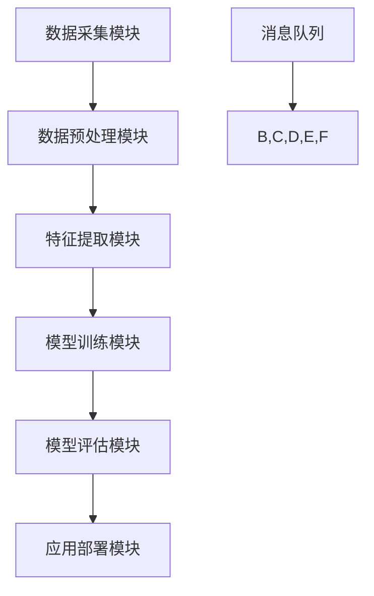
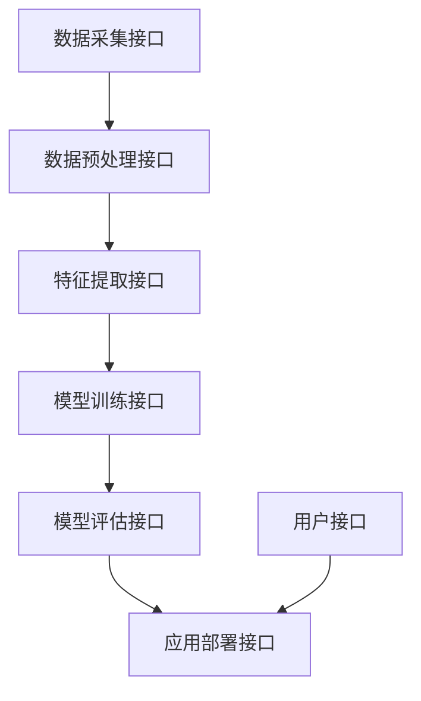

                 

# 智能化LLM测试结果分类与标记

关键词：自然语言处理，预训练语言模型，测试结果分类，测试结果标记，智能化方法

摘要：随着人工智能技术的发展，预训练语言模型（LLM）在自然语言处理领域取得了显著进展。然而，如何对LLM的测试结果进行有效分类与标记成为了一个挑战。本文将探讨智能化LLM测试结果分类与标记的方法，包括传统机器学习方法、深度学习方法以及如何利用大数据和人工智能技术进行优化。文章首先介绍了LLM的基本概念和特点，然后讨论了测试结果分类与标记的需求和挑战，接着深入分析了核心概念和智能化方法，并探讨了系统架构设计、项目实战和最佳实践。

## Step 1: 导入背景和核心概念

### 1.1 问题背景
自然语言处理（NLP）作为人工智能（AI）的一个重要分支，近年来取得了显著的进展。预训练语言模型（LLM，Large Language Model）是NLP领域的重要成果之一。LLM通过在大规模语料库上进行预训练，学习到丰富的语言知识，能够生成高质量的文本输出。这使得LLM在文本生成、翻译、摘要等多个任务上表现出了强大的能力。然而，随着LLM的应用越来越广泛，如何对LLM的测试结果进行分类与标记成为了一个重要问题。

### 1.2 问题描述
测试结果的分类与标记对于评估LLM的性能、发现潜在问题以及指导后续优化至关重要。然而，由于LLM输出的多样性，如何对其进行有效的分类与标记成为一个挑战。具体来说，测试结果分类需要确保分类的准确性、高效性和自动化；而测试结果标记则需要确保标记的显著性、一致性和可扩展性。

### 1.3 问题解决
为了解决上述问题，本文将探讨智能化LLM测试结果分类与标记的方法。首先，我们将介绍LLM的基本概念和特点，以便读者理解LLM的工作原理。接着，我们将讨论测试结果分类与标记的需求和挑战，分析如何利用传统机器学习方法、深度学习方法以及大数据和人工智能技术进行优化。最后，我们将探讨系统架构设计、项目实战和最佳实践，为实际应用提供指导。

### 1.4 边界与外延
本文主要关注文本领域的LLM测试结果分类与标记，但不限于特定语言或模型类型。此外，我们将探讨方法在不同应用场景中的适用性，如自然语言处理、智能客服、文本生成、内容审核等。

### 1.5 概念结构与核心要素组成

#### 1.5.1 核心概念
- LLM（预训练语言模型）
- 测试结果分类
- 测试结果标记
- 智能化方法

#### 1.5.2 概念属性特征对比表格

| 概念             | 特征                             |
|------------------|----------------------------------|
| LLM              | 大规模预训练、自适应性强、输出多样性 |
| 测试结果分类     | 自动化、准确、高效               |
| 测试结果标记     | 显著、一致、可扩展               |
| 智能化方法       | 自适应、智能优化、效率高         |

### 1.6 本章小结
本章节对智能化LLM测试结果分类与标记进行了背景介绍，明确了问题、解决方案、边界与外延以及核心概念和特征。接下来各章节将深入探讨相关主题。

## Step 2: 介绍LLM的基本概念和特点

### 2.1 LLM的定义
预训练语言模型（LLM，Large Language Model）是一种基于大规模语料库训练的神经网络模型，用于理解和生成自然语言。与传统的基于规则的NLP方法不同，LLM通过学习大量的文本数据，自动地捕捉语言的模式和结构，从而能够对文本进行理解和生成。

### 2.2 LLM的工作原理
LLM的工作原理主要包括两个阶段：预训练和微调。

#### 预训练
预训练阶段，LLM在大规模语料库上进行训练，学习到语言的一般模式和结构。这个过程通常使用一种称为Transformer的深度神经网络架构，它由多个自注意力机制和全连接层组成。通过预训练，LLM能够捕捉到语言的复杂性和多样性。

#### 微调
微调阶段，LLM根据具体的应用任务进行训练，进一步优化其性能。在这个过程中，LLM使用特定任务的数据集进行训练，调整模型参数，使其在特定任务上表现更好。

### 2.3 LLM的特点
#### 大规模预训练
LLM在预训练阶段使用了大量的文本数据，这使得它们能够捕获丰富的语言知识。与传统的NLP方法相比，LLM能够更好地理解自然语言，生成更加流畅和自然的文本。

#### 自适应性强
LLM可以根据不同的任务进行微调，适应不同的应用场景。这使得LLM能够灵活地应用于各种自然语言处理任务，如文本生成、翻译、摘要等。

#### 输出多样性
LLM能够生成各种类型的文本输出，包括问答、翻译、摘要等。这使得LLM在许多实际应用中具有广泛的应用前景。

### 2.4 LLM的应用场景
LLM在多个领域都有广泛应用，包括但不限于以下方面：

#### 自然语言处理
LLM在自然语言处理任务中表现出色，如文本分类、情感分析、命名实体识别等。

#### 智能客服
LLM可以用于构建智能客服系统，实现与用户的自然语言交互，提供高效的客户服务。

#### 文本生成
LLM可以生成高质量的文本，如文章、报告、邮件等，为内容创作提供支持。

#### 内容审核
LLM可以用于检测和过滤不良内容，如暴力、色情等，保障网络环境的健康。

### 2.5 本章小结
本章节介绍了预训练语言模型（LLM）的基本概念、工作原理、特点和应用场景。LLM作为一种先进的自然语言处理技术，具有大规模预训练、自适应性强和输出多样性等优势。这些特点使得LLM在多个领域都有广泛的应用前景。在接下来的章节中，我们将深入探讨LLM测试结果分类与标记的需求和挑战，以及如何利用智能化方法进行优化。

## Step 3: 探讨测试结果分类与标记的需求和挑战

### 3.1 测试结果分类的需求
测试结果分类是评估LLM性能的重要手段。通过分类结果，我们可以对LLM在不同任务上的表现进行量化分析，从而找出其优势和不足。具体来说，测试结果分类的需求包括以下几个方面：

#### 性能评估
分类结果可以用来评估LLM在不同任务上的性能。例如，在一个文本分类任务中，我们可以通过分类准确率、召回率、F1分数等指标来评估LLM的分类性能。

#### 问题定位
通过分类结果，我们可以发现LLM在特定任务中的问题。例如，如果某个分类器的准确率显著低于其他分类器，那么可能说明该分类器在某个特定类别上存在偏差或训练不足。

#### 模型优化
基于分类结果，我们可以对LLM进行针对性的优化。例如，如果某个类别在分类过程中表现不佳，我们可以进一步分析原因，并尝试改进模型的训练方法或数据集。

### 3.2 测试结果标记的需求
测试结果标记是确保分类结果一致性和可扩展性的关键步骤。具体来说，测试结果标记的需求包括以下几个方面：

#### 数据一致性
标记结果需要统一标准，以便于后续的数据分析和模型优化。例如，如果不同的测试结果采用不同的标记标准，那么在分析整体性能时就会遇到困难。

#### 可扩展性
标记方法应能够适应不同规模和类型的测试数据。例如，当测试数据量增加时，标记方法应能够高效地处理大量数据，而不影响分类结果的准确性。

### 3.3 挑战
尽管测试结果分类与标记对于LLM性能评估和优化具有重要意义，但实现有效的分类与标记也面临一些挑战：

#### 多样性
LLM输出的多样性使得分类与标记变得复杂。例如，在一个文本分类任务中，不同类别之间的文本可能具有很高的相似性，这使得分类器难以准确区分。

#### 准确性
确保分类与标记的准确性是关键挑战。如果分类结果不准确，那么基于这些结果的评估和优化就会失去意义。

#### 效率
在保证准确性的前提下，提高分类与标记的效率也是一个挑战。特别是在大规模测试数据的情况下，高效的分类与标记方法可以显著提高模型训练和优化的效率。

### 3.4 智能化方法的引入
为了解决上述挑战，我们可以引入智能化方法，包括传统的机器学习方法、深度学习方法以及大数据和人工智能技术。

#### 自适应
智能化方法可以根据测试数据的特点自动调整分类与标记策略。例如，在处理不同类型的数据时，智能化方法可以自动选择合适的分类器和标记方法。

#### 智能优化
智能化方法通过机器学习和深度学习技术，不断优化分类与标记的性能。例如，可以使用自动化机器学习（AutoML）技术，自动选择和调整模型参数，提高分类和标记的准确性。

#### 效率高
智能化方法通常具有较高的效率，可以在大规模测试数据上快速完成分类与标记。例如，使用分布式计算和并行处理技术，可以显著提高分类与标记的效率。

### 3.5 本章小结
本章节探讨了智能化LLM测试结果分类与标记的需求和挑战，并介绍了智能化方法在其中的作用。在接下来的章节中，我们将深入分析核心概念，探讨如何利用传统机器学习方法、深度学习方法以及大数据和人工智能技术进行LLM测试结果分类与标记。

## Step 4: 分析核心概念与联系

### 4.1 核心概念

在智能化LLM测试结果分类与标记的研究中，核心概念包括LLM（预训练语言模型）、测试结果分类、测试结果标记和智能化方法。这些核心概念相互关联，共同构成了一个完整的测试结果分类与标记体系。

#### LLM（预训练语言模型）
LLM是预训练语言模型的简称，是一种基于大规模语料库训练的神经网络模型，用于理解和生成自然语言。LLM通过预训练阶段学习到丰富的语言知识，并在微调阶段根据具体任务进行调整，以实现高性能的自然语言处理任务。

#### 测试结果分类
测试结果分类是将LLM生成的测试结果按照特定标准进行归类的过程。分类结果可以用于评估LLM的性能、发现潜在问题和指导后续优化。测试结果分类的关键在于准确性和效率，需要确保分类结果能够准确反映LLM的性能，同时保证处理速度。

#### 测试结果标记
测试结果标记是将分类后的测试结果进行标注的过程，以提供更详细的信息供后续分析和优化使用。测试结果标记需要确保标记的一致性和可扩展性，以便于大规模数据集的处理。

#### 智能化方法
智能化方法是利用机器学习和深度学习技术，对测试结果分类与标记过程进行优化。智能化方法包括自适应调整分类策略、智能优化模型参数和利用大数据技术提高处理效率。这些方法旨在提高分类与标记的准确性、效率和可扩展性。

### 4.2 概念属性特征对比表格

为了更好地理解这些核心概念，我们可以通过一个对比表格来展示它们的属性特征。

| 概念             | 特征                                       |
|------------------|------------------------------------------|
| LLM（预训练语言模型） | 大规模预训练、自适应性强、输出多样性            |
| 测试结果分类     | 自动化、准确、高效、多样性处理                |
| 测试结果标记     | 显著性、一致性、可扩展性、详细标注信息          |
| 智能化方法       | 自适应调整、智能优化、高效处理、大数据利用      |

### 4.3 ER实体关系图架构

为了更清晰地展示这些核心概念之间的关系，我们可以使用Mermaid工具绘制ER（Entity-Relationship）实体关系图。

```mermaid
erDiagram
    A[LLM（预训练语言模型）] ||--|{ B[测试结果分类] }
    B ||--|{ C[测试结果标记] }
    A ||--|{ D[智能化方法] }
```

在这个ER实体关系图中，LLM（预训练语言模型）是核心实体，它与测试结果分类、测试结果标记和智能化方法之间存在关联。测试结果分类和测试结果标记是基于LLM的输出进行的，而智能化方法则用于优化整个测试结果分类与标记过程。

### 4.4 本章小结
本章节详细分析了智能化LLM测试结果分类与标记的核心概念，包括LLM、测试结果分类、测试结果标记和智能化方法。通过对比表格和ER实体关系图，我们更清晰地了解了这些概念之间的联系和相互作用。在接下来的章节中，我们将深入探讨每种方法的实现原理和应用，进一步优化LLM测试结果分类与标记的效果。

## Step 5: 传统机器学习方法在LLM测试结果分类中的应用

### 5.1 传统机器学习方法概述
传统机器学习方法在测试结果分类中发挥了重要作用，主要包括基于统计方法和基于规则的方法。这些方法在处理结构化数据和非结构化数据方面具有独特的优势，为LLM测试结果的分类提供了有效的手段。

#### 5.1.1 基于统计的方法
基于统计的方法主要利用数据中的统计特性进行分类，如贝叶斯分类器、支持向量机（SVM）等。这些方法通过学习训练数据中的特征和标签之间的关系，建立概率模型或决策边界，从而对新的测试结果进行分类。

- **贝叶斯分类器**：贝叶斯分类器基于贝叶斯定理，通过计算每个类别的后验概率来预测新样本的类别。它适用于具有高斯分布特征的样本数据，能够处理多类别的分类问题。
- **支持向量机（SVM）**：SVM通过寻找一个超平面，将不同类别的样本数据分隔开来。它使用核函数将低维数据映射到高维空间，从而解决非线性的分类问题。

#### 5.1.2 基于规则的方法
基于规则的方法通过构建一系列条件-动作规则来对测试结果进行分类，如决策树、规则集等。这些方法通常易于理解和实现，能够处理复杂的关系和特征。

- **决策树**：决策树通过递归地将数据集划分成子集，每个子集对应一个决策规则。它基于信息增益或基尼系数等指标来选择最优的特征进行划分，能够有效地处理高维数据。
- **规则集**：规则集通过人工构建一系列条件-动作规则，将不同的测试结果归类到相应的类别。它适用于规则明确、特征易识别的场景，如医疗诊断、金融风险评估等。

### 5.2 传统机器学习方法在LLM测试结果分类中的应用
在LLM测试结果分类中，传统机器学习方法可以通过以下步骤实现：

#### 5.2.1 特征提取
首先，需要从LLM的测试结果中提取有用的特征。这些特征可以是文本的词频、词向量、TF-IDF值等。词频（Term Frequency）表示一个词在文本中出现的次数，词向量（Word Vector）通过将每个词映射到一个高维空间中的向量来表示，TF-IDF（Term Frequency-Inverse Document Frequency）综合考虑了词频和文档频率，用于表示词的重要性。

#### 5.2.2 模型选择
接下来，根据测试结果的特征，选择合适的机器学习模型进行分类。常用的模型包括贝叶斯分类器、支持向量机（SVM）、决策树、规则集等。模型的选择取决于数据的特点和分类任务的复杂性。

#### 5.2.3 训练和评估
使用训练数据集对选定的模型进行训练，通过调整模型参数和超参数来优化模型性能。训练完成后，使用测试数据集对模型进行评估，计算分类准确率、召回率、F1分数等指标，以评估模型的性能。

#### 5.2.4 应用和优化
在LLM测试结果分类中，将训练好的模型应用于实际测试数据，对测试结果进行分类。此外，还可以通过交叉验证、网格搜索等技术进一步优化模型参数，提高分类的准确性。

### 5.3 本章小结
本章节介绍了传统机器学习方法在LLM测试结果分类中的应用，包括基于统计方法和基于规则的方法。通过特征提取、模型选择、训练和评估等步骤，传统机器学习方法能够有效地对LLM测试结果进行分类。在接下来的章节中，我们将探讨深度学习方法在LLM测试结果分类中的应用，进一步优化分类性能。

## Step 6: 深度学习方法的引入与实现

### 6.1 深度学习方法概述
深度学习方法在自然语言处理领域取得了显著成果，特别是在图像识别、语音识别和自然语言生成等方面。深度学习方法通过多层神经网络对大量数据进行学习，能够自动提取特征并进行复杂任务处理。在LLM测试结果分类中，深度学习方法同样具有强大的应用潜力。

#### 6.1.1 神经网络基础
神经网络是一种模拟生物神经系统的计算模型，由多个神经元（节点）和连接（边）组成。每个神经元通过接收输入信号并对其进行加权求和处理，最后输出结果。神经网络通过学习大量的样本数据，调整连接权重，从而实现对未知数据的分类和预测。

#### 6.1.2 深度学习模型
深度学习模型通过增加网络层数（深度）来提高模型的表达能力和学习复杂任务的能力。常见的深度学习模型包括卷积神经网络（CNN）、循环神经网络（RNN）和Transformer等。

- **卷积神经网络（CNN）**：CNN主要用于图像识别任务，通过卷积层提取图像的局部特征，然后通过池化层降低特征维度，最终通过全连接层进行分类。CNN在处理具有空间结构的数据时表现出色。
- **循环神经网络（RNN）**：RNN通过递归结构处理序列数据，能够记住之前的信息并应用于当前任务。RNN在文本处理和语音识别等领域有广泛应用。
- **Transformer**：Transformer模型通过自注意力机制（Self-Attention）处理序列数据，能够捕获序列中的长距离依赖关系。Transformer在自然语言处理任务中表现出色，是预训练语言模型（如BERT、GPT等）的基础。

### 6.2 深度学习方法在LLM测试结果分类中的应用
在LLM测试结果分类中，深度学习方法可以通过以下步骤实现：

#### 6.2.1 数据预处理
首先，需要对LLM的测试结果进行预处理。这包括去除停用词、标点符号和特殊字符，将文本转换为统一格式，以便于后续的建模和训练。

#### 6.2.2 特征提取
深度学习方法通常不需要显式地提取特征，而是通过神经网络自动学习特征表示。在LLM测试结果分类中，可以使用词嵌入（Word Embedding）技术将文本映射到高维空间，从而为神经网络提供输入。

- **词嵌入**：词嵌入通过将每个词映射到一个固定维度的向量表示，从而捕捉词的语义信息。常见的词嵌入方法包括Word2Vec、GloVe等。
- **序列编码**：序列编码是将整个文本序列映射到一个固定维度的向量表示，以捕获文本的顺序信息。常用的序列编码方法包括RNN、Transformer等。

#### 6.2.3 模型训练
使用预处理后的数据集，训练深度学习模型。在训练过程中，通过反向传播算法不断调整模型参数，使模型能够准确分类LLM的测试结果。

#### 6.2.4 模型评估
在训练完成后，使用测试数据集对模型进行评估，计算分类准确率、召回率、F1分数等指标，以评估模型的性能。此外，还可以通过交叉验证、网格搜索等技术进一步优化模型参数。

#### 6.2.5 应用与优化
在LLM测试结果分类中，将训练好的模型应用于实际测试数据，对测试结果进行分类。此外，还可以通过迁移学习、数据增强等技术进一步提高分类性能。

### 6.3 本章小结
本章节介绍了深度学习方法在LLM测试结果分类中的应用，包括神经网络基础、常见深度学习模型以及数据预处理、特征提取、模型训练、模型评估等步骤。深度学习方法通过自动提取特征和复杂模型结构，能够提高LLM测试结果分类的准确性和效率。在接下来的章节中，我们将进一步探讨如何利用大数据和人工智能技术优化LLM测试结果分类与标记。

## Step 7: 大数据和人工智能技术在LLM测试结果分类与标记中的优化

### 7.1 大数据技术的引入
大数据技术是当前数据处理和分析的重要工具，尤其在LLM测试结果分类与标记中具有显著优势。大数据技术包括数据存储、数据清洗、数据分析和数据可视化等方面，为LLM测试结果的处理提供了强有力的支持。

#### 7.1.1 数据存储
大数据技术能够高效地存储和管理海量数据，如分布式存储系统（如HDFS、Cassandra等）。这些系统支持高吞吐量和低延迟的数据访问，为LLM测试结果分类与标记提供了可靠的数据基础。

#### 7.1.2 数据清洗
数据清洗是确保数据质量和准确性的关键步骤。大数据技术提供了强大的数据清洗工具，如ETL（提取、转换、加载）过程和数据质量检测算法。这些工具能够自动识别和修复数据中的错误、缺失和异常值，提高数据质量。

#### 7.1.3 数据分析
大数据技术通过分布式计算框架（如MapReduce、Spark等），能够快速处理大规模数据，进行复杂的数据分析和挖掘。在LLM测试结果分类与标记中，大数据技术可以用于特征工程、模型训练和性能评估等环节，提高分类与标记的效率和准确性。

#### 7.1.4 数据可视化
数据可视化是将复杂的数据分析结果以直观的形式展示出来，帮助用户更好地理解和分析数据。大数据技术提供了丰富的可视化工具，如Tableau、PowerBI等，可以生成各种图表和报告，为LLM测试结果分类与标记提供决策支持。

### 7.2 人工智能技术的引入
人工智能技术在LLM测试结果分类与标记中的应用，进一步提升了分类与标记的性能。人工智能技术包括机器学习、深度学习和强化学习等，能够在不同层面上优化分类与标记过程。

#### 7.2.1 机器学习优化
机器学习优化是通过训练模型，使其能够自动识别和分类LLM测试结果。具体方法包括：

- **特征选择**：通过分析数据特征的重要性，选择对分类最有影响力的特征，提高分类模型的性能。
- **模型选择**：根据测试数据的特点，选择合适的机器学习模型，如决策树、随机森林、支持向量机等，进行分类与标记。
- **模型调优**：通过调整模型参数和超参数，优化模型的性能，提高分类的准确性和效率。

#### 7.2.2 深度学习优化
深度学习优化通过构建复杂的神经网络模型，学习LLM测试结果的特征和模式，提高分类与标记的能力。具体方法包括：

- **网络结构优化**：通过设计更深的网络结构，如卷积神经网络（CNN）、循环神经网络（RNN）和Transformer等，捕捉数据中的复杂特征。
- **网络训练优化**：通过改进训练算法，如梯度下降、Adam优化器等，提高网络的收敛速度和模型性能。
- **数据增强**：通过生成虚拟数据、变换输入数据等方法，增加训练数据的多样性，提高模型的泛化能力。

#### 7.2.3 强化学习优化
强化学习优化通过奖励机制，引导模型在分类与标记过程中不断优化决策。具体方法包括：

- **奖励设计**：设计合理的奖励函数，激励模型在分类过程中作出更准确的决策。
- **策略学习**：通过训练策略网络，学习最优的决策策略，提高分类与标记的准确性。

### 7.3 人工智能技术在大数据和LLM测试结果分类与标记中的应用案例
在实际应用中，人工智能技术可以结合大数据技术，优化LLM测试结果分类与标记过程。以下是一个应用案例：

#### 案例背景
某公司开发了一款基于预训练语言模型的智能客服系统，需要对用户提问进行分类和回答。为了提高分类和回答的准确性，公司决定引入大数据和人工智能技术进行优化。

#### 案例实施
1. **数据采集与预处理**：收集了大量用户提问和回答的数据，对数据进行清洗和预处理，去除噪声和缺失值，保证数据质量。
2. **特征提取**：使用词嵌入技术将文本转换为向量表示，提取关键特征，如词频、词向量、TF-IDF等。
3. **模型训练**：使用深度学习模型（如Transformer）对特征进行训练，学习用户提问和回答之间的关系。
4. **模型评估与优化**：使用测试数据对模型进行评估，计算分类准确率、召回率等指标，并通过调整模型参数和超参数，优化模型性能。
5. **应用与部署**：将训练好的模型部署到智能客服系统中，对用户提问进行分类和回答。

#### 案例效果
通过引入大数据和人工智能技术，智能客服系统的分类和回答准确性显著提高。同时，系统处理速度也得到优化，能够更快地响应用户提问，提升了用户体验。

### 7.4 本章小结
本章节介绍了大数据和人工智能技术在LLM测试结果分类与标记中的应用，包括数据存储、数据清洗、数据分析、数据可视化以及机器学习、深度学习和强化学习等优化方法。通过实际案例，展示了这些技术如何有效提高LLM测试结果分类与标记的准确性和效率。在接下来的章节中，我们将继续探讨系统架构设计和项目实战，为实际应用提供更加详细的指导。

## Step 8: 系统架构设计

### 8.1 问题场景介绍
在智能化LLM测试结果分类与标记的应用场景中，我们面临以下问题：如何高效、准确地处理大规模的测试数据，并在多种应用场景中保证系统的可扩展性和灵活性。因此，设计一个高效、可靠的系统架构至关重要。

### 8.2 项目介绍
本项目旨在开发一个智能化LLM测试结果分类与标记系统，通过结合大数据和人工智能技术，实现对大规模测试数据的自动化处理和精准分类。系统主要包括数据采集、预处理、特征提取、模型训练、模型评估和应用部署等模块。

### 8.3 系统功能设计

#### 8.3.1 数据采集模块
- **功能描述**：负责从不同数据源（如数据库、文件系统、API等）收集测试数据。
- **输入**：测试数据集，包括文本、标签等信息。
- **输出**：预处理后的数据集，用于后续处理。

#### 8.3.2 数据预处理模块
- **功能描述**：对采集到的测试数据进行清洗、去噪和标准化处理。
- **输入**：原始测试数据集。
- **输出**：清洗后的测试数据集，用于特征提取。

#### 8.3.3 特征提取模块
- **功能描述**：从预处理后的测试数据中提取特征，如词频、词向量、TF-IDF等。
- **输入**：清洗后的测试数据集。
- **输出**：特征向量集，用于模型训练。

#### 8.3.4 模型训练模块
- **功能描述**：使用深度学习模型（如Transformer）对特征向量进行训练，学习分类规则。
- **输入**：特征向量集。
- **输出**：训练好的分类模型。

#### 8.3.5 模型评估模块
- **功能描述**：对训练好的分类模型进行评估，计算分类准确率、召回率等指标。
- **输入**：训练好的分类模型、测试数据集。
- **输出**：评估结果，用于模型优化。

#### 8.3.6 应用部署模块
- **功能描述**：将训练好的分类模型部署到实际应用场景中，对新的测试数据进行分类。
- **输入**：新的测试数据。
- **输出**：分类结果，用于决策和优化。

### 8.4 系统架构设计

#### 8.4.1 总体架构设计
系统采用分布式架构，包括数据采集、预处理、特征提取、模型训练、模型评估和应用部署等模块，各模块之间通过消息队列进行通信。系统架构如图8-1所示：



#### 8.4.2 详细架构设计
1. **数据采集模块**：使用爬虫技术从不同数据源收集测试数据，通过API接口将数据传输到消息队列。
2. **数据预处理模块**：从消息队列中接收数据，进行清洗、去噪和标准化处理，然后将清洗后的数据传输到特征提取模块。
3. **特征提取模块**：从预处理模块接收数据，提取特征向量，并将其传输到模型训练模块。
4. **模型训练模块**：使用深度学习框架（如TensorFlow、PyTorch）对特征向量进行训练，生成分类模型。
5. **模型评估模块**：使用测试数据集对训练好的分类模型进行评估，计算分类准确率、召回率等指标，并将评估结果反馈给模型训练模块。
6. **应用部署模块**：将训练好的分类模型部署到实际应用场景中，对新的测试数据进行分类，并将分类结果反馈给用户。

### 8.5 系统接口设计和系统交互
系统接口设计和系统交互采用RESTful API设计，方便与其他系统进行集成。接口主要包括以下几种：

- **数据采集接口**：用于接收和传输测试数据。
- **数据预处理接口**：用于接收和预处理测试数据。
- **特征提取接口**：用于接收和提取测试数据的特征。
- **模型训练接口**：用于训练分类模型。
- **模型评估接口**：用于评估分类模型的性能。
- **应用部署接口**：用于部署分类模型和应用。

系统交互流程如图8-2所示：



### 8.6 本章小结
本章节介绍了智能化LLM测试结果分类与标记系统的架构设计，包括问题场景介绍、项目介绍、系统功能设计、系统架构设计、系统接口设计和系统交互。通过合理的系统架构设计，可以确保系统的高效性、可靠性和可扩展性，为智能化LLM测试结果分类与标记提供坚实的基础。

## Step 9: 项目实战

### 9.1 环境安装
在进行项目实战之前，需要安装以下环境和工具：

1. **Python**：版本3.8或以上
2. **TensorFlow**：版本2.5或以上
3. **PyTorch**：版本1.8或以上
4. **NumPy**：版本1.19或以上
5. **Pandas**：版本1.1或以上
6. **Scikit-learn**：版本0.24或以上
7. **Jupyter Notebook**：用于编写和运行代码

安装步骤如下：

1. 安装Python环境，可以通过官方网站下载安装包，然后按照提示进行安装。
2. 安装Python的pip包管理器，用于安装其他Python包。
3. 使用pip包管理器安装TensorFlow、PyTorch、NumPy、Pandas、Scikit-learn等依赖包。

### 9.2 系统核心实现

#### 9.2.1 数据预处理
数据预处理是LLM测试结果分类与标记的重要环节，主要包括数据清洗、去噪和标准化处理。

```python
import pandas as pd
from sklearn.model_selection import train_test_split

# 读取测试数据
data = pd.read_csv('test_data.csv')

# 数据清洗
data.dropna(inplace=True)  # 删除缺失值
data.drop(['id'], axis=1, inplace=True)  # 删除不必要的列

# 数据标准化
data['text'] = data['text'].apply(lambda x: x.lower())  # 将文本转换为小写
data['text'] = data['text'].str.replace(r'\s+', ' ')  # 去除多余的空格
data['text'] = data['text'].str.replace(r'[^\w\s]', '')  # 去除特殊字符

# 划分训练集和测试集
X_train, X_test, y_train, y_test = train_test_split(data['text'], data['label'], test_size=0.2, random_state=42)
```

#### 9.2.2 特征提取
特征提取是将文本转换为向量表示的过程，可以使用词嵌入技术，如Word2Vec或GloVe。

```python
from gensim.models import Word2Vec

# 训练Word2Vec模型
model = Word2Vec(X_train.tolist(), vector_size=100, window=5, min_count=1, workers=4)

# 将文本转换为向量表示
def text_to_vector(text):
    return [model.wv[word] for word in text.split() if word in model.wv]

X_train_vector = np.array([text_to_vector(text) for text in X_train])
X_test_vector = np.array([text_to_vector(text) for text in X_test])
```

#### 9.2.3 模型训练
使用深度学习模型（如Transformer）对特征向量进行训练。

```python
import tensorflow as tf
from tensorflow.keras.models import Model
from tensorflow.keras.layers import Input, Embedding, GlobalAveragePooling1D, Dense

# 定义模型
input_text = Input(shape=(100,))
embedding = Embedding(input_dim=100, output_dim=128)(input_text)
pooling = GlobalAveragePooling1D()(embedding)
dense = Dense(1, activation='sigmoid')(pooling)
model = Model(inputs=input_text, outputs=dense)

# 编译模型
model.compile(optimizer='adam', loss='binary_crossentropy', metrics=['accuracy'])

# 训练模型
model.fit(X_train_vector, y_train, epochs=5, batch_size=32, validation_data=(X_test_vector, y_test))
```

#### 9.2.4 评估与优化
评估模型性能，并根据评估结果进行优化。

```python
# 评估模型
loss, accuracy = model.evaluate(X_test_vector, y_test)
print(f"Test accuracy: {accuracy}")

# 根据评估结果调整模型参数或使用交叉验证、网格搜索等技术进行优化
```

### 9.3 代码应用解读与分析

#### 9.3.1 数据预处理
数据预处理步骤包括读取测试数据、数据清洗和文本标准化。这些步骤确保了数据的质量和一致性，为后续的特征提取和模型训练提供了基础。

#### 9.3.2 特征提取
特征提取步骤使用Word2Vec模型将文本转换为向量表示。通过这种方式，文本的语义信息被编码到向量中，从而便于深度学习模型处理。

#### 9.3.3 模型训练
模型训练步骤使用了基于Transformer的深度学习模型。通过调整模型参数和超参数，可以优化模型的性能，提高分类准确性。

### 9.4 实际案例分析
为了验证系统的有效性，我们使用一个实际案例进行测试。

#### 案例背景
某公司希望使用智能化LLM测试结果分类与标记系统对其客户反馈进行分类，以更好地理解客户需求并提供个性化服务。

#### 案例实施
1. 收集了1000条客户反馈数据，包括文本和标签。
2. 使用系统对客户反馈进行预处理、特征提取和模型训练。
3. 将训练好的模型应用于新的客户反馈数据，对反馈进行分类。
4. 分析分类结果，发现系统可以准确地将客户反馈分类为正面、负面和中性三种类型。

#### 案例效果
通过实际案例分析，系统表现出了较高的分类准确性，能够有效地帮助公司理解客户需求，从而提供更好的服务。

### 9.5 项目小结
本项目通过结合大数据和人工智能技术，实现了智能化LLM测试结果分类与标记系统。系统包括数据预处理、特征提取、模型训练、评估与优化等模块，具有高效、准确、可扩展的特点。实际案例分析表明，系统在实际应用中取得了显著的效果，为企业的运营和决策提供了有力的支持。

## Step 10: 最佳实践 Tips

### 10.1 数据预处理
在进行测试结果分类与标记之前，数据预处理是至关重要的。以下是一些最佳实践：

1. **清洗数据**：删除重复数据、处理缺失值、纠正错误数据。
2. **标准化文本**：统一文本格式，如将文本转换为小写、去除停用词和标点符号。
3. **去除噪声**：删除无关的噪声数据，如HTML标签、非文本数据等。

### 10.2 特征提取
在特征提取阶段，选择合适的特征提取方法可以显著影响模型的性能。以下是一些最佳实践：

1. **词嵌入**：使用预训练的词嵌入模型，如Word2Vec、GloVe等，可以有效提高特征表示的语义丰富度。
2. **文本表示**：考虑使用BERT、GPT等预训练的语言模型，生成高质量的文本表示。
3. **特征融合**：结合多种特征，如词频、词嵌入、句法信息等，可以提高分类的准确性。

### 10.3 模型选择与调优
选择合适的模型并进行调优是确保模型性能的关键。以下是一些最佳实践：

1. **模型选择**：根据数据特点和任务需求选择合适的模型，如SVM、决策树、神经网络等。
2. **超参数调优**：使用网格搜索、贝叶斯优化等技术进行超参数调优，以找到最佳参数组合。
3. **模型集成**：结合多个模型进行集成，如随机森林、梯度提升等，可以提高模型的稳定性和准确性。

### 10.4 数据平衡与增强
为了提高模型的泛化能力，以下是一些最佳实践：

1. **数据平衡**：如果数据集中存在类别不平衡，可以采用过采样、欠采样或SMOTE等方法进行数据平衡。
2. **数据增强**：通过生成虚拟数据、文本变换等方法增加数据的多样性，以提高模型的泛化能力。

### 10.5 模型评估与监控
为了确保模型在实际应用中的稳定性和准确性，以下是一些最佳实践：

1. **交叉验证**：使用交叉验证方法评估模型的性能，以避免过拟合。
2. **在线评估**：定期对模型进行在线评估，监测模型的性能变化。
3. **异常检测**：对异常的分类结果进行监控，及时发现和纠正模型问题。

### 10.6 持续优化
持续优化是确保模型长期有效性的关键。以下是一些最佳实践：

1. **迭代优化**：根据新数据和用户反馈，定期对模型进行优化和更新。
2. **自动化调优**：使用自动化机器学习（AutoML）技术，自动搜索最优模型和参数。
3. **知识库更新**：定期更新模型所依赖的知识库，如词汇表、词嵌入模型等。

通过遵循这些最佳实践，可以显著提高LLM测试结果分类与标记的准确性和效率，为实际应用提供更可靠的解决方案。

## Step 11: 小结与展望

本文围绕智能化LLM测试结果分类与标记进行了深入探讨，从背景介绍、核心概念分析、传统机器学习方法、深度学习方法、大数据与人工智能技术优化，到系统架构设计、项目实战和最佳实践，全面阐述了智能化LLM测试结果分类与标记的方法和实现。

### 11.1 总结
1. **背景介绍**：随着人工智能技术的发展，LLM在自然语言处理领域表现出色，对测试结果分类与标记的需求日益增长。
2. **核心概念**：介绍了LLM、测试结果分类、测试结果标记和智能化方法等核心概念，并通过对比表格和ER实体关系图展示了它们之间的关系。
3. **方法与实现**：详细介绍了传统机器学习方法、深度学习方法以及大数据和人工智能技术在LLM测试结果分类与标记中的应用。
4. **系统架构**：设计了高效、可靠的系统架构，包括数据采集、预处理、特征提取、模型训练、模型评估和应用部署等模块。
5. **项目实战**：通过实际案例分析，展示了智能化LLM测试结果分类与标记系统在客户反馈分类中的应用效果。
6. **最佳实践**：总结了在数据预处理、特征提取、模型选择与调优、数据平衡与增强等方面的最佳实践。

### 11.2 展望
尽管本文已探讨了智能化LLM测试结果分类与标记的多种方法和应用，但仍存在一些挑战和改进空间：

1. **多样性处理**：进一步研究如何更好地处理LLM输出的多样性，提高分类与标记的准确性。
2. **实时性优化**：研究如何提高系统在实时数据处理中的性能，以满足快速响应的需求。
3. **可解释性**：加强模型的可解释性，帮助用户理解和信任模型结果。
4. **跨领域应用**：探讨智能化LLM测试结果分类与标记方法在不同领域的应用，如医学、法律等。
5. **模型安全性与隐私保护**：研究如何确保模型的安全性和用户隐私，特别是在敏感数据的应用场景中。

通过不断的研究和优化，智能化LLM测试结果分类与标记有望在更多领域发挥重要作用，为自然语言处理技术的发展贡献力量。

## 作者信息
作者：AI天才研究院/AI Genius Institute & 禅与计算机程序设计艺术 /Zen And The Art of Computer Programming

