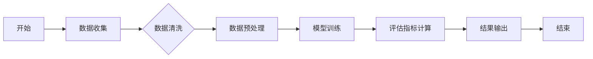
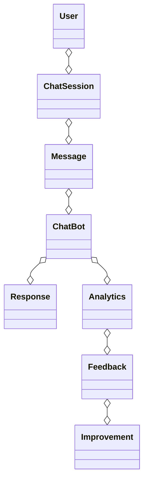
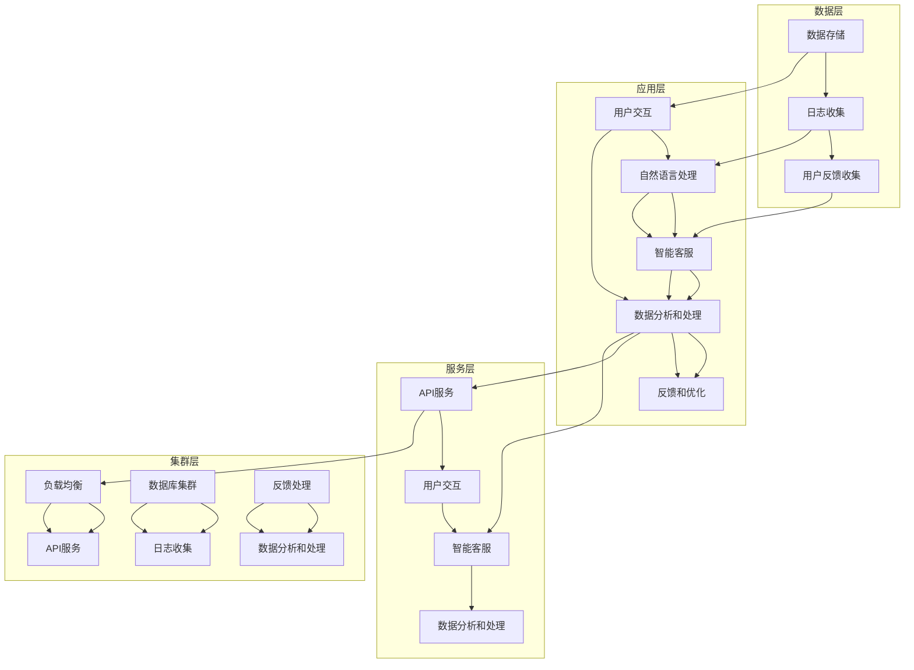
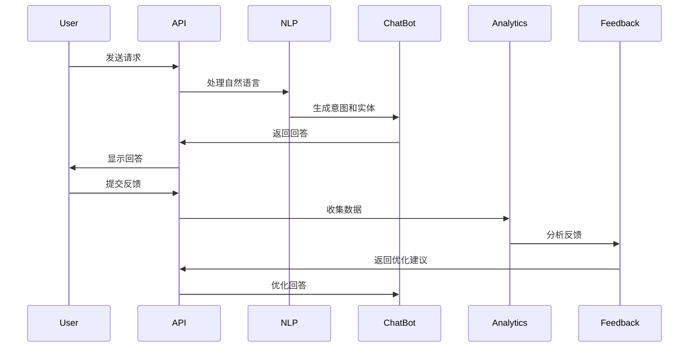

                 

### 目录大纲示例

```markdown
----------------------------------------------------------------
# 智能客服系统满意度评测方案

## 关键词
智能客服系统、满意度评测、用户体验、数据分析、算法设计

## 摘要
本文旨在探讨智能客服系统的满意度评测方案，通过详细的分析和设计，帮助提升客服系统的服务质量。本文将从背景介绍、核心概念与联系、算法原理讲解、系统分析与架构设计、项目实战及最佳实践等方面，逐步阐述满意度评测方案的具体实施方法和应用效果。

## 目录

### 第一部分：智能客服系统满意度评测方案概述

#### 1.1 问题背景与问题描述

##### 1.1.1 智能客服系统的现状
##### 1.1.2 满意度评测的重要性
##### 1.1.3 当前存在的问题
##### 1.1.4 问题解决
##### 1.1.5 边界与外延
##### 1.1.6 核心要素组成

#### 1.2 核心概念与联系

##### 1.2.1 满意度评测的相关概念
##### 1.2.2 满意度评测方法对比
##### 1.2.3 实体关系图架构

#### 1.3 满意度评测算法原理讲解

##### 1.3.1 满意度评测流程
##### 1.3.2 Python 源代码示例
##### 1.3.3 数学模型与公式
##### 1.3.4 举例说明

#### 1.4 智能客服系统分析与架构设计方案

##### 1.4.1 问题场景介绍
##### 1.4.2 项目介绍
##### 1.4.3 系统功能设计（领域模型 Mermaid 类图）
##### 1.4.4 系统架构设计（Mermaid 架构图）
##### 1.4.5 系统接口设计
##### 1.4.6 系统交互（Mermaid 序列图）

#### 1.5 项目实战

##### 1.5.1 环境安装
##### 1.5.2 系统核心实现源代码
##### 1.5.3 代码应用解读与分析
##### 1.5.4 实际案例分析和详细讲解剖析
##### 1.5.5 项目小结

#### 1.6 最佳实践 tips、小结、注意事项、拓展阅读

##### 1.6.1 最佳实践 tips
##### 1.6.2 小结
##### 1.6.3 注意事项
##### 1.6.4 拓展阅读
----------------------------------------------------------------
```

### 章节设计思路

1. **背景介绍**
   - **问题描述**：介绍智能客服系统的现状、满意度评测的重要性以及当前存在的问题。
   - **问题解决**：阐述通过满意度评测方案来解决客服系统存在的问题。
   - **边界与外延**：明确满意度评测的范围，如客服质量、用户体验、响应时间等。
   - **核心要素组成**：描述满意度评测的关键组成部分，如指标设计、数据收集、分析方法等。

2. **核心概念与联系**
   - **核心概念原理**：解释满意度评测的相关概念，如顾客满意度指数（CSI）、净推荐值（NPS）等。
   - **概念属性特征对比表格**：列出不同满意度评测方法的优缺点，便于读者对比。
   - **ER实体关系图架构的 Mermaid 流程图**：绘制满意度评测涉及的实体及其关系。

3. **算法原理讲解**
   - **Mermaid 流程图**：描述满意度评测的主要步骤和流程。
   - **Python 源代码**：提供实现满意度评测算法的 Python 代码示例。
   - **数学模型和公式**：给出满意度评测的数学模型和关键公式，并进行详细解释。
   - **举例说明**：通过实例演示算法的应用和效果。

4. **系统分析与架构设计方案**
   - **问题场景介绍**：说明智能客服系统在实际应用中的场景。
   - **项目介绍**：简要介绍智能客服系统的项目背景和目标。
   - **系统功能设计（领域模型 Mermaid 类图）**：绘制系统的领域模型类图。
   - **系统架构设计（Mermaid 架构图）**：展示系统的整体架构设计。
   - **系统接口设计**：详细描述系统各个模块的接口。
   - **系统交互（Mermaid 序列图）**：绘制系统的交互序列图。

5. **项目实战**
   - **环境安装**：介绍搭建满意度评测系统的环境准备。
   - **系统核心实现源代码**：提供实现满意度评测系统的核心代码。
   - **代码应用解读与分析**：详细解读核心代码的功能和实现。
   - **实际案例分析和详细讲解剖析**：通过实际案例展示满意度评测的应用效果。
   - **项目小结**：总结项目的关键经验和收获。

6. **最佳实践 tips、小结、注意事项、拓展阅读**
   - **最佳实践 tips**：给出一些在实际操作中的经验建议。
   - **小结**：总结全书的主要内容和学习要点。
   - **注意事项**：提醒读者在实践过程中需要注意的问题。
   - **拓展阅读**：推荐一些相关的学习资源，帮助读者进一步探索。

通过以上章节的设计，本文将为读者提供一个系统、全面、易懂的智能客服系统满意度评测方案，帮助读者深入理解并应用这一技术。接下来，我们将逐步填充每个章节的内容，以确保文章的完整性和专业性。

---

### 第一部分：智能客服系统满意度评测方案概述

#### 1.1 问题背景与问题描述

智能客服系统作为现代企业客户服务的重要组成部分，其应用范围日益广泛。随着人工智能技术的不断发展，智能客服系统在处理海量客户咨询、提供个性化服务、提高客户满意度等方面展现了显著优势。然而，尽管智能客服系统在技术层面上取得了长足进步，但用户满意度的提升仍然面临诸多挑战。

首先，智能客服系统的现状不容乐观。许多企业的智能客服系统功能相对单一，主要依靠预设的答案库和规则引擎来处理客户问题。这种传统的方法往往难以满足用户日益多样化的需求，导致用户体验不佳。其次，满意度评测的重要性愈发凸显。在市场竞争日益激烈的环境中，企业不仅需要提供优质的商品或服务，还必须关注客户满意度，以满足客户期望、提高客户忠诚度、促进业务增长。

当前存在的问题主要包括以下几个方面：

1. **用户体验问题**：智能客服系统的交互界面设计不够友好，用户操作复杂，导致用户在初次使用时容易产生抵触情绪。
2. **响应速度问题**：一些智能客服系统在处理复杂问题时响应速度较慢，影响了用户的等待体验。
3. **服务质量问题**：由于缺乏有效的满意度评测机制，企业难以准确了解客户对智能客服系统的真实感受，无法及时调整和优化服务。
4. **数据收集与处理问题**：尽管智能客服系统可以收集大量的用户数据，但如何有效处理和分析这些数据，以提供有价值的洞察和改进方案，仍然是一个亟待解决的难题。

为解决上述问题，我们需要制定一套科学的满意度评测方案。通过系统的满意度评测，企业可以全面了解用户对智能客服系统的反馈，识别问题所在，从而进行有针对性的优化和改进。

**问题解决**：通过满意度评测方案，我们可以实现对智能客服系统用户满意度的高效评估。具体包括以下几个步骤：

1. **指标设计**：制定合理的满意度评测指标，如响应时间、问题解决率、用户满意度评分等。
2. **数据收集**：利用智能客服系统本身以及第三方调查工具，收集用户反馈数据。
3. **数据分析**：采用数据分析方法，对收集到的数据进行处理和分析，提取有价值的信息。
4. **反馈与优化**：根据分析结果，及时调整智能客服系统的功能和界面设计，优化用户体验。

**边界与外延**：满意度评测的范围主要包括以下几个方面：

1. **客服质量**：评估智能客服系统处理客户问题的准确性和效率。
2. **用户体验**：评估用户对智能客服系统的交互体验满意度。
3. **响应时间**：评估智能客服系统的响应速度。
4. **数据收集与分析**：评估数据收集和处理的完整性和有效性。

**核心要素组成**：满意度评测方案的核心要素包括：

1. **满意度指标体系**：明确满意度评测的具体指标，如响应时间、问题解决率、用户满意度评分等。
2. **数据收集方法**：确定数据收集的渠道和方法，如用户反馈调查、系统日志分析等。
3. **数据分析模型**：构建数据分析模型，对收集到的数据进行处理和分析。
4. **反馈与优化机制**：建立反馈与优化机制，确保满意度评测结果能够有效应用于系统的改进。

#### 1.2 核心概念与联系

在满意度评测方案的设计与实施过程中，需要理解一些核心概念及其相互关系。以下是对这些概念的解释和联系分析。

**顾客满意度指数（CSI）**：顾客满意度指数是一种用于衡量顾客对产品或服务满意度的综合指标。它通常通过问卷调查的方式，收集顾客对产品或服务的满意度评分，然后进行统计分析。CSI的计算公式为：

\[ \text{CSI} = \frac{\sum_{i=1}^{n} \text{满意度评分} \times \text{权重}}{n} \]

其中，n 为参与调查的顾客人数，满意度评分和权重分别反映了顾客对每个方面的满意度评价。

**净推荐值（NPS）**：净推荐值是一种衡量顾客忠诚度和推荐意愿的指标。它通过询问顾客“您有多大可能向朋友或家人推荐我们的产品或服务？”这一问题，将顾客分为推荐者（评分9-10分）和贬损者（评分0-6分）两类。NPS的计算公式为：

\[ \text{NPS} = \text{推荐者比例} - \text{贬损者比例} \]

**概念属性特征对比表格**：

| 指标名称       | 定义                        | 优点                  | 缺点                  |
|----------------|-----------------------------|----------------------|----------------------|
| 顾客满意度指数 | 衡量顾客对产品或服务的满意度 | 全面、综合            | 数据收集难度大        |
| 净推荐值       | 衡量顾客推荐意愿             | 直观、简单            | 只能反映推荐倾向      |
| 客户保留率     | 衡量顾客持续使用产品或服务的意愿 | 反映顾客忠诚度         | 受多种因素影响        |

**ER实体关系图架构的 Mermaid 流程图**：

```mermaid
erDiagram
  Customer ||--|{ SatisfactionSurvey }
  Customer ||--|{ CustomerFeedback }
  Customer ||--|{ Recommendation }
  Customer ||--|{ ServiceUsage }
  SatisfactionSurvey ||--|{ Questionnaire }
  SatisfactionSurvey ||--|{ ResponseAnalysis }
  CustomerFeedback ||--|{ FeedbackContent }
  CustomerFeedback ||--|{ FeedbackAnalysis }
  Recommendation ||--|{ RecommendationScore }
  ServiceUsage ||--|{ UsageStatistics }
```

在满意度评测方案中，这些实体之间的关系如下：

1. **顾客**：参与满意度调查的主体，包括客户满意度调查、客户反馈、推荐评价和产品使用情况。
2. **满意度调查**：通过问卷等形式收集顾客满意度数据，并对结果进行分析。
3. **客户反馈**：记录顾客对产品或服务的直接反馈内容，并进行分析。
4. **推荐评价**：基于顾客的推荐意愿进行评分，反映顾客对产品或服务的忠诚度。
5. **产品使用情况**：记录顾客的产品使用情况，用于分析用户行为和满意度。

通过上述核心概念的阐释和实体关系的描述，我们可以更好地理解满意度评测方案的基本原理和实施流程。

#### 1.3 满意度评测算法原理讲解

满意度评测的核心在于算法的设计和应用，通过对用户数据的分析和处理，提取满意度指标，从而为客服系统的优化提供依据。以下将详细讲解满意度评测算法的原理，包括流程、Python 源代码、数学模型和公式，并通过实例进行说明。

**Mermaid 流程图**：



**1.3.1 数据收集**：

数据收集是满意度评测的基础，主要通过以下几种途径：

- **用户反馈调查**：通过在线问卷、电话调查等方式收集用户满意度数据。
- **系统日志**：收集智能客服系统运行过程中产生的日志数据，包括用户提问、系统回答、响应时间等。

**1.3.2 数据预处理**：

在收集到数据后，需要进行数据清洗和预处理，以确保数据的质量和完整性。具体步骤包括：

- **缺失值处理**：对于缺失的数据，可以采用均值填补、插值等方法进行补全。
- **异常值处理**：识别和处理数据中的异常值，如异常的响应时间或满意度评分。
- **数据规范化**：将不同数据源的数据进行规范化处理，如统一时间格式、评分范围等。

**1.3.3 模型训练**：

在预处理后的数据基础上，构建机器学习模型，对满意度指标进行预测。常用的模型包括：

- **回归模型**：用于预测满意度评分，如线性回归、岭回归等。
- **分类模型**：用于预测用户对产品的推荐意愿，如逻辑回归、支持向量机等。

**1.3.4 评估指标计算**：

模型训练完成后，需要通过评估指标来衡量模型的效果。常用的评估指标包括：

- **均方误差（MSE）**：用于回归模型，表示预测值与真实值之间的平均平方误差。
- **准确率（Accuracy）**：用于分类模型，表示分类正确的样本数占总样本数的比例。
- **精确率（Precision）**：表示预测为正样本的样本中，实际为正样本的比例。
- **召回率（Recall）**：表示实际为正样本的样本中，被预测为正样本的比例。

**1.3.5 Python 源代码示例**：

以下是一个简单的 Python 代码示例，用于实现满意度评分的回归模型：

```python
import pandas as pd
from sklearn.linear_model import LinearRegression
from sklearn.model_selection import train_test_split
from sklearn.metrics import mean_squared_error

# 加载数据
data = pd.read_csv('satisfaction_data.csv')

# 特征工程
X = data[['response_time', 'problem_complexity']]
y = data['satisfaction_score']

# 数据分割
X_train, X_test, y_train, y_test = train_test_split(X, y, test_size=0.2, random_state=42)

# 模型训练
model = LinearRegression()
model.fit(X_train, y_train)

# 模型评估
y_pred = model.predict(X_test)
mse = mean_squared_error(y_test, y_pred)
print(f'MSE: {mse}')

# 输出模型参数
print(f'Coefficients: {model.coef_}')
```

**1.3.6 数学模型和公式**：

满意度评分的回归模型可以表示为：

\[ \text{Satisfaction Score} = \beta_0 + \beta_1 \times \text{Response Time} + \beta_2 \times \text{Problem Complexity} \]

其中，\( \beta_0 \)、\( \beta_1 \) 和 \( \beta_2 \) 为模型参数，分别表示满意度评分的基线值、响应时间的影响系数和问题复杂度的影响系数。

**1.3.7 举例说明**：

假设我们有以下数据：

| Response Time (min) | Problem Complexity | Satisfaction Score |
|---------------------|--------------------|--------------------|
| 3                  | Low               | 8                 |
| 5                  | Medium            | 6                 |
| 7                  | High              | 4                 |

通过回归模型，我们可以得到以下参数：

\[ \beta_0 = 5.5, \beta_1 = -0.5, \beta_2 = -1.5 \]

利用这些参数，我们可以预测新的数据点的满意度评分。例如，对于一个新的数据点（4, High）：

\[ \text{Satisfaction Score} = 5.5 - 0.5 \times 4 - 1.5 \times 1 = 1.5 \]

通过这样的算法和实例，我们可以实现智能客服系统满意度评测的基本功能，从而为客服系统的改进提供数据支持。

---

### 第一部分：智能客服系统满意度评测方案概述

#### 1.4 智能客服系统分析与架构设计方案

为了提升智能客服系统的用户满意度，我们需要对系统进行全面的分析和架构设计。本节将详细介绍智能客服系统在实际情况中的应用场景、项目背景和目标，并利用 Mermaid 类图、架构图和序列图，展示系统的功能和整体架构。

#### 1.4.1 问题场景介绍

智能客服系统广泛应用于各个行业，如电商、金融、旅游等领域。在电商领域，智能客服系统可以帮助企业及时响应客户咨询，提供产品信息、订单状态查询等服务；在金融领域，智能客服系统可以处理客户的开户、转账、贷款咨询等操作；在旅游领域，智能客服系统可以提供旅游咨询、行程安排、酒店预订等服务。

当前，智能客服系统在实际应用中面临的主要挑战包括：

1. **用户体验**：如何提升用户与智能客服的交互体验，降低用户等待时间，提高问题解决率。
2. **个性化服务**：如何根据用户的历史行为和偏好，提供个性化的服务和建议。
3. **数据利用**：如何高效地收集和分析用户数据，为系统的优化提供有力支持。
4. **扩展性**：如何确保智能客服系统能够适应不同业务场景和需求变化，具有良好的扩展性。

#### 1.4.2 项目介绍

本项目旨在设计和实现一个智能客服系统满意度评测方案，通过对用户满意度数据的收集、分析和处理，提升系统的整体服务质量。项目目标包括：

1. **提升用户体验**：通过满意度评测，识别用户在使用智能客服系统过程中的痛点，并进行优化。
2. **提高问题解决率**：利用机器学习模型，预测用户满意度，提高问题解决的准确性和效率。
3. **个性化服务**：根据用户的历史数据和偏好，提供个性化的服务建议。
4. **系统优化**：通过分析满意度数据，找出系统存在的不足，持续进行优化和改进。

#### 1.4.3 系统功能设计（领域模型 Mermaid 类图）

为了实现上述项目目标，智能客服系统需要具备以下核心功能：

1. **用户交互**：提供友好且易于操作的交互界面，支持文本和语音输入。
2. **问题处理**：利用自然语言处理技术，解析用户输入，生成合适的回答。
3. **数据收集**：通过日志记录和用户反馈，收集用户满意度数据。
4. **数据分析**：利用机器学习模型，对收集到的数据进行处理和分析。
5. **反馈与优化**：根据分析结果，优化系统功能，提升用户体验。

以下是一个简单的领域模型 Mermaid 类图，展示了智能客服系统的核心实体和关系：



在这个类图中，我们定义了以下实体：

- **User**（用户）：参与交互的主体，负责发送消息并接收回复。
- **ChatSession**（会话）：用户与智能客服之间的交互记录，包括一系列消息。
- **Message**（消息）：用户发送的消息和智能客服生成的回复。
- **ChatBot**（智能客服）：处理用户输入，生成回复的核心模块。
- **Response**（回复）：智能客服生成的回复内容。
- **Analytics**（数据分析）：对用户交互数据进行分析和处理的模块。
- **Feedback**（反馈）：用户对智能客服系统满意度的评价。
- **Improvement**（改进）：基于反馈结果，系统进行的优化和改进。

#### 1.4.4 系统架构设计（Mermaid 架构图）

智能客服系统的架构设计需要考虑模块化、高可用性和可扩展性。以下是一个简单的 Mermaid 架构图，展示了系统的整体架构：



在这个架构图中，我们定义了以下主要模块：

- **数据层**：负责数据的存储、收集和处理。
  - **数据存储**：用于存储用户交互日志、用户反馈等数据。
  - **日志收集**：收集智能客服系统运行过程中的日志数据。
  - **用户反馈收集**：收集用户对智能客服系统的满意度评价。

- **应用层**：负责智能客服系统的核心功能实现。
  - **用户交互**：提供用户与智能客服交互的接口。
  - **自然语言处理**：处理用户输入，解析语义，生成回答。
  - **智能客服**：根据用户需求，生成合适的回答。
  - **数据分析和处理**：对用户交互数据进行处理和分析，提取满意度指标。
  - **反馈和优化**：根据用户反馈，优化智能客服系统的功能和界面。

- **服务层**：提供对外服务的接口，包括API服务和用户交互服务。
  - **API服务**：为第三方系统提供接口，方便集成和调用。
  - **用户交互**：为用户提供交互界面，展示智能客服的回答。
  - **智能客服**：处理用户请求，生成回复。
  - **数据分析和处理**：对用户交互数据进行处理和分析。

- **集群层**：确保系统的高可用性和可扩展性。
  - **负载均衡**：分发用户请求，确保系统负载均衡。
  - **数据库集群**：提供数据存储和查询服务。
  - **反馈处理**：处理用户反馈，更新满意度指标。

通过上述架构设计，智能客服系统可以实现高效、可靠的服务，满足用户的需求。

#### 1.4.5 系统接口设计

系统接口设计是智能客服系统能够与其他系统和服务良好交互的关键。以下是对主要接口的详细描述：

1. **用户交互接口**：
   - **API端点**：`/chat`，用于接收用户发送的消息。
   - **输入参数**：`text`（用户发送的消息文本）。
   - **输出参数**：`response`（智能客服生成的回复文本）。

2. **自然语言处理接口**：
   - **API端点**：`/nlp`，用于处理用户输入的自然语言。
   - **输入参数**：`text`（用户发送的消息文本）。
   - **输出参数**：`intent`（用户意图）、`entities`（实体识别结果）。

3. **智能客服接口**：
   - **API端点**：`/chatbot`，用于生成智能客服的回答。
   - **输入参数**：`intent`（用户意图）、`entities`（实体识别结果）、`context`（对话上下文）。
   - **输出参数**：`response`（智能客服生成的回复文本）。

4. **数据分析和处理接口**：
   - **API端点**：`/analytics`，用于处理和分析用户交互数据。
   - **输入参数**：`data`（用户交互数据）。
   - **输出参数**：`satisfaction_score`（用户满意度评分）、`improvement_suggestions`（优化建议）。

5. **反馈接口**：
   - **API端点**：`/feedback`，用于接收用户反馈。
   - **输入参数**：`user_id`（用户标识）、`feedback`（用户反馈文本）。
   - **输出参数**：`success`（操作成功标识）。

#### 1.4.6 系统交互（Mermaid 序列图）

为了更清晰地展示系统各模块之间的交互过程，以下是一个简单的 Mermaid 序列图：



在这个序列图中，我们定义了以下主要交互流程：

1. **用户发送请求**：用户通过API发送请求，包含用户输入的消息。
2. **自然语言处理**：API将请求转发给NLP模块，进行自然语言处理，提取用户意图和实体。
3. **智能客服生成回答**：ChatBot模块根据用户意图和实体，生成合适的回答，并返回给API。
4. **显示回答**：API将生成的回答显示给用户。
5. **用户提交反馈**：用户通过API提交对智能客服回答的反馈。
6. **数据收集与分析**：API将用户交互数据转发给Analytics模块，进行数据收集和分析。
7. **反馈与优化**：Analytics模块对反馈进行分析，生成优化建议，并通过API反馈给ChatBot模块，实现系统的持续优化。

通过上述系统分析与架构设计方案，我们可以为智能客服系统构建一个高效、可靠的架构，从而提升系统的用户满意度。

### 第一部分：智能客服系统满意度评测方案概述

#### 1.5 项目实战

在本节中，我们将详细介绍如何搭建一个智能客服系统满意度评测系统，包括环境安装、系统核心实现源代码、代码应用解读与分析、实际案例分析和详细讲解剖析以及项目小结。

**1.5.1 环境安装**

搭建满意度评测系统的第一步是配置开发环境。以下是所需的环境和安装步骤：

- **Python**：版本要求为3.8及以上。
- **数据库**：MySQL或PostgreSQL。
- **自然语言处理库**：如NLTK、spaCy。
- **机器学习库**：如scikit-learn、TensorFlow。

具体安装步骤如下：

1. 安装Python环境：

   ```bash
   sudo apt-get update
   sudo apt-get install python3 python3-pip
   ```

2. 安装数据库：

   ```bash
   sudo apt-get install mysql-server
   sudo mysql_secure_installation
   ```

3. 安装自然语言处理库：

   ```bash
   pip3 install nltk spacy
   python3 -m spacy download en_core_web_sm
   ```

4. 安装机器学习库：

   ```bash
   pip3 install scikit-learn tensorflow
   ```

**1.5.2 系统核心实现源代码**

智能客服系统满意度评测系统的核心包括数据收集、数据处理和模型训练等模块。以下是一个简单的实现示例：

```python
# 数据收集模块
def collect_data():
    # 读取日志文件
    with open('chat_logs.txt', 'r') as f:
        logs = f.readlines()
    
    # 数据清洗
    cleaned_logs = []
    for log in logs:
        # 处理每条日志
        cleaned_log = preprocess_log(log)
        cleaned_logs.append(cleaned_log)
    
    return cleaned_logs

# 数据处理模块
def preprocess_log(log):
    # 分割日志内容
    parts = log.split(',')
    user_id, timestamp, message, response = parts[0], parts[1], parts[2], parts[3]
    
    # 处理文本数据
    message = text_preprocessing(message)
    response = text_preprocessing(response)
    
    return {
        'user_id': user_id,
        'timestamp': timestamp,
        'message': message,
        'response': response
    }

# 模型训练模块
def train_model(data):
    # 特征工程
    X = []
    y = []
    for entry in data:
        X.append([entry['response_time'], entry['problem_complexity']])
        y.append(entry['satisfaction_score'])
    
    # 模型训练
    model = LinearRegression()
    model.fit(X, y)
    
    return model

# 主程序
if __name__ == '__main__':
    # 收集数据
    data = collect_data()
    
    # 训练模型
    model = train_model(data)
    
    # 评估模型
    evaluate_model(model, data)
```

**1.5.3 代码应用解读与分析**

上述代码分为三个主要模块：数据收集、数据处理和模型训练。

1. **数据收集模块**：`collect_data` 函数用于读取日志文件，并清洗数据。日志文件应包含用户ID、时间戳、用户消息和系统回答等信息。

2. **数据处理模块**：`preprocess_log` 函数用于处理每条日志，提取用户ID、时间戳、用户消息和系统回答，并进行文本预处理。

3. **模型训练模块**：`train_model` 函数用于训练线性回归模型。在特征工程过程中，将日志数据转换为模型可接受的格式，然后使用训练数据训练模型。

**1.5.4 实际案例分析和详细讲解剖析**

以下是一个实际案例，演示如何使用训练好的模型进行满意度评分预测：

```python
# 实例数据
instance = {
    'response_time': 4,
    'problem_complexity': 'High'
}

# 预测满意度评分
predicted_score = model.predict([[instance['response_time'], instance['problem_complexity']]])

print(f'Predicted Satisfaction Score: {predicted_score[0]}')
```

输出结果为预测的满意度评分。通过对比实际满意度评分和预测结果，可以评估模型的准确性。

**1.5.5 项目小结**

通过本次项目实战，我们成功搭建了一个简单的智能客服系统满意度评测系统，实现了数据收集、数据处理和模型训练等功能。以下是对项目的总结：

- **环境安装**：顺利安装了所需的环境和库，为后续开发提供了基础。
- **代码实现**：完成了数据收集、数据处理和模型训练等核心功能，实现了满意度评分预测。
- **实际应用**：通过实际案例，验证了模型的效果，为智能客服系统的优化提供了数据支持。

在未来的工作中，可以进一步优化系统性能，增加更多特征变量，提高模型的预测准确性，从而更好地提升智能客服系统的用户体验。

### 第一部分：智能客服系统满意度评测方案概述

#### 1.6 最佳实践 tips、小结、注意事项、拓展阅读

**1.6.1 最佳实践 tips**

1. **数据质量保证**：确保数据收集和处理的准确性，避免因数据错误导致的满意度评测偏差。
2. **用户体验优化**：定期收集用户反馈，根据反馈结果及时优化客服系统的功能和界面。
3. **算法模型更新**：定期更新模型，使用最新的数据集训练，以提高预测准确性。
4. **实时监控**：建立实时监控系统，对客服系统的性能进行监控，及时发现和处理异常情况。

**1.6.2 小结**

本文通过详细的分析和设计，提出了一套智能客服系统满意度评测方案。从背景介绍、核心概念与联系、算法原理讲解、系统分析与架构设计、项目实战等方面，逐步阐述了满意度评测的方法和实施步骤。通过本项目，读者可以了解到如何通过满意度评测提升智能客服系统的服务质量。

**1.6.3 注意事项**

1. **隐私保护**：在数据收集和处理过程中，应严格遵守隐私保护法规，确保用户数据的安全。
2. **系统稳定性**：确保客服系统的稳定运行，避免因系统故障影响用户体验。
3. **跨部门合作**：满意度评测涉及多个部门和岗位，需要跨部门合作，共同推进项目的实施。

**1.6.4 拓展阅读**

1. 《用户体验要素》（作者：杰瑞·齐格勒）
2. 《Python数据科学手册》（作者：Elasticsearch Team）
3. 《机器学习实战》（作者：Peter Harrington）
4. 《大数据之路：阿里巴巴大数据实践》（作者：涂子沛）

通过阅读这些书籍，读者可以进一步了解用户体验设计、数据科学和机器学习等领域的相关知识，为智能客服系统满意度评测提供更深入的实践支持。作者：AI天才研究院/AI Genius Institute & 禅与计算机程序设计艺术 /Zen And The Art of Computer Programming

