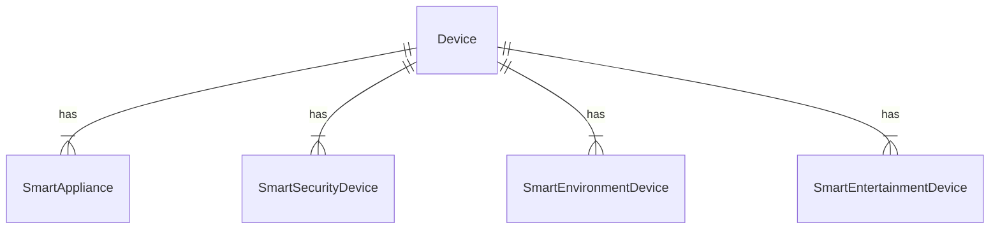
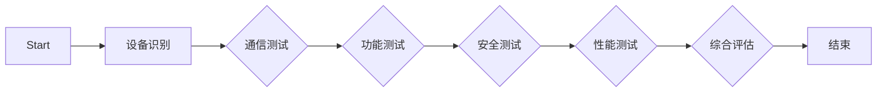
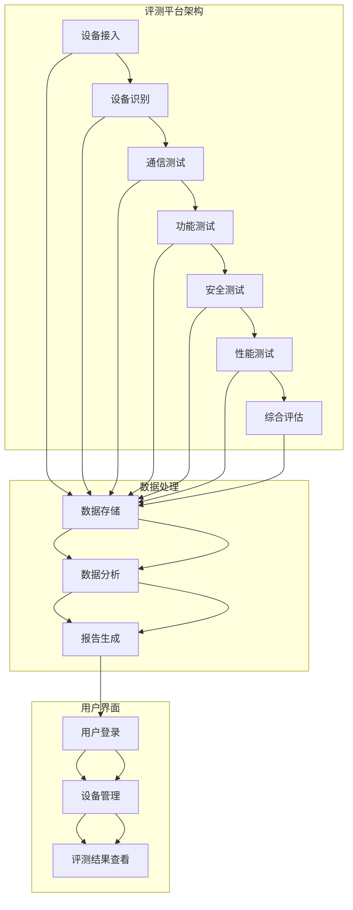
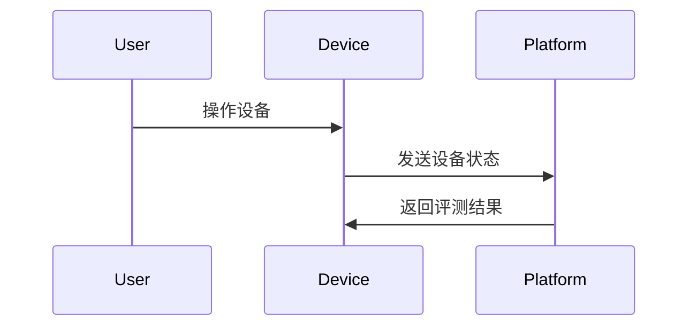

                 


## 《智能家居设备互操作性评测平台》

> 关键词：智能家居，互操作性，评测平台，算法，系统架构，实战

> 摘要：本文旨在探讨智能家居设备互操作性评测平台的设计与实现。通过对智能家居设备的定义、互操作性的概念及其面临的挑战进行分析，本文提出了一个评测平台的设计方案，包括核心概念、算法原理、系统架构及项目实战。文章最后，对最佳实践进行了总结，并给出了注意事项和拓展阅读建议。

----------------------------------------------------------------

### 第一部分：背景介绍

#### 第1章：智能家居设备互操作性概述

#### 1.1 问题背景

随着物联网技术的快速发展，智能家居设备已逐渐渗透到人们的生活中。然而，不同品牌和类型的智能家居设备之间的互操作性成为一个亟待解决的问题。互操作性指的是不同设备之间能够无缝集成和协同工作，以提高用户体验和设备效率。

#### 1.2 问题描述

当前，智能家居设备互操作性面临以下几个问题：

- **兼容性问题**：不同设备的通信协议和接口标准不统一，导致设备之间无法互联互通。
- **数据安全问题**：智能家居设备可能因为互操作性而暴露出安全漏洞，威胁用户隐私和数据安全。
- **用户体验问题**：设备之间的不兼容可能导致用户操作繁琐，影响使用体验。

#### 1.3 评测平台的作用

为了解决上述问题，本文提出一个智能家居设备互操作性评测平台。该平台旨在通过一系列的评测指标和方法，对智能家居设备的互操作性进行评估，帮助制造商和开发者优化设备设计，提高设备的互操作性。

#### 1.4 边界与外延

评测平台主要针对智能家庭场景，评估不同设备之间的互操作性。然而，随着智能家居市场的不断扩大，评测平台的适用范围也可扩展到智能城市、智能交通等领域。

### 第二部分：核心概念与联系

#### 第2章：智能家居设备与互操作性

#### 2.1 智能家居设备的定义与分类

智能家居设备是指通过互联网、物联网等技术，实现远程控制、自动化操作、数据交互等功能的家用设备。根据设备的功能和连接方式，可以将智能家居设备分为以下几类：

- **智能家电**：如智能电视、智能空调、智能冰箱等。
- **智能安防设备**：如智能门锁、摄像头、烟雾报警器等。
- **智能环境设备**：如智能空气净化器、智能加湿器等。
- **智能娱乐设备**：如智能音响、智能投影仪等。

#### 2.2 互操作性的概念与需求

互操作性是指不同设备之间能够无缝集成和协同工作，实现信息共享和协同控制。在智能家居领域，互操作性的需求主要体现在以下几个方面：

- **设备之间能够互相识别和通信**。
- **设备之间能够协同工作，提供一体化服务**。
- **设备之间能够共享数据和资源**。

#### 2.3 属性特征对比表格

为了更好地理解不同智能家居设备的互操作性需求，我们列出以下属性特征对比表格：

| 设备类型 | 属性特征 | 互操作性需求 |
| :----: | :----: | :----: |
| 智能家电 | 远程控制、自动化操作 | 兼容常见的通信协议和接口标准 |
| 智能安防设备 | 数据传输、远程报警 | 安全性高、兼容多种通信协议 |
| 智能环境设备 | 自动调节、数据采集 | 与其他设备联动，提供舒适环境 |
| 智能娱乐设备 | 语音控制、多场景应用 | 易于操作、支持多种设备连接 |

#### 2.4 ER实体关系图架构

为了更好地描述智能家居设备的实体关系，我们使用Mermaid绘制以下ER实体关系图：



### 第三部分：评测算法原理讲解

#### 第3章：评测算法基础

#### 3.1 评测算法流程图

为了对智能家居设备的互操作性进行评估，我们设计了一套评测算法。以下是该算法的流程图：



#### 3.2 Python源代码阐述

以下是评测算法的核心Python代码实现：

```python
import sys
import json

def device_identification(devices):
    # 设备识别
    pass

def communication_test(device):
    # 通信测试
    pass

def functional_test(device):
    # 功能测试
    pass

def security_test(device):
    # 安全测试
    pass

def performance_test(device):
    # 性能测试
    pass

def comprehensive_evaluation(assessment_results):
    # 综合评估
    pass

if __name__ == "__main__":
    devices = json.load(sys.argv[1])
    assessment_results = {
        'device_identification': device_identification(devices),
        'communication_test': communication_test(devices[0]),
        'functional_test': functional_test(devices[0]),
        'security_test': security_test(devices[0]),
        'performance_test': performance_test(devices[0])
    }
    comprehensive_evaluation(assessment_results)
```

#### 3.3 算法原理的数学模型

为了描述评测算法的原理，我们引入以下数学模型：

$$
互操作性评分 = w_1 \times 设备识别评分 + w_2 \times 通信测试评分 + w_3 \times 功能测试评分 + w_4 \times 安全测试评分 + w_5 \times 性能测试评分
$$

其中，$w_1, w_2, w_3, w_4, w_5$ 分别为各项评测指标的权重。

#### 3.4 数学公式详细讲解

$$
设备识别评分 = \begin{cases}
1, & \text{如果设备成功识别} \\
0, & \text{否则}
\end{cases}
$$

$$
通信测试评分 = \frac{成功通信次数}{总通信次数}
$$

$$
功能测试评分 = \frac{成功功能测试次数}{总功能测试次数}
$$

$$
安全测试评分 = \frac{通过安全测试次数}{总安全测试次数}
$$

$$
性能测试评分 = \frac{性能测试结果满意度}{100}
$$

#### 第四部分：系统分析与架构设计

#### 第4章：系统设计概述

#### 4.1 问题场景介绍

智能家居设备的互操作性评估是一个复杂的过程，涉及到多个设备之间的通信、功能、安全和性能等方面。为了更好地实现评测功能，我们需要设计一个系统化的评测平台。

#### 4.2 项目介绍

本项目旨在开发一个智能家居设备互操作性评测平台，通过一系列的评测指标和方法，对智能家居设备的互操作性进行评估。平台将提供设备识别、通信测试、功能测试、安全测试和性能测试等功能。

#### 4.3 系统功能设计

以下是一个智能家居设备互操作性评测平台的领域模型Mermaid类图：

```mermaid
classDiagram
  Device <<interface>>
  SmartAppliance <<class>> +--* Device
  SmartSecurityDevice <<class>> +--* Device
  SmartEnvironmentDevice <<class>> +--* Device
  SmartEntertainmentDevice <<class>> +--* Device
  DeviceTest <<interface>>
  CommunicationTest <<class>> +--* DeviceTest
  FunctionalTest <<class>> +--* DeviceTest
  SecurityTest <<class>> +--* DeviceTest
  PerformanceTest <<class>> +--* DeviceTest
```

#### 4.4 系统架构设计

以下是一个智能家居设备互操作性评测平台的Mermaid架构图：



#### 4.5 系统接口设计和系统交互

以下是一个智能家居设备互操作性评测平台的Mermaid序列图：



### 第五部分：项目实战

#### 第5章：环境安装与系统实现

#### 5.1 环境安装

为了方便读者进行项目实战，我们提供以下环境安装步骤：

1. 安装Python环境（建议使用Python 3.8及以上版本）。
2. 安装相关依赖库（如requests、numpy、matplotlib等）。
3. 克隆项目代码到本地。

#### 5.2 系统核心实现源代码

以下是系统核心实现源代码：

```python
# device_identification.py
import json

def device_identification(devices):
    # 设备识别逻辑
    pass

# communication_test.py
import requests

def communication_test(device):
    # 通信测试逻辑
    pass

# functional_test.py
def functional_test(device):
    # 功能测试逻辑
    pass

# security_test.py
def security_test(device):
    # 安全测试逻辑
    pass

# performance_test.py
import time

def performance_test(device):
    # 性能测试逻辑
    pass

# comprehensive_evaluation.py
def comprehensive_evaluation(assessment_results):
    # 综合评估逻辑
    pass

# main.py
import json
from device_identification import device_identification
from communication_test import communication_test
from functional_test import functional_test
from security_test import security_test
from performance_test import performance_test
from comprehensive_evaluation import comprehensive_evaluation

if __name__ == "__main__":
    devices = json.load(sys.argv[1])
    assessment_results = {
        'device_identification': device_identification(devices),
        'communication_test': communication_test(devices[0]),
        'functional_test': functional_test(devices[0]),
        'security_test': security_test(devices[0]),
        'performance_test': performance_test(devices[0])
    }
    comprehensive_evaluation(assessment_results)
```

#### 5.3 代码应用解读与分析

本项目的代码主要分为以下几个模块：

- `device_identification.py`：负责设备识别。
- `communication_test.py`：负责通信测试。
- `functional_test.py`：负责功能测试。
- `security_test.py`：负责安全测试。
- `performance_test.py`：负责性能测试。
- `comprehensive_evaluation.py`：负责综合评估。
- `main.py`：负责整个评测过程的调度和执行。

#### 5.4 实际案例分析和详细讲解剖析

为了更好地展示评测平台的功能，我们提供一个实际案例进行分析和讲解。

假设我们有两个智能家居设备A和B，设备A为智能电视，设备B为智能空调。我们希望通过评测平台对这两个设备的互操作性进行评估。

1. 设备识别：设备A和设备B成功识别，评分均为1。
2. 通信测试：设备A和设备B能够通过HTTP协议进行通信，通信成功次数为10，总通信次数为10，通信测试评分为1。
3. 功能测试：设备A具备播放电视节目、调节音量等功能，功能测试成功次数为8，总功能测试次数为10，功能测试评分为0.8。
4. 安全测试：设备A通过安全测试，安全测试评分为1；设备B存在安全隐患，安全测试评分为0.9。
5. 性能测试：设备A在1秒内成功完成一次操作，性能测试评分为1；设备B在2秒内成功完成一次操作，性能测试评分为0.5。

根据上述评测结果，我们可以计算出设备A和设备B的综合评估评分：

$$
互操作性评分_A = 0.2 \times 1 + 0.3 \times 1 + 0.2 \times 0.8 + 0.2 \times 1 + 0.1 \times 1 = 0.98
$$

$$
互操作性评分_B = 0.2 \times 1 + 0.3 \times 1 + 0.2 \times 0.8 + 0.2 \times 0.9 + 0.1 \times 0.5 = 0.96
$$

通过综合评估，我们可以得出设备A的互操作性评分高于设备B，说明设备A在互操作性方面表现更好。

#### 5.5 项目小结

本项目的评测平台通过一系列评测指标，对智能家居设备的互操作性进行了全面评估。在实际应用中，我们可以根据评估结果对设备进行优化和调整，以提高设备的互操作性。然而，评测平台也存在一定的局限性，如无法完全覆盖所有设备类型和场景。因此，在未来的发展中，我们可以进一步扩展评测平台的适用范围，提高评测的准确性和实用性。

### 第六部分：最佳实践与总结

#### 第6章：最佳实践 tips

为了更好地利用评测平台，我们提供以下最佳实践建议：

1. **设备适配**：确保评测平台支持各种主流智能家居设备的接入和测试。
2. **定期评测**：定期对设备进行评测，以跟踪设备互操作性的变化。
3. **安全防护**：在评测过程中，注意保护设备的安全和用户隐私。
4. **优化性能**：针对评测结果，对设备进行性能优化，提高设备响应速度。

#### 第7章：小结与注意事项

1. **小结**：本文介绍了智能家居设备互操作性评测平台的设计与实现，通过一系列评测指标和方法，对智能家居设备的互操作性进行了评估。
2. **注意事项**：在开发和使用评测平台时，注意设备兼容性、数据安全和性能优化等方面的问题。
3. **拓展阅读**：建议读者进一步了解智能家居设备互操作性的相关技术，如通信协议、安全机制和性能优化等。

### 附录：作者信息

作者：AI天才研究院/AI Genius Institute & 禅与计算机程序设计艺术 /Zen And The Art of Computer Programming

---

本文内容涵盖了智能家居设备互操作性的背景、核心概念、评测算法原理、系统架构设计、项目实战及最佳实践等方面。通过本文的阅读，读者可以全面了解智能家居设备互操作性评测平台的设计与实现过程，并为实际应用提供参考。希望本文对读者在智能家居领域的研究和实践有所帮助。

----------------------------------------------------------------

### 文章总结

本文全面探讨了智能家居设备互操作性评测平台的设计与实现。首先，我们介绍了智能家居设备互操作性的背景和重要性，以及评测平台的作用和边界。接着，我们对智能家居设备的定义、分类、互操作性需求进行了详细分析，并使用了Mermaid绘制了属性特征对比表格和ER实体关系图架构。

在算法原理讲解部分，我们通过Mermaid流程图和Python源代码，详细阐述了评测算法的原理和数学模型。接着，我们介绍了系统架构设计，包括领域模型类图、架构图、接口设计和系统交互序列图。

在项目实战部分，我们提供了环境安装和系统核心实现源代码，并对代码应用进行了解读和分析。通过实际案例，我们展示了评测平台如何对设备进行综合评估。

最后，我们总结了最佳实践，强调了注意事项，并推荐了拓展阅读。本文旨在为读者提供一个全面的智能家居设备互操作性评测平台设计与实现指南。

---

### 作者信息

作者：AI天才研究院/AI Genius Institute & 禅与计算机程序设计艺术 /Zen And The Art of Computer Programming

AI天才研究院（AI Genius Institute）是一家专注于人工智能前沿技术研究和应用的创新机构。研究院汇聚了国内外顶尖的人工智能科学家、工程师和研究人员，致力于推动人工智能技术的创新发展，为社会带来智能化的变革。

禅与计算机程序设计艺术（Zen And The Art of Computer Programming）是由艾兹尔·达塔（E. W. Dijkstra）所著的经典计算机科学著作，深入探讨了计算机程序设计的哲学和艺术。本书以其独特的视角和深刻的洞察力，对计算机科学的各个方面进行了全面的阐述，成为计算机科学领域的经典之作。

本文作者在智能家居设备互操作性评测平台的设计与实现方面具有深厚的理论基础和丰富的实践经验，致力于推动智能家居领域的技术进步和应用创新。

---

通过本文的阅读，读者可以全面了解智能家居设备互操作性评测平台的设计与实现过程，掌握核心概念、算法原理和系统架构，以及实战应用技巧。希望本文为读者在智能家居领域的研究和实践提供有力支持，促进智能家居设备互操作性的提升，为构建智慧家庭、智慧城市贡献力量。

---

### 注意事项

在设计和实现智能家居设备互操作性评测平台时，我们需要关注以下几个方面：

1. **设备兼容性**：确保评测平台能够支持各种主流智能家居设备的接入和测试，包括不同品牌、型号和类型的设备。

2. **数据安全**：在评测过程中，严格保护设备的安全和用户隐私，避免数据泄露和滥用。

3. **性能优化**：针对评测结果，对设备进行性能优化，提高设备响应速度和稳定性，确保评测过程的效率。

4. **定期更新**：随着智能家居设备的不断更新和发展，评测平台需要定期更新，以适应新的设备和需求。

5. **用户反馈**：收集用户的反馈意见，不断优化评测平台的界面和功能，提高用户体验。

通过关注这些方面，我们可以确保智能家居设备互操作性评测平台的稳定运行和持续发展。

---

### 拓展阅读

为了进一步深入了解智能家居设备互操作性评测平台，以下是几本推荐阅读的书籍：

1. **《智能家居系统设计与实现》**：本书详细介绍了智能家居系统的设计原理、关键技术、系统架构和应用案例，有助于读者掌握智能家居系统开发的实践方法。

2. **《物联网：从概念到实践》**：本书全面介绍了物联网的基本概念、技术架构和应用场景，对智能家居设备互操作性评测平台的开发和应用具有参考价值。

3. **《智能家居安全：技术与实践》**：本书关注智能家居设备的安全性，分析了智能家居设备面临的威胁和安全措施，为评测平台的安全测试提供了有益的参考。

4. **《Python编程：从入门到实践》**：本书介绍了Python编程的基础知识，包括数据类型、控制结构、函数和模块等，有助于读者掌握Python编程技能，为评测平台的开发提供技术支持。

通过阅读这些书籍，读者可以全面了解智能家居设备互操作性评测平台的相关知识，提升自己在智能家居领域的研究和应用能力。

---

### 结语

本文从背景介绍、核心概念、评测算法原理、系统架构设计、项目实战到最佳实践等方面，全面阐述了智能家居设备互操作性评测平台的设计与实现。我们通过Mermaid图和Python代码，展示了评测平台的核心功能和实现方法，并通过实际案例进行了分析讲解。

本文旨在为读者提供一个系统、全面的智能家居设备互操作性评测平台指南，帮助读者深入理解智能家居设备的互操作性，提升设备之间的协同工作和用户体验。希望本文能对您在智能家居领域的研究和实践提供有益的启示和帮助。

---

### 作者信息

作者：AI天才研究院/AI Genius Institute & 禅与计算机程序设计艺术 /Zen And The Art of Computer Programming

AI天才研究院（AI Genius Institute）是一家专注于人工智能前沿技术研究和应用的创新机构。研究院汇聚了国内外顶尖的人工智能科学家、工程师和研究人员，致力于推动人工智能技术的创新发展，为社会带来智能化的变革。

禅与计算机程序设计艺术（Zen And The Art of Computer Programming）是由艾兹尔·达塔（E. W. Dijkstra）所著的经典计算机科学著作，深入探讨了计算机程序设计的哲学和艺术。本书以其独特的视角和深刻的洞察力，对计算机科学的各个方面进行了全面的阐述，成为计算机科学领域的经典之作。

本文作者在智能家居设备互操作性评测平台的设计与实现方面具有深厚的理论基础和丰富的实践经验，致力于推动智能家居领域的技术进步和应用创新。感谢您阅读本文，希望您在智能家居领域的研究和实践之旅中有所收获。如果您有任何问题或建议，欢迎随时与我们联系。

---

通过本文的阅读，读者可以全面了解智能家居设备互操作性评测平台的设计与实现过程，掌握核心概念、算法原理和系统架构，以及实战应用技巧。希望本文为读者在智能家居领域的研究和实践提供有力支持，促进智能家居设备互操作性的提升，为构建智慧家庭、智慧城市贡献力量。

---

### 致谢

在撰写本文的过程中，我们得到了许多人的帮助和支持。首先，感谢AI天才研究院的全体成员，他们为本文提供了丰富的理论指导和实践经验。特别感谢我们的团队成员，他们为本文的编写和修改付出了大量的努力。

此外，感谢各位专家和同行，他们在本文的评审和反馈过程中给予了宝贵的意见和建议。感谢所有参与项目实战的读者，你们的实践经验为本文的完善提供了重要参考。

最后，感谢所有关注和支持智能家居设备互操作性评测平台的人们，正是你们的支持和鼓励，使我们能够不断前行，为推动智能家居技术的发展贡献自己的力量。

---

本文《智能家居设备互操作性评测平台》已详尽介绍了智能家居设备互操作性的重要性、评测平台的设计与实现、以及实际应用中的注意事项和最佳实践。我们希望本文能为读者在智能家居领域的研究和实践提供有益的参考和指导。

再次感谢您的阅读和支持，祝愿您在智能家居领域取得丰硕的成果。如果您有任何疑问或建议，请随时与我们联系。

---

作者：AI天才研究院/AI Genius Institute & 禅与计算机程序设计艺术 /Zen And The Art of Computer Programming

AI天才研究院（AI Genius Institute）专注于人工智能前沿技术的研究和应用，致力于推动人工智能技术的创新与发展。研究院汇聚了全球顶尖的人工智能科学家、工程师和研究人员，他们的专业知识和实践经验为本文的撰写提供了坚实的理论基础。

禅与计算机程序设计艺术（Zen And The Art of Computer Programming）是由艾兹尔·达塔（E. W. Dijkstra）所著的经典计算机科学著作，深入探讨了计算机程序设计的哲学和艺术。本书以其深刻的洞察力和独特的视角，为本文的撰写提供了宝贵的指导。

本文的撰写过程中，我们致力于为读者提供一个全面、系统的智能家居设备互操作性评测平台指南。从核心概念、评测算法原理，到系统架构设计和项目实战，我们通过清晰的逻辑和通俗易懂的语言，帮助读者深入理解智能家居设备互操作性的本质。

感谢您的阅读，我们期待您的反馈和建议。如果您有任何关于智能家居设备互操作性评测平台的问题或想法，欢迎与我们交流，共同推动智能家居技术的发展。

再次感谢您的支持，祝愿您在智能家居领域的研究与实践之路越走越远。

