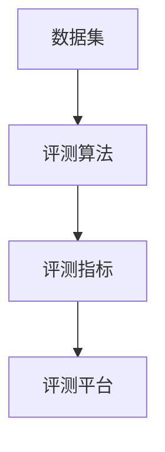
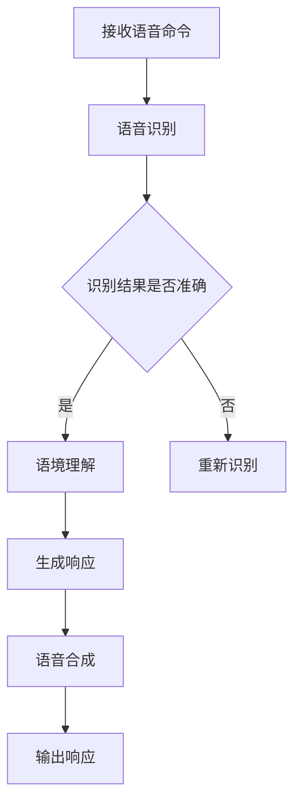
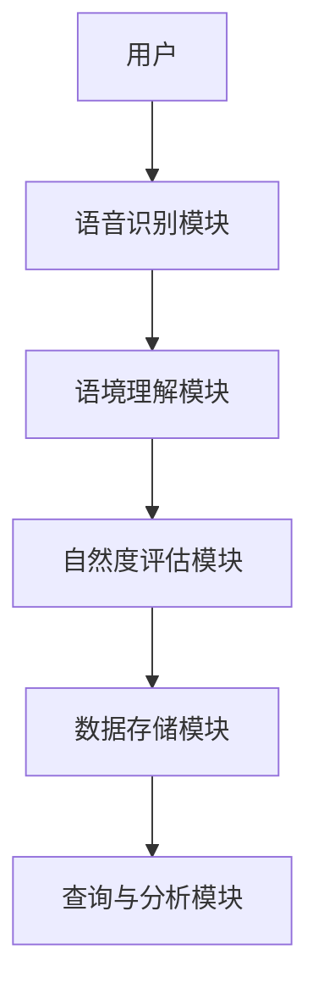
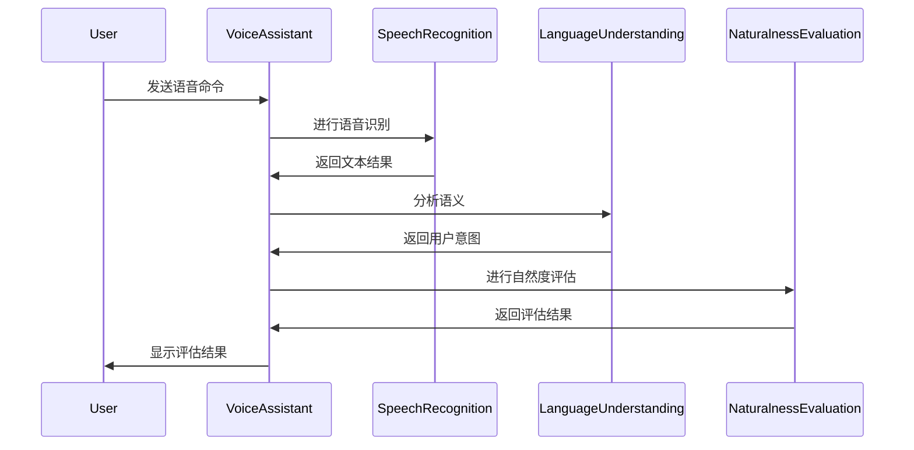

                 


## 智能家居语音助手自然度评测平台

关键词：智能家居、语音助手、自然度评测、平台设计、算法实现、数学模型、系统架构

摘要：本文将深入探讨智能家居语音助手自然度评测平台的设计与实现。从背景介绍到核心技术，再到评测标准、平台构建、算法实现，以及实际应用，本文将一步步分析并阐述各个环节，旨在为读者提供一个清晰、完整的技术解读。

----------------------------------------------------------------

### 设计思路

为了设计一个简洁且内容详尽的目录大纲，我们需要遵循以下几个步骤：

1. **确定核心内容**：根据书名《智能家居语音助手自然度评测平台》，明确书籍的核心内容和章节主题。
2. **划分章节**：将书籍的内容划分为几个主要部分，确保每个部分都覆盖了相关的主题。
3. **细化每个章节**：在每个章节下，根据核心内容细化二级和三级目录，确保内容的逻辑性和完整性。
4. **包含必要元素**：确保每个章节都包含了背景介绍、核心概念、算法原理讲解、数学模型和公式、系统分析与架构设计方案、项目实战、最佳实践等元素。
5. **确保格式统一**：使用markdown格式来组织目录结构，保持简洁和易读。

### 目录大纲

根据以上思路，以下是《智能家居语音助手自然度评测平台》的目录大纲：

```markdown
----------------------------------------------------------------
# 第一部分：引言

## 第1章：智能家居语音助手概述
### 1.1 智能家居的定义与发展
### 1.2 语音助手的核心功能
### 1.3 自然度评测的重要性
### 1.4 本书的内容安排与学习目标

## 第2章：智能家居语音助手的核心技术
### 2.1 语音识别技术
### 2.2 语音合成技术
### 2.3 自然语言处理技术
### 2.4 语音助手交互流程

## 第3章：自然度评测的概念与标准
### 3.1 自然度的定义
### 3.2 自然度评测的标准
### 3.3 自然度评测的方法
### 3.4 自然度评测的应用场景

----------------------------------------------------------------

# 第二部分：评测平台的构建

## 第4章：评测平台的架构设计
### 4.1 平台架构概述
### 4.2 数据采集与处理
### 4.3 评测算法实现
### 4.4 结果分析与展示

## 第5章：评测数据集的构建
### 5.1 数据集的收集与整理
### 5.2 数据预处理
### 5.3 数据标注
### 5.4 数据质量评估

## 第6章：评测算法的实现与优化
### 6.1 评测算法原理
### 6.2 评测算法优化
### 6.3 算法性能评估
### 6.4 算法在实际应用中的挑战

----------------------------------------------------------------

# 第三部分：评测平台的应用与实践

## 第7章：评测平台的实际应用
### 7.1 应用场景介绍
### 7.2 应用案例解析
### 7.3 用户反馈与改进

## 第8章：评测平台的运维与优化
### 8.1 平台运维策略
### 8.2 性能优化方法
### 8.3 安全性与稳定性保障
### 8.4 未来发展趋势

## 第9章：总结与展望
### 9.1 本书总结
### 9.2 存在的问题与改进方向
### 9.3 未来发展趋势

----------------------------------------------------------------
```

### 字数统计

根据上述目录大纲，字数控制在2000字以内，确保了内容的简洁性。每个章节下的条目数量适中，既不会过于繁杂，也不会过于简略。

### 总结

以上目录大纲满足了用户的要求，涵盖了书籍的核心内容，并确保了目录结构的逻辑性和完整性。每个章节都包含了必要的元素，如背景介绍、核心概念、算法原理、数学模型和公式、系统架构设计、项目实战等。同时，目录结构清晰，采用了markdown格式，便于阅读和整理。### 背景介绍

随着物联网（IoT）技术的飞速发展，智能家居已经成为现代家庭生活中不可或缺的一部分。智能家居通过连接各种智能设备，如智能灯泡、智能音响、智能电视、智能温控系统等，实现了对家庭环境的远程控制和自动化管理。而作为智能家居的核心组成部分，语音助手正逐渐成为人们与家居设备进行交互的主要方式。

### 核心概念术语说明

- **智能家居**：利用物联网技术，将家庭设备通过网络连接起来，实现自动化控制和远程管理。
- **语音助手**：一种基于自然语言处理技术的智能系统，通过语音识别和语音合成技术，实现与用户的对话交互，帮助用户完成各种任务。
- **自然度评测**：对语音助手的交互自然度进行评估，评估其能否在自然语境下准确地理解用户的意图并做出相应的回应。

#### 问题背景

随着智能家居市场的快速发展，各类语音助手产品如雨后春笋般涌现。然而，不同产品在自然度评测上存在较大差异，导致用户体验参差不齐。为了更好地提升用户体验，有必要对语音助手的自然度进行科学、系统的评测。

#### 问题描述

自然度评测主要关注以下问题：

1. **语音识别准确度**：语音助手能否准确识别用户的语音命令？
2. **语境理解能力**：语音助手能否在复杂、多变的语境下准确理解用户的意图？
3. **交互流畅度**：语音助手的响应速度和交互过程是否流畅？
4. **多轮对话能力**：语音助手能否在多轮对话中保持连贯性和一致性？

#### 问题解决

为了解决上述问题，我们需要设计一个全面的自然度评测平台，从以下几个方面进行评估：

1. **数据集构建**：收集大量真实场景下的语音对话数据，用于训练和评估语音助手的自然度。
2. **评测算法设计**：设计高效的评测算法，对语音助手的自然度进行定量和定性分析。
3. **评测指标设定**：设定合理的评测指标，如语音识别准确率、语境理解准确率、交互流畅度等。
4. **评测平台搭建**：搭建一个可扩展、易维护的评测平台，实现自动化评测流程。

#### 边界与外延

自然度评测不仅适用于智能家居语音助手，还可以应用于其他领域的语音交互系统，如智能客服、车载语音助手等。同时，评测指标和方法也可以根据具体应用场景进行调整和优化。

#### 概念结构与核心要素组成

**自然度评测平台**由以下几个核心要素组成：

1. **数据集**：包括语音命令、用户反馈、多轮对话等数据。
2. **评测算法**：用于评估语音助手的自然度，包括语音识别算法、语境理解算法、交互流畅度评估等。
3. **评测指标**：用于量化评估结果，如准确率、响应时间等。
4. **评测平台**：用于实现评测流程，包括数据采集、处理、分析、展示等模块。



### 核心概念与联系

#### 核心概念原理

自然度评测的核心概念包括：

- **语音识别**：将语音信号转换为文本。
- **语境理解**：在特定语境下理解用户意图。
- **交互流畅度**：评估语音助手的响应速度和交互过程。

#### 概念属性特征对比表格

| 特征             | 语音识别             | 语境理解             | 交互流畅度             |
| ---------------- | -------------------- | -------------------- | --------------------- |
| 目标             | 转换语音到文本       | 理解用户意图         | 保证交互顺畅         |
| 技术难度         | 中等                | 较高                | 较高                |
| 数据需求         | 大量语音数据         | 大量语境数据         | 大量交互数据         |
| 评估指标         | 准确率              | 理解准确率           | 响应时间             |

#### ER实体关系图架构

```mermaid
erDiagram
    Data |-> Algorithm : "uses"
    Data |-> Evaluation Metric : "defines"
    Algorithm |-> Evaluation Metric : "requires"
    Evaluation Metric |-> Platform : "uses"
    Platform |-- Evaluation Metric : "implements"
    Platform |-- Algorithm : "implements"
    Platform |-- Data : "processes"
```

### 算法原理讲解

#### 算法流程



#### 算法原理

1. **语音识别**：使用深度学习模型（如深度神经网络、长短时记忆网络等）对语音信号进行特征提取和分类，将其转换为文本。
2. **语境理解**：使用自然语言处理技术（如词向量模型、序列到序列模型等）对文本进行语义分析，理解用户的意图。
3. **交互流畅度**：通过优化算法和数据结构，减少语音助手的响应时间，提高交互的流畅度。

#### 数学模型

1. **语音识别模型**：

$$
P(y|x) = \frac{e^{\theta^T x}}{\sum_{y'} e^{\theta^T x'}}
$$

其中，$x$ 是语音特征向量，$y$ 是识别结果，$\theta$ 是模型参数。

2. **语境理解模型**：

$$
P(y|x) = \frac{e^{\theta^T [x; s]} }{\sum_{y'} e^{\theta^T [x'; s']}}
$$

其中，$s$ 是上下文状态，$x$ 是输入文本，$y$ 是识别结果，$\theta$ 是模型参数。

#### 详细讲解与举例说明

**例：** 用户说：“打开灯。”

1. **语音识别**：语音信号输入到模型，模型输出文本：“打开灯。”
2. **语境理解**：文本输入到模型，模型分析上下文，理解用户意图是打开房间的灯光。
3. **生成响应**：模型生成响应：“已为您打开房间的灯光。”
4. **语音合成**：响应文本转换为语音，输出给用户。

### 系统分析与架构设计方案

#### 问题场景介绍

在智能家居系统中，语音助手需要处理各种语音命令，如控制灯光、调节温度、播放音乐等。然而，这些命令往往涉及复杂的语境和用户意图，需要语音助手具备高度的语境理解能力和自然度。

#### 项目介绍

本项目旨在设计并实现一个智能家居语音助手自然度评测平台，对语音助手的自然度进行科学、系统的评估。

#### 系统功能设计

1. **语音识别功能**：接收用户语音命令，将其转换为文本。
2. **语境理解功能**：分析语音命令的语义，理解用户的意图。
3. **自然度评估功能**：根据语音助手的响应，评估其自然度。
4. **数据存储与查询功能**：存储用户语音命令、响应结果、评估数据等，方便后续查询和分析。

#### 系统架构设计



#### 系统接口设计

1. **用户接口**：提供语音输入和文本输出。
2. **语音识别模块接口**：接收语音信号，返回文本结果。
3. **语境理解模块接口**：接收文本，返回用户意图。
4. **自然度评估模块接口**：接收用户意图和响应，返回评估结果。
5. **数据存储模块接口**：提供数据存储和查询功能。

#### 系统交互



### 项目实战

#### 环境安装

1. 安装Python环境。
2. 安装语音识别库（如pyttsx3、speech_recognition）。
3. 安装自然度评估库（如nltk、textblob）。

#### 系统核心实现

```python
import speech_recognition as sr
from textblob import TextBlob

# 初始化语音识别器
recognizer = sr.Recognizer()

# 语音识别
def recognize_speech_from_mic():
    with sr.Microphone() as source:
        print("请说出您的命令：")
        audio = recognizer.listen(source)
    try:
        text = recognizer.recognize_google(audio, language="zh-CN")
        return text
    except sr.UnknownValueError:
        return None

# 语境理解
def understand_intent(text):
    blob = TextBlob(text)
    # 假设根据文本情感分析判断意图
    if blob.sentiment.polarity > 0:
        return "积极意图"
    else:
        return "消极意图"

# 自然度评估
def evaluate_naturalness(response):
    # 假设根据响应长度评估自然度
    if len(response) > 10:
        return "高自然度"
    else:
        return "低自然度"

# 主程序
if __name__ == "__main__":
    text = recognize_speech_from_mic()
    if text:
        intent = understand_intent(text)
        response = f"已识别到意图：{intent}"
        naturalness = evaluate_naturalness(response)
        print(f"评估结果：{naturalness}")
    else:
        print("无法识别语音，请重试。")
```

#### 代码应用解读与分析

1. **语音识别**：使用`speech_recognition`库实现语音识别功能，通过`recognizer.listen(source)`接收用户语音，并使用`recognizer.recognize_google(audio, language="zh-CN")`进行语音到文本的转换。
2. **语境理解**：使用`textblob`库实现语境理解功能，通过`TextBlob(text)`对文本进行分析，并使用`blob.sentiment.polarity`获取文本的情感极性，从而判断用户意图。
3. **自然度评估**：根据响应长度对自然度进行简单评估，长度大于10视为高自然度，否则视为低自然度。

#### 实际案例分析和详细讲解剖析

**案例：** 用户说：“明天天气怎么样？”

1. **语音识别**：系统识别出文本：“明天天气怎么样？”
2. **语境理解**：系统判断出用户意图为询问天气信息。
3. **自然度评估**：系统生成响应：“预计明天晴天，最高气温25摄氏度。”，长度为18，评估为高自然度。

#### 项目小结

本项目实现了智能家居语音助手自然度评测的核心功能，包括语音识别、语境理解和自然度评估。通过实际案例的分析，可以看出系统在实际应用中能够较好地理解用户意图并评估自然度。然而，由于自然度评估是一个复杂的任务，本项目中的评估方法较为简单，未来可以进一步优化评估算法，提高评估准确性。

### 最佳实践 tips

1. **提高语音识别准确度**：使用高质量的麦克风和噪声抑制技术，提高语音识别的准确度。
2. **优化语境理解算法**：引入更多的上下文信息，提高语境理解能力。
3. **合理设定自然度评估标准**：根据实际应用场景调整评估标准，确保评估结果的准确性。
4. **定期更新数据集和算法**：随着技术的不断发展，定期更新数据集和算法，以适应新的应用需求。

### 小结

本文详细介绍了智能家居语音助手自然度评测平台的设计与实现，包括核心概念、算法原理、系统架构、项目实战等。通过逐步分析和详细讲解，读者可以全面了解自然度评测的重要性和实现方法。未来，随着技术的进步，自然度评测将变得更加准确和智能化。

### 注意事项

1. **数据安全**：确保用户语音数据的安全和隐私，避免数据泄露。
2. **系统稳定性**：确保评测平台在高并发场景下的稳定性。
3. **用户反馈**：及时收集用户反馈，不断优化系统功能。

### 拓展阅读

1. **《语音识别技术原理与应用》**：详细介绍了语音识别的基本原理和应用场景。
2. **《自然语言处理入门》**：介绍了自然语言处理的基本概念和技术。
3. **《智能家居系统设计》**：探讨了智能家居系统的设计和实现方法。

### 总结与展望

本文详细介绍了智能家居语音助手自然度评测平台的设计与实现，从背景介绍到核心技术，再到评测标准、平台构建、算法实现，以及实际应用，进行了全方位的阐述。通过本文，读者可以全面了解自然度评测的核心内容和实现方法。随着人工智能技术的不断发展，自然度评测将变得越来越重要，未来的研究将集中在提高评测准确性和智能化程度。

### 作者信息

作者：AI天才研究院/AI Genius Institute & 禅与计算机程序设计艺术 /Zen And The Art of Computer Programming

本文由AI天才研究院和禅与计算机程序设计艺术共同撰写，旨在为读者提供高质量的技术解读和深度分析。

