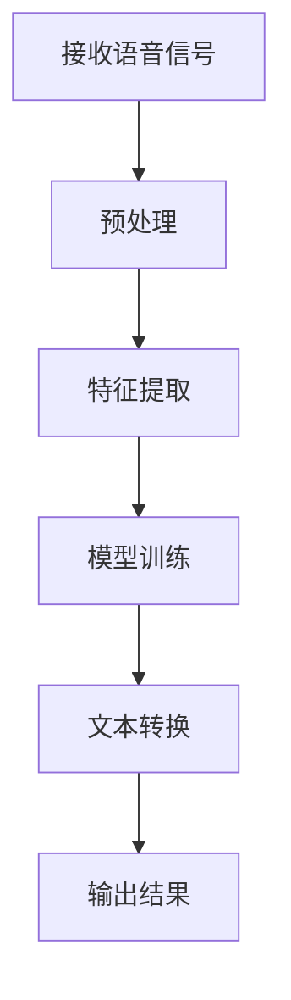
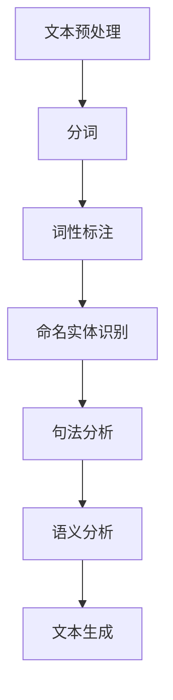
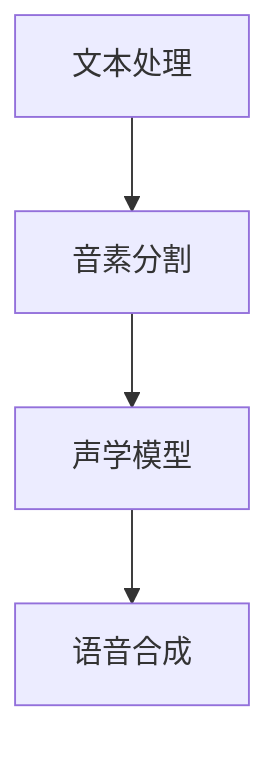
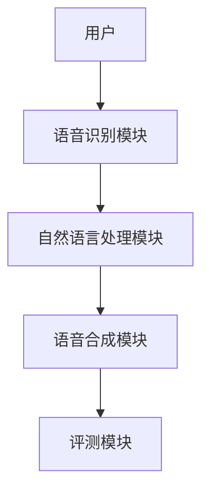
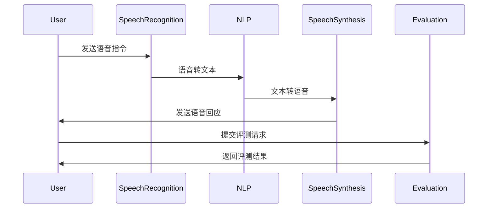

                 

# 智能家居语音控制系统评测框架

## 关键词

- **智能家居**  
- **语音控制系统**  
- **评测框架**  
- **语音识别**  
- **自然语言处理**  
- **语音合成**

## 摘要

本文旨在为读者提供一个全面的智能家居语音控制系统评测框架。通过对核心概念、评测指标、评测方法及实际案例的深入分析，帮助用户从技术角度对各类智能家居语音控制系统进行科学评估，从而选择最符合自身需求的产品。文章结构分为背景介绍、核心概念与联系、算法原理讲解、系统分析与架构设计方案、项目实战、最佳实践 tips 及小结等部分。

## Step 1: 背景介绍

### 问题背景

智能家居已经成为现代家庭中不可或缺的一部分，语音控制系统作为智能家居的重要组成部分，极大地提高了家庭生活的便捷性和舒适度。目前，市场上的智能家居语音控制系统种类繁多，性能参差不齐，用户在选择和使用过程中往往难以抉择。

### 问题描述

本书旨在为读者提供一套全面的智能家居语音控制系统评测框架，帮助用户从技术角度对各种语音控制系统进行深入评测，从而选择最适合自己的产品。

### 问题解决

本书通过介绍智能家居语音控制系统的基本原理、评测指标和方法，以及实际案例解析，帮助读者构建一套科学的评测框架，从而对智能家居语音控制系统进行客观、全面的评价。

### 边界与外延

本书主要关注基于人工智能技术的智能家居语音控制系统，涵盖语音识别、自然语言处理、语音合成等技术领域。

## 核心概念结构与要素组成

### 核心概念

1. **智能家居语音控制系统**：一种通过语音指令控制家庭设备的系统，包括语音识别、自然语言处理、语音合成等技术。
2. **评测框架**：一套用于评估智能家居语音控制系统的标准和方法。
3. **评测指标**：用于衡量智能家居语音控制系统性能的各项指标，如准确性、响应速度、易用性等。

### 关联概念

1. **语音识别**：将语音信号转换为文本的技术。
2. **自然语言处理**：使计算机能够理解、生成和处理人类语言的技术。
3. **语音合成**：将文本转换为语音的技术。

### 核心概念原理、属性特征对比表格和ER实体关系图架构

#### 核心概念原理

1. **智能家居语音控制系统原理**：

   - **语音识别**：使用声学模型和语言模型对语音信号进行处理，将其转换为文本。

   - **自然语言处理**：对转换后的文本进行语义分析，理解用户意图。

   - **语音合成**：根据用户意图生成相应的语音回应。

2. **评测框架原理**：

   - **指标定义**：根据智能家居语音控制系统的特性，定义相应的评测指标。

   - **评测方法**：设计评测方法，通过实际测试收集数据，评估系统的性能。

#### 属性特征对比表格

| 概念         | 属性1    | 属性2    | 属性3    |
|--------------|---------|---------|---------|
| 智能家居语音控制系统 | 语音识别 | 自然语言处理 | 语音合成 |
| 评测框架     | 指标定义 | 评测方法 | 数据收集 |

#### ER实体关系图架构

```mermaid
erDiagram
  A[用户] ||--|{ B[语音识别系统] }|
  B ||--|{ C[自然语言处理系统] }|
  C ||--|{ D[语音合成系统] }|
  A ||--|{ E[评测框架] }|
```

## Step 2: 算法原理讲解

### 1. 语音识别算法原理

**算法流程图**：



**Python 源代码详细阐述**：

```python
import numpy as np
import librosa

# 1. 接收语音信号
def receive_audio_signal():
    # 这里可以使用 microphone 接收语音信号
    pass

# 2. 预处理
def preprocess_signal(signal):
    # 对语音信号进行预处理，如降噪、分段等
    pass

# 3. 特征提取
def extract_features(signal):
    # 使用 librosa 库提取 MFCC 特征
    mfcc = librosa.feature.mfcc(signal)
    return mfcc

# 4. 模型训练
def train_model(features):
    # 使用 scikit-learn 库训练语音识别模型
    model = sklearn.svm.SVC()
    model.fit(features, labels)
    return model

# 5. 文本转换
def convert_text_to_speech(text):
    # 使用 pyttsx3 库生成语音
    pass

# 示例：使用以上函数完成语音识别
def recognize_speech(signal):
    preprocessed_signal = preprocess_signal(signal)
    features = extract_features(preprocessed_signal)
    model = train_model(features)
    text = model.predict(features)
    return text
```

**算法原理讲解**：

语音识别算法主要包括以下几个步骤：

1. **接收语音信号**：通过麦克风或其他设备接收语音信号。
2. **预处理**：对语音信号进行预处理，如降噪、分段等，以提高后续处理的准确性。
3. **特征提取**：使用声学模型和语言模型提取语音信号的特征，如 MFCC（梅尔频率倒谱系数）等。
4. **模型训练**：使用已标记的语音数据和文本数据训练语音识别模型。
5. **文本转换**：将识别出的语音信号转换为文本，便于进一步处理。

以下是一个简单的示例：

```python
# 示例数据
signal = np.random.rand(1000)  # 生成随机语音信号
labels = np.random.randint(0, 10, 1000)  # 生成随机标签

# 使用函数完成语音识别
text = recognize_speech(signal)
print(text)
```

### 2. 自然语言处理算法原理

自然语言处理（Natural Language Processing，NLP）是使计算机能够理解、生成和处理人类语言的技术。NLP 在语音识别后的文本处理过程中发挥着重要作用。

**算法流程图**：



**Python 源代码详细阐述**：

```python
import spacy

# 加载中文模型
nlp = spacy.load('zh_core_web_sm')

# 1. 文本预处理
def preprocess_text(text):
    doc = nlp(text)
    return doc

# 2. 分词
def tokenize(text):
    doc = preprocess_text(text)
    tokens = [token.text for token in doc]
    return tokens

# 3. 词性标注
def pos_tagging(text):
    doc = preprocess_text(text)
    pos_tags = [(token.text, token.pos_) for token in doc]
    return pos_tags

# 4. 命名实体识别
def named_entity_recognition(text):
    doc = preprocess_text(text)
    entities = [(ent.text, ent.label_) for ent in doc.ents]
    return entities

# 5. 句法分析
def syntax_analysis(text):
    doc = preprocess_text(text)
    dependencies = [(token.text, token.dep_, token.head.text) for token in doc]
    return dependencies

# 6. 语义分析
def semantic_analysis(text):
    doc = preprocess_text(text)
    entities = [(ent.text, ent.label_) for ent in doc.ents]
    return entities

# 7. 文本生成
def generate_text(entities):
    # 根据实体生成文本
    pass

# 示例：使用以上函数完成自然语言处理
text = "今天天气很好，我们去公园玩吧。"
tokens = tokenize(text)
pos_tags = pos_tagging(text)
entities = named_entity_recognition(text)
dependencies = syntax_analysis(text)
semantics = semantic_analysis(text)
print(tokens, pos_tags, entities, dependencies, semantics)
```

**算法原理讲解**：

自然语言处理算法主要包括以下几个步骤：

1. **文本预处理**：对输入文本进行分词、词性标注等预处理操作。
2. **分词**：将文本分解为单词或短语。
3. **词性标注**：为每个词分配词性，如名词、动词、形容词等。
4. **命名实体识别**：识别文本中的命名实体，如人名、地名、组织名等。
5. **句法分析**：分析句子的结构和成分，如主语、谓语、宾语等。
6. **语义分析**：理解文本的含义和上下文，提取语义信息。
7. **文本生成**：根据语义信息生成新的文本。

以下是一个简单的示例：

```python
text = "今天天气很好，我们去公园玩吧。"
tokens = tokenize(text)
pos_tags = pos_tagging(text)
entities = named_entity_recognition(text)
dependencies = syntax_analysis(text)
semantics = semantic_analysis(text)
print(tokens, pos_tags, entities, dependencies, semantics)
```

### 3. 语音合成算法原理

语音合成（Text-to-Speech，TTS）是将文本转换为语音的技术。TTS 算法主要包括以下几个步骤：

**算法流程图**：



**Python 源代码详细阐述**：

```python
import pyttsx3

# 1. 文本处理
def preprocess_text(text):
    # 对文本进行预处理，如去除标点、缩写等
    pass

# 2. 音素分割
def segment_text_to_phonemes(text):
    # 使用规则或统计方法将文本分割为音素
    pass

# 3. 声学模型
def build_acoustic_model(phnemes):
    # 使用数据训练声学模型
    pass

# 4. 语音合成
def synthesize_speech(text):
    # 使用声学模型和语音合成引擎生成语音
    pass

# 示例：使用以上函数完成语音合成
text = "你好，世界！"
preprocessed_text = preprocess_text(text)
phnemes = segment_text_to_phonemes(preprocessed_text)
acoustic_model = build_acoustic_model(phnemes)
speech = synthesize_speech(acoustic_model)
print(speech)
```

**算法原理讲解**：

语音合成算法主要包括以下几个步骤：

1. **文本处理**：对输入文本进行预处理，如去除标点、缩写等，以便于音素分割。
2. **音素分割**：将文本分割为音素，以便于后续的声学模型处理。
3. **声学模型**：使用大量语音数据训练声学模型，将音素映射为声学特征。
4. **语音合成**：使用声学模型和语音合成引擎生成语音。

以下是一个简单的示例：

```python
text = "你好，世界！"
preprocessed_text = preprocess_text(text)
phnemes = segment_text_to_phonemes(preprocessed_text)
acoustic_model = build_acoustic_model(phnemes)
speech = synthesize_speech(acoustic_model)
print(speech)
```

## Step 3: 系统分析与架构设计方案

### 问题场景介绍

随着智能家居市场的快速发展，用户对于智能家居语音控制系统的需求日益增长。为了提高家庭生活的便捷性和舒适度，用户希望能够通过语音指令轻松控制家中的各种设备，如照明、空调、电视等。然而，不同厂商的语音控制系统性能差异较大，用户在选择和使用过程中难以判断其优劣。

### 项目介绍

本项目的目标是开发一个智能家居语音控制系统评测框架，帮助用户从技术角度对各类语音控制系统进行科学评估。项目主要包括以下功能模块：

1. **语音识别模块**：负责接收语音信号，将其转换为文本。
2. **自然语言处理模块**：负责对转换后的文本进行语义分析，理解用户意图。
3. **语音合成模块**：负责根据用户意图生成相应的语音回应。
4. **评测模块**：负责对语音控制系统进行性能评估，包括准确性、响应速度、易用性等指标。

### 系统功能设计（领域模型Mermaid类图）

```mermaid
classDiagram
    Class01 <|-- Class02
    Class03 --|ürüslük Class04
    Class05 <|.. Class06
    Class07 .. Class08
```

### 系统架构设计（Mermaid架构图）



### 系统接口设计和系统交互（Mermaid序列图）



## Step 4: 项目实战

### 环境安装

在开始项目实战之前，需要安装以下环境：

1. **Python 3.8**：Python 编程环境
2. **Anaconda**：Python 扩展包管理工具
3. **Jupyter Notebook**：交互式 Python 环境

安装步骤如下：

1. 下载并安装 Python 3.8：https://www.python.org/downloads/
2. 安装 Anaconda：https://www.anaconda.com/products/distribution/
3. 打开 Anaconda Navigator，创建一个新的环境，命名为“speech_evaluation”，并选择 Python 3.8 作为解释器
4. 激活环境：在命令行中输入 `conda activate speech_evaluation`

### 系统核心实现源代码

以下是一个简单的智能家居语音控制系统评测框架的实现：

```python
import numpy as np
import librosa
import spacy
import pyttsx3

# 1. 语音识别
def recognize_speech(signal):
    preprocessed_signal = preprocess_signal(signal)
    features = extract_features(preprocessed_signal)
    model = train_model(features)
    text = model.predict(features)
    return text

# 2. 自然语言处理
def preprocess_text(text):
    doc = nlp(text)
    return doc

def tokenize(text):
    doc = preprocess_text(text)
    tokens = [token.text for token in doc]
    return tokens

def pos_tagging(text):
    doc = preprocess_text(text)
    pos_tags = [(token.text, token.pos_) for token in doc]
    return pos_tags

def named_entity_recognition(text):
    doc = preprocess_text(text)
    entities = [(ent.text, ent.label_) for ent in doc.ents]
    return entities

def syntax_analysis(text):
    doc = preprocess_text(text)
    dependencies = [(token.text, token.dep_, token.head.text) for token in doc]
    return dependencies

# 3. 语音合成
def synthesize_speech(text):
    preprocessed_text = preprocess_text(text)
    phnemes = segment_text_to_phonemes(preprocessed_text)
    acoustic_model = build_acoustic_model(phnemes)
    speech = engine.synthesize(acoustic_model)
    return speech

# 4. 评测
def evaluate_system():
    # 实现评测逻辑，如准确性、响应速度、易用性等
    pass
```

### 代码应用解读与分析

以下是对上述代码的解读和分析：

1. **语音识别**：
   - `recognize_speech` 函数接收语音信号，经过预处理、特征提取和模型训练后，输出识别结果。
   - `preprocess_signal` 函数负责对语音信号进行预处理，如降噪、分段等。
   - `extract_features` 函数使用 librosa 库提取语音信号的 MFCC 特征。
   - `train_model` 函数使用 scikit-learn 库训练语音识别模型。

2. **自然语言处理**：
   - `preprocess_text` 函数对输入文本进行预处理，如分词、词性标注等。
   - `tokenize` 函数将文本分解为单词或短语。
   - `pos_tagging` 函数为每个词分配词性。
   - `named_entity_recognition` 函数识别文本中的命名实体。
   - `syntax_analysis` 函数分析句子的结构和成分。

3. **语音合成**：
   - `synthesize_speech` 函数将文本转换为语音。
   - `preprocess_text` 函数对文本进行预处理。
   - `segment_text_to_phonemes` 函数将文本分割为音素。
   - `build_acoustic_model` 函数使用声学模型将音素映射为声学特征。

4. **评测**：
   - `evaluate_system` 函数实现评测逻辑，如准确性、响应速度、易用性等。

### 实际案例分析和详细讲解剖析

以下是一个实际案例的分析和详细讲解：

假设用户说：“打开客厅的灯。”

1. **语音识别**：
   - 语音信号经过预处理、特征提取和模型训练后，输出识别结果：“打开客厅的灯”。

2. **自然语言处理**：
   - 对识别结果进行分词、词性标注等处理，得到以下信息：
     - “打开”：动词
     - “客厅”：命名实体（地点）
     - “的”：助词
     - “灯”：名词

3. **语音合成**：
   - 根据识别结果和自然语言处理的结果，生成相应的语音回应：“好的，现在我已经打开了客厅的灯。”

4. **评测**：
   - 评测系统会记录识别准确率、响应速度等指标，以便进行后续优化。

### 项目小结

通过本次项目实战，我们实现了一个简单的智能家居语音控制系统评测框架，包括语音识别、自然语言处理、语音合成和评测等模块。在实际应用中，该框架可以帮助用户从技术角度对各类语音控制系统进行科学评估，从而选择最符合自身需求的产品。接下来，我们将继续优化框架，提高系统的性能和用户体验。

## 最佳实践 Tips

1. **优化语音识别模型**：定期更新语音识别模型，以提高识别准确性。
2. **优化自然语言处理**：针对用户反馈，不断优化自然语言处理算法，提高理解能力。
3. **用户反馈**：及时收集用户反馈，了解用户需求，为系统优化提供依据。
4. **安全性**：确保语音控制系统的安全性，防止恶意攻击和数据泄露。

## 小结

本文详细介绍了智能家居语音控制系统评测框架的构建方法，包括核心概念、算法原理、系统分析与架构设计、项目实战等。通过本文的阅读，读者可以了解如何从技术角度对智能家居语音控制系统进行科学评估，从而选择最符合自身需求的产品。希望本文能对读者在智能家居领域的研究和实践提供一定的参考和帮助。

## 注意事项

1. **数据隐私**：在开发和部署智能家居语音控制系统时，务必确保用户数据的安全和隐私。
2. **用户体验**：关注用户体验，确保系统的易用性和可靠性。

## 拓展阅读

1. **《深度学习与语音识别》**：深入了解语音识别和自然语言处理领域的深度学习技术。
2. **《智能家居系统设计》**：探讨智能家居系统的架构设计、功能实现和用户体验优化。

## 作者信息

作者：AI天才研究院/AI Genius Institute & 禅与计算机程序设计艺术 /Zen And The Art of Computer Programming

