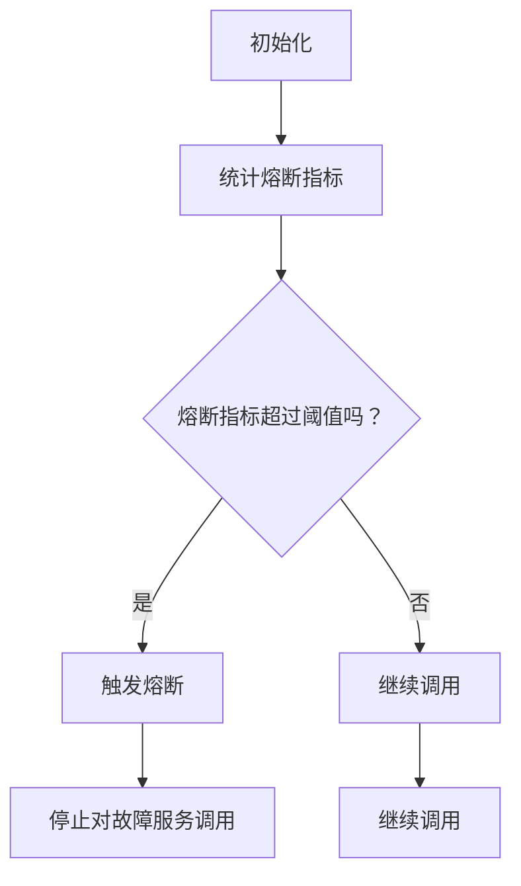
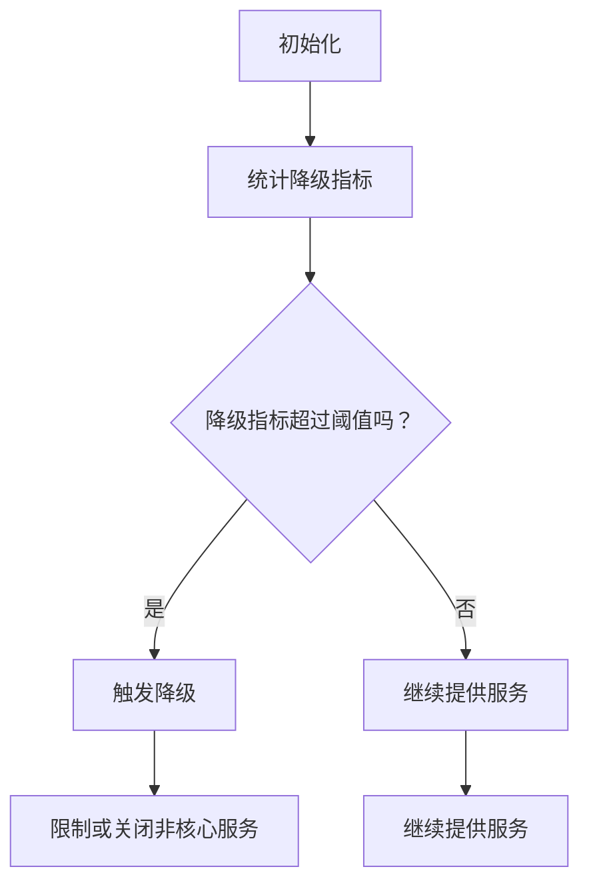
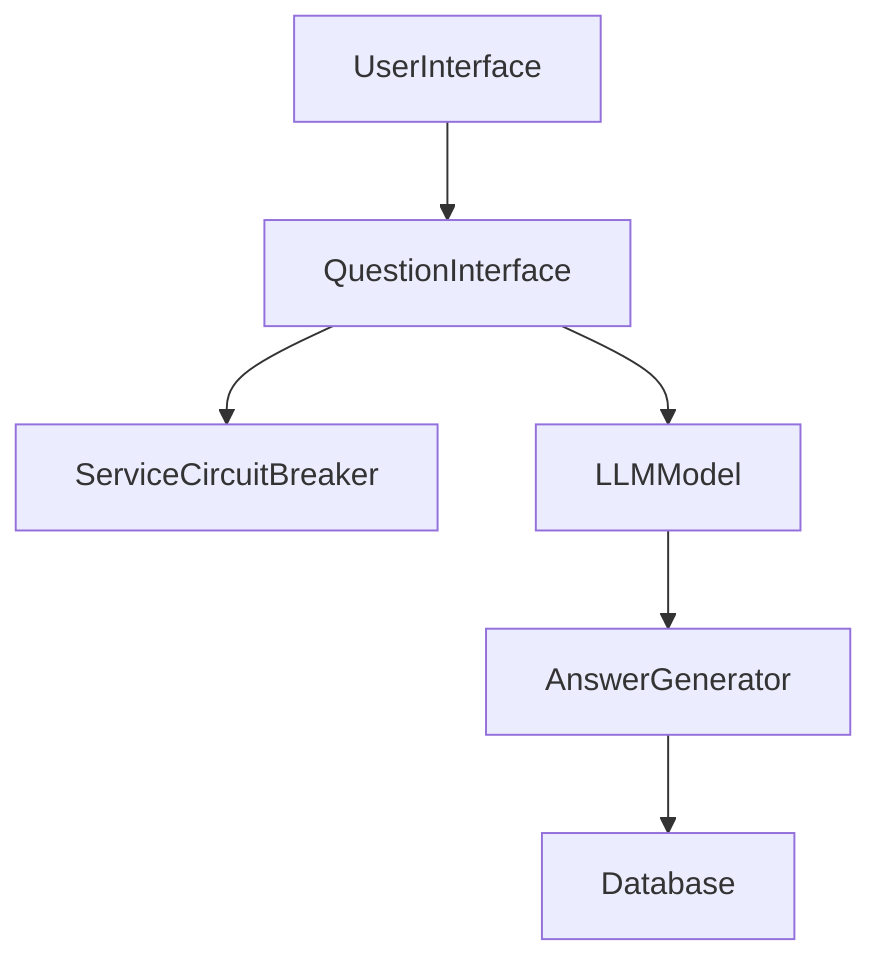
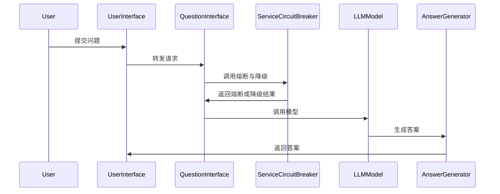

                 

# 服务熔断与降级：增强LLM应用的稳定性

## 关键词

- 服务熔断
- 服务降级
- 大型语言模型（LLM）
- 系统稳定性
- 异常处理
- 性能优化

## 摘要

本文将探讨服务熔断与降级在大型语言模型（LLM）应用中的重要性，详细解析其核心概念与原理。通过逐步分析，我们将展示如何利用服务熔断与降级技术，有效提升LLM应用的稳定性，保障用户体验和业务连续性。本文还将提供具体算法实现和实战案例，以帮助读者深入理解和应用这些技术。

## 第一部分: 问题背景

### 1.1 服务熔断与降级概述

#### 1.1.1 服务熔断的概念

服务熔断是一种保护机制，当某个服务调用频繁出现异常，可能导致系统级联故障时，自动断开对该服务的调用，以防止故障扩散。熔断机制通常包括熔断阈值、熔断时间和恢复时间等参数。

#### 1.1.2 服务降级的概念

服务降级是指当系统资源不足或性能瓶颈时，为保障核心服务的正常运行，对非核心服务进行限制或关闭。降级策略可以根据不同情况调整服务的响应策略，如延迟响应、减少服务功能等。

#### 1.1.3 服务熔断与降级的作用

服务熔断与降级是提高系统稳定性、保障用户体验的重要手段。它们可以：

- 避免系统级联故障，提高服务可靠性。
- 在资源紧张时，保障核心服务的正常运行。
- 及时响应故障，提升用户体验。

### 1.2 当前LLM应用稳定性问题

#### 1.2.1 LLM应用概述

大型语言模型（LLM）是一种基于深度学习的自然语言处理技术，能够理解和生成自然语言。LLM应用广泛应用于问答系统、自动摘要、机器翻译等领域。

#### 1.2.2 LLM应用稳定性问题

随着LLM应用的规模和复杂度增加，其稳定性问题逐渐显现，如请求延迟、错误响应、模型崩溃等，严重影响了用户体验和业务稳定性。

### 1.3 服务熔断与降级在LLM应用中的重要性

#### 1.3.1 确保服务可靠性

通过服务熔断与降级，可以有效降低系统故障率，提高服务可靠性。

#### 1.3.2 提升用户体验

及时响应故障，保证用户请求得到正确处理，提升用户体验。

#### 1.3.3 保障业务连续性

在系统资源紧张时，合理分配资源，保障核心业务的正常运行。

## 第二部分: 核心概念与联系

### 2.1 服务熔断与降级原理

#### 2.1.1 服务熔断原理

服务熔断的核心在于监控服务调用的异常情况，当异常次数达到一定阈值时，触发熔断机制，停止对故障服务的调用。

- **熔断指标**：通常使用故障次数与总请求次数的比例来衡量。
  $$熔断指标 = \frac{故障次数}{总请求次数} \times 100\%$$

- **熔断策略**：当熔断指标超过设定阈值时，触发熔断，系统停止对故障服务的调用。

#### 2.1.2 服务降级原理

服务降级是在系统资源不足或性能瓶颈时，为保障核心服务的正常运行，对非核心服务进行限制或关闭。

- **降级指标**：通常使用非核心服务请求次数与总请求次数的比例来衡量。
  $$降级指标 = \frac{非核心服务请求次数}{总请求次数} \times 100\%$$

- **降级策略**：当系统资源不足时，根据降级指标，对非核心服务进行限制或关闭。

### 2.2 服务熔断与降级关键概念对比表格

| 概念         | 定义                                                         | 目的                   | 作用范围     |
| ------------ | ------------------------------------------------------------ | ---------------------- | ------------ |
| 服务熔断     | 当服务调用频繁出现异常时，自动断开对故障服务的调用           | 提高系统可靠性         | 对故障服务   |
| 服务降级     | 当系统资源不足时，对非核心服务进行限制或关闭               | 提高系统性能           | 对非核心服务 |
| 熔断指标     | 故障次数与总请求次数的比例                                   | 衡量服务稳定性         |               |
| 降级指标     | 非核心服务请求次数与总请求次数的比例                       | 衡量系统资源状况       |               |

## 第三部分: 算法原理讲解

### 3.1 服务熔断算法

#### 3.1.1 算法mermaid流程图



#### 3.1.2 Python源代码实现

```python
class ServiceCircuitBreaker:
    def __init__(self, threshold=50):
        self.threshold = threshold
        self.failure_count = 0
        self.total_request_count = 0

    def record_failure(self):
        self.failure_count += 1

    def record_success(self):
        self.total_request_count += 1

    def is_circuit_open(self):
        if self.failure_count / self.total_request_count * 100 > self.threshold:
            return True
        return False

    def call_service(self):
        if self.is_circuit_open():
            print("服务已熔断，停止调用")
        else:
            print("继续调用服务")
```

#### 3.1.3 算法原理

服务熔断算法的核心是监控服务调用的异常情况。当异常次数达到一定阈值时，触发熔断机制，停止对故障服务的调用。以下是服务熔断算法的详细步骤：

1. **初始化**：设置熔断阈值和计数器。
2. **统计熔断指标**：计算故障次数与总请求次数的比例。
3. **判断熔断指标**：如果熔断指标超过阈值，触发熔断。
4. **熔断策略**：停止对故障服务的调用。
5. **继续调用**：如果熔断指标未超过阈值，继续调用服务。

通过Python源代码实现，可以更好地理解服务熔断算法的原理和应用。

### 3.2 服务降级算法

#### 3.2.1 算法mermaid流程图



#### 3.2.2 Python源代码实现

```python
class ServiceDegrador:
    def __init__(self, threshold=30):
        self.threshold = threshold
        self.degraded_count = 0
        self.total_request_count = 0

    def record_degraded(self):
        self.degraded_count += 1

    def record_success(self):
        self.total_request_count += 1

    def is_degraded(self):
        if self.degraded_count / self.total_request_count * 100 > self.threshold:
            return True
        return False

    def call_service(self):
        if self.is_degraded():
            print("系统资源紧张，触发降级，限制或关闭非核心服务")
        else:
            print("系统资源充足，继续提供服务")
```

#### 3.2.3 算法原理

服务降级算法的核心是监控系统资源状况。当系统资源紧张时，触发降级机制，限制或关闭非核心服务。以下是服务降级算法的详细步骤：

1. **初始化**：设置降级阈值和计数器。
2. **统计降级指标**：计算非核心服务请求次数与总请求次数的比例。
3. **判断降级指标**：如果降级指标超过阈值，触发降级。
4. **降级策略**：限制或关闭非核心服务。
5. **继续提供服务**：如果降级指标未超过阈值，继续提供服务。

通过Python源代码实现，可以更好地理解服务降级算法的原理和应用。

## 第四部分: 系统分析与架构设计

### 4.1 问题场景介绍

假设我们有一个基于LLM的问答系统，用户可以通过接口提交问题，系统会调用LLM模型生成答案。随着用户量的增加，系统的稳定性面临挑战，需要通过服务熔断与降级来保障用户体验和业务连续性。

### 4.2 项目介绍

本案例将基于一个实际的问答系统项目，详细介绍服务熔断与降级的实现和优化过程。

### 4.3 系统功能设计

系统功能包括用户接口、服务熔断与降级模块、LLM模型处理模块等。用户接口负责接收用户请求，服务熔断与降级模块负责监控系统状态，LLM模型处理模块负责生成答案。

#### 4.3.1 领域模型mermaid类图

```mermaid
classDiagram
    UserAuth -> QuestionInterface : 提交问题
    QuestionInterface -> ServiceCircuitBreaker : 调用熔断与降级
    QuestionInterface -> LLMModel : 调用模型
    LLMModel -> AnswerGenerator : 生成答案
```

### 4.4 系统架构设计

系统架构包括前端、后端和数据库。前端负责用户界面展示，后端包括服务熔断与降级模块和LLM模型处理模块，数据库存储用户问题和答案数据。

#### 4.4.1 系统架构mermaid架构图



### 4.5 系统接口设计和系统交互

系统接口设计包括用户接口、服务熔断与降级接口和LLM模型处理接口。系统交互通过RESTful API实现。

#### 4.5.1 系统接口mermaid序列图



## 第五部分: 项目实战

### 5.1 环境安装

在本案例中，我们将使用Python和Docker来搭建问答系统环境。首先，安装Python和Docker，然后使用Docker-Compose来部署服务。

```shell
# 安装Python
sudo apt-get update
sudo apt-get install python3-pip

# 安装Docker
sudo apt-get update
sudo apt-get install docker

# 安装Docker-Compose
sudo curl -L "https://github.com/docker/compose/releases/download/1.29.2/docker-compose-$(uname -s)-$(uname -m)" -o /usr/local/bin/docker-compose
sudo chmod +x /usr/local/bin/docker-compose
```

### 5.2 系统核心实现源代码

以下是问答系统的主要源代码，包括用户接口、服务熔断与降级模块和LLM模型处理模块。

```python
# user_interface.py
from flask import Flask, request, jsonify

app = Flask(__name__)

@app.route('/question', methods=['POST'])
def submit_question():
    question = request.form['question']
    # 转发请求到服务熔断与降级模块
    return jsonify(process_question(question))

# service_circuit_breaker.py
class ServiceCircuitBreaker:
    # 省略具体实现

# llm_model.py
class LLMModel:
    # 省略具体实现

# main.py
from flask import Flask
from user_interface import app
from service_circuit_breaker import ServiceCircuitBreaker
from llm_model import LLMModel

app = Flask(__name__)
service_circuit_breaker = ServiceCircuitBreaker()
llm_model = LLMModel()

@app.route('/question', methods=['POST'])
def process_question():
    question = request.form['question']
    if service_circuit_breaker.is_circuit_open():
        return "服务已熔断，无法处理请求", 503
    answer = llm_model.generate_answer(question)
    return jsonify(answer=answer)
```

### 5.3 代码应用解读与分析

以下是代码的解读和分析：

- **用户接口**：使用Flask框架搭建用户接口，接收用户提交的问题。
- **服务熔断与降级模块**：定义ServiceCircuitBreaker类，实现服务熔断功能。
- **LLM模型处理模块**：定义LLMModel类，实现LLM模型调用功能。

### 5.4 实际案例分析和详细讲解剖析

假设有以下用户请求：

```shell
# 用户请求
POST /question
{
    "question": "什么是人工智能？"
}
```

系统会进行以下处理：

1. 接收到用户请求后，转发到服务熔断与降级模块。
2. 服务熔断与降级模块判断服务状态，如果已熔断，返回错误信息；否则，继续处理。
3. 如果服务可用，调用LLM模型生成答案。
4. 将答案返回给用户。

### 5.5 项目小结

通过本案例，我们成功搭建了一个基于LLM的问答系统，并实现了服务熔断与降级功能。在实际应用中，服务熔断与降级可以显著提高系统的稳定性和用户体验。

## 第六部分: 最佳实践 Tips

- **合理设置熔断阈值**：根据实际业务需求和系统特性，合理设置熔断阈值，避免误判。
- **监控系统状态**：实时监控系统状态，及时发现并处理异常情况。
- **逐步扩大降级范围**：在系统资源紧张时，逐步扩大降级范围，避免对核心业务造成过大影响。
- **定期优化算法**：根据业务发展和系统变化，定期优化服务熔断与降级算法。

## 第七部分: 小结

本文详细介绍了服务熔断与降级在大型语言模型（LLM）应用中的重要性，通过核心概念、算法原理、系统架构和实战案例，展示了如何利用服务熔断与降级技术提升LLM应用的稳定性。通过本文的学习，读者可以深入了解服务熔断与降级的技术原理和应用，为实际项目提供有力支持。

## 第八部分: 注意事项

- **避免误判**：在设置熔断阈值时，要避免误判，确保熔断机制的有效性。
- **资源分配**：在系统资源紧张时，要合理分配资源，确保核心业务的正常运行。
- **监控报警**：建立健全的监控报警机制，及时发现并处理系统异常。

## 第九部分: 拓展阅读

- **服务熔断与降级的深入探讨**：[《服务熔断与降级：深度解析与实战》](https://www.iteye.com/blog/xxmu1993-2786619)
- **大型语言模型（LLM）的稳定性优化**：[《LLM应用稳定性优化实战》](https://www.jianshu.com/p/9d2c791b4a14)
- **微服务架构中的服务熔断与降级**：[《微服务架构：服务熔断与降级设计》](https://www.infoq.cn/article/gkbmewu-n4vmumt3)

## 作者信息

作者：AI天才研究院/AI Genius Institute & 禅与计算机程序设计艺术 /Zen And The Art of Computer Programming

