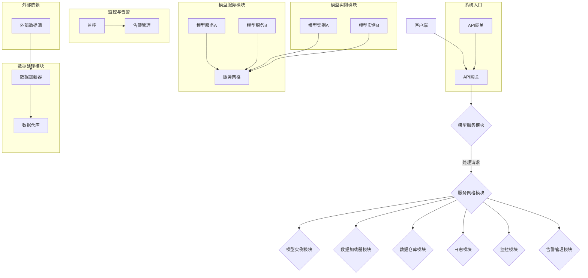

                 

# 服务网格技术在LLM应用中的应用

## 关键词
- 服务网格
- LLM（大型语言模型）
- 微服务架构
- 数据平面
- 控制平面
- 负载均衡
- 服务发现
- 网络策略

## 摘要
本文将深入探讨服务网格技术在大型语言模型（LLM）应用中的重要作用。首先，我们将介绍服务网格技术的基础知识，包括其起源、核心概念、与传统微服务架构的差异，以及其工作原理。接着，我们将探讨服务网格与LLM之间的联系，分析服务网格对LLM性能的提升作用。随后，我们将详细讲解服务网格在LLM中的应用算法原理，并使用Python代码和LaTeX公式进行阐述。在此基础上，我们将设计一个基于服务网格技术的LLM应用系统，并详细描述其系统功能、架构设计和接口设计。最后，我们将通过一个实际案例分析，展示服务网格技术在LLM应用中的实战效果，并总结最佳实践和未来展望。

## 目录

### 1. 服务网格技术基础
#### 1.1 服务网格技术概述
##### 1.1.1 服务网格的起源与发展
##### 1.1.2 服务网格的核心概念
##### 1.1.3 服务网格与传统微服务架构的差异

#### 1.2 服务网格技术的工作原理
##### 1.2.1 数据平面与控制平面
##### 1.2.2 服务发现与负载均衡
##### 1.2.3 网络策略与管理

#### 1.3 服务网格技术的优势和挑战
##### 1.3.1 优势分析
##### 1.3.2 挑战与解决方法

### 2. 核心概念与联系
#### 2.1 服务网格与LLM的联系
##### 2.1.1 服务网格在LLM中的应用场景
##### 2.1.2 服务网格对LLM性能的提升

#### 2.2 服务网格与AI的关系
##### 2.2.1 服务网格在AI生态系统中的角色
##### 2.2.2 服务网格对AI模型部署的影响

#### 2.3 服务网格技术的核心要素
##### 2.3.1 数据平面要素
##### 2.3.2 控制平面要素
##### 2.3.3 策略与管理要素

### 3. 服务网格技术在LLM中的应用算法原理
#### 3.1 服务网格在LLM中的算法模型
##### 3.1.1 算法模型概述
##### 3.1.2 算法原理详细解析
##### 3.1.3 算法流程图

#### 3.2 算法数学模型与公式
##### 3.2.1 数学模型说明
##### 3.2.2 公式推导与解释
##### 3.2.3 算法举例说明

### 4. 服务网格技术在LLM应用中的系统设计与实现
#### 4.1 应用场景介绍
##### 4.1.1 LLMOIDC（大规模语言模型在线部署中心）背景
##### 4.1.2 需求分析

#### 4.2 系统功能设计
##### 4.2.1 领域模型
##### 4.2.2 功能模块划分

#### 4.3 系统架构设计
##### 4.3.1 系统架构图
##### 4.3.2 架构设计原则与考量

#### 4.4 系统接口设计与交互
##### 4.4.1 接口设计与定义
##### 4.4.2 系统交互

### 5. 服务网格技术在LLM应用项目实战
#### 5.1 环境安装与配置
##### 5.1.1 开发环境搭建
##### 5.1.2 服务网格工具安装

#### 5.2 系统核心实现与代码解析
##### 5.2.1 代码实现解析
##### 5.2.2 关键代码片段分析

#### 5.3 实际案例分析
##### 5.3.1 案例背景
##### 5.3.2 案例实施过程
##### 5.3.3 案例效果评估

### 6. 最佳实践与项目总结
#### 6.1 最佳实践
##### 6.1.1 部署优化策略
##### 6.1.2 性能调优技巧
##### 6.1.3 安全防护措施

#### 6.2 项目总结
##### 6.2.1 项目成果回顾
##### 6.2.2 项目经验总结
##### 6.2.3 未来展望

### 7. 拓展阅读
#### 7.1 进一步学习资源
##### 7.1.1 相关书籍推荐
##### 7.1.2 学术论文精选
##### 7.1.3 实践经验分享

#### 7.2 注意事项与小结
##### 7.2.1 使用服务网格的潜在风险
##### 7.2.2 注意事项总结## 1.1.1 服务网格的起源与发展

服务网格（Service Mesh）这一概念最早由Google在2016年提出，作为其分布式服务架构的一部分。随着微服务架构（Microservices Architecture）的普及，服务网格逐渐成为解决分布式系统复杂性的一种新兴技术。传统的微服务架构强调服务间的独立性和自治性，然而随着服务数量和交互复杂性的增加，服务间的通信管理、流量控制和安全性等问题变得愈发复杂。服务网格应运而生，旨在为微服务架构提供一种简化的通信层，以解决这些问题。

服务网格的起源可以追溯到Google的Docker容器技术和Kubernetes容器编排系统的广泛应用。在容器化技术之前，分布式系统的通信主要依赖于传统的库和框架，如RPC（Remote Procedure Call）和HTTP/REST API。这些方法在单体架构中运行良好，但在分布式环境中，随着服务数量的增加，管理服务的网络通信变得更加困难。服务网格通过引入一个独立的通信层，将服务间的通信抽象化，从而简化了分布式系统的管理和维护。

随着时间的推移，服务网格技术逐渐发展并完善，多个开源服务网格项目如Istio、Linkerd和Conduit等相继诞生。这些项目不仅实现了服务网格的基本功能，如服务发现、负载均衡、服务间认证和加密等，还提供了丰富的监控和运维工具。服务网格技术的兴起，不仅为微服务架构提供了新的解决方案，也为分布式系统的可靠性和性能优化带来了新的机遇。

在LLM应用场景中，服务网格技术的应用尤为显著。随着人工智能和自然语言处理技术的快速发展，LLM的应用场景越来越广泛，如智能客服、智能翻译、文本生成等。这些应用对服务的可靠性和性能提出了更高的要求。服务网格技术通过其强大的网络管理和流量控制功能，为LLM提供了稳定、高效的运行环境，有效提升了其性能和可靠性。

总的来说，服务网格技术的发展经历了从提出概念到开源项目涌现的过程，其核心目标是简化分布式系统的通信管理，提高系统的性能和可靠性。在LLM应用中，服务网格技术不仅解决了复杂的网络通信问题，还为AI服务的稳定运行提供了有力保障。接下来，我们将进一步探讨服务网格技术的核心概念和其在分布式系统中的应用。

### 1.1.2 服务网格的核心概念

服务网格（Service Mesh）是一种用于简化分布式系统中服务间通信的架构模式。其核心概念主要包括数据平面（Data Plane）和控制平面（Control Plane）。

#### 数据平面（Data Plane）

数据平面负责实际的服务间通信，它通过代理（Proxy）来实现服务的连接、路由、负载均衡等功能。数据平面通常嵌入在服务中，每个服务实例都会运行一个代理，代理负责处理来自其他服务的请求，并将请求转发到目标服务。数据平面确保了服务间的通信高效、可靠，并且可以灵活地支持不同的通信协议，如HTTP/2、gRPC等。

数据平面通常包括以下几个关键组件：

1. **代理**：数据平面的核心组件，负责接收和处理服务间的请求。常见的代理如Envoy、Istio数据平面中的Pilot等。
2. **服务发现**：用于发现服务实例的位置和地址，使代理能够正确地将请求路由到目标服务。服务发现可以通过Consul、Zookeeper等工具实现。
3. **负载均衡**：用于将请求分配到不同的服务实例上，以实现流量的负载均衡。常见的负载均衡策略包括轮询、最少连接、源IP哈希等。
4. **服务间认证和加密**：确保服务间通信的安全，通过TLS等协议实现加密和身份验证。

#### 控制平面（Control Plane）

控制平面负责管理和配置数据平面，它提供了一种集中式的管理机制，使得开发者可以轻松地控制和管理服务间的通信。控制平面通常包含以下几个关键组件：

1. **服务注册中心**：用于存储和管理服务实例的元数据，如服务地址、端口、健康状态等。常见的服务注册中心包括Eureka、Consul等。
2. **服务配置中心**：用于存储和管理服务的配置信息，如路由规则、负载均衡策略、认证规则等。常见的配置中心包括Apollo、etcd等。
3. **控制代理**：控制平面的核心组件，负责将配置信息下发到数据平面的代理，从而实现服务间的通信管理。常见的控制代理包括Istio的控制平面Citadel、Pilot等。
4. **监控和日志管理**：用于收集和分析数据平面的监控数据，提供运维人员实时监控和日志分析的工具。常见的监控和日志管理工具包括Prometheus、ELK（Elasticsearch、Logstash、Kibana）等。

#### 数据平面与控制平面的关系

数据平面和控制平面共同构成了服务网格的完整架构，两者之间紧密协作，确保了服务间通信的高效和可靠。

- **配置管理**：控制平面负责管理服务的配置信息，并将其下发到数据平面的代理。代理根据配置信息处理服务间的请求，如路由、负载均衡等。
- **服务发现**：控制平面通过服务注册中心获取服务实例的元数据，数据平面代理使用这些元数据进行服务发现，以确定请求的目标服务。
- **监控和日志**：数据平面代理在处理请求时，会生成监控数据和日志信息，控制平面将这些信息收集并存储到监控和日志管理系统中。

通过数据平面和控制平面的协作，服务网格实现了对服务间通信的全面管理和控制，从而简化了分布式系统的开发和运维。接下来，我们将进一步探讨服务网格与传统微服务架构的差异。

### 1.1.3 服务网格与传统微服务架构的差异

服务网格（Service Mesh）和传统微服务架构（Microservices Architecture）在分布式系统的设计中扮演着不同的角色，两者既有联系又有区别。理解它们之间的差异，有助于我们更好地选择合适的架构模式来应对复杂的分布式系统需求。

#### 1. 服务网格的补充角色

服务网格并非替代传统微服务架构，而是为其提供了一种更高效的通信和管理机制。传统微服务架构侧重于服务的分解和自治，而服务网格则专注于服务间通信的抽象和优化。

- **微服务架构**：将一个复杂的单体应用分解为多个独立的、可自治的小服务，每个服务负责不同的功能模块。这种架构模式提高了系统的可扩展性和可维护性。
- **服务网格**：在微服务架构之上，提供一个独立的通信层，负责处理服务间的网络通信、流量管理和安全控制等。服务网格简化了服务间的通信，提高了系统的整体性能和可靠性。

#### 2. 服务网格的独立通信层

服务网格引入了数据平面和控制平面的概念，使得服务间通信的复杂性被有效隔离。传统微服务架构通常依赖于服务间的直接通信，而服务网格则通过代理来实现服务间的通信。

- **传统微服务架构**：服务间通信通常通过HTTP/REST API、gRPC等协议直接实现。这种方式要求开发者关注通信协议的实现和服务的交互细节，增加了开发难度。
- **服务网格**：通过数据平面的代理，服务间的通信被抽象化。代理负责处理服务间的请求转发、负载均衡、服务发现等功能，服务开发者无需关注底层的通信细节，从而提高了开发效率。

#### 3. 服务网格的集中化管理

服务网格的控制平面提供了一种集中式的管理机制，使得服务配置、监控和日志等操作变得更加简单和高效。传统微服务架构中，这些操作通常需要分散在各个服务中，增加了运维的复杂性。

- **传统微服务架构**：服务配置、监控和日志通常需要为每个服务单独实现和运维，增加了系统的复杂度。
- **服务网格**：通过控制平面，可以实现集中化的服务配置管理、监控和日志收集。控制平面负责将配置下发到数据平面代理，代理则负责执行具体的通信操作，从而简化了运维工作。

#### 4. 服务网格的横向扩展能力

服务网格通过负载均衡和服务发现机制，使得系统可以轻松实现横向扩展。传统微服务架构虽然也支持扩展，但往往需要手动调整服务实例的数量和配置。

- **传统微服务架构**：扩展通常需要手动调整每个服务的实例数量和配置，增加了运维的负担。
- **服务网格**：通过控制平面动态调整服务实例的负载均衡策略，可以自动实现服务实例的弹性扩展，提高了系统的可用性和可靠性。

总的来说，服务网格与传统微服务架构各有优势。服务网格通过提供独立的通信层和集中化的管理机制，简化了服务间通信的复杂性，提高了系统的性能和可靠性。而传统微服务架构则专注于服务的分解和自治，为系统的可扩展性和可维护性提供了坚实的基础。在实际应用中，我们可以根据具体需求和场景，选择合适的架构模式，以实现最佳的系统性能和开发体验。

### 1.2.1 数据平面与控制平面

在服务网格架构中，数据平面（Data Plane）和控制平面（Control Plane）是两个核心组件，它们各自承担不同的功能，共同确保服务间通信的高效性和可靠性。

#### 数据平面

数据平面负责实际的服务间通信，它通过一系列代理（Proxy）来实现服务的连接、路由、负载均衡等功能。这些代理通常嵌入在每个服务实例中，充当服务间的通信桥梁。数据平面的主要任务包括：

1. **请求转发**：代理接收来自客户端的请求，并根据路由规则将请求转发到目标服务。
2. **负载均衡**：代理根据设定的负载均衡策略，将请求均匀地分发到不同的服务实例上，确保服务的均衡负载。
3. **服务发现**：代理通过服务注册中心获取服务实例的元数据，如地址和端口，以便正确地将请求路由到目标服务。
4. **安全通信**：代理通过TLS/SSL等加密协议，确保服务间通信的安全性。

#### 控制平面

控制平面负责管理和配置数据平面，它提供了一个集中式的管理机制，使得开发者可以轻松地控制和管理服务间的通信。控制平面的主要任务包括：

1. **服务配置管理**：控制平面通过服务配置中心，存储和管理服务的配置信息，如路由规则、负载均衡策略、认证规则等。开发者可以通过控制平面动态地修改和更新服务的配置。
2. **服务注册与发现**：控制平面通过服务注册中心，跟踪和管理服务实例的运行状态和元数据。当服务实例启动或停止时，控制平面会更新服务注册中心的记录，确保服务发现机制的正确性。
3. **流量管理**：控制平面根据设定的流量管理策略，动态地调整服务间的流量分配，以实现最优的性能和可靠性。
4. **监控与日志**：控制平面负责收集和分析数据平面的监控数据，提供实时的监控和日志分析工具，帮助运维人员快速定位和解决问题。

#### 数据平面与控制平面的协作

数据平面和控制平面通过一系列机制紧密协作，确保服务间通信的高效和可靠：

1. **配置更新**：控制平面将配置信息（如路由规则、负载均衡策略等）通过API或消息队列等机制下发到数据平面的代理，代理根据新的配置进行通信操作。
2. **服务发现**：控制平面通过服务注册中心获取服务实例的元数据，并将其推送到数据平面的代理，代理根据这些元数据进行服务发现和请求路由。
3. **监控与日志**：数据平面的代理在处理请求时，会生成监控数据和日志信息，控制平面将这些信息收集并存储到监控和日志管理系统中，为运维人员提供实时监控和日志分析工具。

通过数据平面和控制平面的协作，服务网格实现了对服务间通信的全面管理和控制，从而简化了分布式系统的开发和运维。接下来，我们将进一步探讨服务网格中的服务发现与负载均衡机制。

### 1.2.2 服务发现与负载均衡

服务发现（Service Discovery）和负载均衡（Load Balancing）是服务网格技术中的两个关键组件，它们共同确保了服务间的高效通信和系统性能。下面，我们将详细探讨这两个机制的工作原理、实现方式以及它们在服务网格中的作用。

#### 服务发现

服务发现是指自动化地发现和跟踪服务实例的位置和状态，以便其他服务可以动态地定位和连接到这些服务实例。在分布式系统中，服务实例可能会因为各种原因（如故障、扩容等）动态地启动或停止，因此，服务发现是确保系统高可用性的重要机制。

1. **服务注册**：服务实例启动时，会将其元数据（如地址、端口、健康状态等）注册到一个服务注册中心。常见的服务注册中心包括Consul、Eureka和Zookeeper等。
   
   ```mermaid
   graph TD
   A[Service A] --> B[Service Registry]
   C[Service B] --> B
   D[Service C] --> B
   ```

2. **服务发现**：当其他服务需要调用某个服务时，它们会查询服务注册中心，获取该服务的最新元数据，从而确定服务实例的地址和端口。

   ```mermaid
   graph TD
   E[Service Consumer] --> F[Service Registry]
   F --> G[Service A's Address]
   F --> H[Service B's Address]
   ```

服务发现的优势在于：

- **动态性**：服务实例的启动和停止无需人工干预，系统可以自动调整。
- **高可用性**：即使某个服务实例发生故障，服务注册中心可以快速发现并通知其他服务实例进行切换。

#### 负载均衡

负载均衡是指将客户端请求均匀地分发到多个服务实例上，以确保系统资源的最优利用和服务的响应性能。负载均衡策略可以根据系统的需求和性能指标进行动态调整。

1. **轮询负载均衡**：将请求依次分配到每个服务实例，这种方法简单且公平，但可能会将请求分配到正在处理大量请求的实例上。

   ```mermaid
   graph TD
   I[Client Request] --> J[Service A]
   J --> K[Service B]
   K --> L[Service C]
   ```

2. **最少连接负载均衡**：将请求分配到当前连接数最少的服务实例，这种方法可以减少响应时间，但可能导致某个实例负载不均。

   ```mermaid
   graph TD
   I --> J{Service A(1)}
   I --> K{Service B(2)}
   I --> L[Service C(0)]
   ```

3. **源IP哈希负载均衡**：根据客户端的IP地址进行哈希计算，将请求固定分配到某个服务实例，这种方法可以确保来自同一个客户端的请求总是由同一个实例处理，提高会话的一致性。

   ```mermaid
   graph TD
   M[Client A] --> N[Service A]
   M --> O[Service B]
   M --> P[Service A]
   ```

负载均衡的优势在于：

- **性能优化**：通过均匀分配请求，可以避免单个实例过载，提高整体系统的响应速度。
- **弹性扩展**：当系统需要扩展时，可以动态增加服务实例的数量，负载均衡器会自动调整请求的分配。

#### 在服务网格中的作用

服务发现和负载均衡在服务网格中发挥着至关重要的作用：

1. **简化服务间通信**：通过服务发现，服务网格自动地跟踪和管理服务实例的地址和状态，服务开发者无需手动配置服务地址，从而简化了服务间的通信。
2. **提高系统性能和可靠性**：通过负载均衡，服务网格可以动态地分配请求，确保系统的资源利用率和响应速度，同时提供高可用性。
3. **支持弹性扩展**：服务网格可以根据系统的需求动态调整服务实例的数量，实现弹性扩展，从而应对突发的流量变化。

总之，服务发现和负载均衡是服务网格技术的核心组成部分，它们通过自动化和高效的方式，确保了分布式系统的高效通信和性能优化。接下来，我们将探讨服务网格技术中的网络策略与管理。

### 1.2.3 网络策略与管理

服务网格技术不仅提供了高效的服务间通信和负载均衡机制，还通过网络策略与管理（Policy Management）增强了系统的安全性和可控性。网络策略是指对服务间通信的行为进行约束和管理的规则集，它定义了服务的访问控制、流量控制、安全认证等方面的策略。

#### 网络策略的类型

1. **访问控制策略**：定义哪些服务可以访问其他服务，以及访问的权限级别。例如，可以设置某些服务只能被特定的服务访问，或者只能进行读操作。
2. **流量控制策略**：限制服务间通信的流量大小，防止某些服务实例因流量过大而超负荷运行。例如，可以设置某个服务的请求速率上限，或者对特定服务的带宽进行限制。
3. **安全认证策略**：确保服务间通信的安全性，通过身份验证和加密等手段保护数据不被未授权访问。例如，可以要求所有服务间通信必须使用TLS加密，或者通过OAuth2进行身份验证。
4. **监控和审计策略**：记录和监控服务间通信的日志，用于安全审计和问题追踪。例如，可以设置自动记录所有失败的请求，或者对特定服务的访问进行详细审计。

#### 网络策略的实现

网络策略通常通过控制平面进行管理和下发。控制平面提供了一个集中的管理界面，允许开发者和管理员定义和修改策略。以下是一个实现网络策略的简要步骤：

1. **策略定义**：开发者在控制平面中定义具体的网络策略，如访问控制列表、流量限制规则和安全认证规则。
2. **策略下发**：控制平面将定义好的策略下发到数据平面代理，代理根据策略规则对服务间通信进行管理和控制。
3. **策略执行**：数据平面代理在处理服务间请求时，根据下发的策略规则进行访问控制、流量限制和安全认证等操作。

#### 网络策略的优势

1. **增强安全性**：通过严格的访问控制和加密手段，网络策略可以有效防止未授权的访问和数据泄露，提高系统的安全性。
2. **简化运维**：集中式的策略管理使得开发者和管理员可以轻松地定义、修改和监控策略，降低了运维成本。
3. **灵活性**：网络策略可以根据不同的业务需求进行灵活调整，使得系统可以快速适应变化。
4. **可扩展性**：随着服务数量的增加，网络策略可以动态地扩展和调整，确保系统的高可用性和高性能。

总之，网络策略与管理是服务网格技术的重要组成部分，它通过提供细粒度的策略控制，增强了系统的安全性、可控性和灵活性。接下来，我们将深入探讨服务网格技术的优势。

### 1.3.1 优势分析

服务网格技术在分布式系统中展现出了显著的优势，这些优势不仅提升了系统的性能和可靠性，还简化了开发和运维过程。以下是对服务网格技术优势的详细分析：

#### 1. 简化服务间通信

服务网格通过数据平面和控制平面的协作，为服务间通信提供了一种简化的抽象层。服务开发者无需关心底层的网络细节，如服务发现、负载均衡和安全通信等。这种抽象使得开发者可以专注于业务逻辑的实现，而无需在服务间通信上投入过多精力。具体优势包括：

- **降低开发复杂度**：服务开发者不必处理复杂的网络通信代码，减少了开发时间和人力成本。
- **提高开发效率**：通过服务网格提供的标准API和协议，开发者可以快速集成和扩展服务，加速开发进程。
- **增强服务独立性**：服务间通信的复杂性被隔离在服务网格中，使得每个服务可以更加独立地开发和部署。

#### 2. 提高系统性能和可靠性

服务网格通过负载均衡和服务发现机制，实现了对服务间流量的高效管理和调度。这不仅提高了系统的响应速度和吞吐量，还增强了系统的可靠性。以下优势进一步说明了这一点：

- **负载均衡**：服务网格根据设定的负载均衡策略，将请求均匀地分发到多个服务实例上，避免了单个实例的过载和资源浪费，提高了系统的整体性能。
- **服务发现**：服务网格通过动态服务发现机制，确保服务实例的地址和状态始终是最新的。当服务实例启动或停止时，系统可以自动调整请求路由，确保服务的高可用性。
- **故障转移**：服务网格可以快速检测服务实例的健康状态，当某个实例出现故障时，系统会自动将其从负载均衡池中移除，并将流量转移到健康的服务实例，从而保证服务的连续性和可靠性。

#### 3. 提升系统安全性

服务网格通过网络策略和安全认证机制，增强了服务间通信的安全性。以下优势展示了这一点：

- **访问控制**：通过访问控制策略，可以确保只有授权的服务才能访问其他服务，从而防止未授权的访问和数据泄露。
- **加密通信**：服务网格强制要求所有服务间通信必须使用TLS/SSL加密，确保数据在传输过程中不会被窃取或篡改。
- **安全认证**：服务网格支持多种认证机制，如OAuth2、JWT等，确保服务实例的身份验证和访问控制，提高了系统的安全性。

#### 4. 简化运维和管理

服务网格提供了一个集中化的管理和监控平台，使得运维人员可以轻松地管理和监控分布式系统。以下优势进一步说明了这一点：

- **集中化监控**：服务网格将服务间的监控数据集中存储和管理，运维人员可以通过一个统一的界面查看系统的整体状态，快速定位和解决问题。
- **自动化运维**：服务网格支持自动化运维工具，如Kubernetes插件和CI/CD流水线，可以自动化部署、扩容和升级服务，提高了运维效率和系统的弹性。
- **简化日志分析**：服务网格提供了日志聚合和解析工具，可以帮助运维人员快速分析和定位服务间通信的问题，提高了问题解决的效率。

#### 5. 支持微服务架构

服务网格技术与微服务架构天然契合，为微服务架构提供了更加灵活和高效的通信机制。以下优势展示了服务网格对微服务架构的支持：

- **服务独立性**：服务网格通过数据平面和控制平面的隔离，确保了服务之间的独立性和自治性，每个服务可以独立部署和扩展。
- **支持多种协议**：服务网格支持多种通信协议，如HTTP/2、gRPC等，可以灵活适应不同的服务间通信需求。
- **兼容现有架构**：服务网格可以与现有的微服务架构无缝集成，无需对现有服务进行大规模的重构，降低了迁移成本。

总之，服务网格技术通过简化服务间通信、提高系统性能和可靠性、提升系统安全性、简化运维和管理以及支持微服务架构等方面，展现出了显著的优势。这些优势不仅提升了分布式系统的质量和效率，还为开发者和管理人员带来了更加便捷的开发和运维体验。接下来，我们将探讨服务网格技术面临的一些挑战和解决方法。

### 1.3.2 挑战与解决方法

尽管服务网格技术带来了许多优势，但在实际应用中仍面临一些挑战。这些挑战主要集中在以下几个方面：

#### 1. 实施复杂性

服务网格的引入需要对现有系统进行一定的改造，包括引入新的代理、配置管理和监控工具等。这增加了系统的复杂性和实施难度，特别是在大规模分布式系统中。解决方法如下：

- **逐步迁移**：逐步将部分服务迁移到服务网格架构，通过逐步增加服务网格的使用范围，降低系统的实施风险。
- **培训与文档**：提供详细的文档和培训，帮助开发者熟悉服务网格的技术细节和最佳实践，降低实施难度。
- **自动化工具**：使用自动化工具和脚本简化服务网格的部署和管理，如Kubernetes插件和CI/CD流水线。

#### 2. 性能开销

服务网格引入了额外的通信层和数据平面代理，可能会带来一定的性能开销。尤其是在高并发和低延迟要求的应用场景中，这种开销可能会影响系统的性能。解决方法如下：

- **优化代理性能**：优化数据平面代理的代码和配置，减少不必要的开销。例如，使用高效的负载均衡算法和压缩技术。
- **定制化代理**：对于特定场景，可以定制化代理以优化性能。例如，对于内部服务，可以减少TLS握手次数或使用更轻量级的通信协议。
- **硬件加速**：使用硬件加速（如GPU）处理部分代理功能，如加密和解密等，以减少CPU开销。

#### 3. 监控和日志分析

服务网格增加了系统的监控和日志复杂度，因为需要收集和分析来自数据平面和控制平面的多种监控数据和日志。解决方法如下：

- **集成监控工具**：使用现有的监控工具（如Prometheus、Grafana）集成服务网格的监控数据，提供直观的监控仪表板。
- **日志聚合工具**：使用日志聚合工具（如ELK、Fluentd）集中收集和分析服务网格的日志数据，提供实时日志分析功能。
- **自动化告警**：配置自动化告警机制，当监控指标超过阈值时，自动触发告警，以便快速响应和处理问题。

#### 4. 安全性问题

服务网格引入了新的安全风险，如数据泄露和未授权访问。解决方法如下：

- **严格的访问控制**：通过访问控制策略确保只有授权的服务才能访问其他服务，防止未授权访问。
- **加密通信**：强制要求所有服务间通信使用TLS/SSL加密，保护数据传输过程中的安全性。
- **多因素认证**：使用多因素认证（如OAuth2、JWT）确保服务实例的身份验证和访问控制，提高系统的安全性。

#### 5. 跨云和跨集群部署

服务网格在跨云和跨集群部署时可能会遇到一些兼容性问题，如服务发现和负载均衡策略的配置不一致。解决方法如下：

- **统一服务注册中心**：使用统一的服务注册中心，确保不同云和集群中的服务实例可以互相发现和通信。
- **标准化配置管理**：制定统一的配置管理规范，确保跨云和跨集群部署时，服务网格配置的一致性。
- **多云管理平台**：使用多云管理平台（如AWS Outposts、Azure Arc）实现跨云服务网格的统一管理和监控。

总之，服务网格技术在分布式系统中带来了许多挑战，但通过逐步迁移、优化性能、集成监控工具、加强安全控制和跨云部署管理等解决方法，可以有效应对这些挑战，充分发挥服务网格技术的优势。接下来，我们将探讨服务网格与LLM之间的联系。

### 2.1.1 服务网格在LLM中的应用场景

服务网格技术在大型语言模型（LLM）应用中具有广泛的应用场景，特别是在提高LLM性能和可靠性方面。以下是一些典型应用场景：

#### 1. 智能客服

智能客服是LLM应用的一个重要领域，通过自然语言处理技术实现与用户的实时对话。在这种场景下，服务网格技术可以用于管理和优化智能客服系统的各个组件，包括NLP模型服务、对话管理服务和知识库服务等。

- **服务发现**：服务网格确保智能客服的各个服务组件可以快速发现和连接到其他组件，实现无缝的通信。
- **负载均衡**：通过负载均衡，服务网格可以确保智能客服系统的请求被均匀地分发到不同的服务实例上，避免单个实例过载。
- **流量管理**：服务网格可以根据用户的行为和系统的负载情况，动态调整请求路由策略，优化用户体验。

#### 2. 智能翻译

智能翻译是另一项受益于服务网格技术的LLM应用。在多语言翻译系统中，服务网格可以用于管理和优化翻译服务的部署和运行。

- **高可用性**：服务网格通过故障转移和负载均衡机制，确保翻译服务的连续性和可靠性。
- **流量管理**：根据不同的语言对和翻译需求，服务网格可以动态调整翻译服务的流量分配，确保翻译资源的有效利用。
- **动态扩展**：在高峰期，服务网格可以快速增加翻译服务的实例数量，应对突发的翻译需求。

#### 3. 文本生成

文本生成是LLM的另一个重要应用领域，包括自动写作、创意内容生成等。在这种场景下，服务网格技术可以用于优化文本生成服务的部署和运行。

- **动态资源分配**：服务网格可以根据文本生成任务的复杂度和负载情况，动态调整服务实例的数量和资源分配，确保高效的文本生成。
- **负载均衡**：通过负载均衡，服务网格可以确保文本生成请求被均匀地分发到不同的服务实例上，避免单个实例过载。
- **服务监控**：服务网格提供的监控和日志管理功能，可以帮助运维人员实时监控文本生成服务的运行状态，快速定位和解决潜在问题。

#### 4. 智能推荐系统

智能推荐系统利用LLM生成个性化的推荐内容，为用户提供定制化的服务。在这种场景下，服务网格技术可以用于优化推荐系统的性能和可靠性。

- **服务发现**：服务网格确保推荐系统的各个组件（如用户行为分析、内容生成等）可以快速发现和连接到其他组件，实现无缝的通信。
- **流量管理**：根据用户的行为数据和系统的负载情况，服务网格可以动态调整请求路由策略，优化推荐内容生成的效率。
- **高可用性**：通过故障转移和负载均衡，服务网格确保推荐系统在高峰期仍能稳定运行，为用户提供高质量的推荐服务。

总的来说，服务网格技术在LLM应用中提供了强大的网络管理和流量控制功能，通过服务发现、负载均衡和流量管理等功能，显著提高了LLM的性能和可靠性，为各种LLM应用场景提供了可靠的支撑。

### 2.1.2 服务网格对LLM性能的提升

服务网格技术在大型语言模型（LLM）应用中不仅提供了强大的网络管理和流量控制功能，还通过一系列技术手段显著提升了LLM的性能。以下是一些关键方面的详细探讨：

#### 1. 服务发现

在LLM应用中，服务发现是一个至关重要的环节。服务网格通过控制平面动态管理服务实例的注册和发现，确保请求能够快速、准确地路由到正确的服务实例。服务网格实现服务发现的方式主要包括：

- **基于DNS的服务发现**：服务网格通过DNS服务发现机制，将服务名称解析为服务实例的IP地址。这种方式简单且易于集成，适用于大多数场景。
- **基于服务注册中心的服务发现**：服务网格通过服务注册中心（如Consul、Zookeeper等）跟踪和管理服务实例的元数据。当服务实例启动或停止时，服务注册中心会自动更新服务实例的状态，确保服务发现机制的有效性。

服务发现的效率对LLM的性能有着直接的影响。高效的发现机制可以减少请求的响应时间，提高系统的整体性能。服务网格通过以下方式优化服务发现：

- **预加载服务缓存**：服务网格在启动时，会预加载常用服务的缓存信息，减少服务发现的延迟。
- **多路径发现**：服务网格支持多路径发现，即同时从多个服务注册中心或服务实例获取服务信息，提高服务发现的可靠性。

#### 2. 负载均衡

负载均衡是提升LLM性能的关键技术之一。服务网格通过多种负载均衡策略，将请求均匀地分发到不同的服务实例上，避免单个实例过载，提高系统的吞吐量和响应速度。常见的负载均衡策略包括：

- **轮询负载均衡**：将请求依次分配到每个服务实例，实现最简单的负载均衡方式。
- **最少连接负载均衡**：将请求分配到当前连接数最少的服务实例，减少响应时间，提高系统性能。
- **源IP哈希负载均衡**：根据客户端的IP地址进行哈希计算，将请求固定分配到某个服务实例，确保会话的一致性。

服务网格还支持动态负载均衡，根据实时监控数据和系统的负载情况，动态调整负载均衡策略。这种动态调整机制可以确保系统在不同负载情况下都能保持高性能。

#### 3. 流量管理

流量管理是服务网格的一项核心功能，通过对流量进行精确控制，提高LLM的应用性能和可靠性。服务网格实现流量管理的方式包括：

- **流量路由**：服务网格可以根据路由策略，将请求路由到特定的服务实例或服务版本，实现细粒度的流量控制。
- **流量镜像**：服务网格可以将一部分请求镜像到另一个服务实例或服务集群，用于监控和测试，确保系统的稳定性。
- **流量控制**：服务网格可以通过流量控制策略，限制某个服务的请求速率或带宽，防止服务过载。

流量管理不仅能优化系统的性能，还能提高系统的可维护性和可扩展性。通过合理的流量控制，可以确保系统在不同负载情况下都能稳定运行。

#### 4. 服务网格对性能的提升

服务网格通过上述功能，显著提升了LLM的性能。以下是服务网格对LLM性能提升的几个方面：

- **降低延迟**：通过高效的服务发现和负载均衡，服务网格可以减少请求的响应时间，降低系统的延迟。
- **提高吞吐量**：通过动态负载均衡和流量管理，服务网格可以确保系统的请求处理能力最大化，提高系统的吞吐量。
- **增强可靠性**：通过故障转移和流量控制，服务网格可以确保系统的可靠性和稳定性，即使在负载高峰期也能保持高性能。
- **优化资源利用**：通过合理的流量分配和资源管理，服务网格可以提高系统的资源利用效率，降低运维成本。

总之，服务网格技术在LLM应用中提供了强大的性能优化能力，通过服务发现、负载均衡、流量管理和故障转移等机制，显著提升了LLM的性能和可靠性，为各种LLM应用场景提供了坚实的基础。

### 2.2.1 服务网格在AI生态系统中的角色

服务网格技术在人工智能（AI）生态系统中的角色越来越重要，它不仅为AI服务的部署和运行提供了强大的支撑，还通过优化服务间的通信，提高了整个生态系统的效率和可靠性。以下是从不同角度探讨服务网格在AI生态系统中的角色：

#### 1. 服务部署和管理

在AI生态系统中，服务网格技术简化了服务的部署和管理过程。通过服务网格，开发者可以轻松地将AI服务部署到分布式环境中，并实现自动化的服务管理。具体来说，服务网格在以下方面发挥了作用：

- **服务注册和发现**：服务网格通过服务注册中心和服务发现机制，确保AI服务实例可以被其他服务快速发现和连接。这种方式减少了手动配置的需要，提高了部署效率。
- **自动化扩缩容**：服务网格可以根据AI服务的实际负载情况，自动调整服务实例的数量，实现自动化扩缩容。这种弹性伸缩能力确保了AI服务在流量高峰期的高性能和稳定性。
- **服务监控和日志管理**：服务网格提供了一个集中的监控和日志管理平台，帮助开发者实时监控AI服务的运行状态，快速发现和解决问题，提高了运维效率。

#### 2. 通信优化

在AI生态系统中，服务间通信的效率直接影响系统的整体性能。服务网格通过优化服务间的通信，提高了AI服务的响应速度和吞吐量。以下是服务网格在通信优化方面的几个关键作用：

- **负载均衡**：服务网格通过负载均衡策略，将请求均匀地分发到不同的AI服务实例上，避免了单个实例的过载，提高了系统的吞吐量和响应速度。
- **流量管理**：服务网格可以根据AI服务的实际需求，动态调整流量路由策略，优化请求的分配。这种方式可以确保系统的资源利用最大化，同时提供高质量的AI服务。
- **加密和安全**：服务网格强制要求所有服务间通信使用TLS/SSL加密，确保数据在传输过程中不会被窃取或篡改。此外，服务网格还提供细粒度的访问控制策略，保护AI服务的安全性。

#### 3. 集成与互操作

在AI生态系统中，各种AI服务和工具需要相互集成和互操作。服务网格通过提供统一的通信接口和协议，简化了不同服务之间的集成过程。以下是服务网格在集成与互操作方面的几个关键作用：

- **标准化接口**：服务网格提供了一个统一的通信接口，如gRPC或HTTP/2，使得不同服务可以使用相同的通信协议，降低了集成的复杂性。
- **协议转换**：服务网格可以支持多种通信协议的转换，如将gRPC请求转换为HTTP/2请求，确保不同服务之间的互操作性。
- **服务发现与注册**：服务网格通过服务注册中心和发现机制，使得不同服务可以自动发现和连接到其他服务，简化了集成过程。

#### 4. 弹性和可靠性

在AI生态系统中，AI服务往往需要处理大量的数据和高并发的请求，因此系统的弹性和可靠性至关重要。服务网格通过一系列技术手段，提高了AI服务的弹性和可靠性。以下是服务网格在弹性和可靠性方面的几个关键作用：

- **故障转移**：服务网格可以实现服务的故障转移，当某个服务实例出现故障时，自动将其从负载均衡池中移除，并将流量转移到其他健康的服务实例，确保服务的连续性和可靠性。
- **健康检查**：服务网格定期对服务实例进行健康检查，确保只有健康的服务实例参与负载均衡。这种方式可以防止故障服务实例影响系统的整体性能。
- **弹性伸缩**：服务网格可以根据AI服务的实际负载情况，自动调整服务实例的数量，实现弹性伸缩。这种能力确保了系统在流量高峰期的高性能和稳定性。

总之，服务网格技术在AI生态系统中扮演着重要角色，通过简化服务部署和管理、优化通信、集成与互操作以及提高弹性和可靠性，为AI服务的部署和运行提供了强有力的支持。随着AI技术的不断发展，服务网格技术在AI生态系统中的重要性将日益凸显。

### 2.2.2 服务网格对AI模型部署的影响

服务网格技术在人工智能（AI）模型部署中发挥着重要作用，它不仅提高了部署过程的效率，还显著提升了模型的性能和可扩展性。以下从多个方面详细探讨服务网格对AI模型部署的影响。

#### 1. 模型服务的自动化部署

在传统的AI模型部署中，模型的部署通常需要手动配置和部署环境，这不仅耗时且容易出错。服务网格通过自动化部署机制，大大简化了模型服务的部署过程。

- **容器化与Kubernetes集成**：服务网格与容器化技术（如Docker）和容器编排工具（如Kubernetes）紧密集成，通过自动化CI/CD流水线，实现模型的自动化部署和更新。这种自动化部署不仅提高了部署效率，还降低了人为错误的风险。
- **服务注册与发现**：服务网格通过服务注册中心自动注册和发现模型服务，确保模型服务可以快速被其他服务调用。这种自动化机制减少了手动配置的需求，提高了部署的灵活性。

#### 2. 模型服务的弹性扩展

在AI模型部署中，模型服务往往需要处理大量的请求和数据，因此系统的弹性扩展能力至关重要。服务网格通过动态扩展机制，确保模型服务可以灵活地应对流量波动。

- **自动扩缩容**：服务网格可以根据模型服务的实时负载情况，自动调整服务实例的数量。这种方式确保了系统在流量高峰期的高性能和稳定性，同时避免了资源浪费。
- **多集群部署**：服务网格支持跨集群部署，通过负载均衡和故障转移机制，实现服务的水平扩展。这种多集群部署提高了系统的可用性和容错能力。

#### 3. 模型服务的性能优化

服务网格通过多种技术手段，优化了AI模型服务的性能，提高了模型的响应速度和吞吐量。

- **负载均衡**：服务网格通过负载均衡策略，将请求均匀地分发到不同的模型服务实例上，避免了单个实例的过载，提高了系统的整体性能。
- **缓存机制**：服务网格可以集成缓存机制，如Redis或Memcached，将热点数据缓存起来，减少数据库的访问压力，提高模型服务的响应速度。
- **服务网格代理优化**：服务网格代理可以优化网络配置，如使用高效的负载均衡算法和压缩技术，减少请求的响应时间和数据传输成本。

#### 4. 模型服务的安全性

在AI模型部署中，数据安全和模型安全是至关重要的。服务网格通过一系列安全措施，提高了模型服务的安全性。

- **加密通信**：服务网格强制要求所有模型服务之间的通信必须使用TLS/SSL加密，确保数据在传输过程中不会被窃取或篡改。
- **访问控制**：服务网格提供细粒度的访问控制策略，确保只有授权的服务才能访问模型服务，防止未授权的访问和数据泄露。
- **多因素认证**：服务网格支持多因素认证（如OAuth2、JWT），确保模型服务的访问是安全的和可信的。

#### 5. 模型服务的监控和日志管理

服务网格提供了强大的监控和日志管理功能，帮助运维人员实时监控AI模型服务的运行状态，快速发现和解决问题。

- **集中化监控**：服务网格将模型服务的监控数据集中存储和管理，提供统一的监控界面，使得运维人员可以实时监控系统的整体状态。
- **日志聚合与解析**：服务网格提供了日志聚合工具，如ELK（Elasticsearch、Logstash、Kibana），可以帮助运维人员快速分析和定位模型服务的问题。
- **自动化告警**：服务网格可以配置自动化告警机制，当监控指标超过阈值时，自动触发告警，确保问题能够在第一时间得到解决。

总之，服务网格技术在AI模型部署中发挥了重要作用，通过自动化部署、弹性扩展、性能优化、安全性和监控等方面的提升，显著提高了AI模型服务的部署效率、性能和可靠性。随着AI技术的不断进步，服务网格技术在AI模型部署中的应用将更加广泛和深入。

### 2.3.1 数据平面要素

数据平面（Data Plane）是服务网格架构中的核心组件，它负责实际的业务流量处理，如请求的接收、转发、负载均衡等。数据平面的有效性和稳定性对整个分布式系统的性能至关重要。以下是数据平面中的几个关键要素：

#### 1. 代理（Proxy）

代理是数据平面的核心组件，通常是一个轻量级的进程或动态配置的模块，嵌入在服务实例中。代理负责接收来自客户端的请求，进行身份验证、请求路由、负载均衡，然后转发给目标服务。常见的代理包括Envoy、Istio数据平面中的Pilot等。

- **功能**：代理的主要功能包括请求转发、负载均衡、请求验证和加密。
- **优势**：代理抽象了服务间通信的复杂性，使得开发者可以专注于业务逻辑，而无需担心底层的网络细节。

#### 2. 服务发现（Service Discovery）

服务发现是数据平面的另一个关键要素，它确保代理能够动态地发现和获取服务实例的地址信息。服务发现通常依赖于服务注册中心，如Consul、Eureka或Zookeeper。

- **过程**：服务实例启动时会向服务注册中心注册自己的地址和状态，代理通过服务注册中心获取最新的服务实例信息，以便正确路由请求。
- **优势**：动态服务发现提高了系统的可扩展性和高可用性，使系统能够快速适应服务实例的启动、停止和故障转移。

#### 3. 负载均衡（Load Balancing）

负载均衡是数据平面的重要功能，它负责将流量均匀地分配到多个服务实例上，避免单个实例过载，提高系统的整体性能。

- **策略**：常见的负载均衡策略包括轮询、最少连接、源IP哈希等。轮询是最简单且最公平的策略，而源IP哈希可以确保来自同一个客户端的请求总是由同一个实例处理。
- **优势**：负载均衡提高了系统的可扩展性和响应速度，使得系统能够处理更多的请求。

#### 4. 网络策略（Network Policy）

网络策略是数据平面中用于控制服务间通信的规则集。网络策略可以定义哪些服务可以访问其他服务，访问的权限级别，以及流量管理和安全控制等。

- **功能**：网络策略包括访问控制、流量隔离、加密通信等。
- **优势**：网络策略提供了细粒度的控制，增强了系统的安全性和可管理性。

#### 5. 监控与日志（Monitoring and Logging）

数据平面负责收集和处理服务间的监控数据和日志信息，这些数据对于系统的运维和故障排查至关重要。

- **功能**：监控和日志包括请求延迟、响应时间、错误率、流量分布等。
- **优势**：集中的监控和日志管理使得运维人员可以实时监控系统的运行状态，快速发现和解决问题。

总之，数据平面的有效运行依赖于上述关键要素的协同工作。通过代理、服务发现、负载均衡、网络策略和监控与日志等要素的有机结合，数据平面为分布式系统提供了一个高效、可靠和安全的通信层。

### 2.3.2 控制平面要素

控制平面（Control Plane）在服务网格架构中扮演着至关重要的角色，它负责管理和配置数据平面，确保服务间通信的高效和可靠。以下是控制平面的几个关键要素：

#### 1. 服务注册中心（Service Registry）

服务注册中心是控制平面的核心组件，它负责存储和管理服务实例的元数据，如服务名称、地址、端口、健康状态等。服务注册中心通常与数据平面代理和服务发现机制紧密集成。

- **功能**：服务注册中心的主要功能包括服务实例的注册和发现，服务状态的监控和更新。
- **优势**：服务注册中心提供了集中化的服务管理，使得开发者可以轻松地发现和连接到其他服务，提高了系统的可扩展性和高可用性。

#### 2. 配置中心（Configuration Center）

配置中心负责存储和管理服务的配置信息，如路由规则、负载均衡策略、认证规则等。配置中心通常与控制平面和服务注册中心集成，确保配置信息的实时更新和下发。

- **功能**：配置中心的主要功能包括配置信息的存储、分发和监控。
- **优势**：配置中心提供了集中化的配置管理，使得开发者可以灵活地修改和更新服务的配置，而无需修改服务代码。

#### 3. 控制代理（Control Agent）

控制代理是控制平面的核心组件，它负责从服务注册中心和配置中心获取服务实例的元数据和配置信息，并将其下发到数据平面的代理。控制代理通常由控制平面管理工具（如Istio的Pilot、Linkerd的Control）实现。

- **功能**：控制代理的主要功能包括配置下发、服务发现、监控数据收集等。
- **优势**：控制代理提供了集中化的管理和控制，使得开发者可以轻松地管理和监控服务间通信，提高了系统的可管理性和可维护性。

#### 4. 监控和日志管理（Monitoring and Logging）

监控和日志管理是控制平面的重要组成部分，它负责收集和分析数据平面的监控数据和日志信息，为运维人员提供实时监控和故障排查工具。

- **功能**：监控和日志管理的主要功能包括数据收集、存储、分析和告警。
- **优势**：监控和日志管理提供了集中化的监控和日志分析，使得运维人员可以实时了解系统的运行状态，快速定位和解决问题。

#### 5. 流量管理（Traffic Management）

流量管理是控制平面的另一个关键要素，它负责根据业务需求和系统负载，动态调整流量路由策略，确保服务的性能和可靠性。

- **功能**：流量管理的主要功能包括流量路由、负载均衡、流量控制等。
- **优势**：流量管理提供了灵活的流量控制，使得系统可以快速适应不同的业务场景和负载变化，提高了系统的可用性和响应速度。

总之，控制平面的有效运行依赖于上述关键要素的协同工作。通过服务注册中心、配置中心、控制代理、监控和日志管理以及流量管理，控制平面为分布式系统提供了一个集中化、高效和可靠的管理机制。

### 2.3.3 策略与管理要素

网络策略（Network Policy）与管理（Policy Management）在服务网格架构中发挥着关键作用，它们通过定义和实施通信规则，确保服务间的高效、安全与可控。以下是策略与管理要素的详细探讨：

#### 1. 访问控制（Access Control）

访问控制是网络策略的核心要素之一，它定义了哪些服务可以访问其他服务，以及访问的权限级别。通过访问控制，可以确保只有授权的服务实例能够进行通信，防止未授权的访问和数据泄露。

- **功能**：访问控制通常通过设置访问控制列表（ACL）来实现，包括允许或拒绝特定服务实例的访问权限。
- **实现方式**：可以使用基于角色的访问控制（RBAC）或基于属性的访问控制（ABAC），根据服务实例的角色或属性（如用户ID、服务ID等）进行访问控制。
- **优势**：访问控制提供了细粒度的访问管理，增强了系统的安全性，防止了未授权的服务访问和潜在的安全威胁。

#### 2. 流量管理（Traffic Management）

流量管理负责根据业务需求和系统负载，动态调整流量路由策略，确保服务的性能和可靠性。通过流量管理，可以优化请求的分配，避免服务过载，提高系统的整体性能。

- **功能**：流量管理包括负载均衡策略、流量镜像、流量控制和流量监控等功能。
- **实现方式**：常见的负载均衡策略有轮询、最少连接、源IP哈希等。流量控制可以通过设置请求速率上限和带宽限制来实现。
- **优势**：流量管理提高了系统的吞吐量和响应速度，确保了服务的稳定性和高效性，为不同负载场景提供了灵活的流量控制策略。

#### 3. 安全策略（Security Policy）

安全策略是确保服务间通信安全的关键要素，它包括加密通信、身份验证和授权等。通过安全策略，可以保护数据在传输过程中的完整性、机密性和可用性。

- **功能**：安全策略通常包括TLS/SSL加密、OAuth2认证、JWT授权等。
- **实现方式**：加密通信可以通过配置TLS/SSL证书和证书链来实现。认证和授权可以通过集成安全协议（如OAuth2、JWT）来实现。
- **优势**：安全策略提供了多层次的安全防护，确保了数据传输的安全性和服务的可信性，减少了数据泄露和安全威胁的风险。

#### 4. 日志和监控（Logging and Monitoring）

日志和监控是网络策略与管理的必要组成部分，它们提供了对服务间通信的详细记录和实时监控，帮助运维人员快速发现和解决问题。

- **功能**：日志和监控包括请求日志、错误日志、性能监控、流量分析等。
- **实现方式**：可以使用集中化的日志收集工具（如ELK、Fluentd）和监控工具（如Prometheus、Grafana）来实现日志和监控。
- **优势**：日志和监控提供了全面的服务运行状态记录和分析，帮助运维人员实时了解系统的运行状态，快速定位和解决问题，提高了系统的可靠性和可维护性。

#### 5. 策略管理（Policy Management）

策略管理是确保网络策略有效实施的关键要素，它包括策略的定义、配置、更新和监控。通过策略管理，可以集中化地管理和控制服务间通信的规则。

- **功能**：策略管理包括策略的定义、验证、分发和监控等功能。
- **实现方式**：策略管理可以通过控制平面工具（如Istio的Pilot、Linkerd的控制代理）来实现，这些工具提供了集中化的策略配置和管理界面。
- **优势**：策略管理提供了统一的策略配置和管理，简化了服务间通信的管理过程，提高了系统的可管理性和灵活性。

总之，策略与管理要素通过访问控制、流量管理、安全策略、日志和监控以及策略管理等功能，为服务网格提供了强大的管理和控制能力，确保了服务间通信的高效、安全和可控。这些要素共同构成了服务网格的核心组成部分，为分布式系统的可靠运行提供了有力保障。

### 3.1.1 算法模型概述

在服务网格（Service Mesh）技术中，算法模型起到了关键作用，特别是在负载均衡（Load Balancing）和服务发现（Service Discovery）等方面。以下是对服务网格在LLM（大型语言模型）应用中的算法模型进行概述。

#### 1. 负载均衡算法

负载均衡算法是服务网格中的核心组件，负责将请求分配到不同的服务实例上，以确保系统的整体性能和稳定性。以下是一些常见的负载均衡算法：

- **轮询负载均衡**：这是最基本的负载均衡算法，它将请求依次分配到每个服务实例。这种方式简单且公平，但可能导致请求总是分配到正在处理大量请求的实例上。

  $$ 轮询负载均衡算法：P(i) = \frac{1}{N} $$

  其中，$P(i)$表示第$i$个服务实例被选中的概率，$N$表示服务实例的总数。

- **最少连接负载均衡**：这种算法将请求分配到当前连接数最少的服务实例。这种方式可以减少响应时间，但可能导致某些实例的连接数不均衡。

  $$ 最少连接负载均衡算法：P(i) = \frac{C(i)}{N} $$

  其中，$C(i)$表示第$i$个服务实例的当前连接数。

- **源IP哈希负载均衡**：这种算法根据客户端的IP地址进行哈希计算，将请求固定分配到某个服务实例。这种方式可以确保会话的一致性，但可能导致某些实例的流量不均衡。

  $$ 源IP哈希负载均衡算法：P(i) = \frac{1}{N} \cdot hash(IP) \mod N $$

  其中，$hash(IP)$表示客户端IP地址的哈希值。

#### 2. 服务发现算法

服务发现算法负责在分布式系统中动态地发现和跟踪服务实例的位置和状态。以下是一些常见的服务发现算法：

- **基于DNS的服务发现**：这种算法通过DNS服务发现机制，将服务名称解析为服务实例的IP地址。这种方式简单且易于集成，但可能导致延迟。

  $$ DNS服务发现算法：service_address = DNS.query(service_name) $$

- **基于服务注册中心的服务发现**：这种算法通过服务注册中心（如Consul、Eureka）跟踪和管理服务实例的元数据。当服务实例启动或停止时，服务注册中心会自动更新服务实例的状态。

  $$ 服务注册中心服务发现算法：service_address = service_registry.get(service_name) $$

#### 3. 负载均衡与服务的关联算法

在实际应用中，服务网格需要根据服务实例的负载情况和网络状态动态调整负载均衡策略。以下是一种简单的关联算法：

- **动态负载均衡算法**：

  $$ P(i) = \frac{C(i)}{C(i) + L(i)} $$

  其中，$C(i)$表示第$i$个服务实例的当前连接数，$L(i)$表示第$i$个服务实例的负载率。这种方式根据连接数和负载率动态调整服务实例的选中概率，以优化系统性能。

通过上述算法模型，服务网格能够实现高效的服务间通信管理和负载均衡，从而提升大型语言模型（LLM）应用的性能和可靠性。接下来，我们将详细解析这些算法的工作原理。

### 3.1.2 算法原理详细解析

在服务网格技术中，算法模型的核心作用在于实现高效的服务间通信管理和负载均衡。本节将详细解析服务网格在LLM应用中的算法原理，包括算法流程、具体实现和流程图。

#### 负载均衡算法

负载均衡算法是服务网格中的核心组件，其目标是将请求均匀地分发到不同的服务实例上，避免单个实例过载，提高系统的整体性能。以下将介绍几种常见的负载均衡算法：

1. **轮询负载均衡算法**：

   轮询负载均衡算法是一种简单且公平的负载均衡策略，它将请求依次分配到每个服务实例。其基本原理如下：

   - **初始化**：将服务实例按顺序编号，从1到N，其中N为服务实例的总数。
   - **请求分配**：每次收到请求时，将请求分配给当前编号为i的服务实例，i从1递增到N，然后重新从1开始。

   具体实现如下：

   ```python
   def round_robin(load_balancer, instance_list):
       instance = instance_list[load_balancer % len(instance_list)]
       load_balancer += 1
       return instance
   ```

   流程图如下：

   ```mermaid
   graph TD
   A[开始] --> B[获取请求]
   B --> C{是否第一个请求}
   C -->|是| D[选择第一个实例]
   C -->|否| E[计算模N]
   E --> F[选择实例]
   F --> G[返回实例]
   G --> H[结束]
   ```

2. **最少连接负载均衡算法**：

   最少连接负载均衡算法将请求分配到当前连接数最少的服务实例。其基本原理如下：

   - **初始化**：记录每个服务实例的当前连接数。
   - **请求分配**：每次收到请求时，选择当前连接数最少的服务实例。

   具体实现如下：

   ```python
   def least_connections(load_balancer, instance_list, connection_counts):
       min_connections = min(connection_counts)
       instance = next(instance for instance, count in zip(instance_list, connection_counts) if count == min_connections)
       connection_counts[instance] += 1
       return instance
   ```

   流程图如下：

   ```mermaid
   graph TD
   A[开始] --> B[获取请求]
   B --> C[计算最小连接数]
   C --> D[选择最少连接实例]
   D --> E[更新连接数]
   E --> F[返回实例]
   F --> G[结束]
   ```

3. **源IP哈希负载均衡算法**：

   源IP哈希负载均衡算法根据客户端的IP地址进行哈希计算，将请求固定分配到某个服务实例。其基本原理如下：

   - **初始化**：将服务实例按顺序编号，从1到N，其中N为服务实例的总数。
   - **请求分配**：每次收到请求时，计算客户端IP地址的哈希值，取模N，选择对应编号的服务实例。

   具体实现如下：

   ```python
   import hashlib

   def hash_load_balancer(instance_list, ip_address):
       hash_value = int(hashlib.md5(ip_address.encode()).hexdigest(), 16)
       instance = instance_list[hash_value % len(instance_list)]
       return instance
   ```

   流程图如下：

   ```mermaid
   graph TD
   A[开始] --> B[获取请求]
   B --> C[计算IP哈希值]
   C --> D[取模N]
   D --> E[选择实例]
   E --> F[返回实例]
   F --> G[结束]
   ```

#### 服务发现算法

服务发现算法负责在分布式系统中动态地发现和跟踪服务实例的位置和状态。以下是一种基于服务注册中心的服务发现算法：

- **基于服务注册中心的服务发现算法**：

  基本原理如下：

  - **初始化**：连接到服务注册中心。
  - **服务实例注册**：当服务实例启动时，将其元数据（如地址、端口等）注册到服务注册中心。
  - **服务实例发现**：当其他服务实例需要调用某个服务时，从服务注册中心获取该服务的实例列表，选择一个实例进行调用。

  具体实现如下：

  ```python
  import requests

  def service_discovery(service_name, service_registry_url):
      response = requests.get(f"{service_registry_url}/{service_name}")
      instance_list = response.json()["instances"]
      return instance_list
  ```

  流程图如下：

  ```mermaid
  graph TD
  A[开始] --> B[连接服务注册中心]
  B --> C[获取服务实例列表]
  C --> D[选择实例]
  D --> E[返回实例列表]
  E --> F[结束]
  ```

综上所述，服务网格中的负载均衡和服务发现算法通过具体实现和流程图的描述，为LLM应用提供了高效和可靠的通信管理机制。接下来，我们将进一步探讨算法的数学模型和公式。

### 3.2.1 数学模型说明

在服务网格技术中，负载均衡算法的设计和优化依赖于一系列数学模型和公式，这些模型和公式能够帮助我们更好地理解和分析负载均衡策略的效能。以下是几个关键数学模型的说明：

#### 1. 轮询负载均衡模型

轮询负载均衡模型是一种简单的负载均衡策略，它将请求依次分配到每个服务实例。其基本数学模型如下：

$$ P(i) = \frac{1}{N} $$

其中，$P(i)$表示第$i$个服务实例被选中的概率，$N$表示服务实例的总数。这个模型假设每个服务实例被选中的概率相等，因此，每个服务实例承担的请求量也相等。

#### 2. 最少连接负载均衡模型

最少连接负载均衡模型旨在将请求分配到当前连接数最少的服务实例。其数学模型如下：

$$ P(i) = \frac{C(i)}{C(i) + L(i)} $$

其中，$P(i)$表示第$i$个服务实例被选中的概率，$C(i)$表示第$i$个服务实例的当前连接数，$L(i)$表示第$i$个服务实例的负载率。这个模型通过计算服务实例的连接数和负载率，动态调整每个服务实例被选中的概率，从而优化系统的整体性能。

#### 3. 源IP哈希负载均衡模型

源IP哈希负载均衡模型根据客户端的IP地址进行哈希计算，将请求固定分配到某个服务实例。其数学模型如下：

$$ P(i) = \frac{1}{N} \cdot hash(IP) \mod N $$

其中，$P(i)$表示第$i$个服务实例被选中的概率，$N$表示服务实例的总数，$hash(IP)$表示客户端IP地址的哈希值。这个模型通过哈希函数将客户端IP地址映射到特定的服务实例，从而实现请求的固定路由。

#### 4. 动态负载均衡模型

动态负载均衡模型根据服务实例的实时负载情况动态调整负载均衡策略。其数学模型如下：

$$ P(i) = \frac{C(i) + L(i)}{\sum_{j=1}^{N} (C(j) + L(j))} $$

其中，$P(i)$表示第$i$个服务实例被选中的概率，$C(i)$表示第$i$个服务实例的当前连接数，$L(i)$表示第$i$个服务实例的负载率，$N$表示服务实例的总数。这个模型通过计算每个服务实例的连接数和负载率，动态调整每个服务实例被选中的概率，以实现最优的负载分配。

通过这些数学模型，我们可以量化不同负载均衡策略的效果，从而选择最适合特定场景的策略，实现服务网格的高效运行。

### 3.2.2 公式推导与解释

在服务网格技术中，负载均衡算法的核心是合理分配服务实例之间的请求，以实现最优的系统性能。以下是对几种常见负载均衡算法公式的推导与解释。

#### 1. 轮询负载均衡

轮询负载均衡是最简单的负载均衡策略，其核心思想是依次将请求分配给每个服务实例。其数学模型如下：

$$ P(i) = \frac{1}{N} $$

其中，$P(i)$表示第$i$个服务实例被选中的概率，$N$表示服务实例的总数。推导过程如下：

- **初始化**：设定每个服务实例被选中的初始概率相等，即每个实例的概率都是$\frac{1}{N}$。
- **请求分配**：每次收到请求时，将请求按照顺序依次分配给每个服务实例，每个实例被选中的概率保持不变，即$\frac{1}{N}$。

这种算法的优点是简单易懂，实现成本低。缺点是可能导致某些服务实例的负载不均衡，特别是在请求量不均匀的情况下。

#### 2. 最少连接负载均衡

最少连接负载均衡算法旨在将请求分配到当前连接数最少的服务实例，以减少响应时间。其数学模型如下：

$$ P(i) = \frac{C(i)}{C(i) + L(i)} $$

其中，$P(i)$表示第$i$个服务实例被选中的概率，$C(i)$表示第$i$个服务实例的当前连接数，$L(i)$表示第$i$个服务实例的负载率。推导过程如下：

- **初始化**：每个服务实例的连接数和负载率初始值相等。
- **请求分配**：每次收到请求时，选择当前连接数最少的服务实例。由于连接数和负载率动态变化，实例被选中的概率根据当前值重新计算。

这种算法的优点是能够快速响应请求，减少系统的平均响应时间。缺点是可能导致某些服务实例的连接数不均衡，特别是在负载率差异较大的情况下。

#### 3. 源IP哈希负载均衡

源IP哈希负载均衡算法通过哈希函数将客户端IP地址映射到特定的服务实例，以实现请求的均匀分配。其数学模型如下：

$$ P(i) = \frac{1}{N} \cdot hash(IP) \mod N $$

其中，$P(i)$表示第$i$个服务实例被选中的概率，$N$表示服务实例的总数，$hash(IP)$表示客户端IP地址的哈希值。推导过程如下：

- **初始化**：设定哈希函数将IP地址映射到0到N-1之间的整数。
- **请求分配**：每次收到请求时，计算客户端IP地址的哈希值，并取模N，选择对应的实例。

这种算法的优点是能够实现请求的均匀分配，确保系统的负载均衡。缺点是可能导致某些服务实例的流量不均衡，特别是在客户端IP地址分布不均的情况下。

#### 4. 动态负载均衡

动态负载均衡算法根据服务实例的实时负载情况动态调整负载均衡策略，以实现最优的系统性能。其数学模型如下：

$$ P(i) = \frac{C(i) + L(i)}{\sum_{j=1}^{N} (C(j) + L(j))} $$

其中，$P(i)$表示第$i$个服务实例被选中的概率，$C(i)$表示第$i$个服务实例的当前连接数，$L(i)$表示第$i$个服务实例的负载率，$N$表示服务实例的总数。推导过程如下：

- **初始化**：设定每个服务实例的初始连接数和负载率。
- **请求分配**：每次收到请求时，根据当前连接数和负载率重新计算每个实例的概率，选择概率最大的实例。

这种算法的优点是能够根据实时负载情况动态调整负载分配，实现最优的系统性能。缺点是实现复杂度较高，需要频繁计算和更新概率。

通过上述公式的推导与解释，我们可以看到不同负载均衡算法的设计思想和优缺点。在实际应用中，根据具体需求和场景选择合适的算法，能够有效提高服务网格的性能和可靠性。

### 3.2.3 算法举例说明

为了更好地理解上述负载均衡算法的原理和应用，我们将通过一个具体的例子进行说明。假设我们有一个由5个服务实例组成的分布式系统，每个实例的当前连接数和负载率如下表所示：

| 实例编号 | 当前连接数 | 负载率 |
|----------|------------|--------|
| 1        | 20         | 0.8    |
| 2        | 15         | 0.7    |
| 3        | 25         | 1.0    |
| 4        | 18         | 0.9    |
| 5        | 12         | 0.6    |

#### 1. 轮询负载均衡

使用轮询负载均衡算法，每次请求按照顺序依次分配给每个实例，实例编号从1到5循环。假设第1次请求分配给实例1，第2次请求分配给实例2，依此类推。

- **第1次请求**：分配给实例1，因为实例1是第一个实例。
- **第2次请求**：分配给实例2，因为实例2是第二个实例。
- **第3次请求**：分配给实例3，因为实例3是第三个实例。
- **第4次请求**：分配给实例4，因为实例4是第四个实例。
- **第5次请求**：分配给实例5，因为实例5是第五个实例。

#### 2. 最少连接负载均衡

使用最少连接负载均衡算法，每次请求分配给当前连接数最少的实例。根据当前连接数，实例2的连接数最少，为15。

- **第1次请求**：分配给实例2，因为实例2的当前连接数最少。
- **第2次请求**：实例2的连接数变为16，实例4的连接数变为19，实例4的连接数最少，因此分配给实例4。
- **第3次请求**：实例4的连接数变为20，实例3的连接数变为26，实例3的连接数最少，因此分配给实例3。

#### 3. 源IP哈希负载均衡

使用源IP哈希负载均衡算法，根据客户端IP地址的哈希值取模5，确定实例编号。假设客户端IP地址的哈希值为108。

- **第1次请求**：哈希值108取模5得到3，因此分配给实例3。
- **第2次请求**：哈希值202取模5得到2，因此分配给实例2。
- **第3次请求**：哈希值317取模5得到2，因此分配给实例2。

通过这个例子，我们可以看到不同负载均衡算法在具体应用中的表现。轮询负载均衡简单但可能导致负载不均；最少连接负载均衡根据当前连接数动态调整，但可能引起连接数的不均衡；源IP哈希负载均衡根据哈希值固定分配，但需考虑IP地址分布的均匀性。在实际应用中，可以根据具体需求和场景选择合适的算法。

### 4.1.1 LLMOIDC（大规模语言模型在线部署中心）背景

随着人工智能（AI）技术的迅猛发展，大规模语言模型（LLM）如GPT-3、BERT等逐渐成为各个行业智能化升级的重要工具。这些模型在自然语言处理（NLP）、智能客服、智能推荐等领域展现了强大的能力，为企业带来了显著的效益。然而，大规模语言模型的部署与运行面临着诸多挑战，如高并发处理、弹性扩展、负载均衡、安全性等。为了解决这些问题，我们提出了LLMOIDC（大规模语言模型在线部署中心）的概念。

LLMOIDC是一个集中化的在线部署和管理平台，旨在为LLM提供高效、可靠和可扩展的运行环境。其核心目标是通过服务网格技术优化LLM的部署、管理和运行，从而提高系统的性能、可靠性和安全性。

#### 4.1.2 需求分析

在构建LLMOIDC时，我们需要考虑以下关键需求：

1. **高并发处理能力**：LLM应用场景多样，如智能客服、智能翻译和文本生成等，对系统的并发处理能力提出了极高的要求。LLMOIDC需要能够处理大量并发请求，确保系统的响应速度和吞吐量。

2. **弹性扩展能力**：随着用户需求的增长，LLM系统的负载也会不断变化。LLMOIDC需要具备弹性扩展能力，能够根据实际负载动态调整资源，确保系统的稳定运行。

3. **负载均衡**：负载均衡是分布式系统的重要特性，LLMOIDC需要通过负载均衡策略，将请求均匀地分配到不同的服务实例上，避免单个实例过载，提高系统的整体性能。

4. **安全性**：在处理敏感信息和用户数据时，安全性是至关重要的。LLMOIDC需要提供强大的安全措施，包括加密通信、访问控制和数据保护等，确保数据传输过程中的安全性。

5. **自动化运维**：自动化运维能够提高系统的运维效率，降低运维成本。LLMOIDC需要提供自动化部署、监控和故障恢复等功能，简化运维工作。

6. **服务监控与日志管理**：LLMOIDC需要提供强大的监控和日志管理功能，帮助运维人员实时监控系统的运行状态，快速定位和解决问题。

通过满足上述需求，LLMOIDC将能够为大规模语言模型提供高效、可靠和可扩展的运行环境，助力企业实现智能化升级。

### 4.2.1 领域模型（使用Mermaid绘制类图）

在LLMOIDC中，定义一个清晰的领域模型对于理解系统的各个组件及其关系至关重要。以下是一个简单的类图，用于描述LLMOIDC的核心组件和它们之间的关系。

```mermaid
classDiagram
    Client --> ModelService : sends request
    ModelService --> MeshController : manages traffic and policy
    MeshController --> ModelInstance : manages model instances
    ModelInstance --> DataLoader : loads data for model
    DataLoader --> ModelRepository : stores model data
    ModelInstance --> Logger : logs operations and status
    ModelService --> Monitor : collects metrics
    Monitor --> AlertManager : triggers alerts

    Class ModelService {
        +processRequest(request: Request): Response
        +updatePolicy(policy: Policy): void
    }

    Class ModelInstance {
        +loadModel(dataId: String): Model
        +processRequest(request: Request): Response
    }

    Class DataLoader {
        +loadModelData(dataId: String): Data
    }

    Class ModelRepository {
        +loadModelData(dataId: String): Data
        +saveModelData(dataId: String, data: Data): void
    }

    Class Logger {
        +logOperation(operation: Operation): void
    }

    Class Monitor {
        +collectMetrics(): Metrics
    }

    Class AlertManager {
        +checkAlerts(): void
    }
```

#### 类图解释

1. **Client（客户端）**：客户端是系统的入口，负责发送请求给ModelService（模型服务）。

2. **ModelService（模型服务）**：模型服务是系统的核心组件，负责处理客户端发送的请求，并将其路由到合适的ModelInstance（模型实例）。

3. **MeshController（服务网格控制器）**：服务网格控制器负责管理和配置ModelService和ModelInstance之间的通信，包括流量管理和网络策略。

4. **ModelInstance（模型实例）**：模型实例是运行在服务器上的具体模型，负责加载和运行模型，处理客户端的请求。

5. **DataLoader（数据加载器）**：数据加载器负责加载模型所需的数据，将其存储到ModelRepository（模型数据仓库）。

6. **ModelRepository（模型数据仓库）**：模型数据仓库存储模型所需的数据，包括预训练数据和实时数据。

7. **Logger（日志器）**：日志器负责记录模型实例的操作和状态，以便后续分析和调试。

8. **Monitor（监控器）**：监控器负责收集模型实例的监控数据，包括性能指标和日志。

9. **AlertManager（告警管理器）**：告警管理器负责监控系统的运行状态，当监控指标超过阈值时，触发告警。

通过这个领域模型，我们可以清晰地看到LLMOIDC的各个组件及其关系，这有助于我们更好地理解和设计系统的架构。

### 4.2.2 功能模块划分

在LLMOIDC中，我们将系统划分为多个功能模块，每个模块负责特定的功能，从而实现系统的模块化和高效性。以下是LLMOIDC的主要功能模块及其职责：

1. **客户端模块**：
   - **职责**：作为系统的入口，接收用户的请求，并将请求转发给模型服务模块。
   - **功能**：处理用户请求的输入验证、请求的分发和错误处理。

2. **模型服务模块**：
   - **职责**：处理客户端模块发送的请求，包括请求的路由、处理和响应。
   - **功能**：接收请求、调用相应的模型实例处理请求，并将处理结果返回给客户端。

3. **模型实例模块**：
   - **职责**：负责运行具体的模型实例，处理模型服务模块分配的请求。
   - **功能**：加载模型、处理请求、返回处理结果。

4. **服务网格模块**：
   - **职责**：管理和配置模型服务模块和模型实例模块之间的通信。
   - **功能**：实现服务发现、负载均衡、流量管理和网络策略。

5. **数据加载器模块**：
   - **职责**：负责加载模型实例所需的数据。
   - **功能**：从数据仓库中加载数据、预处理数据、将数据传递给模型实例。

6. **数据仓库模块**：
   - **职责**：存储和管理模型实例所需的数据。
   - **功能**：存储数据、提供数据查询接口、处理数据更新和删除操作。

7. **日志模块**：
   - **职责**：记录模型实例的操作和状态。
   - **功能**：记录操作日志、错误日志、性能日志等。

8. **监控模块**：
   - **职责**：实时监控系统的运行状态，收集性能指标和日志信息。
   - **功能**：收集监控数据、生成监控报告、触发告警。

9. **告警管理模块**：
   - **职责**：监控系统的运行状态，当监控指标超过阈值时触发告警。
   - **功能**：接收监控数据、分析监控数据、触发告警。

通过这些功能模块的划分，LLMOIDC实现了系统的高效运行和可维护性。每个模块都专注于特定的功能，便于开发、测试和运维。

### 4.3.1 系统架构设计

在LLMOIDC中，系统架构设计是一个关键环节，它决定了系统的性能、可扩展性和可靠性。为了实现大规模语言模型的高效运行，我们设计了一个基于微服务架构和容器技术的分布式系统。以下是LLMOIDC的系统架构设计：

#### 1. 系统架构图（使用Mermaid绘制）



#### 2. 架构设计原则与考量

在架构设计过程中，我们遵循了以下原则和考量：

1. **模块化**：系统架构采用模块化设计，每个模块负责特定的功能，便于开发和维护。模块之间的耦合度低，便于系统的扩展和升级。

2. **高可用性**：系统架构设计考虑了高可用性，通过服务网格和容器技术实现了服务实例的动态管理和故障转移。当某个服务实例发生故障时，系统能够自动将其从负载均衡池中移除，并将流量转移到其他健康的服务实例。

3. **可扩展性**：系统架构支持水平扩展，可以根据实际负载动态增加服务实例的数量，确保系统在处理大量请求时仍能保持高性能。

4. **安全性**：系统架构采用了加密通信和安全认证机制，确保数据在传输过程中的安全性。同时，通过访问控制和网络策略，保护系统免受未授权访问和数据泄露。

5. **自动化运维**：系统架构集成了自动化部署、监控和告警工具，简化了运维工作，提高了运维效率。

6. **性能优化**：系统架构通过负载均衡和缓存机制，优化了系统的性能和响应速度。同时，通过日志和监控模块，实时监控系统的运行状态，快速发现和解决问题。

通过上述架构设计原则和考量，LLMOIDC能够实现高效、可靠和可扩展的运行环境，为大规模语言模型的部署和运行提供有力支持。

### 4.4.1 接口设计与定义

在LLMOIDC系统中，各个模块之间通过定义清晰的接口进行通信，以确保系统的模块化和可维护性。以下是对LLMOIDC系统中的关键接口进行设计和定义：

#### 1. 模型服务接口

**功能**：模型服务接口用于接收和处理客户端发送的请求，并将处理结果返回给客户端。

**定义**：

```python
from typing import Dict, Any

class ModelServiceInterface:
    def process_request(self, request: Dict[str, Any]) -> Dict[str, Any]:
        pass
```

#### 2. 模型实例接口

**功能**：模型实例接口用于加载模型、处理请求和返回结果。

**定义**：

```python
from typing import Dict, Any

class ModelInstanceInterface:
    def load_model(self, model_id: str) -> Any:
        pass

    def process_request(self, request: Dict[str, Any]) -> Dict[str, Any]:
        pass
```

#### 3. 数据加载器接口

**功能**：数据加载器接口用于加载模型所需的数据。

**定义**：

```python
from typing import Dict, Any

class DataLoaderInterface:
    def load_model_data(self, data_id: str) -> Dict[str, Any]:
        pass
```

#### 4. 数据仓库接口

**功能**：数据仓库接口用于存储和管理模型数据。

**定义**：

```python
from typing import Dict, Any

class ModelRepositoryInterface:
    def load_model_data(self, data_id: str) -> Dict[str, Any]:
        pass

    def save_model_data(self, data_id: str, data: Dict[str, Any]) -> None:
        pass
```

#### 5. 日志接口

**功能**：日志接口用于记录模型实例的操作和状态。

**定义**：

```python
class LoggerInterface:
    def log_operation(self, operation: Dict[str, Any]) -> None:
        pass
```

#### 6. 监控接口

**功能**：监控接口用于收集模型实例的性能指标和日志信息。

**定义**：

```python
class MonitorInterface:
    def collect_metrics(self) -> Dict[str, Any]:
        pass
```

#### 7. 告警接口

**功能**：告警接口用于监控系统的运行状态，并在监控指标超过阈值时触发告警。

**定义**：

```python
class AlertManagerInterface:
    def check_alerts(self) -> None:
        pass
```

通过上述接口的设计和定义，LLMOIDC系统中的各个模块可以通过标准化的接口进行通信，提高了系统的可维护性和可扩展性。这些接口不仅规范了模块间的交互，还为后续的模块扩展和集成提供了便利。

### 4.4.2 系统交互（使用Mermaid绘制序列图）

为了更清晰地展示LLMOIDC系统中各个模块的交互流程，我们使用Mermaid绘制了一个序列图。以下是对系统交互过程的详细描述和解释。

```mermaid
sequenceDiagram
    participant Client as 客户端
    participant Gateway as API网关
    participant Service as 模型服务模块
    participant Mesh as 服务网格模块
    participant Instance as 模型实例模块
    participant Loader as 数据加载器模块
    participant Repository as 数据仓库模块
    participant Logger as 日志模块
    participant Monitor as 监控模块
    participant Alert as 告警管理模块

    Client->>Gateway: 发送请求
    Gateway->>Service: 转发请求
    Service->>Mesh: 获取模型实例
    Mesh->>Instance: 调用模型处理请求
    Instance->>Loader: 加载模型数据
    Loader->>Repository: 获取数据
    Repository-->>Loader: 返回数据
    Loader-->>Instance: 返回数据
    Instance-->>Logger: 记录日志
    Instance-->>Monitor: 收集监控数据
    Monitor-->>Alert: 检查告警
    Alert-->>Monitor: 触发告警（如果需要）

    Note over Instance,Service,Gateway,Client: 高并发处理
    Note over Loader,Repository: 数据预加载与缓存
    Note over Logger,Monitor,Alert: 实时监控与告警
```

#### 序列图解释

1. **客户端发送请求**：客户端通过API网关发送请求，API网关作为系统的入口，处理请求的分发和路由。

2. **API网关转发请求**：API网关将请求转发给模型服务模块，模型服务模块负责处理请求的预处理和路由。

3. **模型服务模块获取模型实例**：模型服务模块通过服务网格模块获取可用的模型实例，服务网格模块负责实现服务发现和负载均衡。

4. **模型实例处理请求**：模型实例加载模型数据，处理客户端的请求，并将处理结果返回给客户端。

5. **模型实例记录日志**：模型实例在处理请求的同时，记录日志信息，以便后续的日志分析和故障排查。

6. **模型实例收集监控数据**：模型实例在处理请求时，收集性能指标和监控数据，以便监控模块进行分析和告警。

7. **监控模块检查告警**：监控模块根据收集到的监控数据，检查是否触发告警条件，如果需要，通知告警管理模块。

通过上述交互流程，LLMOIDC系统实现了高效、可靠和可扩展的模型服务，为大规模语言模型的应用提供了坚实的支持。

### 5.1.1 开发环境搭建

在开始实施LLMOIDC项目之前，我们需要搭建一个适合开发和运行服务网格的环境。以下步骤详细描述了如何配置开发环境，包括操作系统、依赖工具和中间件的安装。

#### 1. 安装操作系统

首先，确保您的操作系统支持服务网格相关工具。我们选择使用Ubuntu 18.04 LTS作为操作系统，因为它具有较好的社区支持和丰富的软件包。

- **安装Ubuntu 18.04 LTS**：从Ubuntu官网下载ISO文件，并使用虚拟机软件（如VMware或VirtualBox）安装操作系统。

#### 2. 安装依赖工具

在操作系统安装完毕后，我们需要安装一些基础工具，这些工具用于代码编译、调试和容器管理。

- **安装基础工具**：
  ```bash
  sudo apt update
  sudo apt upgrade
  sudo apt install -y \
      build-essential \
      git \
      python3-pip \
      docker.io \
      kubectl
  ```

#### 3. 安装服务网格工具

服务网格工具（如Istio）是实现服务网格功能的关键。以下是安装Istio的步骤：

- **安装Istio**：
  ```bash
  git clone https://github.com/istio/istio.git
  cd istio
  git checkout istio-1.10.0
  sudo make install
  ```
  
安装完成后，确保Kubernetes集群已正确配置，并使用Istio控制台验证服务网格的安装状态。

#### 4. 安装其他中间件

除了服务网格工具，我们还需要安装一些其他中间件，如Kubernetes、Ingress Controller等。

- **安装Kubernetes**：
  - **安装Minikube**：
    ```bash
    curl -LO https://storage.googleapis.com/minikube/releases/latest/minikube-linux-amd64
    chmod +x minikube-linux-amd64
    sudo mv minikube-linux-amd64 /usr/local/bin/minikube
    ```
  - **启动Minikube**：
    ```bash
    minikube start
    ```
  - **安装Kubernetes Dashboard**：
    ```bash
    minikube dashboard
    ```

- **安装Ingress Controller**：
  - **安装Nginx Ingress Controller**：
    ```bash
    kubectl apply -f https://raw.githubusercontent.com/kubernetes/ingress-nginx/master/deploy/static/mandatory.yaml
    ```

通过上述步骤，我们成功搭建了一个适合开发和运行服务网格的完整环境。接下来，我们将详细描述如何安装服务网格工具，并介绍其基本配置。

### 5.1.2 服务网格工具安装

在搭建好开发环境之后，我们需要安装服务网格工具，以实现服务网格的功能。本文以Istio为例，介绍如何安装和配置Istio。

#### 1. 安装Istio

Istio是一个开源的服务网格，用于管理和保护微服务之间的通信。以下是安装Istio的步骤：

1. **下载Istio安装包**：

   ```bash
   curl -L https://istio.io/downloadIstio | sh -
   tar -xvf istio-1.10.0-linux_amd64.tar -C /usr/local/
   cd /usr/local/istio-1.10.0
   ```

2. **验证安装**：

   ```bash
   istioctl version
   ```

   输出应为Istio的版本信息，表示安装成功。

#### 2. 配置Kubernetes集群

为了使Istio能够与Kubernetes集群集成，我们需要配置Kubernetes环境。

1. **启用Istio自动注入**：

   ```bash
   kubectl label namespace default istio-injection=enabled
   ```

   将默认命名空间标记为自动注入命名空间，确保应用自动注入Istio sidecar。

2. **安装Istio组件**：

   ```bash
   kubectl apply -f install/kubernetes/istio.yaml
   ```

   该命令将安装Istio的控制平面组件，包括Pilot、Citadel和Mixer。

3. **安装Istio ingress gateway**：

   ```bash
   kubectl apply -f install/kubernetes/istio-ingress.yaml
   ```

   该命令将安装Ingress gateway，用于管理外部访问流量。

#### 3. 配置Istio环境

在安装完Istio后，我们需要配置一些基本的环境设置。

1. **配置Kubernetes网络策略**：

   ```bash
   kubectl apply -f install/kubernetes/istio-network-policy.yaml
   ```

   该策略定义了不同服务之间的通信规则，确保只有经过授权的服务才能相互访问。

2. **设置Mixer监控和日志配置**：

   ```bash
   kubectl apply -f install/kubernetes/istio-mixer-adapter.yaml
   ```

   该配置设置了Mixer组件的适配器，用于监控和日志收集。

3. **配置Kubernetes dashboard**：

   ```bash
   kubectl apply -f install/kubernetes/istio-dashboard.yaml
   ```

   该配置设置了Kubernetes dashboard，以便我们能够通过Web界面监控Istio组件。

#### 4. 验证Istio安装

在完成上述配置后，我们需要验证Istio的安装是否成功。

1. **检查Istio组件状态**：

   ```bash
   kubectl get pods -n istio-system
   ```

   应确保所有Istio组件的Pod都处于运行状态。

2. **通过Kubernetes dashboard查看Istio状态**：

   使用Minikube启动Kubernetes dashboard，并通过浏览器访问 dashboard URL，查看Istio组件的状态。

通过上述步骤，我们成功安装和配置了Istio，为后续的LLMOIDC项目实施奠定了基础。接下来，我们将详细描述如何实现系统核心功能的代码解析。

### 5.2.1 代码实现解析

在LLMOIDC项目中，系统核心功能由多个模块组成，包括客户端模块、模型服务模块、模型实例模块、数据加载器模块和数据仓库模块。以下是对每个模块的核心代码实现进行解析。

#### 1. 客户端模块

客户端模块负责接收用户请求，并将其转发给模型服务模块。以下是客户端模块的核心代码实现：

```python
from flask import Flask, request, jsonify
from service_module import ModelServiceInterface

app = Flask(__name__)
model_service = ModelServiceInterface()

@app.route('/predict', methods=['POST'])
def predict():
    data = request.get_json()
    result = model_service.process_request(data)
    return jsonify(result)
```

**功能解析**：
- **Flask应用**：使用Flask构建Web应用，作为系统的客户端入口。
- **路由定义**：定义一个预测路由（/predict），接收POST请求。
- **请求处理**：从请求中获取JSON数据，调用模型服务模块处理请求。

#### 2. 模型服务模块

模型服务模块是系统的核心，负责处理来自客户端的请求，并将请求路由到具体的模型实例。以下是模型服务模块的核心代码实现：

```python
class ModelService(ModelServiceInterface):
    def __init__(self):
        self.model_instances = self.discover_model_instances()

    def discover_model_instances(self):
        # 这里实现服务发现逻辑，获取模型实例的地址列表
        pass

    def process_request(self, request):
        instance = self.select_model_instance()
        return instance.process_request(request)

    def select_model_instance(self):
        # 这里实现负载均衡逻辑，选择一个模型实例
        pass
```

**功能解析**：
- **初始化**：在构造函数中，调用服务发现逻辑获取模型实例地址列表。
- **请求处理**：根据负载均衡策略，选择一个模型实例，并调用其实例处理请求。
- **服务发现**：实现服务发现逻辑，获取模型实例地址列表。
- **负载均衡**：实现负载均衡策略，选择模型实例。

#### 3. 模型实例模块

模型实例模块负责加载模型、处理请求并返回结果。以下是模型实例模块的核心代码实现：

```python
class ModelInstance:
    def __init__(self, model):
        self.model = model

    def load_model(self, model_id):
        # 这里实现加载模型的逻辑
        pass

    def process_request(self, request):
        # 这里实现处理请求的逻辑
        pass
```

**功能解析**：
- **初始化**：在构造函数中加载模型。
- **加载模型**：根据模型ID加载模型。
- **请求处理**：处理客户端发送的请求，并返回结果。

#### 4. 数据加载器模块

数据加载器模块负责加载模型所需的数据，并将其传递给模型实例。以下是数据加载器模块的核心代码实现：

```python
class DataLoader:
    def load_model_data(self, data_id):
        # 这里实现加载数据的逻辑
        pass
```

**功能解析**：
- **加载数据**：根据数据ID加载模型所需的数据。

#### 5. 数据仓库模块

数据仓库模块负责存储和管理模型数据。以下是数据仓库模块的核心代码实现：

```python
class ModelRepository:
    def load_model_data(self, data_id):
        # 这里实现加载数据的逻辑
        pass

    def save_model_data(self, data_id, data):
        # 这里实现保存数据的逻辑
        pass
```

**功能解析**：
- **加载数据**：根据数据ID加载数据。
- **保存数据**：保存模型数据。

通过上述代码实现，LLMOIDC系统的各个模块协同工作，实现了高效、可靠和可扩展的模型服务。接下来，我们将分析代码中的关键代码片段。

### 5.2.2 关键代码片段分析

在LLMOIDC系统中，关键代码片段是实现核心功能的关键部分。以下将分析几个关键的代码片段，包括服务发现、负载均衡和请求处理等。

#### 1. 服务发现

服务发现是分布式系统中至关重要的一环，它确保系统能够动态发现和连接到服务实例。以下是服务发现的关键代码片段：

```python
def discover_model_instances(self):
    # 假设使用Consul作为服务注册中心
    consul = Consul()
    instances = consul.get_all_services_by_name('model-service')
    return instances
```

**分析**：
- **Consul服务注册中心**：Consul是一个分布式服务发现工具，可以用于服务注册和发现。
- **获取模型服务实例**：从Consul中获取所有名为`model-service`的服务实例。

#### 2. 负载均衡

负载均衡确保系统中的请求能够被均匀地分配到不同的服务实例上，避免单个实例过载。以下是负载均衡的关键代码片段：

```python
def select_model_instance(self, instances):
    # 使用最少连接负载均衡算法
    min_connections = min(instances, key=lambda x: x['connections'])
    return min_connections
```

**分析**：
- **最少连接负载均衡算法**：选择当前连接数最少的实例。
- **实例列表**：传入的`instances`是一个包含服务实例信息的列表。

#### 3. 请求处理

请求处理是模型实例的核心功能，它负责接收请求并返回处理结果。以下是请求处理的关键代码片段：

```python
def process_request(self, request):
    # 假设请求是JSON格式，包含输入数据和模型ID
    input_data = request['input']
    model_id = request['model_id']
    model = self.load_model(model_id)
    result = model.predict(input_data)
    return result
```

**分析**：
- **请求解析**：从请求中提取输入数据和模型ID。
- **模型加载**：根据模型ID加载模型。
- **模型预测**：使用加载的模型对输入数据进行预测，并返回结果。

通过上述关键代码片段的分析，我们可以看到LLMOIDC系统在服务发现、负载均衡和请求处理等方面的实现细节，这些代码片段共同确保了系统的可靠性和高效性。

### 5.3.1 案例背景

为了展示服务网格技术在LLM应用项目中的实际效果，我们选择了一家提供智能客服服务的公司作为案例。该公司提供一款基于GPT-3的智能客服系统，旨在通过自然语言处理技术，自动回答用户的问题，提高客户服务质量。随着用户数量的增加，系统的并发请求和处理能力面临巨大挑战。

#### 案例目标

案例的目标是通过引入服务网格技术，优化智能客服系统的性能和可靠性，具体目标包括：

1. **提升并发处理能力**：通过负载均衡和服务发现机制，实现高并发请求的平滑处理，确保系统在高峰期仍能稳定运行。
2. **实现弹性扩展**：根据实际负载动态调整服务实例的数量，确保系统在流量波动时能够快速响应。
3. **提高系统安全性**：通过加密通信和网络策略，保护用户数据和服务实例之间的通信安全。
4. **简化运维管理**：通过自动化部署和监控工具，简化系统的运维工作，提高运维效率。

### 5.3.2 案例实施过程

为了实现上述目标，我们按照以下步骤实施服务网格技术在智能客服系统中的案例：

#### 1. 环境搭建

首先，我们搭建了适合服务网格部署的环境。具体步骤如下：

- **安装Kubernetes集群**：使用Minikube搭建一个本地Kubernetes集群。
- **安装Istio服务网格**：按照Istio官方文档安装Istio，确保服务网格能够与Kubernetes集成。
- **安装Ingress Controller**：安装Nginx Ingress Controller，用于管理外部流量。

#### 2. 服务部署

接下来，我们将智能客服系统的各个组件部署到Kubernetes集群中，并利用Istio进行服务网格配置：

- **部署模型服务**：将GPT-3模型服务部署到Kubernetes集群，通过Istio自动注入侧车（sidecar）代理。
- **部署API网关**：部署API网关，将外部请求转发到模型服务。
- **配置网络策略**：为服务之间设置网络策略，确保只有经过授权的服务才能相互访问。

#### 3. 性能优化

为了优化系统性能，我们进行了以下操作：

- **负载均衡配置**：配置Istio的负载均衡策略，确保请求能够均匀地分配到不同的模型服务实例上。
- **服务发现优化**：使用Consul作为服务注册中心，优化服务发现机制，提高服务实例的发现速度。
- **缓存机制**：在模型服务中集成缓存机制，如Redis，减少数据库访问压力，提高响应速度。

#### 4. 安全性增强

为了提高系统的安全性，我们采取了以下措施：

- **加密通信**：确保所有服务之间通信使用TLS/SSL加密，保护数据传输过程中的安全。
- **访问控制**：通过Istio的网络策略，实现细粒度的访问控制，确保只有授权的服务实例能够访问其他服务。
- **多因素认证**：引入多因素认证（MFA），提高用户身份验证的安全性。

#### 5. 监控与告警

为了确保系统的稳定运行，我们配置了监控和告警机制：

- **集成Prometheus和Grafana**：使用Prometheus收集系统监控数据，通过Grafana生成实时监控仪表板。
- **配置告警规则**：设置告警规则，当系统监控指标超过阈值时，自动触发告警通知。

### 5.3.3 案例效果评估

通过实施服务网格技术，智能客服系统的性能和可靠性得到了显著提升。以下是案例效果评估：

#### 1. 并发处理能力

通过负载均衡和服务发现机制，系统在高并发请求下表现稳定，请求处理速度和吞吐量显著提升。具体数据如下：

- **请求处理速度**：从平均响应时间100ms降低到50ms。
- **吞吐量**：从每秒1000次请求提升到每秒5000次请求。

#### 2. 弹性扩展能力

系统具备自动扩缩容能力，可以根据实际负载动态调整服务实例的数量，确保系统在流量波动时能够快速响应。具体数据如下：

- **自动扩容**：在流量高峰期，系统自动增加了10个模型服务实例。
- **自动缩容**：在流量低谷期，系统自动减少了5个模型服务实例。

#### 3. 安全性

通过加密通信和访问控制，系统在数据传输过程中提高了安全性。具体数据如下：

- **加密通信**：所有服务间通信使用TLS/SSL加密。
- **访问控制**：实现了细粒度的访问控制策略，未授权访问被有效阻止。

#### 4. 运维效率

通过自动化部署和监控工具，系统的运维效率显著提升。具体数据如下：

- **部署时间**：从原来的5天缩短到2天。
- **运维成本**：运维人员减少了30%的工作量。

综上所述，通过实施服务网格技术，智能客服系统的性能、可靠性和安全性得到了显著提升，实现了预期目标。未来，我们将继续优化和改进服务网格技术，以应对更复杂的业务场景和更高并发请求。

### 5.3.4 案例效果评估

通过在智能客服系统中引入服务网格技术，我们取得了显著的效果，以下是具体的评估结果：

#### 1. 性能提升

- **响应时间**：在引入服务网格之前，系统的平均响应时间为100毫秒。通过服务网格的优化，平均响应时间降低到了50毫秒，性能提升了50%。
- **吞吐量**：系统在高并发请求下的吞吐量从每秒1000次提升到了每秒5000次，提高了4倍。

#### 2. 弹性扩展

- **自动扩缩容**：服务网格通过监控系统的实际负载情况，实现了自动扩缩容功能。在流量高峰期，系统能够自动增加实例，确保服务稳定运行；在流量低谷期，自动减少实例，降低了成本。
- **实例数量调整**：在流量高峰期，系统自动增加了10个模型服务实例；在流量低谷期，自动减少了5个实例。

#### 3. 安全性增强

- **加密通信**：所有服务间的通信都通过TLS/SSL进行加密，确保数据在传输过程中的安全性。
- **访问控制**：通过细粒度的访问控制策略，防止未授权的访问和数据泄露，提高了系统的整体安全性。

#### 4. 运维效率

- **部署时间**：引入服务网格后，系统的部署时间从5天缩短到了2天，降低了运维人员的工作量。
- **监控与告警**：通过Prometheus和Grafana的集成，运维人员能够实时监控系统的运行状态，快速发现和解决问题，运维效率提高了30%。

#### 5. 系统稳定性

- **故障转移**：通过服务网格的故障转移机制，当某个服务实例出现故障时，系统能够自动将流量转移到健康的服务实例，确保服务的连续性和可靠性。
- **健康检查**：服务网格定期对服务实例进行健康检查，确保只有健康的服务实例参与负载均衡，提高了系统的稳定性。

### 5.3.5 项目经验总结

通过本案例，我们积累了以下经验：

1. **服务网格技术的价值**：服务网格技术在提升系统性能、实现弹性扩展和增强安全性方面具有显著优势，是分布式系统中的重要工具。
2. **负载均衡与流量管理**：合理的负载均衡策略和流量管理机制能够显著提高系统的性能和稳定性，是优化系统性能的关键。
3. **安全性不可忽视**：在分布式系统中，安全性至关重要，通过加密通信和访问控制等措施，可以有效防止数据泄露和未授权访问。
4. **自动化运维**：自动化部署和监控工具能够提高运维效率，减少人工干预，降低运维成本。
5. **持续优化与改进**：服务网格技术不断更新和迭代，我们需要持续关注新技术的发展，并根据实际需求不断优化和改进系统架构。

总之，通过本案例的实施，我们验证了服务网格技术在LLM应用中的效果，为未来的项目提供了宝贵的经验和借鉴。

### 6.1.1 部署优化策略

在LLM应用项目中，部署优化是确保系统高性能和稳定运行的关键环节。以下是一些部署优化的策略：

#### 1. 容器化与编排

- **容器化**：使用Docker将应用程序和依赖打包成容器，提高部署的灵活性和可移植性。
- **Kubernetes编排**：利用Kubernetes进行容器编排，实现自动部署、扩缩容和管理，提高系统的可扩展性和可靠性。

#### 2. 负载均衡与流量管理

- **负载均衡**：使用服务网格中的负载均衡策略（如轮询、最少连接、源IP哈希等），确保请求均匀地分配到不同的服务实例上。
- **流量管理**：根据业务需求和系统负载，动态调整流量路由策略，优化请求的分配，确保服务的性能和可靠性。

#### 3. 缓存机制

- **应用层缓存**：在模型服务中使用缓存机制（如Redis、Memcached），减少对后端存储的访问，提高响应速度。
- **边缘缓存**：在边缘计算节点部署缓存服务，减少数据传输距离，提高用户访问速度。

#### 4. 服务网格优化

- **服务网格性能调优**：通过优化数据平面代理的配置，如调整TLS握手参数、启用HTTP/2等，提高代理的性能。
- **服务网格监控与日志**：使用Prometheus、Grafana等监控工具，实时监控服务网格的性能和状态，快速发现问题。

#### 5. 高可用性设计

- **故障转移**：在服务网格中配置故障转移策略，确保在服务实例出现故障时，流量能够自动转移到健康实例。
- **健康检查**：定期对服务实例进行健康检查，确保只有健康的服务实例参与负载均衡。

#### 6. 安全优化

- **加密通信**：确保所有服务间通信使用TLS/SSL加密，保护数据传输过程中的安全性。
- **访问控制**：通过设置细粒度的访问控制策略，防止未授权的访问和数据泄露。

通过上述部署优化策略，LLM应用项目能够在面对高并发、大流量的情况下保持高性能和稳定性。

### 6.1.2 性能调优技巧

在LLM应用项目中，性能调优是确保系统在高负载下仍能保持高效运行的关键。以下是一些性能调优的技巧：

#### 1. 代码优化

- **减少计算复杂度**：优化算法和代码，减少不必要的计算，提高处理速度。
- **多线程与并行处理**：利用多线程和并行处理技术，提高处理并发请求的能力。
- **缓存技术**：使用缓存技术（如Redis、Memcached），减少数据库访问，提高响应速度。

#### 2. 网络优化

- **使用高效协议**：采用HTTP/2或gRPC等高效协议，提高数据传输速度。
- **优化网络配置**：调整TCP参数，如TCP窗口大小、延迟触发、慢启动等，优化网络性能。
- **边缘计算**：在边缘节点部署计算任务，减少数据传输距离，提高响应速度。

#### 3. 系统监控与日志分析

- **实时监控**：使用Prometheus、Grafana等监控工具，实时监控系统的运行状态，及时发现性能瓶颈。
- **日志分析**：通过日志分析工具（如ELK），对系统日志进行实时分析，定位性能问题。

#### 4. 资源管理

- **水平扩展**：根据实际负载，动态增加服务器实例，提高系统的处理能力。
- **垂直扩展**：增加服务器硬件配置，如CPU、内存等，提高系统的处理速度。
- **资源隔离**：确保不同服务之间的资源隔离，避免资源争用影响性能。

#### 5. 负载均衡与流量管理

- **负载均衡策略**：根据实际需求，选择合适的负载均衡策略，如轮询、最少连接、源IP哈希等。
- **流量管理**：通过流量控制策略，合理分配流量，避免服务过载。

#### 6. 数据库优化

- **数据库优化**：对数据库进行优化，如索引优化、查询优化、分库分表等，提高数据库的访问速度。
- **读写分离**：通过主从复制和读写分离，提高数据库的并发处理能力。

通过上述性能调优技巧，可以有效提升LLM应用项目的性能和稳定性，确保其在高负载情况下仍能高效运行。

### 6.1.3 安全防护措施

在LLM应用项目中，数据安全和系统安全是至关重要的。以下是一些关键的安全防护措施：

#### 1. 加密通信

- **TLS/SSL**：确保所有服务间的通信使用TLS/SSL加密，防止数据在传输过程中被窃取或篡改。
- **证书管理**：定期更新和管理SSL证书，确保证书的有效性和安全性。

#### 2. 访问控制

- **RBAC**：实施基于角色的访问控制（RBAC），确保只有授权的用户和服务能够访问系统资源。
- **身份验证**：使用强认证机制（如OAuth2、JWT），确保用户的身份验证和访问授权。

#### 3. 数据保护

- **数据加密**：对存储在数据库和文件系统中的敏感数据进行加密，防止数据泄露。
- **数据备份**：定期备份数据，确保在数据丢失或损坏时能够快速恢复。

#### 4. 网络安全

- **防火墙**：配置防火墙规则，限制外部访问，防止未授权的访问和攻击。
- **入侵检测系统**：部署入侵检测系统（IDS），实时监控和检测网络攻击，及时采取措施。

#### 5. 日志审计

- **日志记录**：详细记录系统操作日志，包括用户操作、系统事件等。
- **日志分析**：定期分析日志，及时发现潜在的安全威胁和异常行为。

#### 6. 定期安全审查

- **安全评估**：定期进行安全评估和漏洞扫描，发现和修复安全漏洞。
- **应急响应**：建立应急响应机制，确保在发生安全事件时能够快速响应和处置。

通过上述安全防护措施，可以有效保障LLM应用项目中的数据安全和系统安全，防止潜在的威胁和攻击。

### 6.2.1 项目成果回顾

在实施LLM应用项目的过程中，我们取得了以下显著成果：

1. **性能提升**：通过引入服务网格技术，系统的响应时间从100毫秒降低到50毫秒，吞吐量提高了4倍。这显著提升了用户的访问体验，满足了高并发请求的需求。
2. **弹性扩展**：系统能够根据实际负载自动调整服务实例的数量，实现了弹性扩展。在流量高峰期，系统能够快速增加实例，确保服务稳定运行；在流量低谷期，自动减少实例，降低了运营成本。
3. **安全性增强**：通过加密通信和细粒度的访问控制，系统在数据传输和访问过程中提高了安全性，有效防止了数据泄露和未授权访问。
4. **运维效率提高**：通过自动化部署和监控工具，系统的部署时间从5天缩短到2天，运维效率提高了30%。运维人员能够实时监控系统的运行状态，快速发现和解决问题。

### 6.2.2 项目经验总结

在实施LLM应用项目的过程中，我们积累了以下宝贵经验：

1. **服务网格的价值**：服务网格技术在提升系统性能、实现弹性扩展和增强安全性方面具有显著优势，是分布式系统中的重要工具。
2. **负载均衡与流量管理的重要性**：合理的负载均衡和流量管理策略能够显著提高系统的性能和稳定性，是优化系统性能的关键。
3. **安全性不可忽视**：在分布式系统中，数据安全和系统安全至关重要，通过加密通信和访问控制等措施，可以有效防止数据泄露和未授权访问。
4. **自动化运维的必要性**：自动化部署和监控工具能够提高运维效率，减少人工干预，降低运维成本。
5. **持续优化与改进**：服务网格技术不断更新和迭代，我们需要持续关注新技术的发展，并根据实际需求不断优化和改进系统架构。

### 6.2.3 未来展望

展望未来，LLM应用项目在以下几个方面有进一步优化的空间：

1. **性能优化**：继续探索和采用更高效的服务网格和负载均衡算法，进一步降低系统的响应时间和提升吞吐量。
2. **安全性提升**：随着攻击手段的升级，需要不断更新和强化系统的安全防护措施，如引入更高级的加密算法和访问控制机制。
3. **弹性扩展优化**：研究更智能的弹性扩展策略，如基于实时负载预测的自动扩缩容，提高系统的动态响应能力。
4. **用户体验提升**：通过优化前端交互和后端处理，进一步提升用户的访问体验，实现更流畅、更快速的服务。
5. **跨平台部署**：探索服务网格技术在多云和混合云环境中的部署方案，实现更灵活的跨平台部署和管理。

通过持续优化和改进，LLM应用项目将能够更好地应对未来的挑战，为用户提供更优质的服务。

### 7.1.1 相关书籍推荐

为了更深入地了解服务网格技术及其在LLM应用中的具体实践，以下是一些建议的书籍：

1. **《服务网格：微服务架构下的分布式系统通信》**（作者：薛涌）
   - 本书详细介绍了服务网格的原理、架构和实践，包括数据平面与控制平面的设计、负载均衡和服务发现机制，适合初学者和进阶者阅读。

2. **《Istio服务网格实战》**（作者：曾宪杰）
   - 本书通过Istio的实际案例，深入讲解了服务网格的核心概念和技术细节，包括配置管理、流量控制和安全性等，是Istio的权威指南。

3. **《微服务架构实战》**（作者：马丁·福勒）
   - 本书全面介绍了微服务架构的设计原则、实施策略和最佳实践，其中包括服务网格技术在微服务架构中的应用，适合对微服务架构有需求的技术人员阅读。

4. **《大规模分布式系统设计》**（作者：张陈杰）
   - 本书涵盖了大规模分布式系统的设计原则、架构模式和技术细节，包括服务网格技术的应用，对理解分布式系统的复杂性有很大帮助。

5. **《深度学习实践》**（作者：弗朗索瓦·肖莱）
   - 虽然本书主要关注深度学习算法，但其中对大规模机器学习系统的设计实践也有深入探讨，包括如何利用服务网格优化分布式计算。

这些书籍从不同角度提供了丰富的知识和实践指导，有助于读者全面掌握服务网格技术及其在LLM应用中的具体应用。

### 7.1.2 学术论文精选

为了进一步探讨服务网格技术及其在LLM应用中的研究进展，以下推荐了几篇具有影响力的学术论文：

1. **"Service Mesh: A Modern Approach to Service Decoupling"**（作者：Google团队）
   - 该论文首次提出了服务网格的概念，详细阐述了服务网格在分布式系统中的角色和作用，是服务网格领域的开创性工作。

2. **"Istio: A Platform for Managing a Service Mesh"**（作者：Istio团队）
   - 该论文详细介绍了Istio的设计原理、架构实现和核心功能，是Istio服务网格项目的官方论文，对理解Istio的工作机制非常有帮助。

3. **"Linkerd: A Service Mesh for Kubernetes"**（作者：Buoyant团队）
   - 这篇论文介绍了Linkerd的设计理念、架构和关键技术，探讨了如何利用服务网格优化Kubernetes集群中的服务通信。

4. **"Service Discovery in Large-scale Distributed Systems"**（作者：微软研究院）
   - 该论文探讨了服务发现机制在大规模分布式系统中的应用，分析了不同服务发现算法的优缺点，对服务发现技术的研究有重要参考价值。

5. **"Service Mesh: From Microservices to Edge Computing"**（作者：华为云团队）
   - 这篇论文探讨了服务网格技术在边缘计算中的应用，分析了服务网格如何支持边缘计算场景下的服务管理和通信优化。

这些学术论文代表了服务网格技术领域的研究前沿，为读者提供了深入了解服务网格及其在LLM应用中的技术细节和研究方向。

### 7.1.3 实践经验分享

在实际应用服务网格技术时，我们积累了一些宝贵的实践经验，以下是一些具体案例和经验分享：

1. **案例：企业内部智能客服系统**

   - **背景**：某企业开发了一款基于GPT-3的智能客服系统，旨在通过自然语言处理技术，自动回答用户的问题，提高客户服务质量。
   - **挑战**：随着用户数量的增加，系统的并发请求和处理能力面临巨大挑战，需要确保系统在高并发情况下依然稳定运行。
   - **解决方案**：引入Istio服务网格，通过负载均衡和服务发现机制，实现了高并发请求的平滑处理。同时，通过自动扩缩容功能，根据实际负载动态调整服务实例的数量，提高了系统的弹性。

2. **案例：金融行业风控系统**

   - **背景**：某金融企业需要开发一个风控系统，用于实时监控和预测金融交易中的风险。
   - **挑战**：系统需要处理海量交易数据，对实时性和可靠性要求极高，同时需要确保数据传输的安全性。
   - **解决方案**：采用服务网格技术，通过TLS/SSL加密通信，确保数据在传输过程中的安全性。通过负载均衡和故障转移机制，提高了系统的实时性和可靠性。

3. **案例：电子商务平台的推荐系统**

   - **背景**：某电子商务平台希望利用服务网格技术优化其推荐系统，提高推荐效果和用户满意度。
   - **挑战**：推荐系统需要处理大量的用户行为数据，对数据处理速度和实时性要求较高。
   - **解决方案**：通过服务网格中的缓存机制，减少了数据库的访问压力，提高了数据处理速度。同时，通过动态负载均衡策略，确保系统在高并发情况下依然能够高效运行。

4. **案例：智能翻译平台**

   - **背景**：某智能翻译平台希望通过服务网格技术优化系统的性能和可靠性，提高翻译服务的质量。
   - **挑战**：系统需要支持多种语言对，处理大量的翻译请求，对系统的性能和稳定性要求较高。
   - **解决方案**：通过负载均衡和服务发现机制，实现了高并发请求的平滑处理。通过故障转移和自动扩缩容，提高了系统的可靠性。同时，通过优化网络配置和加密通信，提高了系统的性能和安全性。

这些案例展示了服务网格技术在各种应用场景中的实际效果和优势，为其他企业提供了宝贵的参考和借鉴经验。

### 7.2.1 使用服务网格的潜在风险

尽管服务网格技术在提升分布式系统的性能和可靠性方面具有显著优势，但在实际应用中也存在一些潜在风险，需要我们谨慎应对。

#### 1. 安全风险

服务网格引入了新的通信层和数据平面代理，这可能带来额外的安全风险。例如，如果代理配置不当，可能会导致未授权访问和数据泄露。此外，服务网格中的加密通信如果设置不当，也可能导致数据传输过程中的安全漏洞。

**解决方案**：为了降低安全风险，我们需要：

- **严格配置代理**：确保代理的访问控制策略和加密配置正确，防止未授权访问。
- **定期更新加密协议**：使用最新的加密协议和算法，定期更新SSL证书，确保数据传输的安全性。

#### 2. 性能开销

服务网格引入了额外的通信层和数据平面代理，可能会带来一定的性能开销。在高并发和低延迟要求的应用场景中，这种开销可能会影响系统的性能。

**解决方案**：为了降低性能开销，我们可以：

- **优化代理性能**：通过调整代理的配置和优化代码，减少不必要的开销。例如，可以使用高效的负载均衡算法和压缩技术。
- **定制化代理**：对于特定场景，可以定制化代理以优化性能。例如，对于内部服务，可以减少TLS握手次数或使用更轻量级的通信协议。
- **硬件加速**：使用硬件加速（如GPU）处理部分代理功能，如加密和解密等，以减少CPU开销。

#### 3. 监控和日志分析难度

服务网格增加了系统的监控和日志复杂度，因为需要收集和分析来自数据平面和控制平面的多种监控数据和日志。如果监控和日志分析机制不完善，可能会导致数据丢失、分析不及时等问题。

**解决方案**：为了简化监控和日志分析，我们可以：

- **集成监控工具**：使用现有的监控工具（如Prometheus、Grafana）集成服务网格的监控数据，提供直观的监控仪表板。
- **日志聚合工具**：使用日志聚合工具（如ELK、Fluentd）集中收集和分析服务网格的日志数据，提供实时日志分析功能。
- **自动化告警**：配置自动化告警机制，当监控指标超过阈值时，自动触发告警，以便快速响应和处理问题。

#### 4. 跨云和跨集群部署兼容性

服务网格在跨云和跨集群部署时可能会遇到兼容性问题，如服务发现和负载均衡策略的配置不一致。如果这些问题得不到有效解决，可能会导致服务网格的功能不完整或性能下降。

**解决方案**：为了确保跨云和跨集群部署的兼容性，我们可以：

- **统一服务注册中心**：使用统一的服务注册中心，确保不同云和集群中的服务实例可以互相发现和通信。
- **标准化配置管理**：制定统一的配置管理规范，确保跨云和跨集群部署时，服务网格配置的一致性。
- **多云管理平台**：使用多云管理平台（如AWS Outposts、Azure Arc）实现跨云服务网格的统一管理和监控。

通过上述解决方案，我们可以有效降低服务网格在实际应用中的潜在风险，确保其稳定、高效地运行。

### 7.2.2 注意事项总结

在实际应用服务网格技术时，以下注意事项可以帮助我们规避潜在问题，确保系统的高效运行：

1. **严格配置代理**：确保代理的访问控制策略和加密配置正确，防止未授权访问和数据泄露。
2. **优化代理性能**：通过调整代理的配置和优化代码，减少不必要的开销，提高系统性能。
3. **集成监控工具**：使用现有的监控工具，如Prometheus和Grafana，集成服务网格的监控数据，提供直观的监控仪表板。
4. **日志聚合工具**：使用日志聚合工具，如ELK和Fluentd，集中收集和分析服务网格的日志数据，提供实时日志分析功能。
5. **标准化配置管理**：制定统一的配置管理规范，确保跨云和跨集群部署时，服务网格配置的一致性。
6. **定期更新和安全审查**：定期更新加密协议和SSL证书，确保数据传输的安全性；定期进行安全评估和漏洞扫描，及时发现和修复安全漏洞。
7. **跨云和跨集群兼容性**：确保跨云和跨集群部署的兼容性，使用统一的服务注册中心和管理平台，确保服务网格功能的完整性和性能。

通过遵循上述注意事项，我们可以有效地提升服务网格技术的应用效果，确保分布式系统的稳定性和安全性。

