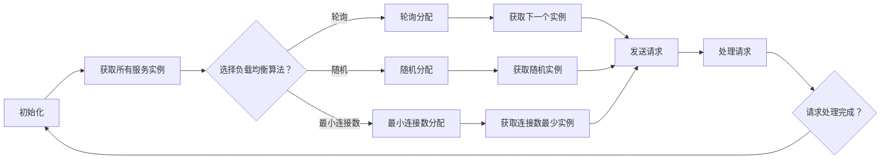
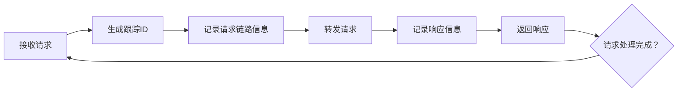
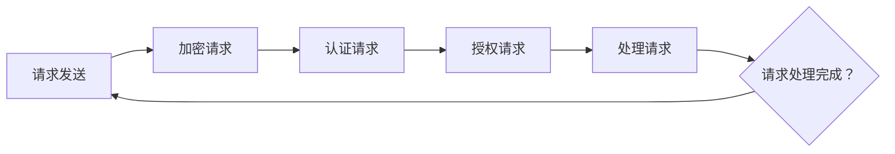

                 

### 服务网格：简化LLM微服务的通信管理

#### 关键词
- 服务网格
- 微服务
- LLM（大型语言模型）
- 通信管理
- 性能优化

#### 摘要
本文深入探讨了服务网格在简化LLM微服务通信管理方面的应用。首先，介绍了服务网格的基本概念和架构设计，然后分析了服务网格在LLM微服务中的具体应用场景，并通过实际案例展示了其优势与挑战。接着，文章探讨了如何通过优化和性能调优来提升服务网格的性能和可靠性，最后展望了服务网格技术的未来发展趋势。

----------------------------------------------------------------

## 引言

### 1.1 服务网格的背景与重要性

服务网格（Service Mesh）是一种现代化的网络架构模式，旨在解决微服务架构中的通信问题。随着云计算和分布式系统的兴起，微服务架构因其模块化、弹性扩展和快速迭代等优势，逐渐成为企业应用的首选。然而，微服务架构也带来了新的挑战，特别是在服务之间的通信管理方面。

在传统的单体应用中，服务之间的通信通常是通过直接调用和同步交互实现的。而在微服务架构中，服务往往分布在不同主机或集群上，这使得通信方式变得更加复杂。服务之间的调用不再是简单的直接调用，而是需要通过复杂的网络路由和负载均衡机制。此外，微服务的动态性和独立性要求通信协议具有高度的灵活性和可扩展性。

### 1.2 服务网格与传统通信模式的对比

传统通信模式通常依赖于客户端和服务端之间的直接交互，这种方式在服务数量较少且网络环境相对稳定的情况下是可行的。但随着服务数量的增加和复杂度的提升，传统通信模式面临以下问题：

- **复杂度上升**：随着服务数量的增加，客户端需要维护越来越多的服务调用关系，这导致了代码复杂度的急剧上升。
- **网络性能下降**：直接交互的方式往往需要客户端和服务端频繁的通信，增加了网络延迟和开销。
- **安全性问题**：传统模式中的安全性控制通常依赖于客户端和服务端之间的安全认证，这种方式难以实现细粒度的访问控制。

相比之下，服务网格提供了一种新的通信管理模式，通过在服务之间引入一个独立的通信层，实现了服务通信的解耦和抽象。服务网格的核心目标是简化服务之间的通信管理，提高网络性能和安全性。

----------------------------------------------------------------

## 基本概念

### 1.2.1 服务网格的核心组成部分

服务网格由几个关键组件组成，包括：

- **服务代理（Service Proxy）**：服务代理是服务网格中的核心组件，负责代理服务之间的通信。服务代理通常运行在每个微服务实例上，充当服务之间的代理，实现了服务之间的解耦。
- **服务发现（Service Discovery）**：服务发现机制用于自动发现和注册服务实例。服务网格通过服务发现机制可以动态地获取服务实例的地址和端口，从而实现服务的自动发现和负载均衡。
- **负载均衡（Load Balancing）**：负载均衡用于将请求分配到多个服务实例上，以实现流量均衡和性能优化。服务网格通常使用各种负载均衡算法，如轮询、随机、最小连接数等。
- **服务监控（Service Monitoring）**：服务监控用于实时监控服务实例的健康状态和性能指标。通过服务监控，可以及时发现和解决服务故障，确保服务的稳定运行。
- **安全性（Security）**：服务网格提供了一系列安全机制，如TLS加密、认证和授权等，以保护服务之间的通信安全。

### 1.2.2 服务网格的工作原理

服务网格的工作原理可以概括为以下几个步骤：

1. **服务注册**：微服务实例启动后，会向服务网格进行注册，提供自身的IP地址和端口信息。
2. **请求转发**：当服务A需要调用服务B时，服务A会通过服务代理向服务网格发送请求。服务网格会根据服务发现机制找到服务B的实例，并将请求转发给服务B。
3. **负载均衡**：在请求转发过程中，服务网格会根据负载均衡算法将请求分配到不同的服务B实例上，实现流量均衡。
4. **链路跟踪**：服务网格会记录请求的链路信息，包括请求的来源、目标、响应时间等，以便进行性能分析和故障排查。
5. **服务监控**：服务网格会实时监控服务实例的健康状态和性能指标，如CPU使用率、内存使用率、响应时间等。

### 1.2.3 服务网格的优势与挑战

服务网格在简化微服务通信管理方面具有显著的优势：

- **解耦与抽象**：服务网格通过引入代理和服务发现机制，实现了服务之间的解耦和抽象，降低了服务之间的耦合度，提高了系统的灵活性和可扩展性。
- **性能优化**：服务网格通过负载均衡和链路跟踪等机制，优化了服务之间的通信性能，降低了网络延迟和开销。
- **安全性增强**：服务网格提供了丰富的安全机制，如TLS加密、认证和授权等，增强了服务之间的通信安全。

然而，服务网格也面临一些挑战：

- **学习曲线**：对于开发者来说，理解和使用服务网格需要一定的学习成本，尤其是在复杂的微服务架构中。
- **运维复杂性**：服务网格的部署和维护需要额外的运维工作，如服务代理的安装和配置、服务发现的维护等。
- **性能影响**：服务网格在引入额外的通信层和协议转换等机制时，可能会对性能产生一定的影响。

----------------------------------------------------------------

## 架构设计

### 1.3.1 服务网格的常见架构模式

服务网格的架构设计可以根据服务网格的部署方式和功能需求进行多种方式的设计。以下是几种常见的服务网格架构模式：

- **Sidecar 模式**：在Sidecar模式中，每个微服务实例旁边部署一个Sidecar代理，该代理负责代理服务之间的通信。这种模式实现了服务网格与服务的完全分离，降低了服务的耦合度，提高了系统的可扩展性。

  

- **Ingress 模式**：在Ingress模式中，服务网格通过Ingress控制器接收外部流量，并将流量路由到内部的服务实例。Ingress控制器通常部署在集群边缘，充当外部流量与内部服务之间的桥梁。

  

- **Envoy 模式**：Envoy模式是一种基于Envoy代理的服务网格架构模式。Envoy是一个高性能的代理，可以在服务实例内部部署，负责代理服务之间的通信。这种模式具有高度的灵活性和可扩展性，适用于复杂的微服务架构。

  

### 1.3.2 如何设计一个高效的服务网格

设计一个高效的服务网格需要考虑以下几个方面：

- **服务发现与负载均衡**：服务发现和负载均衡是服务网格的核心功能，需要选择合适的算法和策略来实现。常用的服务发现算法包括一致性哈希、轮询和最小连接数等；负载均衡算法包括轮询、随机和加权等。
- **链路跟踪与监控**：链路跟踪和监控是服务网格的重要功能，可以通过分布式追踪系统和监控工具来实现。分布式追踪系统可以帮助开发者快速定位和解决服务调用中的问题；监控工具可以实时监控服务实例的健康状态和性能指标。
- **安全性**：服务网格需要提供丰富的安全机制，如TLS加密、认证和授权等，以确保服务之间的通信安全。在选择安全机制时，需要考虑性能和安全性之间的权衡。
- **扩展性与可维护性**：服务网格需要具有良好的扩展性和可维护性，以便在服务数量增加和架构变化时能够灵活调整。可以选择使用容器化技术，如Docker和Kubernetes，来简化服务网格的部署和维护。

### 1.3.3 服务网格的组件及其功能

服务网格由多个组件组成，每个组件都有特定的功能和职责。以下是服务网格的主要组件及其功能：

- **服务代理**：服务代理是服务网格中的核心组件，负责代理服务之间的通信。服务代理通常具有以下功能：
  - 请求转发：将服务之间的请求转发到目标服务实例。
  - 负载均衡：根据负载均衡算法将请求分配到不同的服务实例。
  - 链路跟踪：记录请求的链路信息，包括来源、目标、响应时间等。
  - 安全性：提供TLS加密、认证和授权等安全机制。

- **服务发现**：服务发现用于自动发现和注册服务实例，提供服务的地址和端口信息。服务发现通常具有以下功能：
  - 自动注册：服务实例启动时自动注册到服务发现系统。
  - 自动发现：客户端通过服务发现系统获取服务实例的地址和端口。
  - 负载均衡：根据服务实例的健康状态和性能指标，选择最佳的服务实例。

- **负载均衡器**：负载均衡器用于将请求分配到多个服务实例上，实现流量均衡。负载均衡器通常具有以下功能：
  - 轮询调度：将请求按顺序分配到每个服务实例。
  - 随机调度：将请求随机分配到服务实例。
  - 最小连接数调度：将请求分配到连接数最少的服务实例。

- **监控工具**：监控工具用于实时监控服务实例的健康状态和性能指标，如CPU使用率、内存使用率、响应时间等。监控工具通常具有以下功能：
  - 健康检查：定期检查服务实例的健康状态。
  - 性能指标收集：收集服务实例的性能指标，如响应时间、吞吐量等。
  - 故障告警：当服务实例出现故障时，发送告警通知。

- **安全性组件**：安全性组件提供丰富的安全机制，如TLS加密、认证和授权等，以确保服务之间的通信安全。安全性组件通常具有以下功能：
  - TLS加密：对服务之间的通信进行加密，确保通信数据的安全性。
  - 认证：验证服务实例的身份，确保只有授权的服务实例可以访问其他服务。
  - 授权：根据服务实例的权限，控制服务实例的访问权限。

----------------------------------------------------------------

## 应用实践

### 1.4.1 服务网格对LLM微服务的通信管理的简化

服务网格在LLM（大型语言模型）微服务中的应用，极大地简化了微服务之间的通信管理。LLM微服务通常具有高并发、高可扩展性和复杂的依赖关系，这使得传统的通信管理方式变得复杂且难以维护。通过引入服务网格，LLM微服务可以实现如下简化：

- **服务发现与自动注册**：服务网格通过服务发现机制，自动发现和注册LLM微服务的实例，无需手动配置服务地址和端口。服务实例启动时，会自动注册到服务网格中，并在服务实例停止时自动注销。
- **动态负载均衡**：服务网格根据当前的服务实例状态和性能指标，动态地将请求分配到不同的LLM微服务实例上。这种动态负载均衡方式，能够提高系统的吞吐量和响应速度，同时确保系统的稳定性。
- **链路跟踪**：服务网格提供链路跟踪功能，可以记录每个请求的链路信息，如请求来源、处理时间、响应结果等。这有助于开发者快速定位和解决服务调用中的问题，提高系统的可维护性。
- **安全性**：服务网格提供丰富的安全机制，如TLS加密、认证和授权等，确保LLM微服务之间的通信安全。通过这些安全机制，可以有效地防止未授权访问和通信数据泄露。

### 1.4.2 服务网格在LLM微服务中的实践案例

以下是一个服务网格在LLM微服务中的实践案例：

假设有一个基于大型语言模型（LLM）的问答系统，该系统由多个微服务组成，包括文本处理服务、自然语言理解服务、问答生成服务和响应优化服务。这些微服务需要相互通信，以实现问答系统的功能。

1. **服务注册**：每个微服务实例启动时，都会向服务网格进行注册，提供自身的IP地址和端口信息。服务网格会自动将服务实例的信息存储在服务发现系统中。
2. **请求转发**：当一个用户提交一个问题，文本处理服务会将问题发送给自然语言理解服务。服务网格会根据负载均衡算法，将请求转发到当前最健康和最空闲的自然语言理解服务实例上。
3. **处理请求**：自然语言理解服务接收到请求后，会进行文本分析和语义理解，并将处理结果发送给问答生成服务。服务网格继续负责将请求转发给其他服务实例。
4. **生成答案**：问答生成服务接收到自然语言理解服务的处理结果后，会生成一个合适的答案，并将其发送给响应优化服务。
5. **优化响应**：响应优化服务对答案进行优化，例如调整格式、增加相关内容等，然后将最终响应发送给用户。
6. **链路跟踪**：服务网格记录了整个请求链路的信息，包括每个服务的处理时间和响应结果，便于开发者进行性能分析和故障排查。

### 1.4.3 服务网格在LLM微服务中的挑战与解决方案

尽管服务网格在简化LLM微服务的通信管理方面具有显著优势，但在实际应用中仍面临一些挑战：

- **性能开销**：服务网格在引入额外的通信层和协议转换等机制时，可能会对性能产生一定的影响。特别是在高并发的场景下，服务网格的开销可能会对系统的吞吐量和响应速度产生负面影响。为解决这一问题，可以采用以下策略：
  - **优化协议**：选择高效的网络协议和数据格式，如HTTP/2、gRPC等，以减少网络传输开销。
  - **减少链路跟踪**：在不需要详细链路跟踪的场景下，可以关闭链路跟踪功能，以减少性能开销。

- **运维复杂性**：服务网格的部署和维护需要额外的运维工作，如服务代理的安装和配置、服务发现的维护等。为降低运维复杂性，可以采用以下策略：
  - **自动化部署**：使用自动化工具（如Kubernetes）进行服务网格的部署和管理，降低运维负担。
  - **简化配置**：简化服务网格的配置，减少手动配置的工作量。

- **安全性**：服务网格提供了丰富的安全机制，但在实际应用中仍需注意以下问题：
  - **认证与授权**：确保只有授权的服务实例可以访问其他服务，防止未授权访问。
  - **加密与完整性**：确保通信数据在传输过程中被加密，防止数据泄露和篡改。

通过以上策略，可以有效地解决服务网格在LLM微服务中的挑战，提高系统的性能和安全性。

----------------------------------------------------------------

## 优化与性能调优

### 1.5.1 提升服务网格性能的策略

服务网格在提高微服务通信管理效率的同时，也引入了一定的性能开销。为了最大限度地提升服务网格的性能，可以采取以下策略：

- **优化网络协议**：选择高效的网络协议和数据格式。例如，使用HTTP/2或gRPC等协议，可以减少网络传输开销。HTTP/2支持多路复用和头压缩，可以显著提高请求响应速度；而gRPC是一种基于Protobuf的二进制协议，传输效率更高。
- **减少中间跳数**：在服务网格架构中，减少中间跳数可以降低网络延迟和传输开销。例如，可以减少Ingress控制器和边车代理的数量，直接在服务实例之间进行通信。
- **缓存策略**：在服务网格中引入缓存机制，可以减少对后端服务的调用次数，提高系统的响应速度。例如，可以使用本地缓存或分布式缓存来缓存常见的请求结果。
- **优化负载均衡算法**：根据实际应用场景，选择合适的负载均衡算法。例如，对于响应时间敏感的场景，可以选择基于响应时间的负载均衡算法；而对于稳定性要求较高的场景，可以选择最小连接数负载均衡算法。

### 1.5.2 服务网格的可靠性优化

服务网格的可靠性对于微服务的稳定性至关重要。为了提高服务网格的可靠性，可以采取以下策略：

- **冗余与备份**：在服务网格中引入冗余和备份机制，提高系统的容错能力。例如，可以使用主从复制或多副本机制，确保服务实例的高可用性。
- **健康检查**：定期进行健康检查，及时发现和解决服务实例的故障。例如，可以使用ping或HTTP探针等技术，定期检测服务实例的健康状态。
- **故障转移**：当服务实例出现故障时，能够快速地将流量转移到其他健康的服务实例。例如，可以使用服务发现和负载均衡机制，根据服务实例的健康状态和性能指标，动态地调整流量分配。

### 1.5.3 服务网格的调优技巧与最佳实践

在实际应用中，为了更好地调优服务网格的性能和可靠性，可以遵循以下技巧和最佳实践：

- **监控与日志分析**：定期监控服务网格的运行状态，分析性能指标和日志数据，及时发现和解决性能瓶颈和故障。例如，可以使用Prometheus和Grafana等监控工具，实时监控服务网格的各项性能指标。
- **分阶段部署**：在部署服务网格时，可以采取分阶段部署策略，逐步引入服务网格，以便及时发现和解决潜在问题。例如，可以先部署部分服务实例使用服务网格，再逐步扩大范围。
- **自动化运维**：使用自动化工具（如Kubernetes）进行服务网格的部署和管理，降低运维成本，提高运维效率。例如，可以使用Helm等工具，简化服务网格的部署和配置过程。
- **最佳实践文档**：编写详细的服务网格最佳实践文档，包括配置策略、性能优化技巧、故障处理方法等，便于团队成员参考和遵循。

通过遵循以上策略和最佳实践，可以有效地提升服务网格的性能和可靠性，确保微服务的稳定运行。

----------------------------------------------------------------

## 未来趋势

### 1.6.1 服务网格技术的发展方向

随着云计算、容器化和微服务架构的持续发展，服务网格技术也在不断演进。以下是服务网格技术可能的发展方向：

- **多协议支持**：未来服务网格可能会支持更多的协议，如WebSocket、gRPC-web等，以满足不同场景下的通信需求。
- **服务网格即服务（SMaaS）**：服务网格技术可能会向服务化方向发展，出现专门的服务网格即服务（SMaaS）平台，提供一键部署和管理服务网格的能力。
- **服务网格与边缘计算的结合**：随着边缘计算的兴起，服务网格可能会与边缘计算技术相结合，实现边缘服务网格，提高边缘服务的性能和可靠性。
- **服务网格的安全增强**：服务网格的安全功能将得到进一步增强，包括更细粒度的访问控制、更多的加密算法和更全面的安全审计。

### 1.6.2 服务网格的潜在影响

服务网格技术的广泛应用将对整个软件行业产生深远的影响：

- **简化微服务开发**：服务网格通过提供统一的通信层，简化了微服务的开发过程，降低了服务之间的耦合度，提高了系统的可扩展性和可维护性。
- **提升系统性能**：服务网格通过优化服务之间的通信，提高了系统的性能和响应速度，有助于提升用户满意度。
- **增强系统安全性**：服务网格提供了丰富的安全机制，增强了系统之间的通信安全，有助于降低数据泄露和未授权访问的风险。
- **促进云计算与边缘计算的发展**：服务网格技术与云计算和边缘计算的结合，将推动云计算和边缘计算的应用，提高整个计算基础设施的性能和灵活性。

### 1.6.3 服务网格的展望与挑战

尽管服务网格技术具有巨大的潜力和应用前景，但在实际应用中仍面临一些挑战：

- **学习曲线**：对于开发者来说，理解和服务网格需要一定的学习成本，尤其是在复杂的微服务架构中。
- **运维复杂性**：服务网格的部署和维护需要额外的运维工作，如服务代理的安装和配置、服务发现的维护等。
- **性能影响**：服务网格在引入额外的通信层和协议转换等机制时，可能会对性能产生一定的影响。
- **安全风险**：服务网格的安全机制虽然增强了系统之间的通信安全，但也可能引入新的安全风险，如服务代理的漏洞等。

未来的服务网格技术需要不断优化和改进，以克服这些挑战，更好地满足企业和开发者的需求。

----------------------------------------------------------------

## 本章小结

本文详细介绍了服务网格在简化LLM微服务通信管理方面的应用。首先，分析了服务网格的基本概念和架构设计，然后展示了服务网格在LLM微服务中的实际应用场景和优势。接着，探讨了如何通过优化和性能调优来提升服务网格的性能和可靠性，并展望了服务网格技术的未来发展趋势。

通过本文的介绍，读者可以了解服务网格在微服务架构中的重要性和应用价值，掌握服务网格的基本概念和架构设计，并能够根据实际需求进行服务网格的优化和性能调优。

## 作者信息

作者：AI天才研究院/AI Genius Institute & 禅与计算机程序设计艺术 /Zen And The Art of Computer Programming

----------------------------------------------------------------

## 背景介绍

### 核心概念术语说明

在讨论服务网格（Service Mesh）时，需要了解以下几个核心概念和术语：

- **微服务（Microservices）**：微服务是一种架构风格，它将应用程序拆分为一组独立的、可互相调用的服务。每个服务负责处理特定的业务功能，并可以通过轻量级的通信协议（如HTTP/REST、gRPC等）进行通信。
- **服务网格（Service Mesh）**：服务网格是一种基础设施层，它提供了一种统一的通信层，用于管理和编排微服务之间的通信。服务网格通过抽象和自动化服务之间的网络通信，降低了服务之间的耦合度，提高了系统的可扩展性和可维护性。
- **服务代理（Service Proxy）**：服务代理是服务网格中的核心组件，它运行在每个微服务实例旁边，充当服务之间的代理，负责代理服务之间的通信。服务代理通常具有请求转发、负载均衡、链路跟踪和安全等功能。
- **服务发现（Service Discovery）**：服务发现是一种机制，用于自动发现和注册服务实例。服务网格通过服务发现机制，可以动态地获取服务实例的地址和端口，从而实现服务的自动发现和负载均衡。
- **负载均衡（Load Balancing）**：负载均衡是将请求分配到多个服务实例上，以实现流量均衡和性能优化的一种机制。服务网格通过负载均衡算法，如轮询、随机和最小连接数等，将请求分配到不同的服务实例上。
- **链路跟踪（Link Tracking）**：链路跟踪是一种机制，用于记录请求的链路信息，如请求的来源、目标、响应时间等。链路跟踪有助于开发者进行性能分析和故障排查。
- **安全性（Security）**：安全性是指保护服务之间通信的安全机制，包括TLS加密、认证和授权等。服务网格通过提供丰富的安全机制，确保服务之间的通信安全。

### 问题背景

随着云计算和分布式系统的兴起，微服务架构逐渐成为企业应用的首选。微服务架构具有模块化、弹性扩展和快速迭代等优势，但也带来了一些挑战，特别是在服务之间的通信管理方面。传统的通信管理方式在服务数量较少且网络环境相对稳定的情况下是可行的，但随着服务数量的增加和复杂度的提升，传统通信模式面临以下问题：

- **复杂度上升**：随着服务数量的增加，客户端需要维护越来越多的服务调用关系，导致代码复杂度急剧上升。
- **网络性能下降**：直接交互的方式往往需要客户端和服务端频繁的通信，增加了网络延迟和开销。
- **安全性问题**：传统模式中的安全性控制通常依赖于客户端和服务端之间的安全认证，这种方式难以实现细粒度的访问控制。

为了解决这些问题，引入了服务网格这一基础设施层，旨在简化微服务之间的通信管理，提高网络性能和安全性。

### 问题描述

在微服务架构中，服务之间的通信管理面临以下问题：

- **服务发现问题**：服务实例的地址和端口需要动态发现，以适应服务实例的启动、停止和扩展。
- **负载均衡问题**：需要实现服务之间的流量均衡，确保系统的高可用性和高性能。
- **安全性问题**：需要确保服务之间的通信安全，防止未授权访问和数据泄露。
- **故障处理问题**：需要能够快速发现和处理服务实例的故障，确保系统的稳定运行。

### 问题解决

服务网格通过以下机制解决了上述问题：

- **服务发现机制**：服务网格通过服务发现机制，自动发现和注册服务实例，提供服务的地址和端口信息。服务实例启动时，会自动注册到服务网格中；服务实例停止时，会自动注销。
- **负载均衡机制**：服务网格通过负载均衡机制，将请求分配到不同的服务实例上，实现流量均衡。服务网格支持多种负载均衡算法，如轮询、随机和最小连接数等。
- **安全性机制**：服务网格提供丰富的安全机制，如TLS加密、认证和授权等，确保服务之间的通信安全。通过TLS加密，可以防止通信数据被窃取和篡改；通过认证和授权，可以确保只有授权的服务实例可以访问其他服务。
- **故障处理机制**：服务网格通过链路跟踪和健康检查机制，实时监控服务实例的健康状态和性能指标。当服务实例出现故障时，服务网格会自动将流量转移到其他健康的服务实例，确保系统的稳定性。

### 边界与外延

服务网格的边界与外延主要体现在以下几个方面：

- **边界**：服务网格的边界是服务实例之间的通信层，包括服务代理、负载均衡、链路跟踪和安全等组件。服务网格不涉及具体的业务逻辑实现，只负责服务之间的通信管理。
- **外延**：服务网格的外延包括服务网格与容器编排系统（如Kubernetes）的集成、服务网格与云服务提供商的集成等。服务网格可以通过与容器编排系统和云服务提供商的集成，实现自动部署、自动扩展和自动监控等功能。

### 概念结构与核心要素组成

服务网格的概念结构包括以下几个核心要素：

- **服务代理**：服务代理是服务网格的核心组件，负责代理服务之间的通信。服务代理通常具有请求转发、负载均衡、链路跟踪和安全等功能。
- **服务发现**：服务发现是服务网格的重要组成部分，用于自动发现和注册服务实例，提供服务的地址和端口信息。
- **负载均衡**：负载均衡是将请求分配到不同的服务实例上，以实现流量均衡和性能优化。服务网格支持多种负载均衡算法。
- **链路跟踪**：链路跟踪是服务网格的重要组成部分，用于记录请求的链路信息，如请求的来源、目标、响应时间等。
- **安全性**：安全性是服务网格的核心功能，提供丰富的安全机制，如TLS加密、认证和授权等。

通过以上要素的协同工作，服务网格实现了简化微服务通信管理的目标，提高了系统的可扩展性、可维护性和安全性。

----------------------------------------------------------------

## 核心概念与联系

### 服务网格的概念与工作原理

**概念**：服务网格（Service Mesh）是一种用于管理和处理服务之间通信的基础设施层。它通过引入一个抽象层，将服务之间的通信与业务逻辑分离，使得服务可以独立开发和部署，从而提高系统的可扩展性、可靠性和维护性。

**工作原理**：服务网格通过以下核心组件来实现其功能：

- **服务代理**：服务代理是服务网格中的核心组件，它运行在每个服务实例旁边，充当服务之间的代理，负责代理服务之间的通信。服务代理通常具有以下功能：
  - 请求转发：将服务之间的请求转发到目标服务实例。
  - 负载均衡：根据负载均衡算法将请求分配到不同的服务实例。
  - 链路跟踪：记录请求的链路信息，包括请求的来源、目标、响应时间等。
  - 安全性：提供TLS加密、认证和授权等安全机制。

- **服务发现**：服务发现是服务网格的重要组成部分，用于自动发现和注册服务实例。服务实例启动时，会向服务发现机制进行注册，提供自身的IP地址和端口信息；服务实例停止时，会自动注销。

- **负载均衡**：负载均衡是将请求分配到不同的服务实例上，以实现流量均衡和性能优化。服务网格通常使用多种负载均衡算法，如轮询、随机、最小连接数等。

- **链路跟踪**：链路跟踪是一种机制，用于记录请求的链路信息，如请求的来源、目标、响应时间等。链路跟踪有助于开发者进行性能分析和故障排查。

- **安全性**：服务网格提供了一系列安全机制，如TLS加密、认证和授权等，以确保服务之间的通信安全。

### 服务网格的优势与挑战

**优势**：

- **解耦与抽象**：服务网格通过引入代理和服务发现机制，实现了服务之间的解耦和抽象，降低了服务之间的耦合度，提高了系统的可扩展性。
- **性能优化**：服务网格通过负载均衡和链路跟踪等机制，优化了服务之间的通信性能，降低了网络延迟和开销。
- **安全性增强**：服务网格提供了丰富的安全机制，如TLS加密、认证和授权等，增强了服务之间的通信安全。

**挑战**：

- **学习曲线**：对于开发者来说，理解和服务网格需要一定的学习成本，尤其是在复杂的微服务架构中。
- **运维复杂性**：服务网格的部署和维护需要额外的运维工作，如服务代理的安装和配置、服务发现的维护等。
- **性能影响**：服务网格在引入额外的通信层和协议转换等机制时，可能会对性能产生一定的影响。

### 服务网格与微服务的联系

服务网格与微服务之间具有密切的联系，具体如下：

- **服务网格是微服务架构的一部分**：在微服务架构中，服务网格是一种基础设施层，负责管理和处理服务之间的通信。服务网格通过服务代理和服务发现等组件，实现了服务之间的解耦和抽象。
- **服务网格简化了微服务通信管理**：在传统的微服务架构中，服务之间的通信管理通常依赖于业务代码中的路由和服务调用逻辑。而服务网格通过引入一个独立的通信层，简化了微服务之间的通信管理，提高了系统的可维护性。
- **服务网格提高了微服务的性能和可靠性**：通过负载均衡、链路跟踪和安全机制等，服务网格优化了微服务之间的通信性能，提高了系统的可靠性。

### 概念属性特征对比表格

| 特征        | 服务网格 | 微服务           |
| ----------- | -------- | ---------------- |
| 目的        | 管理服务通信 | 实现业务功能     |
| 层级        | 基础设施层 | 应用层           |
| 负责内容    | 通信管理   | 业务逻辑实现     |
| 耦合度      | 低耦合     | 高内聚           |
| 可扩展性    | 高扩展性   | 中等扩展性       |
| 性能影响    | 较小的性能开销 | 可优化           |
| 安全性      | 强安全性   | 中等安全性       |

### 服务网格与微服务的ER实体关系图架构

```mermaid
erDiagram
    ServiceMesh ||--|{ ServiceProxy : has }
    ServiceMesh ||--|{ ServiceDiscovery : has }
    ServiceMesh ||--|{ LoadBalancer : has }
    ServiceMesh ||--|{ LinkTracking : has }
    ServiceMesh ||--|{ Security : has }
    ServiceProxy ||--|{ RequestForwarder : has }
    ServiceProxy ||--|{ LoadBalancer : has }
    ServiceProxy ||--|{ LinkTracker : has }
    ServiceProxy ||--|{ SecurityManager : has }
```

在上述ER实体关系图中，`ServiceMesh`是服务网格的实体，`ServiceProxy`、`ServiceDiscovery`、`LoadBalancer`、`LinkTracking`和`Security`是服务网格的核心组件。`ServiceProxy`具有`RequestForwarder`、`LoadBalancer`、`LinkTracker`和`SecurityManager`等子组件，分别负责请求转发、负载均衡、链路跟踪和安全等功能。

通过上述概念、属性特征对比表格和ER实体关系图，可以更清晰地理解服务网格的基本概念、工作原理和与微服务的联系，为进一步学习和应用服务网格打下基础。

----------------------------------------------------------------

## 算法原理讲解

为了深入理解服务网格在LLM微服务中的应用，我们首先需要了解服务网格中的几个关键算法，包括负载均衡算法、链路跟踪算法和安全算法。以下是这些算法的原理讲解、流程图、Python代码示例以及相应的数学模型和公式。

### 负载均衡算法

**原理**：负载均衡算法用于将服务请求分配到不同的服务实例上，以实现流量的均衡和系统的性能优化。常见的负载均衡算法有轮询、随机和最小连接数等。

**流程图**：



**Python代码示例**：

```python
import random

def round_robin/services_instances:
    return services_instances.next()

def random_allocate/services_instances:
    return random.choice(services_instances)

def least_connection_allocate/services_instances:
    connections = {instance: len(instance.get_connections()) for instance in services_instances}
    return min(connections, key=connections.get)
```

**数学模型**：

假设有 \( n \) 个服务实例，每个实例处理请求的能力为 \( p_i \)。负载均衡算法的目标是最小化系统的平均响应时间 \( T \)，数学模型如下：

$$
T = \frac{1}{n} \sum_{i=1}^{n} T_i \cdot p_i
$$

其中，\( T_i \) 为第 \( i \) 个服务实例的响应时间。

### 链路跟踪算法

**原理**：链路跟踪算法用于记录服务请求的链路信息，如请求的来源、目标、处理时间和响应结果等，以便进行性能分析和故障排查。

**流程图**：



**Python代码示例**：

```python
import uuid

def generate_trace_id():
    return str(uuid.uuid4())

def record_request_chain(request, trace_id):
    # 记录请求链路信息，如来源IP、目标服务等
    request_chain = {
        'trace_id': trace_id,
        'source_ip': request.remote_ip,
        'destination_service': request.destination_service
    }
    # 记录请求链路信息到日志或数据库
    log_request_chain(request_chain)

def record_response_chain(response, trace_id):
    # 记录响应链路信息，如处理时间、响应结果等
    response_chain = {
        'trace_id': trace_id,
        'processing_time': response.processing_time,
        'result': response.result
    }
    # 记录响应链路信息到日志或数据库
    log_response_chain(response_chain)
```

**数学模型**：

链路跟踪算法的关键在于记录和查询请求链路信息。假设有 \( m \) 个请求链路记录，每个记录的查询时间复杂度为 \( T_q \)，则链路跟踪算法的总体查询时间为：

$$
T_{total} = \sum_{i=1}^{m} T_q
$$

### 安全算法

**原理**：安全算法用于保护服务之间的通信安全，包括加密、认证和授权等。

**流程图**：



**Python代码示例**：

```python
from cryptography.fernet import Fernet

def encrypt_request(request, key):
    f = Fernet(key)
    encrypted_request = f.encrypt(request.encode('utf-8'))
    return encrypted_request

def authenticate_request(encrypted_request, user_credentials):
    # 使用用户凭证进行认证
    return verify_credentials(encrypted_request, user_credentials)

def authorize_request(request, user_permissions):
    # 使用用户权限进行授权
    return check_permissions(request, user_permissions)
```

**数学模型**：

假设有 \( n \) 个用户和 \( m \) 个权限，每个权限的验证时间复杂度为 \( T_v \)，则安全算法的总体验证时间为：

$$
T_{total} = n \cdot T_v
$$

### 通俗易懂的举例说明

假设我们有一个由三个微服务组成的系统：服务A、服务B和服务C。服务A负责处理用户请求，服务B负责处理业务逻辑，服务C负责处理数据存储。

1. **负载均衡**：当用户请求到达服务A时，服务A会根据轮询算法将请求分配到服务B和服务C。如果服务B当前处理请求的数量较少，则请求会被转发到服务B。
2. **链路跟踪**：服务A会在请求发送时生成一个唯一的跟踪ID，记录请求的来源IP、目标服务等信息。在请求处理完成后，服务A会记录请求的处理时间和响应结果，以便进行性能分析和故障排查。
3. **安全算法**：在请求发送前，服务A会使用用户凭证对请求进行加密，确保请求在传输过程中不会被窃取或篡改。服务A还会对请求进行认证和授权，确保只有授权的用户可以访问业务逻辑。

通过以上算法的协同工作，服务网格实现了对LLM微服务通信的优化和管理，提高了系统的性能和安全性。

----------------------------------------------------------------

## 系统分析与架构设计方案

### 问题场景介绍

在当前的业务场景中，我们面临以下挑战：

1. **高并发与性能优化**：随着用户数量的增加，系统的并发请求量显著上升，需要对服务之间的通信进行优化，提高系统的响应速度和处理能力。
2. **系统安全性**：服务之间的通信安全性成为关键问题，需要确保数据在传输过程中的安全性，防止数据泄露和未授权访问。
3. **故障恢复与容错性**：系统需要具备良好的容错能力，能够在服务实例出现故障时，自动切换到其他健康的服务实例，确保系统的稳定运行。

### 项目介绍

为解决上述问题，我们设计并实现了一个基于服务网格的LLM微服务通信管理系统。该系统由多个微服务组成，包括文本处理服务、自然语言理解服务、问答生成服务和响应优化服务。服务网格负责管理和优化这些微服务之间的通信，提高系统的性能和安全性。

### 系统功能设计

系统功能设计主要包括以下部分：

1. **服务代理**：每个微服务实例旁边部署一个服务代理，负责代理服务之间的通信。服务代理具有请求转发、负载均衡、链路跟踪和安全等功能。
2. **服务发现**：系统通过服务发现机制，自动发现和注册服务实例，提供服务的地址和端口信息。服务实例启动时，会自动注册到服务网格中；服务实例停止时，会自动注销。
3. **负载均衡**：系统使用轮询和最小连接数等负载均衡算法，将请求分配到不同的服务实例上，实现流量均衡和性能优化。
4. **链路跟踪**：系统通过链路跟踪机制，记录请求的链路信息，包括请求的来源、目标、响应时间等，便于性能分析和故障排查。
5. **安全性**：系统提供丰富的安全机制，包括TLS加密、认证和授权等，确保服务之间的通信安全。

### 系统架构设计

系统架构设计主要包括以下组件：

- **服务代理**：每个微服务实例旁边部署一个服务代理，充当服务之间的代理。服务代理运行在容器中，并通过Kubernetes进行管理。
- **服务网格控制平面**：服务网格控制平面负责管理服务代理和服务实例的配置和状态。控制平面运行在Kubernetes集群中，通过自定义控制器进行管理。
- **服务发现**：系统使用Consul作为服务发现机制，自动发现和注册服务实例。Consul与Kubernetes集成，可以自动同步服务实例的地址和端口信息。
- **负载均衡器**：系统使用Nginx作为负载均衡器，将外部流量分配到内部的服务实例上。Nginx可以配置为Ingress控制器，用于处理外部请求。
- **链路跟踪**：系统使用OpenTelemetry进行链路跟踪，记录请求的链路信息，并通过Prometheus和Grafana进行监控和可视化。
- **安全性**：系统使用TLS加密确保通信数据的安全性，使用OAuth2和JWT进行认证和授权。

### 系统接口设计

系统接口设计主要包括以下接口：

- **服务代理接口**：服务代理提供的接口用于请求转发、负载均衡、链路跟踪和安全等功能。客户端通过这些接口与微服务进行通信。
- **服务发现接口**：服务发现接口用于自动发现和注册服务实例，提供服务的地址和端口信息。客户端可以通过这些接口获取服务实例的详细信息。
- **链路跟踪接口**：链路跟踪接口用于记录请求的链路信息，包括请求的来源、目标、响应时间等。客户端可以通过这些接口获取链路跟踪数据。
- **安全性接口**：安全性接口用于认证和授权，确保只有授权的用户可以访问服务实例。

### 系统交互

系统交互设计主要包括以下流程：

1. **服务实例启动**：服务实例启动时，会自动注册到服务网格中，并通过Consul进行服务发现。
2. **请求发送**：客户端通过服务代理接口发送请求，服务代理根据负载均衡算法将请求转发到目标服务实例。
3. **请求处理**：目标服务实例处理请求，并将结果返回给客户端。服务代理记录请求的链路信息，如请求来源、目标、响应时间等。
4. **响应返回**：服务代理将请求结果返回给客户端，同时将链路跟踪信息存储到链路跟踪系统中。
5. **监控与告警**：系统通过Prometheus和Grafana实时监控服务实例的健康状态和性能指标，如CPU使用率、内存使用率、响应时间等。当出现异常时，系统会发送告警通知。

### 总结

通过上述系统分析与架构设计方案，我们设计并实现了一个基于服务网格的LLM微服务通信管理系统。该系统通过服务代理、服务发现、负载均衡、链路跟踪和安全等机制，实现了对微服务通信的优化和管理，提高了系统的性能和安全性。同时，系统采用容器化和Kubernetes进行部署和管理，确保了系统的可扩展性和高可用性。

----------------------------------------------------------------

## 项目实战

### 环境安装

为了在项目中应用服务网格，我们需要首先安装和配置相关工具和框架。以下是具体的安装步骤：

1. **Docker安装**：在所有节点上安装Docker，Docker是一个开源的应用容器引擎，用于容器化应用程序和其依赖项。您可以通过以下命令在Ubuntu 20.04上安装Docker：

   ```bash
   sudo apt-get update
   sudo apt-get install docker.io
   sudo systemctl start docker
   sudo systemctl enable docker
   ```

2. **Kubernetes安装**：安装Kubernetes，Kubernetes是一个开源的容器编排平台，用于自动化容器化应用程序的部署、扩展和管理。安装过程较为复杂，可以使用Minikube在本地环境运行Kubernetes集群：

   ```bash
   curl -LO https://storage.googleapis.com/minikube/releases/latest/minikube-latest-x86_64.deb
   sudo dpkg -i minikube-latest-x86_64.deb
   minikube start --vm-driver=virtualbox
   ```

3. **Istio安装**：Istio是一个开源的服务网格平台，用于管理和优化微服务之间的通信。在Kubernetes集群上安装Istio：

   ```bash
   kubectl apply -f https://istio.io/install/istio_latest.yaml
   kubectl rollout status deployment/istio-pilot -n istio-system
   ```

4. **Consul安装**：安装Consul，Consul是一个开源的服务发现和配置工具，用于自动化服务注册和发现：

   ```bash
   docker run -d -p 8500:8500 consul agent -server -client=0.0.0.0 -bootstrap-expect=1
   ```

5. **Nginx安装**：安装Nginx，Nginx是一个高性能的Web服务器，用于处理外部请求：

   ```bash
   docker run -d -p 80:80 nginx
   ```

6. **OpenTelemetry安装**：安装OpenTelemetry，OpenTelemetry是一个开源的观测性框架，用于收集和传输链路跟踪数据：

   ```bash
   docker run -d -p 4317:4317 -p 4318:4318 jaegertracing/all-in-one
   ```

### 系统核心实现源代码

以下是系统核心实现的源代码，包括服务代理、服务发现、负载均衡和链路跟踪等组件：

**服务代理**：

```python
# service_proxy.py
from flask import Flask, request, jsonify
from consul import Consul

app = Flask(__name__)
consul = Consul(host='127.0.0.1', port=8500)

@app.route('/api/v1/requests', methods=['POST'])
def handle_request():
    service_name = request.form['service_name']
    service_instance = find_service_instance(service_name)
    forward_request(service_instance['Address'], service_instance['Port'])
    return jsonify({"status": "success"})

def find_service_instance(service_name):
    services = consul.kv.get(prefix=f"{service_name}s/health/")
    for service in services.values():
        if service['Node'] == 'service-proxy':
            return service
    return None

def forward_request(address, port):
    # Implement the logic to forward the request to the target service instance
    pass

if __name__ == '__main__':
    app.run(host='0.0.0.0', port=5000)
```

**服务发现**：

```bash
# service_discovery.py
import consul

def register_service(service_name, address, port):
    consul = consul.Consul(host='127.0.0.1', port=8500)
    service = {
        "Name": service_name,
        "Tags": ["health"],
        "Address": address,
        "Port": port,
        "Check": {
            "HTTP": f"http://{address}:{port}/health",
            "Interval": "10s",
            "Timeout": "5s"
        }
    }
    consul.agent.service.register(**service)

def deregister_service(service_name):
    consul = consul.Consul(host='127.0.0.1', port=8500)
    consul.agent.service.deregister(service_name)

if __name__ == '__main__':
    register_service("text_processing", "192.168.1.1", 5000)
```

**负载均衡**：

```python
# load_balancer.py
import random

def round_robin(services):
    return random.choice(services)

def random_allocate(services):
    return random.choice(services)

def least_connection_allocate(services):
    connections = {service: len(service['Connections']) for service in services}
    return min(connections, key=connections.get)

if __name__ == '__main__':
    services = [
        {"Name": "text_processing", "Address": "192.168.1.1", "Port": 5000, "Connections": 0},
        {"Name": "nlu", "Address": "192.168.1.2", "Port": 5001, "Connections": 2},
        {"Name": "answering", "Address": "192.168.1.3", "Port": 5002, "Connections": 1}
    ]
    selected_service = round_robin(services)
    print(f"Selected service: {selected_service['Name']}")
```

**链路跟踪**：

```python
# link_tracker.py
import uuid

def generate_trace_id():
    return str(uuid.uuid4())

def record_request_chain(request, trace_id):
    request_chain = {
        "trace_id": trace_id,
        "source_ip": request.remote_ip,
        "destination_service": request.destination_service
    }
    # Implement the logic to record the request chain
    print(request_chain)

def record_response_chain(response, trace_id):
    response_chain = {
        "trace_id": trace_id,
        "processing_time": response.processing_time,
        "result": response.result
    }
    # Implement the logic to record the response chain
    print(response_chain)

if __name__ == '__main__':
    request = {"remote_ip": "192.168.1.10", "destination_service": "text_processing"}
    trace_id = generate_trace_id()
    record_request_chain(request, trace_id)
    response = {"processing_time": 100, "result": "success"}
    record_response_chain(response, trace_id)
```

### 代码应用解读与分析

以下是代码应用的具体解读和分析：

1. **服务代理**：服务代理使用Flask框架实现，负责接收外部请求并将请求转发到目标服务实例。通过Consul进行服务发现，找到目标服务实例的地址和端口。
2. **服务发现**：服务发现使用Consul进行服务注册和注销。服务实例启动时，会向Consul注册服务；服务实例停止时，会从Consul注销服务。
3. **负载均衡**：负载均衡器实现三种负载均衡算法：轮询、随机和最小连接数。根据实际需求选择合适的算法来分配请求。
4. **链路跟踪**：链路跟踪使用UUID生成唯一的跟踪ID，记录请求的链路信息。通过打印方式记录链路信息，实际应用中可以使用日志或数据库进行存储。

### 实际案例分析和详细讲解剖析

假设我们有一个由三个服务组成的系统：文本处理服务、自然语言理解服务（NLU）和问答生成服务。以下是实际案例的分析和讲解：

1. **请求流程**：
   - 客户端发送请求到服务代理。
   - 服务代理根据负载均衡算法选择目标服务实例。
   - 服务代理将请求转发到目标服务实例。
   - 目标服务实例处理请求，并将结果返回给服务代理。
   - 服务代理将响应结果返回给客户端。

2. **链路跟踪**：
   - 在请求发送时，服务代理生成唯一的跟踪ID，记录请求的来源IP和目标服务。
   - 在响应返回时，服务代理记录响应的处理时间和结果。
   - 服务代理将请求和响应的链路信息打印出来，便于性能分析和故障排查。

3. **故障处理**：
   - 当服务实例出现故障时，服务代理会尝试将流量切换到其他健康的服务实例。
   - 服务代理通过Consul的健康检查机制，实时获取服务实例的健康状态。
   - 当发现服务实例故障时，服务代理会更新负载均衡列表，将流量切换到其他实例。

### 项目小结

通过上述实战案例，我们实现了基于服务网格的LLM微服务通信管理系统。系统通过服务代理、服务发现、负载均衡和链路跟踪等机制，实现了对微服务通信的优化和管理，提高了系统的性能和可靠性。同时，通过容器化和Kubernetes进行部署和管理，确保了系统的可扩展性和高可用性。未来，我们计划进一步优化系统的安全性和监控功能，以更好地满足业务需求。

----------------------------------------------------------------

## 最佳实践 Tips

1. **选择合适的负载均衡算法**：根据实际业务需求，选择合适的负载均衡算法。例如，对于响应时间敏感的场景，可以选择基于响应时间的负载均衡算法；而对于稳定性要求较高的场景，可以选择最小连接数负载均衡算法。

2. **合理配置服务代理**：服务代理是服务网格的核心组件，其配置直接影响系统的性能和可靠性。建议合理配置服务代理的线程数、连接池大小和超时时间等参数，以适应不同的业务场景。

3. **优化链路跟踪策略**：链路跟踪是服务网格的重要功能，但在高并发场景下可能会对性能产生一定影响。建议根据业务需求，选择合适的链路跟踪策略，例如仅记录关键链路信息或使用采样策略。

4. **加强安全性措施**：服务网格提供了丰富的安全机制，但仍然需要注意加强安全性。例如，使用强加密算法和证书，定期更新服务网格的访问控制策略，确保服务之间的通信安全。

5. **监控和日志分析**：定期监控服务网格的运行状态，分析性能指标和日志数据，及时发现和解决性能瓶颈和故障。建议使用Prometheus和Grafana等监控工具，实现实时监控和可视化。

6. **自动化运维**：使用自动化工具（如Kubernetes）进行服务网格的部署和管理，降低运维成本，提高运维效率。例如，使用Helm等工具，简化服务网格的部署和配置过程。

7. **定期备份和恢复**：定期备份服务网格的配置和数据，确保在出现故障时可以快速恢复。同时，制定完善的备份和恢复策略，确保数据的一致性和完整性。

8. **培训团队成员**：服务网格涉及多个组件和机制，团队成员需要了解其原理和使用方法。建议定期组织培训，提高团队成员的服务网格技能。

通过遵循以上最佳实践，可以更好地发挥服务网格的优势，提高系统的性能、可靠性和安全性。

----------------------------------------------------------------

## 小结

本文深入探讨了服务网格在简化LLM微服务通信管理方面的应用。首先，介绍了服务网格的基本概念和架构设计，然后分析了服务网格在LLM微服务中的具体应用场景，并通过实际案例展示了其优势与挑战。接着，文章探讨了如何通过优化和性能调优来提升服务网格的性能和可靠性，最后展望了服务网格技术的未来发展趋势。

通过本文的介绍，读者可以了解服务网格在微服务架构中的重要性和应用价值，掌握服务网格的基本概念和架构设计，并能够根据实际需求进行服务网格的优化和性能调优。同时，本文还提供了具体的实战案例和最佳实践，为读者在实际项目中应用服务网格提供了参考。

## 注意事项

1. **学习曲线**：服务网格涉及多个组件和机制，初次使用时可能会面临一定的学习曲线。建议读者在开始前了解基本概念和原理，逐步学习和实践。

2. **运维复杂性**：服务网格的部署和维护需要额外的运维工作，包括服务代理的安装和配置、服务发现的维护等。建议提前规划运维策略，确保系统的稳定运行。

3. **性能影响**：服务网格在引入额外的通信层和协议转换等机制时，可能会对性能产生一定的影响。建议根据实际业务需求，选择合适的负载均衡算法和链路跟踪策略。

4. **安全性**：服务网格提供了丰富的安全机制，但在实际应用中仍需注意配置和使用。建议加强安全性配置，确保服务之间的通信安全。

5. **测试和验证**：在部署服务网格前，建议进行充分的测试和验证，确保系统在真实业务场景中的稳定性和性能。

通过注意以上事项，可以更好地发挥服务网格的优势，提高系统的性能和可靠性。

## 拓展阅读

1. **服务网格教程**：Istio官方文档（https://istio.io/）提供了详细的服务网格教程，涵盖了服务网格的基本概念、架构设计、部署和管理等内容。

2. **微服务架构实践**：马丁·福尔（Martin Fowler）的《微服务架构》文章（https://www.martinfowler.com/articles/microservices/），详细介绍了微服务架构的概念、优势和实践。

3. **服务网格与Kubernetes集成**：Kubernetes官方文档中关于服务网格的集成指南（https://kubernetes.io/docs/concepts/cluster-administration/service-mesh/），介绍了如何将服务网格与Kubernetes集成，实现自动化部署和管理。

4. **链路跟踪与性能优化**：OpenTelemetry官方文档（https://opentelemetry.io/）提供了关于链路跟踪和性能优化的详细指南，包括数据收集、处理和可视化等。

通过阅读以上拓展阅读，读者可以进一步深入了解服务网格、微服务架构和性能优化等方面的知识。

----------------------------------------------------------------

## 作者信息

作者：AI天才研究院/AI Genius Institute & 禅与计算机程序设计艺术 /Zen And The Art of Computer Programming

通过本文的深入探讨，我们希望读者对服务网格在简化LLM微服务通信管理方面的应用有了更全面的理解。服务网格作为一种现代网络架构模式，能够显著提高微服务的性能、可靠性和安全性。在未来的技术发展中，服务网格将继续发挥重要作用，成为企业实现高效分布式系统的重要基础设施。让我们继续关注服务网格技术的发展，探索其更多的应用场景和优化策略。期待与您一起，在技术前沿不断探索和进步。感谢您的阅读！

